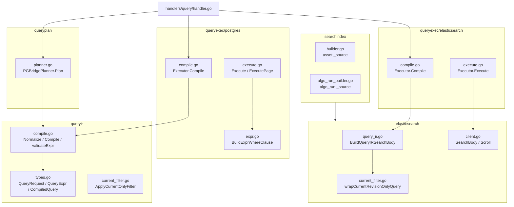
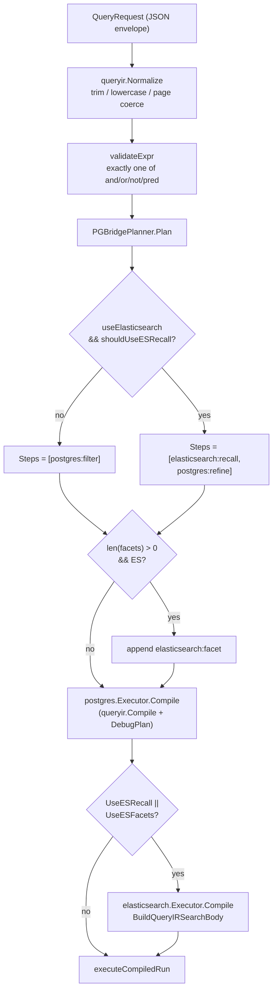
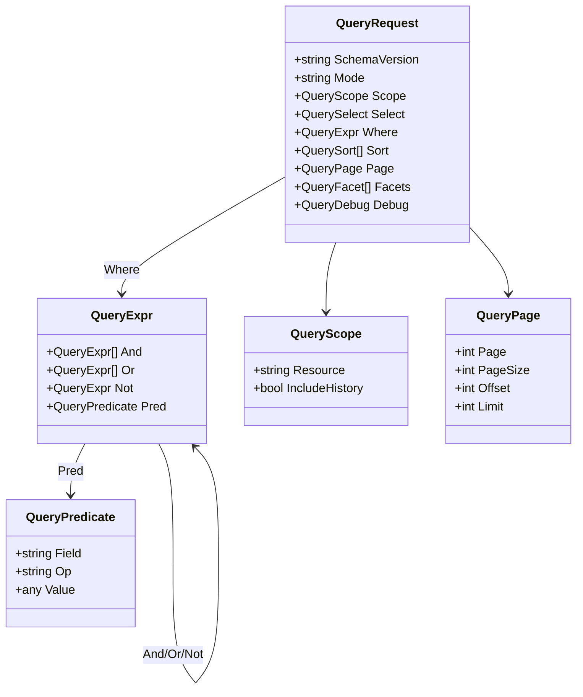
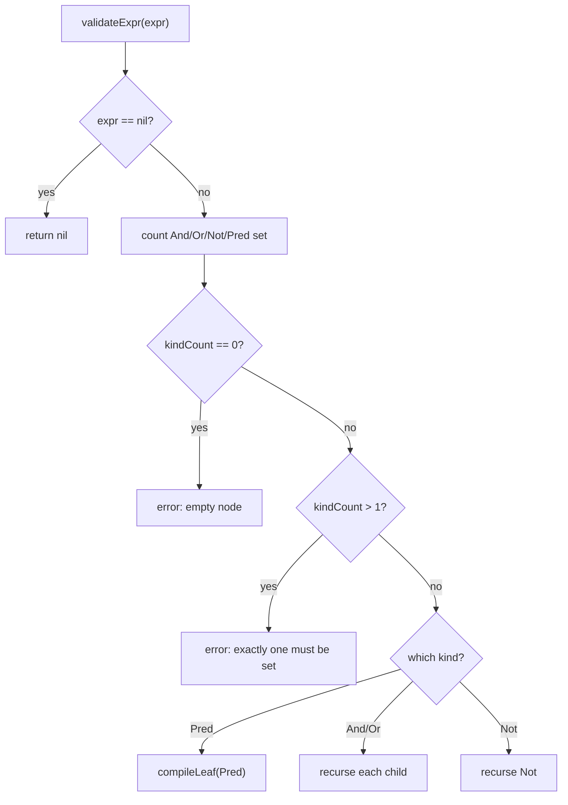
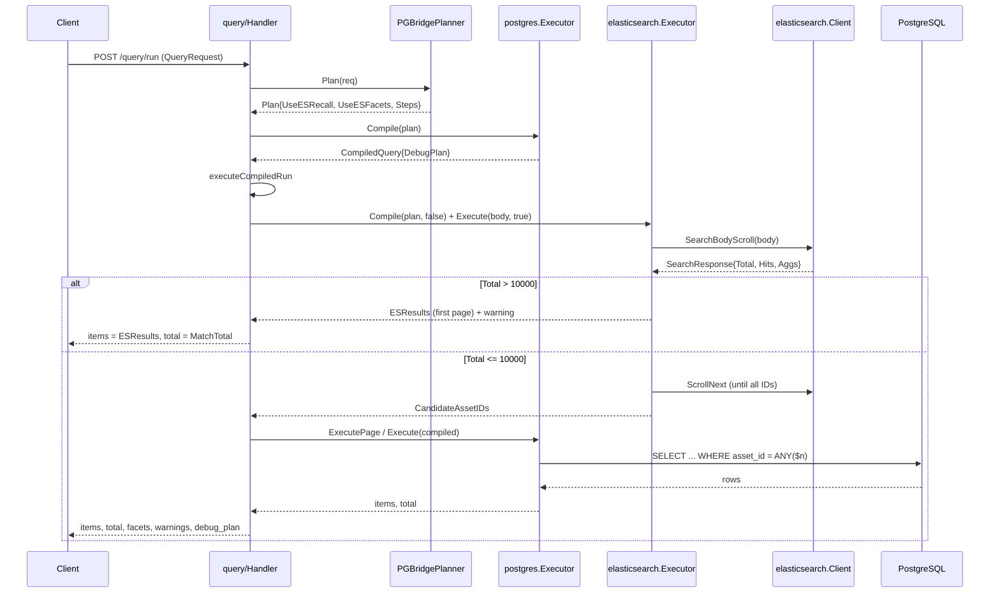
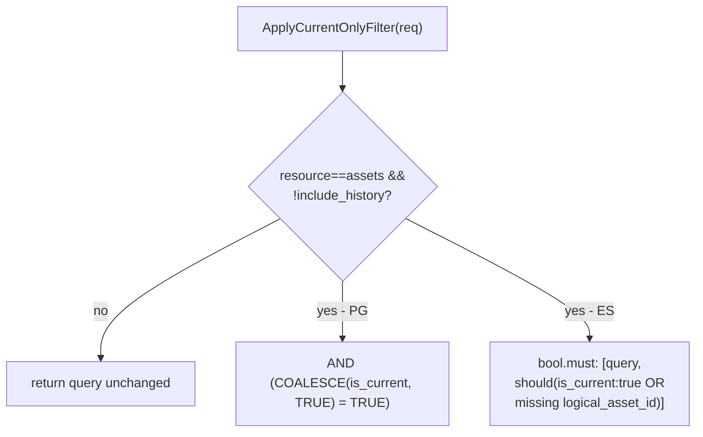
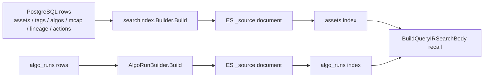
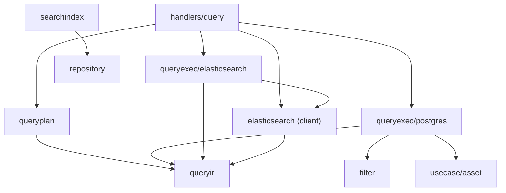

# Search & Query Architecture

<cite>
**Referenced Files in This Document**

- [backend/internal/queryir/compile.go](file://backend/internal/queryir/compile.go)
- [backend/internal/queryir/current_filter.go](file://backend/internal/queryir/current_filter.go)
- [backend/internal/queryir/types.go](file://backend/internal/queryir/types.go)
- [backend/internal/queryplan/planner.go](file://backend/internal/queryplan/planner.go)
- [backend/internal/queryexec/elasticsearch/compile.go](file://backend/internal/queryexec/elasticsearch/compile.go)
- [backend/internal/queryexec/elasticsearch/execute.go](file://backend/internal/queryexec/elasticsearch/execute.go)
- [backend/internal/queryexec/postgres/compile.go](file://backend/internal/queryexec/postgres/compile.go)
- [backend/internal/queryexec/postgres/execute.go](file://backend/internal/queryexec/postgres/execute.go)
- [backend/internal/queryexec/postgres/expr.go](file://backend/internal/queryexec/postgres/expr.go)
- [backend/internal/elasticsearch/client.go](file://backend/internal/elasticsearch/client.go)
- [backend/internal/elasticsearch/current_filter.go](file://backend/internal/elasticsearch/current_filter.go)
- [backend/internal/elasticsearch/query_ir.go](file://backend/internal/elasticsearch/query_ir.go)
- [backend/internal/searchindex/algo_run_builder.go](file://backend/internal/searchindex/algo_run_builder.go)
- [backend/internal/searchindex/builder.go](file://backend/internal/searchindex/builder.go)
- [backend/internal/handlers/query/handler.go](file://backend/internal/handlers/query/handler.go)
</cite>

## Table of Contents
1. [Introduction](#introduction)
2. [Project Structure](#project-structure)
3. [Core Components](#core-components)
4. [Architecture Overview](#architecture-overview)
5. [Detailed Component Analysis](#detailed-component-analysis)
6. [Dependency Analysis](#dependency-analysis)
7. [Performance Considerations](#performance-considerations)
8. [Troubleshooting Guide](#troubleshooting-guide)
9. [Conclusion](#conclusion)
10. [Appendices](#appendices)

## Introduction

The search and query subsystem is the engine behind the `/query` API surface
of cyber-databrew. It accepts a single, declarative, JSON query envelope (the
**Query IR**), validates and normalizes it, compiles it into a **plan**, and
then executes that plan across two storage engines: **Elasticsearch** as the
recall / full-text / facet oracle, and **PostgreSQL** as the authoritative
refine / projection store. The design goal is a *bridge* architecture: a stable
public request schema (`schema_version: "v1"`, `scope.resource: "assets"`) that
can be served entirely by PostgreSQL today, but transparently delegates
full-text recall and facet aggregation to Elasticsearch whenever it is
available, without changing the request or response contract.

The IR is a recursive boolean predicate tree (`and` / `or` / `not` / `pred`)
that intentionally mirrors both an Elasticsearch `bool` query and a PostgreSQL
`WHERE` clause, so the *same* normalized tree can be lowered into either engine.
A second subsystem, the **search-index projection** (`searchindex` package),
keeps Elasticsearch fed: it reads the canonical PostgreSQL rows for an asset (or
an algo run) and produces the `_source` document that Elasticsearch indexes, so
that recall in ES and refine in PG agree on the same data.

This page is the end-to-end reference for that flow: IR types and validation,
plan compilation, dual-engine execution, the facets / warnings / debug-plan
output, and the projection that builds ES documents.

**Section sources**
- [backend/internal/queryir/types.go](file://backend/internal/queryir/types.go#L1-L106)
- [backend/internal/queryir/compile.go](file://backend/internal/queryir/compile.go#L35-L66)
- [backend/internal/handlers/query/handler.go](file://backend/internal/handlers/query/handler.go#L77-L124)

## Project Structure

The subsystem is split into one IR package, one planner package, two executor
packages (one per engine), the low-level Elasticsearch client and IR lowering,
the HTTP handler that orchestrates everything, and the projection package that
builds ES documents.

**Diagram sources**
- [backend/internal/handlers/query/handler.go](file://backend/internal/handlers/query/handler.go#L36-L45)
- [backend/internal/queryplan/planner.go](file://backend/internal/queryplan/planner.go#L24-L51)
- [backend/internal/queryexec/postgres/compile.go](file://backend/internal/queryexec/postgres/compile.go#L14-L21)
- [backend/internal/queryexec/elasticsearch/compile.go](file://backend/internal/queryexec/elasticsearch/compile.go#L16-L28)

**Section sources**
- [backend/internal/handlers/query/handler.go](file://backend/internal/handlers/query/handler.go#L1-L45)
- [backend/internal/queryir/types.go](file://backend/internal/queryir/types.go#L1-L106)

## Core Components

The flow is built from a small set of cooperating types and functions:

- **`QueryRequest`** — the canonical v1 envelope: `schema_version`, `mode`,
  `scope`, `select`, `where` (a `*QueryExpr`), `sort`, `page`, `facets`, and
  `debug`. It is defined in `types.go` and is the single input to the whole
  pipeline ([types.go#L3-L46](file://backend/internal/queryir/types.go#L3-L46)).
- **`QueryExpr` / `QueryPredicate`** — the recursive predicate tree. Each node
  is exactly one of `And`, `Or`, `Not`, or `Pred`; a leaf `Pred` carries
  `Field`, `Op`, and `Value`
  ([types.go#L48-L59](file://backend/internal/queryir/types.go#L48-L59)).
- **`Normalize` / `Compile` / `validateExpr`** — IR normalization (trimming,
  lower-casing operators, page coercion) and validation
  ([compile.go#L35-L134](file://backend/internal/queryir/compile.go#L35-L134),
  [compile.go#L202-L256](file://backend/internal/queryir/compile.go#L202-L256)).
- **`PGBridgePlanner.Plan`** — decides whether to use ES recall and/or ES
  facets and emits the `debug_plan` steps
  ([planner.go#L24-L82](file://backend/internal/queryplan/planner.go#L24-L82)).
- **`postgres.Executor`** — compiles the normalized IR into a SQL `WHERE`
  clause and executes the asset list query against PG
  ([compile.go#L14-L21](file://backend/internal/queryexec/postgres/compile.go#L14-L21),
  [execute.go#L13-L67](file://backend/internal/queryexec/postgres/execute.go#L13-L67)).
- **`elasticsearch.Executor`** — compiles the IR into an ES search body and
  executes recall/facets, optionally scrolling candidate IDs
  ([compile.go#L16-L28](file://backend/internal/queryexec/elasticsearch/compile.go#L16-L28),
  [execute.go#L13-L101](file://backend/internal/queryexec/elasticsearch/execute.go#L13-L101)).
- **`BuildQueryIRSearchBody`** — the IR→ES lowering that turns `QueryExpr` into
  an ES `bool` query, applies the current-revision filter, and builds facet
  aggregations
  ([query_ir.go#L10-L161](file://backend/internal/elasticsearch/query_ir.go#L10-L161)).
- **`CompiledQuery`** — the shared carrier struct: filter strings, page, the
  normalized query, field capabilities, the debug plan, warnings, facets,
  candidate asset IDs, `MatchTotal`, and (for the broad-recall short-circuit)
  raw `ESResults`
  ([types.go#L75-L93](file://backend/internal/queryir/types.go#L75-L93)).
- **`searchindex.Builder` / `AlgoRunBuilder`** — the projection that produces ES
  `_source` documents from PG rows
  ([builder.go#L24-L241](file://backend/internal/searchindex/builder.go#L24-L241),
  [algo_run_builder.go#L18-L131](file://backend/internal/searchindex/algo_run_builder.go#L18-L131)).

**Section sources**
- [backend/internal/queryir/types.go](file://backend/internal/queryir/types.go#L3-L98)
- [backend/internal/queryplan/planner.go](file://backend/internal/queryplan/planner.go#L9-L51)
- [backend/internal/handlers/query/handler.go](file://backend/internal/handlers/query/handler.go#L126-L182)

## Architecture Overview

A request travels three logical stages: **compile** (IR → normalized → plan →
per-engine compiled forms), **execute** (ES recall + PG refine, in parallel
where possible), and **assemble** (items, total, facets, warnings, debug_plan).
The `IR → plan → exec` lowering is shown below.

The decision logic in `PGBridgePlanner.Plan` is the heart of the routing:
recall is used when the request mode is `semantic`/`similar`, or when the
`where` tree contains a `_fulltext` predicate; facets are used whenever the
request asks for facets and an ES client is configured
([planner.go#L32-L58](file://backend/internal/queryplan/planner.go#L32-L58)).

**Diagram sources**
- [backend/internal/queryir/compile.go](file://backend/internal/queryir/compile.go#L202-L220)
- [backend/internal/queryplan/planner.go](file://backend/internal/queryplan/planner.go#L24-L82)
- [backend/internal/queryexec/postgres/compile.go](file://backend/internal/queryexec/postgres/compile.go#L14-L21)
- [backend/internal/handlers/query/handler.go](file://backend/internal/handlers/query/handler.go#L184-L201)

**Section sources**
- [backend/internal/queryplan/planner.go](file://backend/internal/queryplan/planner.go#L24-L82)
- [backend/internal/handlers/query/handler.go](file://backend/internal/handlers/query/handler.go#L184-L201)

## Detailed Component Analysis

#### Query IR: the predicate tree and its types

The IR is defined entirely in `types.go`. The envelope `QueryRequest` carries a
`SchemaVersion` (binding-required), an optional `Mode`, a `Scope`
(`resource` + `include_history`), a `Select` field list, an optional `*QueryExpr`
`Where`, a `Sort` list, a `Page`, a `Facets` list, and a `Debug` flag
([types.go#L3-L46](file://backend/internal/queryir/types.go#L3-L46)).

The predicate tree is a discriminated union expressed structurally: a
`QueryExpr` has `And []QueryExpr`, `Or []QueryExpr`, `Not *QueryExpr`, and
`Pred *QueryPredicate`, and a valid node sets **exactly one** of them. A leaf
`QueryPredicate` is `{Field, Op, Value}`
([types.go#L48-L59](file://backend/internal/queryir/types.go#L48-L59)).

**Diagram sources**
- [backend/internal/queryir/types.go](file://backend/internal/queryir/types.go#L3-L59)

**Section sources**
- [backend/internal/queryir/types.go](file://backend/internal/queryir/types.go#L1-L106)

#### Normalization and validation

`Normalize` produces a copy of the request with whitespace trimmed, the schema
version defaulted to `v1`, the mode lower-cased, the `where` tree
recursively rebuilt (`normalizeExpr` trims each predicate's `Field` and
lower-cases its `Op`), the sort list cleaned, and the page coerced
([compile.go#L202-L270](file://backend/internal/queryir/compile.go#L202-L270)).
Page coercion (`normalizePage`) bridges the optional target `offset`/`limit`
into the stable `page`/`page_size` paging: `page_size = limit`,
`page = (offset / limit) + 1`, with defaults `page=1`, `page_size=20`, and a
hard cap of `200` ([compile.go#L178-L200](file://backend/internal/queryir/compile.go#L178-L200)).

`Compile` runs the normalize step, enforces `schema_version == v1` and
`scope.resource == assets`, validates the `where` tree, compiles the sort, and
checks the bridge paging constraint that `offset` is a multiple of `limit`
([compile.go#L35-L66](file://backend/internal/queryir/compile.go#L35-L66)).
The default sort is `-created_at` ([compile.go#L159-L176](file://backend/internal/queryir/compile.go#L159-L176)).

`validateExpr` enforces the one-of invariant: it counts how many of
`And`/`Or`/`Not`/`Pred` are set, rejects empty nodes (`kindCount == 0`) and
multi-set nodes (`kindCount > 1`), then recurses into children and validates
leaf predicates with `compileLeaf`
([compile.go#L87-L134](file://backend/internal/queryir/compile.go#L87-L134)).
`compileLeaf` requires non-empty `Field`/`Op`, checks the operator against
`supportedLeafOperators` (`eq`, `ne`, `lt`, `gt`, `lte`, `gte`, `like`,
`ilike`, `in`, `nin`, `contains`, `between`), and produces a
`field:op:value` filter string after encoding the value
([compile.go#L20-L85](file://backend/internal/queryir/compile.go#L20-L85)).

`collectFieldCapabilities` walks the `where` tree, sort, and facet fields and
reports each referenced field with its supporting engines (currently
`["postgres"]`) for the `field_capabilities` block returned by `Validate`
([compile.go#L272-L331](file://backend/internal/queryir/compile.go#L272-L331)).

**Diagram sources**
- [backend/internal/queryir/compile.go](file://backend/internal/queryir/compile.go#L87-L134)

**Section sources**
- [backend/internal/queryir/compile.go](file://backend/internal/queryir/compile.go#L35-L331)

#### Plan compilation: the PG bridge planner

`PGBridgePlanner` is constructed with a single boolean, `useElasticsearch`,
derived in the handler from whether an ES client was wired in
(`esClient != nil`)
([handler.go#L36-L45](file://backend/internal/handlers/query/handler.go#L36-L45),
[planner.go#L16-L22](file://backend/internal/queryplan/planner.go#L16-L22)).
`Plan` re-normalizes the request (defensively), re-validates schema and scope,
and computes two flags:

- `UseESRecall = useElasticsearch && shouldUseESRecall(normalized)`, where
  `shouldUseESRecall` returns true for `mode == "semantic"` or `"similar"`, or
  when `hasFulltextPredicate` finds a `_fulltext` predicate anywhere in the tree
  ([planner.go#L32-L82](file://backend/internal/queryplan/planner.go#L32-L82)).
- `UseESFacets = useElasticsearch && len(normalized.Facets) > 0`
  ([planner.go#L33](file://backend/internal/queryplan/planner.go#L33-L33)).

`SyncHealthCache` (CYB-3384, `queryplan/sync_health.go`) maintains a
background-refreshed snapshot of the PG↔ES asset gap. When the gap exceeds a
threshold the planner routes facet aggregations to PG rather than ES, keeping
facet counts accurate when the two stores are out of sync. Reads are lock-free
via `atomic.Int64`; the cache refreshes at a coarse cadence (default 30s) so
per-request planning stays cheap.

The plan's `Steps` (the `debug_plan` payload) start as
`[{postgres, filter}]`; when recall is on they become
`[{elasticsearch, recall}, {postgres, refine}]`; and when facets are on an
`{elasticsearch, facet}` step is appended
([planner.go#L35-L44](file://backend/internal/queryplan/planner.go#L35-L44)).

**Section sources**
- [backend/internal/queryplan/planner.go](file://backend/internal/queryplan/planner.go#L9-L82)
- [backend/internal/handlers/query/handler.go](file://backend/internal/handlers/query/handler.go#L36-L45)

#### PostgreSQL compile & execute (the refine engine)

`postgres.Executor.Compile` simply runs `queryir.Compile` on the plan's
normalized query and overwrites the resulting `CompiledQuery.DebugPlan` with the
plan steps, so the response always reflects the planner's chosen steps rather
than the default single-step compile plan
([compile.go#L14-L21](file://backend/internal/queryexec/postgres/compile.go#L14-L21)).

Execution lowers the IR `where` tree into SQL. `buildListParams` calls
`BuildExprWhereClause` to produce the parameterized clause, then optionally
ANDs in the candidate-ID restriction (`asset_id = ANY($n::text[])`) supplied by
ES recall, then prepends the current-revision-only guard when applicable, and
finally resolves the `ORDER BY`
([execute.go#L36-L67](file://backend/internal/queryexec/postgres/execute.go#L36-L67)).
A subtle but important rule: when recall ran and returned an **empty but
non-nil** candidate set, `buildListParams` returns `empty = true` so PG is
skipped entirely (zero matches), distinguishing "ES found nothing" from "no ES
recall happened"
([execute.go#L43-L45](file://backend/internal/queryexec/postgres/execute.go#L43-L45)).

`BuildExprWhereClause` mirrors `validateExpr`'s one-of check and recurses:
`And`/`Or` become parenthesized clauses joined by `AND`/`OR`, `Not` wraps its
child in `NOT (...)`, and a leaf `Pred` is lowered by `buildPredicateClause`
([expr.go#L16-L87](file://backend/internal/queryexec/postgres/expr.go#L16-L87)).
A leaf is either a `_fulltext` predicate (special-cased) or serialized into the
`filter` package's filter string, parsed, validated, and turned into a
parameterized `WHERE` fragment
([expr.go#L89-L118](file://backend/internal/queryexec/postgres/expr.go#L89-L118)).
The `_fulltext` predicate in PG expands to an `ILIKE` across `asset_id`,
`mcap_file_id`, `owner`, `reviewer`, `asset_type`, `lifecycle_state`, and a
correlated `EXISTS` over the `notes` tag
([expr.go#L120-L144](file://backend/internal/queryexec/postgres/expr.go#L120-L144)).

**Section sources**
- [backend/internal/queryexec/postgres/compile.go](file://backend/internal/queryexec/postgres/compile.go#L1-L21)
- [backend/internal/queryexec/postgres/execute.go](file://backend/internal/queryexec/postgres/execute.go#L1-L73)
- [backend/internal/queryexec/postgres/expr.go](file://backend/internal/queryexec/postgres/expr.go#L1-L144)

#### Elasticsearch compile & execute (the recall engine)

`elasticsearch.Executor.Compile` delegates to `BuildQueryIRSearchBody`, passing
`UseESRecall` as `includeHits` and `UseESFacets` as `includeFacets`. A second
helper, `CompileCountOnly`, builds a `size: 0` body that only requests
`track_total_hits`
([compile.go#L16-L28](file://backend/internal/queryexec/elasticsearch/compile.go#L16-L28)).

`BuildQueryIRSearchBody` is the IR→ES lowering. It compiles the `where` tree via
`compileExprQuery` (a nil tree becomes `match_all`), wraps the result with the
current-revision filter, and then shapes the body: when hits are included it
computes `from`/`size` from the page and adds a `sort`; otherwise it sets
`size: 0` and `track_total_hits`. Facet aggregations are added when requested
([query_ir.go#L10-L50](file://backend/internal/elasticsearch/query_ir.go#L10-L50)).
`compileExprQuery` maps the IR operators onto ES `bool`:
`And → must`, `Or → should + minimum_should_match: 1`, `Not → must_not`, and a
leaf `Pred → compilePredicateQuery`
([query_ir.go#L52-L93](file://backend/internal/elasticsearch/query_ir.go#L52-L93)).
A `_fulltext` leaf is lowered by `compileFulltextPredicate` into a
mode-specific query via `buildSearchModeQuery` (a `should` over `asset_id`,
`asset_type`, `notes`, `owner.text`, `reviewer.text`, with `semantic` adding
`fuzziness: AUTO` and `similar` using `more_like_this`)
([query_ir.go#L127-L133](file://backend/internal/elasticsearch/query_ir.go#L127-L133),
[client.go#L349-L392](file://backend/internal/elasticsearch/client.go#L349-L392)).

`Executor.Execute` runs the body. When `collectCandidates` is true it uses
`SearchBodyScroll` (scroll context, facets, and first page in one call);
otherwise it uses `SearchBody`. A `match_all` body disables candidate
collection because scrolling all IDs adds ES overhead without improving on the
PG-only path
([execute.go#L13-L41](file://backend/internal/queryexec/elasticsearch/execute.go#L13-L41)).
It maps aggregation buckets into `FacetBucket`s and sets `MatchTotal` from the
ES total ([execute.go#L43-L51](file://backend/internal/queryexec/elasticsearch/execute.go#L43-L51)).
When the total exceeds `maxRecallCandidateIDs` (10000), candidate transfer is
skipped: a warning is appended and the first page of ES `_source` hits is
returned directly in `ESResults`, so the handler can answer from ES without a PG
refine ([execute.go#L11-L76](file://backend/internal/queryexec/elasticsearch/execute.go#L11-L76)).
Otherwise it gathers IDs from the first page and continues `ScrollNext` until it
has all of them, then sets `CandidateAssetIDs`
([execute.go#L78-L101](file://backend/internal/queryexec/elasticsearch/execute.go#L78-L101)).

**Diagram sources**
- [backend/internal/queryexec/elasticsearch/execute.go](file://backend/internal/queryexec/elasticsearch/execute.go#L13-L101)
- [backend/internal/handlers/query/handler.go](file://backend/internal/handlers/query/handler.go#L272-L361)
- [backend/internal/elasticsearch/client.go](file://backend/internal/elasticsearch/client.go#L131-L177)

**Section sources**
- [backend/internal/queryexec/elasticsearch/compile.go](file://backend/internal/queryexec/elasticsearch/compile.go#L1-L28)
- [backend/internal/queryexec/elasticsearch/execute.go](file://backend/internal/queryexec/elasticsearch/execute.go#L1-L121)
- [backend/internal/elasticsearch/query_ir.go](file://backend/internal/elasticsearch/query_ir.go#L10-L218)

#### Handler orchestration: recall, refine, facets, totals

The `Run` handler binds the request, applies the `include_history` query
parameter, compiles for run, executes, and assembles the response. The
response always includes `items`, `total`, `page`, `page_size`, `columns`,
`column_defs`, `offset`, `limit`, `facets`, `warnings`, and `debug_plan`
([handler.go#L77-L124](file://backend/internal/handlers/query/handler.go#L77-L124)).
`Validate` runs the same compile path but returns `valid`, `normalized_query`,
`warnings`, `field_capabilities`, and `debug_plan` without executing
([handler.go#L54-L74](file://backend/internal/handlers/query/handler.go#L54-L74)).

`executeCompiledRun` is the dual-engine coordinator
([handler.go#L272-L361](file://backend/internal/handlers/query/handler.go#L272-L361)):

1. **Recall** — `applyESRecall` compiles the ES body and executes with
   candidate collection, copying warnings, candidate IDs, `ESResults`, and
   `MatchTotal` onto the compiled query
   ([handler.go#L212-L245](file://backend/internal/handlers/query/handler.go#L212-L245)).
2. **Broad-recall short-circuit** — if `ESResults` is non-empty the handler
   returns them directly with `MatchTotal`
   ([handler.go#L274-L276](file://backend/internal/handlers/query/handler.go#L274-L276)).
3. **Authoritative empty** — if recall ran and `MatchTotal == 0`, ES is trusted
   as the full-text oracle and the handler returns an empty result with no PG
   fallback ([handler.go#L279-L281](file://backend/internal/handlers/query/handler.go#L279-L281)).
4. **Parallel refine + facets/total** — PG refine and ES facets/total run
   concurrently under an `errgroup`; ES failures are non-fatal and trigger a PG
   COUNT fallback with a warning. The handler deliberately keeps the original
   request context (`reqCtx`) for any post-`Wait` fallback query, because the
   errgroup context is cancelled by `Wait`
   ([handler.go#L283-L361](file://backend/internal/handlers/query/handler.go#L283-L361)).

`canSkipPGCount` lets the handler skip the expensive PG `COUNT(*)` when recall
produced candidate IDs (the total is then the ES `MatchTotal`)
([handler.go#L202-L210](file://backend/internal/handlers/query/handler.go#L202-L210)).
`fetchESFacetsOrTotal` chooses `CompileCountOnly` when only a total is needed
and the full facet aggregation otherwise
([handler.go#L247-L271](file://backend/internal/handlers/query/handler.go#L247-L271)).

**Section sources**
- [backend/internal/handlers/query/handler.go](file://backend/internal/handlers/query/handler.go#L54-L361)

#### Current-revision filtering across both engines

Asset queries hide non-current revisions unless `include_history` is set.
`queryir.ApplyCurrentOnlyFilter` is the single predicate both engines consult:
it returns true only for `resource == assets` with `include_history == false`
([current_filter.go#L8-L10](file://backend/internal/queryir/current_filter.go#L8-L10)).
In PG, the guard `(COALESCE(is_current, TRUE) = TRUE)` is prepended to the
`WHERE` clause, keeping legacy rows with NULL `is_current` visible
([current_filter.go#L5](file://backend/internal/queryir/current_filter.go#L5-L5),
[execute.go#L55-L61](file://backend/internal/queryexec/postgres/execute.go#L55-L61)).
In ES, `wrapCurrentRevisionOnlyQuery` wraps the compiled query in a `bool.must`
together with a clause that accepts either `is_current: true` documents or
documents that lack `logical_asset_id` (pre-CYB-1013 rows)
([current_filter.go#L7-L29](file://backend/internal/elasticsearch/current_filter.go#L7-L29)).

**Diagram sources**
- [backend/internal/queryir/current_filter.go](file://backend/internal/queryir/current_filter.go#L1-L10)
- [backend/internal/elasticsearch/current_filter.go](file://backend/internal/elasticsearch/current_filter.go#L7-L29)
- [backend/internal/queryexec/postgres/execute.go](file://backend/internal/queryexec/postgres/execute.go#L55-L61)

**Section sources**
- [backend/internal/queryir/current_filter.go](file://backend/internal/queryir/current_filter.go#L1-L10)
- [backend/internal/elasticsearch/current_filter.go](file://backend/internal/elasticsearch/current_filter.go#L1-L29)

#### The search-index projection

Recall in ES is only as good as the documents it indexes. The `searchindex`
package produces the ES `_source` documents from the canonical PG rows so the
two engines stay consistent. `Builder.Build` loads an asset (and its tags,
latest algos, mcap file, lineage projection, and optionally actions) and
assembles a single map keyed exactly as the ES mapping expects
([builder.go#L24-L241](file://backend/internal/searchindex/builder.go#L24-L241)).
If the asset is missing or soft-deleted, it returns `ok = false` so the caller
deletes the ES document.

Notable projection behavior:

- `lifecycle_state` is the primary facet dimension and falls back to the legacy
  `status` for un-backfilled rows; `status` is still dual-written
  ([builder.go#L40-L53](file://backend/internal/searchindex/builder.go#L40-L53)).
- Tags are projected both as a nested `tags[]` array and a flattened
  `tags_flat` object, and a `notes` field is hoisted from metadata or the
  `notes` tag ([builder.go#L116-L139](file://backend/internal/searchindex/builder.go#L116-L139)).
- Latest algos, mcap `recorded_at`, lineage IDs/relation types, and an
  `actions[]` nested array (re-read in full per projection because CDC is
  at-least-once) are attached
  ([builder.go#L141-L238](file://backend/internal/searchindex/builder.go#L141-L238)).
- `addTypedMetadataProjection` copies type-specific metadata into a sub-object
  for `dataset`, `annotation_result`, `ml_model`, and `evaluation_report`
  ([builder.go#L243-L288](file://backend/internal/searchindex/builder.go#L243-L288)).

`AlgoRunBuilder.Build` is the parallel projection for the `algo_runs` index: it
loads an `algo_runs` row and emits its identity, status, timing, summary
counters, resource usage, error fields, external references, and flattened
input metadata
([algo_run_builder.go#L18-L131](file://backend/internal/searchindex/algo_run_builder.go#L18-L131)).

**Diagram sources**
- [backend/internal/searchindex/builder.go](file://backend/internal/searchindex/builder.go#L24-L241)
- [backend/internal/searchindex/algo_run_builder.go](file://backend/internal/searchindex/algo_run_builder.go#L18-L131)

**Section sources**
- [backend/internal/searchindex/builder.go](file://backend/internal/searchindex/builder.go#L1-L288)
- [backend/internal/searchindex/algo_run_builder.go](file://backend/internal/searchindex/algo_run_builder.go#L1-L131)

## Dependency Analysis

The dependency direction is strictly downward: the handler depends on the
planner and both executors; the planner and the PG executor depend on `queryir`;
the ES executor depends on the core `elasticsearch` package; and `searchindex`
depends only on repositories (it feeds ES out-of-band rather than being called
by the query path).

Key edges, verified in code:

- `handlers/query` imports `queryplan`, `queryexec/postgres`,
  `queryexec/elasticsearch`, the core `elasticsearch` client, `queryir`,
  `filter`, and `usecase/asset`
  ([handler.go#L13-L25](file://backend/internal/handlers/query/handler.go#L13-L25)).
- `queryplan` imports `queryir`
  ([planner.go#L3-L7](file://backend/internal/queryplan/planner.go#L3-L7)).
- `queryexec/postgres` imports `filter`, `models`, `queryir`, and the asset
  usecase ([execute.go#L3-L11](file://backend/internal/queryexec/postgres/execute.go#L3-L11)).
- `queryexec/elasticsearch` imports the core `elasticsearch` package and
  `queryir`
  ([compile.go#L3-L6](file://backend/internal/queryexec/elasticsearch/compile.go#L3-L6),
  [execute.go#L3-L9](file://backend/internal/queryexec/elasticsearch/execute.go#L3-L9)).
- The core `elasticsearch.query_ir` imports `queryir`
  ([query_ir.go#L3-L8](file://backend/internal/elasticsearch/query_ir.go#L3-L8)).
- `searchindex` imports only `repository`
  ([builder.go#L4-L10](file://backend/internal/searchindex/builder.go#L4-L10)).

**Section sources**
- [backend/internal/handlers/query/handler.go](file://backend/internal/handlers/query/handler.go#L1-L34)
- [backend/internal/queryexec/postgres/execute.go](file://backend/internal/queryexec/postgres/execute.go#L1-L11)
- [backend/internal/queryexec/elasticsearch/execute.go](file://backend/internal/queryexec/elasticsearch/execute.go#L1-L11)

## Performance Considerations

- **Single ES roundtrip for recall + facets + first page.** When candidate
  collection is on, `SearchBodyScroll` returns facets, the first page of hits,
  and a scroll handle in one call, avoiding a second ES query for the first page
  ([execute.go#L33-L51](file://backend/internal/queryexec/elasticsearch/execute.go#L33-L51)).
- **Candidate transfer cap.** Recall stops materializing IDs at
  `maxRecallCandidateIDs = 10000`; above that, ES results are returned directly
  and the PG refine is skipped, bounding both the scroll cost and the size of
  the candidate set sent to PG
  ([execute.go#L11-L76](file://backend/internal/queryexec/elasticsearch/execute.go#L11-L76)).
- **`match_all` shortcut.** A `match_all` body disables candidate scrolling
  because it would scroll the whole index for no correctness benefit over
  PG-only paging ([execute.go#L20-L22](file://backend/internal/queryexec/elasticsearch/execute.go#L20-L22)).
- **Skipping PG `COUNT(*)`.** When recall yields candidate IDs, the total comes
  from ES `MatchTotal` and PG runs the cheaper `ExecutePage` (no COUNT)
  ([handler.go#L202-L210](file://backend/internal/handlers/query/handler.go#L202-L210),
  [execute.go#L25-L34](file://backend/internal/queryexec/postgres/execute.go#L25-L34)).
- **Parallelism.** PG refine and ES facets/total are run concurrently under an
  `errgroup`, overlapping the two engines' latency
  ([handler.go#L301-L325](file://backend/internal/handlers/query/handler.go#L301-L325)).
- **Single array bind for candidates.** Candidate IDs are passed as one
  `text[]` array bind (`asset_id = ANY($n::text[])`) to avoid PostgreSQL's
  65535-parameter limit on large candidate sets
  ([execute.go#L69-L73](file://backend/internal/queryexec/postgres/execute.go#L69-L73)).
- **Page cap.** `page_size` is capped at 200 during normalization to bound the
  per-page result size ([compile.go#L196-L198](file://backend/internal/queryir/compile.go#L196-L198)).
- **Scroll cleanup.** The scroll context is released with `ClearScroll` in a
  deferred call to avoid leaking ES scroll contexts
  ([execute.go#L55-L59](file://backend/internal/queryexec/elasticsearch/execute.go#L55-L59),
  [client.go#L940-L956](file://backend/internal/elasticsearch/client.go#L940-L956)).

## Troubleshooting Guide

- **`unsupported schema_version` / `unsupported scope.resource`.** Only
  `schema_version: "v1"` and `scope.resource: "assets"` are accepted; both
  `Compile` and `Plan` enforce this
  ([compile.go#L37-L42](file://backend/internal/queryir/compile.go#L37-L42),
  [planner.go#L26-L31](file://backend/internal/queryplan/planner.go#L26-L31)).
- **`invalid where expression: exactly one of and/or/not/pred must be set`.** A
  `QueryExpr` node set more than one branch (or none). Each node must be exactly
  one kind ([compile.go#L91-L109](file://backend/internal/queryir/compile.go#L91-L109)).
- **`unsupported operator`.** The predicate operator is not in
  `supportedLeafOperators`; for `_fulltext`, only `ilike`/`like`/`eq` are valid
  ([compile.go#L20-L33](file://backend/internal/queryir/compile.go#L20-L33),
  [expr.go#L120-L126](file://backend/internal/queryexec/postgres/expr.go#L120-L126)).
- **`invalid page: offset must be a multiple of limit`.** In bridge mode,
  `offset` must be an exact multiple of `limit`
  ([compile.go#L51-L53](file://backend/internal/queryir/compile.go#L51-L53)).
- **Empty results when you expected matches.** If full-text recall ran and ES
  returned zero, the handler trusts ES and returns empty with no PG fallback —
  check that the asset is actually projected into the ES index
  ([handler.go#L277-L281](file://backend/internal/handlers/query/handler.go#L277-L281)).
- **`elasticsearch unavailable; fell back to postgres-only execution`.** The ES
  call failed; recall/facets degrade to PG. Facet results may then be empty for
  fields PG cannot aggregate
  ([handler.go#L222-L235](file://backend/internal/handlers/query/handler.go#L222-L235)).
- **`elasticsearch recall matched N docs (> 10000); skipped candidate transfer`.**
  The result set was too large for candidate transfer; the response is served
  from ES `_source` directly and PG refine is skipped
  ([execute.go#L62-L76](file://backend/internal/queryexec/elasticsearch/execute.go#L62-L76)).
- **`unsupported facet field`.** The requested facet field is not in the
  allow-list (`lifecycle_state`, `asset_type`, `owner`, `mcap.vendor_id`,
  `mcap.scene_id`, `tag.priority`, `tag.quality`)
  ([query_ir.go#L163-L174](file://backend/internal/elasticsearch/query_ir.go#L163-L174)).
- **Stale or missing facets after a write.** The projection is rebuilt
  out-of-band; if an asset is missing or soft-deleted, `Builder.Build` returns
  `ok = false` and the ES doc should be deleted
  ([builder.go#L24-L31](file://backend/internal/searchindex/builder.go#L24-L31)).

**Section sources**
- [backend/internal/queryir/compile.go](file://backend/internal/queryir/compile.go#L35-L109)
- [backend/internal/queryexec/elasticsearch/execute.go](file://backend/internal/queryexec/elasticsearch/execute.go#L62-L76)
- [backend/internal/handlers/query/handler.go](file://backend/internal/handlers/query/handler.go#L212-L281)

## Conclusion

The search and query architecture is a clean three-stage bridge: a recursive
boolean **Query IR** is normalized and validated once, compiled by the
**PGBridgePlanner** into a plan that decides between PostgreSQL-only filtering
and Elasticsearch recall + PostgreSQL refine, and then executed by two engine
adapters that lower the *same* normalized tree into an ES `bool` query and a SQL
`WHERE` clause respectively. The handler stitches the engines together — using
ES for recall, facets, and totals, and PG for the authoritative projection —
while keeping a strict public contract (`items`, `total`, `facets`, `warnings`,
`debug_plan`). The `searchindex` projection closes the loop by building the ES
documents from canonical PG rows, ensuring recall and refine see the same data.
The result is a system that degrades gracefully to PostgreSQL when ES is absent,
short-circuits on broad recall, and remains observable through warnings and the
debug plan.

## Appendices

### Appendix A — Supported leaf operators

| Operator | Meaning | Source |
| --- | --- | --- |
| `eq`, `ne` | equality / inequality | [compile.go#L21-L22](file://backend/internal/queryir/compile.go#L21-L22) |
| `lt`, `gt`, `lte`, `gte` | range comparisons | [compile.go#L23-L26](file://backend/internal/queryir/compile.go#L23-L26) |
| `like`, `ilike` | pattern match | [compile.go#L27-L28](file://backend/internal/queryir/compile.go#L27-L28) |
| `in`, `nin` | set membership / exclusion | [compile.go#L29-L30](file://backend/internal/queryir/compile.go#L29-L30) |
| `contains` | containment | [compile.go#L31](file://backend/internal/queryir/compile.go#L31-L31) |
| `between` | range (`lower,upper`) | [compile.go#L32](file://backend/internal/queryir/compile.go#L32-L32) |

### Appendix B — Debug plan steps

| Condition | Steps emitted |
| --- | --- |
| PG-only (no recall, no facets) | `[{postgres, filter}]` |
| ES recall on | `[{elasticsearch, recall}, {postgres, refine}]` |
| Facets on | append `{elasticsearch, facet}` |

Source: [planner.go#L35-L44](file://backend/internal/queryplan/planner.go#L35-L44).

### Appendix C — Facet field allow-list

`lifecycle_state`, `asset_type`, `owner`, `mcap.vendor_id`, `mcap.scene_id`
map to keyword fields; `tag.priority` → `tags_flat.priority`; `tag.quality` →
`tags_flat.quality`. Any other field is rejected.

Source: [query_ir.go#L163-L174](file://backend/internal/elasticsearch/query_ir.go#L163-L174).

### Appendix D — Search modes

| Mode | Recall behavior |
| --- | --- |
| (default / structured) | `bool.should` over `asset_id`/`asset_type` terms and `notes`/`owner.text`/`reviewer.text` matches |
| `keyword` (CYB-3713) | `Normalize` injects a synthetic `_fulltext ilike` predicate so the free-text search box drives PG or ES fulltext even without an explicit `_fulltext` filter in the request |
| `semantic` | same `should` query with `fuzziness: AUTO` |
| `similar` | `more_like_this` over `notes`, `owner.text`, `reviewer.text`, `asset_id`, `asset_type` against `_id` |

**`queryir.FulltextExtraFields`** (`fulltext_fields.go`, CYB-4011) is the single
source of truth for which flattened asset columns are matched in fulltext mode.
Both the ES builder (`elasticsearch.buildSearchModeQuery`) and the PG fallback
(`queryexec/postgres.buildFulltextClause`) iterate this slice — add a new field
here, not in both builders independently.

**`searchindex.lineageBatch`** (`lineage_batch.go`) exposes a batch ES `_mget`
path for the lineage depth="all" endpoint. It chunks at 5 000 IDs per request to
stay under ES `max_terms_count`, projecting only `lineage_upstream_ids` /
`lineage_parent_ids` / `asset_id` to minimise response payload.

Source: [client.go#L349-L392](file://backend/internal/elasticsearch/client.go#L349-L392),
[planner.go#L53-L58](file://backend/internal/queryplan/planner.go#L53-L58),
[fulltext_fields.go](file://backend/internal/queryir/fulltext_fields.go),
[sync_health.go](file://backend/internal/queryplan/sync_health.go),
[lineage_batch.go](file://backend/internal/searchindex/lineage_batch.go).
</content>
</invoke>
