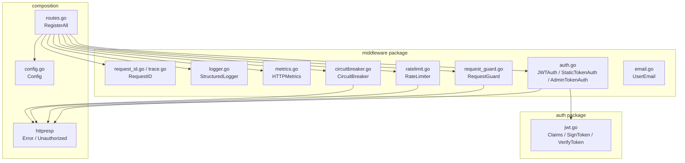
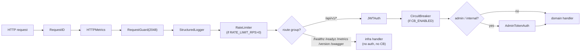
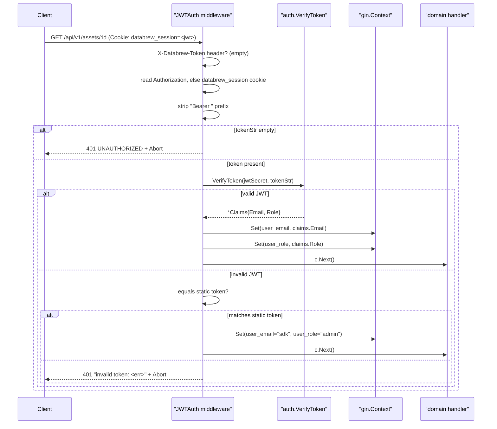
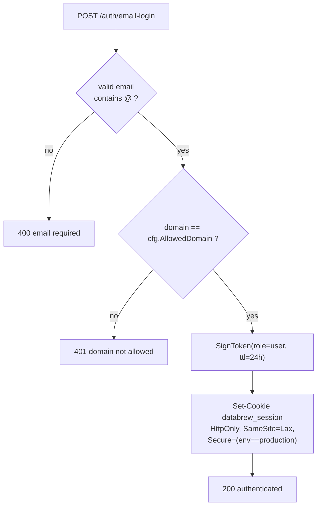
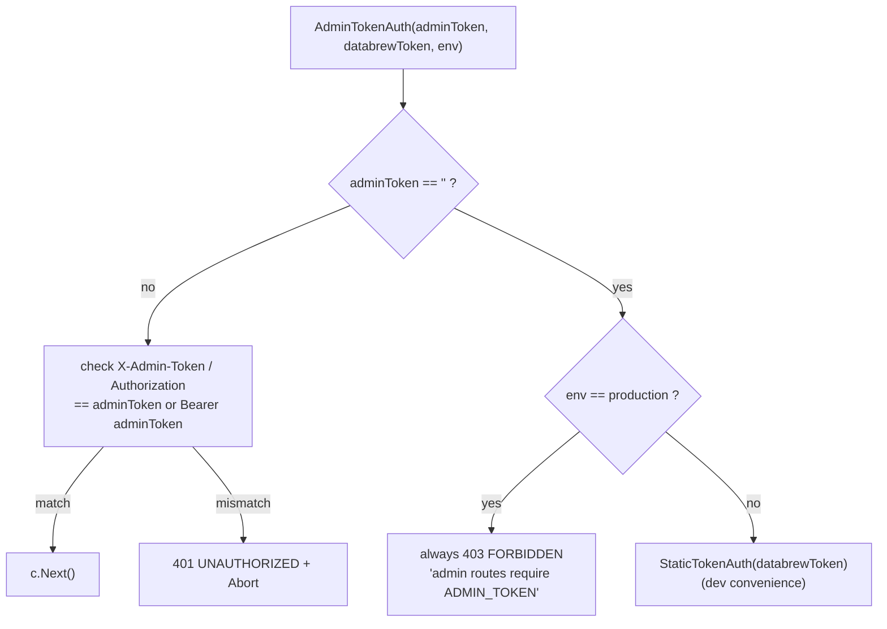
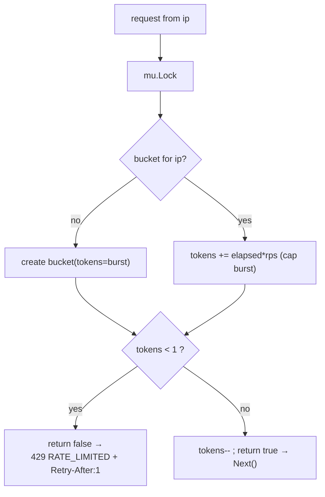
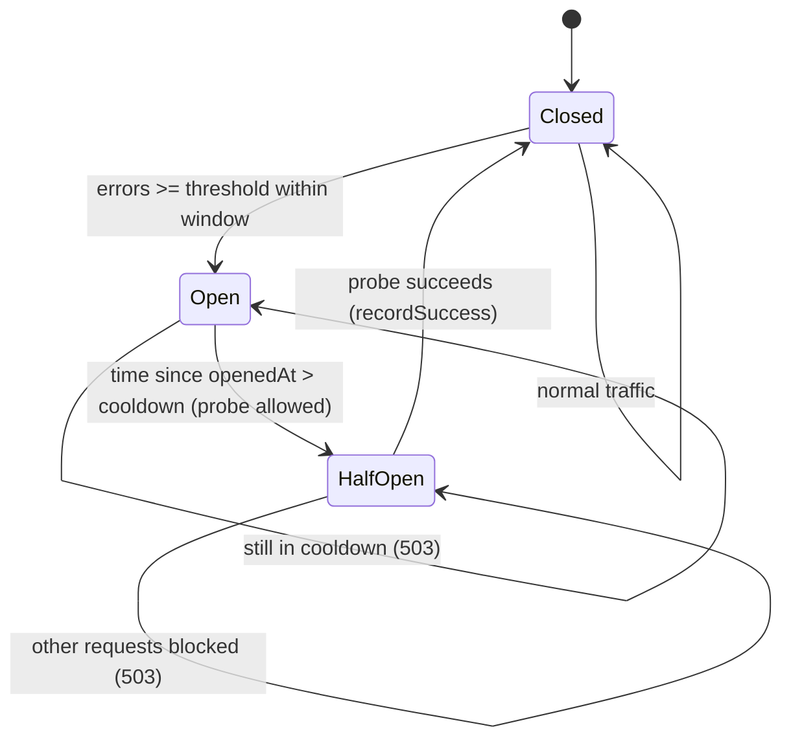
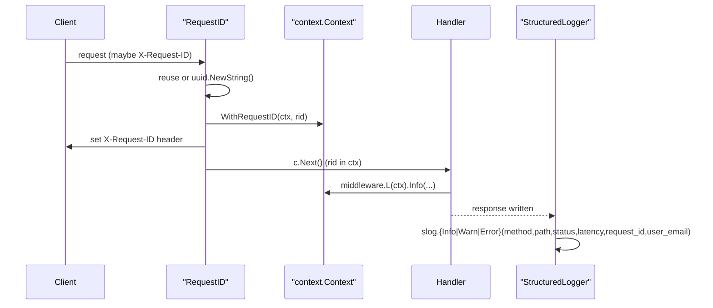
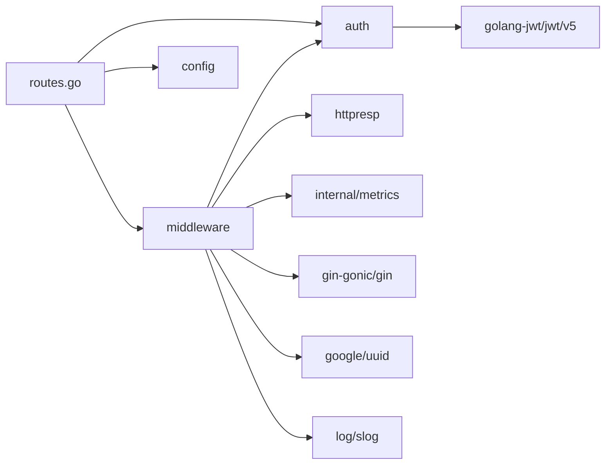

# Security Architecture

<cite>
**Referenced Files in This Document**

- [backend/internal/auth/jwt.go](file://backend/internal/auth/jwt.go)
- [backend/internal/middleware/auth.go](file://backend/internal/middleware/auth.go)
- [backend/internal/middleware/circuitbreaker.go](file://backend/internal/middleware/circuitbreaker.go)
- [backend/internal/middleware/email.go](file://backend/internal/middleware/email.go)
- [backend/internal/middleware/log_setup.go](file://backend/internal/middleware/log_setup.go)
- [backend/internal/middleware/logger.go](file://backend/internal/middleware/logger.go)
- [backend/internal/middleware/metrics.go](file://backend/internal/middleware/metrics.go)
- [backend/internal/middleware/ratelimit.go](file://backend/internal/middleware/ratelimit.go)
- [backend/internal/middleware/request_guard.go](file://backend/internal/middleware/request_guard.go)
- [backend/internal/middleware/request_id.go](file://backend/internal/middleware/request_id.go)
- [backend/internal/middleware/trace.go](file://backend/internal/middleware/trace.go)
- [backend/routes/routes.go](file://backend/routes/routes.go)
- [backend/internal/config/config.go](file://backend/internal/config/config.go)
- [backend/internal/httpresp/codes.go](file://backend/internal/httpresp/codes.go)
- [backend/internal/httpresp/response.go](file://backend/internal/httpresp/response.go)
</cite>

## Table of Contents
1. [Introduction](#introduction)
2. [Project Structure](#project-structure)
3. [Core Components](#core-components)
4. [Architecture Overview](#architecture-overview)
5. [Detailed Component Analysis](#detailed-component-analysis)
6. [Dependency Analysis](#dependency-analysis)
7. [Performance Considerations](#performance-considerations)
8. [Troubleshooting Guide](#troubleshooting-guide)
9. [Conclusion](#conclusion)
10. [Appendices](#appendices)

## Introduction

The security architecture of `cyber-databrew` is built around two concerns that run on every HTTP request handled by the Gin engine: **authentication** (proving who the caller is) and a **defensive middleware chain** (protecting the service from abuse, overload, and cascading failure while producing an audit trail). The backend serves three distinct client populations: the browser front-end (JWT session cookie), the Python SDK and service-to-service callers (long-lived static token or user-issued API key prefixed `dbk_`), and Argo webhook callbacks (a separate `ArgoWebhookAuth` token). A separate, stronger admin token gates privileged routes such as hard-delete and search reindex.

All of this logic lives in two packages. The `auth` package owns the cryptographic primitives — signing and verifying HMAC-SHA256 JWTs, plus `apikey.go` (`GenerateAPIKey`, `IsAPIKey`) for the `dbk_`-prefixed user-issued API-key scheme. The `middleware` package owns the Gin request handlers: `auth.go` (`Authenticate`, replaces the earlier `JWTAuth`, now accepts API keys via `APIKeyRepository.FindByPrefix`), `authz.go` (populates `CtxKeyPrincipal` / `CtxKeyScopes` for fine-grained permission enforcement), URI guarding, per-IP rate limiting, a sliding-window circuit breaker, Prometheus metrics, structured logging, and request-ID propagation. The composition of these handlers is decided in `backend/routes/routes.go`, which is the single place that defines both the global chain applied to every route and the auth groups applied to the protected API surface.

This page documents how a request is authenticated, how role and domain checks are enforced, how the middleware chain is layered, and how the protective components (rate limiter, circuit breaker, request guard) behave under load and failure.

**Section sources**
- [backend/internal/auth/jwt.go](file://backend/internal/auth/jwt.go#L1-L50)
- [backend/internal/middleware/auth.go](file://backend/internal/middleware/auth.go#L1-L124)
- [backend/routes/routes.go](file://backend/routes/routes.go#L74-L189)

## Project Structure

The security surface spans three directories under `backend/`:

- **`backend/internal/auth/`** — pure cryptography with no HTTP knowledge. `jwt.go` defines the `Claims` struct (email + role embedded alongside the standard registered claims) and the `SignToken` / `VerifyToken` functions.
- **`backend/internal/middleware/`** — one Gin `gin.HandlerFunc` factory per concern. Each file is self-contained: `auth.go` (authentication and authorization), `request_guard.go` (URI length guard), `ratelimit.go` (per-IP token bucket), `circuitbreaker.go` (sliding-window breaker), `metrics.go` (Prometheus instrumentation), `logger.go` (structured access log), `request_id.go` + `trace.go` (correlation IDs propagated into `context.Context`), `email.go` (audit email extraction), and `log_setup.go` (global slog configuration).
- **`backend/routes/routes.go`** — the composition root. `RegisterAll` installs the global middleware in order, then builds the auth groups and mounts every domain handler under them.
- **`backend/internal/config/config.go`** — the source of all security-relevant configuration (secrets, allowed domain, rate-limit / circuit-breaker tunables, admin-route gating).
- **`backend/internal/httpresp/`** — the canonical error envelope (`Error`, `Unauthorized`) and stable error codes (`UNAUTHORIZED`, `RATE_LIMITED`, `SERVICE_UNAVAILABLE`, `URI_TOO_LONG`) returned by the security middleware.

**Diagram sources**
- [backend/routes/routes.go](file://backend/routes/routes.go#L74-L192)
- [backend/internal/middleware/auth.go](file://backend/internal/middleware/auth.go#L1-L124)

**Section sources**
- [backend/internal/auth/jwt.go](file://backend/internal/auth/jwt.go#L1-L50)
- [backend/routes/routes.go](file://backend/routes/routes.go#L1-L38)
- [backend/internal/config/config.go](file://backend/internal/config/config.go#L35-L52)

## Core Components

### JWT primitives — `auth.Claims`, `SignToken`, `VerifyToken`

`Claims` embeds `jwt.RegisteredClaims` and adds two application fields: `Email` and `Role`. `SignToken` builds a `Claims` value with issuer `cyber-databrew`, subject = email, `IssuedAt = now`, and `ExpiresAt = now + ttl`, then signs it with `jwt.SigningMethodHS256` (HMAC-SHA256) using the configured HMAC signing key. `VerifyToken` parses the token with a key function that **rejects any signing method that is not HMAC** — this defends against the classic algorithm-confusion attack where an attacker swaps `alg` to `none` or to an asymmetric algorithm. On success it returns the typed `*Claims`; on a parse error or an invalid token it returns an error.

### Authentication middleware — `Authenticate`, `AdminTokenAuth`, `ArgoWebhookAuth`

`Authenticate` (renamed from `JWTAuth`, CYB-3417) is the workhorse mounted on every `/api/v1` route. It accepts four credential sources with a fixed priority: static `X-Databrew-Token`, user-issued API key (`dbk_` prefix, verified via `APIKeyRepository.FindByPrefix` + constant-time HMAC compare), Bearer JWT, and `databrew_session` cookie. On success it writes `user_email` and `user_role` into the Gin context. `authz.go` sits immediately after and populates `CtxKeyPrincipal` (a `*Principal` with identity + granted scopes) for fine-grained permission checks in handlers. `AdminTokenAuth` enforces the dedicated `X-Admin-Token` for privileged routes. `ArgoWebhookAuth` guards the Argo run-webhook route group.

### Identity context keys

`CtxKeyEmail = "user_email"` and `CtxKeyRole = "user_role"` are the canonical keys other layers read to learn the caller's identity. `email.go` separately extracts the client-supplied `X-User-Email` header into the same `user_email` key for audit purposes when JWT auth has not already set it.

### Protective middleware

`RequestGuard`, `RateLimiter`, and `CircuitBreaker` form the abuse/overload defence. The first rejects oversized URIs; the second throttles per-IP request rate with a token bucket; the third trips open after a burst of 5xx responses and sheds load during a cooldown.

### Observability middleware

`RequestID` mints/propagates a correlation ID, `StructuredLogger` emits one structured slog line per request (including `user_email` when known), and `HTTPMetrics` records Prometheus counters and a latency histogram.

**Section sources**
- [backend/internal/auth/jwt.go](file://backend/internal/auth/jwt.go#L10-L50)
- [backend/internal/middleware/auth.go](file://backend/internal/middleware/auth.go#L14-L124)
- [backend/internal/middleware/email.go](file://backend/internal/middleware/email.go#L7-L33)

## Architecture Overview

Every request entering the Gin engine passes through the global middleware chain installed by `RegisterAll` in the exact order below, then — for API routes — through the per-group auth and circuit-breaker handlers, before reaching the domain handler.

The global chain is deliberately ordered so that cheap, universally-needed work happens first: a request ID is attached before anything logs, metrics begin counting in-flight requests, the URI guard rejects pathological inputs before they reach business logic, and the access log wraps the remainder. Rate limiting is global but conditional. **Authentication and the circuit breaker are scoped to `/api/v1`**, never to the infrastructure endpoints — `/healthz`, `/readyz`, `/metrics`, `/version`, and `/swagger/*any` are registered directly on the engine and remain reachable even when the breaker is open, so liveness and readiness probes never get a false negative from an open circuit.

**Diagram sources**
- [backend/routes/routes.go](file://backend/routes/routes.go#L74-L192)
- [backend/routes/routes.go](file://backend/routes/routes.go#L96-L101)

**Section sources**
- [backend/routes/routes.go](file://backend/routes/routes.go#L74-L192)

## Detailed Component Analysis

### JWT authentication on a request

`JWTAuth(staticToken, jwtSecret)` resolves credentials with a strict priority order, summarised by the sequence below for the dominant browser path (Authorization/cookie carrying a JWT):

The full resolution order encoded in `JWTAuth` is:

1. **`X-Databrew-Token` header** — the legacy SDK path. If the header is present it must equal the static token (bare or `Bearer <token>`); on success the caller is granted `user_email = "sdk"` and `user_role = "admin"` and the middleware returns immediately. A non-matching header is rejected with `401` — it does **not** fall through to JWT.
2. **`Authorization` header**, else the **`databrew_session` cookie** — read as a JWT, with any `Bearer ` prefix stripped. An empty result is `401`.
3. The candidate string is verified with `auth.VerifyToken`. A valid JWT yields the claims' `Email`/`Role`.
4. **Fallback**: if JWT verification fails, the string is compared directly to the static token; a match is treated as the SDK identity (`sdk`/`admin`), otherwise `401 invalid token`.

This layered scheme is what lets the same `/api/v1` surface serve both browser sessions (JWT) and the Python SDK (static token) without separate route trees.

**Diagram sources**
- [backend/internal/middleware/auth.go](file://backend/internal/middleware/auth.go#L49-L97)

**Section sources**
- [backend/internal/middleware/auth.go](file://backend/internal/middleware/auth.go#L20-L97)
- [backend/internal/auth/jwt.go](file://backend/internal/auth/jwt.go#L34-L50)

### Login flows and session minting

Authentication credentials are produced by the public auth routes in `RegisterAll`. There are two issuance paths:

- **Email login** (`POST /api/v1/auth/email-login`): the request email is trimmed/lowercased, validated to contain `@`, and its domain is checked against `cfg.AllowedDomain`. A mismatch returns `401 email domain not allowed`. On success `auth.SignToken` mints a 24-hour JWT with `role = "user"`, which is set as the `databrew_session` cookie (`HttpOnly`, `SameSite=Lax`, and `Secure` only in production). This is the **domain allowlist** authorization gate for human users — there is no per-user database; trust is rooted in the verified email domain.
- **Legacy token login** (`POST /api/v1/auth/login`): the posted token is compared to `cfg.DatabrewToken`; a match mints a JWT with subject `legacy` and `role = "admin"`, again stored as the session cookie. This bridges older SDK clients to the cookie-based session model.

The protected `/api/v1/auth/me` and `/api/v1/auth/logout` routes are wrapped in their own `JWTAuth` group; `me` simply echoes the `user_email`/`user_role` from context, and `logout` clears the cookie.

**Diagram sources**
- [backend/routes/routes.go](file://backend/routes/routes.go#L110-L142)

**Section sources**
- [backend/routes/routes.go](file://backend/routes/routes.go#L107-L187)
- [backend/internal/auth/jwt.go](file://backend/internal/auth/jwt.go#L17-L32)

### Authorization, roles, and data filtering

The system uses a coarse-grained role model carried in the JWT and the Gin context rather than a fine-grained permission matrix:

- **`role` values** observed in the codebase are `"user"` (email-login humans), `"admin"` (SDK static-token callers and legacy-token logins). The role is stored under `CtxKeyRole` and is available to any handler via `c.Get(middleware.CtxKeyRole)`.
- **Domain-based authorization** for humans is enforced at login time by the `AllowedDomain` check, not per-request — once a session cookie is issued, the JWT itself is the bearer of trust until expiry.
- **Privileged-route authorization** is enforced by mounting `admin`/`internal` route groups behind `AdminTokenAuth` *in addition to* the outer `JWTAuth`. These groups (`/api/v1/admin/*`, `/api/v1/internal/*`, and `POST /internal/commit-segments`) are only registered at all when `cfg.AdminRoutesEnabled()` returns true.

`AdminTokenAuth(adminToken, databrewToken, env)` implements a deliberately conservative decision tree:

The key authorization property: **in production, admin routes cannot be reached without an explicitly configured `ADMIN_TOKEN`.** If it is unset, `AdminRoutesEnabled()` returns false and the routes are *not mounted at all*; should any path still resolve to `AdminTokenAuth`, it returns `403` unconditionally. In non-production environments the middleware falls back to the regular Databrew token for developer convenience.

Note that there is no field-level data filtering by role in the security packages — the row/asset visibility a caller receives is determined by the downstream handlers and repositories using the identity placed in context, not by the middleware itself. The middleware's contribution to data security is establishing a *trustworthy identity* (`user_email`, `user_role`) for those layers to act on.

**Diagram sources**
- [backend/internal/middleware/auth.go](file://backend/internal/middleware/auth.go#L99-L124)
- [backend/routes/routes.go](file://backend/routes/routes.go#L267-L285)

**Section sources**
- [backend/internal/middleware/auth.go](file://backend/internal/middleware/auth.go#L99-L124)
- [backend/internal/config/config.go](file://backend/internal/config/config.go#L224-L231)
- [backend/routes/routes.go](file://backend/routes/routes.go#L103-L105)
- [backend/routes/routes.go](file://backend/routes/routes.go#L267-L372)

### Static-token authentication (`StaticTokenAuth`)

`StaticTokenAuth(token)` is the simplest authenticator. It reads, in order, the `X-Databrew-Token` header, then the `Authorization` header, then the `databrew_session` cookie, and accepts the request only if the resulting value equals `token` or `Bearer <token>`. Anything else is `401 UNAUTHORIZED` with `Abort`. It is the dev-mode fallback used inside `AdminTokenAuth` and remains available as a standalone guard for legacy SDK paths.

**Section sources**
- [backend/internal/middleware/auth.go](file://backend/internal/middleware/auth.go#L20-L39)

### Request guard

`RequestGuard(maxURILen)` rejects requests whose `RequestURI` exceeds the configured length, returning `414` with the `URI_TOO_LONG` code. A non-positive limit defaults to `2048`, which is exactly the value `RegisterAll` passes. This blocks abuse via pathologically long URLs and prevents unexpected `500`s from downstream components that assume bounded inputs.

**Section sources**
- [backend/internal/middleware/request_guard.go](file://backend/internal/middleware/request_guard.go#L11-L23)

### Rate limiter — per-IP token bucket

`RateLimiter` maintains one token `bucket` per client IP in a mutex-guarded map. `NewRateLimiter(rps, burst)` returns `nil` when `rps <= 0` (the disabled case), defaults `burst` to `rps * 2` when unset, and spawns a background `cleanup` goroutine that every 60s evicts buckets idle for more than 5 minutes. On each request, `allow` refills the bucket by `elapsed * rps` (capped at `burst`), and consumes one token; a bucket below one token is denied.

When denied, `Middleware` sets `Retry-After: 1` and `X-RateLimit-Limit: <burst>` and emits `429` with `RATE_LIMITED`. `RateLimitFromConfig` parses the string config values; `RegisterAll` installs the middleware only when a non-nil limiter is returned, so the limiter is genuinely off (zero overhead) unless `RATE_LIMIT_RPS` is set.

**Diagram sources**
- [backend/internal/middleware/ratelimit.go](file://backend/internal/middleware/ratelimit.go#L63-L104)

**Section sources**
- [backend/internal/middleware/ratelimit.go](file://backend/internal/middleware/ratelimit.go#L14-L112)
- [backend/routes/routes.go](file://backend/routes/routes.go#L79-L82)

### Circuit breaker — sliding window

`CircuitBreaker` is a three-state machine (`cbClosed`, `cbOpen`, `cbHalfOpen`) protecting the API group from cascading failures. It records the timestamps of 5xx responses within a sliding `window`; when the count reaches `threshold` while closed, it opens and logs a warning. While open it returns `503 SERVICE_UNAVAILABLE` with `Retry-After: 30` for every request until `cooldown` elapses, at which point it transitions to half-open and allows a single probe. A successful probe closes the circuit and clears the error history; concurrent requests during half-open are blocked.

`NewCircuitBreaker(enabled, ...)` returns `nil` when disabled, applying defaults of 60s window, 10 errors, 30s cooldown for non-positive inputs. The breaker's `Middleware` calls `shouldAllow` before the handler, then inspects `c.Writer.Status()` afterwards: a status `>= 500` calls `recordError`, anything else calls `recordSuccess`. Crucially, `RegisterAll` applies the breaker via `api.Use(cbMiddleware)` on the `/api/v1` group only — infrastructure endpoints are exempt by design.

**Diagram sources**
- [backend/internal/middleware/circuitbreaker.go](file://backend/internal/middleware/circuitbreaker.go#L94-L146)

**Section sources**
- [backend/internal/middleware/circuitbreaker.go](file://backend/internal/middleware/circuitbreaker.go#L14-L146)
- [backend/routes/routes.go](file://backend/routes/routes.go#L84-L94)
- [backend/routes/routes.go](file://backend/routes/routes.go#L189-L192)

### Observability: request ID, structured logging, metrics

`RequestID` reuses an inbound `X-Request-ID` or generates a UUID, stores it under the `request_id` Gin key, sets the `X-Request-ID` response header, and — via `WithRequestID` in `trace.go` — injects it into the request's `context.Context`. Downstream usecase/repo layers retrieve it with `RequestIDFromContext` or get a pre-tagged logger via `middleware.L(ctx)`.

`StructuredLogger` times each request, then emits one slog record with method, path, status, latency, `request_id`, `client_ip`, and (when present) `user_email`. The log level is chosen by status class: `Error` for `>= 500`, `Warn` for `>= 400`, otherwise `Info`. `/healthz` is skipped to reduce noise.

`HTTPMetrics` increments `BackendHTTPInFlightRequests`, records `BackendHTTPRequestsTotal` and `BackendHTTPRequestDurationSeconds` labelled by method, route (`c.FullPath()`, or `unmatched`), and status class. It skips `/metrics` and `/healthz`.

`UserEmail` (in `email.go`) extracts the client-supplied `X-User-Email` header into the `user_email` key for audit trails, passing through untouched when the header is absent so handlers can distinguish "not provided" from "provided empty".

`SetupLogger` (in `log_setup.go`) configures the global slog handler once at startup — level, text/json format, and optional file fan-out via `io.MultiWriter`.

**Diagram sources**
- [backend/internal/middleware/request_id.go](file://backend/internal/middleware/request_id.go#L11-L27)
- [backend/internal/middleware/logger.go](file://backend/internal/middleware/logger.go#L12-L47)

**Section sources**
- [backend/internal/middleware/request_id.go](file://backend/internal/middleware/request_id.go#L11-L27)
- [backend/internal/middleware/trace.go](file://backend/internal/middleware/trace.go#L8-L36)
- [backend/internal/middleware/logger.go](file://backend/internal/middleware/logger.go#L12-L47)
- [backend/internal/middleware/metrics.go](file://backend/internal/middleware/metrics.go#L12-L51)
- [backend/internal/middleware/email.go](file://backend/internal/middleware/email.go#L14-L33)
- [backend/internal/middleware/log_setup.go](file://backend/internal/middleware/log_setup.go#L17-L61)

## Dependency Analysis

The security stack depends on a small number of external and internal packages, and is depended upon by every route.

- `middleware.auth` imports `auth` (for `VerifyToken`) and `httpresp` (for `Unauthorized`/`Error`). It has no database dependency — identity is computed purely from the token and config.
- `auth` depends only on `golang-jwt/jwt/v5`; it is HTTP-agnostic and unit-testable in isolation.
- The protective and observability middleware depend on `httpresp` for the error envelope, `internal/metrics` for Prometheus collectors, `google/uuid` for IDs, and the standard `log/slog`.
- `routes.go` is the only consumer that wires these together, reading secrets and tunables from `config.Config`. The secrets (`DatabrewToken`, `JWTSecret`, `AllowedDomain`, `AdminToken`) and tunables (`RateLimit*`, `CB*`) all originate from environment variables with development defaults.

**Section sources**
- [backend/internal/middleware/auth.go](file://backend/internal/middleware/auth.go#L1-L12)
- [backend/internal/auth/jwt.go](file://backend/internal/auth/jwt.go#L1-L8)
- [backend/internal/config/config.go](file://backend/internal/config/config.go#L165-L213)

## Performance Considerations

- **Auth is cheap and allocation-light.** `JWTAuth` short-circuits the SDK path on the very first header check, and JWT verification is a single HMAC-SHA256 operation with no I/O. There is no per-request database lookup for identity, so authentication adds negligible latency.
- **Rate limiter contention.** The token bucket is guarded by one global `sync.Mutex` covering the whole bucket map; under very high concurrency this lock can become a contention point. The background `cleanup` goroutine bounds memory by evicting buckets idle for 5 minutes, preventing unbounded map growth from one-off IPs.
- **Circuit breaker overhead.** `recordError`/`recordSuccess`/`shouldAllow` each take the breaker mutex; the error slice is pruned on every error append (`pruneOld`), keeping it bounded to the window. The breaker only runs on `/api/v1`, so infra probes pay nothing.
- **Conditional middleware.** Both the rate limiter and circuit breaker are *only installed when enabled* (`nil` factories are skipped in `RegisterAll`), so a default deployment incurs no overhead for features it does not use.
- **Logging and metrics skips.** `StructuredLogger` skips `/healthz`; `HTTPMetrics` skips `/metrics` and `/healthz` — high-frequency probe traffic does not pollute logs or in-flight gauges.

**Section sources**
- [backend/internal/middleware/ratelimit.go](file://backend/internal/middleware/ratelimit.go#L49-L87)
- [backend/internal/middleware/circuitbreaker.go](file://backend/internal/middleware/circuitbreaker.go#L70-L113)
- [backend/internal/middleware/logger.go](file://backend/internal/middleware/logger.go#L13-L17)
- [backend/internal/middleware/metrics.go](file://backend/internal/middleware/metrics.go#L37-L44)

## Troubleshooting Guide

- **All API calls return `401 UNAUTHORIZED`.** Confirm the credential matches the active scheme: browsers need the `databrew_session` cookie (issued only after a successful `email-login` with an allowlisted domain); SDK callers need `X-Databrew-Token` equal to `DATABREW_TOKEN`. A wrong `X-Databrew-Token` is rejected immediately and never falls through to JWT. An invalid/expired JWT returns `invalid token: <err>` — re-login to refresh the 24h session.
- **`email domain not allowed` on login.** The email's domain must equal `ALLOWED_DOMAIN` (default `cyberorigin.ai`). If `ALLOWED_DOMAIN` is empty, *all* email logins are rejected by design.
- **Admin routes return `403` or `404` in production.** Admin/internal routes are mounted only when `AdminRoutesEnabled()` is true. In production that requires `ADMIN_TOKEN` to be set; without it the routes are not mounted and `AdminTokenAuth` returns `403`. Set `ADMIN_TOKEN` and send it via `X-Admin-Token`.
- **`429 RATE_LIMITED`.** The per-IP token bucket is exhausted. Honour the `Retry-After: 1` header; raise `RATE_LIMIT_RPS`/`RATE_LIMIT_BURST` if the limit is too tight, or set `RATE_LIMIT_RPS=0` to disable.
- **`503 SERVICE_UNAVAILABLE` with `Retry-After: 30`.** The circuit breaker is open after `CB_THRESHOLD` 5xx errors within `CB_WINDOW_SEC`. Investigate the upstream 5xx cause; the breaker auto-probes after `CB_COOLDOWN_SEC` and closes on a successful probe. Infra endpoints (`/healthz`, `/readyz`, `/metrics`) stay up regardless.
- **`414 URI_TOO_LONG`.** The request URI exceeded 2048 bytes — shorten query strings or move large payloads into the request body.
- **JWTs rejected as "unexpected signing method".** `VerifyToken` only accepts HMAC; a token signed with a different algorithm (or `none`) is refused. Ensure the issuer uses the same `JWT_SECRET` and HS256.

**Section sources**
- [backend/internal/middleware/auth.go](file://backend/internal/middleware/auth.go#L49-L124)
- [backend/routes/routes.go](file://backend/routes/routes.go#L124-L130)
- [backend/internal/middleware/ratelimit.go](file://backend/internal/middleware/ratelimit.go#L91-L104)
- [backend/internal/middleware/circuitbreaker.go](file://backend/internal/middleware/circuitbreaker.go#L127-L135)
- [backend/internal/auth/jwt.go](file://backend/internal/auth/jwt.go#L36-L40)

## Conclusion

`cyber-databrew`'s security architecture cleanly separates **identity** (the stateless `auth` package and the `JWTAuth`/`StaticTokenAuth`/`AdminTokenAuth` middleware) from **resilience** (request guard, rate limiter, circuit breaker) and **observability** (request ID propagation, structured logging, metrics). Authentication supports both browser JWT sessions and SDK static tokens through one priority-ordered middleware, while authorization is enforced coarsely — by email domain at login, by role in context, and by a separately-configured admin token that, in production, is mandatory for privileged routes. The composition root in `routes.go` fixes the middleware order and scopes the breaker and auth to the API surface while leaving infrastructure endpoints open. The result is a small, dependency-light, environment-tunable security layer that establishes trustworthy identity for downstream layers and degrades gracefully under abuse or upstream failure.

## Appendices

### Appendix A — Security configuration keys

| Config field | Env var | Default | Purpose |
| --- | --- | --- | --- |
| `DatabrewToken` | `DATABREW_TOKEN` (or `GRACE_TOKEN`) | `dev-token` | Static SDK / legacy login token |
| `JWTSecret` | `JWT_SECRET` | `dev-jwt-secret` | HMAC-SHA256 signing secret for JWTs |
| `AllowedDomain` | `ALLOWED_DOMAIN` | `cyberorigin.ai` | Email-login domain allowlist |
| `AdminToken` | `ADMIN_TOKEN` | `""` | Privileged admin/internal route token |
| `RateLimitRPS` | `RATE_LIMIT_RPS` | `0` (disabled) | Per-IP requests/sec |
| `RateLimitBurst` | `RATE_LIMIT_BURST` | `0` (→ rps*2) | Per-IP burst size |
| `CBEnabled` | `CB_ENABLED` | `false` | Enable circuit breaker |
| `CBWindowSec` | `CB_WINDOW_SEC` | `60` | Sliding window seconds |
| `CBThreshold` | `CB_THRESHOLD` | `10` | 5xx errors to trip open |
| `CBCooldownSec` | `CB_COOLDOWN_SEC` | `30` | Cooldown before half-open |

**Section sources**
- [backend/internal/config/config.go](file://backend/internal/config/config.go#L35-L52)
- [backend/internal/config/config.go](file://backend/internal/config/config.go#L165-L213)

### Appendix B — Error codes returned by security middleware

| Code | HTTP status | Emitted by |
| --- | --- | --- |
| `UNAUTHORIZED` | 401 (403 in `AdminTokenAuth` prod) | `JWTAuth`, `StaticTokenAuth`, `AdminTokenAuth` |
| `URI_TOO_LONG` | 414 | `RequestGuard` |
| `RATE_LIMITED` | 429 | `RateLimiter.Middleware` |
| `SERVICE_UNAVAILABLE` | 503 | `CircuitBreaker.Middleware` |

**Section sources**
- [backend/internal/httpresp/codes.go](file://backend/internal/httpresp/codes.go#L24-L31)
- [backend/internal/httpresp/response.go](file://backend/internal/httpresp/response.go#L26-L39)

### Appendix C — Identity context keys

| Key | Constant | Set by | Read by |
| --- | --- | --- | --- |
| `user_email` | `middleware.CtxKeyEmail` | `JWTAuth`, `UserEmail` | handlers, `StructuredLogger` |
| `user_role` | `middleware.CtxKeyRole` | `JWTAuth` | handlers (`/auth/me`) |
| `request_id` | `"request_id"` | `RequestID` | `StructuredLogger`, `middleware.L(ctx)` |

**Section sources**
- [backend/internal/middleware/auth.go](file://backend/internal/middleware/auth.go#L14-L18)
- [backend/internal/middleware/email.go](file://backend/internal/middleware/email.go#L7-L33)
- [backend/internal/middleware/request_id.go](file://backend/internal/middleware/request_id.go#L11-L27)
