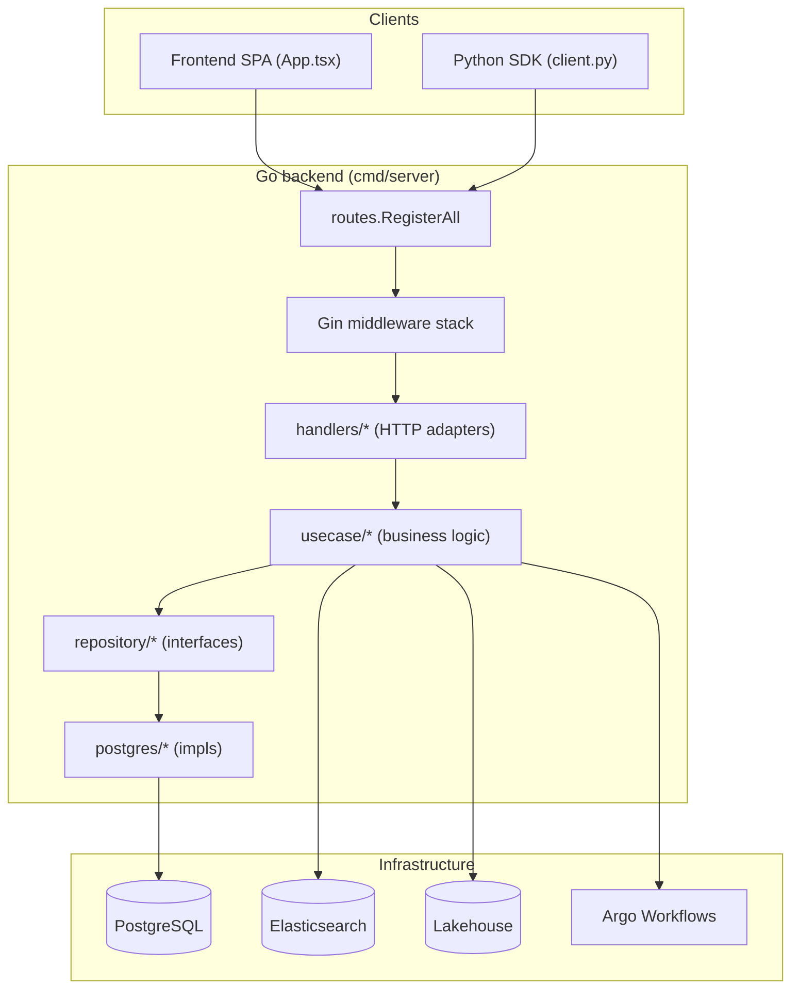
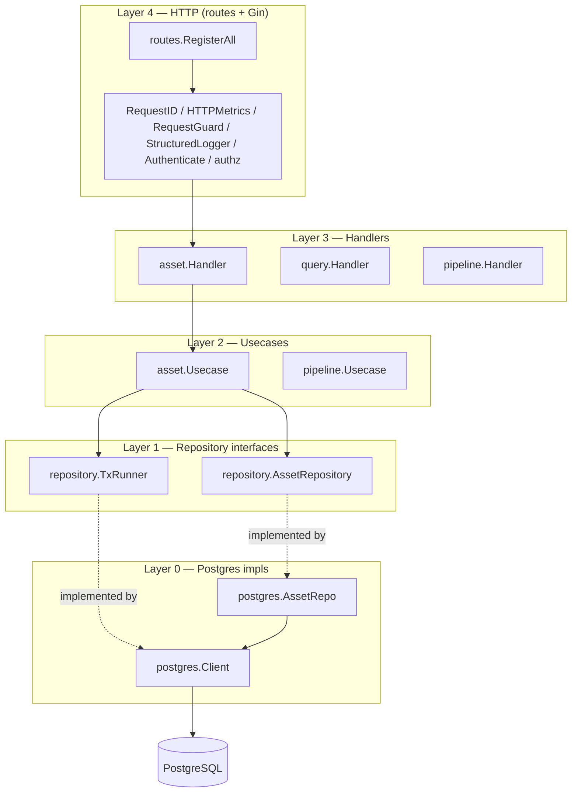
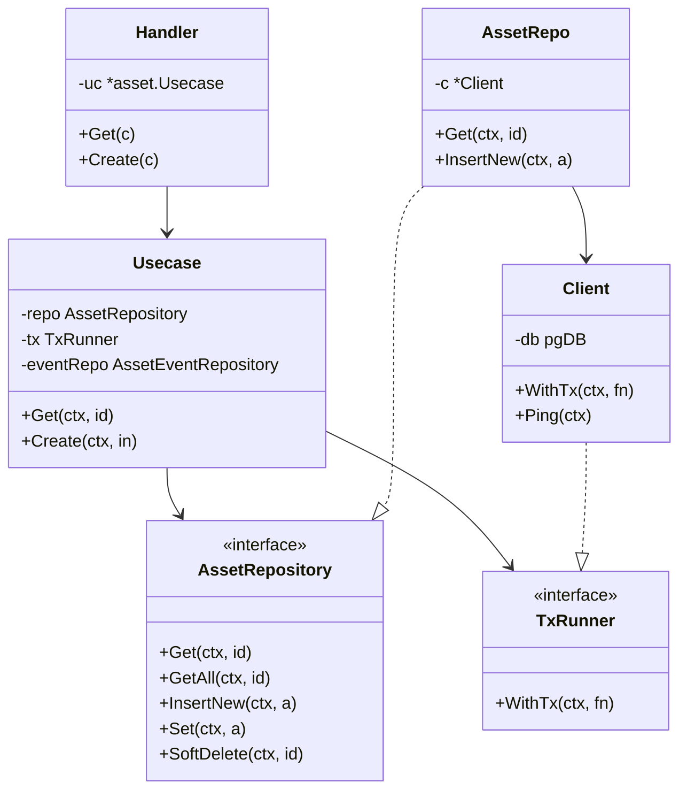
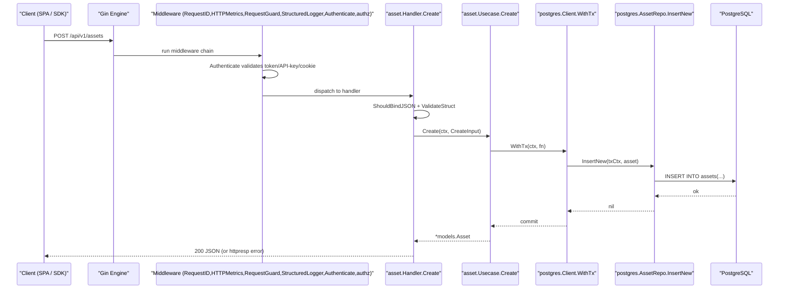
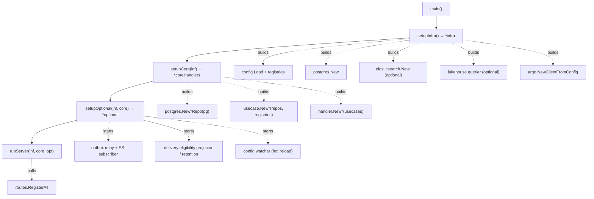
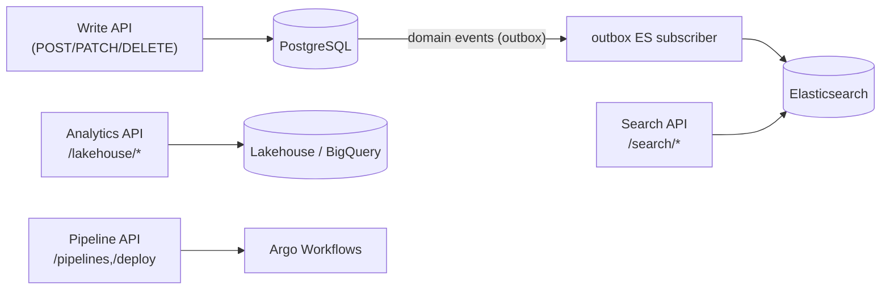
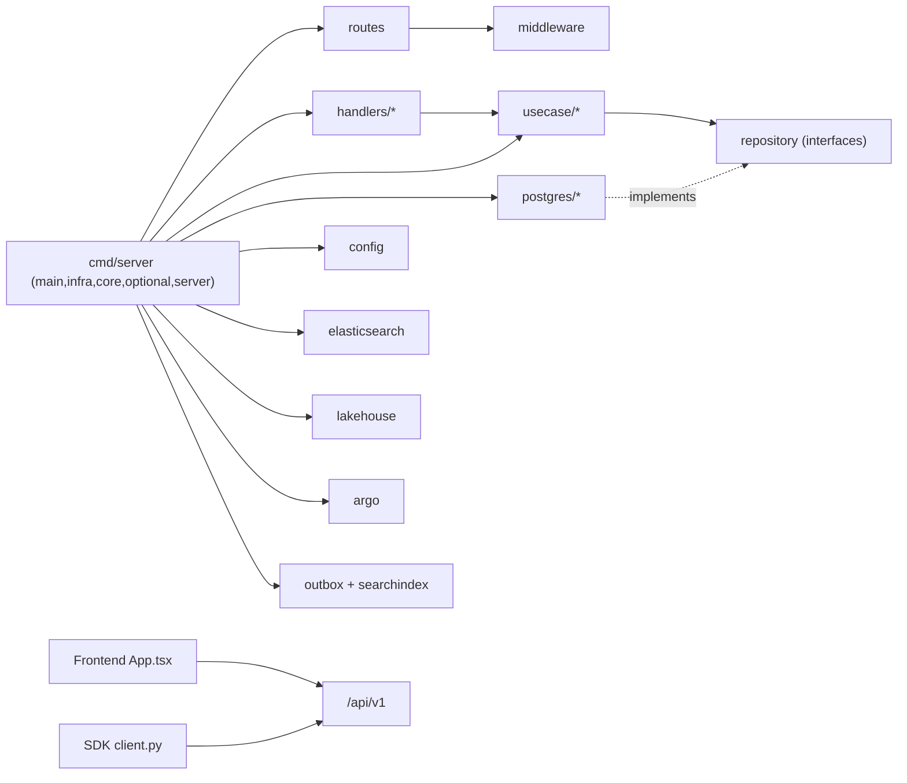

# System Architecture Overview

<cite>
**Referenced Files in This Document**

- [backend/cmd/server/main.go](file://backend/cmd/server/main.go)
- [backend/cmd/server/server.go](file://backend/cmd/server/server.go)
- [backend/cmd/server/infra.go](file://backend/cmd/server/infra.go)
- [backend/cmd/server/core.go](file://backend/cmd/server/core.go)
- [backend/cmd/server/optional.go](file://backend/cmd/server/optional.go)
- [backend/routes/routes.go](file://backend/routes/routes.go)
- [backend/internal/handlers/asset/handler.go](file://backend/internal/handlers/asset/handler.go)
- [backend/internal/usecase/asset/usecase.go](file://backend/internal/usecase/asset/usecase.go)
- [backend/internal/repository/asset_repository.go](file://backend/internal/repository/asset_repository.go)
- [backend/internal/repository/common.go](file://backend/internal/repository/common.go)
- [backend/internal/postgres/repos.go](file://backend/internal/postgres/repos.go)
- [backend/internal/postgres/client.go](file://backend/internal/postgres/client.go)
- [backend/internal/middleware/auth.go](file://backend/internal/middleware/auth.go)
- [backend/internal/middleware/request_id.go](file://backend/internal/middleware/request_id.go)
- [backend/internal/middleware/metrics.go](file://backend/internal/middleware/metrics.go)
- [backend/internal/middleware/request_guard.go](file://backend/internal/middleware/request_guard.go)
- [backend/internal/middleware/logger.go](file://backend/internal/middleware/logger.go)
- [Frontend/src/App.tsx](file://Frontend/src/App.tsx)
- [sdk/src/cyber_databrew_sdk/client.py](file://sdk/src/cyber_databrew_sdk/client.py)
</cite>

## Table of Contents
1. [Introduction](#introduction)
2. [Project Structure](#project-structure)
3. [Core Components](#core-components)
4. [Architecture Overview](#architecture-overview)
5. [Detailed Component Analysis](#detailed-component-analysis)
6. [Dependency Analysis](#dependency-analysis)
7. [Performance Considerations](#performance-considerations)
8. [Troubleshooting Guide](#troubleshooting-guide)
9. [Conclusion](#conclusion)
10. [Appendices](#appendices)

## Introduction

`cyber-databrew` is a data-asset management platform built around three
deliverables that share one HTTP contract: a Go backend (the single source of
truth), a React single-page application that operators use in the browser, and
a Python SDK that programmatic clients import. The backend exposes a versioned
REST API under `/api/v1`, persists state in PostgreSQL, projects searchable
copies into Elasticsearch, runs analytical queries against a lakehouse, and
orchestrates data pipelines through Argo Workflows.

The backend is deliberately layered. An incoming HTTP request crosses a stack
of Gin middleware, lands on a thin **handler** that only marshals JSON and
validates input, delegates business logic to a **usecase**, which in turn talks
to PostgreSQL exclusively through **repository interfaces** whose concrete
implementations live in the `postgres` package. This separation lets the
usecase layer be tested without a database and keeps SQL out of HTTP code.

The whole process is wired together in four files under
`backend/cmd/server/`: `main.go` defines the dependency-injection struct types
and the four-step boot sequence, `infra.go` builds infrastructure clients,
`core.go` builds the business layer, and `optional.go` starts background
projectors and admin features. The same Go binary serves every API domain in
one process, registered by `routes.RegisterAll`.

**Section sources**
- [backend/cmd/server/main.go](file://backend/cmd/server/main.go#L117-L128)
- [backend/routes/routes.go](file://backend/routes/routes.go#L40-L68)
- [sdk/src/cyber_databrew_sdk/client.py](file://sdk/src/cyber_databrew_sdk/client.py#L1-L73)

## Project Structure

The repository root contains the three top-level surfaces plus supporting
directories:

- **`backend/`** — the Go module. `cmd/server/` holds the entry point and
  wiring; `routes/` registers every HTTP route; `internal/` contains the
  layered packages (`handlers/`, `usecase/`, `repository/`, `postgres/`,
  `middleware/`, plus infrastructure adapters such as `elasticsearch/`,
  `lakehouse/`, `argo/`, `outbox/`, `searchindex/`, and `config/`).
- **`Frontend/`** — the React + Vite SPA. `src/App.tsx` defines client-side
  routing, lazy page loading, and the authentication gate.
- **`sdk/`** — the Python package `cyber_databrew_sdk`. `client.py` is the
  facade that lazily instantiates per-domain managers over a shared HTTP
  requestor.

Within `backend/internal`, each business domain (asset, mcap, delivery,
customer, algorun, eval, action, query, workflow, pipeline, backfill) follows
the same three-package split: a `handlers/<domain>` HTTP adapter, a
`usecase/<domain>` business layer, and a repository interface in `repository/`
backed by a `postgres/` implementation.

**Diagram sources**
- [backend/routes/routes.go](file://backend/routes/routes.go#L74-L101)
- [backend/cmd/server/core.go](file://backend/cmd/server/core.go#L32-L135)
- [Frontend/src/App.tsx](file://Frontend/src/App.tsx#L44-L104)
- [sdk/src/cyber_databrew_sdk/client.py](file://sdk/src/cyber_databrew_sdk/client.py#L30-L50)

**Section sources**
- [backend/cmd/server/core.go](file://backend/cmd/server/core.go#L1-L135)
- [backend/cmd/server/infra.go](file://backend/cmd/server/infra.go#L1-L162)

## Core Components

The architecture is anchored by a small number of grouping structs declared in
`main.go` that act as dependency-injection containers.

- **`infra`** holds everything constructed before any business logic: the
  loaded `*config.Config`, the `*postgres.Client`, the optional
  `*elasticsearch.Client`, the `lakehouse.Querier`, the optional GCS-backed
  `mcapH.BytesSource`, the four registry objects (`AlgoRegistry`,
  `TagRegistry`, `MetricRegistry`, `ActionLabelRegistry`, plus
  `QueryFieldRegistry`), and the `argo.WorkflowClient`.
- **`coreRepos`** groups repository implementations constructed from the PG
  client (asset, asset-tag, algo-latest, asset-event, mcap, delivery, action,
  saved-query, idempotency).
- **`coreHandlers`** groups every HTTP handler that forms the main API surface
  (asset, algo, mcap, delivery, customer, delivery-rule, algo-run, eval,
  action, query, workflow, pipeline, pipeline-component, pipeline-config,
  backfill, subtask, runs, apikey, dashboard, registry, search, storage,
  lakehouse, audit) plus the shared `assetUC.Usecase`.
- **`optional`** holds components that are not required for the core API:
  the admin and purge handlers, the outbox cancel function, the search-sync
  helper closures, and the config hot-reload watcher.

On the client side, the SPA's `App` component and the SDK's
`CyberDatabrewClient` facade are the symmetric entry points: both target the
same `/api/v1` routes, one through `react-router` navigation and one through
lazily-loaded manager objects.

**Section sources**
- [backend/cmd/server/main.go](file://backend/cmd/server/main.go#L32-L115)
- [Frontend/src/App.tsx](file://Frontend/src/App.tsx#L91-L104)
- [sdk/src/cyber_databrew_sdk/client.py](file://sdk/src/cyber_databrew_sdk/client.py#L53-L73)

## Architecture Overview

The backend follows a strict four-layer dependency direction. Outer layers
depend on inner layers, never the reverse, and the boundary between usecase and
storage is an interface (`repository.AssetRepository` and siblings) so the
concrete `postgres` package is an implementation detail injected at boot.

**Diagram sources**
- [backend/routes/routes.go](file://backend/routes/routes.go#L74-L101)
- [backend/internal/handlers/asset/handler.go](file://backend/internal/handlers/asset/handler.go#L60-L62)
- [backend/internal/usecase/asset/usecase.go](file://backend/internal/usecase/asset/usecase.go#L62-L77)
- [backend/internal/repository/asset_repository.go](file://backend/internal/repository/asset_repository.go#L26-L52)
- [backend/internal/repository/common.go](file://backend/internal/repository/common.go#L28-L30)
- [backend/internal/postgres/repos.go](file://backend/internal/postgres/repos.go#L19-L25)
- [backend/internal/postgres/client.go](file://backend/internal/postgres/client.go#L19-L20)

## Detailed Component Analysis

### Frontend, Backend, and SDK responsibilities

**Frontend.** `Frontend/src/App.tsx` is the SPA shell. It wraps the entire tree
in an `AuthProvider`, mounts a `BrowserRouter`, and splits routing into a public
`/login` route and a catch-all `/*` that renders `ProtectedRoutes`.
`ProtectedRoutes` reads `isAuthenticated`/`loading` from `useAuth`; while
loading it shows a `PageLoader` spinner, when unauthenticated it redirects to
`/login`, and otherwise it renders the authenticated `AppLayout` with an
`ErrorBoundary` and a `Suspense` boundary keyed on `location.pathname`. Every
page (`DashboardPage`, `AssetsPage`, `AssetDetailPage`, `McapFilesPage`,
`AlgoProcessingPage`, `AlgoRunsPage`, `DeliveriesPage`, `PipelinePage`, etc.) is
lazily imported to keep the initial bundle small. Several legacy paths
(`/lakehouse`, `/tags`, `/components`, `/workflows`) are pure `Navigate`
redirects to their current homes.

**Backend.** The Go service owns all business rules and is the only writer to
PostgreSQL. It validates input, enforces invariants (asset hierarchy, lifecycle
states, tag namespaces), emits domain events, and projects state into
Elasticsearch and the lakehouse asynchronously.

**SDK.** `sdk/src/cyber_databrew_sdk/client.py` exposes `CyberDatabrewClient`
(aliased `CyberDatabrew`). It builds a single shared `APIRequestor` configured
from env vars, config files, and remote discovery, then lazily instantiates one
of fifteen domain managers via `__getattr__` against the `_managers` map (for
example `assets → AssetManager`, `delivery → DeliveryManager`,
`algo_runs → AlgoRunManager`, `workflows → WorkflowManager`). Authentication is
header-based: `X-Databrew-Token` and an optional `X-User-Email`.

**Section sources**
- [Frontend/src/App.tsx](file://Frontend/src/App.tsx#L1-L104)
- [sdk/src/cyber_databrew_sdk/client.py](file://sdk/src/cyber_databrew_sdk/client.py#L79-L165)

### Layered architecture: handler → usecase → repository → postgres

The asset domain is the canonical example of the four layers.

**Handler.** `asset.Handler` is constructed by `asset.New(uc, deliveryRepo)`
and holds only a `*assetUC.Usecase` and a delivery repository. `Handler.Get`
reads the `:id` path parameter and calls `h.uc.GetAll(...)`, then writes either
a `httpresp` error or `c.JSON(200, a)`. `Handler.Create` binds and validates the
request body with `c.ShouldBindJSON` and `validate.ValidateStruct`, then maps
the request into an `assetUC.CreateInput` and calls `h.uc.Create(...)`. The
handler contains no SQL and no business rules — only HTTP concerns.

**Usecase.** `asset.Usecase` holds the repository interfaces it needs
(`repository.AssetRepository`, `LogicalAssetRepository`, `AssetTagRepository`,
`AssetAlgoLatestRepository`, `AssetEventRepository`, `CustomerRepository`, a
`TxRunner`, and the registries). `Usecase.Create` validates ranges and IDs,
then performs its writes inside a transaction obtained from the `TxRunner`,
calling `u.repo.InsertNew(txCtx, a)` and projecting tags within the same
transaction. `Usecase.Get`/`GetAll` simply delegate to the repository and map
"no rows" into the domain error `ErrNotFound`.

**Repository interface.** `repository.AssetRepository` declares the persistence
contract — `Get`, `GetAll`, `InsertNew`, `Set`, `SoftDelete`,
`ListByMcapFile`, `ListByLogicalAssetID`, `WriteSegmentIndex`,
`ListWithFilters`, and `ListDescendants`. The usecase depends on this
interface, never on `postgres`.

**Postgres implementation.** `postgres.AssetRepo` (constructed by
`postgres.NewAssetRepo(c)`) implements the interface against the SQL schema.
`AssetRepo.InsertNew` runs a parameterized `INSERT INTO assets(...)`, and
`AssetRepo.Get`/`GetAll` issue `SELECT`s and scan rows. Every repo holds a
`*postgres.Client`, whose `pgDB` abstraction means the same SQL runs against
either the connection pool or an active transaction interchangeably.

**Diagram sources**
- [backend/internal/handlers/asset/handler.go](file://backend/internal/handlers/asset/handler.go#L60-L62)
- [backend/internal/usecase/asset/usecase.go](file://backend/internal/usecase/asset/usecase.go#L62-L77)
- [backend/internal/repository/asset_repository.go](file://backend/internal/repository/asset_repository.go#L26-L52)
- [backend/internal/repository/common.go](file://backend/internal/repository/common.go#L28-L30)
- [backend/internal/postgres/repos.go](file://backend/internal/postgres/repos.go#L19-L25)
- [backend/internal/postgres/client.go](file://backend/internal/postgres/client.go#L19-L40)

**Section sources**
- [backend/internal/handlers/asset/handler.go](file://backend/internal/handlers/asset/handler.go#L60-L140)
- [backend/internal/handlers/asset/handler.go](file://backend/internal/handlers/asset/handler.go#L545-L600)
- [backend/internal/usecase/asset/usecase.go](file://backend/internal/usecase/asset/usecase.go#L62-L95)
- [backend/internal/usecase/asset/usecase.go](file://backend/internal/usecase/asset/usecase.go#L355-L390)
- [backend/internal/postgres/repos.go](file://backend/internal/postgres/repos.go#L223-L262)
- [backend/internal/postgres/repos.go](file://backend/internal/postgres/repos.go#L452-L470)

### The request path, end to end

The diagram below traces `POST /api/v1/assets` from the client through every
layer to PostgreSQL and back. The middleware stack is applied in
`routes.RegisterAll` (`RequestID`, `HTTPMetrics`, `RequestGuard(2048)`,
`StructuredLogger`, optional rate limiting), and the `/api/v1` group is guarded
by `middleware.Authenticate` (replaces `JWTAuth`; now accepts API-key tokens in addition to the static token and JWT/cookie) plus an optional circuit breaker. A dedicated Argo-webhook route group uses `middleware.ArgoWebhookAuth`.

**Diagram sources**
- [backend/routes/routes.go](file://backend/routes/routes.go#L74-L101)
- [backend/routes/routes.go](file://backend/routes/routes.go#L189-L210)
- [backend/internal/handlers/asset/handler.go](file://backend/internal/handlers/asset/handler.go#L545-L591)
- [backend/internal/usecase/asset/usecase.go](file://backend/internal/usecase/asset/usecase.go#L355-L390)
- [backend/internal/postgres/client.go](file://backend/internal/postgres/client.go#L220-L239)
- [backend/internal/postgres/repos.go](file://backend/internal/postgres/repos.go#L452-L470)

**Section sources**
- [backend/routes/routes.go](file://backend/routes/routes.go#L74-L101)
- [backend/internal/middleware/auth.go](file://backend/internal/middleware/auth.go#L49-L101)
- [backend/internal/middleware/request_id.go](file://backend/internal/middleware/request_id.go#L11-L20)
- [backend/internal/middleware/metrics.go](file://backend/internal/middleware/metrics.go#L12-L20)
- [backend/internal/middleware/request_guard.go](file://backend/internal/middleware/request_guard.go#L11-L20)
- [backend/internal/middleware/logger.go](file://backend/internal/middleware/logger.go#L12-L20)

### Server wiring and dependency injection

`main` runs a four-step boot sequence that maps one-to-one onto the four
layers: `setupInfra` → `setupCore` → `setupOptional` → `runServer`. Each step
returns one of the grouping structs and defers its `close`.

**`setupInfra` (Layer 1).** Loads `.env`, calls `config.Load`, registers custom
validators, configures structured logging and Gin release mode, and sets the
`BackendDependencyUp` Prometheus gauges to 0. It loads the five YAML registries
(`algo`, `tag`, `metric`, `query_field`, `action_label`), connects to
PostgreSQL (the only supported `STORAGE_BACKEND`; `bigtable` exits with an
error), and optionally constructs the GCS bytes source, the lakehouse querier,
the Argo client, and the Elasticsearch client (which degrades to `nil` if the
ping fails, so search returns 503 rather than crashing).

**`setupCore` (Layer 2).** Constructs every `postgres.New*Repo(pg)` repository,
then composes usecases over them (e.g. `assetUC.NewWithProjections(...)`,
configured with schema registry, logical-asset repo, customer repo, hierarchy
validator, and usage-stats repo), and finally constructs each handler. It also
seeds system pipeline components. The result is the `coreHandlers` struct.

**`setupOptional` (Layer 3).** Builds the admin and purge handlers (only when
both PG and ES are present), then conditionally starts background goroutines
based on config flags: the outbox relay and ES subscriber (selecting an
`internal`, `pubsub`, or `kafka` transport), an algo-run ES subscriber, the
delivery-eligibility projector, the OpenLineage emitter, a retention job, and a
config watcher for hot-reloading registries. It also returns the search-sync
helper closures used by the search handler.

**`runServer` (Layer 4).** Creates `gin.New()`, adds `gin.Recovery()`, and
hands every handler to `routes.RegisterAll`, then listens on `:cfg.Port`.

**Section sources**
- [backend/cmd/server/main.go](file://backend/cmd/server/main.go#L117-L128)
- [backend/cmd/server/infra.go](file://backend/cmd/server/infra.go#L25-L162)
- [backend/cmd/server/core.go](file://backend/cmd/server/core.go#L32-L135)
- [backend/cmd/server/optional.go](file://backend/cmd/server/optional.go#L27-L116)
- [backend/cmd/server/server.go](file://backend/cmd/server/server.go#L21-L68)

### System boundaries and data flow

There are three durable data stores and one orchestrator behind the backend,
and the write path versus the read path diverge deliberately.

- **PostgreSQL** is the system of record. All writes go through the usecase →
  repository → `postgres` path inside transactions managed by
  `Client.WithTx`. Domain events are appended in the same transaction (the
  transactional-outbox pattern).
- **Elasticsearch** is a read-optimized projection. The outbox ES subscriber
  in `optional.go` consumes events and rebuilds search documents via
  `searchindex.Builder`; search queries hit ES, and if ES is unavailable the
  endpoints report 503.
- **Lakehouse** (BigQuery-backed) powers analytical/report endpoints under
  `/api/v1/lakehouse/*`; it is optional and reports health through `/readyz`.
- **Argo Workflows** executes data pipelines; pipeline/deploy/workflow handlers
  translate API calls into workflow operations through `argo.WorkflowClient`.

Both the SPA and the SDK are pure clients of `/api/v1`; they never touch
PostgreSQL, Elasticsearch, or Argo directly.

**Diagram sources**
- [backend/cmd/server/optional.go](file://backend/cmd/server/optional.go#L153-L243)
- [backend/routes/routes.go](file://backend/routes/routes.go#L246-L265)
- [backend/routes/routes.go](file://backend/routes/routes.go#L315-L346)

**Section sources**
- [backend/cmd/server/infra.go](file://backend/cmd/server/infra.go#L117-L146)
- [backend/cmd/server/optional.go](file://backend/cmd/server/optional.go#L54-L243)
- [backend/internal/postgres/client.go](file://backend/internal/postgres/client.go#L220-L239)

## Dependency Analysis

Dependencies flow strictly inward in the backend, and outward (toward the API)
from the clients. The `cmd/server` package imports handlers, usecases,
repositories, the postgres implementations, and the infrastructure adapters,
and assembles them; the inner layers never import `cmd/server`.

Key observations:

- The usecase layer depends only on `repository` interfaces and `config`
  registries — not on `postgres`, Gin, or HTTP. This is what makes usecases
  unit-testable with fakes.
- `routes.RegisterAll` receives every handler as a parameter rather than
  importing the wiring; it is the single registration point and tolerates `nil`
  handlers (e.g. `searchHandler`, `adminHandler`, `queryHandler` are
  conditionally mounted).
- The SDK and SPA share the contract but have no compile-time dependency on the
  Go code; they couple only through the `/api/v1` route shapes.

**Diagram sources**
- [backend/cmd/server/main.go](file://backend/cmd/server/main.go#L1-L30)
- [backend/cmd/server/server.go](file://backend/cmd/server/server.go#L21-L57)
- [backend/internal/usecase/asset/usecase.go](file://backend/internal/usecase/asset/usecase.go#L62-L77)

**Section sources**
- [backend/cmd/server/main.go](file://backend/cmd/server/main.go#L1-L115)
- [backend/routes/routes.go](file://backend/routes/routes.go#L44-L72)

## Performance Considerations

- **Connection pooling.** A single `postgres.Client` wraps a connection pool
  shared by every repository; `/readyz` reuses this pool for its `Ping` rather
  than opening new connections.
- **Transaction scoping.** Writes batch their inserts and event appends inside
  one `WithTx` call, avoiding multiple round trips and keeping the outbox event
  atomic with the state change.
- **Read/write split.** Search and analytics reads are offloaded to
  Elasticsearch and the lakehouse so the OLTP PostgreSQL path stays lean. The
  outbox subscriber batches ES writes (`BatchSize`/`BatchWaitMs`) and shards its
  checkpoints to scale throughput.
- **Request guarding.** `RequestGuard(2048)` caps URI length, an optional
  token-bucket rate limiter (`RATE_LIMIT_RPS`) protects the process, and an
  optional circuit breaker scoped to `/api/v1` sheds load while leaving
  `/healthz`, `/readyz`, and `/metrics` reachable.
- **Frontend bundle size.** Every page is `React.lazy`-loaded behind a
  `Suspense` boundary so the initial download stays small.
- **SDK laziness.** The SDK imports manager modules only on first attribute
  access via `__getattr__`, keeping cold-start import cost low, and reuses one
  `APIRequestor` (HTTP client) across all managers.

**Section sources**
- [backend/internal/postgres/client.go](file://backend/internal/postgres/client.go#L153-L239)
- [backend/routes/routes.go](file://backend/routes/routes.go#L74-L101)
- [backend/cmd/server/optional.go](file://backend/cmd/server/optional.go#L190-L223)
- [Frontend/src/App.tsx](file://Frontend/src/App.tsx#L15-L31)
- [sdk/src/cyber_databrew_sdk/client.py](file://sdk/src/cyber_databrew_sdk/client.py#L139-L165)

## Troubleshooting Guide

- **`/readyz` returns 503 with `pg: unhealthy`.** The PG ping failed or
  `pgPing` was `nil` (PostgreSQL never connected). Check `STORAGE_BACKEND` is
  `postgres` and the DSN — `setupInfra` calls `os.Exit(1)` on connect failure,
  so a running process implies PG connected at boot but later became
  unreachable.
- **Search endpoints return 503.** Elasticsearch was unreachable at boot;
  `setupInfra` logs a warning and sets `esClient = nil`. The search handler is
  still mounted but degrades. Verify `ELASTICSEARCH_URL` and connectivity.
- **Admin or internal routes are missing.** They mount only when
  `cfg.AdminRoutesEnabled()` is true (in production this requires
  `ADMIN_TOKEN`), and the admin handler additionally requires both PG and ES.
  In production with `ADMIN_TOKEN` unset, `setupInfra` logs a warning and these
  routes are not registered.
- **Documents not appearing in search after a write.** The outbox relay and/or
  ES subscriber are not enabled (`OUTBOX_RELAY_ENABLED` /
  `OUTBOX_ES_SUBSCRIBER_ENABLED`), or the configured `OUTBOX_TRANSPORT`
  (`internal`/`pubsub`/`kafka`) is misconfigured. These goroutines start in
  `setupOptional` and `os.Exit(1)` on init failure.
- **401 on API calls.** The `/api/v1` group is wrapped by
  `middleware.JWTAuth`; clients must present a valid `databrew_session` cookie
  (SPA, via `/api/v1/auth/email-login`) or the `X-Databrew-Token` header (SDK).
- **Frontend stuck on the spinner.** `ProtectedRoutes` renders `PageLoader`
  while `useAuth().loading` is true; a hung `/api/v1/auth/me` call leaves the
  app loading.

**Section sources**
- [backend/routes/routes.go](file://backend/routes/routes.go#L96-L106)
- [backend/routes/routes.go](file://backend/routes/routes.go#L189-L192)
- [backend/cmd/server/infra.go](file://backend/cmd/server/infra.go#L76-L146)
- [backend/cmd/server/optional.go](file://backend/cmd/server/optional.go#L84-L150)
- [Frontend/src/App.tsx](file://Frontend/src/App.tsx#L44-L48)

## Conclusion

`cyber-databrew` is a layered Go service fronted by a React SPA and a Python
SDK that share one versioned REST contract. The backend's value comes from its
discipline: handlers do HTTP, usecases do business logic, repository interfaces
hide storage, and a single four-step boot (`infra → core → optional → server`)
wires the graph explicitly with plain structs instead of a DI framework.
PostgreSQL is the source of truth; Elasticsearch, the lakehouse, and Argo are
projections and orchestration reached only through the usecase layer. Reading
`main.go` alongside `infra.go`, `core.go`, and `optional.go` gives a complete
map of what the process is and how its pieces depend on one another.

## Appendices

### Appendix A — Boot sequence and DI structs

| Step | Function | File | Returns |
| --- | --- | --- | --- |
| 1 | `setupInfra` | `cmd/server/infra.go` | `*infra` (config, pg, es, lake, registries, argo) |
| 2 | `setupCore` | `cmd/server/core.go` | `*coreHandlers` (all API handlers + assetUC) |
| 3 | `setupOptional` | `cmd/server/optional.go` | `*optional` (admin, purge, outbox, watcher) |
| 4 | `runServer` | `cmd/server/server.go` | (blocks on `r.Run`) |

### Appendix B — Infrastructure and health endpoints

| Route | Purpose |
| --- | --- |
| `GET /healthz` | Liveness — always 200 with `{status: ok}` |
| `GET /readyz` | Readiness — PG ping (+ lakehouse status); 503 if unhealthy |
| `GET /version` | Build version/commit/time |
| `GET /metrics` | Prometheus metrics |
| `GET /swagger/*any` | Swagger UI |

### Appendix C — Middleware applied to API routes (in order)

| Middleware | Source |
| --- | --- |
| `gin.Recovery` | `server.go` |
| `RequestID` | `middleware/request_id.go` |
| `HTTPMetrics` | `middleware/metrics.go` |
| `RequestGuard(2048)` | `middleware/request_guard.go` |
| `StructuredLogger` | `middleware/logger.go` |
| `RateLimit` (optional) | `middleware/ratelimit.go` |
| `JWTAuth` (on `/api/v1`) | `middleware/auth.go` |
| Circuit breaker (optional, on `/api/v1`) | `middleware/circuitbreaker.go` |

### Appendix D — SDK manager map (`_managers`)

`assets`, `storage`, `delivery`, `algo_runs`, `search`, `queries`,
`customers`, `lakehouse`, `events`, `registry`, `audit`, `actions`,
`eval_metrics`, `admin_search`, `workflows`, `pipeline_components`.

**Section sources**
- [backend/cmd/server/main.go](file://backend/cmd/server/main.go#L117-L128)
- [backend/routes/routes.go](file://backend/routes/routes.go#L96-L101)
- [sdk/src/cyber_databrew_sdk/client.py](file://sdk/src/cyber_databrew_sdk/client.py#L30-L50)
