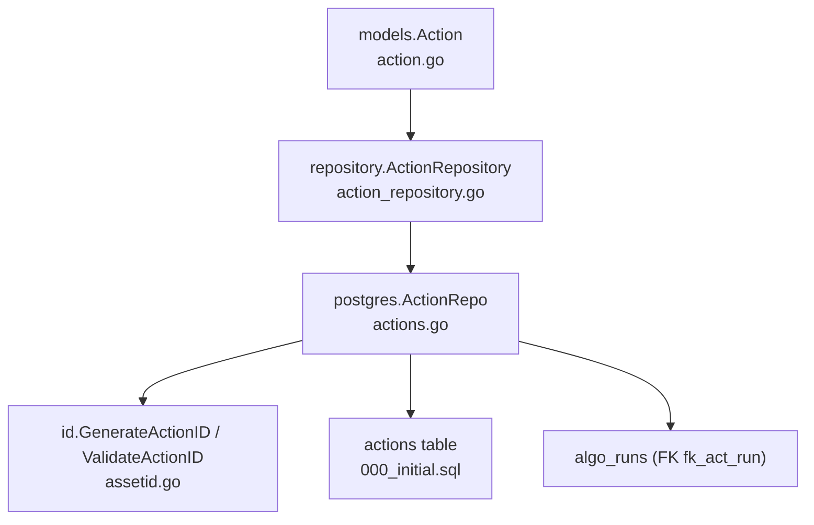
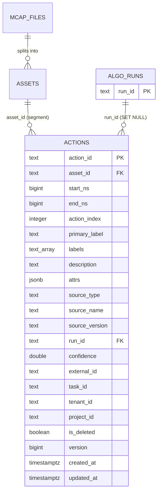
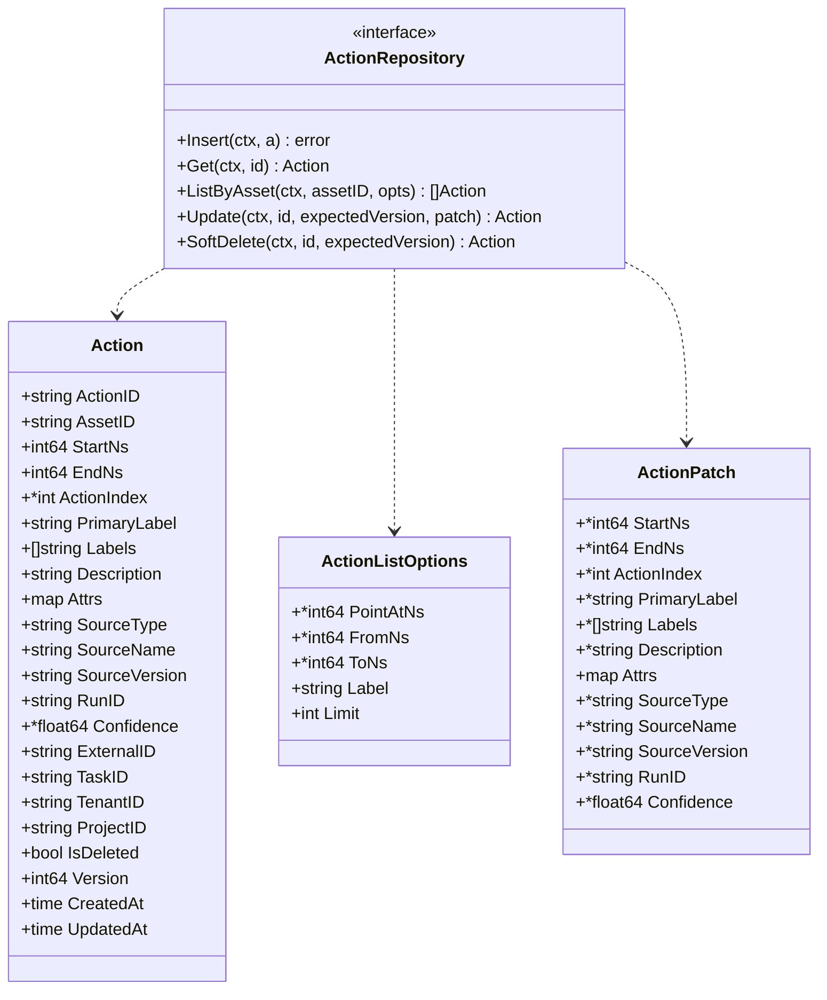
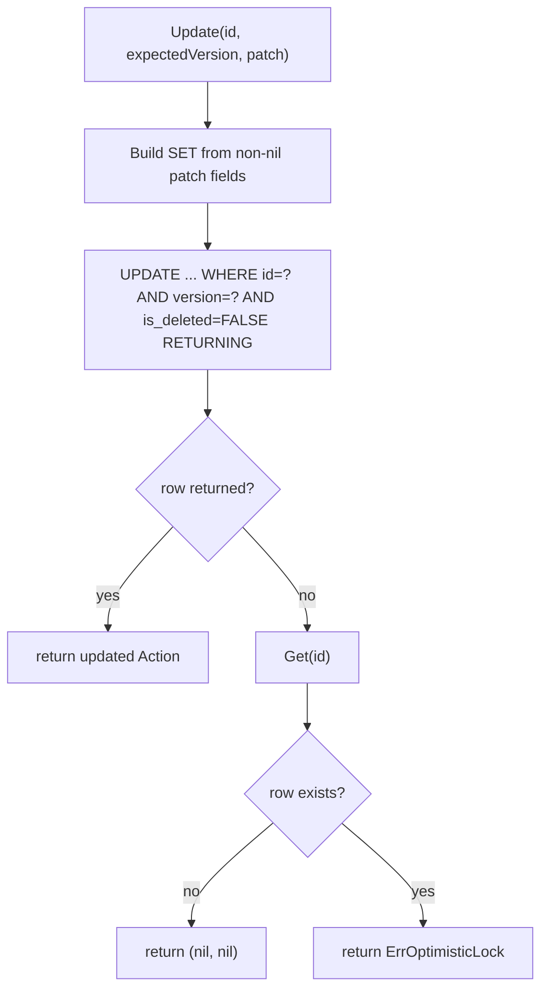
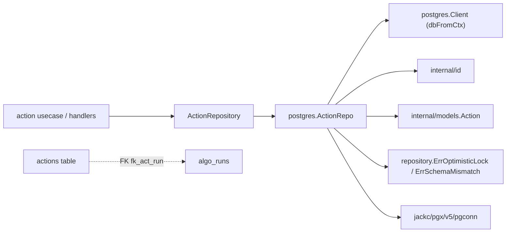

# Action Model

<cite>
**Referenced Files in This Document**

- [backend/internal/models/action.go](file://backend/internal/models/action.go)
- [backend/internal/postgres/actions.go](file://backend/internal/postgres/actions.go)
- [backend/internal/repository/action_repository.go](file://backend/internal/repository/action_repository.go)
- [backend/migrations/000_initial.sql](file://backend/migrations/000_initial.sql)
- [backend/internal/id/assetid.go](file://backend/internal/id/assetid.go)
</cite>

## Table of Contents
1. [Introduction](#introduction)
2. [Project Structure](#project-structure)
3. [Core Components](#core-components)
4. [Architecture Overview](#architecture-overview)
5. [Detailed Component Analysis](#detailed-component-analysis)
6. [Dependency Analysis](#dependency-analysis)
7. [Performance Considerations](#performance-considerations)
8. [Troubleshooting Guide](#troubleshooting-guide)
9. [Conclusion](#conclusion)
10. [Appendices](#appendices)

## Introduction

The **action model** captures *time-ranged annotations* that live inside a
segment asset. In the cyber-databrew business model, data flows through three
layers: an `mcap` file is split into one or more `seg` (segment) assets, and
each segment can carry zero or more **actions**. An action is a half-open time
interval `[start_ns, end_ns)`, measured in nanoseconds relative to the segment,
together with labelling, provenance, and free-form attribute metadata. Actions
are the unit used to describe *what happens, and when* inside a segment — for
example a manipulation event, a state transition, or a machine-detected
behaviour window.

Unlike top-level assets, actions are deliberately lightweight. They do **not**
participate in the asset lifecycle state machine, are **not** part of the asset
list surface, and are **not** delivered to customers directly. Their identity,
storage, and access semantics are fully owned by a single table (`actions`), a
single model type (`models.Action`), a repository interface
(`repository.ActionRepository`), and a Postgres implementation
(`postgres.ActionRepo`). The model supports four kinds of producers — humans,
algorithms, deterministic rules, and the system itself — and tracks provenance
so that machine-generated annotations can be re-imported idempotently and
correlated back to the algorithm run that produced them.

**Section sources**
- [backend/internal/models/action.go](file://backend/internal/models/action.go#L14-L49)
- [backend/internal/repository/action_repository.go](file://backend/internal/repository/action_repository.go#L27-L33)

## Project Structure

The action data model is realised by four cooperating files plus the schema
migration. Each occupies a distinct layer of the backend.

- **Model** — [backend/internal/models/action.go](file://backend/internal/models/action.go):
  the `Action` struct, its JSON contract, the `source_type` enum constants, and
  the `IsValidActionSourceType` validator.
- **Repository contract** — [backend/internal/repository/action_repository.go](file://backend/internal/repository/action_repository.go):
  the `ActionRepository` interface, the `ActionListOptions` query filter, and
  the `ActionPatch` partial-update carrier.
- **Postgres implementation** — [backend/internal/postgres/actions.go](file://backend/internal/postgres/actions.go):
  `ActionRepo`, the shared `actionSelectCols` projection, `scanAction`, and the
  CRUD/list methods that translate the model into SQL.
- **Identity** — [backend/internal/id/assetid.go](file://backend/internal/id/assetid.go):
  `GenerateActionID` / `ValidateActionID`, which mint and check the 8-character
  short IDs that primary-key the table.
- **Schema** — [backend/migrations/000_initial.sql](file://backend/migrations/000_initial.sql):
  the `actions` table definition, its CHECK constraints, primary key, the
  foreign key to `algo_runs`, and the five partial/GIN indexes.

**Diagram sources**
- [backend/internal/models/action.go](file://backend/internal/models/action.go#L21-L49)
- [backend/internal/postgres/actions.go](file://backend/internal/postgres/actions.go#L17-L26)
- [backend/migrations/000_initial.sql](file://backend/migrations/000_initial.sql#L50-L75)

**Section sources**
- [backend/internal/postgres/actions.go](file://backend/internal/postgres/actions.go#L1-L26)
- [backend/internal/repository/action_repository.go](file://backend/internal/repository/action_repository.go#L1-L54)

## Core Components

### The `Action` model

`Action` is one row in the `actions` table. It groups four families of fields:
the time-range identity (`ActionID`, `AssetID`, `StartNs`, `EndNs`,
`ActionIndex`), the descriptive payload (`PrimaryLabel`, `Labels`,
`Description`, `Attrs`), provenance (`SourceType`, `SourceName`,
`SourceVersion`, `RunID`, `Confidence`, `ExternalID`, `TaskID`), and tenancy +
bookkeeping (`TenantID`, `ProjectID`, `IsDeleted`, `Version`, `CreatedAt`,
`UpdatedAt`). The doc comment on the type pins three invariants the persistence
layer guarantees: `asset_id` must reference an asset of type `segment`,
`end_ns >= start_ns` (a DB CHECK), and actions never participate in lifecycle
state, deliveries, or the asset list.

### The `source_type` enum

Four constants enumerate the legal producers of an action:
`ActionSourceHuman` (`"human"`), `ActionSourceAlgo` (`"algo"`),
`ActionSourceRule` (`"rule"`), and `ActionSourceSystem` (`"system"`).
`IsValidActionSourceType` is the validator applied at the usecase boundary,
mirroring the column default of `'human'`.

### The repository contract

`ActionRepository` exposes five methods — `Insert`, `Get`, `ListByAsset`,
`Update`, `SoftDelete` — all context-aware. The interface comment notes the
methods are *tx-aware via context*: when invoked inside `Client.WithTx` they run
on the transaction, allowing a caller to append a matching `asset_events` row in
the same atomic write. Two helper structs accompany the interface:
`ActionListOptions` (time-window and label filters plus a limit) and
`ActionPatch` (nil-pointer-means-unchanged partial update fields).

**Section sources**
- [backend/internal/models/action.go](file://backend/internal/models/action.go#L5-L59)
- [backend/internal/repository/action_repository.go](file://backend/internal/repository/action_repository.go#L9-L71)

## Architecture Overview

An action is the leaf of the `mcap → seg → action` hierarchy. Segments are
themselves assets (`asset_type='segment'`); `actions.asset_id` points at such a
segment. The single relational foreign key from the table is `fk_act_run`, which
links `run_id` to `algo_runs(run_id)` with `ON DELETE SET NULL`, so deleting an
algorithm run nulls the back-reference rather than cascading away annotations.

The read/write path always passes through `ActionRepo`, which is the only place
that knows the SQL. A shared column list, `actionSelectCols`, is reused by
`Get`, `Update`, `SoftDelete`, and `ListByAsset` so every read returns an
identically shaped row that `scanAction` can decode. `COALESCE` wrappers in the
projection convert NULLable columns into their zero values, keeping the Go model
free of optionality for text fields.

**Diagram sources**
- [backend/migrations/000_initial.sql](file://backend/migrations/000_initial.sql#L50-L75)
- [backend/migrations/000_initial.sql](file://backend/migrations/000_initial.sql#L886-L887)

**Section sources**
- [backend/internal/postgres/actions.go](file://backend/internal/postgres/actions.go#L28-L35)
- [backend/migrations/000_initial.sql](file://backend/migrations/000_initial.sql#L50-L75)

## Detailed Component Analysis

### Identity and the short-ID scheme

Actions are primary-keyed by an 8-character alphanumeric short ID rather than a
UUID. On `Insert`, if `ActionID` is empty the repository calls
`id.GenerateActionID()`; in all cases it then validates with
`id.ValidateActionID`, rejecting any value that is not exactly 8 alphanumeric
characters. The table reinforces this with the CHECK constraint
`actions_id_chk` (`action_id ~ '^[0-9A-Za-z]{8}$'`).

Legacy databases whose `actions.action_id` column is still UUID-typed will fail
to accept a short ID. `isActionIDSchemaMismatch` detects this case — a Postgres
`22P02` (invalid_text_representation) error whose message mentions `type uuid` —
and `Insert` rethrows it as `repository.ErrSchemaMismatch` with the hint to run
migration `018_actions_id_to_short_id.sql`.

**Diagram sources**
- [backend/internal/models/action.go](file://backend/internal/models/action.go#L21-L49)
- [backend/internal/repository/action_repository.go](file://backend/internal/repository/action_repository.go#L19-L71)

**Section sources**
- [backend/internal/postgres/actions.go](file://backend/internal/postgres/actions.go#L93-L102)
- [backend/internal/postgres/actions.go](file://backend/internal/postgres/actions.go#L156-L163)
- [backend/migrations/000_initial.sql](file://backend/migrations/000_initial.sql#L73-L73)

### Insert and idempotent re-import

`Insert` validates the incoming action before writing: `asset_id` is required,
`end_ns` must be `>= start_ns`, an empty `source_type` defaults to `"human"`,
and the action ID is generated/validated as above. `labels` falls back to an
empty array, and `attrs` is marshalled to JSON, defaulting to `{}` when empty.
A `nullable` helper converts empty strings to SQL `NULL`, so optional text
columns store NULL rather than empty strings — important for the partial unique
index on `external_id`.

The crucial behaviour is conflict mapping. The partial unique index
`uq_actions_external` enforces uniqueness on `(asset_id, source_name,
external_id)` whenever `external_id` is non-null and the row is live. When that
constraint is violated, Postgres returns SQLSTATE `23505`, which `Insert`
translates into `repository.ErrOptimisticLock`. Callers use this signal to
decide between upserting and surfacing a conflict — the mechanism that makes
re-importing the same algorithm output idempotent.

**Section sources**
- [backend/internal/postgres/actions.go](file://backend/internal/postgres/actions.go#L77-L154)
- [backend/migrations/000_initial.sql](file://backend/migrations/000_initial.sql#L929-L929)

### Optimistic concurrency: Update and SoftDelete

Both `Update` and `SoftDelete` use compare-and-swap on `(action_id, version)`.
`Update` builds its SET clause dynamically from the non-nil fields of
`ActionPatch`, always appending `updated_at = now()` and `version = version + 1`.
Each patched column is bound positionally; `labels` is cast `::text[]` and
`attrs` is marshalled and cast `::jsonb`. The WHERE clause requires
`version = expectedVersion` and `is_deleted = FALSE`, and the statement
`RETURNING actionSelectCols` so the caller receives the freshly mutated row.

When the UPDATE matches no row, the repository disambiguates the two possible
causes: it re-`Get`s the action; if the row is gone (or soft-deleted) it returns
`(nil, nil)`, otherwise the row exists but the version differs and it returns
`repository.ErrOptimisticLock`. `SoftDelete` follows the identical pattern but
its SET clause is the fixed `is_deleted = TRUE, updated_at = now(), version =
version + 1`. Note that `ActionPatch` cannot patch `external_id`, `task_id`,
`tenant_id`, or `project_id` — those are write-once at insert time.

**Diagram sources**
- [backend/internal/postgres/actions.go](file://backend/internal/postgres/actions.go#L180-L262)

**Section sources**
- [backend/internal/postgres/actions.go](file://backend/internal/postgres/actions.go#L180-L290)
- [backend/internal/repository/action_repository.go](file://backend/internal/repository/action_repository.go#L56-L71)

### Querying within a segment: ListByAsset

`ListByAsset` is the read surface for "all actions in this segment, filtered by
time and label". It always pins `asset_id = $1` and `is_deleted = FALSE`, then
appends conditions from `ActionListOptions`:

- **PointAtNs** — `start_ns <= p AND end_ns > p`, selecting intervals whose
  half-open range covers the timestamp.
- **FromNs** — `end_ns > from`, keeping intervals that end after the lower
  bound.
- **ToNs** — `start_ns < to`, keeping intervals that begin before the upper
  bound. `FromNs` and `ToNs` together express overlap with `[from, to)`.
- **Label** — `primary_label = $ OR labels @> ARRAY[$]::text[]`, matching either
  the primary label or membership in the labels array (the latter served by the
  GIN index).

The limit is clamped: a non-positive limit defaults to `200`, and anything above
`1000` is capped to `1000`. Results are ordered `start_ns ASC, action_id ASC`,
giving a deterministic order suitable for stable pagination.

**Section sources**
- [backend/internal/postgres/actions.go](file://backend/internal/postgres/actions.go#L292-L348)
- [backend/internal/repository/action_repository.go](file://backend/internal/repository/action_repository.go#L9-L25)

### Row decoding and NULL handling

`scanAction` decodes a row produced by `actionSelectCols`. Because the
projection `COALESCE`s text and array columns, scanning lands plain Go zero
values. The two genuinely optional scalars — `action_index` and `confidence` —
are scanned into pointers and copied to the model only when non-nil. `attrs` is
read as raw bytes and JSON-unmarshalled; both `Attrs` and `Labels` are
normalised to empty (non-nil) containers so the JSON contract never emits
`null` for them.

**Section sources**
- [backend/internal/postgres/actions.go](file://backend/internal/postgres/actions.go#L39-L75)

## Dependency Analysis

The model layer (`models.Action`) has no dependencies beyond the standard
`time` package. The repository contract depends only on `models`. The Postgres
implementation pulls in `internal/id` (ID generation/validation),
`internal/models`, `internal/repository` (for the shared sentinel errors and
the patch/options types), and `jackc/pgx/v5/pgconn` for typed SQLSTATE error
inspection. The `dbFromCtx` helper lets every method transparently run inside an
ambient transaction when one is present. At the schema level the only cross-table
relationship is the `fk_act_run` foreign key to `algo_runs`.

**Diagram sources**
- [backend/internal/postgres/actions.go](file://backend/internal/postgres/actions.go#L1-L15)
- [backend/migrations/000_initial.sql](file://backend/migrations/000_initial.sql#L886-L887)

**Section sources**
- [backend/internal/postgres/actions.go](file://backend/internal/postgres/actions.go#L1-L26)
- [backend/internal/repository/action_repository.go](file://backend/internal/repository/action_repository.go#L1-L7)

## Performance Considerations

The `actions` table carries five purpose-built indexes, four of which are
*partial* on `is_deleted = FALSE` so soft-deleted rows never bloat the working
set:

- **`idx_actions_asset_start`** — `(asset_id, start_ns)`. The workhorse for
  `ListByAsset`: it serves the `asset_id` equality predicate and supports the
  `start_ns ASC` ordering, so the common segment-scoped, time-ordered scan can
  be index-driven.
- **`idx_actions_primary_label`** — `(primary_label)` where `primary_label IS
  NOT NULL`. Backs label lookups via the `primary_label = $` branch.
- **`idx_actions_labels_gin`** — GIN over `labels`. Backs the array-containment
  branch `labels @> ARRAY[$]::text[]`.
- **`idx_actions_run_id`** — `(source_name, run_id)` where `run_id IS NOT
  NULL`. Supports finding all annotations produced by a given algorithm run.
- **`uq_actions_external`** — unique on `(asset_id, source_name, external_id)`
  where `external_id IS NOT NULL`. Both enforces idempotent re-import and serves
  as a lookup index.

Pagination is bounded server-side: `ListByAsset` clamps the limit to `[1, 1000]`
with a default of `200`, preventing unbounded result sets. Because the list is
ordered by `(start_ns, action_id)` — the latter breaking ties deterministically
— callers can paginate stably. There is no obvious N+1 risk in the repository
itself; all reads are single statements over a single table.

**Section sources**
- [backend/migrations/000_initial.sql](file://backend/migrations/000_initial.sql#L925-L929)
- [backend/internal/postgres/actions.go](file://backend/internal/postgres/actions.go#L294-L331)

## Troubleshooting Guide

- **Insert returns `ErrOptimisticLock`** — a live row already exists with the
  same `(asset_id, source_name, external_id)`. This is the idempotency signal,
  not a transient lock; the caller should upsert or report a conflict rather
  than blindly retrying. See the `23505` mapping in `Insert`.
- **Insert returns `ErrSchemaMismatch`** — the database still has a UUID-typed
  `action_id` column (a `22P02` error mentioning `type uuid`). Run migration
  `018_actions_id_to_short_id.sql`. The hint string is
  `actionIDSchemaMismatchHint`.
- **"invalid action_id" error** — the supplied `ActionID` is not exactly 8
  alphanumeric characters; `ValidateActionID` and the `actions_id_chk` CHECK both
  reject it. Leave the field empty to let the server generate one.
- **Insert rejected on range** — `end_ns < start_ns` fails the in-code guard and
  the `actions_range_chk` constraint. Ensure `end_ns >= start_ns`.
- **Update/SoftDelete returns `(nil, nil)`** — the action is missing or
  soft-deleted. Returns `ErrOptimisticLock` instead when the row exists but the
  caller's `expectedVersion` is stale; re-read with `Get` and retry with the
  current version.
- **A field won't update** — `ActionPatch` only patches the time range,
  `action_index`, label/description/attrs, and source/run/confidence fields.
  `external_id`, `task_id`, `tenant_id`, and `project_id` are not patchable.
- **Missing actions in a list** — verify the time window: `ListByAsset` uses
  half-open `[start, end)` semantics and `is_deleted = FALSE`; soft-deleted rows
  are invisible.

**Section sources**
- [backend/internal/postgres/actions.go](file://backend/internal/postgres/actions.go#L80-L102)
- [backend/internal/postgres/actions.go](file://backend/internal/postgres/actions.go#L141-L163)
- [backend/internal/postgres/actions.go](file://backend/internal/postgres/actions.go#L246-L290)

## Conclusion

The action model is a compact, self-contained subsystem: a single table, a
single Go struct, a five-method repository, and a thin Postgres implementation.
It encodes time-ranged annotations on segment assets with rich provenance,
soft-delete + optimistic-concurrency semantics, idempotent re-import keyed on
`(asset_id, source_name, external_id)`, and indexes tuned for the dominant
"list within a segment by time and label" query. By deliberately staying out of
the asset lifecycle, delivery, and listing surfaces, it remains a low-coupling
leaf of the `mcap → seg → action` hierarchy.

## Appendices

### Appendix A — `actions` column reference

| Column | Type | Nullable / Default | Notes |
| --- | --- | --- | --- |
| `action_id` | text | NOT NULL, PK | 8-char alnum (`actions_id_chk`) |
| `asset_id` | text | NOT NULL | references a `segment` asset |
| `start_ns` | bigint | NOT NULL | interval start (ns) |
| `end_ns` | bigint | NOT NULL | interval end; `>= start_ns` (`actions_range_chk`) |
| `action_index` | integer | nullable | optional ordinal within segment |
| `primary_label` | text | nullable | indexed when non-null |
| `labels` | text[] | NOT NULL DEFAULT `{}` | GIN-indexed |
| `description` | text | nullable | free-text |
| `attrs` | jsonb | NOT NULL DEFAULT `{}` | arbitrary metadata |
| `source_type` | text | NOT NULL DEFAULT `'human'` | enum: human/algo/rule/system |
| `source_name` | text | nullable | producer identifier |
| `source_version` | text | nullable | producer version |
| `run_id` | text | nullable, FK `fk_act_run` | → `algo_runs` (SET NULL) |
| `confidence` | double precision | nullable | machine confidence |
| `external_id` | text | nullable | idempotency key component |
| `task_id` | text | nullable | originating task |
| `tenant_id` | text | nullable | tenancy |
| `project_id` | text | nullable | tenancy |
| `is_deleted` | boolean | NOT NULL DEFAULT false | soft-delete flag |
| `version` | bigint | NOT NULL DEFAULT 1 | optimistic-lock counter |
| `created_at` | timestamptz | NOT NULL DEFAULT now() | |
| `updated_at` | timestamptz | NOT NULL DEFAULT now() | bumped on every mutation |

**Section sources**
- [backend/migrations/000_initial.sql](file://backend/migrations/000_initial.sql#L50-L75)

### Appendix B — `source_type` enum values

| Constant | Value |
| --- | --- |
| `ActionSourceHuman` | `"human"` |
| `ActionSourceAlgo` | `"algo"` |
| `ActionSourceRule` | `"rule"` |
| `ActionSourceSystem` | `"system"` |

**Section sources**
- [backend/internal/models/action.go](file://backend/internal/models/action.go#L5-L12)
- [backend/internal/models/action.go](file://backend/internal/models/action.go#L51-L59)

### Appendix C — constraints and indexes

| Object | Definition |
| --- | --- |
| `actions_pkey` | PRIMARY KEY (`action_id`) |
| `actions_id_chk` | CHECK `action_id ~ '^[0-9A-Za-z]{8}$'` |
| `actions_range_chk` | CHECK `end_ns >= start_ns` |
| `fk_act_run` | FK `run_id` → `algo_runs(run_id)` ON DELETE SET NULL |
| `idx_actions_asset_start` | `(asset_id, start_ns)` WHERE not deleted |
| `idx_actions_primary_label` | `(primary_label)` WHERE not deleted AND non-null |
| `idx_actions_labels_gin` | GIN `(labels)` WHERE not deleted |
| `idx_actions_run_id` | `(source_name, run_id)` WHERE not deleted AND non-null |
| `uq_actions_external` | UNIQUE `(asset_id, source_name, external_id)` WHERE non-null AND not deleted |

**Section sources**
- [backend/migrations/000_initial.sql](file://backend/migrations/000_initial.sql#L601-L602)
- [backend/migrations/000_initial.sql](file://backend/migrations/000_initial.sql#L886-L887)
- [backend/migrations/000_initial.sql](file://backend/migrations/000_initial.sql#L925-L929)
