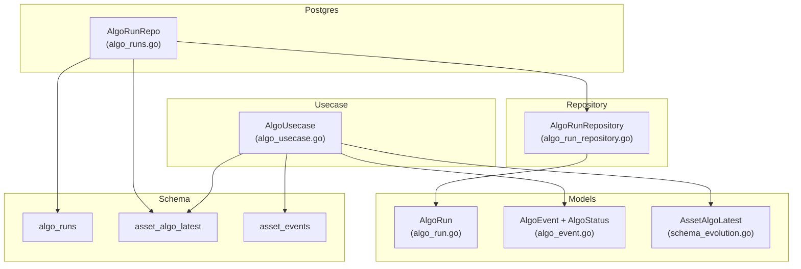
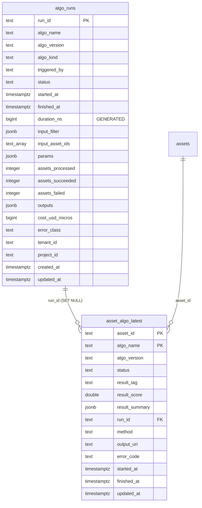
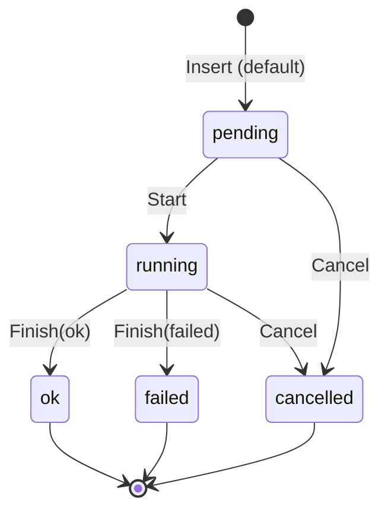
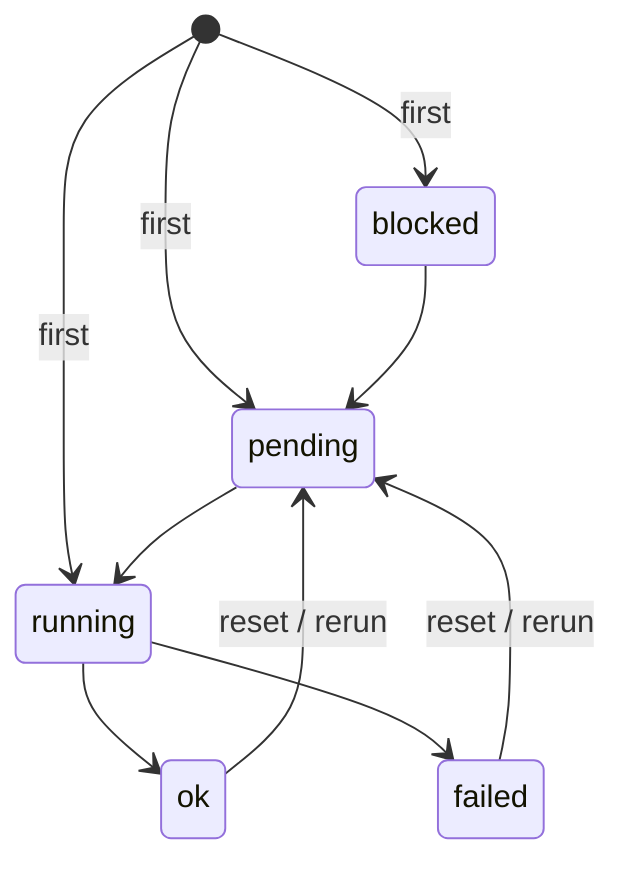
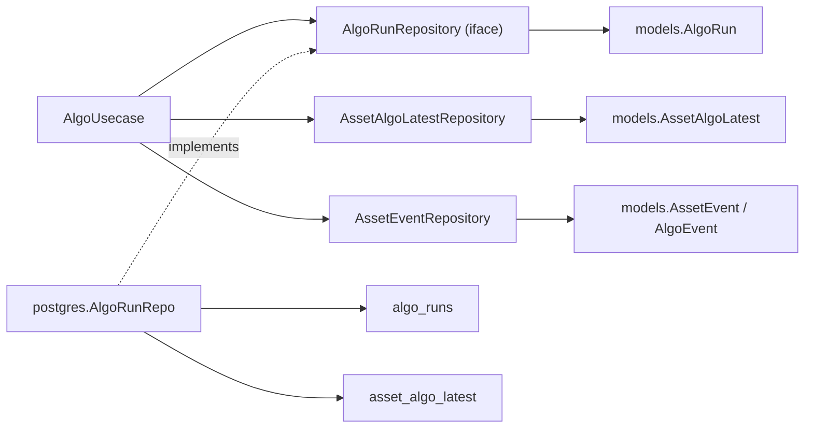

# Algorithm Run Model

<cite>
**Referenced Files in This Document**

- [backend/internal/models/algo_run.go](file://backend/internal/models/algo_run.go)
- [backend/internal/models/algo_event.go](file://backend/internal/models/algo_event.go)
- [backend/internal/models/schema_evolution.go](file://backend/internal/models/schema_evolution.go)
- [backend/internal/postgres/algo_runs.go](file://backend/internal/postgres/algo_runs.go)
- [backend/internal/repository/algo_run_repository.go](file://backend/internal/repository/algo_run_repository.go)
- [backend/internal/usecase/asset/algo_usecase.go](file://backend/internal/usecase/asset/algo_usecase.go)
- [backend/migrations/000_initial.sql](file://backend/migrations/000_initial.sql)
</cite>

## Table of Contents
1. [Introduction](#introduction)
2. [Project Structure](#project-structure)
3. [Core Components](#core-components)
4. [Architecture Overview](#architecture-overview)
5. [Detailed Component Analysis](#detailed-component-analysis)
6. [Dependency Analysis](#dependency-analysis)
7. [Performance Considerations](#performance-considerations)
8. [Troubleshooting Guide](#troubleshooting-guide)
9. [Conclusion](#conclusion)
10. [Appendices](#appendices)

## Introduction

The algorithm run model captures **how algorithms execute against assets and how their results are recorded** in cyber-databrew. It is built from three cooperating pieces of state:

- **`algo_runs`** — a first-class execution-event table. Each row is one invocation of one algorithm (or pipeline) over a batch of assets, with lifecycle status, timing, resource accounting (CPU / GPU / cost), and aggregate counters (assets processed / succeeded / failed). It was introduced as CYB-1018 to give every algorithm execution a durable, queryable identity (`run_id`).
- **`asset_algo_latest`** — a **projection** table that holds the *current* per-algorithm state of each asset, keyed by `(asset_id, algo_name)`. This is the read-optimized source of truth for "what is the status of algorithm X on asset Y right now", deliberately decoupled from the `assets` row so concurrent algorithm finishes never contend on `assets.version`.
- **The event log** — every state transition is appended to the `asset_events` outbox (event types `algo_started` / `algo_finished` / `algo_failed` / `algo_reset` / `algo_unblocked`). The legacy `asset_algo_events` audit table has been retired; `models.AlgoEvent` is now a *view shape* hydrated from `asset_events`.

Together they implement a CQRS-style split: `algo_runs` is the run-level command/result record, `asset_algo_latest` is the per-asset materialized projection, and `asset_events` is the append-only change feed that ES / Iceberg / audit consumers replay. This page documents the data model — the columns, the status enums, the legal state machine, and the relational constraints that hold them together.

**Section sources**
- [backend/internal/models/algo_run.go](file://backend/internal/models/algo_run.go#L1-L50)
- [backend/internal/usecase/asset/algo_usecase.go](file://backend/internal/usecase/asset/algo_usecase.go#L1-L18)
- [backend/migrations/000_initial.sql](file://backend/migrations/000_initial.sql#L77-L139)

## Project Structure

The algorithm run model spans the Go model layer, the repository contracts, the Postgres implementation, the usecase that orchestrates transitions, and the SQL schema:

- **Models** (`backend/internal/models/`)
  - `algo_run.go` — the `AlgoRun` struct and `AlgoRunStatus*` constants.
  - `algo_event.go` — the `AlgoEvent` view shape, the `AlgoStatus` enum, flat-key field suffix constants, and the `ValidAlgoTransitions` state machine.
  - `schema_evolution.go` — the `AssetAlgoLatest` projection struct and the `AssetEvent` outbox struct.
- **Repository contract** (`backend/internal/repository/algo_run_repository.go`) — the `AlgoRunRepository` interface, the `AlgoRunFinishPatch` and `AlgoRunListFilter` DTOs, the `AffectedAsset` projection row, and the sentinel errors.
- **Postgres implementation** (`backend/internal/postgres/algo_runs.go`) — `AlgoRunRepo`, the conditional `Start` / `Finish` / `Cancel` state writes, and the `GetAffectedAssets` join into `asset_algo_latest`.
- **Usecase** (`backend/internal/usecase/asset/algo_usecase.go`) — `AlgoUsecase`, which transactionally writes the `asset_algo_latest` projection and appends to `asset_events`, enforcing the legal transitions.
- **Schema** (`backend/migrations/000_initial.sql`) — the consolidated DDL: the `algo_runs` and `asset_algo_latest` tables, their check constraints, indexes, foreign keys, and triggers.



**Diagram sources**
- [backend/internal/models/algo_run.go](file://backend/internal/models/algo_run.go#L14-L50)
- [backend/internal/postgres/algo_runs.go](file://backend/internal/postgres/algo_runs.go#L17-L67)
- [backend/internal/usecase/asset/algo_usecase.go](file://backend/internal/usecase/asset/algo_usecase.go#L83-L96)

**Section sources**
- [backend/internal/models/algo_run.go](file://backend/internal/models/algo_run.go#L1-L50)
- [backend/internal/models/algo_event.go](file://backend/internal/models/algo_event.go#L1-L53)
- [backend/internal/models/schema_evolution.go](file://backend/internal/models/schema_evolution.go#L34-L53)
- [backend/internal/repository/algo_run_repository.go](file://backend/internal/repository/algo_run_repository.go#L1-L67)

## Core Components

### The `AlgoRun` record

`AlgoRun` is the in-memory representation of an `algo_runs` row. It carries identity (`RunID`, `AlgoName`, `AlgoVersion`, `AlgoKind`), provenance (`TriggeredBy`, `CodeCommit`, `ImageDigest`, `PipelineName`, `PipelineVersion`), inputs (`InputFilter` as JSON, `InputAssetIDs` as a text array, `Params` as JSON), lifecycle timing (`Status`, `StartedAt`, `FinishedAt`, `DurationNs`), aggregate counters (`AssetsProcessed`, `AssetsSucceeded`, `AssetsFailed`, `ActionsCreated`, `MetricsWritten`), resource accounting (`CPUSeconds`, `GPUSeconds`, `CostUSDMicros`), outputs/error fields, tenancy (`TenantID`, `ProjectID`), external runtime pointers (`ExternalRuntime`, `ExternalUrl`), and bookkeeping (`CreatedAt`, `UpdatedAt`, `RowVersion`). Pointer types (`*time.Time`, `*int`, `*int64`, `*string`) mark nullable columns so an unset value round-trips as SQL `NULL` rather than a zero.

### The `AlgoRun` status constants

The run-level lifecycle is a small closed set, declared as plain `string` constants:

```
AlgoRunStatusPending   = "pending"
AlgoRunStatusRunning   = "running"
AlgoRunStatusOK        = "ok"
AlgoRunStatusFailed    = "failed"
AlgoRunStatusCancelled = "cancelled"
```

These map directly to the `algo_runs_status_check` CHECK constraint in the schema.

### The `AssetAlgoLatest` projection

`AssetAlgoLatest` is the per-asset current state of one algorithm. It is keyed by `(asset_id, algo_name)` and holds the latest `status`, the result envelope (`ResultTag`, `ResultScore`, `ResultSummary`), the producing `RunID`, the execution metadata (`Method`, `ModelURI`, `OutputURI`), error fields, timing, tenancy, and `UpdatedAt`. Crucially it stores `AlgoVersion`, which the usecase uses as a monotonic guard so that a finish from an older algorithm version cannot clobber a newer one.

### The `AlgoEvent` view shape and `AlgoStatus` enum

`AlgoEvent` is no longer a stored row — it is the shape returned by `ListAlgoEvents`, hydrated from `asset_events`. It carries `EventID`, `AssetID`, `AlgoKey`, `PrevStatus`, `NewStatus`, `RunID`, `Reason`, and `CreatedAt`. The per-asset algorithm status is the `AlgoStatus` enum (`blocked`, `pending`, `running`, `ok`, `failed`), distinct from the run-level status set in that it adds `blocked` and omits `cancelled`.

**Section sources**
- [backend/internal/models/algo_run.go](file://backend/internal/models/algo_run.go#L5-L50)
- [backend/internal/models/schema_evolution.go](file://backend/internal/models/schema_evolution.go#L34-L53)
- [backend/internal/models/algo_event.go](file://backend/internal/models/algo_event.go#L5-L53)

## Architecture Overview

The relational schema ties the three tables together. `asset_algo_latest` references both `assets` (the asset must exist) and `algo_runs` (the run that produced the current state, nullable with `ON DELETE SET NULL`). The `algo_runs.duration_ns` column is a `GENERATED ALWAYS` stored column computed from `finished_at - started_at`, so duration is never written by application code.



**Diagram sources**
- [backend/migrations/000_initial.sql](file://backend/migrations/000_initial.sql#L77-L139)
- [backend/migrations/000_initial.sql](file://backend/migrations/000_initial.sql#L604-L608)
- [backend/migrations/000_initial.sql](file://backend/migrations/000_initial.sql#L850-L884)

**Section sources**
- [backend/migrations/000_initial.sql](file://backend/migrations/000_initial.sql#L77-L139)
- [backend/migrations/000_initial.sql](file://backend/migrations/000_initial.sql#L600-L608)

## Detailed Component Analysis

### The `AlgoRun` struct

`AlgoRun` is declared in `algo_run.go`. Every field maps one-to-one to an `algo_runs` column, and the JSON tags drive both API serialization and the projection that the frontend consumes. The struct uses pointer types for every nullable column so that a missing counter (e.g. `AssetsFailed`) serializes as `null` rather than `0`.

```mermaid
classDiagram
  class AlgoRun {
    +string RunID
    +string AlgoName
    +string AlgoVersion
    +string AlgoKind
    +string TriggeredBy
    +string Status
    +*time.Time StartedAt
    +*time.Time FinishedAt
    +*int64 DurationNs
    +map InputFilter
    +[]string InputAssetIDs
    +map Params
    +string CodeCommit
    +string ImageDigest
    +string PipelineName
    +string PipelineVersion
    +*int AssetsProcessed
    +*int AssetsSucceeded
    +*int AssetsFailed
    +*int ActionsCreated
    +*int MetricsWritten
    +map Outputs
    +*int64 CPUSeconds
    +*int64 GPUSeconds
    +*int64 CostUSDMicros
    +string ErrorClass
    +string ErrorMessage
    +string TenantID
    +string ProjectID
    +*string ExternalRuntime
    +*string ExternalUrl
    +time.Time CreatedAt
    +time.Time UpdatedAt
    +int64 RowVersion
  }
  class AssetAlgoLatest {
    +string AssetID
    +string AlgoName
    +string AlgoVersion
    +string Status
    +string ResultTag
    +*float64 ResultScore
    +map ResultSummary
    +string RunID
    +string Method
    +string ModelURI
    +string OutputURI
    +string ErrorCode
    +string ErrorMessage
    +*time.Time StartedAt
    +*time.Time FinishedAt
    +string TenantID
    +string ProjectID
    +time.Time UpdatedAt
  }
  class AlgoEvent {
    +string EventID
    +string AssetID
    +string AlgoKey
    +*string PrevStatus
    +string NewStatus
    +*string RunID
    +*string Reason
    +time.Time CreatedAt
  }
  AlgoRun "1" --> "0..*" AssetAlgoLatest : run_id
  AssetAlgoLatest ..> AlgoEvent : transition appends
```



**Diagram sources**
- [backend/internal/models/algo_run.go](file://backend/internal/models/algo_run.go#L14-L50)
- [backend/internal/models/schema_evolution.go](file://backend/internal/models/schema_evolution.go#L34-L53)
- [backend/internal/models/algo_event.go](file://backend/internal/models/algo_event.go#L5-L16)

**Section sources**
- [backend/internal/models/algo_run.go](file://backend/internal/models/algo_run.go#L14-L50)

### Run lifecycle state machine

The run-level status flows `pending → running → {ok | failed}`, with `cancelled` reachable from either `pending` or `running`. The Postgres layer enforces this with **conditional UPDATEs** that include the expected prior status in the `WHERE` clause: `Start` only matches `status = 'pending'`, `Finish` only matches `status = 'running'`, and `Cancel` matches `status IN ('pending','running')`. When zero rows match, the repository re-reads the row to distinguish "not found" (`ErrAlgoRunNotFound`), "already in the target state" (idempotent success), and "illegal transition" (`ErrAlgoRunBadState`).



**Diagram sources**
- [backend/internal/postgres/algo_runs.go](file://backend/internal/postgres/algo_runs.go#L144-L173)
- [backend/internal/postgres/algo_runs.go](file://backend/internal/postgres/algo_runs.go#L175-L224)
- [backend/internal/postgres/algo_runs.go](file://backend/internal/postgres/algo_runs.go#L290-L322)

**Section sources**
- [backend/internal/postgres/algo_runs.go](file://backend/internal/postgres/algo_runs.go#L144-L322)
- [backend/internal/models/algo_run.go](file://backend/internal/models/algo_run.go#L5-L12)

### Per-asset algo state machine

The per-asset lifecycle is a *different and stricter* machine than the run lifecycle. It is declared as `ValidAlgoTransitions` in `algo_event.go`. The first observation (empty prior status) may enter `blocked`, `pending`, or `running`; `blocked → pending`; `pending → running`; `running → {ok | failed}`; and a finished algorithm may be re-queued via `failed → pending` or `ok → pending` (a re-run / reset). Note there is no `cancelled` state at the asset level — cancellation lives only on the run.



**Diagram sources**
- [backend/internal/models/algo_event.go](file://backend/internal/models/algo_event.go#L43-L53)

**Section sources**
- [backend/internal/models/algo_event.go](file://backend/internal/models/algo_event.go#L18-L53)
- [backend/internal/usecase/asset/algo_usecase.go](file://backend/internal/usecase/asset/algo_usecase.go#L295-L340)

### Insert, scan, and JSON handling

`Insert` defaults `CreatedAt`/`UpdatedAt` to now and `Status` to `pending`, then writes the JSON fields (`input_filter`, `params`, `outputs`) through `algoRunJSONFields`, which substitutes `{}` for nil maps so the `NOT NULL DEFAULT '{}'::jsonb` columns are always satisfied. A unique-violation (`23505`) on the primary key surfaces as `ErrDuplicateRunID`. Reads share the `algoRunSelectCols` column list and `scanAlgoRun`, which decodes the JSON columns and dereferences nullable `*string` columns back to plain strings via `derefStr`.

**Section sources**
- [backend/internal/postgres/algo_runs.go](file://backend/internal/postgres/algo_runs.go#L27-L129)
- [backend/internal/postgres/algo_runs.go](file://backend/internal/postgres/algo_runs.go#L355-L391)

### Listing runs and affected assets

`List` builds a dynamic `WHERE` from `AlgoRunListFilter` (`AlgoName`, `Status`, `StartedAfter`, `StartedBefore`), runs a `COUNT(*)` for the total, then a paged query ordered by `created_at DESC`. The page size is clamped to `[1, 200]` with a default of 50. `GetAffectedAssets` joins back into `asset_algo_latest` by `run_id`, returning `AffectedAsset` rows (asset id, algo name/version, status, result tag/score, run id, updated-at) ordered by `asset_id`.

**Section sources**
- [backend/internal/postgres/algo_runs.go](file://backend/internal/postgres/algo_runs.go#L226-L288)
- [backend/internal/postgres/algo_runs.go](file://backend/internal/postgres/algo_runs.go#L324-L353)
- [backend/internal/repository/algo_run_repository.go](file://backend/internal/repository/algo_run_repository.go#L35-L55)

### The event log

Every asset-level transition is appended to the `asset_events` outbox in the same transaction as the `asset_algo_latest` write. The usecase emits the algo-lifecycle event types `algo_started`, `algo_finished` (status `ok`), `algo_failed`, `algo_reset`, and `algo_unblocked`. `ListAlgoEvents` filters `asset_events` down to those types, deserializes the `algoEventEnvelope` payload, and maps each row into an `AlgoEvent` view (newest first, limit 200). The legacy stand-alone `asset_algo_events` table was dropped; its columns survive only in `AlgoEvent`'s field names and the flat-key suffix constants in `algo_event.go`.

**Section sources**
- [backend/internal/usecase/asset/algo_usecase.go](file://backend/internal/usecase/asset/algo_usecase.go#L46-L65)
- [backend/internal/usecase/asset/algo_usecase.go](file://backend/internal/usecase/asset/algo_usecase.go#L641-L700)
- [backend/internal/models/algo_event.go](file://backend/internal/models/algo_event.go#L31-L41)

## Dependency Analysis

The model is consumed top-down: the usecase depends on the repository interface, the Postgres repo implements it, and both depend on the model structs and the schema.



`AlgoUsecase` deliberately holds the `AssetRepository` only as a read-only existence check; it never writes to `assets`, because algo state is owned by `asset_algo_latest`. This is the architectural decoupling that avoids OCC contention on `assets.version`.

**Diagram sources**
- [backend/internal/usecase/asset/algo_usecase.go](file://backend/internal/usecase/asset/algo_usecase.go#L83-L96)
- [backend/internal/repository/algo_run_repository.go](file://backend/internal/repository/algo_run_repository.go#L57-L67)
- [backend/internal/postgres/algo_runs.go](file://backend/internal/postgres/algo_runs.go#L17-L25)

**Section sources**
- [backend/internal/usecase/asset/algo_usecase.go](file://backend/internal/usecase/asset/algo_usecase.go#L83-L113)
- [backend/internal/repository/algo_run_repository.go](file://backend/internal/repository/algo_run_repository.go#L57-L67)

## Performance Considerations

The schema is indexed for the dominant access patterns:

- `idx_algo_runs_algo` — `(algo_name, algo_version, started_at DESC)` for "latest runs of a given algorithm".
- `idx_algo_runs_started` — `(started_at DESC)` for the global recent-runs feed.
- `idx_algo_runs_status` — a **partial** index over `status` covering only `pending`/`running`/`failed`, so the worker queue scan never pays for the large terminal-state population.
- `idx_algo_runs_triggered` — a partial index over `triggered_by` matching `manual:%`, for the manual-run audit view.
- `idx_asset_algo_latest_algo_status`, `idx_asset_algo_latest_algo_version`, and the partial `idx_asset_algo_latest_run` (where `run_id IS NOT NULL`) support per-algorithm filtering and the `GetAffectedAssets` join; `idx_asset_algo_latest_updated` supports recency ordering.

Other performance-relevant properties: `duration_ns` is a generated stored column, so listing runs never recomputes it; `asset_algo_latest` is keyed by `(asset_id, algo_name)`, giving O(1) upsert per algorithm without touching `assets`; conditional UPDATEs (`WHERE ... AND status = $expected`) make `Start`/`Finish`/`Cancel` idempotent and lock-free; and the list path clamps `PageSize` to 200 to bound result-set size.

**Section sources**
- [backend/migrations/000_initial.sql](file://backend/migrations/000_initial.sql#L714-L728)
- [backend/migrations/000_initial.sql](file://backend/migrations/000_initial.sql#L86-L90)
- [backend/internal/postgres/algo_runs.go](file://backend/internal/postgres/algo_runs.go#L252-L260)

## Troubleshooting Guide

- **`ErrDuplicateRunID` on Insert** — the `run_id` already exists (PK violation, SQLSTATE `23505`). `run_id` must match the `algo_runs_run_id_check` pattern `^[0-9A-Za-z]{16}$`; reuse an existing id or generate a new 16-char id.
- **`ErrAlgoRunBadState`** — a `Start`/`Finish`/`Cancel` matched zero rows and the row is not already in the target state. The run is in an unexpected status (e.g. `Finish` called on a `pending` run that was never started). Re-read with `Get` to inspect the current `status`.
- **`ErrAlgoRunNotFound`** — the `run_id` does not exist in `algo_runs` at all.
- **A finish silently doing nothing** — `Start`/`Finish`/`Cancel` are idempotent: if the row is already in the requested status the call returns `nil`. This is by design, not a failure.
- **Stale per-asset state after a re-run** — `asset_algo_latest` is updated only by `AlgoUsecase` transitions; verify the transition was legal under `ValidAlgoTransitions` and that the `algo_version` monotonic guard did not reject an out-of-order finish.
- **Missing events in `ListAlgoEvents`** — events live in `asset_events`, not the retired `asset_algo_events` table. Only the types in `algoEventTypes` are returned, malformed payloads are skipped, and the list is capped at 200 newest rows.
- **Constraint rejection on `algo_kind`** — must be one of `processing`, `split`, `qa`, `enrichment` per `algo_runs_algo_kind_check`.

**Section sources**
- [backend/internal/postgres/algo_runs.go](file://backend/internal/postgres/algo_runs.go#L60-L67)
- [backend/internal/postgres/algo_runs.go](file://backend/internal/postgres/algo_runs.go#L159-L222)
- [backend/migrations/000_initial.sql](file://backend/migrations/000_initial.sql#L115-L117)
- [backend/internal/usecase/asset/algo_usecase.go](file://backend/internal/usecase/asset/algo_usecase.go#L657-L700)

## Conclusion

The algorithm run model separates three responsibilities: `algo_runs` is the durable run-level record (identity, timing, counters, cost), `asset_algo_latest` is the per-asset materialized projection (current status keyed by `(asset_id, algo_name)`), and `asset_events` is the append-only change feed that retired the legacy `asset_algo_events` table. The run lifecycle (`pending → running → ok/failed`, plus `cancelled`) is enforced by conditional UPDATEs in the Postgres layer, while the stricter per-asset lifecycle (with `blocked` and reset edges) is enforced by `ValidAlgoTransitions` in the usecase. Generated columns, partial indexes, and a projection table that never touches `assets` keep the model both consistent and fast.

## Appendices

### Appendix A — `algo_runs` columns

| Column | Type | Notes |
| --- | --- | --- |
| `run_id` | text PK | matches `^[0-9A-Za-z]{16}$` |
| `algo_name` | text NOT NULL | |
| `algo_version` | text NOT NULL | |
| `algo_kind` | text NOT NULL | `processing` / `split` / `qa` / `enrichment` |
| `triggered_by` | text NOT NULL | `manual:%` indexed |
| `status` | text NOT NULL | default `pending`; CHECK enum |
| `started_at` / `finished_at` | timestamptz | nullable |
| `duration_ns` | bigint GENERATED | `finished_at - started_at` in ns |
| `input_filter` / `params` / `outputs` | jsonb NOT NULL | default `{}` |
| `input_asset_ids` | text[] | |
| `code_commit` / `image_digest` | text | provenance |
| `pipeline_name` / `pipeline_version` | text | |
| `assets_processed` / `assets_succeeded` / `assets_failed` | integer | counters |
| `actions_created` / `metrics_written` | integer | counters |
| `cpu_seconds` / `gpu_seconds` / `cost_usd_micros` | bigint | resource accounting |
| `error_class` / `error_message` | text | |
| `tenant_id` / `project_id` | text | tenancy |
| `external_runtime` / `external_url` | text | external runtime pointers |
| `created_at` / `updated_at` | timestamptz NOT NULL | default `now()` |

**Section sources**
- [backend/migrations/000_initial.sql](file://backend/migrations/000_initial.sql#L77-L118)

### Appendix B — `asset_algo_latest` columns

| Column | Type | Notes |
| --- | --- | --- |
| `asset_id` | text PK | FK → `assets(asset_id)` |
| `algo_name` | text PK | composite key with `asset_id` |
| `algo_version` | text NOT NULL | monotonic guard |
| `status` | text NOT NULL | per-asset `AlgoStatus` |
| `result_tag` | text | |
| `result_score` | double precision | |
| `result_summary` | jsonb NOT NULL | default `{}` |
| `run_id` | text | FK → `algo_runs(run_id)` ON DELETE SET NULL |
| `method` / `model_uri` / `output_uri` | text | execution metadata |
| `error_code` / `error_message` | text | |
| `started_at` / `finished_at` | timestamptz | |
| `tenant_id` / `project_id` | text | |
| `updated_at` | timestamptz NOT NULL | default `now()`, bumped by trigger |

**Section sources**
- [backend/migrations/000_initial.sql](file://backend/migrations/000_initial.sql#L120-L139)
- [backend/migrations/000_initial.sql](file://backend/migrations/000_initial.sql#L607-L608)
- [backend/migrations/000_initial.sql](file://backend/migrations/000_initial.sql#L840-L884)

### Appendix C — Status enums and transitions

| Scope | Enum | Values |
| --- | --- | --- |
| Run (`AlgoRunStatus*`) | string consts | `pending`, `running`, `ok`, `failed`, `cancelled` |
| Per-asset (`AlgoStatus`) | typed enum | `blocked`, `pending`, `running`, `ok`, `failed` |

| Current (per-asset) | Allowed next |
| --- | --- |
| `""` (first) | `blocked`, `pending`, `running` |
| `blocked` | `pending` |
| `pending` | `running` |
| `running` | `ok`, `failed` |
| `failed` | `pending` |
| `ok` | `pending` |

**Section sources**
- [backend/internal/models/algo_run.go](file://backend/internal/models/algo_run.go#L5-L12)
- [backend/internal/models/algo_event.go](file://backend/internal/models/algo_event.go#L18-L53)

### Appendix D — Repository contract

| Member | Purpose |
| --- | --- |
| `Insert` / `Get` / `Exists` | create and read runs |
| `Start` / `Finish` / `Cancel` | conditional lifecycle transitions |
| `List` | paged, filtered listing (`AlgoRunListFilter`) |
| `GetAffectedAssets` | assets touched by a run (join into `asset_algo_latest`) |
| `ErrDuplicateRunID` / `ErrAlgoRunNotFound` / `ErrAlgoRunBadState` / `ErrAlgoRunOptimistic` | sentinel errors |
| `AlgoRunFinishPatch` | terminal-state fields written by `Finish` |
| `AffectedAsset` | projection row returned by `GetAffectedAssets` |

**Section sources**
- [backend/internal/repository/algo_run_repository.go](file://backend/internal/repository/algo_run_repository.go#L11-L67)
