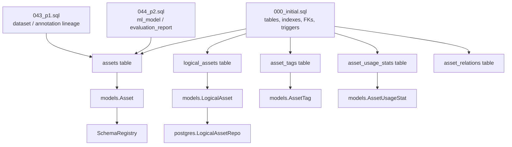
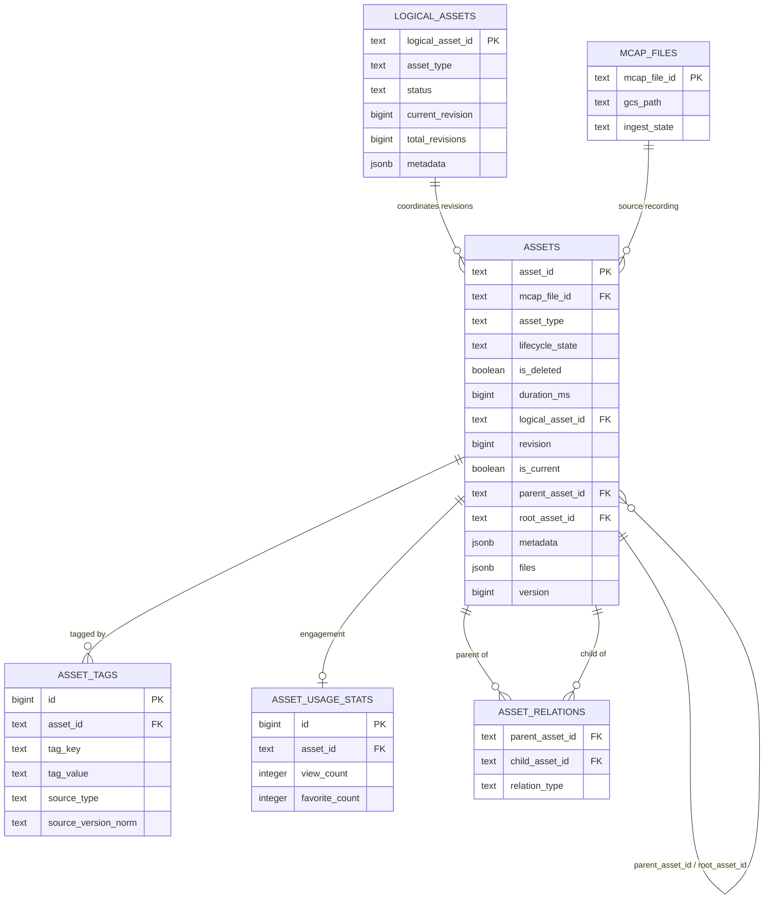
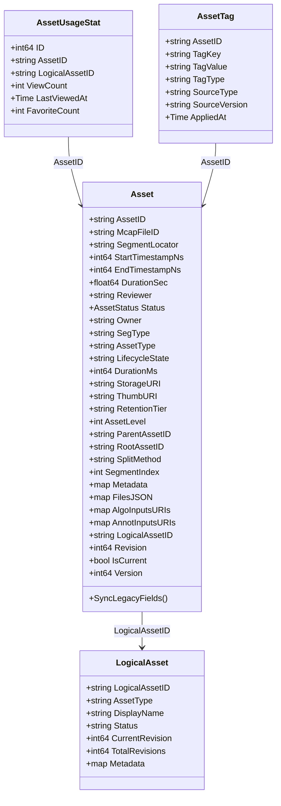
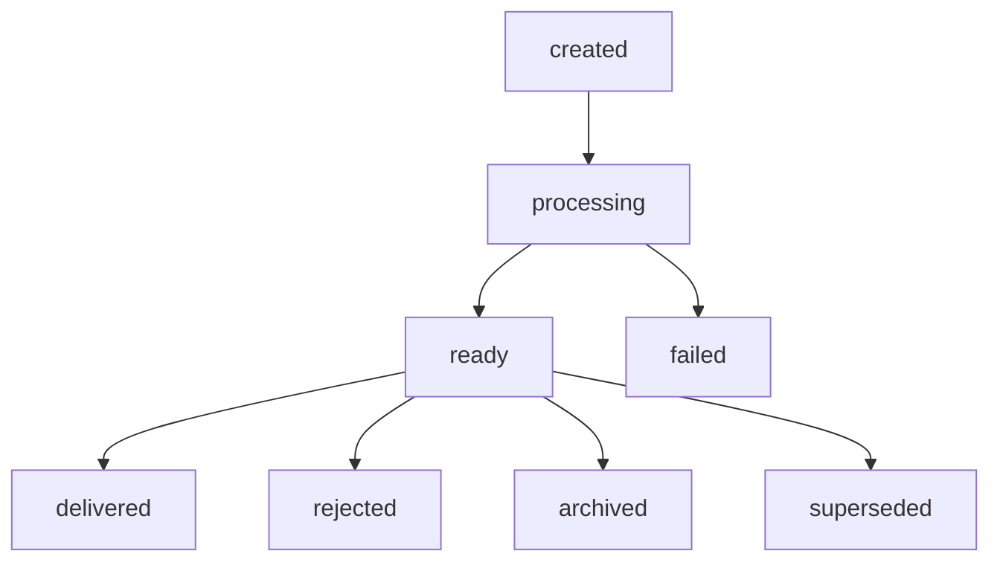
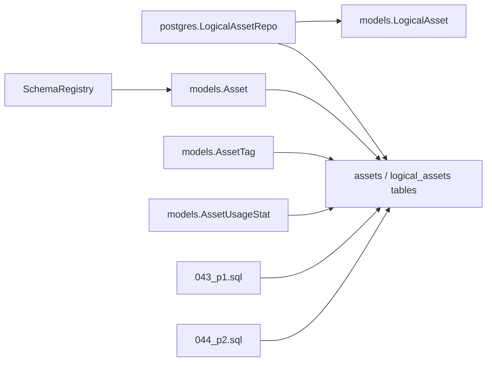

# Asset Model

<cite>
**Referenced Files in This Document**

- [backend/internal/models/asset.go](file://backend/internal/models/asset.go)
- [backend/internal/models/asset_type_schema.go](file://backend/internal/models/asset_type_schema.go)
- [backend/internal/models/asset_usage_stat.go](file://backend/internal/models/asset_usage_stat.go)
- [backend/internal/models/schema_evolution.go](file://backend/internal/models/schema_evolution.go)
- [backend/internal/postgres/logical_assets.go](file://backend/internal/postgres/logical_assets.go)
- [backend/migrations/000_initial.sql](file://backend/migrations/000_initial.sql)
- [backend/migrations/044_asset_model_expansion_p1.sql](file://backend/migrations/044_asset_model_expansion_p1.sql)
- [backend/migrations/045_asset_model_p2.sql](file://backend/migrations/045_asset_model_p2.sql)
</cite>

## Table of Contents
1. [Introduction](#introduction)
2. [Project Structure](#project-structure)
3. [Core Components](#core-components)
4. [Architecture Overview](#architecture-overview)
5. [Detailed Component Analysis](#detailed-component-analysis)
6. [Dependency Analysis](#dependency-analysis)
7. [Performance Considerations](#performance-considerations)
8. [Troubleshooting Guide](#troubleshooting-guide)
9. [Conclusion](#conclusion)
10. [Appendices](#appendices)

## Introduction

The **asset model** is the relational and Go-domain backbone of cyber-databrew. An *asset* is the canonical unit of curated data — most commonly a time segment of an MCAP recording, but also (as of the Phase 1/Phase 2 schema expansion) datasets, annotation results, ML models, and evaluation reports. Each physical asset row lives in the `assets` table, keyed by an 8-character base-62 `asset_id`. Assets are organized into multi-version families through the `logical_assets` table, carry typed metadata validated against per-type JSON Schemas, accumulate free-form assertions in `asset_tags`, track engagement in `asset_usage_stats`, and form lineage graphs through `asset_relations`.

The model evolved through three layered migrations: `000_initial.sql` provisions the full schema (legacy + typed fields, multi-version identity, indexes, foreign keys, triggers); `044_asset_model_expansion_p1.sql` widens lineage relation types and relaxes the MCAP requirement for `dataset`/`annotation_result`; `045_asset_model_p2.sql` adds `ml_model`/`evaluation_report` asset types and a broad set of ML lineage edges. The Go side (`internal/models`) mirrors these columns and adds **dual-write backward-compatibility** logic so that legacy CF-era fields (`status`, `type`, `duration_sec`) and the new typed fields (`lifecycle_state`, `asset_type`, `duration_ms`) stay coherent in API responses.

This page is the authoritative reference for the asset entities: their fields and types, enum/status domains, relationships and foreign keys, the asset-type schema registry, JSONB columns, validation rules, and the indexing strategy.

**Section sources**
- [backend/internal/models/asset.go](file://backend/internal/models/asset.go#L41-L133)
- [backend/migrations/000_initial.sql](file://backend/migrations/000_initial.sql#L310-L358)

## Project Structure

The asset model spans the Go domain layer, the PostgreSQL repository layer, and the SQL migrations. The relevant files are:

- **`backend/internal/models/asset.go`** — the `Asset`, `LogicalAsset`, `McapFile`, `Delivery`, and `DeliveryItem` structs; the `AssetStatus`, `IngestState`, and `DeliveryStatus` enum types; and the lifecycle-state helpers (`IsValidLifecycleState`, `LifecycleToStatus`, `StatusToLifecycle`, `SyncLegacyFields`).
- **`backend/internal/models/asset_type_schema.go`** — the `SchemaRegistry` that holds code-defined JSON Schemas per `asset_type` and the validation functions for `dataset`, `annotation_result`, `ml_model`, and `evaluation_report`.
- **`backend/internal/models/asset_usage_stat.go`** — the `AssetUsageStat` engagement-counter struct.
- **`backend/internal/models/schema_evolution.go`** — the `AssetTag` projection struct (multi-source tag rows).
- **`backend/internal/postgres/logical_assets.go`** — `LogicalAssetRepo`, the repository that coordinates revisions, current-pointer flipping, and `logical_assets` CRUD.
- **`backend/migrations/000_initial.sql`** — the canonical schema (tables, constraints, indexes, FKs, triggers).
- **`backend/migrations/044_asset_model_expansion_p1.sql`** / **`045_asset_model_p2.sql`** — the asset-type and lineage-relation expansions.

**Diagram sources**
- [backend/migrations/000_initial.sql](file://backend/migrations/000_initial.sql#L246-L358)
- [backend/internal/models/asset.go](file://backend/internal/models/asset.go#L51-L133)
- [backend/internal/postgres/logical_assets.go](file://backend/internal/postgres/logical_assets.go#L14-L22)

**Section sources**
- [backend/internal/models/asset.go](file://backend/internal/models/asset.go#L1-L133)
- [backend/internal/models/asset_type_schema.go](file://backend/internal/models/asset_type_schema.go#L11-L63)

## Core Components

The asset model is built from five core entities:

1. **`Asset`** — the physical row in `assets`. It combines an identity block (`AssetID`, `McapFileID`, `SegmentLocator`), a legacy CF-era block retained for dual-write (`StartTimestampNs`, `EndTimestampNs`, `DurationSec`, `Status`, `SegType`), a typed Phase-2 block (`AssetType`, `LifecycleState`, `DurationMs`, `StorageURI`, retention/split lineage fields), a multi-version identity block (`LogicalAssetID`, `Revision`, `IsCurrent`), and timestamps with an optimistic-lock `Version` (defined at [asset.go#L51-L118](file://backend/internal/models/asset.go#L51-L118)).

2. **`LogicalAsset`** — the version coordinator. A logical asset owns a family of `Asset` revisions, tracks `CurrentRevision`/`TotalRevisions`, and carries a `status` of `active` or `archived`. Its `asset_type` is immutable after creation (enforced by a DB trigger). Defined at [asset.go#L120-L133](file://backend/internal/models/asset.go#L120-L133).

3. **`SchemaRegistry`** — a per-`asset_type` JSON-Schema registry seeded with four schemas (`dataset`, `annotation_result`, `ml_model`, `evaluation_report`). `Validate` runs the code-defined validator for a type when one is registered; unregistered types pass through unchecked. Defined at [asset_type_schema.go#L11-L63](file://backend/internal/models/asset_type_schema.go#L11-L63).

4. **`AssetTag`** — a row in the `asset_tags` projection table. Multiple rows may share `(asset_id, tag_key)` as long as `(source_type, source_version)` differs (CYB-1015 multi-source assertions). Defined at [schema_evolution.go#L13-L27](file://backend/internal/models/schema_evolution.go#L13-L27).

5. **`AssetUsageStat`** — one engagement-counter row per asset (`view_count`, `favorite_count`, `last_viewed_at`). Defined at [asset_usage_stat.go#L6-L15](file://backend/internal/models/asset_usage_stat.go#L6-L15).

**Section sources**
- [backend/internal/models/asset.go](file://backend/internal/models/asset.go#L51-L133)
- [backend/internal/models/asset_type_schema.go](file://backend/internal/models/asset_type_schema.go#L11-L29)
- [backend/internal/models/schema_evolution.go](file://backend/internal/models/schema_evolution.go#L13-L27)
- [backend/internal/models/asset_usage_stat.go](file://backend/internal/models/asset_usage_stat.go#L6-L15)

## Architecture Overview

Assets sit at the center of a star of related tables. The `assets` table is the hub; `logical_assets` is its version coordinator (one-to-many, deferred FK); `asset_tags`, `asset_usage_stats`, and `asset_relations` are satellites keyed by `asset_id`; `mcap_files` is an upstream source referenced by `mcap_file_id`. The Go domain layer reflects these rows and reconciles legacy and typed fields via `SyncLegacyFields`.

**Diagram sources**
- [backend/migrations/000_initial.sql](file://backend/migrations/000_initial.sql#L246-L358)
- [backend/migrations/000_initial.sql](file://backend/migrations/000_initial.sql#L851-L911)

**Section sources**
- [backend/migrations/000_initial.sql](file://backend/migrations/000_initial.sql#L246-L479)

## Detailed Component Analysis

### Entity fields & types

The Go `Asset` struct and the `assets` table line up field-for-field, with a deliberate split between legacy and typed columns. The struct exposes the layout below; the class diagram is drawn directly from [asset.go#L51-L133](file://backend/internal/models/asset.go#L51-L133).

Notable type mappings between Go and PostgreSQL:

- `StartTimestampNs`/`EndTimestampNs` are Go `int64` ↔ SQL `bigint NOT NULL` ([000_initial.sql#L313-L314](file://backend/migrations/000_initial.sql#L313-L314)).
- `SegmentLocator` is a deterministic SHA-1 (Go `string`, omitempty) ↔ SQL `character(40)` ([asset.go#L56-L57](file://backend/internal/models/asset.go#L56-L57), [000_initial.sql#L315](file://backend/migrations/000_initial.sql#L315)).
- `DurationMs` is `int64` ↔ `bigint DEFAULT 0 NOT NULL`; `DurationSec` is a *derived* field computed as `DurationMs / 1000.0` and is not stored ([asset.go#L139-L148](file://backend/internal/models/asset.go#L139-L148), [000_initial.sql#L319](file://backend/migrations/000_initial.sql#L319)).
- `Status` is **API-only** — it is derived from `lifecycle_state` and is explicitly *not* persisted to PostgreSQL ([asset.go#L64](file://backend/internal/models/asset.go#L64)).
- `SegmentIndex`, `ParentStartOffsetMs`, `ParentEndOffsetMs` are nullable Go pointers ↔ nullable SQL `integer`/`bigint` ([asset.go#L99-L101](file://backend/internal/models/asset.go#L99-L101), [000_initial.sql#L332-L334](file://backend/migrations/000_initial.sql#L332-L334)).

**Diagram sources**
- [backend/internal/models/asset.go](file://backend/internal/models/asset.go#L51-L133)
- [backend/internal/models/asset_usage_stat.go](file://backend/internal/models/asset_usage_stat.go#L6-L15)
- [backend/internal/models/schema_evolution.go](file://backend/internal/models/schema_evolution.go#L13-L27)

**Section sources**
- [backend/internal/models/asset.go](file://backend/internal/models/asset.go#L51-L173)
- [backend/migrations/000_initial.sql](file://backend/migrations/000_initial.sql#L310-L358)

### Enums / status values

The model defines several string-enum domains in Go, several of which are mirrored by SQL `CHECK` constraints:

- **`AssetStatus`** (`approved`, `rejected`, `superseded`, `archived`) — API-only legacy lifecycle ([asset.go#L8-L16](file://backend/internal/models/asset.go#L8-L16)).
- **`IngestState`** (`pending`, `summarized`, `failed`) — mirrors `cf:process.ingest_state` on `McapFile` ([asset.go#L18-L25](file://backend/internal/models/asset.go#L18-L25)).
- **`DeliveryStatus`** (`pending`, `delivered`, `failed`, `accepted`, `rejected`, `recalled`, `cancelled`, `archived`) ([asset.go#L27-L39](file://backend/internal/models/asset.go#L27-L39)).
- **`lifecycle_state`** — the canonical persisted lifecycle. The Go `validLifecycleStates` set is `created`, `processing`, `ready`, `rejected`, `delivered`, `archived`, `superseded`, `failed` ([asset.go#L274-L283](file://backend/internal/models/asset.go#L274-L283)), and is kept in lockstep with the DB `chk_lifecycle_state` constraint, which allows exactly `created`, `processing`, `ready`, `delivered`, `archived`, `superseded`, `failed`, `rejected` ([000_initial.sql#L356](file://backend/migrations/000_initial.sql#L356)).
- **`logical_assets.status`** — restricted to `active` or `archived` by `logical_assets_status_check` ([000_initial.sql#L478](file://backend/migrations/000_initial.sql#L478)). The repository defaults an empty status to `active` on insert ([logical_assets.go#L58-L60](file://backend/internal/postgres/logical_assets.go#L58-L60)).

The lifecycle↔status mapping is bidirectional. `LifecycleToStatus` maps e.g. `created`/`processing`/`ready`/`delivered` → `approved`, `failed`/`rejected` → `rejected` (default `approved`); `StatusToLifecycle` maps `approved` → `ready`, etc. (default `created`) ([asset.go#L291-L326](file://backend/internal/models/asset.go#L291-L326)).

**Section sources**
- [backend/internal/models/asset.go](file://backend/internal/models/asset.go#L8-L39)
- [backend/internal/models/asset.go](file://backend/internal/models/asset.go#L270-L326)
- [backend/migrations/000_initial.sql](file://backend/migrations/000_initial.sql#L356-L356)

### Relationships & foreign keys

The `assets` table participates in a rich foreign-key graph, all declared in `000_initial.sql`:

- `fk_assets_logical_asset`: `assets.logical_asset_id → logical_assets.logical_asset_id`, `DEFERRABLE INITIALLY DEFERRED` (so a logical asset and its first revision can be inserted in one transaction) ([000_initial.sql#L890](file://backend/migrations/000_initial.sql#L890)).
- `fk_assets_mcap` / `assets_mcap_file_id_fkey` equivalent: `assets.mcap_file_id → mcap_files.mcap_file_id` ([000_initial.sql#L893](file://backend/migrations/000_initial.sql#L893)).
- `assets_parent_asset_id_fkey`: self-reference `assets.parent_asset_id → assets.asset_id` ([000_initial.sql#L872](file://backend/migrations/000_initial.sql#L872)).
- `assets_root_asset_id_fkey`: self-reference `assets.root_asset_id → assets.asset_id` ([000_initial.sql#L875](file://backend/migrations/000_initial.sql#L875)).
- Satellite FKs into `assets`: `asset_tags_asset_id_fkey`, `asset_usage_stats_asset_id_fkey`, `asset_algo_latest_asset_id_fkey`, `asset_relations_parent_asset_id_fkey`, `asset_relations_child_asset_id_fkey`, `delivery_items_asset_id_fkey` ([000_initial.sql#L851-L911](file://backend/migrations/000_initial.sql#L851-L911)).

Lineage between assets is modeled in `asset_relations`, whose composite primary key is `(parent_asset_id, child_asset_id, relation_type)` ([000_initial.sql#L622-L623](file://backend/migrations/000_initial.sql#L622-L623)). The set of allowed `relation_type` values grew across migrations:

- Base (`000_initial.sql#L257`): `split_from`, `derived_from`, `contains`, `sampled_from`, `merged_from`, `revision_of`, `annotated_from`, `materialized_from`.
- Phase 1 (`043`): same eight, plus relaxing the `chk_mcap_file_required` constraint for `dataset`/`annotation_result` ([044_asset_model_expansion_p1.sql#L3-L22](file://backend/migrations/044_asset_model_expansion_p1.sql#L3-L22)).
- Phase 2 (`044`): adds `trained_from`, `evaluated_on`, `validated_on`, `configured_by`, `fine_tuned_from`, `features_from`, `tested_on`, `evaluates`, `compares_to`, `calibrated_from`, `generated_by`, plus a `metadata jsonb` column on `asset_relations` ([045_asset_model_p2.sql#L3-L30](file://backend/migrations/045_asset_model_p2.sql#L3-L30)).

The `LogicalAssetRepo` enforces the version-family invariants in code: `MaxRevision` reads the highest revision for a logical asset, `BumpRevision` advances `current_revision`/`total_revisions`, `CurrentAssetID` finds the single `is_current = TRUE` row, and `ClearCurrentForLogical` clears the current flag before a new revision is promoted ([logical_assets.go#L77-L124](file://backend/internal/postgres/logical_assets.go#L77-L124)).

**Section sources**
- [backend/migrations/000_initial.sql](file://backend/migrations/000_initial.sql#L246-L258)
- [backend/migrations/000_initial.sql](file://backend/migrations/000_initial.sql#L851-L911)
- [backend/internal/postgres/logical_assets.go](file://backend/internal/postgres/logical_assets.go#L77-L124)

### Asset type schema & evolution

`asset_type` defaults to `segment` ([000_initial.sql#L316](file://backend/migrations/000_initial.sql#L316)). The `chk_mcap_file_required` constraint makes `mcap_file_id` mandatory *unless* the type is one of the "derived" families. That exemption list expanded with each migration:

- `000_initial.sql#L357`: `derived_asset`, `dataset`, `annotation_result`.
- `043` re-states the same three ([044_asset_model_expansion_p1.sql#L18-L22](file://backend/migrations/044_asset_model_expansion_p1.sql#L18-L22)).
- `044` adds `ml_model` and `evaluation_report` ([045_asset_model_p2.sql#L32-L37](file://backend/migrations/045_asset_model_p2.sql#L32-L37)).

Typed metadata for these families is validated by the in-process `SchemaRegistry`, which registers four code-defined JSON Schemas ([asset_type_schema.go#L22-L29](file://backend/internal/models/asset_type_schema.go#L22-L29)):

| asset_type | Key fields (from schema) | Validator |
| --- | --- | --- |
| `dataset` | `format` (enum: parquet/csv/image/lidar/other), `record_count`, `size_bytes`, `annotation_status` (raw/annotated/validated), `time_range{start,end}`, `source` | `validateDatasetMetadata` ([L146-L180](file://backend/internal/models/asset_type_schema.go#L146-L180)) |
| `annotation_result` | `tool`, `schema_version`, `annotators[]`, `quality_score` (0–1), `coverage` (0–1), `artifact_uri` | `validateAnnotationResultMetadata` ([L182-L205](file://backend/internal/models/asset_type_schema.go#L182-L205)) |
| `ml_model` | `framework`, `architecture`, `metrics{}`, `quantization`, `artifact_uri`, `training_run_id`, `base_model` | `validateMLModelMetadata` ([L207-L217](file://backend/internal/models/asset_type_schema.go#L207-L217)) |
| `evaluation_report` | `model_id`, `dataset_id`, `metrics{}`, `evaluated_at`, `tool`, `report_uri` | `validateEvaluationReportMetadata` ([L219-L229](file://backend/internal/models/asset_type_schema.go#L219-L229)) |

`Validate` is permissive for unknown types (returns `nil`) and treats a `nil` metadata map as empty ([asset_type_schema.go#L39-L51](file://backend/internal/models/asset_type_schema.go#L39-L51)). All schemas set `additionalProperties: true`, so unknown keys are accepted while known keys are type-checked.

On the `logical_assets` side, `asset_type` is **immutable**: the `logical_assets_type_immutable` trigger raises `LA1` if an `UPDATE` changes the type ([000_initial.sql#L35-L44](file://backend/migrations/000_initial.sql#L35-L44), [000_initial.sql#L838](file://backend/migrations/000_initial.sql#L838)).

**Section sources**
- [backend/internal/models/asset_type_schema.go](file://backend/internal/models/asset_type_schema.go#L21-L229)
- [backend/migrations/044_asset_model_expansion_p1.sql](file://backend/migrations/044_asset_model_expansion_p1.sql#L18-L22)
- [backend/migrations/045_asset_model_p2.sql](file://backend/migrations/045_asset_model_p2.sql#L32-L37)

### JSON / JSONB fields

The `assets` table carries four JSONB columns, all `DEFAULT '{}'::jsonb NOT NULL`: `metadata`, `files`, `algo_inputs_uris`, `annot_inputs_uris` ([000_initial.sql#L340-L343](file://backend/migrations/000_initial.sql#L340-L343)). On the Go side these surface as `Metadata`, `FilesJSON`, `AlgoInputsURIs`, `AnnotInputsURIs` ([asset.go#L102-L105](file://backend/internal/models/asset.go#L102-L105)). The legacy flat `Files map[string]string` and `Tags`/`AlgoResults` maps are projections kept for backward compatibility; `SyncLegacyFields` rebuilds `Files` from `FilesJSON` when the flat map is empty and lifts `env`/`task` out of `metadata` ([asset.go#L142-L173](file://backend/internal/models/asset.go#L142-L173)).

`logical_assets` carries `metadata jsonb` and an `extra jsonb`, both defaulting to `{}` ([000_initial.sql#L471-L472](file://backend/migrations/000_initial.sql#L471-L472)). The repository marshals `LogicalAsset.Metadata` to JSONB on insert and unmarshals it back on read, defaulting a nil map to `{}` ([logical_assets.go#L46-L74](file://backend/internal/postgres/logical_assets.go#L46-L74)).

### Validation rules

Validation is layered across DB constraints and Go code:

- **Identity format**: `asset_id`, `mcap_file_id`, and `logical_asset_id` must match `^[0-9A-Za-z]{8}$` (`assets_asset_id_check`, `assets_mcap_file_id_check`, `assets_logical_asset_id_check`, `logical_assets_logical_asset_id_check`) ([000_initial.sql#L352-L354](file://backend/migrations/000_initial.sql#L352-L354), [#L477](file://backend/migrations/000_initial.sql#L477)).
- **Revision**: `revision` is null or `>= 1` (`assets_revision_check`); for logical assets `current_revision >= 1` and `total_revisions >= current_revision` ([000_initial.sql#L355](file://backend/migrations/000_initial.sql#L355), [#L475-L476](file://backend/migrations/000_initial.sql#L475-L476)).
- **Lifecycle**: `chk_lifecycle_state` (eight allowed values) plus the Go `IsValidLifecycleState` guard ([000_initial.sql#L356](file://backend/migrations/000_initial.sql#L356), [asset.go#L286-L288](file://backend/internal/models/asset.go#L286-L288)).
- **MCAP requirement**: `chk_mcap_file_required` as described above.
- **Metadata typing**: the `SchemaRegistry` validators enforce per-type field types, enum membership, non-negative integers (`record_count`, `size_bytes`), unit-interval numbers (`quality_score`, `coverage`), and RFC-3339 timestamps with `end >= start` for `dataset.time_range` ([asset_type_schema.go#L146-L314](file://backend/internal/models/asset_type_schema.go#L146-L314)).

### Indexes

The `assets` table is heavily indexed for the curation and search hot paths ([000_initial.sql#L746-L924](file://backend/migrations/000_initial.sql#L746-L924)):

- B-tree: `idx_assets_created_at` (`created_at DESC`), `idx_assets_logical` (`logical_asset_id`), `idx_assets_mcap_file_id`, `idx_assets_segment_locator`.
- Partial B-tree (active rows, `WHERE is_deleted = FALSE`): `idx_assets_lifecycle`, `idx_assets_asset_type`, `idx_assets_tenant_project`, `idx_assets_active_updated_at`, `idx_assets_active_lifecycle_updated_at` ([000_initial.sql#L914-L918](file://backend/migrations/000_initial.sql#L914-L918)).
- Partial B-tree on lineage: `idx_assets_parent` and `idx_assets_root` (`WHERE … IS NOT NULL`) ([000_initial.sql#L758-L760](file://backend/migrations/000_initial.sql#L758-L760)).
- GIN on JSONB: `idx_assets_metadata_gin`, `idx_assets_algo_inputs_uris_gin`, `idx_assets_annot_inputs_uris_gin` ([000_initial.sql#L746-L756](file://backend/migrations/000_initial.sql#L746-L756)).
- Unique partial: `uq_assets_current_per_logical` on `(logical_asset_id) WHERE is_current = TRUE AND is_deleted = FALSE` — guarantees at most one current revision per logical asset ([000_initial.sql#L924](file://backend/migrations/000_initial.sql#L924)).
- Satellite indexes: `idx_asset_usage_stats_logical`, `idx_asset_relations_child` (`child_asset_id, relation_type`), and the `asset_tags` lookup/source/propagation indexes ([000_initial.sql#L734-L770](file://backend/migrations/000_initial.sql#L734-L770)).

**Section sources**
- [backend/migrations/000_initial.sql](file://backend/migrations/000_initial.sql#L746-L924)

## Dependency Analysis

The asset model is a foundational dependency: the repository, usecase, search-sync, and delivery layers all build on it. Conversely, the model itself depends only on the standard library (`time`, `encoding/json`) and the migration schema.

Key edges: `LogicalAssetRepo` implements `repository.LogicalAssetRepository` ([logical_assets.go#L18](file://backend/internal/postgres/logical_assets.go#L18)); the lifecycle helpers in `asset.go` are documented to stay in sync with `postgres.AllLifecycleStates` and the DB CHECK constraint ([asset.go#L272-L283](file://backend/internal/models/asset.go#L272-L283)).

**Section sources**
- [backend/internal/postgres/logical_assets.go](file://backend/internal/postgres/logical_assets.go#L14-L131)
- [backend/internal/models/asset.go](file://backend/internal/models/asset.go#L270-L326)

## Performance Considerations

- **Soft-delete partial indexes**: every hot-path filter (lifecycle, asset_type, tenant/project, recently-updated) uses a `WHERE is_deleted = FALSE` partial index, keeping index size proportional to live rows and avoiding scans over tombstones ([000_initial.sql#L914-L918](file://backend/migrations/000_initial.sql#L914-L918)).
- **JSONB GIN indexes** make containment/key queries on `metadata`, `algo_inputs_uris`, and `annot_inputs_uris` efficient, at the cost of slower writes and larger indexes — prefer promoting frequently-filtered keys to typed columns where possible.
- **Current-revision uniqueness** is enforced by a *unique partial* index rather than application logic, so flipping `is_current` is a single guarded write. `ClearCurrentForLogical` must run before promoting a new revision or the unique index will reject the insert ([logical_assets.go#L119-L124](file://backend/migrations/000_initial.sql#L924)).
- **Optimistic locking**: `assets.version` (`DEFAULT 1`) and the `Asset.Version` field guard against lost updates; this is row optimistic-lock version, distinct from the content `revision` ([asset.go#L114-L117](file://backend/internal/models/asset.go#L114-L117), [000_initial.sql#L348](file://backend/migrations/000_initial.sql#L348)).
- **Deferred FK** on `logical_asset_id` avoids ordering constraints when creating a logical asset and its first revision in one transaction, reducing round-trips ([000_initial.sql#L890](file://backend/migrations/000_initial.sql#L890)).
- **N+1 risk**: hydrating an asset's tags, usage, and relations separately can produce N+1 patterns; batch these by `asset_id` lists, leveraging `idx_atags_lookup` and `idx_asset_relations_child`.

**Section sources**
- [backend/migrations/000_initial.sql](file://backend/migrations/000_initial.sql#L914-L924)

## Troubleshooting Guide

- **`logical_assets.asset_type is immutable (LA1)`** — an `UPDATE` tried to change a logical asset's `asset_type`. The trigger blocks this; create a new logical asset family instead ([000_initial.sql#L35-L44](file://backend/migrations/000_initial.sql#L35-L44)).
- **`chk_lifecycle_state` violation** — a write set `lifecycle_state` to a value outside the eight allowed states. Validate with `IsValidLifecycleState` before writing ([asset.go#L286-L288](file://backend/internal/models/asset.go#L286-L288)).
- **`chk_mcap_file_required` violation** — a `segment`/`derived_asset` (or other non-exempt type) was inserted without `mcap_file_id`. Either supply the MCAP id or use an exempt type (`dataset`, `annotation_result`, `ml_model`, `evaluation_report`) ([045_asset_model_p2.sql#L32-L37](file://backend/migrations/045_asset_model_p2.sql#L32-L37)).
- **`uq_assets_current_per_logical` unique violation** — two rows for the same `logical_asset_id` are flagged `is_current = TRUE`. Call `ClearCurrentForLogical` before promoting a new revision ([logical_assets.go#L119-L124](file://backend/internal/postgres/logical_assets.go#L119-L124)).
- **Identity check failures (`^[0-9A-Za-z]{8}$`)** — an id was not an 8-character base-62 string. Generate ids with the canonical id generator ([000_initial.sql#L352-L354](file://backend/migrations/000_initial.sql#L352-L354)).
- **Metadata validation errors** (e.g. `metadata.format must be one of …`) — the typed metadata failed its per-type schema. Inspect the offending key reported by the validator ([asset_type_schema.go#L146-L229](file://backend/internal/models/asset_type_schema.go#L146-L229)).
- **Legacy/typed field drift** — if API responses show inconsistent `status` vs `lifecycle_state`, ensure `SyncLegacyFields` is called after every DB read ([asset.go#L142-L173](file://backend/internal/models/asset.go#L142-L173)).

**Section sources**
- [backend/internal/models/asset.go](file://backend/internal/models/asset.go#L142-L173)
- [backend/migrations/000_initial.sql](file://backend/migrations/000_initial.sql#L35-L44)

## Conclusion

The asset model couples a stable relational schema (`assets`, `logical_assets`, satellites) with a Go domain layer that bridges legacy CF-era fields and the typed Phase-2 model. Integrity is enforced at the database edge (CHECK constraints, foreign keys, a unique partial index, and an immutability trigger) and refined in code (lifecycle helpers, a per-type JSON-Schema registry, and dual-write reconciliation). The migration history (`000` → `043` → `044`) shows a deliberate widening of asset types and lineage edges while preserving backward compatibility. Engineers extending the model should add new `asset_type` values to both the `chk_mcap_file_required`/relation constraints and the `SchemaRegistry`, and keep the Go lifecycle set in sync with the DB CHECK constraint.

## Appendices

### Appendix A — `assets` full field table

| Column | SQL type | Go field | Notes |
| --- | --- | --- | --- |
| asset_id | text PK | AssetID | `^[0-9A-Za-z]{8}$` |
| mcap_file_id | text | McapFileID | FK → mcap_files; nullable for derived types |
| start_timestamp_ns | bigint NOT NULL | StartTimestampNs | legacy segment locator |
| end_timestamp_ns | bigint NOT NULL | EndTimestampNs | legacy |
| segment_locator | character(40) | SegmentLocator | SHA-1 of mcap_file_id+start+end |
| asset_type | text DEFAULT 'segment' NOT NULL | AssetType | drives schema + mcap requirement |
| lifecycle_state | text DEFAULT 'created' NOT NULL | LifecycleState | `chk_lifecycle_state` |
| is_deleted | boolean DEFAULT false | — | soft-delete; powers partial indexes |
| duration_ms | bigint DEFAULT 0 NOT NULL | DurationMs | DurationSec derived = /1000 |
| owner | text DEFAULT '' NOT NULL | Owner | |
| reviewer | text DEFAULT '' NOT NULL | Reviewer | |
| storage_uri | text DEFAULT '' NOT NULL | StorageURI | |
| thumb_uri | text DEFAULT '' NOT NULL | ThumbURI | |
| retention_tier | text DEFAULT '' NOT NULL | RetentionTier | |
| expire_at | timestamptz | ExpireAt | nullable |
| asset_level | integer DEFAULT 0 NOT NULL | AssetLevel | |
| parent_asset_id | text | ParentAssetID | self-FK |
| root_asset_id | text | RootAssetID | self-FK |
| delivery_count | integer DEFAULT 0 NOT NULL | DeliveryCount | |
| last_delivered_at | timestamptz | LastDeliveredAt | |
| last_delivered_to | text DEFAULT '' NOT NULL | LastDeliveredTo | |
| segment_index | integer | SegmentIndex | nullable |
| parent_start_offset_ms | bigint | ParentStartOffsetMs | nullable |
| parent_end_offset_ms | bigint | ParentEndOffsetMs | nullable |
| split_method | text | SplitMethod | |
| split_algo_name | text | SplitAlgoName | |
| split_algo_version | text | SplitAlgoVersion | |
| split_run_id | text | SplitRunID | |
| split_reason | text | SplitReason | |
| metadata | jsonb DEFAULT '{}' NOT NULL | Metadata | GIN-indexed |
| files | jsonb DEFAULT '{}' NOT NULL | FilesJSON | |
| algo_inputs_uris | jsonb DEFAULT '{}' NOT NULL | AlgoInputsURIs | GIN-indexed |
| annot_inputs_uris | jsonb DEFAULT '{}' NOT NULL | AnnotInputsURIs | GIN-indexed |
| tenant_id | text | TenantID | |
| project_id | text | ProjectID | |
| created_at | timestamptz NOT NULL | CreatedAt | |
| updated_at | timestamptz NOT NULL | UpdatedAt | |
| version | bigint DEFAULT 1 | Version | optimistic lock |
| logical_asset_id | text | LogicalAssetID | FK → logical_assets (deferred) |
| revision | bigint | Revision | null or `>= 1` |
| is_current | boolean | IsCurrent | unique partial per logical asset |

Source: [000_initial.sql#L310-L358](file://backend/migrations/000_initial.sql#L310-L358), [asset.go#L51-L118](file://backend/internal/models/asset.go#L51-L118).

### Appendix B — enum domains

| Domain | Values | Source |
| --- | --- | --- |
| AssetStatus | approved, rejected, superseded, archived | [asset.go#L11-L16](file://backend/internal/models/asset.go#L11-L16) |
| IngestState | pending, summarized, failed | [asset.go#L21-L25](file://backend/internal/models/asset.go#L21-L25) |
| DeliveryStatus | pending, delivered, failed, accepted, rejected, recalled, cancelled, archived | [asset.go#L30-L39](file://backend/internal/models/asset.go#L30-L39) |
| lifecycle_state | created, processing, ready, delivered, archived, superseded, failed, rejected | [000_initial.sql#L356](file://backend/migrations/000_initial.sql#L356) |
| logical_assets.status | active, archived | [000_initial.sql#L478](file://backend/migrations/000_initial.sql#L478) |

### Appendix C — asset_relations relation types by migration

| Migration | Added relation types |
| --- | --- |
| 000_initial | split_from, derived_from, contains, sampled_from, merged_from, revision_of, annotated_from, materialized_from ([#L257](file://backend/migrations/000_initial.sql#L257)) |
| 044_p2 | trained_from, evaluated_on, validated_on, configured_by, fine_tuned_from, features_from, tested_on, evaluates, compares_to, calibrated_from, generated_by ([#L15-L25](file://backend/migrations/045_asset_model_p2.sql#L15-L25)) |
