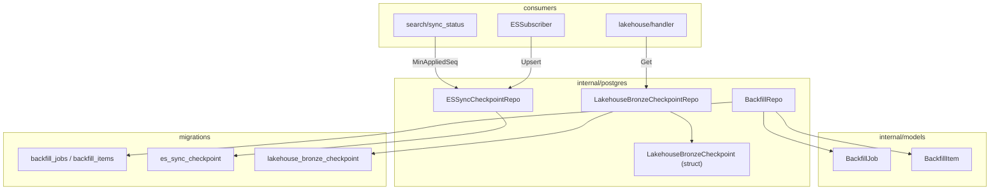
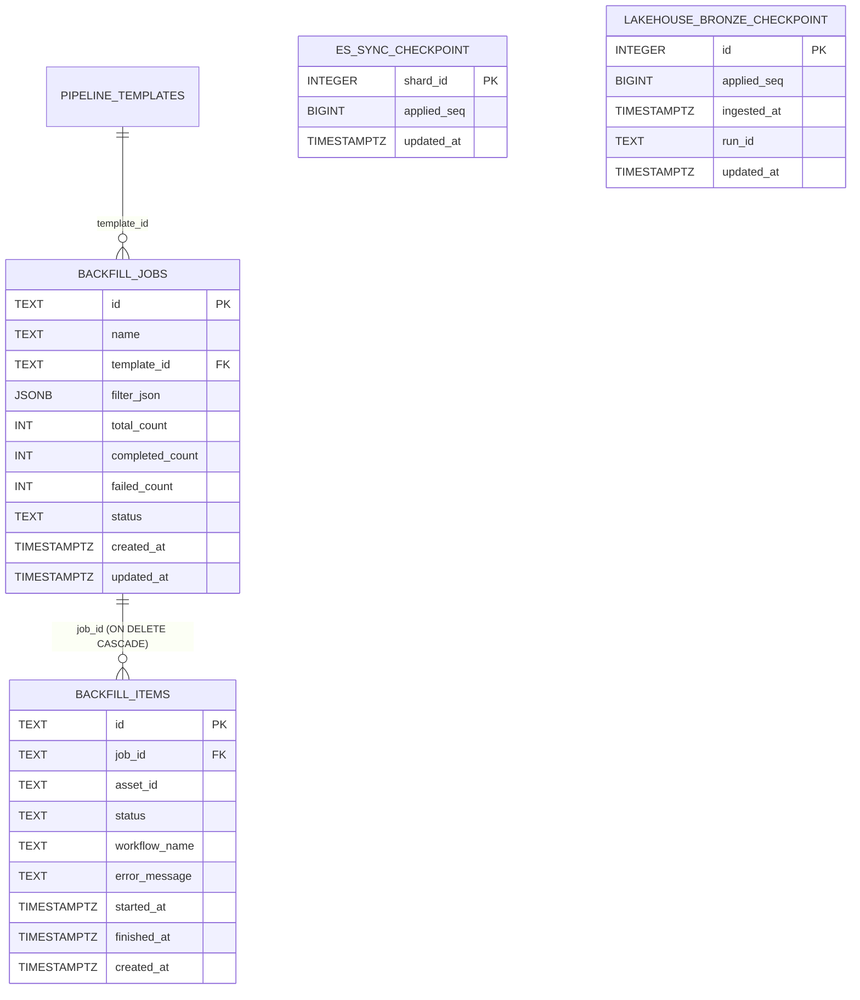
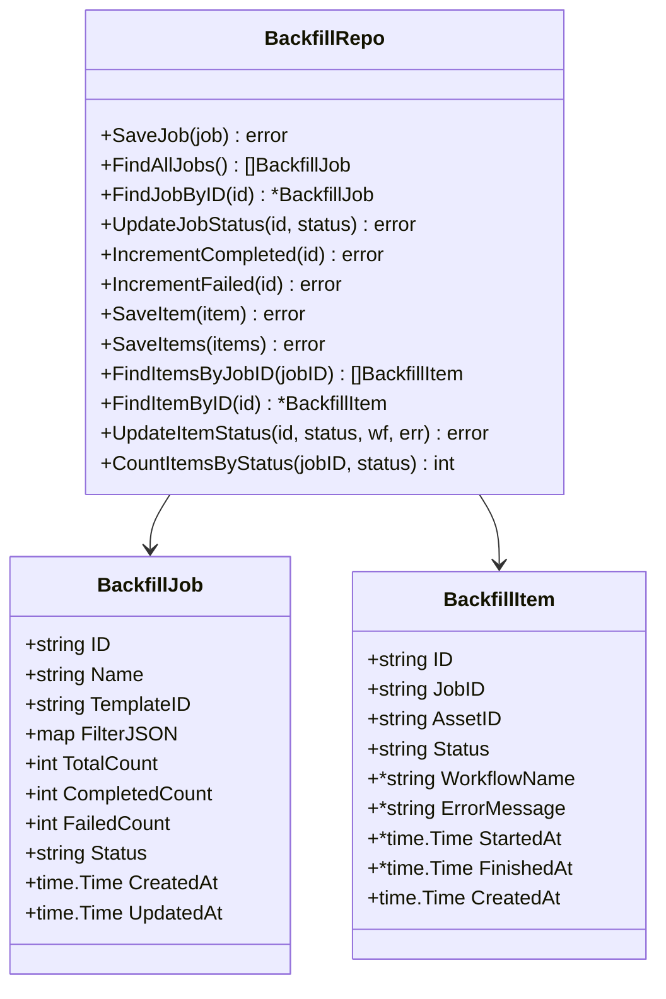
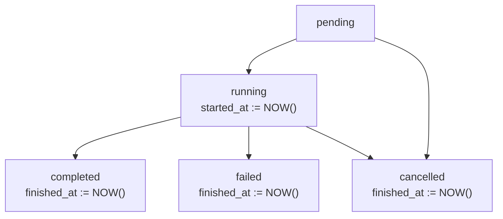
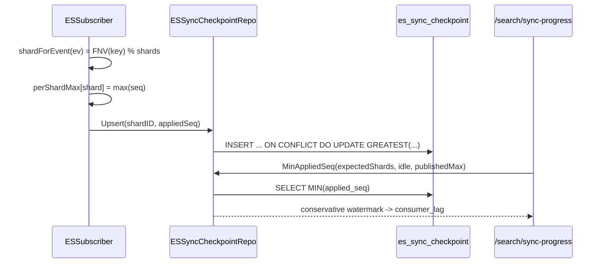
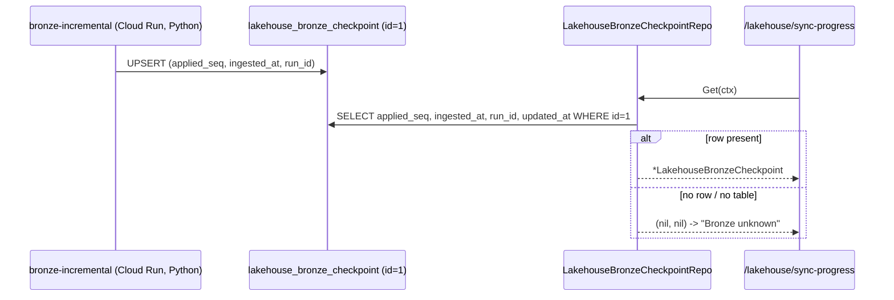
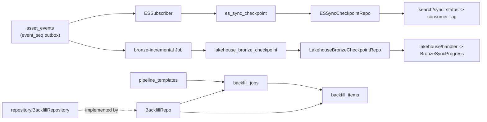

# Backfill & Checkpoint Models

<cite>
**Referenced Files in This Document**

- [backend/internal/models/backfill.go](file://backend/internal/models/backfill.go)
- [backend/internal/postgres/backfill_repo.go](file://backend/internal/postgres/backfill_repo.go)
- [backend/internal/postgres/es_sync_checkpoint.go](file://backend/internal/postgres/es_sync_checkpoint.go)
- [backend/internal/postgres/lakehouse_bronze_checkpoint.go](file://backend/internal/postgres/lakehouse_bronze_checkpoint.go)
- [backend/migrations/043_backfill_tables.sql](file://backend/migrations/043_backfill_tables.sql)
- [backend/migrations/archive/022_es_sync_checkpoint.sql](file://backend/migrations/archive/022_es_sync_checkpoint.sql)
- [backend/migrations/archive/023_lakehouse_bronze_checkpoint.sql](file://backend/migrations/archive/023_lakehouse_bronze_checkpoint.sql)
- [backend/internal/outbox/es_subscriber.go](file://backend/internal/outbox/es_subscriber.go)
- [backend/internal/handlers/search/sync_status.go](file://backend/internal/handlers/search/sync_status.go)
- [backend/internal/handlers/lakehouse/handler.go](file://backend/internal/handlers/lakehouse/handler.go)
- [backend/internal/repository/backfill_repository.go](file://backend/internal/repository/backfill_repository.go)
</cite>

## Table of Contents
1. [Introduction](#introduction)
2. [Project Structure](#project-structure)
3. [Core Components](#core-components)
4. [Architecture Overview](#architecture-overview)
5. [Detailed Component Analysis](#detailed-component-analysis)
6. [Dependency Analysis](#dependency-analysis)
7. [Performance Considerations](#performance-considerations)
8. [Troubleshooting Guide](#troubleshooting-guide)
9. [Conclusion](#conclusion)
10. [Appendices](#appendices)

## Introduction

This page documents two related but independent families of progress-tracking
data in cyber-databrew:

1. **Backfill jobs and items** — the durable record of a *batch re-processing*
   operation, in which a set of assets is pushed through a chosen pipeline
   template. A `backfill_jobs` row is the parent aggregate (how many assets, how
   many done, how many failed, what status), and each `backfill_items` row is the
   per-asset unit of work with its own lifecycle (`pending → running →
   completed/failed/cancelled`). Counters on the job roll up the outcomes of its
   items so a UI can render a progress bar without scanning every item.

2. **Checkpoint / watermark tables** — two small, write-light tables that track
   *how far a downstream consumer has caught up* with the PostgreSQL append-only
   event log (`asset_events`, an `event_seq`-ordered outbox):
   - `es_sync_checkpoint` records, per logical shard, the maximum `event_seq` the
     **Elasticsearch subscriber** has successfully applied. The conservative
     cross-shard `MIN(applied_seq)` is exposed as `consumer_lag` on
     `/api/v1/search/sync-progress`.
   - `lakehouse_bronze_checkpoint` is a single-row table written by the
     **bronze-incremental Cloud Run Job** (Python) recording the maximum
     `event_seq` confirmed committed to the Iceberg Bronze layer, plus when and
     by which run. The backend reads it (read-only) to power
     `/api/v1/lakehouse/sync-progress` and the `lakehouse_bronze_*` Prometheus
     gauges.

The unifying theme is **forward-only progress tracking**: a backfill job moves
its counters monotonically toward `total_count`, and each checkpoint advances its
watermark via `GREATEST(...)` so a retried or out-of-order write can never make
the recorded progress regress.

**Section sources**
- [backend/internal/models/backfill.go](file://backend/internal/models/backfill.go#L1-L32)
- [backend/migrations/archive/022_es_sync_checkpoint.sql](file://backend/migrations/archive/022_es_sync_checkpoint.sql#L1-L22)
- [backend/migrations/archive/023_lakehouse_bronze_checkpoint.sql](file://backend/migrations/archive/023_lakehouse_bronze_checkpoint.sql#L1-L23)

## Project Structure

The backfill and checkpoint models are split across the Go domain layer, the
PostgreSQL persistence layer, the SQL migrations, and the consumers that write or
read the watermarks.

- **Domain models** — `backend/internal/models/backfill.go` defines the
  `BackfillJob` and `BackfillItem` structs (JSON-tagged for the API surface).
  The checkpoint domain type `LakehouseBronzeCheckpoint` is defined inline in its
  repository file; `es_sync_checkpoint` has no struct (it is manipulated purely
  via SQL `shard_id`/`applied_seq` scalars).
- **Persistence layer** — `backend/internal/postgres/`:
  - `backfill_repo.go` — full CRUD + counter mutations for jobs and items.
  - `es_sync_checkpoint.go` — idempotent `Upsert` and the conservative
    `MinAppliedSeq` reader.
  - `lakehouse_bronze_checkpoint.go` — read-only `Get` of the singleton row.
- **Repository contract** — `backend/internal/repository/backfill_repository.go`
  declares the `BackfillRepository` interface that `BackfillRepo` satisfies.
- **Schema** — `backend/migrations/043_backfill_tables.sql` for the backfill
  tables; the checkpoint tables live in `backend/migrations/archive/` (022, 023)
  and are also folded into `000_initial.sql`.
- **Consumers** —
  - `backend/internal/outbox/es_subscriber.go` writes `es_sync_checkpoint`.
  - `backend/internal/handlers/search/sync_status.go` shapes the response that
    surfaces `consumer_lag`.
  - `backend/internal/handlers/lakehouse/handler.go` reads
    `lakehouse_bronze_checkpoint` for the Bronze sync snapshot.

**Diagram sources**
- [backend/internal/postgres/backfill_repo.go](file://backend/internal/postgres/backfill_repo.go#L16-L26)
- [backend/internal/postgres/es_sync_checkpoint.go](file://backend/internal/postgres/es_sync_checkpoint.go#L17-L52)
- [backend/internal/postgres/lakehouse_bronze_checkpoint.go](file://backend/internal/postgres/lakehouse_bronze_checkpoint.go#L14-L54)
- [backend/internal/outbox/es_subscriber.go](file://backend/internal/outbox/es_subscriber.go#L86-L94)

**Section sources**
- [backend/internal/models/backfill.go](file://backend/internal/models/backfill.go#L1-L32)
- [backend/internal/postgres/backfill_repo.go](file://backend/internal/postgres/backfill_repo.go#L1-L26)
- [backend/migrations/043_backfill_tables.sql](file://backend/migrations/043_backfill_tables.sql#L1-L35)

## Core Components

#### BackfillJob

`BackfillJob` is the parent aggregate of a backfill operation. It carries an
identity (`ID`, `Name`), the `TemplateID` of the pipeline template assets are
pushed through, an optional `FilterJSON` describing the asset-selection criteria,
three running counters (`TotalCount`, `CompletedCount`, `FailedCount`), a
`Status` enum (`running | paused | completed | failed`), and `CreatedAt` /
`UpdatedAt` timestamps. The counters are the cheap progress signal: a client can
render `completedCount + failedCount` against `totalCount` without enumerating
items.

#### BackfillItem

`BackfillItem` is one asset's unit of work inside a job. It points back to its
parent via `JobID`, references the target `AssetID`, and tracks its own `Status`
(`pending | running | completed | failed | cancelled`). `WorkflowName`,
`ErrorMessage`, `StartedAt`, and `FinishedAt` are nullable (pointer) fields
populated as the item moves through its lifecycle — for example `ErrorMessage` is
set only on failure and `FinishedAt` only on a terminal status.

#### ESSyncCheckpointRepo

`ESSyncCheckpointRepo` persists per-shard high-water marks of `event_seq` that the
ES subscriber has applied. Its `Upsert` is deliberately idempotent — an
`INSERT ... ON CONFLICT (shard_id) DO UPDATE` with `GREATEST(...)` — so a
subscriber retrying with stale data only ever moves the watermark forward, never
back. `MinAppliedSeq` returns the conservative cross-shard `MIN(applied_seq)`,
the value safe to publish as `consumer_lag`.

#### LakehouseBronzeCheckpoint / LakehouseBronzeCheckpointRepo

`LakehouseBronzeCheckpoint` is the Go view of the singleton Bronze checkpoint
row: `AppliedSeq` (max `event_seq` committed to Bronze), `IngestedAt` (wall-clock
of the producing run), `RunID` (Cloud Run Job execution name), and `UpdatedAt`.
The repo is **read-only on the backend** because writes come from the Python
Cloud Run Job, not from Go.

**Section sources**
- [backend/internal/models/backfill.go](file://backend/internal/models/backfill.go#L5-L31)
- [backend/internal/postgres/es_sync_checkpoint.go](file://backend/internal/postgres/es_sync_checkpoint.go#L11-L52)
- [backend/internal/postgres/lakehouse_bronze_checkpoint.go](file://backend/internal/postgres/lakehouse_bronze_checkpoint.go#L12-L54)

## Architecture Overview

The relational schema has two disconnected clusters. The backfill cluster is a
classic parent/child pair with a foreign key and cascade delete. The checkpoint
cluster is two independent watermark tables, each fed by a *different* downstream
consumer of the same upstream `asset_events` outbox.

The watermark tables share a design: they translate a high-cardinality,
append-only event stream (`asset_events.event_seq`) into a small, bounded set of
rows that say "everything up to here is consumed." `es_sync_checkpoint` is
*sharded* (one row per logical shard, default 16) so write amplification stays
flat regardless of event volume; `lakehouse_bronze_checkpoint` is a *singleton*
(enforced by a `CHECK (id = 1)` constraint) because the batch job commits one
high-water mark per run.

**Diagram sources**
- [backend/migrations/043_backfill_tables.sql](file://backend/migrations/043_backfill_tables.sql#L4-L34)
- [backend/migrations/archive/022_es_sync_checkpoint.sql](file://backend/migrations/archive/022_es_sync_checkpoint.sql#L13-L22)
- [backend/migrations/archive/023_lakehouse_bronze_checkpoint.sql](file://backend/migrations/archive/023_lakehouse_bronze_checkpoint.sql#L10-L23)

**Section sources**
- [backend/migrations/043_backfill_tables.sql](file://backend/migrations/043_backfill_tables.sql#L1-L35)
- [backend/migrations/archive/022_es_sync_checkpoint.sql](file://backend/migrations/archive/022_es_sync_checkpoint.sql#L1-L22)
- [backend/migrations/archive/023_lakehouse_bronze_checkpoint.sql](file://backend/migrations/archive/023_lakehouse_bronze_checkpoint.sql#L1-L23)

## Detailed Component Analysis

### Backfill domain model and persistence

The Go structs map one-to-one onto the migration columns. `FilterJSON` is a
`map[string]interface{}` serialized to a JSONB column; the repo marshals it on
write (defaulting to the literal `null` when empty) and unmarshals on read.

`SaveJob` fills defaults defensively: it generates a UUID `ID` when blank, sets
`CreatedAt` on first write, and always bumps `UpdatedAt` to `now()` UTC. Items are
created either one at a time (`SaveItem`) or in bulk (`SaveItems`, which loops
`Exec` per row inside the caller's transaction context — see the Performance
section). All reads go through the shared `scanBackfillJob` / `scanBackfillItem`
helpers and the `backfillJobSelectCols` / `backfillItemSelectCols` constants so
column order stays in lockstep with the `Scan` argument order.

**Section sources**
- [backend/internal/models/backfill.go](file://backend/internal/models/backfill.go#L5-L31)
- [backend/internal/postgres/backfill_repo.go](file://backend/internal/postgres/backfill_repo.go#L30-L83)
- [backend/internal/postgres/backfill_repo.go](file://backend/internal/postgres/backfill_repo.go#L155-L224)

### Backfill item lifecycle

`UpdateItemStatus` encodes the item state machine directly in SQL. It always sets
`status`, `workflow_name`, and `error_message`, and conditionally stamps the
timestamps: `started_at` is set to `NOW()` the first time the item enters
`running`, `completed`, or `failed` (and only if still null), while `finished_at`
is set to `NOW()` for the terminal statuses `completed`, `failed`, or
`cancelled` (and cleared otherwise).

As items reach terminal statuses, the job-level counters are advanced via
`IncrementCompleted` / `IncrementFailed`, which run `completed_count =
completed_count + 1` (resp. `failed_count`) and bump `updated_at`. The job's own
`Status` is moved with `UpdateJobStatus`. `CountItemsByStatus` provides an
authoritative recount (`SELECT COUNT(*) ... WHERE job_id = $1 AND status = $2`)
when the cached counters need reconciliation.

**Section sources**
- [backend/internal/postgres/backfill_repo.go](file://backend/internal/postgres/backfill_repo.go#L123-L151)
- [backend/internal/postgres/backfill_repo.go](file://backend/internal/postgres/backfill_repo.go#L265-L288)

### ES sync checkpoint: sharded forward-only watermark

The ES subscriber hashes each event's routing key (`asset_id`, or `mcap:<id>`, or
`_na`) with FNV and takes it modulo the configured shard count to pick a
`shard_id`. After a successful `_bulk`, it accumulates `MAX(event_seq)` per shard
and calls `advanceCheckpoint`, which issues one `Upsert` per touched shard.

`MinAppliedSeq` has three safety behaviors that keep `consumer_lag` honest:

- **Quorum gate** — when `expectedShards > 0` and fewer rows exist than expected
  (some shards have never received an event), it returns `0` rather than
  overstating progress with a partial MIN.
- **Idle-shard advance** — when `idleAfterSec > 0` and `publishedMax > 0`, any
  row whose `updated_at` is older than `idleAfterSec` is treated as having
  `applied_seq = publishedMax` for the MIN, so a quiet shard does not drag the
  lag up forever.
- **Missing-relation tolerance** — both `Upsert` and `MinAppliedSeq` swallow
  PostgreSQL error `42P01` (`isMissingRelation`) and return cleanly, so the
  feature degrades gracefully before the migration is applied.

`Upsert` also no-ops on a non-positive `appliedSeq`, a defensive guard ensuring
the checkpoint never regresses.

**Section sources**
- [backend/internal/postgres/es_sync_checkpoint.go](file://backend/internal/postgres/es_sync_checkpoint.go#L26-L108)
- [backend/internal/outbox/es_subscriber.go](file://backend/internal/outbox/es_subscriber.go#L65-L94)
- [backend/internal/outbox/es_subscriber.go](file://backend/internal/outbox/es_subscriber.go#L226-L286)

**Diagram sources**
- [backend/internal/outbox/es_subscriber.go](file://backend/internal/outbox/es_subscriber.go#L65-L94)
- [backend/internal/postgres/es_sync_checkpoint.go](file://backend/internal/postgres/es_sync_checkpoint.go#L34-L108)

### Lakehouse Bronze checkpoint: single-row, externally written

The Bronze checkpoint is a single row keyed `id = 1` (a `CHECK` constraint
enforces the singleton). The Python `bronze-incremental` Cloud Run Job upserts
`(applied_seq, ingested_at, run_id)` at the end of each successful run. The Go
backend never writes it — `LakehouseBronzeCheckpointRepo` only exposes `Get`,
which reads the row, `COALESCE`s a null `run_id` to an empty string, and returns
`(nil, nil)` when either the row does not yet exist (`pgx.ErrNoRows`) or the table
is missing (`isMissingRelation`). Both cases mean "Bronze empty / unknown" and
must be treated as a non-error by callers.

The lakehouse handler wires this reader in via `WithBronzeCheckpoint` and uses it
to build `BronzeSyncProgress` (`bronze_max_event_seq`, `bronze_lag_events`,
`bronze_last_ingested_at`, `bronze_stale_seconds`) and to set the
`LakehouseBronzeMaxEventSeq` / `LakehouseBronzeLagEvents` Prometheus gauges. When
the reader is unset or returns `(nil, nil)`, the handler degrades to "Bronze
unknown" instead of failing.

**Section sources**
- [backend/internal/postgres/lakehouse_bronze_checkpoint.go](file://backend/internal/postgres/lakehouse_bronze_checkpoint.go#L12-L54)
- [backend/internal/handlers/lakehouse/handler.go](file://backend/internal/handlers/lakehouse/handler.go#L38-L68)
- [backend/internal/handlers/lakehouse/handler.go](file://backend/internal/handlers/lakehouse/handler.go#L188-L261)

**Diagram sources**
- [backend/internal/postgres/lakehouse_bronze_checkpoint.go](file://backend/internal/postgres/lakehouse_bronze_checkpoint.go#L36-L54)

## Dependency Analysis

Key dependencies:

- `backfill_jobs.template_id` is a foreign key into `pipeline_templates(id)`;
  `backfill_items.job_id` references `backfill_jobs(id)` with
  `ON DELETE CASCADE`, so deleting a job removes its items automatically.
- `BackfillRepo` implements the `repository.BackfillRepository` interface
  (asserted at compile time via `var _ repository.BackfillRepository =
  (*BackfillRepo)(nil)`), decoupling handlers from the concrete Postgres type.
- Both checkpoint tables depend on the upstream `asset_events.event_seq` ordering
  but have **no FK** to it — they merely store a scalar high-water mark.
- The ES checkpoint is *written by* the subscriber and *read by* the search
  sync-status handler; the Bronze checkpoint is *written by an external Python
  job* and *read-only* on the Go side.

**Section sources**
- [backend/internal/postgres/backfill_repo.go](file://backend/internal/postgres/backfill_repo.go#L26-L26)
- [backend/internal/repository/backfill_repository.go](file://backend/internal/repository/backfill_repository.go#L9-L10)
- [backend/migrations/043_backfill_tables.sql](file://backend/migrations/043_backfill_tables.sql#L4-L31)

## Performance Considerations

- **Backfill indexes** — `idx_backfill_jobs_status` and
  `idx_backfill_jobs_created_at (DESC)` back the common list query
  (`FindAllJobs` orders by `created_at DESC`). `idx_backfill_items_job_id`
  supports `FindItemsByJobID` and the cascade delete; `idx_backfill_items_status`
  supports `CountItemsByStatus`.
- **Cheap progress reads** — the job-level counters (`total/completed/failed`)
  let a client render progress without scanning `backfill_items`. Use
  `CountItemsByStatus` only when an authoritative recount is needed; it is an
  indexed `COUNT(*)` but still scans matching rows.
- **Bulk insert shape** — `SaveItems` loops `db.Exec` once per row rather than
  issuing a single multi-row `INSERT` or `COPY`. For very large backfills this is
  the per-row round-trip path; callers should run it inside a transaction
  (`dbFromCtx`) to amortize commit cost.
- **Checkpoint write amplification is flat** — `es_sync_checkpoint` has at most
  `OUTBOX_ES_CHECKPOINT_SHARDS` rows (default 16). Each successful `_bulk` emits
  at most "shards-in-batch" UPSERTs regardless of how many `asset_events` it
  covered, so checkpoint write volume does not grow with event volume.
- **`MinAppliedSeq` cost** — a `MIN` (and optional `COUNT`) over a ≤16-row table;
  effectively free. The idle-advance variant adds a `CASE`/`EXTRACT` per row,
  still trivial at this cardinality.
- **Bronze read is a single-row PK lookup** — `Get` selects `WHERE id = 1`, the
  cheapest possible read.

**Section sources**
- [backend/migrations/043_backfill_tables.sql](file://backend/migrations/043_backfill_tables.sql#L17-L34)
- [backend/internal/postgres/backfill_repo.go](file://backend/internal/postgres/backfill_repo.go#L195-L224)
- [backend/migrations/archive/022_es_sync_checkpoint.sql](file://backend/migrations/archive/022_es_sync_checkpoint.sql#L10-L17)

## Troubleshooting Guide

- **`consumer_lag` stalls or never moves** — the subscriber logs
  `outbox es subscriber: checkpoint upsert failed (consumer_lag may stall)` when
  an `Upsert` fails; the watermark stops advancing for that shard. Check that
  `es_sync_checkpoint` exists and the subscriber has a non-nil `Checkpoint`
  writer (when nil, checkpoint updates are skipped and `consumer_lag` stays at 0).
- **`consumer_lag` looks too good (overstated progress)** — likely the quorum
  gate: if fewer shard rows exist than `expectedShards`, `MinAppliedSeq` returns
  `0` deliberately. A previously-progressing lag dropping to 0 can mean the table
  was truncated or a shard row is missing.
- **One quiet shard drags lag up forever** — enable idle-shard advance by passing
  `idleAfterSec > 0` and a real `publishedMax`; idle rows are then treated as
  caught up to `publishedMax`.
- **Checkpoint appears to regress** — by design it cannot: `Upsert` uses
  `GREATEST(...)` and no-ops on non-positive `appliedSeq`. A visibly lower value
  means the row was manually edited or the table reseeded.
- **Bronze sync shows "unknown" / zeros** — `Get` returns `(nil, nil)` when the
  row (`id = 1`) is absent (the job has never run) or the table is missing
  (migration 023 not applied). Confirm the `bronze-incremental` Cloud Run Job has
  executed at least once; cross-reference its `run_id` against Cloud Run logs.
- **Backfill counters disagree with item statuses** — the cached
  `completed_count` / `failed_count` are advanced by `IncrementCompleted` /
  `IncrementFailed` and can drift if an item transition skips them; reconcile with
  `CountItemsByStatus`.
- **Deleting a job leaves orphan items** — should not happen: the FK is
  `ON DELETE CASCADE`. Orphans imply the FK/migration was not applied.

**Section sources**
- [backend/internal/outbox/es_subscriber.go](file://backend/internal/outbox/es_subscriber.go#L52-L94)
- [backend/internal/postgres/es_sync_checkpoint.go](file://backend/internal/postgres/es_sync_checkpoint.go#L31-L108)
- [backend/internal/postgres/lakehouse_bronze_checkpoint.go](file://backend/internal/postgres/lakehouse_bronze_checkpoint.go#L32-L54)

## Conclusion

The backfill and checkpoint models implement two complementary forms of progress
tracking. `backfill_jobs` / `backfill_items` give a durable, queryable record of a
batch re-processing run, with job-level roll-up counters over a per-asset state
machine. `es_sync_checkpoint` and `lakehouse_bronze_checkpoint` give compact,
forward-only watermarks over the `asset_events` outbox: a sharded MIN for ES
`consumer_lag` and a singleton row for Bronze sync progress. All three share the
monotonic-advance discipline — `GREATEST(...)` on the checkpoints and incrementing
counters on the job — and all degrade gracefully (missing-relation tolerance,
quorum gating, `(nil, nil)` "unknown") rather than failing closed.

## Appendices

### Appendix A — `backfill_jobs` columns

| Column | Type | Notes |
| --- | --- | --- |
| `id` | TEXT PK | UUID generated on save when blank |
| `name` | TEXT NOT NULL | human label |
| `template_id` | TEXT NOT NULL FK → `pipeline_templates(id)` | pipeline used |
| `filter_json` | JSONB | asset filter criteria (`null` when empty) |
| `total_count` | INT NOT NULL DEFAULT 0 | items in the job |
| `completed_count` | INT NOT NULL DEFAULT 0 | advanced by `IncrementCompleted` |
| `failed_count` | INT NOT NULL DEFAULT 0 | advanced by `IncrementFailed` |
| `status` | TEXT NOT NULL DEFAULT 'running' | `running \| paused \| completed \| failed` |
| `created_at` | TIMESTAMPTZ NOT NULL DEFAULT NOW() | |
| `updated_at` | TIMESTAMPTZ NOT NULL DEFAULT NOW() | bumped on every mutation |

### Appendix B — `backfill_items` columns

| Column | Type | Notes |
| --- | --- | --- |
| `id` | TEXT PK | UUID generated on save when blank |
| `job_id` | TEXT NOT NULL FK → `backfill_jobs(id)` ON DELETE CASCADE | parent job |
| `asset_id` | TEXT NOT NULL | target asset |
| `status` | TEXT NOT NULL DEFAULT 'pending' | `pending \| running \| completed \| failed \| cancelled` |
| `workflow_name` | TEXT (nullable) | set when known |
| `error_message` | TEXT (nullable) | set on failure |
| `started_at` | TIMESTAMPTZ (nullable) | stamped on first non-pending |
| `finished_at` | TIMESTAMPTZ (nullable) | stamped on terminal status |
| `created_at` | TIMESTAMPTZ NOT NULL DEFAULT NOW() | |

### Appendix C — `es_sync_checkpoint` columns

| Column | Type | Notes |
| --- | --- | --- |
| `shard_id` | INTEGER PK | `FNV(routing_key) % OUTBOX_ES_CHECKPOINT_SHARDS` (default 16), stable for the deployment |
| `applied_seq` | BIGINT NOT NULL | `GREATEST(applied_seq, batch_max_seq)`; advances only on successful ES bulk |
| `updated_at` | TIMESTAMPTZ NOT NULL DEFAULT now() | last upsert time; used by idle-shard advance |

### Appendix D — `lakehouse_bronze_checkpoint` columns

| Column | Type | Notes |
| --- | --- | --- |
| `id` | INTEGER PK | singleton, `CHECK (id = 1)` |
| `applied_seq` | BIGINT NOT NULL | MAX(`event_seq`) confirmed committed to Bronze on the latest run |
| `ingested_at` | TIMESTAMPTZ NOT NULL | wall-clock of the producing run (matches Bronze `_ingested_at`) |
| `run_id` | TEXT (nullable) | Cloud Run Job execution name; `COALESCE`d to `''` on read |
| `updated_at` | TIMESTAMPTZ NOT NULL DEFAULT now() | last write time |

### Appendix E — `BackfillRepository` operations

| Method | Purpose |
| --- | --- |
| `SaveJob` | insert a job (fills `ID`, timestamps) |
| `FindAllJobs` | list jobs `ORDER BY created_at DESC` |
| `FindJobByID` | fetch one job or `(nil, nil)` |
| `UpdateJobStatus` | set job `status`, bump `updated_at` |
| `IncrementCompleted` / `IncrementFailed` | advance roll-up counters |
| `SaveItem` / `SaveItems` | insert one / many items |
| `FindItemsByJobID` | list items `ORDER BY created_at ASC` |
| `FindItemByID` | fetch one item or `(nil, nil)` |
| `UpdateItemStatus` | item state machine (status, workflow, error, timestamps) |
| `CountItemsByStatus` | authoritative per-status count for a job |

**Section sources**
- [backend/migrations/043_backfill_tables.sql](file://backend/migrations/043_backfill_tables.sql#L4-L31)
- [backend/migrations/archive/022_es_sync_checkpoint.sql](file://backend/migrations/archive/022_es_sync_checkpoint.sql#L13-L22)
- [backend/migrations/archive/023_lakehouse_bronze_checkpoint.sql](file://backend/migrations/archive/023_lakehouse_bronze_checkpoint.sql#L10-L23)
- [backend/internal/postgres/backfill_repo.go](file://backend/internal/postgres/backfill_repo.go#L52-L288)
