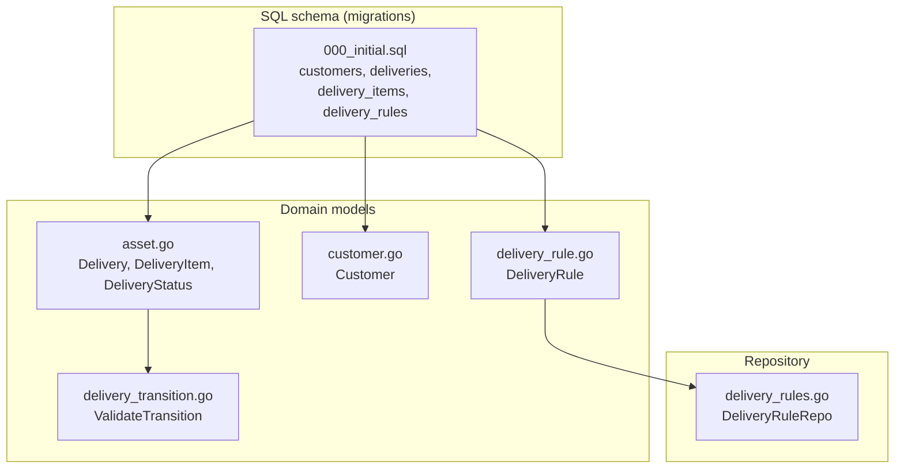
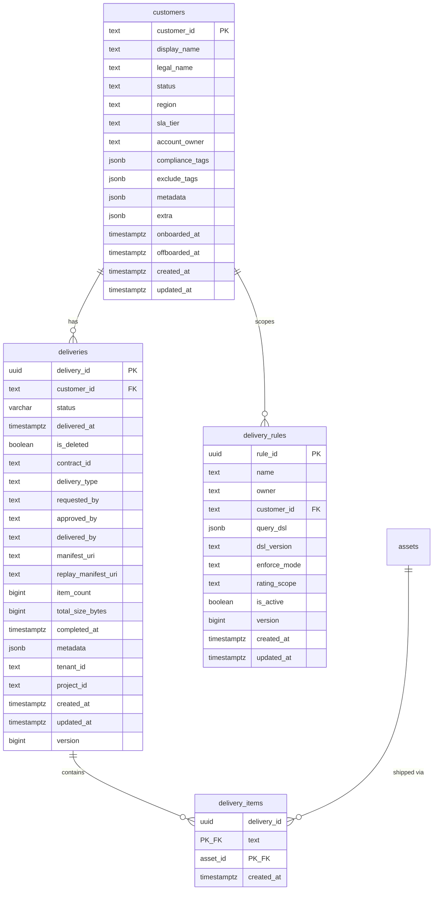
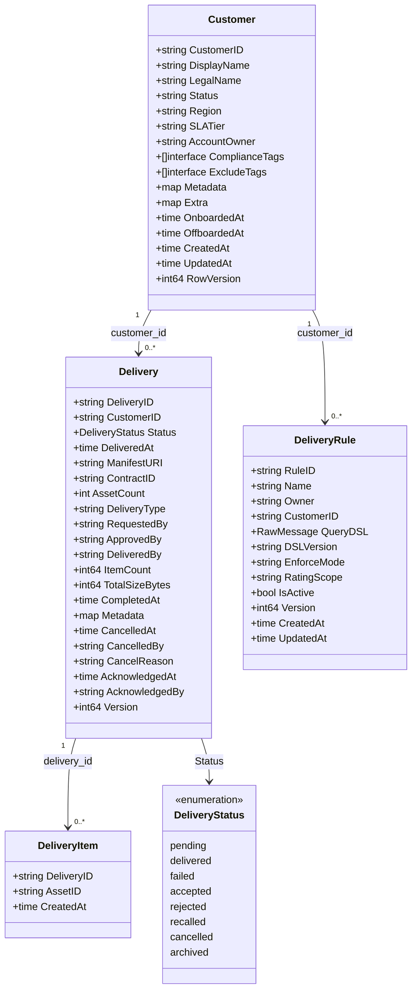
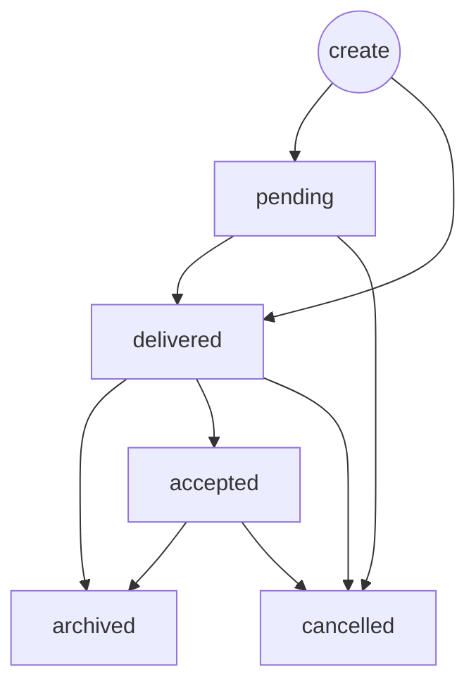
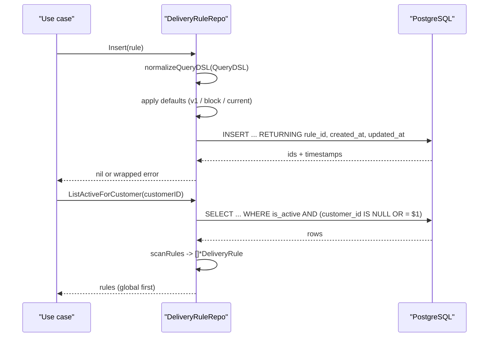
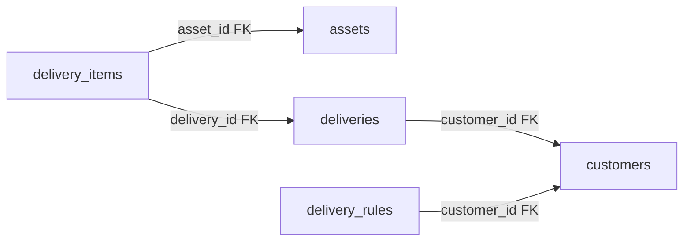

# Delivery Model

<cite>
**Referenced Files in This Document**

- [backend/internal/models/delivery_rule.go](file://backend/internal/models/delivery_rule.go)
- [backend/internal/models/delivery_transition.go](file://backend/internal/models/delivery_transition.go)
- [backend/internal/models/asset.go](file://backend/internal/models/asset.go)
- [backend/internal/models/customer.go](file://backend/internal/models/customer.go)
- [backend/internal/postgres/delivery_rules.go](file://backend/internal/postgres/delivery_rules.go)
- [backend/migrations/000_initial.sql](file://backend/migrations/000_initial.sql)
</cite>

## Table of Contents
1. [Introduction](#introduction)
2. [Project Structure](#project-structure)
3. [Core Components](#core-components)
4. [Architecture Overview](#architecture-overview)
5. [Detailed Component Analysis](#detailed-component-analysis)
6. [Dependency Analysis](#dependency-analysis)
7. [Performance Considerations](#performance-considerations)
8. [Troubleshooting Guide](#troubleshooting-guide)
9. [Conclusion](#conclusion)
10. [Appendices](#appendices)

## Introduction

The delivery data model is the part of cyber-databrew that records *what* curated
asset content has been handed to a *which* customer, under what *contract*, in what
*lifecycle state*, and subject to which *gate rules*. It is the relational backbone
of the platform's outbound flow: assets are curated upstream, gathered into a
**delivery**, optionally screened by declarative **delivery rules**, then advanced
through a constrained **state machine** until they are accepted, archived, or
cancelled.

Four PostgreSQL tables make up this model: `customers` (the long-lived business
counterparties), `deliveries` (one delivery event per row), `delivery_items` (the
many-to-many bridge linking a delivery to the concrete `assets` it ships), and
`delivery_rules` (declarative gates evaluated before a delivery is committed). The
Go side mirrors these tables with the `Delivery`, `DeliveryItem`, `Customer`, and
`DeliveryRule` structs, plus a `DeliveryStatus` enum and a `ValidateTransition`
guard that encodes the legal state-machine edges.

This model is consumed by delivery use cases (commit, cancel, acknowledge, archive),
by the rule-evaluation path that screens candidate assets against customer-scoped
gates, and by reporting queries that slice deliveries by customer over time. The
audience for this page is anyone extending the delivery flow, debugging a stuck
delivery status, or adding a new customer-scoped gate rule.

**Section sources**
- [backend/internal/models/asset.go](file://backend/internal/models/asset.go#L27-L39)
- [backend/internal/models/asset.go](file://backend/internal/models/asset.go#L222-L268)
- [backend/internal/models/delivery_rule.go](file://backend/internal/models/delivery_rule.go#L1-L22)

## Project Structure

The delivery model is split across three layers: a declarative SQL schema under
`backend/migrations/`, the Go domain types under `backend/internal/models/`, and the
PostgreSQL repository implementation under `backend/internal/postgres/`.

- **`backend/migrations/000_initial.sql`** — the consolidated baseline schema. It
  defines the `customers`, `deliveries`, `delivery_items`, and `delivery_rules`
  tables, their primary keys, foreign keys, and supporting indexes. Historical,
  superseded migrations for these tables (e.g. `032_delivery_rules.sql`,
  `012_sync_delivery_item_count.sql`) live under `backend/migrations/archive/` and
  are folded into the baseline.
- **`backend/internal/models/asset.go`** — declares the `DeliveryStatus` enum, the
  `Delivery` struct (the row shape of the `deliveries` table), and the
  `DeliveryItem` struct (the row shape of `delivery_items`).
- **`backend/internal/models/customer.go`** — declares the `Customer` struct,
  mirroring the `customers` table.
- **`backend/internal/models/delivery_rule.go`** — declares the `DeliveryRule`
  struct, mirroring the `delivery_rules` table.
- **`backend/internal/models/delivery_transition.go`** — encodes the delivery status
  state machine via the `validTransitions` map and the `ValidateTransition` guard.
- **`backend/internal/postgres/delivery_rules.go`** — the `DeliveryRuleRepo`
  repository that inserts and lists delivery rules with customer-scoped filtering.

**Diagram sources**
- [backend/migrations/000_initial.sql](file://backend/migrations/000_initial.sql#L371-L436)
- [backend/internal/models/asset.go](file://backend/internal/models/asset.go#L222-L268)
- [backend/internal/models/delivery_rule.go](file://backend/internal/models/delivery_rule.go#L9-L22)
- [backend/internal/postgres/delivery_rules.go](file://backend/internal/postgres/delivery_rules.go#L15-L23)

**Section sources**
- [backend/migrations/000_initial.sql](file://backend/migrations/000_initial.sql#L371-L436)
- [backend/internal/models/customer.go](file://backend/internal/models/customer.go#L1-L24)
- [backend/internal/models/delivery_transition.go](file://backend/internal/models/delivery_transition.go#L1-L39)

## Core Components

The delivery model is built from five core components.

#### `Customer`

`Customer` is the long-lived business-reference row (introduced in CYB-1014). Every
delivery and most delivery rules associate to exactly one customer through
`customer_id`. The struct carries identity (`CustomerID`, `DisplayName`,
`LegalName`), commercial classification (`Status`, `SLATier`, `Region`,
`AccountOwner`), and two JSONB tag lists, `ComplianceTags` and `ExcludeTags`, that
feed into delivery screening. `RowVersion` provides optimistic-concurrency control.

The backing table constrains `status` to `active`, `trial`, `suspended`, or
`offboarded`, and `sla_tier` to `standard`, `premium`, or `enterprise`, via CHECK
constraints.

#### `Delivery`

`Delivery` is one row in the `deliveries` table — a single delivery event for a
customer. It holds the lifecycle `Status` (a `DeliveryStatus`), the customer
association (`CustomerID`), commercial linkage (`ContractID`), the shipped artifact
locators (`ManifestURI`, `ReplayManifestURI`), aggregate counters (`ItemCount`,
`AssetCount`, `TotalSizeBytes`), an actor audit trail (`RequestedBy`, `ApprovedBy`,
`DeliveredBy`), and timestamps for each stage (`DeliveredAt`, `CompletedAt`,
`CancelledAt`, `AcknowledgedAt`). The cancel fields (`CancelledAt`, `CancelledBy`,
`CancelReason`) were added in CYB-1104; the acknowledgment fields
(`AcknowledgedAt`, `AcknowledgedBy`) in CYB-1106.

#### `DeliveryItem`

`DeliveryItem` is the bridge row joining a delivery to a concrete asset. It is the
materialization of the many-to-many relationship between `deliveries` and `assets`.
The Go comment notes that the struct is used only in API request/response bodies;
the persisted shape lives in the `delivery_items` table, whose composite primary key
is `(delivery_id, asset_id)`.

#### `DeliveryRule`

`DeliveryRule` is a declarative gate evaluated before a delivery commit (CYB-1020).
Each rule carries a JSON `QueryDSL` (with a `DSLVersion`), an `EnforceMode` that
decides how violations are handled (`block`, `warn`, or `tag_only`), a
`RatingScope` (`current` or `logical`), an `IsActive` flag, and an optional
`CustomerID`. A rule with a null `CustomerID` is global; a rule with a `CustomerID`
applies only to that customer.

#### `DeliveryStatus` + `ValidateTransition`

`DeliveryStatus` is the string enum of delivery lifecycle states, and
`ValidateTransition` is the guard that allows only the legal edges between them.
Together they form the delivery state machine.

**Section sources**
- [backend/internal/models/customer.go](file://backend/internal/models/customer.go#L5-L23)
- [backend/internal/models/asset.go](file://backend/internal/models/asset.go#L222-L268)
- [backend/internal/models/delivery_rule.go](file://backend/internal/models/delivery_rule.go#L8-L22)
- [backend/internal/models/delivery_transition.go](file://backend/internal/models/delivery_transition.go#L5-L39)

## Architecture Overview

At the relational level the model is a small star: `customers` is the hub, and both
`deliveries` and `delivery_rules` reference it. `deliveries` fans out into
`delivery_items`, which in turn references the `assets` table. Foreign keys enforce
referential integrity in every direction.

The `deliveries.customer_id` and `delivery_rules.customer_id` both reference
`customers.customer_id`; `delivery_items.delivery_id` references `deliveries`, and
`delivery_items.asset_id` references `assets`. Because `delivery_rules.customer_id`
is nullable, a rule may be global (applies to all customers) or customer-scoped.

**Diagram sources**
- [backend/migrations/000_initial.sql](file://backend/migrations/000_initial.sql#L371-L436)
- [backend/migrations/000_initial.sql](file://backend/migrations/000_initial.sql#L640-L650)
- [backend/migrations/000_initial.sql](file://backend/migrations/000_initial.sql#L877-L905)

**Section sources**
- [backend/migrations/000_initial.sql](file://backend/migrations/000_initial.sql#L371-L436)
- [backend/migrations/000_initial.sql](file://backend/migrations/000_initial.sql#L877-L905)

## Detailed Component Analysis

### Domain structs (class model)

The Go domain layer mirrors the relational schema with one struct per table. The
`Delivery` struct is the richest: it carries the `DeliveryStatus` enum by value and
combines an audit trail, aggregate counters, and per-stage timestamps.

**Diagram sources**
- [backend/internal/models/asset.go](file://backend/internal/models/asset.go#L222-L268)
- [backend/internal/models/customer.go](file://backend/internal/models/customer.go#L5-L23)
- [backend/internal/models/delivery_rule.go](file://backend/internal/models/delivery_rule.go#L9-L22)
- [backend/internal/models/asset.go](file://backend/internal/models/asset.go#L27-L39)

**Section sources**
- [backend/internal/models/asset.go](file://backend/internal/models/asset.go#L222-L268)
- [backend/internal/models/delivery_rule.go](file://backend/internal/models/delivery_rule.go#L9-L22)

### The delivery state machine

`DeliveryStatus` defines eight states: `pending`, `delivered`, `failed`,
`accepted`, `rejected`, `recalled`, `cancelled`, and `archived`. Not every state is
reachable from every other state. The legal edges are encoded in the
`validTransitions` map, keyed by the "from" status (where the empty string `""`
represents creation), with the value being the set of allowed "to" statuses.

The allowed transitions are:

- From creation (`""`): `pending` (draft creation) or `delivered` (one-step commit,
  the existing path).
- From `pending`: `delivered` (the C2 commit) or `cancelled` (cancel the draft).
- From `delivered`: `archived` (archive after delivery), `accepted` (acknowledge a
  delivered delivery), or `cancelled` (cancel a delivered delivery, CYB-1104).
- From `accepted`: `archived` (archive after acceptance) or `cancelled` (cancel
  after acceptance).

Note that `failed`, `rejected`, and `recalled` are declared on the enum but are not
"from" keys in `validTransitions`; they are terminal/external states with no
outbound edges through this guard.

`ValidateTransition(from, to)` is the enforcement point. It looks up the "from"
status in `validTransitions`; if the status has no entry it returns
`no transitions allowed from status %q`. If the "to" status is not in the allowed
set it returns `transition from %q to %q is not allowed`. Otherwise it returns
`nil`. Use-case layers call this guard before persisting any status change, so an
illegal jump (for example `archived` → `pending`) is rejected before it reaches the
database.

**Section sources**
- [backend/internal/models/delivery_transition.go](file://backend/internal/models/delivery_transition.go#L5-L39)
- [backend/internal/models/asset.go](file://backend/internal/models/asset.go#L30-L39)

**Diagram sources**
- [backend/internal/models/delivery_transition.go](file://backend/internal/models/delivery_transition.go#L8-L26)

### Delivery rules and customer scoping

`DeliveryRuleRepo` is the PostgreSQL repository that persists and retrieves delivery
rules. It implements the `repository.DeliveryRuleRepository` interface (asserted by
the compile-time `var _` line) and wraps a shared `*Client`.

`Insert` applies sensible server-side defaults before writing: an empty
`DSLVersion` becomes `v1`, an empty `EnforceMode` becomes `block`, and an empty
`RatingScope` becomes `current`. It validates the `QueryDSL` through
`normalizeQueryDSL`, which requires the DSL to be present and to be valid JSON. The
INSERT statement uses `COALESCE(NULLIF($1::text, '')::uuid, gen_random_uuid())` so a
caller may supply an explicit `rule_id` or let PostgreSQL generate one, and it
returns the persisted `rule_id`, `created_at`, and `updated_at`. The customer
association is handled by mapping an empty `CustomerID` to a SQL `NULL`.

Two read paths exist, differing in how they treat the customer scope:

- `ListActiveForCustomer` returns only active rules (`is_active = true`) whose
  `customer_id` is either NULL (global) or equal to the requested customer. The
  results are ordered `customer_id NULLS FIRST, created_at ASC`, so global rules sort
  before customer-specific ones — the natural evaluation order for a gate cascade.
- `List` returns all rules (active or not). With an empty `customerID` it returns
  every rule ordered by `created_at DESC`; with a customer it returns global plus
  customer-scoped rules, also newest first.

Both paths funnel through `scanRules`, which maps each row back into a
`models.DeliveryRule`, restoring the `COALESCE(customer_id, '')` empty-string
convention for global rules.

**Diagram sources**
- [backend/internal/postgres/delivery_rules.go](file://backend/internal/postgres/delivery_rules.go#L25-L94)

**Section sources**
- [backend/internal/postgres/delivery_rules.go](file://backend/internal/postgres/delivery_rules.go#L25-L135)

### Error handling and schema-mismatch detection

`wrapDeliveryRuleSchema` is the repository's error normalizer. It inspects the
underlying `*pgconn.PgError`; if the SQLSTATE code is `42P01` (undefined table) it
returns the sentinel `repository.ErrSchemaMismatch` annotated with the
`delivery_rules` table name and the calling operation. Any other error is wrapped
with the operation name for context. This lets the upstream layers distinguish a
missing-migration condition (schema mismatch) from an ordinary query failure.

**Section sources**
- [backend/internal/postgres/delivery_rules.go](file://backend/internal/postgres/delivery_rules.go#L119-L135)

## Dependency Analysis

The delivery model sits at the convergence of customers and assets. The relational
foreign keys make the dependency directions explicit.

- `deliveries.customer_id` → `customers.customer_id` (constraints
  `fk_deliveries_customer`).
- `delivery_rules.customer_id` → `customers.customer_id` (constraint
  `delivery_rules_customer_id_fkey`).
- `delivery_items.delivery_id` → `deliveries.delivery_id` (constraint
  `fk_delivery_items_delivery`).
- `delivery_items.asset_id` → `assets.asset_id` (constraints
  `delivery_items_asset_id_fkey` and `fk_delivery_items_asset`).

On the code side, `DeliveryRuleRepo` depends on the `postgres.Client`, the
`models` package (for `DeliveryRule`), and the `repository` package (for the
interface contract and the `ErrSchemaMismatch` sentinel). The `Delivery` and
`DeliveryItem` structs depend only on the standard library `time` package and the
`DeliveryStatus` enum.

**Diagram sources**
- [backend/migrations/000_initial.sql](file://backend/migrations/000_initial.sql#L877-L905)

**Section sources**
- [backend/migrations/000_initial.sql](file://backend/migrations/000_initial.sql#L640-L650)
- [backend/migrations/000_initial.sql](file://backend/migrations/000_initial.sql#L877-L905)
- [backend/internal/postgres/delivery_rules.go](file://backend/internal/postgres/delivery_rules.go#L1-L23)

## Performance Considerations

The schema is provisioned with targeted indexes for the model's hot read paths.

- `idx_deliveries_customer_created` on `deliveries (customer_id, created_at DESC)`
  serves the dominant reporting query — "latest deliveries for a customer" — without
  a sort.
- `idx_delivery_items_asset_id` on `delivery_items (asset_id)` accelerates the
  reverse lookup, "which deliveries shipped this asset", which would otherwise scan
  the full bridge table. The composite primary key `(delivery_id, asset_id)` already
  covers the forward lookup.
- `idx_drules_active` is a partial index on `delivery_rules (is_active)
  WHERE is_active = true`, keeping the index small and aligned with the
  `ListActiveForCustomer` predicate.
- `idx_drules_customer` on `delivery_rules (customer_id, is_active)` supports
  customer-scoped rule retrieval.

For correctness and concurrency, both `deliveries` and `delivery_rules` carry a
`version bigint` column for optimistic concurrency; the Go `Delivery.Version` and
`DeliveryRule.Version`/`Customer.RowVersion` fields mirror it. The
`ListActiveForCustomer` ordering (`customer_id NULLS FIRST, created_at ASC`) means
the gate cascade evaluates global rules first, which is both deterministic and the
intended precedence.

A potential N+1 risk lives outside this model: enumerating deliveries and then
fetching each delivery's items one delivery at a time. Prefer a single join against
`delivery_items` filtered by the delivery ids of interest, leaning on the composite
PK and `idx_delivery_items_asset_id`.

**Section sources**
- [backend/migrations/000_initial.sql](file://backend/migrations/000_initial.sql#L784-L790)
- [backend/internal/postgres/delivery_rules.go](file://backend/internal/postgres/delivery_rules.go#L67-L94)

## Troubleshooting Guide

#### `transition from %q to %q is not allowed`

A use case attempted an illegal status change. Compare the attempted edge against
`validTransitions`. Common cases: trying to move a `delivered` delivery back to
`pending`, or transitioning out of a terminal state such as `failed`, `rejected`,
or `recalled` (which have no outbound edges). The fix is almost always in the
caller's logic, not the guard.

#### `no transitions allowed from status %q`

The "from" status passed to `ValidateTransition` is not a key in
`validTransitions` — for example `failed`, `rejected`, `recalled`, `cancelled`, or
`archived`. These are leaf states. If a legitimately new transition is required,
add the edge to the `validTransitions` map rather than bypassing the guard.

#### `query_dsl is required` / `query_dsl must be valid JSON`

`normalizeQueryDSL` rejected a delivery-rule insert. The first message means
`QueryDSL` was empty; the second means it was non-empty but not valid JSON. Verify
the rule body serializes to valid JSON before calling `Insert`.

#### `ErrSchemaMismatch: delivery_rules`

`wrapDeliveryRuleSchema` saw SQLSTATE `42P01` (undefined table), meaning the
`delivery_rules` table does not exist in the connected database. Run the migrations
(`000_initial.sql` provisions the table) and confirm the connection points at the
migrated database.

#### A delivery rule unexpectedly does (or does not) apply

Remember the customer-scope semantics. A rule with NULL `customer_id` is global and
matches every customer; a rule with a `customer_id` matches only that customer.
`ListActiveForCustomer` also filters on `is_active = true`, so an inactive rule
silently drops out of evaluation. Check both `customer_id` and `is_active`.

#### A foreign-key violation when inserting a delivery or item

`deliveries.customer_id` must reference an existing `customers` row, and a
`delivery_items` row needs both its `deliveries` parent and its `assets` target to
exist. Insert the customer and assets first.

**Section sources**
- [backend/internal/models/delivery_transition.go](file://backend/internal/models/delivery_transition.go#L30-L39)
- [backend/internal/postgres/delivery_rules.go](file://backend/internal/postgres/delivery_rules.go#L119-L135)
- [backend/migrations/000_initial.sql](file://backend/migrations/000_initial.sql#L877-L905)

## Conclusion

The delivery data model is a compact, well-constrained slice of the schema: four
tables anchored on `customers`, with `deliveries` fanning out into `delivery_items`
over `assets`, and `delivery_rules` providing customer-scoped declarative gates. The
Go layer mirrors the tables struct-for-struct, the `DeliveryStatus` enum plus
`ValidateTransition` enforce a small, explicit state machine, and `DeliveryRuleRepo`
centralizes rule persistence with defaulting, JSON validation, and schema-mismatch
detection. Targeted indexes and version columns keep the model's hot read paths fast
and its writes concurrency-safe. Anyone extending the flow should add new states by
editing `validTransitions`, new gate behavior by extending `enforce_mode`/
`rating_scope`, and should respect the global-vs-customer rule precedence baked into
the query ordering.

## Appendices

### Appendix A — `DeliveryStatus` enum values

| Constant | Value | Has outbound transitions? |
| --- | --- | --- |
| `DeliveryStatusPending` | `pending` | Yes → `delivered`, `cancelled` |
| `DeliveryStatusDelivered` | `delivered` | Yes → `archived`, `accepted`, `cancelled` |
| `DeliveryStatusFailed` | `failed` | No (terminal) |
| `DeliveryStatusAccepted` | `accepted` | Yes → `archived`, `cancelled` |
| `DeliveryStatusRejected` | `rejected` | No (terminal) |
| `DeliveryStatusRecalled` | `recalled` | No (terminal) |
| `DeliveryStatusCancelled` | `cancelled` | No (terminal) |
| `DeliveryStatusArchived` | `archived` | No (terminal) |

Source: [asset.go#L30-L39](file://backend/internal/models/asset.go#L30-L39),
[delivery_transition.go#L8-L26](file://backend/internal/models/delivery_transition.go#L8-L26).

### Appendix B — `deliveries` columns

| Column | Type | Notes |
| --- | --- | --- |
| `delivery_id` | uuid | Primary key |
| `customer_id` | text | FK → `customers.customer_id` |
| `status` | varchar(16) | Default `pending` |
| `delivered_at` | timestamptz | Nullable |
| `is_deleted` | boolean | Default `false` |
| `contract_id` | text | Nullable |
| `delivery_type` | text | Default `asset_set` |
| `requested_by` / `approved_by` / `delivered_by` | text | Audit trail |
| `manifest_uri` / `replay_manifest_uri` | text | Artifact locators |
| `item_count` | bigint | Default `0` |
| `total_size_bytes` | bigint | Nullable |
| `completed_at` | timestamptz | Nullable |
| `metadata` | jsonb | Default `{}` |
| `tenant_id` / `project_id` | text | Nullable |
| `created_at` / `updated_at` | timestamptz | Required |
| `version` | bigint | Default `1` (optimistic lock) |

Source: [000_initial.sql#L391-L413](file://backend/migrations/000_initial.sql#L391-L413).

### Appendix C — `delivery_rules` columns and CHECK constraints

| Column | Type | Notes |
| --- | --- | --- |
| `rule_id` | uuid | Primary key, default `gen_random_uuid()` |
| `name` | text | Required |
| `owner` | text | Required |
| `customer_id` | text | Nullable; FK → `customers.customer_id`; NULL = global |
| `query_dsl` | jsonb | Required gate predicate |
| `dsl_version` | text | Default `v1` |
| `enforce_mode` | text | CHECK in (`block`, `warn`, `tag_only`); default `block` |
| `rating_scope` | text | CHECK in (`current`, `logical`); default `current` |
| `is_active` | boolean | Default `true` |
| `version` | bigint | Default `1` |
| `created_at` / `updated_at` | timestamptz | Default `now()` |

Source: [000_initial.sql#L421-L436](file://backend/migrations/000_initial.sql#L421-L436).

### Appendix D — `customers` and `delivery_items` columns

`customers` — CHECK constraints: `status` in (`active`, `trial`, `suspended`,
`offboarded`); `sla_tier` in (`standard`, `premium`, `enterprise`). Key JSONB
columns `compliance_tags` and `exclude_tags` default to `[]`.

`delivery_items` — composite primary key `(delivery_id, asset_id)`, plus a
`created_at` timestamp; both id columns are foreign keys.

Source: [000_initial.sql#L371-L419](file://backend/migrations/000_initial.sql#L371-L419),
[000_initial.sql#L640-L650](file://backend/migrations/000_initial.sql#L640-L650).

### Appendix E — Indexes

| Index | Table | Definition |
| --- | --- | --- |
| `idx_deliveries_customer_created` | deliveries | `(customer_id, created_at DESC)` |
| `idx_delivery_items_asset_id` | delivery_items | `(asset_id)` |
| `idx_drules_active` | delivery_rules | `(is_active) WHERE is_active = true` |
| `idx_drules_customer` | delivery_rules | `(customer_id, is_active)` |
| `idx_customers_status` | customers | `(status)` |

Source: [000_initial.sql#L782-L790](file://backend/migrations/000_initial.sql#L782-L790).
