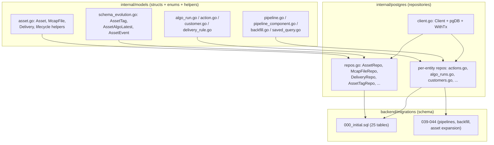
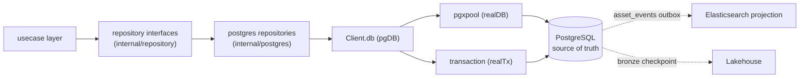
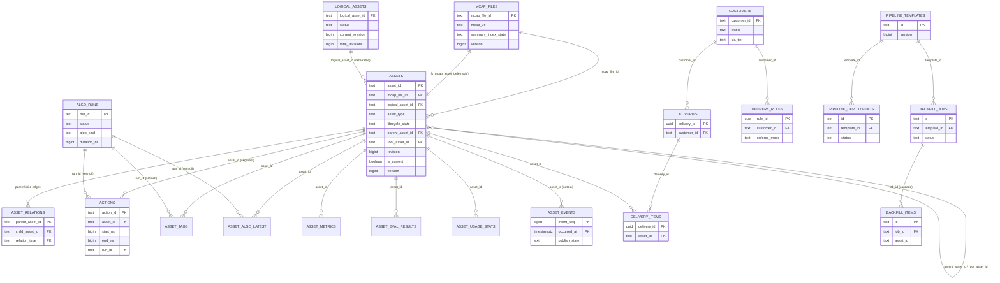
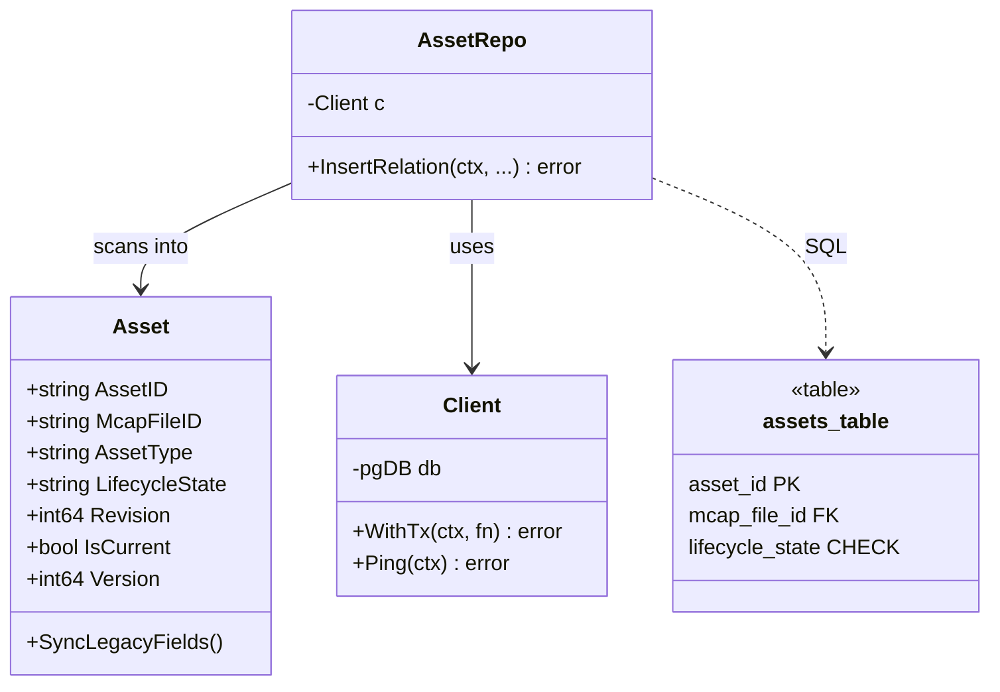
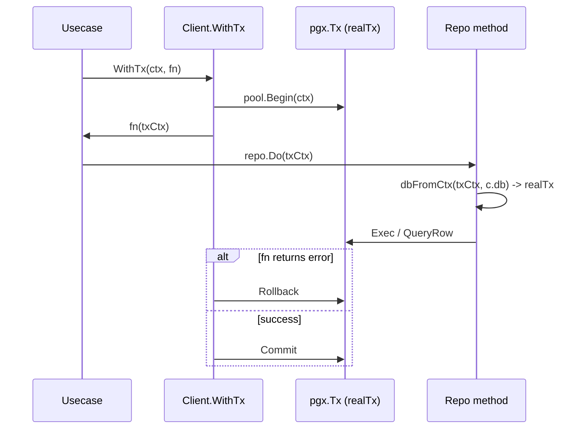
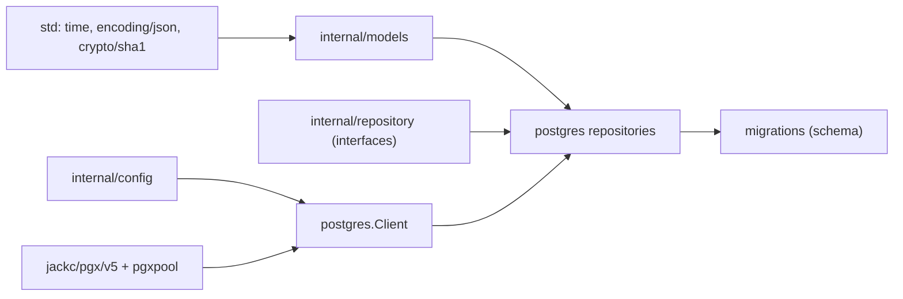

# Database Design

<cite>
**Referenced Files in This Document**

- [backend/migrations/000_initial.sql](file://backend/migrations/000_initial.sql)
- [backend/migrations/039_pipeline_tables.sql](file://backend/migrations/039_pipeline_tables.sql)
- [backend/migrations/040_pipeline_components.sql](file://backend/migrations/040_pipeline_components.sql)
- [backend/migrations/042_pipeline_template_version.sql](file://backend/migrations/042_pipeline_template_version.sql)
- [backend/migrations/043_backfill_tables.sql](file://backend/migrations/043_backfill_tables.sql)
- [backend/migrations/044_asset_model_expansion_p1.sql](file://backend/migrations/044_asset_model_expansion_p1.sql)
- [backend/migrations/045_asset_model_p2.sql](file://backend/migrations/045_asset_model_p2.sql)
- [backend/internal/models/action.go](file://backend/internal/models/action.go)
- [backend/internal/models/algo_event.go](file://backend/internal/models/algo_event.go)
- [backend/internal/models/algo_run.go](file://backend/internal/models/algo_run.go)
- [backend/internal/models/asset.go](file://backend/internal/models/asset.go)
- [backend/internal/models/asset_type_schema.go](file://backend/internal/models/asset_type_schema.go)
- [backend/internal/models/asset_usage_stat.go](file://backend/internal/models/asset_usage_stat.go)
- [backend/internal/models/backfill.go](file://backend/internal/models/backfill.go)
- [backend/internal/models/customer.go](file://backend/internal/models/customer.go)
- [backend/internal/models/delivery_rule.go](file://backend/internal/models/delivery_rule.go)
- [backend/internal/models/delivery_transition.go](file://backend/internal/models/delivery_transition.go)
- [backend/internal/models/pipeline.go](file://backend/internal/models/pipeline.go)
- [backend/internal/models/pipeline_component.go](file://backend/internal/models/pipeline_component.go)
- [backend/internal/models/saved_query.go](file://backend/internal/models/saved_query.go)
- [backend/internal/models/schema_evolution.go](file://backend/internal/models/schema_evolution.go)
- [backend/internal/models/segment_locator.go](file://backend/internal/models/segment_locator.go)
- [backend/internal/postgres/client.go](file://backend/internal/postgres/client.go)
- [backend/internal/postgres/repos.go](file://backend/internal/postgres/repos.go)
- [backend/internal/postgres/actions.go](file://backend/internal/postgres/actions.go)
- [backend/internal/postgres/algo_runs.go](file://backend/internal/postgres/algo_runs.go)
- [backend/internal/postgres/audit_sink.go](file://backend/internal/postgres/audit_sink.go)
- [backend/internal/postgres/backfill_repo.go](file://backend/internal/postgres/backfill_repo.go)
- [backend/internal/postgres/batch_ops.go](file://backend/internal/postgres/batch_ops.go)
- [backend/internal/postgres/customers.go](file://backend/internal/postgres/customers.go)
- [backend/internal/postgres/delivery_rules.go](file://backend/internal/postgres/delivery_rules.go)
- [backend/internal/postgres/es_sync_checkpoint.go](file://backend/internal/postgres/es_sync_checkpoint.go)
- [backend/internal/postgres/eval_repos.go](file://backend/internal/postgres/eval_repos.go)
- [backend/internal/postgres/lakehouse_bronze_checkpoint.go](file://backend/internal/postgres/lakehouse_bronze_checkpoint.go)
- [backend/internal/postgres/lifecycle.go](file://backend/internal/postgres/lifecycle.go)
- [backend/internal/postgres/logical_assets.go](file://backend/internal/postgres/logical_assets.go)
- [backend/internal/postgres/pipeline_component_repo.go](file://backend/internal/postgres/pipeline_component_repo.go)
- [backend/internal/postgres/pipeline_repo.go](file://backend/internal/postgres/pipeline_repo.go)
- [backend/internal/postgres/reindex_job_repo.go](file://backend/internal/postgres/reindex_job_repo.go)
- [backend/internal/postgres/saved_queries.go](file://backend/internal/postgres/saved_queries.go)
- [backend/internal/postgres/usage_stats_repo.go](file://backend/internal/postgres/usage_stats_repo.go)
</cite>

## Table of Contents
1. [Introduction](#introduction)
2. [Project Structure](#project-structure)
3. [Core Components](#core-components)
4. [Architecture Overview](#architecture-overview)
5. [Detailed Component Analysis](#detailed-component-analysis)
6. [Dependency Analysis](#dependency-analysis)
7. [Performance Considerations](#performance-considerations)
8. [Troubleshooting Guide](#troubleshooting-guide)
9. [Conclusion](#conclusion)
10. [Appendices](#appendices)

## Introduction

This page is the entry point for the cyber-databrew **database design**. It is a
DDL-first review of the PostgreSQL schema: the tables, primary keys, foreign
keys, CHECK constraints, generated columns, partitions, and indexes declared in
`backend/migrations/*.sql` — the authoritative definition of the data model.
The Go structs in `internal/models` and the repositories in `internal/postgres`
are the access path *over* that schema, not the schema itself; this section
treats the SQL as the source of truth and the Go layer as the consumer.

PostgreSQL is the **single source of truth** for all business state.
Elasticsearch (search), the lakehouse (analytics), and the outbox/event tables
are derived projections or downstream consumers of the canonical Postgres rows;
none of them owns business state. The schema is organised around a three-layer
business hierarchy — `mcap_file → segment asset → action` — surrounded by
supporting entities for deliveries, customers, pipelines, algorithm runs, and
operational checkpoints (outbox, checkpoints, watermarks).

Read this index for the schema-wide picture (conventions, the full ERD, the table
catalog); then drill into [Data Model Design](model-design.md) and its per-domain
pages for table-by-table detail, and into [Data Integrity & Constraints](integrity-and-constraints.md),
[Performance & Indexing](performance-and-indexing.md), and
[Migration Management](migrations.md) for the cross-cutting concerns.

Schema-wide conventions worth knowing up front (all verifiable in
`000_initial.sql`):

- **8-character public IDs** — `asset_id`, `mcap_file_id`, `action_id`,
  `logical_asset_id` are `text` with a `CHECK (~ '^[0-9A-Za-z]{8}$')`;
  `algo_runs.run_id` is 16-char; `deliveries`/`delivery_rules`/`saved_queries`/
  `asset_events` use `uuid`.
- **Soft delete** — `is_deleted boolean` on `assets`, `mcap_files`, `deliveries`,
  `actions`; rows are retired, not removed.
- **Optimistic concurrency** — `version bigint DEFAULT 1` on the mutable core
  entities (`assets`, `mcap_files`, `deliveries`, `actions`, `delivery_rules`).
- **Multi-tenancy** — nullable `tenant_id` / `project_id` threaded through most
  tables.
- **Timestamps** — `created_at` / `updated_at timestamptz`, with a
  `set_updated_at()` trigger function.
- **JSONB everywhere** — `metadata`, `files`, `params`, `outputs`, `query_dsl`
  for open-ended attributes; typed columns for anything queried or constrained.

The Go structs in `Asset`, `McapFile`, and `Delivery` carry both legacy
backward-compatible fields and newer typed fields introduced during the
schema-evolution work, and several helpers reconcile the two representations
against the DDL.

The persistence layer that sits over the schema follows a strict three-tier shape:

- **Models** (`internal/models`) — plain Go structs with `json` tags, enum
  constants, and pure helper functions (validation, derivations, state-machine
  tables). No SQL, no `database/sql`/`pgx` imports.
- **Repository interfaces** (`internal/repository`) — Go interfaces that the
  usecase layer depends on, decoupling business logic from PostgreSQL.
- **PostgreSQL repositories** (`internal/postgres`) — concrete repository
  implementations that own all SQL, scanning, and transaction handling, all
  routed through a single `Client` connection pool.

**Section sources**
- [backend/internal/models/asset.go](file://backend/internal/models/asset.go#L41-L118)
- [backend/internal/models/action.go](file://backend/internal/models/action.go#L14-L49)
- [backend/internal/postgres/client.go](file://backend/internal/postgres/client.go#L16-L46)

## Project Structure

The database design itself lives in SQL; the Go layer that consumes it is split
across two more directories. In DDL-first order:

- `backend/migrations/` — **the schema, and the source of truth for this
  section.** `000_initial.sql` is the consolidated baseline that creates the 25
  core tables, plus the supporting functions (`set_updated_at`,
  `event_retention_cleanup`, `asset_algo_statuses`,
  `trg_logical_assets_type_immutable`), the `asset_events` range-partition setup,
  and the full set of PK/FK/CHECK constraints and indexes. Later numbered files
  (`039`–`044`) add the pipeline, backfill, and asset-model-expansion tables and
  columns. The DDL is what every claim on this page is verified against.
- `internal/models/` — one Go file per domain entity (or a small cluster of
  related entities), declaring the struct(s) that map to a Postgres table plus
  enum constants and pure helpers. Notable files: `asset.go` (the largest,
  holding `Asset`, `LogicalAsset`, `McapFile`, `Delivery`, `DeliveryItem`, and the
  lifecycle-state helpers), `schema_evolution.go` (`AssetTag`, `AssetAlgoLatest`,
  `AssetEvent`), `algo_run.go`, `action.go`, `customer.go`, `delivery_rule.go`,
  `pipeline.go`, `pipeline_component.go`, `backfill.go`, `saved_query.go`,
  `asset_usage_stat.go`, `algo_event.go`, and the pure `segment_locator.go`.
- `internal/postgres/` — the `Client` (connection pool + transaction plumbing) in
  `client.go`, the large multi-entity `repos.go` (`AssetRepo`, `McapFileRepo`,
  `DeliveryRepo`, `IdempotencyRepo`, `AssetTagRepo`, `AssetAlgoLatestRepo`,
  `AssetEventRepo`, `OutboxDLQRepo`), and one file per remaining repository
  (`actions.go`, `algo_runs.go`, `customers.go`, `delivery_rules.go`,
  `eval_repos.go`, `batch_ops.go`, `logical_assets.go`, `saved_queries.go`,
  `usage_stats_repo.go`, `reindex_job_repo.go`, `backfill_repo.go`,
  `pipeline_repo.go`, `pipeline_component_repo.go`, `es_sync_checkpoint.go`,
  `lakehouse_bronze_checkpoint.go`, `lifecycle.go`, `audit_sink.go`).

**Diagram sources**
- [backend/internal/postgres/repos.go](file://backend/internal/postgres/repos.go#L19-L25)
- [backend/internal/postgres/client.go](file://backend/internal/postgres/client.go#L16-L46)
- [backend/migrations/000_initial.sql](file://backend/migrations/000_initial.sql#L50-L584)

**Section sources**
- [backend/internal/models/asset.go](file://backend/internal/models/asset.go#L41-L260)
- [backend/internal/postgres/repos.go](file://backend/internal/postgres/repos.go#L19-L25)
- [backend/migrations/000_initial.sql](file://backend/migrations/000_initial.sql#L50-L584)

## Core Components

### The `Client` connection pool

`postgres.Client` owns a single connection pool and dispatches all SQL through a
private `db pgDB` interface. The `pgDB` abstraction exposes only the handful of
operations repositories need (`QueryRow`, `Query`, `Exec`, `ExecResult`, `Ping`,
`Close`), so the exact same repository code path runs against either the pool
(`realDB`) or a transaction (`realTx`). `New` builds a DSN from
`config.Config`; `NewFromDSN` constructs a client from a raw DSN (used by
integration tests against testcontainers). The pool is sized explicitly via
`PG_MAX_CONNS`/`PG_MIN_CONNS` environment variables rather than relying on the
pgx default of four connections.

**Section sources**
- [backend/internal/postgres/client.go](file://backend/internal/postgres/client.go#L16-L46)
- [backend/internal/postgres/client.go](file://backend/internal/postgres/client.go#L125-L173)

### The repository set

Each domain entity has a thin repository struct holding a single `c *Client`
field plus a `New…Repo(c)` constructor. `repos.go` defines the largest cluster —
`AssetRepo`, `McapFileRepo`, `DeliveryRepo`, `IdempotencyRepo`, `AssetTagRepo`,
`AssetAlgoLatestRepo`, `AssetEventRepo`, and `OutboxDLQRepo` — and `AssetRepo`
asserts it satisfies the `repository.AssetRepository` interface via a
compile-time `var _` check. The remaining repositories live in dedicated files:
`ActionRepo`, `AlgoRunRepo`, `CustomerRepo`, `DeliveryRuleRepo`, `EvalRepo`,
`BatchOpsRepo`, `LogicalAssetRepo`, `SavedQueryRepo`, `UsageStatsRepo`,
`SearchReindexJobRepo`, `BackfillRepo`, `PipelineTemplateRepo`,
`PipelineDeploymentRepo`, `PipelineComponentRepo`, `ESSyncCheckpointRepo`,
`LakehouseBronzeCheckpointRepo`, and the `AuditSink`.

**Section sources**
- [backend/internal/postgres/repos.go](file://backend/internal/postgres/repos.go#L19-L25)
- [backend/internal/postgres/actions.go](file://backend/internal/postgres/actions.go#L19-L24)
- [backend/internal/postgres/customers.go](file://backend/internal/postgres/customers.go#L17-L23)

### The domain structs

The model structs are the contract between persistence and API/usecase code.
`Asset` carries identity (`AssetID`, `McapFileID`, `SegmentLocator`), legacy
fields retained for backward compatibility, Phase-2 typed fields (`AssetType`,
`LifecycleState`, lineage pointers, `Metadata`), multi-version identity
(`LogicalAssetID`, `Revision`, `IsCurrent`), and an optimistic-lock `Version`.
`McapFile`, `Delivery`, `Action`, `AlgoRun`, `Customer`, `DeliveryRule`,
`AssetTag`, `AssetAlgoLatest`, `AssetEvent`, the pipeline structs, the backfill
structs, `SavedQuery`, and `AssetUsageStat` complete the catalogue.

**Section sources**
- [backend/internal/models/asset.go](file://backend/internal/models/asset.go#L51-L133)
- [backend/internal/models/schema_evolution.go](file://backend/internal/models/schema_evolution.go#L8-L74)
- [backend/internal/models/algo_run.go](file://backend/internal/models/algo_run.go#L14-L50)

## Architecture Overview

The canonical write path always flows usecase → repository interface →
PostgreSQL repository → `Client` → pool/tx → table. A read from the API hydrates
a model struct from one or more tables, then calls reconciliation helpers (for
`Asset`, `SyncLegacyFields`) so responses carry both old and new field names.
Derived stores (Elasticsearch, lakehouse) are fed asynchronously from the
`asset_events` outbox and checkpoint tables, never written to directly as a
source of truth.

**Diagram sources**
- [backend/internal/postgres/client.go](file://backend/internal/postgres/client.go#L36-L62)
- [backend/internal/postgres/client.go](file://backend/internal/postgres/client.go#L172-L239)
- [backend/internal/models/schema_evolution.go](file://backend/internal/models/schema_evolution.go#L55-L74)

**Section sources**
- [backend/internal/postgres/client.go](file://backend/internal/postgres/client.go#L16-L62)
- [backend/internal/postgres/repos.go](file://backend/internal/postgres/repos.go#L19-L25)

## Detailed Component Analysis

### Entity-relationship overview

The core relational schema centres on `assets`. An `mcap_files` row is the
ingested source recording; segment-type assets reference it through
`mcap_file_id`. Assets self-reference through `parent_asset_id` and
`root_asset_id` for split/derivation lineage, and the general-purpose
`asset_relations` edge table records typed lineage (`split_from`,
`derived_from`, `annotated_from`, etc., extended further in migration `044`).
A `logical_assets` row is the version coordinator for a family of asset
revisions. `actions` are time-bounded annotations inside a segment asset.
`asset_tags`, `asset_algo_latest`, `asset_metrics`, `asset_eval_results`,
`asset_usage_stats`, and `asset_events` are projection/child tables keyed on
`asset_id`. `customers`, `deliveries`, `delivery_items`, and `delivery_rules`
form the delivery side.

> The `MCAP_FILES ||--|| ASSETS` edge is the `fk_mcap_asset` constraint
> (`mcap_files.mcap_file_id → assets.asset_id`, `DEFERRABLE INITIALLY DEFERRED`):
> every MCAP file is paired 1:1 with a `raw_mcap` asset that shares its ID. The
> `logical_asset_id` FK is likewise deferrable, so in-transaction insert order is
> tolerant as long as references resolve by commit.

**Diagram sources**
- [backend/migrations/000_initial.sql](file://backend/migrations/000_initial.sql#L310-L357)
- [backend/migrations/000_initial.sql](file://backend/migrations/000_initial.sql#L851-L911)
- [backend/migrations/039_pipeline_tables.sql](file://backend/migrations/039_pipeline_tables.sql#L5-L25)
- [backend/migrations/043_backfill_tables.sql](file://backend/migrations/043_backfill_tables.sql#L4-L34)
- [backend/migrations/045_asset_model_p2.sql](file://backend/migrations/045_asset_model_p2.sql#L3-L37)

**Section sources**
- [backend/migrations/000_initial.sql](file://backend/migrations/000_initial.sql#L50-L584)
- [backend/internal/models/asset.go](file://backend/internal/models/asset.go#L51-L133)

### Model → repository → migration layering

Each domain row exists three times: as a struct, behind a repository method, and
as a SQL table. The diagram below traces the `Asset` slice of that mapping. The
`AssetRepo` is bound to the `repository.AssetRepository` interface, so usecases
depend only on the abstraction.

**Diagram sources**
- [backend/internal/models/asset.go](file://backend/internal/models/asset.go#L51-L173)
- [backend/internal/postgres/repos.go](file://backend/internal/postgres/repos.go#L19-L60)
- [backend/internal/postgres/client.go](file://backend/internal/postgres/client.go#L19-L21)

**Section sources**
- [backend/internal/postgres/repos.go](file://backend/internal/postgres/repos.go#L19-L60)
- [backend/internal/models/asset.go](file://backend/internal/models/asset.go#L135-L173)

### Transactions and tx-aware repositories

`Client.WithTx` begins a `pgx` transaction, stashes a tx-bound `realTx` under a
private context key, and invokes the caller's function with that context. Repo
methods that call `dbFromCtx(ctx, c.db)` transparently pick up the transaction;
methods that use `c.db` directly run on the pool and are not part of the tx. On
non-pool-backed clients (mocked tests) `WithTx` degrades to calling `fn(ctx)`
directly. This is the mechanism that lets multi-table writes (for example, an
asset insert plus its lineage edges plus an outbox event) commit atomically.

**Diagram sources**
- [backend/internal/postgres/client.go](file://backend/internal/postgres/client.go#L48-L62)
- [backend/internal/postgres/client.go](file://backend/internal/postgres/client.go#L212-L239)

**Section sources**
- [backend/internal/postgres/client.go](file://backend/internal/postgres/client.go#L48-L62)
- [backend/internal/postgres/client.go](file://backend/internal/postgres/client.go#L212-L239)

### Lifecycle, status, and state-machine helpers

Several models carry pure state-machine logic shared between the postgres and
usecase layers. `Asset.SyncLegacyFields` derives the legacy `Status`,
`DurationSec`, and `SegType` from the new typed fields. `validLifecycleStates`
and the `LifecycleToStatus`/`StatusToLifecycle` maps in `asset.go` mirror the
`chk_lifecycle_state` DB CHECK; `lifecycle.go` in the postgres package holds the
canonical `AllLifecycleStates` list and the inverse conversion functions.
Delivery transitions are validated by `ValidateTransition` against the
`validTransitions` table, and algorithm-status transitions by
`ValidAlgoTransitions`.

**Section sources**
- [backend/internal/models/asset.go](file://backend/internal/models/asset.go#L135-L326)
- [backend/internal/models/delivery_transition.go](file://backend/internal/models/delivery_transition.go#L5-L39)
- [backend/internal/models/algo_event.go](file://backend/internal/models/algo_event.go#L43-L53)
- [backend/internal/postgres/lifecycle.go](file://backend/internal/postgres/lifecycle.go#L18-L64)

### Asset-type metadata schemas

`asset_type_schema.go` holds a code-defined `SchemaRegistry` that validates the
free-form `metadata` map per `asset_type`. Four asset types have registered
JSON-Schema definitions and validators: `dataset`, `annotation_result`,
`ml_model`, and `evaluation_report`. The `chk_mcap_file_required` CHECK on the
`assets` table (relaxed across migrations `043` and `044`) allows these
non-segment asset types to exist without an `mcap_file_id`.

**Section sources**
- [backend/internal/models/asset_type_schema.go](file://backend/internal/models/asset_type_schema.go#L11-L63)
- [backend/migrations/044_asset_model_expansion_p1.sql](file://backend/migrations/044_asset_model_expansion_p1.sql#L18-L22)
- [backend/migrations/045_asset_model_p2.sql](file://backend/migrations/045_asset_model_p2.sql#L32-L37)

### How this section is organised

The **Data Model Design** sub-group has one page per domain (start from its
[index](model-design.md)):

- [Asset model](asset-model.md) — `assets`, `logical_assets`, `asset_relations`, lineage.
- [MCAP & segment model](mcap-model.md) — `mcap_files` ingest source and segment locators.
- [Action model](action-model.md) — `actions` time-bounded annotations.
- [Algorithm run model](algo-run-model.md) — `algo_runs` plus the algo-result projections.
- [Delivery model](delivery-model.md) — `deliveries`, `delivery_items`, `delivery_rules`.
- [Pipeline model](pipeline-model.md) — pipeline templates, deployments, components.
- [Backfill & checkpoint models](backfill-checkpoint-model.md) — backfill jobs/items, ES/lakehouse checkpoints.
- [Saved query & customer models](saved-query-customer-model.md) — `saved_queries`, `customers`.

The cross-cutting pages cover the whole schema:

- [Data Integrity & Constraints](integrity-and-constraints.md) — CHECKs, FKs, triggers, invariants.
- [Performance & Indexing](performance-and-indexing.md) — index catalogue and hot read paths.
- [Migration Management](migrations.md) — the ordered SQL migration history and workflow.

## Dependency Analysis

The persistence layer sits below the usecase/handler layers and above the
database driver. Models depend only on the Go standard library (`time`,
`encoding/json`, `crypto/sha1`); they have no SQL dependency, which keeps them
safe to share with the API and SDK contracts. PostgreSQL repositories depend on
`models`, on `repository` interfaces (compile-time assertions), on
`internal/config`, and on `github.com/jackc/pgx/v5` / `pgxpool`. Migrations
depend on nothing in Go but define the schema that repository SQL must match.

**Diagram sources**
- [backend/internal/postgres/client.go](file://backend/internal/postgres/client.go#L3-L14)
- [backend/internal/postgres/repos.go](file://backend/internal/postgres/repos.go#L19-L25)
- [backend/internal/models/segment_locator.go](file://backend/internal/models/segment_locator.go#L3-L7)

**Section sources**
- [backend/internal/postgres/client.go](file://backend/internal/postgres/client.go#L3-L14)
- [backend/internal/postgres/repos.go](file://backend/internal/postgres/repos.go#L19-L25)

## Performance Considerations

- **Connection pool sizing** is explicit: `MaxConns` defaults to 20 and
  `MinConns` to 4, with a 30-minute idle timeout, 1-hour lifetime, and a
  30-second health-check period. Tune `PG_MAX_CONNS`/`PG_MIN_CONNS` for the
  deployment's concurrency.
- **Targeted indexes** back the hot read paths on `assets`
  (`idx_assets_created_at`, `idx_assets_mcap_file_id`, `idx_assets_logical`,
  `idx_assets_segment_locator`, partial indexes on `parent_asset_id`/`root_asset_id`,
  and GIN indexes on `metadata`, `algo_inputs_uris`, `annot_inputs_uris`).
- **Tag lookups** are served by typed partial indexes on `asset_tags`
  (`idx_asset_tags_key_value_bool`/`_num`/`_str`) plus a compliance-prefix
  partial index.
- **The outbox** (`asset_events`) is partitioned and indexed for the
  publish-pending scan (`idx_asset_events_publish_pending`) and retention sweeps,
  keeping projection lag low without scanning the whole table.
- **Concurrent algo finishes** avoid contention on `assets.version` because
  `asset_algo_latest` is the per-algorithm source of truth, guarded by a
  monotonic `algo_version` condition rather than a row-level write to `assets`.
- **N+1 risk**: hydrating an asset with its tags, algo state, and metrics pulls
  from several child tables; batch the child reads by `asset_id` set rather than
  per-asset round-trips.

**Section sources**
- [backend/internal/postgres/client.go](file://backend/internal/postgres/client.go#L125-L173)
- [backend/migrations/000_initial.sql](file://backend/migrations/000_initial.sql#L722-L772)
- [backend/internal/models/schema_evolution.go](file://backend/internal/models/schema_evolution.go#L29-L53)

## Troubleshooting Guide

- **`postgres ping` failures at startup** — `NewFromDSN` closes the pool and
  returns a wrapped error if the initial `Ping` fails. Check DSN host/port/creds
  in `config.Config` and that `sslmode=disable` matches the target.
- **Writes silently not in a transaction** — a repo method must call
  `dbFromCtx(ctx, c.db)` to participate in `WithTx`. If a method uses `c.db`
  directly, it runs on the pool and is excluded from the surrounding tx; the
  doc comment on `WithTx` warns that every repo method called inside `fn` should
  be tx-aware.
- **CHECK-constraint violations on insert** — `lifecycle_state` must be one of
  the eight values in `chk_lifecycle_state`; `asset_id`/`mcap_file_id`/
  `logical_asset_id` must match the `^[0-9A-Za-z]{8}$` pattern; non-segment
  asset types only skip `mcap_file_id` if they are in the
  `chk_mcap_file_required` allow-list. Validate at the usecase boundary using the
  model helpers (`IsValidLifecycleState`, `IsValidActionSourceType`) before the
  write.
- **Legacy/typed field drift in API responses** — call `Asset.SyncLegacyFields`
  after reading so both `Status`/`DurationSec`/`SegType` and the typed fields are
  populated.
- **Foreign-key ordering on asset+logical insert** — `fk_assets_logical_asset`
  is `DEFERRABLE INITIALLY DEFERRED`, so insert order within a transaction is
  tolerant, but the references must resolve by commit.

**Section sources**
- [backend/internal/postgres/client.go](file://backend/internal/postgres/client.go#L172-L239)
- [backend/migrations/000_initial.sql](file://backend/migrations/000_initial.sql#L352-L357)
- [backend/migrations/000_initial.sql](file://backend/migrations/000_initial.sql#L890-L893)
- [backend/internal/models/asset.go](file://backend/internal/models/asset.go#L272-L326)

## Conclusion

The cyber-databrew data model is a PostgreSQL-first design: 25 baseline tables
plus later pipeline/backfill/asset-expansion additions, mapped one-to-one (or
one-to-cluster) onto Go structs in `internal/models`, and accessed exclusively
through repository structs in `internal/postgres` that route every statement
through a single pooled `Client` with first-class transaction support. Models
stay pure (no SQL), repositories own the SQL and scanning, and migrations define
the authoritative schema. Search and lakehouse stores are downstream
projections, never sources of truth. For entity-level detail, follow the
per-entity links in the Detailed Component Analysis section.

## Appendices

### Table catalog (baseline migration `000_initial.sql`)

| Table | Primary key | Notes |
| --- | --- | --- |
| `actions` | `action_id` | Segment annotation; `actions_range_chk` (end_ns ≥ start_ns) |
| `algo_runs` | `run_id` | Execution events; status/algo_kind CHECKs |
| `asset_algo_latest` | `(asset_id, algo_name)` | Per-algorithm projection |
| `asset_eval_results` | `eval_result_id` | Evaluation outputs |
| `asset_events` | `(event_seq, occurred_at)` | Outbox, partitioned |
| `asset_events_default` | `(event_seq, occurred_at)` | Default partition |
| `asset_metrics` | `(asset_id, target_type, target_id, metric_key, eval_name, eval_version)` | Metrics |
| `asset_relations` | `(parent_asset_id, child_asset_id, relation_type)` | Typed lineage edges |
| `asset_tags` | `id` | Multi-source tag assertions |
| `asset_usage_stats` | `id` | Engagement counters |
| `assets` | `asset_id` | Core entity |
| `audit_events` | `event_id` | Audit log |
| `customers` | `customer_id` | Delivery customers |
| `deliveries` | `delivery_id` | Delivery records |
| `delivery_items` | `(delivery_id, asset_id)` | Delivery membership |
| `delivery_rules` | `rule_id` | Pre-commit delivery gates |
| `es_sync_checkpoint` | `shard_id` | Elasticsearch sync cursor |
| `idempotency_keys` | `(scope, idem_key)` | Idempotency |
| `lakehouse_bronze_checkpoint` | `id` | Singleton bronze cursor |
| `logical_assets` | `logical_asset_id` | Version coordinator |
| `mcap_files` | `mcap_file_id` | Ingest source recordings |
| `outbox_dlq` | `dlq_id` | Outbox dead-letter |
| `saved_queries` | `saved_query_id` | Saved query IR |
| `search_reindex_jobs` | `id` | Reindex jobs |
| `sync_watermarks` | `table_name` | Per-table watermark |

Tables added by later migrations: `pipeline_templates` and
`pipeline_deployments` (`039`), `pipeline_components` (`040`), `backfill_jobs`
and `backfill_items` (`042`).

### Enum / constant reference

| Constant set | Values | File |
| --- | --- | --- |
| `ActionSource*` | human, algo, rule, system | `models/action.go` |
| `AlgoRunStatus*` | pending, running, ok, failed, cancelled | `models/algo_run.go` |
| `AlgoStatus` | blocked, pending, running, ok, failed | `models/algo_event.go` |
| `AssetStatus` | approved, rejected, superseded, archived | `models/asset.go` |
| `IngestState` | pending, summarized, failed | `models/asset.go` |
| `DeliveryStatus` | pending, delivered, failed, accepted, rejected, recalled, cancelled, archived | `models/asset.go` |
| `validLifecycleStates` | created, processing, ready, rejected, delivered, archived, superseded, failed | `models/asset.go` |

**Section sources**
- [backend/migrations/000_initial.sql](file://backend/migrations/000_initial.sql#L50-L677)
- [backend/migrations/039_pipeline_tables.sql](file://backend/migrations/039_pipeline_tables.sql#L5-L16)
- [backend/migrations/040_pipeline_components.sql](file://backend/migrations/040_pipeline_components.sql#L1-L17)
- [backend/migrations/043_backfill_tables.sql](file://backend/migrations/043_backfill_tables.sql#L4-L34)
- [backend/internal/models/action.go](file://backend/internal/models/action.go#L7-L12)
- [backend/internal/models/asset.go](file://backend/internal/models/asset.go#L8-L39)
- [backend/internal/models/asset.go](file://backend/internal/models/asset.go#L272-L283)
