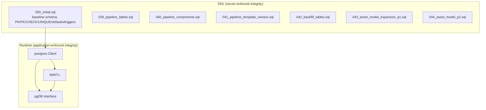
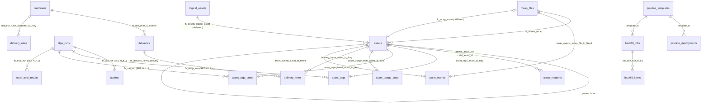
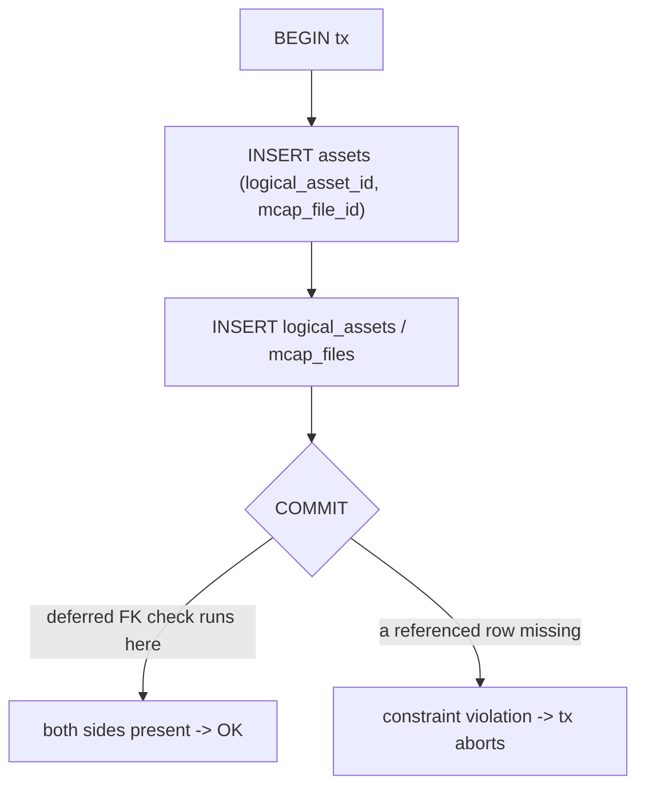
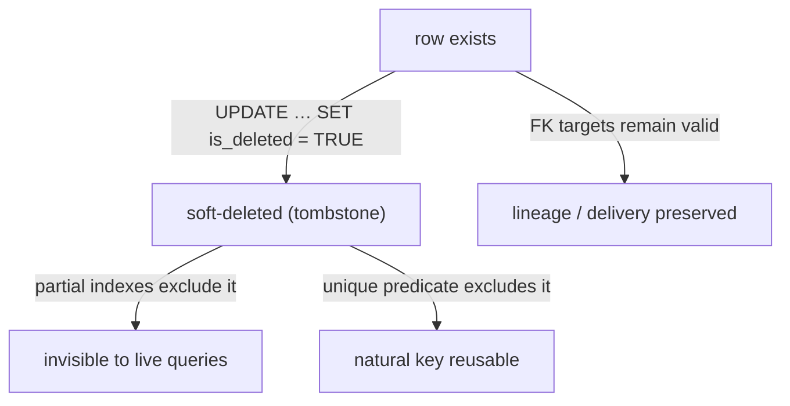
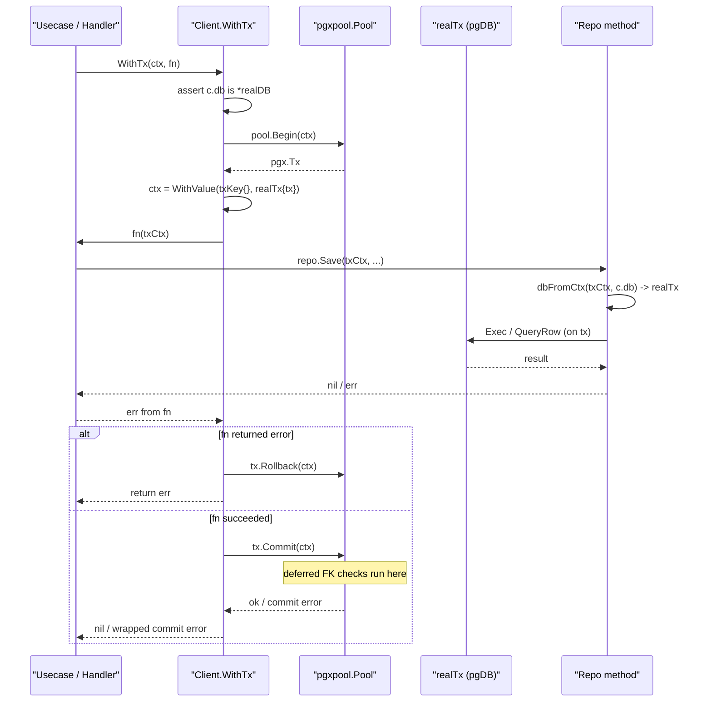
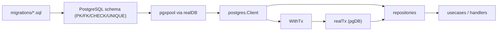

# Integrity and Constraints

<cite>
**Referenced Files in This Document**
- [backend/migrations/000_initial.sql](file://backend/migrations/000_initial.sql)
- [backend/migrations/039_pipeline_tables.sql](file://backend/migrations/039_pipeline_tables.sql)
- [backend/migrations/040_pipeline_components.sql](file://backend/migrations/040_pipeline_components.sql)
- [backend/migrations/041_pipeline_template_version.sql](file://backend/migrations/041_pipeline_template_version.sql)
- [backend/migrations/042_backfill_tables.sql](file://backend/migrations/042_backfill_tables.sql)
- [backend/migrations/043_asset_model_expansion_p1.sql](file://backend/migrations/043_asset_model_expansion_p1.sql)
- [backend/migrations/044_asset_model_p2.sql](file://backend/migrations/044_asset_model_p2.sql)
- [backend/internal/postgres/client.go](file://backend/internal/postgres/client.go)
</cite>

## Table of Contents
1. [Introduction](#introduction)
2. [Project Structure](#project-structure)
3. [Core Components](#core-components)
4. [Architecture Overview](#architecture-overview)
5. [Detailed Component Analysis](#detailed-component-analysis)
6. [Dependency Analysis](#dependency-analysis)
7. [Performance Considerations](#performance-considerations)
8. [Troubleshooting Guide](#troubleshooting-guide)
9. [Conclusion](#conclusion)
10. [Appendices](#appendices)

## Introduction

This page documents the **data integrity model** of cyber-databrew: the
primary keys, foreign keys, `NOT NULL`, `CHECK`, and `UNIQUE` constraints,
column defaults, the soft-delete convention, and the transactional write
guarantees that the Go backend relies on to keep the PostgreSQL store
consistent.

The schema is the contract between the ingestion path, the algorithm-run
pipeline, the delivery subsystem, and the search/event projections. Every
constraint described here is enforced **inside the database** so that a bug or
a race in application code cannot silently corrupt the asset graph. The
backend complements those server-side guarantees with an application-level
transaction helper (`Client.WithTx`) that wraps multi-statement writes in a
single PostgreSQL transaction so that either all of a write succeeds or none
of it does.

The squashed migration `000_initial.sql` is the single source of truth for a
fresh deployment — it is applied automatically on first boot through the
`/docker-entrypoint-initdb.d` mount — while the numbered migrations `039`–`044`
layer incremental schema changes (pipeline tables, backfill tables, and the
asset-model expansion) on top of that baseline.

**Section sources**
- [backend/migrations/000_initial.sql](file://backend/migrations/000_initial.sql#L1-L3)
- [backend/internal/postgres/client.go](file://backend/internal/postgres/client.go#L16-L46)

## Project Structure

Data-integrity definitions live in two places:

- **`backend/migrations/*.sql`** — declarative DDL. `000_initial.sql` defines
  the entire baseline schema: tables, column defaults, `CHECK` constraints,
  primary keys, unique indexes, foreign keys, partitions, sequences, and
  triggers. The later numbered migrations evolve specific tables.
- **`backend/internal/postgres/client.go`** — the runtime gateway. It owns the
  `pgxpool` connection pool, exposes a `pgDB` abstraction that runs the same
  repo code against either the pool or a transaction, and implements
  `WithTx`, the transactional write helper.

**Diagram sources**
- [backend/migrations/000_initial.sql](file://backend/migrations/000_initial.sql#L50-L75)
- [backend/internal/postgres/client.go](file://backend/internal/postgres/client.go#L19-L46)

**Section sources**
- [backend/migrations/000_initial.sql](file://backend/migrations/000_initial.sql#L1-L48)
- [backend/internal/postgres/client.go](file://backend/internal/postgres/client.go#L1-L62)

## Core Components

The integrity model rests on five server-side constraint mechanisms plus one
application-side transaction helper:

| Mechanism | Where defined | Purpose |
| --- | --- | --- |
| **Primary keys** | `ADD CONSTRAINT … PRIMARY KEY` blocks | Row identity / dedup |
| **Foreign keys** | `ADD CONSTRAINT … FOREIGN KEY` blocks | Referential integrity of the asset graph |
| **`CHECK` constraints** | inline `CONSTRAINT … CHECK` in `CREATE TABLE` | ID format, enum domains, range validity |
| **`NOT NULL` + `DEFAULT`** | column definitions | Mandatory fields and safe initial values |
| **`UNIQUE` constraints / indexes** | `ADD CONSTRAINT … UNIQUE` and `CREATE UNIQUE INDEX` | Natural-key dedup and "single current revision" guarantees |
| **`WithTx`** | `client.go` | All-or-nothing multi-statement writes |

The central entity is `assets`; almost every integrity rule either guards the
`assets` table or references it. `mcap_files` is the raw-ingest root,
`logical_assets` groups asset revisions, `algo_runs` records processing runs,
and `customers`/`deliveries` form the delivery side.

**Section sources**
- [backend/migrations/000_initial.sql](file://backend/migrations/000_initial.sql#L310-L358)
- [backend/migrations/000_initial.sql](file://backend/migrations/000_initial.sql#L601-L677)
- [backend/migrations/000_initial.sql](file://backend/migrations/000_initial.sql#L850-L911)

## Architecture Overview

The relational core links raw files, assets, lineage, runs, and deliveries.
The diagram below shows the entities that participate in foreign-key
relationships, drawn directly from the FK definitions in `000_initial.sql`.

**Diagram sources**
- [backend/migrations/000_initial.sql](file://backend/migrations/000_initial.sql#L850-L911)
- [backend/migrations/039_pipeline_tables.sql](file://backend/migrations/039_pipeline_tables.sql#L14-L17)
- [backend/migrations/042_backfill_tables.sql](file://backend/migrations/042_backfill_tables.sql#L4-L31)

**Section sources**
- [backend/migrations/000_initial.sql](file://backend/migrations/000_initial.sql#L850-L911)

## Detailed Component Analysis

### Primary Keys

Every table declares a primary key (or a unique key acting as identity).
Identity is mostly natural — short opaque text IDs (`asset_id`,
`mcap_file_id`, `run_id`) — with a few surrogate or composite keys where a
single column is insufficient.

| Table | Primary key | Kind |
| --- | --- | --- |
| `actions` | `action_id` | natural text |
| `algo_runs` | `run_id` | natural text |
| `asset_algo_latest` | `(asset_id, algo_name)` | composite |
| `asset_eval_results` | `eval_result_id` (uuid) | surrogate |
| `asset_events` | `(event_seq, occurred_at)` | composite (partitioned) |
| `asset_metrics` | `(asset_id, target_type, target_id, metric_key, eval_name, eval_version)` | composite |
| `asset_relations` | `(parent_asset_id, child_asset_id, relation_type)` | composite |
| `asset_tags` | `id` (bigint sequence) | surrogate |
| `asset_usage_stats` | `id`; `asset_id` is also `UNIQUE` | surrogate + natural |
| `assets` | `asset_id` | natural text |
| `customers` | `customer_id` | natural text |
| `deliveries` | `delivery_id` (uuid) | surrogate |
| `delivery_items` | `(delivery_id, asset_id)` | composite |
| `logical_assets` | `logical_asset_id` | natural text |
| `mcap_files` | `mcap_file_id` | natural text |
| `idempotency_keys` | `(scope, idem_key)` | composite |

The `asset_events` table is **range-partitioned by `occurred_at`**, so its
primary key must include the partition key; hence the composite
`(event_seq, occurred_at)` on both the parent and the `asset_events_default`
partition.

**Section sources**
- [backend/migrations/000_initial.sql](file://backend/migrations/000_initial.sql#L601-L677)
- [backend/migrations/000_initial.sql](file://backend/migrations/000_initial.sql#L613-L620)
- [backend/migrations/000_initial.sql](file://backend/migrations/000_initial.sql#L164-L188)

### Foreign Keys and Cascade Behavior

Foreign keys enforce that lineage, tags, runs, and deliveries can only point
at rows that exist. Two distinct cascade policies are in use, and two FKs are
**deferrable** to allow the two-way `assets` ⇄ `mcap_files` linkage to be
created within one transaction.

| Constraint | Child → Parent | On delete |
| --- | --- | --- |
| `fk_assets_mcap` | `assets.mcap_file_id` → `mcap_files` | default (RESTRICT) |
| `fk_mcap_asset` | `mcap_files.mcap_file_id` → `assets.asset_id` | **DEFERRABLE INITIALLY DEFERRED** |
| `fk_assets_logical_asset` | `assets.logical_asset_id` → `logical_assets` | **DEFERRABLE INITIALLY DEFERRED** |
| `assets_parent_asset_id_fkey` | `assets.parent_asset_id` → `assets` | default |
| `assets_root_asset_id_fkey` | `assets.root_asset_id` → `assets` | default |
| `asset_relations_parent_asset_id_fkey` | `asset_relations.parent_asset_id` → `assets` | default |
| `asset_relations_child_asset_id_fkey` | `asset_relations.child_asset_id` → `assets` | default |
| `asset_tags_asset_id_fkey` | `asset_tags.asset_id` → `assets` | default |
| `asset_algo_latest_asset_id_fkey` | `asset_algo_latest.asset_id` → `assets` | default |
| `asset_usage_stats_asset_id_fkey` | `asset_usage_stats.asset_id` → `assets` | default |
| `asset_events_asset_id_fkey1` | `asset_events.asset_id` → `assets` | default |
| `asset_events_mcap_file_id_fkey1` | `asset_events.mcap_file_id` → `mcap_files` | default |
| `delivery_items_asset_id_fkey` / `fk_delivery_items_asset` | `delivery_items.asset_id` → `assets` | default |
| `fk_delivery_items_delivery` | `delivery_items.delivery_id` → `deliveries` | default |
| `fk_deliveries_customer` | `deliveries.customer_id` → `customers` | default |
| `delivery_rules_customer_id_fkey` | `delivery_rules.customer_id` → `customers` | default |
| `fk_act_run` | `actions.run_id` → `algo_runs` | **SET NULL** |
| `fk_atags_run` | `asset_tags.run_id` → `algo_runs` | **SET NULL** |
| `fk_aal_run` | `asset_algo_latest.run_id` → `algo_runs` | **SET NULL** |
| `fk_eval_run` | `asset_eval_results.run_id` → `algo_runs` | **SET NULL** |
| `template_id` (pipeline_deployments) | → `pipeline_templates` | default |
| `template_id` (backfill_jobs) | → `pipeline_templates` | default |
| `job_id` (backfill_items) | → `backfill_jobs` | **CASCADE** |

The `ON DELETE SET NULL` policy on the run-pointing FKs is deliberate: when an
`algo_run` is purged, the derived artifacts (actions, tags, latest-status,
eval results) are kept but lose their provenance link rather than being
deleted. By contrast, `backfill_items` cascade-delete with their parent job
because they have no independent meaning.

The two **deferrable** FKs solve a chicken-and-egg problem: a new ingest needs
both an `assets` row and an `mcap_files` row that reference each other, and a
versioned asset references its `logical_assets` grouping row. Deferring the
check to commit time lets a single `WithTx` insert both sides in either order.

**Diagram sources**
- [backend/migrations/000_initial.sql](file://backend/migrations/000_initial.sql#L889-L911)

**Section sources**
- [backend/migrations/000_initial.sql](file://backend/migrations/000_initial.sql#L850-L911)
- [backend/migrations/042_backfill_tables.sql](file://backend/migrations/042_backfill_tables.sql#L21-L23)

### CHECK Constraints

`CHECK` constraints encode three classes of invariant: **ID format**,
**enumerated domains**, and **range / cross-column validity**. They are the
last line of defense against malformed writes.

| Constraint | Table | Rule |
| --- | --- | --- |
| `actions_id_chk` | `actions` | `action_id` matches `^[0-9A-Za-z]{8}$` |
| `actions_range_chk` | `actions` | `end_ns >= start_ns` |
| `algo_runs_run_id_check` | `algo_runs` | `run_id` matches `^[0-9A-Za-z]{16}$` |
| `algo_runs_algo_kind_check` | `algo_runs` | kind ∈ {processing, split, qa, enrichment} |
| `algo_runs_status_check` | `algo_runs` | status ∈ {pending, running, ok, failed, cancelled} |
| `assets_asset_id_check` | `assets` | `asset_id` matches `^[0-9A-Za-z]{8}$` |
| `assets_mcap_file_id_check` | `assets` | `mcap_file_id` matches `^[0-9A-Za-z]{8}$` |
| `assets_logical_asset_id_check` | `assets` | NULL or matches `^[0-9A-Za-z]{8}$` |
| `assets_revision_check` | `assets` | NULL or `revision >= 1` |
| `chk_lifecycle_state` | `assets` | state ∈ {created, processing, ready, delivered, archived, superseded, failed, rejected} |
| `chk_mcap_file_required` | `assets` | `mcap_file_id` required unless asset_type is a derived/aggregate type |
| `mcap_files_mcap_file_id_check` | `mcap_files` | `mcap_file_id` matches `^[0-9A-Za-z]{8}$` |
| `chk_mcap_files_summary_index_state` | `mcap_files` | state ∈ {pending, running, done, failed} |
| `chk_relation_type` | `asset_relations` | relation_type in a fixed allow-list |
| `customers_status_check` | `customers` | status ∈ {active, trial, suspended, offboarded} |
| `customers_sla_tier_check` | `customers` | tier ∈ {standard, premium, enterprise} |
| `delivery_rules_enforce_mode_check` | `delivery_rules` | mode ∈ {block, warn, tag_only} |
| `delivery_rules_rating_scope_check` | `delivery_rules` | scope ∈ {current, logical} |
| `logical_assets_status_check` | `logical_assets` | status ∈ {active, archived} |
| `logical_assets_current_revision_check` | `logical_assets` | `current_revision >= 1` |
| `logical_assets_check` | `logical_assets` | `total_revisions >= current_revision` |
| `logical_assets_logical_asset_id_check` | `logical_assets` | id matches `^[0-9A-Za-z]{8}$` |
| `search_reindex_jobs_status_check` | `search_reindex_jobs` | status ∈ {queued, running, paused, succeeded, failed} |
| `lakehouse_bronze_checkpoint_singleton` | `lakehouse_bronze_checkpoint` | `id = 1` (single-row table) |

Two of these constraints have **evolved** through later migrations:

- `chk_relation_type` started with eight relation types in `000_initial.sql`,
  was re-stated at eight in `043` (dataset/annotation lineage), and was
  expanded to nineteen types in `044` to cover ML-model and evaluation
  lineage (`trained_from`, `evaluated_on`, `generated_by`, …).
- `chk_mcap_file_required` grew its exemption list from
  `{derived_asset, dataset, annotation_result}` in `043` to additionally
  include `ml_model` and `evaluation_report` in `044`.

The `algo_runs.duration_ns` column is a **stored generated column** computed
from `finished_at - started_at`, which is an integrity guarantee of a
different kind: the value cannot be set to anything inconsistent with the
timestamps because the database derives it.

**Section sources**
- [backend/migrations/000_initial.sql](file://backend/migrations/000_initial.sql#L73-L74)
- [backend/migrations/000_initial.sql](file://backend/migrations/000_initial.sql#L115-L117)
- [backend/migrations/000_initial.sql](file://backend/migrations/000_initial.sql#L352-L357)
- [backend/migrations/000_initial.sql](file://backend/migrations/000_initial.sql#L475-L478)
- [backend/migrations/000_initial.sql](file://backend/migrations/000_initial.sql#L519-L520)
- [backend/migrations/043_asset_model_expansion_p1.sql](file://backend/migrations/043_asset_model_expansion_p1.sql#L3-L22)
- [backend/migrations/044_asset_model_p2.sql](file://backend/migrations/044_asset_model_p2.sql#L3-L37)

### NOT NULL Columns and Defaults

The schema favors **non-nullable columns with safe defaults** over nullable
columns wherever a sensible zero value exists. This keeps reads simple
(callers never have to branch on NULL) and protects against partial inserts.

Representative patterns:

- **JSONB containers** default to `'{}'::jsonb` (e.g. `assets.metadata`,
  `assets.files`, `algo_runs.params`, `customers.metadata`) and are
  `NOT NULL`, so a row always has a well-formed JSON object.
- **Counters** default to `0` and are `NOT NULL` (e.g.
  `assets.delivery_count`, `deliveries.item_count`,
  `mcap_files.size_bytes`, `backfill_jobs.total_count`).
- **Status / state columns** carry an initial value and are `NOT NULL`
  (`assets.lifecycle_state` → `'created'`, `algo_runs.status` → `'pending'`,
  `mcap_files.ingest_state` → `'pending'`, `asset_events.publish_state` →
  `'pending'`).
- **Audit timestamps** `created_at` / `updated_at` default to `now()` and are
  `NOT NULL` on most tables. On `assets`, `mcap_files`, and `deliveries` they
  are `NOT NULL` **without** a default — the application must supply them,
  which lets ingestion preserve externally meaningful timestamps.
- **Soft-delete flags** default to `false` (see next subsection).
- **Optimistic-concurrency `version`** defaults to `1` on `assets`,
  `mcap_files`, `deliveries`, `actions`, and `delivery_rules`.

`updated_at` maintenance is partly automated: a `set_updated_at()` trigger
function fires `BEFORE UPDATE` on `asset_algo_latest`, `asset_eval_results`,
`asset_metrics`, `asset_tags`, and `saved_queries`, so those tables always
reflect the true last-modified time regardless of what the writer passes.

**Section sources**
- [backend/migrations/000_initial.sql](file://backend/migrations/000_initial.sql#L310-L351)
- [backend/migrations/000_initial.sql](file://backend/migrations/000_initial.sql#L26-L33)
- [backend/migrations/000_initial.sql](file://backend/migrations/000_initial.sql#L840-L848)

### UNIQUE Constraints and Unique Indexes

Uniqueness is used both for **natural-key deduplication** and for the
**"exactly one current revision"** invariant on versioned assets.

| Object | Table | Columns / predicate |
| --- | --- | --- |
| `asset_usage_stats_asset_id_key` (UNIQUE) | `asset_usage_stats` | `asset_id` |
| `uq_asset_tags_identity` (UNIQUE) | `asset_tags` | `(asset_id, tag_key, tag_value, source_type, source_version_norm)` |
| `uq_mcap_files_hash_md5` (partial UNIQUE) | `mcap_files` | `raw_hash_md5` WHERE not null and not deleted |
| `uq_assets_current_per_logical` (partial UNIQUE) | `assets` | `logical_asset_id` WHERE `is_current = TRUE AND is_deleted = FALSE` |
| `uq_actions_external` (partial UNIQUE) | `actions` | `(asset_id, source_name, external_id)` WHERE `external_id` not null and not deleted |
| `idx_pipeline_templates_name_version` (UNIQUE) | `pipeline_templates` | `(name, version)` |

The `asset_tags` identity key uses a **generated column**,
`source_version_norm` = `COALESCE(source_version, '')`, so that two tags with
the same logical identity but a NULL vs. empty `source_version` are treated as
duplicates rather than slipping past the unique constraint (NULLs are normally
distinct).

The two most important integrity rules here are the **partial unique
indexes** on `mcap_files` and `assets`:

- `uq_mcap_files_hash_md5` prevents ingesting the same raw file twice — but
  only among non-deleted rows, so a re-ingest after a soft delete is allowed.
- `uq_assets_current_per_logical` guarantees that for each logical asset there
  is at most **one** non-deleted row flagged `is_current = TRUE`. This is the
  database-level enforcement of the revision model: promoting a new revision
  must clear the old `is_current` flag in the same transaction.

**Section sources**
- [backend/migrations/000_initial.sql](file://backend/migrations/000_initial.sql#L628-L680)
- [backend/migrations/000_initial.sql](file://backend/migrations/000_initial.sql#L913-L929)
- [backend/migrations/000_initial.sql](file://backend/migrations/000_initial.sql#L276-L279)
- [backend/migrations/041_pipeline_template_version.sql](file://backend/migrations/041_pipeline_template_version.sql#L17-L18)

### Soft Delete

Rows that participate in lineage or delivery are **never hard-deleted** by the
application; they carry an `is_deleted boolean` flag instead. This preserves
referential integrity (a delivered asset's FK targets stay valid) and keeps an
audit trail.

Tables with a soft-delete flag: `assets`, `mcap_files`, `actions`, and
`deliveries`. The convention is reinforced by the fact that essentially every
"hot path" index is a **partial index with `WHERE is_deleted = FALSE`**, so
queries over live data ignore tombstoned rows automatically and cheaply:

- `idx_assets_lifecycle`, `idx_assets_asset_type`,
  `idx_assets_tenant_project`, `idx_assets_active_updated_at`,
  `idx_assets_active_lifecycle_updated_at`
- `idx_mcap_files_tenant_project`, `idx_mcap_files_ingest_state`,
  `idx_mcap_files_summary_index_pending`
- `idx_deliveries_tenant_project`
- `idx_actions_asset_start`, `idx_actions_primary_label`,
  `idx_actions_labels_gin`, `idx_actions_run_id`

The partial **unique** indexes (`uq_mcap_files_hash_md5`,
`uq_assets_current_per_logical`, `uq_actions_external`) also scope their
predicate to `is_deleted = FALSE`, so soft-deleting a row frees its natural
key for reuse.

**Diagram sources**
- [backend/migrations/000_initial.sql](file://backend/migrations/000_initial.sql#L913-L929)

**Section sources**
- [backend/migrations/000_initial.sql](file://backend/migrations/000_initial.sql#L318-L318)
- [backend/migrations/000_initial.sql](file://backend/migrations/000_initial.sql#L484-L484)
- [backend/migrations/000_initial.sql](file://backend/migrations/000_initial.sql#L913-L929)

### Transactional Writes (WithTx)

Server-side constraints guarantee that a *single* statement is valid;
`Client.WithTx` guarantees that a *group* of statements is atomic. It is the
mechanism that lets the application uphold multi-row invariants — for example
"insert the asset and clear the previous current revision together" or "insert
both sides of the deferred `assets ⇄ mcap_files` FK".

The design is built around a small `pgDB` interface and a context key:

- `Client.db` is a `pgDB`. The real implementation, `realDB`, wraps the
  `pgxpool.Pool`.
- `realTx` wraps a `pgx.Tx` and satisfies the same `pgDB` interface, so repo
  code is identical whether it runs on the pool or inside a transaction.
- `WithTx` begins a transaction, stashes a `realTx` under `txKey{}` in the
  context, and calls `fn(txCtx)`. Repo methods call `dbFromCtx(ctx, c.db)` to
  pick up the tx-bound `pgDB` automatically.
- If `fn` returns an error, the transaction is **rolled back**; otherwise it
  is **committed**. A commit failure is wrapped and returned.

A subtle but important contract: only repo methods that go through
`dbFromCtx` join the transaction. A method that uses `c.db` directly runs on
the pool and is *not* part of the tx — the doc comment warns that "when in
doubt, every repo method called from within `fn` should be tx-aware."

For non-pool-backed clients (test mocks whose `db` is not a `*realDB`),
`WithTx` degrades gracefully: it calls `fn(ctx)` directly with no real
transaction, leaving the mock responsible for honoring the contract.

**Diagram sources**
- [backend/internal/postgres/client.go](file://backend/internal/postgres/client.go#L211-L239)
- [backend/internal/postgres/client.go](file://backend/internal/postgres/client.go#L48-L62)

**Section sources**
- [backend/internal/postgres/client.go](file://backend/internal/postgres/client.go#L16-L123)
- [backend/internal/postgres/client.go](file://backend/internal/postgres/client.go#L211-L239)

## Dependency Analysis

The integrity layer sits between the migrations (which define it) and the
repositories/usecases (which depend on it). Repositories never enforce
referential rules themselves — they rely on the database — and reach for
`WithTx` only when a write spans multiple statements.

Key dependency facts:

- `WithTx` depends on `c.db` being a concrete `*realDB`; that assertion is the
  branch point between real transactions and the test-mock fallback.
- The deferred FKs (`fk_mcap_asset`, `fk_assets_logical_asset`) create a
  *runtime* dependency on `WithTx`: the two-sided insert is only safe inside a
  single transaction where the check is deferred to commit.
- The `set_updated_at()` trigger and the generated columns
  (`algo_runs.duration_ns`, `asset_tags.source_version_norm`) mean the
  application *cannot* override certain fields — a dependency that simplifies
  callers.

**Section sources**
- [backend/internal/postgres/client.go](file://backend/internal/postgres/client.go#L48-L62)
- [backend/internal/postgres/client.go](file://backend/internal/postgres/client.go#L220-L239)
- [backend/migrations/000_initial.sql](file://backend/migrations/000_initial.sql#L889-L911)

## Performance Considerations

- **Partial indexes scoped to `is_deleted = FALSE`** keep live-data lookups
  small and avoid scanning tombstones; they also keep the partial unique
  indexes cheap to maintain.
- **`asset_events` range partitioning by `occurred_at`** bounds index size per
  partition and lets `event_retention_cleanup` delete old published/dlq events
  efficiently. The publish-pending partial index
  (`WHERE publish_state = 'pending'`) keeps the outbox poller's scan tiny.
- **Pool sizing is explicit** in `newPool`: `MaxConns` defaults to 20,
  `MinConns` to 4, with a 1-hour max lifetime and 30-minute idle — chosen to
  avoid pgx's small default of 4 connections, which would bottleneck
  concurrent transactional writes.
- **FK checks have a cost**: every insert into a child table validates against
  the parent. The composite and partial indexes back those lookups. Deferred
  FKs move the cost to commit, batching it.
- **`WithTx` holds a connection** for the duration of `fn`; long-running work
  inside a transaction reduces effective pool capacity, so keep transaction
  bodies short.

**Section sources**
- [backend/internal/postgres/client.go](file://backend/internal/postgres/client.go#L125-L142)
- [backend/migrations/000_initial.sql](file://backend/migrations/000_initial.sql#L698-L704)
- [backend/migrations/000_initial.sql](file://backend/migrations/000_initial.sql#L913-L929)

## Troubleshooting Guide

| Symptom | Likely cause | Where to look |
| --- | --- | --- |
| `new row violates check constraint "assets_asset_id_check"` | Generated ID not 8 alphanumerics | ID generator; `assets_asset_id_check` (L352) |
| `violates check constraint "chk_mcap_file_required"` | Non-derived asset created without `mcap_file_id` | `chk_mcap_file_required` (043/044) |
| `violates check constraint "chk_relation_type"` | New lineage edge type not in allow-list | extend `chk_relation_type` (044) |
| `duplicate key value violates unique constraint "uq_assets_current_per_logical"` | Two rows flagged `is_current` for one logical asset | revision-promotion logic must clear old flag in same tx |
| `duplicate key … "uq_mcap_files_hash_md5"` | Re-ingest of an identical raw file | dedup is intentional; soft-delete frees the key |
| `violates foreign key constraint "fk_delivery_items_asset"` | Delivery references a missing/purged asset | insert order; assets must exist first |
| Partial writes left in DB after an error | Multi-statement write not wrapped in `WithTx`, or a called repo used `c.db` directly | confirm method is tx-aware via `dbFromCtx` |
| Deferred FK error only at COMMIT | Both sides of `assets ⇄ mcap_files` not inserted in the tx | ensure both inserts run inside one `WithTx` |
| `updated_at` not changing on update | Table lacks the `set_updated_at` trigger | trigger list (L840-L848) |

A useful diagnostic principle: if a constraint error fires at `COMMIT` rather
than at the offending statement, the violated constraint is one of the two
`DEFERRABLE INITIALLY DEFERRED` foreign keys.

**Section sources**
- [backend/migrations/000_initial.sql](file://backend/migrations/000_initial.sql#L352-L357)
- [backend/migrations/000_initial.sql](file://backend/migrations/000_initial.sql#L889-L911)
- [backend/internal/postgres/client.go](file://backend/internal/postgres/client.go#L220-L239)

## Conclusion

cyber-databrew enforces data integrity primarily **in the database**: every
table has a primary key, foreign keys protect the asset/lineage/delivery
graph (with `SET NULL` for run provenance and `CASCADE` for owned backfill
items), `CHECK` constraints lock down ID formats and enum domains, `NOT NULL`
columns with safe defaults prevent partial rows, and partial unique indexes
implement dedup and the single-current-revision rule. Soft deletes preserve
referential integrity and an audit trail while letting natural keys be reused.
On top of this, `Client.WithTx` provides all-or-nothing multi-statement writes
and is the only safe way to satisfy the two deferrable foreign keys. Together,
the declarative constraints and the transaction helper make it hard for
application bugs to leave the store in an inconsistent state.

## Appendices

### A. Constraint type quick reference

| Type | Examples |
| --- | --- |
| Primary keys | `assets_pkey`, `asset_metrics_pkey`, `asset_events_pkey1` |
| Foreign keys | `fk_assets_mcap`, `fk_deliveries_customer`, `fk_act_run` |
| `CHECK` | `chk_lifecycle_state`, `actions_range_chk`, `chk_relation_type` |
| `UNIQUE` (constraint) | `asset_usage_stats_asset_id_key`, `uq_asset_tags_identity` |
| `UNIQUE` (partial index) | `uq_mcap_files_hash_md5`, `uq_assets_current_per_logical`, `uq_actions_external` |

### B. Enum domains (from CHECK constraints)

- **assets.lifecycle_state**: created, processing, ready, delivered, archived, superseded, failed, rejected
- **algo_runs.status**: pending, running, ok, failed, cancelled
- **algo_runs.algo_kind**: processing, split, qa, enrichment
- **mcap_files.ingest/summary state**: pending, running, done, failed
- **customers.status**: active, trial, suspended, offboarded
- **customers.sla_tier**: standard, premium, enterprise
- **delivery_rules.enforce_mode**: block, warn, tag_only
- **delivery_rules.rating_scope**: current, logical
- **logical_assets.status**: active, archived
- **search_reindex_jobs.status**: queued, running, paused, succeeded, failed

### C. Triggers and generated columns

- `set_updated_at()` BEFORE UPDATE on: asset_algo_latest, asset_eval_results, asset_metrics, asset_tags, saved_queries
- `trg_logical_assets_type_immutable()` BEFORE UPDATE on logical_assets — rejects changing `asset_type`
- Generated columns: `algo_runs.duration_ns` (STORED), `asset_tags.source_version_norm` (STORED)

**Section sources**
- [backend/migrations/000_initial.sql](file://backend/migrations/000_initial.sql#L35-L44)
- [backend/migrations/000_initial.sql](file://backend/migrations/000_initial.sql#L838-L848)
- [backend/migrations/000_initial.sql](file://backend/migrations/000_initial.sql#L86-L90)
