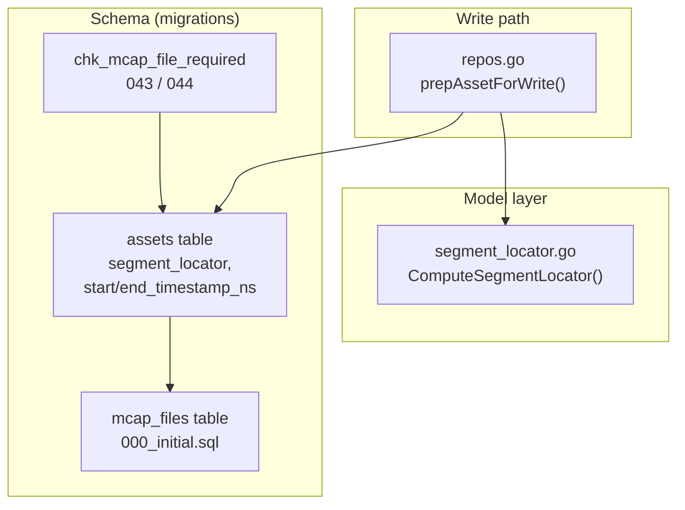
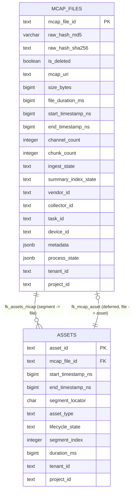
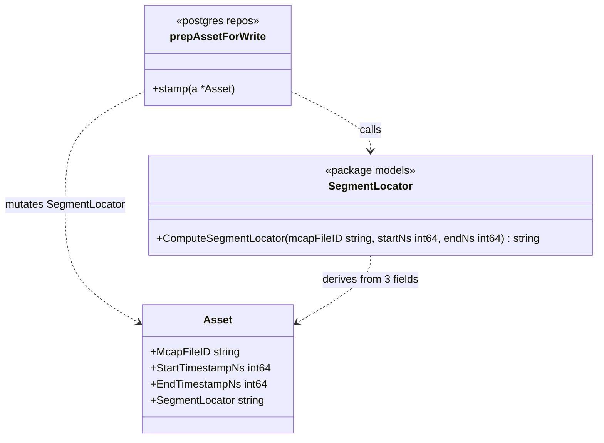
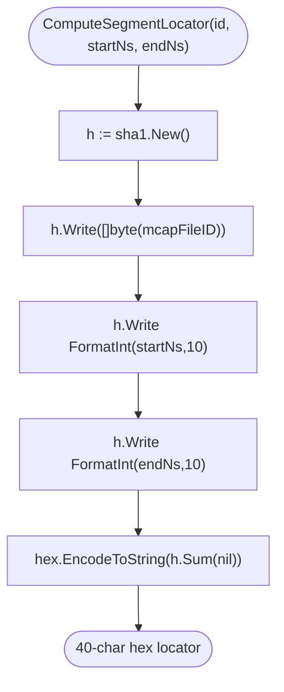
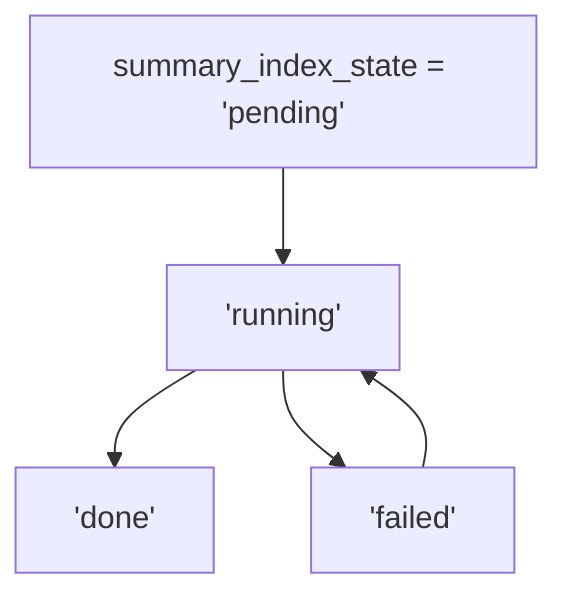
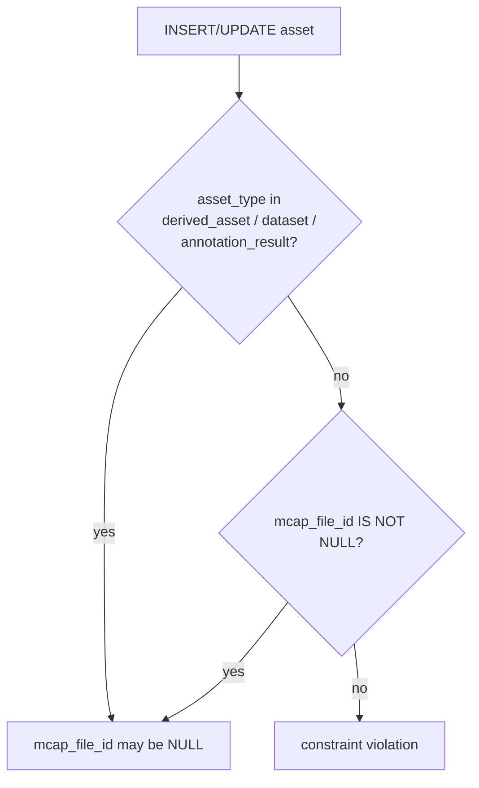
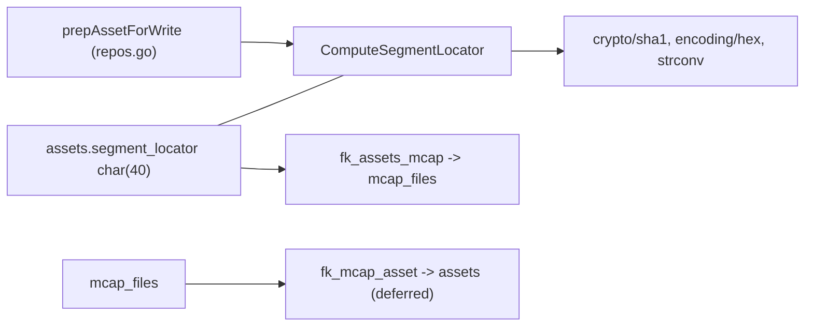

# MCAP & Segment Model

<cite>
**Referenced Files in This Document**

- [backend/internal/models/segment_locator.go](file://backend/internal/models/segment_locator.go)
- [backend/migrations/000_initial.sql](file://backend/migrations/000_initial.sql)
- [backend/migrations/044_asset_model_expansion_p1.sql](file://backend/migrations/044_asset_model_expansion_p1.sql)
- [backend/migrations/045_asset_model_p2.sql](file://backend/migrations/045_asset_model_p2.sql)
- [backend/internal/postgres/repos.go](file://backend/internal/postgres/repos.go)
</cite>

## Table of Contents
1. [Introduction](#introduction)
2. [Project Structure](#project-structure)
3. [Core Components](#core-components)
4. [Architecture Overview](#architecture-overview)
5. [Detailed Component Analysis](#detailed-component-analysis)
6. [Dependency Analysis](#dependency-analysis)
7. [Performance Considerations](#performance-considerations)
8. [Troubleshooting Guide](#troubleshooting-guide)
9. [Conclusion](#conclusion)
10. [Appendices](#appendices)

## Introduction

The MCAP & Segment model is the foundation of cyber-databrew's raw-data
lineage. It records, for every recorded log file, the physical MCAP artifact
that was ingested (the `mcap_files` table) and the time-bounded logical slices
that downstream pipelines, deliveries, and annotations operate on (the
`assets` table, with `asset_type = 'segment'` as its default). The bridge
between a physical recording and one of its logical slices is the **segment
locator** — a 40-character SHA-1 digest derived deterministically from the
source `mcap_file_id` and the segment's `[start_timestamp_ns, end_timestamp_ns)`
nanosecond range.

This page exists because two distinct concerns must stay consistent:

- **Physical ingestion truth** — what file arrived, where it lives in object
  storage, how big it is, how long it runs, whether it has been summary-indexed,
  and the dedup hash that prevents the same recording being ingested twice.
- **Logical addressability** — every consumer (a pipeline run, a delivery, an
  annotation job) must be able to refer to *exactly one* time window of *exactly
  one* MCAP file with a stable, content-addressed identifier that can be
  recomputed anywhere without a database round-trip.

The model is used by the ingestion path (which writes `mcap_files` rows), the
asset/segment write path in `prepAssetForWrite` (which stamps the locator on
every asset write), and by the cataloging, delivery, and pipeline subsystems
that read segments back by `segment_locator` or join them to their parent MCAP.

**Section sources**
- [backend/internal/models/segment_locator.go](file://backend/internal/models/segment_locator.go#L1-L19)
- [backend/migrations/000_initial.sql](file://backend/migrations/000_initial.sql#L481-L521)

## Project Structure

The MCAP & segment model spans a small Go model file, the canonical SQL schema,
two later migrations that adjust segment-related constraints, and the repository
write path that applies the locator.

- **`backend/internal/models/segment_locator.go`** — the pure, dependency-free
  function `ComputeSegmentLocator`. It is the single authoritative definition of
  how a locator is derived. It imports only `crypto/sha1`, `encoding/hex`, and
  `strconv`, so it can be called from any layer without coupling.
- **`backend/migrations/000_initial.sql`** — the canonical schema. It defines
  the `mcap_files` table (lines 481–521), the `assets` table that carries the
  `segment_locator` column and the segment time range (lines 310–358), the
  primary key and foreign keys that tie the two together (lines 664–665,
  889–911), and the index set that makes lookups by locator, hash, tenant, and
  ingest state fast (lines 754–922).
- **`backend/migrations/044_asset_model_expansion_p1.sql`** and
  **`backend/migrations/045_asset_model_p2.sql`** — incremental migrations that
  re-state the `chk_mcap_file_required` constraint as the asset taxonomy
  expanded. They confirm which `asset_type` values are exempt from requiring an
  `mcap_file_id`.
- **`backend/internal/postgres/repos.go`** — `prepAssetForWrite` recomputes and
  stamps `segment_locator` on every asset write, guaranteeing the column is
  always derived from the current `mcap_file_id` + time range rather than
  trusted from the caller.

**Diagram sources**
- [backend/internal/models/segment_locator.go](file://backend/internal/models/segment_locator.go#L13-L19)
- [backend/migrations/000_initial.sql](file://backend/migrations/000_initial.sql#L310-L358)
- [backend/internal/postgres/repos.go](file://backend/internal/postgres/repos.go#L141-L148)

**Section sources**
- [backend/internal/models/segment_locator.go](file://backend/internal/models/segment_locator.go#L1-L19)
- [backend/migrations/000_initial.sql](file://backend/migrations/000_initial.sql#L481-L521)
- [backend/migrations/044_asset_model_expansion_p1.sql](file://backend/migrations/044_asset_model_expansion_p1.sql#L19-L21)
- [backend/migrations/045_asset_model_p2.sql](file://backend/migrations/045_asset_model_p2.sql#L33-L36)

## Core Components

### The `mcap_files` table

`mcap_files` is the physical-recording record. Its primary key, `mcap_file_id`,
is a text column constrained to an 8-character alphanumeric token by
`mcap_files_mcap_file_id_check` (`^[0-9A-Za-z]{8}$`). The table captures
storage location (`mcap_uri`), physical size (`size_bytes`), the recording's
own timeline (`file_duration_ms`, `start_timestamp_ns`, `end_timestamp_ns`),
MCAP structure counts (`channel_count`, `chunk_count`), and a rich set of
provenance columns (`vendor_id`, `collector_id`, `task_id`, `device_id`,
`camera_model`, `data_source`, `location_id`, `scene_id`, `environment_id`,
`collection_method`).

Two lifecycle state machines live here as text columns: `ingest_state`
(defaulting to `'pending'`) and `summary_index_state`, the latter constrained
by `chk_mcap_files_summary_index_state` to one of `pending`, `running`, `done`,
or `failed`. Deduplication is enforced through `raw_hash_md5` (a 32-char
varchar, also stored long-form as `raw_hash_sha256`) backed by a partial unique
index.

**Section sources**
- [backend/migrations/000_initial.sql](file://backend/migrations/000_initial.sql#L481-L521)

### The `assets` segment columns

A segment is an `assets` row. The MCAP-relevant columns are `mcap_file_id`
(nullable text, same 8-char token format, FK to `mcap_files`),
`start_timestamp_ns` and `end_timestamp_ns` (`NOT NULL` bigints defining the
half-open window), and `segment_locator` — a fixed-width `character(40)` column
that holds the SHA-1 hex digest. `asset_type` defaults to `'segment'`. The
`chk_mcap_file_required` constraint ties them together: every asset must carry
an `mcap_file_id` unless it is a `derived_asset`, `dataset`, or
`annotation_result`.

**Section sources**
- [backend/migrations/000_initial.sql](file://backend/migrations/000_initial.sql#L310-L358)

### `ComputeSegmentLocator`

The locator is produced by a single pure function. It writes three byte
sequences into a SHA-1 hasher — the `mcapFileID` string, the base-10 decimal
encoding of `startNs`, and the base-10 decimal encoding of `endNs` — then
returns the 40-character lowercase hex digest. Because it depends only on its
three inputs and uses no separators, the same `(mcap_file_id, startNs, endNs)`
tuple always maps to the same locator, on any machine, with no database lookup.

**Section sources**
- [backend/internal/models/segment_locator.go](file://backend/internal/models/segment_locator.go#L9-L19)

### The write-path stamp

`prepAssetForWrite` recomputes `SegmentLocator` from the asset's current
`McapFileID`, `StartTimestampNs`, and `EndTimestampNs` immediately before every
write. The locator is therefore a derived attribute owned by the persistence
layer, never trusted from API input.

**Section sources**
- [backend/internal/postgres/repos.go](file://backend/internal/postgres/repos.go#L141-L148)

## Architecture Overview

The two tables form a one-to-many relationship — one physical MCAP file fans
out into many logical segments — with a deliberately unusual twist: there are
foreign keys in *both* directions. `assets.mcap_file_id` references
`mcap_files(mcap_file_id)` via `fk_assets_mcap`, while `mcap_files.mcap_file_id`
references `assets(asset_id)` via `fk_mcap_asset`, which is declared
`DEFERRABLE INITIALLY DEFERRED`. The deferred direction lets the ingestion path
create the paired rows inside one transaction without ordering deadlock: the
constraint is only checked at commit.

**Diagram sources**
- [backend/migrations/000_initial.sql](file://backend/migrations/000_initial.sql#L481-L521)
- [backend/migrations/000_initial.sql](file://backend/migrations/000_initial.sql#L310-L358)
- [backend/migrations/000_initial.sql](file://backend/migrations/000_initial.sql#L889-L911)

**Section sources**
- [backend/migrations/000_initial.sql](file://backend/migrations/000_initial.sql#L664-L665)
- [backend/migrations/000_initial.sql](file://backend/migrations/000_initial.sql#L889-L911)

## Detailed Component Analysis

### Segment locator computation

The locator function is intentionally minimal. It is a class-of-one in Go terms
— a free function in package `models` — but modeling it as a structured
algorithm clarifies its contract and its callers.

The algorithm proceeds in four steps:

1. Construct a fresh `sha1.New()` hasher.
2. Write the raw bytes of `mcapFileID`.
3. Write `strconv.FormatInt(startNs, 10)` — the start nanosecond as a decimal
   string.
4. Write `strconv.FormatInt(endNs, 10)` — the end nanosecond as a decimal
   string — then hex-encode `h.Sum(nil)`.

Because the three components are concatenated with **no delimiter**, the design
relies on the fixed 8-character format of `mcap_file_id` (enforced by
`mcap_files_mcap_file_id_check`) plus decimal nanosecond strings to avoid
ambiguity at the boundaries. The 40-character output width matches the
`character(40)` declaration of `assets.segment_locator` exactly.

**Diagram sources**
- [backend/internal/models/segment_locator.go](file://backend/internal/models/segment_locator.go#L13-L19)
- [backend/internal/postgres/repos.go](file://backend/internal/postgres/repos.go#L141-L148)

**Section sources**
- [backend/internal/models/segment_locator.go](file://backend/internal/models/segment_locator.go#L9-L19)

### MCAP file lifecycle states

`mcap_files` carries two independent state machines. `ingest_state` tracks the
arrival/processing of the physical file and defaults to `'pending'`;
`summary_index_state` tracks the separate task of building a searchable summary
index and is constrained to exactly `pending`, `running`, `done`, or `failed`.
The supporting columns `summary_index_version`, `summary_indexed_at`,
`summary_index_attempts` (default 0), and `summary_index_error` give the indexer
enough state to retry and to report failures without a side table.

**Diagram sources**
- [backend/migrations/000_initial.sql](file://backend/migrations/000_initial.sql#L492-L519)

**Section sources**
- [backend/migrations/000_initial.sql](file://backend/migrations/000_initial.sql#L514-L520)

### The `chk_mcap_file_required` constraint and its evolution

In `000_initial.sql`, `chk_mcap_file_required` requires that an asset has a
non-null `mcap_file_id` unless its `asset_type` is one of `derived_asset`,
`dataset`, or `annotation_result`. Migration 043 re-states the same predicate
when the asset model expanded, and migration 044 re-states it again in its
multi-line CHECK form. The semantic remains stable: pure-segment assets must be
anchored to a physical recording, while higher-order or synthesized asset types
may stand alone.

**Diagram sources**
- [backend/migrations/000_initial.sql](file://backend/migrations/000_initial.sql#L357-L357)
- [backend/migrations/044_asset_model_expansion_p1.sql](file://backend/migrations/044_asset_model_expansion_p1.sql#L19-L21)
- [backend/migrations/045_asset_model_p2.sql](file://backend/migrations/045_asset_model_p2.sql#L33-L36)

**Section sources**
- [backend/migrations/000_initial.sql](file://backend/migrations/000_initial.sql#L352-L357)
- [backend/migrations/044_asset_model_expansion_p1.sql](file://backend/migrations/044_asset_model_expansion_p1.sql#L19-L21)
- [backend/migrations/045_asset_model_p2.sql](file://backend/migrations/045_asset_model_p2.sql#L33-L36)

## Dependency Analysis

The model has very few code dependencies, by design. `ComputeSegmentLocator`
depends only on the Go standard library, which keeps it callable from any layer.
The schema-side dependencies are the bidirectional foreign keys and the format
checks; the application-side dependency is the single call site in the write
path.

Inbound consumers (readers) reach the model through the `segment_locator`
column index and through joins on `mcap_file_id`. Because the locator is
content-addressed, any subsystem can independently recompute the locator for a
known `(mcap_file_id, startNs, endNs)` tuple and use it as a lookup key without
first writing the segment — the basis for idempotent segment upserts.

**Diagram sources**
- [backend/internal/models/segment_locator.go](file://backend/internal/models/segment_locator.go#L3-L7)
- [backend/migrations/000_initial.sql](file://backend/migrations/000_initial.sql#L889-L911)

**Section sources**
- [backend/internal/postgres/repos.go](file://backend/internal/postgres/repos.go#L141-L148)
- [backend/migrations/000_initial.sql](file://backend/migrations/000_initial.sql#L752-L762)

## Performance Considerations

The schema ships a targeted index set rather than indexing everything:

- **`idx_assets_segment_locator`** — a btree on `assets(segment_locator)`,
  enabling O(log n) lookup of a segment by its content-addressed locator. This
  is the hot path for idempotent upserts: compute the locator, probe the index.
- **`idx_assets_mcap_file_id`** — a btree on `assets(mcap_file_id)`, which makes
  the "all segments of this file" fan-out query cheap and keeps the
  `fk_assets_mcap` constraint validation fast.
- **`uq_mcap_files_hash_md5`** — a *partial* unique index on `raw_hash_md5`,
  scoped to `raw_hash_md5 IS NOT NULL AND is_deleted = FALSE`. It enforces
  dedup of physical recordings while excluding soft-deleted rows and rows with
  no hash, so re-ingestion after a tombstone is allowed.
- **`idx_mcap_files_tenant_project`** and **`idx_mcap_files_ingest_state`** —
  partial btrees filtered on `is_deleted = FALSE`, supporting tenant-scoped
  listing and ingest-state worker polling without scanning deleted rows.
- **`idx_mcap_files_summary_index_pending`** — a partial index on
  `(summary_index_state, created_at)` restricted to rows that are not yet
  `done`. The summary indexer claims work by scanning only the unfinished tail,
  which stays small as files complete.
- **`idx_mcap_files_metadata_gin`** — a GIN index on the `metadata` jsonb,
  enabling containment queries over arbitrary provenance keys.

The locator function itself is allocation-light: one SHA-1 hasher, two small
decimal-string conversions, and a hex encode. It performs no I/O, so stamping it
on every write adds negligible latency. Because it is deterministic, callers can
batch-precompute locators off the write path when needed.

A subtle N+1 risk exists for readers that resolve each segment's parent MCAP
individually; prefer joining on `mcap_file_id` (covered by
`idx_assets_mcap_file_id`) and fetching the file set once.

**Section sources**
- [backend/migrations/000_initial.sql](file://backend/migrations/000_initial.sql#L754-L762)
- [backend/migrations/000_initial.sql](file://backend/migrations/000_initial.sql#L806-L806)
- [backend/migrations/000_initial.sql](file://backend/migrations/000_initial.sql#L919-L922)

## Troubleshooting Guide

**A segment cannot be inserted — `chk_mcap_file_required` violation.** The
asset has no `mcap_file_id` and its `asset_type` is not one of `derived_asset`,
`dataset`, or `annotation_result`. Either set the parent file or pick an exempt
asset type. See the constraint at line 357 of `000_initial.sql`.

**Invalid `mcap_file_id` / `asset_id` rejected by a CHECK.** Both IDs must match
`^[0-9A-Za-z]{8}$` — exactly eight alphanumeric characters. A UUID, a longer
slug, or an ID with a hyphen will fail `mcap_files_mcap_file_id_check` or
`assets_mcap_file_id_check`.

**Two locators collide unexpectedly / are surprisingly equal.** The locator
concatenates `mcap_file_id`, `startNs`, and `endNs` with no delimiter. Equality
is only well-defined because `mcap_file_id` is fixed-width (8 chars). If a caller
ever passes a non-conforming `mcapFileID`, two distinct tuples could in theory
produce the same input string — always go through the validated ID format.

**`segment_locator` does not match what a client computed.** The stored value is
recomputed by `prepAssetForWrite` from the row's *current* `mcap_file_id`,
`start_timestamp_ns`, and `end_timestamp_ns`. A client value is ignored on
write. Recompute with the same three inputs and the same decimal nanosecond
encoding to reconcile.

**Duplicate MCAP ingestion rejected.** `uq_mcap_files_hash_md5` blocks a second
live row with the same `raw_hash_md5`. To re-ingest, the prior row must be
soft-deleted (`is_deleted = TRUE`) so it leaves the partial unique index.

**Summary indexer never picks up a file.** Confirm `summary_index_state` is not
already `'done'` (the pending index excludes done rows) and that `is_deleted` is
`FALSE`. Inspect `summary_index_error` and `summary_index_attempts` for retry
history.

**Insert ordering deadlock between `assets` and `mcap_files`.** The
`fk_mcap_asset` constraint is `DEFERRABLE INITIALLY DEFERRED`; create both rows
inside one transaction so the check runs at commit rather than per-statement.

**Section sources**
- [backend/migrations/000_initial.sql](file://backend/migrations/000_initial.sql#L352-L357)
- [backend/migrations/000_initial.sql](file://backend/migrations/000_initial.sql#L519-L520)
- [backend/migrations/000_initial.sql](file://backend/migrations/000_initial.sql#L910-L919)

## Conclusion

The MCAP & Segment model cleanly separates physical recording truth
(`mcap_files`) from logical, time-bounded addressability (`assets` segments).
The deterministic SHA-1 `segment_locator` — derived from `mcap_file_id` plus the
nanosecond range and stamped server-side on every write — gives every consumer a
stable, recomputable key for idempotent reads and writes, while bidirectional
foreign keys, the 8-char ID format checks, the `chk_mcap_file_required`
constraint, and a focused partial-index set keep the two tables consistent and
fast.

## Appendices

### Appendix A — `mcap_files` columns

| Column | Type | Default / Constraint |
| --- | --- | --- |
| `mcap_file_id` | text | `NOT NULL`, PK, `^[0-9A-Za-z]{8}$` |
| `raw_hash_md5` | varchar(32) | partial unique (live rows) |
| `raw_hash_sha256` | text | — |
| `is_deleted` | boolean | `false` |
| `mcap_uri` | text | `''` `NOT NULL` |
| `size_bytes` | bigint | `0` `NOT NULL` |
| `file_duration_ms` | bigint | `0` `NOT NULL` |
| `start_timestamp_ns` | bigint | `0` `NOT NULL` |
| `end_timestamp_ns` | bigint | `0` `NOT NULL` |
| `channel_count` | integer | `0` `NOT NULL` |
| `chunk_count` | integer | `0` `NOT NULL` |
| `ingest_state` | text | `'pending'` `NOT NULL` |
| `vendor_id` | text | — |
| `collector_id` | text | — |
| `task_id` | text | — |
| `device_id` | text | — |
| `camera_model` | text | — |
| `data_source` | text | — |
| `location_id` | text | — |
| `scene_id` | text | — |
| `environment_id` | text | — |
| `collection_method` | text | — |
| `owner` | text | `''` `NOT NULL` |
| `retention_tier` | text | — |
| `expire_at` | timestamptz | — |
| `metadata` | jsonb | `'{}'` `NOT NULL` |
| `process_state` | jsonb | `'{}'` `NOT NULL` |
| `tenant_id` | text | — |
| `project_id` | text | — |
| `created_at` | timestamptz | `NOT NULL` |
| `updated_at` | timestamptz | `NOT NULL` |
| `version` | bigint | `1` |
| `summary_index_state` | text | `'pending'`, CHECK in {pending,running,done,failed} |
| `summary_index_version` | text | — |
| `summary_indexed_at` | timestamptz | — |
| `summary_index_attempts` | integer | `0` `NOT NULL` |
| `summary_index_error` | text | — |

**Section sources**
- [backend/migrations/000_initial.sql](file://backend/migrations/000_initial.sql#L481-L521)

### Appendix B — segment-relevant `assets` columns

| Column | Type | Default / Constraint |
| --- | --- | --- |
| `asset_id` | text | `NOT NULL`, PK, `^[0-9A-Za-z]{8}$` |
| `mcap_file_id` | text | nullable, `^[0-9A-Za-z]{8}$`, FK `fk_assets_mcap` |
| `start_timestamp_ns` | bigint | `NOT NULL` |
| `end_timestamp_ns` | bigint | `NOT NULL` |
| `segment_locator` | character(40) | SHA-1 hex, stamped on write |
| `asset_type` | text | `'segment'` `NOT NULL` |
| `lifecycle_state` | text | `'created'`, CHECK enum |
| `segment_index` | integer | — |
| `duration_ms` | bigint | `0` `NOT NULL` |
| (constraint) | `chk_mcap_file_required` | mcap_file_id required unless derived_asset/dataset/annotation_result |

**Section sources**
- [backend/migrations/000_initial.sql](file://backend/migrations/000_initial.sql#L310-L358)

### Appendix C — relevant indexes & keys

| Object | Definition |
| --- | --- |
| `mcap_files_pkey` | PRIMARY KEY (`mcap_file_id`) |
| `fk_assets_mcap` | `assets.mcap_file_id` → `mcap_files(mcap_file_id)` |
| `fk_mcap_asset` | `mcap_files.mcap_file_id` → `assets(asset_id)`, DEFERRABLE INITIALLY DEFERRED |
| `idx_assets_mcap_file_id` | btree on `assets(mcap_file_id)` |
| `idx_assets_segment_locator` | btree on `assets(segment_locator)` |
| `uq_mcap_files_hash_md5` | partial unique on `raw_hash_md5` (live rows) |
| `idx_mcap_files_tenant_project` | partial btree `(tenant_id, project_id)` |
| `idx_mcap_files_ingest_state` | partial btree `(ingest_state)` |
| `idx_mcap_files_summary_index_pending` | partial btree `(summary_index_state, created_at)` where not done |
| `idx_mcap_files_metadata_gin` | GIN on `metadata` |

**Section sources**
- [backend/migrations/000_initial.sql](file://backend/migrations/000_initial.sql#L664-L665)
- [backend/migrations/000_initial.sql](file://backend/migrations/000_initial.sql#L754-L762)
- [backend/migrations/000_initial.sql](file://backend/migrations/000_initial.sql#L806-L806)
- [backend/migrations/000_initial.sql](file://backend/migrations/000_initial.sql#L889-L922)
