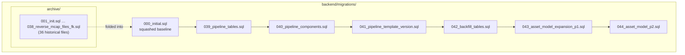
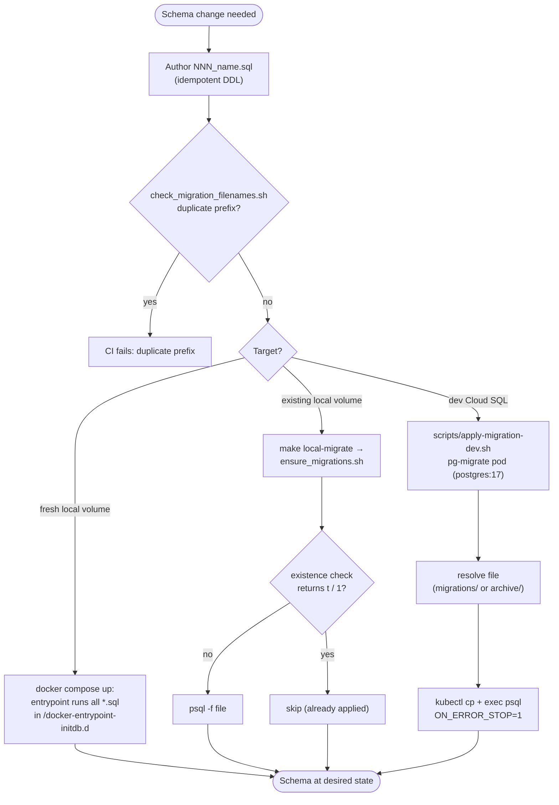
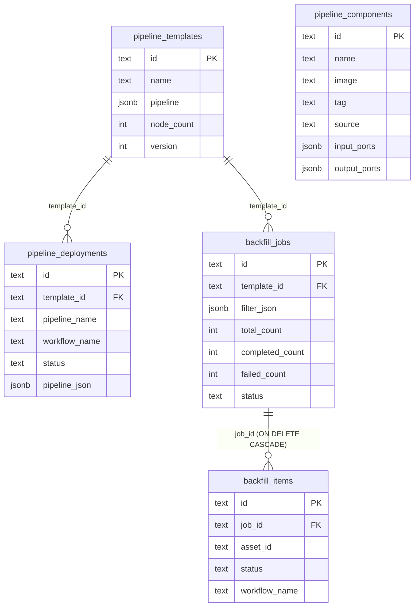
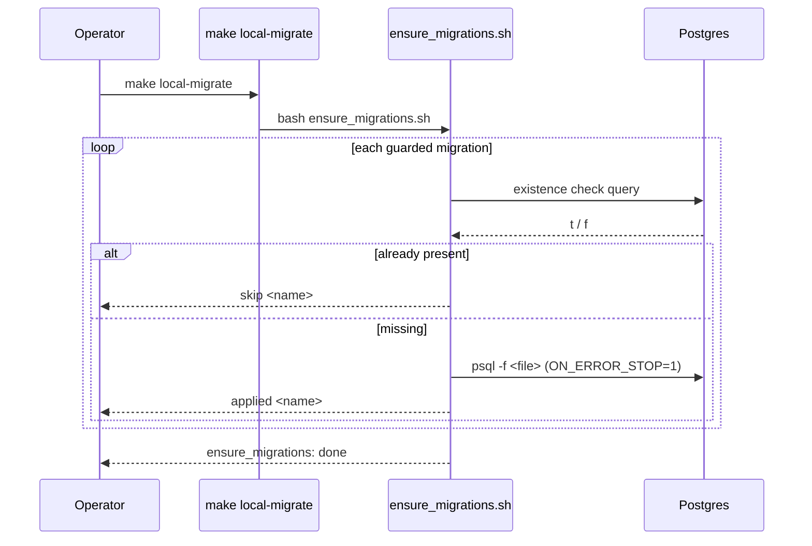
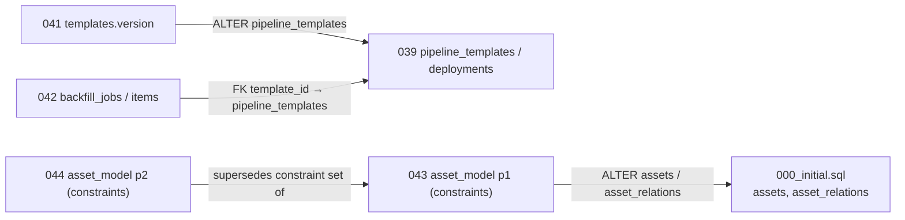

# Migrations

<cite>
**Referenced Files in This Document**
- [backend/migrations/000_initial.sql](file://backend/migrations/000_initial.sql)
- [backend/migrations/039_pipeline_tables.sql](file://backend/migrations/039_pipeline_tables.sql)
- [backend/migrations/040_pipeline_components.sql](file://backend/migrations/040_pipeline_components.sql)
- [backend/migrations/041_pipeline_template_version.sql](file://backend/migrations/041_pipeline_template_version.sql)
- [backend/migrations/042_backfill_tables.sql](file://backend/migrations/042_backfill_tables.sql)
- [backend/migrations/043_asset_model_expansion_p1.sql](file://backend/migrations/043_asset_model_expansion_p1.sql)
- [backend/migrations/044_asset_model_p2.sql](file://backend/migrations/044_asset_model_p2.sql)
- [backend/scripts/ensure_migrations.sh](file://backend/scripts/ensure_migrations.sh)
- [scripts/apply-migration-dev.sh](file://scripts/apply-migration-dev.sh)
- [scripts/check_migration_filenames.sh](file://scripts/check_migration_filenames.sh)
- [backend/Makefile](file://backend/Makefile)
- [Makefile](file://Makefile)
- [deploy/local/docker-compose.yml](file://deploy/local/docker-compose.yml)
</cite>

## Table of Contents
1. [Introduction](#introduction)
2. [Project Structure](#project-structure)
3. [Core Components](#core-components)
4. [Architecture Overview](#architecture-overview)
5. [Detailed Component Analysis](#detailed-component-analysis)
6. [Dependency Analysis](#dependency-analysis)
7. [Performance Considerations](#performance-considerations)
8. [Troubleshooting Guide](#troubleshooting-guide)
9. [Conclusion](#conclusion)
10. [Appendices](#appendices)

## Introduction

The cyber-databrew backend manages its PostgreSQL schema through a directory of
plain `.sql` files in `backend/migrations/`. There is **no migration framework**
(no Goose, Flyway, or `golang-migrate`) and **no schema-version table**. Instead,
the project follows a deliberately simple, file-based convention:

- A single **squashed baseline**, `000_initial.sql`, holds the full current
  schema and is the source of truth for fresh deployments.
- A short, monotonically numbered series of **forward migrations**
  (`039`–`044`) carries incremental schema changes added *after* the baseline
  was last re-squashed.
- An **`archive/` directory** preserves the historical migrations (`001`–`038`)
  that were folded into `000_initial.sql`, kept for provenance and for the
  idempotent re-apply helpers that still reference a few of them by number.

Every migration is written to be **idempotent** — tables use
`CREATE TABLE IF NOT EXISTS`, indexes use `CREATE INDEX IF NOT EXISTS`, and
constraint changes use `DROP CONSTRAINT IF EXISTS` followed by `ADD CONSTRAINT`.
This makes the same file safe to run whether the target database is brand-new or
already partially migrated, which is the foundation of the apply strategy
described below.

This page is the reference for *how schema changes are authored, ordered, and
applied* in cyber-databrew. It is used by backend engineers adding a new
migration, and by operators applying a migration to the local Docker stack or to
the shared dev Cloud SQL instance.

**Section sources**
- [backend/migrations/000_initial.sql](file://backend/migrations/000_initial.sql#L1-L13)
- [backend/scripts/ensure_migrations.sh](file://backend/scripts/ensure_migrations.sh#L1-L13)

## Project Structure

All schema artifacts live under `backend/migrations/`:

- **`backend/migrations/000_initial.sql`** — the squashed baseline. Its header
  records that it was "squashed from 36 incremental migrations" and that it is
  the "single source of truth for fresh deployments", executed automatically on
  first `docker-compose up` via the `/docker-entrypoint-initdb.d` mount. It
  begins by creating the `pgcrypto` extension and several reusable SQL/PLpgSQL
  functions (`asset_algo_statuses`, `event_retention_cleanup`, `set_updated_at`,
  `trg_logical_assets_type_immutable`) before defining tables.
- **`backend/migrations/039_*.sql` … `044_*.sql`** — six forward migrations
  added after the baseline. They are applied in lexical (numeric-prefix) order.
- **`backend/migrations/archive/`** — 36 historical files, `001_init.sql`
  through `038_reverse_mcap_files_fk.sql`. These are *not* re-run on fresh
  installs (the baseline already contains their effects); they remain available
  to the dev apply script and the idempotent ensure helper.

Supporting tooling lives in two `scripts/` locations:

- **`backend/scripts/ensure_migrations.sh`** — idempotent re-apply helper for an
  *existing* local Postgres data dir.
- **`scripts/apply-migration-dev.sh`** — applies one migration to the dev Cloud
  SQL database via a throwaway GKE pod.
- **`scripts/check_migration_filenames.sh`** — guards against duplicate numeric
  prefixes.

The numbered-file convention is intentionally flat: the *filename prefix is the
order*, and the database is brought to the desired state by running files in
sequence.

**Diagram sources**
- [backend/migrations/000_initial.sql](file://backend/migrations/000_initial.sql#L1-L3)
- [backend/migrations/039_pipeline_tables.sql](file://backend/migrations/039_pipeline_tables.sql#L1-L26)
- [backend/migrations/044_asset_model_p2.sql](file://backend/migrations/044_asset_model_p2.sql#L1-L37)

**Section sources**
- [backend/migrations/000_initial.sql](file://backend/migrations/000_initial.sql#L1-L13)
- [deploy/local/docker-compose.yml](file://deploy/local/docker-compose.yml#L13-L31)

## Core Components

The migration system has four moving parts.

#### The squashed baseline (`000_initial.sql`)

`000_initial.sql` is the canonical schema. It is mounted read-only into the
Postgres container at `/docker-entrypoint-initdb.d`, where the official Postgres
image executes every `*.sql` file in lexical order **only when the data volume
is empty** (first boot). The baseline opens with `CREATE EXTENSION IF NOT EXISTS
pgcrypto` and the shared functions, then defines the full set of tables. Because
all `039`–`044` files sit in the same mounted directory, on a truly fresh volume
the Postgres entrypoint runs `000` then `039`…`044` automatically in one pass.

#### Forward migrations (`039`–`044`)

These are the changes layered on top of the baseline since it was last
re-squashed. Each is small and self-describing through its filename. The numeric
prefix is the global ordering key; the suffix is a human-readable summary
(`pipeline_tables`, `backfill_tables`, `asset_model_p2`, …).

#### The archive directory

`backend/migrations/archive/` holds `001`–`038` — the lineage that produced
`000_initial.sql`. These files are retained for historical reference and are
still resolvable by the dev apply script (which searches `archive/` as a
fallback) and referenced by number inside `ensure_migrations.sh`.

#### Apply tooling

Three shell entry points govern application: the idempotent local helper
(`ensure_migrations.sh`), the dev-cluster applier (`apply-migration-dev.sh`),
and the CI filename guard (`check_migration_filenames.sh`). These are surfaced
through Make targets (`local-migrate`, `migrate-local`).

**Section sources**
- [backend/migrations/000_initial.sql](file://backend/migrations/000_initial.sql#L1-L33)
- [backend/scripts/ensure_migrations.sh](file://backend/scripts/ensure_migrations.sh#L62-L83)
- [scripts/apply-migration-dev.sh](file://scripts/apply-migration-dev.sh#L25-L48)

## Architecture Overview

There are three distinct application paths, each suited to a different target:

1. **Fresh local volume** — Docker's Postgres entrypoint runs the whole
   `backend/migrations/` directory (baseline + forward files) once, because the
   directory is bind-mounted to `/docker-entrypoint-initdb.d`.
2. **Existing local volume** — when a new migration file is added but the
   Postgres data dir already exists (so initdb will not re-run), the operator
   runs `make local-migrate`, which calls `ensure_migrations.sh` to apply only
   the missing pieces, gated by existence checks.
3. **Dev Cloud SQL** — a single migration file is shipped to the private dev
   database through a short-lived `postgres:17` pod via
   `scripts/apply-migration-dev.sh`.

**Diagram sources**
- [deploy/local/docker-compose.yml](file://deploy/local/docker-compose.yml#L29-L31)
- [backend/scripts/ensure_migrations.sh](file://backend/scripts/ensure_migrations.sh#L48-L83)
- [scripts/apply-migration-dev.sh](file://scripts/apply-migration-dev.sh#L25-L72)
- [scripts/check_migration_filenames.sh](file://scripts/check_migration_filenames.sh#L1-L18)

**Section sources**
- [Makefile](file://Makefile#L37-L40)
- [backend/Makefile](file://backend/Makefile#L45-L47)

## Detailed Component Analysis

### The forward migration catalog (039–044)

The following table enumerates every forward migration after the baseline and
what each introduces. None of these are fabricated — each row maps to a real
file in `backend/migrations/`.

| File | What it adds |
| --- | --- |
| `039_pipeline_tables.sql` | Creates `pipeline_templates` (id, name, `pipeline` JSONB, `node_count`, timestamps) and `pipeline_deployments` (id, FK `template_id` → `pipeline_templates`, `pipeline_name`, `workflow_name`, `status` default `'Pending'`, `node_count`, `manifest`, `pipeline_json` JSONB, timestamps, `finished_at`). |
| `040_pipeline_components.sql` | Creates `pipeline_components` (id, name, description, `image`, `tag` default `'latest'`, `source` default `'custom'`, `input_ports`/`output_ports` JSONB defaulting to `'[]'`, `resources`, `env_vars`, timestamps) plus indexes `idx_pipeline_components_name` and `idx_pipeline_components_source`. |
| `041_pipeline_template_version.sql` | Adds a `version INT NOT NULL DEFAULT 1` column to `pipeline_templates`, backfills sequential versions per `name` (via a `ROW_NUMBER()` CTE ordered by `created_at`), and creates the unique index `idx_pipeline_templates_name_version` on `(name, version)`. |
| `042_backfill_tables.sql` | Creates `backfill_jobs` (id, name, FK `template_id` → `pipeline_templates`, `filter_json` JSONB, `total_count`/`completed_count`/`failed_count`, `status` default `'running'`, timestamps) and `backfill_items` (id, FK `job_id` → `backfill_jobs` `ON DELETE CASCADE`, `asset_id`, `status` default `'pending'`, `workflow_name`, `error_message`, `started_at`/`finished_at`, `created_at`). Adds indexes on job status, job `created_at`, item `job_id`, and item status. |
| `043_asset_model_expansion_p1.sql` | Asset-model expansion Phase 1. Rewrites the `chk_relation_type` CHECK on `asset_relations` to add `annotated_from` and `materialized_from`, and relaxes the `chk_mcap_file_required` CHECK on `assets` so `derived_asset`, `dataset`, and `annotation_result` types may omit `mcap_file_id`. |
| `044_asset_model_p2.sql` | Asset-model expansion Phase 2. Widens `chk_relation_type` again with ML/eval relations (`trained_from`, `evaluated_on`, `validated_on`, `configured_by`, `fine_tuned_from`, `features_from`, `tested_on`, `evaluates`, `compares_to`, `calibrated_from`, `generated_by`), adds a non-null `metadata jsonb DEFAULT '{}'` column to `asset_relations`, and extends `chk_mcap_file_required` to also exempt `ml_model` and `evaluation_report` asset types. |

Notice the recurring **pattern for CHECK-constraint evolution**: each phase does
`DROP CONSTRAINT IF EXISTS chk_relation_type` then re-adds the constraint with
the full new value set. Because the constraint is dropped first, applying a later
phase over an earlier one is safe and produces the final, complete enumeration.

**Section sources**
- [backend/migrations/039_pipeline_tables.sql](file://backend/migrations/039_pipeline_tables.sql#L5-L26)
- [backend/migrations/040_pipeline_components.sql](file://backend/migrations/040_pipeline_components.sql#L1-L18)
- [backend/migrations/041_pipeline_template_version.sql](file://backend/migrations/041_pipeline_template_version.sql#L4-L18)
- [backend/migrations/042_backfill_tables.sql](file://backend/migrations/042_backfill_tables.sql#L4-L35)
- [backend/migrations/043_asset_model_expansion_p1.sql](file://backend/migrations/043_asset_model_expansion_p1.sql#L3-L22)
- [backend/migrations/044_asset_model_p2.sql](file://backend/migrations/044_asset_model_p2.sql#L3-L37)

### Pipeline relational schema introduced by 039–042

Migrations `039`–`042` together establish the pipeline-and-backfill subsystem.
The entity relationships are:

The `version` column on `pipeline_templates` originates in `041`, not `039`,
which is why it is shown as part of the template entity above even though the
base table was created earlier. `pipeline_components` (`040`) has no foreign key
to the other tables; templates reference component images by value, not by FK.

**Diagram sources**
- [backend/migrations/039_pipeline_tables.sql](file://backend/migrations/039_pipeline_tables.sql#L5-L26)
- [backend/migrations/040_pipeline_components.sql](file://backend/migrations/040_pipeline_components.sql#L1-L18)
- [backend/migrations/041_pipeline_template_version.sql](file://backend/migrations/041_pipeline_template_version.sql#L4-L4)
- [backend/migrations/042_backfill_tables.sql](file://backend/migrations/042_backfill_tables.sql#L4-L35)

**Section sources**
- [backend/migrations/039_pipeline_tables.sql](file://backend/migrations/039_pipeline_tables.sql#L1-L26)
- [backend/migrations/042_backfill_tables.sql](file://backend/migrations/042_backfill_tables.sql#L1-L35)

### Fresh-install application via Docker initdb

In the local Compose stack, the Postgres service mounts the migrations directory
into the image's init hook:

- The service is `postgres` using image `postgres:16-alpine`.
- The data volume is `pgdata:/var/lib/postgresql/data`.
- `../../backend/migrations` is bind-mounted to `/docker-entrypoint-initdb.d`.

The Postgres entrypoint runs every `*.sql` it finds there, in lexical order,
**only on first boot** (empty `pgdata`). Therefore a clean `make all-up` after
`make all-reset-volumes` executes `000_initial.sql` followed by `039`…`044` in
one initialization pass and produces the complete schema with no extra commands.

**Section sources**
- [deploy/local/docker-compose.yml](file://deploy/local/docker-compose.yml#L13-L31)
- [Makefile](file://Makefile#L29-L35)

### Re-applying onto an existing local volume (`ensure_migrations.sh`)

Because initdb runs only on an empty volume, adding a new migration file to an
*already-initialized* local database requires a manual top-up. `make
local-migrate` invokes `backend/scripts/ensure_migrations.sh`, which:

- Detects whether the `local-postgres-1` Docker container is running and chooses
  between `docker exec` and a host `psql` connection accordingly.
- Defines `apply_if_missing <check_sql> <file>`: it runs the existence check
  query, **skips** the file if the check returns `t` or `1`, otherwise applies
  the file with `psql -f` under `ON_ERROR_STOP=1`.
- Applies a hard-coded set of historically-tricky migrations guarded by
  `information_schema.tables` existence probes: `014_add_eval_metrics.sql`
  (probe `asset_metrics`), `016_add_actions.sql` (probe `actions`),
  `018_add_saved_queries.sql` (probe `saved_queries`), and `031_algo_runs.sql`
  (probe `algo_runs`).

This helper is **not** a generic migration runner — it only knows about the
specific files explicitly listed in the script. New forward migrations are not
auto-discovered here; the primary path for picking up new schema is a fresh
volume (initdb) or a targeted manual apply.

**Diagram sources**
- [backend/scripts/ensure_migrations.sh](file://backend/scripts/ensure_migrations.sh#L48-L83)

**Section sources**
- [backend/scripts/ensure_migrations.sh](file://backend/scripts/ensure_migrations.sh#L14-L83)
- [Makefile](file://Makefile#L37-L40)

### Applying a single migration to dev Cloud SQL (`apply-migration-dev.sh`)

The dev PostgreSQL instance is a private Cloud SQL database reachable only from
inside the GKE cluster. `scripts/apply-migration-dev.sh` bridges to it by
running a throwaway pod:

- It accepts either a path, a bare `NNN_name.sql` resolved against
  `backend/migrations/`, or a fallback against `backend/migrations/archive/`.
  Any path outside `backend/migrations/` is refused.
- It derives an RFC 1123-safe pod name by lowercasing and replacing underscores
  with hyphens, prefixed `pg-migrate`.
- It launches a `postgres:17` pod that sleeps, injecting `PGHOST`, `PGPORT`,
  `PGUSER`, `PGDATABASE` from env defaults and `PGPASSWORD` from the
  `cyber-databrew-secrets` secret's `DB_PASSWORD` key.
- After the pod is `Ready`, it `kubectl cp`s the SQL file in and runs
  `psql -v ON_ERROR_STOP=1 -f` against it; a trap deletes the pod on exit.

Defaults: namespace `cyber-databrew-dev`, database `cyber_databrew_dev`, host
`172.27.160.7`, port `5432`, user `postgres` — all overridable via env vars.

**Section sources**
- [scripts/apply-migration-dev.sh](file://scripts/apply-migration-dev.sh#L1-L72)

### Filename safety guard

`scripts/check_migration_filenames.sh` enforces the one-file-per-prefix
invariant on which the lexical ordering depends. It walks `backend/migrations/*.sql`,
extracts each numeric prefix (`${base%%_*}`), counts files sharing that prefix,
and exits non-zero if any prefix appears more than once. This prevents two files
such as `018_a.sql` and `018_b.sql` from creating an ambiguous order.

**Section sources**
- [scripts/check_migration_filenames.sh](file://scripts/check_migration_filenames.sh#L1-L18)

## Dependency Analysis

The migration files express explicit dependencies through foreign keys and
through the implicit "this column/constraint must already exist" relationship:

Key edges:

- `041` and `042` both depend on `039` having created `pipeline_templates`
  (one alters it, one references it via FK).
- `043` and `044` depend on `000_initial.sql` having created `assets` and
  `asset_relations` with the original `chk_relation_type` / `chk_mcap_file_required`
  constraints; `044`'s constraint set is a strict superset of `043`'s.

The runtime application tooling depends on `psql` plus, for the dev path,
`kubectl` and the cluster secret. The local helper additionally depends on the
Docker container name `local-postgres-1` for its in-container code path.

**Section sources**
- [backend/migrations/041_pipeline_template_version.sql](file://backend/migrations/041_pipeline_template_version.sql#L4-L18)
- [backend/migrations/042_backfill_tables.sql](file://backend/migrations/042_backfill_tables.sql#L7-L7)
- [backend/migrations/043_asset_model_expansion_p1.sql](file://backend/migrations/043_asset_model_expansion_p1.sql#L3-L22)
- [backend/migrations/044_asset_model_p2.sql](file://backend/migrations/044_asset_model_p2.sql#L3-L37)

## Performance Considerations

- **Idempotency is cheap on re-run.** `CREATE TABLE/INDEX IF NOT EXISTS` and the
  `DROP CONSTRAINT IF EXISTS` / `ADD CONSTRAINT` pattern mean a re-applied file
  does little besides re-validate already-present objects. Re-validating a CHECK
  constraint (as in `043`/`044`) does scan the table, so on a large `assets` or
  `asset_relations` table the constraint phases are the most expensive part.
- **Backfill UPDATE in 041.** Migration `041` runs a `ROW_NUMBER()`-windowed
  `UPDATE` across all `pipeline_templates` rows to assign versions. This is a
  full rewrite of the table; it is bounded by template count, which is expected
  to be small.
- **Indexes are created with the tables.** `040` and `042` create their
  supporting indexes in the same file as the table, so queries on
  `pipeline_components(name|source)`, `backfill_jobs(status|created_at)`, and
  `backfill_items(job_id|status)` are covered from the moment the table exists.
- **`ON_ERROR_STOP=1` everywhere.** Both apply paths run psql with
  `ON_ERROR_STOP=1`, so a partial failure aborts immediately rather than leaving
  later statements to run against an inconsistent state.
- **No transaction wrapper across files.** Each file is applied independently;
  there is no all-or-nothing wrapping of the `039`…`044` sequence. Ordering and
  idempotency, not transactions, provide safety.

**Section sources**
- [backend/migrations/041_pipeline_template_version.sql](file://backend/migrations/041_pipeline_template_version.sql#L6-L18)
- [scripts/apply-migration-dev.sh](file://scripts/apply-migration-dev.sh#L70-L70)
- [backend/scripts/ensure_migrations.sh](file://backend/scripts/ensure_migrations.sh#L58-L60)

## Troubleshooting Guide

#### "My new migration didn't apply locally"

The Docker entrypoint runs `/docker-entrypoint-initdb.d` **only on an empty data
volume**. If `pgdata` already exists, adding a file to `backend/migrations/` has
no effect on next `up`. Either run `make all-reset-volumes` then `make all-up`
(destroys data) for a clean re-init, or apply the file manually. Note that
`make local-migrate` / `ensure_migrations.sh` only handles the specific files it
hard-codes (`014`, `016`, `018`, `031`); it will **not** pick up `039`–`044`
automatically.

#### "Duplicate migration prefix" in CI

`check_migration_filenames.sh` found two files sharing a numeric prefix. Rename
one so prefixes are unique and monotonic.

#### "refusing path outside backend/migrations/"

`apply-migration-dev.sh` only applies files resolved under
`backend/migrations/` (including `archive/`). Pass a real migration name or
repo-relative path, not an arbitrary file.

#### "migration not found"

The dev script resolves the argument against the literal path, then
`backend/migrations/<arg>`, then `backend/migrations/archive/<arg>`. If none
match it exits. Check the spelling and `.sql` suffix.

#### CHECK constraint violation when applying 043/044

These phases re-add `chk_mcap_file_required` / `chk_relation_type`. If existing
rows violate the new constraint (e.g. a relation with a `relation_type` not in
the enumerated set), `ADD CONSTRAINT` fails. Inspect offending rows before
re-running; the file aborts cleanly under `ON_ERROR_STOP=1`.

#### `make migrate-local` (backend Makefile) does nothing useful

The `backend/Makefile` `migrate-local` target shells out to
`scripts/apply_pg_deltas.sh`, which is **not present in the repository**. Use the
root `make local-migrate` (→ `ensure_migrations.sh`) or
`scripts/apply-migration-dev.sh` instead.

**Section sources**
- [scripts/apply-migration-dev.sh](file://scripts/apply-migration-dev.sh#L25-L43)
- [scripts/check_migration_filenames.sh](file://scripts/check_migration_filenames.sh#L9-L17)
- [backend/Makefile](file://backend/Makefile#L45-L47)
- [backend/scripts/ensure_migrations.sh](file://backend/scripts/ensure_migrations.sh#L62-L82)

## Conclusion

cyber-databrew uses a deliberately framework-free migration model: a squashed
`000_initial.sql` baseline, a short series of idempotent numbered forward files
(`039`–`044`), and an `archive/` of the 36 historical migrations they replaced.
Fresh databases are built entirely by Docker's initdb hook running the mounted
directory in order; existing databases are topped up by the targeted
`ensure_migrations.sh` helper; and the shared dev Cloud SQL instance receives
one file at a time through a throwaway GKE pod. Idempotent DDL and a unique-prefix
filename guard, rather than a version table, keep the sequence safe and
repeatable.

## Appendices

### Appendix A — Make targets for migrations

| Command | Script | Purpose |
| --- | --- | --- |
| `make local-migrate` (root) | `backend/scripts/ensure_migrations.sh` | Apply guarded missing migrations to an existing local Postgres. |
| `make all-reset-volumes` + `make all-up` (root) | docker compose | Wipe `pgdata` and re-run full initdb (baseline + forward files). |
| `make migrate-local` (backend) | `scripts/apply_pg_deltas.sh` *(file absent)* | Legacy delta-replay target; superseded. |
| `bash scripts/apply-migration-dev.sh <file>` | — | Apply one file to dev Cloud SQL via `pg-migrate` pod. |
| `bash scripts/check_migration_filenames.sh` | — | CI guard against duplicate numeric prefixes. |

**Section sources**
- [Makefile](file://Makefile#L37-L40)
- [backend/Makefile](file://backend/Makefile#L45-L47)

### Appendix B — Forward migration line ranges

| File | Lines |
| --- | --- |
| `039_pipeline_tables.sql` | L1–L26 |
| `040_pipeline_components.sql` | L1–L17 |
| `041_pipeline_template_version.sql` | L1–L18 |
| `042_backfill_tables.sql` | L1–L34 |
| `043_asset_model_expansion_p1.sql` | L1–L22 |
| `044_asset_model_p2.sql` | L1–L37 |

### Appendix C — `asset_relations.relation_type` enumeration (after 044)

`split_from`, `derived_from`, `contains`, `sampled_from`, `merged_from`,
`revision_of`, `annotated_from`, `materialized_from`, `trained_from`,
`evaluated_on`, `validated_on`, `configured_by`, `fine_tuned_from`,
`features_from`, `tested_on`, `evaluates`, `compares_to`, `calibrated_from`,
`generated_by`.

**Section sources**
- [backend/migrations/044_asset_model_p2.sql](file://backend/migrations/044_asset_model_p2.sql#L5-L27)
