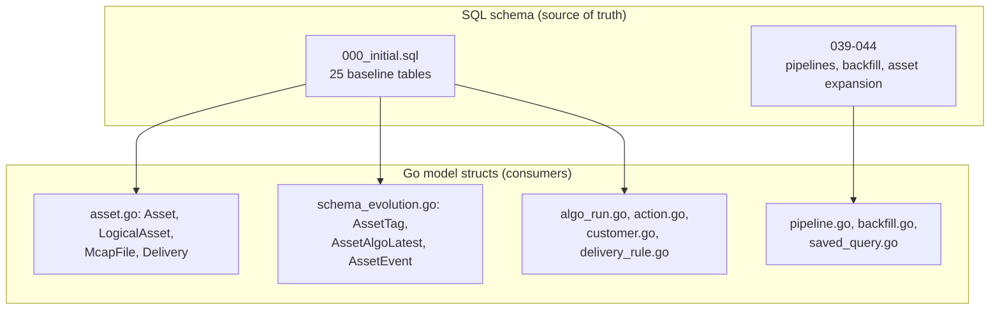
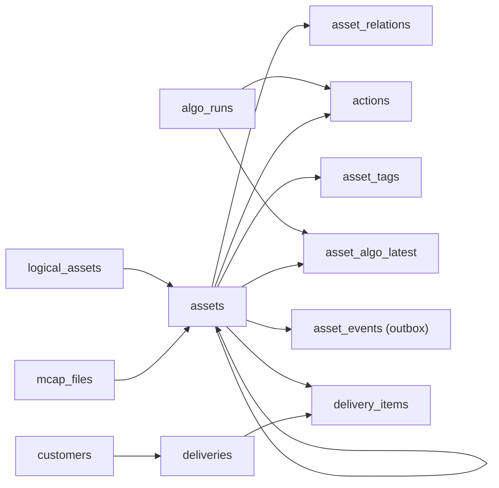

# Data Model Design

<cite>
**Referenced Files in This Document**

- [backend/migrations/000_initial.sql](file://backend/migrations/000_initial.sql)
- [backend/migrations/039_pipeline_tables.sql](file://backend/migrations/039_pipeline_tables.sql)
- [backend/migrations/040_pipeline_components.sql](file://backend/migrations/040_pipeline_components.sql)
- [backend/migrations/041_pipeline_template_version.sql](file://backend/migrations/041_pipeline_template_version.sql)
- [backend/migrations/042_backfill_tables.sql](file://backend/migrations/042_backfill_tables.sql)
- [backend/migrations/043_asset_model_expansion_p1.sql](file://backend/migrations/043_asset_model_expansion_p1.sql)
- [backend/migrations/044_asset_model_p2.sql](file://backend/migrations/044_asset_model_p2.sql)
- [backend/internal/models/asset.go](file://backend/internal/models/asset.go)
- [backend/internal/models/schema_evolution.go](file://backend/internal/models/schema_evolution.go)
- [backend/internal/models/algo_run.go](file://backend/internal/models/algo_run.go)
- [backend/internal/models/action.go](file://backend/internal/models/action.go)
</cite>

## Table of Contents
1. [Introduction](#introduction)
2. [Project Structure](#project-structure)
3. [Core Components](#core-components)
4. [Architecture Overview](#architecture-overview)
5. [Detailed Component Analysis](#detailed-component-analysis)
6. [Dependency Analysis](#dependency-analysis)
7. [Performance Considerations](#performance-considerations)
8. [Troubleshooting Guide](#troubleshooting-guide)
9. [Conclusion](#conclusion)
10. [Appendices](#appendices)

## Introduction

This page is the index for the **Data Model Design** sub-group: a DDL-first
survey of every domain entity in the cyber-databrew schema, organised by domain.
It enumerates the core tables, their key columns and data types, the enum-style
`CHECK` constraints, the generated columns and partitions, and the relationships
between entities — all grounded in `backend/migrations/*.sql`. Each domain then
has its own deep page (linked below) for table-by-table detail.

The schema is a **PostgreSQL-first** design. The 25 baseline tables created by
`000_initial.sql` cover assets, MCAP files, actions, algorithm runs and their
result projections, deliveries, customers, search, the event outbox, and
operational checkpoints; migrations `039`–`044` add the pipeline, backfill, and
asset-model-expansion tables and columns. Go structs in `internal/models` map
onto these tables one-to-one (or one-to-cluster); they are the consumers of the
schema, never its definition.

**Section sources**
- [backend/migrations/000_initial.sql](file://backend/migrations/000_initial.sql#L50-L584)
- [backend/internal/models/asset.go](file://backend/internal/models/asset.go#L41-L118)

## Project Structure

The model design is expressed in two layers that this sub-group documents
together:

- **SQL tables** — `backend/migrations/000_initial.sql` (baseline, 25 tables) plus
  the delta migrations. This is the authoritative shape: column types, defaults,
  constraints, generated columns, and partitioning.
- **Go structs** — `backend/internal/models/*.go`, one cluster per domain, with
  `json` tags for the API contract and pure helpers (validation, lifecycle maps,
  derivations) that mirror the DB constraints in application code.

**Diagram sources**
- [backend/migrations/000_initial.sql](file://backend/migrations/000_initial.sql#L50-L584)
- [backend/internal/models/asset.go](file://backend/internal/models/asset.go#L41-L118)
- [backend/internal/models/schema_evolution.go](file://backend/internal/models/schema_evolution.go#L8-L74)

**Section sources**
- [backend/migrations/000_initial.sql](file://backend/migrations/000_initial.sql#L1-L48)
- [backend/internal/models/asset.go](file://backend/internal/models/asset.go#L41-L118)

## Core Components

The schema groups into the following domains, each with a dedicated page:

| Domain | Primary tables | Page |
| --- | --- | --- |
| Assets & versioning | `assets`, `logical_assets`, `asset_relations`, `asset_tags`, `asset_usage_stats` | [Asset model](asset-model.md) |
| Ingest source | `mcap_files` (+ segment locators) | [MCAP & segment model](mcap-model.md) |
| Annotations | `actions` | [Action model](action-model.md) |
| Algorithm lifecycle | `algo_runs`, `asset_algo_latest`, `asset_eval_results`, `asset_metrics` | [Algorithm run model](algo-run-model.md) |
| Delivery | `customers`, `deliveries`, `delivery_items`, `delivery_rules` | [Delivery model](delivery-model.md) |
| Pipelines | `pipeline_templates`, `pipeline_deployments`, `pipeline_components` | [Pipeline model](pipeline-model.md) |
| Backfill & checkpoints | `backfill_jobs`, `backfill_items`, `es_sync_checkpoint`, `lakehouse_bronze_checkpoint`, `sync_watermarks` | [Backfill & checkpoint models](backfill-checkpoint-model.md) |
| Search & saved state | `saved_queries`, `search_reindex_jobs` | [Saved query & customer models](saved-query-customer-model.md) |
| Operational | `asset_events` (outbox), `outbox_dlq`, `audit_events`, `idempotency_keys` | see Asset / Backfill pages |

**Section sources**
- [backend/migrations/000_initial.sql](file://backend/migrations/000_initial.sql#L50-L584)

## Architecture Overview

The business hierarchy `mcap_file → segment asset → action` is the spine. An
`mcap_files` row is the ingested recording; segment-type `assets` reference it via
`mcap_file_id`; `actions` are time-bounded annotations inside a segment asset.
Around the spine sit the version coordinator (`logical_assets`), the typed lineage
edge table (`asset_relations`), the per-asset projections (`asset_tags`,
`asset_algo_latest`, `asset_metrics`, `asset_eval_results`, `asset_usage_stats`),
the event outbox (`asset_events`), and the delivery side
(`customers`/`deliveries`/`delivery_items`/`delivery_rules`).

**Diagram sources**
- [backend/migrations/000_initial.sql](file://backend/migrations/000_initial.sql#L851-L911)

**Section sources**
- [backend/migrations/000_initial.sql](file://backend/migrations/000_initial.sql#L310-L357)
- [backend/migrations/000_initial.sql](file://backend/migrations/000_initial.sql#L851-L911)

## Detailed Component Analysis

### Identity conventions and shared columns

Every public entity uses an 8-character alphanumeric ID enforced by a CHECK
regex. `assets.asset_id`, `logical_assets.logical_asset_id`, and
`mcap_files.mcap_file_id` all carry `CHECK (~ '^[0-9A-Za-z]{8}$')`;
`algo_runs.run_id` is a 16-char ID; UUID PKs are used for `deliveries`,
`delivery_rules`, `saved_queries`, and `asset_events`. Mutable core entities carry
`version bigint DEFAULT 1` for optimistic concurrency, `is_deleted` for soft
delete, and `created_at`/`updated_at` maintained by the `set_updated_at()`
trigger.

**Section sources**
- [backend/migrations/000_initial.sql](file://backend/migrations/000_initial.sql#L352-L354)
- [backend/migrations/000_initial.sql](file://backend/migrations/000_initial.sql#L462-L466)
- [backend/migrations/000_initial.sql](file://backend/migrations/000_initial.sql#L26-L33)

### Enum-style CHECK constraints

The schema models enums as `CHECK (col = ANY (ARRAY[...]))` rather than native
PG enum types, so values can be extended by migration without a type alter. The
canonical sets:

| Column | Allowed values | Defined at |
| --- | --- | --- |
| `assets.lifecycle_state` | created, processing, ready, delivered, archived, superseded, failed, rejected | `000_initial.sql:356` |
| `algo_runs.status` | pending, running, ok, failed, cancelled | `000_initial.sql:117` |
| `algo_runs.algo_kind` | processing, split, qa, enrichment | `000_initial.sql:115` |
| `asset_relations.relation_type` | split_from, derived_from, contains, sampled_from, merged_from, revision_of, annotated_from, materialized_from | `000_initial.sql:257` |
| `delivery_rules.enforce_mode` | block, warn, tag_only | `000_initial.sql:434` |
| `logical_assets.status` | active, archived | (per `logical_assets_status_check`) |

The Go side mirrors these with constant sets and validator helpers
(`validLifecycleStates`, `ValidAlgoTransitions`, `IsValidActionSourceType`) so the
application rejects bad values before they reach the DB.

**Section sources**
- [backend/migrations/000_initial.sql](file://backend/migrations/000_initial.sql#L115-L117)
- [backend/migrations/000_initial.sql](file://backend/migrations/000_initial.sql#L257-L257)
- [backend/migrations/000_initial.sql](file://backend/migrations/000_initial.sql#L356-L356)
- [backend/internal/models/asset.go](file://backend/internal/models/asset.go#L8-L39)

### Generated columns and partitioning

Two generated columns and one partitioned table are worth calling out, since they
constrain how the application reads and writes:

- `algo_runs.duration_ns bigint GENERATED ALWAYS AS (...)` — derived from the
  start/finish timestamps; never written directly.
- `asset_tags.source_version_norm text GENERATED ALWAYS AS (COALESCE(source_version, ''))
  STORED` — a normalised key used by the tag uniqueness/index strategy.
- `asset_events ... PARTITION BY RANGE (occurred_at)` — the event outbox is range
  partitioned, with `asset_events_default` as the catch-all partition; the PK is
  the composite `(event_seq, occurred_at)`.

**Section sources**
- [backend/migrations/000_initial.sql](file://backend/migrations/000_initial.sql#L86-L86)
- [backend/migrations/000_initial.sql](file://backend/migrations/000_initial.sql#L278-L278)
- [backend/migrations/000_initial.sql](file://backend/migrations/000_initial.sql#L164-L222)

### Relationship modelling

Relationships are expressed with foreign keys (defined together at the end of the
baseline migration) and one general-purpose edge table:

- **Self-reference** — `assets.parent_asset_id` / `root_asset_id` model split and
  derivation lineage in-row.
- **Typed edges** — `asset_relations(parent_asset_id, child_asset_id, relation_type)`
  is the composite-PK edge table for the eight lineage relation types, extended
  with a `metadata` column in migration `044`.
- **Deferrable FKs** — `assets.logical_asset_id → logical_assets` and
  `mcap_files.mcap_file_id → assets.asset_id` are `DEFERRABLE INITIALLY DEFERRED`,
  tolerating in-transaction insert order. The latter is the 1:1 MCAP↔`raw_mcap`
  asset pairing.
- **`ON DELETE SET NULL`** — `run_id` references to `algo_runs` from `actions`,
  `asset_algo_latest`, and `asset_tags` null out rather than cascade.
- **`ON DELETE CASCADE`** — `backfill_items.job_id → backfill_jobs` cascades.

**Section sources**
- [backend/migrations/000_initial.sql](file://backend/migrations/000_initial.sql#L246-L258)
- [backend/migrations/000_initial.sql](file://backend/migrations/000_initial.sql#L851-L911)
- [backend/migrations/042_backfill_tables.sql](file://backend/migrations/042_backfill_tables.sql#L21-L33)

### JSONB usage principles

Open-ended attributes are stored as `jsonb` (`assets.metadata`,
`delivery_rules.query_dsl`, `pipeline_templates.pipeline`,
`pipeline_components.input_ports`/`output_ports`/`resources`/`env_vars`,
`saved_queries.query_ir_json`), while anything queried, filtered, or constrained
is given a typed column and (where hot) a dedicated index. Per-`asset_type`
`metadata` is validated in Go against the `SchemaRegistry` for `dataset`,
`annotation_result`, `ml_model`, and `evaluation_report`.

**Section sources**
- [backend/migrations/000_initial.sql](file://backend/migrations/000_initial.sql#L310-L357)
- [backend/internal/models/asset_type_schema.go](file://backend/internal/models/asset_type_schema.go#L11-L63)

## Dependency Analysis

The per-domain pages are ordered from the spine outward: read [Asset model](asset-model.md)
and [MCAP & segment model](mcap-model.md) first (the core entities), then
[Action model](action-model.md) and [Algorithm run model](algo-run-model.md) (the
processing results that attach to assets), then the [Delivery model](delivery-model.md)
and [Pipeline model](pipeline-model.md) (downstream consumers), and finally the
[Backfill & checkpoint models](backfill-checkpoint-model.md) and
[Saved query & customer models](saved-query-customer-model.md). Cross-cutting
concerns are documented separately in [Data Integrity & Constraints](integrity-and-constraints.md),
[Performance & Indexing](performance-and-indexing.md), and
[Migration Management](migrations.md).

**Section sources**
- [backend/migrations/000_initial.sql](file://backend/migrations/000_initial.sql#L851-L911)

## Performance Considerations

The indexing strategy is described in full on [Performance & Indexing](performance-and-indexing.md).
Per the model design, the relevant principles are: hot read paths on `assets`
(creation time, `mcap_file_id`, logical identity, segment locator) each have a
dedicated index; `asset_tags` lookups use typed partial indexes per value kind;
the `asset_events` outbox has a partial index for the publish-pending scan; and
the per-algorithm projection `asset_algo_latest` exists precisely to avoid
contention on `assets.version` when many algo runs finish concurrently.

**Section sources**
- [backend/migrations/000_initial.sql](file://backend/migrations/000_initial.sql#L722-L772)
- [backend/internal/models/schema_evolution.go](file://backend/internal/models/schema_evolution.go#L29-L53)

## Troubleshooting Guide

- **CHECK violation on insert** — the value isn't in the enum array; consult the
  table above and validate with the Go helper before writing.
- **FK ordering errors** — for `assets`/`logical_assets` and `mcap_files`/`assets`
  the FKs are deferrable, so order within a transaction is fine; the references
  must still resolve by commit.
- **Cannot write `duration_ns` / `source_version_norm`** — these are
  `GENERATED ALWAYS` columns; remove them from the insert/update column list.
- **Events not landing in a time partition** — only `asset_events_default` exists
  in the baseline; rows fall into the default partition unless a
  partition-management step has created range partitions.

**Section sources**
- [backend/migrations/000_initial.sql](file://backend/migrations/000_initial.sql#L352-L357)
- [backend/migrations/000_initial.sql](file://backend/migrations/000_initial.sql#L86-L86)
- [backend/migrations/000_initial.sql](file://backend/migrations/000_initial.sql#L164-L222)

## Conclusion

The data model design is captured in SQL DDL: enum-style CHECKs for extensible
state machines, generated columns for derived values, a partitioned outbox,
deferrable FKs for tolerant insert order, JSONB for open-ended attributes, and a
small set of conventions (8-char IDs, soft delete, optimistic `version`,
tenant/project scoping) applied consistently. Use the per-domain pages below for
the full column-by-column treatment of each entity.

## Appendices

### Per-domain pages

- [Asset model](asset-model.md)
- [MCAP & segment model](mcap-model.md)
- [Action model](action-model.md)
- [Algorithm run model](algo-run-model.md)
- [Delivery model](delivery-model.md)
- [Pipeline model](pipeline-model.md)
- [Backfill & checkpoint models](backfill-checkpoint-model.md)
- [Saved query & customer models](saved-query-customer-model.md)

### Baseline table set (`000_initial.sql`)

`actions`, `algo_runs`, `asset_algo_latest`, `asset_eval_results`,
`asset_events` (+ `asset_events_default`), `asset_metrics`, `asset_relations`,
`asset_tags`, `asset_usage_stats`, `assets`, `audit_events`, `customers`,
`deliveries`, `delivery_items`, `delivery_rules`, `es_sync_checkpoint`,
`idempotency_keys`, `lakehouse_bronze_checkpoint`, `logical_assets`, `mcap_files`,
`outbox_dlq`, `saved_queries`, `search_reindex_jobs`, `sync_watermarks`.

**Section sources**
- [backend/migrations/000_initial.sql](file://backend/migrations/000_initial.sql#L50-L584)
