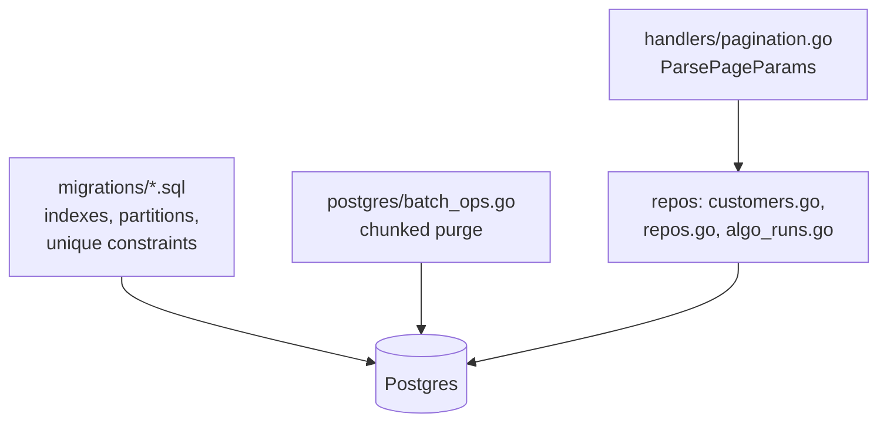
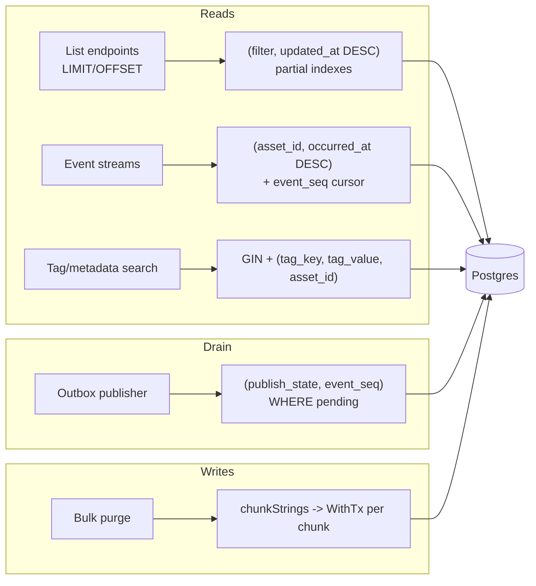
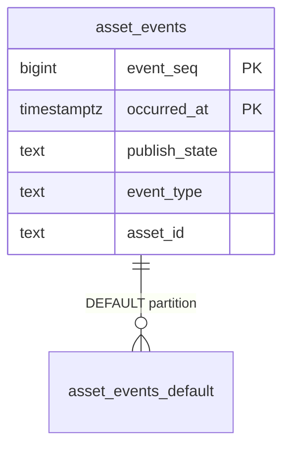
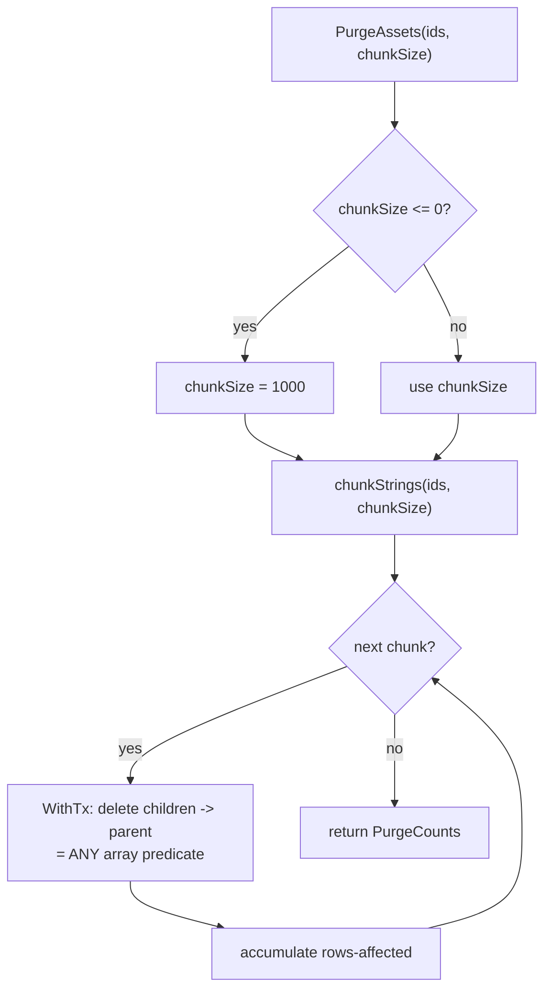
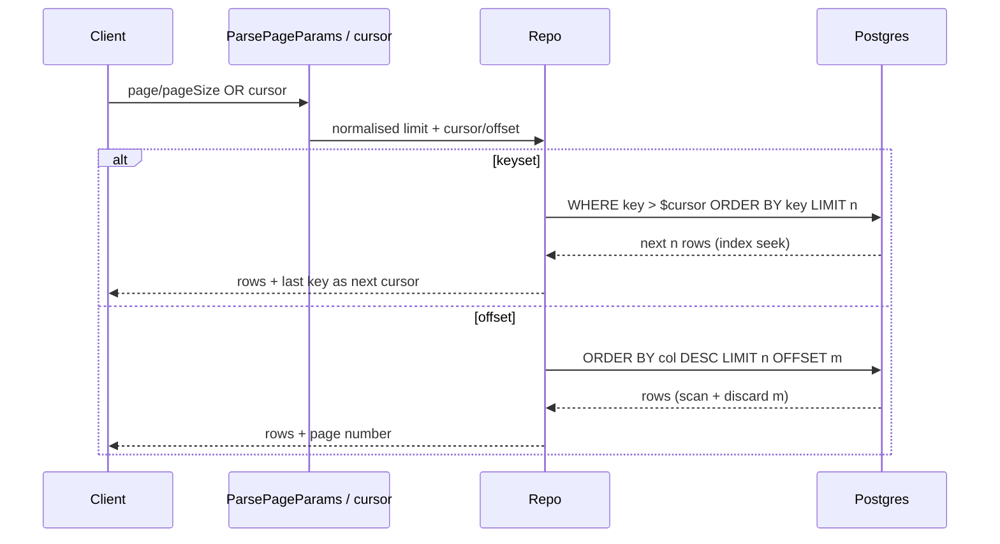
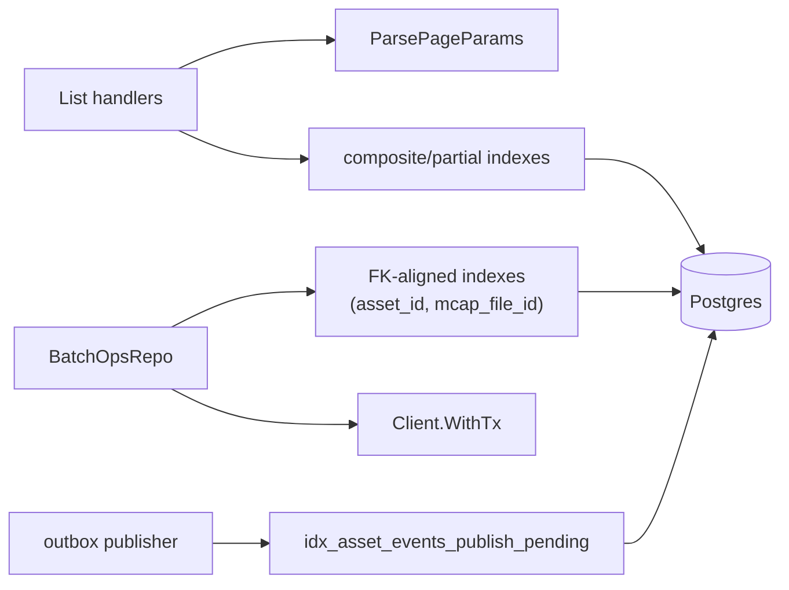

# Performance & Indexing

<cite>
**Referenced Files in This Document**
- [backend/migrations/000_initial.sql](file://backend/migrations/000_initial.sql)
- [backend/migrations/040_pipeline_components.sql](file://backend/migrations/040_pipeline_components.sql)
- [backend/migrations/041_pipeline_template_version.sql](file://backend/migrations/041_pipeline_template_version.sql)
- [backend/migrations/042_backfill_tables.sql](file://backend/migrations/042_backfill_tables.sql)
- [backend/internal/postgres/batch_ops.go](file://backend/internal/postgres/batch_ops.go)
- [backend/internal/handlers/pagination.go](file://backend/internal/handlers/pagination.go)
- [backend/internal/postgres/customers.go](file://backend/internal/postgres/customers.go)
- [backend/internal/postgres/repos.go](file://backend/internal/postgres/repos.go)
- [backend/internal/postgres/algo_runs.go](file://backend/internal/postgres/algo_runs.go)
</cite>

## Table of Contents
1. [Introduction](#introduction)
2. [Project Structure](#project-structure)
3. [Core Components](#core-components)
4. [Architecture Overview](#architecture-overview)
5. [Detailed Component Analysis](#detailed-component-analysis)
6. [Dependency Analysis](#dependency-analysis)
7. [Performance Considerations](#performance-considerations)
8. [Troubleshooting Guide](#troubleshooting-guide)
9. [Conclusion](#conclusion)
10. [Appendices](#appendices)

## Introduction

This page documents the performance posture of the `cyber-databrew` Postgres
data layer: the indexes defined across the migration set, the table-partition
strategy for the high-volume `asset_events` outbox, the batch/bulk deletion
machinery in `BatchOpsRepo`, and the two pagination strategies the read path
uses (offset paging for admin list endpoints and keyset/cursor paging for the
high-traffic streams). Every index named here is taken verbatim from a real
`CREATE INDEX` statement; nothing is inferred.

The audience is anyone tuning a slow query, adding a new list endpoint, sizing a
bulk purge, or reasoning about why a particular `WHERE`/`ORDER BY` shape is fast.
The two governing ideas are: (1) almost every hot index is a **partial index**
gated on `is_deleted = FALSE` or a state predicate, so the index only carries
live, relevant rows; and (2) write-heavy and delete-heavy paths are **chunked**
so they never hold a single long transaction over the whole working set.

**Section sources**
- [backend/migrations/000_initial.sql](file://backend/migrations/000_initial.sql#L1-L4)
- [backend/internal/postgres/batch_ops.go](file://backend/internal/postgres/batch_ops.go#L11-L23)

## Project Structure

The performance-relevant surface spans three areas of the repository:

- **Schema / migrations** — `backend/migrations/*.sql`. `000_initial.sql` is the
  squashed full schema (the single source of truth for fresh deployments) and
  carries the overwhelming majority of indexes, the `asset_events` partition,
  and all unique constraints. Migrations `039`–`044` add the pipeline,
  pipeline-component, template-versioning, backfill, and asset-model expansion
  tables, each with its own small index set.
- **Bulk operations** — `backend/internal/postgres/batch_ops.go` implements
  admin-only hard-delete purges that walk the foreign-key topology and process
  ids in chunks, each chunk in its own transaction.
- **Pagination** — `backend/internal/handlers/pagination.go` parses offset page
  params; individual repos (`customers.go`, `repos.go`, `algo_runs.go`,
  `eval_repos.go`) implement the actual `LIMIT/OFFSET` or keyset cursor SQL.

**Diagram sources**
- [backend/migrations/000_initial.sql](file://backend/migrations/000_initial.sql#L682-L929)
- [backend/internal/postgres/batch_ops.go](file://backend/internal/postgres/batch_ops.go#L187-L314)
- [backend/internal/handlers/pagination.go](file://backend/internal/handlers/pagination.go#L1-L21)

**Section sources**
- [backend/migrations/000_initial.sql](file://backend/migrations/000_initial.sql#L1-L5)
- [backend/migrations/042_backfill_tables.sql](file://backend/migrations/042_backfill_tables.sql#L1-L34)

## Core Components

Three components carry the performance behaviour of the data model:

1. **The index set** declared at the tail of `000_initial.sql` and in the later
   migrations. These are predominantly B-tree indexes on `(filter, time DESC)`
   shapes plus GIN indexes for `jsonb`/array columns, most of them **partial**
   (`WHERE is_deleted = FALSE` or a state predicate).
2. **The `asset_events` partitioned table** (`PARTITION BY RANGE (occurred_at)`),
   whose indexes are declared on the partitioned parent (`ON ONLY ...`) and then
   `ATTACH`ed from the default partition.
3. **`BatchOpsRepo`** — chunked, transaction-per-chunk hard-delete of assets and
   mcap files, plus dry-run counters, all driven by `= ANY($1::text[])` array
   predicates.

**Section sources**
- [backend/migrations/000_initial.sql](file://backend/migrations/000_initial.sql#L164-L188)
- [backend/migrations/000_initial.sql](file://backend/migrations/000_initial.sql#L914-L929)
- [backend/internal/postgres/batch_ops.go](file://backend/internal/postgres/batch_ops.go#L246-L314)

## Architecture Overview

At a high level the data layer optimises for three access patterns: time-ordered
list/feed reads (served by `(filter, *_at DESC)` indexes), tag/metadata lookups
(served by GIN and composite tag indexes), and append-then-drain of the
`asset_events` outbox (served by partial indexes on `publish_state`). Mutations
of large id sets go through the chunked purge path rather than a single
statement.

**Diagram sources**
- [backend/migrations/000_initial.sql](file://backend/migrations/000_initial.sql#L686-L740)
- [backend/migrations/000_initial.sql](file://backend/migrations/000_initial.sql#L914-L924)
- [backend/internal/postgres/batch_ops.go](file://backend/internal/postgres/batch_ops.go#L189-L260)

## Detailed Component Analysis

### Index Catalogue

The most important indexes, table by table. Every row is a real `CREATE INDEX`
statement — the cited line is the exact definition.

| Index | Table | Columns / Expr | Purpose |
| --- | --- | --- | --- |
| `idx_assets_active_updated_at` | assets | `(updated_at DESC) WHERE is_deleted=FALSE` | Default "recent live assets" list order |
| `idx_assets_active_lifecycle_updated_at` | assets | `(lifecycle_state, updated_at DESC) WHERE is_deleted=FALSE` | Lifecycle-filtered list feed |
| `idx_assets_tenant_project` | assets | `(tenant_id, project_id) WHERE is_deleted=FALSE` | Tenant/project scoping |
| `idx_assets_asset_type` | assets | `(asset_type) WHERE is_deleted=FALSE` | Type filter |
| `idx_assets_lifecycle` | assets | `(lifecycle_state) WHERE is_deleted=FALSE` | Lifecycle filter |
| `idx_assets_metadata_gin` | assets | `GIN (metadata)` | `metadata` containment lookups |
| `idx_assets_algo_inputs_uris_gin` | assets | `GIN (algo_inputs_uris)` | Array-membership input lookups |
| `idx_assets_annot_inputs_uris_gin` | assets | `GIN (annot_inputs_uris)` | Array-membership input lookups |
| `uq_assets_current_per_logical` | assets | `(logical_asset_id) WHERE is_current=TRUE AND is_deleted=FALSE` | One current version per logical asset |
| `idx_asset_events_publish_pending` | asset_events | `(publish_state, event_seq) WHERE publish_state='pending'` | Outbox drain scan |
| `idx_asset_events_asset` | asset_events | `(asset_id, occurred_at DESC) WHERE asset_id IS NOT NULL` | Per-asset event stream |
| `idx_asset_events_type_time` | asset_events | `(event_type, occurred_at DESC)` | Event-type feed |
| `idx_asset_events_retry_high` | asset_events | `(retry_count) WHERE retry_count>5 AND pending` | Stuck/failing event triage |
| `idx_asset_events_retention` | asset_events | `(created_at) WHERE publish_state='published'` | Retention sweep of drained rows |
| `idx_atags_lookup` | asset_tags | `(tag_key, tag_value, asset_id)` | Tag value lookup |
| `uq_asset_tags_identity` | asset_tags | `UNIQUE (asset_id, tag_key, tag_value, source_type, source_version_norm)` | Tag dedup / idempotency |
| `idx_actions_asset_start` | actions | `(asset_id, start_ns) WHERE is_deleted=FALSE` | Timeline order within an asset |
| `idx_actions_labels_gin` | actions | `GIN (labels) WHERE is_deleted=FALSE` | Label search |
| `uq_actions_external` | actions | `(asset_id, source_name, external_id) WHERE external_id NOT NULL AND not deleted` | External-id dedup |
| `uq_mcap_files_hash_md5` | mcap_files | `(raw_hash_md5) WHERE raw_hash_md5 NOT NULL AND not deleted` | Content-hash dedup |
| `idx_mcap_files_summary_index_pending` | mcap_files | `(summary_index_state, created_at) WHERE state<>'done'` | Pending summary-index work queue |
| `idx_algo_runs_status` | algo_runs | `(status) WHERE status IN (pending,running,failed)` | Active-run scan |
| `idx_eval_results_asset` | asset_eval_results | `(asset_id, target_type, target_id, created_at DESC)` | Latest eval per target |
| `idx_saved_queries_owner_updated` | saved_queries | `(owner, updated_at DESC) WHERE owner NOT NULL` | Owner's saved-query list |
| `idx_pipeline_components_name` | pipeline_components | `(name)` | Component lookup by name |
| `idx_pipeline_templates_name_version` | pipeline_templates | `UNIQUE (name, version)` | One row per template version |
| `idx_backfill_items_job_id` | backfill_items | `(job_id)` | Items belonging to a job |
| `idx_backfill_jobs_status` | backfill_jobs | `(status)` | Active backfill scan |

**Section sources**
- [backend/migrations/000_initial.sql](file://backend/migrations/000_initial.sql#L682-L818)
- [backend/migrations/000_initial.sql](file://backend/migrations/000_initial.sql#L914-L929)
- [backend/migrations/040_pipeline_components.sql](file://backend/migrations/040_pipeline_components.sql#L16-L17)
- [backend/migrations/041_pipeline_template_version.sql](file://backend/migrations/041_pipeline_template_version.sql#L18-L18)
- [backend/migrations/042_backfill_tables.sql](file://backend/migrations/042_backfill_tables.sql#L17-L34)

#### Partial indexes and the `is_deleted` gate

A recurring pattern in `000_initial.sql` is the partial index gated on
`WHERE is_deleted = FALSE`. Soft-deleted rows stay in the heap but drop out of
these indexes, so the live list path never pays for tombstones. The same
technique appears with state predicates: `idx_asset_events_publish_pending` only
indexes `pending` events, so the outbox-drain scan touches an index whose size
tracks the backlog, not the full (mostly published) event table. For these
indexes to be used, queries must repeat the predicate (`AND is_deleted = FALSE`,
`AND publish_state = 'pending'`) so the planner can match the partial index.

**Section sources**
- [backend/migrations/000_initial.sql](file://backend/migrations/000_initial.sql#L698-L700)
- [backend/migrations/000_initial.sql](file://backend/migrations/000_initial.sql#L914-L928)

#### Composite `(filter, time DESC)` indexes

The list-feed indexes deliberately place the equality/scoping column first and a
`DESC` timestamp second — e.g. `idx_assets_active_lifecycle_updated_at` on
`(lifecycle_state, updated_at DESC)`, `idx_algo_runs_algo` on
`(algo_name, algo_version, started_at DESC)`, `idx_deliveries_customer_created`
on `(customer_id, created_at DESC)`. This lets a query that filters on the
leading column and orders by the trailing timestamp satisfy both the `WHERE` and
the `ORDER BY` from a single index scan, with no separate sort step.

**Section sources**
- [backend/migrations/000_initial.sql](file://backend/migrations/000_initial.sql#L714-L716)
- [backend/migrations/000_initial.sql](file://backend/migrations/000_initial.sql#L784-L784)
- [backend/migrations/000_initial.sql](file://backend/migrations/000_initial.sql#L918-L918)

#### GIN indexes for jsonb and arrays

`metadata` (jsonb) on both `assets` and `mcap_files`, plus the
`algo_inputs_uris` / `annot_inputs_uris` arrays and `actions.labels`, are indexed
with GIN. These support containment (`@>`) and array-membership queries. Note
that `BatchOpsRepo.ListAssetIDsByImportBatch` filters on
`metadata->>'import_batch'`, an arrow-extract expression that a plain GIN(jsonb)
index does not accelerate by itself — that lookup is expected to be an
infrequent admin path rather than a hot read.

**Section sources**
- [backend/migrations/000_initial.sql](file://backend/migrations/000_initial.sql#L746-L756)
- [backend/migrations/000_initial.sql](file://backend/migrations/000_initial.sql#L806-L806)
- [backend/internal/postgres/batch_ops.go](file://backend/internal/postgres/batch_ops.go#L25-L44)

### The `asset_events` partition

`asset_events` is declared `PARTITION BY RANGE (occurred_at)`, with a single
`asset_events_default` catch-all partition attached as `DEFAULT`. Every index on
the table is created twice: once on the partitioned parent with `ON ONLY`
(template, e.g. `idx_asset_events_asset`), once on the default partition, then
the two are stitched together with `ALTER INDEX ... ATTACH PARTITION`. Range
partitioning by `occurred_at` makes it possible to attach future time-range
partitions and to drop old ones for retention without a table-wide `DELETE`.

**Diagram sources**
- [backend/migrations/000_initial.sql](file://backend/migrations/000_initial.sql#L164-L199)

**Section sources**
- [backend/migrations/000_initial.sql](file://backend/migrations/000_initial.sql#L186-L199)
- [backend/migrations/000_initial.sql](file://backend/migrations/000_initial.sql#L682-L712)
- [backend/migrations/000_initial.sql](file://backend/migrations/000_initial.sql#L820-L836)

### Batch / bulk operations

`BatchOpsRepo` performs admin-only **hard** deletes. The header comment states
the design contract: deletion follows the foreign-key topology, and each chunk
runs in its own transaction so a large purge never holds cluster-wide locks for
an extended period.

Key mechanics:

- **`chunkStrings(ids, size)`** splits the id slice into batches no larger than
  `size`; a non-positive `size` collapses to a single batch. The public
  `PurgeAssets`/`PurgeMcapFiles` default `chunkSize` to `1000` when callers pass
  `<= 0`.
- **`= ANY($1::text[])`** array predicates let one statement delete a whole
  chunk, avoiding per-id round trips.
- **`purgeAssetsChunk`** deletes child rows before parent rows in a fixed order
  (`asset_metrics`, `asset_eval_results`, `asset_algo_latest`, `asset_tags`,
  `actions`, `delivery_items`, `asset_relations`, `asset_events`, then `assets`),
  all inside one `WithTx`, accumulating rows-affected per table.
- **`PurgeMcapFiles`** first calls `CountAssetReferencesToMcapFiles` and refuses
  to proceed (error: "assets still reference mcap_files; purge assets first") if
  any mcap file is still referenced — a referential guard enforced in
  application code.
- **Dry-run** variants (`PurgeAssetsDryRun`, `PurgeMcapFilesDryRun`) run the same
  topology as `COUNT(*)` queries so an operator can preview blast radius before
  committing.

**Diagram sources**
- [backend/internal/postgres/batch_ops.go](file://backend/internal/postgres/batch_ops.go#L189-L260)

**Section sources**
- [backend/internal/postgres/batch_ops.go](file://backend/internal/postgres/batch_ops.go#L187-L244)
- [backend/internal/postgres/batch_ops.go](file://backend/internal/postgres/batch_ops.go#L246-L314)

### Pagination strategy

The codebase uses two distinct pagination styles.

**Offset paging** for admin/list endpoints. `ParsePageParams` normalises the
query string: defaults `page=1`, `pageSize=20`, and caps `pageSize` at `200`
(values outside `0 < s <= 200` fall back to the default). Repos translate this
into `... ORDER BY <col> DESC LIMIT $n OFFSET $m`, as in `algo_runs.go`,
`eval_repos.go`, and `repos.go`. Offset paging is simple and supports random page
access but degrades on deep pages because the database must scan and discard the
skipped rows.

**Keyset / cursor paging** for the high-traffic streams. `CustomerRepo.List`
takes an opaque `cursor` and appends `customer_id > $n` with
`ORDER BY customer_id ASC LIMIT $n` — a seek, not a skip. The asset-event stream
(`AssetEventRepo.ListByAsset`) uses an `event_seq` cursor (`BeforeEventSeq` →
`event_seq < $n`) ordered by `event_seq DESC`. Keyset paging stays O(page size)
regardless of depth because the cursor predicate plus the `(filter, key)` index
lets the planner seek directly to the next slice; its trade-off is no random page
jumps. Note `CustomerRepo.List` enforces its own cap (`limit > 200 → 50`),
independent of `ParsePageParams`.

**Diagram sources**
- [backend/internal/handlers/pagination.go](file://backend/internal/handlers/pagination.go#L7-L21)
- [backend/internal/postgres/customers.go](file://backend/internal/postgres/customers.go#L165-L182)

**Section sources**
- [backend/internal/handlers/pagination.go](file://backend/internal/handlers/pagination.go#L1-L21)
- [backend/internal/postgres/customers.go](file://backend/internal/postgres/customers.go#L142-L182)
- [backend/internal/postgres/repos.go](file://backend/internal/postgres/repos.go#L2305-L2335)
- [backend/internal/postgres/algo_runs.go](file://backend/internal/postgres/algo_runs.go#L270-L271)

## Dependency Analysis

The performance components depend on each other as follows: list handlers depend
on `ParsePageParams` and on the composite/partial indexes lining up with their
`WHERE`/`ORDER BY`. `BatchOpsRepo` depends on the FK topology being honoured by
the schema (children indexed by `asset_id`/`mcap_file_id` so its `= ANY(...)`
deletes are index-driven) and on `WithTx` for per-chunk atomicity. The outbox
drain depends on `idx_asset_events_publish_pending` to keep the scan proportional
to the backlog.

**Section sources**
- [backend/internal/postgres/batch_ops.go](file://backend/internal/postgres/batch_ops.go#L204-L244)
- [backend/migrations/000_initial.sql](file://backend/migrations/000_initial.sql#L698-L700)
- [backend/migrations/000_initial.sql](file://backend/migrations/000_initial.sql#L925-L928)

## Performance Considerations

- **Match the partial-index predicate.** A list query that omits
  `AND is_deleted = FALSE` cannot use the `*_active_*` indexes and will fall back
  to a heap scan or a full index. Always carry the gate predicate.
- **Prefer keyset over deep offset.** `LIMIT/OFFSET` on a feed degrades linearly
  with page depth; the `customer_id > $cursor` and `event_seq < $cursor` patterns
  do not.
- **Tune `chunkSize` for purges.** Default `1000` balances lock duration against
  per-chunk overhead; smaller chunks shorten each transaction at the cost of more
  round trips. Run the dry-run counters first to size the operation.
- **Use the right page cap.** `ParsePageParams` caps at `200`; `CustomerRepo.List`
  caps at `200` then defaults oversize to `50`. Callers cannot exceed these.
- **`metadata->>'key'` is not GIN-accelerated.** The import-batch lookups in
  `BatchOpsRepo` use arrow-extract and are intended for occasional admin use.
- **Partition for retention.** Drop old `asset_events` range partitions instead
  of bulk-deleting historical rows.

**Section sources**
- [backend/internal/postgres/batch_ops.go](file://backend/internal/postgres/batch_ops.go#L246-L260)
- [backend/internal/postgres/customers.go](file://backend/internal/postgres/customers.go#L143-L145)
- [backend/migrations/000_initial.sql](file://backend/migrations/000_initial.sql#L914-L924)

## Troubleshooting Guide

- **List endpoint suddenly slow / sequential scan in `EXPLAIN`.** Check the query
  still includes the partial-index gate (`is_deleted = FALSE` or the state
  predicate) and that the `ORDER BY` direction matches the index (`DESC`).
- **Deep pages time out.** The endpoint is using offset paging; migrate that path
  to a keyset cursor on the leading sort key.
- **Purge errors with "assets still reference mcap_files".** Some assets still
  point at the mcap files; run `PurgeAssets` for those asset ids first, then retry
  `PurgeMcapFiles`. Use the dry-run counters to find the references.
- **Purge holds locks too long.** Lower `chunkSize`; each chunk is its own
  transaction so committed chunks survive an abort of a later one.
- **Outbox drain scan growing.** A growing `pending` backlog enlarges
  `idx_asset_events_publish_pending`; the scan is proportional to backlog size, so
  investigate the publisher, not the index.
- **Duplicate-key errors on insert.** Check the unique indexes
  (`uq_assets_current_per_logical`, `uq_actions_external`, `uq_mcap_files_hash_md5`,
  `uq_asset_tags_identity`, `idx_pipeline_templates_name_version`) — these enforce
  dedup/idempotency and a duplicate violates one of them.

**Section sources**
- [backend/internal/postgres/batch_ops.go](file://backend/internal/postgres/batch_ops.go#L286-L303)
- [backend/migrations/000_initial.sql](file://backend/migrations/000_initial.sql#L919-L929)

## Conclusion

Performance in `cyber-databrew` is achieved less by exotic tuning and more by
disciplined, repeated patterns: partial indexes that exclude tombstones and
already-processed rows, composite `(filter, time DESC)` indexes that fuse
filtering and ordering, range partitioning of the event outbox for cheap
retention, chunked transaction-per-batch deletes that bound lock duration, and a
deliberate split between offset paging (admin lists) and keyset paging (hot
streams). Honour the index predicates in queries and the chunking contract in
bulk ops and the data layer scales predictably.

## Appendices

### Unique constraints and dedup keys

| Constraint / index | Table | Key |
| --- | --- | --- |
| `uq_assets_current_per_logical` | assets | `(logical_asset_id) WHERE is_current AND not deleted` |
| `uq_actions_external` | actions | `(asset_id, source_name, external_id)` partial |
| `uq_mcap_files_hash_md5` | mcap_files | `(raw_hash_md5)` partial |
| `uq_asset_tags_identity` | asset_tags | `(asset_id, tag_key, tag_value, source_type, source_version_norm)` |
| `asset_usage_stats_asset_id_key` | asset_usage_stats | `(asset_id)` |
| `idx_pipeline_templates_name_version` | pipeline_templates | `(name, version)` |
| `idempotency_keys_pkey` | idempotency_keys | `(scope, idem_key)` |

**Section sources**
- [backend/migrations/000_initial.sql](file://backend/migrations/000_initial.sql#L629-L680)
- [backend/migrations/000_initial.sql](file://backend/migrations/000_initial.sql#L919-L929)
- [backend/migrations/041_pipeline_template_version.sql](file://backend/migrations/041_pipeline_template_version.sql#L18-L18)

### Default limits and chunk sizes

| Knob | Default | Cap | Source |
| --- | --- | --- | --- |
| `ParsePageParams` page | 1 | — | pagination.go |
| `ParsePageParams` pageSize | 20 | 200 | pagination.go |
| `CustomerRepo.List` limit | 50 | 200 | customers.go |
| `AssetEventRepo.ListByAsset` limit | 100 | — | repos.go |
| `PurgeAssets` / `PurgeMcapFiles` chunkSize | 1000 | — | batch_ops.go |

**Section sources**
- [backend/internal/handlers/pagination.go](file://backend/internal/handlers/pagination.go#L7-L20)
- [backend/internal/postgres/customers.go](file://backend/internal/postgres/customers.go#L143-L145)
- [backend/internal/postgres/repos.go](file://backend/internal/postgres/repos.go#L2309-L2312)
- [backend/internal/postgres/batch_ops.go](file://backend/internal/postgres/batch_ops.go#L251-L307)
