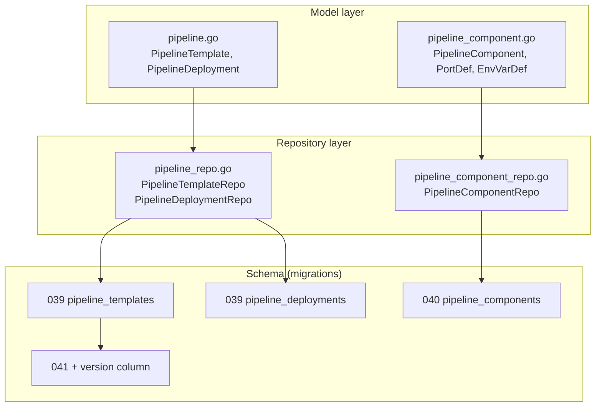
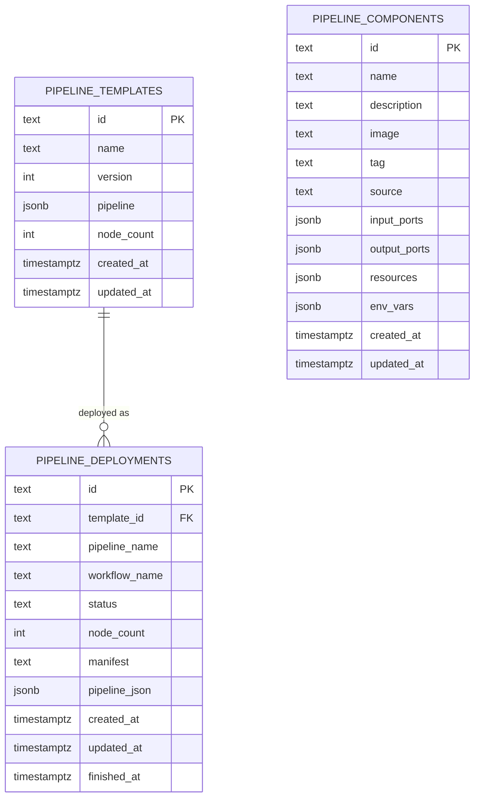
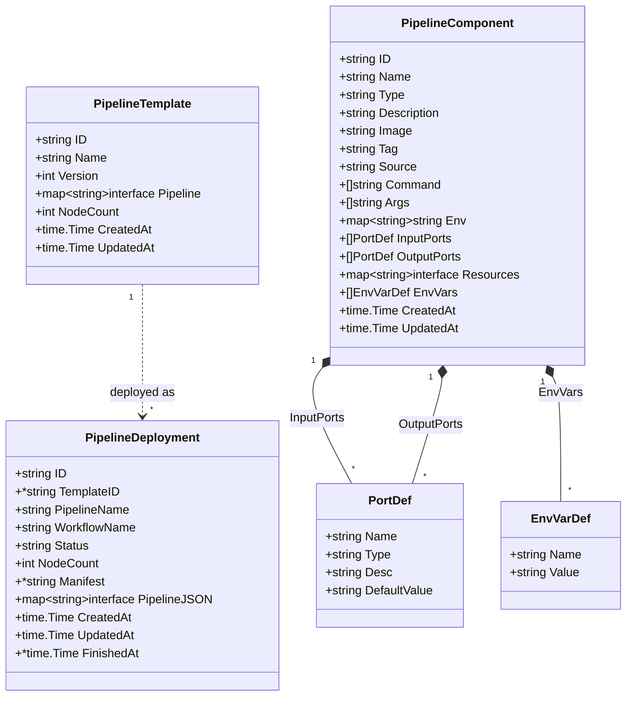
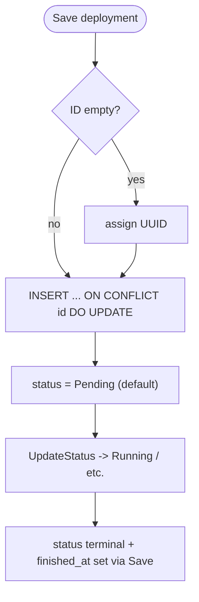
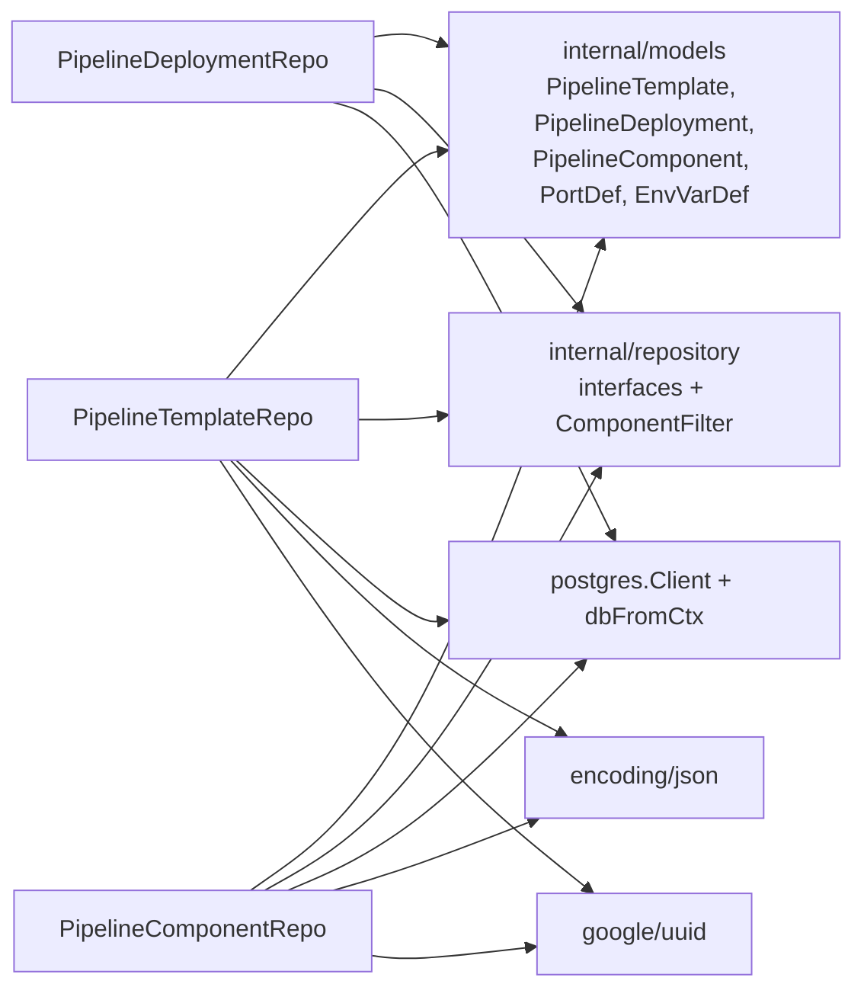

# Pipeline Model

<cite>
**Referenced Files in This Document**

- [backend/internal/models/pipeline.go](file://backend/internal/models/pipeline.go)
- [backend/internal/models/pipeline_component.go](file://backend/internal/models/pipeline_component.go)
- [backend/internal/postgres/pipeline_repo.go](file://backend/internal/postgres/pipeline_repo.go)
- [backend/internal/postgres/pipeline_component_repo.go](file://backend/internal/postgres/pipeline_component_repo.go)
- [backend/migrations/039_pipeline_tables.sql](file://backend/migrations/039_pipeline_tables.sql)
- [backend/migrations/040_pipeline_components.sql](file://backend/migrations/040_pipeline_components.sql)
- [backend/migrations/042_pipeline_template_version.sql](file://backend/migrations/042_pipeline_template_version.sql)
</cite>

## Table of Contents
1. [Introduction](#introduction)
2. [Project Structure](#project-structure)
3. [Core Components](#core-components)
4. [Architecture Overview](#architecture-overview)
5. [Detailed Component Analysis](#detailed-component-analysis)
6. [Dependency Analysis](#dependency-analysis)
7. [Performance Considerations](#performance-considerations)
8. [Troubleshooting Guide](#troubleshooting-guide)
9. [Conclusion](#conclusion)
10. [Appendices](#appendices)

## Introduction

The pipeline data model is the persistence layer for cyber-databrew's pipeline
authoring and orchestration features. It captures three distinct but related
concerns:

- **Pipeline templates** — reusable, versioned pipeline definitions authored in
  the UI and stored as arbitrary JSON. A template is the canonical, editable
  source of a pipeline graph.
- **Pipeline deployments** — concrete executions of a template against a named
  workflow run, tracking status, a rendered manifest, and a point-in-time JSON
  snapshot of the pipeline that was deployed.
- **Pipeline components** — the registry of reusable building blocks (Docker
  images) that template authors wire together. Each component declares its
  container image, input/output ports, environment variables, and resource
  metadata.

These three entities are persisted in three tables — `pipeline_templates`,
`pipeline_deployments`, and `pipeline_components` — and surfaced through three
Postgres repositories. Templates are versioned: each save of a given template
*name* produces a new row with an incremented `version`, so older revisions
remain queryable. Deployments reference the template they originated from via a
nullable foreign key, allowing a deployment to outlive (or be detached from) its
source template.

This document describes the Go struct models, the relational schema produced by
the migrations, the repository methods that read and write each table, and the
relationships between the entities.

**Section sources**
- [backend/internal/models/pipeline.go](file://backend/internal/models/pipeline.go#L1-L33)
- [backend/internal/models/pipeline_component.go](file://backend/internal/models/pipeline_component.go#L1-L37)
- [backend/migrations/039_pipeline_tables.sql](file://backend/migrations/039_pipeline_tables.sql#L1-L26)

## Project Structure

The pipeline data model spans the model layer (plain Go structs with JSON
tags), the Postgres repository layer (SQL persistence), and the migration files
that define the physical schema. The relevant files are:

- **`backend/internal/models/pipeline.go`** — defines `PipelineTemplate` and
  `PipelineDeployment`. Both carry an arbitrary JSON payload (`Pipeline` /
  `PipelineJSON`) decoded into a `map[string]interface{}`.
- **`backend/internal/models/pipeline_component.go`** — defines
  `PipelineComponent` along with the nested `PortDef` and `EnvVarDef` value
  types used for ports and environment variables.
- **`backend/internal/postgres/pipeline_repo.go`** — houses two repositories,
  `PipelineTemplateRepo` and `PipelineDeploymentRepo`, each with its own column
  list, scan helper, and CRUD methods.
- **`backend/internal/postgres/pipeline_component_repo.go`** — houses
  `PipelineComponentRepo`, including the `hydrateComponentDerivedFields` logic
  that reconstructs derived struct fields (`Type`, `Command`, `Args`, `Env`)
  from the persisted `resources` JSON.
- **`backend/migrations/039_pipeline_tables.sql`** — creates
  `pipeline_templates` and `pipeline_deployments`.
- **`backend/migrations/040_pipeline_components.sql`** — creates
  `pipeline_components` and its two indexes.
- **`backend/migrations/042_pipeline_template_version.sql`** — adds the
  `version` column to `pipeline_templates`, backfills existing rows, and adds a
  unique `(name, version)` index.

**Diagram sources**
- [backend/internal/models/pipeline.go](file://backend/internal/models/pipeline.go#L1-L33)
- [backend/internal/models/pipeline_component.go](file://backend/internal/models/pipeline_component.go#L1-L37)
- [backend/internal/postgres/pipeline_repo.go](file://backend/internal/postgres/pipeline_repo.go#L16-L185)
- [backend/internal/postgres/pipeline_component_repo.go](file://backend/internal/postgres/pipeline_component_repo.go#L17-L30)

**Section sources**
- [backend/internal/postgres/pipeline_repo.go](file://backend/internal/postgres/pipeline_repo.go#L1-L26)
- [backend/internal/postgres/pipeline_component_repo.go](file://backend/internal/postgres/pipeline_component_repo.go#L1-L30)
- [backend/migrations/040_pipeline_components.sql](file://backend/migrations/040_pipeline_components.sql#L1-L17)

## Core Components

The model layer defines five types. Three are top-level entities mapped directly
to tables; two are nested value objects embedded in component JSON.

#### PipelineTemplate

`PipelineTemplate` is a reusable, versioned pipeline definition. The `Pipeline`
field is the full graph definition stored as JSONB; the model keeps it opaque as
`map[string]interface{}` so the backend never needs to understand the graph
shape. `NodeCount` is a denormalized count surfaced to the UI, and `Version`
distinguishes successive saves of the same `Name`.

#### PipelineDeployment

`PipelineDeployment` records one deployment of a template to a workflow run.
`TemplateID` is a nullable pointer because a deployment can exist without a live
template reference. `Status` defaults to `Pending` at the schema level.
`Manifest` (the rendered orchestration manifest) and `PipelineJSON` (a snapshot
of the deployed pipeline) are both optional, and `FinishedAt` is set only once
the run completes.

#### PipelineComponent

`PipelineComponent` is a registered building block backed by a Docker image. It
carries the image coordinates (`Image`, `Tag`, `Source`), wiring metadata
(`InputPorts`, `OutputPorts`), execution metadata (`Command`, `Args`, `Env`),
and a free-form `Resources` map. Several struct fields (`Type`, `Command`,
`Args`, `Env`) are *derived* — they are not persisted as their own columns but
reconstructed from the `resources` JSON on read.

#### PortDef and EnvVarDef

`PortDef` describes a single input or output port (`Name`, `Type`, optional
`Desc`, and an optional `DefaultValue` for input ports). `EnvVarDef` is a simple
`Name`/`Value` pair. Both are serialized into JSONB array columns
(`input_ports`, `output_ports`, `env_vars`).

**Section sources**
- [backend/internal/models/pipeline.go](file://backend/internal/models/pipeline.go#L5-L33)
- [backend/internal/models/pipeline_component.go](file://backend/internal/models/pipeline_component.go#L5-L37)

## Architecture Overview

The pipeline tables form a small relational graph rooted at `pipeline_templates`.
Deployments reference templates via a nullable foreign key, while components are
an independent registry that templates reference only logically (by embedding
component identifiers inside the opaque pipeline JSON — there is no SQL foreign
key from templates to components).

The `pipeline` and `pipeline_json` JSONB columns logically embed references to
`pipeline_components`, but that association lives inside the document and is not
enforced by the database.

**Diagram sources**
- [backend/migrations/039_pipeline_tables.sql](file://backend/migrations/039_pipeline_tables.sql#L5-L26)
- [backend/migrations/040_pipeline_components.sql](file://backend/migrations/040_pipeline_components.sql#L1-L14)
- [backend/migrations/042_pipeline_template_version.sql](file://backend/migrations/042_pipeline_template_version.sql#L4-L4)

**Section sources**
- [backend/migrations/039_pipeline_tables.sql](file://backend/migrations/039_pipeline_tables.sql#L1-L26)
- [backend/migrations/040_pipeline_components.sql](file://backend/migrations/040_pipeline_components.sql#L1-L17)

## Detailed Component Analysis

### Struct model and class relationships

The Go models map closely to the schema, with the JSONB columns deserialized
into native Go types. `PipelineComponent` aggregates `PortDef` (twice, for input
and output ports) and `EnvVarDef`.

**Diagram sources**
- [backend/internal/models/pipeline.go](file://backend/internal/models/pipeline.go#L8-L33)
- [backend/internal/models/pipeline_component.go](file://backend/internal/models/pipeline_component.go#L6-L37)

**Section sources**
- [backend/internal/models/pipeline.go](file://backend/internal/models/pipeline.go#L1-L33)
- [backend/internal/models/pipeline_component.go](file://backend/internal/models/pipeline_component.go#L1-L37)

### Pipeline template persistence and versioning

`PipelineTemplateRepo` reads and writes `pipeline_templates`. Its column list is
fixed by `pipelineTemplateSelectCols`, and `scanPipelineTemplate` decodes the
`pipeline` JSONB into the `Pipeline` map, defaulting to an empty map when the
column is null or empty.

`Save` performs an upsert keyed on `id`: when `ID` is empty a new UUID is
assigned, `CreatedAt` is set on first write, and `UpdatedAt` is always refreshed.
The pipeline map is marshalled to JSON and defaults to `{}` when empty. The
`INSERT ... ON CONFLICT (id) DO UPDATE` statement refreshes `name`, `version`,
`pipeline`, `node_count`, and `updated_at` on conflict. Note the parameter
ordering quirk: `version` is bound as `$7` while appearing third in the column
list (`VALUES ($1, $2, $7, ...)`).

Versioning is supported by three read methods:

- `FindVersionsByName` returns every row for a `name`, ordered by `version DESC`.
- `GetNextVersion` returns `COALESCE(MAX(version), 0) + 1` for a name, so callers
  can assign the next version before saving a new revision.
- `FindAll` and `FindByID` provide the standard list/get access patterns,
  ordered by `created_at DESC`.

The `version` column itself is added by migration 041, which also backfills
existing rows with sequential versions partitioned by `name` and creates the
unique index `idx_pipeline_templates_name_version` to guarantee no duplicate
`(name, version)` pairs.

**Section sources**
- [backend/internal/postgres/pipeline_repo.go](file://backend/internal/postgres/pipeline_repo.go#L26-L169)
- [backend/migrations/042_pipeline_template_version.sql](file://backend/migrations/042_pipeline_template_version.sql#L1-L18)

### Pipeline deployment lifecycle

`PipelineDeploymentRepo` manages `pipeline_deployments`. The `status` column
defaults to `'Pending'` at the schema level, and `Save` upserts on `id`,
refreshing every mutable column on conflict — including `finished_at`, which is
written through but never auto-managed.

`scanPipelineDeployment` decodes the nullable columns (`template_id`,
`manifest`) into pointer fields and unmarshals `pipeline_json` into the
`PipelineJSON` map only when non-empty. `Save` mirrors this: it marshals
`PipelineJSON` only when non-nil, passes `manifest` and `template_id` as
`interface{}`/`any` so null is sent when the pointers are nil.

`UpdateStatus` provides a lightweight status transition
(`UPDATE pipeline_deployments SET status = $2 WHERE id = $1`) without rewriting
the whole row, which is the primary mutation during a deployment's run. `Delete`
and `FindByID`/`FindAll` round out the CRUD surface.

**Diagram sources**
- [backend/internal/postgres/pipeline_repo.go](file://backend/internal/postgres/pipeline_repo.go#L217-L330)
- [backend/migrations/039_pipeline_tables.sql](file://backend/migrations/039_pipeline_tables.sql#L14-L26)

**Section sources**
- [backend/internal/postgres/pipeline_repo.go](file://backend/internal/postgres/pipeline_repo.go#L171-L330)

### Pipeline component persistence and derived fields

`PipelineComponentRepo` manages `pipeline_components`. Only a subset of the
struct fields are persisted as columns (`id`, `name`, `description`, `image`,
`tag`, `source`, `input_ports`, `output_ports`, `resources`, `env_vars`,
`created_at`, `updated_at`); the columns `type`, `command`, `args`, and `env`
from the struct have no dedicated column and are instead derived on read.

`hydrateComponentDerivedFields` reconstructs those fields after a scan:

- `Resources` defaults to an empty map.
- `Type` is taken from `resources["type"]`; if absent it defaults to
  `"container"` and is written back into the resources map.
- `Command` and `Args` are parsed from `resources["command"]` /
  `resources["args"]` via `stringSliceFromJSONValue`, which tolerates both
  `[]string` and `[]interface{}` JSON shapes.
- `Env` is populated from `resources["env"]` and then overlaid with each
  `EnvVarDef` from the `env_vars` column.

`Save` inserts a row, marshalling `InputPorts`, `OutputPorts`, `Resources`, and
`EnvVars` to JSONB. `Update` rewrites the same set of columns by `id`. `FindAll`
supports an optional `ComponentFilter` that adds an `ILIKE` name search and/or a
`source =` filter, building the `WHERE` clause dynamically with positional
parameters, and orders results by `name ASC`. `FindByID` and `Delete` complete
the CRUD surface.

After scanning, `InputPorts` and `OutputPorts` are normalized to empty slices
(never nil) so the JSON API always emits arrays.

**Section sources**
- [backend/internal/postgres/pipeline_component_repo.go](file://backend/internal/postgres/pipeline_component_repo.go#L29-L247)
- [backend/migrations/040_pipeline_components.sql](file://backend/migrations/040_pipeline_components.sql#L1-L14)

## Dependency Analysis

The repositories depend on the `models` package for the entity structs, on the
`repository` package for the interface contracts they satisfy (each asserts
`var _ repository.XRepository = (*XRepo)(nil)`), and on the shared `Client`
plus `dbFromCtx` helper for transaction-aware database access. They also use
`encoding/json` for JSONB (de)serialization and `github.com/google/uuid` for ID
generation.

The only intra-schema dependency is the foreign key
`pipeline_deployments.template_id -> pipeline_templates.id`. `pipeline_components`
is independent at the schema level.

**Diagram sources**
- [backend/internal/postgres/pipeline_repo.go](file://backend/internal/postgres/pipeline_repo.go#L1-L24)
- [backend/internal/postgres/pipeline_component_repo.go](file://backend/internal/postgres/pipeline_component_repo.go#L1-L27)

**Section sources**
- [backend/internal/postgres/pipeline_repo.go](file://backend/internal/postgres/pipeline_repo.go#L1-L24)
- [backend/internal/postgres/pipeline_component_repo.go](file://backend/internal/postgres/pipeline_component_repo.go#L1-L27)
- [backend/migrations/039_pipeline_tables.sql](file://backend/migrations/039_pipeline_tables.sql#L14-L16)

## Performance Considerations

- **Indexing.** `pipeline_components` has two B-tree indexes,
  `idx_pipeline_components_name` and `idx_pipeline_components_source`, matching
  the `ILIKE` name search and `source =` filter in `FindAll`. Note that the
  `ILIKE '%query%'` pattern is a leading-wildcard search and cannot use the
  `name` B-tree index for the predicate itself; the index primarily benefits the
  exact-equality and ordering paths.
- **Unique version index.** `idx_pipeline_templates_name_version` enforces
  uniqueness of `(name, version)` and accelerates `FindVersionsByName` (ordered
  by `version DESC`) and `GetNextVersion` (`MAX(version)` per name).
- **JSONB payloads.** `pipeline`, `pipeline_json`, `resources`, `input_ports`,
  `output_ports`, and `env_vars` are stored as JSONB and (de)serialized in Go.
  Large pipeline graphs inflate row size; there are no GIN indexes on these
  columns, so querying *inside* the JSON is not optimized.
- **List queries are unbounded.** `FindAll` on all three repositories returns
  every row with no LIMIT/pagination, ordered in memory-friendly ways
  (`created_at DESC` for templates/deployments, `name ASC` for components).
  Growth in any table directly increases payload size of list endpoints.
- **Upserts.** Both templates and deployments use single-statement
  `INSERT ... ON CONFLICT (id) DO UPDATE`, avoiding read-modify-write round
  trips. Component writes are split into `Save` (insert) and `Update`.

**Section sources**
- [backend/migrations/040_pipeline_components.sql](file://backend/migrations/040_pipeline_components.sql#L16-L17)
- [backend/migrations/042_pipeline_template_version.sql](file://backend/migrations/042_pipeline_template_version.sql#L18-L18)
- [backend/internal/postgres/pipeline_component_repo.go](file://backend/internal/postgres/pipeline_component_repo.go#L156-L193)

## Troubleshooting Guide

#### A component shows an empty `type`, `command`, `args`, or `env`
These fields are not stored as columns — they are derived from the `resources`
JSON by `hydrateComponentDerivedFields`. If they are blank, inspect the
component's `resources` column: `type` falls back to `"container"`, while
`command`/`args`/`env` are read from `resources["command"]`,
`resources["args"]`, and `resources["env"]` (plus the `env_vars` column). If the
JSON shape is unexpected (e.g. command stored as a string rather than an array),
`stringSliceFromJSONValue` returns nil.

#### Saving two template revisions fails with a unique-violation
The unique index `idx_pipeline_templates_name_version` forbids duplicate
`(name, version)`. Always derive the next version with `GetNextVersion(name)`
before `Save`; reusing a version number for the same name will violate the
constraint.

#### A deployment references a missing template
`template_id` is a nullable foreign key to `pipeline_templates(id)`. A deployment
may legitimately have `template_id = NULL`. If a non-null `template_id` points at
a deleted template, the FK would have blocked the template delete (no
cascade is declared), so the more common case is simply a null reference.

#### Pipeline JSON comes back empty
`scanPipelineTemplate` defaults `Pipeline` to `{}` when the column is null/empty,
and `scanPipelineDeployment` leaves `PipelineJSON` nil when `pipeline_json` is
empty. An empty graph in the UI usually means the column was never populated on
write, not a decode failure (unmarshal errors are intentionally swallowed with
`_ =`).

#### Ports serialize as `null` instead of `[]`
On read, `scanPipelineComponent` normalizes nil `InputPorts`/`OutputPorts` to
empty slices, so a freshly scanned component always emits arrays. A `null` in the
API response points to an object that bypassed the scan helper.

**Section sources**
- [backend/internal/postgres/pipeline_component_repo.go](file://backend/internal/postgres/pipeline_component_repo.go#L32-L119)
- [backend/internal/postgres/pipeline_repo.go](file://backend/internal/postgres/pipeline_repo.go#L28-L45)
- [backend/migrations/042_pipeline_template_version.sql](file://backend/migrations/042_pipeline_template_version.sql#L17-L18)

## Conclusion

The pipeline data model is a compact three-table schema with a single enforced
foreign key. `pipeline_templates` is the versioned source of truth for pipeline
graphs, `pipeline_deployments` records each run against a workflow with status
and snapshot, and `pipeline_components` is the reusable building-block registry.
The Go models stay deliberately schema-light by storing graphs and resource
metadata as opaque JSONB and reconstructing derived fields on read. The
repositories provide straightforward upsert-and-query CRUD, with versioning
helpers on templates, a status-only update on deployments, and a filterable list
on components.

## Appendices

### Appendix A — `pipeline_templates` columns

| Column | Type | Notes | Struct field |
|---|---|---|---|
| `id` | TEXT PK | UUID assigned on first save | `ID` |
| `name` | TEXT NOT NULL | Template name (grouping key for versions) | `Name` |
| `version` | INT NOT NULL DEFAULT 1 | Added in migration 041; unique with name | `Version` |
| `pipeline` | JSONB NOT NULL | Full graph definition | `Pipeline` |
| `node_count` | INT NOT NULL DEFAULT 0 | Denormalized node count | `NodeCount` |
| `created_at` | TIMESTAMPTZ NOT NULL DEFAULT NOW() | | `CreatedAt` |
| `updated_at` | TIMESTAMPTZ NOT NULL DEFAULT NOW() | | `UpdatedAt` |

### Appendix B — `pipeline_deployments` columns

| Column | Type | Notes | Struct field |
|---|---|---|---|
| `id` | TEXT PK | UUID assigned on first save | `ID` |
| `template_id` | TEXT FK -> pipeline_templates(id) | Nullable | `TemplateID` |
| `pipeline_name` | TEXT NOT NULL | | `PipelineName` |
| `workflow_name` | TEXT NOT NULL | Target workflow run | `WorkflowName` |
| `status` | TEXT NOT NULL DEFAULT 'Pending' | | `Status` |
| `node_count` | INT NOT NULL DEFAULT 0 | | `NodeCount` |
| `manifest` | TEXT | Rendered manifest, nullable | `Manifest` |
| `pipeline_json` | JSONB | Snapshot of deployed pipeline, nullable | `PipelineJSON` |
| `created_at` | TIMESTAMPTZ NOT NULL DEFAULT NOW() | | `CreatedAt` |
| `updated_at` | TIMESTAMPTZ NOT NULL DEFAULT NOW() | | `UpdatedAt` |
| `finished_at` | TIMESTAMPTZ | Nullable | `FinishedAt` |

### Appendix C — `pipeline_components` columns

| Column | Type | Notes | Struct field |
|---|---|---|---|
| `id` | TEXT PK | UUID assigned on first save | `ID` |
| `name` | TEXT NOT NULL | Indexed (`idx_pipeline_components_name`) | `Name` |
| `description` | TEXT NOT NULL DEFAULT '' | | `Description` |
| `image` | TEXT NOT NULL | Docker image | `Image` |
| `tag` | TEXT NOT NULL DEFAULT 'latest' | | `Tag` |
| `source` | TEXT NOT NULL DEFAULT 'custom' | Indexed (`idx_pipeline_components_source`) | `Source` |
| `input_ports` | JSONB NOT NULL DEFAULT '[]' | Array of `PortDef` | `InputPorts` |
| `output_ports` | JSONB NOT NULL DEFAULT '[]' | Array of `PortDef` | `OutputPorts` |
| `resources` | JSONB | Source of derived `Type`/`Command`/`Args`/`Env` | `Resources` |
| `env_vars` | JSONB | Array of `EnvVarDef` | `EnvVars` |
| `created_at` | TIMESTAMPTZ NOT NULL DEFAULT NOW() | | `CreatedAt` |
| `updated_at` | TIMESTAMPTZ NOT NULL DEFAULT NOW() | | `UpdatedAt` |

Derived struct fields with no dedicated column: `Type`, `Command`, `Args`,
`Env` — all reconstructed by `hydrateComponentDerivedFields`.

### Appendix D — nested value types

| Type | Field | JSON tag | Notes |
|---|---|---|---|
| `PortDef` | `Name` | `name` | Port identifier |
| `PortDef` | `Type` | `type` | Port data type |
| `PortDef` | `Desc` | `desc,omitempty` | Optional description |
| `PortDef` | `DefaultValue` | `default_value,omitempty` | Default for input ports |
| `EnvVarDef` | `Name` | `name` | Variable name |
| `EnvVarDef` | `Value` | `value,omitempty` | Variable value |

### Appendix E — repository method index

| Repository | Methods |
|---|---|
| `PipelineTemplateRepo` | `Save`, `FindAll`, `FindByID`, `Delete`, `FindVersionsByName`, `GetNextVersion` |
| `PipelineDeploymentRepo` | `Save`, `FindAll`, `FindByID`, `Delete`, `UpdateStatus` |
| `PipelineComponentRepo` | `Save`, `FindAll` (with `ComponentFilter`), `FindByID`, `Update`, `Delete` |

**Section sources**
- [backend/migrations/039_pipeline_tables.sql](file://backend/migrations/039_pipeline_tables.sql#L5-L26)
- [backend/migrations/040_pipeline_components.sql](file://backend/migrations/040_pipeline_components.sql#L1-L17)
- [backend/migrations/042_pipeline_template_version.sql](file://backend/migrations/042_pipeline_template_version.sql#L4-L18)
- [backend/internal/postgres/pipeline_repo.go](file://backend/internal/postgres/pipeline_repo.go#L49-L330)
- [backend/internal/postgres/pipeline_component_repo.go](file://backend/internal/postgres/pipeline_component_repo.go#L122-L247)
