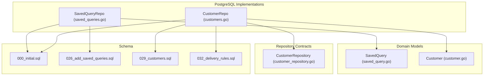
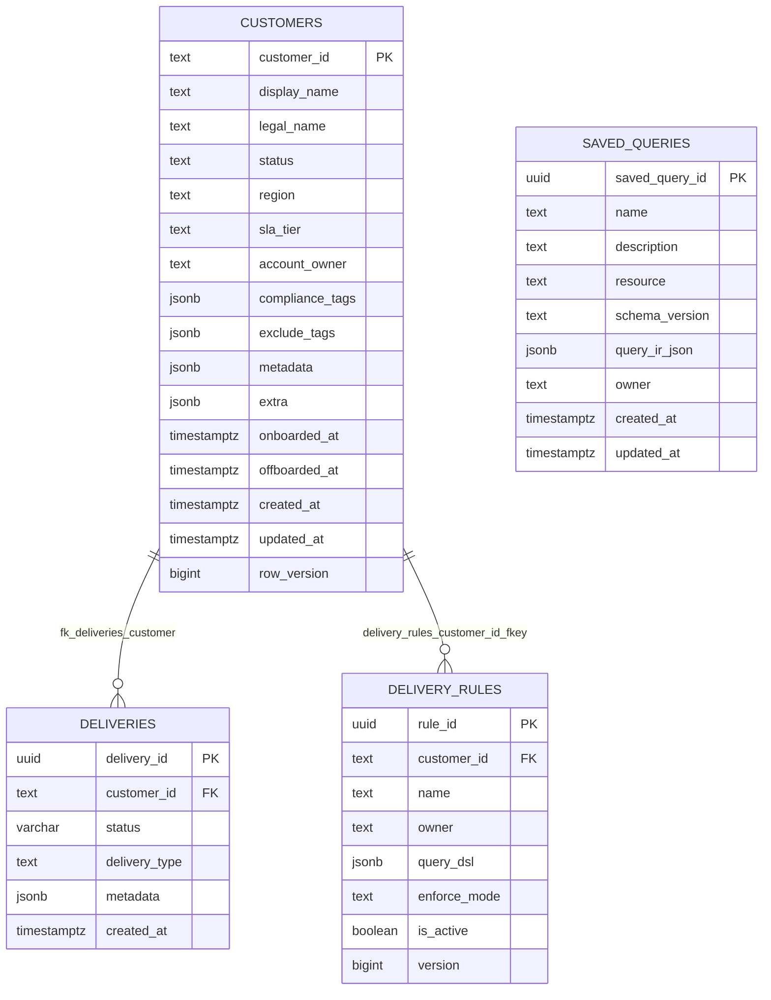
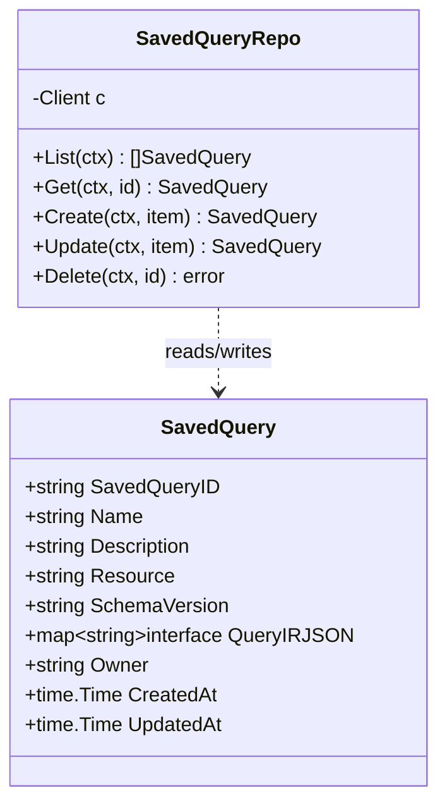
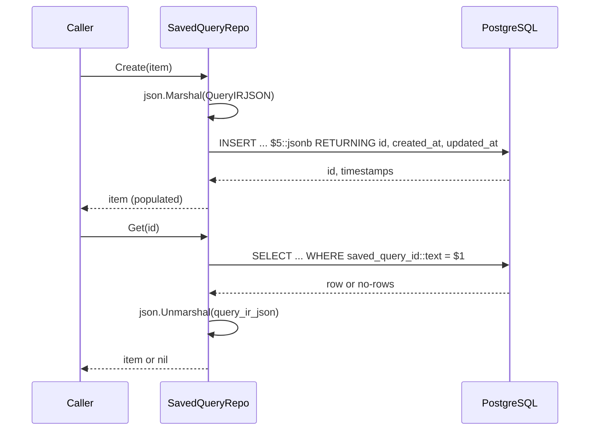
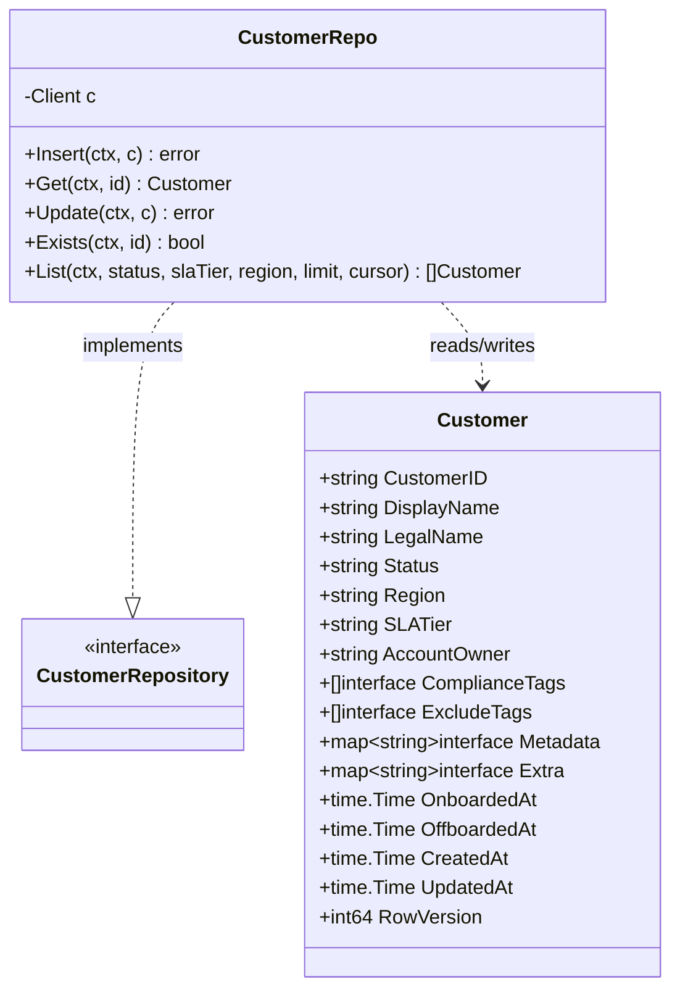
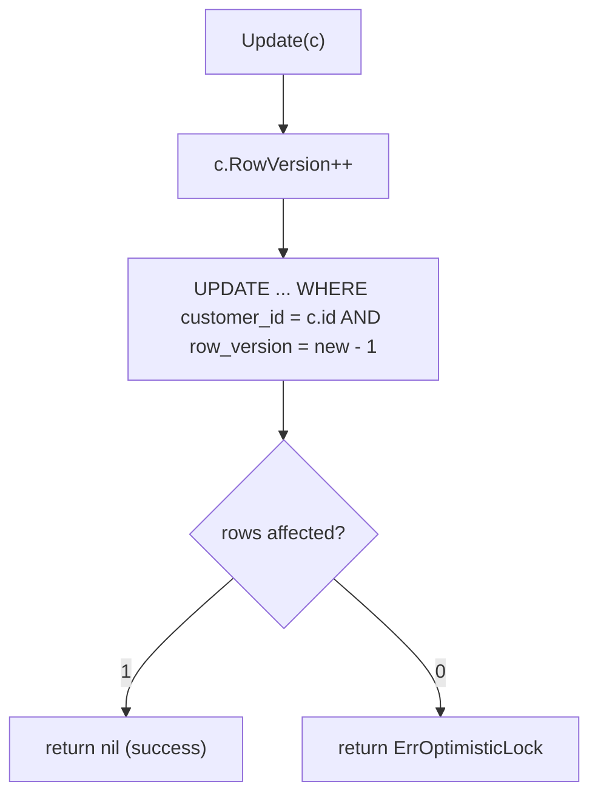
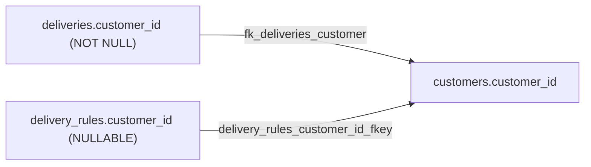
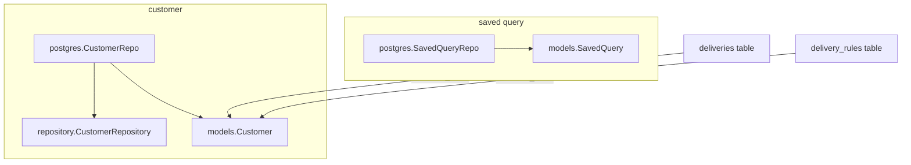

# Saved Query & Customer Models

<cite>
**Referenced Files in This Document**

- [backend/internal/models/saved_query.go](file://backend/internal/models/saved_query.go)
- [backend/internal/models/customer.go](file://backend/internal/models/customer.go)
- [backend/internal/postgres/saved_queries.go](file://backend/internal/postgres/saved_queries.go)
- [backend/internal/postgres/customers.go](file://backend/internal/postgres/customers.go)
- [backend/internal/repository/customer_repository.go](file://backend/internal/repository/customer_repository.go)
- [backend/migrations/000_initial.sql](file://backend/migrations/000_initial.sql)
- [backend/migrations/archive/026_add_saved_queries.sql](file://backend/migrations/archive/026_add_saved_queries.sql)
- [backend/migrations/archive/029_customers.sql](file://backend/migrations/archive/029_customers.sql)
- [backend/migrations/archive/032_delivery_rules.sql](file://backend/migrations/archive/032_delivery_rules.sql)
</cite>

## Table of Contents
1. [Introduction](#introduction)
2. [Project Structure](#project-structure)
3. [Core Components](#core-components)
4. [Architecture Overview](#architecture-overview)
5. [Detailed Component Analysis](#detailed-component-analysis)
6. [Dependency Analysis](#dependency-analysis)
7. [Performance Considerations](#performance-considerations)
8. [Troubleshooting Guide](#troubleshooting-guide)
9. [Conclusion](#conclusion)
10. [Appendices](#appendices)

## Introduction

This page documents two long-lived relational data models that anchor very
different parts of the cyber-databrew backend, yet share a common persistence
idiom: storing rich structured payloads as PostgreSQL `JSONB` columns wrapped
around a thin, strongly-typed Go struct.

The **saved query** model (`saved_queries`) persists reusable, structured query
definitions. A saved query is a named, versioned wrapper around a **Query
Intermediate Representation (Query IR)** — a JSON object that describes a query
over a resource (by default `assets`) without binding the application to a SQL
string. The IR is opaque to the persistence layer: the repository stores and
returns it verbatim as `query_ir_json`, leaving validation and execution to
higher layers. This lets the team evolve the query language (carried by
`schema_version`) without schema migrations.

The **customer** model (`customers`) is the business master-data reference row
introduced under CYB-1014. A customer record carries identity (`display_name`,
`legal_name`), lifecycle (`status`, `onboarded_at`, `offboarded_at`),
service-level (`sla_tier`, `region`, `account_owner`), and policy hints
(`compliance_tags`, `exclude_tags`) plus open-ended `metadata` and `extra`
maps. The customer table is the referential anchor for downstream delivery
flows: both `deliveries` and `delivery_rules` carry a `customer_id` foreign key
that points back to `customers.customer_id`, making the customer the natural
join key for "what was delivered to whom" and "what compliance rules apply to
whom" questions.

The two models are deliberately treated together here because they illustrate
the repository's two persistence patterns side by side: the saved-query repo is
a minimal CRUD wrapper with no concurrency control, while the customer repo adds
optimistic locking (`row_version`), duplicate-key mapping, and cursor
pagination. Reading them in one place clarifies which conventions are local
choices versus shared idioms.

**Section sources**
- [backend/internal/models/saved_query.go](file://backend/internal/models/saved_query.go#L1-L15)
- [backend/internal/models/customer.go](file://backend/internal/models/customer.go#L1-L23)
- [backend/migrations/archive/029_customers.sql](file://backend/migrations/archive/029_customers.sql#L1-L52)

## Project Structure

The two models follow the backend's standard three-layer split: a model struct
(the wire/domain shape), a repository interface (the persistence contract), and
a PostgreSQL implementation (the concrete SQL). Migrations define the physical
schema.

- **`backend/internal/models/`** — domain structs with JSON tags.
  - `saved_query.go` defines `SavedQuery`, whose `QueryIRJSON` field is a free-form
    `map[string]interface{}`.
  - `customer.go` defines `Customer`, with typed scalars plus four JSON-backed
    fields (`ComplianceTags`, `ExcludeTags`, `Metadata`, `Extra`) and an
    optimistic-lock `RowVersion`.
- **`backend/internal/repository/`** — interfaces. `customer_repository.go`
  declares `CustomerRepository`. The saved-query repository has no interface
  abstraction; callers use the concrete `*SavedQueryRepo` directly.
- **`backend/internal/postgres/`** — concrete repositories.
  - `saved_queries.go` implements `SavedQueryRepo` (List / Get / Create / Update / Delete).
  - `customers.go` implements `CustomerRepo` (Insert / Get / Update / Exists / List)
    plus the JSON encode/decode helpers `customerJSONFields` and `decodeCustomerJSON`.
- **`backend/migrations/`** — schema.
  - `000_initial.sql` is the consolidated current schema; it contains the
    authoritative `customers`, `deliveries`, `delivery_rules`, and `saved_queries`
    table definitions and their foreign keys.
  - `archive/026_add_saved_queries.sql`, `archive/029_customers.sql`, and
    `archive/032_delivery_rules.sql` are the historical migrations that first
    introduced these tables, indexes, triggers, and the delivery foreign keys.

**Diagram sources**
- [backend/internal/models/saved_query.go](file://backend/internal/models/saved_query.go#L5-L15)
- [backend/internal/models/customer.go](file://backend/internal/models/customer.go#L6-L23)
- [backend/internal/postgres/saved_queries.go](file://backend/internal/postgres/saved_queries.go#L11-L15)
- [backend/internal/postgres/customers.go](file://backend/internal/postgres/customers.go#L17-L25)

**Section sources**
- [backend/internal/postgres/saved_queries.go](file://backend/internal/postgres/saved_queries.go#L1-L15)
- [backend/internal/postgres/customers.go](file://backend/internal/postgres/customers.go#L1-L25)
- [backend/internal/repository/customer_repository.go](file://backend/internal/repository/customer_repository.go#L1-L21)

## Core Components

### The `SavedQuery` model

`SavedQuery` is a small struct of nine fields. Most are plain strings; the
load-bearing field is `QueryIRJSON`, a `map[string]interface{}` that holds the
serialized Query IR. The model carries two versioning-related fields: `Resource`
(what the query targets, defaulting to `assets`) and `SchemaVersion` (the IR
grammar version, defaulting to `v1`). `Owner` and `Description` are optional and
marked `omitempty`. `CreatedAt` / `UpdatedAt` are database-managed timestamps.

The `json:"query_ir_json"` tag means the IR is round-tripped verbatim over the
API: the same JSON the client submits becomes the stored `JSONB` and the
returned body, with no server-side reshaping.

### The `Customer` model

`Customer` is the business reference row. It mixes typed scalars
(`CustomerID`, `DisplayName`, `Status`, `SLATier`, …), four JSON-backed
collections, and lifecycle timestamps. `CustomerID` is a caller-supplied `TEXT`
primary key (not a generated UUID). Two of the JSON fields — `ComplianceTags`
and `ExcludeTags` — are JSON arrays (`[]interface{}`); the other two —
`Metadata` and `Extra` — are JSON objects (`map[string]interface{}`).
`OnboardedAt` and `OffboardedAt` are nullable (`*time.Time`). `RowVersion` is an
`int64` used for optimistic concurrency control.

### The `CustomerRepository` contract

`CustomerRepository` declares the five customer operations: `Insert`, `Get`,
`Update`, `Exists`, and `List`. The PostgreSQL `CustomerRepo` asserts it
satisfies this interface at compile time (`var _ repository.CustomerRepository =
(*CustomerRepo)(nil)`). The interface also defines the two sentinel errors the
implementation maps to: `ErrDuplicateCustomerID` (declared alongside the
interface) and `repository.ErrOptimisticLock` (shared, from `common.go`).

### The repositories

`SavedQueryRepo` is a thin CRUD wrapper. It marshals `QueryIRJSON` to bytes on
write, casts the parameter to `jsonb`, and unmarshals it back on read. It uses
`NULLIF(..., '')` so empty `description` and `owner` strings become SQL `NULL`.

`CustomerRepo` is richer: it defaults `Status`/`SLATier` on insert, maps the
unique-violation SQL state `23505` to `ErrDuplicateCustomerID`, and performs a
compare-and-swap update guarded by `row_version`.

**Section sources**
- [backend/internal/models/saved_query.go](file://backend/internal/models/saved_query.go#L5-L15)
- [backend/internal/models/customer.go](file://backend/internal/models/customer.go#L5-L23)
- [backend/internal/repository/customer_repository.go](file://backend/internal/repository/customer_repository.go#L10-L20)
- [backend/internal/postgres/saved_queries.go](file://backend/internal/postgres/saved_queries.go#L87-L102)
- [backend/internal/postgres/customers.go](file://backend/internal/postgres/customers.go#L27-L64)

## Architecture Overview

The relational schema centers on `customers` as the master-data anchor. Both
`deliveries` and `delivery_rules` reference it by `customer_id`. `saved_queries`
stands apart — it has no foreign key to any other table and is keyed by a
generated UUID. The diagram below captures the relational shape and the JSONB
columns on each table.

Note the asymmetry of the two foreign keys. `deliveries.customer_id` is `NOT
NULL`, so every delivery must belong to a customer. `delivery_rules.customer_id`
is nullable, so a delivery rule may be global (apply to all customers) or scoped
to one customer.

**Diagram sources**
- [backend/migrations/000_initial.sql](file://backend/migrations/000_initial.sql#L371-L389)
- [backend/migrations/000_initial.sql](file://backend/migrations/000_initial.sql#L391-L413)
- [backend/migrations/000_initial.sql](file://backend/migrations/000_initial.sql#L421-L436)
- [backend/migrations/000_initial.sql](file://backend/migrations/000_initial.sql#L550-L560)

**Section sources**
- [backend/migrations/000_initial.sql](file://backend/migrations/000_initial.sql#L371-L436)
- [backend/migrations/000_initial.sql](file://backend/migrations/000_initial.sql#L550-L560)

## Detailed Component Analysis

### The stored Query IR

The Query IR is the heart of the saved-query model. The persistence layer treats
it as an opaque blob: `SavedQueryRepo.Create` and `Update` call
`json.Marshal(item.QueryIRJSON)` and bind the result as a `jsonb` parameter
(`$5::jsonb`); `List` and `Get` `json.Unmarshal` the column back into the
`map[string]interface{}`. There is no validation, normalization, or field
projection at this layer — the bytes that arrive are the bytes that persist and
the bytes that return.

Two columns frame the IR rather than parse it:

- `resource` records the target collection (default `'assets'`), so the
  execution layer knows what the IR queries.
- `schema_version` records the IR grammar version (default `'v1'`), so older
  saved queries remain readable as the IR evolves; the table never needs a
  migration when the IR grammar changes.

Because the column is `JSONB NOT NULL`, a saved query must always carry an IR
payload. On read, the repo guards `if len(queryJSON) > 0` before unmarshalling,
so a `NULL`/empty column leaves `QueryIRJSON` as a nil map rather than erroring.

**Diagram sources**
- [backend/internal/models/saved_query.go](file://backend/internal/models/saved_query.go#L5-L15)
- [backend/internal/postgres/saved_queries.go](file://backend/internal/postgres/saved_queries.go#L11-L133)

**Section sources**
- [backend/internal/postgres/saved_queries.go](file://backend/internal/postgres/saved_queries.go#L87-L128)
- [backend/migrations/archive/026_add_saved_queries.sql](file://backend/migrations/archive/026_add_saved_queries.sql#L3-L13)

### Saved-query CRUD lifecycle

The five operations are straightforward. `Create` inserts and returns the
server-generated `saved_query_id`, `created_at`, and `updated_at` via
`RETURNING`. `Update` matches on `saved_query_id::text = $1`, rewrites all
mutable fields, and returns the refreshed timestamps; an `updated_at` trigger
(`trg_saved_queries_updated_at`) keeps the column current on every update.
`Get` and `List` `SELECT` the same column set; `List` orders newest-first by
`updated_at DESC, saved_query_id DESC`. `Delete` is an unconditional hard
delete. Both `Get` and `Update` translate `errNoRows` into a `(nil, nil)`
"not found" result rather than an error.

**Diagram sources**
- [backend/internal/postgres/saved_queries.go](file://backend/internal/postgres/saved_queries.go#L55-L102)

**Section sources**
- [backend/internal/postgres/saved_queries.go](file://backend/internal/postgres/saved_queries.go#L17-L133)
- [backend/migrations/archive/026_add_saved_queries.sql](file://backend/migrations/archive/026_add_saved_queries.sql#L22-L25)

### The customer model and its JSON fields

The customer struct's four JSON-backed fields are normalized on the way to the
database by `customerJSONFields`: a nil `ComplianceTags`/`ExcludeTags` becomes
the literal `[]`, and a nil `Metadata`/`Extra` becomes `{}`. This mirrors the
schema defaults (`'[]'::jsonb` and `'{}'::jsonb`, both `NOT NULL`) and prevents
SQL `NULL` from ever landing in those columns. On read, `decodeCustomerJSON`
unmarshals each non-empty byte slice back into the struct.

`Insert` applies domain defaults before writing: an empty `Status` becomes
`"active"` and an empty `SLATier` becomes `"standard"`, matching the table's
`CHECK` constraints. The string fields `legal_name`, `region`, and
`account_owner` pass through `nullIfEmpty`, so empty strings become SQL `NULL`.

**Diagram sources**
- [backend/internal/models/customer.go](file://backend/internal/models/customer.go#L5-L23)
- [backend/internal/postgres/customers.go](file://backend/internal/postgres/customers.go#L207-L244)

**Section sources**
- [backend/internal/postgres/customers.go](file://backend/internal/postgres/customers.go#L27-L64)
- [backend/internal/postgres/customers.go](file://backend/internal/postgres/customers.go#L207-L244)

### Optimistic concurrency on customer update

`CustomerRepo.Update` implements a compare-and-swap. It increments
`c.RowVersion` in memory, then issues an `UPDATE … WHERE customer_id = $1 AND
row_version = $16 - 1`, where `$16` is the new version. If no row matches (a
concurrent writer already bumped the version, or the row does not exist), the
affected-row count is zero and the method returns `repository.ErrOptimisticLock`.
This is the same lock-conflict sentinel shared with other CAS-based repositories
in the codebase.

Insert handles the complementary failure: a primary-key collision surfaces as a
pgx `*pgconn.PgError` with SQL state `23505`, which the repo translates to the
domain error `repository.ErrDuplicateCustomerID`.

**Diagram sources**
- [backend/internal/postgres/customers.go](file://backend/internal/postgres/customers.go#L96-L131)

**Section sources**
- [backend/internal/postgres/customers.go](file://backend/internal/postgres/customers.go#L27-L131)
- [backend/internal/repository/customer_repository.go](file://backend/internal/repository/customer_repository.go#L10-L11)

### Customer listing and cursor pagination

`List` builds a dynamic `WHERE` clause from optional `status`, `slaTier`, and
`region` filters, plus a keyset cursor (`customer_id > $cursor`). Results are
ordered `customer_id ASC` so the last returned `customer_id` is the next
cursor. The `limit` is clamped: values `<= 0` or `> 200` fall back to the
default of `50`. Each row decodes its four JSON columns via
`decodeCustomerJSON`.

**Section sources**
- [backend/internal/postgres/customers.go](file://backend/internal/postgres/customers.go#L142-L205)

### Customer ↔ delivery association

The customer is the join key for delivery flows. The `029_customers.sql`
migration not only created the table but back-filled placeholder customer rows
from every distinct `customer_id` already present in `deliveries`
(`INSERT … SELECT DISTINCT TRIM(d.customer_id) … ON CONFLICT DO NOTHING`),
tagging them with `metadata = {"migrated": true, "source":
"029_customers_backfill"}`. Only after seeding placeholders did it add the
`fk_deliveries_customer` foreign key, guaranteeing referential integrity without
orphaning existing deliveries.

`delivery_rules` (CYB-1020) was introduced separately with a nullable
`customer_id REFERENCES customers(customer_id)`, letting a compliance rule be
either global or customer-scoped. In the consolidated `000_initial.sql` these
relationships appear as `fk_deliveries_customer` and
`delivery_rules_customer_id_fkey`.

**Diagram sources**
- [backend/migrations/archive/029_customers.sql](file://backend/migrations/archive/029_customers.sql#L30-L52)
- [backend/migrations/archive/032_delivery_rules.sql](file://backend/migrations/archive/032_delivery_rules.sql#L3-L7)

**Section sources**
- [backend/migrations/archive/029_customers.sql](file://backend/migrations/archive/029_customers.sql#L30-L52)
- [backend/migrations/archive/032_delivery_rules.sql](file://backend/migrations/archive/032_delivery_rules.sql#L1-L21)

## Dependency Analysis

The saved-query model is self-contained: it depends only on the `models`
package and the postgres `Client`, and nothing in the schema depends on it. The
customer model is a hub — it depends on the repository interface and the
postgres helpers, and the `deliveries` and `delivery_rules` tables depend on it
via foreign keys.

**Diagram sources**
- [backend/internal/postgres/saved_queries.go](file://backend/internal/postgres/saved_queries.go#L11-L15)
- [backend/internal/postgres/customers.go](file://backend/internal/postgres/customers.go#L17-L25)
- [backend/migrations/000_initial.sql](file://backend/migrations/000_initial.sql#L391-L436)

**Section sources**
- [backend/internal/repository/customer_repository.go](file://backend/internal/repository/customer_repository.go#L1-L21)
- [backend/internal/postgres/customers.go](file://backend/internal/postgres/customers.go#L17-L25)

## Performance Considerations

- **Saved-query indexes.** `026_add_saved_queries.sql` creates
  `idx_saved_queries_resource_updated` on `(resource, updated_at DESC)` and a
  partial `idx_saved_queries_owner_updated` on `(owner, updated_at DESC) WHERE
  owner IS NOT NULL`. The default `List` order (`updated_at DESC,
  saved_query_id DESC`) aligns with the resource index for resource-scoped
  listings.
- **Customer indexes.** `029_customers.sql` indexes `status` and `sla_tier`
  fully, and `account_owner` / `region` partially (`WHERE … IS NOT NULL`),
  matching the optional `List` filters. A non-matching filter therefore still has
  index support.
- **Delivery join index.** `idx_deliveries_customer_created` on `(customer_id,
  created_at DESC)` supports "latest deliveries for a customer" without a sort.
- **JSONB round-trips.** Both repos marshal/unmarshal JSON in Go on every read
  and write. For large `query_ir_json` or `metadata` payloads this is the main
  per-row cost; the columns are stored as binary `JSONB`, so no re-parse happens
  in PostgreSQL on retrieval.
- **Keyset pagination.** Customer `List` uses a `customer_id > cursor` keyset
  rather than `OFFSET`, so deep pages stay cheap. The `limit` is clamped to a
  max of 200 to bound result size.
- **No N+1 in these repos.** Each method is a single round-trip; there is no
  per-row secondary fetch.

**Section sources**
- [backend/migrations/archive/026_add_saved_queries.sql](file://backend/migrations/archive/026_add_saved_queries.sql#L15-L20)
- [backend/migrations/archive/029_customers.sql](file://backend/migrations/archive/029_customers.sql#L24-L41)
- [backend/internal/postgres/customers.go](file://backend/internal/postgres/customers.go#L142-L182)

## Troubleshooting Guide

- **`ErrDuplicateCustomerID` on insert.** The supplied `customer_id` already
  exists (SQL state `23505` on the primary key). Because `customer_id` is a
  caller-supplied `TEXT` key, callers must ensure uniqueness; use `Exists` to
  check first if needed.
- **`ErrOptimisticLock` on update.** The in-memory `RowVersion` did not match
  the database row (a concurrent update bumped it, or the row was deleted).
  Re-`Get` the customer, re-apply the change, and retry. Note `Update`
  increments `RowVersion` in memory before issuing the SQL, so a failed update
  leaves the struct's version one ahead of the database.
- **Status / SLA-tier check violation.** The `customers` table enforces
  `status IN ('active','trial','suspended','offboarded')` and `sla_tier IN
  ('standard','premium','enterprise')`. An out-of-range value raises a check
  constraint error rather than a domain error. Insert defaults empty strings to
  `active` / `standard`, but `Update` does not, so an explicitly invalid value
  on update will fail.
- **Saved query "not found".** `Get` and `Update` return `(nil, nil)` when no
  row matches, not an error. Callers must distinguish a `nil` result from a real
  failure.
- **Empty vs. NULL strings.** Optional string fields go through `NULLIF` /
  `nullIfEmpty`, so an empty string is stored as `NULL` and read back as `""`
  via `COALESCE`. Do not rely on an empty string surviving a round-trip as a
  distinct value from `NULL`.
- **Missing IR on a saved query.** `query_ir_json` is `NOT NULL`; a missing IR
  fails at insert. On read, an empty payload leaves `QueryIRJSON` nil rather
  than erroring.

**Section sources**
- [backend/internal/postgres/customers.go](file://backend/internal/postgres/customers.go#L56-L62)
- [backend/internal/postgres/customers.go](file://backend/internal/postgres/customers.go#L96-L131)
- [backend/migrations/archive/029_customers.sql](file://backend/migrations/archive/029_customers.sql#L7-L11)
- [backend/internal/postgres/saved_queries.go](file://backend/internal/postgres/saved_queries.go#L75-L84)

## Conclusion

The saved-query and customer models showcase the backend's pragmatic split
between strongly-typed scalars and opaque `JSONB` payloads. `SavedQuery` is a
minimal, versioned wrapper around an opaque Query IR, persisted with no
concurrency control and indexed for resource- and owner-scoped listing. The
`Customer` model is the durable business anchor: caller-keyed, optimistically
locked, defensively defaulted, and referenced by both `deliveries` and
`delivery_rules`. Together they define the join key for delivery flows and the
reusable query definitions that drive structured search, while keeping schema
churn low by versioning their JSON payloads rather than their columns.

## Appendices

### Appendix A — `saved_queries` columns

| Column | Type | Constraints / Default | Go field | JSON tag |
| --- | --- | --- | --- | --- |
| `saved_query_id` | `uuid` | PK, `DEFAULT gen_random_uuid()` | `SavedQueryID` | `saved_query_id` |
| `name` | `text` | `NOT NULL` | `Name` | `name` |
| `description` | `text` | nullable | `Description` | `description,omitempty` |
| `resource` | `text` | `NOT NULL DEFAULT 'assets'` | `Resource` | `resource` |
| `schema_version` | `text` | `NOT NULL DEFAULT 'v1'` | `SchemaVersion` | `schema_version` |
| `query_ir_json` | `jsonb` | `NOT NULL` | `QueryIRJSON` | `query_ir_json` |
| `owner` | `text` | nullable | `Owner` | `owner,omitempty` |
| `created_at` | `timestamptz` | `NOT NULL DEFAULT now()` | `CreatedAt` | `created_at` |
| `updated_at` | `timestamptz` | `NOT NULL DEFAULT now()` | `UpdatedAt` | `updated_at` |

**Section sources**
- [backend/internal/models/saved_query.go](file://backend/internal/models/saved_query.go#L5-L15)
- [backend/migrations/000_initial.sql](file://backend/migrations/000_initial.sql#L550-L560)

### Appendix B — `customers` columns

| Column | Type | Constraints / Default | Go field | JSON tag |
| --- | --- | --- | --- | --- |
| `customer_id` | `text` | PK | `CustomerID` | `customer_id` |
| `display_name` | `text` | `NOT NULL` | `DisplayName` | `display_name` |
| `legal_name` | `text` | nullable | `LegalName` | `legal_name,omitempty` |
| `status` | `text` | `NOT NULL DEFAULT 'active'`, CHECK | `Status` | `status` |
| `region` | `text` | nullable | `Region` | `region,omitempty` |
| `sla_tier` | `text` | `NOT NULL DEFAULT 'standard'`, CHECK | `SLATier` | `sla_tier` |
| `account_owner` | `text` | nullable | `AccountOwner` | `account_owner,omitempty` |
| `compliance_tags` | `jsonb` | `NOT NULL DEFAULT '[]'` | `ComplianceTags` | `compliance_tags,omitempty` |
| `exclude_tags` | `jsonb` | `NOT NULL DEFAULT '[]'` | `ExcludeTags` | `exclude_tags,omitempty` |
| `metadata` | `jsonb` | `NOT NULL DEFAULT '{}'` | `Metadata` | `metadata,omitempty` |
| `extra` | `jsonb` | `NOT NULL DEFAULT '{}'` | `Extra` | `extra,omitempty` |
| `onboarded_at` | `timestamptz` | nullable | `OnboardedAt` | `onboarded_at,omitempty` |
| `offboarded_at` | `timestamptz` | nullable | `OffboardedAt` | `offboarded_at,omitempty` |
| `created_at` | `timestamptz` | `NOT NULL DEFAULT now()` | `CreatedAt` | `created_at` |
| `updated_at` | `timestamptz` | `NOT NULL DEFAULT now()` | `UpdatedAt` | `updated_at` |
| `row_version` | `bigint` | `NOT NULL DEFAULT 1` | `RowVersion` | `row_version` |

**Section sources**
- [backend/internal/models/customer.go](file://backend/internal/models/customer.go#L5-L23)
- [backend/migrations/000_initial.sql](file://backend/migrations/000_initial.sql#L371-L389)

### Appendix C — enums and sentinel errors

| Domain | Allowed values / error | Source |
| --- | --- | --- |
| `customers.status` | `active`, `trial`, `suspended`, `offboarded` | `029_customers.sql` CHECK |
| `customers.sla_tier` | `standard`, `premium`, `enterprise` | `029_customers.sql` CHECK |
| `delivery_rules.enforce_mode` | `block`, `warn`, `tag_only` | `032_delivery_rules.sql` CHECK |
| `delivery_rules.rating_scope` | `current`, `logical` | `032_delivery_rules.sql` CHECK |
| Insert duplicate key | `ErrDuplicateCustomerID` (SQL `23505`) | `customer_repository.go` |
| Update version mismatch | `repository.ErrOptimisticLock` | `customers.go` |

**Section sources**
- [backend/migrations/archive/029_customers.sql](file://backend/migrations/archive/029_customers.sql#L7-L11)
- [backend/migrations/archive/032_delivery_rules.sql](file://backend/migrations/archive/032_delivery_rules.sql#L10-L13)
- [backend/internal/repository/customer_repository.go](file://backend/internal/repository/customer_repository.go#L10-L11)
- [backend/internal/postgres/customers.go](file://backend/internal/postgres/customers.go#L56-L62)

### Appendix D — repository operations

| Repo | Method | SQL shape | Notes |
| --- | --- | --- | --- |
| `SavedQueryRepo` | `List` | `SELECT … ORDER BY updated_at DESC` | newest-first |
| `SavedQueryRepo` | `Get` | `SELECT … WHERE saved_query_id::text = $1` | `(nil,nil)` if missing |
| `SavedQueryRepo` | `Create` | `INSERT … RETURNING id, created_at, updated_at` | server-generated UUID |
| `SavedQueryRepo` | `Update` | `UPDATE … RETURNING created_at, updated_at` | `(nil,nil)` if missing |
| `SavedQueryRepo` | `Delete` | `DELETE … WHERE saved_query_id::text = $1` | hard delete |
| `CustomerRepo` | `Insert` | `INSERT customers(...)` | maps `23505` → `ErrDuplicateCustomerID` |
| `CustomerRepo` | `Get` | `SELECT … WHERE customer_id = $1` | `(nil,nil)` if missing |
| `CustomerRepo` | `Update` | `UPDATE … WHERE customer_id=$1 AND row_version=$16-1` | CAS → `ErrOptimisticLock` |
| `CustomerRepo` | `Exists` | `SELECT EXISTS(...)` | boolean |
| `CustomerRepo` | `List` | dynamic `WHERE` + keyset cursor | limit clamped 1..200, default 50 |

**Section sources**
- [backend/internal/postgres/saved_queries.go](file://backend/internal/postgres/saved_queries.go#L17-L133)
- [backend/internal/postgres/customers.go](file://backend/internal/postgres/customers.go#L27-L205)
