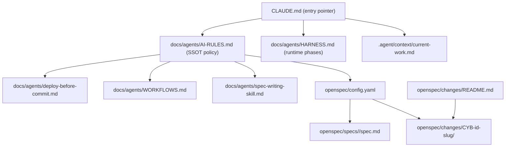
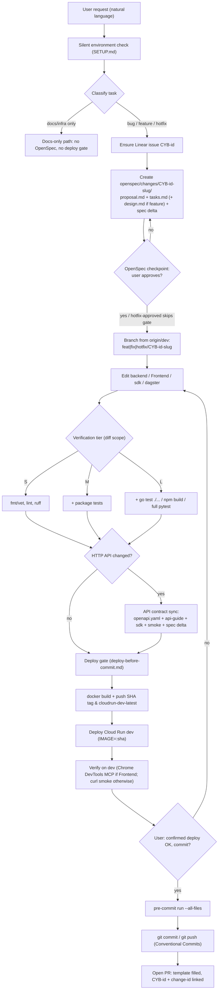
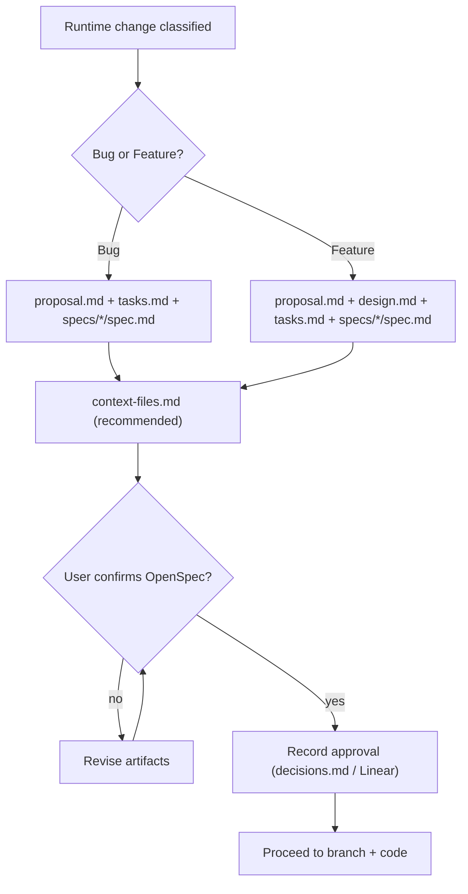
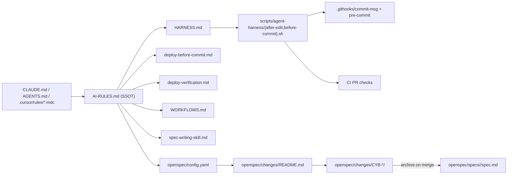

# Agent Workflow & OpenSpec

<cite>
**Referenced Files in This Document**

- [docs/agents/AI-RULES.md](file://docs/agents/AI-RULES.md)
- [docs/agents/HARNESS.md](file://docs/agents/HARNESS.md)
- [docs/agents/deploy-before-commit.md](file://docs/agents/deploy-before-commit.md)
- [openspec/config.yaml](file://openspec/config.yaml)
- [openspec/changes/README.md](file://openspec/changes/README.md)
- [openspec/specs/asset-management/spec.md](file://openspec/specs/asset-management/spec.md)
- [CLAUDE.md](file://CLAUDE.md)
</cite>

## Table of Contents
1. [Introduction](#introduction)
2. [Project Structure](#project-structure)
3. [Core Components](#core-components)
4. [Architecture Overview](#architecture-overview)
5. [Detailed Component Analysis](#detailed-component-analysis)
6. [Dependency Analysis](#dependency-analysis)
7. [Performance Considerations](#performance-considerations)
8. [Troubleshooting Guide](#troubleshooting-guide)
9. [Conclusion](#conclusion)
10. [Appendices](#appendices)

## Introduction

The agent workflow is the governance layer that every AI coding agent (Cursor, Codex, Claude Code, and others) and every human contributor must follow when changing runtime code in `cyber-databrew`. It exists because model memory is unreliable across sessions: a documented, file-backed contract is the only durable source of truth, with Git hooks and CI acting as the hard backstop when an agent forgets a rule.

The contract has two intertwined halves. The first is the **`docs/agents/` rule set** — a single-source-of-truth policy file (`AI-RULES.md`) plus a runtime guardrails file (`HARNESS.md`) and supporting playbooks for setup, deploy, and verification. The second is **OpenSpec** — an *in-repo, Markdown-only* spec-driven change system under `openspec/`. OpenSpec is not a CLI tool to install; it is a directory convention where each runtime change produces a `proposal.md`, `tasks.md`, and a spec delta *before* any application code is written.

The two halves meet at a small number of mandatory gates: a **Linear** issue must exist, an **OpenSpec change directory** must be approved by the user before code is touched, code edits must pass a **verification tier** matched to diff scope, and a **deploy-before-commit** gate must complete a real dev deploy and human approval before `git commit`. This page describes each gate, the artifacts they consume, and how they chain together.

The entry pointer for Claude Code is `CLAUDE.md`, which delegates entirely to `docs/agents/` and instructs the agent to apply the rules automatically without asking the user to "prepare the environment".

**Section sources**
- [CLAUDE.md](file://CLAUDE.md#L1-L23)
- [docs/agents/AI-RULES.md](file://docs/agents/AI-RULES.md#L1-L22)
- [docs/agents/HARNESS.md](file://docs/agents/HARNESS.md#L1-L14)

## Project Structure

The workflow is described by a compact set of files under `docs/agents/` and is exercised against artifacts under `openspec/`. The two trees are deliberately separated: `docs/agents/` holds *policy and runtime phases*, while `openspec/` holds *per-change spec artifacts* and the *baseline specs* they amend.

- **`docs/agents/`** — the rule set.
  - `AI-RULES.md` — the single source of truth: automatic behavior, API contract sync, off-limits zones, rule precedence, verification tiers, and development pitfalls.
  - `HARNESS.md` — portable runtime guardrails: runtime phases (`after-edit`, `before-commit`), failure semantics, and adapter rules per IDE.
  - `deploy-before-commit.md` — the deploy gate sequence (build → push → deploy → verify → approve → commit).
  - `deploy-verification.md`, `SETUP.md`, `WORKFLOWS.md`, `spec-driven-workflow.md`, `spec-writing-skill.md`, `domain.md`, `MCP-POLICY.md`, `SKILLS.md`, `TOOL-ENTRY.md` — supporting playbooks referenced from `AI-RULES.md`.
- **`openspec/`** — the spec-driven change store.
  - `config.yaml` — module list, change-id format, branch naming, required-file matrix per change type, SDK verification commands, the auto-injected planning context, and per-artifact quality rules.
  - `specs/<module>/spec.md` — the four baseline module specs: `asset-management`, `delivery`, `lakehouse`, `search`. These describe *current* system behavior.
  - `changes/CYB-{id}-{slug}/` — one directory per runtime change, holding `proposal.md`, `tasks.md`, an optional `design.md` (required for features), a `specs/<module>/spec.md` delta, and optional `context-files.md` / `decisions.md`.
  - `changes/README.md` — the required-file matrix plus copy-paste templates for `proposal.md`, `tasks.md`, `context-files.md`, and the spec delta.



**Diagram sources**
- [CLAUDE.md](file://CLAUDE.md#L7-L16)
- [docs/agents/AI-RULES.md](file://docs/agents/AI-RULES.md#L37-L43)
- [openspec/config.yaml](file://openspec/config.yaml#L1-L27)

**Section sources**
- [docs/agents/HARNESS.md](file://docs/agents/HARNESS.md#L18-L32)
- [openspec/changes/README.md](file://openspec/changes/README.md#L1-L20)
- [openspec/config.yaml](file://openspec/config.yaml#L1-L35)

## Core Components

The workflow is built from a handful of named components, each defined in a specific file.

#### Automatic behavior (the 8-step loop)

`AI-RULES.md` defines the eight steps an agent runs on every repo task before editing code: silent environment check, task classification, Linear issue, OpenSpec artifacts (then stop for approval), branch, verification after each edit, deploy-before-commit, and PR template. The header is emphatic that users do not run a separate "setup" or "compliance" step — the agent applies the rules automatically and must never imply that deploy, OpenSpec, or hooks are Cursor-only.

**Section sources**
- [docs/agents/AI-RULES.md](file://docs/agents/AI-RULES.md#L9-L22)

#### Runtime phases (HARNESS)

`HARNESS.md` maps the policy onto runtime phases consumed by scripts and hooks: `session-start`, `after-edit` (advisory, `exit 0`), `before-command` (reserved), `before-commit` (hard, `exit 1`), and `stop-check` (reserved). Shared scripts live under `scripts/agent-harness/` (`after-edit.sh`, `before-commit.sh`). The distinction between *advisory* and *hard* failure semantics is the core of the harness: advisory phases print findings but do not block; hard phases exit non-zero and are also wired into Git hooks and CI.

**Section sources**
- [docs/agents/HARNESS.md](file://docs/agents/HARNESS.md#L36-L51)

#### OpenSpec configuration

`openspec/config.yaml` is the machine-readable contract: it lists the four modules (`asset-management`, `delivery`, `lakehouse`, `search`), defines the `CYB-{issue_id}-{slug}` change-id format, the branch-naming convention per change type, the required-file matrix for bug vs feature, the SDK verification tiers, and the per-artifact quality `rules` (for `proposal`, `specs`, `design`, `tasks`, `context_files`). It also carries a large `context:` block that is auto-injected into every AI planning request, summarizing the tech stack, architecture, API surface, module-to-code mapping, and off-limits zones.

**Section sources**
- [openspec/config.yaml](file://openspec/config.yaml#L1-L27)
- [openspec/config.yaml](file://openspec/config.yaml#L140-L169)

#### Baseline specs and change deltas

`openspec/specs/<module>/spec.md` captures *current* behavior in normative `The system SHALL …` language with named Requirements; for example `asset-management` declares Asset CRUD, Tag management, Algorithm lifecycle, and Event emission. A change never edits a baseline spec directly during development — it writes a delta under `openspec/changes/CYB-*/specs/<module>/spec.md` using `## ADDED / MODIFIED / REMOVED Requirements` sections, and the baseline is updated only at the Feature archive step.

**Section sources**
- [openspec/specs/asset-management/spec.md](file://openspec/specs/asset-management/spec.md#L1-L23)
- [openspec/changes/README.md](file://openspec/changes/README.md#L114-L152)

#### The deploy-before-commit gate

`deploy-before-commit.md` is the gate that prevents premature commits. It defines a strict ordered sequence — apply migrations, build the image locally, push both a SHA tag and `cloudrun-dev-latest`, deploy to Cloud Run dev using the SHA-tagged image, verify on dev, wait for explicit user approval, run `pre-commit run --all-files` — and only then permits `git add` / `git commit` / `git push`.

**Section sources**
- [docs/agents/deploy-before-commit.md](file://docs/agents/deploy-before-commit.md#L5-L31)

## Architecture Overview

The end-to-end workflow is a pipeline of gates. A natural-language request flows through classification and Linear traceability into the OpenSpec artifact stage, hits a human approval checkpoint, branches from `dev`, then enters a code-edit/verify loop, and finally passes the deploy gate before the commit and PR are allowed.



**Diagram sources**
- [docs/agents/AI-RULES.md](file://docs/agents/AI-RULES.md#L9-L22)
- [docs/agents/AI-RULES.md](file://docs/agents/AI-RULES.md#L108-L121)
- [docs/agents/deploy-before-commit.md](file://docs/agents/deploy-before-commit.md#L5-L20)
- [openspec/config.yaml](file://openspec/config.yaml#L10-L27)

**Section sources**
- [docs/agents/AI-RULES.md](file://docs/agents/AI-RULES.md#L9-L22)
- [docs/agents/AI-RULES.md](file://docs/agents/AI-RULES.md#L26-L34)

## Detailed Component Analysis

### Task classification and the user-language mapping

The agent never asks the user to "follow the workflow"; instead it infers the path from the request. `AI-RULES.md` provides a table mapping common phrasings to the automatic action: a bug report ("BatchDelete 删完不刷新") infers the bug path; "做 CYB-58 导出 API" loads the issue and takes the feature path including `design.md`; "hotfix 线上 P0" applies the `hotfix-approved` label, skips the OpenSpec gate *only*, still runs deploy verification, and schedules a spec backfill; "只改 README" takes the docs-only path with no OpenSpec for runtime.

The runtime paths that trigger the full workflow are `backend/`, `Frontend/`, `sdk/`, and `dagster/`. Commits use Conventional Commits with a fully lower-case subject line, enforced by CI `commitlint`.

**Section sources**
- [docs/agents/AI-RULES.md](file://docs/agents/AI-RULES.md#L26-L42)

### OpenSpec artifact stage and the approval checkpoint

For any runtime change the agent creates `openspec/changes/CYB-{id}-{slug}/` *before* writing application code. The required-file matrix differs by change type: a **bug** needs `proposal.md`, `tasks.md`, and a `specs/*/spec.md` delta; a **feature** additionally requires `design.md`. This matrix is encoded in both `config.yaml` and `changes/README.md`.

The checkpoint is the most important human-in-the-loop step: when `proposal.md` + `tasks.md` (+ `design.md` for features) are ready, the agent **stops** and asks the user to confirm OpenSpec is OK (e.g. "OpenSpec OK，继续"), and must not edit `backend/`, `Frontend/`, `sdk/`, or `dagster/` until they approve. Approval may be recorded in `decisions.md` or a short Linear comment.



**Diagram sources**
- [docs/agents/AI-RULES.md](file://docs/agents/AI-RULES.md#L16-L16)
- [openspec/config.yaml](file://openspec/config.yaml#L18-L27)
- [openspec/changes/README.md](file://openspec/changes/README.md#L1-L18)

**Section sources**
- [docs/agents/AI-RULES.md](file://docs/agents/AI-RULES.md#L16-L17)
- [openspec/config.yaml](file://openspec/config.yaml#L18-L27)
- [openspec/changes/README.md](file://openspec/changes/README.md#L1-L18)

### Artifact quality rules

`config.yaml` encodes per-artifact quality `rules` the agent must follow when authoring OpenSpec:

- **proposal** — must include Why (≤3 sentences), What Changes (New/Modified Capabilities), Impact, Scope (In/Out), and Success Criteria; Impact lists real directory names; What Changes describes behavior, not API paths or SQL; Capabilities map to module names.
- **specs** — every Requirement carries a Priority (P0/P1/P2) and Rationale, uses `The system SHALL` / `MUST`, uses Given/When/Then scenarios, and has at least one happy-path scenario (plus an error path for complex behavior). Specs describe behavior only — no API paths, field names, or SQL.
- **design** (feature only) — every decision lists Approach, Alternative, and Rationale; includes Architecture Context, Goals/Non-Goals, Affected Modules with real paths, a rollback path when touching data or API contracts, and a Mermaid or ASCII data-flow diagram.
- **tasks** — implementation tasks map 1:1 to spec scenarios; a Deploy verification section is always required; each checkbox tags `[backend]`, `[Frontend]`, or `[sdk]`; granularity is 10–30 minutes per checkbox; tasks are ordered by dependency.
- **context_files** — one path per line in `context-files.md` (optional `# reason`), covering proposal Impact paths, design Affected Modules, and files to read before coding.

**Section sources**
- [openspec/config.yaml](file://openspec/config.yaml#L140-L169)
- [openspec/changes/README.md](file://openspec/changes/README.md#L22-L110)

### Branching and Linear traceability

After the checkpoint passes (or at the start of OpenSpec work), the agent branches from the latest `dev`: `git fetch origin dev && git checkout -b feat/CYB-{id}-… origin/dev`. The branch prefix matches the change type — `fix/`, `feat/`, or `hotfix/` — with legacy `DAT-*` branches still accepted by CI. Every deliverable change must have a Linear issue; the PR body must contain both the Linear ID (`CYB-xxx`) and the OpenSpec change-id, and Linear must be moved to Done after merge with the commit hash.

**Section sources**
- [docs/agents/AI-RULES.md](file://docs/agents/AI-RULES.md#L17-L17)
- [docs/agents/AI-RULES.md](file://docs/agents/AI-RULES.md#L174-L178)
- [openspec/config.yaml](file://openspec/config.yaml#L10-L16)

### Verification tiers

After each accepted edit the agent runs the *highest tier that applies*, scaling the cost of verification to the blast radius of the diff.

| Tier | When | Backend | Frontend | SDK |
|------|------|---------|----------|-----|
| **S — small** | ≤2 files; no router/handler/middleware/OpenAPI; no shared types | `make fmt && make vet` | `npm run lint` | `ruff check` on touched paths |
| **M — medium** | Default; new/changed logic; >2 files or package has tests | Tier S + `go test` on touched packages | Tier S + `npm run test -- --run` | Tier S + `pytest` for touched modules |
| **L — large** | Cross-module; UI routes; any API contract sync; build/config; before PR or deploy | Tier M + `go test ./...` | Tier M + `npm run build` | Tier M + full `pytest tests/unit/` |

Tier **L** is mandatory before opening a PR, before deploy verification, or when touching off-limits-adjacent code. Upgrade triggers bump one tier: changed `go.mod` / `package.json` deps, renamed exported symbols, modified `App.tsx` routes or shared `components/common/*`; any edit under `openspec/specs/` is treated as Tier **L** because it changes baseline behavior. The SDK tier commands are mirrored in `config.yaml` under `verification.sdk` to keep agent and config in sync.

**Section sources**
- [docs/agents/AI-RULES.md](file://docs/agents/AI-RULES.md#L108-L120)
- [openspec/config.yaml](file://openspec/config.yaml#L29-L34)

### API contract sync

Any new or changed HTTP surface — a `routes.go` registration, handler method, JSON body/query/path param, response shape, status code, or auth/idempotency header — triggers the API contract sync, which must land in the *same PR* as the backend change, not a follow-up. The artifacts to sync, checked off in `tasks.md`, include `api/openapi.yaml` (always), `docs/review/api-guide.md` with curl examples and at least one error path (always), the SDK resource client and its unit tests (when the public REST surface changes), a smoke script, the Swagger annotation blocks, the OpenSpec behavior delta (always for runtime features), and the typed frontend client/hook (when the UI calls the API). A backend-only deferral must still cover the OpenAPI, api-guide, smoke, and spec-delta rows at minimum, recorded in `decisions.md` and Linear.

A related rule, **API contract first**, requires defining the response shape in `api/openapi.yaml` and the frontend types *before* writing handler code for a brand-new endpoint, so the handler's `c.JSON()` shape matches the TypeScript type the frontend expects.

**Section sources**
- [docs/agents/AI-RULES.md](file://docs/agents/AI-RULES.md#L44-L73)
- [docs/agents/AI-RULES.md](file://docs/agents/AI-RULES.md#L122-L130)

### The deploy-before-commit gate

The gate forbids `git commit` / `git push` on runtime code until a real dev deploy is verified and the user explicitly approves. The ordered sequence is:

```mermaid
sequenceDiagram
  participant Agent
  participant Dev as Cloud Run dev
  participant User
  Agent->>Dev: 0. apply-migration-dev.sh (if new migrations)
  Agent->>Agent: 1. docker build --platform=linux/amd64 (local, not Cloud Build)
  Agent->>Dev: 2. docker push SHA tag + cloudrun-dev-latest
  Agent->>Dev: 3. deploy IMAGE=:sha (USE_EXISTING_IMAGE=true)
  Agent->>Dev: 4. verify (Chrome DevTools MCP if Frontend; curl smoke otherwise)
  Agent->>User: 5. ask "确认部署 OK，可以 commit 吗?"
  User-->>Agent: affirmative
  Agent->>Agent: 6. pre-commit run --all-files
  Agent->>Agent: git add / commit / push
```

The image must be tagged with the immutable git SHA *and* the mutable `cloudrun-dev-latest`; deploying with only `:cloudrun-dev-latest` defeats rollback. Pushing to `dev` or a feature branch does **not** auto-deploy Cloud Run (Tekton pipelines are gated `on-cel-expression: false`); the agent must either build and deploy locally or comment `/deploy-cloudrun-dev` on a PR.

The gate has explicit exceptions: pure docs (`docs/`, `*.md`, spec-only `openspec/`), CI/Tekton/Actions YAML that does not affect running services, dotfiles like `.gcloudignore`, and test-only files. When in doubt, the change is treated as runtime-affecting.

**Diagram sources**
- [docs/agents/deploy-before-commit.md](file://docs/agents/deploy-before-commit.md#L5-L20)

**Section sources**
- [docs/agents/deploy-before-commit.md](file://docs/agents/deploy-before-commit.md#L5-L31)
- [docs/agents/deploy-before-commit.md](file://docs/agents/deploy-before-commit.md#L33-L51)
- [docs/agents/deploy-before-commit.md](file://docs/agents/deploy-before-commit.md#L155-L163)

### Off-limits zones and rule precedence

Some paths require explicit user approval and a second reviewer to touch: `backend/internal/middleware/auth*`, `backend/internal/outbox/`, `backend/migrations/`, `.env*` and credential files, and `schemas/pg-phase0.sql`. The `hotfix-approved` label does **not** waive off-limits protection.

When rules appear to conflict, the agent applies the first matching row of the precedence table — user explicit instruction (highest), then safety & secrets, off-limits zones, deploy-before-commit, OpenSpec/Linear traceability, CI hard gates, and the default workflow (lowest). Resolutions are recorded in `decisions.md` (or the PR body for a hotfix without a change dir).

**Section sources**
- [docs/agents/AI-RULES.md](file://docs/agents/AI-RULES.md#L75-L107)
- [openspec/config.yaml](file://openspec/config.yaml#L133-L138)

## Dependency Analysis

The rule files form a layered dependency: tool entry pointers depend on the policy, the policy references the playbooks, and the playbooks reference the OpenSpec store. The hard backstop (Git hooks + CI) consumes the same `scripts/agent-harness/` scripts referenced by `HARNESS.md`.



The adapter rule is strict: tool entry files (`CLAUDE.md`, `AGENTS.md`, `.cursor/rules/*.mdc`) must be thin pointers and must not copy policy paragraphs; `.claude/` paths must never be made required for the core workflow. This keeps `docs/agents/` as the only place behavior changes.

**Diagram sources**
- [docs/agents/HARNESS.md](file://docs/agents/HARNESS.md#L18-L65)
- [docs/agents/AI-RULES.md](file://docs/agents/AI-RULES.md#L37-L43)

**Section sources**
- [docs/agents/HARNESS.md](file://docs/agents/HARNESS.md#L9-L14)
- [docs/agents/HARNESS.md](file://docs/agents/HARNESS.md#L55-L65)
- [docs/agents/AI-RULES.md](file://docs/agents/AI-RULES.md#L163-L172)

## Performance Considerations

The workflow is designed so verification cost scales with risk rather than being uniform. The verification tier system explicitly avoids running a full build on a one-line fix — Tier S runs only format/lint, and only cross-module or API-contract changes escalate to the expensive `go test ./...` / `npm run build` / full `pytest` of Tier L. This keeps the inner edit loop fast while guaranteeing heavy checks before a PR or deploy.

On the deploy side, the gate prefers **local `docker build`** over `gcloud builds submit` because the repo has no `.gcloudignore`, so Cloud Build would upload a large tarball and be slow. On ARM machines, `--platform=linux/amd64` is required so the image matches Cloud Run's architecture, and on Docker Desktop + BuildKit `--output=type=docker` forces a single-platform manifest Cloud Run can accept. The dual-tag scheme (immutable SHA + mutable `cloudrun-dev-latest`) trades a second push for fast, reliable rollback via `gcloud run services update-traffic` to a previously deployed revision.

The auto-injected `context:` block in `config.yaml` front-loads the stack, architecture, and module map into every planning request so the agent does not re-derive them, reducing wasted exploration before it can write a proposal.

**Section sources**
- [docs/agents/AI-RULES.md](file://docs/agents/AI-RULES.md#L108-L120)
- [docs/agents/deploy-before-commit.md](file://docs/agents/deploy-before-commit.md#L8-L13)
- [openspec/config.yaml](file://openspec/config.yaml#L36-L44)

## Troubleshooting Guide

The `Development pitfalls` section of `AI-RULES.md` records field incidents that should inform future work. The most common failure modes for this workflow area:

- **Commit message claims a change the diff lacks (P1).** Tab-heavy Go edits (switch/struct) can silently drop a line when the edit tool fails on indentation. Run `git diff --stat` and spot-check actual line changes, not just "build passes".
- **Invalid test payloads mask the real bug (P2).** A payload that violates a DB CHECK constraint (e.g. `chk_lifecycle_state`) produces a DB error that hides the behavior under test. Look up valid values from the model layer or migration first.
- **Stale image deployed (P3).** `docker build` uses the working tree but the SHA tag should match HEAD; confirm `git rev-parse --short HEAD` before building.
- **PR merge fails when base branch is in another worktree (P4).** Use `gh pr merge --auto` so GitHub's API performs the merge.
- **Generic smoke doesn't prove the change (P5).** After deploy, curl with a known-bad payload that exercises the new code path — one happy path plus one error path per change.
- **`end-of-file-fixer` pre-commit failure (P7).** Files must end with exactly one newline and no trailing blank lines; run `pre-commit run end-of-file-fixer --all-files` before committing.

Additional process failures to watch for: shipping a backend handler while leaving OpenAPI/api-guide/SDK empty is a *process failure* (the CYB-1014-style gap), and deploying code that references new columns before applying the migration causes runtime 500s — apply the migration to dev first and run a smoke query.

A `decisions.md` entry is mandatory when resolving a precedence conflict, touching off-limits, downgrading to Tier S under time pressure, deferring deploy verification with written user approval, or when Chrome DevTools MCP is unavailable while the diff touches `Frontend/`.

**Section sources**
- [docs/agents/AI-RULES.md](file://docs/agents/AI-RULES.md#L195-L232)
- [docs/agents/AI-RULES.md](file://docs/agents/AI-RULES.md#L141-L151)
- [docs/agents/deploy-before-commit.md](file://docs/agents/deploy-before-commit.md#L159-L163)

## Conclusion

The agent workflow turns an unreliable-by-default coding agent into a governed contributor. Policy lives in one place (`docs/agents/AI-RULES.md`), the harness maps it onto runtime phases with advisory and hard enforcement, and OpenSpec keeps every runtime change traceable from a Linear issue through a reviewed proposal, a behavior-only spec delta, and a 1:1 task list. The verification tiers and the deploy-before-commit gate ensure that "done" means *verified on dev and approved by a human*, not merely "compiles". An agent that internalizes the eight-step loop, the OpenSpec checkpoint, the right verification tier, and the deploy gate satisfies the repository's governance without the user ever invoking a ritual.

## Appendices

### Appendix A — OpenSpec modules and change-id

| Field | Value | Source |
|-------|-------|--------|
| Modules | `asset-management`, `delivery`, `lakehouse`, `search` | `config.yaml` `modules` |
| Change-id format | `CYB-{issue_id}-{slug}` | `config.yaml` `conventions.change_id_format` |
| Branch (bug) | `fix/CYB-{id}-{slug}` | `config.yaml` `branch_naming.bug` |
| Branch (feature) | `feat/CYB-{id}-{slug}` | `config.yaml` `branch_naming.feature` |
| Branch (hotfix) | `hotfix/CYB-{id}-{slug}` | `config.yaml` `branch_naming.hotfix` |
| Legacy branch | `DAT-{id}` accepted by CI only | `config.yaml` `branch_naming_legacy` |

**Section sources**
- [openspec/config.yaml](file://openspec/config.yaml#L4-L17)

### Appendix B — Required-file matrix per change type

| File | Bug | Feature |
|------|-----|---------|
| `proposal.md` | yes | yes |
| `tasks.md` | yes | yes |
| `specs/<module>/spec.md` (delta) | yes | yes |
| `design.md` | optional | required |
| `context-files.md` | recommended | recommended |
| `decisions.md` | when needed | when needed |

**Section sources**
- [openspec/changes/README.md](file://openspec/changes/README.md#L5-L18)
- [openspec/config.yaml](file://openspec/config.yaml#L18-L27)

### Appendix C — Runtime phases and failure semantics

| Phase | Script (when wired) | Default severity |
|-------|---------------------|------------------|
| `session-start` | optional adapter | Informational |
| `after-edit` | `scripts/agent-harness/after-edit.sh` | Advisory (`exit 0`) |
| `before-command` | reserved | Adapter-defined |
| `before-commit` | `scripts/agent-harness/before-commit.sh` | Hard (`exit 1`) |
| `stop-check` | reserved | Adapter-defined |

**Section sources**
- [docs/agents/HARNESS.md](file://docs/agents/HARNESS.md#L36-L51)

### Appendix D — Spec delta vocabulary

A change's `specs/<module>/spec.md` uses three section headers to amend the baseline:

- `## ADDED Requirements` — a new `### Requirement:` with Priority, Rationale, and Given/When/Then scenarios.
- `## MODIFIED Requirements` — a Before/After pair plus Reason and the modified scenario.
- `## REMOVED Requirements` — a `Was`/`Reason` pair.

Baseline specs themselves use plain `### Requirement:` headings with `The system SHALL …` statements, as seen in `asset-management` (Asset CRUD, Tag management, Algorithm lifecycle, Event emission).

**Section sources**
- [openspec/changes/README.md](file://openspec/changes/README.md#L114-L152)
- [openspec/specs/asset-management/spec.md](file://openspec/specs/asset-management/spec.md#L7-L23)
