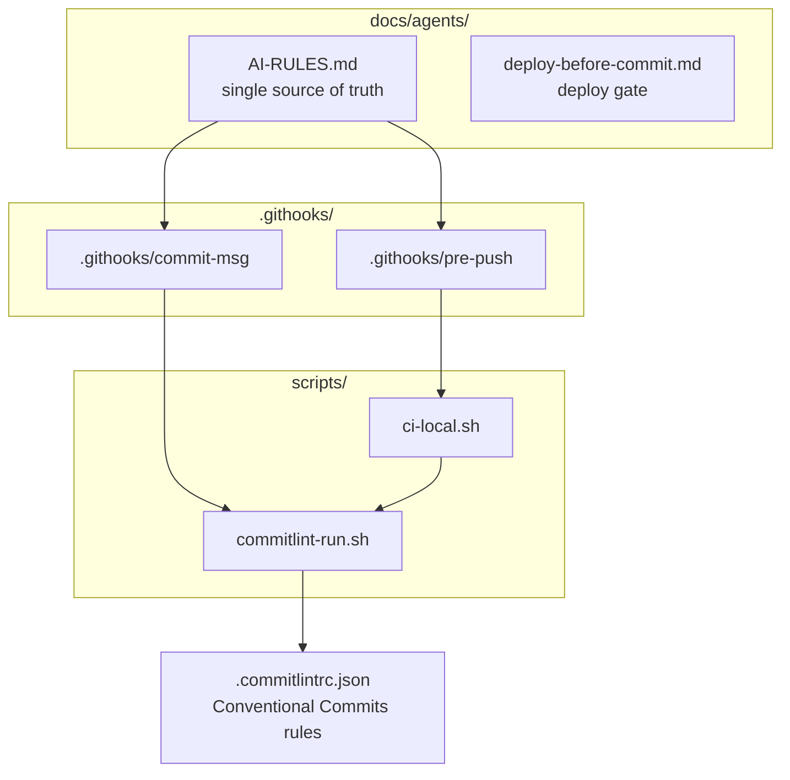
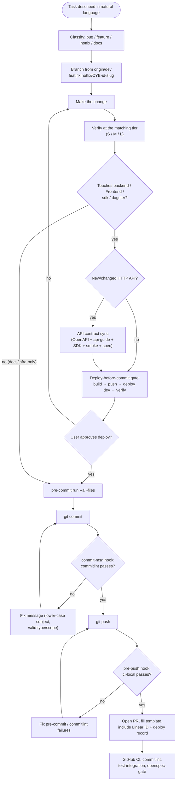
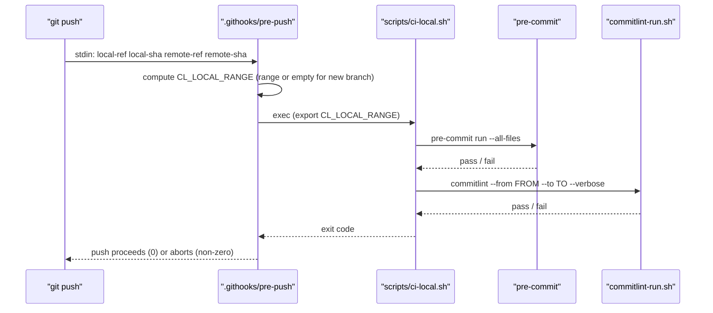
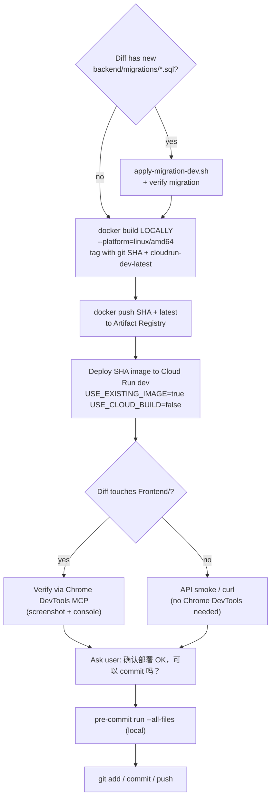
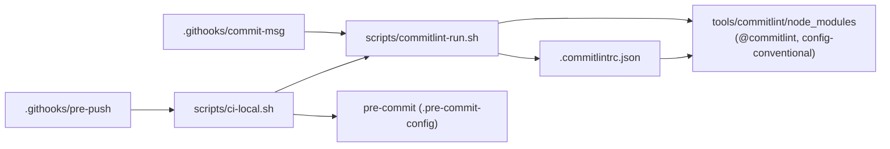

# Contributing Guide

<cite>
**Referenced Files in This Document**

- [docs/agents/AI-RULES.md](file://docs/agents/AI-RULES.md)
- [docs/agents/deploy-before-commit.md](file://docs/agents/deploy-before-commit.md)
- [.githooks/commit-msg](file://.githooks/commit-msg)
- [.githooks/pre-push](file://.githooks/pre-push)
- [scripts/commitlint-run.sh](file://scripts/commitlint-run.sh)
- [scripts/ci-local.sh](file://scripts/ci-local.sh)
- [.commitlintrc.json](file://.commitlintrc.json)
</cite>

## Table of Contents
1. [Introduction](#introduction)
2. [Project Structure](#project-structure)
3. [Core Components](#core-components)
4. [Architecture Overview](#architecture-overview)
5. [Detailed Component Analysis](#detailed-component-analysis)
6. [Dependency Analysis](#dependency-analysis)
7. [Performance Considerations](#performance-considerations)
8. [Troubleshooting Guide](#troubleshooting-guide)
9. [Conclusion](#conclusion)
10. [Appendices](#appendices)

## Introduction

This page is the contributor's reference for landing a change in
`cyber-databrew`. It describes the full lifecycle a change travels — from
choosing a branch name, through making the edit, to the two enforcement points
that every commit must pass: the **`commit-msg`** hook (which runs `commitlint`)
and the **`pre-push`** hook (which runs a local slice of CI). It also covers the
two policy gates that the repository treats as non-negotiable for runtime work:
the **API-contract-sync rule** and the **deploy-before-commit gate**.

The intended audience is anyone — human engineer or AI agent — making a change
to the runtime modules (`backend/`, `Frontend/`, `sdk/`, `dagster/`) or to the
supporting docs and infrastructure. The authoritative behavior is defined in
[`docs/agents/AI-RULES.md`](file://docs/agents/AI-RULES.md), which is the single
source of truth for all automated and manual contribution behavior; tool-specific
entry files only point at it.

Two principles drive everything below. First, **the commit is the last action,
not the first**: a runtime change is deployed to dev and verified before it is
committed. Second, **the contract travels with the code**: a new or changed HTTP
API ships its OpenAPI, api-guide, SDK, and smoke-test updates in the *same* PR,
never as a follow-up.

**Section sources**
- [docs/agents/AI-RULES.md](file://docs/agents/AI-RULES.md#L1-L43)
- [docs/agents/deploy-before-commit.md](file://docs/agents/deploy-before-commit.md#L1-L21)

## Project Structure

The contribution machinery lives in three places: the rule documents under
`docs/agents/`, the git hooks under `.githooks/`, and the helper scripts under
`scripts/`. The hooks are repo-local — they are activated by pointing Git at the
`.githooks/` directory (`git config core.hooksPath .githooks`), which the silent
environment check performs automatically.

- **`docs/agents/AI-RULES.md`** — the single source of truth for the workflow:
  branch naming, commit format, verification tiers, API-contract-sync, off-limits
  zones, and rule precedence.
- **`docs/agents/deploy-before-commit.md`** — the deploy gate: build → push →
  deploy dev → verify → wait for approval → only then commit.
- **`.githooks/commit-msg`** — invoked by Git after a commit message is written;
  delegates to `commitlint` via `scripts/commitlint-run.sh`.
- **`.githooks/pre-push`** — invoked by Git before a push completes; delegates to
  `scripts/ci-local.sh` to run pre-commit hooks and `commitlint` over the push
  range.
- **`scripts/commitlint-run.sh`** — bootstraps and runs the pinned `commitlint`
  binary using the rules in `.commitlintrc.json`.
- **`scripts/ci-local.sh`** — runs `pre-commit run --all-files` and `commitlint`
  over the pushed commit range (and, with `--full`, backend/frontend test suites).
- **`.commitlintrc.json`** — the Conventional Commits ruleset enforced both
  locally and in CI.



**Diagram sources**
- [.githooks/commit-msg](file://.githooks/commit-msg#L1-L19)
- [.githooks/pre-push](file://.githooks/pre-push#L1-L29)
- [scripts/ci-local.sh](file://scripts/ci-local.sh#L38-L63)

**Section sources**
- [docs/agents/AI-RULES.md](file://docs/agents/AI-RULES.md#L9-L22)
- [.githooks/commit-msg](file://.githooks/commit-msg#L1-L19)
- [.githooks/pre-push](file://.githooks/pre-push#L1-L29)

## Core Components

The contribution workflow is composed of four enforcement components and the
documents that define them.

#### Branch naming

Every change starts on a dedicated branch named after its Linear issue. The
canonical prefixes are `fix/CYB-{id}-*`, `feat/CYB-{id}-*`, and
`hotfix/CYB-{id}-*`; legacy `DAT-*` identifiers are still accepted by CI. Branches
are always created from the latest `dev` so parallel CYB work does not collide:
`git fetch origin dev && git checkout -b feat/CYB-{id}-… origin/dev`.

#### Commit message format (commitlint)

Commit messages follow **Conventional Commits** — `type(scope): description` —
and the subject (first line) must be entirely lower-case. The exact rules are
encoded in [`.commitlintrc.json`](file://.commitlintrc.json) and enforced by the
`commit-msg` hook locally and by the `commitlint` job in CI. The allowed `type`
values are `feat`, `fix`, `docs`, `refactor`, `test`, `chore`, `ci`, and `perf`;
the recommended `scope` values are `backend`, `frontend`, `sdk`, `docs`,
`dagster`, `deploy`, and `api`.

#### The git hooks

`.githooks/commit-msg` validates the message you just wrote. `.githooks/pre-push`
runs a fast local CI slice (pre-commit + commitlint over the push range) before
the push leaves your machine. Both hooks delegate to scripts so the local rules
match CI exactly.

#### API contract sync and the deploy gate

For runtime changes, two policy gates bracket the commit: the **API-contract-sync
rule** requires the OpenAPI, api-guide, SDK, smoke-test, and spec artifacts to be
updated in the same PR as any HTTP-surface change; the **deploy-before-commit
gate** requires the change to be deployed to dev and verified, with explicit user
approval, before `git commit` runs.

**Section sources**
- [docs/agents/AI-RULES.md](file://docs/agents/AI-RULES.md#L17-L18)
- [docs/agents/AI-RULES.md](file://docs/agents/AI-RULES.md#L39-L42)
- [.commitlintrc.json](file://.commitlintrc.json#L1-L9)
- [.githooks/commit-msg](file://.githooks/commit-msg#L1-L19)
- [.githooks/pre-push](file://.githooks/pre-push#L1-L29)

## Architecture Overview

The end-to-end contribution flow chains the branch, the local edit-verify loop,
the `commit-msg` hook, the `pre-push` hook, and finally the PR. The deploy gate
sits *before* the commit for any runtime change, while the two hooks gate the
commit and the push respectively.



**Diagram sources**
- [docs/agents/AI-RULES.md](file://docs/agents/AI-RULES.md#L9-L22)
- [docs/agents/deploy-before-commit.md](file://docs/agents/deploy-before-commit.md#L5-L20)
- [.githooks/commit-msg](file://.githooks/commit-msg#L11-L19)
- [.githooks/pre-push](file://.githooks/pre-push#L11-L29)

**Section sources**
- [docs/agents/AI-RULES.md](file://docs/agents/AI-RULES.md#L9-L22)
- [docs/agents/deploy-before-commit.md](file://docs/agents/deploy-before-commit.md#L1-L31)

## Detailed Component Analysis

### Branch naming

Branch names encode the change type and the Linear traceability ID. The
`AI-RULES.md` "Branch" step requires one of three prefixes and a CYB identifier,
and it requires branching from the latest `dev`:

| Change type | Prefix | Example |
|-------------|--------|---------|
| Bug fix | `fix/CYB-{id}-*` | `fix/CYB-58-batchdelete-refresh` |
| Feature | `feat/CYB-{id}-*` | `feat/CYB-58-export-api` |
| Hotfix | `hotfix/CYB-{id}-*` | `hotfix/CYB-901-p0-auth` |

The legacy `DAT-*` prefix is still accepted by CI for older work. The branch is
created when OpenSpec work begins, or immediately after the OpenSpec checkpoint
passes for a feature. Branching from `origin/dev` (rather than a stale local
branch) is explicit so that concurrent CYB work merges cleanly.

**Section sources**
- [docs/agents/AI-RULES.md](file://docs/agents/AI-RULES.md#L17-L17)

### Commit message conventions (commitlint)

The commit format is **Conventional Commits**: `type(scope): description`. The
rules are defined declaratively in `.commitlintrc.json`, which extends
`@commitlint/config-conventional` and overrides four rules:

```json
{
  "extends": ["@commitlint/config-conventional"],
  "rules": {
    "type-enum": [2, "always", ["feat", "fix", "docs", "refactor", "test", "chore", "ci", "perf"]],
    "scope-enum": [1, "always", ["backend", "frontend", "sdk", "docs", "dagster", "deploy", "api"]],
    "subject-case": [2, "always", "lower-case"],
    "header-max-length": [2, "always", 100]
  }
}
```

Reading the rule severities (the leading number — `2` = error, `1` = warning):

- **`type-enum` (error)** — the type must be one of the eight listed values. An
  unknown type such as `feature:` or `bugfix:` fails the commit.
- **`scope-enum` (warning)** — the scope, if present, should be one of the seven
  module names. A non-listed scope warns but does not block.
- **`subject-case` (error)** — the subject must be **entirely lower-case**. This
  is the rule contributors most often hit: write `feat(cel): add operator`, not
  `feat(CEL): Add operator`. Acronyms are fine in the commit *body*, just not in
  the subject line.
- **`header-max-length` (error)** — the header (first line) must be ≤ 100
  characters.

`AI-RULES.md` restates the lower-case-subject requirement explicitly because it is
the most common CI failure: write `cel` / `api`, not `CEL` / `API`.

Examples:

```text
feat(api): add customer export endpoint
fix(backend): guard nil pipeline on backfill
docs(sdk): align examples with actual surface
```

**Section sources**
- [.commitlintrc.json](file://.commitlintrc.json#L1-L9)
- [docs/agents/AI-RULES.md](file://docs/agents/AI-RULES.md#L40-L40)

### The `commit-msg` hook

The `commit-msg` hook runs every time you create a commit, after the message is
written. It receives the path to the message file as `$1`, reads the first line,
and short-circuits with success for Git-generated messages (`Merge`, `Revert`,
`fixup!`, `squash!`) — commitlint does not apply to those. For all other
messages it execs `scripts/commitlint-run.sh --edit "${MSG_FILE}"`, which runs
`commitlint` against the message:

```bash
FIRST_LINE="$(sed -n '1p' "${MSG_FILE}" | tr -d '\r')"

# Git-generated messages (commitlint does not apply).
if [[ "${FIRST_LINE}" =~ ^(Merge|Revert|fixup!|squash!) ]]; then
  exit 0
fi

ROOT="$(git rev-parse --show-toplevel)"
exec "${ROOT}/scripts/commitlint-run.sh" --edit "${MSG_FILE}"
```

Because the hook uses `set -euo pipefail` and `exec`s the runner, a non-zero exit
from `commitlint` aborts the commit. The hook is repo-local — it only fires once
Git's `core.hooksPath` points at `.githooks/`.

**Section sources**
- [.githooks/commit-msg](file://.githooks/commit-msg#L1-L19)

### `commitlint-run.sh` — the shared runner

Both the `commit-msg` hook and `ci-local.sh` route through
`scripts/commitlint-run.sh`, guaranteeing the local rules match CI. The runner
points at a pinned `commitlint` binary under `tools/commitlint/node_modules/.bin`.
On the first run, if the binary is missing, it bootstraps it with `npm ci`
(falling back to `npm install`); it requires Node.js 20+ with `npm`. It then sets
`NODE_PATH` so the `extends` in `.commitlintrc.json` resolves from
`tools/commitlint/node_modules`, `cd`s to the repo root, and execs the binary with
whatever arguments it was given (`--edit FILE` from the hook, or `--from/--to`
from CI-local):

```bash
TOOLS="${ROOT}/tools/commitlint"
BIN="${TOOLS}/node_modules/.bin/commitlint"
# ...bootstrap if missing...
export NODE_PATH="${TOOLS}/node_modules${NODE_PATH:+:${NODE_PATH}}"
cd "${ROOT}"
exec "${BIN}" "$@"
```

**Section sources**
- [scripts/commitlint-run.sh](file://scripts/commitlint-run.sh#L1-L22)

### The `pre-push` hook and `ci-local.sh`

The `pre-push` hook runs the same checks CI runs, before the push leaves your
machine, so you get fast feedback instead of waiting on GitHub. It can be
bypassed for emergencies with `SKIP_PREPUSH=1 git push`, but that simply defers
the failure to CI.

Git feeds the hook one line per ref on stdin in the format
`<local-ref> <local-sha> <remote-ref> <remote-sha>`. The hook reads the first ref
to compute the commit range being pushed and exports it as `CL_LOCAL_RANGE`:

- If the remote SHA is all zeros, the branch is new, so `CL_LOCAL_RANGE` is left
  empty and `ci-local.sh` falls back to `merge-base..HEAD`.
- Otherwise `CL_LOCAL_RANGE` becomes `${REMOTE_SHA}..${LOCAL_SHA}` — exactly the
  commits being pushed.

It then execs `scripts/ci-local.sh`:

```bash
export CL_LOCAL_RANGE
ROOT="$(git rev-parse --show-toplevel)"
exec "${ROOT}/scripts/ci-local.sh"
```

`ci-local.sh` runs in `quick` mode by default. It first runs
`pre-commit run --all-files --show-diff-on-failure` (the same hooks CI runs:
trailing whitespace, end-of-file-fixer, YAML/JSON validation, secrets scan, etc.),
then runs `commitlint` over the resolved commit range. When `CL_LOCAL_RANGE` is
set it splits it into `FROM_SHA..TO_SHA`; otherwise it derives the base from
`origin/main` (or `CI_LOCAL_BASE`) and uses `merge-base..HEAD`:



With `--full`, `ci-local.sh` additionally runs `go vet ./...` + `go test` in
`backend/` and `npm run lint`/`build`/`test` in `Frontend/`, matching the heavier
CI parity. The `quick` mode is what the `pre-push` hook invokes.

**Diagram sources**
- [.githooks/pre-push](file://.githooks/pre-push#L11-L29)
- [scripts/ci-local.sh](file://scripts/ci-local.sh#L38-L63)

**Section sources**
- [.githooks/pre-push](file://.githooks/pre-push#L1-L29)
- [scripts/ci-local.sh](file://scripts/ci-local.sh#L1-L85)

### API contract sync (mandatory)

The rule triggers whenever a change adds or modifies anything exposed over
HTTP: a new route registration, a handler method, a JSON body/query/path
parameter, a response shape, a status code, or an auth/idempotency header
requirement. Backend-only handler work with "document SDK later" is treated as a
**process failure** (the CYB-1014 pattern).

The following artifacts must be synced in the *same* PR, and checked off in the
change's `tasks.md`:

| # | File / area | Required when | What to update |
|---|-------------|---------------|----------------|
| 1 | `api/openapi.yaml` | Always | paths, schemas, parameters, request/response bodies, error envelope |
| 2 | `docs/review/api-guide.md` | Always | `curl` examples, headers, success + ≥1 error path, validation notes |
| 3 | `sdk/src/cyber_databrew_sdk/` | New/changed public REST surface | resource client module + `client.py`/`__init__.py` exports |
| 4 | `sdk/tests/unit/` | SDK client added/changed | unit tests (mock HTTP) |
| 5 | `scripts/api-guide-smoke.sh` or `scripts/smoke-<feature>-dev.sh` | Always | happy path + one error path per new endpoint |
| 6 | `backend/internal/handlers/*/*.go` | Swagger generation used | `@Summary`/`@Router`/`@Param` blocks |
| 7 | `openspec/changes/CYB-*/specs/*/spec.md` | Always (runtime feature) | behavior delta (Given/When/Then) |
| 8 | `Frontend/src/api/` or hooks | UI calls the new API | typed client/hook aligned with OpenAPI |

A companion rule, **API contract first**, requires defining the response shape in
`api/openapi.yaml` and the frontend types *before* writing the handler, so the
backend `c.JSON()` shape matches the TypeScript type the frontend expects. If an
issue explicitly defers SDK or Frontend, the deferral is recorded in
`decisions.md` and Linear, and rows 1, 2, 5, and 7 remain the minimum.

**Section sources**
- [docs/agents/AI-RULES.md](file://docs/agents/AI-RULES.md#L44-L73)
- [docs/agents/AI-RULES.md](file://docs/agents/AI-RULES.md#L122-L130)

### Deploy-before-commit gate

For any change to `backend/`, `Frontend/`, `sdk/`, or `dagster/`, you MUST NOT
run `git commit` or `git push` until the deploy sequence has completed and the
user has explicitly approved. The sequence is:



Key constraints from the gate:

- **Build locally with `docker build`**, not Cloud Build. Tag with the immutable
  git SHA *and* push `cloudrun-dev-latest`; never push only `:cloudrun-dev-latest`
  without a SHA tag (you would lose rollback ability).
- **Deploy the SHA-tagged image** to Cloud Run dev, then record the revision name,
  service URL, and image tag for the PR.
- **Verify on dev** per `deploy-verification.md`: a `Frontend/` diff must be
  verified via Chrome DevTools MCP; backend/sdk-only changes need only API
  smoke/curl.
- **Wait for explicit user approval** before any `git add`/`commit`/`push`.
- **Run `pre-commit run --all-files` locally** after approval but before
  `git add`, to catch what CI's pre-commit would catch.

The gate has **exceptions**: changes scope-isolated to non-runtime artifacts may
commit without deploying — pure docs under `docs/`/`*.md`/`openspec/`, CI/Tekton/
GitHub-Actions YAML that does not affect running services, `.gcloudignore`/
`.dockerignore`/`.gitignore`, and test-only files. When in doubt, treat the change
as runtime-affecting and follow the full gate.

**Section sources**
- [docs/agents/deploy-before-commit.md](file://docs/agents/deploy-before-commit.md#L1-L31)
- [docs/agents/deploy-before-commit.md](file://docs/agents/deploy-before-commit.md#L155-L163)

## Dependency Analysis

The hooks, scripts, and config form a single dependency chain that converges on
one ruleset, so the local commit/push experience is identical to CI.



External and internal dependencies:

- **Node.js 20+ and npm** — required by `commitlint-run.sh` to install and run the
  pinned `commitlint` binary under `tools/commitlint/`.
- **`pre-commit`** — required by `ci-local.sh`; the script prints an install hint
  (`pip install pre-commit==3.7.1`) if it is missing.
- **`git config core.hooksPath .githooks`** — the activation point; without it,
  neither hook fires. The silent environment check sets this automatically.
- **`go`, `npm`** — only needed for `ci-local.sh --full` (backend tests, frontend
  lint/build/test); the default `quick` mode and the `pre-push` hook do not need
  them.

**Diagram sources**
- [.githooks/commit-msg](file://.githooks/commit-msg#L18-L19)
- [.githooks/pre-push](file://.githooks/pre-push#L27-L29)
- [scripts/ci-local.sh](file://scripts/ci-local.sh#L33-L63)
- [scripts/commitlint-run.sh](file://scripts/commitlint-run.sh#L6-L22)

**Section sources**
- [scripts/ci-local.sh](file://scripts/ci-local.sh#L1-L85)
- [scripts/commitlint-run.sh](file://scripts/commitlint-run.sh#L1-L22)

## Performance Considerations

The local hooks are designed to fail fast and cheap:

- **`commit-msg`** does no network or test work — it lints a single message
  string, so its cost is dominated by `commitlint` startup. After the first run
  installs `tools/commitlint`, subsequent runs reuse the cached `node_modules`.
- **`pre-push`** runs `ci-local.sh` in **`quick`** mode (pre-commit + commitlint
  over only the pushed range), typically ~1–3 minutes, deliberately *not* the
  full backend/frontend suites. The heavy `--full` parity (`go test ./...`,
  `npm run build`) is opt-in for local pre-PR confidence and is what CI runs
  exhaustively.
- **Push-range scoping** — `pre-push` computes `CL_LOCAL_RANGE` from the actual
  commits being pushed, so `commitlint` only lints new commits, not the entire
  branch history.
- **Verification tiers** — `AI-RULES.md` defines S/M/L tiers so a one-line fix
  runs only `make fmt && make vet`, while an API-contract change runs the full
  Tier L (`go test ./...`, `npm run build`, full `pytest`). Always run Tier L
  before opening a PR or deploying.
- **`SKIP_PREPUSH=1`** bypasses the pre-push hook for emergencies; the cost is
  simply that failures surface later, in CI.

**Section sources**
- [scripts/ci-local.sh](file://scripts/ci-local.sh#L14-L44)
- [scripts/ci-local.sh](file://scripts/ci-local.sh#L65-L85)
- [docs/agents/AI-RULES.md](file://docs/agents/AI-RULES.md#L108-L120)

## Troubleshooting Guide

#### `commit-msg` hook rejects my commit

The most common cause is a non-lower-case subject. `subject-case` is an error-level
rule, so `fix(API): Handle nil` fails — rewrite it as `fix(api): handle nil`. Other
causes: an unknown `type` (only the eight enum values are allowed), or a header
longer than 100 characters. Run `bash scripts/commitlint-run.sh --edit .git/COMMIT_EDITMSG`
to see the exact violation.

#### "commitlint-run: install Node.js 20+ (npm required)"

`commitlint-run.sh` needs `npm` to bootstrap `tools/commitlint`. Install Node.js
20+, then re-run; the first run installs the binary via `npm ci`/`npm install`.

#### `pre-push` aborts with a pre-commit failure

`ci-local.sh` runs `pre-commit run --all-files`. Frequent failures are
trailing whitespace, files not ending in exactly one newline
(`end-of-file-fixer`), and YAML/JSON parse errors. Fix the reported files and
re-push; the hook output includes the diff (`--show-diff-on-failure`). Files must
end with exactly one newline and no trailing blank lines — this is a recurring CI
failure called out in the development pitfalls.

#### "no origin/main for commitlint"

When pushing a new branch with no upstream base, `ci-local.sh` derives the base
from `origin/main` (or `CI_LOCAL_BASE`). If neither resolves it errors — fetch the
base branch (`git fetch origin main`) or set `CI_LOCAL_BASE=origin/your-base`.

#### I need to push urgently and the hook is blocking

Use `SKIP_PREPUSH=1 git push`. This bypasses only the local pre-push slice; CI
still runs the same checks, so a real violation will block the PR. Prefer fixing
the issue locally.

#### "Container manifest type must support amd64/linux" on deploy

A BuildKit multi-platform OCI index was pushed. Rebuild with
`--platform=linux/amd64` (and `--output=type=docker` on Docker Desktop + BuildKit)
so Cloud Run gets a single-platform manifest. See the deploy gate.

#### CI flags a missing SDK / OpenAPI update on a backend PR

This is the API-contract-sync rule firing. A new or changed HTTP surface must
update OpenAPI, the api-guide, the SDK, smoke tests, and the spec in the *same*
PR. Update the rows listed in the contract-sync table and check them off in
`tasks.md`.

**Section sources**
- [.commitlintrc.json](file://.commitlintrc.json#L1-L9)
- [scripts/commitlint-run.sh](file://scripts/commitlint-run.sh#L10-L17)
- [scripts/ci-local.sh](file://scripts/ci-local.sh#L33-L62)
- [docs/agents/AI-RULES.md](file://docs/agents/AI-RULES.md#L229-L232)
- [docs/agents/deploy-before-commit.md](file://docs/agents/deploy-before-commit.md#L8-L8)

## Conclusion

Contributing to `cyber-databrew` follows a single, enforced path: branch from
`dev` with a `CYB-`identified prefix, make the change, verify at the matching
tier, sync the API contract if any HTTP surface moved, deploy to dev and get
approval (the deploy-before-commit gate), then commit and push. Two repo-local
hooks make the local experience match CI: `commit-msg` runs `commitlint`
(lower-case subject, enum types/scopes, ≤100-char header), and `pre-push` runs
`ci-local.sh` (pre-commit + commitlint over the push range). Because both hooks
delegate to the same scripts and the same `.commitlintrc.json` that CI uses, a
commit that passes locally passes the corresponding CI gates.

## Appendices

### Appendix A — commitlint rules (`.commitlintrc.json`)

| Rule | Level | Value | Effect |
|------|-------|-------|--------|
| `type-enum` | 2 (error) | feat, fix, docs, refactor, test, chore, ci, perf | Type must be one of these |
| `scope-enum` | 1 (warn) | backend, frontend, sdk, docs, dagster, deploy, api | Scope should be one of these |
| `subject-case` | 2 (error) | lower-case | Subject must be entirely lower-case |
| `header-max-length` | 2 (error) | 100 | First line ≤ 100 chars |

(Severity: `2` = error/blocks, `1` = warning, `0` = disabled.)

**Section sources**
- [.commitlintrc.json](file://.commitlintrc.json#L1-L9)

### Appendix B — branch prefixes

| Prefix | Use |
|--------|-----|
| `feat/CYB-{id}-*` | New feature |
| `fix/CYB-{id}-*` | Bug fix |
| `hotfix/CYB-{id}-*` | Production hotfix |
| `DAT-*` | Legacy identifiers (still accepted by CI) |

**Section sources**
- [docs/agents/AI-RULES.md](file://docs/agents/AI-RULES.md#L17-L17)

### Appendix C — local CI commands

| Command | What it runs |
|---------|--------------|
| `scripts/ci-local.sh` | quick: pre-commit (all files) + commitlint (push range) |
| `scripts/ci-local.sh --pre-commit-only` | pre-commit only |
| `scripts/ci-local.sh --full` | quick + backend `go vet`/`go test` + frontend lint/build/test |
| `scripts/commitlint-run.sh --edit FILE` | lint a single message (used by `commit-msg`) |
| `SKIP_PREPUSH=1 git push` | bypass the pre-push hook (CI still enforces) |
| `git config core.hooksPath .githooks` | activate the repo-local hooks |

**Section sources**
- [scripts/ci-local.sh](file://scripts/ci-local.sh#L4-L7)
- [scripts/ci-local.sh](file://scripts/ci-local.sh#L41-L44)
- [scripts/ci-local.sh](file://scripts/ci-local.sh#L65-L85)
- [.githooks/pre-push](file://.githooks/pre-push#L6-L9)

### Appendix D — CI hard gates (GitHub)

Per the rule-precedence table, the CI hard gates are `commitlint`,
`test-integration`, and `openspec-gate` (the OpenSpec gate is skippable only with
an exempt label such as `hotfix-approved`, which waives the *gate only* — never
off-limits zones). PRs must carry a Linear `CYB-xxx` ID and the OpenSpec
change-id, and fill `.github/pull_request_template.md` completely.

**Section sources**
- [docs/agents/AI-RULES.md](file://docs/agents/AI-RULES.md#L85-L97)
- [docs/agents/AI-RULES.md](file://docs/agents/AI-RULES.md#L174-L178)
