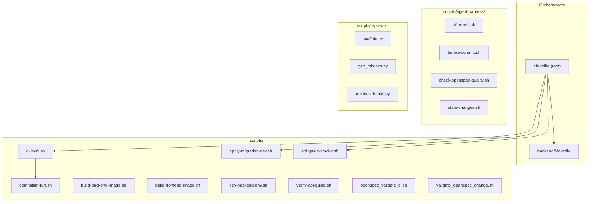
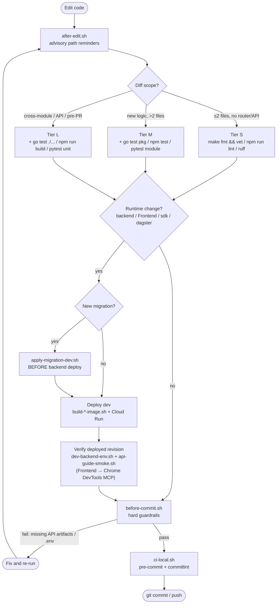
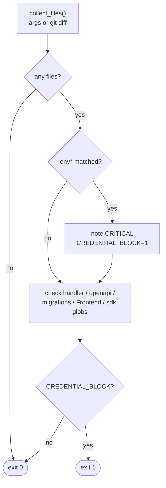
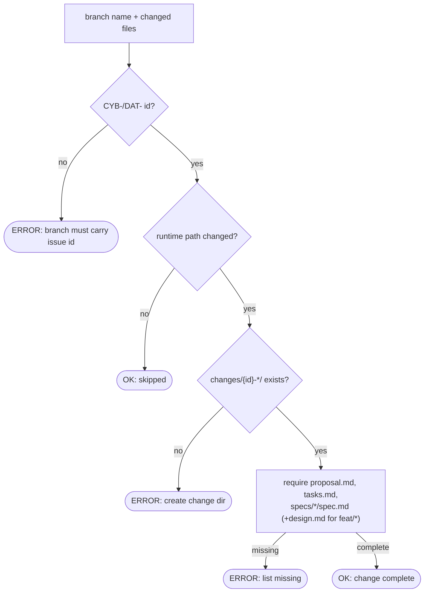
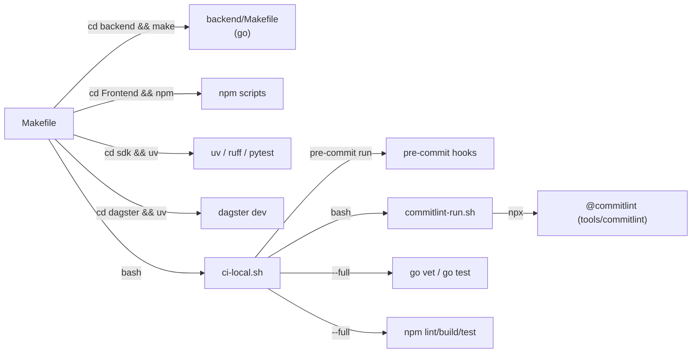

# Development Tooling

<cite>
**Referenced Files in This Document**

- [Makefile](file://Makefile)
- [backend/Makefile](file://backend/Makefile)
- [scripts/ci-local.sh](file://scripts/ci-local.sh)
- [scripts/commitlint-run.sh](file://scripts/commitlint-run.sh)
- [scripts/agent-harness/after-edit.sh](file://scripts/agent-harness/after-edit.sh)
- [scripts/agent-harness/before-commit.sh](file://scripts/agent-harness/before-commit.sh)
- [scripts/agent-harness/check-openspec-quality.sh](file://scripts/agent-harness/check-openspec-quality.sh)
- [scripts/agent-harness/stale-changes.sh](file://scripts/agent-harness/stale-changes.sh)
- [scripts/openspec_validate_ci.sh](file://scripts/openspec_validate_ci.sh)
- [scripts/validate_openspec_change.sh](file://scripts/validate_openspec_change.sh)
- [scripts/check_migration_filenames.sh](file://scripts/check_migration_filenames.sh)
- [scripts/apply-migration-dev.sh](file://scripts/apply-migration-dev.sh)
- [scripts/build-backend-image.sh](file://scripts/build-backend-image.sh)
- [scripts/build-frontend-image.sh](file://scripts/build-frontend-image.sh)
- [scripts/dev-backend-env.sh](file://scripts/dev-backend-env.sh)
- [scripts/verify-api-guide.sh](file://scripts/verify-api-guide.sh)
- [scripts/api-guide-smoke.sh](file://scripts/api-guide-smoke.sh)
- [scripts/api-guide-smoke-incluster.sh](file://scripts/api-guide-smoke-incluster.sh)
- [scripts/repo-wiki/scaffold.py](file://scripts/repo-wiki/scaffold.py)
- [scripts/repo-wiki/gen_mkdocs.py](file://scripts/repo-wiki/gen_mkdocs.py)
- [scripts/repo-wiki/mkdocs_hooks.py](file://scripts/repo-wiki/mkdocs_hooks.py)
- [docs/agents/AI-RULES.md](file://docs/agents/AI-RULES.md)
</cite>

## Table of Contents
1. [Introduction](#introduction)
2. [Project Structure](#project-structure)
3. [Core Components](#core-components)
4. [Architecture Overview](#architecture-overview)
5. [Detailed Component Analysis](#detailed-component-analysis)
6. [Dependency Analysis](#dependency-analysis)
7. [Performance Considerations](#performance-considerations)
8. [Troubleshooting Guide](#troubleshooting-guide)
9. [Conclusion](#conclusion)
10. [Appendices](#appendices)

## Introduction

This page is the entry point for the **development tooling** of `cyber-databrew`:
the Makefile targets that orchestrate local infrastructure, builds and tests; the
helper scripts under `scripts/` that wrap deployment, smoke verification, OpenSpec
validation and documentation generation; and the agent-harness guardrails that
enforce the contributing workflow described in `docs/agents/AI-RULES.md`.

The project is a multi-module monorepo: a Go `backend/`, a React/Vite `Frontend/`,
a Python `sdk/`, and a `dagster/` pipeline package. Each module owns its own native
build tool (`go`, `npm`, `uv`), and the **root `Makefile` is a thin orchestrator**
that delegates into each module's tooling while standardising the names a developer
or agent has to remember. The result is a single command surface — `make all-up`,
`make test`, `make ci-local` — over four heterogeneous stacks.

The tooling is opinionated around three ideas that recur throughout this page:

- **Tiered verification.** Not every edit deserves a full build. The size of the
  diff selects the *highest tier* of checks to run (S / M / L), keeping the inner
  loop fast while still gating PRs and deploys on the full suite.
- **Deploy-before-commit.** The dev environment is deployed *manually*; `git push`
  does not roll Cloud Run. Runtime changes must be deployed to dev and verified
  before they are committed.
- **OpenSpec-first contributing.** Runtime changes are paired with a spec change
  directory under `openspec/changes/CYB-{id}-{slug}/`, validated locally and in CI.

**Section sources**
- [Makefile](file://Makefile#L1-L60)
- [docs/agents/AI-RULES.md](file://docs/agents/AI-RULES.md#L1-L32)
- [docs/agents/AI-RULES.md](file://docs/agents/AI-RULES.md#L108-L120)

## Project Structure

The development tooling lives in three places: the orchestrating Makefiles, the
flat `scripts/` directory of helpers, and the `scripts/agent-harness/` and
`scripts/repo-wiki/` subdirectories of specialised tools.

Key directories and their roles:

- **`Makefile`** (root) — local infra (Docker Compose), cross-module test/build
  aggregation, seed data, and the `ci-local` entry. All targets are declared
  `.PHONY` at the top of the file.
- **`backend/Makefile`** — the Go toolchain wrappers (`build`, `test`, `fmt`,
  `vet`, `tidy`, `swagger`) the root Makefile delegates into.
- **`scripts/`** — standalone Bash/Python helpers for deploy image builds, dev
  environment resolution, API smoke verification, and OpenSpec/migration linting.
- **`scripts/agent-harness/`** — advisory and hard guardrails invoked around
  edits, commits, and the OpenSpec checkpoint.
- **`scripts/repo-wiki/`** — the documentation generator that turns the markdown
  under `docs/repo-wiki/` into a reviewable HTML site.

**Diagram sources**
- [Makefile](file://Makefile#L90-L201)
- [scripts/ci-local.sh](file://scripts/ci-local.sh#L31-L63)

**Section sources**
- [Makefile](file://Makefile#L1-L201)
- [backend/Makefile](file://backend/Makefile#L1-L53)

## Core Components

#### Root Makefile

The root `Makefile` groups its targets into commented sections — local infra,
backend, SDK, frontend, rich mock data, Dagster, local CI, and combined. The most
important orchestration targets are:

- **Local infra**: `dev-up` brings up the lightweight Compose stack (Postgres,
  PgBouncer, PubSub emulator); `all-up` brings up the *full* profile (frontend,
  backend, Trino, Elasticsearch, Prometheus, Grafana) with BuildKit enabled; the
  `iceberg-*` targets manage the lakehouse profile (Spark, MinIO, Iceberg REST).
- **Cross-module**: `build` = `backend-build` + `frontend-build`; `test` =
  `backend-test` + `sdk-test`; `test-full` adds the frontend tests and runs
  `sdk-test` only when `uv` is installed.
- **CI**: `ci-local` and `ci-local-full` delegate to `scripts/ci-local.sh`.

#### backend/Makefile

The backend Makefile is a direct mapping onto the Go toolchain: `build` compiles
`./cmd/server` into `bin/server`; `test` runs `go test ./...`; `test-integration`
adds the `integration` build tag; `fmt`/`vet`/`tidy` map to the matching `go`
subcommands; and `swagger` regenerates the OpenAPI docs via `swag init`. The root
targets `backend-build`, `backend-test`, `backend-run` and `backend-deps` simply
`cd backend && make <target>`.

#### Local CI runner

`scripts/ci-local.sh` reproduces a subset of GitHub PR CI before push. It supports
three modes — `quick` (default), `--full`, and `--pre-commit-only` — selected by
argument parsing at the top of the script. Every mode runs `pre-commit run
--all-files --show-diff-on-failure`; the default mode then runs commitlint over the
`merge-base(origin/main, HEAD)..HEAD` range; `--full` additionally runs `go vet` +
`go test` in `backend/` and `npm run lint && npm run build && npm run test` in
`Frontend/`.

#### Agent-harness guardrails

The `scripts/agent-harness/` scripts implement the contributing workflow as
executable checks: `after-edit.sh` emits advisory, path-based reminders;
`before-commit.sh` is the hard gate that can *fail* a commit; `check-openspec-quality.sh`
lints OpenSpec change artifacts; and `stale-changes.sh` finds merged-but-unarchived
change directories.

**Section sources**
- [Makefile](file://Makefile#L90-L201)
- [backend/Makefile](file://backend/Makefile#L1-L53)
- [scripts/ci-local.sh](file://scripts/ci-local.sh#L1-L86)
- [scripts/agent-harness/before-commit.sh](file://scripts/agent-harness/before-commit.sh#L1-L107)

## Architecture Overview

The development loop is a state machine: edit code, run the verification tier that
matches the diff scope, deploy to dev (for runtime changes), verify the deployed
revision, then commit and push. The agent-harness scripts run at the transition
points and can block progression.

The loop is intentionally asymmetric: the *fast* path (Tier S, no runtime change)
goes almost straight to commit, while the *runtime* path forces a deploy-and-verify
detour. The `before-commit.sh` gate is the last hard checkpoint — it refuses to let
credential files or unsynced API contract changes reach a commit.

**Diagram sources**
- [docs/agents/AI-RULES.md](file://docs/agents/AI-RULES.md#L108-L120)
- [docs/agents/AI-RULES.md](file://docs/agents/AI-RULES.md#L132-L139)
- [scripts/agent-harness/before-commit.sh](file://scripts/agent-harness/before-commit.sh#L66-L107)
- [scripts/agent-harness/after-edit.sh](file://scripts/agent-harness/after-edit.sh#L50-L77)

**Section sources**
- [docs/agents/AI-RULES.md](file://docs/agents/AI-RULES.md#L18-L19)
- [docs/agents/AI-RULES.md](file://docs/agents/AI-RULES.md#L108-L139)

## Detailed Component Analysis

### Verification tiers

`docs/agents/AI-RULES.md` defines three tiers selected by diff scope, and the rule
is to run the **highest tier that applies** after each accepted edit. The matrix
below is taken verbatim from the rules and from the per-module command reference.

| Tier | When | Backend | Frontend | SDK |
|------|------|---------|----------|-----|
| **S — small** | ≤2 files; no router/handler/middleware/OpenAPI; no shared types | `make fmt && make vet` | `npm run lint` | `ruff check` on touched paths |
| **M — medium** | Default for most PRs; new/changed logic; >2 files or tests exist | Tier S + `go test ./internal/foo/...` | Tier S + `npm run test -- --run` | Tier S + `pytest` for touched modules |
| **L — large** | Cross-module; UI routes; **any API contract sync**; build/config; before PR/deploy | Tier M + `go test ./...` | Tier M + `npm run build` | Tier M + full `pytest tests/unit/` |

Tier L is **always** required before opening a PR, before deploy verification, or
when touching off-limits-adjacent code. Several edits *bump* the tier by one:
changed `go.mod`/`package.json` deps, renamed exported symbols, modified `App.tsx`
routes or shared `components/common/*`, and any edit under `openspec/specs/` (which
is treated as Tier L outright).

**Section sources**
- [docs/agents/AI-RULES.md](file://docs/agents/AI-RULES.md#L108-L120)
- [docs/agents/AI-RULES.md](file://docs/agents/AI-RULES.md#L185-L192)
- [Makefile](file://Makefile#L97-L162)
- [backend/Makefile](file://backend/Makefile#L15-L28)

### after-edit.sh — advisory reminders

`after-edit.sh` collects the changed files (from arguments, or from staged +
unstaged diffs) and prints a *reminder* per matching path glob. It deliberately
exits `0` in almost every case so it never blocks an edit — the one exception is a
changed `.env*` file, which sets `CREDENTIAL_BLOCK=1` and exits `1`. The other
matches are advisory: route/handler changes prompt an API-contract-sync reminder;
`api/openapi.yaml` changes prompt Tier L; `backend/migrations/*` warns that
migrations are off-limits; `Frontend/*` prompts Chrome DevTools MCP verification;
and `sdk/*` prompts `ruff check` + targeted pytest.

**Diagram sources**
- [scripts/agent-harness/after-edit.sh](file://scripts/agent-harness/after-edit.sh#L10-L82)

**Section sources**
- [scripts/agent-harness/after-edit.sh](file://scripts/agent-harness/after-edit.sh#L1-L82)

### before-commit.sh — hard guardrails

`before-commit.sh` is the enforcing counterpart. It prefers staged files, falling
back to unstaged + untracked when nothing is staged. It hard-`fail`s on two
conditions and `warn`s on the rest:

1. **Credential files** (`.env`, `.env.*`, `*/.env*`) — refuses the commit.
2. **API handler/route changes without contract artifacts** — when any
   `backend/routes/*` or `backend/internal/handlers/*` file is in the commit, the
   same commit MUST also contain `api/openapi.yaml`, `docs/review/api-guide.md`,
   and at least one of a smoke script (`scripts/*smoke*.sh`) or an
   `openspec/changes/*/specs/*` delta. Missing any of the three fails with a
   diagnostic listing which artifact is absent.

Warnings (non-blocking) cover `backend/migrations/*` (off-limits without approval)
and `Frontend/*` (deploy-before-commit + Chrome DevTools verification required).

**Section sources**
- [scripts/agent-harness/before-commit.sh](file://scripts/agent-harness/before-commit.sh#L66-L107)

### OpenSpec validation

Three scripts cover the OpenSpec lifecycle:

- **`validate_openspec_change.sh`** — given a branch name and the changed file
  list, extracts the Linear issue id (`CYB-xxx` or legacy `DAT-xxx`) from the
  branch, skips when no runtime path (`backend/ Frontend/ sdk/ dagster/`) changed,
  then asserts the matching `openspec/changes/{id}-*/` directory has `proposal.md`,
  `tasks.md`, at least one `specs/*/spec.md` delta, and — for `feat/*` branches —
  `design.md`. A missing `context-files.md` is a warning, not a failure.
- **`openspec_validate_ci.sh`** — the CI-only structural validation. It collects
  change ids from the PR diff and from the branch name, then runs the official
  `@fission-ai/openspec` CLI `validate <id> --no-interactive` via `npx`. It skips
  the `openspec/specs/` baseline (which may predate the `#### Scenario` format).
- **`check-openspec-quality.sh`** — advisory authoring lint: checks `proposal.md`
  for `## Why` / `## What Changes` / `## Impact` / `## Scope` sections, warns when
  `Why` is overly long, and warns on a missing spec delta.

**Diagram sources**
- [scripts/validate_openspec_change.sh](file://scripts/validate_openspec_change.sh#L9-L96)

**Section sources**
- [scripts/validate_openspec_change.sh](file://scripts/validate_openspec_change.sh#L1-L96)
- [scripts/openspec_validate_ci.sh](file://scripts/openspec_validate_ci.sh#L1-L95)
- [scripts/agent-harness/check-openspec-quality.sh](file://scripts/agent-harness/check-openspec-quality.sh#L1-L60)
- [scripts/agent-harness/stale-changes.sh](file://scripts/agent-harness/stale-changes.sh#L26-L51)

### Deploy and smoke verification

The dev environment is deployed manually; `git push` does not roll Cloud Run.
The relevant tooling:

- **`build-backend-image.sh`** / **`build-frontend-image.sh`** — build the module
  Docker images. Both auto-resolve `--platform` (defaulting to `linux/amd64` on
  ARM hosts to match GKE amd64 nodes) and stamp version/commit build args; the
  frontend script additionally threads Vite build args (`VITE_API_BASE_URL`,
  `VITE_APP_VERSION`, `VITE_BUILD_REF`).
- **`dev-backend-env.sh`** — *sourced*, not executed. It resolves the canonical
  dev Cloud Run URL via `gcloud run services describe`, extracts the
  `DATABREW_TOKEN`, mints a `CLOUDRUN_ID_TOKEN`, and exports `BASE`, `TOKEN`, and a
  ready-to-use `API_HDR` curl header array. It explicitly notes that the Cloud Run
  service — not the public Gateway hostname — is the canonical verification target.
- **`api-guide-smoke.sh`** / **`api-guide-smoke-incluster.sh`** — curl smoke suites
  aligned with `docs/review/api-guide.md`; the in-cluster variant runs from a GKE
  pod and bypasses IAP. **`verify-api-guide.sh`** is the broader verifier.
- **`apply-migration-dev.sh`** — applies a single `backend/migrations/*.sql` to dev
  Postgres via a transient `pg-migrate-*` pod in the `cyber-databrew-dev`
  namespace. The migration-before-deploy rule is mandatory: deploying code that
  references new columns before the migration is applied causes runtime 500s.

**Section sources**
- [scripts/build-backend-image.sh](file://scripts/build-backend-image.sh#L1-L56)
- [scripts/build-frontend-image.sh](file://scripts/build-frontend-image.sh#L1-L52)
- [scripts/dev-backend-env.sh](file://scripts/dev-backend-env.sh#L1-L47)
- [scripts/apply-migration-dev.sh](file://scripts/apply-migration-dev.sh#L1-L72)
- [docs/agents/AI-RULES.md](file://docs/agents/AI-RULES.md#L132-L139)

### Repo-wiki documentation tooling

The wiki you are reading is generated by the `scripts/repo-wiki/` toolchain, where
the markdown under `docs/repo-wiki/` is the single source of truth:

- **`scaffold.py`** — reads `docs/repo-wiki/manifest.yaml` and creates any missing
  page with a pre-filled `<cite>` block (expanded from the page's `sources`), a
  Table of Contents, and the standard empty section skeleton. It **never overwrites**
  an existing page unless `--force` names it explicitly.
- **`gen_mkdocs.py`** — projects `manifest.yaml` (sections + order) into a
  `mkdocs.yml` for Material for MkDocs. Re-run after editing the manifest.
- **`mkdocs_hooks.py`** — a MkDocs build hook that rewrites the Qoder `<cite>`
  blocks so the Markdown inside them renders.

The HTML view is built with `mkdocs build` into `docs/repo-wiki-site/` (gitignored)
and published to GitHub Pages by `.github/workflows/repo-wiki-pages.yml`.

**Section sources**
- [scripts/repo-wiki/scaffold.py](file://scripts/repo-wiki/scaffold.py#L1-L73)
- [scripts/repo-wiki/gen_mkdocs.py](file://scripts/repo-wiki/gen_mkdocs.py#L1-L60)
- [scripts/repo-wiki/mkdocs_hooks.py](file://scripts/repo-wiki/mkdocs_hooks.py#L1-L20)

## Dependency Analysis

The orchestration fans out from the root Makefile into module toolchains and from
`ci-local.sh` into the lint and commit-message validators.

External tool dependencies the developer must have installed:

- **Go** toolchain (backend build/test/vet).
- **Node.js 20+** with `npm`/`npx` — used by the frontend, `commitlint-run.sh`
  (which lazily `npm ci`/`npm install` into `tools/commitlint`), and the OpenSpec CI
  validator (`npx @fission-ai/openspec`).
- **`uv`** for the SDK and Dagster Python environments.
- **`pre-commit`** (the rules suggest `pip install pre-commit==3.7.1`).
- **Docker / Docker Compose** with BuildKit for the local infra and image builds.
- **`gcloud` + `kubectl`** for dev deploy, env resolution, and migration application.
- **Python 3** with the packages in `scripts/repo-wiki/requirements-mkdocs.txt` for
  the wiki generator and MkDocs build.

**Diagram sources**
- [Makefile](file://Makefile#L90-L153)
- [scripts/ci-local.sh](file://scripts/ci-local.sh#L38-L83)
- [scripts/commitlint-run.sh](file://scripts/commitlint-run.sh#L6-L22)

**Section sources**
- [Makefile](file://Makefile#L90-L201)
- [scripts/ci-local.sh](file://scripts/ci-local.sh#L1-L86)
- [scripts/commitlint-run.sh](file://scripts/commitlint-run.sh#L1-L22)
- [scripts/openspec_validate_ci.sh](file://scripts/openspec_validate_ci.sh#L62-L88)

## Performance Considerations

- **Tiered verification keeps the inner loop fast.** Running `go test ./...` on a
  one-line fix is the anti-pattern the tier system exists to prevent — Tier S is
  `make fmt && make vet` only. Bump tiers deliberately, not reflexively.
- **`ci-local.sh` is the cheap pre-push gate.** Quick mode (~1–3 min) runs only
  pre-commit + commitlint; reserve `--full` for the parity check before opening a PR.
- **Incremental Docker rebuilds.** The Makefile comments recommend
  `cd deploy/local && docker compose build frontend` over `--no-cache`, and rely on
  BuildKit cache mounts (`DOCKER_BUILDKIT=1`, the default on Docker Desktop).
- **Image platform selection.** The build scripts default to `linux/amd64` on ARM
  hosts so images match GKE amd64 nodes; use `PLATFORM=native` for a fast local
  `arm64` image when you are not deploying.
- **commitlint range scoping.** `ci-local.sh` lints only `merge-base(base, HEAD)..HEAD`
  rather than the whole history, so the check stays cheap on long-lived branches.
- **Targeted smoke over full suites.** For backend/sdk-only changes the rules call
  for `source scripts/dev-backend-env.sh` + a targeted smoke (`api-guide-smoke.sh` or
  a feature script) rather than the full e2e suite.

**Section sources**
- [docs/agents/AI-RULES.md](file://docs/agents/AI-RULES.md#L108-L120)
- [scripts/ci-local.sh](file://scripts/ci-local.sh#L31-L68)
- [Makefile](file://Makefile#L14-L18)
- [scripts/build-backend-image.sh](file://scripts/build-backend-image.sh#L24-L48)

## Troubleshooting Guide

#### `ci-local.sh` fails: `Install pre-commit`
`pre-commit` is not on PATH. Install it (`pip install pre-commit==3.7.1`) and re-run.

#### `ci-local.sh` fails: `no origin/main for commitlint`
The base ref could not be resolved for the commitlint range. Fetch your base
(`git fetch origin main && git branch -u origin/main main`) or set
`CI_LOCAL_BASE=origin/your-base`.

#### `commitlint-run.sh` errors before linting
The local commitlint toolchain installs lazily into `tools/commitlint` on first
run via `npm ci`/`npm install`; this needs Node.js 20+ with `npm`. The script sets
`NODE_PATH` so `extends` in the root `.commitlintrc.json` resolves.

#### `before-commit.sh` refuses the commit
Either a credential file (`.env*`) is staged — remove it — or a handler/route
change is missing API contract artifacts. The error names which of
`openapi=`, `api-guide=`, `smoke-or-spec=` is `0`; add the missing artifact to the
*same* commit.

#### `validate_openspec_change.sh` says the change dir is missing
The branch carries a `CYB-xxx` id but no `openspec/changes/{id}-*/` directory
exists, or it is missing `proposal.md` / `tasks.md` / a spec delta (and `design.md`
for `feat/*`). Create the change directory before pushing.

#### `openspec_validate_ci.sh` exits 1
The OpenSpec CLI failed; each Requirement needs `#### Scenario:` blocks. The script
prints the hint and the failing change id. `node` is required.

#### Migration-related runtime 500s after deploy
A migration was not applied before the backend image referencing the new columns
was deployed. Run `bash scripts/apply-migration-dev.sh backend/migrations/NNN_name.sql`
first, then redeploy. `check_migration_filenames.sh` also guards against duplicate
numeric prefixes.

#### Stale OpenSpec change directories
`stale-changes.sh` lists `openspec/changes/CYB-*/` dirs whose branch merged to
`origin/dev` (or that lack `proposal.md`). Archive the delta into `openspec/specs/`
and remove the directory.

**Section sources**
- [scripts/ci-local.sh](file://scripts/ci-local.sh#L33-L63)
- [scripts/commitlint-run.sh](file://scripts/commitlint-run.sh#L10-L21)
- [scripts/agent-harness/before-commit.sh](file://scripts/agent-harness/before-commit.sh#L66-L107)
- [scripts/check_migration_filenames.sh](file://scripts/check_migration_filenames.sh#L1-L18)
- [scripts/agent-harness/stale-changes.sh](file://scripts/agent-harness/stale-changes.sh#L53-L92)

## Conclusion

The `cyber-databrew` development tooling is a thin, opinionated orchestration layer
over four module toolchains. The root and backend Makefiles standardise the command
surface; `scripts/` provides deploy, smoke, OpenSpec and documentation helpers; and
`scripts/agent-harness/` turns the contributing rules in `docs/agents/AI-RULES.md`
into executable checks. The through-line is the dev loop: pick the verification tier
that matches your diff, deploy-and-verify runtime changes before committing, pair
runtime work with a validated OpenSpec change, and let `ci-local.sh` plus
`before-commit.sh` gate the commit. For deeper coverage of any stage, follow the
detail pages linked from the appendices.

## Appendices

### A. Common development commands

| Command | What it does |
|---------|--------------|
| `make dev-up` | Start lightweight local infra (Postgres, PgBouncer, PubSub emulator) |
| `make all-up` | Build + start the full Compose stack (frontend, backend, Trino, ES, Prom, Grafana) |
| `make all-down` / `make all-reset-volumes` | Stop the full stack / tear down and wipe named volumes |
| `make iceberg-up` | Start the lakehouse profile (Spark, MinIO, Iceberg REST, Trino) |
| `make local-migrate` | Apply missing SQL migrations to local Postgres |
| `make local-dev-seed` | Insert optional dev/demo rows (idempotent) |
| `make backend-build` / `make backend-test` / `make backend-run` | Delegate to `backend/Makefile` |
| `make frontend-dev` / `make frontend-build` / `make frontend-test` | npm dev / build / test in `Frontend/` |
| `make sdk-install` / `make sdk-test` / `make sdk-lint` | `uv sync` / `pytest tests/unit/` / `ruff check` for the SDK |
| `make dagster-dev` | Run `dagster dev` on `definitions.py` |
| `make test` / `make test-full` | backend+sdk tests / backend+frontend (+sdk if `uv`) |
| `make build` | `backend-build` + `frontend-build` |
| `make ci-local` / `make ci-local-full` | Quick pre-push CI / full parity CI |
| `make api-guide-smoke` / `make api-guide-smoke-incluster` | curl smoke aligned with `api-guide.md` (in-cluster bypasses IAP) |
| `make smoke-local` | Ensure migrations + run actions-API smoke against local `:8080` |
| `make seed-rich` / `make verify-rich-seed` | HTTP-seed a rich dataset / verify it |
| `source scripts/dev-backend-env.sh` | Export `BASE`, `TOKEN`, `API_HDR` for dev Cloud Run |
| `bash scripts/apply-migration-dev.sh NNN_name.sql` | Apply one migration to dev Postgres (before deploy) |
| `python3 scripts/repo-wiki/gen_mkdocs.py && mkdocs serve` | Build + serve the repo wiki locally |

**Section sources**
- [Makefile](file://Makefile#L4-L201)
- [scripts/dev-backend-env.sh](file://scripts/dev-backend-env.sh#L1-L43)

### B. backend/Makefile targets

| Target | Action |
|--------|--------|
| `build` | `go build -o bin/server ./cmd/server` |
| `run` / `run-server` | `go run ./cmd/server` |
| `test` | `go test ./...` |
| `test-integration` | `go test -tags=integration ./...` |
| `fmt` / `vet` / `tidy` | `go fmt` / `go vet` / `go mod tidy` |
| `deps` | `go get` the pinned dependency set, then `go mod tidy` |
| `bt-bootstrap` | `bash ./scripts/bootstrap_bigtable.sh` |
| `migrate-local` | `bash ./scripts/apply_pg_deltas.sh` |
| `swagger` | `swag init -g cmd/server/main.go -o docs/swagger` |
| `clean` | `rm -rf bin/` |

**Section sources**
- [backend/Makefile](file://backend/Makefile#L1-L53)

### C. Related detail pages

- **Contributing & OpenSpec workflow** — the rules behind the dev loop:
  [docs/agents/AI-RULES.md](file://docs/agents/AI-RULES.md).
- **Deploy-before-commit / deploy-verification** — see `docs/agents/deploy-before-commit.md`
  and `docs/agents/deploy-verification.md` (referenced from `AI-RULES.md`).
- **Repo-wiki generation** — `scripts/repo-wiki/` and
  `docs/agents/skills/repo-wiki/references/page-conventions.md`.

**Section sources**
- [docs/agents/AI-RULES.md](file://docs/agents/AI-RULES.md#L1-L19)
- [scripts/repo-wiki/scaffold.py](file://scripts/repo-wiki/scaffold.py#L1-L20)
</content>
</invoke>
