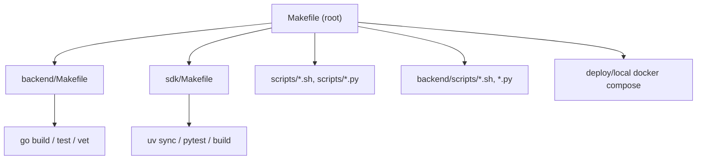
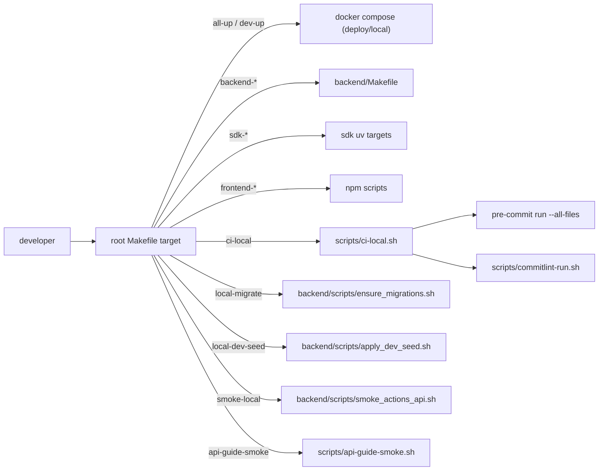
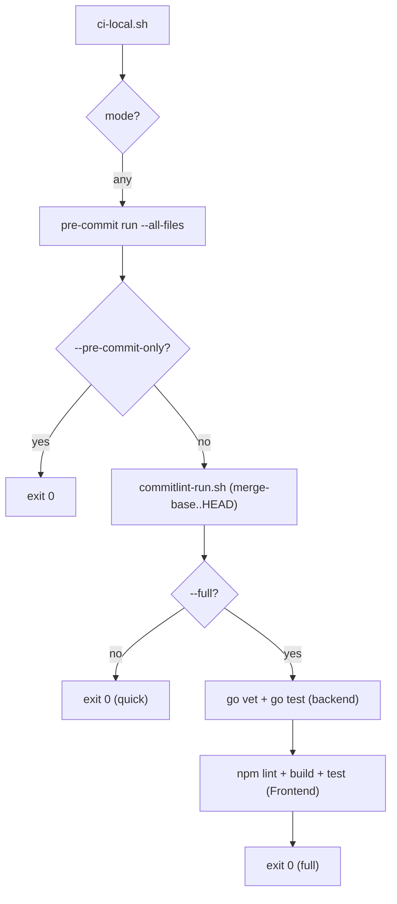
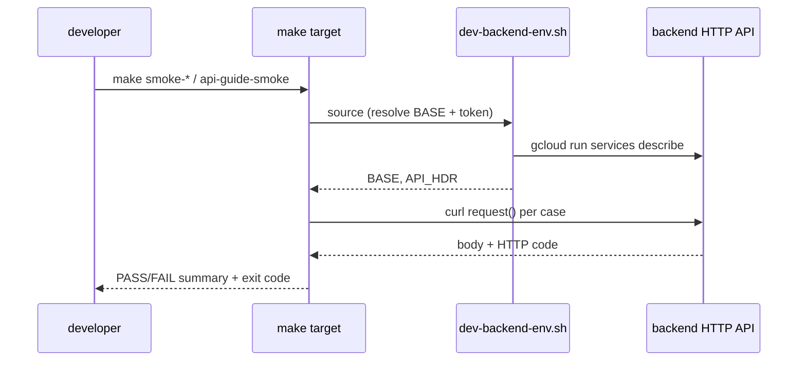
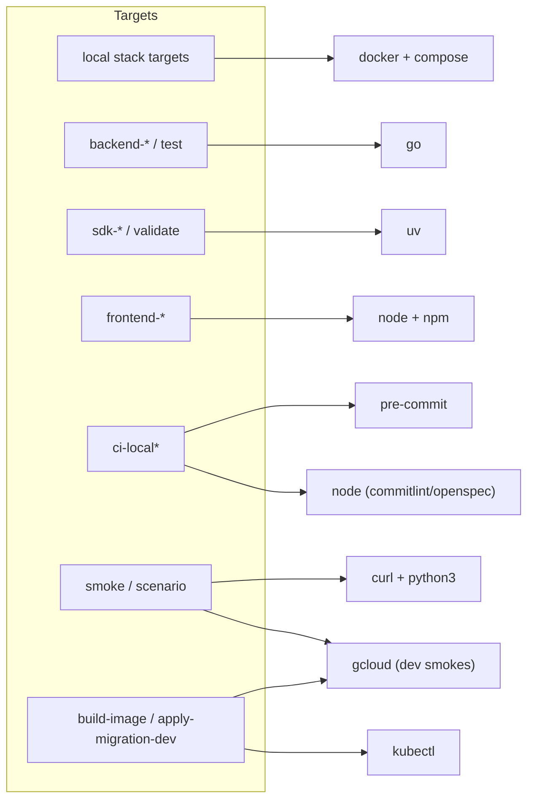

# Makefile and Scripts

<cite>
**Referenced Files in This Document**
- [Makefile](file://Makefile)
- [backend/Makefile](file://backend/Makefile)
- [sdk/Makefile](file://sdk/Makefile)
- [scripts/ci-local.sh](file://scripts/ci-local.sh)
- [scripts/commitlint-run.sh](file://scripts/commitlint-run.sh)
- [scripts/apply-migration-dev.sh](file://scripts/apply-migration-dev.sh)
- [scripts/build-backend-image.sh](file://scripts/build-backend-image.sh)
- [scripts/build-frontend-image.sh](file://scripts/build-frontend-image.sh)
- [scripts/dev-backend-env.sh](file://scripts/dev-backend-env.sh)
- [scripts/api-guide-smoke.sh](file://scripts/api-guide-smoke.sh)
- [scripts/api-guide-smoke-incluster.sh](file://scripts/api-guide-smoke-incluster.sh)
- [scripts/verify-api-guide.sh](file://scripts/verify-api-guide.sh)
- [scripts/scenario-tags-delivery.sh](file://scripts/scenario-tags-delivery.sh)
- [scripts/smoke-customers-dev.sh](file://scripts/smoke-customers-dev.sh)
- [scripts/smoke-delivery-rules-dev.sh](file://scripts/smoke-delivery-rules-dev.sh)
- [scripts/check_migration_filenames.sh](file://scripts/check_migration_filenames.sh)
- [scripts/check_review_docs_pure_cdc.sh](file://scripts/check_review_docs_pure_cdc.sh)
- [scripts/openspec_validate_ci.sh](file://scripts/openspec_validate_ci.sh)
- [scripts/validate_openspec_change.sh](file://scripts/validate_openspec_change.sh)
- [backend/scripts/ensure_migrations.sh](file://backend/scripts/ensure_migrations.sh)
- [backend/scripts/apply_dev_seed.sh](file://backend/scripts/apply_dev_seed.sh)
</cite>

## Table of Contents
1. [Introduction](#introduction)
2. [Project Structure](#project-structure)
3. [Core Components](#core-components)
4. [Architecture Overview](#architecture-overview)
5. [Detailed Component Analysis](#detailed-component-analysis)
6. [Dependency Analysis](#dependency-analysis)
7. [Performance Considerations](#performance-considerations)
8. [Troubleshooting Guide](#troubleshooting-guide)
9. [Conclusion](#conclusion)
10. [Appendices](#appendices)

## Introduction

The `cyber-databrew` repository ships a layered command surface built from three
`Makefile`s and a `scripts/` directory of bash and Python helpers. The **root
`Makefile`** is the developer's entry point: it orchestrates the local Docker
Compose stack, the optional Iceberg lakehouse profile, mock-data generation,
HTTP smoke flows, and aggregate test/build/CI targets. It rarely contains real
build logic itself — instead it delegates either to a language-specific Makefile
(`cd backend && make build`, `cd Frontend && npm run build`) or to a script under
`scripts/` or `backend/scripts/`.

The **`backend/Makefile`** owns the Go toolchain: build, run, test, fmt, vet,
tidy, dependency bootstrapping, and Swagger generation. The **`sdk/Makefile`**
owns the Python SDK lifecycle through `uv`: install, lint, mypy, test, build, a
composite `validate` release gate, Artifact Registry `publish`, and OpenAPI
codegen.

The `scripts/` tree is the connective tissue: it holds the local CI runner
(`ci-local.sh`), commit-message linting (`commitlint-run.sh`), image builders
that mirror the Tekton pipeline, dev-database migration appliers, and a family
of smoke / scenario scripts that exercise the live HTTP API against either a
local backend or hosted Cloud Run. This page is the full map of that surface:
every Make target, the script each one calls, and how they chain.

**Section sources**
- [Makefile](file://Makefile#L1-L202)
- [backend/Makefile](file://backend/Makefile#L1-L53)
- [sdk/Makefile](file://sdk/Makefile#L1-L74)

## Project Structure

The command surface spans four locations:

- **`Makefile`** (repo root) — the umbrella target set. Phony targets only; every
  recipe shells out to Docker Compose, `cd backend && make …`, `cd Frontend &&
  npm …`, `cd sdk && uv …`, or a `bash`/`python3` script.
- **`backend/Makefile`** — Go-specific targets run from inside `backend/`.
- **`sdk/Makefile`** — Python SDK targets run from inside `sdk/` via `uv`.
- **`scripts/`** — top-level helper scripts (CI, lint, image build, migration,
  smoke, scenario) plus the **`scripts/agent-harness/`** subdirectory of
  agent-workflow guards.
- **`backend/scripts/`** — backend-local helpers that the root Makefile calls for
  migrations and seeding (`ensure_migrations.sh`, `apply_dev_seed.sh`, and the
  rich-data loaders).

**Diagram sources**
- [Makefile](file://Makefile#L4-L201)
- [backend/Makefile](file://backend/Makefile#L7-L53)
- [sdk/Makefile](file://sdk/Makefile#L3-L74)

**Section sources**
- [Makefile](file://Makefile#L1-L202)
- [scripts/ci-local.sh](file://scripts/ci-local.sh#L1-L13)

## Core Components

The command surface decomposes into seven functional groups, each fronted by a
small cluster of Make targets.

#### Local stack (Docker Compose)

The root Makefile drives the local environment through `deploy/local/docker
compose` with profile flags. `dev-up` starts only the infra services
(PostgreSQL on `5432`, PgBouncer on `6432`, PubSub emulator on `8085`), while
`all-up` brings up the full application profile and rebuilds images
(`DOCKER_BUILDKIT=1 docker compose --profile full up -d --build`), exposing the
frontend, backend, Trino, Elasticsearch, Prometheus, and Grafana. The matching
`*-down` targets stop services, and `all-reset-volumes` tears everything down
*with* `-v` to wipe the PostgreSQL data volume.

#### Backend

`backend-deps`, `backend-build`, `backend-test`, and `backend-run` are thin
wrappers that `cd backend` and invoke the corresponding `backend/Makefile`
target (`deps`, `build`, `test`, `run-server`).

#### Frontend

`frontend-install`, `frontend-dev`, `frontend-build` `cd Frontend` and call the
matching `npm` script. The legacy `ui-*` aliases map onto them for backward
compatibility.

#### SDK

`sdk-install`, `sdk-test`, and `sdk-lint` `cd sdk` and use `uv` directly. Deeper
SDK lifecycle (lint → mypy → test → build → smoke-install, plus `publish` and
codegen) lives in `sdk/Makefile`.

#### Lakehouse (Iceberg)

The `iceberg-*` targets drive the `lakehouse` Compose profile (Spark, MinIO,
Iceberg REST, Trino). `iceberg-mvp` / `iceberg-mvp-host` execute the
`build_lakehouse_mvp.py` notebook inside the Spark container, and `trino-smoke`
runs a `SHOW TABLES` against the `iceberg.robot` schema.

#### Test / CI

`test`, `test-full`, `frontend-test`, and `test-e2e-rich` aggregate the
language-level test suites. `ci-local` / `ci-local-full` run the local mirror of
PR CI via `scripts/ci-local.sh`. The smoke and scenario targets exercise the
running HTTP API.

#### Deploy

`build` compiles backend + frontend; image builders live in
`scripts/build-backend-image.sh` and `scripts/build-frontend-image.sh`;
`gcp-vm-deploy` shells out to `deploy/gcp-vm/deploy.sh`; and
`apply-migration-dev.sh` applies a single migration to the dev Cloud SQL
instance through a transient GKE pod.

**Section sources**
- [Makefile](file://Makefile#L4-L88)
- [Makefile](file://Makefile#L90-L201)
- [backend/Makefile](file://backend/Makefile#L7-L53)

## Architecture Overview

The Makefile layer is a delegation tree, not a build system in its own right.
A root target either runs Docker Compose, recurses into a sub-Makefile, or runs
a script. Aggregate targets compose other targets (e.g. `test` depends on
`backend-test sdk-test`).

**Diagram sources**
- [Makefile](file://Makefile#L17-L47)
- [Makefile](file://Makefile#L91-L101)
- [Makefile](file://Makefile#L148-L174)
- [scripts/ci-local.sh](file://scripts/ci-local.sh#L38-L83)

## Detailed Component Analysis

### Make target reference (root Makefile)

Every target declared `.PHONY` in the root Makefile, grouped by function:

| Target | Group | What it does |
| --- | --- | --- |
| `dev-up` | local stack | `docker compose up -d` infra only (Postgres, PgBouncer, PubSub emulator) |
| `dev-down` | local stack | Stops `full` + `lakehouse` profiles then the base stack |
| `all-up` | local stack | `DOCKER_BUILDKIT=1 docker compose --profile full up -d --build`; prints all service URLs |
| `all-down` | local stack | Stops the `full` profile |
| `all-reset-volumes` | local stack | Tears down all profiles with `-v` (wipes Postgres data) |
| `all-logs` | local stack | Follows logs of the `full` profile |
| `local-migrate` | backend/db | Runs `backend/scripts/ensure_migrations.sh` to apply SQL missing from an existing DB |
| `local-dev-seed` | backend/db | Runs `backend/scripts/apply_dev_seed.sh` to insert idempotent demo rows |
| `pg-generate-scale` | mock data | `psql -f generate_mock_scale.sql` with `ROW_COUNT` / `BATCH_ID` vars |
| `pg-generate-rich` | mock data | Runs `backend/scripts/load_rich_scale.sh` with asset/mcap/delivery counts |
| `iceberg-up` | lakehouse | Starts the `lakehouse` profile; prints Spark, MinIO, Iceberg REST, Trino URLs |
| `iceberg-down` | lakehouse | Stops the `lakehouse` profile |
| `iceberg-logs` | lakehouse | Follows `lakehouse` profile logs |
| `iceberg-mvp` | lakehouse | Runs `build_lakehouse_mvp.py` inside the `spark-iceberg` container |
| `iceberg-mvp-host` | lakehouse | Same, but points Spark at host Postgres via `host.docker.internal` |
| `trino-smoke` | lakehouse | `SHOW TABLES` on `iceberg.robot` through the Trino container |
| `backend-deps` | backend | `cd backend && make deps` |
| `backend-build` | backend | `cd backend && make build` |
| `backend-test` | backend | `cd backend && make test` |
| `backend-run` | backend | `cd backend && make run-server` |
| `sdk-install` | sdk | `cd sdk && uv sync --dev` |
| `sdk-test` | sdk | `cd sdk && uv run pytest tests/unit/` |
| `sdk-lint` | sdk | `cd sdk && uv run ruff check src/` |
| `frontend-install` | frontend | `cd Frontend && npm install` |
| `frontend-dev` | frontend | `cd Frontend && npm run dev` |
| `frontend-build` | frontend | `cd Frontend && npm run build` |
| `ui-install` / `ui-dev` / `ui-build` | frontend | Aliases for the `frontend-*` targets |
| `seed-rich` | mock data | Runs `backend/scripts/seed_rich_dataset.py` over HTTP (`SEED_*` vars) |
| `verify-rich-seed` | mock data | Runs `backend/scripts/verify_rich_seed.sh` |
| `test-e2e-rich` | test/ci | Chains `seed-rich verify-rich-seed backend-test` |
| `dagster-dev` | dagster | `cd dagster && uv run dagster dev -f definitions.py` |
| `ci-local` | test/ci | `bash scripts/ci-local.sh` (quick: pre-commit + commitlint) |
| `ci-local-full` | test/ci | `bash scripts/ci-local.sh --full` (adds go + frontend) |
| `test` | test/ci | `backend-test sdk-test` |
| `test-full` | test/ci | `backend-test frontend-test`, plus `sdk-test` if `uv` is installed |
| `frontend-test` | test/ci | `cd Frontend && npm test` |
| `smoke-local` | smoke | `ensure_migrations.sh` then `backend/scripts/smoke_actions_api.sh` |
| `smoke` | smoke | Prints guidance pointing at `smoke-local` |
| `api-guide-smoke` | smoke | `bash scripts/api-guide-smoke.sh` |
| `api-guide-smoke-incluster` | smoke | `bash scripts/api-guide-smoke-incluster.sh` (in-cluster GKE Job) |
| `scenario-tags-bulk` | scenario | `python3 scripts/scenario-tags-delivery-bulk.py` (tag→query→deliver) |
| `gcp-vm-deploy` | deploy | Requires `GCP_VM_NAME`/`GCP_ZONE`, runs `deploy/gcp-vm/deploy.sh` |
| `build` | deploy | `backend-build frontend-build` |
| `clean` | misc | `cd backend && make clean`; removes Frontend `dist` + `node_modules` |

**Section sources**
- [Makefile](file://Makefile#L4-L88)
- [Makefile](file://Makefile#L90-L201)

### Make target reference (backend/Makefile and sdk/Makefile)

The `backend/Makefile` is a conventional Go Makefile. `build` compiles
`./cmd/server` into `bin/server`; `run-server` runs it without building; `test`
runs `go test ./...`; `test-integration` adds the `integration` build tag; `fmt`,
`vet`, and `tidy` wrap the standard Go tools; `deps` `go get`s the core
dependency set and tidies; `bt-bootstrap` runs the Bigtable bootstrap script;
`migrate-local` replays incremental Postgres deltas via `apply_pg_deltas.sh`;
`swagger` regenerates the OpenAPI docs with `swag init`.

| Target | Makefile | What it does |
| --- | --- | --- |
| `build` | backend | `go build -o bin/server ./cmd/server` |
| `run` / `run-server` | backend | `go run ./cmd/server` |
| `test` | backend | `go test ./...` |
| `test-integration` | backend | `go test -tags=integration ./...` |
| `fmt` / `vet` / `tidy` | backend | `go fmt` / `go vet` / `go mod tidy` |
| `deps` | backend | `go get` core deps (gin, jwt, uuid, pgx, cloud SDKs) then `go mod tidy` |
| `bt-bootstrap` | backend | `bash ./scripts/bootstrap_bigtable.sh` |
| `migrate-local` | backend | `bash ./scripts/apply_pg_deltas.sh` (replay deltas 004–012) |
| `clean` | backend | `rm -rf bin/` |
| `swagger` | backend | `swag init -g cmd/server/main.go -o docs/swagger` |
| `install` | sdk | `uv sync --dev` |
| `test` / `test-all` | sdk | `uv run pytest tests/unit/ -v` / full `tests/` |
| `lint` | sdk | `uv run ruff check src/cyber_databrew_sdk/` |
| `mypy` | sdk | `uv run mypy … --ignore-missing-imports` |
| `format` | sdk | `uv run ruff format src/` |
| `build` | sdk | `uv build` |
| `validate` | sdk | Release gate: `lint mypy test build` + wheel smoke-install |
| `publish` | sdk | Depends on `validate`; `twine upload` to Artifact Registry via gcloud token |
| `sdk-generate` | sdk | `datamodel-codegen` from `../api/openapi.yaml` → `_generated/models.py` |
| `sdk-check-generated` | sdk | Runs codegen then `git diff --quiet` to fail on drift |
| `clean` | sdk | Removes `dist/`, `build/`, egg-info, smoke venv |

**Section sources**
- [backend/Makefile](file://backend/Makefile#L1-L53)
- [sdk/Makefile](file://sdk/Makefile#L1-L74)

### Local CI runner (`scripts/ci-local.sh`)

`ci-local.sh` mirrors PR CI so developers get fast feedback before pushing. It
resolves the repo root, parses one of `--full`, `--pre-commit-only`, or the
default quick mode, then runs `pre-commit run --all-files --show-diff-on-failure`
(the same hook set as CI). In quick mode it then runs commitlint over the
`merge-base(origin/main, HEAD)..HEAD` commit range via `commitlint-run.sh`,
honoring a `CL_LOCAL_RANGE` override for the pre-push hook and a `CI_LOCAL_BASE`
override for the base ref. In `--full` mode it additionally runs `go vet ./...`
plus `go test -timeout 300s ./...` in `backend/`, and `npm run lint && npm run
build && npm run test` in `Frontend/`. It requires `pre-commit` installed and,
for `--full`, `go` and `npm`.

**Diagram sources**
- [scripts/ci-local.sh](file://scripts/ci-local.sh#L15-L85)

**Section sources**
- [scripts/ci-local.sh](file://scripts/ci-local.sh#L1-L85)
- [scripts/commitlint-run.sh](file://scripts/commitlint-run.sh#L1-L22)

### Commit linting (`scripts/commitlint-run.sh`)

`commitlint-run.sh` runs `commitlint` with the same package set and
`.commitlintrc.json` as CI. It locates the bundled binary under
`tools/commitlint/node_modules/.bin/commitlint`, lazily `npm ci`/`npm install`s
the tool on first run, exports `NODE_PATH` so `extends` resolves from the repo
root config, and `exec`s commitlint with whatever arguments it was passed
(`--from … --to …`, `--edit …`, etc.). It is invoked by both `ci-local.sh` and
the git pre-push hook.

**Section sources**
- [scripts/commitlint-run.sh](file://scripts/commitlint-run.sh#L1-L22)

### Migration appliers

Two scripts handle the local "Postgres already exists but a new migration was
added" problem (the Docker initdb scripts only run on an empty data volume):

- **`backend/scripts/ensure_migrations.sh`** detects whether the
  `local-postgres-1` Docker container is running (and uses `docker exec`) or
  falls back to host `psql` with `PG*` env vars. For each tracked migration
  (014 eval metrics, 016 actions, 018 saved_queries, 031 algo_runs) it runs an
  `information_schema.tables` existence check and applies the file only if the
  table is missing, streaming the SQL over stdin into the container. This backs
  the `local-migrate` and `smoke-local` targets.
- **`backend/scripts/apply_dev_seed.sh`** applies optional demo rows from
  `backend/scripts/postgres/dev_seed.sql`, but first checks for the sentinel
  asset `aset0001` and skips if it already exists (idempotent). This backs
  `local-dev-seed`.

For the **dev cloud** database, **`scripts/apply-migration-dev.sh`** applies a
single `backend/migrations/*.sql` file against the private Cloud SQL instance.
It resolves the migration path (accepting a full path, a bare `NNN_name.sql`, or
an archived file), refuses any path outside `backend/migrations/`, derives an
RFC-1123 pod name, then spins up a transient `postgres:17` pod in the
`cyber-databrew-dev` namespace with `PG*` env wired from the
`cyber-databrew-secrets` secret, waits for readiness, `kubectl cp`s the SQL in,
runs `psql -v ON_ERROR_STOP=1 -f`, and deletes the pod on exit via a `trap`.

**Section sources**
- [backend/scripts/ensure_migrations.sh](file://backend/scripts/ensure_migrations.sh#L1-L83)
- [backend/scripts/apply_dev_seed.sh](file://backend/scripts/apply_dev_seed.sh#L1-L40)
- [scripts/apply-migration-dev.sh](file://scripts/apply-migration-dev.sh#L1-L72)

### Image builders

The two image-build scripts mirror the Tekton buildkit context so local images
match CI/CD images:

- **`scripts/build-backend-image.sh`** builds from `backend/Dockerfile` with
  `VERSION` (from `git describe`) and `COMMIT` (`git rev-parse --short`)
  build-args. It resolves `--platform` from a `PLATFORM` env var: `auto` (the
  default) emits `linux/amd64` on ARM hosts so the image matches amd64 GKE nodes,
  `native`/`local` skips `--platform`, and any explicit value is passed through.
- **`scripts/build-frontend-image.sh`** builds from `Frontend/Dockerfile` with
  `VITE_API_BASE_URL` (default `/api`), `VITE_APP_VERSION` (from
  `package.json`), `VITE_BUILD_REF` (git short SHA), and an optional
  `VITE_DEV_ACCESS_TOKEN`. It shares the same `PLATFORM` resolution logic.

**Section sources**
- [scripts/build-backend-image.sh](file://scripts/build-backend-image.sh#L1-L55)
- [scripts/build-frontend-image.sh](file://scripts/build-frontend-image.sh#L1-L51)

### Smoke and scenario scripts

These scripts exercise the running HTTP API. They share a `request` helper that
captures both body and HTTP code and a `PASS`/`FAIL` counter that sets the exit
status.

- **`scripts/api-guide-smoke.sh`** runs the curl examples from
  `docs/review/api-guide.md`. It defaults to `BASE=http://localhost:8080` and
  `TOKEN=dev-token`, supports `RUN_WRITES=1` for POST flows, and supports an
  `IAP_TOKEN` OIDC JWT for HTTPS/IAP gateways via a `refresh_headers` helper.
- **`scripts/verify-api-guide.sh`** is the exhaustive variant — a fuller pass/fail
  verification of every documented endpoint against a running backend.
- **`scripts/api-guide-smoke-incluster.sh`** runs the smoke *inside* GKE to bypass
  IAP: it syncs `api-guide-smoke.sh` into a ConfigMap, applies the
  `api-guide-smoke-job.yaml` Job, polls up to 90×2s for success/failure, and
  prints the Job logs.
- **`scripts/dev-backend-env.sh`** is sourced (not executed) to populate `BASE`,
  `DATABREW_TOKEN`, `CLOUDRUN_ID_TOKEN`, and the `API_HDR` array by querying the
  `cyber-databrew-backend-dev` Cloud Run service with `gcloud`.
- **`scripts/smoke-customers-dev.sh`** sources `dev-backend-env.sh` then verifies
  customer CRUD, the delivery foreign-key guard (unknown customer → 422), and the
  deliveries filter; the delivery tests are skipped unless `ASSET_ID` is set.
- **`scripts/smoke-delivery-rules-dev.sh`** creates a customer and a `block`-mode
  delivery rule, then (with `ASSET_ID`) tags an asset and asserts a delivery is
  blocked with `422 DELIVERY_RULE_FAILED`.
- **`scripts/scenario-tags-delivery.sh`** runs the end-to-end business scenario
  (tag upsert → query by tag → deliver → query deliveries), defaulting to the
  hosted dev Cloud Run backend with an `ES_TAG_WAIT_SEC` for outbox→ES lag and an
  optional `CLEANUP=1`. The `scenario-tags-bulk` Make target runs the bulk Python
  variant (`scenario-tags-delivery-bulk.py`).

**Diagram sources**
- [scripts/smoke-customers-dev.sh](file://scripts/smoke-customers-dev.sh#L11-L68)
- [scripts/dev-backend-env.sh](file://scripts/dev-backend-env.sh#L11-L46)

**Section sources**
- [scripts/api-guide-smoke.sh](file://scripts/api-guide-smoke.sh#L1-L30)
- [scripts/verify-api-guide.sh](file://scripts/verify-api-guide.sh#L1-L25)
- [scripts/api-guide-smoke-incluster.sh](file://scripts/api-guide-smoke-incluster.sh#L1-L43)
- [scripts/dev-backend-env.sh](file://scripts/dev-backend-env.sh#L1-L46)
- [scripts/smoke-customers-dev.sh](file://scripts/smoke-customers-dev.sh#L1-L68)
- [scripts/smoke-delivery-rules-dev.sh](file://scripts/smoke-delivery-rules-dev.sh#L1-L78)
- [scripts/scenario-tags-delivery.sh](file://scripts/scenario-tags-delivery.sh#L1-L20)

### Pre-commit / CI guard scripts

A set of guard scripts run inside pre-commit hooks and GitHub Actions to enforce
repository invariants:

- **`scripts/check_migration_filenames.sh`** fails if `backend/migrations` has two
  files sharing a numeric prefix (e.g. two `018_*.sql`).
- **`scripts/check_review_docs_pure_cdc.sh`** greps `docs/review/*.md` for
  forbidden non-Pure-CDC wording (e.g. references to Debezium/Kafka outbox
  designs), excluding a small allow-list of historical docs.
- **`scripts/openspec_validate_ci.sh`** collects OpenSpec change ids from the PR
  diff and branch name, then runs the official `@fission-ai/openspec` CLI
  `validate` over each change directory that has a `proposal.md`.
- **`scripts/validate_openspec_change.sh`** asserts that a branch name carries a
  Linear issue id (`CYB-xxx`/`DAT-xxx`) and that the PR links a valid OpenSpec
  change.

**Section sources**
- [scripts/check_migration_filenames.sh](file://scripts/check_migration_filenames.sh#L1-L18)
- [scripts/check_review_docs_pure_cdc.sh](file://scripts/check_review_docs_pure_cdc.sh#L1-L34)
- [scripts/openspec_validate_ci.sh](file://scripts/openspec_validate_ci.sh#L1-L95)
- [scripts/validate_openspec_change.sh](file://scripts/validate_openspec_change.sh#L1-L20)

### Script reference table

| Script | Purpose |
| --- | --- |
| `scripts/ci-local.sh` | Local mirror of PR CI: pre-commit, commitlint, optional go + frontend |
| `scripts/commitlint-run.sh` | Run commitlint with the same config/packages as CI |
| `scripts/apply-migration-dev.sh` | Apply one migration to dev Cloud SQL via a transient GKE pod |
| `scripts/build-backend-image.sh` | Build backend Docker image (Tekton-aligned context, platform-aware) |
| `scripts/build-frontend-image.sh` | Build frontend Docker image with Vite build-args |
| `scripts/dev-backend-env.sh` | Sourced helper that resolves dev Cloud Run BASE + auth headers |
| `scripts/api-guide-smoke.sh` | Curl smoke aligned with `docs/review/api-guide.md` |
| `scripts/verify-api-guide.sh` | Exhaustive api-guide verification against a running backend |
| `scripts/api-guide-smoke-incluster.sh` | Run the api-guide smoke as an in-cluster GKE Job (bypass IAP) |
| `scripts/scenario-tags-delivery.sh` | End-to-end tag → query → deliver scenario (single) |
| `scripts/scenario-tags-delivery-bulk.py` | Bulk concurrent tag/query/delivery scenario (Make `scenario-tags-bulk`) |
| `scripts/smoke-customers-dev.sh` | Customer CRUD + delivery FK guard smoke (dev) |
| `scripts/smoke-delivery-rules-dev.sh` | Delivery-rule block-mode smoke (dev) |
| `scripts/check_migration_filenames.sh` | Fail on duplicate migration numeric prefixes |
| `scripts/check_review_docs_pure_cdc.sh` | Fail on non-Pure-CDC wording in `docs/review` |
| `scripts/openspec_validate_ci.sh` | Run OpenSpec CLI validate over PR-touched changes |
| `scripts/validate_openspec_change.sh` | Enforce Linear-id branch + linked OpenSpec change |
| `backend/scripts/ensure_migrations.sh` | Apply missing SQL migrations to an existing local DB |
| `backend/scripts/apply_dev_seed.sh` | Insert idempotent demo rows into local Postgres |
| `scripts/agent-harness/*.sh` | Agent-workflow guards (after-edit, before-commit, openspec quality, stale-changes) |

**Section sources**
- [Makefile](file://Makefile#L39-L188)
- [scripts/ci-local.sh](file://scripts/ci-local.sh#L1-L85)

## Dependency Analysis

The targets and scripts depend on a layered set of external tools and on each
other. The local stack targets need Docker and Docker Compose with the
`deploy/local` config; backend targets need the Go toolchain; SDK targets need
`uv`; frontend targets need Node/npm; CI/lint targets need `pre-commit`, Node
(for commitlint and OpenSpec CLI), and `rg`/`grep`; cloud-facing scripts
(`apply-migration-dev.sh`, `dev-backend-env.sh`, smoke-`*`-dev) need `kubectl`
and/or `gcloud`.

**Diagram sources**
- [scripts/ci-local.sh](file://scripts/ci-local.sh#L9-L83)
- [scripts/apply-migration-dev.sh](file://scripts/apply-migration-dev.sh#L8-L66)
- [scripts/dev-backend-env.sh](file://scripts/dev-backend-env.sh#L8-L34)

**Section sources**
- [Makefile](file://Makefile#L91-L162)
- [sdk/Makefile](file://sdk/Makefile#L1-L74)

## Performance Considerations

- **BuildKit / incremental rebuilds.** `all-up` sets `DOCKER_BUILDKIT=1` so the
  cache mounts in the Dockerfiles take effect. The Makefile comments advise
  incremental rebuilds (`docker compose build frontend`) rather than
  `--no-cache`, and allow `NPM_REGISTRY` / `GOPROXY` overrides for faster
  dependency pulls in constrained networks.
- **CI feedback loop.** Quick `ci-local` (pre-commit + commitlint) runs in ~1–3
  minutes; `--full` adds the Go and frontend suites with a 300s test timeout. Run
  quick mode on every push and reserve `--full` for parity checks.
- **Idempotent migration / seed checks.** `ensure_migrations.sh` and
  `apply_dev_seed.sh` query `information_schema` / a sentinel row before applying,
  so re-running them is cheap and safe.
- **Outbox → ES lag.** Scenario scripts expose `ES_TAG_WAIT_SEC` / `ES_WAIT`
  because tag-based queries read from Elasticsearch, which lags the Postgres
  write through the outbox/CDC pipeline; setting the wait avoids flaky reads.
- **Image platform.** The image builders default to `linux/amd64` on ARM hosts to
  match GKE nodes; building `native` is faster on Apple Silicon but produces
  arm64 images unsuitable for the cluster.

**Section sources**
- [Makefile](file://Makefile#L14-L24)
- [scripts/ci-local.sh](file://scripts/ci-local.sh#L1-L9)
- [scripts/scenario-tags-delivery.sh](file://scripts/scenario-tags-delivery.sh#L11-L19)
- [scripts/build-backend-image.sh](file://scripts/build-backend-image.sh#L8-L41)

## Troubleshooting Guide

- **`ci-local` fails: "Install pre-commit".** Install with `pip install
  pre-commit==3.7.1`; `ci-local.sh` exits early if the binary is missing.
- **`ci-local` fails: "no origin/main for commitlint".** The script needs the
  base branch to compute the commit range. Run `git fetch origin main` or set
  `CI_LOCAL_BASE=origin/your-base`.
- **commitlint not installed.** `commitlint-run.sh` auto-installs
  `tools/commitlint` on first run; if it fails, ensure Node 20+ and `npm` are on
  `PATH`.
- **`make all-up` shows no demo data.** Empty-volume starts run DDL only; run
  `make local-dev-seed` for demo rows. After adding a new migration to an
  existing volume, run `make local-migrate`.
- **`apply-migration-dev.sh` "migration not found" / "refusing path outside".**
  Pass either a path under `backend/migrations/` or a bare `NNN_name.sql`; the
  script rejects anything resolving outside that directory.
- **Smoke/scenario scripts can't reach the API.** Local smokes need the backend
  on `:8080` (`make all-up`); dev smokes source `dev-backend-env.sh`, which needs
  `gcloud` auth and a reachable Cloud Run service.
- **`scenario-tags-*` flaky on tag queries.** Increase `ES_TAG_WAIT_SEC` /
  `ES_WAIT` to absorb outbox→ES lag.
- **`api-guide-smoke-incluster` times out.** The poll runs 90×2s; check the
  printed Job logs and confirm the `cyber-databrew-dev` namespace and Job YAML
  exist.
- **Duplicate-prefix migration CI failure.** `check_migration_filenames.sh`
  flagged two files with the same `NNN_` prefix — renumber the newer one.

**Section sources**
- [scripts/ci-local.sh](file://scripts/ci-local.sh#L33-L62)
- [scripts/commitlint-run.sh](file://scripts/commitlint-run.sh#L10-L17)
- [scripts/apply-migration-dev.sh](file://scripts/apply-migration-dev.sh#L26-L43)
- [scripts/api-guide-smoke-incluster.sh](file://scripts/api-guide-smoke-incluster.sh#L27-L43)

## Conclusion

The Makefile-and-scripts layer is a deliberate delegation surface: the root
`Makefile` is the single discoverable entry point, sub-Makefiles own each
language toolchain, and `scripts/` carries the cross-cutting concerns (local CI,
commit linting, image builds, migrations, and HTTP smoke/scenario flows). The
recurring conventions — phony targets, env-var overrides with sane defaults,
idempotent guards, and `PASS/FAIL`-returning smokes — make the command surface
predictable. For day-to-day work the path is: `make all-up` → `make local-migrate`
→ `make local-dev-seed` → develop → `make ci-local` before push.

## Appendices

### Common environment variables

| Variable | Used by | Effect |
| --- | --- | --- |
| `ROW_COUNT` / `BATCH_ID` | `pg-generate-scale` | Mock-row count and batch id |
| `ASSET_COUNT` / `MCAP_COUNT` / `DELIVERY_COUNT` | `pg-generate-rich` | Rich-data volumes |
| `SEED_BASE` / `SEED_TOKEN` / `SEED_TOTAL` / `SEED_WORKERS` | `seed-rich` | HTTP seed target + concurrency |
| `BASE` / `TOKEN` | smoke + scenario scripts | API base URL and `X-Databrew-Token` |
| `IAP_TOKEN` | `api-guide-smoke.sh` | OIDC JWT for IAP-protected gateways |
| `RUN_WRITES` | `api-guide-smoke.sh` | Enable POST flows in the smoke |
| `ES_WAIT` / `ES_TAG_WAIT_SEC` | scenario scripts | Sleep for outbox→ES lag |
| `CI_LOCAL_BASE` / `CL_LOCAL_RANGE` | `ci-local.sh` | Override commitlint base ref / range |
| `PLATFORM` | image builders | `auto` / `native` / explicit `--platform` |
| `IMAGE_TAG` | image builders | Output image tag |
| `K8S_NAMESPACE` / `DEV_PG_*` | `apply-migration-dev.sh` | Target namespace and DB connection |
| `GCP_VM_NAME` / `GCP_ZONE` | `gcp-vm-deploy` | Required for the GCE VM deploy |

### Typical workflows

- **First-time local setup:** `make all-up && make local-dev-seed`
- **Apply a new local migration:** `make local-migrate`
- **Pre-push check:** `make ci-local` (or `make ci-local-full` for parity)
- **Backend-only loop:** `make backend-test` / `cd backend && make run-server`
- **SDK release gate:** `cd sdk && make validate`
- **Dev API smoke:** `make api-guide-smoke` (local) or the `smoke-*-dev` scripts
- **Apply a dev cloud migration:** `bash scripts/apply-migration-dev.sh NNN_name.sql`

**Section sources**
- [Makefile](file://Makefile#L49-L194)
- [scripts/api-guide-smoke.sh](file://scripts/api-guide-smoke.sh#L1-L16)
- [scripts/apply-migration-dev.sh](file://scripts/apply-migration-dev.sh#L1-L18)
