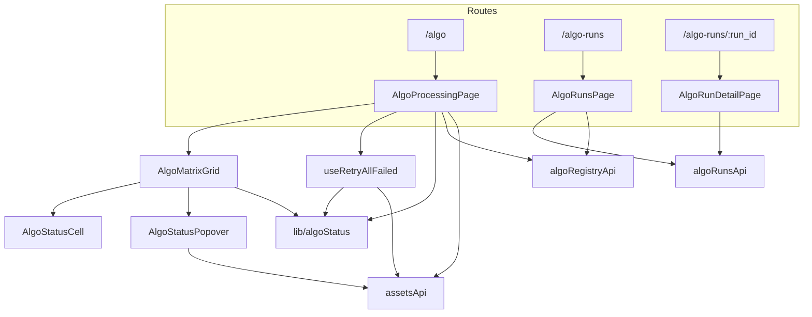
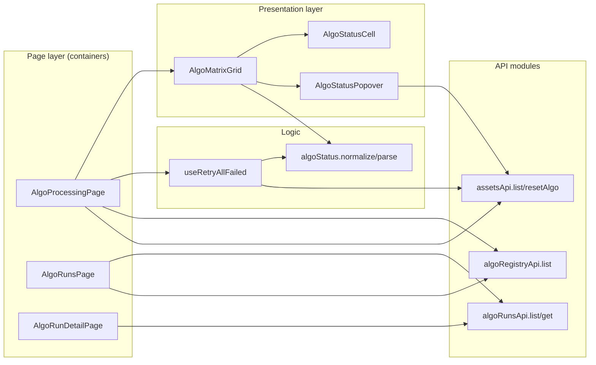
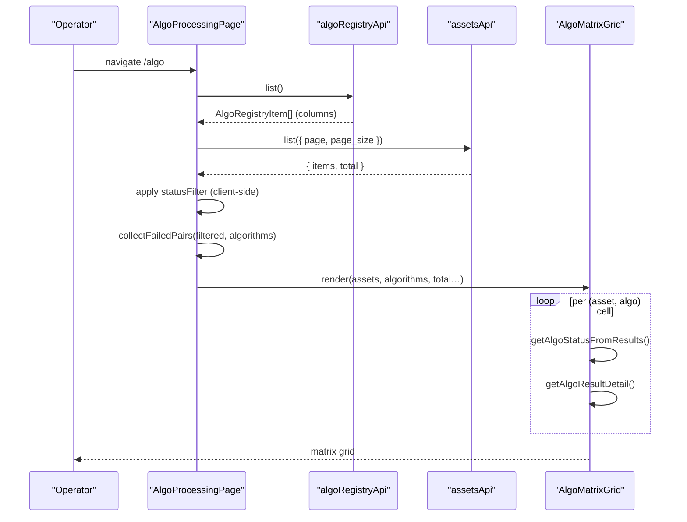
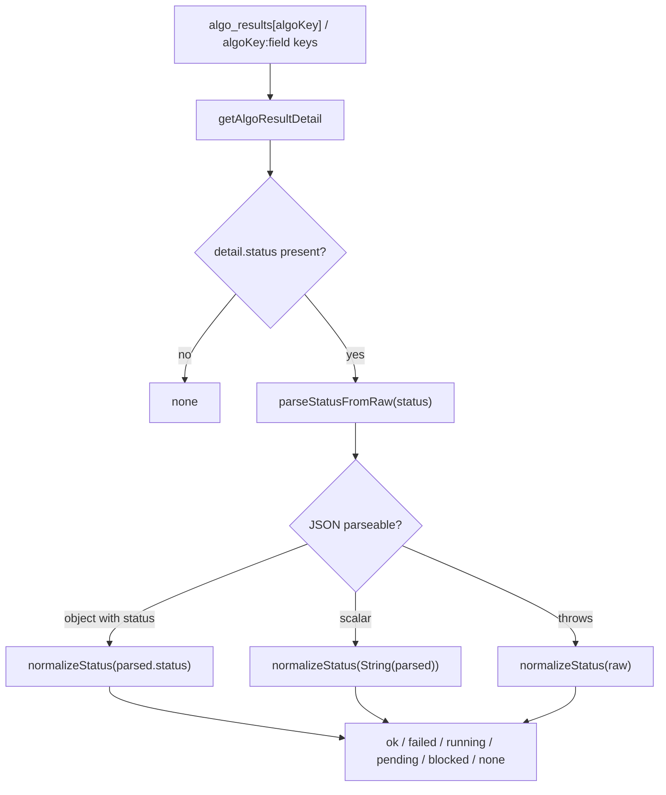
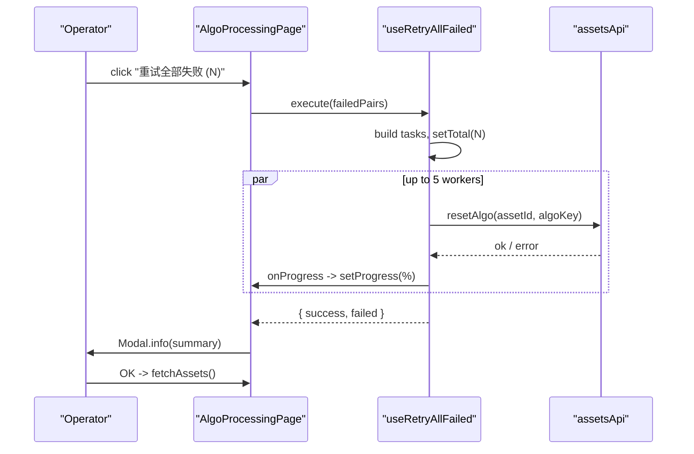
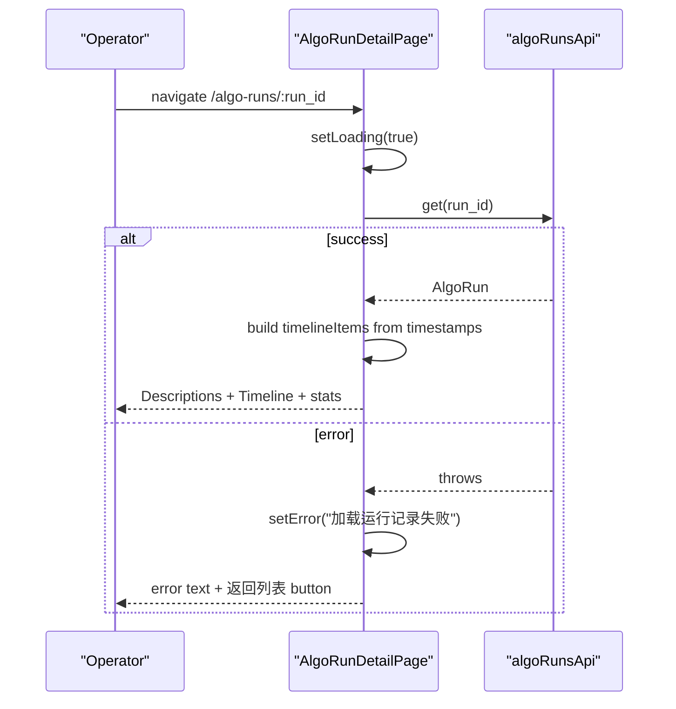
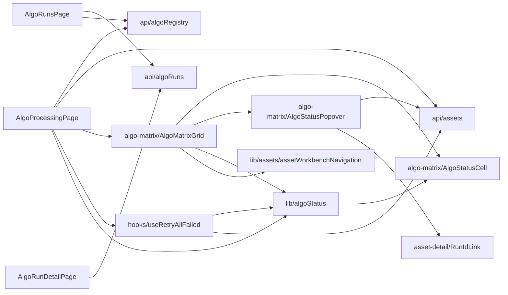

# Algorithm Pages

<cite>
**Referenced Files in This Document**

- [Frontend/src/pages/AlgoProcessingPage.tsx](file://Frontend/src/pages/AlgoProcessingPage.tsx)
- [Frontend/src/pages/AlgoRunsPage.tsx](file://Frontend/src/pages/AlgoRunsPage.tsx)
- [Frontend/src/pages/AlgoRunDetailPage.tsx](file://Frontend/src/pages/AlgoRunDetailPage.tsx)
- [Frontend/src/components/algo-matrix/AlgoMatrixGrid.tsx](file://Frontend/src/components/algo-matrix/AlgoMatrixGrid.tsx)
- [Frontend/src/components/algo-matrix/AlgoStatusCell.tsx](file://Frontend/src/components/algo-matrix/AlgoStatusCell.tsx)
- [Frontend/src/components/algo-matrix/AlgoStatusPopover.tsx](file://Frontend/src/components/algo-matrix/AlgoStatusPopover.tsx)
- [Frontend/src/hooks/algo-matrix/useRetryAllFailed.ts](file://Frontend/src/hooks/algo-matrix/useRetryAllFailed.ts)
- [Frontend/src/lib/algoStatus.ts](file://Frontend/src/lib/algoStatus.ts)
- [Frontend/src/api/algoRuns.ts](file://Frontend/src/api/algoRuns.ts)
- [Frontend/src/api/algoRegistry.ts](file://Frontend/src/api/algoRegistry.ts)
- [Frontend/src/api/assets.ts](file://Frontend/src/api/assets.ts)
- [Frontend/src/App.tsx](file://Frontend/src/App.tsx)
</cite>

## Table of Contents
1. [Introduction](#introduction)
2. [Project Structure](#project-structure)
3. [Core Components](#core-components)
4. [Architecture Overview](#architecture-overview)
5. [Detailed Component Analysis](#detailed-component-analysis)
6. [Dependency Analysis](#dependency-analysis)
7. [Performance Considerations](#performance-considerations)
8. [Troubleshooting Guide](#troubleshooting-guide)
9. [Conclusion](#conclusion)
10. [Appendices](#appendices)

## Introduction

The **Algorithm Pages** are the operator-facing surface of the cyber-databrew
frontend for observing and steering the algorithm processing pipeline. They
answer three distinct operational questions, each backed by its own route and
page component:

- **"What is the per-asset state of every algorithm right now?"** — the
  **Algorithm Processing Matrix** (`AlgoProcessingPage`) renders a grid where
  rows are assets and columns are registered algorithms, with each cell showing
  a normalized status (success / failed / running / pending / blocked / none).
- **"What batch runs have executed, and how did they go?"** — the **Algorithm
  Runs list** (`AlgoRunsPage`) is a filterable, paginated table of run records.
- **"What happened inside a single run?"** — the **Run Detail** view
  (`AlgoRunDetailPage`) shows one run's metadata, a status timeline, and an
  asset-processing summary.

These pages are deliberately resilient: the matrix and the runs list each fall
back to safe empty/error states when their backend endpoints are unavailable,
so the UI degrades gracefully during partial deployments. The matrix also acts
as a *control plane*, not just a dashboard — operators can reset an individual
(asset, algorithm) result from a popover, or batch-retry every failed cell on
the current page.

All three pages are lazily loaded and wired into the router under the `/algo`,
`/algo-runs`, and `/algo-runs/:run_id` paths.

**Section sources**
- [Frontend/src/pages/AlgoProcessingPage.tsx](file://Frontend/src/pages/AlgoProcessingPage.tsx#L35-L208)
- [Frontend/src/pages/AlgoRunsPage.tsx](file://Frontend/src/pages/AlgoRunsPage.tsx#L38-L255)
- [Frontend/src/pages/AlgoRunDetailPage.tsx](file://Frontend/src/pages/AlgoRunDetailPage.tsx#L62-L298)
- [Frontend/src/App.tsx](file://Frontend/src/App.tsx#L20-L61)

## Project Structure

The algorithm feature is split across three layers: **page components**
(route-level containers that own data fetching and filter state), **presentation
components** under `components/algo-matrix/` (the grid, the status cell, and the
status popover), and **logic helpers** — a custom hook for batch retry plus a
shared status-normalization library. The pages talk to the backend through thin
typed API modules (`algoRuns`, `algoRegistry`, `assets`).

- `pages/AlgoProcessingPage.tsx` — matrix container: fetches the algo registry
  and a page of assets, owns the client-side status filter and the batch-retry
  orchestration.
- `pages/AlgoRunsPage.tsx` — runs table: server-side filtering by algorithm,
  status, and date range; click-through to detail.
- `pages/AlgoRunDetailPage.tsx` — single-run reader: descriptions, timeline,
  and processing stats.
- `components/algo-matrix/AlgoMatrixGrid.tsx` — builds the Ant Design table
  whose first column is the asset and whose remaining columns are one per algo.
- `components/algo-matrix/AlgoStatusCell.tsx` — the colored status chip and its
  `CellStatus` type and `STATUS_CONFIG` map.
- `components/algo-matrix/AlgoStatusPopover.tsx` — click-triggered detail panel
  with a per-cell reset action.
- `hooks/algo-matrix/useRetryAllFailed.ts` — collects failed pairs and retries
  them with a bounded concurrency pool.
- `lib/algoStatus.ts` — the single source of truth for parsing raw
  `algo_results` values into a `CellStatus`.

**Diagram sources**
- [Frontend/src/App.tsx](file://Frontend/src/App.tsx#L20-L61)
- [Frontend/src/pages/AlgoProcessingPage.tsx](file://Frontend/src/pages/AlgoProcessingPage.tsx#L15-L23)
- [Frontend/src/components/algo-matrix/AlgoMatrixGrid.tsx](file://Frontend/src/components/algo-matrix/AlgoMatrixGrid.tsx#L1-L12)

**Section sources**
- [Frontend/src/pages/AlgoProcessingPage.tsx](file://Frontend/src/pages/AlgoProcessingPage.tsx#L1-L34)
- [Frontend/src/components/algo-matrix/AlgoMatrixGrid.tsx](file://Frontend/src/components/algo-matrix/AlgoMatrixGrid.tsx#L1-L34)

## Core Components

#### AlgoProcessingPage (the matrix container)

`AlgoProcessingPage` owns all matrix state: the algorithm list, the current page
of assets, pagination (`page`/`pageSize`, default 50), a loading flag, an error
message, and a multi-select `statusFilter`. It fetches the registry exactly once
on mount and re-fetches assets whenever pagination changes. Status filtering is
done **client-side** over the loaded page, and the batch-retry button is wired to
the `useRetryAllFailed` hook.

**Section sources**
- [Frontend/src/pages/AlgoProcessingPage.tsx](file://Frontend/src/pages/AlgoProcessingPage.tsx#L36-L119)

#### AlgoMatrixGrid (dynamic column model)

`AlgoMatrixGrid` is a controlled, presentational table. Its column model is
**data-driven**: a fixed left "Asset ID" column followed by one centered column
per registered algorithm. Each algo cell resolves a status and a detail object
via `lib/algoStatus`, renders an `AlgoStatusCell`, and wraps it in an
`AlgoStatusPopover` for click-through detail and reset.

**Section sources**
- [Frontend/src/components/algo-matrix/AlgoMatrixGrid.tsx](file://Frontend/src/components/algo-matrix/AlgoMatrixGrid.tsx#L25-L114)

#### AlgoStatusCell and the CellStatus model

`AlgoStatusCell` renders a 32×32 rounded chip whose color, background, icon, and
label come from `STATUS_CONFIG`, keyed by the `CellStatus` union
(`ok | failed | running | pending | blocked | none`). The `blocked` state gets a
richer tooltip hinting that clicking reveals blocking details and suggested
actions.

**Section sources**
- [Frontend/src/components/algo-matrix/AlgoStatusCell.tsx](file://Frontend/src/components/algo-matrix/AlgoStatusCell.tsx#L11-L117)

#### AlgoStatusPopover (per-cell control)

`AlgoStatusPopover` shows a click-triggered `Descriptions` panel with status,
timestamps, run id, output URI, reason, and a heuristic **recommended action**.
It carries a per-cell **Reset** button that calls `assetsApi.resetAlgo` and
invokes `onReset` (the page's `fetchAssets`) on success.

**Section sources**
- [Frontend/src/components/algo-matrix/AlgoStatusPopover.tsx](file://Frontend/src/components/algo-matrix/AlgoStatusPopover.tsx#L47-L123)

#### useRetryAllFailed (batch control)

The hook exposes `collectFailedPairs` (a pure function that walks assets ×
algorithms and emits every `(assetId, algoKey)` whose normalized status is
`failed`) and an `execute` runner that calls `resetAlgo` for each pair through a
**concurrency-limited pool of 5 workers**, reporting `progress`/`total` and a
`{ success, failed }` tally.

**Section sources**
- [Frontend/src/hooks/algo-matrix/useRetryAllFailed.ts](file://Frontend/src/hooks/algo-matrix/useRetryAllFailed.ts#L23-L99)

#### algoStatus (shared normalization)

`lib/algoStatus.ts` is the single parser both the grid and the retry hook rely
on, guaranteeing the two views agree on what counts as "failed". It tolerates
raw status strings, JSON-encoded `{status: …}` blobs, and a legacy
`"<algoKey>:<field>"` flattened-key layout.

**Section sources**
- [Frontend/src/lib/algoStatus.ts](file://Frontend/src/lib/algoStatus.ts#L9-L96)

#### AlgoRunsPage and AlgoRunDetailPage (run records)

`AlgoRunsPage` is a server-filtered table of `AlgoRun` rows with algorithm,
status, and date-range filters; `AlgoRunDetailPage` reads a single run by id and
renders descriptions, a derived status timeline, and an asset-processing stat
card.

**Section sources**
- [Frontend/src/pages/AlgoRunsPage.tsx](file://Frontend/src/pages/AlgoRunsPage.tsx#L38-L90)
- [Frontend/src/pages/AlgoRunDetailPage.tsx](file://Frontend/src/pages/AlgoRunDetailPage.tsx#L62-L111)

## Architecture Overview

The three pages share one backbone: a route-level container fetches data via a
typed API module into React state, then hands that state to presentational
children. The matrix is the only page that also writes back to the backend
(reset / retry), so it carries the most state and the richest control flow.

**Diagram sources**
- [Frontend/src/pages/AlgoProcessingPage.tsx](file://Frontend/src/pages/AlgoProcessingPage.tsx#L52-L103)
- [Frontend/src/api/algoRuns.ts](file://Frontend/src/api/algoRuns.ts#L29-L45)
- [Frontend/src/api/assets.ts](file://Frontend/src/api/assets.ts#L343-L347)

**Section sources**
- [Frontend/src/pages/AlgoProcessingPage.tsx](file://Frontend/src/pages/AlgoProcessingPage.tsx#L35-L208)
- [Frontend/src/api/algoRegistry.ts](file://Frontend/src/api/algoRegistry.ts#L14-L19)

## Detailed Component Analysis

### The Processing Matrix data load

On mount, `AlgoProcessingPage` issues two independent fetches. The registry load
(`algoRegistryApi.list`) runs once and defines the matrix columns; the asset load
(`assetsApi.list`) runs on every pagination change via the `fetchAssets`
callback. Failures of either set a localized Chinese error banner rather than
crashing. The grid is rendered only after the page has the algorithm list (the
big spinner shows while `loading && algorithms.length === 0`).

The filter is purely client-side: `filteredAssets` keeps assets where any
algorithm's normalized status is in the selected set, and `effectiveTotal`
swaps the server `total` for the filtered length so pagination text stays
consistent on the current page. `failedPairs` is recomputed from the *filtered*
view, so the retry button's count and target set match exactly what the operator
sees.

**Diagram sources**
- [Frontend/src/pages/AlgoProcessingPage.tsx](file://Frontend/src/pages/AlgoProcessingPage.tsx#L52-L103)
- [Frontend/src/components/algo-matrix/AlgoMatrixGrid.tsx](file://Frontend/src/components/algo-matrix/AlgoMatrixGrid.tsx#L65-L92)

**Section sources**
- [Frontend/src/pages/AlgoProcessingPage.tsx](file://Frontend/src/pages/AlgoProcessingPage.tsx#L52-L119)

### Status normalization pipeline

Every cell's color is decided by a small parsing chain in `lib/algoStatus.ts`.
`getAlgoStatusFromResults` calls `getAlgoResultDetail` to build a detail object,
then feeds the `status` field through `parseStatusFromRaw` and `normalizeStatus`.
The detail builder handles two storage shapes at once: a legacy value stored
under the bare `algoKey` (which may itself be a JSON object or a plain string)
and a flattened layout where fields live under `"<algoKey>:<field>"` keys.

`normalizeStatus` collapses synonyms — `success`→`ok`, `error`→`failed` — so the
matrix and the retry hook never disagree about a "failed" cell. `isFailedStatus`
is the single predicate used by both the per-cell rendering and
`collectFailedPairs`.

**Diagram sources**
- [Frontend/src/lib/algoStatus.ts](file://Frontend/src/lib/algoStatus.ts#L9-L96)

**Section sources**
- [Frontend/src/lib/algoStatus.ts](file://Frontend/src/lib/algoStatus.ts#L1-L97)
- [Frontend/src/hooks/algo-matrix/useRetryAllFailed.ts](file://Frontend/src/hooks/algo-matrix/useRetryAllFailed.ts#L23-L38)

### Per-cell reset and batch retry

A single cell can be reset from its popover, and the whole page's failed cells
can be retried in one action. Both call the same `assetsApi.resetAlgo` endpoint;
the difference is fan-out. The batch path bounds concurrency at 5 and reports a
percentage that the page renders as a `Progress` bar, then surfaces a
`{ success, failed }` summary in a modal whose `onOk` re-fetches the matrix.

For a single cell, `AlgoStatusPopover.handleReset` flips a local `resetting`
flag, calls `resetAlgo`, shows a success/error `message`, and triggers
`onReset` — which the grid threads up to the page's `fetchAssets`.

**Diagram sources**
- [Frontend/src/hooks/algo-matrix/useRetryAllFailed.ts](file://Frontend/src/hooks/algo-matrix/useRetryAllFailed.ts#L40-L99)
- [Frontend/src/pages/AlgoProcessingPage.tsx](file://Frontend/src/pages/AlgoProcessingPage.tsx#L105-L119)

**Section sources**
- [Frontend/src/components/algo-matrix/AlgoStatusPopover.tsx](file://Frontend/src/components/algo-matrix/AlgoStatusPopover.tsx#L54-L67)
- [Frontend/src/pages/AlgoProcessingPage.tsx](file://Frontend/src/pages/AlgoProcessingPage.tsx#L45-L50)

### The Runs list

`AlgoRunsPage` keeps pagination (default page size 20) and three filter values
(algorithm key, status, date range) in state and re-fetches whenever any change
via the `fetchData` callback. Filters are sent to the server as query params
(`algo_name`, `status`, `started_after`, `started_before`). The algorithm
dropdown is built from the registry as `name@version` labels keyed by `key`. The
table renders run id as a `Link` to the detail route, formats duration from
`started_at`/`finished_at`, and color-codes status via `STATUS_COLOR`. Whole-row
clicks navigate to detail, but clicks on interactive descendants (links,
buttons, the pagination, selects) are ignored.

If the runs endpoint is unavailable, the catch block resets to an empty list and
zero total rather than throwing — an intentional graceful-degradation choice.

**Section sources**
- [Frontend/src/pages/AlgoRunsPage.tsx](file://Frontend/src/pages/AlgoRunsPage.tsx#L38-L170)
- [Frontend/src/pages/AlgoRunsPage.tsx](file://Frontend/src/pages/AlgoRunsPage.tsx#L219-L252)

### The Run Detail view

`AlgoRunDetailPage` reads `run_id` from the route, fetches the run via
`algoRunsApi.get`, and renders three blocks: a `Descriptions` of run metadata, a
**status timeline** assembled from whichever of `created_at`/`started_at`/
`finished_at` are present (the final node's color reflects the terminal status),
and an asset-processing stat card shown only when `assets_processed > 0`. A
header tag mirrors the run status with its icon and Chinese label, and an
optional external-link button appears when `external_url` is set.

**Diagram sources**
- [Frontend/src/pages/AlgoRunDetailPage.tsx](file://Frontend/src/pages/AlgoRunDetailPage.tsx#L74-L111)

**Section sources**
- [Frontend/src/pages/AlgoRunDetailPage.tsx](file://Frontend/src/pages/AlgoRunDetailPage.tsx#L113-L296)

## Dependency Analysis

The matrix page is the integration hub: it depends on the registry API for
columns, the assets API for rows and for the reset endpoint, the grid/cell/
popover trio for rendering, the shared status library for normalization, and the
retry hook for batch control. The runs pages depend only on the runs API
(plus the registry for the filter dropdown).

Note one structural detail: `lib/algoStatus` re-exports the `CellStatus` type
that is *defined* in `AlgoStatusCell.tsx`, so the cell component is the canonical
owner of the status enum while the library owns the parsing.

**Diagram sources**
- [Frontend/src/components/algo-matrix/AlgoMatrixGrid.tsx](file://Frontend/src/components/algo-matrix/AlgoMatrixGrid.tsx#L1-L12)
- [Frontend/src/lib/algoStatus.ts](file://Frontend/src/lib/algoStatus.ts#L5-L7)

**Section sources**
- [Frontend/src/api/algoRuns.ts](file://Frontend/src/api/algoRuns.ts#L1-L45)
- [Frontend/src/api/algoRegistry.ts](file://Frontend/src/api/algoRegistry.ts#L1-L19)
- [Frontend/src/api/assets.ts](file://Frontend/src/api/assets.ts#L343-L347)

## Performance Considerations

- **Dynamic column width.** The matrix sets horizontal scroll to
  `220 + algorithms.length * 80`, so wide registries scroll horizontally rather
  than squeezing cells. The asset id column is `fixed: "left"` to stay visible.
- **Client-side filtering scope.** The status filter only narrows the *current
  page* of assets; it does not re-query the server. With many algorithms this is
  an O(assets × algorithms) scan per render in `filteredAssets`, `effectiveTotal`,
  and `collectFailedPairs` — acceptable at the default page size of 50 but worth
  noting if page size is raised to 100.
- **Bounded retry concurrency.** `runWithConcurrency` caps in-flight resets at 5
  workers, preventing a wide page of failures from flooding the backend with
  simultaneous `resetAlgo` POSTs while still parallelizing.
- **Per-cell parsing cost.** Each render parses `algo_results` per cell through
  `getAlgoResultDetail`/`parseStatusFromRaw`, which include `JSON.parse` in a
  try/catch. There is no memoization, so heavy re-renders re-parse; the values
  are small, but this is the hot path for large grids.
- **Lazy routes.** All three pages are `lazy`-imported in `App.tsx`, keeping the
  algorithm bundle out of the initial load.
- **Pagination quick-jumper** appears only when `total > 200`, on both the matrix
  and the runs table.

**Section sources**
- [Frontend/src/components/algo-matrix/AlgoMatrixGrid.tsx](file://Frontend/src/components/algo-matrix/AlgoMatrixGrid.tsx#L100-L111)
- [Frontend/src/pages/AlgoProcessingPage.tsx](file://Frontend/src/pages/AlgoProcessingPage.tsx#L82-L103)
- [Frontend/src/hooks/algo-matrix/useRetryAllFailed.ts](file://Frontend/src/hooks/algo-matrix/useRetryAllFailed.ts#L40-L61)
- [Frontend/src/App.tsx](file://Frontend/src/App.tsx#L20-L22)

## Troubleshooting Guide

#### The matrix has no columns
Columns come solely from `algoRegistryApi.list`. If the registry call fails the
page shows the banner "无法加载算法注册表" and the grid renders only the Asset ID
column. Check the `/algo-registry` endpoint and that it returns `{ items: [...] }`.

**Section sources**
- [Frontend/src/pages/AlgoProcessingPage.tsx](file://Frontend/src/pages/AlgoProcessingPage.tsx#L52-L60)
- [Frontend/src/api/algoRegistry.ts](file://Frontend/src/api/algoRegistry.ts#L14-L19)

#### All cells show "无数据" / grey
A cell is `none` when `getAlgoResultDetail` finds nothing or the status string is
unrecognized. Confirm `asset.algo_results` is populated and that statuses match
the synonyms in `normalizeStatus` (`ok/success`, `failed/error`, `running`,
`pending`, `blocked`); anything else normalizes to `none`.

**Section sources**
- [Frontend/src/lib/algoStatus.ts](file://Frontend/src/lib/algoStatus.ts#L9-L36)
- [Frontend/src/lib/algoStatus.ts](file://Frontend/src/lib/algoStatus.ts#L52-L96)

#### "重试全部失败" button is disabled
The button is disabled and the tooltip says "当前筛选结果中没有失败任务" when
`failedPairs.length === 0`. Because failed pairs are computed from the *filtered*
view, an active status filter that excludes `failed` will empty the set even if
the unfiltered page has failures.

**Section sources**
- [Frontend/src/pages/AlgoProcessingPage.tsx](file://Frontend/src/pages/AlgoProcessingPage.tsx#L102-L103)
- [Frontend/src/pages/AlgoProcessingPage.tsx](file://Frontend/src/pages/AlgoProcessingPage.tsx#L155-L175)

#### Reset succeeds but the cell does not change
`resetAlgo` only enqueues a reset; the cell reflects new state after `onReset` /
`fetchAssets` re-pulls assets. If the value is unchanged after refresh, the
backend has not yet updated the asset's `algo_results`.

**Section sources**
- [Frontend/src/components/algo-matrix/AlgoStatusPopover.tsx](file://Frontend/src/components/algo-matrix/AlgoStatusPopover.tsx#L56-L67)
- [Frontend/src/api/assets.ts](file://Frontend/src/api/assets.ts#L343-L347)

#### Runs table is empty
`AlgoRunsPage` swallows fetch errors into an empty state by design (the endpoint
"may not be available yet"). An empty table with "共 0 条" can therefore mean
either no matching runs or an unreachable `/algo-runs` endpoint — check the
network tab to distinguish.

**Section sources**
- [Frontend/src/pages/AlgoRunsPage.tsx](file://Frontend/src/pages/AlgoRunsPage.tsx#L59-L79)

#### Run detail shows "运行记录未找到"
The detail page renders the not-found block when `error` is set or `run` is
null. Verify the `run_id` route param and that `algoRunsApi.get(run_id)` returns
a record.

**Section sources**
- [Frontend/src/pages/AlgoRunDetailPage.tsx](file://Frontend/src/pages/AlgoRunDetailPage.tsx#L74-L111)

## Conclusion

The algorithm pages turn the processing pipeline into an inspectable, steerable
surface. The matrix unifies per-asset/per-algorithm state behind one normalized
`CellStatus` enum and offers both surgical (per-cell reset) and bulk
(concurrency-limited batch retry) controls; the runs list and detail view make
historical batch executions queryable and explainable. Shared parsing in
`lib/algoStatus` keeps the grid and the retry logic in lockstep, and consistent
graceful-degradation behavior keeps the UI usable during partial backend
availability.

## Appendices

### Routes

| Path | Component | Source |
| --- | --- | --- |
| `/algo` | `AlgoProcessingPage` | [App.tsx#L59](file://Frontend/src/App.tsx#L59-L59) |
| `/algo-runs` | `AlgoRunsPage` | [App.tsx#L60](file://Frontend/src/App.tsx#L60-L60) |
| `/algo-runs/:run_id` | `AlgoRunDetailPage` | [App.tsx#L61](file://Frontend/src/App.tsx#L61-L61) |

### CellStatus values

| Status | Color | Label | Source |
| --- | --- | --- | --- |
| `ok` | green `#16a34a` | 成功 | [AlgoStatusCell.tsx#L23-L28](file://Frontend/src/components/algo-matrix/AlgoStatusCell.tsx#L23-L28) |
| `failed` | red `#dc2626` | 失败 | [AlgoStatusCell.tsx#L29-L34](file://Frontend/src/components/algo-matrix/AlgoStatusCell.tsx#L29-L34) |
| `running` | amber `#d97706` | 运行中 | [AlgoStatusCell.tsx#L35-L40](file://Frontend/src/components/algo-matrix/AlgoStatusCell.tsx#L35-L40) |
| `pending` | slate `#64748b` | 待处理 | [AlgoStatusCell.tsx#L41-L46](file://Frontend/src/components/algo-matrix/AlgoStatusCell.tsx#L41-L46) |
| `blocked` | slate `#64748b` | 已阻塞 | [AlgoStatusCell.tsx#L47-L52](file://Frontend/src/components/algo-matrix/AlgoStatusCell.tsx#L47-L52) |
| `none` | grey `#94a3b8` | 无数据 | [AlgoStatusCell.tsx#L53-L58](file://Frontend/src/components/algo-matrix/AlgoStatusCell.tsx#L53-L58) |

### API surface

| Call | HTTP | Source |
| --- | --- | --- |
| `algoRegistryApi.list()` | GET `/algo-registry` | [algoRegistry.ts#L14-L19](file://Frontend/src/api/algoRegistry.ts#L14-L19) |
| `algoRunsApi.list(params)` | GET `/algo-runs?…` | [algoRuns.ts#L30-L41](file://Frontend/src/api/algoRuns.ts#L30-L41) |
| `algoRunsApi.get(runId)` | GET `/algo-runs/{runId}` | [algoRuns.ts#L43-L44](file://Frontend/src/api/algoRuns.ts#L43-L44) |
| `assetsApi.resetAlgo(assetId, algoKey)` | POST `/assets/{assetId}/algo/{algoKey}/reset` | [assets.ts#L343-L347](file://Frontend/src/api/assets.ts#L343-L347) |

### AlgoRun model

| Field | Type | Source |
| --- | --- | --- |
| `run_id`, `algo_name`, `algo_version`, `algo_kind`, `triggered_by`, `status` | string | [algoRuns.ts#L4-L18](file://Frontend/src/api/algoRuns.ts#L4-L18) |
| `started_at`, `finished_at`, `created_at`, `external_url` | string? | [algoRuns.ts#L4-L18](file://Frontend/src/api/algoRuns.ts#L4-L18) |
| `assets_processed`, `assets_succeeded`, `assets_failed` | number? | [algoRuns.ts#L4-L18](file://Frontend/src/api/algoRuns.ts#L4-L18) |

**Section sources**
- [Frontend/src/App.tsx](file://Frontend/src/App.tsx#L59-L61)
- [Frontend/src/components/algo-matrix/AlgoStatusCell.tsx](file://Frontend/src/components/algo-matrix/AlgoStatusCell.tsx#L19-L59)
- [Frontend/src/api/algoRuns.ts](file://Frontend/src/api/algoRuns.ts#L4-L45)
