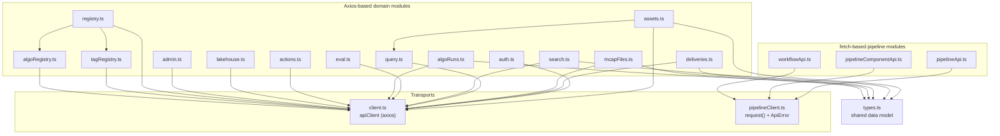
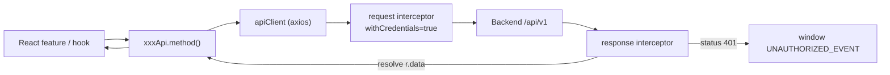
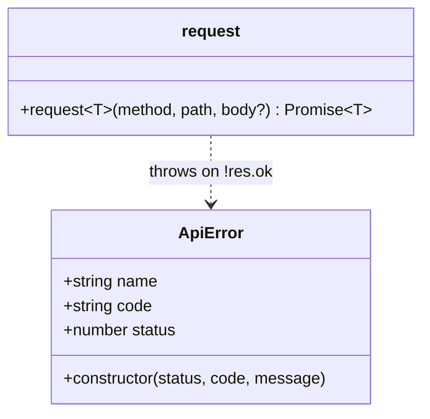
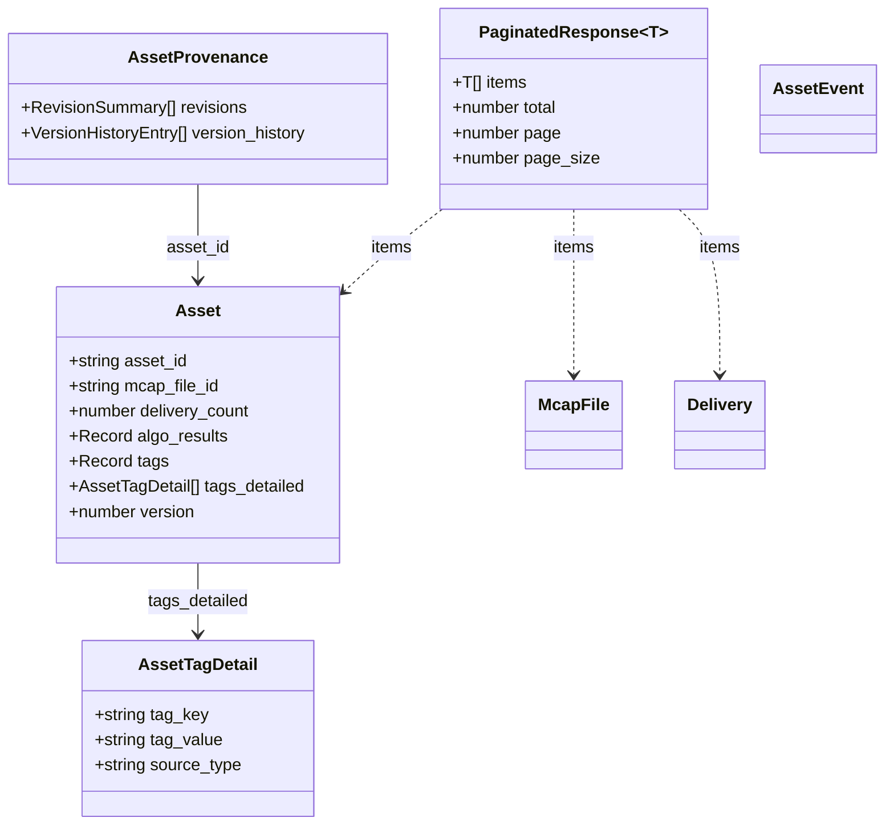
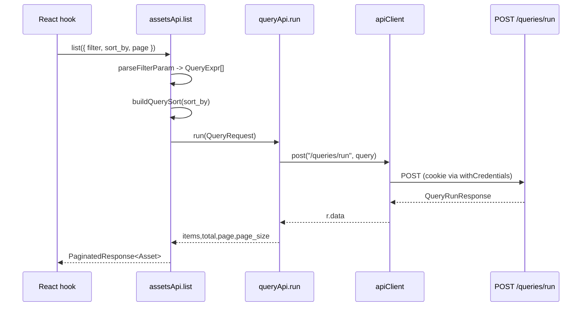
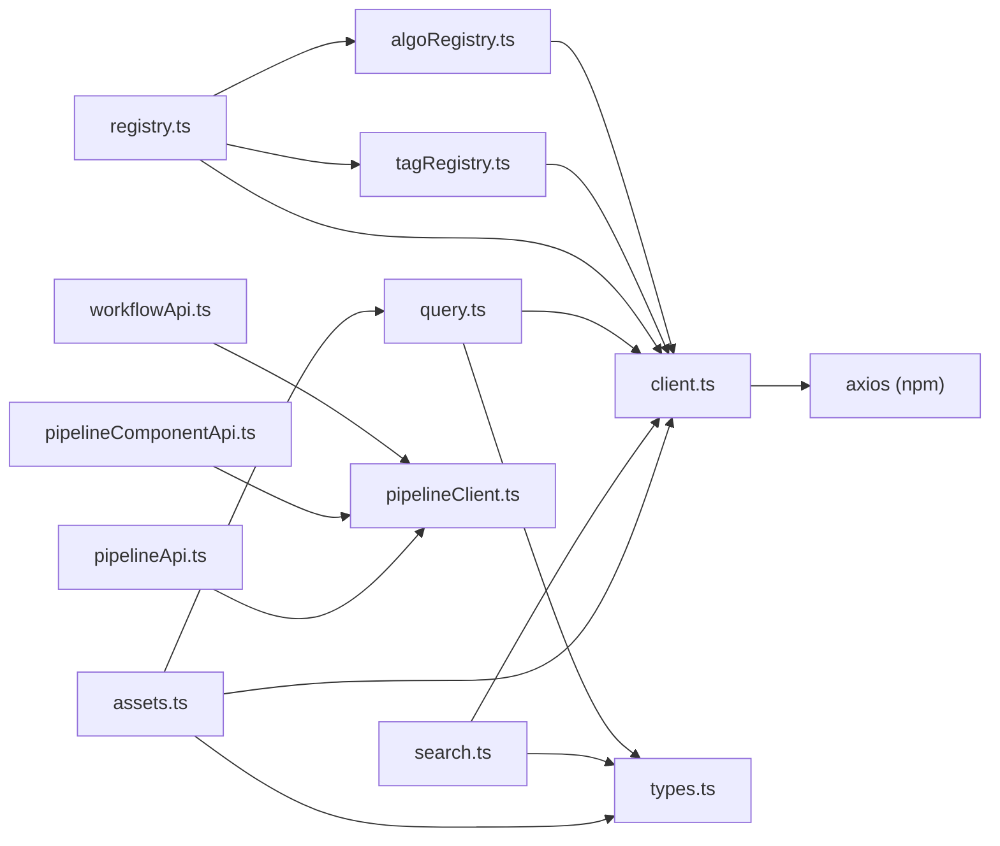

# API Layer

<cite>
**Referenced Files in This Document**

- [Frontend/src/api/client.ts](file://Frontend/src/api/client.ts)
- [Frontend/src/api/types.ts](file://Frontend/src/api/types.ts)
- [Frontend/src/api/actions.ts](file://Frontend/src/api/actions.ts)
- [Frontend/src/api/admin.ts](file://Frontend/src/api/admin.ts)
- [Frontend/src/api/algoRegistry.ts](file://Frontend/src/api/algoRegistry.ts)
- [Frontend/src/api/algoRuns.ts](file://Frontend/src/api/algoRuns.ts)
- [Frontend/src/api/assets.ts](file://Frontend/src/api/assets.ts)
- [Frontend/src/api/auth.ts](file://Frontend/src/api/auth.ts)
- [Frontend/src/api/deliveries.ts](file://Frontend/src/api/deliveries.ts)
- [Frontend/src/api/eval.ts](file://Frontend/src/api/eval.ts)
- [Frontend/src/api/lakehouse.ts](file://Frontend/src/api/lakehouse.ts)
- [Frontend/src/api/mcapFiles.ts](file://Frontend/src/api/mcapFiles.ts)
- [Frontend/src/api/pipelineApi.ts](file://Frontend/src/api/pipelineApi.ts)
- [Frontend/src/api/pipelineClient.ts](file://Frontend/src/api/pipelineClient.ts)
- [Frontend/src/api/pipelineComponentApi.ts](file://Frontend/src/api/pipelineComponentApi.ts)
- [Frontend/src/api/query.ts](file://Frontend/src/api/query.ts)
- [Frontend/src/api/registry.ts](file://Frontend/src/api/registry.ts)
- [Frontend/src/api/search.ts](file://Frontend/src/api/search.ts)
- [Frontend/src/api/tagRegistry.ts](file://Frontend/src/api/tagRegistry.ts)
- [Frontend/src/api/workflowApi.ts](file://Frontend/src/api/workflowApi.ts)
</cite>

## Table of Contents
1. [Introduction](#introduction)
2. [Project Structure](#project-structure)
3. [Core Components](#core-components)
4. [Architecture Overview](#architecture-overview)
5. [Detailed Component Analysis](#detailed-component-analysis)
6. [Dependency Analysis](#dependency-analysis)
7. [Performance Considerations](#performance-considerations)
8. [Troubleshooting Guide](#troubleshooting-guide)
9. [Conclusion](#conclusion)
10. [Appendices](#appendices)

## Introduction

The frontend API layer is the single boundary through which the React
application talks to the cyber-databrew backend. It lives under
`Frontend/src/api/` and is organized as a thin shared transport plus a set of
typed *domain modules*, one module per backend resource family (assets, auth,
deliveries, lakehouse, MCAP files, queries, search, registries, algo runs,
evals, pipelines, workflows, admin, and action annotations).

Two design goals drive the layer:

1. **One place for transport concerns.** Base URL, credentials, timeout, and
   global `401` handling are configured once on a shared Axios instance so no
   individual call has to repeat them.
2. **Typed request/response contracts.** Every endpoint is wrapped in a small
   function that returns a `Promise<T>` for a TypeScript interface that mirrors
   the backend's JSON shape, so feature code and React Query hooks consume
   strongly-typed data rather than untyped `any`.

There are actually **two transports** in this layer. The dominant one is the
Axios `apiClient` in `client.ts`, used by almost every domain module. A second,
narrower transport — a hand-rolled `fetch` wrapper in `pipelineClient.ts` —
serves the pipeline/workflow/component modules and carries its own `ApiError`
class. This page documents both, the typed domain modules built on top of them,
and the shared types in `types.ts`.

**Section sources**
- [Frontend/src/api/client.ts](file://Frontend/src/api/client.ts#L1-L29)
- [Frontend/src/api/pipelineClient.ts](file://Frontend/src/api/pipelineClient.ts#L1-L51)

## Project Structure

All API code is flat inside `Frontend/src/api/`. Files fall into four roles:

- **Transports** — `client.ts` (Axios instance) and `pipelineClient.ts`
  (`fetch` wrapper + `ApiError`).
- **Shared types** — `types.ts`, which declares the cross-module data model
  (`Asset`, `McapFile`, `Delivery`, `PaginatedResponse<T>`, event and stats
  shapes) reused by several domain modules.
- **Domain modules** — `assets.ts`, `auth.ts`, `deliveries.ts`,
  `mcapFiles.ts`, `query.ts`, `search.ts`, `eval.ts`, `algoRuns.ts`,
  `actions.ts`, `lakehouse.ts`, `admin.ts`, plus the registry trio
  `registry.ts`, `tagRegistry.ts`, `algoRegistry.ts`. Each exports a single
  `xxxApi` object whose methods correspond to backend endpoints.
- **Pipeline/workflow modules** — `pipelineApi.ts`, `pipelineComponentApi.ts`,
  `workflowApi.ts`, which export free functions (not an `xxxApi` object) and
  route through `pipelineClient.request`.

**Diagram sources**
- [Frontend/src/api/client.ts](file://Frontend/src/api/client.ts#L11-L29)
- [Frontend/src/api/pipelineClient.ts](file://Frontend/src/api/pipelineClient.ts#L14-L51)
- [Frontend/src/api/assets.ts](file://Frontend/src/api/assets.ts#L1-L17)
- [Frontend/src/api/registry.ts](file://Frontend/src/api/registry.ts#L1-L3)

**Section sources**
- [Frontend/src/api/types.ts](file://Frontend/src/api/types.ts#L1-L9)
- [Frontend/src/api/pipelineApi.ts](file://Frontend/src/api/pipelineApi.ts#L1-L3)
- [Frontend/src/api/workflowApi.ts](file://Frontend/src/api/workflowApi.ts#L1-L1)

## Core Components

The layer is built from a handful of load-bearing pieces:

- **`apiClient`** — the shared Axios instance. It fixes `baseURL` to `/api/v1`
  and a 30-second default timeout, attaches `withCredentials` on every request,
  and intercepts `401` responses to dispatch a global unauthorized event.
- **Timeout constants** — `DEFAULT_TIMEOUT` (30 s) and the exported
  `LAKEHOUSE_TIMEOUT` (90 s) for the longer analytics/lakehouse queries.
- **`UNAUTHORIZED_EVENT`** — the event name dispatched on the `window` when the
  backend returns `401`, which the auth/session layer listens for to redirect
  to login.
- **`request<T>()` + `ApiError`** — the alternative `fetch` transport for
  pipeline modules, with structured error decoding into a typed `ApiError`
  carrying `status`, `code`, and `message`.
- **Domain `xxxApi` objects** — the public surface each module exports
  (`assetsApi`, `authApi`, `deliveriesApi`, `queryApi`, `searchApi`,
  `lakehouseApi`, `adminApi`, `evalApi`, `algoRunsApi`, `actionsApi`,
  `registryApi`, `tagRegistryApi`, `algoRegistryApi`, `mcapFilesApi`).
- **Shared model types** — `Asset`, `McapFile`, `Delivery`, `DeliveryItem`,
  `AlgoEvent`, `AssetEvent`, `PaginatedResponse<T>`, `PlatformStats`, and the
  algo-status helpers in `types.ts`.

**Section sources**
- [Frontend/src/api/client.ts](file://Frontend/src/api/client.ts#L1-L29)
- [Frontend/src/api/types.ts](file://Frontend/src/api/types.ts#L1-L198)
- [Frontend/src/api/pipelineClient.ts](file://Frontend/src/api/pipelineClient.ts#L1-L51)

## Architecture Overview

Every Axios-based module imports the singleton `apiClient` and calls
`apiClient.get/post/patch/delete`, returning `r.data` typed to the module's
interface. The instance is created with a relative `baseURL` of `/api/v1`, so
the running web server proxies API traffic to the backend on the same origin;
combined with `withCredentials = true`, the browser sends the session cookie on
every request. Authentication is therefore cookie/session based rather than a
manually-attached bearer token — the request interceptor never reads a token
from storage; it only forces `withCredentials`.

The response interceptor is the layer's central error funnel: any `401` from
any endpoint dispatches a `window` event (`UNAUTHORIZED_EVENT`) and re-rejects
the original error, so all callers still see the rejection while a single
session listener handles the redirect-to-login.

**Diagram sources**
- [Frontend/src/api/client.ts](file://Frontend/src/api/client.ts#L11-L29)

**Section sources**
- [Frontend/src/api/client.ts](file://Frontend/src/api/client.ts#L1-L29)
- [Frontend/src/api/auth.ts](file://Frontend/src/api/auth.ts#L15-L24)

## Detailed Component Analysis

### Shared Transport: `client.ts`

`client.ts` creates one Axios instance and exports it as `apiClient`. The base
URL `/api/v1` and `DEFAULT_TIMEOUT` of `30_000` ms are set at construction
time. A request interceptor sets `config.withCredentials = true` so the session
cookie is always sent. The response interceptor passes successful responses
through untouched, and on a `401` it dispatches a `window` event named by the
exported `UNAUTHORIZED_EVENT` constant before rejecting the promise so callers
still observe the failure. The file also exports `LAKEHOUSE_TIMEOUT` (`90_000`
ms) for analytics-heavy calls that may exceed the default.

Note the literal value of `UNAUTHORIZED_EVENT` is `"***"` in source; the rest
of the app references the constant rather than the literal.

**Section sources**
- [Frontend/src/api/client.ts](file://Frontend/src/api/client.ts#L1-L29)

### Alternative Transport: `pipelineClient.ts`

The pipeline family uses a separate `request<T>(method, path, body?)` helper
built on the native `fetch`. It prefixes paths with the same `/api/v1` base,
sets `Content-Type: application/json` when a body is present, adds
`X-Requested-With: XMLHttpRequest` for mutating methods, and sends
`credentials: "include"` to carry the cookie. On a non-OK response it attempts
to decode `{ code, message | error }` from the body and throws a typed
`ApiError(status, code, message)`. It returns `undefined` for `204 No Content`
and for non-JSON responses, otherwise parses the JSON as `T`.

**Diagram sources**
- [Frontend/src/api/pipelineClient.ts](file://Frontend/src/api/pipelineClient.ts#L3-L51)

**Section sources**
- [Frontend/src/api/pipelineClient.ts](file://Frontend/src/api/pipelineClient.ts#L1-L51)

### Shared Types: `types.ts`

`types.ts` is the data-model spine. It declares the generic
`PaginatedResponse<T>` envelope (`items`, `total`, `page`, `page_size`) and the
domain entities: `Asset` (with `AssetTagDetail`, `RevisionSummary`,
`VersionHistoryEntry`, `AssetProvenance`), `McapFile`, `Delivery`,
`DeliveryItem`, the event types `AlgoEvent` and `AssetEvent`, dashboard
aggregates `PlatformStats`/`ActivityItem`, the `AlgoStatus` union and `AlgoInfo`
helper, and `PipelineLineage`. Domain modules import these rather than
re-declaring them, which keeps the contract consistent across assets, search,
deliveries, and stats.

**Diagram sources**
- [Frontend/src/api/types.ts](file://Frontend/src/api/types.ts#L3-L120)

**Section sources**
- [Frontend/src/api/types.ts](file://Frontend/src/api/types.ts#L1-L198)

### Assets Module: `assets.ts`

`assets.ts` is the richest module. Its `assetsApi.list()` does not hit a simple
`GET /assets` list endpoint — it translates `ListAssetsParams`
(`mcap_file_id`, `filter[]`, `sort_by`, paging) into a structured `QueryRequest`
and delegates to `queryApi.run()`, then reshapes the result into a
`PaginatedResponse<Asset>`. The `parseFilterParam` helper turns
`field:op:value` strings into `QueryExpr` predicates (splitting comma values
into arrays), and `buildQuerySort` maps `-field` to descending order, defaulting
to `updated_at desc`.

Beyond listing, the module covers single-asset CRUD (`get`, `batchGet` via
`POST /assets:batch_get`, `create`, `update`, `delete`), tag mutation
(`upsertTag`, `deleteTag` with `source_type`), delivery association
(`listDeliveries`), the algo lifecycle (`startAlgo`, `finishAlgo`, `resetAlgo`),
preview/playback sources (`getPreviewManifest`, `getFoxgloveSource`), lineage
and provenance (`getLineage`, `getPipelineLineage`, `getProvenance`), and event
access. Events have both paged readers (`listEvents`, `listAlgoEvents`,
`listGlobalEvents`) and Server-Sent-Events streams (`streamForAsset`,
`streamGlobalEvents`) built on `EventSource`. The `toAlgoEvent`/`toAssetEvent`
and `parseStreamEvent` helpers normalize raw rows and SSE payloads into the
typed `AlgoEvent`/`AssetEvent` shapes from `types.ts`.

**Diagram sources**
- [Frontend/src/api/assets.ts](file://Frontend/src/api/assets.ts#L231-L268)
- [Frontend/src/api/query.ts](file://Frontend/src/api/query.ts#L87-L89)

**Section sources**
- [Frontend/src/api/assets.ts](file://Frontend/src/api/assets.ts#L60-L447)

### Query Module: `query.ts`

`query.ts` defines the structured query IR shared with the backend:
`QueryPredicate`, the recursive `QueryExpr` (`and`/`or`/`not`/`pred`),
`QuerySort`, and the `QueryRequest` envelope (with `mode`, `scope`, `select`,
`where`, `sort`, `page`, `facets`, `debug`). Responses are typed as
`QueryRunResponse` (items, total, paging, columns, facets, warnings,
`debug_plan`) and `QueryValidateResponse`. `queryApi` exposes `run`
(`POST /queries/run`), `validate` (`POST /queries/validate`), and full CRUD over
saved queries (`/saved-queries`). It is the backbone that `assets.ts` builds on.

**Section sources**
- [Frontend/src/api/query.ts](file://Frontend/src/api/query.ts#L4-L123)

### Search Module: `search.ts`

`search.ts` wraps the Elasticsearch-backed search endpoints. `searchAssets`
builds a `URLSearchParams` query string (`q`, `mode`, paging, repeated
`filter`), accepts an `AbortSignal` for cancellation, and maps each raw
`SearchAssetHit` through `normalizeSearchHitToAsset` into a `SearchAssetResult`
(an `Asset` plus `_highlight`). The normalization helpers `buildTagsMap` and
`buildAlgoResults` flatten ES `tags_flat`/`tags[]` and `algos[]` arrays into the
`Record<string,string>` shape the rest of the app expects. The module also
exposes `fetchSyncStatus` and `fetchSyncProgress` for the PG→ES sync dashboards,
with richly-documented `SearchSyncStatusResponse`/`SearchSyncProgressResponse`
types describing index mode, outbox relay lag, and watermark sequences.

**Section sources**
- [Frontend/src/api/search.ts](file://Frontend/src/api/search.ts#L4-L251)

### Lakehouse Module: `lakehouse.ts`

`lakehouseApi` exposes the analytics endpoints under `/lakehouse/*`: `report`,
`status`, `tables`, `syncStatus`, `syncProgress`, `overview`, `eventDaily`,
`assetGrowth`, `eventTypeShare`, `trainingAssets`, `recomputeCandidates`,
`tagTimeline`, `qualityDistribution`, `customerReplay`, and `failureClusters`.
Many take query params with sensible defaults (e.g. `days = 14`, `window =
"30d"`, default snapshot/algo identifiers). These are the queries the
`LAKEHOUSE_TIMEOUT` constant in `client.ts` exists to accommodate, though the
calls here use the shared `apiClient` default timeout unless the caller
overrides it.

**Section sources**
- [Frontend/src/api/lakehouse.ts](file://Frontend/src/api/lakehouse.ts#L134-L212)

### Registry Modules: `registry.ts`, `tagRegistry.ts`, `algoRegistry.ts`

The registry trio exposes reference/metadata catalogs. `algoRegistry.ts` and
`tagRegistry.ts` each export a tiny `xxxApi.list()` returning items from
`/algo-registry` and `/tag-registry` respectively. `registry.ts` is the
aggregate facade: it re-uses the `AlgoRegistryItem` and `TagRegistryItem` types
and additionally provides `listMetrics` (`/metric-registry`),
`listLifecycleStates` (`/lifecycle-states`), and `getActionLabelRegistry`
(`/action-label-registry`). Note `registryApi.listAlgos`/`listTags` and the
dedicated `algoRegistryApi`/`tagRegistryApi` hit the same backend endpoints —
they coexist as two entry points for the same data.

**Section sources**
- [Frontend/src/api/registry.ts](file://Frontend/src/api/registry.ts#L1-L47)
- [Frontend/src/api/tagRegistry.ts](file://Frontend/src/api/tagRegistry.ts#L1-L20)
- [Frontend/src/api/algoRegistry.ts](file://Frontend/src/api/algoRegistry.ts#L1-L19)

### Eval, Algo Runs, Actions, Deliveries, MCAP Files

These are focused, single-resource modules:

- **`eval.ts`** — `evalApi` reads per-asset eval results and metrics
  (`/assets/{id}/eval-results`, `/assets/{id}/metrics`) and runs a metric filter
  search via `POST /metrics:search` with typed `MetricsSearchFilter` operators.
- **`algoRuns.ts`** — `algoRunsApi.list` builds a query string from
  `ListAlgoRunsParams` and returns `PaginatedResponse<AlgoRun>`; `get` fetches a
  single run by id.
- **`actions.ts`** — `actionsApi` reads/creates action annotations on an asset
  (`/assets/{id}/action-annotations`) with overlap-window params (`at`, `from`,
  `to`, `label`).
- **`deliveries.ts`** — `deliveriesApi` lists/gets deliveries, commits a new
  delivery with an `Idempotency-Key` header, and lists delivery items.
- **`mcapFiles.ts`** — `mcapFilesApi` lists/gets MCAP files and finalizes one
  via `POST /mcap-files/{id}/finalize`.

**Section sources**
- [Frontend/src/api/eval.ts](file://Frontend/src/api/eval.ts#L46-L78)
- [Frontend/src/api/algoRuns.ts](file://Frontend/src/api/algoRuns.ts#L29-L45)
- [Frontend/src/api/actions.ts](file://Frontend/src/api/actions.ts#L63-L75)
- [Frontend/src/api/deliveries.ts](file://Frontend/src/api/deliveries.ts#L18-L43)
- [Frontend/src/api/mcapFiles.ts](file://Frontend/src/api/mcapFiles.ts#L11-L30)

### Admin Module: `admin.ts`

`adminApi` drives search-index operations: a synchronous `reindex` (dry-run
capable), reindex job management (`createReindexJob`, `getReindexJob`,
`listReindexJobs`, `stopReindexJob`, `resumeReindexJob`) under
`/admin/search/reindex-jobs`, and `auditSearch` (`/admin/search/audit`)
returning PG↔ES consistency counts. The `ReindexJobStatus` union and
`ReindexJob`/`SearchAuditResult` types describe progress and outcome.

**Section sources**
- [Frontend/src/api/admin.ts](file://Frontend/src/api/admin.ts#L59-L99)

### Pipeline & Workflow Modules

`pipelineApi.ts`, `pipelineComponentApi.ts`, and `workflowApi.ts` differ from
the rest: they export **free functions** and route through
`pipelineClient.request` (the `fetch` transport), so their errors surface as
`ApiError`. `pipelineApi.ts` covers pipeline templates and deployments
(`previewDeploy` with `?dryRun=true`, `listPipelines`, `getPipeline`,
`savePipeline`, `deletePipeline`, `deployTemplate`, `listDeployments`,
`deleteDeployment`, `retryDeployment`). `pipelineComponentApi.ts` handles
component CRUD (`/pipeline-components`). `workflowApi.ts` lists/gets Argo-style
workflows, fetches/streams logs (`getWorkflowLogStreamUrl` returns a raw
`/api/v1/...` URL for an SSE/log stream), and posts lifecycle operations
(`retry`, `resubmit`, `suspend`, `stop`, `resume`, `terminate`, `delete`).

**Section sources**
- [Frontend/src/api/pipelineApi.ts](file://Frontend/src/api/pipelineApi.ts#L24-L75)
- [Frontend/src/api/pipelineComponentApi.ts](file://Frontend/src/api/pipelineComponentApi.ts#L61-L102)
- [Frontend/src/api/workflowApi.ts](file://Frontend/src/api/workflowApi.ts#L79-L165)

## Dependency Analysis

Internally, `assets.ts` depends on `query.ts` (delegating list to `queryApi`)
and on `types.ts`; `search.ts`, `deliveries.ts`, `mcapFiles.ts`, and
`algoRuns.ts` depend on `types.ts`; `registry.ts` depends on the
`AlgoRegistryItem`/`TagRegistryItem` types from `algoRegistry.ts`/
`tagRegistry.ts`. All Axios modules depend on `client.ts`. The three pipeline
modules depend only on `pipelineClient.ts` (and `pipelineApi.ts` additionally on
the `Pipeline` UI type from `../components/pipeline/types`). Externally, the
layer depends on `axios` and the browser `fetch`/`EventSource`/`window` APIs.

**Diagram sources**
- [Frontend/src/api/assets.ts](file://Frontend/src/api/assets.ts#L1-L17)
- [Frontend/src/api/registry.ts](file://Frontend/src/api/registry.ts#L1-L3)
- [Frontend/src/api/query.ts](file://Frontend/src/api/query.ts#L1-L2)

**Section sources**
- [Frontend/src/api/assets.ts](file://Frontend/src/api/assets.ts#L1-L17)
- [Frontend/src/api/pipelineApi.ts](file://Frontend/src/api/pipelineApi.ts#L1-L2)
- [Frontend/src/api/registry.ts](file://Frontend/src/api/registry.ts#L1-L3)

## Performance Considerations

- **Timeouts.** The shared instance defaults to 30 s; `LAKEHOUSE_TIMEOUT`
  (90 s) is exported for slower analytics queries, so callers can pass a
  per-request override rather than blocking the UI for the full default on a
  hung request.
- **Cancellation.** `searchApi.searchAssets` accepts an `AbortSignal`, letting
  type-ahead search cancel stale in-flight requests instead of racing them.
- **Streaming vs polling.** Asset events are available both as paged reads
  (cursor-based `next_cursor`) and as `EventSource` streams; streaming avoids
  N polling round-trips for live updates, while the paged API is used for
  backfill/history.
- **Server-side query pushdown.** `assets.ts` converts UI filters/sorts into a
  structured `QueryRequest` executed by the backend (`/queries/run`), so paging
  and filtering happen server-side rather than over-fetching and filtering in
  the browser.
- **Cookie auth, no token round-trips.** Auth is cookie-based via
  `withCredentials`; there is no token read/refresh on the hot path.

**Section sources**
- [Frontend/src/api/client.ts](file://Frontend/src/api/client.ts#L5-L14)
- [Frontend/src/api/search.ts](file://Frontend/src/api/search.ts#L230-L250)
- [Frontend/src/api/assets.ts](file://Frontend/src/api/assets.ts#L348-L426)

## Troubleshooting Guide

- **All requests fail with `401` / app keeps redirecting to login.** The
  session cookie is missing or expired. The response interceptor in `client.ts`
  dispatches `UNAUTHORIZED_EVENT` on every `401`; confirm the auth flow in
  `auth.ts` (`me`, `emailLogin`, `login`) succeeded and that the cookie is being
  set on the same origin as `/api/v1`.
- **Requests work in dev but not when deployed under a path prefix.** `baseURL`
  is the relative `/api/v1`; if the app is served under a sub-path the proxy
  must still map `/api/v1` to the backend.
- **Pipeline/workflow calls throw `ApiError` while other calls throw Axios
  errors.** That is expected — pipeline modules use the `fetch` transport in
  `pipelineClient.ts`, which decodes `{ code, message }` into a typed
  `ApiError`. Catch `ApiError` (with `.status`/`.code`) for those calls.
- **`searchApi.searchAssets` returns assets with empty tags/algo results.** The
  ES hit shape differs from PG; check `normalizeSearchHitToAsset` and the
  `buildTagsMap`/`buildAlgoResults` helpers, which depend on `tags_flat`,
  `tags[]`, and `algos[]` being present on the hit.
- **Lakehouse calls time out.** They may exceed the 30 s default; use
  `LAKEHOUSE_TIMEOUT` as a per-request override.
- **Asset list ignores a filter.** `parseFilterParam` requires the
  `field:op:value` shape (two colons); malformed filters are silently dropped.

**Section sources**
- [Frontend/src/api/client.ts](file://Frontend/src/api/client.ts#L21-L29)
- [Frontend/src/api/pipelineClient.ts](file://Frontend/src/api/pipelineClient.ts#L3-L44)
- [Frontend/src/api/search.ts](file://Frontend/src/api/search.ts#L116-L218)
- [Frontend/src/api/assets.ts](file://Frontend/src/api/assets.ts#L60-L77)

## Conclusion

The frontend API layer cleanly separates transport from domain logic. A single
configured `apiClient` centralizes base URL, cookie credentials, timeout, and
`401` handling, while a parallel `fetch`-based `request` serves the pipeline
modules with typed `ApiError`s. On top of those transports, one module per
backend resource exports a typed `xxxApi` object (or free functions for
pipelines), and `types.ts` supplies the shared data model so the contract stays
consistent across assets, search, deliveries, events, and stats. New endpoints
should follow the same pattern: import the relevant transport, define request
and response interfaces (reusing `types.ts` where possible), and return a typed
`Promise`.

## Appendices

### Appendix A — API modules to backend domain

| Module | Exported surface | Transport | Primary backend paths |
| --- | --- | --- | --- |
| `client.ts` | `apiClient`, `UNAUTHORIZED_EVENT`, `LAKEHOUSE_TIMEOUT` | — | base `/api/v1` |
| `pipelineClient.ts` | `request`, `ApiError` | fetch | base `/api/v1` |
| `types.ts` | shared interfaces | — | — |
| `auth.ts` | `authApi` | axios | `/auth/email-login`, `/auth/login`, `/auth/me`, `/auth/logout` |
| `assets.ts` | `assetsApi` | axios (+ `queryApi`) | `/assets`, `/assets/{id}`, `/assets:batch_get`, `/assets/{id}/tags`, `/assets/{id}/algo/...`, `/assets/{id}/events`, `/events`, `/preview/...`, `/assets/{id}/lineage`/`provenance` |
| `query.ts` | `queryApi` | axios | `/queries/run`, `/queries/validate`, `/saved-queries` |
| `search.ts` | `searchApi` | axios | `/search/assets`, `/search/sync-status`, `/search/sync-progress` |
| `eval.ts` | `evalApi` | axios | `/assets/{id}/eval-results`, `/assets/{id}/metrics`, `/metrics:search` |
| `algoRuns.ts` | `algoRunsApi` | axios | `/algo-runs`, `/algo-runs/{id}` |
| `actions.ts` | `actionsApi` | axios | `/assets/{id}/action-annotations` |
| `deliveries.ts` | `deliveriesApi` | axios | `/deliveries`, `/deliveries/{id}`, `/deliveries/{id}/items` |
| `mcapFiles.ts` | `mcapFilesApi` | axios | `/mcap-files`, `/mcap-files/{id}`, `/mcap-files/{id}/finalize` |
| `lakehouse.ts` | `lakehouseApi` | axios | `/lakehouse/*` |
| `admin.ts` | `adminApi` | axios | `/admin/search/reindex`, `/admin/search/reindex-jobs`, `/admin/search/audit` |
| `registry.ts` | `registryApi` | axios | `/algo-registry`, `/tag-registry`, `/metric-registry`, `/lifecycle-states`, `/action-label-registry` |
| `tagRegistry.ts` | `tagRegistryApi` | axios | `/tag-registry` |
| `algoRegistry.ts` | `algoRegistryApi` | axios | `/algo-registry` |
| `pipelineApi.ts` | free functions | fetch | `/pipelines`, `/deploy`, `/deployments` |
| `pipelineComponentApi.ts` | free functions | fetch | `/pipeline-components` |
| `workflowApi.ts` | free functions | fetch | `/workflows`, `/workflows/{name}/...` |

**Section sources**
- [Frontend/src/api/auth.ts](file://Frontend/src/api/auth.ts#L15-L24)
- [Frontend/src/api/assets.ts](file://Frontend/src/api/assets.ts#L231-L447)
- [Frontend/src/api/query.ts](file://Frontend/src/api/query.ts#L87-L123)
- [Frontend/src/api/lakehouse.ts](file://Frontend/src/api/lakehouse.ts#L134-L212)
- [Frontend/src/api/admin.ts](file://Frontend/src/api/admin.ts#L59-L99)
- [Frontend/src/api/workflowApi.ts](file://Frontend/src/api/workflowApi.ts#L79-L165)

### Appendix B — Transport configuration constants

| Constant | Value | Location | Purpose |
| --- | --- | --- | --- |
| `apiClient.baseURL` | `/api/v1` | `client.ts` | shared API prefix |
| `DEFAULT_TIMEOUT` | `30_000` ms | `client.ts` | default request timeout |
| `LAKEHOUSE_TIMEOUT` | `90_000` ms | `client.ts` | longer analytics timeout (exported) |
| `withCredentials` | `true` | `client.ts` request interceptor | send session cookie |
| `UNAUTHORIZED_EVENT` | `"***"` | `client.ts` | window event on `401` |
| `API` | `/api/v1` | `pipelineClient.ts` | fetch transport prefix |

**Section sources**
- [Frontend/src/api/client.ts](file://Frontend/src/api/client.ts#L3-L29)
- [Frontend/src/api/pipelineClient.ts](file://Frontend/src/api/pipelineClient.ts#L1-L1)

### Appendix C — Algo status enum (`types.ts`)

`AlgoStatus = "blocked" | "pending" | "running" | "ok" | "failed"`, consumed by
`AlgoInfo` and the `algoStatusSummary` field of `PlatformStats`.

**Section sources**
- [Frontend/src/api/types.ts](file://Frontend/src/api/types.ts#L157-L180)
