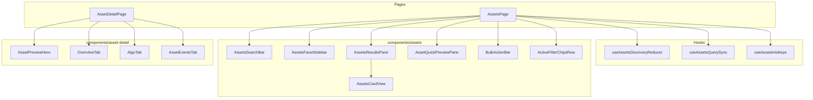
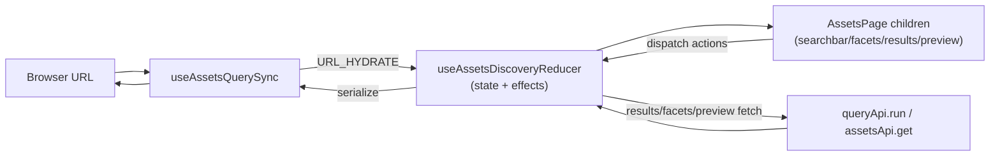
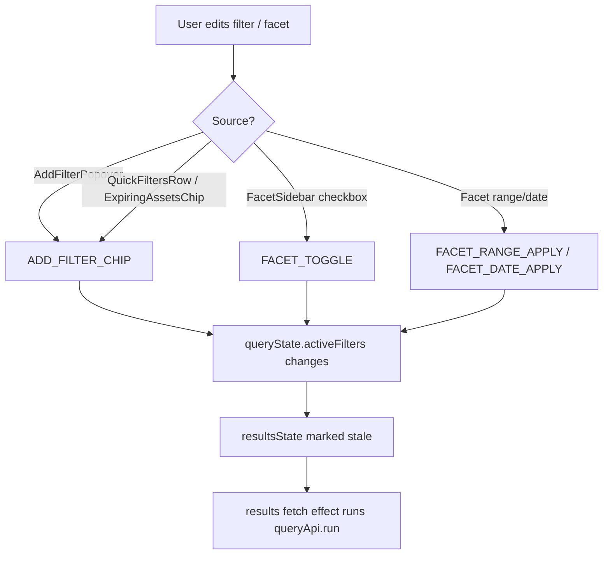
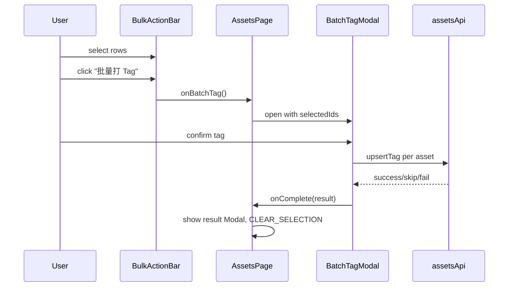
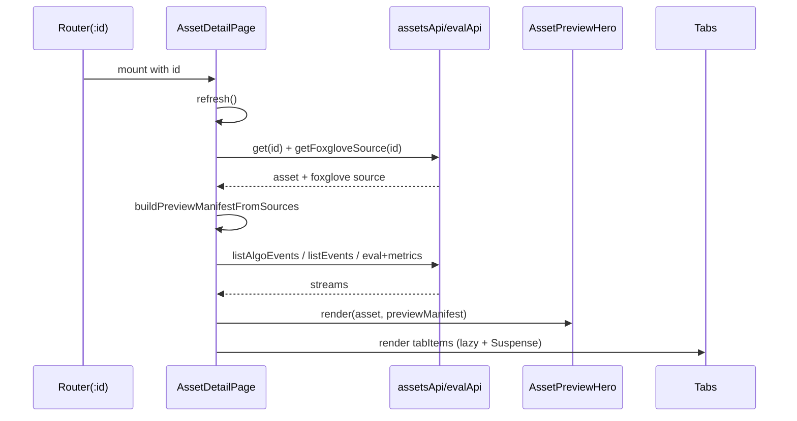
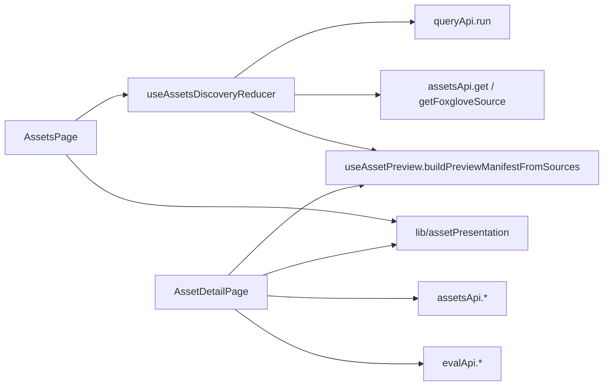

# Asset Pages

<cite>
**Referenced Files in This Document**

- [Frontend/src/pages/AssetsPage.tsx](file://Frontend/src/pages/AssetsPage.tsx)
- [Frontend/src/pages/AssetDetailPage.tsx](file://Frontend/src/pages/AssetDetailPage.tsx)
- [Frontend/src/components/assets/ActiveFilterChipsRow.tsx](file://Frontend/src/components/assets/ActiveFilterChipsRow.tsx)
- [Frontend/src/components/assets/AddFilterPopover.tsx](file://Frontend/src/components/assets/AddFilterPopover.tsx)
- [Frontend/src/components/assets/AlgoSummaryCell.tsx](file://Frontend/src/components/assets/AlgoSummaryCell.tsx)
- [Frontend/src/components/assets/AssetQuickPreviewPane.tsx](file://Frontend/src/components/assets/AssetQuickPreviewPane.tsx)
- [Frontend/src/components/assets/AssetsCardView.tsx](file://Frontend/src/components/assets/AssetsCardView.tsx)
- [Frontend/src/components/assets/AssetsFacetSidebar.tsx](file://Frontend/src/components/assets/AssetsFacetSidebar.tsx)
- [Frontend/src/components/assets/AssetsResultsPane.tsx](file://Frontend/src/components/assets/AssetsResultsPane.tsx)
- [Frontend/src/components/assets/AssetsSearchBar.tsx](file://Frontend/src/components/assets/AssetsSearchBar.tsx)
- [Frontend/src/components/assets/BatchDeleteTagModal.tsx](file://Frontend/src/components/assets/BatchDeleteTagModal.tsx)
- [Frontend/src/components/assets/BatchTagModal.tsx](file://Frontend/src/components/assets/BatchTagModal.tsx)
- [Frontend/src/components/assets/BulkActionBar.tsx](file://Frontend/src/components/assets/BulkActionBar.tsx)
- [Frontend/src/components/assets/ColumnsConfigPopover.tsx](file://Frontend/src/components/assets/ColumnsConfigPopover.tsx)
- [Frontend/src/components/assets/ExpiringAssetsChip.tsx](file://Frontend/src/components/assets/ExpiringAssetsChip.tsx)
- [Frontend/src/components/assets/ExportModal.tsx](file://Frontend/src/components/assets/ExportModal.tsx)
- [Frontend/src/components/assets/PreviewPlayer.tsx](file://Frontend/src/components/assets/PreviewPlayer.tsx)
- [Frontend/src/components/assets/QuickFiltersRow.tsx](file://Frontend/src/components/assets/QuickFiltersRow.tsx)
- [Frontend/src/components/assets/ResultsEmptyState.tsx](file://Frontend/src/components/assets/ResultsEmptyState.tsx)
- [Frontend/src/components/assets/SavedViewSelector.tsx](file://Frontend/src/components/assets/SavedViewSelector.tsx)
- [Frontend/src/components/asset-detail/AlgoTab.tsx](file://Frontend/src/components/asset-detail/AlgoTab.tsx)
- [Frontend/src/components/asset-detail/AssetEventsTab.tsx](file://Frontend/src/components/asset-detail/AssetEventsTab.tsx)
- [Frontend/src/components/asset-detail/AssetPreviewHero.tsx](file://Frontend/src/components/asset-detail/AssetPreviewHero.tsx)
- [Frontend/src/components/asset-detail/DeliveryHistoryTab.tsx](file://Frontend/src/components/asset-detail/DeliveryHistoryTab.tsx)
- [Frontend/src/components/asset-detail/EvalMetricsTab.tsx](file://Frontend/src/components/asset-detail/EvalMetricsTab.tsx)
- [Frontend/src/components/asset-detail/FilesTab.tsx](file://Frontend/src/components/asset-detail/FilesTab.tsx)
- [Frontend/src/components/asset-detail/LineageTab.tsx](file://Frontend/src/components/asset-detail/LineageTab.tsx)
- [Frontend/src/components/asset-detail/OverviewTab.tsx](file://Frontend/src/components/asset-detail/OverviewTab.tsx)
- [Frontend/src/components/asset-detail/TagsTab.tsx](file://Frontend/src/components/asset-detail/TagsTab.tsx)
- [Frontend/src/hooks/assets/useAssetsDiscoveryReducer.ts](file://Frontend/src/hooks/assets/useAssetsDiscoveryReducer.ts)
- [Frontend/src/hooks/assets/useAssetsQuerySync.ts](file://Frontend/src/hooks/assets/useAssetsQuerySync.ts)
</cite>

## Table of Contents
1. [Introduction](#introduction)
2. [Project Structure](#project-structure)
3. [Core Components](#core-components)
4. [Architecture Overview](#architecture-overview)
5. [Detailed Component Analysis](#detailed-component-analysis)
6. [Dependency Analysis](#dependency-analysis)
7. [Performance Considerations](#performance-considerations)
8. [Troubleshooting Guide](#troubleshooting-guide)
9. [Conclusion](#conclusion)
10. [Appendices](#appendices)

## Introduction

The asset pages are the operator-facing surface of cyber-databrew's data catalog. They cover two screens: the **Assets discovery workbench** (`/assets`), a three-column search-and-triage console for finding, filtering, previewing, and acting on assets in bulk; and the **Asset detail page** (`/assets/:id`), a tabbed deep-dive into a single asset's metadata, algorithm runs, events, evaluations, deliveries, lineage, tags, and files.

`AssetsPage` is explicitly a *container* that wires presentational components to a single centralized reducer; it owns almost no state of its own beyond modal toggles and a responsive `isNarrow` flag. The reducer hook (`useAssetsDiscoveryReducer`) holds query state, results, facet aggregations, row selection, and the right-hand quick preview, and runs the side effects that fetch them. `AssetDetailPage` is a more conventional data-loading page that fetches a single `Asset` plus its event/eval streams and renders them across lazily-loaded tabs.

These pages are used by data engineers and reviewers who need to slice a large asset corpus by lifecycle state, capture environment, algorithm outcome, and tags, then create deliveries, batch-tag, or export ID lists from the matched set.

**Section sources**
- [Frontend/src/pages/AssetsPage.tsx](file://Frontend/src/pages/AssetsPage.tsx#L1-L53)
- [Frontend/src/pages/AssetDetailPage.tsx](file://Frontend/src/pages/AssetDetailPage.tsx#L97-L119)

## Project Structure

The asset UI is split across three directories under `Frontend/src`:

- `pages/` — the two route containers, `AssetsPage.tsx` and `AssetDetailPage.tsx`.
- `components/assets/*` — presentational and modal building blocks for the discovery workbench: the search bar, facet sidebar, results pane, card view, quick-preview pane, bulk action bar, filter chips/popovers, and the batch/export modals.
- `components/asset-detail/*` — the tab bodies and the preview hero rendered on the detail page.
- `hooks/assets/*` — the state engine: `useAssetsDiscoveryReducer` (state + fetch effects), `useAssetsQuerySync` (URL ↔ state), `useAssetsHotkeys`, `useAssetPreview` (preview manifest builder), and `useSavedViews`.

`AssetsPage` imports its frequently-used children eagerly and defers `CreateDeliveryModal` behind `React.lazy`. `AssetDetailPage` eagerly imports only `OverviewTab` and `AssetPreviewHero`; every other tab is lazily loaded and wrapped in `Suspense` with a shared `TAB_FALLBACK`.

**Diagram sources**
- [Frontend/src/pages/AssetsPage.tsx](file://Frontend/src/pages/AssetsPage.tsx#L9-L33)
- [Frontend/src/pages/AssetDetailPage.tsx](file://Frontend/src/pages/AssetDetailPage.tsx#L27-L47)

**Section sources**
- [Frontend/src/pages/AssetsPage.tsx](file://Frontend/src/pages/AssetsPage.tsx#L5-L34)
- [Frontend/src/pages/AssetDetailPage.tsx](file://Frontend/src/pages/AssetDetailPage.tsx#L1-L66)

## Core Components

The discovery workbench is composed from these collaborators, each receiving slices of the reducer state and dispatching actions back:

- **`AssetsSearchBar`** renders a search-mode `Select` (`structured`, `keyword`, `semantic`, `similar`) and an input that tokenizes free text into structured `QueryToken`s. It validates draft text against a field spec table and surfaces field suggestions and inline errors. Commit happens on Enter, blur, or clear.
- **`AssetsFacetSidebar`** renders five collapsible facet groups (`basic`, `capture`, `algorithm`, `delivery`, `tags`) with checkbox facets, numeric ranges, and date ranges. It maps Elasticsearch aggregation keys to filter fields and supports both vertical (drawer) and horizontal (compact bar) layouts.
- **`AssetsResultsPane`** renders the toolbar, the configurable Ant Design `Table` (or `AssetsCardView`), pagination, sort affordances, and empty/error states.
- **`AssetQuickPreviewPane`** is the sticky right column showing a summary, algo status, and a `PreviewPlayer` for the selected row.
- **`BulkActionBar`** appears once at least one row is selected and offers create-delivery, run-algo (currently disabled), batch-tag, delete-tag, export-IDs, clear, and select-all-filtered.
- **`ActiveFilterChipsRow`**, **`AddFilterPopover`**, **`QuickFiltersRow`**, and **`ExpiringAssetsChip`** are the filter-affordance row above the results.

On the detail side, **`AssetPreviewHero`** plus a `Tabs` component drive nine tabs (`overview`, `algo`, `events`, `eval-metrics`, `actions`, `tags`, `deliveries`, `lineage`, `files`).

**Section sources**
- [Frontend/src/components/assets/AssetsSearchBar.tsx](file://Frontend/src/components/assets/AssetsSearchBar.tsx#L26-L73)
- [Frontend/src/components/assets/AssetsFacetSidebar.tsx](file://Frontend/src/components/assets/AssetsFacetSidebar.tsx#L68-L87)
- [Frontend/src/components/assets/BulkActionBar.tsx](file://Frontend/src/components/assets/BulkActionBar.tsx#L33-L96)
- [Frontend/src/pages/AssetDetailPage.tsx](file://Frontend/src/pages/AssetDetailPage.tsx#L288-L422)

## Architecture Overview

Both pages follow a unidirectional data flow. On the discovery page, `useAssetsDiscoveryReducer` is the single store. Presentational children render from `state` and call dispatch handlers passed down as props; the reducer's effects translate query state into `queryApi.run(...)` requests and write results back into state. `useAssetsQuerySync` mirrors query state to the browser URL bidirectionally so that a workbench view is fully shareable and survives back/forward navigation.

The reducer derives a stable query key from the effective Query IR request so its results effect re-runs only on meaningful changes rather than on every dispatch. List results, facet aggregations, and the quick preview are fetched by three separate effects keyed independently.

**Diagram sources**
- [Frontend/src/pages/AssetsPage.tsx](file://Frontend/src/pages/AssetsPage.tsx#L55-L66)
- [Frontend/src/hooks/assets/useAssetsQuerySync.ts](file://Frontend/src/hooks/assets/useAssetsQuerySync.ts#L31-L128)
- [Frontend/src/hooks/assets/useAssetsDiscoveryReducer.ts](file://Frontend/src/hooks/assets/useAssetsDiscoveryReducer.ts#L282-L399)

**Section sources**
- [Frontend/src/hooks/assets/useAssetsDiscoveryReducer.ts](file://Frontend/src/hooks/assets/useAssetsDiscoveryReducer.ts#L1-L90)
- [Frontend/src/hooks/assets/useAssetsQuerySync.ts](file://Frontend/src/hooks/assets/useAssetsQuerySync.ts#L24-L79)

## Detailed Component Analysis

#### Search

`AssetsSearchBar` accepts a `searchMode`, the uncommitted `draftText`, and the `committedQueryText`. As the user types, `getDraftIssues` re-validates the draft against `SEARCH_FIELD_SPECS` — a table of known fields (`asset_id`, `owner`, `lifecycle_state`, `env`, `duration_ms`, `algo_status`, `tag.*`, etc.) with declared types (`string`, `enum`, `numeric`, `timestamp`). Enum fields only accept `eq`/`ne` and known values; numeric and timestamp fields validate their value shape. Errors render as red helper text and put the input into `status="error"`.

Tokenization is operator-aware: `OP_PATTERNS` orders `>=` before `>` and `<=` before `<` so the longest operator wins. `tokenizeDraftText` splits the draft respecting quotes, parses each piece via `parseOneToken`, and merges adjacent free-text pieces into a single `_fulltext` `ilike` token. Commit is guarded by a `commitLockRef` and a draft-vs-committed equality check, and fires on Enter, blur, or clear.

**Section sources**
- [Frontend/src/components/assets/AssetsSearchBar.tsx](file://Frontend/src/components/assets/AssetsSearchBar.tsx#L80-L122)
- [Frontend/src/components/assets/AssetsSearchBar.tsx](file://Frontend/src/components/assets/AssetsSearchBar.tsx#L159-L317)
- [Frontend/src/components/assets/AssetsSearchBar.tsx](file://Frontend/src/components/assets/AssetsSearchBar.tsx#L354-L427)

#### Filtering and facets

Filtering uses three complementary affordances. `AddFilterPopover` is a field/operator/value builder that emits a `FilterChip`. `QuickFiltersRow` offers one-click toggles for common predicates (Ready, algo-failed, high priority, undelivered). `ExpiringAssetsChip` toggles a range filter on `expire_at` for assets expiring within thirty days. Active chips render in `ActiveFilterChipsRow`, which also shows the filtered total and offers remove-one, clear-field, and clear-all.

`AssetsFacetSidebar` renders checkbox facets seeded by Elasticsearch aggregation buckets, plus numeric and date range editors. Facet draft state (`rangeDrafts`, `dateDrafts`, `expandedGroups`) lives in the reducer and is applied via `FACET_TOGGLE`, `FACET_RANGE_APPLY`, and `FACET_DATE_APPLY` actions. The sidebar is rendered twice by `AssetsPage`: vertically inside a right-hand `Drawer` on narrow screens, and horizontally as a compact bar on wide screens.

**Diagram sources**
- [Frontend/src/pages/AssetsPage.tsx](file://Frontend/src/pages/AssetsPage.tsx#L181-L296)
- [Frontend/src/hooks/assets/useAssetsDiscoveryReducer.ts](file://Frontend/src/hooks/assets/useAssetsDiscoveryReducer.ts#L82-L90)

**Section sources**
- [Frontend/src/components/assets/AddFilterPopover.tsx](file://Frontend/src/components/assets/AddFilterPopover.tsx#L136-L187)
- [Frontend/src/components/assets/QuickFiltersRow.tsx](file://Frontend/src/components/assets/QuickFiltersRow.tsx#L16-L122)
- [Frontend/src/components/assets/ExpiringAssetsChip.tsx](file://Frontend/src/components/assets/ExpiringAssetsChip.tsx#L16-L70)
- [Frontend/src/components/assets/ActiveFilterChipsRow.tsx](file://Frontend/src/components/assets/ActiveFilterChipsRow.tsx#L37-L70)
- [Frontend/src/components/assets/AssetsFacetSidebar.tsx](file://Frontend/src/components/assets/AssetsFacetSidebar.tsx#L78-L87)

#### Results list, columns, and sort

`AssetsResultsPane` renders a column-configurable Ant Design `Table` driven by a `COLUMN_BUILDERS` registry; `ColumnsConfigPopover` selects which columns are visible while preserving the canonical column order. Column headers double as sort toggles via `renderSortableTitle`, which cycles ascending/descending and emits the field name (prefixed with `-` for descending) through `onSortChange`. Pagination uses Ant Design's `pagination` with `page`/`pageSize` from query state. The Asset ID cell links into the quick preview (or, on narrow screens, the detail route) and offers copy-to-clipboard. When results are empty or errored the pane renders `ResultsEmptyState` with retry/clear-filters actions. On narrow viewports, `AssetsResultsPane` is driven in `card` view mode and delegates to `AssetsCardView`.

**Section sources**
- [Frontend/src/components/assets/AssetsResultsPane.tsx](file://Frontend/src/components/assets/AssetsResultsPane.tsx#L50-L120)
- [Frontend/src/components/assets/AssetsResultsPane.tsx](file://Frontend/src/components/assets/AssetsResultsPane.tsx#L331-L518)
- [Frontend/src/components/assets/ColumnsConfigPopover.tsx](file://Frontend/src/components/assets/ColumnsConfigPopover.tsx#L10-L51)
- [Frontend/src/components/assets/AssetsCardView.tsx](file://Frontend/src/components/assets/AssetsCardView.tsx#L177-L220)

#### Selection and bulk actions

Row selection is tracked in `selectionState` as a set of IDs plus a `mode` (`explicit_rows` vs select-all). `BulkActionBar` renders only when `selectedCount > 0`; it exposes Create Delivery, Run Algo (rendered disabled with an explanatory tooltip via `disabledRunAlgo`), Batch Tag, Delete Tag, Export ID, Clear, and — when in `explicit_rows` mode and the filtered total exceeds the selection — a "select all filtered" link that dispatches `SELECT_ALL_FILTERED`. Selecting more than 100 assets surfaces a warning banner.

The container handles each action by opening the corresponding modal: `CreateDeliveryModal` (lazy), `BatchTagModal`, `BatchDeleteTagModal`, and `ExportModal`. `BatchTagModal` reports a `BatchTagResult` of `{ success, skipped, failed }` counts, which the page renders in a summary `Modal`, then clears the selection. `ExportModal` lets the user pick a range (current page vs all filtered) and a format (`csv` or `json`) and downloads or copies the resulting ID list.

**Diagram sources**
- [Frontend/src/pages/AssetsPage.tsx](file://Frontend/src/pages/AssetsPage.tsx#L423-L645)
- [Frontend/src/components/assets/BatchTagModal.tsx](file://Frontend/src/components/assets/BatchTagModal.tsx#L22-L158)

**Section sources**
- [Frontend/src/components/assets/BulkActionBar.tsx](file://Frontend/src/components/assets/BulkActionBar.tsx#L18-L119)
- [Frontend/src/components/assets/BatchTagModal.tsx](file://Frontend/src/components/assets/BatchTagModal.tsx#L22-L158)
- [Frontend/src/components/assets/BatchDeleteTagModal.tsx](file://Frontend/src/components/assets/BatchDeleteTagModal.tsx)
- [Frontend/src/components/assets/ExportModal.tsx](file://Frontend/src/components/assets/ExportModal.tsx#L25-L252)

#### Quick preview pane

`AssetQuickPreviewPane` is the sticky right column on wide screens (320px wide, collapsible to 36px). It renders an asset summary via `Descriptions`, an algo-status summary block (reusing `parseAlgoEntries`/`countStatuses` from `AlgoSummaryCell`), a preview availability `Badge`, and a `PreviewPlayer`. It exposes "open detail", "find similar" (which switches the search mode to `similar` and commits the asset ID as the query), source/topic/time selectors, and a retry. The preview manifest is built by `buildPreviewManifestFromSources` and fed to `PreviewPlayer`, which streams a fragmented MP4 from the mcap-preview service into a native `<video>` element.

**Section sources**
- [Frontend/src/components/assets/AssetQuickPreviewPane.tsx](file://Frontend/src/components/assets/AssetQuickPreviewPane.tsx#L50-L120)
- [Frontend/src/components/assets/PreviewPlayer.tsx](file://Frontend/src/components/assets/PreviewPlayer.tsx#L24-L40)
- [Frontend/src/pages/AssetsPage.tsx](file://Frontend/src/pages/AssetsPage.tsx#L519-L582)

#### Asset detail page and tabs

`AssetDetailPage` reads `:id` from the route, then `loadAsset` fetches the asset and its Foxglove source to build a preview manifest, while `loadAlgoEvents`, `loadAllEvents`, and an eval/metrics `Promise.all` populate the tab streams. `refresh` re-runs all loaders; `refreshAfterTagUpdate` does a background reload after tag edits. While loading it renders a `Spin`; on error a `Result` with retry/back actions; if no asset, an `Empty`.

`parseAlgoResults` reshapes the flat `algo_results` map into structured rows for the algo tab. The page header shows lifecycle state, the asset ID, a back button that honors a stored `assetsReturnTo` URL, and a "create pipeline from this asset" shortcut. Below the header sits `AssetPreviewHero`, then a `Tabs` with nine items. Only `OverviewTab` is eager; the rest are lazy with `Suspense`.

| Tab key | Component | Source of data |
| --- | --- | --- |
| overview | `OverviewTab` | the loaded `asset` |
| algo | `AlgoTab` | `parseAlgoResults` + `listAlgoEvents` |
| events | `AssetEventsTab` | `listEvents` |
| eval-metrics | `EvalMetricsTab` | `evalApi.listEvalResults` + `listMetrics` |
| actions | `ActionsTimelineTab` | asset type + segment timestamps |
| tags | `TagsTab` | `asset.tags` (`upsertTag`/`deleteTag`) |
| deliveries | `DeliveryHistoryTab` | `listDeliveries` |
| lineage | `LineageTab` | lineage fetch by `assetId` |
| files | `FilesTab` | `asset.files` |

**Diagram sources**
- [Frontend/src/pages/AssetDetailPage.tsx](file://Frontend/src/pages/AssetDetailPage.tsx#L143-L253)
- [Frontend/src/pages/AssetDetailPage.tsx](file://Frontend/src/pages/AssetDetailPage.tsx#L424-L487)

**Section sources**
- [Frontend/src/pages/AssetDetailPage.tsx](file://Frontend/src/pages/AssetDetailPage.tsx#L68-L95)
- [Frontend/src/pages/AssetDetailPage.tsx](file://Frontend/src/pages/AssetDetailPage.tsx#L288-L422)
- [Frontend/src/components/asset-detail/OverviewTab.tsx](file://Frontend/src/components/asset-detail/OverviewTab.tsx#L14-L30)
- [Frontend/src/components/asset-detail/AlgoTab.tsx](file://Frontend/src/components/asset-detail/AlgoTab.tsx#L68-L111)
- [Frontend/src/components/asset-detail/TagsTab.tsx](file://Frontend/src/components/asset-detail/TagsTab.tsx#L54-L158)
- [Frontend/src/components/asset-detail/DeliveryHistoryTab.tsx](file://Frontend/src/components/asset-detail/DeliveryHistoryTab.tsx#L20-L30)
- [Frontend/src/components/asset-detail/LineageTab.tsx](file://Frontend/src/components/asset-detail/LineageTab.tsx#L55-L59)
- [Frontend/src/components/asset-detail/FilesTab.tsx](file://Frontend/src/components/asset-detail/FilesTab.tsx#L19)

#### Preview hero

`AssetPreviewHero` is the always-on header on the detail page. The left half hosts the `PreviewPlayer` (or a placeholder), and the right half is a `Descriptions` panel of asset metadata, an inline algo summary (`AlgoSummaryInline` reusing the same `parseAlgoEntries`/`countStatuses` helpers as the quick preview), a priority/quality `Tag`, and a preview-availability `Badge`. It is purely presentational, taking `asset` and `previewManifest` as props.

**Section sources**
- [Frontend/src/components/asset-detail/AssetPreviewHero.tsx](file://Frontend/src/components/asset-detail/AssetPreviewHero.tsx#L36-L80)

## Dependency Analysis

The discovery workbench depends on `queryApi.run` for both list results and facet aggregations, and on `assetsApi` for the quick-preview asset fetch. The detail page depends on `assetsApi` (get, event/algo/delivery lists, tag mutations) and `evalApi` (eval results + metrics). Both share presentation helpers in `lib/assetPresentation` (`getLifecycleState`, `getAssetStateColor`, `formatDurationSeconds`, `getAssetType`) and the preview-manifest builder in `useAssetPreview`.

**Diagram sources**
- [Frontend/src/hooks/assets/useAssetsDiscoveryReducer.ts](file://Frontend/src/hooks/assets/useAssetsDiscoveryReducer.ts#L5-L19)
- [Frontend/src/pages/AssetDetailPage.tsx](file://Frontend/src/pages/AssetDetailPage.tsx#L20-L64)

**Section sources**
- [Frontend/src/hooks/assets/useAssetsDiscoveryReducer.ts](file://Frontend/src/hooks/assets/useAssetsDiscoveryReducer.ts#L82-L90)
- [Frontend/src/pages/AssetDetailPage.tsx](file://Frontend/src/pages/AssetDetailPage.tsx#L20-L64)

## Performance Considerations

- **Stable query key.** `useAssetsDiscoveryReducer` derives a stable string key from the effective Query IR request so the results effect runs only on meaningful changes, not on every reducer dispatch (which always returns new references).
- **In-flight dedup.** An `inFlightRef` guard skips concurrent fetches, and a `listKeyRef` comparison discards stale responses after the query has moved on.
- **Independent facet refresh.** Facet aggregations are fetched in a separate `queryApi.run(facetsQueryRequest)` keyed by `facetsRequestKey`, so the sidebar can keep prior counts while the list updates; the list renders before facets resolve.
- **Lazy tabs and modals.** Detail tabs and `CreateDeliveryModal` are `React.lazy`/`Suspense`, keeping the initial bundle small.
- **Client-side `algo_status` fallback.** When an `algo_status` filter is active, the page filters fetched items client-side and pushes a warning that totals/pagination remain full-set — the count is *not* re-derived, which avoids extra round trips but means the displayed total over-counts.
- **Cursor pagination on streams.** Algo and all-events tabs use cursor-based `load more` (`next_cursor`) rather than offset pagination.

**Section sources**
- [Frontend/src/hooks/assets/useAssetsDiscoveryReducer.ts](file://Frontend/src/hooks/assets/useAssetsDiscoveryReducer.ts#L23-L49)
- [Frontend/src/hooks/assets/useAssetsDiscoveryReducer.ts](file://Frontend/src/hooks/assets/useAssetsDiscoveryReducer.ts#L286-L383)
- [Frontend/src/pages/AssetDetailPage.tsx](file://Frontend/src/pages/AssetDetailPage.tsx#L177-L234)

## Troubleshooting Guide

- **"搜索已降级为数据库查询" warning.** The backend returned a warning containing "elasticsearch unavailable"; `AssetsPage` detects this and renders a degraded-search `Alert`. Filters still apply via Postgres but results may be slower and counts approximate.
- **"algo_status 筛选仅在当前页生效".** An `algo_status` filter triggers the client-side fallback; the list is filtered but the total and pagination remain full-set. Verify on the algo page or clear the filter for exact counts.
- **Empty results / stuck filters.** Use `ResultsEmptyState`'s clear-filters action, or the "重置" link in the facet bar/drawer; both dispatch `CLEAR_ALL_FILTERS`.
- **Search input won't commit.** Commit is blocked when `getDraftIssues` returns any issue; check the red inline error for the offending token (e.g. an enum value not in its allowed set, or a numeric field given non-numeric text).
- **Detail page "资产加载失败".** `loadAsset` failed; the `Result` view offers retry (`refresh`) and back-to-list. The error text comes from `extractApiErrorMessage`.
- **Preview shows "暂无预览" / playback fails.** The preview manifest had no available source, or `PreviewPlayer` could not load `segment.mp4`; a 403/GCS error maps to an object-storage permission message.
- **Back button lands on the wrong page.** The detail back button prefers `location.state.assetsReturnTo` (validated by `isSafeInternalReturnUrl`), then a stored return URL, then browser history, then `/assets`.

**Section sources**
- [Frontend/src/pages/AssetsPage.tsx](file://Frontend/src/pages/AssetsPage.tsx#L36-L51)
- [Frontend/src/pages/AssetsPage.tsx](file://Frontend/src/pages/AssetsPage.tsx#L318-L332)
- [Frontend/src/components/assets/ResultsEmptyState.tsx](file://Frontend/src/components/assets/ResultsEmptyState.tsx)
- [Frontend/src/pages/AssetDetailPage.tsx](file://Frontend/src/pages/AssetDetailPage.tsx#L255-L283)
- [Frontend/src/pages/AssetDetailPage.tsx](file://Frontend/src/pages/AssetDetailPage.tsx#L429-L451)

## Conclusion

The asset pages pair a reducer-driven discovery workbench with a tabbed detail view. The workbench keeps a single source of truth in `useAssetsDiscoveryReducer`, mirrors it to the URL for shareability, and composes thin presentational components (search bar, facet sidebar, results pane, quick preview, bulk bar) that dispatch back. The detail page loads one asset plus its event/eval/delivery streams and spreads them across lazily-loaded tabs anchored by a preview hero. Together they give operators a fast loop from broad search to single-asset triage and bulk action.

## Appendices

### Search field specs

Defined in `SEARCH_FIELD_SPECS`: `asset_id`, `mcap_file_id`, `owner`, `reviewer`, `lifecycle_state` (enum), `status` (legacy enum), `env` (enum), `scene`, `task`, `batch`, `duration_ms` (numeric), `created_at`/`updated_at` (timestamp), `delivery_count` (numeric), `tag.priority`, `tag.quality`, `tag.notes`, `algo_status` (enum).

**Section sources**
- [Frontend/src/components/assets/AssetsSearchBar.tsx](file://Frontend/src/components/assets/AssetsSearchBar.tsx#L26-L73)

### Facet groups and option enums

Five groups (`basic`, `capture`, `algorithm`, `delivery`, `tags`). Option enums include lifecycle states, asset types (`segment`, `clip`, `frame_set`, `derived_asset`), retention tiers (`standard`, `archive`, `cold`), environments, algo statuses (`ok`, `failed`, `running`, `pending`, `blocked`), priorities, and qualities. ES aggregation keys are remapped to filter fields via `AGG_KEY_MAP`.

**Section sources**
- [Frontend/src/components/assets/AssetsFacetSidebar.tsx](file://Frontend/src/components/assets/AssetsFacetSidebar.tsx#L23-L87)

### Search modes

`structured`, `keyword`, `semantic`, `similar` — all currently enabled in `SEARCH_MODE_OPTIONS`. The quick preview's "find similar" action switches to `similar` and commits the asset ID as the query.

**Section sources**
- [Frontend/src/components/assets/AssetsSearchBar.tsx](file://Frontend/src/components/assets/AssetsSearchBar.tsx#L319-L339)

### Detail tab keys

`overview`, `algo`, `events`, `eval-metrics`, `actions`, `tags`, `deliveries`, `lineage`, `files`; `defaultActiveKey` is `overview`.

**Section sources**
- [Frontend/src/pages/AssetDetailPage.tsx](file://Frontend/src/pages/AssetDetailPage.tsx#L288-L484)
</content>
</invoke>
