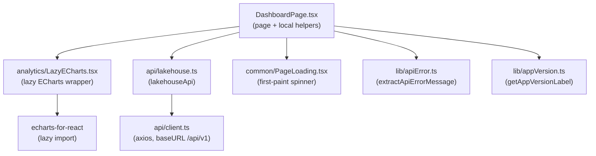
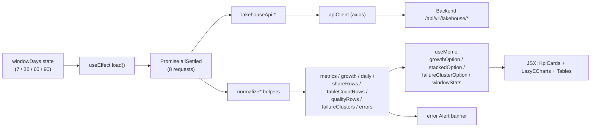
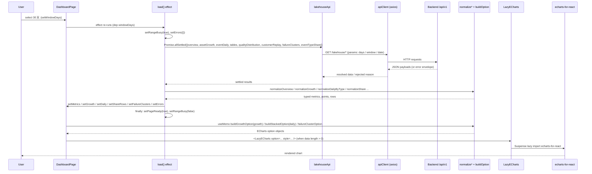
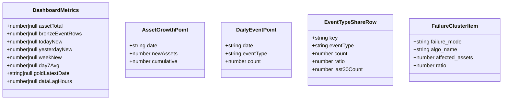
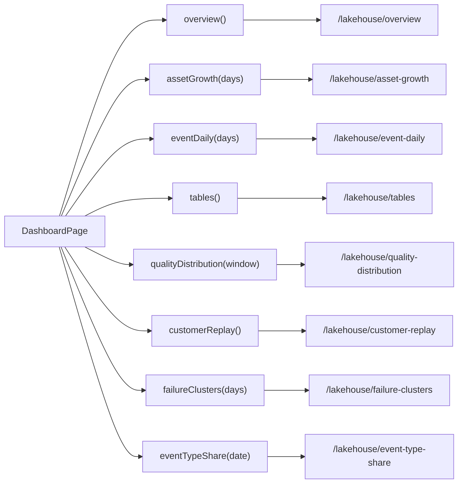

# Dashboard Page

<cite>
**Referenced Files in This Document**

- [Frontend/src/pages/DashboardPage.tsx](file://Frontend/src/pages/DashboardPage.tsx)
- [Frontend/src/components/analytics/LazyECharts.tsx](file://Frontend/src/components/analytics/LazyECharts.tsx)
- [Frontend/src/api/lakehouse.ts](file://Frontend/src/api/lakehouse.ts)
- [Frontend/src/components/common/PageLoading.tsx](file://Frontend/src/components/common/PageLoading.tsx)
- [Frontend/src/lib/apiError.ts](file://Frontend/src/lib/apiError.ts)
- [Frontend/src/lib/appVersion.ts](file://Frontend/src/lib/appVersion.ts)
- [Frontend/src/api/client.ts](file://Frontend/src/api/client.ts)
</cite>

## Table of Contents
1. [Introduction](#introduction)
2. [Project Structure](#project-structure)
3. [Core Components](#core-components)
4. [Architecture Overview](#architecture-overview)
5. [Detailed Component Analysis](#detailed-component-analysis)
6. [Dependency Analysis](#dependency-analysis)
7. [Performance Considerations](#performance-considerations)
8. [Troubleshooting Guide](#troubleshooting-guide)
9. [Conclusion](#conclusion)
10. [Appendices](#appendices)

## Introduction

The Dashboard page (`业务概览`, "Business Overview") is the landing analytics
surface of the cyber-databrew Frontend. It renders a single-screen executive
summary of the data lakehouse: a row of KPI cards, a second row of
window-scoped statistics, two interactive ECharts visualizations (an asset
growth combo chart and a stacked event-type chart), a pie chart of algorithm
failure modes, and a set of tabular "lakehouse business table" panels that
sample raw rows from the underlying Iceberg/Postgres tables.

The page is fully self-contained in one component file. It owns its own data
fetching (no global store), issues a fan-out of independent lakehouse API calls
on mount and whenever the user changes the time window, and degrades gracefully
when individual endpoints fail — surfacing a per-endpoint warning banner while
still rendering whatever data did load. All chart options are computed client
side from normalized API payloads; the heavy ECharts bundle is code-split via a
lazy wrapper so it is not part of the initial page chunk.

The audience is internal operators and stakeholders who need a quick read on
lakehouse health: how many assets exist, how fast they are growing, what event
types dominate, how fresh the Gold layer is, and which algorithm failure modes
are most common.

**Section sources**
- [Frontend/src/pages/DashboardPage.tsx](file://Frontend/src/pages/DashboardPage.tsx#L742-L1318)

## Project Structure

The Dashboard feature is small in file count but dense in logic. The page
component is the orchestrator; it depends on one analytics wrapper, one API
module, and a few shared utilities.

Key files:

- **`Frontend/src/pages/DashboardPage.tsx`** — the entire page. Contains the
  default-exported `DashboardPage` component plus a cluster of module-level
  helpers: presentational sub-components (`KpiCard`, `TableEmptyState`),
  payload normalizers (`normalizeOverview`, `normalizeGrowth`,
  `normalizeDailyByType`, `normalizeShare`, `normalizeTableCountRows`,
  `normalizeQualityDistRows`), value coercers (`toFiniteNumber`, `asRecord`,
  `asRecordArray`, `formatLakehouseScalar`), and ECharts option builders
  (`buildGrowthOption`, `buildStackedOption`).
- **`Frontend/src/components/analytics/LazyECharts.tsx`** — a thin
  `React.lazy` + `Suspense` wrapper around `echarts-for-react`. This is the
  only file under `components/analytics/`.
- **`Frontend/src/api/lakehouse.ts`** — the `lakehouseApi` object exposing one
  method per lakehouse REST endpoint, plus the TypeScript response interfaces
  the page imports.
- **`Frontend/src/components/common/PageLoading.tsx`** — the full-height spinner
  shown until the first fetch settles.
- **`Frontend/src/lib/apiError.ts`** — `extractApiErrorMessage` turns an Axios
  error envelope into a user-facing string.
- **`Frontend/src/lib/appVersion.ts`** — `getAppVersionLabel` builds the build
  stamp shown in the hero header.

**Diagram sources**
- [Frontend/src/pages/DashboardPage.tsx](file://Frontend/src/pages/DashboardPage.tsx#L34-L45)
- [Frontend/src/api/lakehouse.ts](file://Frontend/src/api/lakehouse.ts#L134-L212)
- [Frontend/src/api/client.ts](file://Frontend/src/api/client.ts#L11-L12)

**Section sources**
- [Frontend/src/pages/DashboardPage.tsx](file://Frontend/src/pages/DashboardPage.tsx#L1-L45)
- [Frontend/src/components/analytics/LazyECharts.tsx](file://Frontend/src/components/analytics/LazyECharts.tsx#L1-L17)

## Core Components

The page is built from a handful of cohesive pieces. The presentational
sub-components are pure and stateless; all state and side effects live in the
`DashboardPage` function body.

#### KpiCard

`KpiCard` is the reusable metric tile used for both the headline KPI row and the
window-stats row. It accepts a `title`, a formatted `value`, an optional
`suffix`, an icon node, an optional `hint`, an optional `trend`
(`{ direction: "up" | "down" | "flat"; text }`), and an `iconTint` of `"blue"`
or `"slate"`. The trend direction selects the arrow icon and the text color
(success green for up, error red for down, secondary for flat). Cards are
borderless Ant `Card`s with a fixed `minHeight` of 132 and a consistent shadow
defined by the `dashSurface` constant.

#### TableEmptyState

`TableEmptyState` wraps Ant's `Empty` with a `summary` line and an optional
`note`. Every chart and table panel renders this fallback when its data array is
empty, so the page never shows a blank card.

#### DashboardPage

The default export. It declares all page state, runs the data-loading
`useEffect` keyed on `windowDays`, derives memoized values (`windowStats`,
`todayTrend`, the ECharts options, and all Ant table column definitions), and
returns the JSX layout. Until the first fetch settles it short-circuits to
`<PageLoading />`.

#### LazyECharts

`LazyECharts` defers loading `echarts-for-react` until a chart actually renders.
It takes an opaque `option: unknown` and a `style`, and renders inside a
`Suspense` whose fallback is an empty `div` sized by the same `style` (so layout
does not jump while the chart chunk loads).

**Section sources**
- [Frontend/src/pages/DashboardPage.tsx](file://Frontend/src/pages/DashboardPage.tsx#L63-L194)
- [Frontend/src/pages/DashboardPage.tsx](file://Frontend/src/pages/DashboardPage.tsx#L196-L231)
- [Frontend/src/pages/DashboardPage.tsx](file://Frontend/src/pages/DashboardPage.tsx#L742-L758)
- [Frontend/src/components/analytics/LazyECharts.tsx](file://Frontend/src/components/analytics/LazyECharts.tsx#L1-L17)

## Architecture Overview

The Dashboard follows a "fan-out fetch, normalize, derive, render" pipeline. On
mount and on every `windowDays` change the effect fires eight independent
lakehouse requests via `Promise.allSettled`, so a failure in one endpoint never
aborts the others. Each settled result is either normalized into the page's
internal shape or recorded as a per-endpoint error string. After all results are
applied to state, `useMemo` hooks derive the chart options, the aggregate window
statistics, and the table column definitions, which the JSX consumes.

The eight requests issued in the load effect are, in order:
`lakehouseApi.overview()`, `assetGrowth(windowDays)`, `eventDaily(windowDays)`,
`tables()`, `qualityDistribution(\`${windowDays}d\`)`, `customerReplay()`,
`failureClusters(windowDays)`, and `eventTypeShare(defaultShareDate)`. Note that
`overview`, `tables`, and `customerReplay` take no window argument, so re-running
them on a window change re-fetches identical data; the window argument only
affects growth, daily, quality, failure clusters, and the share date default.

Two panels — "训练集快照条目" (training snapshot) and "算法重算候选" (recompute
candidates) — are intentionally **not** fetched in this build. Their rows are
hard-coded to empty arrays (`trainR`, `recR`) and they render a "Silver/Gold 表
尚未物化" placeholder note, matching the roadmap stance documented inline.

**Section sources**
- [Frontend/src/pages/DashboardPage.tsx](file://Frontend/src/pages/DashboardPage.tsx#L793-L940)
- [Frontend/src/api/lakehouse.ts](file://Frontend/src/api/lakehouse.ts#L134-L212)

## Detailed Component Analysis

### Data Load and Chart Render Sequence

The end-to-end flow from a window change (or initial mount) to a painted chart
crosses the effect, the API layer, the normalizers, the memoized option
builders, and finally the lazy ECharts wrapper.

The `firstFetch` ref distinguishes the very first load (which shows the
full-page `PageLoading` and no inline spinner) from subsequent window changes
(which keep the rendered page and show a small inline `Spin` via `rangeBusy`).
A `cancelled` flag guards every `setState` so a window change that lands while a
prior request is in flight does not commit stale results.

**Diagram sources**
- [Frontend/src/pages/DashboardPage.tsx](file://Frontend/src/pages/DashboardPage.tsx#L793-L940)
- [Frontend/src/pages/DashboardPage.tsx](file://Frontend/src/pages/DashboardPage.tsx#L1243-L1272)
- [Frontend/src/components/analytics/LazyECharts.tsx](file://Frontend/src/components/analytics/LazyECharts.tsx#L1-L17)

**Section sources**
- [Frontend/src/pages/DashboardPage.tsx](file://Frontend/src/pages/DashboardPage.tsx#L744-L940)

### State Model

`DashboardPage` holds a wide but flat state surface. The principal slices are:

- `windowDays: 7 | 30 | 60 | 90` — the selected time window, the sole effect
  dependency.
- `pageReady` / `rangeBusy` / `firstFetch` — load lifecycle flags.
- `metrics: DashboardMetrics` — the normalized overview KPIs.
- `growth: AssetGrowthPoint[]` — per-day new and cumulative assets.
- `daily: DailyEventPoint[]` — per-day, per-type event counts.
- `shareRows: EventTypeShareRow[]` / `shareDate` — latest-day event-type shares.
- `tableCountRows: LakeTableCountRow[]` — Iceberg table row counts.
- `qualityRows: QualityDistRow[]` — quality-tag distribution.
- `trainingRows` / `recomputeRows` / `customerRows` — raw sampled rows
  (`Record<string, unknown>[]`).
- `failureClusters: FailureClusterItem[]` / `failureClustersErr`.
- `lakeNotes` — placeholder notes per business-table panel.
- `errors: EndpointErrors` — per-endpoint error messages.

The page-local interfaces (`DashboardMetrics`, `AssetGrowthPoint`,
`DailyEventPoint`, `EventTypeShareRow`, `EndpointErrors`, `LakeTableCountRow`,
`QualityDistRow`) define the normalized shapes; they are intentionally distinct
from the raw API interfaces in `lakehouse.ts` to insulate rendering from
loosely-typed payloads.

**Diagram sources**
- [Frontend/src/pages/DashboardPage.tsx](file://Frontend/src/pages/DashboardPage.tsx#L233-L296)
- [Frontend/src/api/lakehouse.ts](file://Frontend/src/api/lakehouse.ts#L122-L132)

**Section sources**
- [Frontend/src/pages/DashboardPage.tsx](file://Frontend/src/pages/DashboardPage.tsx#L744-L791)

### Payload Normalization

Because every lakehouse endpoint is typed with permissive index signatures and
multiple aliased field names, the page never trusts payloads directly. The
coercion helpers form a defensive layer:

- `toFiniteNumber(value)` accepts numbers or numeric strings and returns
  `number | null`, rejecting `NaN`/`Infinity`.
- `asRecord(value)` returns a plain object or `null`; `asRecordArray(value)`
  maps an array to records and filters out non-objects.
- `formatLakehouseScalar(value)` renders any scalar for table cells, JSON-
  stringifying objects and formatting ISO timestamps via `dayjs`.

The normalizers build the page's internal shapes:

- `normalizeOverview` reads aliased fields (e.g. `asset_total ?? silver_asset_rows`,
  `bronze_event_rows ?? bronze_rows ?? bronze_row_count`) into `DashboardMetrics`.
- `normalizeGrowth` maps `event_date` / `new_assets` / `cumulative_assets`, drops
  dateless rows, and sorts ascending by date.
- `normalizeDailyByType` maps `event_date` / `event_type` / `asset_count`,
  defaulting the type to `"unknown"`.
- `normalizeShare` computes the share rows, clamps `ratio` into `[0,1]`
  (dividing by 100 when the backend sends a percentage), joins the window's
  per-type totals as `last30Count`, drops zero-count rows, and sorts descending.
- `normalizeTableCountRows` / `normalizeQualityDistRows` produce the two table
  panels, sorted descending by row/asset count.

**Section sources**
- [Frontend/src/pages/DashboardPage.tsx](file://Frontend/src/pages/DashboardPage.tsx#L289-L446)

### Aggregate Window Statistics

`computeWindowStats(growth, daily, windowDays)` derives the second KPI row from
the already-loaded series: total events, total new assets, per-day averages
(divided by `max(1, windowDays)`), the single peak day and its value, and the
dominant event type with its in-window count. It is wrapped in a `useMemo` keyed
on `[growth, daily, windowDays]` so it recomputes only when its inputs change.

`todayTrend` is a separate memo that compares `metrics.todayNew` against
`metrics.yesterdayNew` to produce the up/down/flat trend shown on the "今日新增"
card, handling the zero-yesterday edge cases explicitly.

**Section sources**
- [Frontend/src/pages/DashboardPage.tsx](file://Frontend/src/pages/DashboardPage.tsx#L692-L730)
- [Frontend/src/pages/DashboardPage.tsx](file://Frontend/src/pages/DashboardPage.tsx#L942-L962)

### Chart Option Builders

Three ECharts option objects feed `LazyECharts`:

- `buildGrowthOption(points)` — a dual-axis combo chart: a gradient **bar**
  series for daily new assets on the left axis and a smoothed **line** series
  for cumulative assets on the right axis. It includes a slider + inside
  `dataZoom`, a toolbox (zoom / restore / save-as-image), a custom cross-axis
  tooltip formatter, and value-axis label formatters that abbreviate to `k`/`M`.
- `buildStackedOption(daily)` — a **stacked bar** chart. It derives the sorted
  unique date set and the unique event-type set, pivots counts into
  `byType[type][date]`, assigns a fixed six-color palette, and emits one stacked
  bar series per event type with scroll legend and `dataZoom`.
- `failureClusterOption` — a **donut pie** (`radius: ["40%", "70%"]`) built
  inline from `failureClusters`, mapping each cluster's `failure_mode` through
  the `FAILURE_MODE_LABELS` Chinese label table and using `affected_assets` as
  the slice value.

All three are wrapped in `useMemo` so options are rebuilt only when their source
data changes, avoiding needless ECharts re-renders.

**Section sources**
- [Frontend/src/pages/DashboardPage.tsx](file://Frontend/src/pages/DashboardPage.tsx#L466-L690)
- [Frontend/src/pages/DashboardPage.tsx](file://Frontend/src/pages/DashboardPage.tsx#L1243-L1272)

### Layout and Widgets

The render tree (only reached once `pageReady` is true) is laid out in a
`maxWidth: 1400` container:

1. **Hero header** — title `业务概览`, a data-source caption, the frontend
   version label from `getAppVersionLabel()`, and the `Radio.Group` window
   selector (`近 7 / 30 / 60 / 90 天`) with an inline `Spin` when `rangeBusy`.
2. **Error `Alert`** — shown only when `failing.length > 0`, listing each failed
   endpoint key and its message.
3. **KPI row** — six `KpiCard`s: 资产总量, 今日新增 (with trend), 近 7 天新增,
   7 日日均新增, 数据新鲜度 (with a colored freshness `Tag`), 累计事件日志.
4. **Window-stats row** — four `KpiCard`s driven by `windowStats`: 事件总量,
   新增资产, 峰值日新增, 主力事件类型.
5. **Chart row** — `资产增长` (growth combo) and `事件分布` (stacked) charts,
   each falling back to `TableEmptyState` when empty.
6. **Share table** — `最新日事件类型分布` Ant `Table` with a progress-bar ratio
   column.
7. **Failure-mode card** — the donut pie, or an empty/error state.
8. **Lakehouse business tables** — a `Divider` then panels for Iceberg table
   counts, quality distribution, training snapshot, recompute candidates, and
   customer replay.

#### Freshness Tag

`freshnessTag(latestDate, lagHours)` colors the data-freshness hint: green
(`滞后 N 小时`) when lag ≤ 24h, orange when ≤ 72h, red beyond that, and a
default "无数据" tag when there is no latest date.

**Section sources**
- [Frontend/src/pages/DashboardPage.tsx](file://Frontend/src/pages/DashboardPage.tsx#L1274-L1755)
- [Frontend/src/pages/DashboardPage.tsx](file://Frontend/src/pages/DashboardPage.tsx#L448-L456)

## Dependency Analysis

The page depends on the lakehouse API surface and a small set of shared
utilities; nothing depends on the page except the router. The API methods it
actually calls and the endpoints they hit are:

All requests share the `apiClient` axios instance whose `baseURL` is `/api/v1`,
so the effective paths are `/api/v1/lakehouse/*`. The page imports the
`FailureClusterItem` type and the four response interfaces it normalizes
(`LakehouseAssetGrowthResponse`, `LakehouseEventDailyResponse`,
`LakehouseEventTypeShareResponse`, `LakehouseOverviewResponse`) directly from
the API module. Note that `lakehouseApi` also exposes methods the Dashboard does
**not** use (`report`, `status`, `syncStatus`, `syncProgress`, `trainingAssets`,
`recomputeCandidates`, `tagTimeline`) — the training/recompute panels are
deliberately stubbed rather than wired to `trainingAssets`/`recomputeCandidates`
in this build.

**Diagram sources**
- [Frontend/src/pages/DashboardPage.tsx](file://Frontend/src/pages/DashboardPage.tsx#L808-L817)
- [Frontend/src/api/lakehouse.ts](file://Frontend/src/api/lakehouse.ts#L134-L212)
- [Frontend/src/api/client.ts](file://Frontend/src/api/client.ts#L11-L12)

**Section sources**
- [Frontend/src/pages/DashboardPage.tsx](file://Frontend/src/pages/DashboardPage.tsx#L34-L45)
- [Frontend/src/api/lakehouse.ts](file://Frontend/src/api/lakehouse.ts#L151-L212)

## Performance Considerations

- **Code-splitting ECharts.** `LazyECharts` lazily imports `echarts-for-react`,
  keeping the large charting library out of the Dashboard's initial bundle. Its
  `Suspense` fallback is a `div` pre-sized to the chart `style`, preventing
  layout shift while the chunk downloads.
- **Parallel, fault-tolerant fetch.** `Promise.allSettled` runs all eight
  requests concurrently and never short-circuits, so total load time is bounded
  by the slowest endpoint rather than the sum, and one failure does not blank
  the page.
- **Memoized derivations.** `windowStats`, `todayTrend`, the three chart
  options, and every Ant `ColumnsType` are wrapped in `useMemo`, so changing one
  state slice does not recompute unrelated options or rebuild column arrays on
  every render.
- **Stale-result guarding.** The `cancelled` flag in the effect's cleanup
  prevents a superseded in-flight load from committing state after a newer
  window selection.
- **Redundant refetch on window change.** `overview()`, `tables()`, and
  `customerReplay()` ignore `windowDays` yet are re-issued on every window
  change. This is harmless functionally but does re-request window-invariant
  data; a future optimization could split the window-dependent and
  window-independent fetches into separate effects.
- **Client-side aggregation.** `buildStackedOption` and `computeWindowStats`
  iterate the full `daily`/`growth` arrays. For the bounded windows (≤ 90 days)
  this is trivial, but very wide future windows would scale linearly with row
  count.

**Section sources**
- [Frontend/src/components/analytics/LazyECharts.tsx](file://Frontend/src/components/analytics/LazyECharts.tsx#L1-L17)
- [Frontend/src/pages/DashboardPage.tsx](file://Frontend/src/pages/DashboardPage.tsx#L808-L817)
- [Frontend/src/pages/DashboardPage.tsx](file://Frontend/src/pages/DashboardPage.tsx#L942-L945)
- [Frontend/src/pages/DashboardPage.tsx](file://Frontend/src/pages/DashboardPage.tsx#L1243-L1272)

## Troubleshooting Guide

#### "部分指标加载失败" warning banner appears

One or more endpoints rejected. The banner lists each failing key (`overview`,
`growth`, `daily`, `tables`, `quality`, `customer`, `failureClusters`, `share`)
with the message produced by `extractApiErrorMessage`. Cross-reference the key
to its endpoint in the Dependency Analysis graph and check the backend log for
that route. A `网络连接失败` message means the request never reached the server
(see `apiError.ts` network-error handling); a `请求超时` message means the
request timed out.

#### Charts show "暂无…" empty states despite no error banner

The endpoint succeeded but returned no usable rows. `normalizeGrowth` drops rows
without an `event_date`, `normalizeDailyByType` drops rows without a date, and
`normalizeShare` drops zero-count rows — so a malformed or all-zero payload
yields an empty array and the `TableEmptyState` fallback. Inspect the raw
`/lakehouse/asset-growth` or `/lakehouse/event-daily` response for the expected
field names.

#### "Iceberg 表行数" shows the BigQuery hint

When `tableCountRows` is empty the panel notes "请确认 BigQuery 已启用且目标
dataset 下 Iceberg 外部表已创建。" This indicates the `/lakehouse/tables`
endpoint returned no items — typically BigQuery is disabled or the Iceberg
external tables have not been created.

#### Training / recompute panels always say "尚未物化"

This is expected. `trainingRows` and `recomputeRows` are hard-wired to empty
arrays and `lakeNotes.training`/`recompute` carry the Silver/Gold-not-yet-
materialized note. These panels are not fetched in this build.

#### Page never leaves the full-screen spinner

`PageLoading` renders until `pageReady` flips true, which happens in the effect's
`finally` block. If it never settles, an exception escaped the `try` before
`finally` (the `finally` still runs) or the component unmounted (`cancelled`
true) — check the console for the `[DashboardPage] unexpected error in load()`
log.

**Section sources**
- [Frontend/src/pages/DashboardPage.tsx](file://Frontend/src/pages/DashboardPage.tsx#L1320-L1350)
- [Frontend/src/pages/DashboardPage.tsx](file://Frontend/src/pages/DashboardPage.tsx#L923-L934)
- [Frontend/src/pages/DashboardPage.tsx](file://Frontend/src/pages/DashboardPage.tsx#L1602-L1607)
- [Frontend/src/lib/apiError.ts](file://Frontend/src/lib/apiError.ts#L46-L86)

## Conclusion

The Dashboard page is a self-contained analytics surface that fans out eight
parallel lakehouse requests, defensively normalizes loosely-typed payloads into
strict internal shapes, derives memoized chart options and window statistics,
and renders KPI cards, lazily-loaded ECharts visualizations, and sampled table
panels. Its design emphasizes graceful degradation (`Promise.allSettled`
plus per-endpoint error reporting and empty-state fallbacks) and bundle
discipline (lazy ECharts, memoized derivations). The clean separation between
the raw API interfaces and the page-local normalized types makes the rendering
layer resilient to backend field aliasing and partial outages.

## Appendices

### Appendix A — Lakehouse endpoints consumed

| API method | HTTP path (under `/api/v1`) | Window arg | Maps to state |
| --- | --- | --- | --- |
| `overview()` | `/lakehouse/overview` | no | `metrics` |
| `assetGrowth(days)` | `/lakehouse/asset-growth` | `days` | `growth` |
| `eventDaily(days)` | `/lakehouse/event-daily` | `days` | `daily` |
| `tables()` | `/lakehouse/tables` | no | `tableCountRows` |
| `qualityDistribution(window)` | `/lakehouse/quality-distribution` | `${days}d` | `qualityRows` |
| `customerReplay()` | `/lakehouse/customer-replay` | no | `customerRows` |
| `failureClusters(days)` | `/lakehouse/failure-clusters` | `days` | `failureClusters` |
| `eventTypeShare(date)` | `/lakehouse/event-type-share` | `date` | `shareRows` |

**Section sources**
- [Frontend/src/api/lakehouse.ts](file://Frontend/src/api/lakehouse.ts#L139-L211)
- [Frontend/src/pages/DashboardPage.tsx](file://Frontend/src/pages/DashboardPage.tsx#L808-L817)

### Appendix B — Failure-mode label table

`FAILURE_MODE_LABELS` maps backend `failure_mode` codes to Chinese labels used in
the donut pie legend:

| Code | Label |
| --- | --- |
| `timeout` | 超时 |
| `algo_error` | 算法异常 |
| `sensor_fault` | 传感器故障 |
| `env_mismatch` | 环境不匹配 |
| `low_quality` | 数据质量低 |
| `annotation_drift` | 标注偏移 |
| `unknown` | 未知 |

**Section sources**
- [Frontend/src/pages/DashboardPage.tsx](file://Frontend/src/pages/DashboardPage.tsx#L732-L740)

### Appendix C — Time-window options

The `Radio.Group` (id `dashboard-time-range`) offers four values bound to the
`windowDays` state and passed as the `days` / `window` argument to the
window-dependent endpoints:

| Label | `windowDays` |
| --- | --- |
| 近 7 天 | 7 |
| 近 30 天 | 30 (default) |
| 近 60 天 | 60 |
| 近 90 天 | 90 |

**Section sources**
- [Frontend/src/pages/DashboardPage.tsx](file://Frontend/src/pages/DashboardPage.tsx#L1305-L1316)
- [Frontend/src/pages/DashboardPage.tsx](file://Frontend/src/pages/DashboardPage.tsx#L744-L744)
</content>
</invoke>
