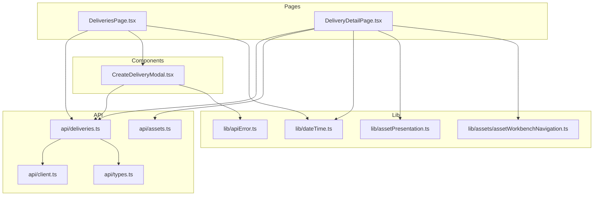
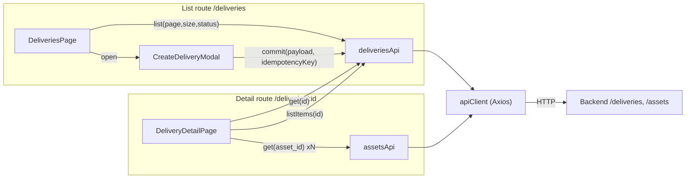
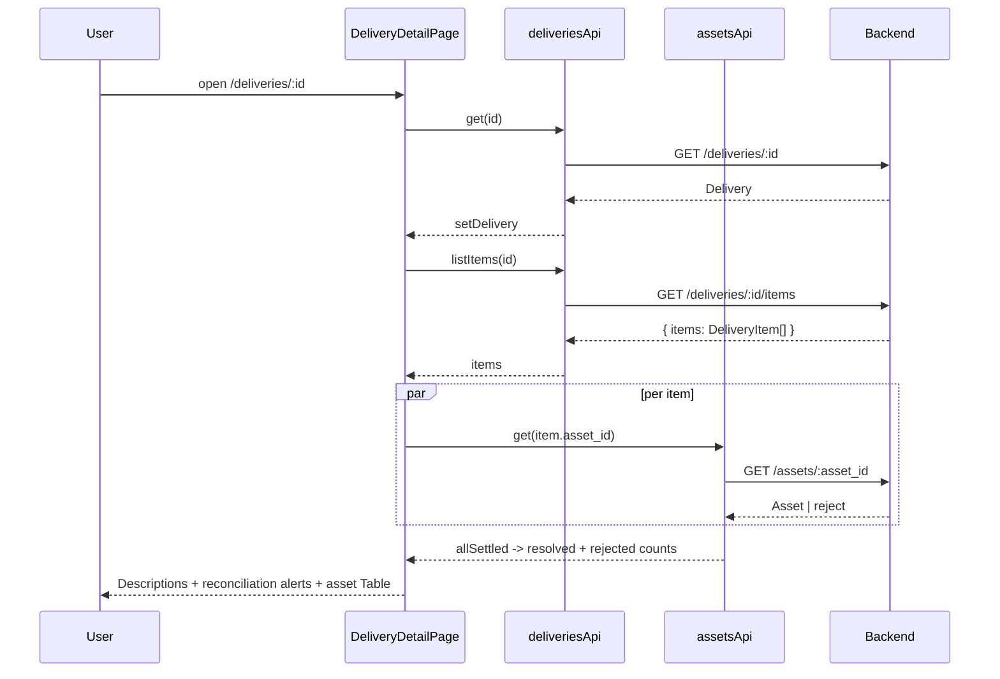
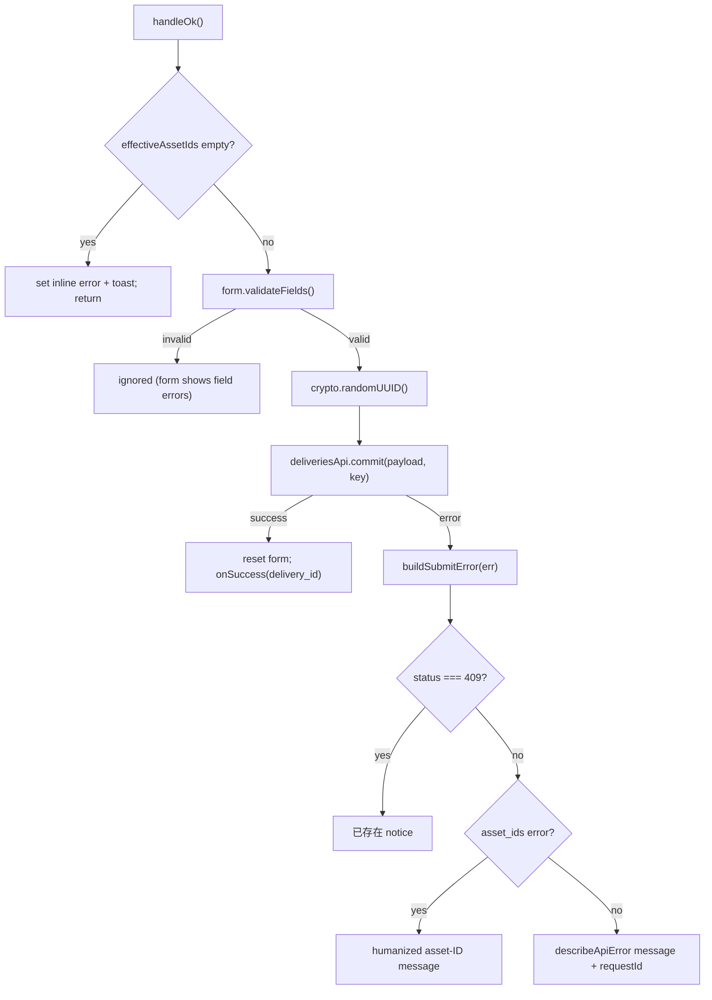
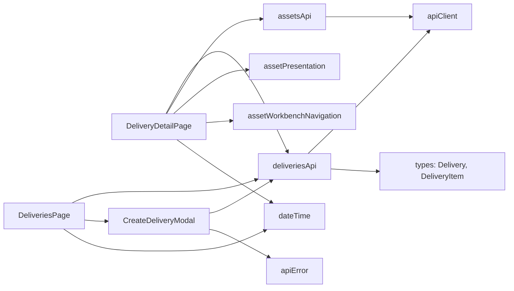

# Delivery Pages

<cite>
**Referenced Files in This Document**

- [Frontend/src/pages/DeliveriesPage.tsx](file://Frontend/src/pages/DeliveriesPage.tsx)
- [Frontend/src/pages/DeliveryDetailPage.tsx](file://Frontend/src/pages/DeliveryDetailPage.tsx)
- [Frontend/src/components/deliveries/CreateDeliveryModal.tsx](file://Frontend/src/components/deliveries/CreateDeliveryModal.tsx)
- [Frontend/src/api/deliveries.ts](file://Frontend/src/api/deliveries.ts)
- [Frontend/src/api/types.ts](file://Frontend/src/api/types.ts)
- [Frontend/src/lib/assetPresentation.ts](file://Frontend/src/lib/assetPresentation.ts)
- [Frontend/src/lib/assets/assetWorkbenchNavigation.ts](file://Frontend/src/lib/assets/assetWorkbenchNavigation.ts)
- [Frontend/src/lib/apiError.ts](file://Frontend/src/lib/apiError.ts)
- [Frontend/src/lib/dateTime.ts](file://Frontend/src/lib/dateTime.ts)
- [Frontend/src/api/client.ts](file://Frontend/src/api/client.ts)
</cite>

## Table of Contents
1. [Introduction](#introduction)
2. [Project Structure](#project-structure)
3. [Core Components](#core-components)
4. [Architecture Overview](#architecture-overview)
5. [Detailed Component Analysis](#detailed-component-analysis)
6. [Dependency Analysis](#dependency-analysis)
7. [Performance Considerations](#performance-considerations)
8. [Troubleshooting Guide](#troubleshooting-guide)
9. [Conclusion](#conclusion)
10. [Appendices](#appendices)

## Introduction

The delivery pages form the customer-facing handoff surface of the cyber-databrew
frontend. A *delivery* is an immutable bundle of assets committed to a customer
under a contract; each delivery has a status lifecycle (`draft` → `pending` →
`delivered` → `accepted` / `rejected`) and an ordered set of *delivery items*,
where each item is a reference to one asset. The two pages documented here cover
the full read path and the creation path:

- **`DeliveriesPage`** — the paginated, status-filterable list of all deliveries,
  plus the entry point for creating a new delivery.
- **`DeliveryDetailPage`** — a single delivery's summary metadata together with
  its expanded, asset-resolved item table.
- **`CreateDeliveryModal`** — a shared dialog, mounted by the list page (and
  reusable from asset-selection flows), that submits a `POST /deliveries` commit
  with an idempotency key.

These pages are consumed by operators and reviewers who package curated assets for
external customers. They are deliberately defensive: the detail page reconciles the
delivery's stored `asset_count` against the actual item rows and surfaces warnings
when the two disagree, because delivery summaries and the `delivery_items` table can
drift (seed/mock data, partial backend responses, or soft-deleted assets).

**Section sources**
- [Frontend/src/pages/DeliveriesPage.tsx](file://Frontend/src/pages/DeliveriesPage.tsx#L1-L205)
- [Frontend/src/pages/DeliveryDetailPage.tsx](file://Frontend/src/pages/DeliveryDetailPage.tsx#L1-L323)

## Project Structure

The delivery feature is split across the React page layer, a thin per-resource API
module, and shared presentation/formatting libraries:

- **Pages** (`Frontend/src/pages/`)
  - `DeliveriesPage.tsx` — list view, status filter, pagination, row navigation,
    and the create button that opens the modal.
  - `DeliveryDetailPage.tsx` — detail view with `Descriptions` metadata, related-asset
    table, and reconciliation alerts.
- **Components** (`Frontend/src/components/deliveries/`)
  - `CreateDeliveryModal.tsx` — controlled modal with form validation, manual
    asset-ID entry, and structured API-error rendering.
  - `CreateDeliveryModal.test.tsx` — companion unit test (not documented in depth here).
- **API layer** (`Frontend/src/api/`)
  - `deliveries.ts` — `list`, `get`, `commit`, `listItems` against `/deliveries`.
  - `types.ts` — `Delivery`, `DeliveryItem`, `Asset`, `PaginatedResponse<T>`.
  - `client.ts` — the shared Axios instance used by every resource module.
- **Libraries** (`Frontend/src/lib/`)
  - `dateTime.ts` — `formatDateTime` for all timestamp columns/labels.
  - `assetPresentation.ts` — `getLifecycleState`, `getAssetStateColor`,
    `formatDurationSeconds` for the related-asset table.
  - `assets/assetWorkbenchNavigation.ts` — `navigateToAssetDetail` for asset-ID drill-down.
  - `apiError.ts` — `describeApiError` used to normalize commit failures.



**Diagram sources**
- [Frontend/src/pages/DeliveriesPage.tsx](file://Frontend/src/pages/DeliveriesPage.tsx#L1-L8)
- [Frontend/src/pages/DeliveryDetailPage.tsx](file://Frontend/src/pages/DeliveryDetailPage.tsx#L1-L23)
- [Frontend/src/components/deliveries/CreateDeliveryModal.tsx](file://Frontend/src/components/deliveries/CreateDeliveryModal.tsx#L1-L4)
- [Frontend/src/api/deliveries.ts](file://Frontend/src/api/deliveries.ts#L1-L2)

**Section sources**
- [Frontend/src/pages/DeliveriesPage.tsx](file://Frontend/src/pages/DeliveriesPage.tsx#L1-L8)
- [Frontend/src/pages/DeliveryDetailPage.tsx](file://Frontend/src/pages/DeliveryDetailPage.tsx#L1-L23)
- [Frontend/src/api/deliveries.ts](file://Frontend/src/api/deliveries.ts#L1-L43)

## Core Components

#### DeliveriesPage

`DeliveriesPage` is the default-exported list component. It holds query state in
hooks: the current `items` array, `total`, `page`, `pageSize`, `status` filter, a
`loading` flag, and `modalOpen` for the create dialog. The query lives in a
`fetchData` callback whose identity is keyed only on `page`, `pageSize`, and
`status`; an effect re-runs `fetchData` whenever that identity changes.

A subtle but important detail: antd v5's `message.useMessage()` can return a fresh
`msg` reference on every render. To keep `fetchData` stable, the message handle is
captured in a `msgRef` and read as `msgRef.current` inside the catch branch — if
`msg` were a direct dependency, the effect would re-fire each render and spam the
list endpoint.

**Section sources**
- [Frontend/src/pages/DeliveriesPage.tsx](file://Frontend/src/pages/DeliveriesPage.tsx#L29-L66)

#### DeliveryDetailPage

`DeliveryDetailPage` reads the `:id` route param and maintains two independent fetch
flows: `fetchDelivery` (summary) and `fetchAssets` (items + per-item asset
resolution). It tracks `delivery`, `assets`, `deliveryItems`, two loading flags, and
a `relatedCounts` object (`itemRows`, `resolvedAssets`, `rejectedFetches`) that drives
the reconciliation alerts. It applies the same `msgRef` stabilization pattern as the
list page.

**Section sources**
- [Frontend/src/pages/DeliveryDetailPage.tsx](file://Frontend/src/pages/DeliveryDetailPage.tsx#L35-L114)

#### CreateDeliveryModal

`CreateDeliveryModal` is a controlled component accepting `open`, `assetIds`,
`onClose`, and `onSuccess`. When opened with a non-empty `assetIds` prop it shows a
green "selected N assets" banner; when opened empty (as it is from the list page,
which passes `assetIds={[]}`) it shows a yellow banner and exposes a free-text area
where the operator types comma/newline-separated asset IDs. On submit it validates
the form, generates an idempotency key with `crypto.randomUUID()`, calls
`deliveriesApi.commit`, and reports either success or a structured error.

**Section sources**
- [Frontend/src/components/deliveries/CreateDeliveryModal.tsx](file://Frontend/src/components/deliveries/CreateDeliveryModal.tsx#L78-L153)

#### deliveriesApi

The `deliveriesApi` object wraps four endpoints. `list` builds a `URLSearchParams`
query (`page`, `page_size`, `status`) and returns `PaginatedResponse<Delivery>`.
`get` fetches a single `Delivery`. `commit` POSTs `CreateDeliveryPayload` with an
`Idempotency-Key` header. `listItems` GETs `/deliveries/:id/items` and unwraps the
`items` array into `DeliveryItem[]`.

**Section sources**
- [Frontend/src/api/deliveries.ts](file://Frontend/src/api/deliveries.ts#L18-L43)

## Architecture Overview

The pages are presentation containers; all I/O funnels through `deliveriesApi` and
`assetsApi`, which share a single Axios `apiClient`. The detail page is notable for
fanning out: after fetching the lightweight `DeliveryItem` rows it issues one
`assetsApi.get` per item via `Promise.allSettled`, so that a single failing or
soft-deleted asset never blocks the rest of the table.



**Diagram sources**
- [Frontend/src/pages/DeliveriesPage.tsx](file://Frontend/src/pages/DeliveriesPage.tsx#L47-L62)
- [Frontend/src/pages/DeliveryDetailPage.tsx](file://Frontend/src/pages/DeliveryDetailPage.tsx#L62-L103)
- [Frontend/src/components/deliveries/CreateDeliveryModal.tsx](file://Frontend/src/components/deliveries/CreateDeliveryModal.tsx#L115-L132)
- [Frontend/src/api/deliveries.ts](file://Frontend/src/api/deliveries.ts#L18-L43)

**Section sources**
- [Frontend/src/api/deliveries.ts](file://Frontend/src/api/deliveries.ts#L18-L43)
- [Frontend/src/api/client.ts](file://Frontend/src/api/client.ts#L1-L29)

## Detailed Component Analysis

### Delivery list flow

On mount and on any change to the filter/pagination triple, `DeliveriesPage` calls
`deliveriesApi.list` and writes `items` and `total` into state. The `Table` columns
render the seven delivery fields: `delivery_id` (a `Link` to the detail route,
`stopPropagation` so it doesn't double-trigger the row click), `customer_id`,
`status` (a colored `Tag` keyed by `STATUS_COLOR`), `delivered_at`, `asset_count`,
`owner`, and `created_at`. Timestamps are formatted with `formatDateTime`.

Row navigation is handled in `onRow`: a click anywhere on the row navigates to the
detail page *unless* the click target is inside an interactive element (links,
buttons, inputs, selects, or pagination controls), guarded by a `closest(...)`
selector check. The status `Select` resets `page` to 1 on change so filtering always
starts from the first page. Pagination shows a size changer, a quick-jumper only when
`total > 200`, and a localized total count.

```mermaid
sequenceDiagram
  participant U as User
  participant LP as DeliveriesPage
  participant API as deliveriesApi
  participant BE as Backend
  U->>LP: open /deliveries
  LP->>API: list({page, page_size, status})
  API->>BE: GET /deliveries?page=&page_size=&status=
  BE-->>API: PaginatedResponse<Delivery>
  API-->>LP: { items, total }
  LP-->>U: render Table (rows + pagination)
  U->>LP: change status filter
  LP->>LP: setStatus(v); setPage(1)
  LP->>API: list(...) (effect re-fires)
  U->>LP: click a row
  LP->>LP: navigate(/deliveries/:id)
```

**Diagram sources**
- [Frontend/src/pages/DeliveriesPage.tsx](file://Frontend/src/pages/DeliveriesPage.tsx#L47-L66)
- [Frontend/src/pages/DeliveriesPage.tsx](file://Frontend/src/pages/DeliveriesPage.tsx#L136-L192)

**Section sources**
- [Frontend/src/pages/DeliveriesPage.tsx](file://Frontend/src/pages/DeliveriesPage.tsx#L68-L205)

### Delivery detail and item resolution

The detail page's two fetchers run in a single effect keyed on their stable
identities. `fetchDelivery` populates the `Descriptions` block: `delivery_id`,
`customer_id`, `contract_id` (defaulting to `—`), `owner`, `asset_count`,
`delivered_at`, `manifest_uri`, `note`, `created_at`, and `updated_at`.

`fetchAssets` is the more involved path. It calls `listItems` to get the
`DeliveryItem[]`, stores them, then resolves each item's asset with
`Promise.allSettled(items.map(item => assetsApi.get(item.asset_id)))`. Fulfilled
results are kept; the rejected count is recorded. Crucially, the table is built from
`deliveryItems` (not from `assets`), so rows survive even when an asset cannot be
fetched — `assetById` is a lookup map and a missing entry becomes `null`, rendering a
"未知" lifecycle tag and an "资产不存在或不可见" note instead of dropping the row.



**Diagram sources**
- [Frontend/src/pages/DeliveryDetailPage.tsx](file://Frontend/src/pages/DeliveryDetailPage.tsx#L62-L114)
- [Frontend/src/pages/DeliveryDetailPage.tsx](file://Frontend/src/pages/DeliveryDetailPage.tsx#L132-L199)

**Section sources**
- [Frontend/src/pages/DeliveryDetailPage.tsx](file://Frontend/src/pages/DeliveryDetailPage.tsx#L62-L320)

#### Reconciliation alerts

Three independent `Alert` banners reconcile the delivery summary against the item
rows:

- **Warning — count vs. empty list**: `asset_count > 0` but `itemRows === 0` and not
  loading. Typically seed/mock data that never wrote `delivery_items`, or a backend
  list that returned no rows.
- **Info — partial asset load**: `itemRows > 0` and `rejectedFetches > 0`. Shows
  `resolvedAssets / itemRows` succeeded; the rest failed (permissions or missing
  assets).
- **Info — count mismatch**: `asset_count > 0`, `itemRows > 0`, and the two differ.
  Suggests treating the item list as authoritative and aligning with the backend.

**Section sources**
- [Frontend/src/pages/DeliveryDetailPage.tsx](file://Frontend/src/pages/DeliveryDetailPage.tsx#L278-L310)

#### Related-asset table rendering

The asset table maps each `DeliveryItem` to `{ asset_id, asset }`. The asset-ID
column renders a `link-like-button` that calls `navigateToAssetDetail` for drill-down.
The lifecycle column uses `getLifecycleState` + `getAssetStateColor`; the duration
column uses `formatDurationSeconds`; owner and updated-at fall back to `—` when the
asset is `null`. The note column only renders text for missing assets. The table has
no client pagination (`pagination={false}`) and a localized empty state.

**Section sources**
- [Frontend/src/pages/DeliveryDetailPage.tsx](file://Frontend/src/pages/DeliveryDetailPage.tsx#L132-L199)
- [Frontend/src/lib/assetPresentation.ts](file://Frontend/src/lib/assetPresentation.ts#L1-L62)
- [Frontend/src/lib/assets/assetWorkbenchNavigation.ts](file://Frontend/src/lib/assets/assetWorkbenchNavigation.ts#L1-L106)

### Create-delivery flow

`CreateDeliveryModal` derives `effectiveAssetIds`: when `assetIds` is non-empty it
uses the prop; otherwise it parses the manual text area, splitting on commas and
newlines, trimming, dropping empties, and de-duplicating via a `Set`. The OK button is
disabled while `effectiveAssetIds` is empty, and `handleOk` short-circuits with an
inline error if nothing is selected.

On a valid submit it generates `crypto.randomUUID()` as the `Idempotency-Key`,
assembles the `CreateDeliveryPayload` (optional fields collapse to `undefined`), and
awaits `deliveriesApi.commit`. Success resets the form and calls
`onSuccess(delivery.delivery_id)`. From the list page, `onSuccess` closes the modal
and navigates to the new delivery's detail route.

Errors are classified by `buildSubmitError`: antd form-validation errors (detected via
the `errorFields` shape) are ignored (the form shows its own field messages); a `409`
becomes an "already exists" notice; asset-ID format errors are humanized by
`getAssetIdsError` (the backend's "8 alphanumeric characters" rule); all others surface
`describeApiError`'s normalized message plus a request-ID hint when present.



**Diagram sources**
- [Frontend/src/components/deliveries/CreateDeliveryModal.tsx](file://Frontend/src/components/deliveries/CreateDeliveryModal.tsx#L93-L145)
- [Frontend/src/components/deliveries/CreateDeliveryModal.tsx](file://Frontend/src/components/deliveries/CreateDeliveryModal.tsx#L47-L76)

**Section sources**
- [Frontend/src/components/deliveries/CreateDeliveryModal.tsx](file://Frontend/src/components/deliveries/CreateDeliveryModal.tsx#L18-L259)
- [Frontend/src/lib/apiError.ts](file://Frontend/src/lib/apiError.ts#L1-L95)

## Dependency Analysis

The pages depend downward on the API and library layers and are themselves wired into
the router by their parent (the list `Link`/`navigate` targets `/deliveries/:id`, and
the create flow navigates back into the detail route).



Key types: `Delivery` (summary, includes `asset_count`, `status`, `manifest_uri`),
`DeliveryItem` (`delivery_id`, `asset_id`, `created_at`), and `PaginatedResponse<T>`
(`items`, `total`, `page`, `page_size`).

**Diagram sources**
- [Frontend/src/pages/DeliveryDetailPage.tsx](file://Frontend/src/pages/DeliveryDetailPage.tsx#L1-L23)
- [Frontend/src/pages/DeliveriesPage.tsx](file://Frontend/src/pages/DeliveriesPage.tsx#L1-L8)
- [Frontend/src/api/types.ts](file://Frontend/src/api/types.ts#L106-L127)

**Section sources**
- [Frontend/src/api/types.ts](file://Frontend/src/api/types.ts#L3-L127)
- [Frontend/src/api/deliveries.ts](file://Frontend/src/api/deliveries.ts#L1-L43)

## Performance Considerations

- **Server-side pagination.** The list never loads all deliveries; `page` and
  `page_size` (default 20) are sent to the backend, and only the current page's rows
  render. The quick-jumper appears only past 200 rows.
- **Stable callback identities.** Both pages capture the antd `msg` handle in a ref so
  fetch callbacks depend only on real query params. Without this, `useEffect` would
  re-fire every render and flood the list/detail endpoints — the inline comments call
  this out explicitly.
- **N+1 on the detail page.** Resolving items issues one `assetsApi.get` per item.
  For deliveries with many assets this is a fan-out of N requests. They run
  concurrently via `Promise.allSettled`, so latency is bounded by the slowest request
  rather than their sum, but request *count* still scales linearly with item count.
  There is no batch asset endpoint used here and no client-side caching across navigations.
- **Failure isolation.** `Promise.allSettled` means one rejected asset fetch does not
  abort the others; the table still renders every item row.

**Section sources**
- [Frontend/src/pages/DeliveriesPage.tsx](file://Frontend/src/pages/DeliveriesPage.tsx#L40-L66)
- [Frontend/src/pages/DeliveryDetailPage.tsx](file://Frontend/src/pages/DeliveryDetailPage.tsx#L75-L103)

## Troubleshooting Guide

#### "资产数与关联列表不一致" warning on the detail page
The delivery's `asset_count > 0` but no item rows came back. Check that
`delivery_items` rows exist for this `delivery_id` and that `GET /deliveries/:id/items`
returns a populated `items` array. Common with seed/mock data.

**Section sources**
- [Frontend/src/pages/DeliveryDetailPage.tsx](file://Frontend/src/pages/DeliveryDetailPage.tsx#L278-L290)

#### "部分资产详情未加载" info banner
Some `assetsApi.get` calls rejected. Inspect `relatedCounts.rejectedFetches`; the
usual causes are missing/soft-deleted assets or insufficient permissions on those
assets. The affected rows still appear with a "未知" lifecycle tag.

**Section sources**
- [Frontend/src/pages/DeliveryDetailPage.tsx](file://Frontend/src/pages/DeliveryDetailPage.tsx#L81-L99)
- [Frontend/src/pages/DeliveryDetailPage.tsx](file://Frontend/src/pages/DeliveryDetailPage.tsx#L291-L299)

#### Create fails with "该交付已存在" (409)
The commit hit a duplicate. Because `commit` always sends a fresh
`Idempotency-Key`, a 409 means the backend already has an equivalent delivery —
refresh the list to confirm before retrying.

**Section sources**
- [Frontend/src/components/deliveries/CreateDeliveryModal.tsx](file://Frontend/src/components/deliveries/CreateDeliveryModal.tsx#L57-L67)

#### Create rejected for asset-ID format
The backend enforces 8 alphanumeric characters per asset ID. `getAssetIdsError`
humanizes this and, when the error `details.asset_id` is present, names the offending
ID. Fix the manual text-area entries accordingly.

**Section sources**
- [Frontend/src/components/deliveries/CreateDeliveryModal.tsx](file://Frontend/src/components/deliveries/CreateDeliveryModal.tsx#L28-L45)

#### List or detail toast "加载…失败"
The list or summary fetch threw. Verify the `apiClient` base URL/auth and that the
endpoint is reachable; the failure is caught and surfaced via the ref-captured message
handle.

**Section sources**
- [Frontend/src/pages/DeliveriesPage.tsx](file://Frontend/src/pages/DeliveriesPage.tsx#L47-L62)
- [Frontend/src/pages/DeliveryDetailPage.tsx](file://Frontend/src/pages/DeliveryDetailPage.tsx#L62-L73)

## Conclusion

The delivery pages provide a complete, defensively engineered handoff workflow: a
filterable, server-paginated list; a detail view that reconciles summary metadata with
the live item set and tolerates partial asset failures; and a create modal that
de-duplicates inputs, enforces idempotency, and translates backend errors into
actionable messages. The consistent `msgRef` stabilization pattern and the
`Promise.allSettled` fan-out are the two engineering decisions most worth preserving
when extending these pages.

## Appendices

### Delivery status enum (list/detail)

| Value | Label (zh) | Tag color |
| --- | --- | --- |
| `draft` | 草稿 | default |
| `pending` | 待交付 | processing |
| `delivered` | 已交付 | success |
| `accepted` | 已接受 | green |
| `rejected` | 已拒绝 | error |

The list filter additionally offers an empty value labeled "全部" (all), which omits
the `status` query param.

**Section sources**
- [Frontend/src/pages/DeliveriesPage.tsx](file://Frontend/src/pages/DeliveriesPage.tsx#L12-L27)
- [Frontend/src/pages/DeliveryDetailPage.tsx](file://Frontend/src/pages/DeliveryDetailPage.tsx#L27-L33)

### deliveriesApi surface

| Method | HTTP | Path | Returns |
| --- | --- | --- | --- |
| `list(params)` | GET | `/deliveries?page=&page_size=&status=` | `PaginatedResponse<Delivery>` |
| `get(id)` | GET | `/deliveries/:id` | `Delivery` |
| `commit(payload, key)` | POST | `/deliveries` (`Idempotency-Key` header) | `Delivery` |
| `listItems(id)` | GET | `/deliveries/:id/items` | `DeliveryItem[]` |

**Section sources**
- [Frontend/src/api/deliveries.ts](file://Frontend/src/api/deliveries.ts#L18-L43)

### CreateDeliveryPayload fields

| Field | Required | Notes |
| --- | --- | --- |
| `customer_id` | yes | form-validated, "请输入客户 ID" |
| `contract_id` | no | collapses to `undefined` when blank |
| `note` | no | textarea, optional |
| `owner` | no | optional |
| `asset_ids` | yes (effective) | from prop or parsed manual text; OK disabled when empty |

**Section sources**
- [Frontend/src/api/deliveries.ts](file://Frontend/src/api/deliveries.ts#L10-L16)
- [Frontend/src/components/deliveries/CreateDeliveryModal.tsx](file://Frontend/src/components/deliveries/CreateDeliveryModal.tsx#L93-L132)
</content>
</invoke>
