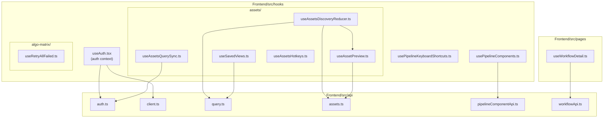
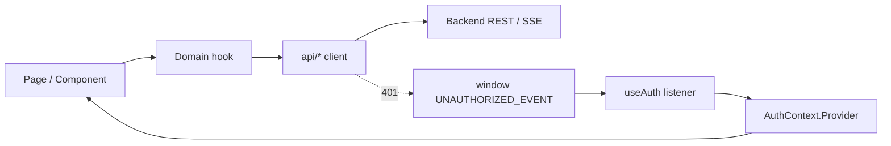
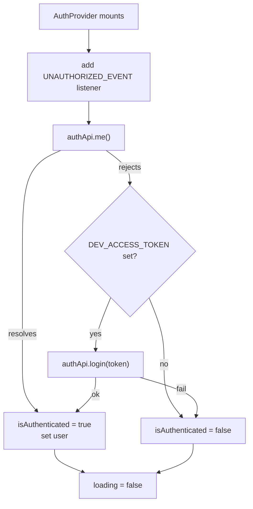
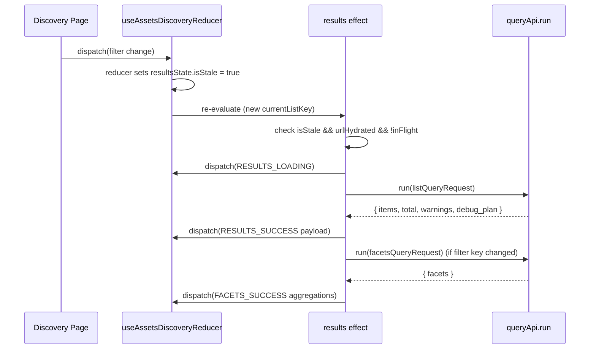
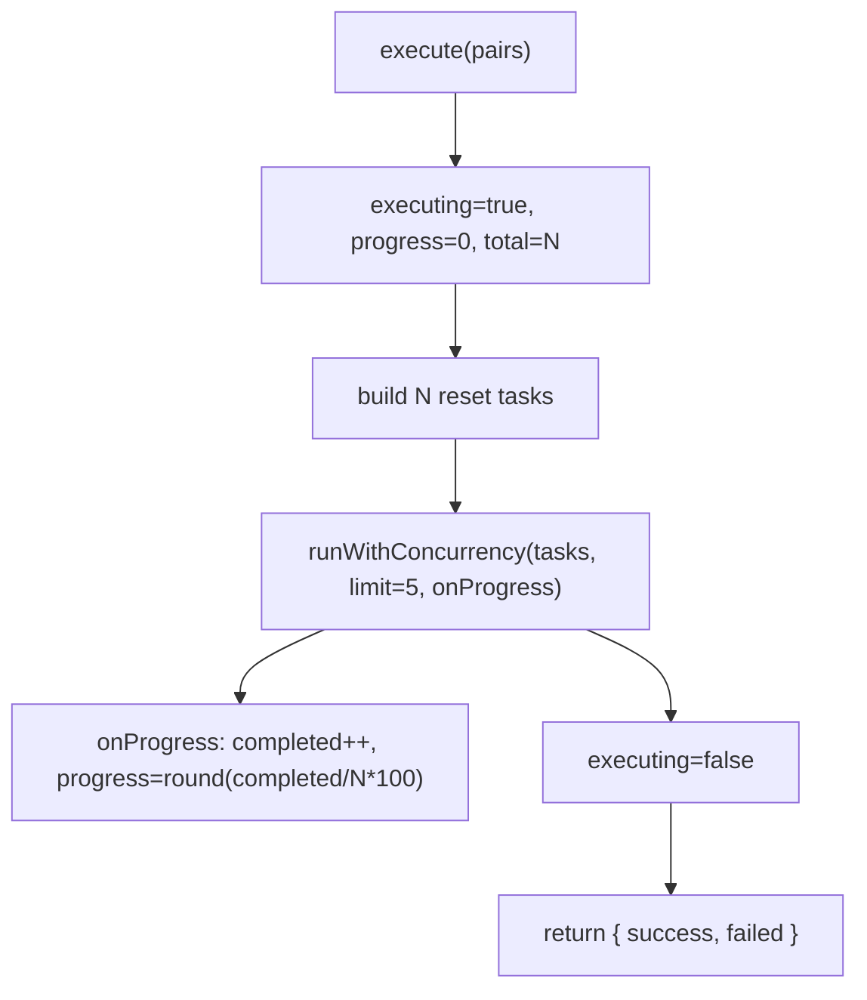
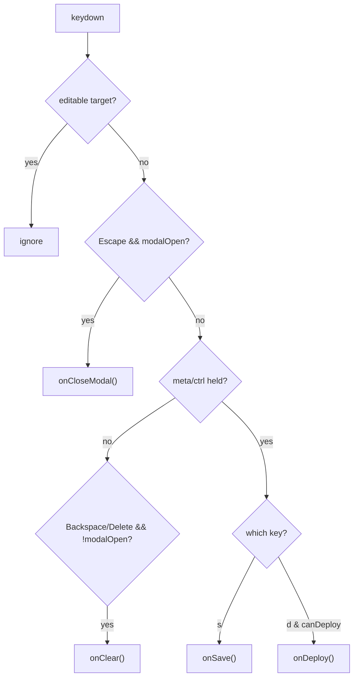
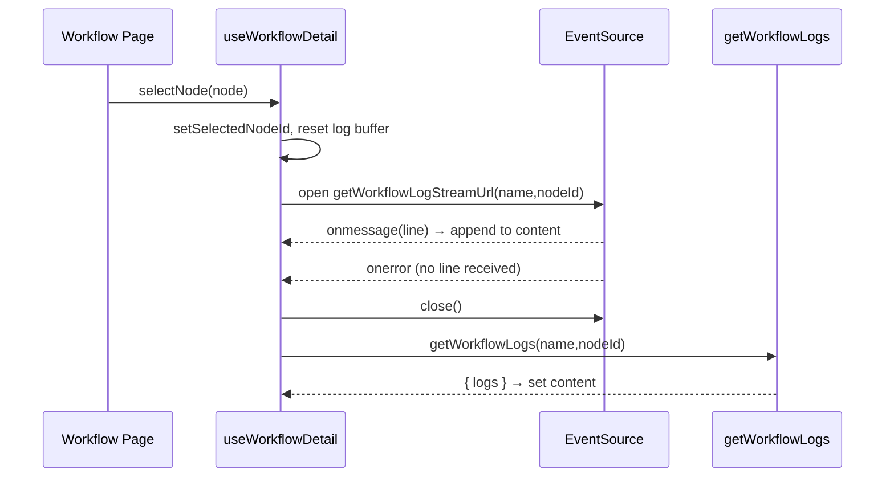
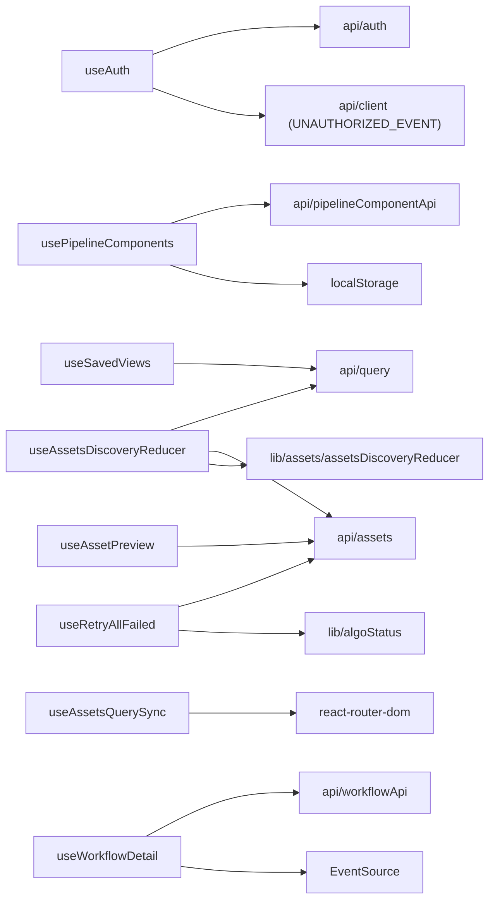

# Hooks System

<cite>
**Referenced Files in This Document**

- [Frontend/src/hooks/useAuth.tsx](file://Frontend/src/hooks/useAuth.tsx)
- [Frontend/src/hooks/usePipelineComponents.ts](file://Frontend/src/hooks/usePipelineComponents.ts)
- [Frontend/src/hooks/usePipelineKeyboardShortcuts.ts](file://Frontend/src/hooks/usePipelineKeyboardShortcuts.ts)
- [Frontend/src/hooks/algo-matrix/useRetryAllFailed.ts](file://Frontend/src/hooks/algo-matrix/useRetryAllFailed.ts)
- [Frontend/src/hooks/assets/useAssetPreview.ts](file://Frontend/src/hooks/assets/useAssetPreview.ts)
- [Frontend/src/hooks/assets/useAssetsDiscoveryReducer.ts](file://Frontend/src/hooks/assets/useAssetsDiscoveryReducer.ts)
- [Frontend/src/hooks/assets/useAssetsHotkeys.ts](file://Frontend/src/hooks/assets/useAssetsHotkeys.ts)
- [Frontend/src/hooks/assets/useAssetsQuerySync.ts](file://Frontend/src/hooks/assets/useAssetsQuerySync.ts)
- [Frontend/src/hooks/assets/useSavedViews.ts](file://Frontend/src/hooks/assets/useSavedViews.ts)
- [Frontend/src/pages/useWorkflowDetail.ts](file://Frontend/src/pages/useWorkflowDetail.ts)
</cite>

## Table of Contents
1. [Introduction](#introduction)
2. [Project Structure](#project-structure)
3. [Core Components](#core-components)
4. [Architecture Overview](#architecture-overview)
5. [Detailed Component Analysis](#detailed-component-analysis)
6. [Dependency Analysis](#dependency-analysis)
7. [Performance Considerations](#performance-considerations)
8. [Troubleshooting Guide](#troubleshooting-guide)
9. [Conclusion](#conclusion)
10. [Appendices](#appendices)

## Introduction

The frontend hooks system is the layer of reusable React logic that sits between
the raw API clients (`src/api/*`) and the presentational components and pages of
the cyber-databrew web application. Every hook isolates one cross-cutting
concern — session authentication, domain data fetching with caching, URL state
synchronization, keyboard shortcuts, or batch background work — so that page
components remain thin and focused on rendering.

The hooks fall into five functional groups:

- **Auth** — a single React Context (`useAuth` / `AuthProvider`) that owns the
  session lifecycle and exposes login/logout to the whole tree.
- **Assets** — the largest group, powering the Assets Discovery Workbench: a
  reducer-backed data hook, a preview-fetch hook, a bidirectional URL-sync hook,
  a saved-views hook, and a scoped hotkeys hook.
- **Algo-matrix** — a batch-execution hook (`useRetryAllFailed`) that retries
  failed algorithm tasks with bounded concurrency and progress reporting.
- **Pipeline** — a data hook for registered pipeline components
  (`usePipelineComponents`) with localStorage caching, and a keyboard-shortcut
  hook for the pipeline editor (`usePipelineKeyboardShortcuts`).
- **Workflow** — `useWorkflowDetail`, which fetches a workflow, polls while it is
  active, and streams node logs over Server-Sent Events with a REST fallback.

These hooks share a small set of recurring patterns: a `loading` / `error` /
`data` triple for fetch state, `useRef` guards (`cancelled`, in-flight, previous
key) to defeat race conditions and React StrictMode double-invocation, and
`useCallback` memoization so effects do not re-run on every render.

**Section sources**
- [Frontend/src/hooks/useAuth.tsx](file://Frontend/src/hooks/useAuth.tsx#L1-L98)
- [Frontend/src/hooks/usePipelineComponents.ts](file://Frontend/src/hooks/usePipelineComponents.ts#L1-L82)
- [Frontend/src/pages/useWorkflowDetail.ts](file://Frontend/src/pages/useWorkflowDetail.ts#L60-L107)

## Project Structure

Hooks live under `Frontend/src/hooks/`, with domain hooks grouped into
subdirectories. One workflow hook lives next to its page under
`Frontend/src/pages/`. Each data hook imports from a sibling `src/api/*` client
and, for the assets group, from the `src/lib/assets/*` reducer and type modules.

**Diagram sources**
- [Frontend/src/hooks/useAuth.tsx](file://Frontend/src/hooks/useAuth.tsx#L8-L9)
- [Frontend/src/hooks/usePipelineComponents.ts](file://Frontend/src/hooks/usePipelineComponents.ts#L8-L12)
- [Frontend/src/hooks/assets/useAssetsDiscoveryReducer.ts](file://Frontend/src/hooks/assets/useAssetsDiscoveryReducer.ts#L6-L20)
- [Frontend/src/hooks/assets/useSavedViews.ts](file://Frontend/src/hooks/assets/useSavedViews.ts#L6-L12)
- [Frontend/src/pages/useWorkflowDetail.ts](file://Frontend/src/pages/useWorkflowDetail.ts#L2-L9)

**Section sources**
- [Frontend/src/hooks/assets/useAssetPreview.ts](file://Frontend/src/hooks/assets/useAssetPreview.ts#L1-L20)
- [Frontend/src/hooks/assets/useAssetsQuerySync.ts](file://Frontend/src/hooks/assets/useAssetsQuerySync.ts#L1-L22)

## Core Components

The system is composed of nine hooks. Each one returns a stable, typed surface
consumed by exactly the components in its domain.

| Hook | Group | Returns | Backing source |
| --- | --- | --- | --- |
| `useAuth` / `AuthProvider` | auth | `{ isAuthenticated, loading, user, login, logout }` | `authApi`, `UNAUTHORIZED_EVENT` |
| `useAssetsDiscoveryReducer` | assets | `[state, dispatch]` | `queryApi`, `assetsApi` |
| `useAssetPreview` | assets | `void` (dispatches into reducer) | `assetsApi` |
| `useAssetsQuerySync` | assets | `void` (URL ↔ state) | React Router |
| `useSavedViews` | assets | `{ views, currentViewId, selectView, saveView, deleteView }` | `queryApi` |
| `useAssetsHotkeys` | assets | `void` (keyboard nav) | DOM events |
| `useRetryAllFailed` | algo-matrix | `{ executing, progress, total, execute }` | `assetsApi.resetAlgo` |
| `usePipelineComponents` | pipeline | `{ components, loading, error, reload, setComponents }` | `listComponents`, localStorage |
| `usePipelineKeyboardShortcuts` | pipeline | `void` (editor shortcuts) | DOM events |
| `useWorkflowDetail` | workflow | workflow + log state + actions | `workflowApi`, `EventSource` |

The `AuthContextValue` shape is the contract for the whole application's session
state: a boolean `isAuthenticated`, a `loading` flag for the initial probe, a
nullable `user` with `email` and `role`, and `login` / `logout` async actions.

**Section sources**
- [Frontend/src/hooks/useAuth.tsx](file://Frontend/src/hooks/useAuth.tsx#L15-L23)
- [Frontend/src/hooks/usePipelineComponents.ts](file://Frontend/src/hooks/usePipelineComponents.ts#L30-L41)
- [Frontend/src/hooks/algo-matrix/useRetryAllFailed.ts](file://Frontend/src/hooks/algo-matrix/useRetryAllFailed.ts#L63-L99)
- [Frontend/src/pages/useWorkflowDetail.ts](file://Frontend/src/pages/useWorkflowDetail.ts#L25-L34)

## Architecture Overview

Hooks act as adapters: a page composes one or more hooks, the hooks call API
clients, and the clients call the backend. The auth hook additionally listens
for a global `UNAUTHORIZED_EVENT` dispatched by the shared HTTP client, so any
401 anywhere in the app forces the context back to the unauthenticated state
without coupling the client to React.

**Diagram sources**
- [Frontend/src/hooks/useAuth.tsx](file://Frontend/src/hooks/useAuth.tsx#L32-L69)
- [Frontend/src/hooks/usePipelineComponents.ts](file://Frontend/src/hooks/usePipelineComponents.ts#L48-L69)

**Section sources**
- [Frontend/src/hooks/useAuth.tsx](file://Frontend/src/hooks/useAuth.tsx#L25-L98)

## Detailed Component Analysis

### Auth group — `useAuth` / `AuthProvider`

`AuthProvider` holds three pieces of state — `isAuthenticated`, `loading`, and
`user` — and wraps the application tree in an `AuthContext.Provider`. On mount, a
single effect registers a `UNAUTHORIZED_EVENT` listener and probes the session
with `authApi.me()`. On success it marks the session authenticated and stores
`{ email, role }` (defaulting the role to `"user"`). On failure it optionally
attempts a dev-token login when `VITE_DEV_ACCESS_TOKEN` is present in a `DEV`
build, otherwise it settles on unauthenticated. A `cancelled` ref guards every
state write so an unmount during the in-flight probe cannot set state on a dead
component, and the effect cleanup removes the global listener.

`login(email)` posts an email login and stores the returned user; `logout()`
clears both `isAuthenticated` and `user`. The exported `useAuth()` reads the
context and throws if used outside an `AuthProvider`, which makes missing-provider
mistakes fail loudly at development time.

**Diagram sources**
- [Frontend/src/hooks/useAuth.tsx](file://Frontend/src/hooks/useAuth.tsx#L32-L69)

**Section sources**
- [Frontend/src/hooks/useAuth.tsx](file://Frontend/src/hooks/useAuth.tsx#L25-L98)

### Assets group — discovery reducer, preview, URL sync, saved views, hotkeys

The assets group is the most elaborate. `useAssetsDiscoveryReducer` is the data
core: it wraps `useReducer(assetsDiscoveryReducer, …)` and layers two side-effect
`useEffect`s on top — a results-fetch effect and a preview-fetch effect.

The results effect derives a `QueryRequest` from `queryState` via
`buildListQueryRequest`, then a separate facets request via
`buildFacetsQueryRequest`. To avoid re-running on every dispatch (reducers always
produce new object references), it computes a `stableStringify` key for both
requests and fires only when `resultsState.isStale` and `routerState.urlHydrated`
are true. An `inFlightRef` deduplicates concurrent fetches, a `listKeyRef`
discards responses for stale keys, and a `facetsLoadedKeyRef` ensures facet
aggregations are refreshed only when the filter slice (excluding page) changes.
Facets are fetched lazily after the list resolves so first paint skips ES
aggregation. There is a frontend-only `algo_status` fallback filter that narrows
the current page and appends a warning, because the backend total/pagination
stay full-set.

`useAssetPreview` is a standalone preview-fetch hook for contexts outside the
reducer (such as the detail page). It tracks the previous asset id in a ref,
short-circuits when unchanged, and on a new id dispatches `PREVIEW_LOADING`,
fetches the asset and its foxglove source, builds a manifest with
`buildPreviewManifestFromSources`, and dispatches `RECEIVE_PREVIEW_SUCCESS` or
`RECEIVE_PREVIEW_ERROR`. The same manifest builder is reused by the reducer's
own preview effect, keeping the two paths consistent.

`useAssetsQuerySync` provides bidirectional URL ↔ state binding using React
Router. On mount it parses `location.search`, dispatches `URL_HYDRATE` then
`MARK_URL_HYDRATED`. After hydration it serializes `queryState` to the URL,
using `pushState` for page changes (so the back button paginates) and
`replaceState` for filter/sort changes. A `lastWrittenUrlRef` prevents the
popstate effect from re-hydrating from a URL the hook itself just wrote.

`useSavedViews` merges four built-in presets (`BUILTIN_VIEWS`) with remote saved
queries loaded via `queryApi.listSavedQueries()`, translating each stored
`QueryRequest` IR back into a partial `QueryState` with
`queryRequestToPartialQueryState` (queries containing `or`/`not` are skipped as
unrepresentable). It exposes `selectView`, `saveView` (serializes current state
to IR and persists it), and `deleteView`. A `sessionStorage` handoff key
(`assets_open_saved_query_id`) lets another page request that a view be applied
on load.

`useAssetsHotkeys` attaches a scoped `keydown` listener to a container ref so it
fires only when focus is inside the discovery grid. It guards against editable
and interactive targets (inputs, buttons, sliders, the media player, Ant Design
controls), maps `/` to focus the search box, `Escape` to close overlays, space to
toggle selection of the active row, and arrow keys to move the active asset up or
down the visible `items` list.

**Diagram sources**
- [Frontend/src/hooks/assets/useAssetsDiscoveryReducer.ts](file://Frontend/src/hooks/assets/useAssetsDiscoveryReducer.ts#L286-L399)

**Section sources**
- [Frontend/src/hooks/assets/useAssetsDiscoveryReducer.ts](file://Frontend/src/hooks/assets/useAssetsDiscoveryReducer.ts#L223-L462)
- [Frontend/src/hooks/assets/useAssetPreview.ts](file://Frontend/src/hooks/assets/useAssetPreview.ts#L196-L245)
- [Frontend/src/hooks/assets/useAssetsQuerySync.ts](file://Frontend/src/hooks/assets/useAssetsQuerySync.ts#L31-L159)
- [Frontend/src/hooks/assets/useSavedViews.ts](file://Frontend/src/hooks/assets/useSavedViews.ts#L122-L300)
- [Frontend/src/hooks/assets/useAssetsHotkeys.ts](file://Frontend/src/hooks/assets/useAssetsHotkeys.ts#L13-L99)

### Algo-matrix group — `useRetryAllFailed`

`useRetryAllFailed` performs a batch retry of every failed algorithm task on the
current page. The pure helper `collectFailedPairs` walks assets × algorithms and
collects `{ assetId, algoKey }` pairs whose status normalizes to "failed" using
the same `getAlgoStatusFromResults` / `isFailedStatus` parser the matrix grid
uses, so the two views agree on what counts as failed. The hook returns
`executing`, `progress` (0–100), `total`, and an `execute(pairs)` action.

`execute` builds one task per pair calling `assetsApi.resetAlgo`, then runs them
through `runWithConcurrency` with a fixed limit of 5 workers. Each completed task
increments a counter and updates `progress`; the result tallies `success` and
`failed` counts. Concurrency bounding keeps a large retry from flooding the
backend while still parallelizing.

**Diagram sources**
- [Frontend/src/hooks/algo-matrix/useRetryAllFailed.ts](file://Frontend/src/hooks/algo-matrix/useRetryAllFailed.ts#L40-L99)

**Section sources**
- [Frontend/src/hooks/algo-matrix/useRetryAllFailed.ts](file://Frontend/src/hooks/algo-matrix/useRetryAllFailed.ts#L1-L99)

### Pipeline group — `usePipelineComponents`, `usePipelineKeyboardShortcuts`

`usePipelineComponents` provides the registered-component catalog for the
pipeline editor with an offline-first cache. It seeds state from localStorage
(`databrew-components`) via the lazy initializer `loadComponentsFromStorage`, then
`fetchComponents` calls `listComponents()`, maps each API record through the
caller-supplied `mapApi`, deduplicates with the caller-supplied `dedupe`, and —
only if the mapped list is non-empty — replaces state and writes back to storage.
A second effect persists any state change to localStorage. `fetchComponents` is
memoized with `useCallback` keyed on `dedupe` and `mapApi`, and exposed as
`reload`. The non-empty guard means a transient empty/failed response never wipes
the cached catalog.

`usePipelineKeyboardShortcuts` registers a window-level `keydown` handler for the
editor. It ignores events whose target is editable (`isEditableTarget` covers
input/textarea/select and `contentEditable`). `Escape` closes the modal when one
is open; otherwise, with the meta/ctrl modifier held, `S` saves, `D` deploys
(only when `canDeploy`), and `Backspace`/`Delete` clears the canvas when no modal
is open. The effect re-binds whenever any handler or flag changes.

**Diagram sources**
- [Frontend/src/hooks/usePipelineKeyboardShortcuts.ts](file://Frontend/src/hooks/usePipelineKeyboardShortcuts.ts#L31-L64)
- [Frontend/src/hooks/usePipelineComponents.ts](file://Frontend/src/hooks/usePipelineComponents.ts#L48-L73)

**Section sources**
- [Frontend/src/hooks/usePipelineComponents.ts](file://Frontend/src/hooks/usePipelineComponents.ts#L14-L82)
- [Frontend/src/hooks/usePipelineKeyboardShortcuts.ts](file://Frontend/src/hooks/usePipelineKeyboardShortcuts.ts#L1-L65)

### Workflow group — `useWorkflowDetail`

`useWorkflowDetail(name)` loads a workflow via `getWorkflow`, exposing
`workflow`, `loading`, and a structured `loadError` (`not_found` for a 404
`ApiError`, otherwise `error`). While the workflow status is `Running` or
`Pending`, a second effect polls `getWorkflow` every 8 seconds and clears the
timer on cleanup or status change.

Node logs are streamed: `selectNode` records the selected node id and resets the
log buffer; an effect then calls `loadNodeLogs`, which opens an `EventSource`
against `getWorkflowLogStreamUrl(name, nodeId)` with credentials. Each SSE message
appends a line to `logState.content`. If the browser lacks `EventSource`, or the
stream errors before any line arrives, it falls back to the one-shot
`getWorkflowLogs` REST call. `stopNodeLogStream` closes the stream, and a guard
ignores `onerror` from a stream that is no longer the active one. A final effect
clears the selection when the selected node disappears from a refreshed workflow,
and an unmount cleanup always closes the stream.

**Diagram sources**
- [Frontend/src/pages/useWorkflowDetail.ts](file://Frontend/src/pages/useWorkflowDetail.ts#L143-L193)

**Section sources**
- [Frontend/src/pages/useWorkflowDetail.ts](file://Frontend/src/pages/useWorkflowDetail.ts#L60-L267)

## Dependency Analysis

Hooks depend downward on API clients and shared `lib` modules, and never on each
other across groups — the only intra-group composition is `useAssetPreview`'s
`buildPreviewManifestFromSources` being reused inside the discovery reducer.

**Diagram sources**
- [Frontend/src/hooks/useAuth.tsx](file://Frontend/src/hooks/useAuth.tsx#L8-L9)
- [Frontend/src/hooks/algo-matrix/useRetryAllFailed.ts](file://Frontend/src/hooks/algo-matrix/useRetryAllFailed.ts#L4-L8)
- [Frontend/src/hooks/assets/useAssetsDiscoveryReducer.ts](file://Frontend/src/hooks/assets/useAssetsDiscoveryReducer.ts#L6-L20)
- [Frontend/src/pages/useWorkflowDetail.ts](file://Frontend/src/pages/useWorkflowDetail.ts#L1-L9)

**Section sources**
- [Frontend/src/hooks/assets/useAssetPreview.ts](file://Frontend/src/hooks/assets/useAssetPreview.ts#L9-L20)
- [Frontend/src/hooks/usePipelineComponents.ts](file://Frontend/src/hooks/usePipelineComponents.ts#L1-L28)

## Performance Considerations

- **Derived-key memoization.** `useAssetsDiscoveryReducer` uses `useMemo` to build
  request objects and `stableStringify` to derive stable string keys, so effects
  depend on the key rather than reducer-fresh object references and do not re-run
  on every dispatch.
- **In-flight deduplication and stale-response discard.** `inFlightRef` skips
  overlapping fetches and `listKeyRef` discards responses whose key no longer
  matches the current query, preventing flicker and out-of-order writes.
- **Lazy facets.** Facet aggregations are fetched only after the list resolves and
  only when the filter slice changes, keeping ElasticSearch aggregation off the
  first-paint path.
- **Bounded concurrency.** `useRetryAllFailed` caps retries at 5 concurrent
  requests via `runWithConcurrency`, balancing throughput against backend load.
- **localStorage cache.** `usePipelineComponents` paints instantly from cache and
  only overwrites it with a non-empty fresh response.
- **Adaptive polling.** `useWorkflowDetail` polls only while a workflow is
  `Running`/`Pending` and prefers SSE streaming over polling for logs.

**Section sources**
- [Frontend/src/hooks/assets/useAssetsDiscoveryReducer.ts](file://Frontend/src/hooks/assets/useAssetsDiscoveryReducer.ts#L255-L297)
- [Frontend/src/hooks/algo-matrix/useRetryAllFailed.ts](file://Frontend/src/hooks/algo-matrix/useRetryAllFailed.ts#L40-L61)
- [Frontend/src/pages/useWorkflowDetail.ts](file://Frontend/src/pages/useWorkflowDetail.ts#L43-L44)

## Troubleshooting Guide

- **"useAuth must be used within an AuthProvider".** The component is rendered
  outside `AuthProvider`; ensure the provider wraps the route subtree.
- **Stuck on the auth loading splash.** `loading` only flips false in the probe's
  `finally`; if `authApi.me()` never settles (e.g. network hang) the splash
  persists. Confirm `/auth/me` returns.
- **List does not refresh after a filter change.** The results effect requires
  both `resultsState.isStale` and `routerState.urlHydrated`; if URL hydration
  never completed (`MARK_URL_HYDRATED` not dispatched) no fetch fires.
- **Back button does not paginate.** `useAssetsQuerySync` only uses `pushState`
  for page changes; filter/sort changes use `replaceState` by design.
- **Saved view silently missing.** `queryRequestToPartialQueryState` returns
  `null` for queries containing `or`/`not`, so such saved queries are dropped.
- **Pipeline catalog goes blank after reload.** Not expected — the non-empty guard
  in `fetchComponents` keeps the cached list; a blank catalog means localStorage
  was cleared and the fetch returned no items.
- **No node logs appear.** If SSE errors before the first line, the hook falls
  back to `getWorkflowLogs`; a persistently empty panel means both the stream and
  the REST call returned no content.

**Section sources**
- [Frontend/src/hooks/useAuth.tsx](file://Frontend/src/hooks/useAuth.tsx#L61-L96)
- [Frontend/src/hooks/assets/useAssetsDiscoveryReducer.ts](file://Frontend/src/hooks/assets/useAssetsDiscoveryReducer.ts#L286-L292)
- [Frontend/src/hooks/assets/useSavedViews.ts](file://Frontend/src/hooks/assets/useSavedViews.ts#L100-L118)
- [Frontend/src/hooks/usePipelineComponents.ts](file://Frontend/src/hooks/usePipelineComponents.ts#L52-L58)
- [Frontend/src/pages/useWorkflowDetail.ts](file://Frontend/src/pages/useWorkflowDetail.ts#L177-L190)

### Other Utility Hooks (added post-wiki-genesis)

- **`useMcapWorker`** — parses MCAP index + list channels via a Web Worker,
  returning `ChannelInfo` (id, topic, schema, message encoding) for the MCAP
  preview player.
- **`usePipelineStats`** — lazy-fetches stats from `dashboardApi` with
  window options (`"7d"` / `"30d"` / `"60d"` / `"90d"`), configurable refetch
  interval, and enable/disable flag.
- **`useVersionCheck`** — polls `/version` on a configurable interval to detect
  release updates (component version vs. deployed backend version).
- **`useVisibleInterval`** — runs a callback on `delayMs` only while the tab is
  visible (`document.visibilityState`), pausing on blur and firing once on
  resume to avoid stale data (CYB-3486).

## Conclusion

The hooks system cleanly separates session, data, URL, keyboard, and background
concerns into composable units. Auth is centralized in a single context that
reacts to global 401 events; the assets group demonstrates the most advanced
patterns (reducer-backed fetching, stable-key dedup, lazy facets, bidirectional
URL sync); and the pipeline, algo-matrix, and workflow hooks each apply a focused
slice of the same race-safe, memoized, cache-aware design. Reading a hook's
return shape and its API dependency is usually enough to understand and safely
reuse it from a new component.

## Appendices

### Hook return surfaces

| Hook | Key fields / actions |
| --- | --- |
| `useAuth` | `isAuthenticated`, `loading`, `user`, `login(email)`, `logout()` |
| `useAssetsDiscoveryReducer` | `[state, dispatch]` |
| `useAssetPreview` | side-effect only (dispatches preview actions) |
| `useAssetsQuerySync` | side-effect only (URL ↔ state) |
| `useSavedViews` | `views`, `currentViewId`, `selectView`, `saveView`, `deleteView` |
| `useAssetsHotkeys` | side-effect only (`/`, `Esc`, space, arrows) |
| `useRetryAllFailed` | `executing`, `progress`, `total`, `execute(pairs)` |
| `usePipelineComponents` | `components`, `loading`, `error`, `reload`, `setComponents` |
| `usePipelineKeyboardShortcuts` | side-effect only (`S`, `D`, `Esc`, `Backspace/Delete`) |
| `useWorkflowDetail` | `workflow`, `loading`, `loadError`, `selectedNode`, `selectNode`, `loadWorkflow`, `logState`, `setLogSearch` |

### Built-in saved views

| id | name | queryState |
| --- | --- | --- |
| `all` | 全部资产 | `{}` |
| `recent` | 最近更新 | `{ sort: "-updated_at" }` |
| `algo_failed` | 算法失败 | filter `algo_status eq failed` |
| `pending_delivery` | 待交付 | filter `has:delivery eq false` |

**Section sources**
- [Frontend/src/hooks/assets/useSavedViews.ts](file://Frontend/src/hooks/assets/useSavedViews.ts#L16-L56)
- [Frontend/src/pages/useWorkflowDetail.ts](file://Frontend/src/pages/useWorkflowDetail.ts#L253-L266)
</content>
</invoke>
