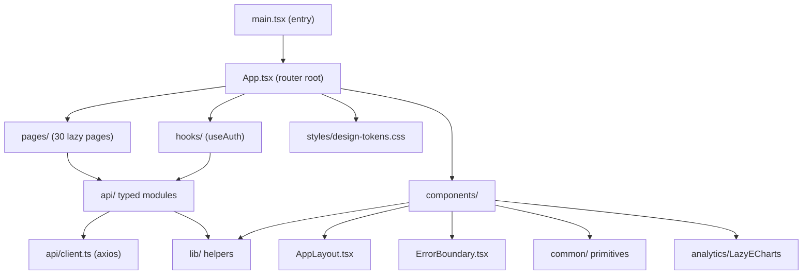
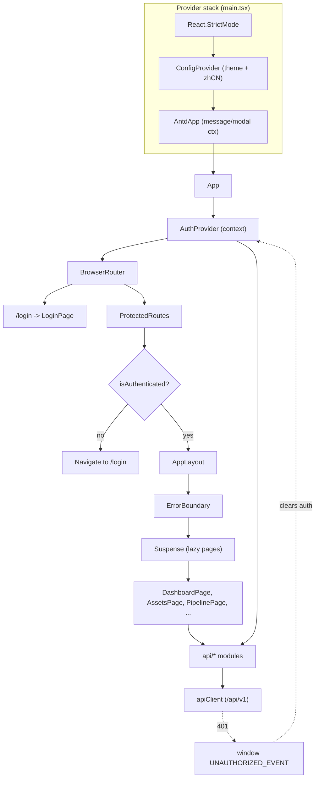
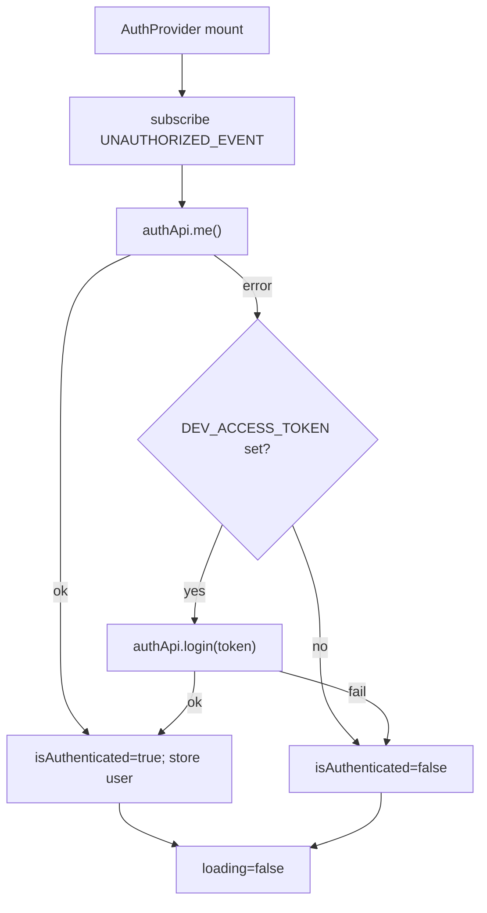
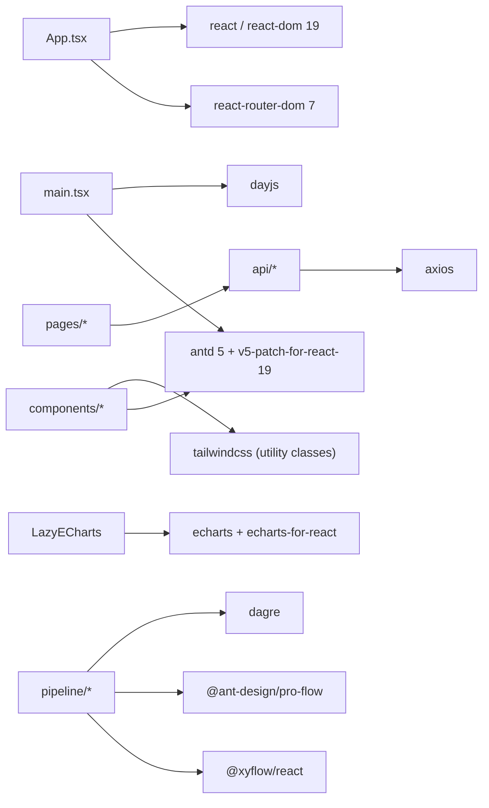

# Frontend Design

<cite>
**Referenced Files in This Document**

- [Frontend/src/main.tsx](file://Frontend/src/main.tsx)
- [Frontend/src/App.tsx](file://Frontend/src/App.tsx)
- [Frontend/package.json](file://Frontend/package.json)
- [Frontend/vite.config.ts](file://Frontend/vite.config.ts)
- [Frontend/src/api/client.ts](file://Frontend/src/api/client.ts)
- [Frontend/src/api/auth.ts](file://Frontend/src/api/auth.ts)
- [Frontend/src/hooks/useAuth.tsx](file://Frontend/src/hooks/useAuth.tsx)
- [Frontend/src/components/AppLayout.tsx](file://Frontend/src/components/AppLayout.tsx)
- [Frontend/src/components/ErrorBoundary.tsx](file://Frontend/src/components/ErrorBoundary.tsx)
- [Frontend/src/components/analytics/LazyECharts.tsx](file://Frontend/src/components/analytics/LazyECharts.tsx)
</cite>

## Table of Contents
1. [Introduction](#introduction)
2. [Project Structure](#project-structure)
3. [Core Components](#core-components)
4. [Architecture Overview](#architecture-overview)
5. [Detailed Component Analysis](#detailed-component-analysis)
6. [Dependency Analysis](#dependency-analysis)
7. [Performance Considerations](#performance-considerations)
8. [Troubleshooting Guide](#troubleshooting-guide)
9. [Conclusion](#conclusion)
10. [Appendices](#appendices)

## Introduction

The cyber-databrew frontend is a single-page application (SPA) that provides the
operator console for the DataBrew data platform: asset management, MCAP file
browsing, delivery tracking, algorithm runs, an event stream, a visual pipeline
editor, a registry center, and metrics search. It is a modern React application
built on **React 19**, **TypeScript**, and **Vite 6**, styled with a combination
of **Ant Design 5** (the component system and theming layer) and **Tailwind CSS
3** (utility classes for layout fine-tuning). Data visualization is delivered
through **ECharts 5** (lazy-loaded), and the pipeline editor uses **@xyflow/react**
with **dagre** for graph layout.

The application is intentionally thin on its own infrastructure: there is no Redux
store and no heavyweight data layer. State that crosses the whole app — namely
authentication — lives in a single React context (`AuthProvider`), and everything
else is page-local state combined with a small set of typed API modules under
`src/api`. Routing is handled by **react-router-dom 7** with a clear split between
the public `/login` route and a protected product shell that wraps every other
page.

The audience for this page is any engineer who needs to understand how the
frontend boots, how requests are authenticated, how routes are organized, and
where to add a new page or component without breaking the existing structure.

**Section sources**
- [Frontend/package.json](file://Frontend/package.json#L1-L56)
- [Frontend/src/main.tsx](file://Frontend/src/main.tsx#L1-L47)
- [Frontend/src/App.tsx](file://Frontend/src/App.tsx#L1-L104)

## Project Structure

The frontend lives entirely under `Frontend/`. Application source is under
`Frontend/src/`, which is organized by responsibility rather than by feature. The
top level holds the entry points (`main.tsx`, `App.tsx`), global CSS
(`index.css`), the Vitest bootstrap (`setupTests.ts`), and Vite ambient types
(`vite-env.d.ts`).

The `src/` tree breaks down as follows:

- **`api/`** — Typed HTTP modules. A shared axios instance (`client.ts`) defines
  the `/api/v1` base URL, credential handling, and the 401 interceptor. Domain
  modules sit alongside it: `auth.ts`, `assets.ts`, `mcapFiles.ts`,
  `deliveries.ts`, `algoRuns.ts`, `algoRegistry.ts`, `actions.ts`, `eval.ts`,
  `lakehouse.ts`, `query.ts`, `registry.ts`, `tagRegistry.ts`, `search.ts`, and
  the pipeline cluster (`pipelineApi.ts`, `pipelineClient.ts`,
  `pipelineComponentApi.ts`, `workflowApi.ts`). Shared response shapes live in
  `types.ts`.
- **`components/`** — Reusable UI. The product chrome (`AppLayout.tsx`),
  `ErrorBoundary.tsx`, the command palette (`CmdKSearch.tsx`), and themed
  sub-folders: `common/` (small primitives such as `PageLoading`, `PageError`,
  `AssetIdLink`, `LinkifiedText`, `DurationPanel`, `WorkflowLabels`),
  `analytics/` (the lazy ECharts wrapper), plus feature folders
  `algo-matrix/`, `asset-detail/`, `assets/`, `deliveries/`, `mcap/`, and
  `pipeline/`.
- **`hooks/`** — Cross-cutting React hooks. `useAuth.tsx` provides the auth
  context and `useAuth()` consumer; `usePipelineComponents.ts` and
  `usePipelineKeyboardShortcuts.ts` back the pipeline editor; `assets/` and
  `algo-matrix/` hold feature-scoped hooks.
- **`lib/`** — Framework-agnostic helpers: formatting (`format.ts`,
  `dateTime.ts`), domain identifiers (`assetId.ts`, `runId.ts`), status color
  maps (`statusColor.ts`, `algoStatus.ts`), API error normalization
  (`apiError.ts`), version helpers (`appVersion.ts`), constants (`constants.ts`),
  workflow/DAG utilities (`workflowDag.ts`, `workflow-operations.ts`,
  `workflow-utils.ts`, `workflowLabels.ts`, `workflowNodeDisplay.ts`), pipeline
  contracts (`pipelineContract.ts`, `pipelineComponentDisplay.ts`), and the
  `featureFlags/` module.
- **`pages/`** — One module per route (30 page-level `.tsx` files), all
  lazy-loaded from `App.tsx`. Sub-folder `pipeline/` and several workflow
  view/components (`WorkflowDagView.tsx`, `WorkflowTimelineView.tsx`,
  `WorkflowDagNode.tsx`) live here too.
- **`styles/`** — `design-tokens.css` (CSS custom properties imported in
  `App.tsx`) and `pipeline.css` (editor-specific styles).



**Diagram sources**
- [Frontend/src/main.tsx](file://Frontend/src/main.tsx#L1-L47)
- [Frontend/src/App.tsx](file://Frontend/src/App.tsx#L1-L104)
- [Frontend/src/components/AppLayout.tsx](file://Frontend/src/components/AppLayout.tsx#L1-L47)

**Section sources**
- [Frontend/src/App.tsx](file://Frontend/src/App.tsx#L1-L104)
- [Frontend/package.json](file://Frontend/package.json#L19-L55)

## Core Components

The frontend's behavior is determined by a small number of structural modules.
Everything else is a page or a leaf component that plugs into them.

#### Entry point: `main.tsx`

`main.tsx` is the only file that touches the DOM root. It mounts the React tree
into `#root` (throwing if the element is missing), wrapping the application in
three providers, from outermost to innermost:

1. `React.StrictMode` — development-time double-invocation checks.
2. `ConfigProvider` — Ant Design's theme + locale provider. The locale is
   `zh_CN` and a custom token theme is supplied (primary `#2563eb`, slate text
   colors, `borderRadius: 8`, Inter font stack, base `fontSize: 13`).
3. `AntdApp` (`antd`'s `App`) — supplies message/notification/modal context so
   the static APIs work inside React 19.

Before rendering, `main.tsx` extends `dayjs` with the `relativeTime` plugin and
sets the `zh-cn` locale globally.

**Section sources**
- [Frontend/src/main.tsx](file://Frontend/src/main.tsx#L1-L47)

#### Router root: `App.tsx`

`App.tsx` defines the route graph. It wraps `BrowserRouter` in `AuthProvider`,
then splits routing into two top-level routes: `/login` (public) and `/*`
(everything else, handled by `ProtectedRoutes`). Both branches are wrapped in
`Suspense` with a `PageLoader` (an Ant Design `Spin`) fallback so lazy chunks can
stream in. All 16 page modules are declared with `React.lazy`, a deliberate
bundle-size optimization.

**Section sources**
- [Frontend/src/App.tsx](file://Frontend/src/App.tsx#L1-L104)

#### Auth context: `useAuth.tsx`

`AuthProvider` exposes `{ isAuthenticated, loading, user, login, logout }` via
context. On mount it calls `authApi.me()` to resolve the current session, falls
back to a dev token login when `VITE_DEV_ACCESS_TOKEN` is present, and listens
for the global `UNAUTHORIZED_EVENT` to clear auth state when any request returns
401. `useAuth()` is the typed consumer hook and throws if used outside the
provider.

**Section sources**
- [Frontend/src/hooks/useAuth.tsx](file://Frontend/src/hooks/useAuth.tsx#L1-L98)
- [Frontend/src/api/auth.ts](file://Frontend/src/api/auth.ts#L1-L24)

#### Product shell: `AppLayout.tsx`

`AppLayout` is the chrome around every protected page: a fixed dark `Sider` with
the DataBrew logo, the `CmdKSearch` command palette, and a `Menu` of navigation
items; plus a `Content` area with a top bar (user `Avatar` + logout `Dropdown`).
It uses Ant Design's `Grid.useBreakpoint` to collapse the sider on mobile and a
`resolveSelectedKey` helper to highlight the active menu item from the current
path. Pipeline routes render "full-bleed" (zero content padding).

**Section sources**
- [Frontend/src/components/AppLayout.tsx](file://Frontend/src/components/AppLayout.tsx#L26-L185)

#### Error boundary and shared HTTP client

`ErrorBoundary` is a class component that catches render-time exceptions and
renders an Ant Design `Result` with retry/reload actions. `api/client.ts` is the
single axios instance shared by every API module; it injects credentials and
dispatches `UNAUTHORIZED_EVENT` on 401.

**Section sources**
- [Frontend/src/components/ErrorBoundary.tsx](file://Frontend/src/components/ErrorBoundary.tsx#L1-L56)
- [Frontend/src/api/client.ts](file://Frontend/src/api/client.ts#L1-L29)

## Architecture Overview

The runtime is a layered SPA. The outermost layer is the provider stack mounted
by `main.tsx`; inside it, `App.tsx` owns routing and the auth context; inside
that, pages render against typed API modules that all funnel through one axios
client. Cross-cutting state is minimal: auth in context, everything else local.



**Diagram sources**
- [Frontend/src/main.tsx](file://Frontend/src/main.tsx#L39-L47)
- [Frontend/src/App.tsx](file://Frontend/src/App.tsx#L44-L104)
- [Frontend/src/hooks/useAuth.tsx](file://Frontend/src/hooks/useAuth.tsx#L25-L69)
- [Frontend/src/api/client.ts](file://Frontend/src/api/client.ts#L11-L29)

## Detailed Component Analysis

### App Bootstrap Sequence

The bootstrap path from `main.tsx` to the first rendered page is fully
synchronous up to the React render, then becomes asynchronous as `AuthProvider`
resolves the session and lazy chunks load.

```mermaid
sequenceDiagram
  participant DOM as "index.html (#root)"
  participant Main as "main.tsx"
  participant Cfg as "ConfigProvider"
  participant App as "App"
  participant Auth as "AuthProvider"
  participant Api as "authApi.me()"
  participant Prot as "ProtectedRoutes"
  participant Page as "Lazy page chunk"

  Main->>DOM: getElementById("root")
  Main->>Main: dayjs.extend(relativeTime); locale("zh-cn")
  Main->>Cfg: createRoot().render(theme + zhCN)
  Cfg->>App: <App/>
  App->>Auth: mount AuthProvider
  Auth->>Auth: state loading=true
  Auth->>Api: GET /auth/me
  App->>Prot: render /* route
  Prot->>Prot: read {isAuthenticated, loading}
  Prot-->>Cfg: loading -> render PageLoader (Spin)
  Api-->>Auth: 200 {email, role} OR 401
  Auth->>Auth: setIsAuthenticated; setLoading(false)
  Prot->>Prot: re-render with new auth state
  alt authenticated
    Prot->>Page: Suspense loads route chunk
    Page-->>Prot: render inside AppLayout
  else not authenticated
    Prot->>App: Navigate to /login
  end
```

The guard logic in `ProtectedRoutes` returns the `PageLoader` while
`loading` is true, redirects to `/login` when unauthenticated, and otherwise
renders the `AppLayout` → `ErrorBoundary` → `Suspense` → `Routes` chain. Note the
`Suspense` here is keyed by `location.pathname`, which forces a fresh fallback on
every navigation so route transitions show the spinner rather than stale content.

**Diagram sources**
- [Frontend/src/main.tsx](file://Frontend/src/main.tsx#L11-L47)
- [Frontend/src/App.tsx](file://Frontend/src/App.tsx#L44-L103)
- [Frontend/src/hooks/useAuth.tsx](file://Frontend/src/hooks/useAuth.tsx#L32-L69)

**Section sources**
- [Frontend/src/App.tsx](file://Frontend/src/App.tsx#L33-L104)
- [Frontend/src/hooks/useAuth.tsx](file://Frontend/src/hooks/useAuth.tsx#L25-L98)

### Routing Table and Redirects

`ProtectedRoutes` declares the full route map. Beyond direct page routes it
encodes several redirects that keep old URLs working: `/` and `/lakehouse` →
`/dashboard`, `/tags` → `/registry`, `/components` → `/pipeline?tab=components`,
`/workflows` → `/pipeline?tab=executions`, and a catch-all `*` → `/dashboard`.
Detail pages use path params: `/assets/:id`, `/algo-runs/:run_id`,
`/deliveries/:id`, and `/workflows/:name`.

| Path | Element | Notes |
| --- | --- | --- |
| `/login` | `LoginPage` | Public (outside the shell) |
| `/dashboard` | `DashboardPage` | Default landing |
| `/assets`, `/assets/:id` | `AssetsPage`, `AssetDetailPage` | |
| `/mcap-files` | `McapFilesPage` | |
| `/algo`, `/algo-runs`, `/algo-runs/:run_id` | algo pages | |
| `/deliveries`, `/deliveries/:id` | delivery pages | |
| `/registry`, `/metrics`, `/events`, `/settings` | respective pages | |
| `/pipeline`, `/workflows/:name` | `PipelinePage`, `WorkflowDetailPage` | full-bleed |
| `/lakehouse`, `/tags`, `/components`, `/workflows`, `*` | redirects | |

**Section sources**
- [Frontend/src/App.tsx](file://Frontend/src/App.tsx#L16-L83)
- [Frontend/src/components/AppLayout.tsx](file://Frontend/src/components/AppLayout.tsx#L26-L67)

### Authentication Flow

`AuthProvider` runs a single mount effect that subscribes to the global
`UNAUTHORIZED_EVENT` and calls `authApi.me()`. On success it marks the session
authenticated and stores `{ email, role }`. On failure it either gives up (sets
unauthenticated) or, when a dev access token is configured, attempts
`authApi.login(token)`. The `login(email)` action posts to `/auth/email-login`
and stores the returned user; `logout()` posts to `/auth/logout` and clears
state. The effect's cleanup removes the event listener and uses a `cancelled`
flag to avoid setting state after unmount.



**Diagram sources**
- [Frontend/src/hooks/useAuth.tsx](file://Frontend/src/hooks/useAuth.tsx#L32-L82)
- [Frontend/src/api/auth.ts](file://Frontend/src/api/auth.ts#L15-L24)

**Section sources**
- [Frontend/src/hooks/useAuth.tsx](file://Frontend/src/hooks/useAuth.tsx#L1-L98)
- [Frontend/src/api/client.ts](file://Frontend/src/api/client.ts#L1-L29)

### The Product Shell

`AppLayout` composes the navigation `Sider`, the `CmdKSearch` palette, and the
content frame. The `menuItems` array drives the sidebar; `resolveSelectedKey`
maps the current pathname (including nested paths such as `/workflows`) onto a
top-level menu key so the highlight stays correct on detail pages.
`isFullBleedPage` removes content padding for the pipeline editor. A mount-time
`window.scrollTo(0, 0)` resets scroll, and `useBreakpoint().lg` controls the
mobile collapse and content margin.

**Section sources**
- [Frontend/src/components/AppLayout.tsx](file://Frontend/src/components/AppLayout.tsx#L49-L185)

### Theming and Styling

Styling is layered. Ant Design's `ConfigProvider` token theme in `main.tsx`
establishes brand colors, radius, and typography globally. `index.css` provides
the base/global CSS and Tailwind directives, and `styles/design-tokens.css`
(imported by `App.tsx`) exposes CSS custom properties for use outside Ant
Design's token system. Tailwind utility classes (e.g. `flex items-center
justify-center` on `PageLoader`) handle ad-hoc layout, while component-specific
styling such as the pipeline editor lives in `styles/pipeline.css`.

**Section sources**
- [Frontend/src/main.tsx](file://Frontend/src/main.tsx#L14-L31)
- [Frontend/src/App.tsx](file://Frontend/src/App.tsx#L13-L13)

### Charts and Visualization

ECharts is heavy, so it is never imported eagerly. `analytics/LazyECharts.tsx`
wraps `echarts-for-react` behind `React.lazy` and `Suspense`, taking an opaque
`option` object and an optional style. This keeps the ECharts vendor chunk out of
the initial bundle (see the `vendor-echarts` manualChunk in the Vite config). The
pipeline editor's graph rendering is separate, built on `@xyflow/react`,
`@ant-design/pro-flow`, and `dagre`.

**Section sources**
- [Frontend/src/components/analytics/LazyECharts.tsx](file://Frontend/src/components/analytics/LazyECharts.tsx#L1-L17)
- [Frontend/package.json](file://Frontend/package.json#L20-L29)

## Dependency Analysis

The frontend's runtime dependencies form a clear stack. React and React Router
are the foundation; Ant Design (with the React 19 patch) and Tailwind provide UI;
axios is the only network library; ECharts, @xyflow/react, dagre, and
ansi-to-react are feature-specific render libraries; dayjs handles time.



Internally, the dependency direction is strictly inward: `pages` depend on
`components`, `hooks`, `lib`, and `api`; `api` modules depend only on
`client.ts` and `types.ts`; `lib` is framework-agnostic and depends on nothing in
the app. This makes `lib` and `api/types.ts` safe to import from anywhere without
cycles.

The build wiring lives in `vite.config.ts`: the dev server runs on port 5176
(strict), proxies `/api` to `VITE_API_BASE_URL` (default `http://localhost:8080`),
and `manualChunks` splits vendors into `vendor-react`, `vendor-antd-core`,
`vendor-echarts`, and `vendor-axios`.

**Diagram sources**
- [Frontend/package.json](file://Frontend/package.json#L19-L33)
- [Frontend/vite.config.ts](file://Frontend/vite.config.ts#L70-L104)

**Section sources**
- [Frontend/package.json](file://Frontend/package.json#L19-L55)
- [Frontend/vite.config.ts](file://Frontend/vite.config.ts#L50-L107)

## Performance Considerations

Several deliberate choices keep the initial load and navigation fast:

#### Route-level code splitting

Every page in `App.tsx` is loaded with `React.lazy`, so each route ships as its
own chunk and the initial bundle contains only the shell, the router, and the
login path. Navigation triggers an on-demand fetch of the page chunk behind the
keyed `Suspense` fallback.

#### Vendor chunking

`vite.config.ts` defines `manualChunks` that isolate the largest libraries:
ECharts gets its own `vendor-echarts` chunk, React and the router share
`vendor-react`, the Ant Design core (including dayjs, icons, cssinjs, and the
`rc-*` family) goes to `vendor-antd-core`, and axios to `vendor-axios`. The
`chunkSizeWarningLimit` is raised to 800 kB to reflect the intentionally larger
vendor chunks.

#### Lazy ECharts

`LazyECharts` defers `echarts-for-react` until a chart actually renders, keeping
the ECharts chunk off the critical path for pages that have no charts.

#### Request behavior

There is a single shared axios client with a 30s default timeout
(`DEFAULT_TIMEOUT`) and a longer 90s `LAKEHOUSE_TIMEOUT` for analytics queries.
Because there is no global cache layer, repeated navigation can refetch — pages
that show large lists should rely on server-side pagination and avoid refetching
on every render.

**Section sources**
- [Frontend/src/App.tsx](file://Frontend/src/App.tsx#L15-L31)
- [Frontend/vite.config.ts](file://Frontend/vite.config.ts#L66-L107)
- [Frontend/src/api/client.ts](file://Frontend/src/api/client.ts#L5-L14)
- [Frontend/src/components/analytics/LazyECharts.tsx](file://Frontend/src/components/analytics/LazyECharts.tsx#L1-L17)

## Troubleshooting Guide

#### Blank page / "Root element not found"

`main.tsx` throws if `#root` is missing from the HTML. Confirm `index.html`
contains `<div id="root">` and that the script tag points at `main.tsx`.

#### Stuck on the loading spinner

`ProtectedRoutes` shows `PageLoader` while `AuthProvider` is `loading`. If it
never resolves, the `authApi.me()` call to `/auth/me` is hanging or the proxy is
misconfigured. Check that the Vite dev server's `/api` proxy points at a reachable
backend (`VITE_API_BASE_URL`, default `http://localhost:8080`); use
`npm run dev:remote` to target the Cloud Run dev backend.

#### Constant redirect to /login

When `authApi.me()` returns 401 and no `VITE_DEV_ACCESS_TOKEN` is set, the app
stays unauthenticated and `ProtectedRoutes` redirects to `/login`. For local dev
against a protected backend, set `VITE_DEV_ACCESS_TOKEN` so the fallback
`authApi.login(token)` path can establish a session.

#### Sudden logout mid-session

Any API call that returns 401 dispatches `UNAUTHORIZED_EVENT`, which
`AuthProvider` listens for and uses to clear auth state. A session that drops
unexpectedly usually means the backend cookie expired or `withCredentials` is not
reaching the server (cross-origin without the proxy).

#### Page crashes with an Ant Design "error" result card

That is `ErrorBoundary` catching a render exception. The `subTitle` shows the
error message; check the browser console for the full stack logged by
`componentDidCatch`. "重试" re-renders the boundary's children; "刷新页面"
reloads.

#### Charts not appearing

ECharts is lazy; a momentarily empty chart area is the `LazyECharts` `Suspense`
fallback (an empty styled `div`) while the `vendor-echarts` chunk downloads. A
persistently empty chart usually means a malformed `option` object.

**Section sources**
- [Frontend/src/main.tsx](file://Frontend/src/main.tsx#L33-L37)
- [Frontend/src/hooks/useAuth.tsx](file://Frontend/src/hooks/useAuth.tsx#L32-L69)
- [Frontend/src/components/ErrorBoundary.tsx](file://Frontend/src/components/ErrorBoundary.tsx#L22-L55)
- [Frontend/src/api/client.ts](file://Frontend/src/api/client.ts#L21-L29)

## Conclusion

The cyber-databrew frontend is a focused, modern React 19 + TypeScript + Vite SPA
that leans on Ant Design 5 for its component system and theming, Tailwind for
layout utilities, and a deliberately small infrastructure footprint: one auth
context, one shared axios client, and route-level lazy loading. The
`main.tsx → providers → App → AuthProvider → router → AppLayout` chain is the
backbone every page hangs from, and the `src/` layout (`api`, `components`,
`hooks`, `lib`, `pages`, `styles`) keeps dependencies flowing inward. Adding a
new page is a matter of creating a `pages/*.tsx` module, declaring a lazy route in
`App.tsx`, and (if it needs navigation) a menu entry in `AppLayout`.

## Appendices

### Appendix A: Key environment variables

| Variable | Used in | Effect |
| --- | --- | --- |
| `VITE_API_BASE_URL` | `vite.config.ts` | Target for the `/api` dev proxy (default `http://localhost:8080`) |
| `VITE_DEV_ACCESS_TOKEN` | `useAuth.tsx` | Dev-only fallback token for `authApi.login` |
| `VITE_APP_VERSION` | `vite.config.ts` | Injected as `__APP_VERSION__` |
| `VITE_BUILD_REF` | `vite.config.ts` | Injected as `__APP_BUILD_REF__` |

**Section sources**
- [Frontend/vite.config.ts](file://Frontend/vite.config.ts#L4-L9)
- [Frontend/src/hooks/useAuth.tsx](file://Frontend/src/hooks/useAuth.tsx#L11-L13)

### Appendix B: NPM scripts

| Script | Command | Purpose |
| --- | --- | --- |
| `dev` | `vite --host` | Local dev server (port 5176) |
| `dev:remote` | `VITE_API_BASE_URL=… vite --host` | Dev proxied to Cloud Run dev backend |
| `build` | `tsc -b && vite build` | Type-check then production build |
| `test` | `vitest run` | Unit tests (jsdom) |
| `test:coverage` | `vitest run --coverage` | Coverage with v8 thresholds |
| `lint` | `biome check src` | Lint/format check |
| `test:e2e` | `playwright test` | End-to-end tests |

**Section sources**
- [Frontend/package.json](file://Frontend/package.json#L6-L18)
- [Frontend/vite.config.ts](file://Frontend/vite.config.ts#L108-L129)

### Appendix C: Auth API surface

`authApi` (in `api/auth.ts`) exposes four calls against `/api/v1/auth`:
`emailLogin(email)` → POST `/auth/email-login`, `login(token)` → POST
`/auth/login`, `me()` → GET `/auth/me` (returns `MeResponse`), and `logout()` →
POST `/auth/logout`.

**Section sources**
- [Frontend/src/api/auth.ts](file://Frontend/src/api/auth.ts#L1-L24)
