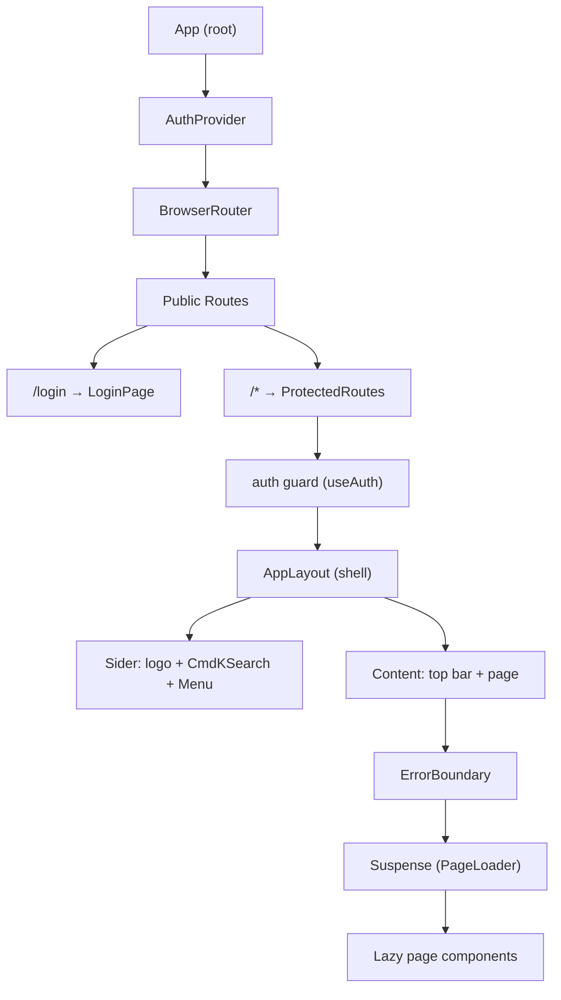
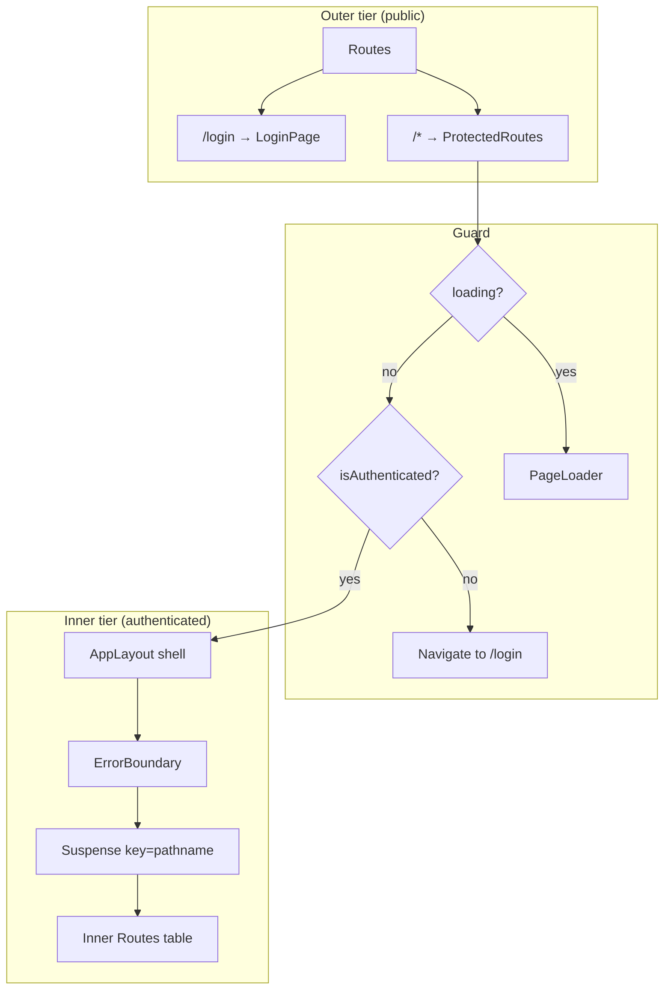
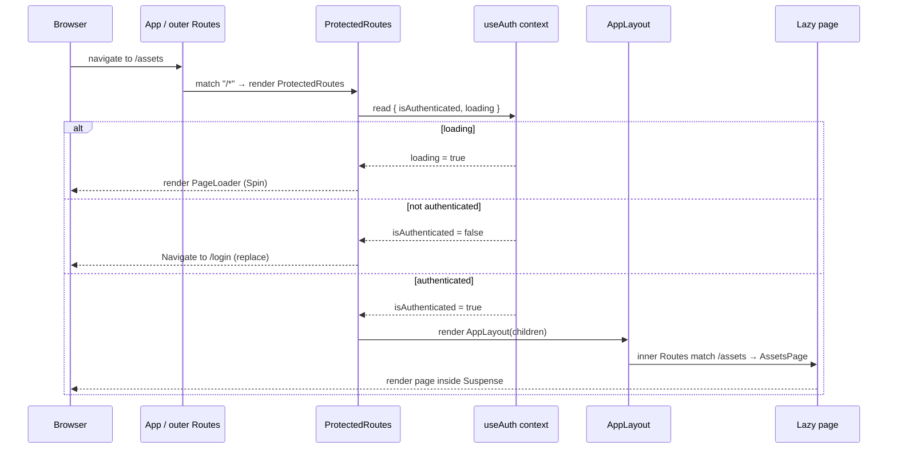
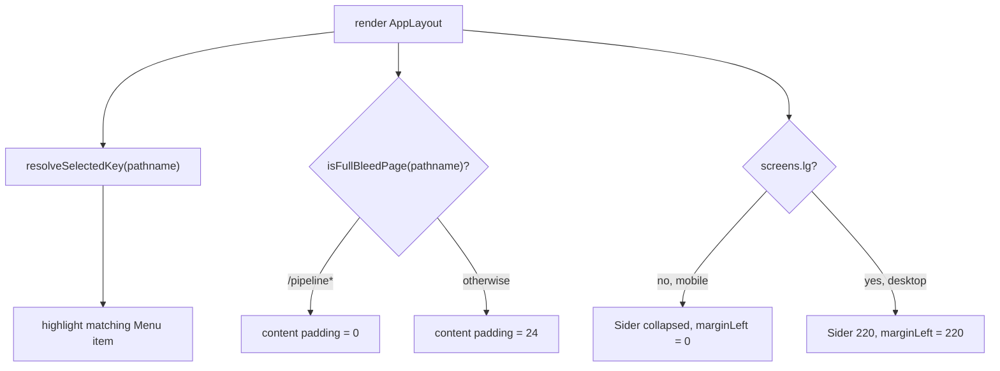
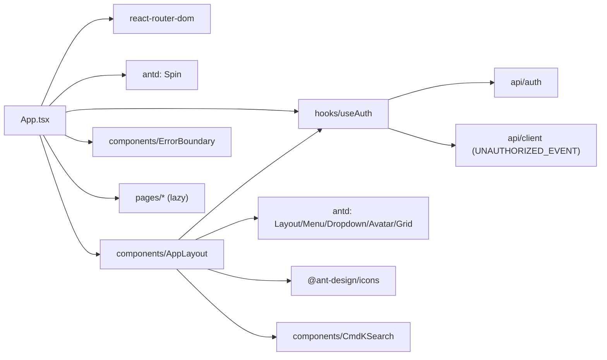

# Layout & Routing

<cite>
**Referenced Files in This Document**

- [Frontend/src/App.tsx](file://Frontend/src/App.tsx)
- [Frontend/src/components/AppLayout.tsx](file://Frontend/src/components/AppLayout.tsx)
- [Frontend/src/hooks/useAuth.tsx](file://Frontend/src/hooks/useAuth.tsx)
- [Frontend/src/components/ErrorBoundary.tsx](file://Frontend/src/components/ErrorBoundary.tsx)
- [Frontend/src/components/CmdKSearch.tsx](file://Frontend/src/components/CmdKSearch.tsx)
</cite>

## Table of Contents
1. [Introduction](#introduction)
2. [Project Structure](#project-structure)
3. [Core Components](#core-components)
4. [Architecture Overview](#architecture-overview)
5. [Detailed Component Analysis](#detailed-component-analysis)
6. [Dependency Analysis](#dependency-analysis)
7. [Performance Considerations](#performance-considerations)
8. [Troubleshooting Guide](#troubleshooting-guide)
9. [Conclusion](#conclusion)
10. [Appendices](#appendices)

## Introduction

The layout-and-routing layer is the shell of the DataBrew single-page
application. It is responsible for three concerns that every page in the
frontend depends on:

1. **Routing** — mapping the browser URL to a React page component, including
   client-side redirects and a catch-all fallback.
2. **Authentication gating** — ensuring that all application routes (everything
   except `/login`) are only rendered when the current session is authenticated,
   and redirecting unauthenticated users to the login screen.
3. **Visual shell** — rendering the persistent chrome (fixed sidebar with the
   navigation menu, the brand logo, the command-palette search, the top bar with
   the user/logout dropdown) around whichever page is currently active.

Two source files own this layer. `App.tsx` defines the entire route tree, the
lazy-loading boundaries, the authentication guard (`ProtectedRoutes`), and the
top-level provider wiring. `AppLayout.tsx` is the visual frame that wraps every
authenticated page and contains the navigation menu. The authentication state
itself is supplied by the `AuthProvider`/`useAuth` context defined in
`hooks/useAuth.tsx`.

This page is the reference for how a request to any URL is resolved into a
rendered page, who is allowed to see it, and what surrounds it on screen.

**Section sources**
- [Frontend/src/App.tsx](file://Frontend/src/App.tsx#L1-L104)
- [Frontend/src/components/AppLayout.tsx](file://Frontend/src/components/AppLayout.tsx#L69-L185)

## Project Structure

The routing layer is small and centralized. The relevant files are:

- **`Frontend/src/App.tsx`** — the application root. Declares the lazy page
  imports, the `PageLoader` fallback, the `ProtectedRoutes` auth guard plus the
  inner authenticated route table, and the top-level `App` component that wires
  the `AuthProvider`, `BrowserRouter`, and the public/protected split.
- **`Frontend/src/components/AppLayout.tsx`** — the chrome that wraps every
  authenticated page: the fixed `Sider` with logo, `CmdKSearch`, and the
  `menuItems` navigation menu, plus the content area with the user/logout
  dropdown. It also owns the `resolveSelectedKey` logic that highlights the
  correct menu entry for the current path and the `isFullBleedPage` rule that
  removes content padding for the pipeline view.
- **`Frontend/src/hooks/useAuth.tsx`** — the `AuthProvider` context that exposes
  `isAuthenticated`, `loading`, `user`, `login`, and `logout`. The guard in
  `App.tsx` reads `isAuthenticated`/`loading` from here.
- **`Frontend/src/components/ErrorBoundary.tsx`** — wraps the active page so a
  render error in one page does not crash the entire shell.
- **`Frontend/src/components/CmdKSearch.tsx`** — the command-palette search that
  sits in the sidebar header.

**Diagram sources**
- [Frontend/src/App.tsx](file://Frontend/src/App.tsx#L44-L104)
- [Frontend/src/components/AppLayout.tsx](file://Frontend/src/components/AppLayout.tsx#L83-L184)

**Section sources**
- [Frontend/src/App.tsx](file://Frontend/src/App.tsx#L1-L104)
- [Frontend/src/components/AppLayout.tsx](file://Frontend/src/components/AppLayout.tsx#L1-L185)
- [Frontend/src/hooks/useAuth.tsx](file://Frontend/src/hooks/useAuth.tsx#L25-L98)

## Core Components

The layer is built from a small set of cooperating components.

#### `App` — the root component

`App` composes the global providers and the public/protected route split. It
wraps everything in `AuthProvider` so authentication state is available
everywhere, mounts `BrowserRouter` for history-based routing, and wraps the
outer route table in a top-level `Suspense` (with `PageLoader` fallback) because
even `LoginPage` is lazy-loaded. The outer `Routes` has exactly two entries:
`/login` (public, renders `LoginPage`) and `/*` (everything else, renders
`ProtectedRoutes`).

#### `ProtectedRoutes` — the auth guard and inner route table

`ProtectedRoutes` reads `isAuthenticated` and `loading` from `useAuth`. While
the session is still being resolved (`loading === true`) it renders
`PageLoader`. If the session resolves and the user is not authenticated, it
returns `<Navigate to="/login" replace />`. Only when authenticated does it
render the `AppLayout` shell, inside which an `ErrorBoundary` and a
`Suspense` (keyed by `location.pathname`) wrap the full authenticated route
table.

#### `PageLoader` — the loading fallback

A centered Ant Design `Spin` used both as the `Suspense` fallback for lazy
chunks and as the indicator shown while the auth session is being resolved.

#### `AppLayout` — the visual shell

The frame around every authenticated page: a fixed left `Sider` (width 220,
collapses to 0 below the `lg` breakpoint) containing the logo button, the
`CmdKSearch` command palette, and the `Menu`; and a `Content` area with a top
bar holding the user `Avatar`/logout `Dropdown`. It computes the selected menu
key from the current path via `resolveSelectedKey` and toggles content padding
via `isFullBleedPage`.

#### `useAuth` / `AuthProvider` — session state

Provides the `isAuthenticated`, `loading`, and `user` values the guard depends
on, plus `login`/`logout` actions. On mount it calls `authApi.me()` to probe the
existing session, optionally falling back to a dev access token, and listens for
an `UNAUTHORIZED_EVENT` to drop authentication when an API call returns 401.

**Section sources**
- [Frontend/src/App.tsx](file://Frontend/src/App.tsx#L33-L104)
- [Frontend/src/components/AppLayout.tsx](file://Frontend/src/components/AppLayout.tsx#L69-L185)
- [Frontend/src/hooks/useAuth.tsx](file://Frontend/src/hooks/useAuth.tsx#L25-L98)

## Architecture Overview

The application separates routing into two tiers. The **outer tier** is a public
boundary: it knows only two things — the login route and "everything else". The
**inner tier**, reached only after the auth guard passes, contains the real
application route table and is always rendered inside the `AppLayout` shell.

This two-tier design means the navigation chrome (sidebar, menu, top bar) is
mounted exactly once per authenticated session and persists across in-app
navigation; only the page region inside `Suspense` re-mounts as the route
changes. The `Suspense` boundary is keyed on `location.pathname`
(`key={location.pathname}`), so each route change produces a fresh page subtree
and a fresh loading fallback for that route's lazy chunk.

**Diagram sources**
- [Frontend/src/App.tsx](file://Frontend/src/App.tsx#L44-L104)

**Section sources**
- [Frontend/src/App.tsx](file://Frontend/src/App.tsx#L44-L104)

## Detailed Component Analysis

### Lazy-loaded pages and the Suspense strategy

Every page component is imported with `React.lazy` so it ships as a separate
chunk and the initial bundle stays small — the inline comment cites the
project's "Priority 2 Bundle Size" steering goal. The lazy imports are declared
at module scope at the top of `App.tsx`:

| Lazy constant | Module |
| --- | --- |
| `DashboardPage` | `./pages/DashboardPage` |
| `AssetsPage` | `./pages/AssetsPage` |
| `AssetDetailPage` | `./pages/AssetDetailPage` |
| `McapFilesPage` | `./pages/McapFilesPage` |
| `AlgoProcessingPage` | `./pages/AlgoProcessingPage` |
| `AlgoRunsPage` | `./pages/AlgoRunsPage` |
| `AlgoRunDetailPage` | `./pages/AlgoRunDetailPage` |
| `DeliveriesPage` | `./pages/DeliveriesPage` |
| `DeliveryDetailPage` | `./pages/DeliveryDetailPage` |
| `RegistryCenterPage` | `./pages/RegistryCenterPage` |
| `MetricsSearchPage` | `./pages/MetricsSearchPage` |
| `SettingsPage` | `./pages/SettingsPage` |
| `EventsPage` | `./pages/EventsPage` |
| `PipelinePage` | `./pages/PipelinePage` |
| `WorkflowDetailPage` | `./pages/WorkflowDetailPage` |
| `LoginPage` | `./pages/LoginPage` |

There are two `Suspense` boundaries. The outer one in `App` covers the
public/protected split (needed because `LoginPage` is itself lazy). The inner
one in `ProtectedRoutes` wraps the authenticated route table and is keyed on
`location.pathname`, so navigating between pages remounts the page subtree and
shows the `PageLoader` for the new route's chunk while it downloads.

**Section sources**
- [Frontend/src/App.tsx](file://Frontend/src/App.tsx#L15-L42)
- [Frontend/src/App.tsx](file://Frontend/src/App.tsx#L49-L88)

### The route table

The inner route table maps URL paths to pages and client-side redirects. Several
legacy paths (`/lakehouse`, `/tags`, `/components`, `/workflows`) are kept as
redirects so old links and bookmarks continue to resolve, and `*` falls back to
the dashboard.

| Path | Resolves to | Lazy page? | Notes |
| --- | --- | --- | --- |
| `/` | `Navigate → /dashboard` | redirect | index redirect |
| `/dashboard` | `DashboardPage` | yes | |
| `/assets` | `AssetsPage` | yes | |
| `/assets/:id` | `AssetDetailPage` | yes | dynamic `:id` |
| `/mcap-files` | `McapFilesPage` | yes | |
| `/algo` | `AlgoProcessingPage` | yes | |
| `/algo-runs` | `AlgoRunsPage` | yes | |
| `/algo-runs/:run_id` | `AlgoRunDetailPage` | yes | dynamic `:run_id` |
| `/deliveries` | `DeliveriesPage` | yes | |
| `/deliveries/:id` | `DeliveryDetailPage` | yes | dynamic `:id` |
| `/lakehouse` | `Navigate → /dashboard` | redirect | legacy alias |
| `/registry` | `RegistryCenterPage` | yes | |
| `/tags` | `Navigate → /registry` | redirect | legacy alias |
| `/metrics` | `MetricsSearchPage` | yes | |
| `/events` | `EventsPage` | yes | |
| `/pipeline` | `PipelinePage` | yes | full-bleed (no padding) |
| `/components` | `Navigate → /pipeline?tab=components` | redirect | legacy alias |
| `/workflows` | `Navigate → /pipeline?tab=executions` | redirect | legacy alias |
| `/workflows/:name` | `WorkflowDetailPage` | yes | dynamic `:name` |
| `/settings` | `SettingsPage` | yes | |
| `*` | `Navigate → /dashboard` | redirect | catch-all fallback |

The public route `/login → LoginPage` lives in the outer `Routes` and is the
only path that does not require authentication.

```mermaid
graph TB
  Root["/"] -->|redirect| Dashboard["/dashboard → DashboardPage"]
  Assets["/assets → AssetsPage"] --> AssetDetail["/assets/:id → AssetDetailPage"]
  Mcap["/mcap-files → McapFilesPage"]
  Algo["/algo → AlgoProcessingPage"]
  AlgoRuns["/algo-runs → AlgoRunsPage"] --> AlgoRunDetail["/algo-runs/:run_id → AlgoRunDetailPage"]
  Deliveries["/deliveries → DeliveriesPage"] --> DeliveryDetail["/deliveries/:id → DeliveryDetailPage"]
  Registry["/registry → RegistryCenterPage"]
  Metrics["/metrics → MetricsSearchPage"]
  Events["/events → EventsPage"]
  Pipeline["/pipeline → PipelinePage"] --> WorkflowDetail["/workflows/:name → WorkflowDetailPage"]
  Settings["/settings → SettingsPage"]
  Login["/login → LoginPage (public)"]

  Lakehouse["/lakehouse"] -->|redirect| Dashboard
  Tags["/tags"] -->|redirect| Registry
  Components["/components"] -->|redirect| Pipeline
  Workflows["/workflows"] -->|redirect| Pipeline
  Star["* (catch-all)"] -->|redirect| Dashboard
```

**Diagram sources**
- [Frontend/src/App.tsx](file://Frontend/src/App.tsx#L53-L84)
- [Frontend/src/App.tsx](file://Frontend/src/App.tsx#L96-L99)

**Section sources**
- [Frontend/src/App.tsx](file://Frontend/src/App.tsx#L53-L99)

### The protected-route render and redirect flow

When the browser navigates to any non-`/login` path, the outer `Routes` matches
`/*` and renders `ProtectedRoutes`. The guard then evaluates session state from
`useAuth` and one of three things happens: it shows the loader while resolving,
redirects to `/login` if unauthenticated, or renders the shell + page if
authenticated. The sequence below shows the authenticated and unauthenticated
branches.

The `AuthProvider` resolves `loading` once: on mount it calls `authApi.me()`,
and `loading` becomes `false` in the `.finally()` callback regardless of
outcome. A 401 from any later API call dispatches `UNAUTHORIZED_EVENT`, which the
provider listens for and uses to set `isAuthenticated` back to false — on the
next render the guard then redirects to `/login`.

**Diagram sources**
- [Frontend/src/App.tsx](file://Frontend/src/App.tsx#L44-L89)
- [Frontend/src/hooks/useAuth.tsx](file://Frontend/src/hooks/useAuth.tsx#L32-L69)

**Section sources**
- [Frontend/src/App.tsx](file://Frontend/src/App.tsx#L44-L89)
- [Frontend/src/hooks/useAuth.tsx](file://Frontend/src/hooks/useAuth.tsx#L25-L98)

### The AppLayout shell

`AppLayout` is a presentational wrapper that receives the active page as
`children`. It uses Ant Design's `Layout` with two regions:

- **Sider** — fixed-position, full-height, width 220, `zIndex: 100`. It
  collapses to width 0 at the `lg` breakpoint (`collapsedWidth={0}`,
  `trigger={null}`), and the surrounding content layout drops its left margin on
  mobile (`marginLeft: isMobile ? 0 : siderWidth`). The Sider contains the logo
  button (navigates to `/dashboard` on click), the `CmdKSearch` palette, and the
  navigation `Menu`.
- **Content** — a top bar pinned to the right edge holding the user `Avatar`
  inside a `Dropdown` whose single item logs out (`logout()` then
  `navigate("/login")`), followed by the page region that renders `children`.

The selected menu item is derived from the URL by `resolveSelectedKey`, and the
content padding is removed for full-bleed pages via `isFullBleedPage`.

#### Navigation menu

The menu is data-driven from the `menuItems` array (labels are in Chinese). Each
item's `key` is the route it navigates to; clicking an item calls
`navigate(key)`.

| Menu key (route) | Icon | Label |
| --- | --- | --- |
| `/dashboard` | `DashboardOutlined` | 概览 |
| `/assets` | `DatabaseOutlined` | 资产管理 |
| `/mcap-files` | `FileOutlined` | MCAP 文件 |
| `/deliveries` | `SendOutlined` | 交付管理 |
| `/events` | `UnorderedListOutlined` | 事件流 |
| `/algo-runs` | `HistoryOutlined` | 运行记录 |
| `/algo` | `RobotOutlined` | 算法处理 |
| `/pipeline` | `ForkOutlined` | 流水线 |
| `/registry` | `ApartmentOutlined` | 注册中心 |
| `/metrics` | `FundProjectionScreenOutlined` | 指标检索 |
| `/settings` | `SettingOutlined` | 设置 |

`divider` entries separate the groups. Note the menu does not list every route —
detail routes (e.g. `/assets/:id`, `/algo-runs/:run_id`, `/workflows/:name`)
have no menu entry; `resolveSelectedKey` keeps the parent item highlighted on
those pages.

#### Selected-key resolution

`resolveSelectedKey` maps the current pathname to the menu key that should be
highlighted using ordered `startsWith` checks. Ordering matters: `/algo-runs` is
tested before `/algo` so the more specific prefix wins, and `/workflows` maps to
the `/pipeline` key because the workflow detail page belongs to the pipeline
section. If nothing matches, it defaults to `/assets`.

#### Full-bleed pages

`isFullBleedPage` returns `true` only for paths starting with `/pipeline`. When
true, the content wrapper uses `padding: 0` (and `minHeight: 0`) so the pipeline
view can render edge-to-edge; all other pages get `padding: 24`.

**Diagram sources**
- [Frontend/src/components/AppLayout.tsx](file://Frontend/src/components/AppLayout.tsx#L49-L67)
- [Frontend/src/components/AppLayout.tsx](file://Frontend/src/components/AppLayout.tsx#L69-L184)

**Section sources**
- [Frontend/src/components/AppLayout.tsx](file://Frontend/src/components/AppLayout.tsx#L26-L185)

### Error isolation

Inside `ProtectedRoutes`, the page region is wrapped in `ErrorBoundary` (sitting
between `AppLayout` and `Suspense`). A render-time error in a single page is
caught there and does not unmount the surrounding shell, so the sidebar and top
bar remain interactive even if the active page fails.

**Section sources**
- [Frontend/src/App.tsx](file://Frontend/src/App.tsx#L50-L87)
- [Frontend/src/components/ErrorBoundary.tsx](file://Frontend/src/components/ErrorBoundary.tsx#L1-L56)

## Dependency Analysis

The routing layer depends on `react-router-dom` for the router primitives
(`BrowserRouter`, `Routes`, `Route`, `Navigate`, `useLocation`,
`useNavigate`), on `antd` for the shell widgets (`Layout`, `Menu`, `Spin`,
`Avatar`, `Dropdown`, `Grid`, `Typography`) and `@ant-design/icons` for the menu
icons, and on the internal `useAuth` context for session state. It pulls in
every lazy page component, the `ErrorBoundary`, and `CmdKSearch`.

What depends on this layer: essentially the whole frontend. Every page is
reachable only through this route table, and every authenticated page is
rendered inside `AppLayout`. Changing a route path here requires updating the
matching `menuItems` key and the `resolveSelectedKey` prefix so the sidebar
highlight stays correct.

**Diagram sources**
- [Frontend/src/App.tsx](file://Frontend/src/App.tsx#L1-L31)
- [Frontend/src/components/AppLayout.tsx](file://Frontend/src/components/AppLayout.tsx#L1-L24)
- [Frontend/src/hooks/useAuth.tsx](file://Frontend/src/hooks/useAuth.tsx#L1-L9)

**Section sources**
- [Frontend/src/App.tsx](file://Frontend/src/App.tsx#L1-L31)
- [Frontend/src/components/AppLayout.tsx](file://Frontend/src/components/AppLayout.tsx#L1-L24)

## Performance Considerations

- **Code splitting.** All pages are loaded with `React.lazy`, so each route is a
  separate chunk fetched on demand. This keeps the initial bundle small (the
  explicit "Priority 2 Bundle Size" steering goal) at the cost of a one-time
  fetch + `PageLoader` flash the first time a route is visited.
- **Keyed Suspense remount.** The inner `Suspense` uses `key={location.pathname}`,
  which forces a fresh page subtree on every navigation. This guarantees a clean
  per-route loading state but means navigating away and back re-creates the page
  component rather than reusing it — page-local state is not preserved across
  navigation by the router itself.
- **Persistent shell.** Because `AppLayout` lives outside the keyed `Suspense`,
  the sidebar, menu, and command palette mount once per session and are not
  re-rendered on route change, avoiding repeated menu construction.
- **One-shot auth probe.** `AuthProvider` calls `authApi.me()` exactly once on
  mount; the guard reads cached context state thereafter, so route changes do not
  trigger additional auth network calls.
- **Scroll reset.** `AppLayout` calls `window.scrollTo(0, 0)` in a mount-only
  effect; because the layout does not remount on navigation, this resets scroll
  only on first mount rather than per page (relying on the browser to restore
  scroll on back-navigation, per the inline comment).

**Section sources**
- [Frontend/src/App.tsx](file://Frontend/src/App.tsx#L15-L42)
- [Frontend/src/App.tsx](file://Frontend/src/App.tsx#L49-L88)
- [Frontend/src/components/AppLayout.tsx](file://Frontend/src/components/AppLayout.tsx#L79-L81)

## Troubleshooting Guide

#### A page redirects to `/login` unexpectedly
The guard sends users to `/login` whenever `isAuthenticated` is false. This
happens if `authApi.me()` failed on mount (no valid session and no dev token) or
if a later API call returned 401 and dispatched `UNAUTHORIZED_EVENT`, which the
provider handles by clearing authentication. Confirm the session cookie/token and
check the network tab for a 401 that triggered the event.

#### The app stays on the spinner forever
`ProtectedRoutes` renders `PageLoader` while `loading` is true. `loading` only
flips to false inside the `.finally()` of the `authApi.me()` chain, so a request
that never resolves (hung backend, blocked CORS) leaves the app on the loader.
Check that `/me` actually returns.

#### A new page renders but the sidebar highlights the wrong item
The highlight comes from `resolveSelectedKey`, not the route table. If a new
route's prefix is not added there — or is added after a less-specific prefix
(remember `/algo-runs` must precede `/algo`) — the wrong menu item lights up or
it falls through to the `/assets` default. Add the prefix in the correct order.

#### A legacy URL 404s or lands on the wrong page
Old paths are handled by explicit `Navigate` redirects (`/lakehouse`, `/tags`,
`/components`, `/workflows`), and unknown paths fall through `*` to `/dashboard`.
If a legacy link misbehaves, verify its redirect entry still exists in the inner
route table.

#### One page crashes the whole screen
If a page error takes down the shell, the page subtree is not actually inside the
`ErrorBoundary`. The boundary sits between `AppLayout` and `Suspense`; a
provider or layout-level throw above that point is not caught.

**Section sources**
- [Frontend/src/App.tsx](file://Frontend/src/App.tsx#L44-L88)
- [Frontend/src/components/AppLayout.tsx](file://Frontend/src/components/AppLayout.tsx#L49-L63)
- [Frontend/src/hooks/useAuth.tsx](file://Frontend/src/hooks/useAuth.tsx#L32-L69)

## Conclusion

Routing and layout in DataBrew are intentionally centralized in two files.
`App.tsx` owns the route tree, lazy-loading boundaries, and the
`ProtectedRoutes` auth guard that gates the entire authenticated application
behind `useAuth`; `AppLayout.tsx` owns the persistent visual shell and the
navigation menu, deriving the active menu item and content layout from the
current URL. The design cleanly separates a thin public boundary (`/login` vs.
everything else) from the rich authenticated route table, splits every page into
its own lazy chunk, and isolates page failures behind an error boundary — while
keeping the chrome mounted once per session.

## Appendices

### Appendix A — Outer (public) route table

| Path | Element | Public? |
| --- | --- | --- |
| `/login` | `LoginPage` | yes |
| `/*` | `ProtectedRoutes` (auth-gated) | no |

### Appendix B — Layout constants and helpers

| Item | Value / behavior | Source |
| --- | --- | --- |
| `siderWidth` | `220` | `AppLayout.tsx#L75` |
| Sider breakpoint | `lg` (`collapsedWidth={0}`, `trigger={null}`) | `AppLayout.tsx#L87-L89` |
| `isMobile` | `!screens.lg` | `AppLayout.tsx#L74` |
| Content `marginLeft` | `isMobile ? 0 : siderWidth` | `AppLayout.tsx#L139` |
| `isFullBleedPage` | true for `/pipeline*` → padding 0 | `AppLayout.tsx#L65-L67` |
| `resolveSelectedKey` default | `/assets` | `AppLayout.tsx#L62` |
| Logout action | `logout()` then `navigate("/login")` | `AppLayout.tsx#L157-L159` |

### Appendix C — `useAuth` context shape

| Field | Type | Meaning |
| --- | --- | --- |
| `isAuthenticated` | `boolean` | gates the protected routes |
| `loading` | `boolean` | true until the initial `me()` probe settles |
| `user` | `{ email; role } \| null` | current user identity |
| `login` | `(email) => Promise<void>` | email login action |
| `logout` | `() => Promise<void>` | clears session |

**Section sources**
- [Frontend/src/App.tsx](file://Frontend/src/App.tsx#L91-L104)
- [Frontend/src/components/AppLayout.tsx](file://Frontend/src/components/AppLayout.tsx#L49-L160)
- [Frontend/src/hooks/useAuth.tsx](file://Frontend/src/hooks/useAuth.tsx#L15-L21)
