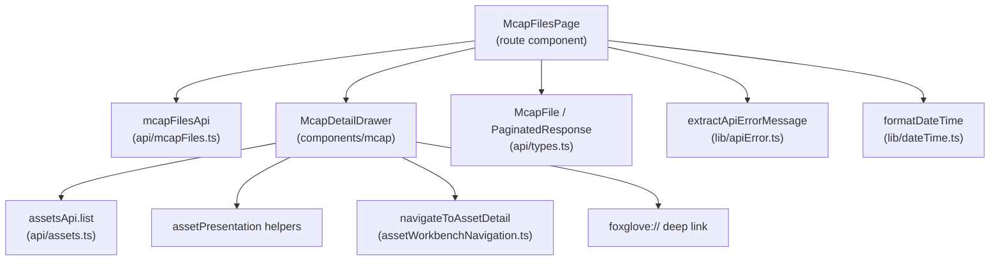
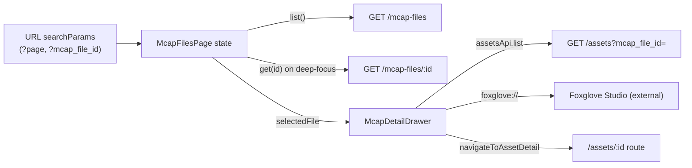
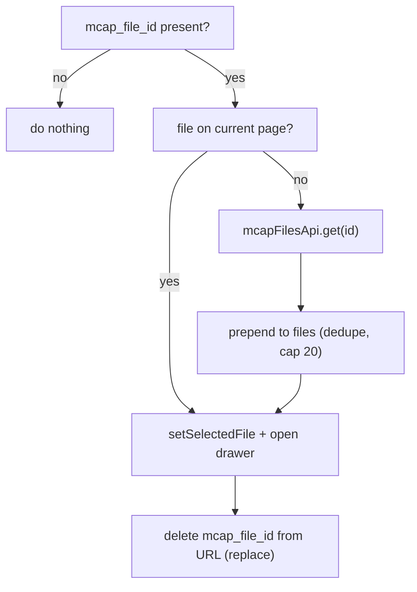
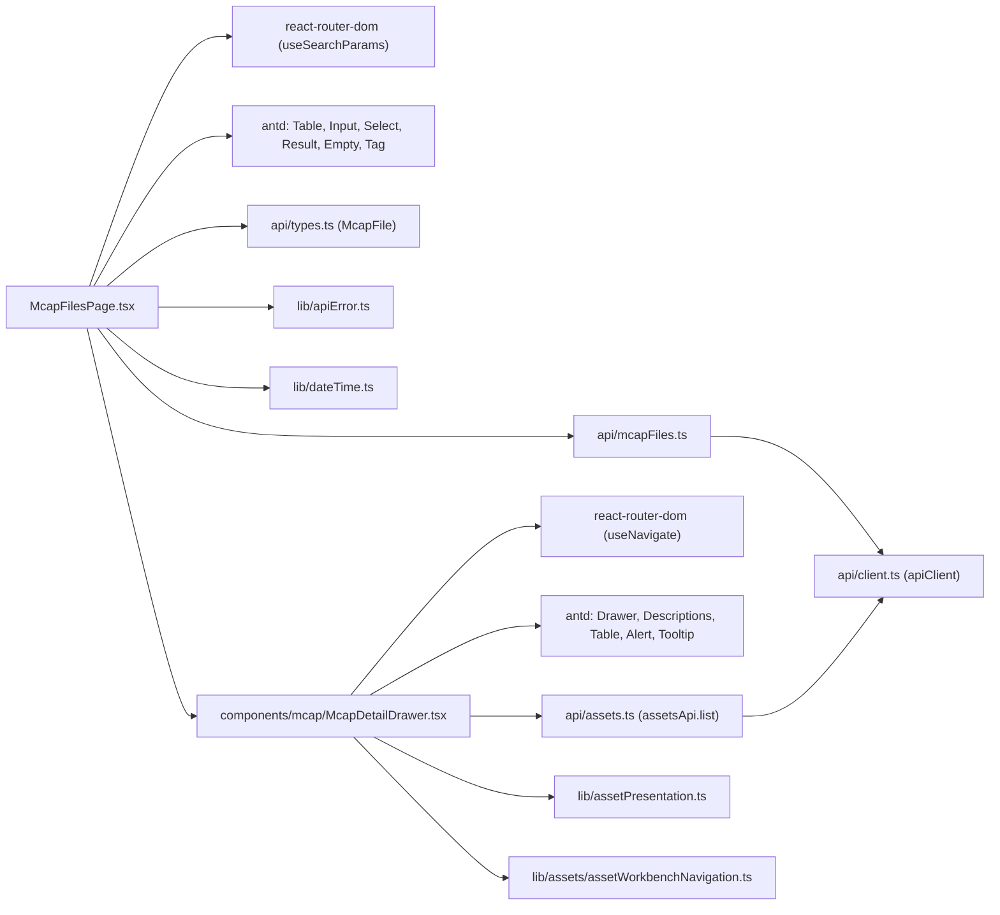

# MCAP Page

<cite>
**Referenced Files in This Document**

- [Frontend/src/pages/McapFilesPage.tsx](file://Frontend/src/pages/McapFilesPage.tsx)
- [Frontend/src/components/mcap/McapDetailDrawer.tsx](file://Frontend/src/components/mcap/McapDetailDrawer.tsx)
- [Frontend/src/api/mcapFiles.ts](file://Frontend/src/api/mcapFiles.ts)
- [Frontend/src/api/types.ts](file://Frontend/src/api/types.ts)
- [Frontend/src/api/assets.ts](file://Frontend/src/api/assets.ts)
- [Frontend/src/lib/dateTime.ts](file://Frontend/src/lib/dateTime.ts)
- [Frontend/src/lib/apiError.ts](file://Frontend/src/lib/apiError.ts)
- [Frontend/src/lib/assetPresentation.ts](file://Frontend/src/lib/assetPresentation.ts)
- [Frontend/src/lib/assets/assetWorkbenchNavigation.ts](file://Frontend/src/lib/assets/assetWorkbenchNavigation.ts)
</cite>

## Table of Contents
1. [Introduction](#introduction)
2. [Project Structure](#project-structure)
3. [Core Components](#core-components)
4. [Architecture Overview](#architecture-overview)
5. [Detailed Component Analysis](#detailed-component-analysis)
6. [Dependency Analysis](#dependency-analysis)
7. [Performance Considerations](#performance-considerations)
8. [Troubleshooting Guide](#troubleshooting-guide)
9. [Conclusion](#conclusion)
10. [Appendices](#appendices)

## Introduction

The MCAP page is the frontend surface for browsing, filtering, and inspecting **MCAP files** — the raw recording containers that flow into the cyber-databrew platform before they are summarized into assets. MCAP (Message Capture) files are uploaded out-of-band (typically through the SDK or a direct GCS upload) and then *finalized*, at which point the backend ingests their metadata: channel and chunk counts, time bounds, size, and an ingest state machine that moves through `pending → summarized` (or `failed`).

The page exists to give operators a read-mostly console over that corpus. It answers three operational questions: *which MCAP files exist and in what ingest state*, *what does a given file's metadata and process state look like*, and *which downstream assets were derived from a given file*. It also bridges into external playback — every file with a known GCS path exposes a one-click **Foxglove Studio** deep link so engineers can open the raw recording in a full waveform/3D viewer without leaving the workbench.

The primary users are data-operations engineers and reviewers who triage ingestion failures and trace assets back to their source recording. The surface is intentionally read-only inside the UI: mutation (finalize) happens via the API, while the page concentrates on listing, filtering, deep-linking, and drill-down.

**Section sources**
- [Frontend/src/pages/McapFilesPage.tsx](file://Frontend/src/pages/McapFilesPage.tsx#L50-L62)
- [Frontend/src/components/mcap/McapDetailDrawer.tsx](file://Frontend/src/components/mcap/McapDetailDrawer.tsx#L119-L121)

## Project Structure

The MCAP feature is small and cleanly layered. A single route page owns list state and filtering; a single drawer component owns detail rendering and the related-asset query; an API module wraps the HTTP surface; and a shared types module defines the `McapFile` shape that both the page and the drawer consume.

- **`Frontend/src/pages/McapFilesPage.tsx`** — the route component. Holds list state (files, total, page, filters), runs the list query, renders the Ant Design `Table`, and hosts the detail `Drawer`. It also implements *focus-by-URL*: a `mcap_file_id` query parameter opens the drawer directly on a specific file.
- **`Frontend/src/components/mcap/McapDetailDrawer.tsx`** — the only component under `components/mcap/`. Renders the metadata `Descriptions`, the related-assets table, and the Foxglove deep-link button.
- **`Frontend/src/api/mcapFiles.ts`** — the API client wrapper exposing `list`, `get`, and `finalize`.
- **`Frontend/src/api/types.ts`** — defines `McapFile` and the generic `PaginatedResponse<T>` envelope.
- **Shared libs** — `lib/dateTime.ts` (timestamp formatting), `lib/apiError.ts` (error-message extraction), `lib/assetPresentation.ts` and `lib/assets/assetWorkbenchNavigation.ts` (used by the drawer's related-assets table).



**Diagram sources**
- [Frontend/src/pages/McapFilesPage.tsx](file://Frontend/src/pages/McapFilesPage.tsx#L1-L24)
- [Frontend/src/components/mcap/McapDetailDrawer.tsx](file://Frontend/src/components/mcap/McapDetailDrawer.tsx#L1-L31)

**Section sources**
- [Frontend/src/pages/McapFilesPage.tsx](file://Frontend/src/pages/McapFilesPage.tsx#L1-L48)
- [Frontend/src/components/mcap/McapDetailDrawer.tsx](file://Frontend/src/components/mcap/McapDetailDrawer.tsx#L1-L63)
- [Frontend/src/api/mcapFiles.ts](file://Frontend/src/api/mcapFiles.ts#L1-L30)

## Core Components

The feature is built from four cooperating units.

#### `McapFilesPage` (list + filter container)

`McapFilesPage` is the default-exported route component. It manages a focused set of state hooks — the loaded `files`, the `total` count, `loading`, the current `page`, two filter values (`stateFilter`, debounced `ownerFilter`), an `error` string, and the drawer's `open`/`selectedFile` pair. The list query is encapsulated in a memoized `load` callback that calls `mcapFilesApi.list` with a fixed page size of 20 and the optional `ingest_state` / `owner` filters, then writes `items` and `total` into state. Failures are funneled through `extractApiErrorMessage` and surface as an Ant `Result` error panel with a retry button.

The render tree is a header (title with live total, owner search input, state `Select`, refresh button), a body that is either the error `Result` or the data `Table`, and the always-mounted `McapDetailDrawer`.

**Section sources**
- [Frontend/src/pages/McapFilesPage.tsx](file://Frontend/src/pages/McapFilesPage.tsx#L50-L98)
- [Frontend/src/pages/McapFilesPage.tsx](file://Frontend/src/pages/McapFilesPage.tsx#L231-L331)

#### `McapDetailDrawer` (detail + preview integration)

`McapDetailDrawer` is a right-placement Ant `Drawer` (width 720) controlled by `open`, `mcapFile`, and `onClose` props. When opened with a file, it lazily loads the related assets for that file via `assetsApi.list({ mcap_file_id })`. It renders a two-column `Descriptions` block of file metadata, a related-assets `Table`, and — in its header `extra` slot — the Foxglove deep-link button when a GCS path is present.

**Section sources**
- [Frontend/src/components/mcap/McapDetailDrawer.tsx](file://Frontend/src/components/mcap/McapDetailDrawer.tsx#L67-L117)
- [Frontend/src/components/mcap/McapDetailDrawer.tsx](file://Frontend/src/components/mcap/McapDetailDrawer.tsx#L176-L342)

#### `mcapFilesApi` (HTTP wrapper)

The API module exposes three methods. `list(params)` builds a `URLSearchParams` query (page, page_size, ingest_state, owner) and returns a `PaginatedResponse<McapFile>` from `GET /mcap-files`. `get(id)` fetches a single `McapFile` from `GET /mcap-files/{id}`. `finalize(id)` issues `POST /mcap-files/{id}/finalize` to trigger ingestion — this is referenced in the page's empty-state guidance but is not invoked from the UI itself.

**Section sources**
- [Frontend/src/api/mcapFiles.ts](file://Frontend/src/api/mcapFiles.ts#L1-L30)

#### `McapFile` type

`McapFile` defines the canonical record: identifiers (`mcap_file_id`, `gcs_path`), integrity (`size_bytes`, `raw_hash_md5`), the `ingest_state` string, optional time bounds (`start_timestamp_ns`, `end_timestamp_ns`) and structure counts (`channel_count`, `chunk_count`), `owner`, an optional `process_state` map, audit timestamps, and a `version`.

**Section sources**
- [Frontend/src/api/types.ts](file://Frontend/src/api/types.ts#L88-L104)
- [Frontend/src/api/types.ts](file://Frontend/src/api/types.ts#L3-L8)

## Architecture Overview

The MCAP page is a self-contained slice of the SPA. State lives entirely in the page component; the drawer is a controlled presentational component that owns only its own asynchronous related-assets fetch. There is no global store involvement — all data is fetched on demand through the typed `apiClient`-backed API modules and held in local React state.



The page reads two URL params: `page` seeds pagination and is written back on page change, and `mcap_file_id` is a *deep-focus* hint that opens the drawer on a specific file (fetching it if it is not on the current page) and is then cleared from the URL. The drawer's only external write is navigation — clicking a related asset routes to `/assets/:id`, and the Foxglove button opens an external `foxglove://` URI.

**Diagram sources**
- [Frontend/src/pages/McapFilesPage.tsx](file://Frontend/src/pages/McapFilesPage.tsx#L51-L52)
- [Frontend/src/pages/McapFilesPage.tsx](file://Frontend/src/pages/McapFilesPage.tsx#L108-L149)
- [Frontend/src/components/mcap/McapDetailDrawer.tsx](file://Frontend/src/components/mcap/McapDetailDrawer.tsx#L83-L121)

**Section sources**
- [Frontend/src/pages/McapFilesPage.tsx](file://Frontend/src/pages/McapFilesPage.tsx#L51-L149)
- [Frontend/src/components/mcap/McapDetailDrawer.tsx](file://Frontend/src/components/mcap/McapDetailDrawer.tsx#L78-L121)

## Detailed Component Analysis

### File listing and filtering

The list query is the heart of the page. `load` is memoized over `page`, `stateFilter`, and `debouncedOwnerFilter`; it sets `loading`, clears `error`, and calls the API. On success it stores `data.items ?? []` and `data.total ?? 0`; on failure it clears the data and stores a human-readable error. Three effects orchestrate this: one resets `page` to 1 on mount, one resets `page` to 1 whenever a filter changes, and one calls `load(page)` whenever `page` or `load` change.

The owner filter is debounced by 300 ms through a dedicated effect that mirrors `ownerFilter` into `debouncedOwnerFilter` after a timeout; the input also commits immediately on Enter or blur. The state filter is a `Select` over a fixed option list (`全部状态`, `pending`, `summarized`, `failed`). Both filters reset pagination to page 1 so results are never shown against a stale page offset.

```mermaid
sequenceDiagram
  participant User
  participant Page as McapFilesPage
  participant Api as mcapFilesApi
  participant BE as "GET /mcap-files"
  User->>Page: change owner / state filter
  Page->>Page: debounce 300ms, setPage(1)
  Page->>Api: list({page, page_size:20, ingest_state, owner})
  Api->>BE: GET /mcap-files?page=&page_size=&...
  BE-->>Api: PaginatedResponse<McapFile>
  Api-->>Page: { items, total }
  Page->>Page: setFiles(items); setTotal(total)
  Page-->>User: render Table (or Empty / Result on error)
```

The `Table` is keyed on `mcap_file_id` and defines eight columns: a truncated mono ID, the GCS path (md+ only), human-formatted size, an ingest-state `Tag` colored via the `ingestColor` map, channel and chunk counts (lg only), owner, and a formatted `updated_at`. Pagination is fixed at page size 20, hides the size changer, shows a quick-jumper only when `total > 200`, and writes the new `page` to both component state and the URL. Each row is clickable and opens the detail drawer for that record. An empty result renders a guided `Empty` state pointing users at the SDK upload / finalize endpoint.

**Diagram sources**
- [Frontend/src/pages/McapFilesPage.tsx](file://Frontend/src/pages/McapFilesPage.tsx#L76-L106)

**Section sources**
- [Frontend/src/pages/McapFilesPage.tsx](file://Frontend/src/pages/McapFilesPage.tsx#L64-L106)
- [Frontend/src/pages/McapFilesPage.tsx](file://Frontend/src/pages/McapFilesPage.tsx#L151-L229)
- [Frontend/src/pages/McapFilesPage.tsx](file://Frontend/src/pages/McapFilesPage.tsx#L293-L322)

### Deep-focus by URL (`mcap_file_id`)

A dedicated effect implements opening the drawer directly from a link. When `mcap_file_id` is present, the page first looks for the file on the currently loaded page; if found, it selects it, opens the drawer, and clears the focus param. Otherwise it calls `mcapFilesApi.get(id)`, prepends the fetched file to the local list (deduplicating, capped at 20), bumps `total` to at least 1, opens the drawer, and clears the param. The effect is fully cancellable via a `cancelled` flag so a navigation away mid-fetch does not write stale state.



**Diagram sources**
- [Frontend/src/pages/McapFilesPage.tsx](file://Frontend/src/pages/McapFilesPage.tsx#L108-L149)

**Section sources**
- [Frontend/src/pages/McapFilesPage.tsx](file://Frontend/src/pages/McapFilesPage.tsx#L108-L149)
- [Frontend/src/api/mcapFiles.ts](file://Frontend/src/api/mcapFiles.ts#L23-L24)

### Detail drawer and metadata rendering

When the drawer opens, an effect resets the asset list and triggers `loadRelatedAssets(mcap_file_id)`; closing the drawer clears the assets and any asset error. `loadRelatedAssets` calls `assetsApi.list` with the file id and a page size of 100, returning `data.items ?? []` and surfacing failures through `extractApiErrorMessage`.

The metadata block is a bordered two-column `Descriptions`. The file id and GCS path span both columns; the path has a copy button that writes to `navigator.clipboard`. Size and MD5, ingest-state `Tag`, owner, channel/chunk counts, and the start/end timestamps round out the grid. Timestamps stored as nanoseconds are rendered through the local `formatNs` helper, which divides by `1e6` and formats with dayjs; `created_at`/`updated_at` are ISO strings formatted directly. `process_state` is shown as raw JSON.

**Section sources**
- [Frontend/src/components/mcap/McapDetailDrawer.tsx](file://Frontend/src/components/mcap/McapDetailDrawer.tsx#L83-L117)
- [Frontend/src/components/mcap/McapDetailDrawer.tsx](file://Frontend/src/components/mcap/McapDetailDrawer.tsx#L199-L289)
- [Frontend/src/components/mcap/McapDetailDrawer.tsx](file://Frontend/src/components/mcap/McapDetailDrawer.tsx#L36-L48)

### Related assets table and navigation

Below the metadata, the drawer lists assets derived from this MCAP file. The columns render a clickable mono asset id, a lifecycle `Tag` colored by `getAssetStateColor`, a duration via `formatDurationSeconds`, the environment, an algorithm summary derived from the asset's `algo_results` map by the local `algoSummary` helper (counting `*:status` entries into a string like `2 ok / 1 failed`), and a short formatted update time. Clicking an asset id or row navigates to the asset detail route through `navigateToAssetDetail`, which remembers a return URL and pushes `/assets/:id`. Row navigation also calls `onClose` first; the id-button click relies on the page unmounting and stops event propagation so it does not double-fire the row handler.

An asset-load failure renders an inline `Alert` with a retry button that re-invokes `loadRelatedAssets`, and the table's empty text reflects whether the failure or merely an empty result occurred.

**Section sources**
- [Frontend/src/components/mcap/McapDetailDrawer.tsx](file://Frontend/src/components/mcap/McapDetailDrawer.tsx#L50-L63)
- [Frontend/src/components/mcap/McapDetailDrawer.tsx](file://Frontend/src/components/mcap/McapDetailDrawer.tsx#L123-L174)
- [Frontend/src/components/mcap/McapDetailDrawer.tsx](file://Frontend/src/components/mcap/McapDetailDrawer.tsx#L291-L335)
- [Frontend/src/lib/assets/assetWorkbenchNavigation.ts](file://Frontend/src/lib/assets/assetWorkbenchNavigation.ts#L99-L106)

### Preview integration (Foxglove deep link)

There is no in-app waveform player; preview is delegated to **Foxglove Studio** via a protocol URI. The drawer computes `foxgloveUrl` only when `mcapFile.gcs_path` is set, encoding the path into `foxglove://open?ds=remote-file&ds.url=<encoded gcs_path>`. When present, the drawer header `extra` slot renders a `PlayCircleOutlined` button (tooltipped "在 Foxglove Studio 中打开") with `href={foxgloveUrl}`, `target="_blank"`, and `rel="noopener noreferrer"`. When the path is missing, no button is shown — preview is gracefully unavailable rather than broken.

```mermaid
sequenceDiagram
  participant User
  participant Page as McapFilesPage
  participant Drawer as McapDetailDrawer
  participant FG as "Foxglove Studio"
  User->>Page: click table row
  Page->>Page: setSelectedFile(record); setDrawerOpen(true)
  Page->>Drawer: open=true, mcapFile=record
  Drawer->>Drawer: foxgloveUrl = gcs_path ? "foxglove://open?ds=remote-file&ds.url=" : null
  Drawer-->>User: render header button when foxgloveUrl set
  User->>Drawer: click Foxglove button
  Drawer->>FG: open foxglove:// URI (new tab)
  FG-->>User: load remote MCAP for playback
```

**Diagram sources**
- [Frontend/src/components/mcap/McapDetailDrawer.tsx](file://Frontend/src/components/mcap/McapDetailDrawer.tsx#L119-L121)
- [Frontend/src/components/mcap/McapDetailDrawer.tsx](file://Frontend/src/components/mcap/McapDetailDrawer.tsx#L183-L197)

**Section sources**
- [Frontend/src/components/mcap/McapDetailDrawer.tsx](file://Frontend/src/components/mcap/McapDetailDrawer.tsx#L119-L121)
- [Frontend/src/components/mcap/McapDetailDrawer.tsx](file://Frontend/src/components/mcap/McapDetailDrawer.tsx#L176-L198)

## Dependency Analysis

The page sits on a thin stack: React Router for URL state, Ant Design for all UI primitives, the typed API modules for data, and a small set of shared formatting/navigation libs.



The page depends on the drawer, but the drawer does not depend on the page — it is reusable wherever a `McapFile` and an `onClose` are available. Both API modules depend on the shared `apiClient`. The drawer reaches into asset-domain helpers (`assetPresentation`, `assetWorkbenchNavigation`, `assetsApi`), making the MCAP detail view a small consumer of the larger asset feature.

**Diagram sources**
- [Frontend/src/pages/McapFilesPage.tsx](file://Frontend/src/pages/McapFilesPage.tsx#L1-L24)
- [Frontend/src/components/mcap/McapDetailDrawer.tsx](file://Frontend/src/components/mcap/McapDetailDrawer.tsx#L1-L31)

**Section sources**
- [Frontend/src/pages/McapFilesPage.tsx](file://Frontend/src/pages/McapFilesPage.tsx#L1-L24)
- [Frontend/src/components/mcap/McapDetailDrawer.tsx](file://Frontend/src/components/mcap/McapDetailDrawer.tsx#L1-L31)
- [Frontend/src/api/mcapFiles.ts](file://Frontend/src/api/mcapFiles.ts#L1-L2)

## Performance Considerations

- **Server-side pagination.** The list query always passes `page` and a fixed `page_size: 20`, so the table never loads the full corpus into the browser. The quick-jumper appears only when `total > 200`, signalling deliberately large datasets.
- **Debounced owner filter.** The 300 ms debounce on the owner input prevents a request per keystroke; the request fires once typing settles, or immediately on Enter/blur.
- **Lazy detail and assets fetch.** File detail metadata comes from the row already in memory (no extra fetch on row click); the drawer fetches related assets only when it actually opens, and resets them on close.
- **Related-assets page size.** The drawer requests up to 100 assets per file in a single page (`page_size: 100`) with no pagination on the inner table — acceptable for typical fan-out but a potential payload concern for files that produced very many assets.
- **Cancellation safety.** Both the deep-focus fetch and the related-assets fetch guard against late resolution with a `cancelled` flag, avoiding wasted state writes and React update-after-unmount warnings.
- **Deep-focus dedupe cap.** When a focused file is prepended to the list, the array is sliced to 20 to keep the in-memory list bounded.

**Section sources**
- [Frontend/src/pages/McapFilesPage.tsx](file://Frontend/src/pages/McapFilesPage.tsx#L64-L98)
- [Frontend/src/pages/McapFilesPage.tsx](file://Frontend/src/pages/McapFilesPage.tsx#L131-L137)
- [Frontend/src/components/mcap/McapDetailDrawer.tsx](file://Frontend/src/components/mcap/McapDetailDrawer.tsx#L83-L117)

## Troubleshooting Guide

#### List fails to load / shows the error panel
The page renders an Ant `Result` (status `error`) with the message produced by `extractApiErrorMessage(err, "加载 MCAP 文件失败")` and a retry button that re-runs `load(page)`. Inspect the network call to `GET /mcap-files` — common causes are auth/token expiry or a 5xx from the backend. The fallback title is always shown even when the extracted message is empty.

#### No rows appear
If the request succeeds but returns no items, the table shows the guided `Empty` state advising users to upload via the SDK or call `POST /api/v1/mcap-files/:id/finalize`. Confirm the active filters: a non-empty owner search or a state filter narrows the result set, and both reset to page 1 on change.

#### Deep link does not open the drawer
The `mcap_file_id` param triggers a lookup first on the current page, then a `mcapFilesApi.get(id)` fallback. If the id is invalid the `get` rejects, the file is never added, but the focus param is still cleared in the `finally` block — so a bad link silently no-ops rather than erroring. Verify the id exists via the API.

#### Related assets fail / empty in the drawer
Failures render an inline `Alert` with a retry button; the table's empty text distinguishes a failure ("关联资产加载失败") from a genuinely empty result ("暂无关联资产"). Check `GET /assets?mcap_file_id=` for the file.

#### Foxglove button is missing
The button only renders when `mcapFile.gcs_path` is truthy. A file still in `pending` ingest or without a recorded GCS path will not show the preview action. Confirm the file has a `gcs_path` in its detail metadata.

**Section sources**
- [Frontend/src/pages/McapFilesPage.tsx](file://Frontend/src/pages/McapFilesPage.tsx#L89-L92)
- [Frontend/src/pages/McapFilesPage.tsx](file://Frontend/src/pages/McapFilesPage.tsx#L214-L292)
- [Frontend/src/components/mcap/McapDetailDrawer.tsx](file://Frontend/src/components/mcap/McapDetailDrawer.tsx#L297-L326)
- [Frontend/src/lib/apiError.ts](file://Frontend/src/lib/apiError.ts#L90-L90)

## Conclusion

The MCAP page is a compact, read-mostly console over the platform's raw recording files. A single stateful route component handles server-paginated listing, debounced owner filtering, ingest-state filtering, and URL-driven deep focus, while a reusable detail drawer renders rich metadata, links forward to derived assets, and delegates playback to Foxglove Studio through a protocol deep link. Its dependencies are intentionally narrow — React Router, Ant Design, two typed API modules, and a handful of shared formatting/navigation helpers — making it an easy-to-reason-about slice that bridges ingestion telemetry to the broader asset workflow.

## Appendices

### `McapFile` fields

| Field | Type | Notes |
| --- | --- | --- |
| `mcap_file_id` | `string` | primary identifier; rendered truncated/mono |
| `gcs_path` | `string` | source object path; gates the Foxglove link |
| `size_bytes` | `number` | formatted via `formatBytes` |
| `raw_hash_md5` | `string` | integrity hash (drawer only) |
| `ingest_state` | `string` | `pending` \| `summarized` \| `failed` |
| `start_timestamp_ns` | `number?` | ns epoch; rendered via `formatNs` |
| `end_timestamp_ns` | `number?` | ns epoch; rendered via `formatNs` |
| `channel_count` | `number?` | |
| `chunk_count` | `number?` | |
| `owner` | `string` | filterable |
| `process_state` | `Record<string,string>?` | shown as raw JSON |
| `created_at` / `updated_at` | `string` | ISO timestamps |
| `version` | `number` | optimistic-concurrency version |

**Section sources**
- [Frontend/src/api/types.ts](file://Frontend/src/api/types.ts#L88-L104)

### MCAP API surface

| Method | Endpoint | Returns |
| --- | --- | --- |
| `mcapFilesApi.list(params)` | `GET /mcap-files` | `PaginatedResponse<McapFile>` |
| `mcapFilesApi.get(id)` | `GET /mcap-files/{id}` | `McapFile` |
| `mcapFilesApi.finalize(id)` | `POST /mcap-files/{id}/finalize` | ingestion trigger (not called from UI) |

**Section sources**
- [Frontend/src/api/mcapFiles.ts](file://Frontend/src/api/mcapFiles.ts#L11-L30)

### Ingest-state color map and filter options

The list colors ingest-state tags via `ingestColor` (`pending → default`, `summarized → success`, `failed → error`) and offers the state `Select` options `全部状态`, `pending`, `summarized`, `failed`. The Foxglove deep-link template is `foxglove://open?ds=remote-file&ds.url=<encodeURIComponent(gcs_path)>`.

**Section sources**
- [Frontend/src/pages/McapFilesPage.tsx](file://Frontend/src/pages/McapFilesPage.tsx#L28-L48)
- [Frontend/src/components/mcap/McapDetailDrawer.tsx](file://Frontend/src/components/mcap/McapDetailDrawer.tsx#L119-L121)
