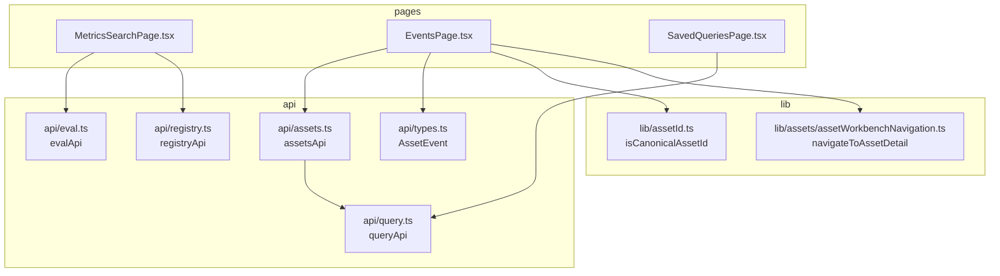
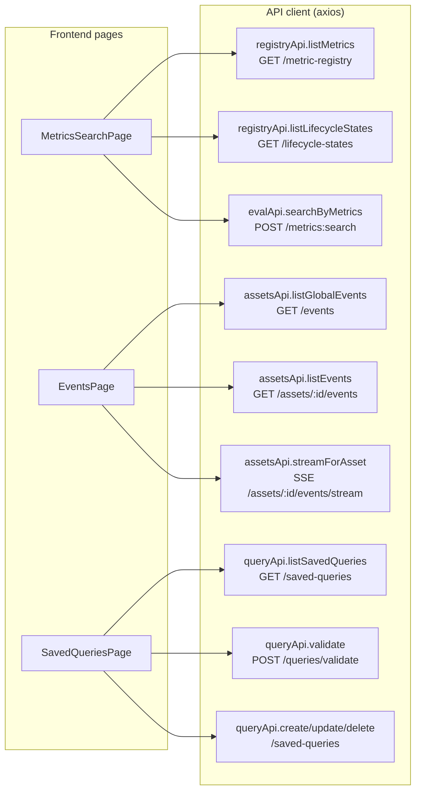
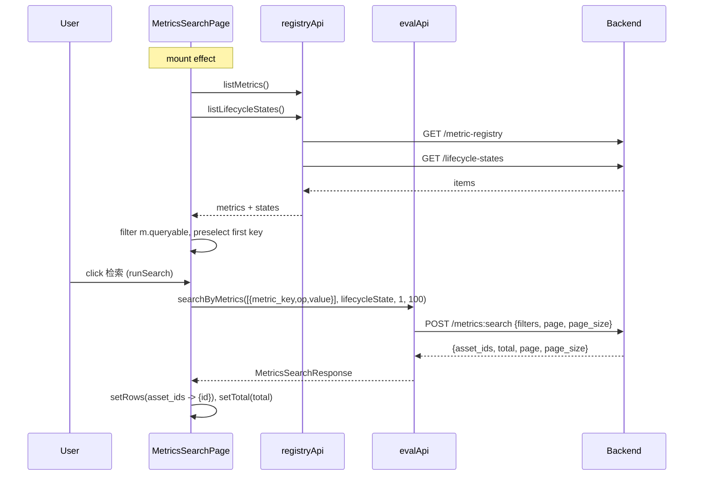
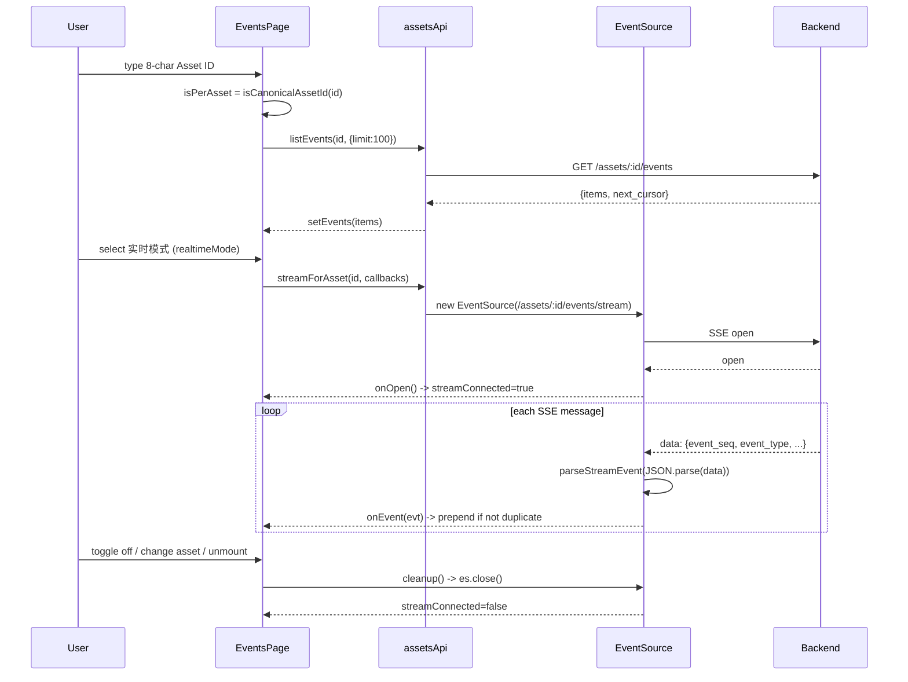
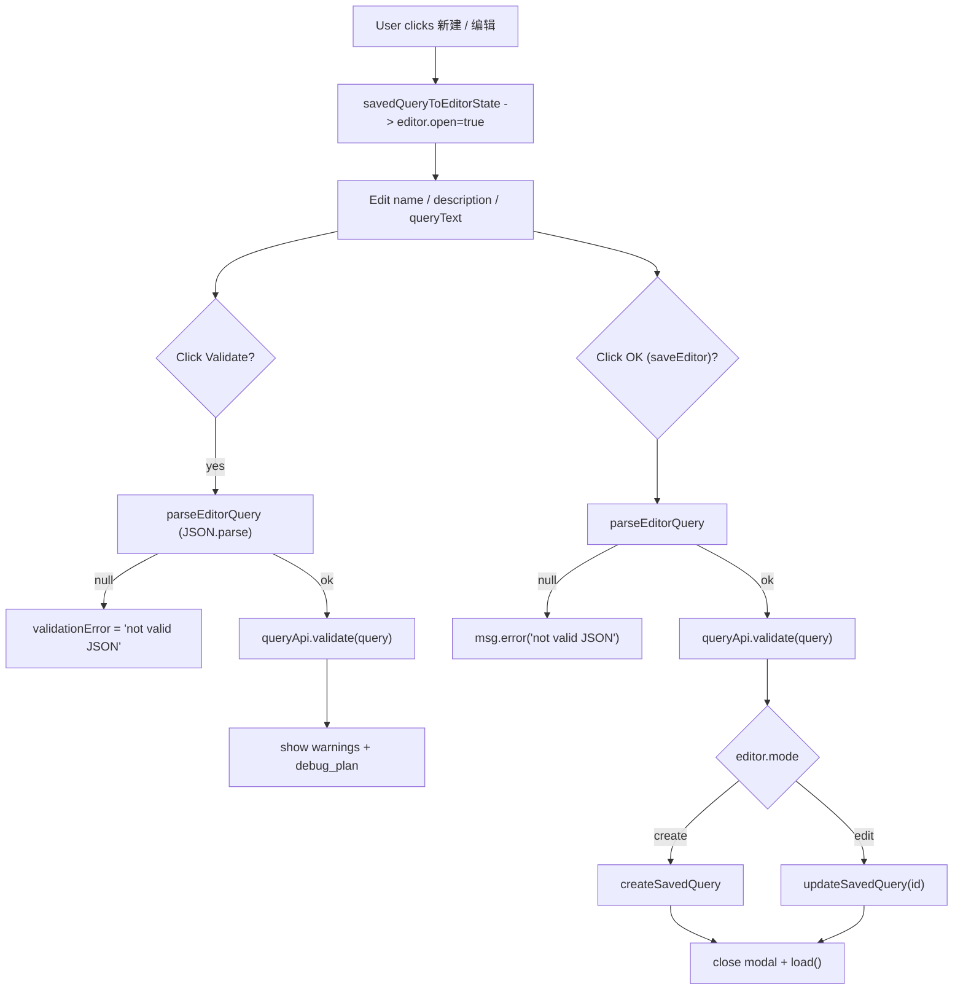
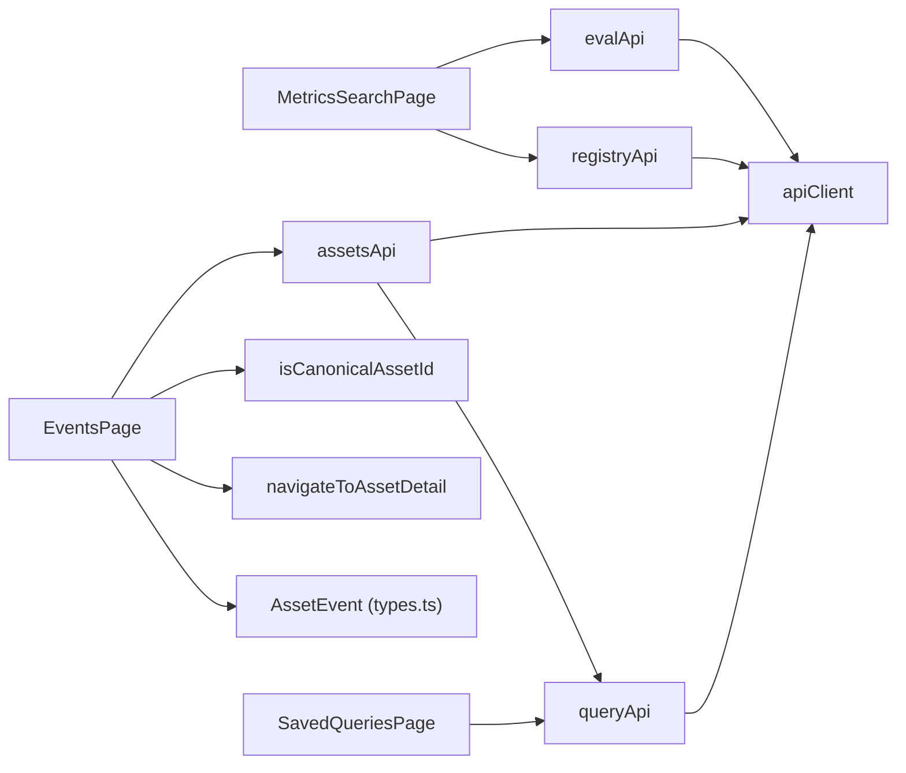

# Metrics & Events Pages

<cite>
**Referenced Files in This Document**

- [Frontend/src/pages/MetricsSearchPage.tsx](file://Frontend/src/pages/MetricsSearchPage.tsx)
- [Frontend/src/pages/EventsPage.tsx](file://Frontend/src/pages/EventsPage.tsx)
- [Frontend/src/pages/SavedQueriesPage.tsx](file://Frontend/src/pages/SavedQueriesPage.tsx)
- [Frontend/src/api/eval.ts](file://Frontend/src/api/eval.ts)
- [Frontend/src/api/registry.ts](file://Frontend/src/api/registry.ts)
- [Frontend/src/api/assets.ts](file://Frontend/src/api/assets.ts)
- [Frontend/src/api/query.ts](file://Frontend/src/api/query.ts)
- [Frontend/src/api/types.ts](file://Frontend/src/api/types.ts)
- [Frontend/src/lib/assetId.ts](file://Frontend/src/lib/assetId.ts)
- [Frontend/src/lib/assets/assetWorkbenchNavigation.ts](file://Frontend/src/lib/assets/assetWorkbenchNavigation.ts)
</cite>

## Table of Contents
1. [Introduction](#introduction)
2. [Project Structure](#project-structure)
3. [Core Components](#core-components)
4. [Architecture Overview](#architecture-overview)
5. [Detailed Component Analysis](#detailed-component-analysis)
6. [Dependency Analysis](#dependency-analysis)
7. [Performance Considerations](#performance-considerations)
8. [Troubleshooting Guide](#troubleshooting-guide)
9. [Conclusion](#conclusion)
10. [Appendices](#appendices)

## Introduction

This document describes three operational pages in the cyber-databrew frontend that
expose the platform's evaluation metrics, asset event stream, and persisted Query IR
objects to operators and data engineers:

- **`MetricsSearchPage`** — finds assets whose written evaluation metrics satisfy a
  threshold comparison (for example, every asset whose `quality_score >= 0.05`),
  optionally constrained by lifecycle state.
- **`EventsPage`** — an event-stream overview that renders the global asset-event
  feed (default last 24 hours) and switches to a single-asset view, including a live
  Server-Sent-Events (SSE) real-time mode, when an 8-character Asset ID is supplied.
- **`SavedQueriesPage`** — a CRUD console for persisted Query IR documents
  (`saved_query`), with an inline JSON editor, server-side validation, and a
  "open in workbench" hand-off into the assets discovery surface.

All three are thin React function components that delegate their data access to typed
API client modules under `Frontend/src/api/`. They share a common pattern: local
component state, an `async` action that calls an `apiClient` method, and an Ant Design
`Table` for results. The metrics and saved-query pages issue plain JSON over HTTP,
while the events page additionally opens a long-lived `EventSource` connection for
real-time updates.

**Section sources**
- [Frontend/src/pages/MetricsSearchPage.tsx](file://Frontend/src/pages/MetricsSearchPage.tsx#L23-L88)
- [Frontend/src/pages/EventsPage.tsx](file://Frontend/src/pages/EventsPage.tsx#L1-L42)
- [Frontend/src/pages/SavedQueriesPage.tsx](file://Frontend/src/pages/SavedQueriesPage.tsx#L63-L95)

## Project Structure

The three pages live side-by-side in `Frontend/src/pages/` and each is bound to a
single typed API surface in `Frontend/src/api/`. The dependency layering is uniform:
a page imports types and an `*Api` object, the API object wraps `apiClient`
(axios), and shared formatting/identifier helpers come from `Frontend/src/lib/`.

**Diagram sources**
- [Frontend/src/pages/MetricsSearchPage.tsx](file://Frontend/src/pages/MetricsSearchPage.tsx#L1-L16)
- [Frontend/src/pages/EventsPage.tsx](file://Frontend/src/pages/EventsPage.tsx#L1-L27)
- [Frontend/src/pages/SavedQueriesPage.tsx](file://Frontend/src/pages/SavedQueriesPage.tsx#L1-L21)
- [Frontend/src/api/assets.ts](file://Frontend/src/api/assets.ts#L1-L16)

**Section sources**
- [Frontend/src/pages/MetricsSearchPage.tsx](file://Frontend/src/pages/MetricsSearchPage.tsx#L1-L16)
- [Frontend/src/pages/EventsPage.tsx](file://Frontend/src/pages/EventsPage.tsx#L1-L27)
- [Frontend/src/pages/SavedQueriesPage.tsx](file://Frontend/src/pages/SavedQueriesPage.tsx#L1-L21)

## Core Components

### MetricsSearchPage

`MetricsSearchPage` is a default-exported function component. On mount it loads the
queryable metric registry and the set of lifecycle states in parallel, then lets the
operator build a single metric filter (`metric_key`, comparison `op`, numeric
`value`) plus an optional `lifecycle_state`. Running the search posts the filter to
`evalApi.searchByMetrics` and renders the returned `asset_ids` as a table of links to
asset detail. Local state covers the registry (`metrics`, `lifecycleStates`), the
form (`metricKey`, `op`, `value`, `lifecycleState`), and the results (`rows`,
`total`), plus `loading`/`error` flags.

**Section sources**
- [Frontend/src/pages/MetricsSearchPage.tsx](file://Frontend/src/pages/MetricsSearchPage.tsx#L23-L88)

### EventsPage

`EventsPage` is the most stateful of the three. It tracks an `assetId` string (seeded
from the `?asset_id=` query param), the loaded `events`, paging cursor `nextCursor`,
and two independent loading flags (`loading`, `loadingMore`). It derives
`isPerAsset` from `isCanonicalAssetId(assetId)` and exposes a `realtimeMode` toggle
that, in per-asset mode, opens an SSE stream via `assetsApi.streamForAsset`. A
`fetchIdRef` guards against out-of-order responses when the asset filter changes
rapidly, and a `streamCleanupRef` holds the live stream's teardown function.

**Section sources**
- [Frontend/src/pages/EventsPage.tsx](file://Frontend/src/pages/EventsPage.tsx#L176-L249)
- [Frontend/src/lib/assetId.ts](file://Frontend/src/lib/assetId.ts#L4-L7)

### SavedQueriesPage

`SavedQueriesPage` lists persisted `SavedQuery` records in a table and drives a modal
editor (`EditorState`) for create/edit. The editor holds the raw JSON text of the
Query IR (`queryText`), the last `validation` response, a `validationError`, and a
`saving` flag. New queries start from `defaultQueryRequest()` (a `v1`,
`resource: "assets"`, page-20, sort-by-`updated_at` skeleton). Saving always
re-validates against the backend before persisting. A per-row "open in workbench"
action stashes the saved-query id in `sessionStorage` and navigates to `/assets`.

**Section sources**
- [Frontend/src/pages/SavedQueriesPage.tsx](file://Frontend/src/pages/SavedQueriesPage.tsx#L24-L61)
- [Frontend/src/pages/SavedQueriesPage.tsx](file://Frontend/src/pages/SavedQueriesPage.tsx#L195-L224)

## Architecture Overview

Each page is a presentation layer over a typed API client. The metrics page reads
from the registry endpoints and writes to the `metrics:search` endpoint; the events
page reads paginated event lists and (optionally) subscribes to an SSE stream; the
saved-queries page performs full CRUD against `/saved-queries` with a separate
`/queries/validate` pre-flight.

**Diagram sources**
- [Frontend/src/api/registry.ts](file://Frontend/src/api/registry.ts#L33-L41)
- [Frontend/src/api/eval.ts](file://Frontend/src/api/eval.ts#L62-L77)
- [Frontend/src/api/assets.ts](file://Frontend/src/api/assets.ts#L391-L426)
- [Frontend/src/api/query.ts](file://Frontend/src/api/query.ts#L87-L123)

**Section sources**
- [Frontend/src/api/registry.ts](file://Frontend/src/api/registry.ts#L22-L47)
- [Frontend/src/api/eval.ts](file://Frontend/src/api/eval.ts#L46-L78)
- [Frontend/src/api/assets.ts](file://Frontend/src/api/assets.ts#L231-L447)
- [Frontend/src/api/query.ts](file://Frontend/src/api/query.ts#L87-L123)

## Detailed Component Analysis

### Metrics search page

On mount, an effect loads `registryApi.listMetrics()` and
`registryApi.listLifecycleStates()` in parallel via `Promise.all`. The metric list is
filtered to `m.queryable` before being stored, and the first queryable metric is
preselected as the default `metricKey`. A `cancelled` guard prevents state writes
after unmount, and any failure surfaces the message `加载注册表失败`
("failed to load registry"). `metricOptions` is a memoized projection that labels each
option `key (display_name)`.

The search action `runSearch` short-circuits when no `metricKey` is selected, then
posts a single-filter array `[{ metric_key, op, value }]` to
`evalApi.searchByMetrics`, hard-coding `page = 1` and `pageSize = 100`. The response's
`asset_ids` are mapped to `{ id }` rows and `total` is captured for the header tag. On
error, results are cleared and the message `指标检索失败，请检查后端状态`
("metric search failed, check backend status") is shown.

The request body is shaped by `evalApi.searchByMetrics`: filters are nested under a
`filters` object containing `lifecycle_state` (empty string when unset) and the
`metrics` array, alongside top-level `page`/`page_size`. The comparison operators
offered in the UI (`gte`, `gt`, `eq`, `lt`, `lte`) match the `op` union on
`MetricsSearchFilter`.

**Diagram sources**
- [Frontend/src/pages/MetricsSearchPage.tsx](file://Frontend/src/pages/MetricsSearchPage.tsx#L37-L88)
- [Frontend/src/api/eval.ts](file://Frontend/src/api/eval.ts#L62-L77)

**Section sources**
- [Frontend/src/pages/MetricsSearchPage.tsx](file://Frontend/src/pages/MetricsSearchPage.tsx#L37-L186)
- [Frontend/src/api/eval.ts](file://Frontend/src/api/eval.ts#L33-L78)
- [Frontend/src/api/registry.ts](file://Frontend/src/api/registry.ts#L5-L41)

#### Result rendering

Results are rendered in an Ant Design `Table<Row>` with a single `Asset ID` column.
Each cell shows the id as `<Text code>` followed by a `react-router-dom` `Link` to
`/assets/${id}` (`打开详情` — "open detail"). Pagination is disabled
(`pagination={false}`) because the search caps at 100 ids and returns a flat list, so
the table renders the whole result set at once. The card title carries a `Tag` with
the `total` count.

**Section sources**
- [Frontend/src/pages/MetricsSearchPage.tsx](file://Frontend/src/pages/MetricsSearchPage.tsx#L156-L184)

### Events stream page

The events page has two data modes selected by `isPerAsset`
(`assetId.trim() !== "" && isCanonicalAssetId(assetId)`), where a canonical Asset ID
is exactly 8 ASCII alphanumeric characters per `isCanonicalAssetId`.

In **global mode**, `fetchEvents` calls `assetsApi.listGlobalEvents({ limit: 100 })`
(`GET /events`) and stores `res.items` plus `res.next_cursor`. Cursor paging is
exposed via a "加载更多" ("load more") button that calls `loadMore`, which appends the
next page when `nextCursor != null`. In **per-asset mode**, `fetchEvents` calls
`assetsApi.listEvents(assetId, { limit: 100 })` (`GET /assets/:id/events`); a 404 is
rewritten to the friendlier `Asset … 不存在或暂无事件`
("asset does not exist or has no events").

A `fetchIdRef` counter is incremented at the start of every `fetchEvents` call; each
branch checks `fetchId !== fetchIdRef.current` before committing state, discarding
results from superseded requests. This protects against races when the operator types
into the Asset ID box quickly.

#### Real-time SSE mode

Real-time mode is only available in per-asset mode and is wired through a dedicated
effect. When `realtimeMode` is on and the trimmed id is canonical, the effect calls
`assetsApi.streamForAsset(trimmed, …)`, which opens an `EventSource` against
`/assets/:id/events/stream`. The callbacks update component state: `onOpen` clears the
error and sets `streamConnected = true`; `onEvent` prepends the parsed event to the
list while de-duplicating by `(event_seq, event_id)`; `onError` flips
`streamConnected` to false. The effect stores the stream's cleanup in
`streamCleanupRef` and also returns a cleanup that closes the stream, so toggling the
mode off, changing the asset, or unmounting all tear the connection down.

The SSE plumbing lives in `assets.ts`: `streamAssetEvents` attaches `open`/`message`/
`error` listeners to the `EventSource`. Keep-alive frames (event type `keepalive` or
empty data) invoke `onKeepAlive` and are skipped; otherwise the payload is parsed by
`parseStreamEvent`, which coerces `event_seq` to a number, defaults `occurred_at` to
the current time, and synthesizes an `event_id` of `stream-<seq>` when absent.
Malformed JSON is silently ignored. `streamForAsset` builds the absolute stream URL
with `makeEventStreamUrl` (resolved against `apiClient.defaults.baseURL`) and opens the
`EventSource` `withCredentials: true`.

**Diagram sources**
- [Frontend/src/pages/EventsPage.tsx](file://Frontend/src/pages/EventsPage.tsx#L278-L334)
- [Frontend/src/api/assets.ts](file://Frontend/src/api/assets.ts#L189-L215)
- [Frontend/src/api/assets.ts](file://Frontend/src/api/assets.ts#L391-L398)

**Section sources**
- [Frontend/src/pages/EventsPage.tsx](file://Frontend/src/pages/EventsPage.tsx#L206-L363)
- [Frontend/src/api/assets.ts](file://Frontend/src/api/assets.ts#L141-L215)
- [Frontend/src/api/assets.ts](file://Frontend/src/api/assets.ts#L348-L426)

#### Columns, payload modal, and navigation

`buildEventColumns` produces the table columns: `Event Seq` (sortable), `类型`
(event type, colored via `eventTypeColor`), `Asset ID` (a monospace anchor that
intercepts plain left-clicks and routes through `navigateToAssetDetail` while letting
modifier/middle clicks open a new tab), `来源` (`event_source`), `发布状态`
(`publish_state`, colored green/orange/red for published/pending/other), `Payload`
(truncated to 100 chars with a `查看` button), and `时间` (`occurred_at` shown as a
relative time via `dayjs.fromNow`, sortable by `occurred_at || created_at`).

`eventTypeColor` maps prefixes and exact names to Ant Design tag colors: `algo_*`
→ purple, `tag_*` → cyan, `asset_created` → green, `asset_updated` → blue,
`asset_lifecycle_changed` → orange, `asset_delivered` → gold, everything else
default. Clicking `查看` opens a `Modal` rendering the full payload as
pretty-printed JSON via `formatJSON`.

The Asset-ID-link click handler calls `navigateToAssetDetail`, which first records the
current location as a safe return URL in `sessionStorage`
(`rememberReturnUrlBeforeAssetDetail`) and then navigates to `/assets/:id`, so the
detail page can offer an accurate "back".

**Section sources**
- [Frontend/src/pages/EventsPage.tsx](file://Frontend/src/pages/EventsPage.tsx#L34-L167)
- [Frontend/src/pages/EventsPage.tsx](file://Frontend/src/pages/EventsPage.tsx#L477-L508)
- [Frontend/src/lib/assets/assetWorkbenchNavigation.ts](file://Frontend/src/lib/assets/assetWorkbenchNavigation.ts#L99-L106)

#### URL synchronization

The `assetId` is two-way bound to the `asset_id` query parameter.
`initialAssetIdFromSearch` seeds the initial value (only if canonical), an effect
re-reads the param whenever `searchParams` change, and `onAssetIdInput` writes a
canonical id back to the URL (`setSearchParams({ asset_id }, { replace: true })`) or
clears it when the box is emptied. Typing into the box also turns real-time mode off
and resets the list, error, and cursor.

**Section sources**
- [Frontend/src/pages/EventsPage.tsx](file://Frontend/src/pages/EventsPage.tsx#L171-L174)
- [Frontend/src/pages/EventsPage.tsx](file://Frontend/src/pages/EventsPage.tsx#L336-L363)

### Saved queries page

`SavedQueriesPage` loads the list with `queryApi.listSavedQueries()` on mount via a
memoized `load` callback. The table columns surface `name` (bold), `description`
(em-dash fallback), `resource` and `schema_version` tags, plus an actions column with
`编辑` (edit), `在工作台打开` (open in workbench), and a `Popconfirm`-guarded `删除`
(delete) that calls `queryApi.deleteSavedQuery` then reloads.

The editor opens via `savedQueryToEditorState`, which serializes either the selected
row's `query_ir_json` or `defaultQueryRequest()` into the `queryText` textarea.
`parseEditorQuery` attempts `JSON.parse`; on failure it returns `null`. `Validate`
calls `queryApi.validate` and shows the returned `warnings` and `debug_plan`. `saveEditor`
re-validates first, then calls `createSavedQuery` or `updateSavedQuery` depending on
`editor.mode`, closes the modal, and reloads. The OK button is disabled until a
non-empty name is entered.

The "open in workbench" action does not navigate to a query result directly; it writes
`assets_open_saved_query_id = remote:<saved_query_id>` to `sessionStorage` and then
navigates to `/assets`, where the discovery workbench reads that key to hydrate the
selected saved query.

**Diagram sources**
- [Frontend/src/pages/SavedQueriesPage.tsx](file://Frontend/src/pages/SavedQueriesPage.tsx#L161-L224)

**Section sources**
- [Frontend/src/pages/SavedQueriesPage.tsx](file://Frontend/src/pages/SavedQueriesPage.tsx#L79-L224)
- [Frontend/src/pages/SavedQueriesPage.tsx](file://Frontend/src/pages/SavedQueriesPage.tsx#L131-L141)
- [Frontend/src/api/query.ts](file://Frontend/src/api/query.ts#L87-L123)

## Dependency Analysis

The pages sit at the top of a shallow dependency graph. The metrics page depends on
two registry endpoints plus the metric-search endpoint; the events page depends on the
event-list and SSE endpoints plus identifier and navigation helpers; the saved-queries
page depends only on `queryApi`. Notably, `assetsApi.list` itself is built on top of
`queryApi.run`, so the assets and saved-queries surfaces converge on the same Query IR
backend.

**Diagram sources**
- [Frontend/src/pages/MetricsSearchPage.tsx](file://Frontend/src/pages/MetricsSearchPage.tsx#L14-L15)
- [Frontend/src/pages/EventsPage.tsx](file://Frontend/src/pages/EventsPage.tsx#L23-L26)
- [Frontend/src/pages/SavedQueriesPage.tsx](file://Frontend/src/pages/SavedQueriesPage.tsx#L15-L20)
- [Frontend/src/api/assets.ts](file://Frontend/src/api/assets.ts#L1-L7)

**Section sources**
- [Frontend/src/api/assets.ts](file://Frontend/src/api/assets.ts#L231-L268)
- [Frontend/src/api/query.ts](file://Frontend/src/api/query.ts#L87-L89)

## Performance Considerations

- **Fixed page sizes.** The metrics search hard-codes `page_size = 100` and renders
  the entire `asset_ids` list in one un-paginated table. Large result sets are
  truncated server-side at 100 rather than streamed, keeping the DOM bounded but
  hiding overflow beyond the first page.
- **Cursor paging for global events.** `EventsPage` global mode pages with
  `next_cursor` and an explicit "load more" button rather than auto-loading, avoiding
  unbounded growth while letting operators fetch deeper history on demand.
- **Stale-response guard.** `fetchIdRef` discards responses from superseded fetches so
  rapid Asset-ID edits cannot paint stale rows.
- **SSE de-duplication.** Live events are prepended only when no existing row shares
  the same `(event_seq, event_id)`, preventing duplicate rows if the backend replays.
- **Stream lifecycle hygiene.** The real-time effect always returns a cleanup that
  closes the `EventSource`, and `closeEventStream` clears `streamCleanupRef`, so
  connections are not leaked across asset changes, mode toggles, or unmounts.
- **Memoization.** `metricOptions` (metrics page) and the event `columns` and
  saved-query `columns` are memoized, avoiding rebuilds on unrelated re-renders.
- **Validate-before-save.** The saved-queries editor re-validates on save, trading an
  extra round-trip for a guarantee that only schema-valid IR is persisted.

**Section sources**
- [Frontend/src/pages/MetricsSearchPage.tsx](file://Frontend/src/pages/MetricsSearchPage.tsx#L68-L88)
- [Frontend/src/pages/EventsPage.tsx](file://Frontend/src/pages/EventsPage.tsx#L206-L319)
- [Frontend/src/pages/SavedQueriesPage.tsx](file://Frontend/src/pages/SavedQueriesPage.tsx#L195-L224)

## Troubleshooting Guide

- **Metrics dropdown is empty.** Only metrics with `queryable === true` are offered
  (`metricItems.filter((m) => m.queryable)`). A metric defined in the registry but not
  flagged queryable will never appear; verify the `metric-registry` entry's
  `queryable` flag.
- **"加载注册表失败".** One of `GET /metric-registry` or `GET /lifecycle-states`
  failed; both must succeed because they are awaited together in `Promise.all`.
- **"指标检索失败，请检查后端状态".** `POST /metrics:search` errored. Confirm the
  selected `metric_key`, `op`, and `value` form a supported comparison and the backend
  is reachable.
- **Per-asset events never load / "Asset … 不存在或暂无事件".** The Asset ID must be
  exactly 8 ASCII alphanumeric characters (`isCanonicalAssetId`); a non-canonical
  value leaves the page in a loading state without firing a request. A real 404 from
  `GET /assets/:id/events` is rewritten to this message.
- **Real-time tag stays 🔴 断开.** `streamConnected` only turns green on the SSE
  `open` event. A red tag means the `EventSource` never opened or emitted `error`;
  check that `/assets/:id/events/stream` is reachable and that credentials/cookies are
  accepted (the stream opens `withCredentials: true`).
- **Real-time toggle missing.** The Radio group and status tag only render in per-asset
  mode (`isPerAsset`); the global feed has no live mode.
- **Saved query won't save / "Query JSON 不是合法 JSON".** `JSON.parse` of the textarea
  failed; the editor returns `null` and aborts. The OK button is also disabled until a
  non-empty `name` is supplied.
- **"open in workbench" shows nothing.** The action only sets
  `sessionStorage["assets_open_saved_query_id"]` and navigates to `/assets`; the
  workbench page is responsible for consuming that key.

**Section sources**
- [Frontend/src/pages/MetricsSearchPage.tsx](file://Frontend/src/pages/MetricsSearchPage.tsx#L37-L88)
- [Frontend/src/pages/EventsPage.tsx](file://Frontend/src/pages/EventsPage.tsx#L230-L249)
- [Frontend/src/pages/EventsPage.tsx](file://Frontend/src/pages/EventsPage.tsx#L418-L434)
- [Frontend/src/pages/SavedQueriesPage.tsx](file://Frontend/src/pages/SavedQueriesPage.tsx#L161-L201)
- [Frontend/src/lib/assetId.ts](file://Frontend/src/lib/assetId.ts#L1-L7)

## Conclusion

The metrics, events, and saved-queries pages are focused, single-responsibility views
that lean on typed API modules and Ant Design tables. The metrics page turns the
queryable metric registry into a threshold search; the events page combines paginated
history with an optional, carefully cleaned-up SSE live mode; and the saved-queries
page is a validate-then-persist editor for Query IR documents that hands off into the
assets workbench. Together they expose the platform's evaluation and event subsystems
to operators with minimal client-side state and clear backend contracts.

## Appendices

### Endpoints used by these pages

| Page | API method | HTTP | Path |
| --- | --- | --- | --- |
| MetricsSearch | `registryApi.listMetrics` | GET | `/metric-registry` |
| MetricsSearch | `registryApi.listLifecycleStates` | GET | `/lifecycle-states` |
| MetricsSearch | `evalApi.searchByMetrics` | POST | `/metrics:search` |
| Events | `assetsApi.listGlobalEvents` | GET | `/events` |
| Events | `assetsApi.listEvents` | GET | `/assets/:id/events` |
| Events | `assetsApi.streamForAsset` | SSE | `/assets/:id/events/stream` |
| SavedQueries | `queryApi.listSavedQueries` | GET | `/saved-queries` |
| SavedQueries | `queryApi.validate` | POST | `/queries/validate` |
| SavedQueries | `queryApi.createSavedQuery` | POST | `/saved-queries` |
| SavedQueries | `queryApi.updateSavedQuery` | PATCH | `/saved-queries/:id` |
| SavedQueries | `queryApi.deleteSavedQuery` | DELETE | `/saved-queries/:id` |

**Section sources**
- [Frontend/src/api/registry.ts](file://Frontend/src/api/registry.ts#L22-L47)
- [Frontend/src/api/eval.ts](file://Frontend/src/api/eval.ts#L46-L78)
- [Frontend/src/api/assets.ts](file://Frontend/src/api/assets.ts#L348-L426)
- [Frontend/src/api/query.ts](file://Frontend/src/api/query.ts#L87-L123)

### Metrics search filter operators

| UI label | `op` value |
| --- | --- |
| `>=` | `gte` |
| `>` | `gt` |
| `=` | `eq` |
| `<` | `lt` |
| `<=` | `lte` |

**Section sources**
- [Frontend/src/pages/MetricsSearchPage.tsx](file://Frontend/src/pages/MetricsSearchPage.tsx#L112-L123)
- [Frontend/src/api/eval.ts](file://Frontend/src/api/eval.ts#L33-L44)

### Event type → tag color mapping

| Event type / prefix | Tag color |
| --- | --- |
| `algo_*` | purple |
| `tag_*` | cyan |
| `asset_created` | green |
| `asset_updated` | blue |
| `asset_lifecycle_changed` | orange |
| `asset_delivered` | gold |
| (other) | default |

**Section sources**
- [Frontend/src/pages/EventsPage.tsx](file://Frontend/src/pages/EventsPage.tsx#L34-L42)

### AssetEvent shape

The event table rows conform to the `AssetEvent` interface: `event_id`, `event_seq`,
`event_type`, optional `payload_schema_version`, `asset_id`, optional `mcap_file_id`,
`event_source`, `request_id`, `publish_state`, `event_payload`, `created_at`, and
optional `occurred_at`.

**Section sources**
- [Frontend/src/api/types.ts](file://Frontend/src/api/types.ts#L141-L154)
