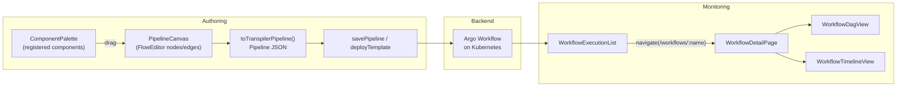
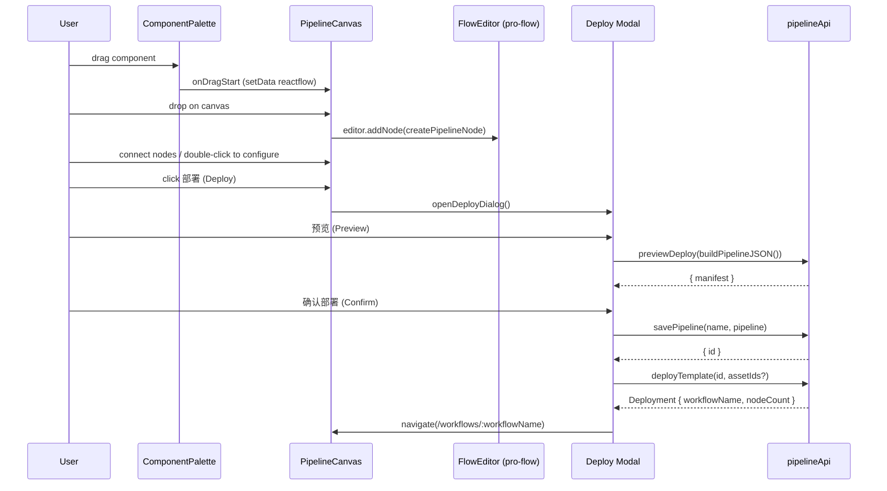
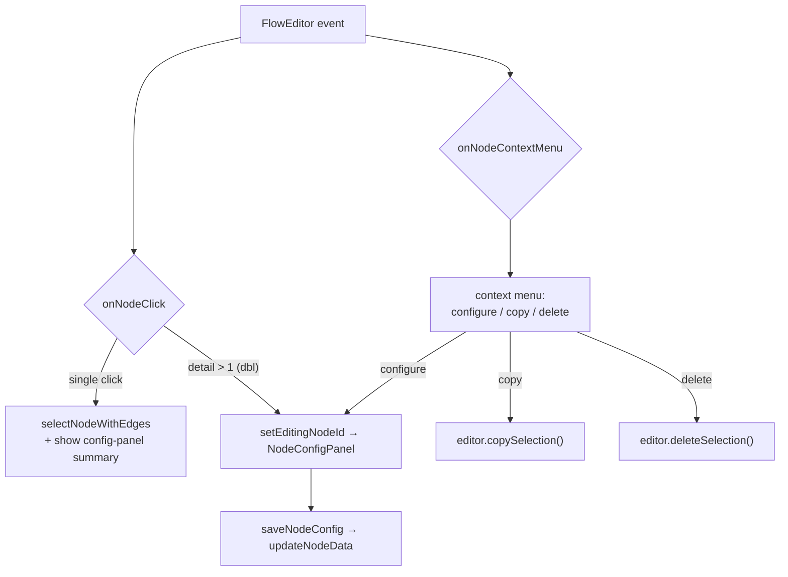
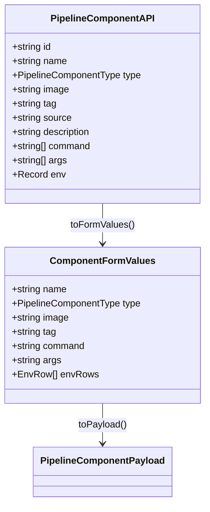
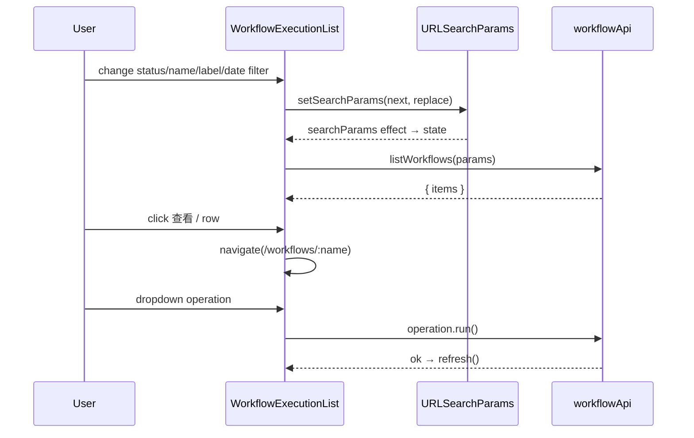
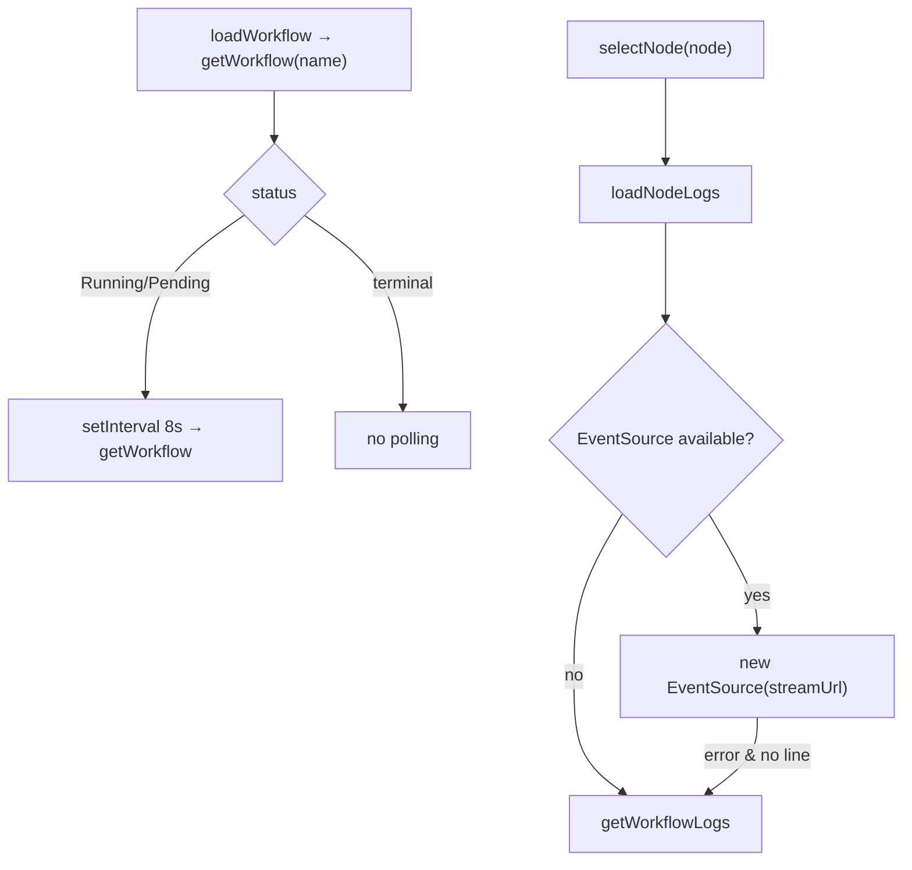
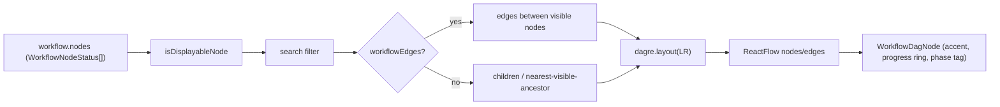
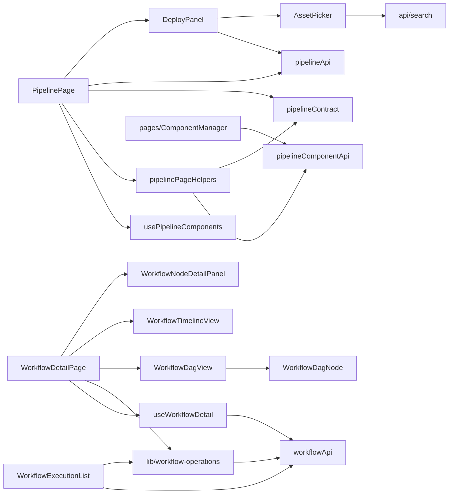

# Pipeline & Workflow Pages

<cite>
**Referenced Files in This Document**

- [Frontend/src/pages/PipelinePage.tsx](file://Frontend/src/pages/PipelinePage.tsx)
- [Frontend/src/pages/ComponentListPage.tsx](file://Frontend/src/pages/ComponentListPage.tsx)
- [Frontend/src/pages/ComponentManager.tsx](file://Frontend/src/pages/ComponentManager.tsx)
- [Frontend/src/pages/WorkflowListPage.tsx](file://Frontend/src/pages/WorkflowListPage.tsx)
- [Frontend/src/pages/WorkflowDetailPage.tsx](file://Frontend/src/pages/WorkflowDetailPage.tsx)
- [Frontend/src/pages/WorkflowDagView.tsx](file://Frontend/src/pages/WorkflowDagView.tsx)
- [Frontend/src/pages/WorkflowDagNode.tsx](file://Frontend/src/pages/WorkflowDagNode.tsx)
- [Frontend/src/pages/WorkflowTimelineView.tsx](file://Frontend/src/pages/WorkflowTimelineView.tsx)
- [Frontend/src/pages/WorkflowExecutionList.tsx](file://Frontend/src/pages/WorkflowExecutionList.tsx)
- [Frontend/src/pages/useWorkflowDetail.ts](file://Frontend/src/pages/useWorkflowDetail.ts)
- [Frontend/src/components/pipeline/AssetPicker.tsx](file://Frontend/src/components/pipeline/AssetPicker.tsx)
- [Frontend/src/components/pipeline/ComponentManager.tsx](file://Frontend/src/components/pipeline/ComponentManager.tsx)
- [Frontend/src/components/pipeline/ComponentPalette.tsx](file://Frontend/src/components/pipeline/ComponentPalette.tsx)
- [Frontend/src/components/pipeline/DeployPanel.tsx](file://Frontend/src/components/pipeline/DeployPanel.tsx)
- [Frontend/src/components/pipeline/NodeConfigPanel.tsx](file://Frontend/src/components/pipeline/NodeConfigPanel.tsx)
- [Frontend/src/components/pipeline/PipelineEmptyState.tsx](file://Frontend/src/components/pipeline/PipelineEmptyState.tsx)
- [Frontend/src/components/pipeline/PipelineNode.tsx](file://Frontend/src/components/pipeline/PipelineNode.tsx)
- [Frontend/src/components/pipeline/WorkflowNodeDetailPanel.tsx](file://Frontend/src/components/pipeline/WorkflowNodeDetailPanel.tsx)
- [Frontend/src/components/pipeline/WorkflowYamlViewer.tsx](file://Frontend/src/components/pipeline/WorkflowYamlViewer.tsx)
- [Frontend/src/components/pipeline/deployPanelUtils.ts](file://Frontend/src/components/pipeline/deployPanelUtils.ts)
- [Frontend/src/components/pipeline/types.ts](file://Frontend/src/components/pipeline/types.ts)
- [Frontend/src/pages/pipeline/pipelinePageHelpers.ts](file://Frontend/src/pages/pipeline/pipelinePageHelpers.ts)
- [Frontend/src/api/pipelineApi.ts](file://Frontend/src/api/pipelineApi.ts)
- [Frontend/src/api/pipelineComponentApi.ts](file://Frontend/src/api/pipelineComponentApi.ts)
- [Frontend/src/api/workflowApi.ts](file://Frontend/src/api/workflowApi.ts)
- [Frontend/src/lib/workflow-operations.ts](file://Frontend/src/lib/workflow-operations.ts)
</cite>

## Table of Contents
1. [Introduction](#introduction)
2. [Project Structure](#project-structure)
3. [Core Components](#core-components)
4. [Architecture Overview](#architecture-overview)
5. [Detailed Component Analysis](#detailed-component-analysis)
6. [Dependency Analysis](#dependency-analysis)
7. [Performance Considerations](#performance-considerations)
8. [Troubleshooting Guide](#troubleshooting-guide)
9. [Conclusion](#conclusion)
10. [Appendices](#appendices)

## Introduction

The Pipeline & Workflow pages form the visual authoring and execution-monitoring surface of the cyber-databrew Frontend. They let an operator build a data-processing pipeline by dragging reusable step components onto a canvas, wiring them into a directed graph, persisting that graph as a named template, deploying it to a Kubernetes cluster as an Argo Workflow, and then inspecting the resulting run through a DAG view, a timeline view, per-node detail panels, and live log streaming.

The area is organized around three top-level destinations:

- The **Pipeline builder** (`PipelinePage`) — a tabbed page whose primary tab is a drag-and-drop flow editor for designing and deploying pipelines, with secondary tabs for execution history and component management.
- The **Component registry** (`ComponentListPage` / `ComponentManager`) — a CRUD surface for the reusable step definitions (container, script, resource, suspend) that populate the builder's palette.
- The **Workflow list and detail** (`WorkflowListPage`, `WorkflowDetailPage`) — a filterable table of Argo Workflow runs and a per-run inspector that renders the run as either a DAG or a timeline, drives lifecycle operations (retry, resume, terminate, delete…), and streams node logs.

These pages are written in TypeScript with React, Ant Design (`antd`) for chrome, `@ant-design/pro-flow` for the design canvas, and `@xyflow/react` plus `dagre` for the read-only workflow DAG. The user-facing copy is in Chinese; this document describes the behavior in English.

**Section sources**
- [Frontend/src/pages/PipelinePage.tsx](file://Frontend/src/pages/PipelinePage.tsx#L1327-L1401)
- [Frontend/src/pages/WorkflowDetailPage.tsx](file://Frontend/src/pages/WorkflowDetailPage.tsx#L183-L199)
- [Frontend/src/pages/ComponentListPage.tsx](file://Frontend/src/pages/ComponentListPage.tsx#L1-L5)

## Project Structure

The feature splits cleanly into page-level containers under `Frontend/src/pages/` and presentational/building-block components under `Frontend/src/components/pipeline/`. API access lives in `Frontend/src/api/`, and cross-cutting helpers in `Frontend/src/lib/`.

```mermaid
graph TB
  subgraph Pages["pages/"]
    PP["PipelinePage.tsx<br/>tabbed builder shell + PipelineCanvas"]
    CLP["ComponentListPage.tsx"]
    CM_PAGE["ComponentManager.tsx<br/>(registry CRUD)"]
    WLP["WorkflowListPage.tsx"]
    WEL["WorkflowExecutionList.tsx"]
    WDP["WorkflowDetailPage.tsx"]
    WDV["WorkflowDagView.tsx"]
    WDN["WorkflowDagNode.tsx"]
    WTV["WorkflowTimelineView.tsx"]
    UWD["useWorkflowDetail.ts"]
    HELPERS["pipeline/pipelinePageHelpers.ts"]
  end
  subgraph Comp["components/pipeline/"]
    PAL["ComponentPalette.tsx"]
    NODE["PipelineNode.tsx"]
    NCP["NodeConfigPanel.tsx"]
    DEP["DeployPanel.tsx"]
    AP["AssetPicker.tsx"]
    WNDP["WorkflowNodeDetailPanel.tsx"]
    WYV["WorkflowYamlViewer.tsx"]
    EMPTY["PipelineEmptyState.tsx"]
    TYPES["types.ts"]
  end
  subgraph Api["api/ & lib/"]
    PAPI["pipelineApi.ts"]
    PCAPI["pipelineComponentApi.ts"]
    WAPI["workflowApi.ts"]
    WOPS["workflow-operations.ts"]
  end

  PP --> PAL & NODE & NCP & DEP & AP & EMPTY & HELPERS & WEL
  PP --> CM_PAGE
  CLP --> CM_PAGE
  WLP --> WEL
  WDP --> WDV & WTV & WNDP & UWD & WOPS
  WDV --> WDN
  DEP --> PAPI & AP
  CM_PAGE --> PCAPI
  WEL --> WAPI & WOPS
  UWD --> WAPI
```

**Diagram sources**
- [Frontend/src/pages/PipelinePage.tsx](file://Frontend/src/pages/PipelinePage.tsx#L41-L84)
- [Frontend/src/pages/WorkflowDetailPage.tsx](file://Frontend/src/pages/WorkflowDetailPage.tsx#L22-L36)
- [Frontend/src/components/pipeline/DeployPanel.tsx](file://Frontend/src/components/pipeline/DeployPanel.tsx#L23-L44)

**Section sources**
- [Frontend/src/pages/PipelinePage.tsx](file://Frontend/src/pages/PipelinePage.tsx#L1-L88)
- [Frontend/src/components/pipeline/types.ts](file://Frontend/src/components/pipeline/types.ts#L1-L84)

## Core Components

The page set is built from a handful of cooperating units:

- **`PipelinePage`** — the route container. It reads a `tab` search-param, resolves it to one of `design | executions | components`, and renders an Ant Design `Tabs` whose three panes are the design canvas, the `WorkflowExecutionList`, and the registry `ComponentManager`. Tab changes are written back to the URL with `replace: true`. The design pane wraps `PipelineCanvas` in a `FlowEditorProvider` and an `ErrorBoundary`.
- **`PipelineCanvas`** — the heart of the builder. It holds canvas state (`nodes`, `edges`, `pipelineName`, `selectedNode`, `editingNodeId`, deploy/import dialog state), wires drag-and-drop from the palette, context menus, node selection, save, export, import, preview, and deploy.
- **`ComponentManager`** (in `pages/`) — the registry table with create/edit/view modal, search, and delete with Popconfirm. It is reused both as the builder's "组件" tab and as the standalone `/components` route via `ComponentListPage`.
- **`WorkflowExecutionList`** — the run table with status summary cards, filters (status, name, label, date range), URL-synced filter state, pagination, and per-row operations.
- **`WorkflowDetailPage`** — the run inspector, switching between `WorkflowDagView` and `WorkflowTimelineView`, driving operations from `workflow-operations.ts`, and showing node detail + logs.

**Section sources**
- [Frontend/src/pages/PipelinePage.tsx](file://Frontend/src/pages/PipelinePage.tsx#L99-L151)
- [Frontend/src/pages/PipelinePage.tsx](file://Frontend/src/pages/PipelinePage.tsx#L1314-L1401)
- [Frontend/src/pages/ComponentManager.tsx](file://Frontend/src/pages/ComponentManager.tsx#L145-L264)
- [Frontend/src/pages/WorkflowExecutionList.tsx](file://Frontend/src/pages/WorkflowExecutionList.tsx#L120-L234)
- [Frontend/src/pages/WorkflowDetailPage.tsx](file://Frontend/src/pages/WorkflowDetailPage.tsx#L183-L233)

## Architecture Overview

The two halves of the feature — authoring and monitoring — meet at the deploy step. The builder converts its in-memory `nodes`/`edges` into a transpiler `Pipeline` contract, saves it as a template, and deploys it into an Argo Workflow; the monitoring pages then load that workflow by name through `workflowApi`.

The builder's drag/save/deploy sequence is the canonical authoring flow:

**Diagram sources**
- [Frontend/src/pages/PipelinePage.tsx](file://Frontend/src/pages/PipelinePage.tsx#L236-L269)
- [Frontend/src/pages/PipelinePage.tsx](file://Frontend/src/pages/PipelinePage.tsx#L598-L647)
- [Frontend/src/pages/PipelinePage.tsx](file://Frontend/src/pages/PipelinePage.tsx#L1252-L1294)
- [Frontend/src/api/pipelineApi.ts](file://Frontend/src/api/pipelineApi.ts#L24-L60)

**Section sources**
- [Frontend/src/pages/PipelinePage.tsx](file://Frontend/src/pages/PipelinePage.tsx#L413-L416)
- [Frontend/src/pages/pipeline/pipelinePageHelpers.ts](file://Frontend/src/pages/pipeline/pipelinePageHelpers.ts#L247-L271)

## Detailed Component Analysis

### Pipeline Builder Canvas

`PipelineCanvas` renders a three-zone layout inside `.pipeline-body`: a left `ComponentPalette`, a center `canvas-wrapper` hosting `FlowEditor`, and a right `config-panel` aside. The flow editor is configured with a single custom node type, `pipelineStep`, mapped to `PipelineStepNode`.

#### Loading and importing a pipeline

The canvas can be seeded three ways:

- **Template id** — when `?templateId=` is present, `getPipeline(templateId)` is fetched and `loadPipelineToCanvas` converts it via `fromTranspilerPipeline`. On failure it shows an error and falls back to session storage.
- **Session storage** — `DeployPanel.handleEditTemplate` writes `pipeline-edit` into `sessionStorage` before navigating to `/pipeline`; `loadPipelineFromSessionStorage` reads and removes it.
- **Import modal** — paste raw Pipeline JSON; `applyImportedPipeline` parses it, runs `fromTranspilerPipeline`, and replaces the canvas.

`loadPipelineToCanvas` resets selection, clears the editing node, sets the pipeline name, deselects all editor elements, and clears any prior JSON output.

#### Drag-and-drop and node creation

`onDragStart` (raised by the palette) serializes a `RegisteredComponent` into the `application/reactflow` drag payload. On `onDrop`, the canvas converts screen coordinates to flow coordinates via `editor.screenToFlowPosition`, builds a node with `createPipelineNode`, adds it with `editor.addNode`, and selects it. `createPipelineNode` assigns a monotonically increasing `step-N` id and copies the component's image, command, args, env, and resource fields into `PipelineNodeData`.

#### Selection, context menu, and node config

Clicking a node calls `selectNodeWithEdges`, which selects the node plus its connected edge ids. A double-click (`event.detail > 1`) opens the per-node config. The custom right-click menu is rendered manually (pro-flow's built-in `contextMenuEnabled` is `false`); node menus offer configure/copy/delete and pane menus offer paste/select-all/zoom/fit-view. The `NodeConfigPanel` modal edits label, command (tag input), args (tag input), env key/value rows, and CPU/memory/disk; for `script`-type nodes it additionally exposes a `source` textarea. On submit it maps args back into `Argument` objects and calls `updateNodeData` through `saveNodeConfig`.

#### Save, export, preview, deploy

`buildPipelineJSON` memoizes `toTranspilerPipeline(nodes, edges, { name })`. `handleSave` calls `savePipeline` and bumps a `templateRefreshKey` so the sidebar `DeployPanel` refreshes. The deploy modal has two modes: `edit` (name input, node/edge counts, an optional collapsible `AssetPicker` for binding assets) and `preview` (a dry-run manifest fetched by `previewDeploy`). `handleDeploy` saves the pipeline, then `deployTemplate(savedId, assetIds?)`, and on success shows the resulting `workflowName`, node count, an optional "view related asset" link, and buttons to navigate to the workflow or the saved-records drawer. Keyboard shortcuts (save / deploy / clear / close-modal) are bound through `usePipelineKeyboardShortcuts`.

**Section sources**
- [Frontend/src/pages/PipelinePage.tsx](file://Frontend/src/pages/PipelinePage.tsx#L184-L234)
- [Frontend/src/pages/PipelinePage.tsx](file://Frontend/src/pages/PipelinePage.tsx#L271-L411)
- [Frontend/src/pages/PipelinePage.tsx](file://Frontend/src/pages/PipelinePage.tsx#L480-L596)
- [Frontend/src/components/pipeline/NodeConfigPanel.tsx](file://Frontend/src/components/pipeline/NodeConfigPanel.tsx#L52-L196)
- [Frontend/src/components/pipeline/PipelineNode.tsx](file://Frontend/src/components/pipeline/PipelineNode.tsx#L10-L39)

### Component Palette and Empty States

`ComponentPalette` is a presentational aside that lists `RegisteredComponent` entries as draggable buttons (label + image), shows a count badge, a loading spinner, and a warning alert with a retry action on load failure. When the registry is empty it renders a `PipelineEmptyState` (variant `palette`) linking to `/components`. The components themselves are fetched and adapted by `usePipelineComponents`, with `apiToRegistered` mapping the API shape into `RegisteredComponent` and `dedupeComponentsByName` removing case-insensitive name duplicates. `PipelineEmptyState` is a shared component covering four variants — `canvas`, `config`, `deploy`, `palette` — each mapped to a CSS class, optionally rendering a title, description, hint, and link action.

**Section sources**
- [Frontend/src/components/pipeline/ComponentPalette.tsx](file://Frontend/src/components/pipeline/ComponentPalette.tsx#L14-L76)
- [Frontend/src/components/pipeline/PipelineEmptyState.tsx](file://Frontend/src/components/pipeline/PipelineEmptyState.tsx#L29-L55)
- [Frontend/src/pages/pipeline/pipelinePageHelpers.ts](file://Frontend/src/pages/pipeline/pipelinePageHelpers.ts#L198-L243)

### Deploy Panel (saved templates & run history)

`DeployPanel` renders saved pipeline templates and the deployment run history. It supports three variants resolved from props: `sidebar` (compact list of up to `SIDEBAR_TEMPLATE_LIMIT` templates with a "view all" footer), `compact` (recent deployments + up to `COMPACT_TEMPLATE_LIMIT` templates), and `full` (templates with "load more" pagination plus a "运行历史" section). On mount and on `refresh`, it loads `listDeployments()` and `listPipelines()` in parallel. Templates are de-duplicated by name keeping the newest (`dedupeTemplatesByName`), and deployments are sorted newest-first (`prepareDeployments`).

Each `TemplateCard` offers run (`deployTemplate`), "select assets to run" (opens an `AssetPicker` modal), edit (loads the template into the canvas via `onEditTemplate`, or stashes it in session storage and navigates to `/pipeline`), and delete. Deployment cards show a status `Tag`, node count, timestamps, an optional "view related asset" button (asset id extracted from `pipelineJSON`), a retry button for `Failed`/`Error` runs, a "view" link to `/workflows/:workflowName`, and a delete button.

**Section sources**
- [Frontend/src/components/pipeline/DeployPanel.tsx](file://Frontend/src/components/pipeline/DeployPanel.tsx#L205-L347)
- [Frontend/src/components/pipeline/DeployPanel.tsx](file://Frontend/src/components/pipeline/DeployPanel.tsx#L377-L497)
- [Frontend/src/components/pipeline/DeployPanel.tsx](file://Frontend/src/components/pipeline/DeployPanel.tsx#L586-L645)
- [Frontend/src/components/pipeline/deployPanelUtils.ts](file://Frontend/src/components/pipeline/deployPanelUtils.ts#L3-L35)

### Asset Picker

`AssetPicker` is a shared, controlled search-and-multi-select table used by both the deploy modal and the `DeployPanel` asset modal. It debounces nothing itself but aborts in-flight searches via an `AbortController` ref, calling `searchApi.searchAssets({ q, page_size: 50 })`. Results render in a checkbox `Table` whose `selectedRowKeys` are the controlled `selectedIds`; selection changes propagate through `onSelectionChange`. It distinguishes abort errors from real failures and surfaces a retry button on error.

**Section sources**
- [Frontend/src/components/pipeline/AssetPicker.tsx](file://Frontend/src/components/pipeline/AssetPicker.tsx#L20-L144)

### Component Registry (ComponentManager)

The registry `ComponentManager` (under `pages/`) is the production CRUD surface for step definitions. `ComponentListPage` simply renders it at the `/components` route, and `PipelinePage`'s "组件" tab embeds the same component. It loads `listComponents()`, de-duplicates by name, and filters client-side across name/image/description/type. The table columns cover name + id, a colored type `Tag` (container/script/resource/suspend), formatted image (`formatComponentImage`), description, source (`system` shown in gold), created/updated timestamps, and a per-row action group (view / edit / delete). System-sourced components are protected: their delete button is disabled with an explanatory tooltip.

The create/edit/view modal is form-driven. `toFormValues` seeds the form from an existing component (joining command/args lists into comma strings and expanding the env map into rows); `toPayload` reverses it (splitting on newlines/commas, building the env map, and attaching default `inputPorts`/`outputPorts` of type `asset` plus a `resources` block). Save calls `updateComponent` or `createComponent` and refreshes. View mode disables all inputs and shows only a close button.

A second, simpler `ComponentManager` exists under `components/pipeline/` driven entirely by props (`onChange`, `onSaveApi`, `onDeleteApi`) and grouping components by type label via a collapse. It is a lighter, parent-controlled variant of the same idea.

**Diagram sources**
- [Frontend/src/pages/ComponentManager.tsx](file://Frontend/src/pages/ComponentManager.tsx#L45-L143)
- [Frontend/src/api/pipelineComponentApi.ts](file://Frontend/src/api/pipelineComponentApi.ts#L15-L61)

**Section sources**
- [Frontend/src/pages/ComponentManager.tsx](file://Frontend/src/pages/ComponentManager.tsx#L145-L388)
- [Frontend/src/pages/ComponentManager.tsx](file://Frontend/src/pages/ComponentManager.tsx#L457-L613)
- [Frontend/src/components/pipeline/ComponentManager.tsx](file://Frontend/src/components/pipeline/ComponentManager.tsx#L55-L215)
- [Frontend/src/pages/ComponentListPage.tsx](file://Frontend/src/pages/ComponentListPage.tsx#L1-L5)

### Workflow Execution List

`WorkflowExecutionList` is the run table. It is used full-bleed by `WorkflowListPage` (`/workflows`) and as the "执行记录" tab of the builder; the `active` prop lets the tabbed usage defer fetching until its pane is shown. Filter state (status, name, labels, date range) is initialized from and synchronized to the URL search params in both directions, with the name search additionally debounced by 300ms into `debouncedNameSearch`. `refresh` builds a `ListWorkflowsParams` and calls `listWorkflows`. Status summary cards across the top count items per `WORKFLOW_PHASES` phase with accent colors and icons. Each row offers a "view" link to the detail page and a `More` dropdown whose items come from `getWorkflowOperationMenuItems`; destructive operations (delete/terminate) are confirmed via `Modal.confirm`. Errors are classified into network vs. service-unavailable by `describeWorkflowError`.

**Diagram sources**
- [Frontend/src/pages/WorkflowExecutionList.tsx](file://Frontend/src/pages/WorkflowExecutionList.tsx#L186-L325)
- [Frontend/src/api/workflowApi.ts](file://Frontend/src/api/workflowApi.ts#L79-L95)

**Section sources**
- [Frontend/src/pages/WorkflowExecutionList.tsx](file://Frontend/src/pages/WorkflowExecutionList.tsx#L120-L325)
- [Frontend/src/pages/WorkflowExecutionList.tsx](file://Frontend/src/pages/WorkflowExecutionList.tsx#L327-L452)
- [Frontend/src/pages/WorkflowListPage.tsx](file://Frontend/src/pages/WorkflowListPage.tsx#L1-L9)

### Workflow Detail Page

`WorkflowDetailPage` reads the `:name` route param and drives everything through `useWorkflowDetail`. The header shows the workflow name, a status `Tag`, any error message, created/finished timestamps with a `DurationPanel`, the available lifecycle operation buttons (`getAvailableWorkflowOperationConfigs`), and a `Segmented` control toggling `dag`/`timeline`. The body renders either `WorkflowDagView` or `WorkflowTimelineView`, both fed `workflow.nodes` and the selection callbacks. Selecting a node opens the `WorkflowNodeDetailPanel` drawer; a "日志" action opens a full-width `Modal` hosting `WorkflowLogPanel` with keyword highlighting (ANSI-aware via `ansi-to-react`).

`useWorkflowDetail` owns loading, polling, selection, and log streaming. It loads via `getWorkflow(name)`, classifies 404 into `not_found`, and polls every 8s while the workflow is `Running` or `Pending`. Node logs prefer an SSE `EventSource` stream (`getWorkflowLogStreamUrl`); if `EventSource` is unavailable, or the stream errors before any line arrives, it falls back to the one-shot `getWorkflowLogs` API. Selecting `null` (pane click / drawer close) stops the stream and clears log state.

**Diagram sources**
- [Frontend/src/pages/useWorkflowDetail.ts](file://Frontend/src/pages/useWorkflowDetail.ts#L68-L106)
- [Frontend/src/pages/useWorkflowDetail.ts](file://Frontend/src/pages/useWorkflowDetail.ts#L143-L215)

**Section sources**
- [Frontend/src/pages/WorkflowDetailPage.tsx](file://Frontend/src/pages/WorkflowDetailPage.tsx#L183-L475)
- [Frontend/src/pages/WorkflowDetailPage.tsx](file://Frontend/src/pages/WorkflowDetailPage.tsx#L69-L181)
- [Frontend/src/components/pipeline/WorkflowNodeDetailPanel.tsx](file://Frontend/src/components/pipeline/WorkflowNodeDetailPanel.tsx#L353-L427)

### Workflow DAG View

`WorkflowDagView` renders the run as a read-only, auto-laid-out graph using `@xyflow/react` and `dagre`. Only "displayable" nodes survive `isDisplayableNode` — pod/template nodes, or nodes with a `Skipped`/`Omitted` phase, excluding the synthetic root DAG node. `buildDagElements` filters by an optional search term, builds edges either from the API-provided `workflowEdges` (when present, only between visible nodes) or by walking each node's `children`/parent chain via `getNearestVisibleAncestorId`, then lays the graph out left-to-right with `dagre` (`rankdir LR`, fixed node width/height, configured separations). Each node is positioned by its dagre center offset and carries `selected`/`dimmed`/`progressPercent` data into `WorkflowDagNode`. A `FitViewOnGraphChange` helper re-fits the view whenever the graph key (sorted node/edge ids + search) changes. A toolbar exposes a node search and a step count; an empty card appears when there are no displayable nodes.

`WorkflowDagNode` is the custom node renderer: an accent bar colored by phase, a title (via `getWorkflowNodeDisplayText`), an optional SVG progress ring (parsed from a `"done/total"` progress string), a phase `Tag`, and a relative time tooltip. `selected`/`dimmed`/`running` toggle CSS modifier classes.

**Diagram sources**
- [Frontend/src/pages/WorkflowDagView.tsx](file://Frontend/src/pages/WorkflowDagView.tsx#L104-L242)
- [Frontend/src/pages/WorkflowDagNode.tsx](file://Frontend/src/pages/WorkflowDagNode.tsx#L82-L164)

**Section sources**
- [Frontend/src/pages/WorkflowDagView.tsx](file://Frontend/src/pages/WorkflowDagView.tsx#L30-L98)
- [Frontend/src/pages/WorkflowDagView.tsx](file://Frontend/src/pages/WorkflowDagView.tsx#L244-L394)

### Workflow Timeline View

`WorkflowTimelineView` reuses `filterDisplayableWorkflowNodes` from the DAG view, keeps nodes that have a `startedAt`, and sorts by start time (breaking ties on a parsed `step-N` index). Each item is normalized to a `start`/`end` window (open-ended nodes end at `Date.now()`). It computes a global start/end range and lays out horizontal bars positioned and sized as percentages of that range, colored by `PHASE_COLORS`, each labeled with its duration in seconds. Rows are keyboard-accessible buttons (Enter/Space select); a header track shows five time ticks. An empty message appears when no node has timing data.

**Section sources**
- [Frontend/src/pages/WorkflowTimelineView.tsx](file://Frontend/src/pages/WorkflowTimelineView.tsx#L25-L148)

### Workflow Node Detail Panel & YAML Viewer

`WorkflowNodeDetailPanel` is a right-side `Drawer` with three card-style tabs: **概览** (a `Descriptions` block of name, id, pod name, host node, type, phase, timestamps, duration, owning workflow, progress, memoization, resource durations, and message), **容器** (a container spec table, with an `Empty` fallback when the API returns none), and **输入/输出** (parameter and artifact tables plus result/exit-code cards). The drawer's `extra` slot holds a primary "日志" button and, when the workflow is retryable, a "重试工作流" button. `WorkflowYamlViewer` is a separate `Modal` that pretty-prints a node's raw object as syntax-colored JSON via a recursive `formatJsonValue`.

**Section sources**
- [Frontend/src/components/pipeline/WorkflowNodeDetailPanel.tsx](file://Frontend/src/components/pipeline/WorkflowNodeDetailPanel.tsx#L132-L351)
- [Frontend/src/components/pipeline/WorkflowYamlViewer.tsx](file://Frontend/src/components/pipeline/WorkflowYamlViewer.tsx#L20-L154)

## Dependency Analysis

Key contracts the area depends on:

- **`pipelineApi`** — `previewDeploy`, `listPipelines`, `getPipeline`, `savePipeline`, `deletePipeline`, `deployTemplate`, `listDeployments`, `deleteDeployment`, `retryDeployment`, plus the `PipelineTemplate` and `Deployment` types.
- **`pipelineComponentApi`** — `listComponents`, `createComponent`, `updateComponent`, `deleteComponent`, and the `PipelineComponentAPI`/`PipelineComponentPayload`/`PipelineComponentType` types.
- **`workflowApi`** — `listWorkflows`, `getWorkflow`, `getWorkflowLogs`, `getWorkflowLogStreamUrl`, the lifecycle mutators, and the `WorkflowSummary`/`WorkflowDetail`/`WorkflowNodeStatus`/`WorkflowDagEdge` types.
- **`workflow-operations`** — the `WorkflowOperationKey` union, the operation registry, ordering, enablement predicate, and the config/menu-item builders that both the list and the detail page consume.
- **`pipelineContract`** — `toTranspilerPipeline`/`fromTranspilerPipeline`/`normalizeComponentArgs`, the bridge between canvas state and the persisted contract.

**Diagram sources**
- [Frontend/src/pages/PipelinePage.tsx](file://Frontend/src/pages/PipelinePage.tsx#L41-L84)
- [Frontend/src/pages/WorkflowDetailPage.tsx](file://Frontend/src/pages/WorkflowDetailPage.tsx#L22-L36)
- [Frontend/src/lib/workflow-operations.ts](file://Frontend/src/lib/workflow-operations.ts#L121-L158)

**Section sources**
- [Frontend/src/api/pipelineApi.ts](file://Frontend/src/api/pipelineApi.ts#L4-L73)
- [Frontend/src/api/pipelineComponentApi.ts](file://Frontend/src/api/pipelineComponentApi.ts#L62-L101)
- [Frontend/src/api/workflowApi.ts](file://Frontend/src/api/workflowApi.ts#L79-L164)

## Performance Considerations

- **Deferred fetch in tabs.** `WorkflowExecutionList` receives `active` so the builder's executions tab does not fetch until shown, and refreshes on each activation.
- **Polling only when active.** `useWorkflowDetail` polls `getWorkflow` every 8s only while the run is `Running`/`Pending`, and clears the interval otherwise, avoiding wasted requests on terminal runs.
- **SSE with graceful fallback.** Node logs stream incrementally via `EventSource` and only fall back to a full fetch when streaming is unavailable or fails before the first line, keeping memory and latency low for long logs.
- **Aborted asset searches.** `AssetPicker` aborts the previous request before issuing a new one, preventing out-of-order result flicker.
- **Debounced name search.** `WorkflowExecutionList` debounces the name filter (300ms) before triggering a fetch.
- **Memoized layout & graph key.** `WorkflowDagView` recomputes the dagre layout only when raw nodes, edges, selection, or search change, and the memoized `graphKey` gates the fit-view animation. `FlowEditor` is configured with `onlyRenderVisibleElements` to skip off-screen nodes.
- **Client-side de-dup & pagination.** Templates are de-duplicated by name and the full `DeployPanel` paginates templates/deployments with "load more" rather than rendering everything; the registry table paginates at 12 rows.

**Section sources**
- [Frontend/src/pages/useWorkflowDetail.ts](file://Frontend/src/pages/useWorkflowDetail.ts#L43-L44)
- [Frontend/src/pages/useWorkflowDetail.ts](file://Frontend/src/pages/useWorkflowDetail.ts#L89-L106)
- [Frontend/src/pages/WorkflowExecutionList.tsx](file://Frontend/src/pages/WorkflowExecutionList.tsx#L242-L248)
- [Frontend/src/pages/WorkflowDagView.tsx](file://Frontend/src/pages/WorkflowDagView.tsx#L284-L321)
- [Frontend/src/components/pipeline/AssetPicker.tsx](file://Frontend/src/components/pipeline/AssetPicker.tsx#L46-L72)

## Troubleshooting Guide

- **Deploy button is disabled.** The canvas is empty; `canDeploy` is `nodes.length > 0`. Drag in at least one component or import a Pipeline JSON with nodes. The deploy modal also shows a warning alert when empty.
- **Template fails to load.** `getPipeline(templateId)` errors trigger a message and a fallback to session storage; check the `templateId` param and that the template still exists via `listPipelines`.
- **Import "invalid JSON".** `applyImportedPipeline` requires parseable Pipeline JSON; an empty/invalid body warns "请粘贴 Pipeline JSON" or "无效的 JSON".
- **Palette is empty.** No registered components were returned; the palette shows an empty state linking to `/components`. Use the registry to create components, then retry.
- **Workflow not found.** `useWorkflowDetail` maps a 404 to `not_found`, and the detail page renders "未找到工作流"; other errors render an alert with a retry button.
- **DAG shows "no displayable nodes".** All nodes were filtered by `isDisplayableNode` (e.g. the run failed before any pod started, or steps are hidden/omitted); the empty card surfaces `workflow.message` when present.
- **Logs do not appear.** If SSE is unsupported or the stream errors before the first line, the hook falls back to `getWorkflowLogs`; persistent "获取日志失败" indicates a backend/log-availability issue for that node.
- **System component cannot be deleted.** Components with `source === "system"` have delete disabled by design, with a tooltip explaining "系统来源组件禁止删除".

**Section sources**
- [Frontend/src/pages/PipelinePage.tsx](file://Frontend/src/pages/PipelinePage.tsx#L548-L563)
- [Frontend/src/pages/PipelinePage.tsx](file://Frontend/src/pages/PipelinePage.tsx#L490-L518)
- [Frontend/src/pages/WorkflowDetailPage.tsx](file://Frontend/src/pages/WorkflowDetailPage.tsx#L300-L320)
- [Frontend/src/pages/WorkflowDagView.tsx](file://Frontend/src/pages/WorkflowDagView.tsx#L368-L380)
- [Frontend/src/pages/ComponentManager.tsx](file://Frontend/src/pages/ComponentManager.tsx#L348-L386)

## Conclusion

The Pipeline & Workflow pages give cyber-databrew a complete authoring-to-monitoring loop. `PipelinePage` hosts a drag-and-drop builder that converts a visual graph into a transpiler `Pipeline` contract and deploys it as an Argo Workflow; the `ComponentManager` registry feeds reusable steps into the builder's palette; and the `WorkflowExecutionList` plus `WorkflowDetailPage` (with its DAG, timeline, node-detail, and log-streaming views) close the loop by surfacing run state. The design favors URL-synced filters, deferred and polled fetching, abortable searches, and graceful log-stream fallback, keeping the experience responsive while remaining a thin client over `pipelineApi`, `pipelineComponentApi`, and `workflowApi`.

## Appendices

### Pipeline builder URL parameters

| Param | Page | Effect |
| --- | --- | --- |
| `tab` | `PipelinePage` | Selects `design` (default), `executions`, or `components`. |
| `templateId` | `PipelineCanvas` | Loads a saved template into the canvas on mount. |
| `asset_ids` | `PipelineCanvas` | Pre-seeds the deploy modal's selected asset ids (comma-separated). |
| `status`, `name`, `label`, `createdAfter`, `finishedBefore` | `WorkflowExecutionList` | Filter state synced to/from the URL. |

**Section sources**
- [Frontend/src/pages/PipelinePage.tsx](file://Frontend/src/pages/PipelinePage.tsx#L1316-L1344)
- [Frontend/src/pages/PipelinePage.tsx](file://Frontend/src/pages/PipelinePage.tsx#L105-L133)
- [Frontend/src/pages/WorkflowExecutionList.tsx](file://Frontend/src/pages/WorkflowExecutionList.tsx#L128-L211)

### Component types

| Value | Label | Tag color |
| --- | --- | --- |
| `container` | Container | blue |
| `script` | Script | purple |
| `resource` | Resource | green |
| `suspend` | Suspend | orange |

**Section sources**
- [Frontend/src/pages/ComponentManager.tsx](file://Frontend/src/pages/ComponentManager.tsx#L56-L68)
- [Frontend/src/api/pipelineComponentApi.ts](file://Frontend/src/api/pipelineComponentApi.ts#L15-L21)

### Core data contracts

| Type | Source | Role |
| --- | --- | --- |
| `Pipeline` / `PipelineNodeDef` / `PipelineEdgeDef` | `components/pipeline/types.ts` | Persisted transpiler contract built by `toTranspilerPipeline`. |
| `RegisteredComponent` / `PipelineNodeData` | `components/pipeline/types.ts` | Palette item and canvas-node data shapes. |
| `PipelineTemplate` / `Deployment` | `api/pipelineApi.ts` | Saved template and deployment run records. |
| `WorkflowSummary` / `WorkflowDetail` / `WorkflowNodeStatus` / `WorkflowDagEdge` | `api/workflowApi.ts` | Run list rows, run detail, per-node status, and DAG edges. |
| `WorkflowOperationConfig` / `WorkflowOperationKey` | `lib/workflow-operations.ts` | Lifecycle operation definitions and keys. |

**Section sources**
- [Frontend/src/components/pipeline/types.ts](file://Frontend/src/components/pipeline/types.ts#L1-L84)
- [Frontend/src/api/pipelineApi.ts](file://Frontend/src/api/pipelineApi.ts#L4-L22)
- [Frontend/src/api/workflowApi.ts](file://Frontend/src/api/workflowApi.ts#L3-L73)
- [Frontend/src/lib/workflow-operations.ts](file://Frontend/src/lib/workflow-operations.ts#L25-L51)
