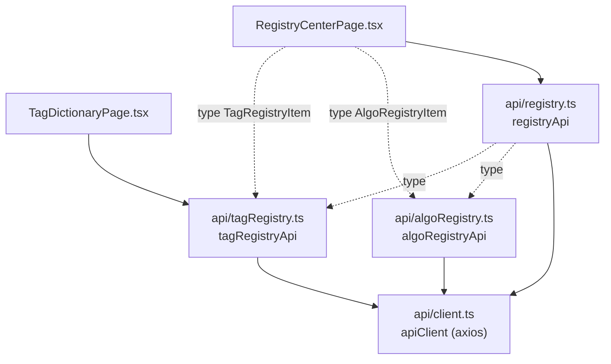
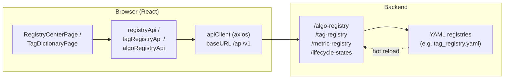
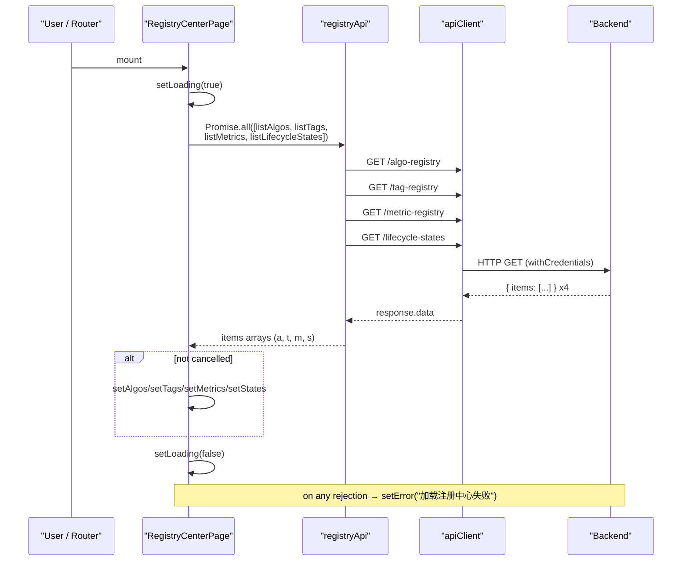
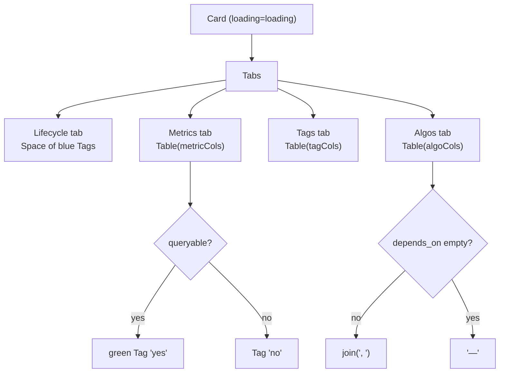
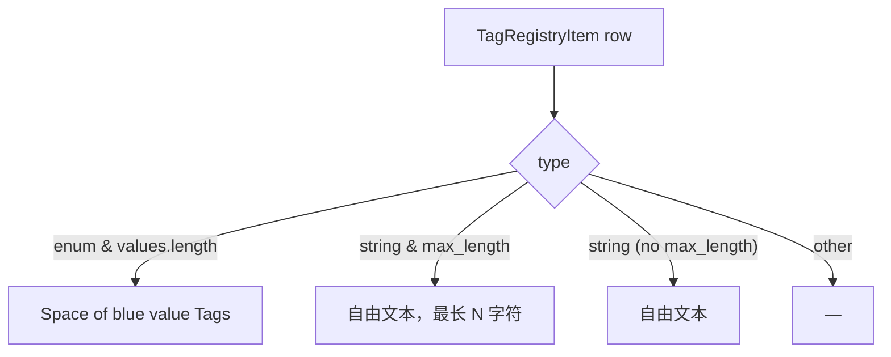
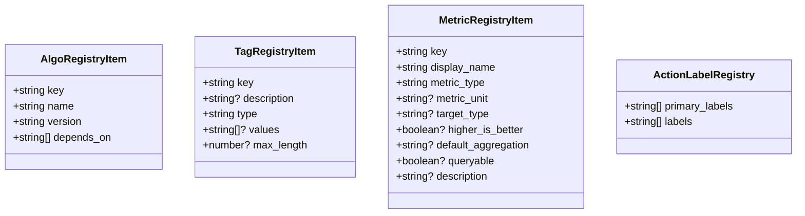
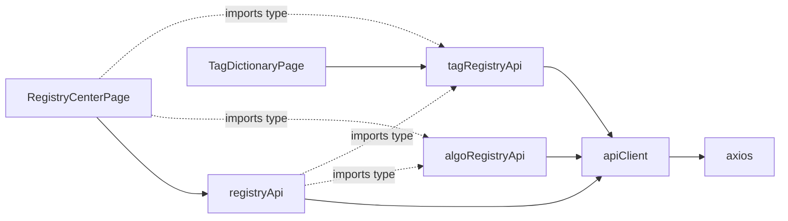

# Registry & Tag Pages

<cite>
**Referenced Files in This Document**

- [Frontend/src/pages/RegistryCenterPage.tsx](file://Frontend/src/pages/RegistryCenterPage.tsx)
- [Frontend/src/pages/TagDictionaryPage.tsx](file://Frontend/src/pages/TagDictionaryPage.tsx)
- [Frontend/src/api/registry.ts](file://Frontend/src/api/registry.ts)
- [Frontend/src/api/tagRegistry.ts](file://Frontend/src/api/tagRegistry.ts)
- [Frontend/src/api/algoRegistry.ts](file://Frontend/src/api/algoRegistry.ts)
- [Frontend/src/api/client.ts](file://Frontend/src/api/client.ts)
</cite>

## Table of Contents
1. [Introduction](#introduction)
2. [Project Structure](#project-structure)
3. [Core Components](#core-components)
4. [Architecture Overview](#architecture-overview)
5. [Detailed Component Analysis](#detailed-component-analysis)
6. [Dependency Analysis](#dependency-analysis)
7. [Performance Considerations](#performance-considerations)
8. [Troubleshooting Guide](#troubleshooting-guide)
9. [Conclusion](#conclusion)
10. [Appendices](#appendices)

## Introduction

The Registry & Tag pages are the read-only "reference desk" of the cyber-databrew
front end. They surface the YAML-backed registries that govern the platform's data
model and business vocabulary: the **algorithm registry** (`algo`), the **tag
registry** (`tag`), the **metric registry** (`metric`), and the **lifecycle state**
set. These registries are the single source of truth ("口径来源") shared across the
API, CDC pipelines, search, and the UI. Rather than letting each subsystem hard-code
field names or enum values, the backend loads a set of YAML definition files (for
example `tag_registry.yaml`) and exposes them over HTTP so that any consumer — most
visibly these two pages — can show users exactly which keys, types, and enumerated
values are legal.

Two pages cover this area:

- **`RegistryCenterPage`** (`注册中心`, "Registry Center") aggregates all four
  registries into a single tabbed card. It is the operator-facing overview that
  answers "what algorithms, tags, metrics, and lifecycle states does this platform
  currently know about?"
- **`TagDictionaryPage`** (`标签字典`, "Tag Dictionary") is a focused, searchable view
  of just the tag registry. It exists so that data engineers and analysts can quickly
  look up an allowed tag `key`, its `type`, and the set of permitted enum values or
  free-text constraints before they author or query tagged data.

Both pages are deliberately **read-only**. As the Tag Dictionary alert states, the
data comes from `tag_registry.yaml` and stays consistent with the backend's
validation logic; the registry supports server-side hot reload, so changing a
definition means editing the repository YAML and redeploying — never editing through
the UI.

**Section sources**
- [Frontend/src/pages/RegistryCenterPage.tsx](file://Frontend/src/pages/RegistryCenterPage.tsx#L80-L161)
- [Frontend/src/pages/TagDictionaryPage.tsx](file://Frontend/src/pages/TagDictionaryPage.tsx#L95-L135)

## Project Structure

This area spans two layers of the `Frontend/src` tree: the page components under
`pages/` and the thin typed API wrappers under `api/`.

- **Pages**
  - `pages/RegistryCenterPage.tsx` — the four-registry tabbed overview. It imports
    types from all three registry API modules and calls four endpoints through
    `registryApi`.
  - `pages/TagDictionaryPage.tsx` — the tag-only searchable table. It imports only
    the tag types and `tagRegistryApi`.
- **API modules** (all built on the shared `apiClient` axios instance)
  - `api/registry.ts` — the aggregate `registryApi` object exposing `listAlgos`,
    `listTags`, `listMetrics`, `listLifecycleStates`, and `getActionLabelRegistry`.
    It also defines the `MetricRegistryItem` and `ActionLabelRegistry` interfaces.
  - `api/tagRegistry.ts` — the `TagRegistryItem` interface and the single-purpose
    `tagRegistryApi.list()` helper.
  - `api/algoRegistry.ts` — the `AlgoRegistryItem` interface and the
    `algoRegistryApi.list()` helper.
  - `api/client.ts` — the shared axios client (`baseURL: /api/v1`, credentialed
    requests, 401 → global unauthorized event).

The dependency direction is strictly one-way: pages depend on the API modules, the
API modules depend on `client.ts`, and `client.ts` depends only on `axios`.



**Diagram sources**
- [Frontend/src/pages/RegistryCenterPage.tsx](file://Frontend/src/pages/RegistryCenterPage.tsx#L1-L6)
- [Frontend/src/pages/TagDictionaryPage.tsx](file://Frontend/src/pages/TagDictionaryPage.tsx#L1-L5)
- [Frontend/src/api/registry.ts](file://Frontend/src/api/registry.ts#L1-L47)
- [Frontend/src/api/tagRegistry.ts](file://Frontend/src/api/tagRegistry.ts#L1-L20)
- [Frontend/src/api/algoRegistry.ts](file://Frontend/src/api/algoRegistry.ts#L1-L19)

**Section sources**
- [Frontend/src/pages/RegistryCenterPage.tsx](file://Frontend/src/pages/RegistryCenterPage.tsx#L1-L6)
- [Frontend/src/api/registry.ts](file://Frontend/src/api/registry.ts#L1-L47)

## Core Components

The area is built from a small number of well-defined pieces: two page components,
three API wrappers, and a set of TypeScript interfaces that mirror the registry YAML
schema.

#### `RegistryCenterPage`

A default-exported React function component. It holds five pieces of state — `algos`,
`tags`, `metrics`, `states`, plus `loading` and `error` — and loads them all in a
single `useEffect` that fires once on mount. The four registry calls are issued
concurrently with `Promise.all`, and the results are written into state only if the
effect has not been cancelled. The body renders an info `Alert` describing the page's
role, an optional error `Alert`, and a `Card` whose `loading` prop is driven by the
fetch state. Inside the card a `Tabs` component holds four tabs — Lifecycle, Metrics,
Tags, Algos — each labelled with a live count.

#### `TagDictionaryPage`

A default-exported React function component focused on the tag registry. It holds
`items`, `loading`, `error`, and a query string `q`. On mount it calls
`tagRegistryApi.list()`; client-side filtering of the loaded items is derived with
`useMemo` against the lower-cased query, matching on `key`, `description`, `type`, or
any enum `value`. The table renders the `key` as inline code, the description, a
type `Tag`, and a computed "allowed values / constraint" column.

#### API wrappers and interfaces

`registryApi` (in `registry.ts`) is the aggregate object the Registry Center uses; it
maps each registry to a `GET` against `/algo-registry`, `/tag-registry`,
`/metric-registry`, `/lifecycle-states`, and `/action-label-registry`, unwrapping the
`{ items: ... }` envelope in each case. `tagRegistryApi.list()` and
`algoRegistryApi.list()` are single-method modules that do the same for the tag and
algo registries respectively. The interfaces `AlgoRegistryItem`, `TagRegistryItem`,
and `MetricRegistryItem` define the row shapes both pages render.

**Section sources**
- [Frontend/src/pages/RegistryCenterPage.tsx](file://Frontend/src/pages/RegistryCenterPage.tsx#L10-L43)
- [Frontend/src/pages/TagDictionaryPage.tsx](file://Frontend/src/pages/TagDictionaryPage.tsx#L9-L44)
- [Frontend/src/api/registry.ts](file://Frontend/src/api/registry.ts#L5-L47)
- [Frontend/src/api/tagRegistry.ts](file://Frontend/src/api/tagRegistry.ts#L3-L20)
- [Frontend/src/api/algoRegistry.ts](file://Frontend/src/api/algoRegistry.ts#L3-L19)

## Architecture Overview

The architecture is a classic three-tier read path: a presentational React component,
a typed API wrapper, and a shared HTTP client that targets a backend whose registries
are themselves hydrated from YAML. The pages never talk to axios directly — they
always go through the `registryApi` / `tagRegistryApi` / `algoRegistryApi` facade,
which centralizes the endpoint paths and the `{ items }` envelope unwrapping.



The 401-handling interceptor in `client.ts` means an expired session anywhere in this
flow dispatches a global unauthorized event rather than surfacing a registry-specific
error, so the pages themselves only need to handle generic load failures.

**Diagram sources**
- [Frontend/src/api/client.ts](file://Frontend/src/api/client.ts#L11-L29)
- [Frontend/src/api/registry.ts](file://Frontend/src/api/registry.ts#L22-L47)

**Section sources**
- [Frontend/src/api/client.ts](file://Frontend/src/api/client.ts#L1-L30)
- [Frontend/src/api/registry.ts](file://Frontend/src/api/registry.ts#L1-L47)

## Detailed Component Analysis

### Registry Center: concurrent load of four registries

The Registry Center loads all four registries in parallel on mount. The effect sets
`loading` true, awaits a `Promise.all` of `listAlgos`, `listTags`, `listMetrics`, and
`listLifecycleStates`, and — guarding against an unmount via the `cancelled` flag —
writes the four results into their respective state slices. Any rejection collapses to
a single localized error message (`"加载注册中心失败"`), and `loading` is cleared in
the `finally`. The `cancelled` cleanup makes the effect safe against the rapid
mount/unmount that React Strict Mode produces in development.



**Diagram sources**
- [Frontend/src/pages/RegistryCenterPage.tsx](file://Frontend/src/pages/RegistryCenterPage.tsx#L18-L43)
- [Frontend/src/api/registry.ts](file://Frontend/src/api/registry.ts#L22-L41)

**Section sources**
- [Frontend/src/pages/RegistryCenterPage.tsx](file://Frontend/src/pages/RegistryCenterPage.tsx#L11-L43)

### Registry Center: the four tabs and their columns

The rendered card hosts a `Tabs` with one tab per registry, each label embedding a
live count (e.g. `Lifecycle (${states.length})`).

- **Lifecycle** — the simplest tab: the `states: string[]` array rendered as a wrapped
  `Space` of blue `Tag`s, one per state. No table.
- **Metrics** — a borderless small `Table` over `metricCols`: `Key` (inline code),
  `Display` (the `display_name`, falling back to `—`), `Type` (`metric_type`), and a
  `Queryable` column that renders a green "yes" `Tag` when truthy and a plain "no"
  otherwise.
- **Tags** — a `Table` over `tagCols`: `Key`, `Type`, and `Description` (falling back
  to `—`). This is a compact view of the same data the Tag Dictionary expands.
- **Algos** — a `Table` over `algoCols`: `Key`, `Name`, `Version`, and `Depends On`,
  where the `depends_on: string[]` array is joined with commas or shows `—` when empty.

Every table uses `rowKey="key"`, `pagination={false}`, and `size="small"`, so the
entire registry is shown on one scrollable page rather than paged.



**Diagram sources**
- [Frontend/src/pages/RegistryCenterPage.tsx](file://Frontend/src/pages/RegistryCenterPage.tsx#L45-L78)
- [Frontend/src/pages/RegistryCenterPage.tsx](file://Frontend/src/pages/RegistryCenterPage.tsx#L101-L158)

**Section sources**
- [Frontend/src/pages/RegistryCenterPage.tsx](file://Frontend/src/pages/RegistryCenterPage.tsx#L45-L158)

### Tag Dictionary: load, filter, and constraint rendering

The Tag Dictionary mirrors the Registry Center's load pattern but for a single
registry. Its `useEffect` clears any prior error, awaits `tagRegistryApi.list()`, and
writes `items` (guarded by `cancelled`). On failure it sets a more operational error
message — `"加载失败，请检查网络、后端与登录态"` — which explicitly points the user at
network, backend, and login-state causes.

The search box is fully client-side: `filtered` is a `useMemo` over `items` and the
trimmed, lower-cased query `q`. An item matches if the query is a substring of its
`key`, `description`, `type`, or any of its enum `values`. With an empty query the
full list is returned unchanged.

The most interesting piece is the computed **"允许取值 / 约束"** (allowed values /
constraint) column, which has no single `dataIndex` and instead branches on the row's
`type`:

- `type === "enum"` with a non-empty `values` array → a wrapped `Space` of blue `Tag`s,
  one per allowed value.
- `type === "string"` with a `max_length` → "自由文本，最长 N 字符" (free text, max N
  characters).
- `type === "string"` without `max_length` → "自由文本" (free text).
- anything else → `—`.



```mermaid
sequenceDiagram
  participant U as "User"
  participant P as "TagDictionaryPage"
  participant TA as "tagRegistryApi"
  participant C as "apiClient"

  U->>P: mount
  P->>TA: list()
  TA->>C: GET /tag-registry
  C-->>TA: { items: [...] }
  TA-->>P: TagRegistryItem[]
  P->>P: setItems(list); setLoading(false)
  U->>P: type into search box (onChange → setQ)
  P->>P: useMemo recomputes filtered<br/>(match key/description/type/values)
  P-->>U: Table renders filtered rows
```

**Diagram sources**
- [Frontend/src/pages/TagDictionaryPage.tsx](file://Frontend/src/pages/TagDictionaryPage.tsx#L15-L44)
- [Frontend/src/pages/TagDictionaryPage.tsx](file://Frontend/src/pages/TagDictionaryPage.tsx#L68-L92)

**Section sources**
- [Frontend/src/pages/TagDictionaryPage.tsx](file://Frontend/src/pages/TagDictionaryPage.tsx#L9-L133)

### Registry data model (interfaces)

The three registry interfaces define the row shapes rendered by the tables. They are
deliberately lean mirrors of the backend YAML.



`TagRegistryItem` is shared verbatim between `registry.ts` (re-imported as a type) and
`tagRegistryApi`, which is why the Tags tab in the Registry Center and the entire Tag
Dictionary render structurally identical rows.

**Diagram sources**
- [Frontend/src/api/algoRegistry.ts](file://Frontend/src/api/algoRegistry.ts#L3-L8)
- [Frontend/src/api/tagRegistry.ts](file://Frontend/src/api/tagRegistry.ts#L3-L9)
- [Frontend/src/api/registry.ts](file://Frontend/src/api/registry.ts#L5-L20)

**Section sources**
- [Frontend/src/api/algoRegistry.ts](file://Frontend/src/api/algoRegistry.ts#L1-L19)
- [Frontend/src/api/tagRegistry.ts](file://Frontend/src/api/tagRegistry.ts#L1-L20)
- [Frontend/src/api/registry.ts](file://Frontend/src/api/registry.ts#L1-L47)

## Dependency Analysis

The two pages sit at the top of a short, acyclic dependency chain.



Notable points:

- **`registry.ts` re-imports types** `AlgoRegistryItem` and `TagRegistryItem` from the
  per-registry modules rather than redefining them, so there is exactly one definition
  of each row shape.
- **`RegistryCenterPage` uses `registryApi` for calls** but imports `AlgoRegistryItem`
  and `TagRegistryItem` directly from `algoRegistry.ts` / `tagRegistry.ts` for its
  column typings; `MetricRegistryItem` comes from `registry.ts`.
- **`algoRegistryApi.list()` is defined but unused by these pages** — the Registry
  Center reaches algos through `registryApi.listAlgos()`. The `algoRegistry.ts` module
  is consumed here only for its type and interface.
- **`getActionLabelRegistry` / `ActionLabelRegistry`** exist on `registryApi` but are
  not consumed by either page; they belong to other features that share the same API
  module.

**Section sources**
- [Frontend/src/api/registry.ts](file://Frontend/src/api/registry.ts#L1-L47)
- [Frontend/src/pages/RegistryCenterPage.tsx](file://Frontend/src/pages/RegistryCenterPage.tsx#L1-L6)
- [Frontend/src/pages/TagDictionaryPage.tsx](file://Frontend/src/pages/TagDictionaryPage.tsx#L1-L5)

## Performance Considerations

- **Concurrent fetch.** The Registry Center issues its four reads with `Promise.all`,
  so total load latency is the slowest single request, not their sum.
- **No pagination, full materialization.** Every table uses `pagination={false}` and
  renders all rows at once. Registries are small, curated YAML files, so this is
  appropriate; it would not scale to thousands of rows.
- **Client-side filtering in the Tag Dictionary.** Search filters the already-loaded
  `items` in memory via `useMemo`, recomputing only when `items` or `q` change. There
  is no debounce and no per-keystroke network call — typing is cheap because no request
  is fired.
- **Single load per mount.** Both effects depend on `[]`, so each page fetches once per
  mount with no polling or revalidation. Backend hot reload of the YAML is not picked
  up until the page is remounted (e.g. re-navigation or refresh).
- **Cancellation guards.** Both effects use a `cancelled` flag so a fast unmount cannot
  trigger a state update on an unmounted component or overwrite newer state.
- **Timeout.** Requests inherit the shared client's 30-second `DEFAULT_TIMEOUT`; these
  registry endpoints are lightweight and well within that budget.

**Section sources**
- [Frontend/src/pages/RegistryCenterPage.tsx](file://Frontend/src/pages/RegistryCenterPage.tsx#L18-L43)
- [Frontend/src/pages/TagDictionaryPage.tsx](file://Frontend/src/pages/TagDictionaryPage.tsx#L34-L44)
- [Frontend/src/api/client.ts](file://Frontend/src/api/client.ts#L6-L14)

## Troubleshooting Guide

#### The Registry Center shows "加载注册中心失败"

The single error message means at least one of the four `Promise.all` calls rejected;
because `Promise.all` short-circuits, one failing endpoint fails the whole load. Check
the network tab for which of `/algo-registry`, `/tag-registry`, `/metric-registry`, or
`/lifecycle-states` returned a non-2xx, and verify the backend successfully parsed its
YAML on startup.

#### The Tag Dictionary shows "加载失败，请检查网络、后端与登录态"

This message deliberately enumerates the likely causes: a network failure, a backend
error on `/tag-registry`, or an expired session. For the login case, note that a `401`
on any request triggers the global unauthorized event in `client.ts` rather than a
tag-specific message, so a sudden redirect/logout is expected behaviour, not a bug in
this page.

#### A tag or value I expect is missing

The pages render exactly what the backend returns from the YAML registries. If a key
or enum value is absent, the fix is to edit the repository YAML (e.g.
`tag_registry.yaml`) and redeploy — the UI cannot add or edit definitions. After a
deploy you may need to reload the page to pick up the hot-reloaded definition.

#### Filtering returns nothing in the Tag Dictionary

Filtering is a case-insensitive substring match across `key`, `description`, `type`,
and enum `values` only. A query that does not appear in any of those fields yields an
empty table; clear the search box (the `allowClear` affordance) to restore the full
list.

#### A column shows "—"

A dash indicates a missing/optional value: an empty `depends_on`, an absent
`description`, a non-enum/non-string tag type, etc. It reflects the registry data, not
a rendering error.

**Section sources**
- [Frontend/src/pages/RegistryCenterPage.tsx](file://Frontend/src/pages/RegistryCenterPage.tsx#L23-L38)
- [Frontend/src/pages/TagDictionaryPage.tsx](file://Frontend/src/pages/TagDictionaryPage.tsx#L20-L44)
- [Frontend/src/api/client.ts](file://Frontend/src/api/client.ts#L21-L29)

## Conclusion

The Registry & Tag pages are intentionally simple, read-only windows onto the
platform's YAML-backed registries. `RegistryCenterPage` gives a four-tab overview of
algorithms, tags, metrics, and lifecycle states loaded concurrently in one pass, while
`TagDictionaryPage` provides a searchable, constraint-aware view of the tag registry
alone. Both delegate all I/O to thin, typed API wrappers over a shared credentialed
axios client, keeping endpoint paths and the `{ items }` envelope in one place. Because
the data is the same source of truth used by validation, CDC, and search, these pages
let operators verify the live vocabulary without risking accidental edits — the way to
change a definition is always through the repository YAML and a deploy.

## Appendices

### A. Registry endpoints (via `registryApi` / module helpers)

| Helper | Method | Path | Returns |
| --- | --- | --- | --- |
| `registryApi.listAlgos` | GET | `/algo-registry` | `AlgoRegistryItem[]` (from `{ items }`) |
| `registryApi.listTags` / `tagRegistryApi.list` | GET | `/tag-registry` | `TagRegistryItem[]` |
| `registryApi.listMetrics` | GET | `/metric-registry` | `MetricRegistryItem[]` |
| `registryApi.listLifecycleStates` | GET | `/lifecycle-states` | `string[]` |
| `registryApi.getActionLabelRegistry` | GET | `/action-label-registry` | `ActionLabelRegistry` (unused by these pages) |
| `algoRegistryApi.list` | GET | `/algo-registry` | `AlgoRegistryItem[]` (unused by these pages) |

All paths are relative to the client `baseURL` of `/api/v1`, so the full URL of, for
example, the tag registry is `/api/v1/tag-registry`.

### B. Table columns

**Registry Center — Algos:** Key (code) · Name · Version · Depends On (joined, `—` if empty)
**Registry Center — Tags:** Key (code) · Type · Description (`—` if absent)
**Registry Center — Metrics:** Key (code) · Display (`display_name`, `—` if absent) · Type (`metric_type`) · Queryable (green "yes" / plain "no")
**Registry Center — Lifecycle:** blue `Tag` per state (no table)
**Tag Dictionary:** Key (code, fixed-left) · 说明/Description · 类型/Type (Tag) · 允许取值 / 约束 (enum tags, free-text constraint, or `—`)

### C. Shared client configuration

| Setting | Value | Source |
| --- | --- | --- |
| `baseURL` | `/api/v1` | `client.ts` |
| `timeout` (default) | 30,000 ms | `client.ts` |
| `withCredentials` | `true` (request interceptor) | `client.ts` |
| 401 handling | dispatch global unauthorized event | `client.ts` |

**Section sources**
- [Frontend/src/api/registry.ts](file://Frontend/src/api/registry.ts#L22-L47)
- [Frontend/src/api/tagRegistry.ts](file://Frontend/src/api/tagRegistry.ts#L15-L20)
- [Frontend/src/api/algoRegistry.ts](file://Frontend/src/api/algoRegistry.ts#L14-L19)
- [Frontend/src/pages/RegistryCenterPage.tsx](file://Frontend/src/pages/RegistryCenterPage.tsx#L45-L78)
- [Frontend/src/api/client.ts](file://Frontend/src/api/client.ts#L1-L30)
