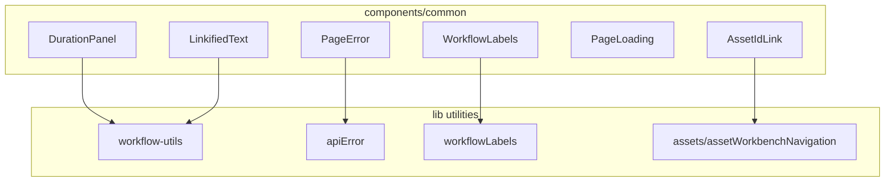
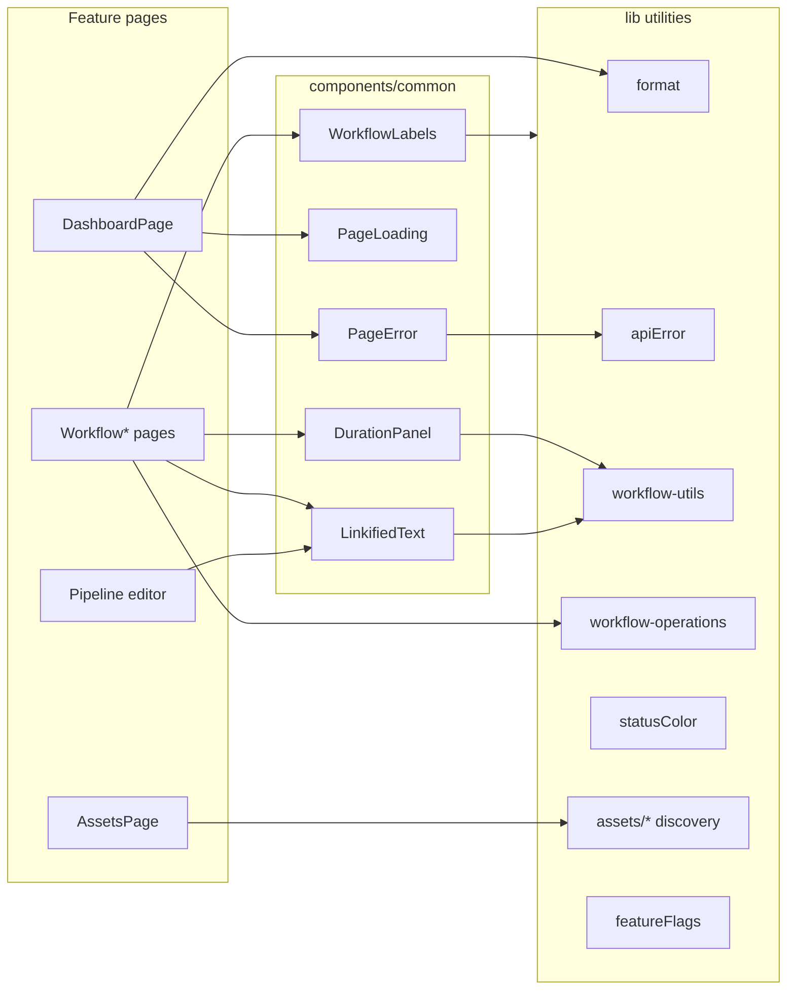
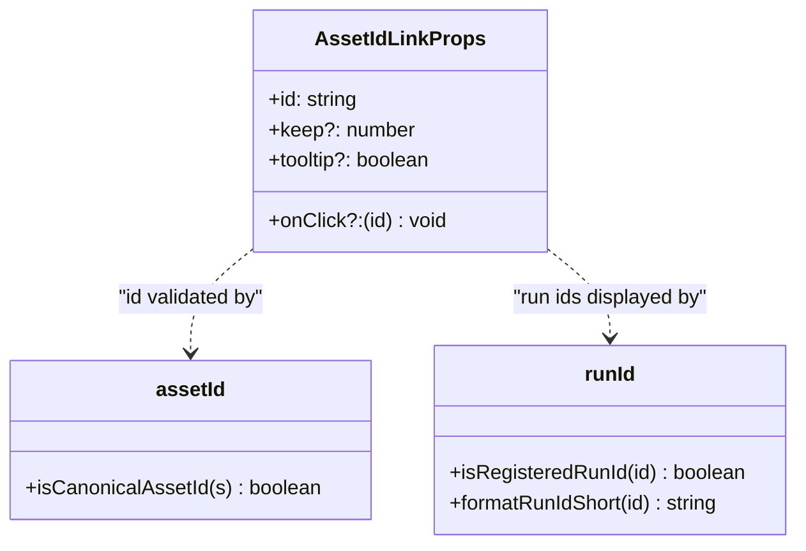
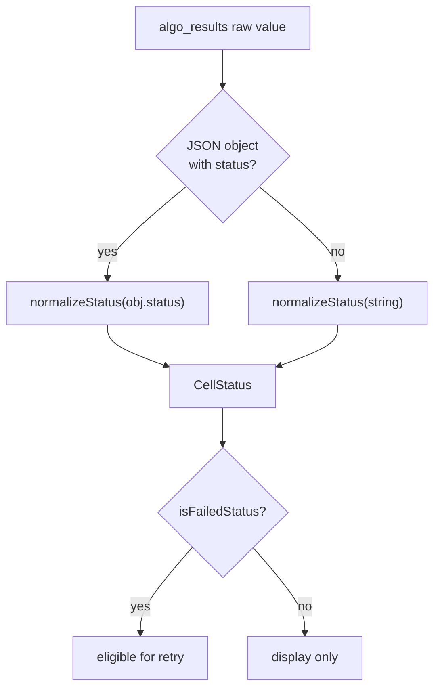
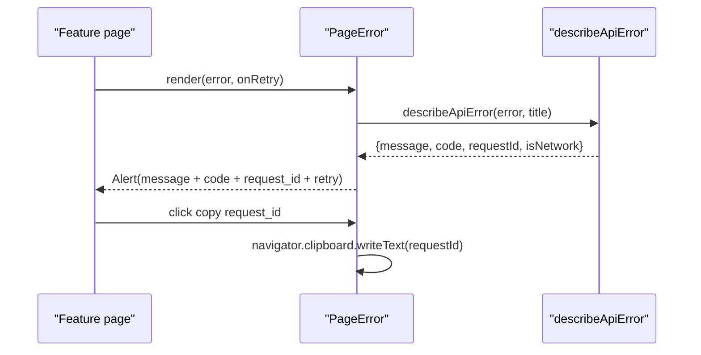
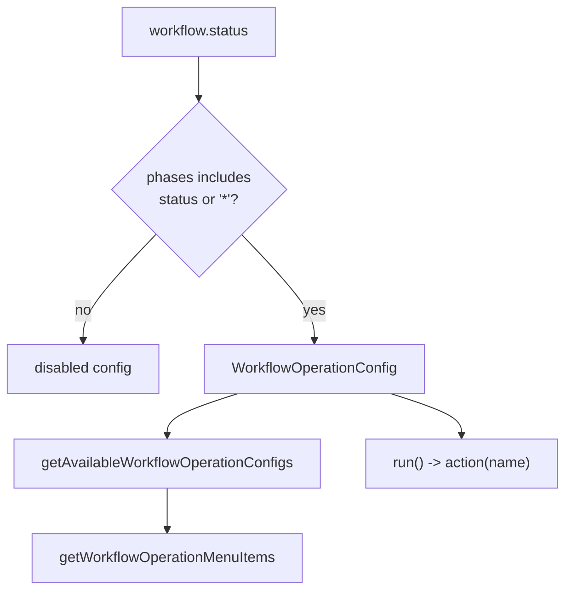
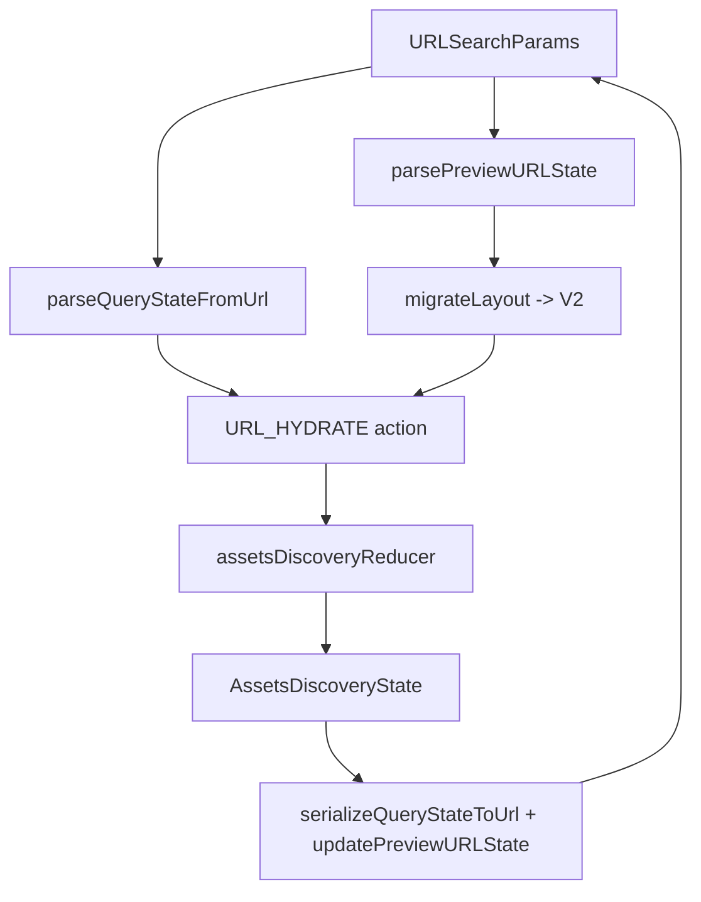
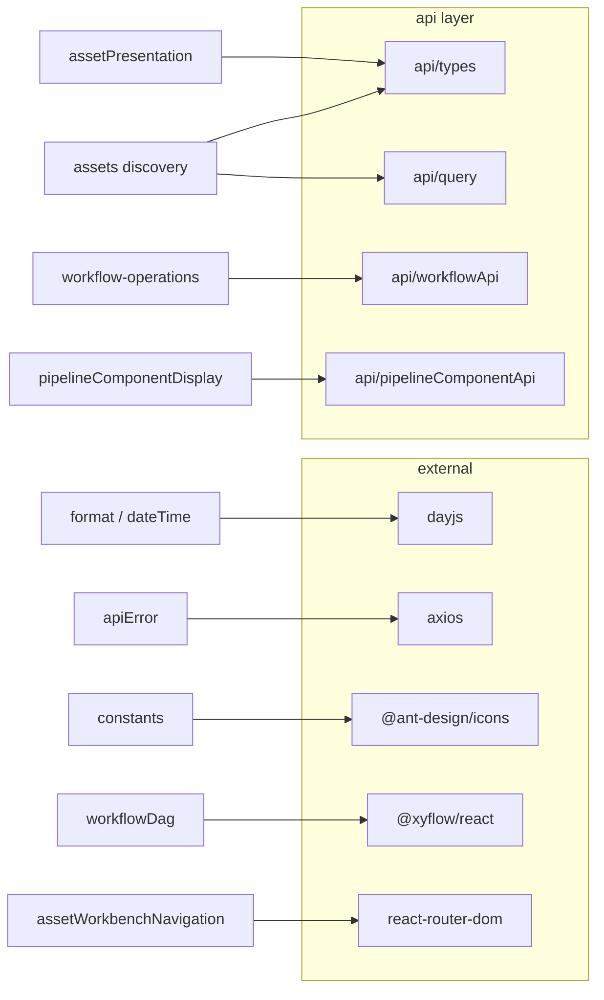

# Shared UI Components

<cite>
**Referenced Files in This Document**

- [Frontend/src/components/common/AssetIdLink.tsx](file://Frontend/src/components/common/AssetIdLink.tsx)
- [Frontend/src/components/common/DurationPanel.tsx](file://Frontend/src/components/common/DurationPanel.tsx)
- [Frontend/src/components/common/LinkifiedText.tsx](file://Frontend/src/components/common/LinkifiedText.tsx)
- [Frontend/src/components/common/PageError.tsx](file://Frontend/src/components/common/PageError.tsx)
- [Frontend/src/components/common/PageLoading.tsx](file://Frontend/src/components/common/PageLoading.tsx)
- [Frontend/src/components/common/WorkflowLabels.tsx](file://Frontend/src/components/common/WorkflowLabels.tsx)
- [Frontend/src/lib/algoStatus.ts](file://Frontend/src/lib/algoStatus.ts)
- [Frontend/src/lib/apiError.ts](file://Frontend/src/lib/apiError.ts)
- [Frontend/src/lib/appVersion.ts](file://Frontend/src/lib/appVersion.ts)
- [Frontend/src/lib/assetId.ts](file://Frontend/src/lib/assetId.ts)
- [Frontend/src/lib/assetPresentation.ts](file://Frontend/src/lib/assetPresentation.ts)
- [Frontend/src/lib/assets/assetWorkbenchNavigation.ts](file://Frontend/src/lib/assets/assetWorkbenchNavigation.ts)
- [Frontend/src/lib/assets/assetsDiscoveryActions.ts](file://Frontend/src/lib/assets/assetsDiscoveryActions.ts)
- [Frontend/src/lib/assets/assetsDiscoveryReducer.ts](file://Frontend/src/lib/assets/assetsDiscoveryReducer.ts)
- [Frontend/src/lib/assets/assetsDiscoveryTypes.ts](file://Frontend/src/lib/assets/assetsDiscoveryTypes.ts)
- [Frontend/src/lib/assets/assetsDiscoveryUrl.ts](file://Frontend/src/lib/assets/assetsDiscoveryUrl.ts)
- [Frontend/src/lib/assets/previewLayoutMigration.ts](file://Frontend/src/lib/assets/previewLayoutMigration.ts)
- [Frontend/src/lib/assets/previewURLState.ts](file://Frontend/src/lib/assets/previewURLState.ts)
- [Frontend/src/lib/constants.ts](file://Frontend/src/lib/constants.ts)
- [Frontend/src/lib/dateTime.ts](file://Frontend/src/lib/dateTime.ts)
- [Frontend/src/lib/featureFlags/embedLichtblickPlayer.ts](file://Frontend/src/lib/featureFlags/embedLichtblickPlayer.ts)
- [Frontend/src/lib/format.ts](file://Frontend/src/lib/format.ts)
- [Frontend/src/lib/pipelineComponentDisplay.ts](file://Frontend/src/lib/pipelineComponentDisplay.ts)
- [Frontend/src/lib/pipelineContract.ts](file://Frontend/src/lib/pipelineContract.ts)
- [Frontend/src/lib/runId.ts](file://Frontend/src/lib/runId.ts)
- [Frontend/src/lib/statusColor.ts](file://Frontend/src/lib/statusColor.ts)
- [Frontend/src/lib/workflow-operations.ts](file://Frontend/src/lib/workflow-operations.ts)
- [Frontend/src/lib/workflow-utils.ts](file://Frontend/src/lib/workflow-utils.ts)
- [Frontend/src/lib/workflowDag.ts](file://Frontend/src/lib/workflowDag.ts)
- [Frontend/src/lib/workflowLabels.ts](file://Frontend/src/lib/workflowLabels.ts)
- [Frontend/src/lib/workflowNodeDisplay.ts](file://Frontend/src/lib/workflowNodeDisplay.ts)
</cite>

## Table of Contents
1. [Introduction](#introduction)
2. [Project Structure](#project-structure)
3. [Core Components](#core-components)
4. [Architecture Overview](#architecture-overview)
5. [Detailed Component Analysis](#detailed-component-analysis)
6. [Dependency Analysis](#dependency-analysis)
7. [Performance Considerations](#performance-considerations)
8. [Troubleshooting Guide](#troubleshooting-guide)
9. [Conclusion](#conclusion)
10. [Appendices](#appendices)

## Introduction

This page documents the shared, page-agnostic building blocks of the Cyber Databrew
frontend: the presentational components under `Frontend/src/components/common/` and the
pure helper modules under `Frontend/src/lib/`. Together these form the layer that every
feature page (Dashboard, Assets discovery workbench, Algorithm processing matrix, Workflow
execution views, Pipeline editor) depends on for consistent formatting, identifier display,
status colour mapping, URL state serialization, feature flags, and workflow operations.

The defining property of this layer is that it is **presentation-and-logic-only and
framework-light**: the `common/` components are thin React wrappers over Ant Design
primitives, and the `lib/` modules are mostly pure functions with no React or network
dependency. They were deliberately extracted to eliminate the ad-hoc, duplicated snippets
that previously lived inline on each page — for example, the `font-mono text-xs` truncated-id
button reproduced across Dashboard and Saved Queries, or the per-page `dayjs` format calls.
Centralizing these concerns gives the application a single source of truth for visual and
behavioural contracts such as DESIGN.md status colours and the backend error envelope.

**Section sources**
- [Frontend/src/components/common/AssetIdLink.tsx](file://Frontend/src/components/common/AssetIdLink.tsx#L1-L4)
- [Frontend/src/lib/format.ts](file://Frontend/src/lib/format.ts#L1-L6)
- [Frontend/src/lib/statusColor.ts](file://Frontend/src/lib/statusColor.ts#L1-L8)

## Project Structure

The shared layer splits into two physical roots. `components/common/` holds the six reusable
React components, each a small file wrapping an Ant Design widget. `lib/` holds the pure
utility modules, with two themed sub-directories: `lib/assets/` for the Assets discovery
workbench state machine and URL serialization, and `lib/featureFlags/` for runtime feature
toggles.

- **`components/common/`** — `AssetIdLink`, `DurationPanel`, `LinkifiedText`, `PageError`,
  `PageLoading`, `WorkflowLabels`. Each component delegates its non-visual logic down into a
  `lib/` module (e.g. `DurationPanel` → `workflow-utils`, `PageError` → `apiError`,
  `WorkflowLabels` → `workflowLabels`).
- **`lib/` (formatting & display)** — `format.ts`, `dateTime.ts`, `assetPresentation.ts`,
  `pipelineComponentDisplay.ts`, `workflowNodeDisplay.ts`.
- **`lib/` (identifiers)** — `assetId.ts`, `runId.ts`.
- **`lib/` (status & constants)** — `statusColor.ts`, `algoStatus.ts`, `constants.ts`,
  `appVersion.ts`.
- **`lib/` (workflow logic)** — `workflow-operations.ts`, `workflow-utils.ts`,
  `workflowDag.ts`, `workflowLabels.ts`, `pipelineContract.ts`.
- **`lib/` (error handling)** — `apiError.ts`.
- **`lib/assets/`** — `assetsDiscoveryTypes.ts`, `assetsDiscoveryActions.ts`,
  `assetsDiscoveryReducer.ts`, `assetsDiscoveryUrl.ts`, `previewURLState.ts`,
  `previewLayoutMigration.ts`, `assetWorkbenchNavigation.ts`.
- **`lib/featureFlags/`** — `embedLichtblickPlayer.ts`.

**Diagram sources**
- [Frontend/src/components/common/AssetIdLink.tsx](file://Frontend/src/components/common/AssetIdLink.tsx#L6-L8)
- [Frontend/src/components/common/DurationPanel.tsx](file://Frontend/src/components/common/DurationPanel.tsx#L1-L2)
- [Frontend/src/components/common/LinkifiedText.tsx](file://Frontend/src/components/common/LinkifiedText.tsx#L1-L1)
- [Frontend/src/components/common/PageError.tsx](file://Frontend/src/components/common/PageError.tsx#L5-L7)
- [Frontend/src/components/common/WorkflowLabels.tsx](file://Frontend/src/components/common/WorkflowLabels.tsx#L1-L5)

**Section sources**
- [Frontend/src/lib/format.ts](file://Frontend/src/lib/format.ts#L1-L59)
- [Frontend/src/lib/statusColor.ts](file://Frontend/src/lib/statusColor.ts#L1-L51)

## Core Components

The shared layer divides into reusable React components and pure utility helpers. The table
below maps each shared piece to its purpose and its primary dependency.

| Module | Kind | Purpose | Key dependency |
| --- | --- | --- | --- |
| `common/AssetIdLink.tsx` | component | Truncated, monospace asset-id link that navigates to asset detail | `assets/assetWorkbenchNavigation` |
| `common/DurationPanel.tsx` | component | Inline duration text plus an optional running-progress bar | `workflow-utils.formatDuration` |
| `common/LinkifiedText.tsx` | component | Renders free text with embedded URLs turned into anchor tags | `workflow-utils.splitLinkifiedText` |
| `common/PageError.tsx` | component | Page-level error alert surfacing the backend `{code, message, request_id}` envelope | `apiError.describeApiError` |
| `common/PageLoading.tsx` | component | Centered first-paint loading spinner with ARIA status | Ant `Spin` |
| `common/WorkflowLabels.tsx` | component | Tag list of workflow labels, hiding noisy Argo system keys | `workflowLabels` |
| `lib/format.ts` | util | Unified date/time/number formatting (`—` for null) | `dayjs` |
| `lib/dateTime.ts` | util | Seconds-precision and short date/time formatters | `dayjs` |
| `lib/assetId.ts` | util | Validate canonical 8-char asset ids | — |
| `lib/runId.ts` | util | Validate 16-char run ids and produce short display form | — |
| `lib/statusColor.ts` | util | Ant `Tag` colour for algorithm statuses; re-exports asset-state colour | `assetPresentation` |
| `lib/algoStatus.ts` | util | Parse/normalize `algo_results` raw values into `CellStatus` | algo-matrix `CellStatus` |
| `lib/assetPresentation.ts` | util | Duration coercion, lifecycle-state and asset-type readers, state colour | `api/types` |
| `lib/constants.ts` | util | Workflow phase enum, labels, colour and icon maps | `@ant-design/icons` |
| `lib/appVersion.ts` | util | Build-injected version / build-ref labels | Vite defines |
| `lib/apiError.ts` | util | Normalize Axios/Error into a structured `DescribedApiError` | `axios` |
| `lib/workflow-utils.ts` | util | `formatDuration` and `splitLinkifiedText` | — |
| `lib/workflow-operations.ts` | util | Phase-gated workflow lifecycle action catalog (stop/retry/…) | `api/workflowApi` |
| `lib/workflowDag.ts` | util | Build React Flow edges from Argo node status | `@xyflow/react` |
| `lib/workflowLabels.ts` | util | Filter/alias/serialize workflow labels | — |
| `lib/workflowNodeDisplay.ts` | util | Display text and pod-name resolution for workflow nodes | `api/workflowApi` |
| `lib/pipelineComponentDisplay.ts` | util | Image-tag formatting and `sys-*` component de-duplication | `api/pipelineComponentApi` |
| `lib/pipelineContract.ts` | util | Convert between canvas nodes/edges and transpiler `Pipeline` | `components/pipeline/types` |
| `lib/assets/assetsDiscoveryTypes.ts` | util | All discovery workbench state-domain types | `api/query`, `api/types` |
| `lib/assets/assetsDiscoveryActions.ts` | util | Discriminated action union + chip creators | discovery types |
| `lib/assets/assetsDiscoveryReducer.ts` | util | Pure reducer over the nine discovery state domains | actions + types |
| `lib/assets/assetsDiscoveryUrl.ts` | util | Serialize/parse `QueryState` ↔ URL search params | `previewURLState` |
| `lib/assets/previewURLState.ts` | util | Parse/update the preview/`ds.*` URL params | `previewLayoutMigration` |
| `lib/assets/previewLayoutMigration.ts` | util | Versioned migration of preview layout shapes | — |
| `lib/assets/assetWorkbenchNavigation.ts` | util | Safe return-URL persistence + asset-detail navigation | `react-router-dom` |
| `lib/featureFlags/embedLichtblickPlayer.ts` | util | Embedded-player feature flag (URL param + Vite env) | `import.meta.env` |

**Section sources**
- [Frontend/src/components/common/AssetIdLink.tsx](file://Frontend/src/components/common/AssetIdLink.tsx#L20-L46)
- [Frontend/src/components/common/PageError.tsx](file://Frontend/src/components/common/PageError.tsx#L17-L73)
- [Frontend/src/lib/format.ts](file://Frontend/src/lib/format.ts#L9-L58)
- [Frontend/src/lib/workflow-operations.ts](file://Frontend/src/lib/workflow-operations.ts#L51-L99)

## Architecture Overview

The shared layer is organized so that React components hold only markup and styling, while
all branching, parsing, and string formatting lives in pure `lib/` functions. A component
imports the utility it needs, passes through the result, and the utility never imports back
up into a component. This keeps the utilities unit-testable in isolation (every non-trivial
`lib/` module has a sibling `*.test.ts`) and lets multiple pages reuse the same behaviour
without dragging React state along.

**Diagram sources**
- [Frontend/src/components/common/PageError.tsx](file://Frontend/src/components/common/PageError.tsx#L5-L22)
- [Frontend/src/components/common/DurationPanel.tsx](file://Frontend/src/components/common/DurationPanel.tsx#L1-L25)
- [Frontend/src/lib/workflow-operations.ts](file://Frontend/src/lib/workflow-operations.ts#L1-L23)

**Section sources**
- [Frontend/src/lib/apiError.ts](file://Frontend/src/lib/apiError.ts#L1-L35)
- [Frontend/src/lib/workflow-utils.ts](file://Frontend/src/lib/workflow-utils.ts#L1-L23)

## Detailed Component Analysis

### Identifier display: AssetIdLink, assetId, runId

`AssetIdLink` is the canonical truncated-id link used in tables. It keeps the first `keep`
characters (default 8), appends an ellipsis, and on click stops event propagation before
either calling a supplied `onClick(id)` or falling back to `navigateToAssetDetail`. It is
wrapped in an Ant `Tooltip` showing the full id unless `tooltip` is set false. The validity
of an id is decided elsewhere: `assetId.isCanonicalAssetId` matches exactly 8 alphanumeric
ASCII chars, while `runId.isRegisteredRunId` matches 16, and `runId.formatRunIdShort` renders
the `first4…last4` form once the id exceeds 12 characters.

**Diagram sources**
- [Frontend/src/components/common/AssetIdLink.tsx](file://Frontend/src/components/common/AssetIdLink.tsx#L10-L18)
- [Frontend/src/lib/assetId.ts](file://Frontend/src/lib/assetId.ts#L4-L7)
- [Frontend/src/lib/runId.ts](file://Frontend/src/lib/runId.ts#L4-L12)

**Section sources**
- [Frontend/src/components/common/AssetIdLink.tsx](file://Frontend/src/components/common/AssetIdLink.tsx#L20-L46)
- [Frontend/src/lib/runId.ts](file://Frontend/src/lib/runId.ts#L1-L12)

### Formatting helpers: format, dateTime, assetPresentation

`format.ts` is the unified formatting entry point: `formatDateTime` renders
`YYYY-MM-DD HH:mm`, `formatDate` renders date-only, `formatTime` renders `HH:mm:ss`,
`formatRelativeTime` produces Chinese relative strings (e.g. `2 分钟前`) bucketed by second/
minute/hour/day, and `formatNumber` applies `toLocaleString`. Every function returns the
em-dash placeholder `—` for null/invalid input, giving tables a consistent empty cell.
`dateTime.ts` is a narrower variant offering seconds precision (`YYYY-MM-DD HH:mm:ss`) and a
compact `MM-DD HH:mm`. `assetPresentation.ts` handles asset-specific display: it coerces
either `duration_ms` or `duration_sec` into milliseconds (`getDurationMs`), formats seconds
with `formatDurationSeconds`, reads `lifecycle_state || status` and `asset_type || type`, and
maps lifecycle state to an Ant tag colour in `getAssetStateColor`.

**Section sources**
- [Frontend/src/lib/format.ts](file://Frontend/src/lib/format.ts#L9-L58)
- [Frontend/src/lib/dateTime.ts](file://Frontend/src/lib/dateTime.ts#L3-L13)
- [Frontend/src/lib/assetPresentation.ts](file://Frontend/src/lib/assetPresentation.ts#L13-L62)

### Status colour and algorithm-status mapping

`statusColor.ts` is the canonical source for DESIGN.md status colours. `algoStatusTagColor`
maps `ok`/`failed`/`running` to `success`/`error`/`warning` and everything else to `default`;
the switch deliberately enumerates `pending` and `blocked` to document the `AlgoStatus`
contract. `extractAlgoStatuses` walks the flat `asset.algo_results` map and pulls out
`<algo_key>:status` pairs. The asset-lifecycle colour helper is re-exported from
`assetPresentation` as `assetLifecycleTagColor` so callers only import one module path.

`algoStatus.ts` is the parsing counterpart shared by the algo matrix grid and the batch-retry
hook so both agree on which cells are "failed". `normalizeStatus` folds synonyms (`success`→
`ok`, `error`→`failed`) into a `CellStatus`; `parseStatusFromRaw` accepts either a bare status
string or a JSON object with a `status` field; `getAlgoResultDetail` merges the legacy
JSON-blob form with the newer `algoKey:field` flat keys into an `AlgoResultDetail`.

**Diagram sources**
- [Frontend/src/lib/algoStatus.ts](file://Frontend/src/lib/algoStatus.ts#L9-L40)

**Section sources**
- [Frontend/src/lib/statusColor.ts](file://Frontend/src/lib/statusColor.ts#L11-L50)
- [Frontend/src/lib/algoStatus.ts](file://Frontend/src/lib/algoStatus.ts#L42-L96)
- [Frontend/src/lib/constants.ts](file://Frontend/src/lib/constants.ts#L10-L74)

### Error surfacing: apiError and PageError

`apiError.describeApiError` is the structured normalizer for backend error envelopes of the
shape `{code, message, request_id, details}`. When the error is an `AxiosError` with a
response it lifts the envelope fields (falling back to `status statusText`); for transport
failures it distinguishes `ERR_NETWORK` and `ECONNABORTED` and sets `isNetwork: true`; plain
`Error` instances and non-error throws return the fallback message. `extractApiErrorMessage`
is the single-string convenience wrapper. `PageError` consumes `describeApiError` to render an
Ant `Alert` that shows the message, a monospace `code`, and a copy-to-clipboard `request_id`
button, plus an optional retry button.

**Diagram sources**
- [Frontend/src/lib/apiError.ts](file://Frontend/src/lib/apiError.ts#L46-L86)
- [Frontend/src/components/common/PageError.tsx](file://Frontend/src/components/common/PageError.tsx#L17-L73)

**Section sources**
- [Frontend/src/lib/apiError.ts](file://Frontend/src/lib/apiError.ts#L37-L95)
- [Frontend/src/components/common/PageError.tsx](file://Frontend/src/components/common/PageError.tsx#L1-L73)
- [Frontend/src/components/common/PageLoading.tsx](file://Frontend/src/components/common/PageLoading.tsx#L13-L28)

### Workflow display and operations

The workflow helpers cluster around Argo workflow data. `DurationPanel` calls
`workflow-utils.formatDuration` to render an `h/m/s` elapsed string and, when the phase is
`Running`, parses a `done/total` progress string into an Ant `Progress` percent.
`LinkifiedText` uses `workflow-utils.splitLinkifiedText` to split text on a URL regex into
text/link parts and renders anchors with `target="_blank"`. `WorkflowLabels` uses
`workflowLabels.getDisplayLabelEntries` to drop the noisy `workflows.argoproj.io/{completed,
creator,phase}` keys and `formatWorkflowLabelKey` to strip the Argo prefix or apply an alias.

`workflow-operations.ts` is the phase-gated action catalog. `WORKFLOW_OPERATIONS` maps each
key (`stop`, `retry`, `resume`, `suspend`, `terminate`, `resubmit`, `delete`) to a title,
icon, the workflow phases in which it is allowed, an optional `danger` flag, and the API
`action`. `isWorkflowOperationEnabled` checks the workflow's current `status` against the
operation's `phases` (with `*` meaning always). `getWorkflowOperationConfigs` builds button
configs, `getAvailableWorkflowOperationConfigs` filters to enabled ones, and
`getWorkflowOperationMenuItems` adapts them to an Ant `Menu`.

`workflowDag.buildWorkflowFlowEdges` constructs React Flow edges first from each node's
`children`, then by inferring parents from dotted node names, de-duplicating by edge id.
`workflowNodeDisplay` resolves display text (`displayName || templateName || name`) and a
pod name (preferring `podName`, then a `pod`-type node id).

**Diagram sources**
- [Frontend/src/lib/workflow-operations.ts](file://Frontend/src/lib/workflow-operations.ts#L111-L158)

**Section sources**
- [Frontend/src/components/common/DurationPanel.tsx](file://Frontend/src/components/common/DurationPanel.tsx#L4-L40)
- [Frontend/src/components/common/LinkifiedText.tsx](file://Frontend/src/components/common/LinkifiedText.tsx#L3-L23)
- [Frontend/src/components/common/WorkflowLabels.tsx](file://Frontend/src/components/common/WorkflowLabels.tsx#L7-L30)
- [Frontend/src/lib/workflow-utils.ts](file://Frontend/src/lib/workflow-utils.ts#L3-L59)
- [Frontend/src/lib/workflowLabels.ts](file://Frontend/src/lib/workflowLabels.ts#L1-L28)
- [Frontend/src/lib/workflowDag.ts](file://Frontend/src/lib/workflowDag.ts#L5-L39)
- [Frontend/src/lib/workflowNodeDisplay.ts](file://Frontend/src/lib/workflowNodeDisplay.ts#L3-L24)

### Pipeline contract helpers

`pipelineContract.ts` bridges the React Flow canvas and the transpiler's `Pipeline` shape.
`normalizeComponentArgs` coerces mixed `string[] | Argument[]` inputs into `Argument` objects;
`formatEdgeEndpoint` renders endpoints as `node-id.port-name`; `toTranspilerPipeline` maps
canvas nodes/edges to defs (defaulting input/output ports), and `fromTranspilerPipeline`
restores canvas state from saved JSON, laying out nodes on a diagonal and splitting
`node.port` refs back into handles. `pipelineComponentDisplay.ts` handles component listing:
`imageHasTag` detects an explicit tag, `formatComponentImage` appends a default tag when none
is present, and `dedupePipelineComponentsByName` keeps the highest-scoring entry per name
(preferring `sys-*` ids and `system` source).

**Section sources**
- [Frontend/src/lib/pipelineContract.ts](file://Frontend/src/lib/pipelineContract.ts#L11-L110)
- [Frontend/src/lib/pipelineContract.ts](file://Frontend/src/lib/pipelineContract.ts#L112-L204)
- [Frontend/src/lib/pipelineComponentDisplay.ts](file://Frontend/src/lib/pipelineComponentDisplay.ts#L3-L38)

### Assets discovery state machine and URL state

The `lib/assets/` modules implement the Assets discovery workbench. `assetsDiscoveryTypes.ts`
declares the union string types (`SearchMode`, `ViewMode`, `SelectionMode`, `PreviewMode`,
`PreviewAvailability`), the `FilterChip`/`QueryToken` chip interfaces, and the composite state
across nine domains. `assetsDiscoveryActions.ts` defines the discriminated `AssetsDiscoveryAction`
union grouped into route/hydration, search UI, query commit, facet UI, results fetch,
selection, preview, saved views, and layout, plus the `createFilterChip`/`createQueryToken`
helpers that mint unique chip ids. `assetsDiscoveryReducer.ts` is the pure reducer:
`withQueryReset` resets the page to 1 and marks results stale on any query change, and
`normalizeSearchFiltersForMode` drops the `_fulltext` chip outside keyword mode.

URL state is split between `assetsDiscoveryUrl.ts` and `previewURLState.ts`.
`serializeQueryStateToUrl` writes only non-default fields (mode, `q`, repeated `filter`,
`sort`, `page`, `page_size`, `view`, `columns`) and delegates preview/`ds.*` params to
`updatePreviewURLState`; `parseQueryStateFromUrl` reverses this, validating modes and numeric
bounds. `previewURLState.ts` parses and writes the `preview`/`preview_source`/`preview_topic`/
`preview_time`/`ds`/`ds.*` params, running every read and write through
`previewLayoutMigration.migrateLayout`, which coerces any legacy/unknown layout shape into the
current `PreviewLayoutV2` and stamps `LATEST_PREVIEW_LAYOUT_VERSION`.

**Diagram sources**
- [Frontend/src/lib/assets/assetsDiscoveryUrl.ts](file://Frontend/src/lib/assets/assetsDiscoveryUrl.ts#L113-L238)
- [Frontend/src/lib/assets/previewURLState.ts](file://Frontend/src/lib/assets/previewURLState.ts#L49-L95)
- [Frontend/src/lib/assets/assetsDiscoveryReducer.ts](file://Frontend/src/lib/assets/assetsDiscoveryReducer.ts#L39-L70)

**Section sources**
- [Frontend/src/lib/assets/assetsDiscoveryTypes.ts](file://Frontend/src/lib/assets/assetsDiscoveryTypes.ts#L10-L45)
- [Frontend/src/lib/assets/assetsDiscoveryActions.ts](file://Frontend/src/lib/assets/assetsDiscoveryActions.ts#L19-L181)
- [Frontend/src/lib/assets/assetsDiscoveryUrl.ts](file://Frontend/src/lib/assets/assetsDiscoveryUrl.ts#L83-L168)
- [Frontend/src/lib/assets/previewURLState.ts](file://Frontend/src/lib/assets/previewURLState.ts#L97-L175)
- [Frontend/src/lib/assets/previewLayoutMigration.ts](file://Frontend/src/lib/assets/previewLayoutMigration.ts#L80-L121)

### Navigation safety and feature flags

`assetWorkbenchNavigation.ts` governs full-screen asset-detail navigation while protecting the
"back" target. `navigateToAssetDetail` persists the current path to `sessionStorage` (under a
versioned key) only when it is a safe internal URL, then navigates to `/assets/:id`.
`isSafeInternalReturnUrl` rejects open redirects (`//`), path traversal (`..`), other
`/assets/:id` detail pages, and any unknown top-level route, and `consumeStoredReturnUrl`
re-validates on read. `featureFlags/embedLichtblickPlayer.ts` resolves the embedded-player flag
with URL query params (`embed_player`/`embedPlayer`/`lichtblick`) taking precedence — an
explicit query value overrides the env — and falls back to the
`VITE_ENABLE_EMBED_LICHTBLICK_PLAYER` Vite env, parsing `1/true/yes/on` as truthy.
`appVersion.ts` reads the build-time `__APP_VERSION__`/`__APP_BUILD_REF__` defines into a
`v<version> (<buildRef>)` label.

**Section sources**
- [Frontend/src/lib/assets/assetWorkbenchNavigation.ts](file://Frontend/src/lib/assets/assetWorkbenchNavigation.ts#L43-L106)
- [Frontend/src/lib/featureFlags/embedLichtblickPlayer.ts](file://Frontend/src/lib/featureFlags/embedLichtblickPlayer.ts#L6-L42)
- [Frontend/src/lib/appVersion.ts](file://Frontend/src/lib/appVersion.ts#L1-L13)

## Dependency Analysis

The shared layer depends downward on a small set of API and vendor modules and is depended
upon upward by the feature pages. The `common/` components depend on `lib/` modules but never
the reverse; the `lib/` modules depend on `api/` type modules, `axios`, `dayjs`,
`@ant-design/icons`, `@xyflow/react`, and `react-router-dom`, but hold no page-level state.

**Diagram sources**
- [Frontend/src/lib/apiError.ts](file://Frontend/src/lib/apiError.ts#L13-L13)
- [Frontend/src/lib/workflow-operations.ts](file://Frontend/src/lib/workflow-operations.ts#L12-L23)
- [Frontend/src/lib/workflowDag.ts](file://Frontend/src/lib/workflowDag.ts#L1-L2)
- [Frontend/src/lib/assets/assetsDiscoveryActions.ts](file://Frontend/src/lib/assets/assetsDiscoveryActions.ts#L5-L15)

**Section sources**
- [Frontend/src/lib/format.ts](file://Frontend/src/lib/format.ts#L6-L6)
- [Frontend/src/lib/assetPresentation.ts](file://Frontend/src/lib/assetPresentation.ts#L1-L11)
- [Frontend/src/lib/pipelineComponentDisplay.ts](file://Frontend/src/lib/pipelineComponentDisplay.ts#L1-L1)

## Performance Considerations

Most helpers are pure synchronous string/array transforms with negligible cost, but a few have
performance-relevant shapes:

- **`splitLinkifiedText`** runs a global regex `matchAll` over the input text; it is invoked per
  rendered text cell, so it is best applied to short labels rather than long log bodies.
- **`buildWorkflowFlowEdges`** indexes nodes into a `Map` for O(1) child lookups but performs an
  O(n) `nodes.find` for the dotted-name parent inference, making the second pass O(n²) in the
  worst case for large workflows.
- **`dedupePipelineComponentsByName`** is a single O(n) pass keyed by lowercased name, scoring
  each candidate to keep the preferred `sys-*`/`system` entry.
- **URL serialization** deliberately omits default values (`serializeQueryStateToUrl`) and sorts
  params (`previewURLState`) so that identical workbench states produce identical, cache-friendly
  URLs and avoid redundant history churn.
- **`migrateLayout`** runs on every preview URL parse and write; it allocates a fresh
  `PreviewLayoutV2`, so it should not be called in tight render loops without memoization upstream.

**Section sources**
- [Frontend/src/lib/workflow-utils.ts](file://Frontend/src/lib/workflow-utils.ts#L25-L59)
- [Frontend/src/lib/workflowDag.ts](file://Frontend/src/lib/workflowDag.ts#L23-L37)
- [Frontend/src/lib/assets/assetsDiscoveryUrl.ts](file://Frontend/src/lib/assets/assetsDiscoveryUrl.ts#L113-L168)

## Troubleshooting Guide

- **A timestamp renders as `—`.** The value is null or `dayjs`/`Date` could not parse it. All
  formatters in `format.ts` and `dateTime.ts` collapse invalid input to the em-dash placeholder;
  check the upstream field shape rather than the formatter.
- **A workflow action button is unexpectedly disabled.** `isWorkflowOperationEnabled` gates each
  operation on the workflow's `status` against its allowed `phases`; verify the live status maps
  to one of the phases declared in `WORKFLOW_OPERATIONS` (or `*`).
- **An algo cell shows the wrong status.** `parseStatusFromRaw` first tries `JSON.parse`; a raw
  value that is neither valid JSON nor a known synonym falls through `normalizeStatus` to `none`.
  Confirm the `algo_results` entry uses a recognized status string.
- **"Back" navigation from asset detail returns to the wrong page or is lost.** The return URL is
  only stored when it passes `isSafeInternalReturnUrl` (rejecting `//`, `..`, other detail pages,
  and unknown routes) and is dropped if `sessionStorage` is unavailable (private mode / quota).
- **The embedded player flag does not take effect.** Remember query params override env: an
  explicit `embed_player=0` in the URL disables it regardless of `VITE_ENABLE_EMBED_LICHTBLICK_PLAYER`.
- **A request id cannot be copied from the error alert.** `PageError` only renders the copy button
  when `describeApiError` extracted a `requestId`; transport errors (`isNetwork: true`) carry no
  envelope and therefore no request id.

**Section sources**
- [Frontend/src/lib/format.ts](file://Frontend/src/lib/format.ts#L9-L52)
- [Frontend/src/lib/workflow-operations.ts](file://Frontend/src/lib/workflow-operations.ts#L111-L119)
- [Frontend/src/lib/algoStatus.ts](file://Frontend/src/lib/algoStatus.ts#L9-L36)
- [Frontend/src/lib/assets/assetWorkbenchNavigation.ts](file://Frontend/src/lib/assets/assetWorkbenchNavigation.ts#L43-L93)
- [Frontend/src/lib/featureFlags/embedLichtblickPlayer.ts](file://Frontend/src/lib/featureFlags/embedLichtblickPlayer.ts#L32-L42)

## Conclusion

The shared UI layer keeps the Cyber Databrew frontend consistent by isolating presentation and
logic concerns into small, testable units: six thin `common/` components over Ant Design, and a
set of pure `lib/` helpers covering formatting, identifiers, status colours, error envelopes,
workflow operations, pipeline contracts, the assets discovery state machine, URL state
serialization, navigation safety, and feature flags. The strict one-way dependency — components
import utilities, utilities import only API types and vendors — makes the layer easy to reuse
across pages and to verify in isolation, and centralizes contracts (status colours, the backend
error envelope, the canonical id formats) that would otherwise drift between pages.

## Appendices

### Appendix A — Workflow operation phase gates

| Key | Title | Allowed phases | Danger |
| --- | --- | --- | --- |
| `stop` | 停止 | Running, Pending | no |
| `retry` | 重试 | Failed, Error | no |
| `resume` | 恢复 | Suspended | no |
| `suspend` | 暂停 | Running | no |
| `terminate` | 终止 | Running, Pending | yes |
| `resubmit` | 重提交 | Succeeded, Failed, Error | no |
| `delete` | 删除 | * (any) | yes |

**Section sources**
- [Frontend/src/lib/workflow-operations.ts](file://Frontend/src/lib/workflow-operations.ts#L51-L109)

### Appendix B — Workflow phase enum and colours

The `constants.ts` module defines `WORKFLOW_PHASES` (`Running`, `Succeeded`, `Failed`, `Error`,
`Pending`, `Suspended`), Chinese phase labels, the always-visible summary set, and three colour
maps (`PHASE_COLORS` hex, `STATUS_COLORS` Ant names, `STATUS_ACCENT_COLORS`) plus a
`STATUS_ICONS` map built from `@ant-design/icons`.

**Section sources**
- [Frontend/src/lib/constants.ts](file://Frontend/src/lib/constants.ts#L10-L74)

### Appendix C — Identifier formats

| Helper | Format | Module |
| --- | --- | --- |
| `isCanonicalAssetId` | 8 alphanumeric ASCII | `assetId.ts` |
| `isRegisteredRunId` | 16 alphanumeric ASCII | `runId.ts` |
| `formatRunIdShort` | first4…last4 (when len > 12) | `runId.ts` |

**Section sources**
- [Frontend/src/lib/assetId.ts](file://Frontend/src/lib/assetId.ts#L1-L7)
- [Frontend/src/lib/runId.ts](file://Frontend/src/lib/runId.ts#L1-L12)
</content>
</invoke>
