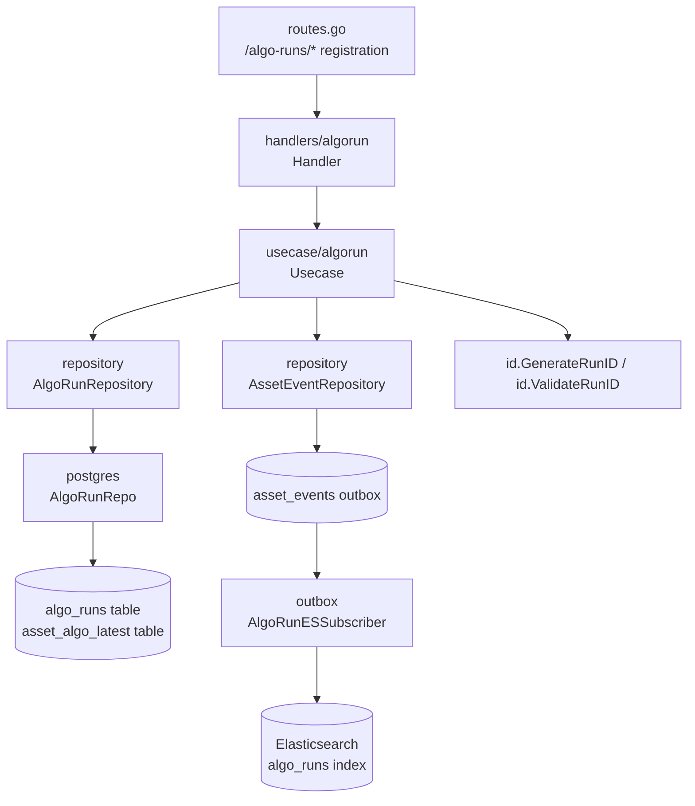
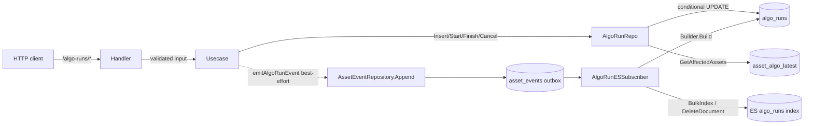
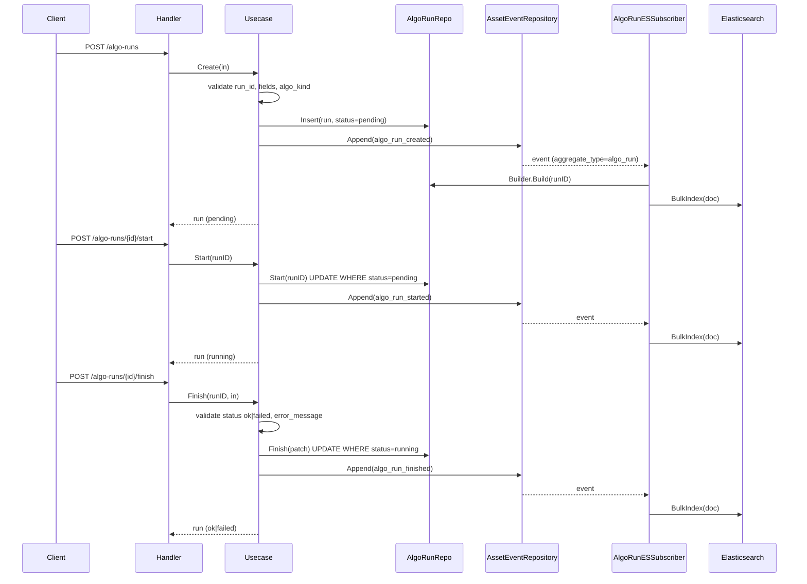
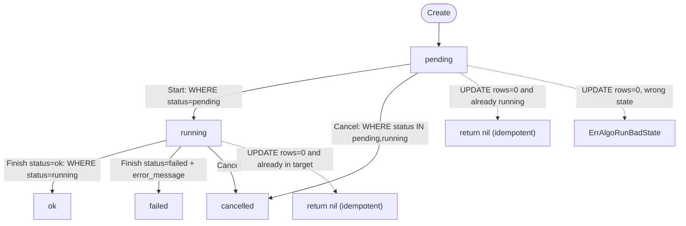
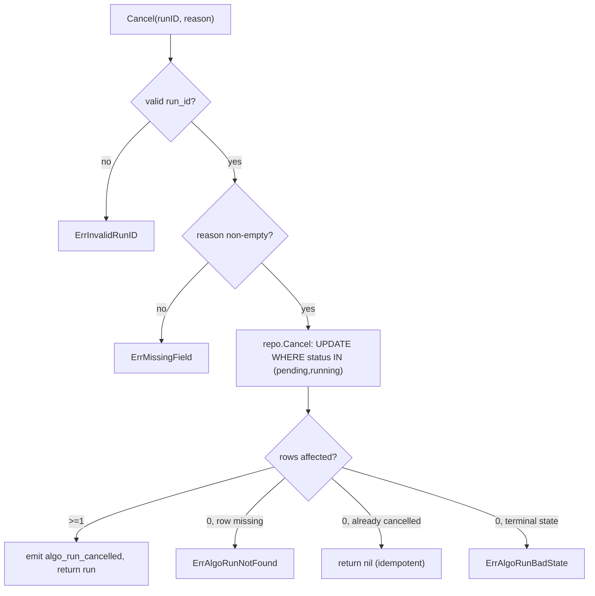
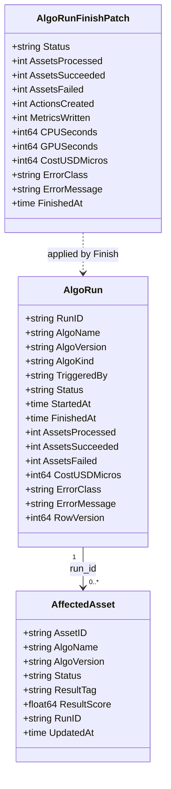
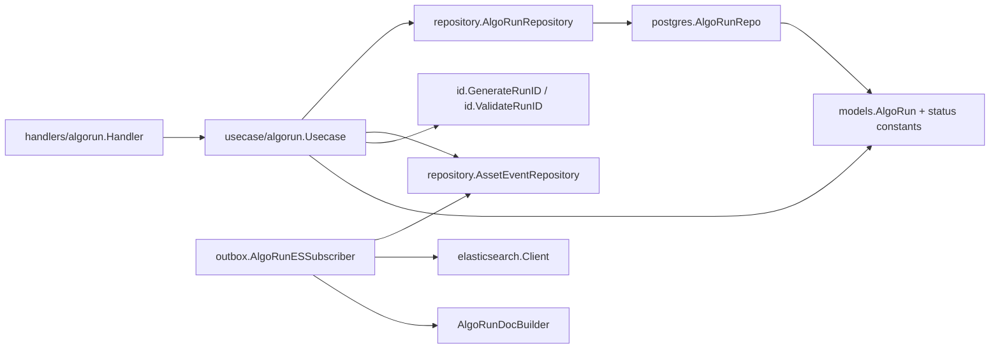

# Algorithm Runs

<cite>
**Referenced Files in This Document**

- [backend/internal/usecase/algorun/usecase.go](file://backend/internal/usecase/algorun/usecase.go)
- [backend/internal/postgres/algo_runs.go](file://backend/internal/postgres/algo_runs.go)
- [backend/internal/outbox/algo_run_subscriber.go](file://backend/internal/outbox/algo_run_subscriber.go)
- [backend/internal/handlers/algorun/handler.go](file://backend/internal/handlers/algorun/handler.go)
- [backend/internal/models/algo_run.go](file://backend/internal/models/algo_run.go)
- [backend/internal/repository/algo_run_repository.go](file://backend/internal/repository/algo_run_repository.go)
- [backend/internal/id/runid.go](file://backend/internal/id/runid.go)
- [backend/routes/routes.go](file://backend/routes/routes.go)
</cite>

## Table of Contents
1. [Introduction](#introduction)
2. [Project Structure](#project-structure)
3. [Core Components](#core-components)
4. [Architecture Overview](#architecture-overview)
5. [Detailed Component Analysis](#detailed-component-analysis)
6. [Dependency Analysis](#dependency-analysis)
7. [Performance Considerations](#performance-considerations)
8. [Troubleshooting Guide](#troubleshooting-guide)
9. [Conclusion](#conclusion)
10. [Appendices](#appendices)

## Introduction

An **algo run** is a first-class execution-event record that captures a single invocation of an algorithm against a set of assets: who triggered it, which code and image produced it, what it processed, how long it took, what it cost, and whether it succeeded. The feature exists so that the per-asset algorithm state (the `asset_algo_latest` projection) can be traced back to a concrete, auditable execution, and so that operators can list, inspect, and reconcile algorithm activity across the data brew.

The lifecycle of a run is a small state machine: a run is **created** in `pending`, **started** to `running`, then **finished** to a terminal `ok` or `failed`, or **cancelled** to `cancelled` from either `pending` or `running`. Each transition is persisted with optimistic `row_version` bumps and (optionally) emits an outbox event. A downstream Elasticsearch subscriber consumes those events and keeps the searchable `algo_runs` index in sync with PostgreSQL.

This page documents the run usecase (`algorun.Usecase`), its PostgreSQL repository (`AlgoRunRepo`), the HTTP surface (create / list / get / start / finish / cancel / affected-assets), and the outbox subscriber (`AlgoRunESSubscriber`) that reflects run state into Elasticsearch. The link between a run and the assets it touched is the `run_id` column stored on each `asset_algo_latest` row, which the `affected-assets` endpoint queries back out.

**Section sources**
- [backend/internal/usecase/algorun/usecase.go](file://backend/internal/usecase/algorun/usecase.go#L1-L97)
- [backend/internal/models/algo_run.go](file://backend/internal/models/algo_run.go#L1-L50)

## Project Structure

The algo-runs feature is split across the canonical layers of the backend: an HTTP handler, a usecase that holds the business rules, a repository interface, a PostgreSQL implementation, the domain model, and the outbox subscriber that projects to Elasticsearch.



**Diagram sources**
- [backend/routes/routes.go](file://backend/routes/routes.go#L297-L303)
- [backend/internal/usecase/algorun/usecase.go](file://backend/internal/usecase/algorun/usecase.go#L84-L115)
- [backend/internal/postgres/algo_runs.go](file://backend/internal/postgres/algo_runs.go#L17-L25)
- [backend/internal/outbox/algo_run_subscriber.go](file://backend/internal/outbox/algo_run_subscriber.go#L26-L40)

The relevant files are:

- **`backend/internal/handlers/algorun/handler.go`** — the Gin HTTP handler. Binds request bodies, calls the usecase, and maps usecase/repository errors to HTTP status codes.
- **`backend/internal/usecase/algorun/usecase.go`** — `Usecase`, the business layer: input validation, run-ID generation, state transitions, and best-effort outbox event emission.
- **`backend/internal/repository/algo_run_repository.go`** — the `AlgoRunRepository` interface plus the `AlgoRunFinishPatch`, `AlgoRunListFilter`, and `AffectedAsset` data carriers and sentinel errors.
- **`backend/internal/postgres/algo_runs.go`** — `AlgoRunRepo`, the PostgreSQL implementation with conditional `UPDATE ... WHERE status = ?` transitions and JSONB column handling.
- **`backend/internal/models/algo_run.go`** — the `AlgoRun` domain model and the status constants.
- **`backend/internal/outbox/algo_run_subscriber.go`** — `AlgoRunESSubscriber`, which rebuilds and indexes the Elasticsearch document on each run event.
- **`backend/internal/id/runid.go`** — run-ID format (16 alphanumeric chars) generation and validation.

**Section sources**
- [backend/internal/handlers/algorun/handler.go](file://backend/internal/handlers/algorun/handler.go#L1-L24)
- [backend/internal/repository/algo_run_repository.go](file://backend/internal/repository/algo_run_repository.go#L1-L67)
- [backend/internal/postgres/algo_runs.go](file://backend/internal/postgres/algo_runs.go#L1-L25)

## Core Components

#### `AlgoRun` model and status constants

`AlgoRun` is the wire and persistence model for a run. It carries identity (`RunID`, `AlgoName`, `AlgoVersion`, `AlgoKind`), provenance (`TriggeredBy`, `CodeCommit`, `ImageDigest`, `PipelineName`, `PipelineVersion`), inputs (`InputFilter`, `InputAssetIDs`, `Params`), terminal counters (`AssetsProcessed`, `AssetsSucceeded`, `AssetsFailed`, `ActionsCreated`, `MetricsWritten`), resource accounting (`CPUSeconds`, `GPUSeconds`, `CostUSDMicros`), error fields (`ErrorClass`, `ErrorMessage`), and the optimistic-concurrency `RowVersion`. The status lifecycle is encoded by five string constants.

```go
AlgoRunStatusPending   = "pending"
AlgoRunStatusRunning   = "running"
AlgoRunStatusOK        = "ok"
AlgoRunStatusFailed    = "failed"
AlgoRunStatusCancelled = "cancelled"
```

**Section sources**
- [backend/internal/models/algo_run.go](file://backend/internal/models/algo_run.go#L5-L50)

#### `Usecase`

`Usecase` holds a required `repository.AlgoRunRepository` and an optional `repository.AssetEventRepository` (`eventRepo`). When `eventRepo` is nil, outbox emission is disabled and only the primary state mutation runs. `New` wires the repository; `SetEventRepo` enables event emission afterward.

**Section sources**
- [backend/internal/usecase/algorun/usecase.go](file://backend/internal/usecase/algorun/usecase.go#L84-L97)

#### `AlgoRunRepository` interface

The repository contract is deliberately small — one method per lifecycle operation plus reads:

```go
Insert(ctx, run) error
Get(ctx, runID) (*AlgoRun, error)
Exists(ctx, runID) (bool, error)
Start(ctx, runID, startedAt) error
Finish(ctx, runID, patch AlgoRunFinishPatch) error
List(ctx, filter AlgoRunListFilter) ([]*AlgoRun, int64, error)
Cancel(ctx, runID, reason, finishedAt) error
GetAffectedAssets(ctx, runID) ([]*AffectedAsset, error)
```

The interface also defines the sentinel errors `ErrDuplicateRunID`, `ErrAlgoRunNotFound`, `ErrAlgoRunBadState`, and `ErrAlgoRunOptimistic`.

**Section sources**
- [backend/internal/repository/algo_run_repository.go](file://backend/internal/repository/algo_run_repository.go#L11-L67)

#### `AlgoRunESSubscriber`

The subscriber consumes outbox events whose `aggregate_type == "algo_run"` and updates the `algo_runs` Elasticsearch index. It shares the same `EventSubscriber` (the in-memory bus) as the asset ES subscriber and silently skips non-algo_run events. For each run event it rebuilds the document from PostgreSQL via an `AlgoRunDocBuilder`, then either deletes (run gone) or bulk-indexes the document.

**Section sources**
- [backend/internal/outbox/algo_run_subscriber.go](file://backend/internal/outbox/algo_run_subscriber.go#L15-L40)

## Architecture Overview

A run moves through layers identically for every endpoint: route → handler → usecase → repository → PostgreSQL, with the usecase additionally appending an outbox event that the ES subscriber later reflects into Elasticsearch. The repository enforces transitions with conditional `UPDATE` statements keyed on the current `status`, so the database — not the usecase — is the authority on whether a transition is legal.



A key design property is that outbox emission is **best-effort and non-blocking**: `emitAlgoRunEvent` swallows append errors so an Elasticsearch/outbox failure never rolls back the authoritative PostgreSQL state transition.

**Diagram sources**
- [backend/internal/usecase/algorun/usecase.go](file://backend/internal/usecase/algorun/usecase.go#L99-L115)
- [backend/internal/postgres/algo_runs.go](file://backend/internal/postgres/algo_runs.go#L144-L173)
- [backend/internal/outbox/algo_run_subscriber.go](file://backend/internal/outbox/algo_run_subscriber.go#L43-L94)

**Section sources**
- [backend/internal/usecase/algorun/usecase.go](file://backend/internal/usecase/algorun/usecase.go#L99-L115)
- [backend/internal/postgres/algo_runs.go](file://backend/internal/postgres/algo_runs.go#L226-L353)

## Detailed Component Analysis

### Run lifecycle: create → start → finish → apply

The happy path of a run begins with `Create`, which generates or validates the run ID, validates required fields and the algo kind, persists a `pending` row, and emits `algo_run_created`. The caller then issues `start`, the worker executes, and `finish` records terminal counters and status. The ES subscriber reacts to each emitted event and refreshes the search document.



`Create` trims and validates inputs: an empty `RunID` is auto-generated via `id.GenerateRunID`, and any supplied ID must satisfy `id.ValidateRunID` (16 alphanumeric chars) or the call returns `ErrInvalidRunID`. `algo_name`, `algo_version`, and `triggered_by` are mandatory. `algo_kind` defaults to `processing` and must be one of `processing`, `split`, `qa`, `enrichment`. The new row is inserted with `Status = pending` and `RowVersion = 1`, then re-read through `repo.Get` so the response reflects the persisted row including server defaults.

`Start` validates the ID, captures `now` in UTC, calls `repo.Start`, emits `algo_run_started`, and returns the refreshed run. `Finish` validates that `status` is `ok` or `failed`, requires `error_message` when `failed`, builds an `AlgoRunFinishPatch` from the terminal counters and resource fields, calls `repo.Finish`, then emits `algo_run_finished` with `error_class`/`error_message` in the payload.

**Diagram sources**
- [backend/internal/usecase/algorun/usecase.go](file://backend/internal/usecase/algorun/usecase.go#L117-L240)
- [backend/internal/outbox/algo_run_subscriber.go](file://backend/internal/outbox/algo_run_subscriber.go#L43-L94)

**Section sources**
- [backend/internal/usecase/algorun/usecase.go](file://backend/internal/usecase/algorun/usecase.go#L117-L240)
- [backend/internal/postgres/algo_runs.go](file://backend/internal/postgres/algo_runs.go#L144-L224)

### State machine and conditional transitions

The repository enforces the state machine at the SQL level. `Start` updates only `WHERE run_id = $1 AND status = pending`; `Finish` requires `status = running`; `Cancel` requires `status IN (pending, running)`. When an `UPDATE` affects zero rows, the repository re-reads the row to disambiguate "not found", "already in the target state" (idempotent success), or "illegal transition" (`ErrAlgoRunBadState`). This makes start, finish, and cancel safely retryable.



In `Start`, if the conditional update matches nothing but the current row is already `running`, the method returns `nil` (idempotent). In `Finish`, a zero-row update where the current status already equals the requested terminal status is likewise treated as success. In `Cancel`, an already-`cancelled` row is idempotent. Any other zero-row mismatch yields `ErrAlgoRunBadState`, and a missing row yields `ErrAlgoRunNotFound`. Every successful transition increments `row_version` for optimistic concurrency.

**Diagram sources**
- [backend/internal/postgres/algo_runs.go](file://backend/internal/postgres/algo_runs.go#L144-L224)
- [backend/internal/postgres/algo_runs.go](file://backend/internal/postgres/algo_runs.go#L290-L322)

**Section sources**
- [backend/internal/postgres/algo_runs.go](file://backend/internal/postgres/algo_runs.go#L144-L322)

### Cancellation

`Cancel` requires a non-empty `reason` at the usecase boundary; an empty reason returns `ErrMissingField`. The repository update sets `status = cancelled`, `finished_at`, a fixed `error_class = 'cancelled'`, and `error_message = reason`. It only matches runs in `pending` or `running`, so a finished (`ok`/`failed`) run cannot be cancelled.



On success the usecase emits `algo_run_cancelled` with `status`, `finished_at`, and the reason as `error_message`, then returns the refreshed run.

**Diagram sources**
- [backend/internal/usecase/algorun/usecase.go](file://backend/internal/usecase/algorun/usecase.go#L275-L294)
- [backend/internal/postgres/algo_runs.go](file://backend/internal/postgres/algo_runs.go#L290-L322)

**Section sources**
- [backend/internal/usecase/algorun/usecase.go](file://backend/internal/usecase/algorun/usecase.go#L275-L294)
- [backend/internal/postgres/algo_runs.go](file://backend/internal/postgres/algo_runs.go#L290-L322)

### Listing and pagination

`List` normalizes the filter through `NormalizeListFilter` (page defaults to 1; page size defaults to 50 and is clamped to a max of 200), then delegates to `repo.List`. The repository builds a dynamic `WHERE` clause from the optional `algo_name`, `status`, `started_after`, and `started_before` filters, runs a `COUNT(*)` for the total, and returns the page ordered by `created_at DESC`. The handler wraps the result as `{ items, total, page, page_size }`, coercing a nil slice to an empty JSON array.

**Section sources**
- [backend/internal/usecase/algorun/usecase.go](file://backend/internal/usecase/algorun/usecase.go#L252-L273)
- [backend/internal/postgres/algo_runs.go](file://backend/internal/postgres/algo_runs.go#L226-L288)
- [backend/internal/handlers/algorun/handler.go](file://backend/internal/handlers/algorun/handler.go#L130-L172)

### Affected assets — linking a run to per-asset algo state

`GetAffectedAssets` first validates the run ID and confirms the run exists (`Exists`), returning `ErrRunNotFound` otherwise. It then queries `asset_algo_latest` for every row whose `run_id` matches, returning `AffectedAsset` records (`asset_id`, `algo_name`, `algo_version`, `status`, `result_tag`, `result_score`, `run_id`, `updated_at`) ordered by `asset_id`. The `run_id` column on `asset_algo_latest` is the join key that ties a run to the per-asset algorithm state it produced; it is written by the asset algo usecase when an algorithm starts or finishes against an asset, not by the run usecase itself.



**Diagram sources**
- [backend/internal/models/algo_run.go](file://backend/internal/models/algo_run.go#L14-L50)
- [backend/internal/repository/algo_run_repository.go](file://backend/internal/repository/algo_run_repository.go#L18-L55)

**Section sources**
- [backend/internal/usecase/algorun/usecase.go](file://backend/internal/usecase/algorun/usecase.go#L296-L310)
- [backend/internal/postgres/algo_runs.go](file://backend/internal/postgres/algo_runs.go#L324-L353)

### Outbox event emission and the ES subscriber

`emitAlgoRunEvent` is the single emission helper. It returns immediately if no `eventRepo` is configured, JSON-marshals the payload, and appends an `AssetEventAppendInput` with `AggregateType = "algo_run"` and the **run ID carried in the `AssetID` column** for routing. Append errors are intentionally discarded so they never block the state transition.

The `AlgoRunESSubscriber.handleData` path mirrors this: it unmarshals an `AssetEvent`, skips anything whose `AggregateType` is not `algo_run`, extracts the run ID from `ev.AssetID`, and calls `Builder.Build(runID)`. If the builder reports the run is gone (`ok == false`), it deletes the document from Elasticsearch; otherwise it bulk-indexes the rebuilt document. HTTP 409 version conflicts on the bulk response are logged and ignored, while any genuine bulk failure is returned as an error so the bus can retry.

```mermaid
sequenceDiagram
participant U as Usecase
participant E as AssetEventRepository
participant S as AlgoRunESSubscriber
participant B as AlgoRunDocBuilder
participant ES as Elasticsearch

U->>E : Append(EventType, AggregateType=algo_run, AssetID=runID)
E-->>S : Receive(data)
S->>S : unmarshal AssetEvent
alt AggregateType != algo_run
  S-->>S : skip (return nil)
else algo_run
  S->>B : Build(runID)
  alt ok == false
    S->>ES : DeleteDocument(runID)
  else ok == true
    S->>ES : BulkIndex([{ID: runID, Doc}])
    ES-->>S : Succeeded / Failed
    S->>S : 409 ignored; other failures returned
  end
end
```

**Diagram sources**
- [backend/internal/usecase/algorun/usecase.go](file://backend/internal/usecase/algorun/usecase.go#L99-L115)
- [backend/internal/outbox/algo_run_subscriber.go](file://backend/internal/outbox/algo_run_subscriber.go#L43-L94)

**Section sources**
- [backend/internal/usecase/algorun/usecase.go](file://backend/internal/usecase/algorun/usecase.go#L99-L115)
- [backend/internal/outbox/algo_run_subscriber.go](file://backend/internal/outbox/algo_run_subscriber.go#L15-L102)

### HTTP error mapping

The handler centralizes error translation in `mapAlgoRunErr`. Validation errors (`ErrInvalidRunID`, `ErrInvalidAlgoKind`, `ErrInvalidStatus`, `ErrMissingField`) become `400` with `CodeInvalidArgument`; not-found becomes `404` with `CodeAlgoRunNotFound`; a bad transition becomes `400` with `CodeInvalidState`; a duplicate run ID becomes `409`; anything else is `500`.

**Section sources**
- [backend/internal/handlers/algorun/handler.go](file://backend/internal/handlers/algorun/handler.go#L228-L244)

## Dependency Analysis

The run usecase depends on two repository interfaces and the ID utilities; everything else depends inward on it.



The `AssetEventRepository` dependency is **optional**: a `Usecase` built with `New` alone works without any outbox/ES wiring, and `SetEventRepo` activates emission. This keeps the lifecycle usable in tests and in deployments where search projection is disabled. The `postgres.AlgoRunRepo` satisfies `repository.AlgoRunRepository` via the compile-time assertion `var _ repository.AlgoRunRepository = (*AlgoRunRepo)(nil)`.

**Diagram sources**
- [backend/internal/usecase/algorun/usecase.go](file://backend/internal/usecase/algorun/usecase.go#L84-L97)
- [backend/internal/postgres/algo_runs.go](file://backend/internal/postgres/algo_runs.go#L17-L25)
- [backend/internal/outbox/algo_run_subscriber.go](file://backend/internal/outbox/algo_run_subscriber.go#L26-L40)

**Section sources**
- [backend/internal/repository/algo_run_repository.go](file://backend/internal/repository/algo_run_repository.go#L57-L67)
- [backend/internal/usecase/algorun/usecase.go](file://backend/internal/usecase/algorun/usecase.go#L84-L97)

## Performance Considerations

- **Conditional updates over read-modify-write.** Start, finish, and cancel are single `UPDATE ... WHERE status = ?` statements that bump `row_version`, avoiding a separate read-then-write race. The follow-up `Get` after a zero-row update runs only on the (rare) contention/idempotency path.
- **Pagination is bounded.** `NormalizeListFilter` and the repository both clamp page size to a maximum of 200 and default to 50, so a single list call cannot fan out unboundedly. The list issues one `COUNT(*)` plus one paged `SELECT`.
- **`created_at DESC` ordering.** List results are ordered by `created_at DESC`; for large `algo_runs` tables this benefits from an index on `created_at` (and on the common filter columns `algo_name`, `status`, `started_at`).
- **Affected-assets is a single keyed scan.** `GetAffectedAssets` is one query over `asset_algo_latest WHERE run_id = $1 ORDER BY asset_id`, so it benefits from an index on `asset_algo_latest.run_id`. There is no N+1 here.
- **Non-blocking projection.** Outbox emission never blocks the transaction, and the ES subscriber ignores 409 version conflicts, so search-index latency does not back-pressure the write path.

**Section sources**
- [backend/internal/usecase/algorun/usecase.go](file://backend/internal/usecase/algorun/usecase.go#L265-L273)
- [backend/internal/postgres/algo_runs.go](file://backend/internal/postgres/algo_runs.go#L252-L288)
- [backend/internal/postgres/algo_runs.go](file://backend/internal/postgres/algo_runs.go#L324-L353)

## Troubleshooting Guide

#### `400 invalid_argument: run_id must be 16 alphanumeric characters`
The supplied `run_id` failed `id.ValidateRunID`. IDs must match `^[0-9A-Za-z]{16}$`. Either omit `run_id` to let the server generate one or correct the value.

#### `400 invalid_argument: algo_kind must be processing, split, qa, or enrichment`
`algo_kind` is outside the allowed set. Leave it blank to default to `processing`.

#### `400 invalid_argument: required field missing`
For create, one of `algo_name`, `algo_version`, `triggered_by` is empty. For finish with `failed`, `error_message` is empty. For cancel, `reason` is empty.

#### `400 invalid_state` (`ErrAlgoRunBadState`)
The conditional `UPDATE` matched no row and the current status is not the target. Common cases: calling `start` on a non-`pending` run, `finish` on a non-`running` run, or `cancel` on an already-finished run. Re-issuing the same transition on a run already in the target state returns success (idempotent), so a `400 invalid_state` means the run is genuinely in an incompatible state.

#### `404 algo_run_not_found`
No row exists for the given `run_id`. For `affected-assets`, the run existence is checked up front, so a 404 here means the run was never created (or was removed).

#### `409 run_id already exists`
`Insert` hit a unique-constraint violation (PostgreSQL code `23505`), surfaced as `ErrDuplicateRunID`. Use a different `run_id` or omit it.

#### Run not appearing in Elasticsearch search
The PostgreSQL write succeeded (it is authoritative) but projection lagged or failed. Check that `SetEventRepo` was called and that the `AlgoRunESSubscriber` is fully wired (`Subscriber`, `ES`, and `Builder` all non-nil — otherwise `Run` returns an "incomplete wiring" error). Bulk-index failures are logged at error level with the run ID.

**Section sources**
- [backend/internal/handlers/algorun/handler.go](file://backend/internal/handlers/algorun/handler.go#L228-L244)
- [backend/internal/usecase/algorun/usecase.go](file://backend/internal/usecase/algorun/usecase.go#L24-L38)
- [backend/internal/postgres/algo_runs.go](file://backend/internal/postgres/algo_runs.go#L60-L67)
- [backend/internal/outbox/algo_run_subscriber.go](file://backend/internal/outbox/algo_run_subscriber.go#L33-L40)

## Conclusion

Algo runs provide the audit and accounting backbone of the algorithm lifecycle. The usecase owns validation and event emission, the PostgreSQL repository owns a database-enforced, idempotent state machine (`pending → running → ok|failed`, with `cancelled` reachable from `pending`/`running`), and the outbox subscriber keeps a searchable Elasticsearch projection in sync without ever blocking the authoritative write. The `run_id` written onto `asset_algo_latest` rows ties a run to the concrete per-asset algorithm state it produced, which the `affected-assets` endpoint reads back.

## Appendices

### API endpoints

| Method | Path | Handler | Description |
| --- | --- | --- | --- |
| POST | `/algo-runs` | `Create` | Create a run (`pending`), 201 on success, 409 on duplicate |
| GET | `/algo-runs` | `List` | List runs with `algo_name`, `status`, `started_after`, `started_before`, `page`, `page_size` |
| GET | `/algo-runs/:run_id` | `Get` | Fetch one run |
| POST | `/algo-runs/:run_id/start` | `Start` | `pending → running` |
| POST | `/algo-runs/:run_id/finish` | `Finish` | `running → ok|failed` |
| POST | `/algo-runs/:run_id/cancel` | `Cancel` | `pending|running → cancelled` (body: `{ "reason": "..." }`) |
| GET | `/algo-runs/:run_id/affected-assets` | `GetAffectedAssets` | Assets from `asset_algo_latest` with matching `run_id` |

**Section sources**
- [backend/routes/routes.go](file://backend/routes/routes.go#L297-L303)
- [backend/internal/handlers/algorun/handler.go](file://backend/internal/handlers/algorun/handler.go#L37-L221)

### Status values

| Constant | Value | Meaning |
| --- | --- | --- |
| `AlgoRunStatusPending` | `pending` | Created, not yet started |
| `AlgoRunStatusRunning` | `running` | Started, executing |
| `AlgoRunStatusOK` | `ok` | Finished successfully |
| `AlgoRunStatusFailed` | `failed` | Finished with error (`error_message` required) |
| `AlgoRunStatusCancelled` | `cancelled` | Cancelled from `pending`/`running` (`error_class = 'cancelled'`) |

**Section sources**
- [backend/internal/models/algo_run.go](file://backend/internal/models/algo_run.go#L5-L12)

### Outbox event types

| Constant | Event type | Emitted by |
| --- | --- | --- |
| `eventAlgoRunCreated` | `algo_run_created` | `Create` |
| `eventAlgoRunStarted` | `algo_run_started` | `Start` |
| `eventAlgoRunFinished` | `algo_run_finished` | `Finish` |
| `eventAlgoRunCancelled` | `algo_run_cancelled` | `Cancel` |

All four use `aggregate_type = "algo_run"` and carry the run ID in the `AssetID` column.

**Section sources**
- [backend/internal/usecase/algorun/usecase.go](file://backend/internal/usecase/algorun/usecase.go#L16-L22)
- [backend/internal/usecase/algorun/usecase.go](file://backend/internal/usecase/algorun/usecase.go#L99-L115)

### Run ID format

Run IDs are exactly 16 alphanumeric ASCII characters (`^[0-9A-Za-z]{16}$`). `GenerateRunID` draws from `crypto/rand`; `ValidateRunID` enforces the pattern.

**Section sources**
- [backend/internal/id/runid.go](file://backend/internal/id/runid.go#L9-L33)
