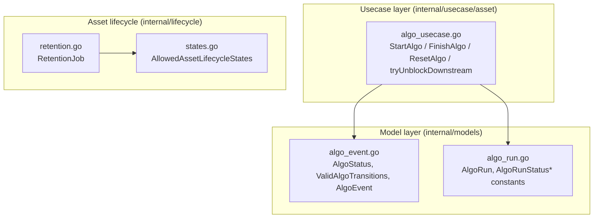
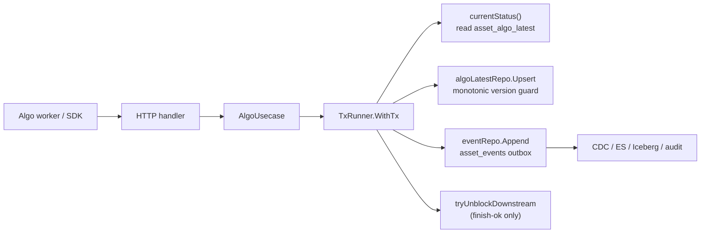
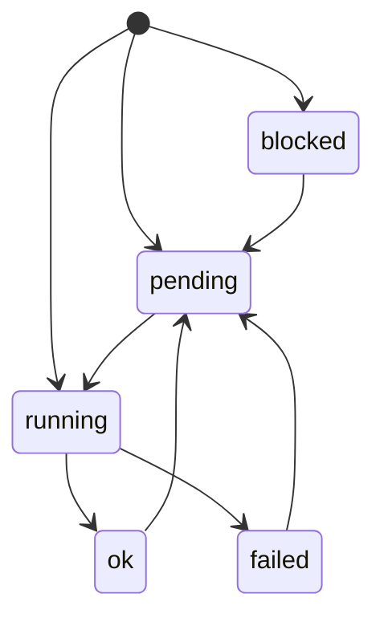
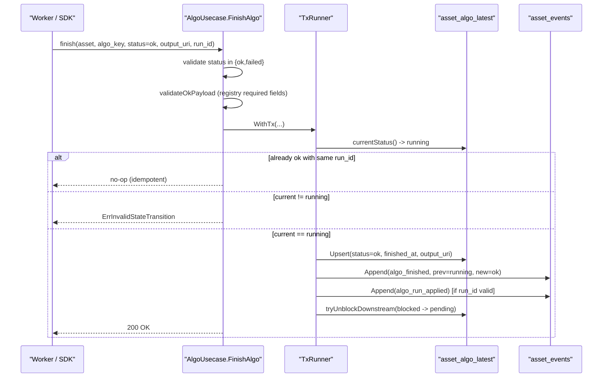
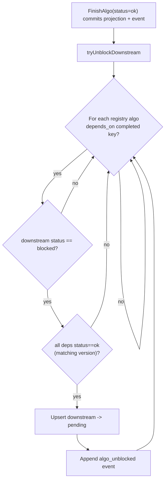
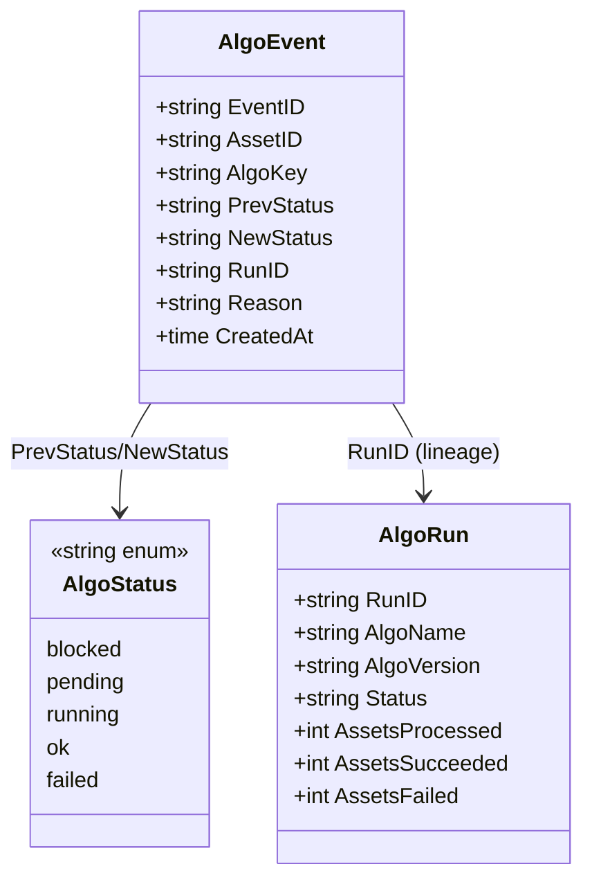
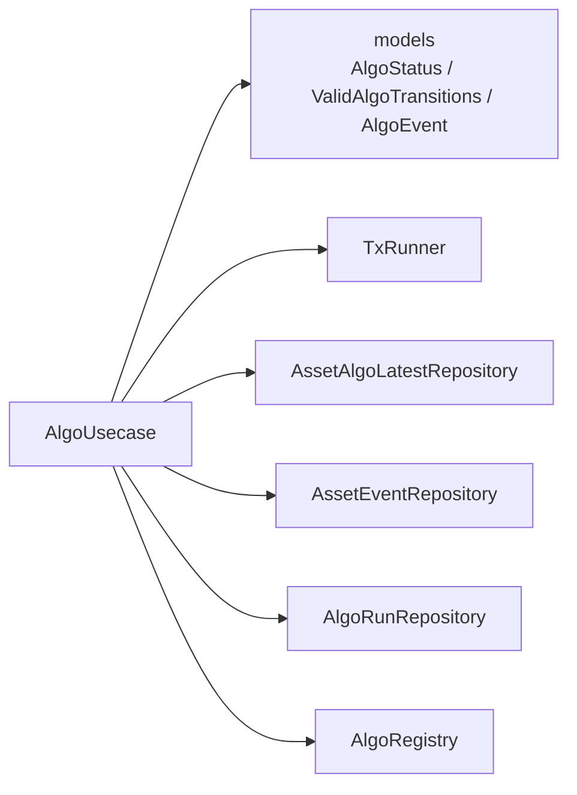

# Algorithm State Machine

<cite>
**Referenced Files in This Document**

- [backend/internal/models/algo_event.go](file://backend/internal/models/algo_event.go)
- [backend/internal/models/algo_run.go](file://backend/internal/models/algo_run.go)
- [backend/internal/usecase/asset/algo_usecase.go](file://backend/internal/usecase/asset/algo_usecase.go)
- [backend/internal/lifecycle/states.go](file://backend/internal/lifecycle/states.go)
- [backend/internal/lifecycle/retention.go](file://backend/internal/lifecycle/retention.go)
- [docs/review/algo-lifecycle-and-data-model.md](file://docs/review/algo-lifecycle-and-data-model.md)
</cite>

## Table of Contents
1. [Introduction](#introduction)
2. [Project Structure](#project-structure)
3. [Core Components](#core-components)
4. [Architecture Overview](#architecture-overview)
5. [Detailed Component Analysis](#detailed-component-analysis)
6. [Dependency Analysis](#dependency-analysis)
7. [Performance Considerations](#performance-considerations)
8. [Troubleshooting Guide](#troubleshooting-guide)
9. [Conclusion](#conclusion)
10. [Appendices](#appendices)

## Introduction

The algorithm state machine governs the per-algorithm lifecycle of a single algorithm
running on a single asset (a Segment-level data unit). Every `(asset_id, algo_name)`
pair owns exactly one current-state row in the `asset_algo_latest` projection table,
and that row's `status` column moves through a small, strictly enforced set of states:
`blocked`, `pending`, `running`, `ok`, and `failed`. The set of legal moves between
those states is declared as data in a single map, `ValidAlgoTransitions`, which serves
as the documented contract for the whole subsystem.

The state machine exists to make algorithm execution deterministic and auditable across
many independent, externally-scheduled algorithm workers (Ray jobs, k8s Jobs, ad-hoc
scripts). Workers do not coordinate with one another; they only call `start` / `finish`
/ `reset` endpoints on the platform. The platform enforces that those calls form a legal
trajectory, rejects illegal ones, and appends an immutable `asset_events` record for each
accepted transition so that downstream consumers (Elasticsearch sync, Iceberg sink, audit,
replay) can reconstruct history deterministically.

The two model files anchor the contract. `AlgoStatus` and `ValidAlgoTransitions` define
the states and legal edges; `AlgoEvent` defines the shape of each persisted transition
record (`prev_status` → `new_status`). The usecase layer (`AlgoUsecase`) is where the
state machine is actually enforced and where events are emitted in the same transaction
as the projection write.

**Section sources**
- [backend/internal/models/algo_event.go](file://backend/internal/models/algo_event.go#L1-L54)
- [backend/internal/usecase/asset/algo_usecase.go](file://backend/internal/usecase/asset/algo_usecase.go#L1-L65)
- [docs/review/algo-lifecycle-and-data-model.md](file://docs/review/algo-lifecycle-and-data-model.md#L35-L88)

## Project Structure

The state machine spans three layers: the **model layer** declares the states, the legal
transition map, and the event record shape; the **usecase layer** enforces the machine and
emits events transactionally; and a separate **lifecycle package** holds the asset-level
`lifecycle_state` values (a distinct machine, listed here only to avoid confusion with the
per-algorithm status).



The model files are intentionally thin. `algo_event.go` declares the `AlgoStatus` string
type, the five status constants, the field-suffix constants used by the legacy flat-key
representation, and the `ValidAlgoTransitions` map. `algo_run.go` declares the `AlgoRun`
execution-event row and a separate, coarser set of run-level status constants
(`pending` / `running` / `ok` / `failed` / `cancelled`) used by the run-tracking subsystem.

`algo_usecase.go` is the enforcement point. It depends only on the projection repository
(`asset_algo_latest`), the event/outbox repository (`asset_events`), the optional run
repository, and the algorithm registry — never on the `assets` row itself.

The `internal/lifecycle` package is **not** part of the algorithm state machine. It owns the
asset-level `lifecycle_state` (`created` / `processing` / `ready` / `delivered` / `archived`
/ `superseded` / `failed` / `rejected`), which is a different concept tracked on the `assets`
row and policed by a PostgreSQL CHECK constraint. It is referenced here to keep the two
machines distinct.

**Diagram sources**
- [backend/internal/models/algo_event.go](file://backend/internal/models/algo_event.go#L18-L53)
- [backend/internal/models/algo_run.go](file://backend/internal/models/algo_run.go#L5-L12)
- [backend/internal/usecase/asset/algo_usecase.go](file://backend/internal/usecase/asset/algo_usecase.go#L83-L114)
- [backend/internal/lifecycle/states.go](file://backend/internal/lifecycle/states.go#L6-L17)

**Section sources**
- [backend/internal/models/algo_event.go](file://backend/internal/models/algo_event.go#L1-L54)
- [backend/internal/models/algo_run.go](file://backend/internal/models/algo_run.go#L1-L51)
- [backend/internal/lifecycle/states.go](file://backend/internal/lifecycle/states.go#L1-L17)

## Core Components

#### The AlgoStatus type and status constants

`AlgoStatus` is a `string`-based type with exactly five named values. These are the only
states the per-algorithm machine ever occupies on a persisted projection row.

| Constant | Literal | Meaning |
|----------|---------|---------|
| `AlgoStatusBlocked` | `blocked` | Dependencies not yet satisfied; cannot start |
| `AlgoStatusPending` | `pending` | Eligible to start |
| `AlgoStatusRunning` | `running` | A worker has claimed it via `start` |
| `AlgoStatusOk` | `ok` | Finished successfully |
| `AlgoStatusFailed` | `failed` | Finished with an error |

In addition to the five literal states, the machine recognizes a sentinel **empty string**
(`""`) that represents "this algorithm has never run on this asset" — i.e. no projection
row exists yet. The empty string is a legal *starting* point but is never persisted as a
status value.

#### ValidAlgoTransitions

`ValidAlgoTransitions` is the single source of truth for legal edges. The map key is the
current status (with `""` as the no-prior-row sentinel) and the value is the list of allowed
next statuses.

```go
var ValidAlgoTransitions = map[AlgoStatus][]AlgoStatus{
    "":                {AlgoStatusBlocked, AlgoStatusPending, AlgoStatusRunning},
    AlgoStatusBlocked: {AlgoStatusPending},
    AlgoStatusPending: {AlgoStatusRunning},
    AlgoStatusRunning: {AlgoStatusOk, AlgoStatusFailed},
    AlgoStatusFailed:  {AlgoStatusPending},
    AlgoStatusOk:      {AlgoStatusPending},
}
```

Read literally, the legal moves are:

- From **no prior row** (`""`): may become `blocked`, `pending`, or `running`.
- From **blocked**: may only become `pending` (via dependency satisfaction / unblock).
- From **pending**: may only become `running` (via `start`).
- From **running**: may become `ok` or `failed` (via `finish`).
- From **failed**: may only become `pending` (via `reset`, i.e. retry).
- From **ok**: may only become `pending` (via `reset`, i.e. re-run).

There is no edge out of `ok` or `failed` other than back to `pending`; a finished algorithm
must be explicitly reset before it can run again. There is no direct `blocked → running`
edge — a blocked algorithm always passes through `pending` first.

#### AlgoEvent

`AlgoEvent` is the read-model shape returned for one recorded transition. Each accepted
state change produces one such logical record, carrying the prior and new status.

| Field | Type | Notes |
|-------|------|-------|
| `EventID` | `string` | Unique event identifier |
| `AssetID` | `string` | Owning asset |
| `AlgoKey` | `string` | `name@version` |
| `PrevStatus` | `*string` | Nil when there was no prior status |
| `NewStatus` | `string` | The status after the transition |
| `RunID` | `*string` | External orchestrator run id (lineage) |
| `Reason` | `*string` | Failure reason, when applicable |
| `CreatedAt` | `time.Time` | Append timestamp |

`PrevStatus` is a pointer precisely because the first transition out of `""` has no prior
value. The doc comment notes the row originally mirrored a dedicated `asset_algo_events`
table, but the live system sources these records from the unified `asset_events` outbox.

**Section sources**
- [backend/internal/models/algo_event.go](file://backend/internal/models/algo_event.go#L18-L53)
- [backend/internal/usecase/asset/algo_usecase.go](file://backend/internal/usecase/asset/algo_usecase.go#L46-L65)

## Architecture Overview

The state machine is enforced server-side and emitted as events in one atomic step. A
request handler routes to one of three `AlgoUsecase` methods (`StartAlgo`, `FinishAlgo`,
`ResetAlgo`); each opens a transaction, reads the current status, checks the move against
the documented machine, upserts the projection row, and appends an `asset_events` record —
all in the same transaction. For successful finishes, a fourth implicit move
(`tryUnblockDownstream`) can flip dependent `blocked` algorithms to `pending` within the
same transaction.



The projection write and the event append always commit together; a downstream consumer
never sees a state change that lacks its event, and never an event without its state change.
The `assets.version` column is deliberately **not** bumped on algorithm transitions —
algorithm state is owned by `asset_algo_latest`, not by the `assets` row.

**Diagram sources**
- [backend/internal/usecase/asset/algo_usecase.go](file://backend/internal/usecase/asset/algo_usecase.go#L294-L333)
- [backend/internal/usecase/asset/algo_usecase.go](file://backend/internal/usecase/asset/algo_usecase.go#L380-L463)

**Section sources**
- [backend/internal/usecase/asset/algo_usecase.go](file://backend/internal/usecase/asset/algo_usecase.go#L1-L18)
- [docs/review/algo-lifecycle-and-data-model.md](file://docs/review/algo-lifecycle-and-data-model.md#L57-L88)

## Detailed Component Analysis

### The state machine, exactly as declared

The diagram below is a direct transcription of `ValidAlgoTransitions`. Every edge below
corresponds to one entry in the map; no edge is added or omitted. `[*]` is the initial
pseudo-state, standing for the empty-string sentinel (no prior projection row).



Note the asymmetry that the map encodes: the only way to leave `ok` or `failed` is to go
back to `pending`, and the only way to leave `blocked` is to go to `pending`. The three
initial edges (`blocked` / `pending` / `running`) are the only statuses a brand-new row may
take on its first write.

**Diagram sources**
- [backend/internal/models/algo_event.go](file://backend/internal/models/algo_event.go#L46-L53)

**Section sources**
- [backend/internal/models/algo_event.go](file://backend/internal/models/algo_event.go#L43-L53)

### StartAlgo — pending/`""` → running

`StartAlgo` validates the `algo_key` against the registry, confirms the asset exists,
optionally validates the supplied `run_id` against the run repository, then opens a
transaction. Inside the transaction it reads the current status and uses a `switch` to
reject every illegal prior state explicitly:

- `running` → `ErrAlgoAlreadyRunning`
- `blocked` → `ErrInvalidStateTransition` ("dependencies not met")
- `ok` → `ErrInvalidStateTransition` ("must reset first")
- `failed` → `ErrInvalidStateTransition` ("must reset first")
- `pending` or `""` → allowed

This `switch` is the runtime realization of the `pending → running` and `"" → running`
edges in `ValidAlgoTransitions`. On the allowed branch it upserts the projection row with
`status = running`, sets `started_at`, `method`, and `run_id`, and appends an
`algo_started` event whose payload carries `prev_status` and `new_status=running`.

**Section sources**
- [backend/internal/usecase/asset/algo_usecase.go](file://backend/internal/usecase/asset/algo_usecase.go#L273-L334)

### FinishAlgo — running → ok / failed

`FinishAlgo` first validates that the requested finish status is one of `ok` or `failed`
(anything else is rejected immediately). For `ok` it validates the registry-required output
payload (`output_uri`, declared `required_fields`, and `result_size_bytes` when
`report_size=true`). For `failed` it requires a non-empty `reason`.

Inside the transaction it reads the current status. Two special paths apply:

1. **Idempotent retry**: if the current status is already `ok` and the supplied `run_id`
   matches the persisted `run_id`, the call returns `nil` with no change — this absorbs
   at-least-once retries from external workers.
2. **Strict guard**: if the current status is anything other than `running`, the call is
   rejected with `ErrInvalidStateTransition` ("only running can be finished"). This realizes
   the `running → {ok, failed}` edges.

On success it upserts the projection row with the new terminal status (and `finished_at`,
plus `output_uri`/`result_summary` for `ok` or `error_message` for `failed`), appends the
`algo_finished` or `algo_failed` event, optionally appends an `algo_run_applied` event when
a valid `run_id` is present, and — for `ok` finishes only — calls `tryUnblockDownstream`.

The failure path additionally classifies the reason into a `failure_mode` (timeout,
algo_error, sensor_fault, env_mismatch, low_quality, annotation_drift, or unknown) and
attaches it to the event payload.



**Diagram sources**
- [backend/internal/usecase/asset/algo_usecase.go](file://backend/internal/usecase/asset/algo_usecase.go#L350-L464)

**Section sources**
- [backend/internal/usecase/asset/algo_usecase.go](file://backend/internal/usecase/asset/algo_usecase.go#L340-L497)

### ResetAlgo — ok / failed → pending

`ResetAlgo` is the only path that leaves the two terminal states. Inside its transaction it
reads the current status and rejects anything that is not `failed` or `ok`
(`ErrInvalidStateTransition`, "only failed or ok can be reset"). On the allowed branch it
upserts the row with `status = pending` (leaving `run_id`, `output_uri`, error fields, and
timestamps cleared by not re-setting them) and appends an `algo_reset` event with
`new_status=pending`. This realizes both the `failed → pending` and `ok → pending` edges.

**Section sources**
- [backend/internal/usecase/asset/algo_usecase.go](file://backend/internal/usecase/asset/algo_usecase.go#L503-L540)

### tryUnblockDownstream — blocked → pending

The `blocked → pending` edge is not driven by a direct client call; it is a cascade. When an
algorithm finishes `ok`, `tryUnblockDownstream` walks the registry for algorithms whose
`depends_on` lists the just-completed `name@version`. For each such downstream algorithm that
is currently `blocked` **and** whose dependencies are all satisfied (every dependency row
exists with matching version and `status=ok`), it upserts the downstream row to `pending` and
appends an `algo_unblocked` event (`prev=blocked`, `new=pending`). Because this runs inside
the finishing transaction, the unblock and the original finish commit atomically.



**Diagram sources**
- [backend/internal/usecase/asset/algo_usecase.go](file://backend/internal/usecase/asset/algo_usecase.go#L557-L606)

**Section sources**
- [backend/internal/usecase/asset/algo_usecase.go](file://backend/internal/usecase/asset/algo_usecase.go#L546-L638)

### The event types that drive the machine

Each accepted transition emits a typed `asset_events` row. The usecase declares six event
type constants; five of them correspond one-to-one with a state-machine edge, while
`algo_run_applied` is a lineage marker emitted alongside a finish when a valid `run_id` is
present.

| Event type | Constant | Edge | Notes |
|------------|----------|------|-------|
| `algo_started` | `eventAlgoStarted` | pending/`""` → running | Carries `method`, `run_id` |
| `algo_finished` | `eventAlgoFinished` | running → ok | Carries `output_uri`, `result_summary` |
| `algo_failed` | `eventAlgoFailed` | running → failed | Carries `reason`, `failure_mode` |
| `algo_reset` | `eventAlgoReset` | ok/failed → pending | Clears terminal fields |
| `algo_unblocked` | `eventAlgoUnblocked` | blocked → pending | Cascade from finish-ok |
| `algo_run_applied` | `eventAlgoRunApplied` | (no state edge) | Lineage marker on finish |

`algoEventTypes` (the slice used by `ListAlgoEvents` to filter the outbox) lists the first
five — the run-applied marker is excluded from the algo-lifecycle view. Every payload is
built by `makePayload`, which emits a stable `v1` shape with `algo_key`, `algo_name`,
`algo_version`, `prev_status`, `new_status`, and optional `run_id` / `reason`.

**Section sources**
- [backend/internal/usecase/asset/algo_usecase.go](file://backend/internal/usecase/asset/algo_usecase.go#L46-L65)
- [backend/internal/usecase/asset/algo_usecase.go](file://backend/internal/usecase/asset/algo_usecase.go#L195-L226)
- [docs/review/algo-lifecycle-and-data-model.md](file://docs/review/algo-lifecycle-and-data-model.md#L78-L88)

### Relationship of AlgoRun status to the per-algorithm machine

`AlgoRun` (in `algo_run.go`) is a separate, first-class execution-event row that tracks a
whole orchestrator run. Its status constants — `pending`, `running`, `ok`, `failed`,
`cancelled` — overlap with the per-algorithm machine but are **not** the same machine: a
run aggregates many `(asset, algo)` transitions and adds `cancelled`, which the per-algorithm
machine has no concept of. `FinishAlgo` links the two by emitting `algo_run_applied` and by
validating the supplied `run_id` against the run repository, but the run-level status is not
governed by `ValidAlgoTransitions`.



**Diagram sources**
- [backend/internal/models/algo_run.go](file://backend/internal/models/algo_run.go#L5-L50)
- [backend/internal/models/algo_event.go](file://backend/internal/models/algo_event.go#L7-L29)

**Section sources**
- [backend/internal/models/algo_run.go](file://backend/internal/models/algo_run.go#L1-L51)

## Dependency Analysis

The state machine's declaration (`ValidAlgoTransitions`) has no dependencies — it is pure
data in the `models` package. Enforcement lives in `AlgoUsecase`, which depends on four
collaborators and the model constants.



`AlgoUsecase` is constructed with the transaction runner, an asset existence-check repo, the
projection repo, the event repo, and the registry; the run repo is wired separately via
`SetAlgoRunRepo`. Crucially the usecase holds `existenceRepo` only for read-only "asset must
exist" guards and never writes to the `assets` table, so algorithm transitions do not contend
on `assets.version`.

**Diagram sources**
- [backend/internal/usecase/asset/algo_usecase.go](file://backend/internal/usecase/asset/algo_usecase.go#L83-L119)

**Section sources**
- [backend/internal/usecase/asset/algo_usecase.go](file://backend/internal/usecase/asset/algo_usecase.go#L83-L136)

## Performance Considerations

The design splits "current state" from "history" specifically to scale to Segment-level
volume (millions to tens of millions of assets × 5–10 algorithms each). Current state lives
in `asset_algo_latest` as one row per `(asset_id, algo_name)`, queryable by primary key or a
`(algo_name, status)` B-tree — no `GROUP BY ... ORDER BY` to find the latest. History lives
in the append-only `asset_events` outbox, which is sequential-write friendly and partitionable.

Concurrency safety is achieved without locking the `assets` row. Two finishes for distinct
`(asset_id, algo_name)` pairs touch different rows and never contend. Two finishes for the
same algorithm but different versions are resolved by a monotonic guard in the projection
upsert (`WHERE algo_version <= EXCLUDED.algo_version`), so a late-arriving older version is
silently dropped rather than overwriting a newer one. Same-version concurrent finishes
converge under last-writer-wins, and both events are emitted (at-least-once). The idempotent
retry short-circuit in `FinishAlgo` (already-`ok` with matching `run_id` → no-op) prevents
retry storms from amplifying write traffic.

`ListAlgoEvents` caps its read at 200 rows and filters the outbox to the algo event types,
keeping the history read bounded.

**Section sources**
- [backend/internal/usecase/asset/algo_usecase.go](file://backend/internal/usecase/asset/algo_usecase.go#L340-L392)
- [backend/internal/usecase/asset/algo_usecase.go](file://backend/internal/usecase/asset/algo_usecase.go#L657-L675)
- [docs/review/algo-lifecycle-and-data-model.md](file://docs/review/algo-lifecycle-and-data-model.md#L90-L127)

## Troubleshooting Guide

#### "invalid state transition" on start

`StartAlgo` rejects any prior status other than `pending` or `""`. The most common causes:
the algorithm is `blocked` (its dependencies have not all reached `ok`), or it already
finished (`ok` / `failed`) and was not reset. Resolution: call `reset` to return it to
`pending`, or finish the upstream dependency `ok` so the cascade unblocks it.

#### "algorithm is already running"

A `start` arrived while the projection row is already `running`. This is the dedicated
`ErrAlgoAlreadyRunning` guard, distinct from the generic invalid-transition error. It usually
means two workers claimed the same `(asset, algo)`; only one should proceed.

#### "only running can be finished"

`FinishAlgo` rejects any current status other than `running` (unless it is the idempotent
already-`ok`-same-`run_id` no-op). A finish that arrives for a `pending` or already-terminal
algorithm hits this guard — typically a duplicate finish with a *different* `run_id`, or a
finish that lost the race to a reset.

#### "missing reason for failed status" / missing required field

A `finish` with `status=failed` and no `reason` is rejected (`ErrMissingReason`). A
`finish` with `status=ok` that omits the registry-required `output_uri`, a declared
`required_field`, or `result_size_bytes` (when `report_size=true`) is rejected with
`ErrMissingRequiredField`.

#### Downstream never unblocks

If a `blocked` algorithm stays blocked after its dependency finished, check that the
dependency's `depends_on` entries are *versioned* (`name@version`) and that every dependency
row exists with the exact matching version and `status=ok`. A version mismatch or a missing
row counts as "not satisfied" and the cascade skips the downstream algorithm.

#### Confusing algo status with asset lifecycle_state

`blocked/pending/running/ok/failed` are the per-algorithm statuses. The asset-level
`lifecycle_state` (`created`/`processing`/`ready`/`delivered`/`archived`/`superseded`/
`failed`/`rejected`) is a different machine enforced by a PostgreSQL CHECK constraint and
managed by the `RetentionJob`. The literal `failed` appears in both — be sure which table
you are reading.

**Section sources**
- [backend/internal/usecase/asset/algo_usecase.go](file://backend/internal/usecase/asset/algo_usecase.go#L34-L44)
- [backend/internal/usecase/asset/algo_usecase.go](file://backend/internal/usecase/asset/algo_usecase.go#L299-L312)
- [backend/internal/usecase/asset/algo_usecase.go](file://backend/internal/usecase/asset/algo_usecase.go#L386-L392)
- [backend/internal/lifecycle/states.go](file://backend/internal/lifecycle/states.go#L6-L17)
- [backend/internal/lifecycle/retention.go](file://backend/internal/lifecycle/retention.go#L72-L113)

## Conclusion

The algorithm state machine is small, data-driven, and rigorously enforced. Five states plus
an empty-string sentinel, six declared edges in `ValidAlgoTransitions`, and three client
operations (`start`, `finish`, `reset`) plus one internal cascade (`tryUnblockDownstream`)
account for the entire lifecycle. Every accepted transition is persisted as a typed
`asset_events` record in the same transaction as the projection write, giving a deterministic,
auditable history that downstream consumers can replay. By owning state in `asset_algo_latest`
rather than on the `assets` row, the design lets independent algorithm workers run
concurrently at Segment scale without lock contention.

## Appendices

### Appendix A — Status constants

| Go constant | Literal |
|-------------|---------|
| `AlgoStatusBlocked` | `blocked` |
| `AlgoStatusPending` | `pending` |
| `AlgoStatusRunning` | `running` |
| `AlgoStatusOk` | `ok` |
| `AlgoStatusFailed` | `failed` |
| (sentinel) | `""` (no prior row) |

**Section sources**
- [backend/internal/models/algo_event.go](file://backend/internal/models/algo_event.go#L23-L29)

### Appendix B — ValidAlgoTransitions edge table

| From | Allowed next | Driver |
|------|--------------|--------|
| `""` | `blocked`, `pending`, `running` | first projection write |
| `blocked` | `pending` | `tryUnblockDownstream` |
| `pending` | `running` | `StartAlgo` |
| `running` | `ok`, `failed` | `FinishAlgo` |
| `failed` | `pending` | `ResetAlgo` |
| `ok` | `pending` | `ResetAlgo` |

**Section sources**
- [backend/internal/models/algo_event.go](file://backend/internal/models/algo_event.go#L46-L53)

### Appendix C — Event type constants

| Constant | Literal | In `algoEventTypes` filter |
|----------|---------|----------------------------|
| `eventAlgoStarted` | `algo_started` | yes |
| `eventAlgoFinished` | `algo_finished` | yes |
| `eventAlgoFailed` | `algo_failed` | yes |
| `eventAlgoReset` | `algo_reset` | yes |
| `eventAlgoUnblocked` | `algo_unblocked` | yes |
| `eventAlgoRunApplied` | `algo_run_applied` | no |

**Section sources**
- [backend/internal/usecase/asset/algo_usecase.go](file://backend/internal/usecase/asset/algo_usecase.go#L46-L65)

### Appendix D — AlgoRun status constants (separate machine)

| Go constant | Literal |
|-------------|---------|
| `AlgoRunStatusPending` | `pending` |
| `AlgoRunStatusRunning` | `running` |
| `AlgoRunStatusOK` | `ok` |
| `AlgoRunStatusFailed` | `failed` |
| `AlgoRunStatusCancelled` | `cancelled` |

**Section sources**
- [backend/internal/models/algo_run.go](file://backend/internal/models/algo_run.go#L5-L12)
