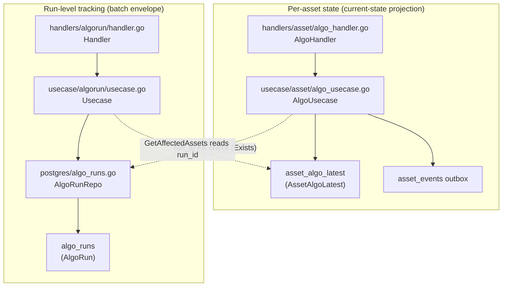
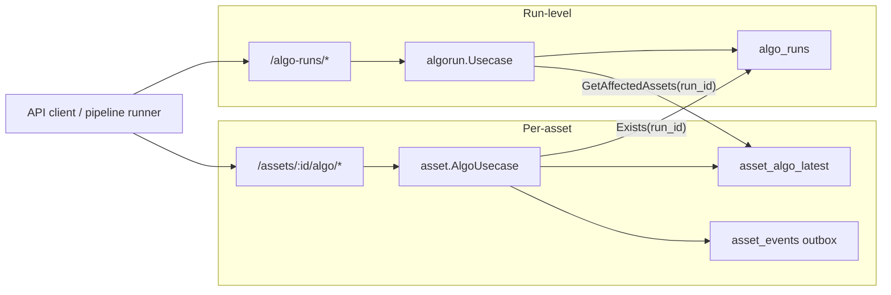
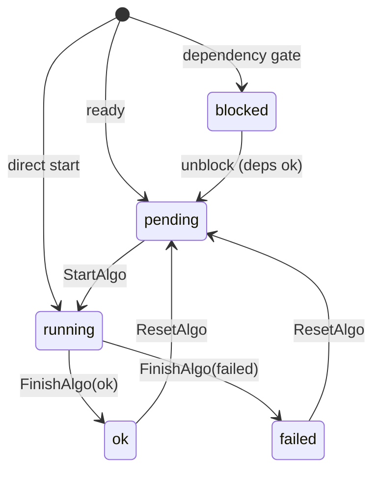
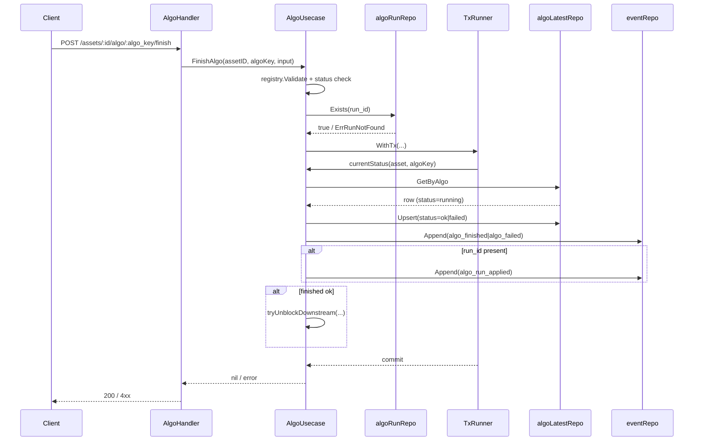
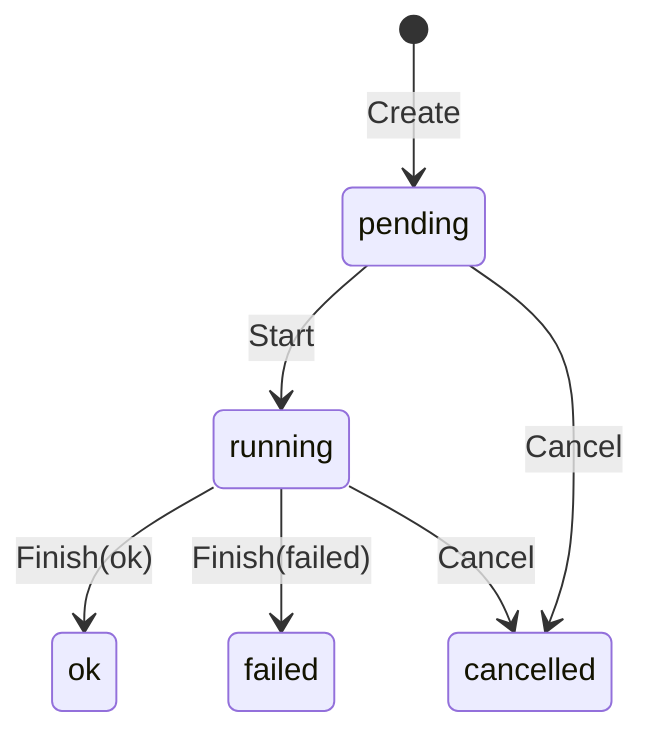
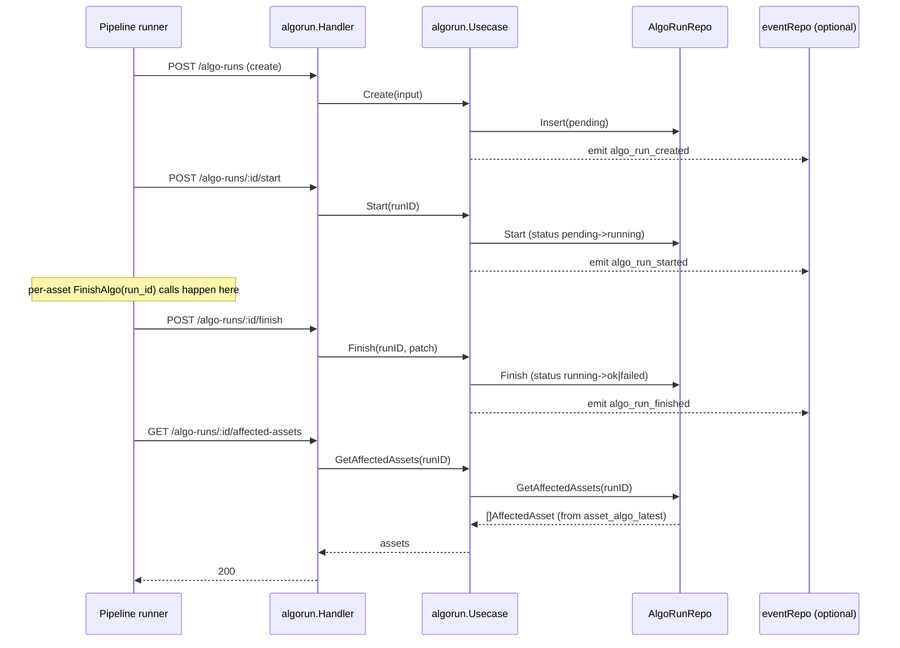
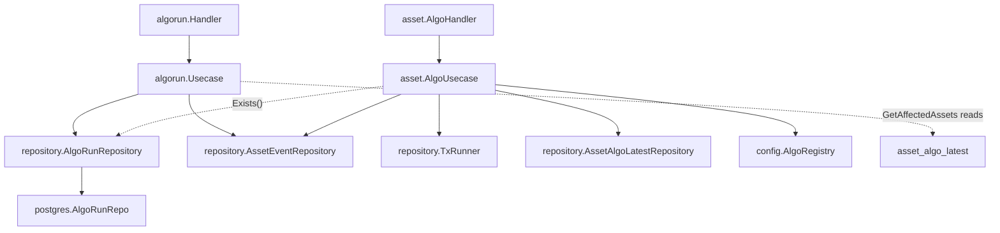

# Algorithm Lifecycle Module

<cite>
**Referenced Files in This Document**

- [backend/internal/handlers/algorun/handler.go](file://backend/internal/handlers/algorun/handler.go)
- [backend/internal/usecase/algorun/usecase.go](file://backend/internal/usecase/algorun/usecase.go)
- [backend/internal/models/algo_run.go](file://backend/internal/models/algo_run.go)
- [backend/internal/models/algo_event.go](file://backend/internal/models/algo_event.go)
- [backend/internal/usecase/asset/algo_usecase.go](file://backend/internal/usecase/asset/algo_usecase.go)
- [backend/internal/repository/algo_run_repository.go](file://backend/internal/repository/algo_run_repository.go)
- [backend/internal/postgres/algo_runs.go](file://backend/internal/postgres/algo_runs.go)
- [backend/internal/models/schema_evolution.go](file://backend/internal/models/schema_evolution.go)
- [backend/routes/routes.go](file://backend/routes/routes.go)
</cite>

## Table of Contents
1. [Introduction](#introduction)
2. [Project Structure](#project-structure)
3. [Core Components](#core-components)
4. [Architecture Overview](#architecture-overview)
5. [Detailed Component Analysis](#detailed-component-analysis)
6. [Dependency Analysis](#dependency-analysis)
7. [Performance Considerations](#performance-considerations)
8. [Troubleshooting Guide](#troubleshooting-guide)
9. [Conclusion](#conclusion)
10. [Appendices](#appendices)

## Introduction

The Algorithm Lifecycle module tracks how algorithms execute against assets in
cyber-databrew. It is split into two complementary halves that answer two
different questions:

- **Per-asset current state** — "what is the latest status of algorithm
  `name@version` on asset `X` right now?" This is owned by the
  `AlgoUsecase` (package `asset`), which maintains the `asset_algo_latest`
  projection and enforces a strict per-asset state machine
  (`blocked → pending → running → ok|failed`).
- **Run-level / batch tracking** — "what was the execution called run `R`, who
  triggered it, how many assets did it process, what did it cost, and did it
  succeed?" This is owned by the `algorun.Usecase` and the `algo_runs` table,
  a first-class execution-event record introduced by CYB-1018.

The two halves are deliberately decoupled. A *run* is the batch envelope; an
*asset algo state* is one cell of work the run touched. They are joined only by
a `run_id` string: per-asset finishes record the `run_id` they belong to, and
the run-level API can fan back out to "which assets did this run affect?" by
querying the projection on that `run_id`. Neither side takes a lock on the
other, and neither bumps `assets.version`.

This page is the module overview. It explains both projections, the state
machine they share conceptually, the run lifecycle endpoints, the outbox/event
emission on each side, and exactly how `run_id` stitches them together.

**Section sources**
- [backend/internal/models/algo_run.go](file://backend/internal/models/algo_run.go#L1-L50)
- [backend/internal/usecase/asset/algo_usecase.go](file://backend/internal/usecase/asset/algo_usecase.go#L1-L65)
- [backend/internal/models/algo_event.go](file://backend/internal/models/algo_event.go#L18-L53)

## Project Structure

The module spans handlers, usecases, repository contracts, the Postgres
implementation, and the models that define the wire/DB shapes. The run-level
half lives under `algorun/`; the per-asset half lives in the `asset` usecase
package.

Relevant files:

- `backend/internal/handlers/algorun/handler.go` — HTTP layer for
  `/algo-runs`: `Create`, `Start`, `Finish`, `Get`, `List`, `Cancel`,
  `GetAffectedAssets`, plus the error mapper `mapAlgoRunErr`.
- `backend/internal/usecase/algorun/usecase.go` — run lifecycle business logic,
  input validation, and best-effort outbox emission for `algo_run_*` events.
- `backend/internal/models/algo_run.go` — the `AlgoRun` row struct and the five
  run status constants.
- `backend/internal/usecase/asset/algo_usecase.go` — per-asset algorithm
  lifecycle: `StartAlgo`, `FinishAlgo`, `ResetAlgo`, dependency unblocking,
  event listing, and current-state listing.
- `backend/internal/models/algo_event.go` — `AlgoEvent`, the `AlgoStatus` enum,
  and the canonical `ValidAlgoTransitions` state machine.
- `backend/internal/models/schema_evolution.go` — `AssetAlgoLatest`, the
  per-asset projection row.
- `backend/internal/repository/algo_run_repository.go` — the `AlgoRunRepository`
  interface, `AffectedAsset`, and the run-level sentinel errors.
- `backend/internal/postgres/algo_runs.go` — the SQL implementation, including
  the status-guarded `UPDATE … WHERE status = $n` transitions.

**Diagram sources**
- [backend/internal/usecase/asset/algo_usecase.go](file://backend/internal/usecase/asset/algo_usecase.go#L83-L119)
- [backend/internal/usecase/algorun/usecase.go](file://backend/internal/usecase/algorun/usecase.go#L84-L97)
- [backend/internal/postgres/algo_runs.go](file://backend/internal/postgres/algo_runs.go#L326-L353)

**Section sources**
- [backend/routes/routes.go](file://backend/routes/routes.go#L217-L303)
- [backend/internal/repository/algo_run_repository.go](file://backend/internal/repository/algo_run_repository.go#L45-L67)

## Core Components

#### `AlgoRun` (run-level row)

`AlgoRun` is the first-class execution-event row persisted in `algo_runs`. It
carries identity (`RunID`, `AlgoName`, `AlgoVersion`, `AlgoKind`,
`TriggeredBy`), lifecycle status (`Status`), timing (`StartedAt`,
`FinishedAt`, `DurationNs`), inputs (`InputFilter`, `InputAssetIDs`, `Params`),
provenance (`CodeCommit`, `ImageDigest`, `PipelineName`, `PipelineVersion`),
aggregate counters (`AssetsProcessed`, `AssetsSucceeded`, `AssetsFailed`,
`ActionsCreated`, `MetricsWritten`), cost (`CPUSeconds`, `GPUSeconds`,
`CostUSDMicros`), failure details (`ErrorClass`, `ErrorMessage`), and an
optimistic-concurrency `RowVersion`.

The run status domain is closed and defined as constants:
`pending`, `running`, `ok`, `failed`, `cancelled`.

**Section sources**
- [backend/internal/models/algo_run.go](file://backend/internal/models/algo_run.go#L5-L50)

#### `algorun.Usecase` (run lifecycle)

`Usecase` holds an `AlgoRunRepository` and an optional `AssetEventRepository`.
When the event repo is wired via `SetEventRepo`, each state transition emits a
best-effort outbox event (`algo_run_created`, `algo_run_started`,
`algo_run_finished`, `algo_run_cancelled`) through `emitAlgoRunEvent`. Emission
never blocks or fails the primary mutation — errors are swallowed by design.

The usecase enforces input rules: `run_id` must be 16 alphanumeric characters
(auto-generated when omitted), `algo_kind` must be one of `processing`,
`split`, `qa`, `enrichment` (defaulting to `processing`), and `finish` status
must be exactly `ok` or `failed` with `error_message` mandatory for `failed`.

**Section sources**
- [backend/internal/usecase/algorun/usecase.go](file://backend/internal/usecase/algorun/usecase.go#L84-L170)
- [backend/internal/usecase/algorun/usecase.go](file://backend/internal/usecase/algorun/usecase.go#L202-L294)

#### `AlgoUsecase` (per-asset current state)

`AlgoUsecase` owns the per-asset projection. Its source-of-truth model is
documented inline: `asset_algo_latest` holds current per-algorithm state keyed
by `(asset_id, algo_name)` with a monotonic guard on `algo_version`;
`asset_events` is the append-only CDC stream written in the *same transaction*
as the projection; and `assets.version` is intentionally never bumped on algo
state changes. The usecase depends only on projection/outbox repos plus a
read-only existence repo — it never writes the `assets` row.

**Section sources**
- [backend/internal/usecase/asset/algo_usecase.go](file://backend/internal/usecase/asset/algo_usecase.go#L1-L18)
- [backend/internal/usecase/asset/algo_usecase.go](file://backend/internal/usecase/asset/algo_usecase.go#L83-L136)

#### `AssetAlgoLatest` and `AlgoEvent`

`AssetAlgoLatest` is the projection row: `(AssetID, AlgoName, AlgoVersion,
Status)` plus result fields (`ResultTag`, `ResultScore`, `ResultSummary`,
`OutputURI`), execution context (`RunID`, `Method`, `ModelURI`), error fields,
and timestamps. `AlgoEvent` is the per-asset transition record surfaced by the
API, reconstructed from the `asset_events` outbox rather than a dedicated
table.

**Section sources**
- [backend/internal/models/schema_evolution.go](file://backend/internal/models/schema_evolution.go#L29-L53)
- [backend/internal/models/algo_event.go](file://backend/internal/models/algo_event.go#L5-L41)

#### The shared state machine

The legal per-asset transitions are codified in `ValidAlgoTransitions`. The
empty string is the sentinel for "algorithm has never run on this asset" and is
a legal starting state. Note `cancelled` is **not** a per-asset state — it
exists only at the run level (`AlgoRun.Status`).

**Section sources**
- [backend/internal/models/algo_event.go](file://backend/internal/models/algo_event.go#L21-L53)

## Architecture Overview

The two halves run side by side. The per-asset half is transactional and
ordering-sensitive; the run-level half is a thin CRUD-plus-state-guard service.
They never share a transaction. The only runtime coupling is the optional
`run_id` validation in `AlgoUsecase.requireRegisteredRun`, which calls
`AlgoRunRepository.Exists`, and the reverse `GetAffectedAssets` lookup, which
reads the projection by `run_id`.

A typical batch workflow: a runner creates a run (`pending`), starts it
(`running`), then for each asset calls the per-asset `StartAlgo`/`FinishAlgo`
passing the same `run_id`; finally the runner finishes the run with aggregate
counters. The run row records the rollup; the projection rows record per-asset
outcomes that can be re-joined via `GetAffectedAssets`.

**Diagram sources**
- [backend/routes/routes.go](file://backend/routes/routes.go#L217-L303)
- [backend/internal/usecase/asset/algo_usecase.go](file://backend/internal/usecase/asset/algo_usecase.go#L121-L136)
- [backend/internal/postgres/algo_runs.go](file://backend/internal/postgres/algo_runs.go#L326-L353)

## Detailed Component Analysis

### Per-asset algorithm state machine

`ValidAlgoTransitions` is the authoritative map. `StartAlgo` accepts only the
empty (no row) or `pending` prior states and rejects `running`, `blocked`,
`ok`, and `failed` with explicit messages. `FinishAlgo` accepts only `running`
and moves to `ok` or `failed`. `ResetAlgo` accepts only `ok` or `failed` and
returns the algorithm to `pending`, clearing run/output/error fields.
`blocked → pending` happens only via dependency cascade (`tryUnblockDownstream`),
never via a direct caller request.

The diagram reproduces `ValidAlgoTransitions` exactly: the empty-state key maps
to `{blocked, pending, running}`; `blocked → {pending}`; `pending → {running}`;
`running → {ok, failed}`; `failed → {pending}`; `ok → {pending}`. No other
edges exist and none are fabricated here.

**Diagram sources**
- [backend/internal/models/algo_event.go](file://backend/internal/models/algo_event.go#L46-L53)

**Section sources**
- [backend/internal/models/algo_event.go](file://backend/internal/models/algo_event.go#L23-L53)
- [backend/internal/usecase/asset/algo_usecase.go](file://backend/internal/usecase/asset/algo_usecase.go#L278-L334)
- [backend/internal/usecase/asset/algo_usecase.go](file://backend/internal/usecase/asset/algo_usecase.go#L506-L540)

### `StartAlgo` / `FinishAlgo` transactional flow

Both mutations run inside `tx.WithTx`. They read the current status with
`currentStatus` (which returns `""` for a missing row), validate the
transition, upsert `asset_algo_latest`, and append the matching event — all
atomically. `FinishAlgo` additionally:

- is idempotent when the algorithm is already `ok` and the supplied `run_id`
  matches the persisted `run_id` (returns no-op),
- validates the ok-payload against the registry (`validateOkPayload`),
- emits `algo_finished` or `algo_failed` (with an inferred `failure_mode` for
  failures), then an extra `algo_run_applied` event when a valid `run_id` is
  present,
- cascades `tryUnblockDownstream` for `ok` finishes within the same transaction.

**Diagram sources**
- [backend/internal/usecase/asset/algo_usecase.go](file://backend/internal/usecase/asset/algo_usecase.go#L350-L464)

**Section sources**
- [backend/internal/usecase/asset/algo_usecase.go](file://backend/internal/usecase/asset/algo_usecase.go#L273-L497)

### Dependency unblocking cascade

`tryUnblockDownstream` runs inside the finishing transaction. It walks the
registry for algorithms whose `depends_on` (versioned `name@version` keys)
includes the just-completed algo, and for any downstream that is currently
`blocked` and whose dependencies are all `ok` (`allDepsOk`), it upserts the
downstream row to `pending` and emits an `algo_unblocked` event. Because it
shares the caller transaction, unblocks commit atomically with the original
finish.

**Section sources**
- [backend/internal/usecase/asset/algo_usecase.go](file://backend/internal/usecase/asset/algo_usecase.go#L557-L638)

### `AlgoEvent` reconstruction from the outbox

The legacy `algo_events` table has been retired; `ListAlgoEvents` rebuilds
`AlgoEvent` records from `asset_events`. It filters to the algo-lifecycle
subset (`algo_started`, `algo_finished`, `algo_failed`, `algo_reset`,
`algo_unblocked`) with a 200-row limit, unmarshals each payload into
`algoEventEnvelope`, optionally filters by `algo_key`, and maps the envelope
into the `AlgoEvent` wire shape (newest first). Malformed payloads are skipped
rather than failing the whole list.

**Section sources**
- [backend/internal/usecase/asset/algo_usecase.go](file://backend/internal/usecase/asset/algo_usecase.go#L644-L725)
- [backend/internal/models/algo_event.go](file://backend/internal/models/algo_event.go#L5-L16)

### Run-level lifecycle: handler and usecase

The run-level handler maps each endpoint to a usecase method and translates
errors through `mapAlgoRunErr`. The run lifecycle itself is a guarded state
machine implemented in SQL:

`Create` inserts a `pending` row (auto-generating `run_id` when blank).
`Start` does `UPDATE … status=running WHERE … status=pending`; if no row is
updated it re-reads the row and treats already-`running` as idempotent success,
otherwise returns `ErrAlgoRunBadState`. `Finish` does the analogous guarded
update from `running`, requiring status `ok`/`failed` (and `error_message`
when `failed`). `Cancel` requires a reason and moves a pending/running run to
`cancelled`. Each successful transition emits its outbox event when the event
repo is configured.

**Diagram sources**
- [backend/internal/handlers/algorun/handler.go](file://backend/internal/handlers/algorun/handler.go#L37-L221)
- [backend/internal/usecase/algorun/usecase.go](file://backend/internal/usecase/algorun/usecase.go#L117-L310)
- [backend/internal/postgres/algo_runs.go](file://backend/internal/postgres/algo_runs.go#L144-L226)

**Section sources**
- [backend/internal/models/algo_run.go](file://backend/internal/models/algo_run.go#L5-L12)
- [backend/internal/handlers/algorun/handler.go](file://backend/internal/handlers/algorun/handler.go#L37-L244)
- [backend/internal/usecase/algorun/usecase.go](file://backend/internal/usecase/algorun/usecase.go#L117-L310)

### How the two halves relate (the `run_id` join)

The two projections are joined only by `run_id`:

1. **Forward (asset → run):** when a per-asset `StartAlgo`/`FinishAlgo` carries
   a `run_id`, `requireRegisteredRun` validates it exists via
   `AlgoRunRepository.Exists` (skipped silently when the run repo is unwired or
   the id is malformed). The `run_id` is then persisted on the
   `asset_algo_latest` row.
2. **Reverse (run → assets):** `GetAffectedAssets` selects from
   `asset_algo_latest WHERE run_id = $1`, returning `AffectedAsset` rows. This
   is how a run answers "which assets did I touch and with what outcome?"

There is no foreign-key constraint and no shared transaction; the join is a
soft string match maintained by the application.

**Section sources**
- [backend/internal/usecase/asset/algo_usecase.go](file://backend/internal/usecase/asset/algo_usecase.go#L116-L136)
- [backend/internal/usecase/algorun/usecase.go](file://backend/internal/usecase/algorun/usecase.go#L296-L310)
- [backend/internal/postgres/algo_runs.go](file://backend/internal/postgres/algo_runs.go#L326-L353)

## Dependency Analysis

- The run-level usecase depends on `AlgoRunRepository` (mandatory) and
  `AssetEventRepository` (optional, set via `SetEventRepo`).
- `AlgoUsecase` depends on `TxRunner`, `AssetAlgoLatestRepository`,
  `AssetEventRepository`, a read-only `AssetRepository` for existence checks,
  and `config.AlgoRegistry`. Its dependency on `AlgoRunRepository` is optional
  and injected via `SetAlgoRunRepo`, used purely for `run_id` validation and
  `algo_run_applied` events.
- Both usecases write events into the same `asset_events` outbox, but run-level
  events use `AggregateType="algo_run"` and carry `run_id` in the `asset_id`
  column for routing.

**Diagram sources**
- [backend/internal/usecase/algorun/usecase.go](file://backend/internal/usecase/algorun/usecase.go#L84-L115)
- [backend/internal/usecase/asset/algo_usecase.go](file://backend/internal/usecase/asset/algo_usecase.go#L89-L119)

**Section sources**
- [backend/internal/repository/algo_run_repository.go](file://backend/internal/repository/algo_run_repository.go#L57-L67)
- [backend/internal/usecase/algorun/usecase.go](file://backend/internal/usecase/algorun/usecase.go#L99-L115)

## Performance Considerations

- **Lock-free projection writes.** `asset_algo_latest` uses a `(asset_id,
  algo_name)` primary key plus a monotonic `algo_version` guard in `Upsert`, so
  concurrent finishes of different algo versions converge without locking the
  `assets` row. Same-version concurrent finishes are last-writer-wins, and both
  events are emitted (at-least-once).
- **No `assets.version` contention.** Algo state changes deliberately do not
  bump `assets.version`, eliminating a hot-row OCC bottleneck.
- **Status-guarded UPDATEs.** Run transitions use
  `UPDATE … WHERE run_id=$1 AND status=$n`, so a single round-trip both checks
  and applies the transition; a zero-row result triggers a re-read to
  distinguish not-found / idempotent / bad-state.
- **Bounded event listing.** `ListAlgoEvents` caps at 200 rows; clients needing
  full history should page or consume the outbox directly.
- **List pagination.** Run listing clamps `page_size` to `1..200` (default 50)
  via `NormalizeListFilter`, guarding against unbounded scans.
- **Best-effort events.** Run-level outbox emission is fire-and-forget and never
  blocks the state mutation, so event-store latency cannot stall the API.

**Section sources**
- [backend/internal/usecase/asset/algo_usecase.go](file://backend/internal/usecase/asset/algo_usecase.go#L336-L349)
- [backend/internal/postgres/algo_runs.go](file://backend/internal/postgres/algo_runs.go#L144-L173)
- [backend/internal/usecase/algorun/usecase.go](file://backend/internal/usecase/algorun/usecase.go#L99-L115)
- [backend/internal/usecase/algorun/usecase.go](file://backend/internal/usecase/algorun/usecase.go#L265-L273)

## Troubleshooting Guide

#### `400 invalid argument` on create
`algo_name`, `algo_version`, and `triggered_by` are all required, and
`run_id` (when supplied) must be 16 alphanumeric characters. `algo_kind` must
be `processing`, `split`, `qa`, or `enrichment`. These map to
`ErrMissingField`, `ErrInvalidRunID`, and `ErrInvalidAlgoKind`.

#### `400 invalid state` on start/finish/cancel
The guarded UPDATE matched zero rows and the current status is incompatible
(`ErrAlgoRunBadState`). For example, `Start` only succeeds from `pending`;
`Finish` only from `running`. If the run is already in the target state the
call is treated as idempotent success, not an error.

#### `409 run_id already exists`
`Insert` hit a duplicate primary key (`ErrDuplicateRunID`). Generate a new
`run_id` or omit it to auto-generate.

#### `404 algo run not found` from per-asset finish
The per-asset call passed a `run_id` that does not exist in `algo_runs`.
`requireRegisteredRun` returns `ErrRunNotFound`, surfaced by the asset algo
handler as `CodeAlgoRunNotFound`. Create/Start the run before applying
per-asset finishes.

#### Per-asset `invalid state transition`
The requested per-asset move is not in `ValidAlgoTransitions` — e.g. starting an
`ok`/`failed` algo without resetting first, or finishing one that is not
`running`. Inspect current state via `GET /assets/:id/algo`
(`ListCurrentStates`).

#### `GetAffectedAssets` returns empty
The run finished but no per-asset rows recorded its `run_id`. Confirm the
per-asset `StartAlgo`/`FinishAlgo` calls actually passed the run's `run_id`;
the join is a soft string match.

**Section sources**
- [backend/internal/handlers/algorun/handler.go](file://backend/internal/handlers/algorun/handler.go#L228-L244)
- [backend/internal/usecase/algorun/usecase.go](file://backend/internal/usecase/algorun/usecase.go#L24-L31)
- [backend/internal/usecase/asset/algo_usecase.go](file://backend/internal/usecase/asset/algo_usecase.go#L121-L136)
- [backend/internal/postgres/algo_runs.go](file://backend/internal/postgres/algo_runs.go#L159-L172)

## Conclusion

The Algorithm Lifecycle module cleanly separates *what is the current state of
an algorithm on an asset* (the `asset_algo_latest` projection with its strict,
event-sourced state machine) from *what was this batch execution* (the
`algo_runs` row with its own guarded lifecycle and aggregate metrics). The two
are intentionally decoupled — no shared transaction, no foreign key — and joined
only by a `run_id` string that the application validates forward and resolves
backward via `GetAffectedAssets`. This design keeps per-asset writes lock-free
and replayable while still giving operators a first-class, queryable record of
every run.

## Appendices

### Run status values (`algo_runs.status`)

| Constant | Value |
| --- | --- |
| `AlgoRunStatusPending` | `pending` |
| `AlgoRunStatusRunning` | `running` |
| `AlgoRunStatusOK` | `ok` |
| `AlgoRunStatusFailed` | `failed` |
| `AlgoRunStatusCancelled` | `cancelled` |

### Per-asset algo status values (`AlgoStatus`)

| Constant | Value |
| --- | --- |
| `AlgoStatusBlocked` | `blocked` |
| `AlgoStatusPending` | `pending` |
| `AlgoStatusRunning` | `running` |
| `AlgoStatusOk` | `ok` |
| `AlgoStatusFailed` | `failed` |

### Run-level HTTP endpoints

| Method | Path | Handler |
| --- | --- | --- |
| POST | `/algo-runs` | `Create` |
| GET | `/algo-runs` | `List` |
| GET | `/algo-runs/:run_id` | `Get` |
| POST | `/algo-runs/:run_id/start` | `Start` |
| POST | `/algo-runs/:run_id/finish` | `Finish` |
| POST | `/algo-runs/:run_id/cancel` | `Cancel` |
| GET | `/algo-runs/:run_id/affected-assets` | `GetAffectedAssets` |

### Per-asset HTTP endpoints

| Method | Path | Handler |
| --- | --- | --- |
| GET | `/assets/:id/algo` | `ListCurrent` |
| POST | `/assets/:id/algo/:algo_key/start` | `Start` |
| POST | `/assets/:id/algo/:algo_key/finish` | `Finish` |
| POST | `/assets/:id/algo/:algo_key/reset` | `Reset` |

### Event types

| Source | Event types | Aggregate |
| --- | --- | --- |
| `algorun.Usecase` | `algo_run_created`, `algo_run_started`, `algo_run_finished`, `algo_run_cancelled` | `algo_run` |
| `asset.AlgoUsecase` | `algo_started`, `algo_finished`, `algo_failed`, `algo_reset`, `algo_unblocked`, `algo_run_applied` | asset |

**Section sources**
- [backend/internal/models/algo_run.go](file://backend/internal/models/algo_run.go#L5-L12)
- [backend/internal/models/algo_event.go](file://backend/internal/models/algo_event.go#L23-L29)
- [backend/routes/routes.go](file://backend/routes/routes.go#L217-L303)
- [backend/internal/usecase/algorun/usecase.go](file://backend/internal/usecase/algorun/usecase.go#L17-L22)
- [backend/internal/usecase/asset/algo_usecase.go](file://backend/internal/usecase/asset/algo_usecase.go#L48-L65)
