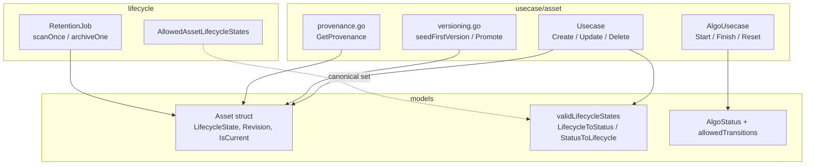
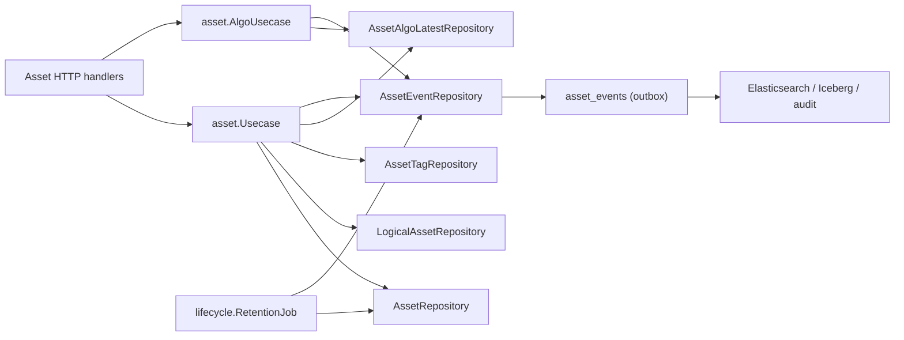
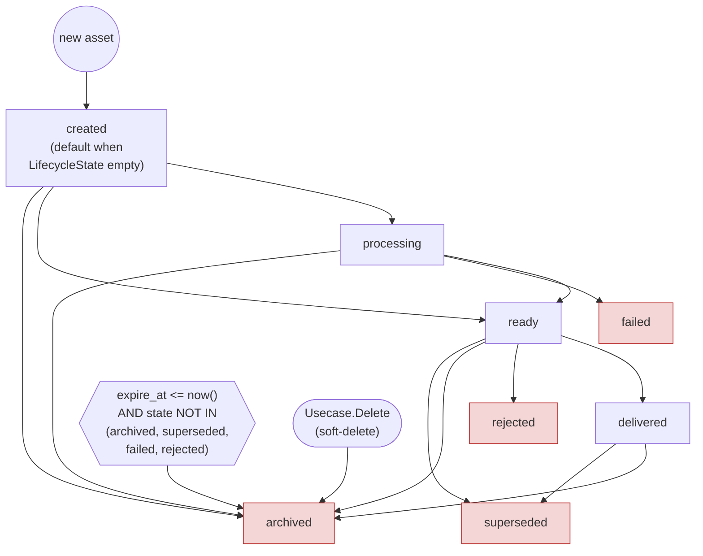
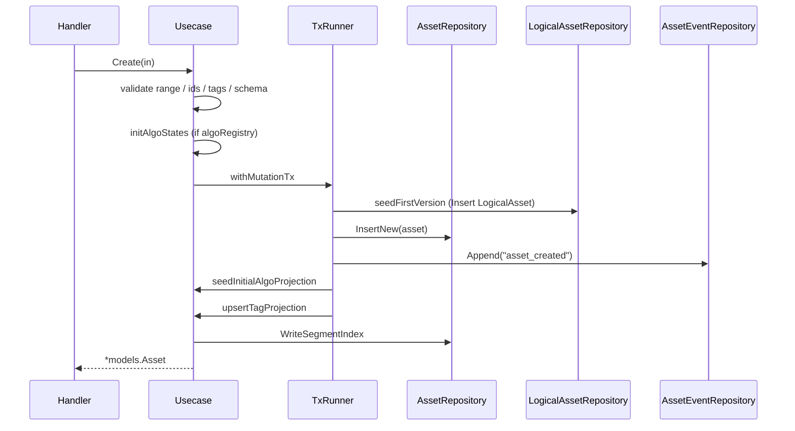
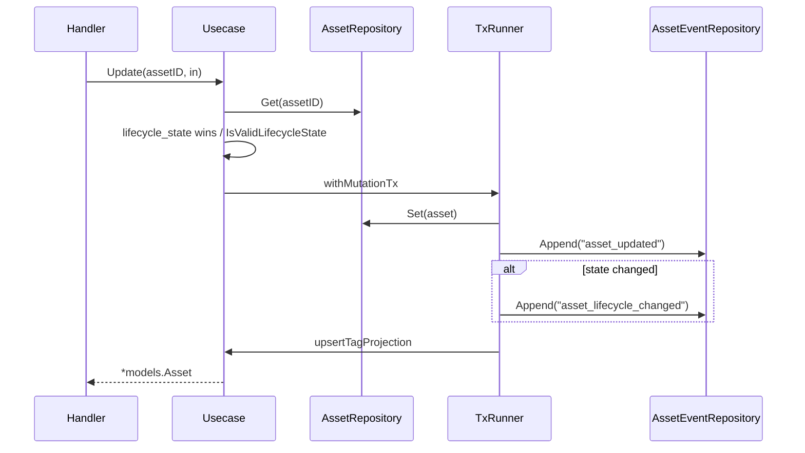
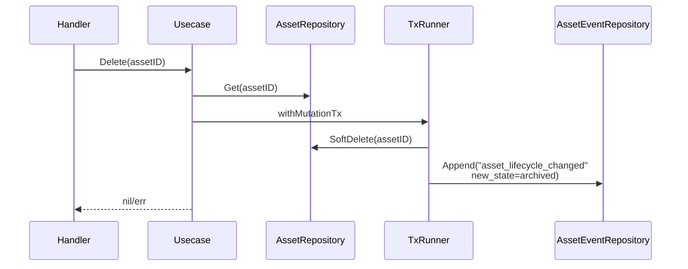
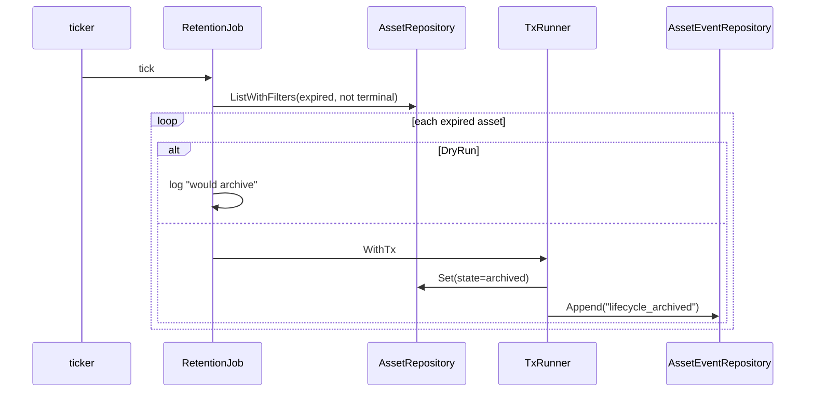
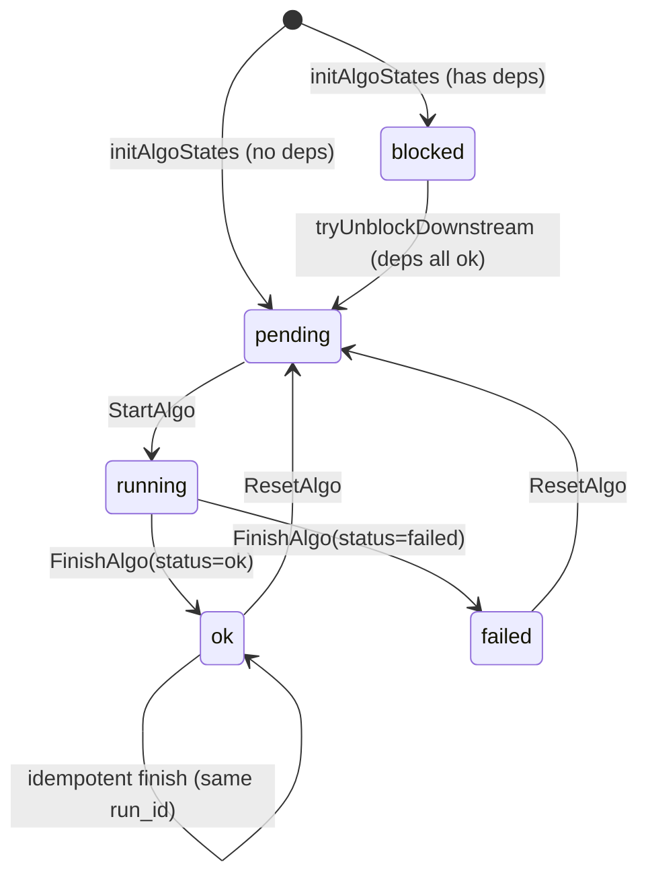
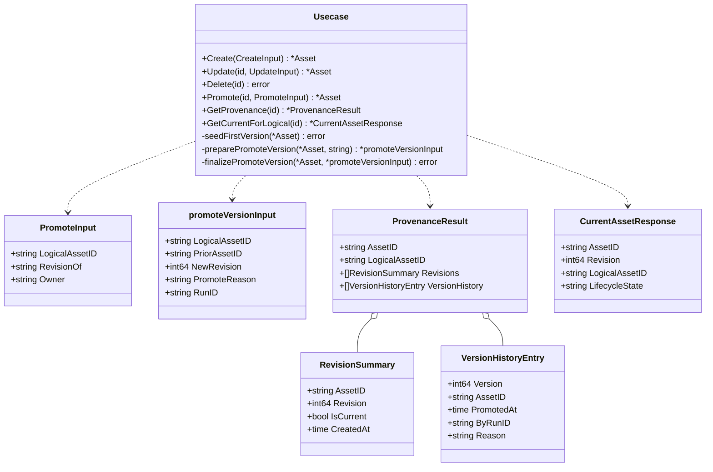
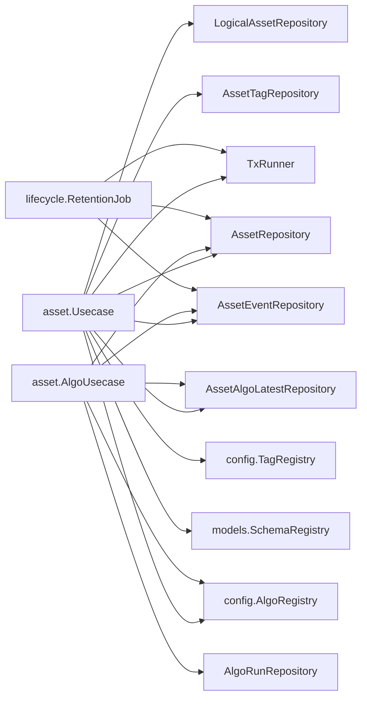

# Asset Lifecycle

<cite>
**Referenced Files in This Document**

- [backend/internal/usecase/asset/usecase.go](file://backend/internal/usecase/asset/usecase.go)
- [backend/internal/usecase/asset/algo_usecase.go](file://backend/internal/usecase/asset/algo_usecase.go)
- [backend/internal/usecase/asset/provenance.go](file://backend/internal/usecase/asset/provenance.go)
- [backend/internal/usecase/asset/versioning.go](file://backend/internal/usecase/asset/versioning.go)
- [backend/internal/lifecycle/states.go](file://backend/internal/lifecycle/states.go)
- [backend/internal/lifecycle/retention.go](file://backend/internal/lifecycle/retention.go)
- [backend/internal/models/asset.go](file://backend/internal/models/asset.go)
- [backend/internal/models/algo_event.go](file://backend/internal/models/algo_event.go)
</cite>

## Table of Contents
1. [Introduction](#introduction)
2. [Project Structure](#project-structure)
3. [Core Components](#core-components)
4. [Architecture Overview](#architecture-overview)
5. [Detailed Component Analysis](#detailed-component-analysis)
6. [Dependency Analysis](#dependency-analysis)
7. [Performance Considerations](#performance-considerations)
8. [Troubleshooting Guide](#troubleshooting-guide)
9. [Conclusion](#conclusion)
10. [Appendices](#appendices)

## Introduction

The asset lifecycle is the state machine that governs every segment-derived
data asset in cyber-databrew from the moment it is created through processing,
delivery, and eventual archival. It has two cooperating layers:

1. **The row-level `lifecycle_state` machine** on the `assets` table. This is a
   coarse-grained business state (`created`, `processing`, `ready`,
   `delivered`, `archived`, `superseded`, `failed`, `rejected`) that describes
   where an asset sits in the curation-to-delivery pipeline. It is owned by the
   `assets` row and mutated by the asset `Usecase` (create / update / delete)
   and by the background `RetentionJob`.
2. **The per-algorithm projection state machine** in `asset_algo_latest`
   (`blocked → pending → running → ok|failed → pending`). Each algorithm that
   processes an asset has its own current state, projected into a dedicated
   table by `AlgoUsecase`, decoupled from the assets row so concurrent
   algorithm finishes never contend on `assets.version`.

Both layers are append-only at the audit level: every transition writes an
`asset_events` row in the *same transaction* as the state change, so
Elasticsearch, Iceberg, and audit consumers can replay the history
deterministically. On top of these two machines sits a versioning/provenance
model (`logical_asset_id`, `revision`, `is_current`) that lets a logical asset
carry multiple immutable revisions while exactly one is current.

The primary consumers are the asset HTTP handlers, the retention background
worker, the algorithm orchestrator (which drives start/finish/reset), and the
outbox-to-ES projection pipeline.

**Section sources**
- [backend/internal/usecase/asset/usecase.go](file://backend/internal/usecase/asset/usecase.go#L62-L155)
- [backend/internal/models/asset.go](file://backend/internal/models/asset.go#L274-L326)
- [backend/internal/usecase/asset/algo_usecase.go](file://backend/internal/usecase/asset/algo_usecase.go#L1-L96)

## Project Structure

The lifecycle logic spans three packages: the `asset` usecase (orchestration and
mutation flows), the `lifecycle` package (canonical state list and the retention
job), and the `models` package (the `Asset`/`LogicalAsset` structs and the
state-mapping helpers shared between the postgres and usecase layers).

**Diagram sources**
- [backend/internal/usecase/asset/usecase.go](file://backend/internal/usecase/asset/usecase.go#L62-L75)
- [backend/internal/usecase/asset/algo_usecase.go](file://backend/internal/usecase/asset/algo_usecase.go#L89-L114)
- [backend/internal/lifecycle/states.go](file://backend/internal/lifecycle/states.go#L1-L18)
- [backend/internal/lifecycle/retention.go](file://backend/internal/lifecycle/retention.go#L39-L44)
- [backend/internal/models/asset.go](file://backend/internal/models/asset.go#L51-L118)

**Section sources**
- [backend/internal/lifecycle/states.go](file://backend/internal/lifecycle/states.go#L1-L18)
- [backend/internal/models/asset.go](file://backend/internal/models/asset.go#L270-L326)

## Core Components

#### The `Asset` model and `lifecycle_state`

`models.Asset` carries the authoritative `LifecycleState` field (JSON
`lifecycle_state`) alongside a legacy, API-only `Status` (`AssetStatus`) that is
*derived* from `lifecycle_state` and never stored in PostgreSQL. The struct also
carries the multi-version identity triple introduced in CYB-1013:
`LogicalAssetID`, `Revision`, and `IsCurrent`. A separate `Version` field is a
row optimistic-lock counter and is explicitly *not* the content revision.

#### Canonical states

`models.validLifecycleStates` is the canonical set of eight legal values,
mirrored by `lifecycle.AllowedAssetLifecycleStates` (display order) and the
database `CHECK` constraint `chk_lifecycle_state`. `IsValidLifecycleState`
guards every write that sets a state from the API.

#### State mapping helpers

`LifecycleToStatus` and `StatusToLifecycle` translate between the new
`lifecycle_state` machine and the legacy four-value `AssetStatus`
(`approved`/`rejected`/`superseded`/`archived`) for backward-compatible API
responses. `SyncLegacyFields` applies this mapping plus `DurationSec`/`SegType`
derivation after every DB read.

#### The asset `Usecase`

`asset.Usecase` orchestrates all row-level mutations. Its mutation methods
(`Create`, `Update`, `Delete`, `CreateChildAsset`, `CommitSegments`) run inside
`withMutationTx` so the row write and the `asset_events` append commit
atomically.

#### The `AlgoUsecase`

`asset.AlgoUsecase` owns the per-algorithm state machine. It depends only on the
projection (`asset_algo_latest`) and outbox (`asset_events`) repositories, never
writing the `assets` row — the existence repo is read-only.

#### The `RetentionJob`

`lifecycle.RetentionJob` is the background worker that transitions expired assets
(`expire_at <= now()`) to `archived` and emits a `lifecycle_archived` event.

**Section sources**
- [backend/internal/models/asset.go](file://backend/internal/models/asset.go#L51-L173)
- [backend/internal/models/asset.go](file://backend/internal/models/asset.go#L270-L326)
- [backend/internal/usecase/asset/usecase.go](file://backend/internal/usecase/asset/usecase.go#L62-L156)
- [backend/internal/usecase/asset/algo_usecase.go](file://backend/internal/usecase/asset/algo_usecase.go#L83-L119)
- [backend/internal/lifecycle/retention.go](file://backend/internal/lifecycle/retention.go#L33-L69)

## Architecture Overview

Every mutation follows the same pattern: validate, mutate the source-of-truth
row/projection, append an event in the same transaction, and (for tags/algo)
update read-model projections. The events table is the CDC source that fans out
downstream.

**Diagram sources**
- [backend/internal/usecase/asset/usecase.go](file://backend/internal/usecase/asset/usecase.go#L95-L114)
- [backend/internal/usecase/asset/algo_usecase.go](file://backend/internal/usecase/asset/algo_usecase.go#L100-L114)
- [backend/internal/lifecycle/retention.go](file://backend/internal/lifecycle/retention.go#L117-L153)

**Section sources**
- [backend/internal/usecase/asset/usecase.go](file://backend/internal/usecase/asset/usecase.go#L62-L114)
- [backend/internal/usecase/asset/algo_usecase.go](file://backend/internal/usecase/asset/algo_usecase.go#L1-L18)

## Detailed Component Analysis

### The lifecycle_state machine

`lifecycle_state` is the coarse business state of an asset. The canonical set is
defined once in `models.validLifecycleStates` and again, in display order, in
`lifecycle.AllowedAssetLifecycleStates`. Both are kept in lock-step with the DB
`CHECK` constraint; new values require a migration.

The code does not enforce a strict transition graph for `lifecycle_state` the
way it does for algo status — `Update` accepts any value that passes
`IsValidLifecycleState`. The *effective* transitions, however, are determined by
the components that drive them: `Create` seeds the state, `Update` performs
arbitrary valid transitions, `Delete` forces `archived`, and the `RetentionJob`
forces `archived` for expired assets (skipping rows already in a terminal
state).

The retention worker treats `archived`, `superseded`, `failed`, and `rejected`
as terminal: its scan WHERE clause explicitly excludes them so expired assets in
those states are never re-archived. `Update` enforces lifecycle-wins semantics —
when both `lifecycle_state` and `status` are supplied, `lifecycle_state` is
authoritative and `status` is recomputed via `LifecycleToStatus`.

**Diagram sources**
- [backend/internal/models/asset.go](file://backend/internal/models/asset.go#L274-L300)
- [backend/internal/lifecycle/retention.go](file://backend/internal/lifecycle/retention.go#L72-L113)
- [backend/internal/usecase/asset/usecase.go](file://backend/internal/usecase/asset/usecase.go#L1094-L1107)
- [backend/internal/usecase/asset/usecase.go](file://backend/internal/usecase/asset/usecase.go#L1262-L1283)

**Section sources**
- [backend/internal/models/asset.go](file://backend/internal/models/asset.go#L270-L326)
- [backend/internal/lifecycle/states.go](file://backend/internal/lifecycle/states.go#L6-L17)

### Create flow

`Usecase.Create` validates the timestamp range, the parent/root/asset IDs, the
tag set (including the `customer.*` namespace lint from CYB-1070), and the
metadata schema. It defaults `asset_type` to `segment` for legacy callers, then
builds the `models.Asset` with `Status=approved` and the caller-supplied
`LifecycleState` (which may be empty — see the create-time defaulting note in
the Troubleshooting Guide). When an `algo_registry` is wired, `initAlgoStates`
seeds the initial per-algorithm statuses (`pending` for algorithms with no
dependencies, `blocked` for those with dependencies).

Persistence runs through `persistNewAsset` inside `withMutationTx`: it seeds the
first version (`seedFirstVersion`), inserts the row, appends an `asset_created`
event, seeds the algo projection, and upserts tag projections — all atomically.
When no explicit `asset_id` is supplied, `allocateNewAssetID` retries on ID
collisions up to `maxAssetIDAllocationAttempts` (32).

**Diagram sources**
- [backend/internal/usecase/asset/usecase.go](file://backend/internal/usecase/asset/usecase.go#L810-L955)
- [backend/internal/usecase/asset/usecase.go](file://backend/internal/usecase/asset/usecase.go#L351-L390)
- [backend/internal/usecase/asset/versioning.go](file://backend/internal/usecase/asset/versioning.go#L20-L35)

**Section sources**
- [backend/internal/usecase/asset/usecase.go](file://backend/internal/usecase/asset/usecase.go#L810-L955)
- [backend/internal/usecase/asset/usecase.go](file://backend/internal/usecase/asset/usecase.go#L1322-L1337)

### Update flow

`Usecase.Update` reads the asset, records `prevStatus`/`prevLifecycle`, then
applies the lifecycle-wins rule: if `LifecycleState` is provided it must be
non-empty and pass `IsValidLifecycleState`, and `Status` is derived from it;
otherwise if `Status` is provided, `LifecycleState` is derived via
`StatusToLifecycle`. Reviewer, owner, and tags are applied next. Inside the
transaction it writes the row, appends an `asset_updated` event, and — only when
the state actually changed — an additional `asset_lifecycle_changed` event with
before/after state, then upserts tag projections.

**Diagram sources**
- [backend/internal/usecase/asset/usecase.go](file://backend/internal/usecase/asset/usecase.go#L1082-L1156)

**Section sources**
- [backend/internal/usecase/asset/usecase.go](file://backend/internal/usecase/asset/usecase.go#L1082-L1156)
- [backend/internal/models/asset.go](file://backend/internal/models/asset.go#L285-L325)

### Soft-delete flow

`Usecase.Delete` is a soft delete: it captures the prior status/state, calls
`repo.SoftDelete`, and appends a single `asset_lifecycle_changed` event whose new
state is `archived`. The asset is not physically removed; `GetAll` (used by `GET
/assets/:id`) still returns soft-deleted/archived rows so the API can surface
them.

**Diagram sources**
- [backend/internal/usecase/asset/usecase.go](file://backend/internal/usecase/asset/usecase.go#L1262-L1283)
- [backend/internal/usecase/asset/usecase.go](file://backend/internal/usecase/asset/usecase.go#L639-L651)

**Section sources**
- [backend/internal/usecase/asset/usecase.go](file://backend/internal/usecase/asset/usecase.go#L1262-L1283)

### Retention-driven archival

The `RetentionJob` runs an immediate scan on startup and then ticks on
`Config.Interval` (default 10 minutes, batch 200). Each `scanOnce` lists assets
whose `expire_at` has passed and whose state is not already terminal, then
`archiveOne` flips each to `archived`, sets `Status=archived` and `UpdatedAt`,
and emits a `lifecycle_archived` event — wrapped in `TxRunner.WithTx` when one is
configured. `DryRun` logs intended archivals without writing. Actual deletion
(GCS cleanup, row removal) is an out-of-scope P2 follow-up.

**Diagram sources**
- [backend/internal/lifecycle/retention.go](file://backend/internal/lifecycle/retention.go#L46-L113)
- [backend/internal/lifecycle/retention.go](file://backend/internal/lifecycle/retention.go#L117-L153)

**Section sources**
- [backend/internal/lifecycle/retention.go](file://backend/internal/lifecycle/retention.go#L14-L153)

### The per-algorithm state machine and current-state projection

The per-algorithm machine is the second, finer-grained lifecycle. Its source of
truth is `asset_algo_latest`, keyed by `(asset_id, algo_name)`, holding the
*current* status per algorithm. The allowed transitions are encoded in
`models.algo_event.go` and enforced explicitly by `AlgoUsecase`:

| Method | Legal prior states | New state |
| --- | --- | --- |
| (seed) `initAlgoStates` | none | `pending` (no deps) / `blocked` (has deps) |
| `StartAlgo` | `""` (no row), `pending` | `running` |
| `FinishAlgo` (ok) | `running` | `ok` (+ cascade unblock) |
| `FinishAlgo` (failed) | `running` | `failed` |
| `ResetAlgo` | `ok`, `failed` | `pending` |
| `tryUnblockDownstream` | `blocked` (deps all ok) | `pending` |

`StartAlgo` rejects `running` (`ErrAlgoAlreadyRunning`), `blocked`, `ok`, and
`failed` with `ErrInvalidStateTransition`; only `pending` or the empty sentinel
(no prior row — "algorithm never ran") are accepted. `FinishAlgo` requires the
current status to be `running`, except for the idempotent fast-path where an
already-`ok` row with a matching `run_id` is a no-op. On an `ok` finish it runs
`tryUnblockDownstream` inside the same transaction, scanning the registry for
algorithms that `depends_on` the just-completed `name@version`; any that are
`blocked` with all dependencies satisfied (`allDepsOk`) flip to `pending` and
emit an `algo_unblocked` event.

Crucially, `assets.version` is **not** bumped on algo state changes — the
monotonic guard on `algo_version` in `Upsert` lets distinct algorithm versions
finish concurrently without locking the `assets` row, resolving the OCC
contention described in the data-platform design.

`ListCurrentStates` reads the whole projection for an asset; `ListAlgoEvents`
reconstructs the lifecycle history from the `asset_events` outbox (the legacy
`algo_events` table is retired). On the assets side, `hydrateAlgoResults`
projects `asset_algo_latest` rows back into the flat `AlgoResults` map
(`name@version:field`) for API responses.

**Diagram sources**
- [backend/internal/models/algo_event.go](file://backend/internal/models/algo_event.go#L21-L52)
- [backend/internal/usecase/asset/algo_usecase.go](file://backend/internal/usecase/asset/algo_usecase.go#L278-L334)
- [backend/internal/usecase/asset/algo_usecase.go](file://backend/internal/usecase/asset/algo_usecase.go#L350-L464)
- [backend/internal/usecase/asset/algo_usecase.go](file://backend/internal/usecase/asset/algo_usecase.go#L506-L606)

**Section sources**
- [backend/internal/usecase/asset/algo_usecase.go](file://backend/internal/usecase/asset/algo_usecase.go#L1-L165)
- [backend/internal/usecase/asset/algo_usecase.go](file://backend/internal/usecase/asset/algo_usecase.go#L557-L638)
- [backend/internal/usecase/asset/algo_usecase.go](file://backend/internal/usecase/asset/algo_usecase.go#L712-L725)
- [backend/internal/usecase/asset/usecase.go](file://backend/internal/usecase/asset/usecase.go#L485-L519)

### Versioning and provenance

A logical asset (`LogicalAsset`) is the version coordinator for a family of
immutable revisions. On create, `seedFirstVersion` sets the new asset's
`LogicalAssetID` to its own ID, `Revision=1`, `IsCurrent=true`, and inserts the
coordinator row with `CurrentRevision=1`. The `Promote` flow (B-route) clones a
source asset into a new entry, calls `preparePromoteVersion` to compute the next
revision (`MaxRevision+1`) and the prior current asset, then `finalizePromoteVersion`
clears the prior current flag (`ClearCurrentForLogical`), inserts the new
revision, bumps the coordinator (`BumpRevision`), records a `revision_of`
relation, and emits a `version_promoted` event (plus an `asset_updated`
"version_demoted" event for the prior current asset).

`GetProvenance` returns the revision list plus a version timeline for a logical
family. For an asset with no `LogicalAssetID` it returns a single synthetic
revision (defaulting `Revision` to 1). Otherwise it lists all revisions via
`ListByLogicalAssetID`, joins each against `version_promoted` events
(`ListVersionPromotedByLogical`) to recover `PromotedAt`/`ByRunID`/`Reason`, and
sorts the history ascending by version. `GetCurrentForLogical` resolves the
current revision through `logicalRepo.CurrentAssetID`.

**Diagram sources**
- [backend/internal/usecase/asset/versioning.go](file://backend/internal/usecase/asset/versioning.go#L83-L247)
- [backend/internal/usecase/asset/provenance.go](file://backend/internal/usecase/asset/provenance.go#L12-L35)

**Section sources**
- [backend/internal/usecase/asset/versioning.go](file://backend/internal/usecase/asset/versioning.go#L20-L290)
- [backend/internal/usecase/asset/provenance.go](file://backend/internal/usecase/asset/provenance.go#L37-L135)
- [backend/internal/models/asset.go](file://backend/internal/models/asset.go#L109-L133)

## Dependency Analysis

The two usecases depend on a set of repository interfaces (the `assets`,
`logical_assets`, `asset_tags`, `asset_algo_latest`, and `asset_events` repos)
plus the tag and algo config registries. `AlgoUsecase` deliberately depends on
the asset repo only for existence checks; it never writes the row. The retention
job depends only on the asset and event repos plus a tx runner.

**Diagram sources**
- [backend/internal/usecase/asset/usecase.go](file://backend/internal/usecase/asset/usecase.go#L62-L114)
- [backend/internal/usecase/asset/algo_usecase.go](file://backend/internal/usecase/asset/algo_usecase.go#L89-L119)
- [backend/internal/lifecycle/retention.go](file://backend/internal/lifecycle/retention.go#L39-L44)

**Section sources**
- [backend/internal/usecase/asset/usecase.go](file://backend/internal/usecase/asset/usecase.go#L62-L138)
- [backend/internal/usecase/asset/algo_usecase.go](file://backend/internal/usecase/asset/algo_usecase.go#L89-L119)

## Performance Considerations

- **No OCC contention on algo finishes.** Algo state lives in `asset_algo_latest`
  keyed by `(asset_id, algo_name)` with a monotonic `algo_version` guard, so
  parallel finishes from different versions never lock the `assets` row;
  `assets.version` is intentionally left untouched on algo transitions.
- **Atomic projection + event writes.** Each mutation wraps the row/projection
  write and the event append in one transaction via `withMutationTx` /
  `TxRunner.WithTx`, avoiding split-brain between the source row and the outbox.
- **ID allocation retries are bounded.** `allocateNewAssetID` and `Promote` retry
  on collision up to 32 attempts before failing, bounding worst-case work.
- **Retention is batched.** `RetentionJob` archives at most `BatchSize` (default
  200) assets per tick, ordered by `expire_at ASC`, so a backlog drains over
  successive ticks instead of in one large transaction.
- **Hydration is per-asset.** `hydrateAssetsReadModels` loops `hydrateTags` and
  `hydrateAlgoResults` per asset, each issuing a `ListByAsset` query — a
  potential N+1 on large list pages. `ListWithFiltersPage` avoids `COUNT(*)`
  where the repo supports it.

**Section sources**
- [backend/internal/usecase/asset/algo_usecase.go](file://backend/internal/usecase/asset/algo_usecase.go#L1-L18)
- [backend/internal/usecase/asset/usecase.go](file://backend/internal/usecase/asset/usecase.go#L392-L413)
- [backend/internal/usecase/asset/usecase.go](file://backend/internal/usecase/asset/usecase.go#L521-L541)
- [backend/internal/lifecycle/retention.go](file://backend/internal/lifecycle/retention.go#L72-L113)

## Troubleshooting Guide

#### "invalid lifecycle_state" on update

`Update` rejects an empty or non-canonical `lifecycle_state` with
`ErrInvalidTag`. Only the eight values in `validLifecycleStates` are accepted;
adding a new value requires both a code change and a DB migration for
`chk_lifecycle_state`.

#### Create persisted with an unexpected state

`Create` copies `in.LifecycleState` verbatim and does not default it. A blank
value is persisted as-is and only surfaces as `created` later through
`StatusToLifecycle` (the unknown-input fallback) during `SyncLegacyFields`.
Callers that need a definite initial state should set `lifecycle_state`
explicitly.

#### Expired assets not archived

The retention scan only matches rows with a non-null `expire_at <= now()` whose
state is not already `archived`/`superseded`/`failed`/`rejected`. Assets with no
`expire_at`, or already in a terminal state, are skipped by design. Check
`DryRun` is not enabled and that the job is wired with an event/asset repo.

#### "invalid state transition" on StartAlgo / FinishAlgo

`StartAlgo` only accepts `pending` or no prior row; a `running`/`ok`/`failed`
algorithm must be reset first (`ResetAlgo`). `FinishAlgo` only accepts `running`
(or the idempotent already-`ok`-same-`run_id` no-op). A failed finish without a
`reason` returns `ErrMissingReason`.

#### Downstream algorithm stuck in `blocked`

`tryUnblockDownstream` only fires on an `ok` finish and only unblocks
algorithms whose `depends_on` entries are all satisfied at the exact
`name@version` (`allDepsOk` requires the projection row to exist with the right
version and `status=ok`). A version mismatch in the registry `depends_on` leaves
the dependent blocked.

**Section sources**
- [backend/internal/usecase/asset/usecase.go](file://backend/internal/usecase/asset/usecase.go#L1094-L1107)
- [backend/internal/usecase/asset/usecase.go](file://backend/internal/usecase/asset/usecase.go#L854-L955)
- [backend/internal/models/asset.go](file://backend/internal/models/asset.go#L319-L326)
- [backend/internal/lifecycle/retention.go](file://backend/internal/lifecycle/retention.go#L72-L90)
- [backend/internal/usecase/asset/algo_usecase.go](file://backend/internal/usecase/asset/algo_usecase.go#L299-L312)
- [backend/internal/usecase/asset/algo_usecase.go](file://backend/internal/usecase/asset/algo_usecase.go#L620-L638)

## Conclusion

The asset lifecycle is two coordinated state machines plus a versioning model.
The coarse `lifecycle_state` on the `assets` row is driven by the asset usecase
(create/update/soft-delete) and the retention worker, while the fine-grained
per-algorithm machine lives in `asset_algo_latest` and is driven by
`AlgoUsecase` with strict, code-enforced transitions and a cascade-unblock step.
Every transition is journaled into the `asset_events` outbox in the same
transaction, giving a deterministic, replayable audit trail; the
`logical_asset_id`/`revision`/`is_current` triple layers immutable versioning
and provenance on top. Keeping algo state off the `assets` row is the deliberate
design choice that lets concurrent algorithm finishes scale without OCC
contention.

## Appendices

### Lifecycle state values

| lifecycle_state | legacy status (`LifecycleToStatus`) | terminal for retention |
| --- | --- | --- |
| created | approved | no |
| processing | approved | no |
| ready | approved | no |
| delivered | approved | no |
| rejected | rejected | yes |
| failed | rejected | yes |
| archived | archived | yes |
| superseded | superseded | yes |

### Legacy status → lifecycle_state (`StatusToLifecycle`)

| status | lifecycle_state | (unknown → `created`) |
| --- | --- | --- |
| approved | ready | |
| rejected | rejected | |
| archived | archived | |
| superseded | superseded | |

### Algorithm status values and transitions

| status | meaning | allowed next |
| --- | --- | --- |
| `""` (no row) | never ran | blocked, pending, running |
| blocked | dependencies unmet | pending |
| pending | ready to start | running |
| running | executing | ok, failed |
| ok | succeeded | pending (reset) |
| failed | errored | pending (reset) |

### Lifecycle-related event types

| event_type | emitted by |
| --- | --- |
| asset_created | Create / CreateChildAsset |
| asset_updated | Update / version demote |
| asset_lifecycle_changed | Update (state change), Delete |
| lifecycle_archived | RetentionJob.archiveOne |
| version_promoted | finalizePromoteVersion |
| algo_started / algo_finished / algo_failed / algo_reset / algo_unblocked / algo_run_applied | AlgoUsecase |

**Section sources**
- [backend/internal/models/asset.go](file://backend/internal/models/asset.go#L290-L326)
- [backend/internal/models/algo_event.go](file://backend/internal/models/algo_event.go#L21-L52)
- [backend/internal/usecase/asset/algo_usecase.go](file://backend/internal/usecase/asset/algo_usecase.go#L48-L65)
- [backend/internal/lifecycle/retention.go](file://backend/internal/lifecycle/retention.go#L138-L153)
</content>
</invoke>
