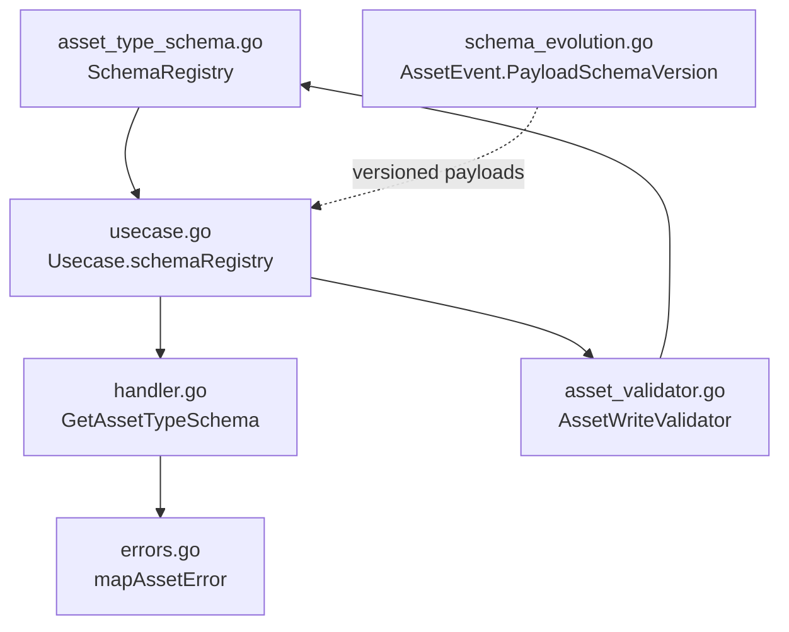
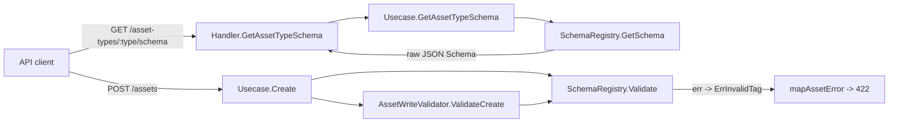
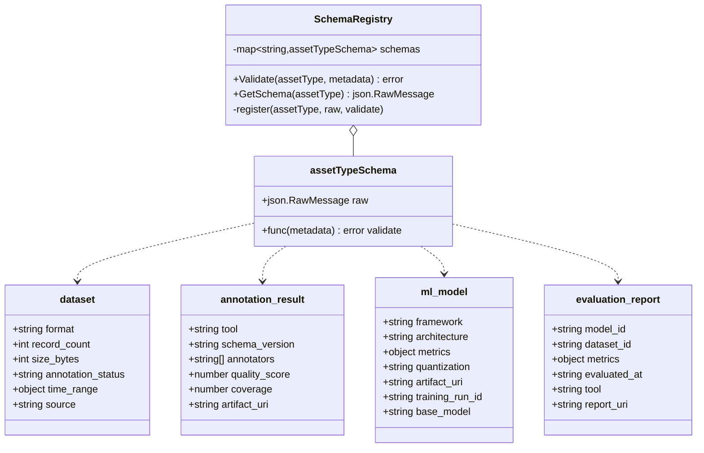
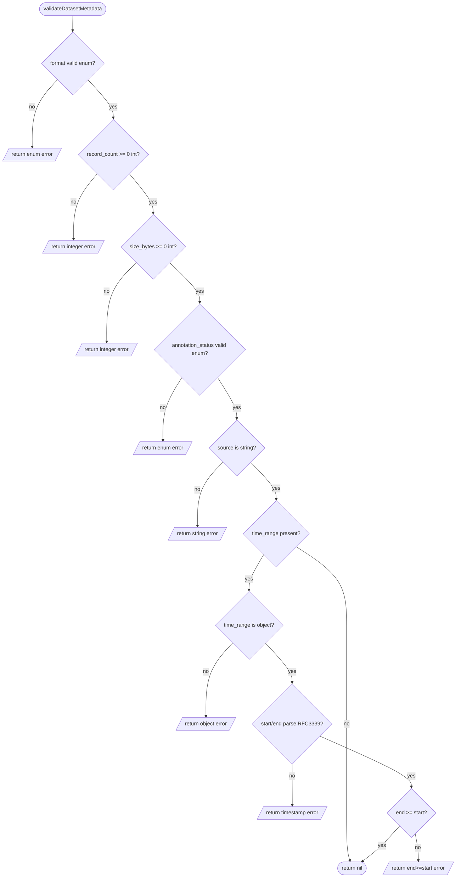
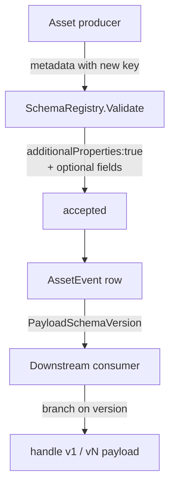
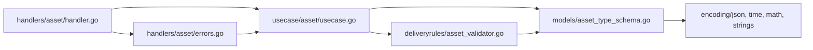

# Asset Types & Schema

<cite>
**Referenced Files in This Document**

- [backend/internal/models/asset_type_schema.go](file://backend/internal/models/asset_type_schema.go)
- [backend/internal/models/schema_evolution.go](file://backend/internal/models/schema_evolution.go)
- [backend/internal/handlers/asset/handler.go](file://backend/internal/handlers/asset/handler.go)
- [backend/internal/handlers/asset/errors.go](file://backend/internal/handlers/asset/errors.go)
- [backend/internal/usecase/asset/usecase.go](file://backend/internal/usecase/asset/usecase.go)
- [backend/internal/deliveryrules/asset_validator.go](file://backend/internal/deliveryrules/asset_validator.go)
- [backend/routes/routes.go](file://backend/routes/routes.go)
</cite>

## Table of Contents
1. [Introduction](#introduction)
2. [Project Structure](#project-structure)
3. [Core Components](#core-components)
4. [Architecture Overview](#architecture-overview)
5. [Detailed Component Analysis](#detailed-component-analysis)
6. [Dependency Analysis](#dependency-analysis)
7. [Performance Considerations](#performance-considerations)
8. [Troubleshooting Guide](#troubleshooting-guide)
9. [Conclusion](#conclusion)
10. [Appendices](#appendices)

## Introduction

The asset-type schema subsystem governs what shape the free-form `metadata`
field of an asset is allowed to take, on a per-`asset_type` basis. cyber-databrew
distinguishes two broad families of asset types:

- **Hierarchy types** — `raw_mcap`, `segment`, `clip`, `frame`, `task`,
  `action`, `derived_asset` — whose structural rules (parent/child invariants
  L0–L7) are enforced by the `AssetWriteValidator` in `deliveryrules`.
- **Registered metadata types** — `dataset`, `annotation_result`, `ml_model`,
  `evaluation_report` — whose `metadata` payloads are validated against a
  code-defined JSON Schema plus an imperative Go validator held in the
  `SchemaRegistry`.

The registry serves two jobs. First, it is a **read source**: the JSON Schema
for any registered type can be returned to clients so that UIs and ingestion
pipelines know which fields exist and what their constraints are. Second, it is
a **write gate**: every asset create path runs the registry's `Validate`
function over the incoming `metadata` map and rejects malformed payloads before
they are persisted.

Schema "evolution" here is deliberately lightweight and additive. The registered
JSON Schemas all set `"additionalProperties": true`, so new metadata keys can be
added by producers without breaking the contract; the imperative validators only
check the keys they know about and ignore the rest. Event payloads carry an
explicit `PayloadSchemaVersion` string (see `schema_evolution.go`) so that
downstream consumers can branch on payload shape over time.

**Section sources**
- [backend/internal/models/asset_type_schema.go](file://backend/internal/models/asset_type_schema.go#L1-L63)
- [backend/internal/deliveryrules/asset_validator.go](file://backend/internal/deliveryrules/asset_validator.go#L37-L120)
- [backend/internal/models/schema_evolution.go](file://backend/internal/models/schema_evolution.go#L55-L74)

## Project Structure

The subsystem spans three layers — the model layer that owns the schema
definitions, the usecase layer that exposes and enforces them, and the handler
layer that surfaces them over HTTP.

- `backend/internal/models/asset_type_schema.go` — defines the `SchemaRegistry`,
  the per-type JSON Schema documents, and the imperative validators plus the
  primitive helper functions (`optionalString`, `optionalStringEnum`,
  `optionalNonNegativeInteger`, `optionalUnitNumber`, `optionalRFC3339`,
  `optionalObject`).
- `backend/internal/models/schema_evolution.go` — defines the projection and
  outbox row models (`AssetTag`, `AssetAlgoLatest`, `AssetEvent`) that carry the
  versioned payloads which evolve alongside the asset-type schemas.
- `backend/internal/usecase/asset/usecase.go` — owns a `*models.SchemaRegistry`,
  exposes it through `GetAssetTypeSchema`, and calls `Validate` on the create
  paths.
- `backend/internal/deliveryrules/asset_validator.go` — combines schema
  validation with the L0–L7 hierarchy invariants in `ValidateCreate`.
- `backend/internal/handlers/asset/handler.go` — implements
  `GetAssetTypeSchema`, the HTTP handler for `/asset-types/{type}/schema`.
- `backend/internal/handlers/asset/errors.go` — maps usecase errors
  (notably `ErrInvalidTag`, which carries schema-validation failures) to HTTP
  status codes.



**Diagram sources**
- [backend/internal/models/asset_type_schema.go](file://backend/internal/models/asset_type_schema.go#L11-L63)
- [backend/internal/usecase/asset/usecase.go](file://backend/internal/usecase/asset/usecase.go#L62-L149)
- [backend/internal/handlers/asset/handler.go](file://backend/internal/handlers/asset/handler.go#L110-L128)
- [backend/internal/deliveryrules/asset_validator.go](file://backend/internal/deliveryrules/asset_validator.go#L40-L67)

**Section sources**
- [backend/internal/models/asset_type_schema.go](file://backend/internal/models/asset_type_schema.go#L1-L350)
- [backend/internal/models/schema_evolution.go](file://backend/internal/models/schema_evolution.go#L1-L74)

## Core Components

#### SchemaRegistry

`SchemaRegistry` is the in-memory map from `asset_type` to a code-defined schema
entry. Each entry (`assetTypeSchema`) bundles two things: the raw JSON Schema
document (`raw json.RawMessage`) returned to clients, and the imperative
validator function (`validate func(map[string]interface{}) error`) used to gate
writes. `NewSchemaRegistry` registers the four metadata types up front:
`dataset`, `annotation_result`, `ml_model`, and `evaluation_report`.

```go
func NewSchemaRegistry() *SchemaRegistry {
    r := &SchemaRegistry{schemas: map[string]assetTypeSchema{}}
    r.register("dataset", datasetSchemaJSON, validateDatasetMetadata)
    r.register("annotation_result", annotationResultSchemaJSON, validateAnnotationResultMetadata)
    r.register("ml_model", mlModelSchemaJSON, validateMLModelMetadata)
    r.register("evaluation_report", evaluationReportSchemaJSON, validateEvaluationReportMetadata)
    return r
}
```

The registry exposes three methods:

- `register(assetType, raw, validate)` — copies the raw JSON into a fresh slice
  so callers cannot mutate the stored document and records the validator.
- `Validate(assetType, metadata)` — looks the type up; if unregistered it returns
  `nil` (no opinion), otherwise it runs the type's validator against a non-nil
  metadata map.
- `GetSchema(assetType)` — returns a defensive copy of the raw JSON Schema, or
  `nil` when the type is unregistered.

All three methods are nil-safe: a `nil` `*SchemaRegistry` short-circuits to a
permissive result, which is why callers can hold an optional registry.

#### Per-type JSON Schema documents

Each registered type has a draft 2020-12 JSON Schema literal embedded as a Go
`json.RawMessage`. They share the conventions `"type": "object"` and
`"additionalProperties": true` (except nested `time_range`, which is closed),
so the schemas describe *known* fields without forbidding unknown ones.

#### Imperative validators and primitives

The `validate*Metadata` functions back each schema with imperative Go checks.
They are built from a small library of reusable primitives —
`optionalString`, `optionalObject`, `optionalStringEnum`,
`optionalNonNegativeInteger`, `optionalUnitNumber`, and `optionalRFC3339` —
all of which treat a missing or `nil` value as valid (every field is optional)
and return a descriptive `metadata.<field> must be ...` error otherwise.

#### Usecase integration

`Usecase` holds a `schemaRegistry *models.SchemaRegistry` populated by
`NewSchemaRegistry()` in every constructor (`New`, `NewWithTagRegistry`,
`NewFull`, `NewWithProjections`). `SetSchemaRegistry` allows overriding it.
`GetAssetTypeSchema` adapts `GetSchema` into a `(json.RawMessage, bool)` shape
for the HTTP layer.

**Section sources**
- [backend/internal/models/asset_type_schema.go](file://backend/internal/models/asset_type_schema.go#L11-L63)
- [backend/internal/models/asset_type_schema.go](file://backend/internal/models/asset_type_schema.go#L146-L350)
- [backend/internal/usecase/asset/usecase.go](file://backend/internal/usecase/asset/usecase.go#L62-L149)

## Architecture Overview

The registry is a single shared object threaded from the usecase into both the
read path (HTTP schema endpoint) and the write path (validators). The diagram
below shows how a metadata payload is exercised on create versus how the schema
document is returned on read.



The two consumers never bypass the registry: read goes through `GetSchema`,
write goes through `Validate`. Because both the usecase and the
`AssetWriteValidator` may hold the registry, the create path can invoke
validation from either entry point — the usecase validates directly
(`usecase.go` lines 906 and 1025) and, when a hierarchy validator is wired,
`ValidateCreate` re-runs the same `Validate` for registered types before
applying parent checks.

**Diagram sources**
- [backend/internal/handlers/asset/handler.go](file://backend/internal/handlers/asset/handler.go#L120-L128)
- [backend/internal/usecase/asset/usecase.go](file://backend/internal/usecase/asset/usecase.go#L140-L149)
- [backend/internal/usecase/asset/usecase.go](file://backend/internal/usecase/asset/usecase.go#L905-L941)
- [backend/internal/deliveryrules/asset_validator.go](file://backend/internal/deliveryrules/asset_validator.go#L54-L67)

## Detailed Component Analysis

### Schema type model

The four registered metadata types form a flat family — there is no inheritance
between them; each carries its own JSON Schema document and its own validator.
The class diagram below captures the registry structure and the field set of
each registered type as declared in the JSON Schema literals.



The `dataset` schema is the most constrained: `format` is an enum of
`parquet | csv | image | lidar | other`, `annotation_status` is an enum of
`raw | annotated | validated`, `record_count` and `size_bytes` are non-negative
integers, and `time_range` is a closed object of two RFC3339 timestamps. The
`annotation_result` schema constrains `quality_score` and `coverage` to the
`[0, 1]` interval and `annotators` to an array of strings. `ml_model` and
`evaluation_report` are mostly free-form string fields plus an open `metrics`
object.

**Diagram sources**
- [backend/internal/models/asset_type_schema.go](file://backend/internal/models/asset_type_schema.go#L65-L144)

**Section sources**
- [backend/internal/models/asset_type_schema.go](file://backend/internal/models/asset_type_schema.go#L65-L144)

### Per-type field validation

Each validator walks the metadata map field-by-field using the optional-value
primitives. `validateDatasetMetadata` is the richest: it checks the two enums,
the two non-negative integers, the `source` string, and then descends into
`time_range`, parsing `start`/`end` as RFC3339 and asserting `end >= start`.
`validateAnnotationResultMetadata` checks the string fields, the
`annotators` array element types, and the unit-interval numbers.
`validateMLModelMetadata` and `validateEvaluationReportMetadata` validate their
string fields and require `metrics` to be an object when present.

The flowchart shows the dataset validator's decision logic, which is the only
one with cross-field and nested-object rules.



The primitives share a uniform contract: a missing or `nil` value returns `nil`
(field is optional); a present value of the wrong Go type or out-of-range value
returns a `metadata.<field> ...` error. Numeric coercion is handled by
`integerValue` and `numberValue`, which accept `int`, `int32`, `int64`,
`float64`, and `json.Number` — important because JSON unmarshalling into
`map[string]interface{}` yields `float64` by default.

**Section sources**
- [backend/internal/models/asset_type_schema.go](file://backend/internal/models/asset_type_schema.go#L146-L229)
- [backend/internal/models/asset_type_schema.go](file://backend/internal/models/asset_type_schema.go#L231-L350)

### Serving GET /api/v1/asset-types/{type}/schema

The HTTP handler `GetAssetTypeSchema` trims the `:type` path parameter, asks the
usecase for the schema, and returns it. When the type is unregistered the
usecase returns `ok == false` and the handler emits a `404` with code
`CodeAssetNotFound`. On success it writes the raw bytes with the
`application/schema+json` content type rather than re-encoding through
`c.JSON`, preserving the exact stored document.

```go
func (h *Handler) GetAssetTypeSchema(c *gin.Context) {
    assetType := strings.TrimSpace(c.Param("type"))
    schema, ok := h.uc.GetAssetTypeSchema(assetType)
    if !ok {
        httpresp.NotFound(c, httpresp.CodeAssetNotFound, "asset type schema not found")
        return
    }
    c.Data(http.StatusOK, "application/schema+json", schema)
}
```

The handler advertises the route via the Swagger annotation
`@Router /asset-types/{type}/schema [get]` under the `assets` tag, with the
`DatabrewToken` security scheme.

> **Important — route not yet mounted.** Although the handler and its Swagger
> annotation exist, the `/asset-types/:type/schema` route is **not registered**
> in `backend/routes/routes.go`. The asset route group there mounts
> `/assets/...` paths but no `asset-types` group, so at runtime this endpoint is
> currently reachable only through the test router
> (`setupAssetRouter(http.MethodGet, "/asset-types/:type/schema", h.GetAssetTypeSchema)`
> in `handler_test.go`). Mounting it requires adding the route to the
> authenticated `api` group alongside the other asset routes.

**Section sources**
- [backend/internal/handlers/asset/handler.go](file://backend/internal/handlers/asset/handler.go#L110-L128)
- [backend/internal/usecase/asset/usecase.go](file://backend/internal/usecase/asset/usecase.go#L140-L149)
- [backend/routes/routes.go](file://backend/routes/routes.go#L189-L221)

### Schema validation on the write path

On create, the usecase calls `schemaRegistry.Validate(a.AssetType, a.Metadata)`
and wraps any failure as `ErrInvalidTag` so the handler can map it to a `422`.
There are two such call sites (the two create branches at lines 906 and 1025).
Crucially, the registry also relaxes a structural rule: an asset normally
requires an `mcap_file_id`, but the gate at line 851 waives that requirement
when the asset type has a registered schema (or is `derived_asset`). This is how
schema-driven types like `dataset` or `ml_model` are allowed to exist without an
MCAP backing file.

```go
if in.McapFileID == "" && assetType != "derived_asset" &&
    (u.schemaRegistry == nil || u.schemaRegistry.GetSchema(assetType) == nil) {
    return nil, ErrMcapFileIDRequired
}
...
if u.schemaRegistry != nil {
    if err := u.schemaRegistry.Validate(a.AssetType, a.Metadata); err != nil {
        return nil, fmt.Errorf("%w: %s", ErrInvalidTag, err.Error())
    }
}
```

When an `AssetWriteValidator` is wired with a registry
(`NewAssetWriteValidatorWithSchemas`), `ValidateCreate` runs `Validate` first
for registered types and then defers to `validateRegisteredType`, which only
enforces that `annotation_result` has a parent and that any declared parent
exists — registered metadata types are otherwise exempt from the L1–L7
hierarchy switch.

**Section sources**
- [backend/internal/usecase/asset/usecase.go](file://backend/internal/usecase/asset/usecase.go#L840-L909)
- [backend/internal/usecase/asset/usecase.go](file://backend/internal/usecase/asset/usecase.go#L1020-L1035)
- [backend/internal/deliveryrules/asset_validator.go](file://backend/internal/deliveryrules/asset_validator.go#L54-L146)

### Schema evolution rules

Evolution is additive and version-tolerant rather than migration-driven:

1. **Open documents.** Every registered JSON Schema sets
   `"additionalProperties": true`, so producers may add new metadata keys
   without a schema change. The imperative validators only inspect the keys they
   know; unknown keys pass through untouched.
2. **Optional everything.** No field is `required`; the validators treat absent
   or `nil` values as valid. New fields can therefore be introduced as optional
   and tightened later.
3. **Versioned event payloads.** Asset mutations append rows to the
   `asset_events` outbox (`AssetEvent`), each carrying an explicit
   `PayloadSchemaVersion string`. Consumers branch on this version to handle
   payload-shape changes over time. The projection rows (`AssetTag`,
   `AssetAlgoLatest`) likewise evolve their columns under documented CYB tickets
   (e.g. CYB-1015 multi-source tags), keeping the projection contract stable.



**Diagram sources**
- [backend/internal/models/asset_type_schema.go](file://backend/internal/models/asset_type_schema.go#L65-L144)
- [backend/internal/models/schema_evolution.go](file://backend/internal/models/schema_evolution.go#L55-L74)

**Section sources**
- [backend/internal/models/schema_evolution.go](file://backend/internal/models/schema_evolution.go#L1-L74)
- [backend/internal/models/asset_type_schema.go](file://backend/internal/models/asset_type_schema.go#L21-L51)

### Error mapping

When `Validate` fails on a create, the wrapped `ErrInvalidTag` propagates to the
handler, where `mapAssetError` recognises it and returns
`httpresp.Unprocessable` with code `CodeInvalidTag` (HTTP 422). A request for an
unregistered type on the read endpoint returns `404`/`CodeAssetNotFound`
directly from the handler rather than through `mapAssetError`.

**Section sources**
- [backend/internal/handlers/asset/errors.go](file://backend/internal/handlers/asset/errors.go#L16-L48)
- [backend/internal/handlers/asset/handler.go](file://backend/internal/handlers/asset/handler.go#L120-L128)

## Dependency Analysis



The model layer (`asset_type_schema.go`) has no internal dependencies — it
relies only on the standard library (`encoding/json`, `time`, `math`,
`strings`). The usecase and the delivery-rules validator both depend on it; the
handler depends on the usecase and on `httpresp` for response shaping. There are
no circular dependencies: the registry is a leaf that everything else consumes.

**Section sources**
- [backend/internal/models/asset_type_schema.go](file://backend/internal/models/asset_type_schema.go#L1-L9)
- [backend/internal/usecase/asset/usecase.go](file://backend/internal/usecase/asset/usecase.go#L62-L149)
- [backend/internal/deliveryrules/asset_validator.go](file://backend/internal/deliveryrules/asset_validator.go#L1-L51)

## Performance Considerations

- **In-memory, allocation-light reads.** Schema lookups are `O(1)` map reads.
  Both `GetSchema` and `register` copy the raw bytes (`append(json.RawMessage(nil), ...)`)
  to keep the stored document immutable; this is a small per-call allocation
  proportional to schema size, paid on every read.
- **No reflection or external schema engine.** Validation is hand-written Go
  control flow, not a generic JSON-Schema evaluator, so per-field checks are
  cheap and bounded by the number of declared fields (at most a handful per
  type). There is no compilation or caching step to manage.
- **Validation runs once per create.** `Validate` is invoked on the create path
  only; reads and the schema endpoint never validate. When a hierarchy validator
  is also wired, registered types are validated once in `ValidateCreate` (which
  also short-circuits the L1–L7 switch), avoiding redundant parent lookups for
  schema-driven types.
- **Batch creates.** `ValidateCreateBatch` validates one asset at a time and
  shares no parent-lookup cache yet (a noted P1.5 improvement), so a batch of N
  registered-type assets performs N independent validations.

**Section sources**
- [backend/internal/models/asset_type_schema.go](file://backend/internal/models/asset_type_schema.go#L31-L63)
- [backend/internal/deliveryrules/asset_validator.go](file://backend/internal/deliveryrules/asset_validator.go#L228-L239)

## Troubleshooting Guide

#### GET .../schema returns 404 for a type you expect
Either the type is genuinely unregistered (only `dataset`, `annotation_result`,
`ml_model`, `evaluation_report` are registered) or — more likely in the current
codebase — the route is not mounted in `routes.go`, so the path resolves to no
handler. Confirm the route is wired into the `api` group before debugging the
registry.

#### Create returns 422 with a `metadata.<field> ...` message
The metadata violated the type's validator. Common causes:
- An enum value outside the allowed set (`format`, `annotation_status`).
- A negative `record_count`/`size_bytes`, or a non-integer encoded as a float.
- `quality_score`/`coverage` outside `[0, 1]`.
- A `time_range` whose `end` precedes `start`, or non-RFC3339 timestamps.
- A field supplied with the wrong JSON type (e.g. `metrics` as a string).
The error text names the exact field; match it to the validator in
`asset_type_schema.go`.

#### Integer field rejected even though it "looks" like an integer
JSON numbers decode to `float64`. `integerValue` accepts a `float64` only when
`math.Trunc(v) == v` and it fits in `int64`; a fractional value (e.g. `3.5`)
fails the integer check.

#### Asset create rejected with "mcap_file_id required" for a metadata type
The waiver at the create gate only applies when the registry recognises the
type. If the registry is `nil` or the type is unregistered, the `mcap_file_id`
requirement is enforced. Ensure the usecase was constructed with a registry
(every standard constructor does) and that the type name matches exactly.

**Section sources**
- [backend/internal/handlers/asset/errors.go](file://backend/internal/handlers/asset/errors.go#L16-L48)
- [backend/internal/models/asset_type_schema.go](file://backend/internal/models/asset_type_schema.go#L270-L333)
- [backend/internal/usecase/asset/usecase.go](file://backend/internal/usecase/asset/usecase.go#L851-L853)

## Conclusion

The asset-type schema subsystem is a small, self-contained registry that pairs a
code-defined JSON Schema document with an imperative Go validator for each of the
four metadata-driven asset types. It powers both a read endpoint
(`GET /api/v1/asset-types/{type}/schema`, served verbatim as
`application/schema+json`) and the write-time gate that rejects malformed
`metadata` with a 422. Schema evolution is additive by design —
`additionalProperties: true`, all-optional fields, and version-tagged event
payloads — so producers can grow their metadata without breaking existing
consumers. The main caveat for operators today is that the read route's handler
exists but is not yet mounted in `routes.go`.

## Appendices

### Registered asset types

| asset_type | schema literal | validator |
| --- | --- | --- |
| `dataset` | `datasetSchemaJSON` | `validateDatasetMetadata` |
| `annotation_result` | `annotationResultSchemaJSON` | `validateAnnotationResultMetadata` |
| `ml_model` | `mlModelSchemaJSON` | `validateMLModelMetadata` |
| `evaluation_report` | `evaluationReportSchemaJSON` | `validateEvaluationReportMetadata` |

### Validation primitives

| Helper | Accepts | Rejects with |
| --- | --- | --- |
| `optionalString` | string or absent | `metadata.<k> must be a string` |
| `optionalObject` | object or absent | `metadata.<k> must be an object` |
| `optionalStringEnum` | string in allowed set | `metadata.<k> must be one of ...` |
| `optionalNonNegativeInteger` | integer `>= 0` | `must be an integer` / `>= 0` |
| `optionalUnitNumber` | number in `[0,1]` | `must be a number` / `between 0 and 1` |
| `optionalRFC3339` | RFC3339 string | `must be an RFC3339 timestamp` |

### API definition

| Aspect | Value |
| --- | --- |
| Route | `GET /api/v1/asset-types/{type}/schema` |
| Handler | `Handler.GetAssetTypeSchema` |
| Success | `200` `application/schema+json` (raw JSON Schema) |
| Not found | `404` `CodeAssetNotFound` (unregistered type) |
| Auth | `DatabrewToken` (JWT-authenticated `api` group) |
| Status | Handler + Swagger annotation present; route not yet mounted in `routes.go` |

**Section sources**
- [backend/internal/models/asset_type_schema.go](file://backend/internal/models/asset_type_schema.go#L22-L29)
- [backend/internal/models/asset_type_schema.go](file://backend/internal/models/asset_type_schema.go#L231-L314)
- [backend/internal/handlers/asset/handler.go](file://backend/internal/handlers/asset/handler.go#L110-L128)
