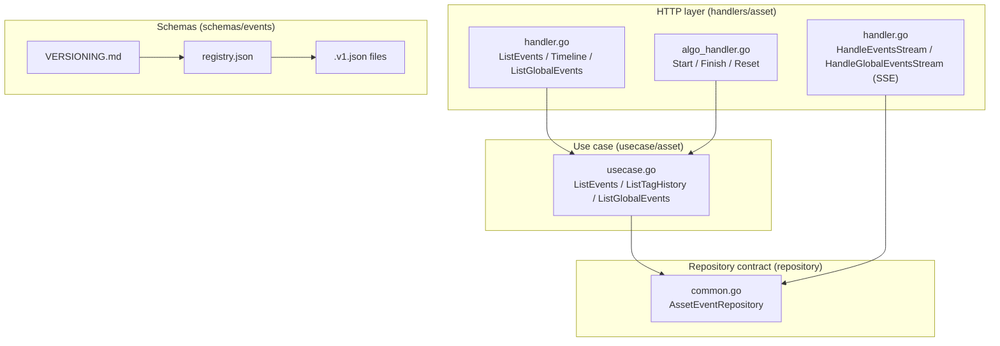
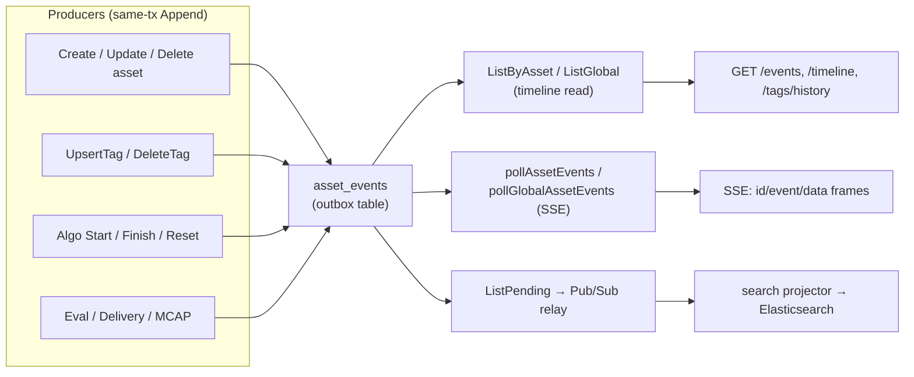
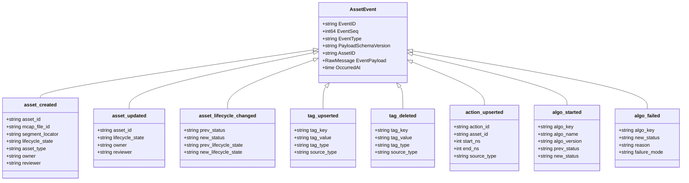
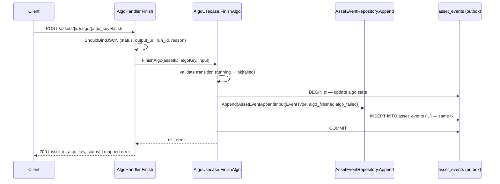
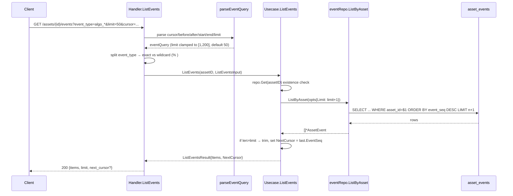
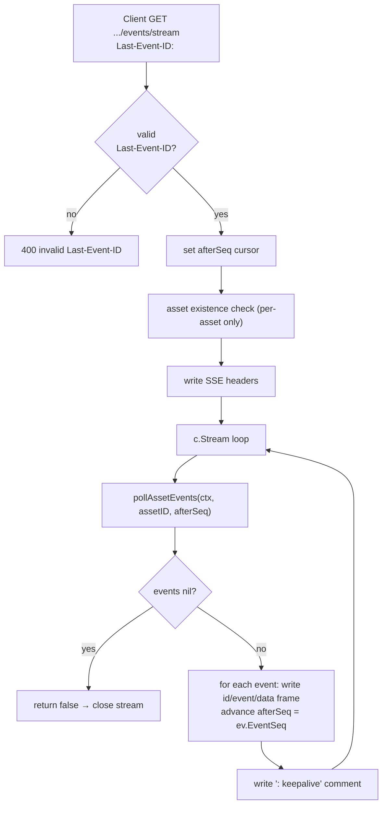
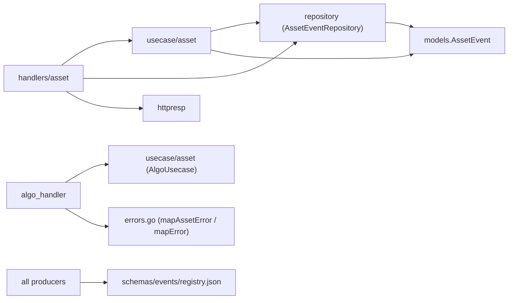

# Events & Timeline

<cite>
**Referenced Files in This Document**

- [backend/internal/handlers/asset/handler.go](file://backend/internal/handlers/asset/handler.go)
- [backend/internal/handlers/asset/algo_handler.go](file://backend/internal/handlers/asset/algo_handler.go)
- [backend/internal/handlers/asset/errors.go](file://backend/internal/handlers/asset/errors.go)
- [backend/internal/models/algo_event.go](file://backend/internal/models/algo_event.go)
- [backend/internal/models/schema_evolution.go](file://backend/internal/models/schema_evolution.go)
- [backend/internal/usecase/asset/usecase.go](file://backend/internal/usecase/asset/usecase.go)
- [backend/internal/repository/common.go](file://backend/internal/repository/common.go)
- [backend/routes/routes.go](file://backend/routes/routes.go)
- [backend/schemas/events/registry.json](file://backend/schemas/events/registry.json)
- [backend/schemas/events/VERSIONING.md](file://backend/schemas/events/VERSIONING.md)
- [backend/schemas/events/asset_created.v1.json](file://backend/schemas/events/asset_created.v1.json)
- [backend/schemas/events/asset_updated.v1.json](file://backend/schemas/events/asset_updated.v1.json)
- [backend/schemas/events/asset_lifecycle_changed.v1.json](file://backend/schemas/events/asset_lifecycle_changed.v1.json)
- [backend/schemas/events/action_upserted.v1.json](file://backend/schemas/events/action_upserted.v1.json)
- [backend/schemas/events/action_deleted.v1.json](file://backend/schemas/events/action_deleted.v1.json)
- [backend/schemas/events/algo_started.v1.json](file://backend/schemas/events/algo_started.v1.json)
- [backend/schemas/events/algo_finished.v1.json](file://backend/schemas/events/algo_finished.v1.json)
- [backend/schemas/events/algo_failed.v1.json](file://backend/schemas/events/algo_failed.v1.json)
- [backend/schemas/events/algo_reset.v1.json](file://backend/schemas/events/algo_reset.v1.json)
- [backend/schemas/events/algo_unblocked.v1.json](file://backend/schemas/events/algo_unblocked.v1.json)
- [backend/schemas/events/algo_run_applied.v1.json](file://backend/schemas/events/algo_run_applied.v1.json)
- [backend/schemas/events/eval_result_reported.v1.json](file://backend/schemas/events/eval_result_reported.v1.json)
- [backend/schemas/events/delivery_committed.v1.json](file://backend/schemas/events/delivery_committed.v1.json)
- [backend/schemas/events/mcap_file_created.v1.json](file://backend/schemas/events/mcap_file_created.v1.json)
- [backend/schemas/events/mcap_upload_finalized.v1.json](file://backend/schemas/events/mcap_upload_finalized.v1.json)
- [backend/schemas/events/tag_upserted.v1.json](file://backend/schemas/events/tag_upserted.v1.json)
- [backend/schemas/events/tag_deleted.v1.json](file://backend/schemas/events/tag_deleted.v1.json)
</cite>

## Table of Contents
1. [Introduction](#introduction)
2. [Project Structure](#project-structure)
3. [Core Components](#core-components)
4. [Architecture Overview](#architecture-overview)
5. [Detailed Component Analysis](#detailed-component-analysis)
6. [Dependency Analysis](#dependency-analysis)
7. [Performance Considerations](#performance-considerations)
8. [Troubleshooting Guide](#troubleshooting-guide)
9. [Conclusion](#conclusion)
10. [Appendices](#appendices)

## Introduction

The **Events & Timeline** subsystem of the asset-management module is the
append-only, read-oriented history of everything that happens to an asset. Every
business state mutation — creating an asset, updating mutable fields, changing
lifecycle, upserting or deleting a tag, starting/finishing/resetting an
algorithm, reporting an eval result, committing a delivery, or finalizing an
MCAP upload — writes **exactly one row** into the `asset_events` outbox table in
the *same transaction* as the state change. Those rows are then exposed to API
clients through a small family of read endpoints (`/events`, `/timeline`,
`/tags/history`) and two Server-Sent-Events stream handlers.

Two distinct event tables back this subsystem and must not be conflated:

- **`asset_events`** — the generic transactional-outbox table modelled by
  `models.AssetEvent`. It is the source of truth for the timeline API and the
  relay/projector pipeline that rebuilds Elasticsearch. Each row carries a
  monotonic `event_seq`, an `event_type` string, a JSON `event_payload`, and a
  `payload_schema_version`. The shape of each payload is governed by the JSON
  Schemas under `backend/schemas/events/` and pinned by `registry.json`.
- **`asset_algo_events`** — a narrower, algorithm-specific audit table modelled
  by `models.AlgoEvent`. Each row records a single algorithm status transition
  (`prev_status → new_status`) on one asset for one `algo_key`.

The audience is twofold: **frontend/timeline consumers** that render an asset's
history and subscribe to live updates, and **downstream data infrastructure**
(the outbox relay, the search projector, Iceberg Bronze staging) that consumes
the same rows to rebuild derived state.

**Section sources**
- [backend/internal/repository/common.go](file://backend/internal/repository/common.go#L143-L199)
- [backend/internal/models/schema_evolution.go](file://backend/internal/models/schema_evolution.go#L55-L74)
- [backend/internal/models/algo_event.go](file://backend/internal/models/algo_event.go#L1-L54)

## Project Structure

The subsystem spans four layers — HTTP handlers, use cases, the repository
contract, and the schema registry — plus the per-type JSON Schema files.

Key files:

- **`backend/internal/handlers/asset/handler.go`** — the asset HTTP handler. It
  owns `ListEvents`, the `Timeline` alias, `ListGlobalEvents`, the two SSE
  stream handlers, and the polling helpers that read `asset_events` directly via
  raw SQL.
- **`backend/internal/handlers/asset/algo_handler.go`** — the algorithm
  lifecycle handler (`Start` / `Finish` / `Reset`); its transitions are what
  produce `algo_*` events.
- **`backend/internal/usecase/asset/usecase.go`** — `ListEvents`,
  `ListTagHistory`, and `ListGlobalEvents` use cases, plus the
  `ListEventsInput` / `ListEventsResult` DTOs.
- **`backend/internal/repository/common.go`** — the `AssetEventRepository`
  interface (the outbox contract), `AssetEventAppendInput`, and
  `AssetEventListOptions`.
- **`backend/schemas/events/`** — `registry.json` (the current version per
  event type), `VERSIONING.md` (the bump policy), and one
  `<event_type>.v1.json` JSON Schema per registered type.

**Section sources**
- [backend/internal/handlers/asset/handler.go](file://backend/internal/handlers/asset/handler.go#L244-L414)
- [backend/internal/usecase/asset/usecase.go](file://backend/internal/usecase/asset/usecase.go#L589-L808)
- [backend/internal/repository/common.go](file://backend/internal/repository/common.go#L126-L199)
- [backend/schemas/events/registry.json](file://backend/schemas/events/registry.json#L1-L91)

## Core Components

### The `AssetEvent` outbox row

`models.AssetEvent` mirrors one row of the `asset_events` table. The fields that
matter to the timeline API are `EventSeq` (the monotonic cursor),
`EventType`, `EventPayload` (raw JSON validated against the matching schema),
`PayloadSchemaVersion`, `AssetID`, and `OccurredAt`. Operational fields
(`PublishState`, `RetryCount`, `LastError`, `PublishedAt`) belong to the relay
and are not part of the timeline contract.

**Section sources**
- [backend/internal/models/schema_evolution.go](file://backend/internal/models/schema_evolution.go#L55-L74)

### The `AlgoEvent` transition row

`models.AlgoEvent` is the algorithm-specific history row. It captures
`EventID`, `AssetID`, `AlgoKey`, `PrevStatus` (nullable), `NewStatus`,
`RunID` (nullable), `Reason` (nullable), and `CreatedAt`. The legal status
machine is defined by `ValidAlgoTransitions`, keyed by the current `AlgoStatus`.

**Section sources**
- [backend/internal/models/algo_event.go](file://backend/internal/models/algo_event.go#L1-L54)

### The repository contract

`AssetEventRepository` documents the strong invariant that drives the whole
subsystem: *every business state mutation must `Append` exactly one event in the
same transaction as the state write (transactional outbox)*. A relay publishes
pending rows to Pub/Sub, and the search projector consumes them to rebuild
Elasticsearch. The read side is `ListByAsset`, `ListGlobal`, and
`ListVersionPromotedByLogical`; the write side is `Append`; the relay side is
`ListPending*`, `MarkPublished`, `MarkFailed`, and the count helpers.

**Section sources**
- [backend/internal/repository/common.go](file://backend/internal/repository/common.go#L126-L199)

### The use case

`Usecase.ListEvents` performs an existence check (`repo.Get`), returns an empty
result when no `eventRepo` is wired, applies a default page size of 50, and uses
the classic *fetch limit+1 to detect a next page* pattern, deriving
`NextCursor` from the last row's `EventSeq`. `ListTagHistory` is a thin wrapper
that forces `EventTypes = ["tag_upserted", "tag_deleted"]`. `ListGlobalEvents`
skips the asset existence check, defaults the page size to 100, and otherwise
shares the same cursor logic.

**Section sources**
- [backend/internal/usecase/asset/usecase.go](file://backend/internal/usecase/asset/usecase.go#L721-L808)

### The schema registry

`registry.json` is the single place that pins, per event type, the
`current_version` and the `schema_file` that producers MUST emit. The 18
registered types are: `action_upserted`, `action_deleted`, `asset_created`,
`asset_updated`, `asset_lifecycle_changed`, `tag_upserted`, `tag_deleted`,
`algo_started`, `algo_finished`, `algo_failed`, `algo_reset`, `algo_unblocked`,
`algo_run_applied`, `eval_result_reported`, `delivery_committed`,
`mcap_file_created`, and `mcap_upload_finalized` — each currently at `v1`.

**Section sources**
- [backend/schemas/events/registry.json](file://backend/schemas/events/registry.json#L1-L91)

## Architecture Overview

The subsystem is a textbook **transactional outbox** with a separate read path.
Writers append events in the same DB transaction as the state mutation; readers
page over those rows by `event_seq`; streamers poll for rows newer than a
cursor.

The schema layer governs payload shape but is *advisory at read time*: the API
returns `event_payload` verbatim as `json.RawMessage`, leaving validation to
producers (against the registry) and to CI.

**Diagram sources**
- [backend/internal/repository/common.go](file://backend/internal/repository/common.go#L156-L199)
- [backend/internal/handlers/asset/handler.go](file://backend/internal/handlers/asset/handler.go#L1238-L1390)

**Section sources**
- [backend/internal/repository/common.go](file://backend/internal/repository/common.go#L143-L199)
- [backend/internal/handlers/asset/handler.go](file://backend/internal/handlers/asset/handler.go#L264-L414)

## Detailed Component Analysis

### Event type taxonomy

The registered event types form a small class hierarchy by payload shape. Asset
lifecycle events key on the asset; tag events on the tag; algo events on the
versioned `algo_key` and a status transition; and infrastructure events
(eval/delivery/mcap) on their own aggregate id.

The `algo_*` family encodes the same state machine as `ValidAlgoTransitions`
through the `enum` constraints on `prev_status` / `new_status`:

- `algo_started`: `prev_status ∈ {"", "pending"}`, `new_status = "running"`.
- `algo_finished`: `prev_status = "running"`, `new_status = "ok"`.
- `algo_failed`: `prev_status = "running"`, `new_status = "failed"`, with a
  required non-empty `reason` and an optional `failure_mode` classification
  (`timeout|algo_error|sensor_fault|env_mismatch|low_quality|annotation_drift|unknown`).
- `algo_reset`: `prev_status ∈ {"ok", "failed"}`, `new_status = "pending"`.
- `algo_unblocked`: `prev_status = "blocked"`, `new_status = "pending"`.
- `algo_run_applied`: `new_status ∈ {"ok", "failed"}`, keyed by a 16-char
  `run_id` rather than a `prev_status` transition.

**Diagram sources**
- [backend/internal/models/schema_evolution.go](file://backend/internal/models/schema_evolution.go#L55-L74)
- [backend/schemas/events/asset_created.v1.json](file://backend/schemas/events/asset_created.v1.json#L1-L47)
- [backend/schemas/events/asset_lifecycle_changed.v1.json](file://backend/schemas/events/asset_lifecycle_changed.v1.json#L1-L31)
- [backend/schemas/events/algo_started.v1.json](file://backend/schemas/events/algo_started.v1.json#L1-L39)
- [backend/schemas/events/algo_failed.v1.json](file://backend/schemas/events/algo_failed.v1.json#L1-L48)

**Section sources**
- [backend/schemas/events/algo_started.v1.json](file://backend/schemas/events/algo_started.v1.json#L1-L39)
- [backend/schemas/events/algo_finished.v1.json](file://backend/schemas/events/algo_finished.v1.json#L1-L39)
- [backend/schemas/events/algo_failed.v1.json](file://backend/schemas/events/algo_failed.v1.json#L1-L48)
- [backend/schemas/events/algo_reset.v1.json](file://backend/schemas/events/algo_reset.v1.json#L1-L36)
- [backend/schemas/events/algo_unblocked.v1.json](file://backend/schemas/events/algo_unblocked.v1.json#L1-L36)
- [backend/schemas/events/algo_run_applied.v1.json](file://backend/schemas/events/algo_run_applied.v1.json#L1-L26)
- [backend/internal/models/algo_event.go](file://backend/internal/models/algo_event.go#L43-L53)

### Event emission flow (algorithm transition example)

`AlgoHandler.Finish` is representative of every producer: it validates the
request, delegates to the use case, and the use case writes both the state
change and the matching `asset_events` row inside one transaction.

On error the handler routes through `AlgoHandler.mapError`, which translates
sentinel errors (`ErrInvalidStateTransition` → 409, `ErrMissingReason` → 422,
`ErrRunNotFound` → 400, etc.) into HTTP status codes.

**Diagram sources**
- [backend/internal/handlers/asset/algo_handler.go](file://backend/internal/handlers/asset/algo_handler.go#L82-L115)
- [backend/internal/repository/common.go](file://backend/internal/repository/common.go#L156-L171)

**Section sources**
- [backend/internal/handlers/asset/algo_handler.go](file://backend/internal/handlers/asset/algo_handler.go#L39-L176)
- [backend/internal/handlers/asset/errors.go](file://backend/internal/handlers/asset/errors.go#L16-L48)

### Timeline read flow (`GET /events` and `GET /timeline`)

`ListEvents` parses the query, splits `event_type` values into exact matches and
wildcard patterns (`algo_*` → `algo_%`), then calls the use case. `Timeline` is
a literal alias that calls `ListEvents`, preserving identical query semantics.

The query parser (`parseEventQuery`) accepts `cursor` (alias `before_event_seq`)
for paging to older events, `after_event_seq` for newer, `start_time` /
`end_time` as RFC3339 bounds (validated `start ≤ end`), and `limit` bounded to
`[1, 200]` with a default of 50. The response shape from `writeEventList` is
`{"items": [...], "limit": n}` with an optional `"next_cursor"`.

**Diagram sources**
- [backend/internal/handlers/asset/handler.go](file://backend/internal/handlers/asset/handler.go#L264-L305)
- [backend/internal/usecase/asset/usecase.go](file://backend/internal/usecase/asset/usecase.go#L721-L763)

**Section sources**
- [backend/internal/handlers/asset/handler.go](file://backend/internal/handlers/asset/handler.go#L177-L305)
- [backend/internal/handlers/asset/handler.go](file://backend/internal/handlers/asset/handler.go#L362-L414)

### Tag history (`GET /tags/history`)

`ListTagHistory` reuses the timeline machinery but restricts the result to
tag events. The handler builds a bare `ListEventsInput` (cursor/after/limit
only) and the use case overrides `EventTypes` to
`["tag_upserted", "tag_deleted"]` before delegating to `ListEvents`.

**Section sources**
- [backend/internal/handlers/asset/handler.go](file://backend/internal/handlers/asset/handler.go#L508-L530)
- [backend/internal/usecase/asset/usecase.go](file://backend/internal/usecase/asset/usecase.go#L765-L770)

### Global timeline (`GET /events`)

`ListGlobalEvents` serves operational visibility across all assets. It requires
no asset id, defaults `limit` to 100, and — when neither `start_time` nor
`end_time` is supplied — injects a lower bound of `now() - 24h` to avoid a full
table scan over `asset_events`. The route is registered at the api-group level
(`api.GET("/events", ...)`), distinct from the per-asset
`assets.GET("/:id/events", ...)`.

**Section sources**
- [backend/internal/handlers/asset/handler.go](file://backend/internal/handlers/asset/handler.go#L368-L414)
- [backend/internal/usecase/asset/usecase.go](file://backend/internal/usecase/asset/usecase.go#L772-L808)
- [backend/routes/routes.go](file://backend/routes/routes.go#L202-L213)

### Server-Sent Events stream

`HandleEventsStream` (per asset) and `HandleGlobalEventsStream` (global) emit a
live SSE feed. Both honour the `Last-Event-ID` request header for reconnection:
the client sends the last `event_seq` it received and the server replays from
that point. The handler sets `text/event-stream` headers (including
`X-Accel-Buffering: no` to defeat proxy buffering) and then streams with
`c.Stream`, repeatedly invoking a poll helper.

Each poll runs a SQL `SELECT ... FROM asset_events WHERE asset_id=$1 [AND
event_seq > $2] ORDER BY event_seq ASC LIMIT 50`. When there are no new rows the
helper sleeps for `assetEventStreamPollInterval` (5s) and returns an empty
slice; a cancelled context or fatal query error returns `nil`, which the stream
loop treats as a stop signal. The wire frame is
`id: <event_seq>\nevent: <event_type>\ndata: {event_id, event_seq, event_type,
asset_id, event_payload, occurred_at}\n\n`, serialized from the `sseEvent`
struct.

**Diagram sources**
- [backend/internal/handlers/asset/handler.go](file://backend/internal/handlers/asset/handler.go#L1094-L1163)

**Section sources**
- [backend/internal/handlers/asset/handler.go](file://backend/internal/handlers/asset/handler.go#L1064-L1401)

## Dependency Analysis

- The HTTP layer depends on the use case for the timeline reads but, for the SSE
  poll path, bypasses the use case and queries `asset_events` directly through
  the injected `assetSQLQuerier` (`SetPG`). When PG is not wired (`h.pgq == nil`)
  the stream degrades to keepalive-only.
- The use case depends on `AssetEventRepository` (the `eventRepo` field); when it
  is `nil`, both `ListEvents` and `ListGlobalEvents` return empty results rather
  than erroring.
- Producers (asset/tag/algo/eval/delivery/mcap writers) depend on
  `registry.json` to pin which `payload_schema_version` to emit; consumers of
  the relay/projector depend on the same registry to interpret payloads.
- Error mapping is centralized: asset reads go through `mapAssetError`
  (`errors.go`), algo writes through `AlgoHandler.mapError` (`algo_handler.go`).

**Section sources**
- [backend/internal/handlers/asset/handler.go](file://backend/internal/handlers/asset/handler.go#L30-L80)
- [backend/internal/handlers/asset/errors.go](file://backend/internal/handlers/asset/errors.go#L16-L48)
- [backend/internal/usecase/asset/usecase.go](file://backend/internal/usecase/asset/usecase.go#L721-L808)

## Performance Considerations

- **Cursor pagination by `event_seq`.** Reads use keyset pagination
  (`cursor`/`before_event_seq`/`after_event_seq`) rather than offset, and fetch
  `limit + 1` rows to determine `NextCursor` without a second query. This keeps
  paging O(page size) regardless of how deep into the timeline a client scrolls.
- **Bounded page size.** `parseBoundedInt` clamps `limit` to `[1, 200]` (default
  50) for the per-asset/timeline reads, capping worst-case row counts per
  request.
- **Global query guard.** `ListGlobalEvents` injects a `now() - 24h` lower bound
  when no time range is given, preventing an unbounded scan of `asset_events`.
- **SSE polling cost.** The stream polls every 5s
  (`assetEventStreamPollInterval`) with `LIMIT 50 ORDER BY event_seq ASC`. The
  per-asset variant filters on `asset_id` (index-friendly); the global variant
  scans by `event_seq` alone. Many concurrent global streams multiply poll load,
  so the global stream is best reserved for operational dashboards.
- **Same-tx append.** Because every producer appends in the state-mutation
  transaction, the write cost of the event row is folded into the existing
  transaction; there is no separate event-publish round trip on the hot path.
  The relay drains pending rows asynchronously.

**Section sources**
- [backend/internal/handlers/asset/handler.go](file://backend/internal/handlers/asset/handler.go#L177-L242)
- [backend/internal/handlers/asset/handler.go](file://backend/internal/handlers/asset/handler.go#L1238-L1401)
- [backend/internal/usecase/asset/usecase.go](file://backend/internal/usecase/asset/usecase.go#L721-L808)

## Troubleshooting Guide

- **`/events` returns an empty `items` array even though writes happened.** The
  use case returns `{Items: []}` when `eventRepo` is `nil`. Confirm the asset
  event repository is wired into the use case. For the global endpoint, also
  confirm the implicit 24h window is not excluding older events — pass an
  explicit `start_time`.
- **`400 invalid event query`.** `parseEventQuery` rejects non-integer
  `cursor`/`before_event_seq`/`after_event_seq`, non-RFC3339 `start_time`/
  `end_time`, `start_time > end_time`, and `limit` outside `[1, 200]`. The
  response includes the underlying parse error in `details.error`.
- **`404` from `/assets/{id}/events`.** `ListEvents` runs `repo.Get` first;
  a missing asset surfaces as `ErrNotFound` → 404 via `mapAssetError`. The
  global `/events` endpoint does not perform this check.
- **SSE stream emits only `: keepalive` and never data.** Either PG is not wired
  (`h.pgq == nil`, degraded keepalive mode) or no rows exist with
  `event_seq > Last-Event-ID`. A `400` instead means `Last-Event-ID` was not a
  non-negative integer.
- **SSE stream closes immediately.** `pollAssetEvents` /
  `pollGlobalAssetEvents` return `nil` (stop signal) on context cancellation or
  `context.DeadlineExceeded`; transient query errors are logged and the stream
  continues after a sleep.
- **Wildcard `event_type` filter not matching.** The handler converts `*` to the
  SQL `LIKE` wildcard `%` and routes the value to `EventTypePatterns`; values
  without `*` go to exact-match `EventTypes`. A literal `algo_*` becomes
  `algo_%`.
- **Algo write rejected with 409/422.** `AlgoHandler.mapError` maps
  `ErrInvalidStateTransition`/`ErrAlgoAlreadyRunning`/`ErrConcurrentConflict` to
  409 and `ErrMissingReason`/`ErrMissingRequiredField` to 422 — check the
  transition against `ValidAlgoTransitions` and the per-type schema `required`
  list (e.g. `algo_failed` requires `reason`).

**Section sources**
- [backend/internal/handlers/asset/handler.go](file://backend/internal/handlers/asset/handler.go#L185-L222)
- [backend/internal/handlers/asset/handler.go](file://backend/internal/handlers/asset/handler.go#L1094-L1118)
- [backend/internal/handlers/asset/algo_handler.go](file://backend/internal/handlers/asset/algo_handler.go#L155-L176)
- [backend/internal/handlers/asset/errors.go](file://backend/internal/handlers/asset/errors.go#L16-L48)

## Conclusion

The Events & Timeline subsystem is a disciplined transactional outbox: producers
write one `asset_events` row per state change in the same transaction, and a
small set of read endpoints (`/events`, `/timeline`, `/tags/history`) plus two
SSE streams expose that history with keyset pagination and `Last-Event-ID`
reconnection. The 18 event types and their payload contracts are governed by
`registry.json` and the `<event_type>.v1.json` JSON Schemas, with `VERSIONING.md`
defining how to evolve them. The narrower `asset_algo_events` / `AlgoEvent`
table records algorithm status transitions whose legality is enforced by
`ValidAlgoTransitions` and mirrored in the `algo_*` schema enums.

## Appendices

### A. Event type registry

| Event type | Current version | Aggregate / key | Required payload fields |
|---|---|---|---|
| `asset_created` | v1 | asset | `asset_id`, `mcap_file_id`, `segment_locator`, `lifecycle_state`, `asset_type`, `owner`, `reviewer` |
| `asset_updated` | v1 | asset | `asset_id`, `lifecycle_state`, `owner`, `reviewer` |
| `asset_lifecycle_changed` | v1 | asset | `prev_status`, `new_status`, `prev_lifecycle_state`, `new_lifecycle_state` |
| `tag_upserted` | v1 | tag | `tag_key`, `tag_value`, `tag_type`, `source_type` |
| `tag_deleted` | v1 | tag | `tag_key`, `tag_value`, `tag_type`, `source_type` |
| `action_upserted` | v1 | action | `action_id`, `asset_id`, `start_ns`, `end_ns`, `source_type` |
| `action_deleted` | v1 | action | `action_id`, `asset_id` |
| `algo_started` | v1 | algo_key | `algo_key`, `algo_name`, `algo_version`, `prev_status`, `new_status` |
| `algo_finished` | v1 | algo_key | `algo_key`, `algo_name`, `algo_version`, `prev_status`, `new_status` |
| `algo_failed` | v1 | algo_key | `algo_key`, `algo_name`, `algo_version`, `prev_status`, `new_status`, `reason` |
| `algo_reset` | v1 | algo_key | `algo_key`, `algo_name`, `algo_version`, `prev_status`, `new_status` |
| `algo_unblocked` | v1 | algo_key | `algo_key`, `algo_name`, `algo_version`, `prev_status`, `new_status` |
| `algo_run_applied` | v1 | run_id | `run_id`, `algo_name`, `algo_version`, `new_status` |
| `eval_result_reported` | v1 | eval_result | `eval_result_id`, `eval_name`, `eval_version`, `status`, `metric_keys` |
| `delivery_committed` | v1 | delivery | `delivery_id`, `customer_id`, `status`, `asset_count`, `delivered_at` |
| `mcap_file_created` | v1 | mcap_file | `mcap_file_id`, `ingest_state` |
| `mcap_upload_finalized` | v1 | mcap_file | `mcap_file_id`, `ingest_state` |

All schemas declare `additionalProperties: true`, so consumers must ignore
unknown fields and producers may add optional fields in a minor bump.

**Section sources**
- [backend/schemas/events/registry.json](file://backend/schemas/events/registry.json#L1-L91)
- [backend/schemas/events/asset_created.v1.json](file://backend/schemas/events/asset_created.v1.json#L8-L16)
- [backend/schemas/events/action_upserted.v1.json](file://backend/schemas/events/action_upserted.v1.json#L8-L14)
- [backend/schemas/events/eval_result_reported.v1.json](file://backend/schemas/events/eval_result_reported.v1.json#L8-L14)
- [backend/schemas/events/delivery_committed.v1.json](file://backend/schemas/events/delivery_committed.v1.json#L8-L14)
- [backend/schemas/events/mcap_file_created.v1.json](file://backend/schemas/events/mcap_file_created.v1.json#L8-L11)

### B. Timeline read endpoints

| Method & path | Handler | Notes |
|---|---|---|
| `GET /assets/:id/events` | `Handler.ListEvents` | Per-asset timeline, `event_seq` DESC; supports `event_type` (repeatable, wildcard), `algo_key`, time bounds |
| `GET /assets/:id/timeline` | `Handler.Timeline` | Alias of `ListEvents` (identical semantics) |
| `GET /assets/:id/tags/history` | `Handler.ListTagHistory` | Forced to `tag_upserted` / `tag_deleted` |
| `GET /events` | `Handler.ListGlobalEvents` | Cross-asset; defaults `limit=100`, 24h window when no time range |
| `GET /assets/:id/events/stream` | `Handler.HandleEventsStream` | SSE; `Last-Event-ID` reconnection (documented via `@Router`) |
| `GET /events/stream` | `Handler.HandleGlobalEventsStream` | Global SSE (documented via `@Router`) |

**Section sources**
- [backend/routes/routes.go](file://backend/routes/routes.go#L195-L221)
- [backend/internal/handlers/asset/handler.go](file://backend/internal/handlers/asset/handler.go#L362-L366)

### C. Query parameters (`parseEventQuery`)

| Parameter | Type | Meaning |
|---|---|---|
| `cursor` / `before_event_seq` | int64 | Fetch events with `event_seq <` value (older) |
| `after_event_seq` | int64 | Fetch events with `event_seq >` value (newer) |
| `start_time` | RFC3339 | Lower bound on `occurred_at` |
| `end_time` | RFC3339 | Upper bound on `occurred_at`; must be `≥ start_time` |
| `limit` | int | Page size, clamped `[1, 200]`, default 50 |
| `event_type` | repeated string | Exact match; `*` becomes SQL `%` wildcard |
| `algo_key` | string | Filters `event_payload.algo_key` (per-asset only) |

**Section sources**
- [backend/internal/handlers/asset/handler.go](file://backend/internal/handlers/asset/handler.go#L177-L234)
- [backend/internal/handlers/asset/handler.go](file://backend/internal/handlers/asset/handler.go#L849-L872)

### D. Algorithm status transitions (`ValidAlgoTransitions`)

| From | Allowed next |
|---|---|
| `""` (none) | `blocked`, `pending`, `running` |
| `blocked` | `pending` |
| `pending` | `running` |
| `running` | `ok`, `failed` |
| `failed` | `pending` |
| `ok` | `pending` |

**Section sources**
- [backend/internal/models/algo_event.go](file://backend/internal/models/algo_event.go#L23-L53)
