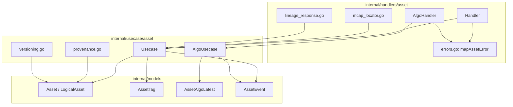
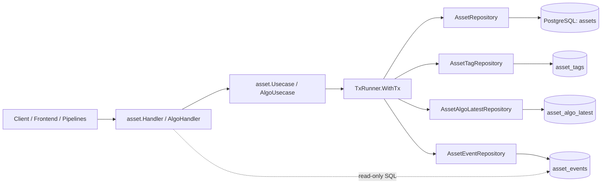
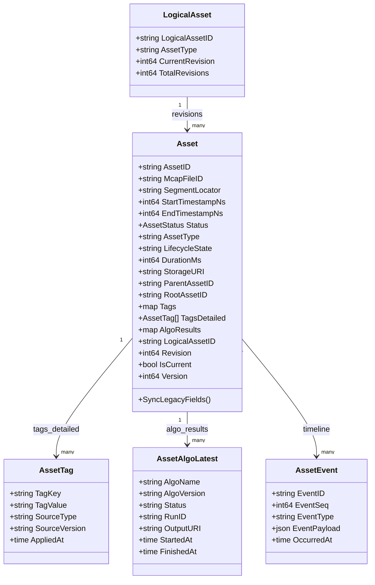
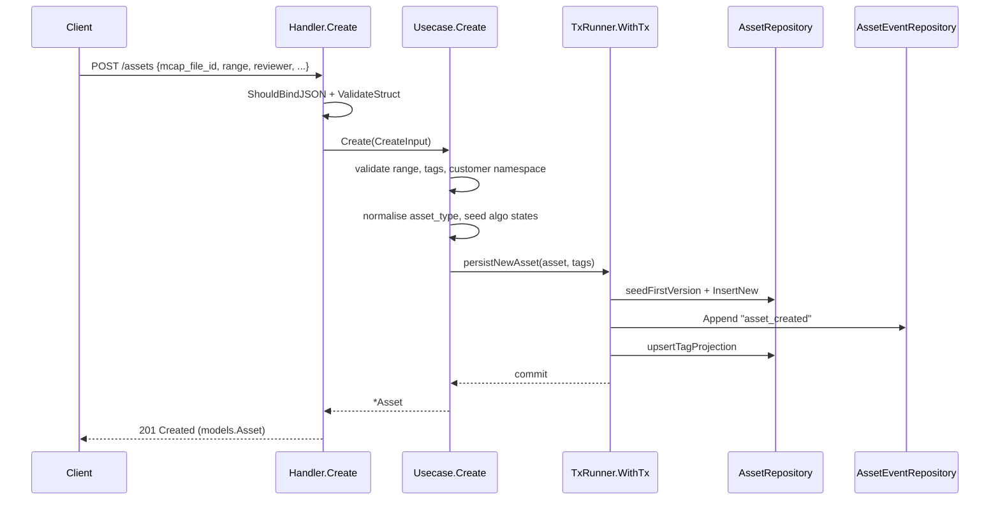
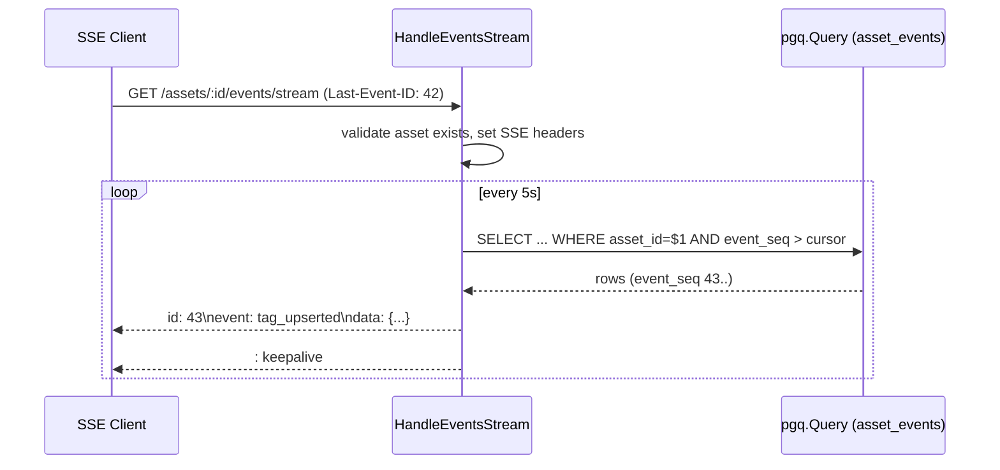
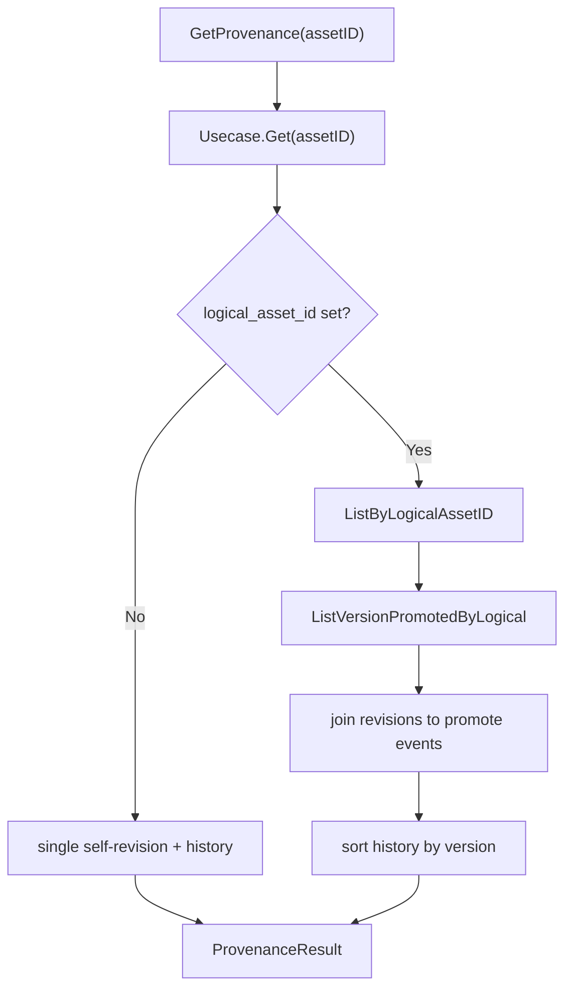
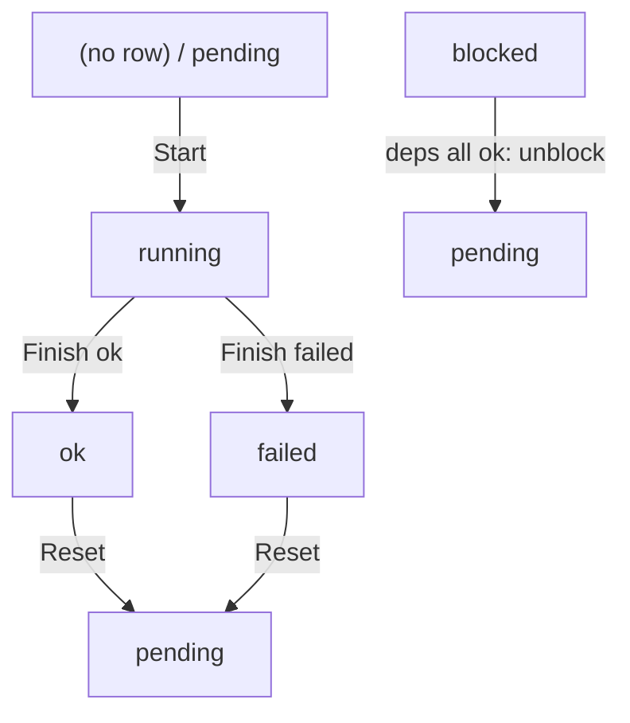
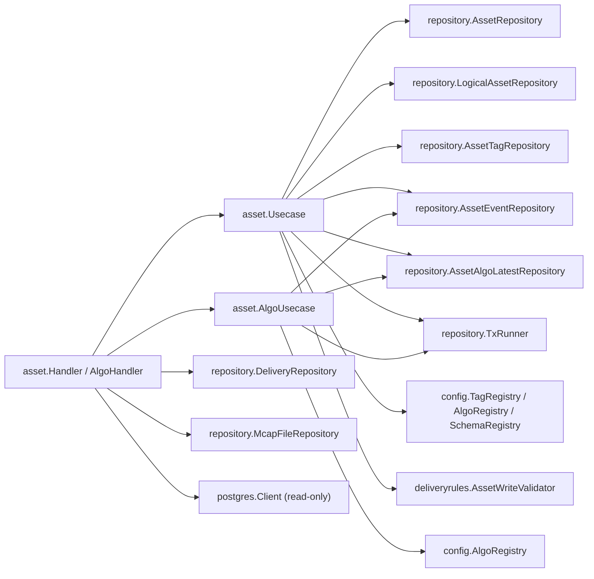

# Asset Management Module

<cite>
**Referenced Files in This Document**

- [backend/internal/handlers/asset/handler.go](file://backend/internal/handlers/asset/handler.go)
- [backend/internal/handlers/asset/algo_handler.go](file://backend/internal/handlers/asset/algo_handler.go)
- [backend/internal/handlers/asset/mcap_locator.go](file://backend/internal/handlers/asset/mcap_locator.go)
- [backend/internal/handlers/asset/lineage_response.go](file://backend/internal/handlers/asset/lineage_response.go)
- [backend/internal/handlers/asset/errors.go](file://backend/internal/handlers/asset/errors.go)
- [backend/internal/usecase/asset/usecase.go](file://backend/internal/usecase/asset/usecase.go)
- [backend/internal/usecase/asset/algo_usecase.go](file://backend/internal/usecase/asset/algo_usecase.go)
- [backend/internal/usecase/asset/provenance.go](file://backend/internal/usecase/asset/provenance.go)
- [backend/internal/usecase/asset/versioning.go](file://backend/internal/usecase/asset/versioning.go)
- [backend/internal/models/asset.go](file://backend/internal/models/asset.go)
- [backend/internal/models/schema_evolution.go](file://backend/internal/models/schema_evolution.go)
- [backend/internal/models/algo_event.go](file://backend/internal/models/algo_event.go)
- [backend/routes/routes.go](file://backend/routes/routes.go)
</cite>

## Table of Contents
1. [Introduction](#introduction)
2. [Project Structure](#project-structure)
3. [Core Components](#core-components)
4. [Architecture Overview](#architecture-overview)
5. [Detailed Component Analysis](#detailed-component-analysis)
6. [Dependency Analysis](#dependency-analysis)
7. [Performance Considerations](#performance-considerations)
8. [Troubleshooting Guide](#troubleshooting-guide)
9. [Conclusion](#conclusion)
10. [Appendices](#appendices)

## Introduction

The **Asset Management module** is the heart of cyber-databrew. An *asset* is the central
domain object: a reviewable, deliverable slice of recorded data — typically a time window
carved out of an MCAP file — together with everything the platform learns about it over time
(tags, algorithm results, evaluation metrics, deliveries, and a full version history).

Everything in the platform orbits the asset row in the `assets` PostgreSQL table. The module
exposes the asset CRUD surface, the per-tag assertion model with provenance, an append-only
event timeline (with Server-Sent-Events streaming), structural and version lineage, an MCAP
byte-range locator for browser-based preview, and a per-algorithm current-state projection. It
is consumed by the frontend (asset browser, timeline, MCAP/Foxglove preview), by ingestion and
algorithm pipelines (which create assets and report algo state), and by delivery and evaluation
subsystems (which read lineage and append events).

The module is layered. HTTP concerns live in `internal/handlers/asset`; business rules and
transaction orchestration live in `internal/usecase/asset`; the row shapes live in
`internal/models`. The usecase never touches `gin`, and the handler never issues raw SQL except
for read-only operational queries (event polling, ratings history).

**Section sources**
- [backend/internal/models/asset.go](file://backend/internal/models/asset.go#L41-L118)
- [backend/internal/handlers/asset/handler.go](file://backend/internal/handlers/asset/handler.go#L30-L108)
- [backend/internal/usecase/asset/usecase.go](file://backend/internal/usecase/asset/usecase.go#L62-L114)

## Project Structure

The module spans three packages plus the route registration:

- **`internal/handlers/asset/`** — Gin handlers and HTTP-only types.
  - `handler.go` — the main `Handler`: Get, List, Create, Update, Delete, BatchGet, events
    (list / global / SSE stream), tags, provenance, deliveries, layered child-asset creation,
    revision promotion, usage stats, and ratings history.
  - `algo_handler.go` — `AlgoHandler`: algorithm Start / Finish / Reset / ListCurrent.
  - `mcap_locator.go` — `McapLocator` and `FoxgloveSource` plus their response DTOs.
  - `lineage_response.go` — read-only SQL that assembles the upstream/downstream lineage JSON.
  - `errors.go` — `mapAssetError`, the usecase-error → HTTP-status mapper.
- **`internal/usecase/asset/`** — business logic.
  - `usecase.go` — `Usecase`: CRUD, tag projection, event append, hydration of read models.
  - `algo_usecase.go` — `AlgoUsecase`: the per-algorithm state machine and dependency cascade.
  - `provenance.go` — `GetProvenance`: revision list + version history aggregation.
  - `versioning.go` — logical-asset seeding, revision promotion, current-revision lookup.
- **`internal/models/`** — row shapes: `Asset`, `LogicalAsset`, `AssetTag`, `AssetAlgoLatest`,
  `AssetEvent`, `AlgoEvent`, and the lifecycle/algo enums.
- **`routes/routes.go`** — wires the asset route group under `/api/v1/assets`.

**Diagram sources**
- [backend/internal/handlers/asset/handler.go](file://backend/internal/handlers/asset/handler.go#L30-L62)
- [backend/internal/handlers/asset/algo_handler.go](file://backend/internal/handlers/asset/algo_handler.go#L14-L22)
- [backend/internal/usecase/asset/usecase.go](file://backend/internal/usecase/asset/usecase.go#L62-L114)

**Section sources**
- [backend/internal/handlers/asset/handler.go](file://backend/internal/handlers/asset/handler.go#L1-L80)
- [backend/routes/routes.go](file://backend/routes/routes.go#L194-L221)

## Core Components

The module is built from a handful of long-lived types.

- **`models.Asset`** — the `assets` row. It carries a dual schema: legacy CF-era fields
  (`StartTimestampNs`, `Status`, `SegType`, `Tags`) retained for backward compatibility, plus
  the Phase-2 typed fields (`AssetType`, `LifecycleState`, `DurationMs`, `StorageURI`, hierarchy
  fields, and tenant/project scope). Multi-version identity is captured by `LogicalAssetID`,
  `Revision`, and `IsCurrent`. `SyncLegacyFields` derives the legacy view from the typed one
  after each DB read.
- **`asset.Handler`** — the Gin handler. Holds the asset `Usecase`, the delivery repository, an
  optional MCAP repository (wired by `SetMcapRepo`), and an optional postgres client/querier
  (wired by `SetPG`) used only for operational read queries.
- **`asset.AlgoHandler`** — thin handler over `AlgoUsecase` for the four algorithm endpoints.
- **`asset.Usecase`** — the workhorse. It composes an `AssetRepository` with optional projection
  repositories (`AssetTagRepository`, `AssetAlgoLatestRepository`, `AssetEventRepository`), a
  `LogicalAssetRepository`, registries (tag/algo/schema), a `TxRunner`, and validators. Its
  constructor family (`New`, `NewWithTagRegistry`, `NewFull`, `NewWithProjections`) lets callers
  wire only what an environment supports.
- **`asset.AlgoUsecase`** — owns the per-algorithm state machine. It deliberately depends only on
  the projection/outbox repos (plus a read-only existence check on `AssetRepository`), never
  writing `assets.version`.

**Section sources**
- [backend/internal/models/asset.go](file://backend/internal/models/asset.go#L51-L173)
- [backend/internal/handlers/asset/handler.go](file://backend/internal/handlers/asset/handler.go#L30-L80)
- [backend/internal/usecase/asset/usecase.go](file://backend/internal/usecase/asset/usecase.go#L62-L156)
- [backend/internal/usecase/asset/algo_usecase.go](file://backend/internal/usecase/asset/algo_usecase.go#L83-L119)

## Architecture Overview

Requests flow handler → usecase → repository → PostgreSQL. Mutations run inside a single
transaction (`withMutationTx`) so that the row write, the projection updates (tags / algo state),
and the append-only `asset_events` outbox row commit atomically. Reads hydrate the asset's
projection tables (`hydrateAssetReadModels`) so API responses carry both the typed fields and the
legacy flat maps.

The append-only `asset_events` table is the platform's change-data-capture (CDC) source.
Downstream consumers (Elasticsearch projection, Iceberg, audit) replay it deterministically; the
SSE endpoints simply poll the same table for new `event_seq` rows.

**Diagram sources**
- [backend/internal/usecase/asset/usecase.go](file://backend/internal/usecase/asset/usecase.go#L151-L156)
- [backend/internal/usecase/asset/usecase.go](file://backend/internal/usecase/asset/usecase.go#L351-L390)
- [backend/internal/usecase/asset/algo_usecase.go](file://backend/internal/usecase/asset/algo_usecase.go#L1-L18)

**Section sources**
- [backend/internal/usecase/asset/usecase.go](file://backend/internal/usecase/asset/usecase.go#L258-L390)
- [backend/internal/usecase/asset/algo_usecase.go](file://backend/internal/usecase/asset/algo_usecase.go#L1-L55)

## Detailed Component Analysis

### The Asset model

The `Asset` struct is the canonical row. The class diagram below shows the model and its
satellite projection types as they are actually defined.

`SyncLegacyFields` is the bridge between the two schema generations: it derives `Status` from
`LifecycleState` (via `LifecycleToStatus`), computes `DurationSec` from `DurationMs`, mirrors
`SegType` onto `AssetType`, lifts `env`/`task` out of `Metadata`, and back-fills the flat `Files`
map from `FilesJSON`.

**Diagram sources**
- [backend/internal/models/asset.go](file://backend/internal/models/asset.go#L51-L133)
- [backend/internal/models/schema_evolution.go](file://backend/internal/models/schema_evolution.go#L13-L74)

**Section sources**
- [backend/internal/models/asset.go](file://backend/internal/models/asset.go#L51-L173)
- [backend/internal/models/asset.go](file://backend/internal/models/asset.go#L270-L326)

### Asset CRUD and the usecase

`Handler.Get` reads via `Usecase.GetAll` so that soft-deleted (archived) assets remain
retrievable — the API contract states assets are still accessible by GET after a soft delete.
`Handler.Create` binds a wide request body, runs struct validation, and delegates to
`Usecase.Create`, which:

1. Validates the time range (`EndTimestampNs > StartTimestampNs`) and any supplied IDs.
2. Validates tags against the tag registry and the `customer.*` namespace lint (CYB-1070).
3. Normalises `AssetType`/`SegType` (defaulting both to `"segment"` for legacy callers) and
   enforces `mcap_file_id` presence unless the type is `derived_asset` or has a registered schema.
4. Seeds algorithm states from the algo registry, validates hierarchy invariants (CYB-1164),
   then either allocates a fresh random 8-char asset ID (with collision retry) or persists the
   caller-supplied ID.

`Update` treats `lifecycle_state` as authoritative (`Status` is derived); it appends an
`asset_updated` event and, when the state actually changed, an `asset_lifecycle_changed` event.
`Delete` is a soft delete that flips the row to archived and appends an `asset_lifecycle_changed`
event. `BatchGet` retrieves up to 100 IDs, de-duplicating and silently skipping not-found assets.
`CommitSegments` (internal) creates one asset per `[start, end]` range from a single MCAP file.

The handler also exposes layered child-asset creation — `CreateClip`, `CreateAction`,
`CreateFrame`, `CreateTask` — all funnelling through `createChildAsset` → `Usecase.CreateChildAsset`,
which inherits identity/scope from the parent, inserts an `asset_relations` edge, and derives the
relation type from `split_method` (`algo:*` → `derived_from`, else `split_from`).

**Diagram sources**
- [backend/internal/handlers/asset/handler.go](file://backend/internal/handlers/asset/handler.go#L545-L646)
- [backend/internal/usecase/asset/usecase.go](file://backend/internal/usecase/asset/usecase.go#L810-L955)
- [backend/internal/usecase/asset/usecase.go](file://backend/internal/usecase/asset/usecase.go#L351-L390)

**Section sources**
- [backend/internal/handlers/asset/handler.go](file://backend/internal/handlers/asset/handler.go#L82-L108)
- [backend/internal/handlers/asset/handler.go](file://backend/internal/handlers/asset/handler.go#L648-L771)
- [backend/internal/usecase/asset/usecase.go](file://backend/internal/usecase/asset/usecase.go#L623-L667)
- [backend/internal/usecase/asset/usecase.go](file://backend/internal/usecase/asset/usecase.go#L1082-L1320)

### Tags and provenance-aware assertions

Tags are not a simple map. The `asset_tags` projection table (model `AssetTag`) records each
assertion together with its source identity — `source_type`, `source_name`, `source_version`,
`run_id` — so multiple sources can independently assert the same key. `Asset.Tags` is a flat
last-write-wins convenience map; `Asset.TagsDetailed` is the source of truth (CYB-1015).

`Handler.UpsertTag` (POST `/assets/:id/tags`) binds `{key, value, source_type, ...}` and calls
`Usecase.UpsertTag`, which validates the tag value and source against the registry, defaults an
empty `source_type` to `"human"`, then writes through `upsertTagProjection`. For each tag the
usecase: checks immutability (`assertNotImmutable` — a source flagged `immutable: true` cannot
overwrite an existing same-key/same-version assertion), upserts the projection row, appends a
`tag_upserted` event, and propagates the tag to descendant assets when the registry declares
`propagation=descendants` (CYB-1068).

`Handler.DeleteTag` (DELETE `/assets/:id/tags/:key`) removes either all sources for the key or
only the matching `source_type` (from the `source_type` query param), appending one `tag_deleted`
event per removed row. `Handler.ListTagHistory` (GET `/assets/:id/tags/history`) is a thin filter
over the event timeline restricted to `tag_upserted` / `tag_deleted`.

On read, `hydrateTags` reloads all rows for the asset, rebuilds the flat `Tags` map as
applied-at-wins per key, and populates `TagsDetailed`.

**Section sources**
- [backend/internal/handlers/asset/handler.go](file://backend/internal/handlers/asset/handler.go#L416-L530)
- [backend/internal/usecase/asset/usecase.go](file://backend/internal/usecase/asset/usecase.go#L286-L349)
- [backend/internal/usecase/asset/usecase.go](file://backend/internal/usecase/asset/usecase.go#L451-L476)
- [backend/internal/usecase/asset/usecase.go](file://backend/internal/usecase/asset/usecase.go#L1158-L1260)

### Events and the timeline

Every mutation appends to the append-only `asset_events` outbox in the same transaction. The
model `AssetEvent` carries `event_seq` (a monotonic cursor), `event_type`, `event_payload`
(raw JSON), and `occurred_at`. `appendAssetEvent` stamps the request ID from context and an
`aggregate_type` of `"asset"`.

`Handler.ListEvents` (GET `/assets/:id/events`, aliased as `/timeline`) parses a flexible query
(`cursor` / `before_event_seq`, `after_event_seq`, `start_time`, `end_time`, `limit` bounded
1–200, repeated `event_type` with `*` wildcard support, `algo_key`) and returns a page ordered by
`event_seq` with a `next_cursor` for keyset pagination. `Usecase.ListEvents` fetches `limit+1`
rows to detect whether a further page exists. `ListGlobalEvents` (GET `/events`) does the same
across all assets and defaults to the last 24 hours when no time bound is given, to avoid full
table scans.

Two Server-Sent-Events endpoints — `HandleEventsStream` (`/assets/:id/events/stream`) and
`HandleGlobalEventsStream` (`/events/stream`) — poll `asset_events` every 5 seconds for rows newer
than the cursor and emit them as SSE frames. Both honour the `Last-Event-ID` header so a client
can resume from the last `event_seq` it received. The raw SQL polling (`pollAssetEvents` /
`pollGlobalAssetEvents`) is the one place the handler talks to PostgreSQL directly, via the
`pgq` querier wired by `SetPG`.

**Diagram sources**
- [backend/internal/handlers/asset/handler.go](file://backend/internal/handlers/asset/handler.go#L1094-L1163)
- [backend/internal/handlers/asset/handler.go](file://backend/internal/handlers/asset/handler.go#L1241-L1314)

**Section sources**
- [backend/internal/handlers/asset/handler.go](file://backend/internal/handlers/asset/handler.go#L177-L305)
- [backend/internal/handlers/asset/handler.go](file://backend/internal/handlers/asset/handler.go#L364-L414)
- [backend/internal/usecase/asset/usecase.go](file://backend/internal/usecase/asset/usecase.go#L721-L808)

### Lineage and provenance

The module distinguishes two related but distinct concepts:

- **Lineage** (`Handler.GetLineage`, GET `/assets/:id/lineage`) is the data-flow graph.
  `buildLineageResponse` assembles an `upstream` block (the MCAP file the asset derives from) and
  a `downstream` block (algorithm results from `asset_algo_latest`, deliveries via
  `delivery_items` join, and eval results from `asset_eval_results`). It is best-effort: partial
  failures are logged and a usable response is still returned. It requires the postgres client
  (`SetPG`); without it the endpoint returns 503.
- **Provenance** (`Handler.GetProvenance`, GET `/assets/:id/provenance`) is the version story.
  `Usecase.GetProvenance` returns the revision list and a version-history timeline for the
  asset's logical family. For an asset with no `logical_asset_id` it returns a single
  self-revision; otherwise it lists every revision (`ListByLogicalAssetID`), joins each to its
  `version_promoted` event for `promoted_at` / `run_id` / `reason`, and sorts by version. The
  handler combines this with the lineage snapshot in one response.

**Diagram sources**
- [backend/internal/usecase/asset/provenance.go](file://backend/internal/usecase/asset/provenance.go#L37-L118)

**Section sources**
- [backend/internal/handlers/asset/handler.go](file://backend/internal/handlers/asset/handler.go#L307-L360)
- [backend/internal/handlers/asset/lineage_response.go](file://backend/internal/handlers/asset/lineage_response.go#L18-L142)
- [backend/internal/usecase/asset/provenance.go](file://backend/internal/usecase/asset/provenance.go#L12-L135)

### Versioning and revision promotion

Version identity is coordinated by the `logical_assets` table (model `LogicalAsset`). On the very
first persist of an asset, `seedFirstVersion` sets `LogicalAssetID = AssetID`, `Revision = 1`,
`IsCurrent = true`, and inserts the coordinator row. `Handler.PromoteRevision` (POST
`/assets/:id/revisions`) → `Usecase.Promote` clones a source asset into a new asset entry,
computes the next revision as `MaxRevision + 1`, demotes the prior current revision, inserts a
`revision_of` relation, and appends a `version_promoted` event — all inside one transaction with
asset-ID collision retry. `GetCurrentForLogical` (GET `/logical-assets/:id/current`) returns the
current revision for a logical family. The legacy `version` column on `assets` is an optimistic
lock for row writes and is **not** the content revision.

**Section sources**
- [backend/internal/usecase/asset/versioning.go](file://backend/internal/usecase/asset/versioning.go#L20-L201)
- [backend/internal/usecase/asset/versioning.go](file://backend/internal/usecase/asset/versioning.go#L249-L290)
- [backend/internal/handlers/asset/handler.go](file://backend/internal/handlers/asset/handler.go#L938-L996)

### MCAP locator and Foxglove source

For browser-based preview, `Handler.McapLocator` (GET `/assets/:id/mcap-locator`) joins the asset
row's time window with its `mcap_files` row to return a single `McapLocatorResponse`: the MCAP
file ID, the `gs://` URI, size, MD5 hash, and the `[start_timestamp_ns, end_timestamp_ns]` window
plus `duration_ms`. The locator is strictly read-only and never signs URLs. It is gated on
`previewableLifecycleStates` (created, ready, delivered, archived, superseded) and requires both a
linked MCAP file and a configured MCAP repository (otherwise 503 / 409).

`Handler.FoxgloveSource` (GET `/assets/:id/foxglove-source`) returns a direct-MCAP source contract
(`ds = remote-file`) pointing at a same-origin byte proxy (`/api/v1/mcap-files/:id/bytes`) so
Foxglove/Lichtblick-style players can issue CORS-free Range requests, with `hints.window`
echoing the same POSIX-nanosecond time base used in MCAP `log_time`.

**Section sources**
- [backend/internal/handlers/asset/mcap_locator.go](file://backend/internal/handlers/asset/mcap_locator.go#L19-L130)
- [backend/internal/handlers/asset/mcap_locator.go](file://backend/internal/handlers/asset/mcap_locator.go#L182-L225)

### Algorithm state projection

`AlgoUsecase` implements a per-algorithm state machine whose source of truth is the
`asset_algo_latest` projection table — *not* the `assets` row. The `(asset_id, algo_name)` primary
key plus a monotonic guard on `algo_version` makes concurrent finishes from different algorithm
versions safe without locking `assets`. Every transition appends a matching event in the same
transaction.

- **Start** (`/assets/:id/algo/:algo_key/start`) — legal only from empty or `pending`; rejects
  running / blocked / ok / failed. Writes the projection row and an `algo_started` event.
- **Finish** (`/finish`) — transitions `running` → `ok`/`failed`. `ok` requires the registry's
  required fields (e.g. `output_uri`, `result_size_bytes`); `failed` requires a reason and is
  classified into a `failure_mode` (timeout, algo_error, sensor_fault, …). An `ok` finish triggers
  `tryUnblockDownstream`, which moves any `blocked` dependants whose dependencies are all `ok`
  into `pending`. Idempotent for an already-`ok` algo with a matching `run_id`.
- **Reset** (`/reset`) — moves `ok`/`failed` back to `pending`, clearing run/output/error fields.
- **ListCurrent** (GET `/assets/:id/algo`) — returns every projection row for the asset.

The flat-key `AlgoResults` map on the asset (e.g. `name@ver:status`) is hydrated from
`asset_algo_latest` by `hydrateAlgoResults` for backward-compatible API consumers.

**Diagram sources**
- [backend/internal/models/algo_event.go](file://backend/internal/models/algo_event.go#L43-L53)
- [backend/internal/usecase/asset/algo_usecase.go](file://backend/internal/usecase/asset/algo_usecase.go#L278-L334)

**Section sources**
- [backend/internal/handlers/asset/algo_handler.go](file://backend/internal/handlers/asset/algo_handler.go#L39-L152)
- [backend/internal/usecase/asset/algo_usecase.go](file://backend/internal/usecase/asset/algo_usecase.go#L278-L606)
- [backend/internal/usecase/asset/usecase.go](file://backend/internal/usecase/asset/usecase.go#L485-L519)

## Dependency Analysis

The handler depends on the usecase, the delivery/MCAP repositories, and optionally a postgres
querier. The usecase depends on a set of repository interfaces and registries. The clean
inward-only dependency direction lets tests substitute fakes at each seam.

External coupling: the handler imports `audit` (audit logging on delete / batch-tag / algo reset),
`deliveryrules` (the `HierarchyViolation` sentinel surfaced as 422), `filter` (filter parsing for
the deprecated List endpoint), `httpresp` (uniform error bodies), and `id`/`validate`
(input validation). The usecase imports `pgx` only to recognise constraint-violation codes in
`mapCreateDBError`.

**Diagram sources**
- [backend/internal/handlers/asset/handler.go](file://backend/internal/handlers/asset/handler.go#L30-L80)
- [backend/internal/usecase/asset/usecase.go](file://backend/internal/usecase/asset/usecase.go#L62-L138)
- [backend/internal/usecase/asset/algo_usecase.go](file://backend/internal/usecase/asset/algo_usecase.go#L89-L114)

**Section sources**
- [backend/internal/handlers/asset/handler.go](file://backend/internal/handlers/asset/handler.go#L1-L80)
- [backend/internal/usecase/asset/usecase.go](file://backend/internal/usecase/asset/usecase.go#L1-L138)

## Performance Considerations

- **Keyset pagination on events.** `ListEvents` / `ListGlobalEvents` page by `event_seq` and fetch
  `limit+1` rows to compute `next_cursor`, avoiding `OFFSET` scans. The limit is bounded to
  1–200 (`parseBoundedInt`).
- **24-hour default window for global events.** `ListGlobalEvents` injects a last-24h lower bound
  when no time filter is supplied to prevent a full `asset_events` table scan.
- **SSE polling cadence.** The stream endpoints poll every 5 seconds (`assetEventStreamPollInterval`)
  with `LIMIT 50` per cycle; long-lived connections each hold a poll loop, so connection count is
  the scaling factor, not query cost.
- **Projection vs. row contention.** Algo state lives in `asset_algo_latest`, decoupled from
  `assets.version`, so high-frequency algorithm finishes never contend on the asset row's
  optimistic lock — the architectural fix for the OCC contention noted in `algo_usecase.go`.
- **N+1 on BatchGet.** `Usecase.BatchGet` loops `Get` per ID (each hydrating tags and algo
  results), so a 100-ID batch issues several queries per asset. The 100-item cap bounds the blast
  radius; large fan-outs should prefer `POST /queries/run`.
- **Hydration cost.** Every asset read triggers `hydrateTags` + `hydrateAlgoResults`. List
  endpoints hydrate each row (`hydrateAssetsReadModels`); the `ListWithFiltersPage` variant skips
  the `COUNT(*)` when the repository supports a count-free page query.
- **ID allocation retries.** New-asset creation retries up to 32 times on ID collision; with an
  8-char alphanumeric space this is effectively never hit.

**Section sources**
- [backend/internal/usecase/asset/usecase.go](file://backend/internal/usecase/asset/usecase.go#L721-L808)
- [backend/internal/usecase/asset/usecase.go](file://backend/internal/usecase/asset/usecase.go#L653-L719)
- [backend/internal/handlers/asset/handler.go](file://backend/internal/handlers/asset/handler.go#L1074-L1163)
- [backend/internal/usecase/asset/algo_usecase.go](file://backend/internal/usecase/asset/algo_usecase.go#L1-L18)

## Troubleshooting Guide

- **404 on a freshly-deleted asset via GET** — expected behaviour is the opposite: GET uses
  `GetAll` so archived assets stay readable. A true 404 means the row never existed; check the
  asset ID is the 8-char alphanumeric form (`RequirePathAssetID`).
- **422 `INVALID_STATE` on create** — `ErrMcapFileIDRequired` (missing `mcap_file_id` for a
  non-`derived_asset`, non-schema type) or `ErrInvalidRange` (`end <= start`). Verify the request
  range and that the type is registered.
- **422 hierarchy violation on create / child create** — the `AssetWriteValidator` rejected the
  parent/level relationship (CYB-1164); the response carries `invariant`, `asset_type`,
  `parent_id`, `expected`.
- **409 `CONCURRENT_CONFLICT`** — `repository.ErrOptimisticLock`; the asset row was modified
  between read and write. Reload and retry.
- **409 `TAG_IMMUTABLE`** — a source flagged `immutable: true` attempted to overwrite an existing
  same-key/same-version assertion. Use a new `source_version` or a different source.
- **422 `CUSTOMER_NOT_FOUND`** — a `customer.*` tag references a customer that does not exist
  (CYB-1070).
- **409 `ASSET_NOT_PREVIEWABLE` on mcap-locator** — the asset's `lifecycle_state` is not in the
  previewable set, or it has no linked MCAP file.
- **503 on lineage / mcap-locator / ratings-history** — the postgres client (`SetPG`) or MCAP
  repository (`SetMcapRepo`) was not wired in this deployment.
- **Algo 409 `ALGO_ALREADY_RUNNING` / `INVALID_STATE_TRANSITION`** — Start was called on a
  non-`pending` algorithm. Reset finished algos before re-starting.
- **Algo 422 `MISSING_REQUIRED_FIELD` / `MISSING_REASON`** — a finish-`ok` omitted a
  registry-required field, or a finish-`failed` omitted a reason.

All usecase sentinels are mapped to HTTP statuses by `mapAssetError` (CRUD/tags) and
`AlgoHandler.mapError` (algo lifecycle); an unrecognised error falls through to 500 Internal.

**Section sources**
- [backend/internal/handlers/asset/errors.go](file://backend/internal/handlers/asset/errors.go#L16-L48)
- [backend/internal/handlers/asset/algo_handler.go](file://backend/internal/handlers/asset/algo_handler.go#L154-L176)
- [backend/internal/usecase/asset/usecase.go](file://backend/internal/usecase/asset/usecase.go#L21-L48)

## Conclusion

Asset Management is the platform's central aggregate. It presents a stable, backward-compatible
API surface over a transactional core that keeps the asset row, its tag/algo projections, and an
append-only event log atomically consistent. The dual legacy/typed schema, provenance-aware
tags, the decoupled per-algorithm state machine, and the logical-asset versioning model together
let many independent producers (ingestion, algorithms, reviewers, deliveries, evaluation)
collaborate on the same object without contention, while CDC events feed every downstream
projection deterministically.

## Appendices

### Asset HTTP endpoints (asset route group)

| Method | Path | Handler |
| --- | --- | --- |
| POST | `/api/v1/assets` | `Handler.Create` |
| GET | `/api/v1/assets/:id` | `Handler.Get` |
| PATCH | `/api/v1/assets/:id` | `Handler.Update` |
| DELETE | `/api/v1/assets/:id` | `Handler.Delete` |
| POST | `/api/v1/assets:batch_get` | `Handler.BatchGet` |
| GET | `/api/v1/assets/:id/deliveries` | `Handler.ListDeliveries` |
| GET | `/api/v1/assets/:id/mcap-locator` | `Handler.McapLocator` |
| GET | `/api/v1/assets/:id/foxglove-source` | `Handler.FoxgloveSource` |
| GET | `/api/v1/assets/:id/events` | `Handler.ListEvents` |
| GET | `/api/v1/assets/:id/timeline` | `Handler.Timeline` |
| GET | `/api/v1/assets/:id/lineage` | `Handler.GetLineage` |
| POST | `/api/v1/assets/:id/tags` | `Handler.UpsertTag` |
| DELETE | `/api/v1/assets/:id/tags/:key` | `Handler.DeleteTag` |
| GET | `/api/v1/assets/:id/tags/history` | `Handler.ListTagHistory` |
| GET | `/api/v1/events` | `Handler.ListGlobalEvents` |
| GET | `/api/v1/assets/:id/algo` | `AlgoHandler.ListCurrent` |
| POST | `/api/v1/assets/:id/algo/:algo_key/start` | `AlgoHandler.Start` |
| POST | `/api/v1/assets/:id/algo/:algo_key/finish` | `AlgoHandler.Finish` |
| POST | `/api/v1/assets/:id/algo/:algo_key/reset` | `AlgoHandler.Reset` |

Additional handlers carry `@Router` annotations and are wired where the deployment enables them:
`/assets/:id/provenance` (`GetProvenance`), `/assets/:id/revisions` (`PromoteRevision`),
`/assets/:id/events/stream` and `/events/stream` (SSE), `/assets/:id/view` and `/favorite`
(usage stats), `/assets/:id/{clips,actions,frames,tasks}` (layered create),
`/logical-assets/:id/current` and `/ratings-history`, and `/asset-types/:type/schema`.

**Section sources**
- [backend/routes/routes.go](file://backend/routes/routes.go#L194-L221)

### Lifecycle and algo enums

| `lifecycle_state` | derived legacy `Status` |
| --- | --- |
| created / processing / ready / delivered | approved |
| rejected / failed | rejected |
| archived | archived |
| superseded | superseded |

Valid algorithm statuses: `blocked`, `pending`, `running`, `ok`, `failed`. Legal transitions are
declared in `ValidAlgoTransitions`.

**Section sources**
- [backend/internal/models/asset.go](file://backend/internal/models/asset.go#L270-L326)
- [backend/internal/models/algo_event.go](file://backend/internal/models/algo_event.go#L18-L53)

### Asset event types

`asset_created`, `asset_updated`, `asset_lifecycle_changed`, `tag_upserted`, `tag_deleted`,
`version_promoted`, and the algo-lifecycle set `algo_started`, `algo_finished`, `algo_failed`,
`algo_reset`, `algo_unblocked`, `algo_run_applied`.

**Section sources**
- [backend/internal/usecase/asset/usecase.go](file://backend/internal/usecase/asset/usecase.go#L368-L385)
- [backend/internal/usecase/asset/algo_usecase.go](file://backend/internal/usecase/asset/algo_usecase.go#L48-L65)
</content>
</invoke>
