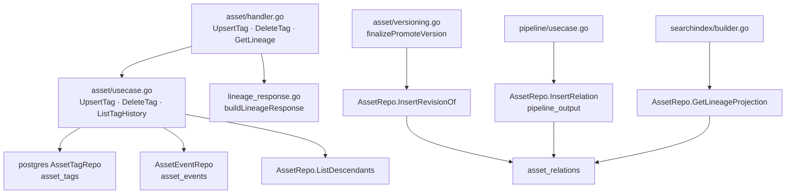
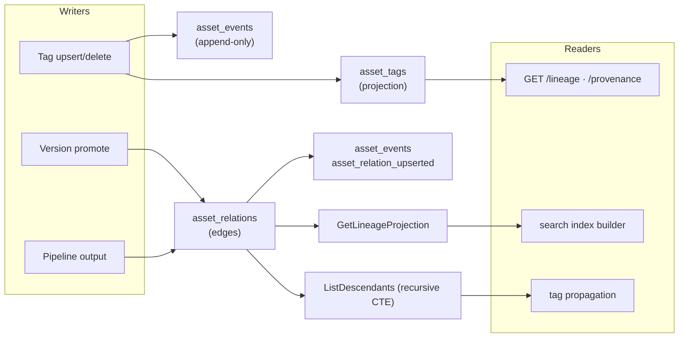
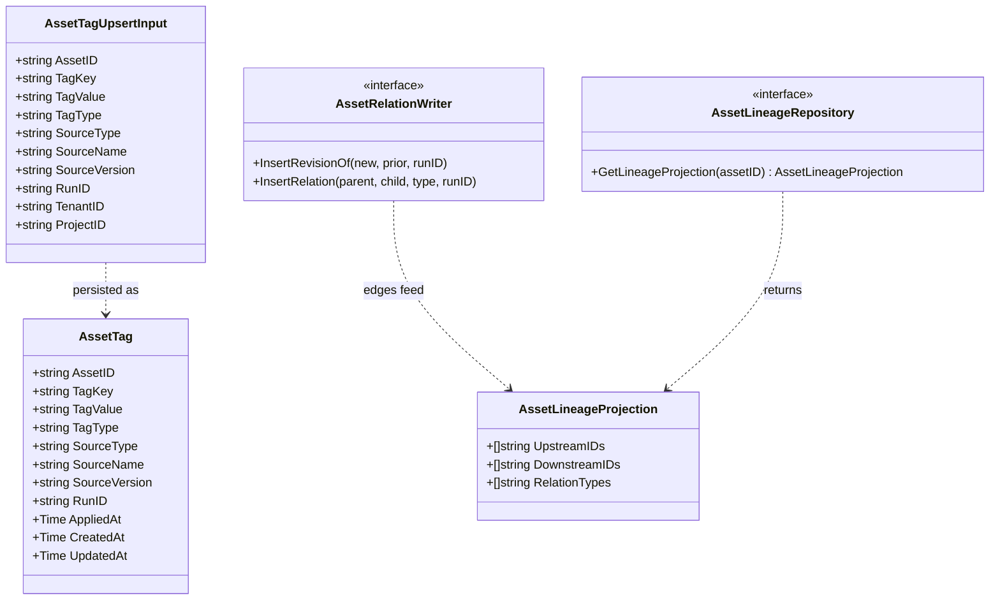
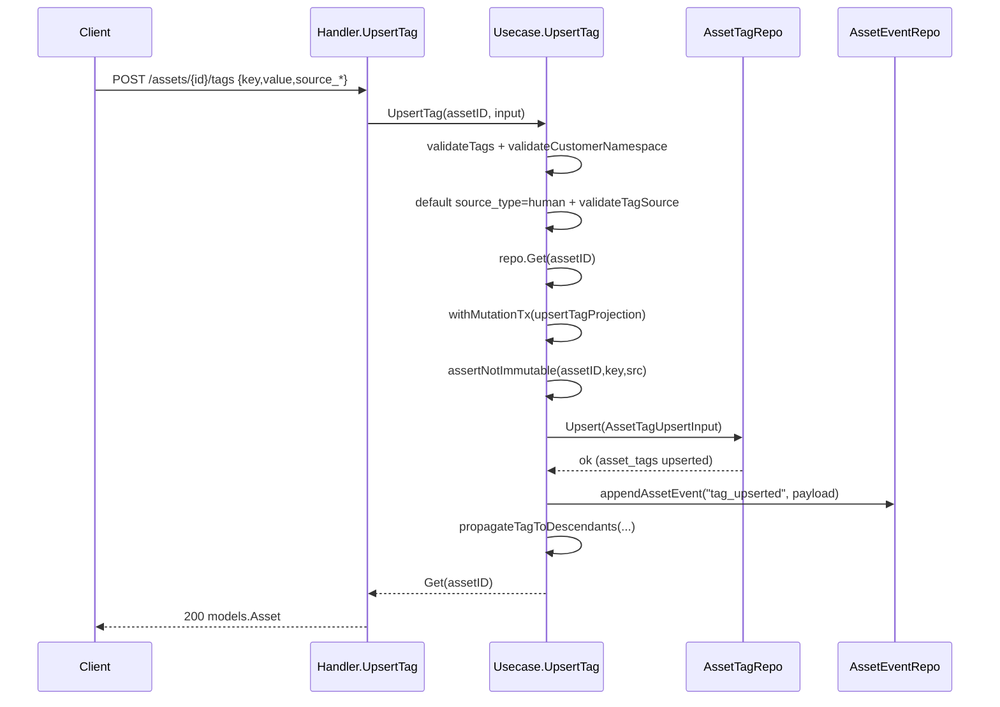
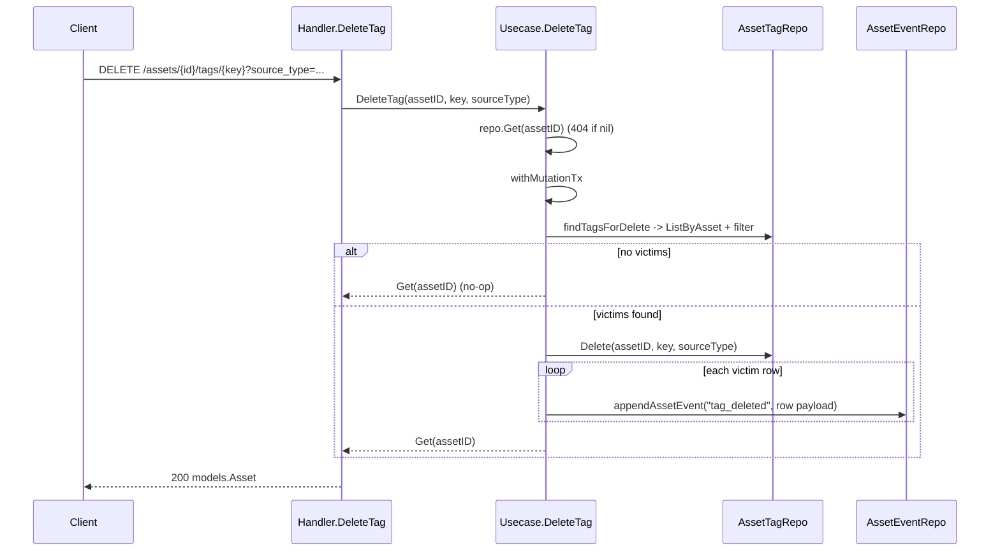
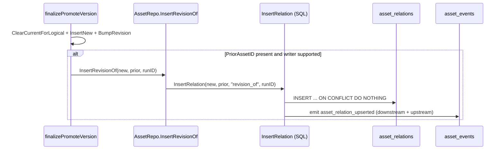
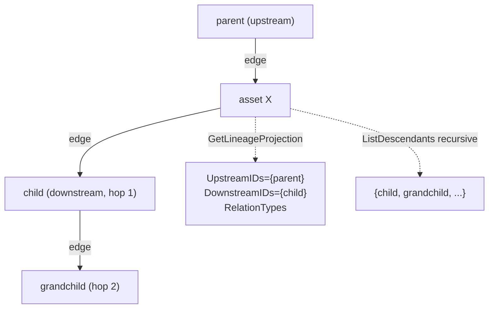
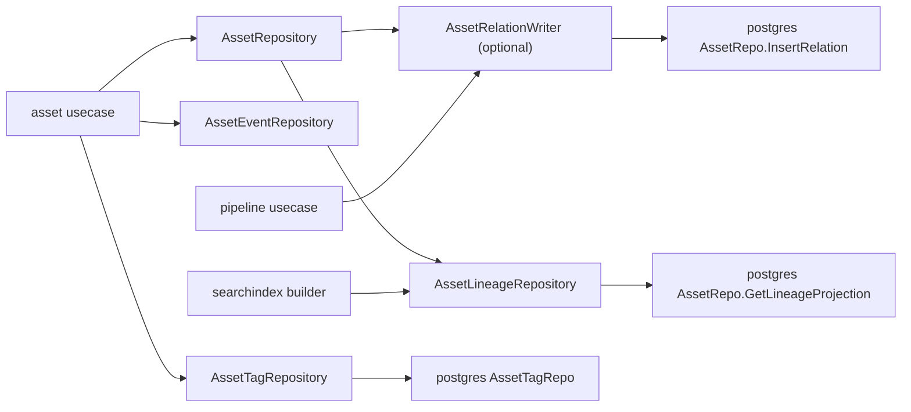

# Tags & Lineage

<cite>
**Referenced Files in This Document**

- [backend/internal/repository/asset_lineage_repository.go](file://backend/internal/repository/asset_lineage_repository.go)
- [backend/internal/repository/asset_relation_writer.go](file://backend/internal/repository/asset_relation_writer.go)
- [backend/internal/postgres/logical_assets.go](file://backend/internal/postgres/logical_assets.go)
- [backend/internal/postgres/repos.go](file://backend/internal/postgres/repos.go)
- [backend/internal/handlers/asset/handler.go](file://backend/internal/handlers/asset/handler.go)
- [backend/internal/handlers/asset/lineage_response.go](file://backend/internal/handlers/asset/lineage_response.go)
- [backend/internal/usecase/asset/usecase.go](file://backend/internal/usecase/asset/usecase.go)
- [backend/internal/usecase/asset/versioning.go](file://backend/internal/usecase/asset/versioning.go)
- [backend/internal/usecase/pipeline/usecase.go](file://backend/internal/usecase/pipeline/usecase.go)
- [backend/internal/searchindex/builder.go](file://backend/internal/searchindex/builder.go)
- [backend/internal/repository/common.go](file://backend/internal/repository/common.go)
- [backend/internal/models/schema_evolution.go](file://backend/internal/models/schema_evolution.go)
</cite>

## Table of Contents
1. [Introduction](#introduction)
2. [Project Structure](#project-structure)
3. [Core Components](#core-components)
4. [Architecture Overview](#architecture-overview)
5. [Detailed Component Analysis](#detailed-component-analysis)
6. [Dependency Analysis](#dependency-analysis)
7. [Performance Considerations](#performance-considerations)
8. [Troubleshooting Guide](#troubleshooting-guide)
9. [Conclusion](#conclusion)
10. [Appendices](#appendices)

## Introduction

This page documents the two related subsystems that record *what* an asset is
and *where* it came from: **tags** and **lineage**.

- **Tags** are key/value assertions attached to an asset. A tag is not just a
  `(key, value)` pair — it carries a **source identity** (`source_type`,
  `source_name`, `source_version`, `run_id`) so that the same key/value can be
  asserted independently by a human, a system process, or an algorithm run, and
  those assertions coexist. Tag writes flow through a usecase that validates the
  assertion against a registry, upserts into the `asset_tags` projection table,
  appends an immutable `tag_upserted` / `tag_deleted` event, and optionally
  propagates the tag to descendant assets.

- **Lineage** is the directed graph of relationships between assets, stored as
  `asset_relations` parent→child edges. A new revision points at its prior
  revision (`revision_of`); a pipeline output points back at its input assets
  (`pipeline_output`). Lineage is read both as a flat upstream/downstream
  projection (for the search index and the lineage API) and as a recursive
  descendant set (for tag propagation).

The audience is backend engineers extending tagging or provenance, and anyone
debugging why a tag did not stick or why a lineage edge is missing.

**Section sources**
- [backend/internal/usecase/asset/usecase.go](file://backend/internal/usecase/asset/usecase.go#L1158-L1260)
- [backend/internal/postgres/repos.go](file://backend/internal/postgres/repos.go#L54-L130)

## Project Structure

The tag and lineage code is layered across handler, usecase, repository
(interface), and postgres (implementation) packages:

- **HTTP handlers** — `backend/internal/handlers/asset/handler.go` exposes
  `UpsertTag`, `DeleteTag`, `ListTagHistory`, `GetLineage`, and `GetProvenance`.
  `backend/internal/handlers/asset/lineage_response.go` builds the
  upstream/downstream JSON body shared by the lineage and provenance endpoints.
- **Usecase** — `backend/internal/usecase/asset/usecase.go` holds the tag
  business rules (`UpsertTag`, `DeleteTag`, `ListTagHistory`,
  `upsertTagProjection`, `propagateTagToDescendants`). Version promotion writes
  the `revision_of` edge in `backend/internal/usecase/asset/versioning.go`.
  Pipeline materialization writes `pipeline_output` edges in
  `backend/internal/usecase/pipeline/usecase.go`.
- **Repository interfaces** — `backend/internal/repository/asset_relation_writer.go`
  defines the optional `AssetRelationWriter` capability;
  `backend/internal/repository/asset_lineage_repository.go` defines
  `AssetLineageRepository` and the `AssetLineageProjection` shape;
  `backend/internal/repository/common.go` defines `AssetTagRepository` and
  `AssetTagUpsertInput`.
- **Postgres implementations** — `backend/internal/postgres/repos.go` implements
  `AssetTagRepo` (the `asset_tags` projection), `InsertRelation` /
  `InsertRevisionOf` / `GetLineageProjection` / `ListDescendants` on `AssetRepo`.
  `backend/internal/postgres/logical_assets.go` carries the revision counters
  that the `revision_of` edge mirrors.
- **Search index** — `backend/internal/searchindex/builder.go` reads the lineage
  projection into the Elasticsearch document.



**Diagram sources**
- [backend/internal/handlers/asset/handler.go](file://backend/internal/handlers/asset/handler.go#L431-L530)
- [backend/internal/usecase/asset/usecase.go](file://backend/internal/usecase/asset/usecase.go#L286-L326)
- [backend/internal/postgres/repos.go](file://backend/internal/postgres/repos.go#L54-L130)

**Section sources**
- [backend/internal/repository/asset_relation_writer.go](file://backend/internal/repository/asset_relation_writer.go#L1-L11)
- [backend/internal/repository/asset_lineage_repository.go](file://backend/internal/repository/asset_lineage_repository.go#L1-L14)

## Core Components

#### Tag write input and projection row

A single tag write is described by `AssetTagUpsertInput`. As of CYB-1015 the row
identity is `(asset_id, tag_key, tag_value, source_type, source_version)`, so
multiple sources may coexist on the same `(asset_id, tag_key)`.

The persisted shape is `models.AssetTag`. `AppliedAt` is the moment the source
declared the assertion; `CreatedAt` is the row's first insert; `UpdatedAt`
tracks the last refresh.

#### Tag usecase entry points

`UpsertTag` validates the tag, checks the `customer.*` namespace, defaults the
source type, runs inside a mutation transaction, and re-reads the asset.
`DeleteTag` finds the victim rows, deletes them, and appends one `tag_deleted`
event per removed row. `ListTagHistory` is a thin filter over `ListEvents`
restricted to the `tag_upserted` and `tag_deleted` event types.

#### Relation writer and lineage projection

`AssetRelationWriter` is an *optional* capability: callers type-assert the asset
store to it before writing edges. `InsertRevisionOf` is sugar for
`InsertRelation(new, prior, "revision_of", runID)`. `GetLineageProjection`
collapses all edges touching an asset into deduplicated `UpstreamIDs`,
`DownstreamIDs`, and `RelationTypes`.

**Section sources**
- [backend/internal/repository/common.go](file://backend/internal/repository/common.go#L76-L104)
- [backend/internal/models/schema_evolution.go](file://backend/internal/models/schema_evolution.go#L8-L27)
- [backend/internal/usecase/asset/usecase.go](file://backend/internal/usecase/asset/usecase.go#L765-L770)
- [backend/internal/repository/asset_lineage_repository.go](file://backend/internal/repository/asset_lineage_repository.go#L1-L14)

## Architecture Overview

Tags and lineage share a common spine: a **projection table** that holds the
current state, plus an **append-only event log** (`asset_events`) that records
every mutation for history and CDC. Tag mutations write both; lineage edge
inserts write the `asset_relations` row *and* emit `asset_relation_upserted`
events in the same statement so downstream consumers see new edges.



**Diagram sources**
- [backend/internal/postgres/repos.go](file://backend/internal/postgres/repos.go#L55-L130)
- [backend/internal/postgres/repos.go](file://backend/internal/postgres/repos.go#L689-L712)
- [backend/internal/searchindex/builder.go](file://backend/internal/searchindex/builder.go#L186-L196)

**Section sources**
- [backend/internal/postgres/repos.go](file://backend/internal/postgres/repos.go#L54-L130)
- [backend/internal/handlers/asset/lineage_response.go](file://backend/internal/handlers/asset/lineage_response.go#L18-L142)

## Detailed Component Analysis

### Tag data model and relation types

The tag projection row and the relation edge are the two data shapes at the
heart of this page. Relations are typed strings: `revision_of` (version family),
`pipeline_output` (pipeline input→output), and the generic edge produced by any
`InsertRelation` caller. The lineage projection groups distinct relation types
seen across an asset's edges.



**Diagram sources**
- [backend/internal/repository/common.go](file://backend/internal/repository/common.go#L76-L104)
- [backend/internal/models/schema_evolution.go](file://backend/internal/models/schema_evolution.go#L13-L27)
- [backend/internal/repository/asset_lineage_repository.go](file://backend/internal/repository/asset_lineage_repository.go#L5-L13)
- [backend/internal/repository/asset_relation_writer.go](file://backend/internal/repository/asset_relation_writer.go#L6-L10)

**Section sources**
- [backend/internal/repository/common.go](file://backend/internal/repository/common.go#L76-L104)
- [backend/internal/models/schema_evolution.go](file://backend/internal/models/schema_evolution.go#L8-L27)

### Tag upsert flow

`POST /assets/{id}/tags` binds a body requiring `key` and `value` and an
optional source identity. The handler delegates to `Usecase.UpsertTag`, which:

1. Validates the key/value against the tag registry (`validateTags`).
2. Validates the `customer.*` namespace — `customer.id` values must reference an
   existing customer (CYB-1070).
3. Defaults an empty `source_type` to `"human"` and validates the source
   identity contract (`requires_source_name` / `requires_source_version`).
4. Loads the asset (404 if missing).
5. Inside a mutation transaction, calls `upsertTagProjection`, which for each tag
   resolves the tag type, asserts the source is not immutable, upserts the
   `asset_tags` row, appends a `tag_upserted` event, and propagates to
   descendants when the registry declares `propagation=descendants`.



The `asset_tags` upsert uses `ON CONFLICT (asset_id, tag_key, tag_value,
source_type, source_version_norm) DO UPDATE` so a repeated assertion is
idempotent: it refreshes `tag_type`, `run_id`, tenant/project, and
`applied_at` / `updated_at` rather than inserting a duplicate.

**Diagram sources**
- [backend/internal/handlers/asset/handler.go](file://backend/internal/handlers/asset/handler.go#L431-L463)
- [backend/internal/usecase/asset/usecase.go](file://backend/internal/usecase/asset/usecase.go#L1158-L1193)
- [backend/internal/usecase/asset/usecase.go](file://backend/internal/usecase/asset/usecase.go#L286-L326)
- [backend/internal/postgres/repos.go](file://backend/internal/postgres/repos.go#L1640-L1669)

**Section sources**
- [backend/internal/handlers/asset/handler.go](file://backend/internal/handlers/asset/handler.go#L416-L463)
- [backend/internal/usecase/asset/usecase.go](file://backend/internal/usecase/asset/usecase.go#L179-L213)
- [backend/internal/usecase/asset/usecase.go](file://backend/internal/usecase/asset/usecase.go#L1158-L1193)

### Tag delete flow

`DELETE /assets/{id}/tags/{key}` accepts an optional `source_type` query
parameter. The handler calls `Usecase.DeleteTag`, which first lists the victim
rows via `findTagsForDelete` (filtering by key, and by source type when given),
then deletes and emits one `tag_deleted` event **per removed row** so the
history reflects exactly which source assertions disappeared. When no rows match
the delete is a no-op (no event, the asset is returned unchanged).



The repo `Delete` widens or narrows the SQL by source: an empty `source_type`
deletes every row for the key; a non-empty value scopes the delete to one
source.

**Diagram sources**
- [backend/internal/handlers/asset/handler.go](file://backend/internal/handlers/asset/handler.go#L477-L490)
- [backend/internal/usecase/asset/usecase.go](file://backend/internal/usecase/asset/usecase.go#L1198-L1260)
- [backend/internal/postgres/repos.go](file://backend/internal/postgres/repos.go#L1708-L1722)

**Section sources**
- [backend/internal/handlers/asset/handler.go](file://backend/internal/handlers/asset/handler.go#L465-L490)
- [backend/internal/usecase/asset/usecase.go](file://backend/internal/usecase/asset/usecase.go#L1195-L1260)

### Tag history

`GET /assets/{id}/tags/history` parses the cursor/limit query into a
`ListEventsInput`, then `ListTagHistory` forces the event-type filter to
`["tag_upserted", "tag_deleted"]` and clears any algo key or type pattern before
delegating to the generic `ListEvents` event reader. The response is paginated
with the same `event_seq` cursor semantics as the rest of the event timeline.

**Section sources**
- [backend/internal/handlers/asset/handler.go](file://backend/internal/handlers/asset/handler.go#L492-L530)
- [backend/internal/usecase/asset/usecase.go](file://backend/internal/usecase/asset/usecase.go#L765-L770)

### Writing lineage edges

Edges are written by two callers, both treating the relation writer as an
optional capability:

- **Version promotion** — `finalizePromoteVersion` clears the current flag,
  inserts the new revision, bumps the logical asset's revision counter, and —
  when a `PriorAssetID` is present and the store implements
  `AssetRelationWriter` — calls `InsertRevisionOf(newAssetID, priorAssetID,
  runID)`. Parent is the new revision, child is the prior (per PRD).
- **Pipeline output** — when a deployment materializes an output asset, each
  declared input asset ID gets an `InsertRelation(input, output,
  "pipeline_output", deploymentID)` edge.

`InsertRelation` runs a single SQL statement that inserts the edge with
`ON CONFLICT (parent_asset_id, child_asset_id, relation_type) DO NOTHING` and, in
the same `WITH` chain, emits two `asset_relation_upserted` events — one from each
endpoint's perspective with a `lineage_direction` of `downstream` or `upstream`.



**Diagram sources**
- [backend/internal/usecase/asset/versioning.go](file://backend/internal/usecase/asset/versioning.go#L249-L274)
- [backend/internal/postgres/repos.go](file://backend/internal/postgres/repos.go#L55-L89)
- [backend/internal/usecase/pipeline/usecase.go](file://backend/internal/usecase/pipeline/usecase.go#L498-L512)

**Section sources**
- [backend/internal/usecase/asset/versioning.go](file://backend/internal/usecase/asset/versioning.go#L249-L274)
- [backend/internal/postgres/repos.go](file://backend/internal/postgres/repos.go#L54-L89)
- [backend/internal/usecase/pipeline/usecase.go](file://backend/internal/usecase/pipeline/usecase.go#L498-L514)

### Reading lineage: projection vs. recursive

There are two distinct reads over `asset_relations`:

1. **Flat projection** — `GetLineageProjection` selects every edge where the
   asset is parent or child, then buckets the other endpoint into upstream
   (asset is child) or downstream (asset is parent), collecting distinct
   relation types. This is a single-hop view consumed by the search index
   (`lineage_upstream_ids`, `lineage_downstream_ids`, `lineage_relation_types`).

2. **Recursive descendants** — `ListDescendants` walks parent→child edges with a
   `WITH RECURSIVE` CTE and joins back to non-deleted `assets`. This is the
   transitive downstream closure used by tag propagation (CYB-1068).



Note the JSON lineage response in `lineage_response.go` is a *different*,
business-shaped view (mcap upstream; algo results, deliveries, eval results
downstream) and does not read `asset_relations` directly — it is the API surface
for `GET /assets/{id}/lineage` and the `lineage` block of `GET
/assets/{id}/provenance`.

**Diagram sources**
- [backend/internal/postgres/repos.go](file://backend/internal/postgres/repos.go#L91-L130)
- [backend/internal/postgres/repos.go](file://backend/internal/postgres/repos.go#L689-L712)

**Section sources**
- [backend/internal/postgres/repos.go](file://backend/internal/postgres/repos.go#L91-L130)
- [backend/internal/postgres/repos.go](file://backend/internal/postgres/repos.go#L689-L712)
- [backend/internal/searchindex/builder.go](file://backend/internal/searchindex/builder.go#L186-L196)
- [backend/internal/handlers/asset/lineage_response.go](file://backend/internal/handlers/asset/lineage_response.go#L11-L142)

### Tag propagation to descendants

When a tag key is declared `propagation=descendants` in the tag registry,
`upsertTagProjection` calls `propagateTagToDescendants` after the primary write.
It resolves the recursive descendant set via `ListDescendants` and upserts the
same `(key, value, type, source)` onto each descendant — using the descendant's
own tenant/project. Propagated upserts reuse the idempotent `asset_tags` upsert,
so re-running propagation is safe.

```mermaid
flowchart TD
  S["upsertTagProjection writes tag on X"] --> Q{registry ShouldPropagate(key)?}
  Q -->|no| DONE["return"]
  Q -->|yes| L["ListDescendants(X)"]
  L --> LOOP["for each descendant d"]
  LOOP --> UP["tagRepo.Upsert(d, key, value, src)"]
  UP --> LOOP
  LOOP --> DONE
```

**Diagram sources**
- [backend/internal/usecase/asset/usecase.go](file://backend/internal/usecase/asset/usecase.go#L215-L242)
- [backend/internal/usecase/asset/usecase.go](file://backend/internal/usecase/asset/usecase.go#L286-L326)

**Section sources**
- [backend/internal/usecase/asset/usecase.go](file://backend/internal/usecase/asset/usecase.go#L215-L242)

## Dependency Analysis

The tag and lineage usecases depend on repository interfaces and treat the edge
writer as optional through a type assertion, keeping non-postgres stores
buildable.



`finalizePromoteVersion` and the pipeline usecase both perform
`relRepo, ok := u.repo.(repository.AssetRelationWriter)` style assertions; if the
store does not implement the writer, edge creation is silently skipped. The
search index depends only on `AssetLineageRepository.GetLineageProjection`.

**Diagram sources**
- [backend/internal/usecase/asset/versioning.go](file://backend/internal/usecase/asset/versioning.go#L259-L265)
- [backend/internal/repository/asset_relation_writer.go](file://backend/internal/repository/asset_relation_writer.go#L1-L11)
- [backend/internal/repository/asset_lineage_repository.go](file://backend/internal/repository/asset_lineage_repository.go#L1-L14)

**Section sources**
- [backend/internal/repository/common.go](file://backend/internal/repository/common.go#L76-L104)
- [backend/internal/usecase/pipeline/usecase.go](file://backend/internal/usecase/pipeline/usecase.go#L498-L512)

## Performance Considerations

- **Idempotent upserts** — both `asset_tags` and `asset_relations` use
  `ON CONFLICT`, so retried writes are cheap and never duplicate. Relation edge
  uniqueness is `(parent_asset_id, child_asset_id, relation_type)`.
- **Single-statement edge + event** — `InsertRelation` writes the edge and both
  direction events in one round trip via a `WITH` chain, avoiding a second query
  and keeping the event emission atomic with the insert.
- **Recursive CTE cost** — `ListDescendants` is a transitive closure; tag
  propagation triggers one upsert per descendant, so a propagated tag on a deep
  family fans out linearly. Mark only the tags that truly need it as
  `propagation=descendants`.
- **Projection dedup in memory** — `GetLineageProjection` deduplicates upstream,
  downstream, and relation-type sets in Go maps and sorts the keys, so the
  result is stable and index-friendly but loads every edge touching the asset.
- **History pagination** — `ListTagHistory` reuses the event reader's
  `event_seq` cursor, so tag history pages over an indexed sequence rather than
  scanning.
- **Lineage response queries** — `buildLineageResponse` issues separate bounded
  queries (LIMIT 20) for deliveries and eval results, and tolerates partial
  failures by logging and continuing.

**Section sources**
- [backend/internal/postgres/repos.go](file://backend/internal/postgres/repos.go#L55-L130)
- [backend/internal/postgres/repos.go](file://backend/internal/postgres/repos.go#L1640-L1669)
- [backend/internal/handlers/asset/lineage_response.go](file://backend/internal/handlers/asset/lineage_response.go#L85-L140)

## Troubleshooting Guide

#### A tag write returns 400 / 422
The registry rejected the key/value (`ErrInvalidTag`), the source identity is
invalid (`ErrTagSourceInvalid` — missing required `source_name` /
`source_version`), or a `customer.*` value referenced a customer that does not
exist (`ErrCustomerNotFound`). Check `validateTags`, `validateTagSource`, and
`validateCustomerNamespace`.

#### A tag write silently does nothing
`upsertTagProjection` short-circuits when `tagRepo` is nil. If the asset store is
not wired with a tag repository, tag writes are accepted but not persisted.

#### A re-asserted tag does not update
Identity is `(asset_id, tag_key, tag_value, source_type, source_version_norm)`.
Changing only the value or the source creates a *new* coexisting row rather than
overwriting; that is by design (CYB-1015).

#### An immutable tag cannot be rewritten
If the source's registry definition is `immutable: true`, `assertNotImmutable`
blocks rewriting an existing assertion for that key.

#### Lineage edge is missing
The store must implement `AssetRelationWriter`. Version `revision_of` edges are
only written when `PriorAssetID` is non-empty; `pipeline_output` edges require
`_input_asset_ids` in the deployment's `PipelineJSON`. A duplicate edge is a
no-op due to `ON CONFLICT DO NOTHING`.

#### Lineage API returns empty / 503
`GetLineage` returns 503 (`PG_DISABLED`) when postgres is not available.
Partial query failures inside `buildLineageResponse` are logged as warnings and
the endpoint still returns the assembled body.

**Section sources**
- [backend/internal/usecase/asset/usecase.go](file://backend/internal/usecase/asset/usecase.go#L1158-L1193)
- [backend/internal/usecase/asset/usecase.go](file://backend/internal/usecase/asset/usecase.go#L286-L326)
- [backend/internal/handlers/asset/handler.go](file://backend/internal/handlers/asset/handler.go#L307-L323)

## Conclusion

Tags and lineage are projection-plus-event subsystems sharing the
`asset_events` log. Tags carry a multi-source identity, are validated against a
registry, upserted idempotently into `asset_tags`, and can propagate down the
asset family. Lineage edges are typed `asset_relations` rows written
idempotently by version promotion (`revision_of`) and pipeline materialization
(`pipeline_output`), then read either as a single-hop projection (for search and
the lineage API) or as a recursive descendant closure (for tag propagation). The
relation writer is an optional capability, so the design degrades gracefully on
stores that do not support edges.

## Appendices

### Tag & lineage HTTP endpoints

| Method | Path | Handler |
| --- | --- | --- |
| POST | `/assets/{id}/tags` | `UpsertTag` |
| DELETE | `/assets/{id}/tags/{key}` | `DeleteTag` |
| GET | `/assets/{id}/tags/history` | `ListTagHistory` |
| GET | `/assets/{id}/lineage` | `GetLineage` |
| GET | `/assets/{id}/provenance` | `GetProvenance` |

**Section sources**
- [backend/internal/handlers/asset/handler.go](file://backend/internal/handlers/asset/handler.go#L416-L530)
- [backend/internal/handlers/asset/handler.go](file://backend/internal/handlers/asset/handler.go#L307-L360)

### Relation types

| `relation_type` | Direction (parent → child) | Written by |
| --- | --- | --- |
| `revision_of` | new revision → prior revision | `InsertRevisionOf` in version promotion |
| `pipeline_output` | input asset → output asset | pipeline materialization |

**Section sources**
- [backend/internal/postgres/repos.go](file://backend/internal/postgres/repos.go#L86-L89)
- [backend/internal/usecase/pipeline/usecase.go](file://backend/internal/usecase/pipeline/usecase.go#L498-L512)

### Tag-related event types

| Event type | Emitted when |
| --- | --- |
| `tag_upserted` | each tag upserted (including propagated) |
| `tag_deleted` | each victim row removed by `DeleteTag` |
| `asset_relation_upserted` | each new lineage edge (one per direction) |

**Section sources**
- [backend/internal/usecase/asset/usecase.go](file://backend/internal/usecase/asset/usecase.go#L309-L319)
- [backend/internal/usecase/asset/usecase.go](file://backend/internal/usecase/asset/usecase.go#L1243-L1253)
- [backend/internal/postgres/repos.go](file://backend/internal/postgres/repos.go#L68-L81)
