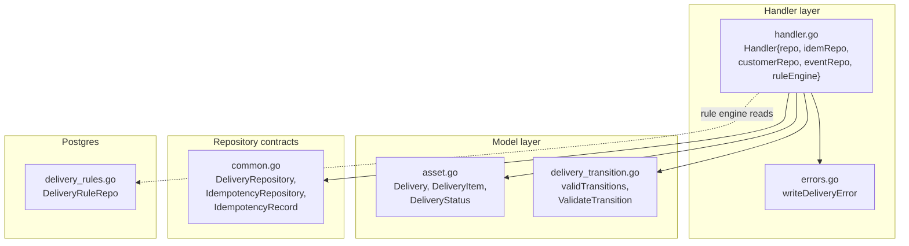
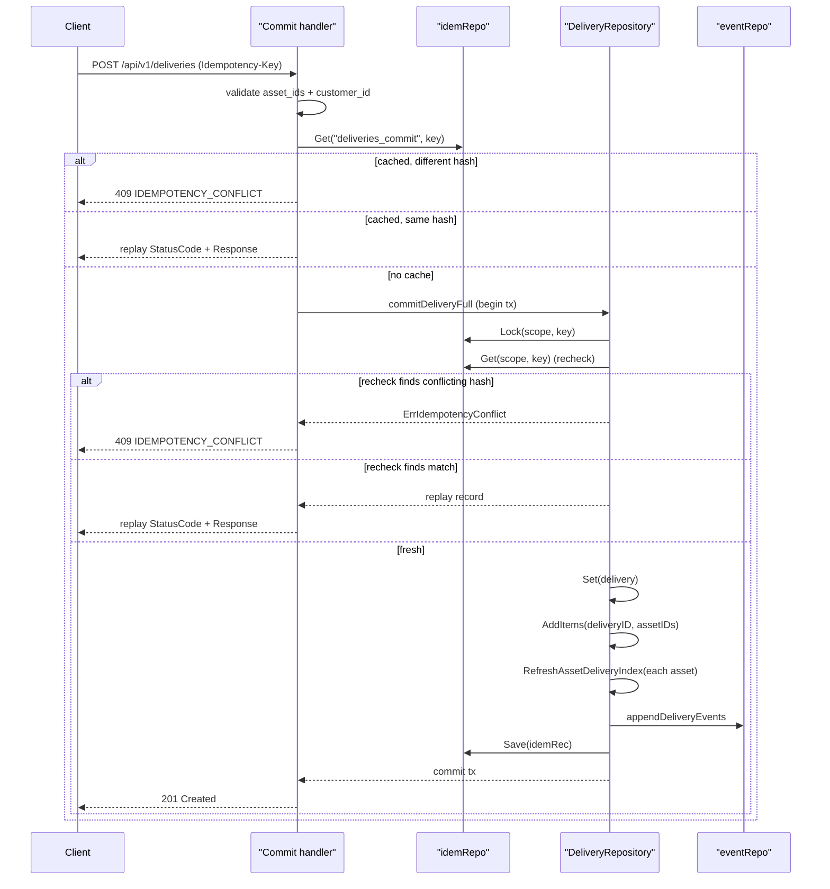
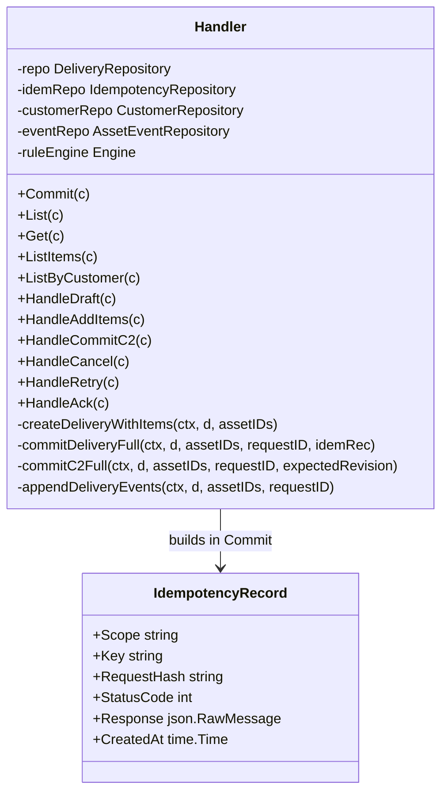
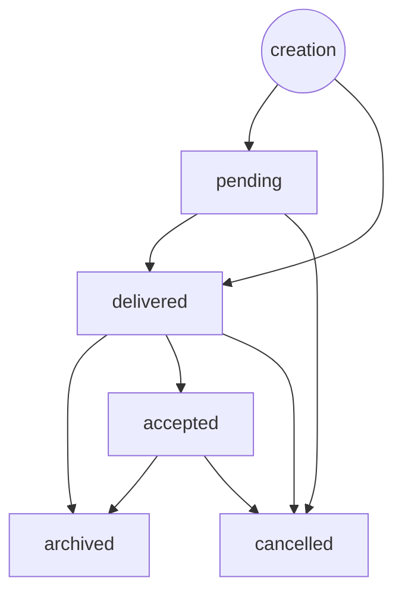
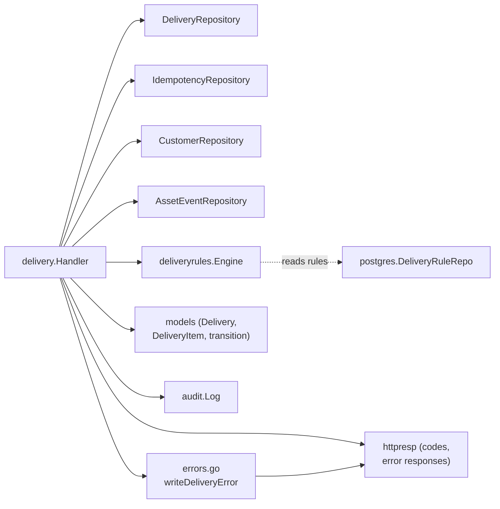

# Delivery Commit & Items

<cite>
**Referenced Files in This Document**

- [backend/internal/handlers/delivery/handler.go](file://backend/internal/handlers/delivery/handler.go)
- [backend/internal/handlers/delivery/errors.go](file://backend/internal/handlers/delivery/errors.go)
- [backend/internal/models/delivery_transition.go](file://backend/internal/models/delivery_transition.go)
- [backend/internal/models/asset.go](file://backend/internal/models/asset.go)
- [backend/internal/postgres/delivery_rules.go](file://backend/internal/postgres/delivery_rules.go)
- [backend/internal/repository/common.go](file://backend/internal/repository/common.go)
- [backend/internal/httpresp/codes.go](file://backend/internal/httpresp/codes.go)
- [api/openapi.yaml](file://api/openapi.yaml)
</cite>

## Table of Contents
1. [Introduction](#introduction)
2. [Project Structure](#project-structure)
3. [Core Components](#core-components)
4. [Architecture Overview](#architecture-overview)
5. [Detailed Component Analysis](#detailed-component-analysis)
6. [Dependency Analysis](#dependency-analysis)
7. [Performance Considerations](#performance-considerations)
8. [Troubleshooting Guide](#troubleshooting-guide)
9. [Conclusion](#conclusion)
10. [Appendices](#appendices)

## Introduction

The delivery subsystem records the hand-off of a set of assets to a customer. A
*delivery* is an aggregate that owns a status, a customer reference, optional
contract metadata, and a list of *delivery items* — one row per asset that is
part of the hand-off. This page documents the two commit workflows exposed by
`backend/internal/handlers/delivery`, the idempotency machinery that makes the
single-step commit safe to retry, the `delivery_transition` state machine that
governs every status change, and the customer-scoped and per-delivery listing
endpoints.

Two distinct commit paths exist:

- **Single-step commit** (`POST /api/v1/deliveries`) — creates the delivery in
  `delivered` status in one call. This path is guarded by an `Idempotency-Key`
  header so that client retries never produce duplicate deliveries.
- **C2 two-step commit** (`POST /api/v1/deliveries/draft` →
  `POST /api/v1/deliveries/{id}/items` → `POST /api/v1/deliveries/{id}/commit`)
  — first creates a `pending` draft, accumulates items, then commits with an
  optimistic-concurrency check (`expected_revision`).

Both paths converge on the same persistence primitives — `Set`/`Update`,
`AddItems`, `RefreshAssetDeliveryIndex`, and an `asset_events` append — executed
inside a single transaction so that the business-state write and its event land
atomically.

**Section sources**
- [backend/internal/handlers/delivery/handler.go](file://backend/internal/handlers/delivery/handler.go#L188-L316)
- [backend/internal/handlers/delivery/handler.go](file://backend/internal/handlers/delivery/handler.go#L410-L663)

## Project Structure

The delivery commit-and-items feature is implemented across the handler layer,
the model layer, and the repository contract. The Postgres rule repository is
included because the commit handlers invoke a rule engine backed by it before
allowing a delivery to proceed.

**Diagram sources**
- [backend/internal/handlers/delivery/handler.go](file://backend/internal/handlers/delivery/handler.go#L26-L58)
- [backend/internal/models/asset.go](file://backend/internal/models/asset.go#L224-L268)
- [backend/internal/models/delivery_transition.go](file://backend/internal/models/delivery_transition.go#L1-L39)
- [backend/internal/repository/common.go](file://backend/internal/repository/common.go#L40-L74)

**Section sources**
- [backend/internal/handlers/delivery/handler.go](file://backend/internal/handlers/delivery/handler.go#L1-L63)
- [backend/internal/postgres/delivery_rules.go](file://backend/internal/postgres/delivery_rules.go#L15-L23)

## Core Components

### The `Handler` struct

`Handler` aggregates the four repositories and the optional rule engine that the
delivery endpoints depend on. It is constructed by `New`, with the asset-event
repository supplied as a variadic optional argument and the rule engine attached
later via `SetRuleEngine`.

- `repo repository.DeliveryRepository` — delivery records, items, and indexes.
- `idemRepo repository.IdempotencyRepository` — idempotency key persistence.
- `customerRepo repository.CustomerRepository` — customer existence checks.
- `eventRepo repository.AssetEventRepository` — `asset_events` append (optional).
- `ruleEngine *deliveryrules.Engine` — pre-delivery compliance checks.

The two helpers `withTx` and `withTxRequired` adapt the repository to the
`repository.TxRunner` interface. `withTx` falls back to running `fn` without a
transaction when the repo is not tx-aware; `withTxRequired` returns an error if
the repo cannot start a transaction.

**Section sources**
- [backend/internal/handlers/delivery/handler.go](file://backend/internal/handlers/delivery/handler.go#L26-L63)
- [backend/internal/repository/common.go](file://backend/internal/repository/common.go#L28-L57)

### The `Delivery` and `DeliveryItem` models

`Delivery` carries identity (`DeliveryID`), the `CustomerID`, the
`DeliveryStatus`, lifecycle timestamps (`DeliveredAt`, `CompletedAt`,
`CancelledAt`, `AcknowledgedAt`), provenance fields (`Owner`, `RequestedBy`,
`ApprovedBy`, `CancelledBy`, `AcknowledgedBy`), and the optimistic-locking
`Version`. `DeliveryItem` is a thin record of `DeliveryID`, `AssetID`, and
`CreatedAt` used only in API request/response bodies.

**Section sources**
- [backend/internal/models/asset.go](file://backend/internal/models/asset.go#L224-L268)

### The `IdempotencyRecord` and repository contracts

`IdempotencyRecord` stores one idempotent request result: a `Scope`, a `Key`, a
`RequestHash`, the cached HTTP `StatusCode`, and the serialized `Response`.
`IdempotencyRepository` exposes `Lock`, `Get`, and `Save`. The
`DeliveryRepository` contract defines `Set`, `Get`, `AddItems`,
`RefreshAssetDeliveryIndex`, `ListByCustomer`, `ListByAsset`, `ListItems`,
`List`, and `Update`.

**Section sources**
- [backend/internal/repository/common.go](file://backend/internal/repository/common.go#L40-L74)

## Architecture Overview

The commit workflow layers HTTP validation, customer/rule pre-checks, an
idempotency cache lookup, and a single atomic write transaction. The diagram
below shows the request lifecycle for both commit paths converging on the shared
write primitives.

```mermaid
graph TB
  subgraph "Single-step: Commit"
    C1["validate asset_ids + customer_id"]
    C2["customerRepo.Exists"]
    C3["ruleEngine.Check"]
    C4["idemRepo.Get (cache hit?)"]
    C5["commitDeliveryFull (tx)"]
  end
  subgraph "C2 two-step"
    D1["HandleDraft → status pending"]
    D2["HandleAddItems → repo.AddItems + Update"]
    D3["HandleCommitC2 → ruleEngine.CheckAll"]
    D4["commitC2Full (tx)"]
  end
  subgraph "Shared write primitives (in tx)"
    W1["repo.Set / repo.Update"]
    W2["repo.AddItems"]
    W3["repo.RefreshAssetDeliveryIndex"]
    W4["appendDeliveryEvents"]
  end
  C1 --> C2 --> C3 --> C4 --> C5
  D1 --> D2 --> D3 --> D4
  C5 --> W1 --> W2 --> W3 --> W4
  D4 --> W1
```

**Diagram sources**
- [backend/internal/handlers/delivery/handler.go](file://backend/internal/handlers/delivery/handler.go#L95-L186)
- [backend/internal/handlers/delivery/handler.go](file://backend/internal/handlers/delivery/handler.go#L202-L316)
- [backend/internal/handlers/delivery/handler.go](file://backend/internal/handlers/delivery/handler.go#L415-L663)

**Section sources**
- [backend/internal/handlers/delivery/handler.go](file://backend/internal/handlers/delivery/handler.go#L95-L316)

## Detailed Component Analysis

### Single-step commit with idempotency

`Commit` handles `POST /api/v1/deliveries`. It binds a request body requiring at
least one `asset_id` and a non-empty `customer_id`, validates that each asset ID
is 8 alphanumeric characters via `id.ValidateAssetID`, and trims/validates
`customer_id`. When a `customerRepo` is configured, it checks customer existence
(returning `422` with `INVALID_ARGUMENT` and `customer_id` detail when not
found). When a `ruleEngine` is configured, it runs `Check`; any violations
produce a `422` with code `DELIVERY_RULE_FAILED`.

The `Idempotency-Key` header is mandatory: a missing key yields `400` with code
`MISSING_IDEMPOTENCY_KEY`. The handler computes a SHA-256 `RequestHash` of the
bound request via `hashDeliveryRequest`, then performs a pre-transaction cache
lookup with `idemRepo.Get(ctx, "deliveries_commit", idemKey)`:

- If a record exists with a **different** `RequestHash`, the handler returns
  `409` with code `IDEMPOTENCY_CONFLICT` — the same key was reused with a
  different payload.
- If a record exists with a **matching** hash, the cached `StatusCode` and
  `Response` are replayed verbatim.

When there is no cached record, the handler de-duplicates asset IDs, builds the
`Delivery` in `delivered` status with `DeliveredAt`/`CompletedAt` set to now,
serializes the response body, and packages an `IdempotencyRecord` (scope
`deliveries_commit`, `StatusCode` `201`). It then calls `commitDeliveryFull`.

**Diagram sources**
- [backend/internal/handlers/delivery/handler.go](file://backend/internal/handlers/delivery/handler.go#L202-L316)
- [backend/internal/handlers/delivery/handler.go](file://backend/internal/handlers/delivery/handler.go#L125-L168)

**Section sources**
- [backend/internal/handlers/delivery/handler.go](file://backend/internal/handlers/delivery/handler.go#L202-L316)

#### The double-check idempotency pattern

The handler checks the idempotency cache twice. The first check (outside the
transaction, lines 257–266) is an optimistic fast path that avoids opening a
transaction for an obvious replay. The authoritative check happens inside
`commitDeliveryFull`: it first acquires a row lock with `idemRepo.Lock`, then
re-reads the record with `idemRepo.Get`. This closes the race where two
concurrent requests with the same key both miss the first cache check.

Inside the transaction:

- If `rec != nil` and `rec.RequestHash != idemRec.RequestHash`, it returns
  `repository.ErrIdempotencyConflict`, which the handler maps to `409`.
- If `rec != nil` with a matching hash, the existing record is set as `replay`
  and the function returns without writing — the handler replays it.
- Otherwise it performs the full write sequence (`Set`, `AddItems`,
  `RefreshAssetDeliveryIndex` per asset, `appendDeliveryEvents`) and finally
  `idemRepo.Save(idemRec)`. Saving the idempotency record **within the same
  transaction** is what prevents duplicate deliveries on a retry after a partial
  failure: either every write including the idempotency record commits, or none
  does.

**Section sources**
- [backend/internal/handlers/delivery/handler.go](file://backend/internal/handlers/delivery/handler.go#L125-L168)
- [backend/internal/handlers/delivery/handler.go](file://backend/internal/handlers/delivery/handler.go#L256-L308)

### The transaction helpers

Three private helpers compose the write set:

- `createDeliveryWithItems` — de-duplicates assets, sets `AssetCount`/`ItemCount`,
  then runs `repo.Set` + `repo.AddItems` in one `withTx`. Used by `HandleDraft`
  and `HandleRetry`.
- `commitDeliveryFull` — the full single-step commit: idempotency lock + recheck,
  `Set`, `AddItems`, per-asset `RefreshAssetDeliveryIndex`, events, and
  `idemRepo.Save`, all in one transaction.
- `commitC2Full` — the two-step finisher: `Update` with the expected revision,
  per-asset `RefreshAssetDeliveryIndex`, then events, in one transaction.
- `commitDeliveryIndexesAndEvents` — index-refresh + events only (helper).

**Diagram sources**
- [backend/internal/handlers/delivery/handler.go](file://backend/internal/handlers/delivery/handler.go#L26-L186)
- [backend/internal/repository/common.go](file://backend/internal/repository/common.go#L59-L67)

**Section sources**
- [backend/internal/handlers/delivery/handler.go](file://backend/internal/handlers/delivery/handler.go#L95-L186)

### Asset event emission

`appendDeliveryEvents` is a no-op when no `eventRepo` is configured. Otherwise it
serializes a payload containing `delivery_id`, `customer_id`, `status`,
`asset_count`, and `delivered_at`, and appends one `asset_events` record per
asset with `EventType` `delivery_committed`, `AggregateType` `delivery`,
`PayloadSchemaVersion` `v1`, and the `X-Request-ID` carried through as the event
`RequestID`. Because the append runs inside the same transaction as the
business-state write, consumers never observe a delivery projection without its
event.

**Section sources**
- [backend/internal/handlers/delivery/handler.go](file://backend/internal/handlers/delivery/handler.go#L65-L93)

### The C2 two-step workflow

`HandleDraft` (`POST /api/v1/deliveries/draft`) creates a delivery in `pending`
status without running the rule engine, optionally seeding initial items. It
derives `RequestedBy` from `Owner` or falls back to `X-Request-ID`.

`HandleAddItems` (`POST /api/v1/deliveries/{id}/items`) rejects any delivery not
in `pending` status with `422` `INVALID_STATE`. It adds items, recomputes
`AssetCount`/`ItemCount` from the persisted item list, and calls `repo.Update`
with the current `Version` — all inside `withTxRequired`.

`HandleCommitC2` (`POST /api/v1/deliveries/{id}/commit`) enforces three
preconditions: the delivery must exist (else `404` `DELIVERY_NOT_FOUND`), be in
`pending` status (else `422` `INVALID_STATE`), and the `expected_revision` must
match the current `Version` (else `409` `CONCURRENT_CONFLICT`). It then re-runs
the rule engine via `CheckAll`. Violations with `EnforceMode == "block"` abort
the commit with `422` `DELIVERY_RULE_FAILED`; `warn`/`tag_only` violations are
attached to the response as `warnings` and the commit proceeds. On success the
status is set to `delivered`, `DeliveredAt`/`CompletedAt`/`ApprovedBy` are
populated, and `commitC2Full` persists the change with the optimistic revision.

**Section sources**
- [backend/internal/handlers/delivery/handler.go](file://backend/internal/handlers/delivery/handler.go#L415-L663)

### The delivery_transition state machine

`validTransitions` is a map keyed by the "from" status (the empty string `""`
representing creation) to the set of allowed "to" statuses. `ValidateTransition`
returns an error when the "from" status has no entry or the "to" status is not
permitted. The eight `DeliveryStatus` values are declared in `asset.go`:
`pending`, `delivered`, `failed`, `accepted`, `rejected`, `recalled`,
`cancelled`, `archived`. The transition table only governs the subset reachable
through the handlers.

`HandleCancel` calls `ValidateTransition(d.Status, DeliveryStatusCancelled)`
after first restricting the allowed source statuses to `pending`, `delivered`,
or `accepted`. `HandleAck` calls
`ValidateTransition(d.Status, DeliveryStatusAccepted)` only from `delivered`.
Both surface a disallowed transition as `422` `INVALID_STATE_TRANSITION`. Note
the source restriction in `HandleCancel` and the transition table agree:
`cancelled` is reachable from `pending`, `delivered`, and `accepted`.

**Diagram sources**
- [backend/internal/models/delivery_transition.go](file://backend/internal/models/delivery_transition.go#L8-L26)

**Section sources**
- [backend/internal/models/delivery_transition.go](file://backend/internal/models/delivery_transition.go#L1-L39)
- [backend/internal/models/asset.go](file://backend/internal/models/asset.go#L27-L38)
- [backend/internal/handlers/delivery/handler.go](file://backend/internal/handlers/delivery/handler.go#L699-L711)
- [backend/internal/handlers/delivery/handler.go](file://backend/internal/handlers/delivery/handler.go#L865-L877)

### Cancel, retry, and acknowledge operations

- `HandleCancel` (`POST /api/v1/deliveries/{id}/cancel`) requires a non-empty
  `cancelled_by`, validates the source status and transition, sets the cancel
  fields, and — for non-pending deliveries — refreshes the asset-delivery index
  for each item inside a transaction.
- `HandleRetry` (`POST /api/v1/deliveries/{id}/retry`) is permitted only from
  `failed` or `cancelled`. It copies the old delivery's items into a brand-new
  `pending` delivery via `createDeliveryWithItems` and records the original
  delivery ID in the audit log for traceability.
- `HandleAck` (`POST /api/v1/deliveries/{id}/ack`) requires a non-empty
  `acknowledged_by`, is permitted only from `delivered`, and moves the delivery
  to `accepted` via `repo.Update` with the current `Version`.

**Section sources**
- [backend/internal/handlers/delivery/handler.go](file://backend/internal/handlers/delivery/handler.go#L669-L900)

### Listing: per-delivery items and customer-scoped IDs

`List` (`GET /api/v1/deliveries`) parses `page`/`page_size`, reads optional
`status` and `customer_id` filters, and delegates to `repo.List`, returning
`items`, `total`, `page`, and `page_size`. A nil slice is normalized to an empty
array.

`Get` (`GET /api/v1/deliveries/{id}`) and `ListItems`
(`GET /api/v1/deliveries/{id}/items`) both validate the `id` path parameter as a
UUID (else `400` `INVALID_ARGUMENT`) and return `404` `DELIVERY_NOT_FOUND` when
the delivery does not exist. `ListItems` returns `{"items": [...]}`.

`ListByCustomer` (`GET /api/v1/customers/{customer_id}/deliveries`) trims the
`customer_id` path parameter (rejecting empty with `400` `INVALID_ARGUMENT`),
fetches the full list of delivery IDs via `repo.ListByCustomer`, then paginates
in memory with `paginateIDs`. The response carries `delivery_ids`, `total`,
`page`, `page_size`, and a `next_token` (the next page number as a string, empty
when there are no further pages).

**Section sources**
- [backend/internal/handlers/delivery/handler.go](file://backend/internal/handlers/delivery/handler.go#L318-L408)
- [backend/internal/handlers/delivery/handler.go](file://backend/internal/handlers/delivery/handler.go#L902-L919)

## Dependency Analysis

The handler depends on four repository interfaces, the rule engine, the shared
`models`, `httpresp` for structured error responses, and `audit` for action
logging. `writeDeliveryError` translates `repository.ErrOptimisticLock` into a
`409` `CONCURRENT_CONFLICT`; for any unrecognized error it returns `false`,
signalling callers to respond with `500`. The rule engine reads active rules for
the customer through `DeliveryRuleRepo.ListActiveForCustomer`, which selects rows
where `customer_id IS NULL OR customer_id = $1`.

**Diagram sources**
- [backend/internal/handlers/delivery/handler.go](file://backend/internal/handlers/delivery/handler.go#L17-L32)
- [backend/internal/handlers/delivery/errors.go](file://backend/internal/handlers/delivery/errors.go#L15-L25)
- [backend/internal/postgres/delivery_rules.go](file://backend/internal/postgres/delivery_rules.go#L67-L76)

**Section sources**
- [backend/internal/handlers/delivery/errors.go](file://backend/internal/handlers/delivery/errors.go#L1-L25)
- [backend/internal/repository/common.go](file://backend/internal/repository/common.go#L12-L74)
- [backend/internal/postgres/delivery_rules.go](file://backend/internal/postgres/delivery_rules.go#L67-L94)

## Performance Considerations

- **Atomic write batching.** `commitDeliveryFull` and `commitC2Full` group all
  writes for a commit into one transaction. The per-asset
  `RefreshAssetDeliveryIndex` loop runs once per asset; a large `asset_ids` list
  proportionally increases transaction work, so commits should be bounded in
  asset count.
- **Asset de-duplication.** `uniqueAssetIDs` collapses duplicates before counting
  and writing, preventing redundant items and index refreshes; for fewer than two
  IDs it short-circuits without allocating a map.
- **Idempotency double-check.** The pre-transaction `idemRepo.Get` avoids opening
  a transaction for obvious replays; the in-transaction `Lock` + `Get` serializes
  concurrent first-time requests for the same key.
- **In-memory customer pagination.** `ListByCustomer` loads the full set of
  delivery IDs and paginates in memory via `paginateIDs`. For customers with very
  large delivery histories this fetches all IDs per request; the cost grows with
  total deliveries, not page size.
- **Rule scoping.** `ListActiveForCustomer` filters to active rules for the
  customer (plus global `NULL`-customer rules) and orders deterministically,
  keeping the rule-engine input small.

**Section sources**
- [backend/internal/handlers/delivery/handler.go](file://backend/internal/handlers/delivery/handler.go#L125-L168)
- [backend/internal/handlers/delivery/handler.go](file://backend/internal/handlers/delivery/handler.go#L388-L408)
- [backend/internal/handlers/delivery/handler.go](file://backend/internal/handlers/delivery/handler.go#L902-L941)
- [backend/internal/postgres/delivery_rules.go](file://backend/internal/postgres/delivery_rules.go#L67-L76)

## Troubleshooting Guide

| Symptom | Likely cause | Where to look |
| --- | --- | --- |
| `400 MISSING_IDEMPOTENCY_KEY` on commit | The `Idempotency-Key` header was omitted on `POST /api/v1/deliveries`. | handler.go L251-L255 |
| `409 IDEMPOTENCY_CONFLICT` | Same key reused with a different request payload (hash mismatch), detected either pre-tx or during the in-tx recheck. | handler.go L257-L261, L142-L145 |
| Identical `201` response returned twice | Expected idempotent replay — the cached `StatusCode`/`Response` was replayed. | handler.go L262-L265, L303-L307 |
| `422 INVALID_STATE` on add-items / commit-c2 / ack / cancel | The delivery is not in the required source status. | handler.go L515-L519, L578-L582, L700-L704, L865-L869 |
| `422 INVALID_STATE_TRANSITION` | `ValidateTransition` rejected the from→to pair. | delivery_transition.go L30-L38 |
| `409 CONCURRENT_CONFLICT` on commit-c2 | `expected_revision` did not match the stored `Version`. | handler.go L584-L588 |
| `409 CONCURRENT_CONFLICT` from write helpers | `repository.ErrOptimisticLock` surfaced via `writeDeliveryError`. | errors.go L15-L25 |
| `422 DELIVERY_RULE_FAILED` | Rule engine returned violations (single-step `Check`, or a `block`-mode violation in C2 `CheckAll`). | handler.go L242-L248, L610-L625 |
| `422 customer not found` | `customerRepo.Exists` returned false. | handler.go L231-L234, L438-L441 |
| `delivery_rules (...)` schema-mismatch error | `delivery_rules` table missing (Postgres `42P01`), wrapped as `ErrSchemaMismatch`. | delivery_rules.go L129-L135 |

**Section sources**
- [backend/internal/handlers/delivery/handler.go](file://backend/internal/handlers/delivery/handler.go#L202-L316)
- [backend/internal/handlers/delivery/errors.go](file://backend/internal/handlers/delivery/errors.go#L15-L25)
- [backend/internal/httpresp/codes.go](file://backend/internal/httpresp/codes.go#L5-L29)
- [backend/internal/postgres/delivery_rules.go](file://backend/internal/postgres/delivery_rules.go#L129-L135)

## Conclusion

The delivery commit-and-items feature offers two ways to record an asset
hand-off. The single-step `Commit` path is hardened against client retries by an
`Idempotency-Key` with a double-checked cache and an in-transaction idempotency
save, while the C2 two-step path layers a draft/add-items/commit lifecycle with
optimistic-revision concurrency control. Every status change passes through the
`validTransitions` state machine, and every committing write — record, items,
asset-delivery index, and asset event — lands in a single transaction so that
projections and their events stay consistent. Listing endpoints provide both
per-delivery item enumeration and customer-scoped delivery-ID pagination.

## Appendices

### Delivery endpoints

| Method & path | Handler | Notes |
| --- | --- | --- |
| `POST /api/v1/deliveries` | `Commit` | Single-step; requires `Idempotency-Key`; returns `201`. |
| `GET /api/v1/deliveries` | `List` | Filters `customer_id`, `status`; paginated. |
| `GET /api/v1/deliveries/{id}` | `Get` | UUID-validated. |
| `GET /api/v1/deliveries/{id}/items` | `ListItems` | Returns `{"items": [...]}`. |
| `POST /api/v1/deliveries/{id}/items` | `HandleAddItems` | Pending-only; recomputes counts. |
| `POST /api/v1/deliveries/draft` | `HandleDraft` | Creates `pending` draft (C2). |
| `POST /api/v1/deliveries/{id}/commit` | `HandleCommitC2` | Optimistic `expected_revision`. |
| `POST /api/v1/deliveries/{id}/cancel` | `HandleCancel` | From pending/delivered/accepted. |
| `POST /api/v1/deliveries/{id}/retry` | `HandleRetry` | From failed/cancelled. |
| `POST /api/v1/deliveries/{id}/ack` | `HandleAck` | From delivered → accepted. |
| `GET /api/v1/customers/{customer_id}/deliveries` | `ListByCustomer` | Returns `delivery_ids` + `next_token`. |

**Section sources**
- [api/openapi.yaml](file://api/openapi.yaml#L2821-L3009)
- [backend/internal/handlers/delivery/handler.go](file://backend/internal/handlers/delivery/handler.go#L188-L408)

### DeliveryStatus values

| Constant | Value |
| --- | --- |
| `DeliveryStatusPending` | `pending` |
| `DeliveryStatusDelivered` | `delivered` |
| `DeliveryStatusFailed` | `failed` |
| `DeliveryStatusAccepted` | `accepted` |
| `DeliveryStatusRejected` | `rejected` |
| `DeliveryStatusRecalled` | `recalled` |
| `DeliveryStatusCancelled` | `cancelled` |
| `DeliveryStatusArchived` | `archived` |

**Section sources**
- [backend/internal/models/asset.go](file://backend/internal/models/asset.go#L30-L38)

### Allowed transitions (`validTransitions`)

| From | Allowed to |
| --- | --- |
| `""` (creation) | `pending`, `delivered` |
| `pending` | `delivered`, `cancelled` |
| `delivered` | `archived`, `accepted`, `cancelled` |
| `accepted` | `archived`, `cancelled` |

**Section sources**
- [backend/internal/models/delivery_transition.go](file://backend/internal/models/delivery_transition.go#L8-L26)

### Relevant error codes

| Code constant | String |
| --- | --- |
| `CodeInvalidArgument` | `INVALID_ARGUMENT` |
| `CodeInvalidState` | `INVALID_STATE` |
| `CodeInvalidStateTransition` | `INVALID_STATE_TRANSITION` |
| `CodeConcurrentConflict` | `CONCURRENT_CONFLICT` |
| `CodeMissingIdempotencyKey` | `MISSING_IDEMPOTENCY_KEY` |
| `CodeIdempotencyConflict` | `IDEMPOTENCY_CONFLICT` |
| `CodeDeliveryNotFound` | `DELIVERY_NOT_FOUND` |
| `CodeDeliveryRuleFailed` | `DELIVERY_RULE_FAILED` |

**Section sources**
- [backend/internal/httpresp/codes.go](file://backend/internal/httpresp/codes.go#L5-L29)
