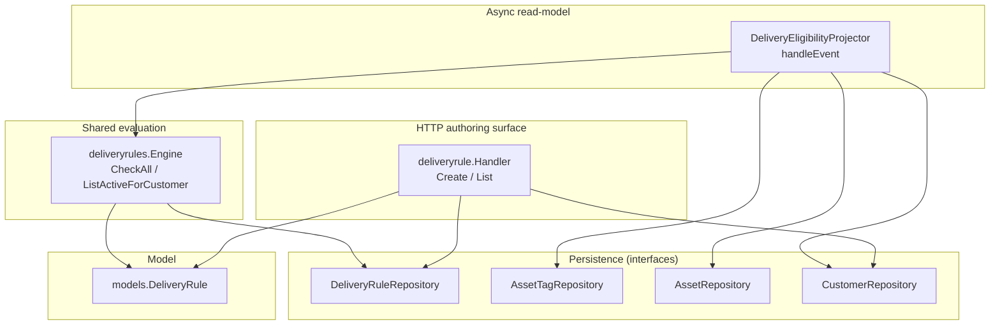
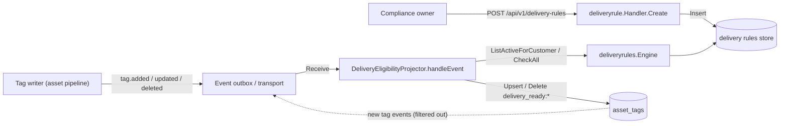
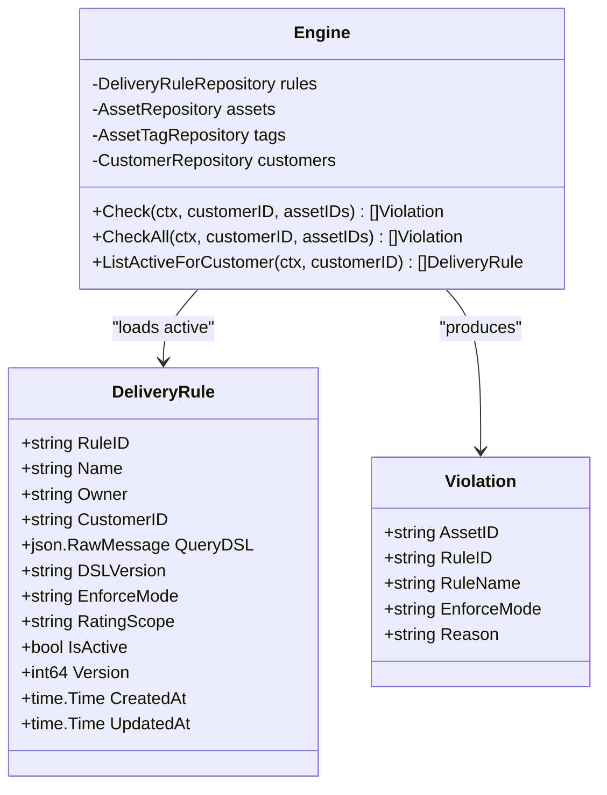
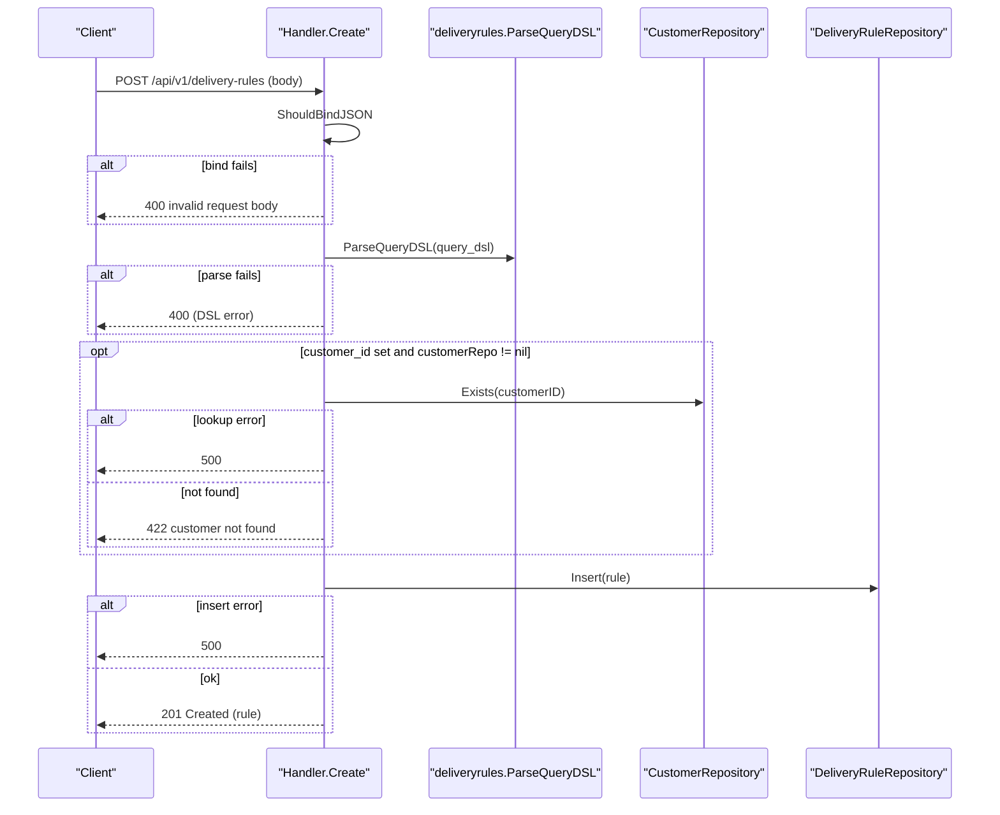
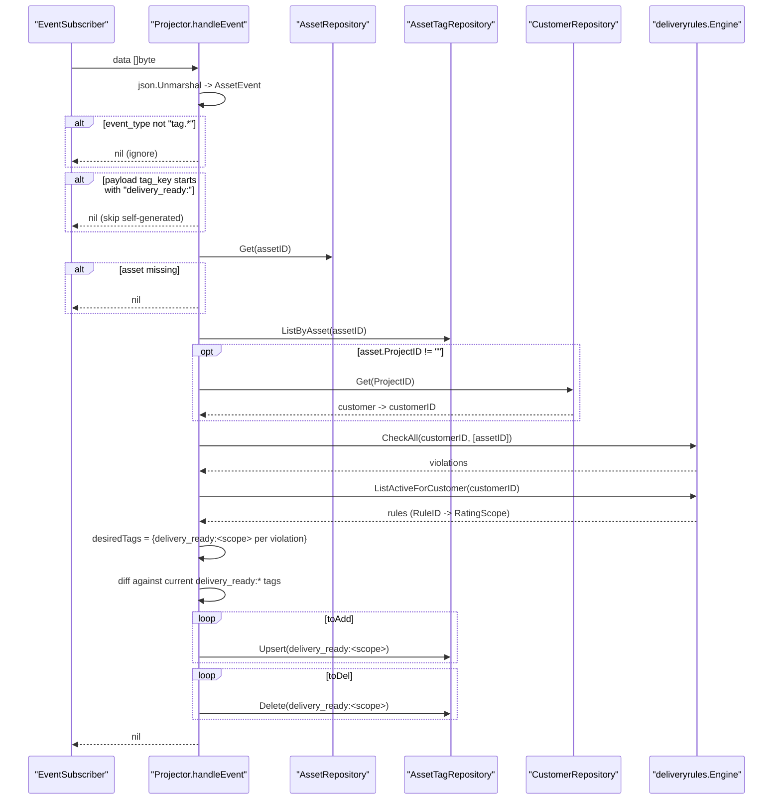
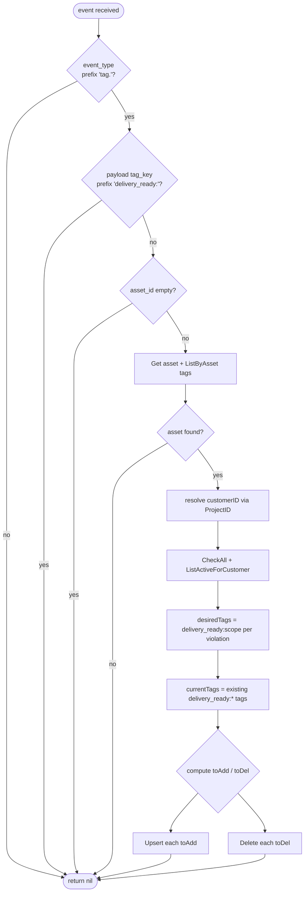
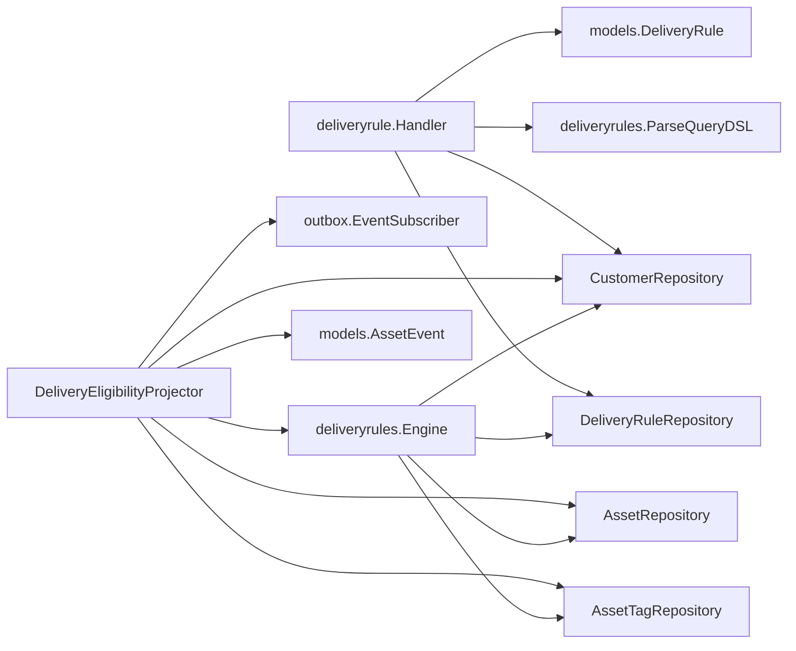

# Delivery Rules & Eligibility

<cite>
**Referenced Files in This Document**

- [backend/internal/handlers/deliveryrule/handler.go](file://backend/internal/handlers/deliveryrule/handler.go)
- [backend/internal/outbox/delivery_eligibility_projector.go](file://backend/internal/outbox/delivery_eligibility_projector.go)
- [backend/internal/models/delivery_rule.go](file://backend/internal/models/delivery_rule.go)
- [backend/internal/deliveryrules/engine.go](file://backend/internal/deliveryrules/engine.go)
- [backend/internal/repository/delivery_rule_repository.go](file://backend/internal/repository/delivery_rule_repository.go)
- [backend/internal/repository/common.go](file://backend/internal/repository/common.go)
- [backend/internal/models/schema_evolution.go](file://backend/internal/models/schema_evolution.go)
- [backend/internal/outbox/bus.go](file://backend/internal/outbox/bus.go)
- [backend/cmd/server/optional.go](file://backend/cmd/server/optional.go)
- [backend/cmd/server/core.go](file://backend/cmd/server/core.go)
</cite>

## Table of Contents
1. [Introduction](#introduction)
2. [Project Structure](#project-structure)
3. [Core Components](#core-components)
4. [Architecture Overview](#architecture-overview)
5. [Detailed Component Analysis](#detailed-component-analysis)
6. [Dependency Analysis](#dependency-analysis)
7. [Performance Considerations](#performance-considerations)
8. [Troubleshooting Guide](#troubleshooting-guide)
9. [Conclusion](#conclusion)
10. [Appendices](#appendices)

## Introduction

Delivery rules are declarative gates that decide whether an asset may be handed
off to a customer. A rule pairs a query predicate (the `query_dsl`) with an
enforcement intent (`enforce_mode`) and a `rating_scope` label; when the
predicate matches an asset the rule is considered to "fire" against that asset.
Rules exist so the delivery boundary can be governed without code changes:
compliance owners author rules through an API, and the platform evaluates them
both synchronously (on a delivery commit) and asynchronously (as assets change
over time).

This page documents two cooperating pieces of that system:

- The **delivery rule resource** — the `DeliveryRule` model and the HTTP handler
  that creates and lists rules. This is the authoring surface.
- The **delivery eligibility projector** — a background consumer that listens to
  asset tag-change events, re-evaluates the active rules for the affected asset,
  and reconciles a set of `delivery_ready:*` system tags so that an asset's
  readiness is queryable as ordinary tag state.

Together they implement a write-side (author rules) and a read-model side
(materialize per-asset readiness as tags) of the same eligibility concept. The
projector is purely a materializer: it does not block writes, it converges the
`delivery_ready:*` tag set toward what the active rules imply.

**Section sources**
- [backend/internal/models/delivery_rule.go](file://backend/internal/models/delivery_rule.go#L1-L23)
- [backend/internal/outbox/delivery_eligibility_projector.go](file://backend/internal/outbox/delivery_eligibility_projector.go#L1-L54)

## Project Structure

The feature spans four layers of the backend: the model, the HTTP handler, the
shared evaluation engine, and the asynchronous projector. The handler and
projector both depend on the `deliveryrules.Engine`, and both ultimately read
and write through the repository interfaces.



**Diagram sources**
- [backend/internal/handlers/deliveryrule/handler.go](file://backend/internal/handlers/deliveryrule/handler.go#L16-L91)
- [backend/internal/outbox/delivery_eligibility_projector.go](file://backend/internal/outbox/delivery_eligibility_projector.go#L22-L46)
- [backend/internal/deliveryrules/engine.go](file://backend/internal/deliveryrules/engine.go#L25-L59)

**Section sources**
- [backend/internal/handlers/deliveryrule/handler.go](file://backend/internal/handlers/deliveryrule/handler.go#L1-L23)
- [backend/internal/outbox/delivery_eligibility_projector.go](file://backend/internal/outbox/delivery_eligibility_projector.go#L1-L46)
- [backend/internal/repository/delivery_rule_repository.go](file://backend/internal/repository/delivery_rule_repository.go#L1-L14)

The relevant files:

- `backend/internal/models/delivery_rule.go` — the `DeliveryRule` struct, the
  serialized shape of a rule.
- `backend/internal/handlers/deliveryrule/handler.go` — the `Handler` type with
  `Create` (`POST /api/v1/delivery-rules`) and `List`
  (`GET /api/v1/delivery-rules?customer_id=`).
- `backend/internal/deliveryrules/engine.go` — the `Engine` that loads active
  rules and evaluates them (`Check`, `CheckAll`, `ListActiveForCustomer`).
- `backend/internal/outbox/delivery_eligibility_projector.go` — the
  `DeliveryEligibilityProjector` consumer.
- `backend/internal/repository/delivery_rule_repository.go` and
  `backend/internal/repository/common.go` — persistence contracts.

## Core Components

#### The `DeliveryRule` model

A rule is a flat record. The predicate lives in `QueryDSL` as raw JSON so the
engine can parse and version it independently; `DSLVersion` records the DSL
schema the predicate was authored against. `EnforceMode` carries the intent
(`block`, `warn`, `tag_only`), `RatingScope` is the label the projector turns
into a tag, and `IsActive` is the on/off switch the engine filters on.

```go
type DeliveryRule struct {
	RuleID      string          `json:"rule_id"`
	Name        string          `json:"name"`
	Owner       string          `json:"owner"`
	CustomerID  string          `json:"customer_id,omitempty"`
	QueryDSL    json.RawMessage `json:"query_dsl"`
	DSLVersion  string          `json:"dsl_version"`
	EnforceMode string          `json:"enforce_mode"`
	RatingScope string          `json:"rating_scope"`
	IsActive    bool            `json:"is_active"`
	Version     int64           `json:"version"`
	CreatedAt   time.Time       `json:"created_at"`
	UpdatedAt   time.Time       `json:"updated_at"`
}
```

#### The `deliveryrule.Handler`

`Handler` holds a `DeliveryRuleRepository` and a `CustomerRepository`. `Create`
binds and validates the request body, parses the DSL via
`deliveryrules.ParseQueryDSL`, optionally confirms the referenced customer
exists, defaults `is_active` to `true`, persists through `repo.Insert`, and
returns the stored rule with `201 Created`. `List` reads an optional
`customer_id` query parameter and returns the matching rules under an `items`
key.

#### The `deliveryrules.Engine`

The `Engine` is the shared evaluation core used by both the synchronous commit
path and the projector. `CheckAll` evaluates **all** active rules and returns a
`Violation` for every rule whose predicate matches; `Check` narrows to
`enforce_mode == "block"`. `ListActiveForCustomer` returns the active rules for
a customer, which the projector uses to map each firing rule's `RuleID` to its
`RatingScope`.

#### The `DeliveryEligibilityProjector`

The projector wires an `EventSubscriber`, the `Engine`, and three repositories
(`AssetTagRepository`, `AssetRepository`, `CustomerRepository`). It subscribes
to the outbox stream and, on each tag-change event, reconciles the asset's
`delivery_ready:*` tags.

**Section sources**
- [backend/internal/models/delivery_rule.go](file://backend/internal/models/delivery_rule.go#L8-L22)
- [backend/internal/handlers/deliveryrule/handler.go](file://backend/internal/handlers/deliveryrule/handler.go#L16-L91)
- [backend/internal/deliveryrules/engine.go](file://backend/internal/deliveryrules/engine.go#L16-L59)
- [backend/internal/outbox/delivery_eligibility_projector.go](file://backend/internal/outbox/delivery_eligibility_projector.go#L22-L54)

## Architecture Overview

The authoring side and the materialization side are decoupled by the event
outbox. An operator creates rules over HTTP; those rules sit in the database.
Independently, as assets are tagged, the projector consumes the resulting tag
events, asks the engine which active rules fire for the affected asset, and
writes back `delivery_ready:<rating_scope>` tags. Because the projector both
reads and writes tags, it guards against re-processing its own writes.



**Diagram sources**
- [backend/internal/handlers/deliveryrule/handler.go](file://backend/internal/handlers/deliveryrule/handler.go#L25-L91)
- [backend/internal/outbox/delivery_eligibility_projector.go](file://backend/internal/outbox/delivery_eligibility_projector.go#L56-L184)
- [backend/internal/deliveryrules/engine.go](file://backend/internal/deliveryrules/engine.go#L42-L59)

**Section sources**
- [backend/internal/outbox/delivery_eligibility_projector.go](file://backend/internal/outbox/delivery_eligibility_projector.go#L48-L184)
- [backend/cmd/server/optional.go](file://backend/cmd/server/optional.go#L329-L387)

## Detailed Component Analysis

### The `DeliveryRule` data model

`DeliveryRule` is defined in `delivery_rule.go` and described in its own comment
as "a declarative gate evaluated before delivery commit (CYB-1020)". The struct
is intentionally flat and serializable; `QueryDSL` is held as
`json.RawMessage` so the rule can be stored and returned without the model
package needing to understand the DSL grammar — parsing is delegated to
`deliveryrules.ParseQueryDSL`.



The fields map directly onto the `Create` request body; the handler copies
`Name`, `Owner`, `CustomerID`, `QueryDSL`, `DSLVersion`, `EnforceMode`,
`RatingScope`, and `IsActive` into a `models.DeliveryRule` before insert. Server
-managed fields (`RuleID`, `Version`, `CreatedAt`, `UpdatedAt`) are populated by
the repository.

**Diagram sources**
- [backend/internal/models/delivery_rule.go](file://backend/internal/models/delivery_rule.go#L8-L22)
- [backend/internal/deliveryrules/engine.go](file://backend/internal/deliveryrules/engine.go#L16-L59)

**Section sources**
- [backend/internal/models/delivery_rule.go](file://backend/internal/models/delivery_rule.go#L1-L23)

### Rule authoring — `Create` and `List`

`Create` is the validating write path. The request struct marks `name`, `owner`,
and `query_dsl` as `binding:"required"`; a bind failure returns `400` with
`CodeInvalidArgument`. The DSL is then parsed up front — an unparseable
`query_dsl` is rejected as a bad request rather than persisted. If a non-empty
`customer_id` is supplied and a customer repository is configured, the handler
calls `Exists`; a lookup error becomes `500`, and a missing customer becomes a
`422 Unprocessable` with `CodeInvalidArgument`. `is_active` defaults to `true`
when omitted (the body uses `*bool` to distinguish "unset" from "false").



`List` trims the `customer_id` query parameter, calls `repo.List`, normalizes a
`nil` slice to an empty slice so the response is always a JSON array, and
returns `200` with `{"items": [...]}`.

> Wiring note: in the current build the `deliveryRuleHandler` is passed into
> `routes.RegisterAll` but is intentionally discarded
> (`_, _, _, _, _, _, _, _ = customerHandler, deliveryRuleHandler, ...`), so the
> `POST`/`GET` routes documented in the handler comments describe the intended
> contract rather than a presently mounted route. The handler logic itself is
> complete.

**Section sources**
- [backend/internal/handlers/deliveryrule/handler.go](file://backend/internal/handlers/deliveryrule/handler.go#L25-L91)

### The eligibility projector flow

`handleEvent` is the heart of the projector. The end-to-end reconciliation for a
single event is:



The decision logic that turns rule violations into a tag diff is a small state
machine:



Notable behaviors verified in code:

- **Event filtering.** Only events whose `EventType` begins with `tag.`
  (the `eventTypePrefixTag` constant) are processed; everything else returns
  `nil` immediately.
- **Feedback-loop guard.** The projector itself writes `delivery_ready:*` tags,
  which would generate further `tag.*` events. To avoid an infinite loop it
  inspects the event payload's `tag_key`; if it starts with the
  `delivery_ready:` prefix the event is skipped with a debug log.
- **Missing asset tolerance.** If `Assets.Get` errors or returns `nil` (the
  asset was deleted), the handler returns `nil` — there is nothing to reconcile.
- **Customer resolution.** The customer used for rule lookup is derived from the
  asset's `ProjectID`: the projector calls `Customers.Get(ProjectID)` and uses
  the resulting `CustomerID`. A lookup failure is logged at warn level and the
  customer falls back to empty (global rules).
- **Scope mapping.** `CheckAll` returns one `Violation` per firing rule; the
  projector builds `ruleScopes[RuleID] = RatingScope` from
  `ListActiveForCustomer` and turns each violation into a desired tag key
  `delivery_ready:<scope>`, defaulting the scope to `"unknown"` when a rule is
  not in the active list.
- **Convergent diff.** Desired tags are diffed against the asset's current
  `delivery_ready:*` tags; only the additions are `Upsert`-ed and only the
  removals are `Delete`-d. Added tags carry `TagValue:"true"`, `TagType:"system"`,
  and `SourceType/SourceName` identifying the projector. Individual
  upsert/delete failures are logged at warn level and do not abort the rest of
  the reconciliation.

**Diagram sources**
- [backend/internal/outbox/delivery_eligibility_projector.go](file://backend/internal/outbox/delivery_eligibility_projector.go#L56-L184)

**Section sources**
- [backend/internal/outbox/delivery_eligibility_projector.go](file://backend/internal/outbox/delivery_eligibility_projector.go#L15-L184)

### Lifecycle: `Run` and `Close`

`Run` validates that every collaborator is wired (`Subscriber`, `Engine`,
`Tags`, `Assets`, `Customers`); an incomplete wiring returns an error before any
event is consumed. It then blocks on `Subscriber.Receive(ctx, p.handleEvent)`
until the context is cancelled. `Close` delegates to `Subscriber.Close` and is
nil-safe.

The `EventSubscriber` contract is small: `Receive(ctx, handler)` and `Close()`.
This lets the projector run over any transport — the server wires it to one of
`internal`, `pubsub`, or `kafka` depending on `OUTBOX_TRANSPORT`.

**Section sources**
- [backend/internal/outbox/delivery_eligibility_projector.go](file://backend/internal/outbox/delivery_eligibility_projector.go#L48-L54)
- [backend/internal/outbox/delivery_eligibility_projector.go](file://backend/internal/outbox/delivery_eligibility_projector.go#L186-L192)
- [backend/internal/outbox/bus.go](file://backend/internal/outbox/bus.go#L20-L24)

### Deployment wiring

The projector is opt-in. In `optional.go` it is constructed only when a Postgres
handle exists and `DeliveryEligibilityProjectorEnabled == "true"`. The block
builds a fresh `deliveryrules.Engine` from Postgres-backed repositories, selects
a subscriber based on `OUTBOX_TRANSPORT` (`internal` over the in-memory bus,
`pubsub`, or `kafka`), constructs the projector with its tag/asset/customer
repositories, and launches `projector.Run` in a goroutine bound to
`outboxCtx`, deferring `subscriber.Close()`. The HTTP handler is constructed
separately in `core.go` via `deliveryruleH.New(deliveryRuleRepo, customerRepo)`.

**Section sources**
- [backend/cmd/server/optional.go](file://backend/cmd/server/optional.go#L329-L387)
- [backend/cmd/server/core.go](file://backend/cmd/server/core.go#L42-L82)

## Dependency Analysis



Key relationships:

- The **handler** depends on `DeliveryRuleRepository` (for `Insert`/`List`) and
  optionally `CustomerRepository` (for `Exists`), plus the DSL parser.
- The **projector** depends on an `EventSubscriber`, the `Engine`, and the
  `AssetTagRepository` / `AssetRepository` / `CustomerRepository`.
- The **engine** is the shared dependency: it is built from the same four
  repository interfaces and is used by both the projector and the synchronous
  delivery commit path (`SetRuleEngine` in `core.go`).
- `DeliveryRuleRepository` is the narrow persistence contract: `Insert`,
  `ListActiveForCustomer`, and `List`.

**Section sources**
- [backend/internal/repository/delivery_rule_repository.go](file://backend/internal/repository/delivery_rule_repository.go#L9-L14)
- [backend/internal/repository/common.go](file://backend/internal/repository/common.go#L76-L103)
- [backend/internal/deliveryrules/engine.go](file://backend/internal/deliveryrules/engine.go#L25-L59)
- [backend/cmd/server/core.go](file://backend/cmd/server/core.go#L42-L82)

## Performance Considerations

- **Per-event evaluation cost.** Each tag-change event triggers an asset load,
  a tag list, an optional customer lookup, `CheckAll`, and `ListActiveForCustomer`
  — note that `CheckAll` already loads active rules internally, so the projector
  performs the rule list a second time to obtain scope mapping. For high tag
  churn this is the dominant cost path.
- **Self-generated event filtering.** The `delivery_ready:` prefix guard is the
  primary throughput protection: without it, every reconciliation write would
  re-enqueue an event and re-trigger the projector. The guard short-circuits
  before any database access.
- **Convergent diffing.** Because the projector computes additions and deletions
  against the current tag set, a stable asset produces no writes — repeated
  events for an already-correct asset are no-ops at the persistence layer.
- **Batch-size of one.** `CheckAll` is invoked with a single-element
  `[]string{assetID}` per event. The engine internally bounds concurrent
  snapshot loads (`maxConcurrentLoads`), but the projector does not batch across
  events.
- **Fault isolation.** Tag upsert/delete failures are logged and skipped rather
  than failing the whole event, so a single bad tag write does not block
  reconciliation of the rest of the asset's tags. A genuine load/list error,
  however, is returned from `handleEvent` and surfaces to the subscriber.

**Section sources**
- [backend/internal/outbox/delivery_eligibility_projector.go](file://backend/internal/outbox/delivery_eligibility_projector.go#L108-L181)
- [backend/internal/deliveryrules/engine.go](file://backend/internal/deliveryrules/engine.go#L12-L14)

## Troubleshooting Guide

#### `delivery_ready:*` tags never appear

- Confirm the projector is enabled: `DeliveryEligibilityProjectorEnabled` must be
  `"true"` and a Postgres handle must be present, otherwise the block in
  `optional.go` is skipped entirely.
- Confirm events are flowing on the configured `OUTBOX_TRANSPORT`. The projector
  only acts on events whose `event_type` begins with `tag.`; a delivery-readiness
  change is driven by tag events, not by rule creation.
- Confirm at least one matching rule is **active** for the resolved customer —
  `CheckAll`/`ListActiveForCustomer` filter on active rules for the customer
  derived from the asset's `ProjectID`.

#### A rule fires but the tag has scope `unknown`

`unknown` is used when a violation's `RuleID` is not found in the active-rules
map at reconciliation time (for example a race where the rule was deactivated
between `CheckAll` and `ListActiveForCustomer`). Re-emitting a tag event for the
asset will re-reconcile.

#### The projector seems to loop / churns tags

This indicates the feedback-loop guard is not matching. Verify the tag events
carry a `tag_key` field in the payload and that projector-written tags use the
`delivery_ready:` prefix (set in code). Events whose payload does not unmarshal
into `{tag_key}` fall through to normal processing.

#### `Create` returns 422 "customer not found"

A non-empty `customer_id` was supplied and `CustomerRepository.Exists` returned
false. Use an existing customer or omit `customer_id` to author a global rule.

#### `Create` returns 400 on a valid-looking body

Either a required field (`name`, `owner`, `query_dsl`) is missing, or
`ParseQueryDSL` rejected the predicate. The DSL error text is returned in the
response message.

#### "incomplete wiring" error on startup

`Run` returns this when any of `Subscriber`, `Engine`, `Tags`, `Assets`, or
`Customers` is nil. Check the construction site in `optional.go`.

**Section sources**
- [backend/internal/outbox/delivery_eligibility_projector.go](file://backend/internal/outbox/delivery_eligibility_projector.go#L49-L133)
- [backend/internal/handlers/deliveryrule/handler.go](file://backend/internal/handlers/deliveryrule/handler.go#L37-L60)
- [backend/cmd/server/optional.go](file://backend/cmd/server/optional.go#L329-L337)

## Conclusion

The delivery-rules feature separates authoring from materialization. The
`DeliveryRule` model plus the `deliveryrule.Handler` give compliance owners a
validated way to declare gates; the `DeliveryEligibilityProjector` consumes tag
events and, through the shared `deliveryrules.Engine`, converges a set of
`delivery_ready:<rating_scope>` tags that make each asset's eligibility a plain,
queryable fact. The design is convergent (idempotent reconciliation), guarded
against its own feedback events, and tolerant of deleted assets and individual
tag-write failures.

## Appendices

### A. HTTP endpoints (as documented on the handler)

| Method | Path | Handler | Notes |
| --- | --- | --- | --- |
| POST | `/api/v1/delivery-rules` | `Handler.Create` | Validates body + DSL, checks customer, defaults `is_active=true`, returns `201`. |
| GET | `/api/v1/delivery-rules?customer_id=` | `Handler.List` | Returns `{ "items": [...] }`; `customer_id` optional. |

(Note: the handler is constructed but currently not mounted in `routes.RegisterAll`.)

### B. `DeliveryRule` fields

| Field | JSON | Meaning |
| --- | --- | --- |
| `RuleID` | `rule_id` | Server-assigned identifier. |
| `Name` | `name` | Human label (required on create). |
| `Owner` | `owner` | Owning party (required on create). |
| `CustomerID` | `customer_id` | Scopes the rule to a customer; empty = global. |
| `QueryDSL` | `query_dsl` | Predicate, raw JSON (required on create). |
| `DSLVersion` | `dsl_version` | DSL schema version of the predicate. |
| `EnforceMode` | `enforce_mode` | `block` / `warn` / `tag_only`. |
| `RatingScope` | `rating_scope` | Label projected into `delivery_ready:<scope>`. |
| `IsActive` | `is_active` | Engine evaluates only active rules. |
| `Version` | `version` | Optimistic version. |
| `CreatedAt`/`UpdatedAt` | `created_at`/`updated_at` | Timestamps. |

### C. Projector constants and tag shape

| Item | Value | Source |
| --- | --- | --- |
| Tag event prefix | `tag.` | `eventTypePrefixTag` |
| Self-tag prefix | `delivery_ready:` | `deliveryReadyTagPrefix` |
| Written tag value | `"true"` | `Upsert` input |
| Written tag type | `system` | `Upsert` input |
| Source type / name | `delivery_eligibility_projector` / `DeliveryEligibilityProjector` | `Upsert` input |

**Section sources**
- [backend/internal/handlers/deliveryrule/handler.go](file://backend/internal/handlers/deliveryrule/handler.go#L25-L90)
- [backend/internal/models/delivery_rule.go](file://backend/internal/models/delivery_rule.go#L8-L22)
- [backend/internal/outbox/delivery_eligibility_projector.go](file://backend/internal/outbox/delivery_eligibility_projector.go#L15-L20)
- [backend/internal/outbox/delivery_eligibility_projector.go](file://backend/internal/outbox/delivery_eligibility_projector.go#L158-L166)
