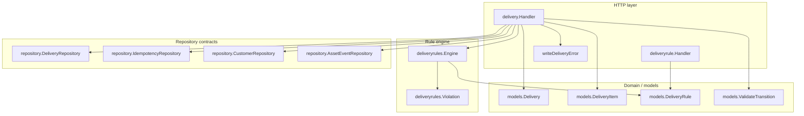
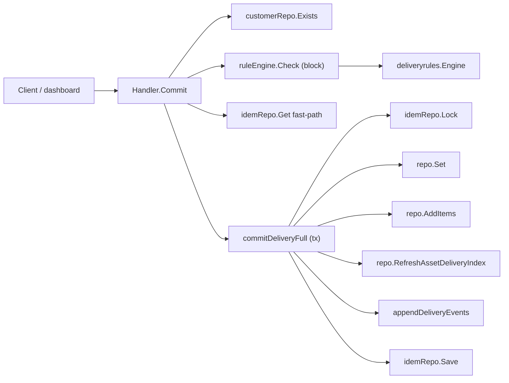
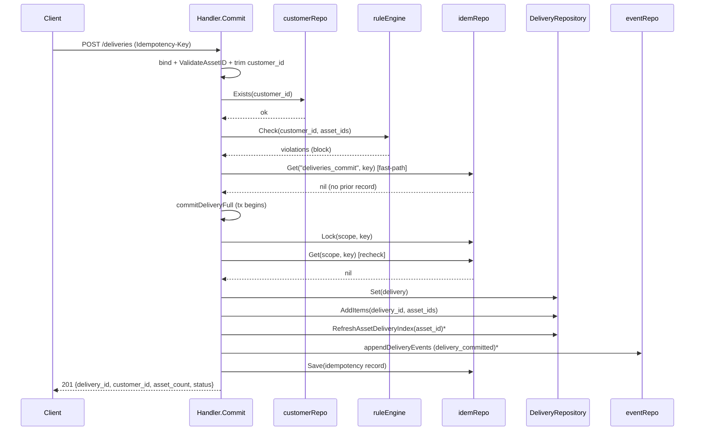
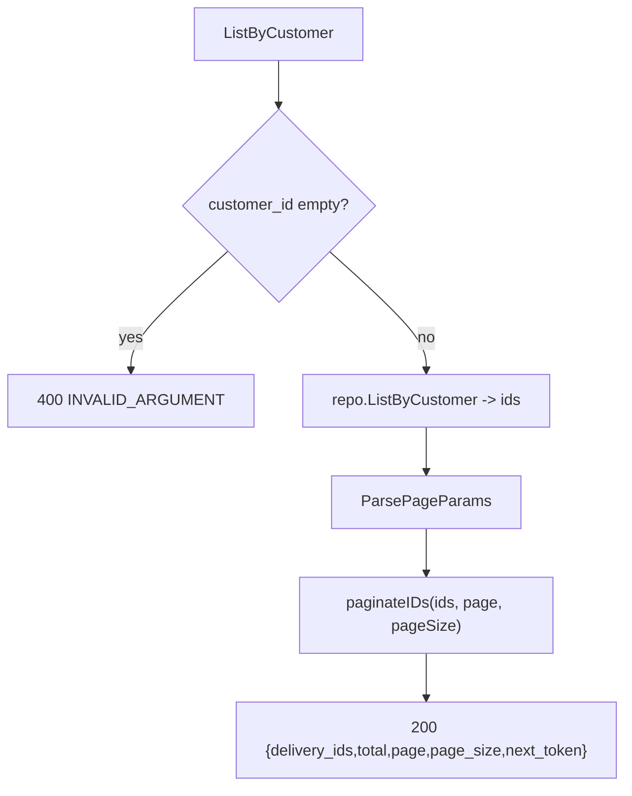
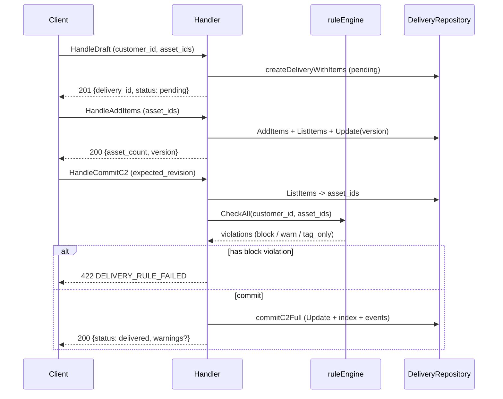
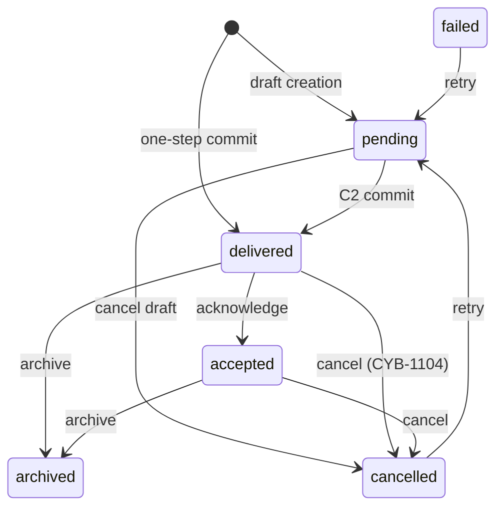
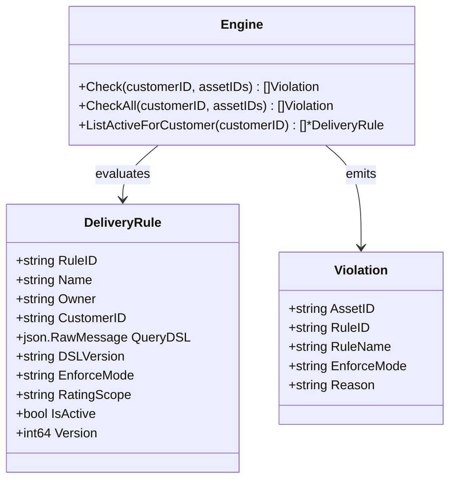
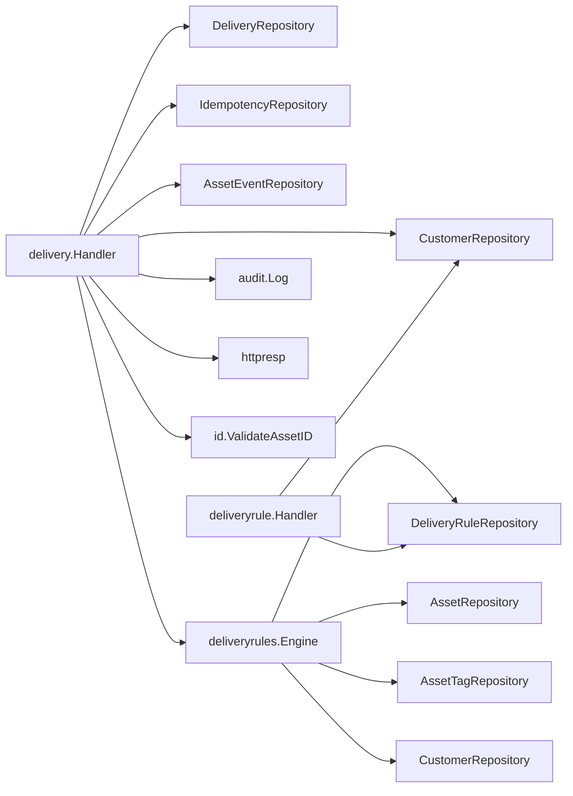

# Delivery Module

<cite>
**Referenced Files in This Document**

- [backend/internal/handlers/delivery/handler.go](file://backend/internal/handlers/delivery/handler.go)
- [backend/internal/handlers/delivery/errors.go](file://backend/internal/handlers/delivery/errors.go)
- [backend/internal/handlers/deliveryrule/handler.go](file://backend/internal/handlers/deliveryrule/handler.go)
- [backend/internal/models/delivery_rule.go](file://backend/internal/models/delivery_rule.go)
- [backend/internal/models/asset.go](file://backend/internal/models/asset.go)
- [backend/internal/models/delivery_transition.go](file://backend/internal/models/delivery_transition.go)
- [backend/internal/deliveryrules/engine.go](file://backend/internal/deliveryrules/engine.go)
- [backend/internal/repository/common.go](file://backend/internal/repository/common.go)
- [backend/internal/httpresp/codes.go](file://backend/internal/httpresp/codes.go)
- [backend/routes/routes.go](file://backend/routes/routes.go)
</cite>

## Table of Contents
1. [Introduction](#introduction)
2. [Project Structure](#project-structure)
3. [Core Components](#core-components)
4. [Architecture Overview](#architecture-overview)
5. [Detailed Component Analysis](#detailed-component-analysis)
6. [Dependency Analysis](#dependency-analysis)
7. [Performance Considerations](#performance-considerations)
8. [Troubleshooting Guide](#troubleshooting-guide)
9. [Conclusion](#conclusion)
10. [Appendices](#appendices)

## Introduction

The delivery module is the part of cyber-databrew that records the hand-off of a
set of assets to a customer. A *delivery* is a durable record that says "these
asset IDs were delivered to this customer at this time", together with a status,
an owning user, an optional contract reference, and a per-asset item list. The
module owns two coupled concerns:

- **Deliveries** — the records themselves, created either in one shot
  (`Commit`) or through a two-step *draft → add items → commit* workflow (the
  "C2" path), then read back via list/detail/items/per-customer endpoints, and
  moved through their lifecycle by cancel / retry / acknowledge operations.
- **Delivery rules** — declarative gates (a `DeliveryRule` carries a query DSL
  and an `enforce_mode`) that the rule engine evaluates *before* a delivery is
  allowed to commit. A rule whose predicate matches a candidate asset produces a
  `Violation`; `block`-mode violations stop the commit, while `warn` / `tag_only`
  violations are surfaced as warnings on the C2 path.

The primary actors are internal operators and the front-end dashboard, which
call the deliveries API to package and ship asset bundles, plus the rule engine
which acts as an automated compliance gate at commit time. The module is
designed around two hard guarantees: **idempotency** (a retried commit with the
same `Idempotency-Key` never double-writes) and **atomicity** (the delivery row,
its items, the per-asset delivery index, and the idempotency record all land in
a single transaction or none of them do).

**Section sources**
- [backend/internal/handlers/delivery/handler.go](file://backend/internal/handlers/delivery/handler.go#L26-L63)
- [backend/internal/models/delivery_rule.go](file://backend/internal/models/delivery_rule.go#L1-L22)

## Project Structure

The delivery feature spans handlers, models, an evaluation engine, repository
interfaces, and route registration:

- `backend/internal/handlers/delivery/` — the HTTP layer for deliveries.
  - `handler.go` holds the `Handler` struct, its dependency wiring (`New`,
    `SetRuleEngine`), the transactional commit helpers, and every endpoint
    (`Commit`, `List`, `Get`, `ListItems`, `ListByCustomer`, plus the C2 and
    lifecycle handlers).
  - `errors.go` maps known repository errors (optimistic-lock conflicts) onto
    HTTP error responses through `writeDeliveryError`.
- `backend/internal/handlers/deliveryrule/handler.go` — the HTTP layer for
  delivery rules (`Create`, `List`), validating the query DSL and customer.
- `backend/internal/models/delivery_rule.go` — the `DeliveryRule` type.
- `backend/internal/models/asset.go` — the `Delivery` and `DeliveryItem` types
  and the `DeliveryStatus` enum.
- `backend/internal/models/delivery_transition.go` — the legal status-transition
  table and `ValidateTransition`.
- `backend/internal/deliveryrules/engine.go` — the `Engine` that compiles rules
  and produces `Violation`s.
- `backend/internal/repository/common.go` — the `DeliveryRepository`,
  `IdempotencyRepository`, and `IdempotencyRecord` contracts plus the sentinel
  errors `ErrOptimisticLock` and `ErrIdempotencyConflict`.
- `backend/routes/routes.go` — registers the deliveries route group.



**Diagram sources**
- [backend/internal/handlers/delivery/handler.go](file://backend/internal/handlers/delivery/handler.go#L26-L63)
- [backend/internal/handlers/deliveryrule/handler.go](file://backend/internal/handlers/deliveryrule/handler.go#L16-L23)
- [backend/internal/deliveryrules/engine.go](file://backend/internal/deliveryrules/engine.go#L25-L40)

**Section sources**
- [backend/internal/handlers/delivery/handler.go](file://backend/internal/handlers/delivery/handler.go#L1-L63)
- [backend/internal/handlers/deliveryrule/handler.go](file://backend/internal/handlers/deliveryrule/handler.go#L1-L23)
- [backend/routes/routes.go](file://backend/routes/routes.go#L233-L237)

## Core Components

### The delivery `Handler`

`delivery.Handler` aggregates five collaborators: the `DeliveryRepository`
(`repo`), the `IdempotencyRepository` (`idemRepo`), the `CustomerRepository`
(`customerRepo`), an optional `AssetEventRepository` (`eventRepo`), and an
optional rule engine (`ruleEngine`). The constructor `New` takes the first three
plus a variadic event repository; the rule engine is injected separately via
`SetRuleEngine`, reflecting that compliance gating is an opt-in capability
(CYB-1020).

```go
type Handler struct {
	repo         repository.DeliveryRepository
	idemRepo     repository.IdempotencyRepository
	customerRepo repository.CustomerRepository
	eventRepo    repository.AssetEventRepository
	ruleEngine   *deliveryrules.Engine
}
```

### Transaction helpers

Two private helpers gate all multi-write paths on transactionality:

- `withTx` runs `fn` inside a transaction when the repository implements
  `repository.TxRunner`, otherwise it runs `fn` directly. This is used where a
  non-transactional repo is acceptable.
- `withTxRequired` *fails* with an error when the repo does not implement
  `TxRunner`. The C2 add-items, C2 commit, and cancel paths use this stricter
  variant because their correctness depends on atomicity.

### The `Delivery` and `DeliveryItem` models

`models.Delivery` is the durable record: identity (`DeliveryID`), the owning
`CustomerID`, a `DeliveryStatus`, timestamps (`DeliveredAt`, `CompletedAt`,
`CancelledAt`, `AcknowledgedAt`), counters (`AssetCount`, `ItemCount`), an
optimistic-lock `Version`, plus cancel and acknowledgment metadata.
`models.DeliveryItem` is the per-asset row carrying `DeliveryID`, `AssetID`, and
`CreatedAt`.

### The `DeliveryRule` model and the rule `Engine`

`models.DeliveryRule` describes a gate: a `Name` and `Owner`, an optional
`CustomerID` scope, a `QueryDSL` predicate, an `EnforceMode`
(`block` / `warn` / `tag_only`), a `RatingScope`, and an `IsActive` flag.
`deliveryrules.Engine` loads the active rules for a customer, compiles each
`QueryDSL`, loads asset snapshots, and emits a `Violation` per matching
(asset, rule) pair.

**Section sources**
- [backend/internal/handlers/delivery/handler.go](file://backend/internal/handlers/delivery/handler.go#L26-L63)
- [backend/internal/models/asset.go](file://backend/internal/models/asset.go#L224-L268)
- [backend/internal/models/delivery_rule.go](file://backend/internal/models/delivery_rule.go#L8-L22)
- [backend/internal/deliveryrules/engine.go](file://backend/internal/deliveryrules/engine.go#L16-L40)

## Architecture Overview

A `POST /deliveries` request flows through validation, an optional pre-commit
rule check, an idempotency fast-path, and finally a single transaction that
writes the delivery, its items, the per-asset delivery index, asset events, and
the idempotency record. Reads (`List`, `Get`, `ListItems`, `ListByCustomer`)
bypass the transaction machinery and hit the repository directly.



**Diagram sources**
- [backend/internal/handlers/delivery/handler.go](file://backend/internal/handlers/delivery/handler.go#L129-L168)
- [backend/internal/handlers/delivery/handler.go](file://backend/internal/handlers/delivery/handler.go#L202-L316)

**Section sources**
- [backend/internal/handlers/delivery/handler.go](file://backend/internal/handlers/delivery/handler.go#L188-L408)

## Detailed Component Analysis

### Committing a delivery (one-step `Commit`) and idempotency

`Commit` (`POST /api/v1/deliveries`) is the canonical creation path. Its steps:

1. **Bind & validate** the body. `asset_ids` (`required,min=1`) and
   `customer_id` (`required`) are mandatory; `contract_id`, `note`, and `owner`
   are optional. Each asset ID is checked with `id.ValidateAssetID` (8
   alphanumeric characters), and `customer_id` is trimmed and re-checked for
   emptiness.
2. **Customer existence** — when `customerRepo` is wired, `Exists` must return
   true or the request is rejected `422` with `CodeInvalidArgument`
   ("customer not found").
3. **Pre-commit rule gate** — when a `ruleEngine` is set, `ruleEngine.Check`
   evaluates *block*-mode rules. Any violations short-circuit with `422`
   `CodeDeliveryRuleFailed` and the violation list.
4. **Idempotency key** — the `Idempotency-Key` header is required; its absence
   yields `400` `CodeMissingIdempotencyKey`. The request is hashed with
   `hashDeliveryRequest` (SHA-256 of the JSON body).
5. **Idempotency fast-path** — `idemRepo.Get("deliveries_commit", key)` is
   consulted *outside* the transaction. If a record exists with a *different*
   `RequestHash`, the handler returns `409` `CodeIdempotencyConflict`. If the
   hash matches, the stored response body and status code are replayed verbatim.
6. **Build the delivery** — asset IDs are deduplicated via `uniqueAssetIDs`, a
   `uuid` is minted, status is set to `DeliveryStatusDelivered`, and
   `DeliveredAt` / `CompletedAt` are stamped with `now`.
7. **Transactional commit** — `commitDeliveryFull` performs the durable write.
8. **Audit & respond** — on a fresh commit an audit entry `delivery.commit` is
   recorded and `201` is returned with the delivery summary. A replayed record
   returns its stored status and body instead.

The two-layer idempotency design (a non-transactional `Get` fast-path *plus* a
`Lock` + re-`Get` inside the transaction) is deliberate: the fast-path avoids
opening a transaction for the common replay case, while the in-transaction
recheck closes the race where two concurrent retries both miss the fast-path.



**Diagram sources**
- [backend/internal/handlers/delivery/handler.go](file://backend/internal/handlers/delivery/handler.go#L202-L316)
- [backend/internal/handlers/delivery/handler.go](file://backend/internal/handlers/delivery/handler.go#L129-L168)

**Section sources**
- [backend/internal/handlers/delivery/handler.go](file://backend/internal/handlers/delivery/handler.go#L188-L316)
- [backend/internal/handlers/delivery/handler.go](file://backend/internal/handlers/delivery/handler.go#L921-L941)

#### `commitDeliveryFull` — the atomic write

`commitDeliveryFull` is the heart of the idempotency + atomicity guarantee. It
deduplicates the asset IDs, sets `AssetCount` and `ItemCount`, then runs a single
`writeFn` under `withTx`:

1. `idemRepo.Lock(scope, key)` takes the per-key lock so concurrent retries
   serialize.
2. `idemRepo.Get(scope, key)` re-reads inside the lock. If a record now exists
   with a mismatched `RequestHash`, it returns `repository.ErrIdempotencyConflict`;
   if the hash matches, the existing record is captured in `replay` and the
   function returns early *without* re-writing.
3. Otherwise it performs `repo.Set`, `repo.AddItems`, a
   `RefreshAssetDeliveryIndex` per asset, `appendDeliveryEvents`, and finally
   `idemRepo.Save` — all in the same transaction.

Because `idemRepo.Save` rides in the same transaction as the data writes, a
partial failure rolls back the idempotency record too, so a later retry is free
to re-attempt rather than replaying a half-written result. The handler maps
`ErrIdempotencyConflict` to `409` `CodeIdempotencyConflict`; a non-nil `replay`
causes the stored response to be returned.

**Section sources**
- [backend/internal/handlers/delivery/handler.go](file://backend/internal/handlers/delivery/handler.go#L125-L168)
- [backend/internal/handlers/delivery/handler.go](file://backend/internal/handlers/delivery/handler.go#L291-L308)

#### Asset events

`appendDeliveryEvents` is a no-op when no `eventRepo` is wired. Otherwise it
marshals a `delivery_committed` payload (`delivery_id`, `customer_id`, `status`,
`asset_count`, `delivered_at`) and appends one event per asset through
`eventRepo.Append`, tagging `EventType = "delivery_committed"`,
`AggregateType = "delivery"`, and `PayloadSchemaVersion = "v1"`.

**Section sources**
- [backend/internal/handlers/delivery/handler.go](file://backend/internal/handlers/delivery/handler.go#L65-L93)

### Listing, detail, and items

Three read endpoints back the dashboard:

- **`List` (`GET /api/v1/deliveries`)** parses `page` / `page_size` via
  `handlers.ParsePageParams`, reads `status` and `customer_id` query filters
  (the latter trimmed), and calls `repo.List(page, pageSize, status, customerID)`.
  A nil result is normalized to an empty slice, and the response wraps `items`,
  `total`, `page`, and `page_size`.
- **`Get` (`GET /api/v1/deliveries/:id`)** validates the `:id` path parameter is
  a UUID (`400` `CodeInvalidArgument` otherwise), fetches the record, and returns
  `404` `CodeDeliveryNotFound` when the repository returns nil.
- **`ListItems` (`GET /api/v1/deliveries/:id/items`)** first re-uses the same
  UUID validation and existence check as `Get`, then calls `repo.ListItems` and
  returns the items under an `items` key (nil normalized to an empty slice).

**Section sources**
- [backend/internal/handlers/delivery/handler.go](file://backend/internal/handlers/delivery/handler.go#L318-L385)

### Customer-scoped delivery listing

`ListByCustomer` (`GET /api/v1/customers/:customer_id/deliveries`) returns the
delivery IDs associated with a customer. It trims and requires `customer_id`,
calls `repo.ListByCustomer` to fetch the full ID list, then paginates *in
memory* with `paginateIDs(ids, page, pageSize)`. The response carries
`delivery_ids`, `total` (the full count, not the page size), `page`,
`page_size`, and a `next_token` — the latter is simply the next page number as a
string, present only when more pages remain.



**Diagram sources**
- [backend/internal/handlers/delivery/handler.go](file://backend/internal/handlers/delivery/handler.go#L387-L408)
- [backend/internal/handlers/delivery/handler.go](file://backend/internal/handlers/delivery/handler.go#L902-L919)

**Section sources**
- [backend/internal/handlers/delivery/handler.go](file://backend/internal/handlers/delivery/handler.go#L387-L408)

### The two-step (C2) workflow: draft → add items → commit

For workflows that need review before shipping, the module exposes a three-stage
path (these handlers live in `handler.go` even though the C2 routes are not in
the deliveries route group shown in `routes.go`):

- **`HandleDraft`** creates a delivery in `DeliveryStatusPending` *without*
  running the rule engine. It validates the customer and asset IDs, sets
  `RequestedBy` (the trimmed `Owner`, falling back to the `X-Request-ID`
  header), and persists the draft and its items via `createDeliveryWithItems`.
- **`HandleAddItems`** batch-adds assets to a *pending* delivery only (otherwise
  `422` `CodeInvalidState`). Under `withTxRequired` it calls `repo.AddItems`,
  re-reads the items to recompute `AssetCount` / `ItemCount`, and persists via
  `repo.Update(d, d.Version)` using optimistic locking.
- **`HandleCommitC2`** commits a pending draft. It enforces an
  `expected_revision` check against `d.Version` (`409` `CodeConcurrentConflict`
  on mismatch), collects the asset IDs from `delivery_items`, then re-runs the
  rule engine via `ruleEngine.CheckAll` (all enforce modes). If *any* violation
  has `enforce_mode == "block"` the commit is rejected `422`
  `CodeDeliveryRuleFailed`; otherwise `warn` / `tag_only` violations are returned
  as `warnings`. The status moves to `DeliveryStatusDelivered` and the write is
  done via `commitC2Full` (`repo.Update` + per-asset index refresh + events,
  all in one transaction).



**Diagram sources**
- [backend/internal/handlers/delivery/handler.go](file://backend/internal/handlers/delivery/handler.go#L415-L483)
- [backend/internal/handlers/delivery/handler.go](file://backend/internal/handlers/delivery/handler.go#L554-L663)

**Section sources**
- [backend/internal/handlers/delivery/handler.go](file://backend/internal/handlers/delivery/handler.go#L410-L663)
- [backend/internal/handlers/delivery/handler.go](file://backend/internal/handlers/delivery/handler.go#L95-L123)

### Lifecycle operations: cancel / retry / acknowledge

Three handlers move a delivery through its post-commit lifecycle, all guarded by
`models.ValidateTransition`:

- **`HandleCancel`** requires `cancelled_by`, allows cancel only from `pending`,
  `delivered`, or `accepted`, then validates the transition to
  `DeliveryStatusCancelled`. For non-pending deliveries it loads the items and,
  in the same transaction, calls `repo.Update` plus `RefreshAssetDeliveryIndex`
  per item so the per-asset index reflects the un-delivery.
- **`HandleRetry`** is allowed only from `failed` or `cancelled`. It copies the
  old delivery's items into a *new* `pending` delivery (new UUID) via
  `createDeliveryWithItems` and records both delivery IDs in the audit log for
  traceability.
- **`HandleAck`** requires `acknowledged_by`, is allowed only from `delivered`,
  validates the transition to `DeliveryStatusAccepted`, and persists with
  `repo.Update(d, d.Version)`.



**Diagram sources**
- [backend/internal/models/delivery_transition.go](file://backend/internal/models/delivery_transition.go#L8-L39)
- [backend/internal/handlers/delivery/handler.go](file://backend/internal/handlers/delivery/handler.go#L669-L900)

**Section sources**
- [backend/internal/handlers/delivery/handler.go](file://backend/internal/handlers/delivery/handler.go#L665-L900)
- [backend/internal/models/delivery_transition.go](file://backend/internal/models/delivery_transition.go#L1-L39)

### Delivery rules and eligibility

`deliveryrule.Handler` manages the gate definitions, and `deliveryrules.Engine`
applies them. `Create` (`POST /api/v1/delivery-rules`) requires `name`, `owner`,
and a `query_dsl`; it validates the DSL with `deliveryrules.ParseQueryDSL`,
optionally checks the `customer_id` exists, defaults `is_active` to true, and
inserts the `DeliveryRule`. `List` (`GET /api/v1/delivery-rules?customer_id=`)
returns rules filtered by customer.

The engine ties rules to deliveries. `Check` evaluates only `block`-mode rules
(used by `Commit`), while `CheckAll` evaluates every active rule regardless of
mode (used by `HandleCommitC2` so it can separate hard blocks from warnings).
`checkRules` loads the customer's active rules, compiles each DSL, loads asset
snapshots concurrently (bounded by `maxConcurrentLoads = 10`), and for each
(asset, rule) pair emits a `Violation` when the predicate matches. It also folds
in `MatchExcludeTagsForAsset`, which turns the customer's `exclude_tags` into
synthetic `block` violations.



**Diagram sources**
- [backend/internal/models/delivery_rule.go](file://backend/internal/models/delivery_rule.go#L8-L22)
- [backend/internal/deliveryrules/engine.go](file://backend/internal/deliveryrules/engine.go#L16-L51)

**Section sources**
- [backend/internal/handlers/deliveryrule/handler.go](file://backend/internal/handlers/deliveryrule/handler.go#L25-L91)
- [backend/internal/deliveryrules/engine.go](file://backend/internal/deliveryrules/engine.go#L42-L179)

## Dependency Analysis

The delivery handler depends on four repository contracts plus an optional rule
engine; the engine in turn depends on its own set of repositories. The handler
talks to all repositories through interfaces, so the concrete persistence layer
is swappable.



The `DeliveryRepository` interface declares `Set`, `Get`, `AddItems`,
`RefreshAssetDeliveryIndex`, `ListByCustomer`, `ListByAsset`, `ListItems`,
`List`, and an optimistic-locking `Update`. Transactionality is detected at
runtime by type-asserting the repo to `repository.TxRunner` inside `withTx` /
`withTxRequired`, so transactional behavior is a capability rather than a hard
dependency.

**Diagram sources**
- [backend/internal/handlers/delivery/handler.go](file://backend/internal/handlers/delivery/handler.go#L17-L57)
- [backend/internal/deliveryrules/engine.go](file://backend/internal/deliveryrules/engine.go#L26-L40)

**Section sources**
- [backend/internal/repository/common.go](file://backend/internal/repository/common.go#L40-L73)
- [backend/internal/handlers/delivery/handler.go](file://backend/internal/handlers/delivery/handler.go#L34-L57)

## Performance Considerations

- **In-memory pagination for `ListByCustomer`** — `ListByCustomer` fetches the
  customer's *entire* delivery-ID list and slices it with `paginateIDs`. This is
  simple and fine for customers with a bounded number of deliveries, but it does
  not push the page window down to the database; the full ID list is materialized
  on every request.
- **Per-asset index refresh and events scale with `asset_count`** — both
  `commitDeliveryFull` and `commitC2Full` loop over every asset ID calling
  `RefreshAssetDeliveryIndex`, and `appendDeliveryEvents` appends one event per
  asset. Large deliveries therefore cost O(asset_count) writes inside a single
  transaction, which lengthens the transaction and its lock hold.
- **Bounded-concurrency rule evaluation** — the engine loads asset snapshots
  concurrently but caps parallelism at `maxConcurrentLoads = 10` to avoid
  overwhelming the database on large batches. Each snapshot load fetches the
  asset plus its tags, and `logical_all`-scoped rules trigger an additional
  lazy load that aggregates tags across all revisions of a logical asset.
- **Idempotency fast-path** — the out-of-transaction `idemRepo.Get` avoids
  opening a transaction for the common replay case, returning the stored
  response directly.
- **Asset-ID deduplication** — `uniqueAssetIDs` collapses duplicate inputs early
  so counters and per-asset writes are not inflated by repeated IDs.

**Section sources**
- [backend/internal/handlers/delivery/handler.go](file://backend/internal/handlers/delivery/handler.go#L112-L168)
- [backend/internal/handlers/delivery/handler.go](file://backend/internal/handlers/delivery/handler.go#L902-L941)
- [backend/internal/deliveryrules/engine.go](file://backend/internal/deliveryrules/engine.go#L12-L14)
- [backend/internal/deliveryrules/engine.go](file://backend/internal/deliveryrules/engine.go#L98-L133)

## Troubleshooting Guide

- **`400 MISSING_IDEMPOTENCY_KEY`** — `Commit` was called without an
  `Idempotency-Key` header. Always supply a unique key per logical request and
  reuse the *same* key when retrying.
- **`409 IDEMPOTENCY_CONFLICT`** — the same `Idempotency-Key` was reused with a
  *different* body. The handler compares the SHA-256 `RequestHash`; either fix
  the body to match the original or use a fresh key. This conflict is detected
  both on the fast-path and inside the transaction (`ErrIdempotencyConflict`).
- **`422 DELIVERY_RULE_FAILED`** — one or more assets matched a `block`-mode
  delivery rule (or a customer `exclude_tags` rule). The `violations` array in
  the response names the offending `rule_id` / `rule_name`, `asset_id`, and
  `reason`. Adjust the rule, the asset tags, or the asset set.
- **`422 customer not found` (`INVALID_ARGUMENT`)** — the `customer_id` failed
  `customerRepo.Exists`. Confirm the customer exists before delivering.
- **`400 invalid delivery_id`** — the `:id` path parameter is not a valid UUID;
  `Get`, `ListItems`, and the C2/lifecycle handlers all enforce this.
- **`404 DELIVERY_NOT_FOUND`** — no delivery exists for the given UUID.
- **`409 CONCURRENT_CONFLICT`** — surfaced two ways: `HandleCommitC2` rejects an
  `expected_revision` that does not match `d.Version`, and `writeDeliveryError`
  maps `repository.ErrOptimisticLock` (raised by `repo.Update`) to this code.
  Re-read the delivery to get the current version and retry.
- **`422 INVALID_STATE` / `INVALID_STATE_TRANSITION`** — an operation was
  attempted from a status that does not allow it (e.g. adding items to a
  non-pending delivery, acknowledging a non-delivered one) or the
  status change is not in the `validTransitions` table.
- **`delivery repository does not support transactions`** — a transactional path
  (`withTxRequired`) ran against a repo that does not implement
  `repository.TxRunner`. Wire a transaction-capable repository implementation.

**Section sources**
- [backend/internal/handlers/delivery/handler.go](file://backend/internal/handlers/delivery/handler.go#L210-L308)
- [backend/internal/handlers/delivery/handler.go](file://backend/internal/handlers/delivery/handler.go#L44-L50)
- [backend/internal/handlers/delivery/errors.go](file://backend/internal/handlers/delivery/errors.go#L15-L25)
- [backend/internal/httpresp/codes.go](file://backend/internal/httpresp/codes.go#L5-L29)

## Conclusion

The delivery module pairs a small, interface-driven HTTP handler with a strict
transactional core. `Commit` provides one-shot delivery creation with a
two-layer idempotency guard and an all-or-nothing write of the delivery, its
items, the per-asset index, asset events, and the idempotency record. The C2
draft/add-items/commit path adds review-before-ship semantics with optimistic
locking and commit-time rule re-evaluation, while cancel / retry / acknowledge
move records through a validated state machine. Delivery rules and the rule
engine sit in front of every commit as a declarative eligibility gate, cleanly
separating *what may be delivered* (rules) from *how a delivery is recorded*
(the handler).

## Appendices

### A. Registered HTTP endpoints (deliveries route group)

| Method | Path | Handler |
| --- | --- | --- |
| POST | `/api/v1/deliveries` | `Commit` |
| GET | `/api/v1/deliveries` | `List` |
| GET | `/api/v1/deliveries/:id` | `Get` |
| GET | `/api/v1/deliveries/:id/items` | `ListItems` |
| GET | `/api/v1/customers/:customer_id/deliveries` | `ListByCustomer` |

The `deliveryrule.Handler` (`Create`, `List`) and the C2 / lifecycle handlers
exist in code; only the five routes above are wired in the deliveries group of
`routes.go`.

**Section sources**
- [backend/routes/routes.go](file://backend/routes/routes.go#L233-L237)

### B. `DeliveryStatus` values

| Constant | Value |
| --- | --- |
| `DeliveryStatusPending` | `pending` |
| `DeliveryStatusDelivered` | `delivered` |
| `DeliveryStatusFailed` | `failed` |
| `DeliveryStatusAccepted` | `accepted` |
| `DeliveryStatusRejected` | `rejected` |
| `DeliveryStatusRecalled` | `recalled` |
| `DeliveryStatusCancelled` | `cancelled` |
| `DeliveryStatusArchived` | `archived` |

**Section sources**
- [backend/internal/models/asset.go](file://backend/internal/models/asset.go#L27-L38)

### C. Relevant error codes

| Code constant | String value |
| --- | --- |
| `CodeInvalidArgument` | `INVALID_ARGUMENT` |
| `CodeInvalidState` | `INVALID_STATE` |
| `CodeInvalidStateTransition` | `INVALID_STATE_TRANSITION` |
| `CodeConcurrentConflict` | `CONCURRENT_CONFLICT` |
| `CodeMissingIdempotencyKey` | `MISSING_IDEMPOTENCY_KEY` |
| `CodeIdempotencyConflict` | `IDEMPOTENCY_CONFLICT` |
| `CodeDeliveryNotFound` | `DELIVERY_NOT_FOUND` |
| `CodeDeliveryRuleFailed` | `DELIVERY_RULE_FAILED` |

**Section sources**
- [backend/internal/httpresp/codes.go](file://backend/internal/httpresp/codes.go#L5-L29)

### D. Enforce modes

| Mode | Effect on `Commit` (block-only) | Effect on `HandleCommitC2` (all modes) |
| --- | --- | --- |
| `block` | rejects with `DELIVERY_RULE_FAILED` | rejects with `DELIVERY_RULE_FAILED` |
| `warn` | not evaluated | committed, returned as `warnings` |
| `tag_only` | not evaluated | committed, returned as `warnings` |

**Section sources**
- [backend/internal/deliveryrules/engine.go](file://backend/internal/deliveryrules/engine.go#L42-L51)
- [backend/internal/handlers/delivery/handler.go](file://backend/internal/handlers/delivery/handler.go#L603-L661)
