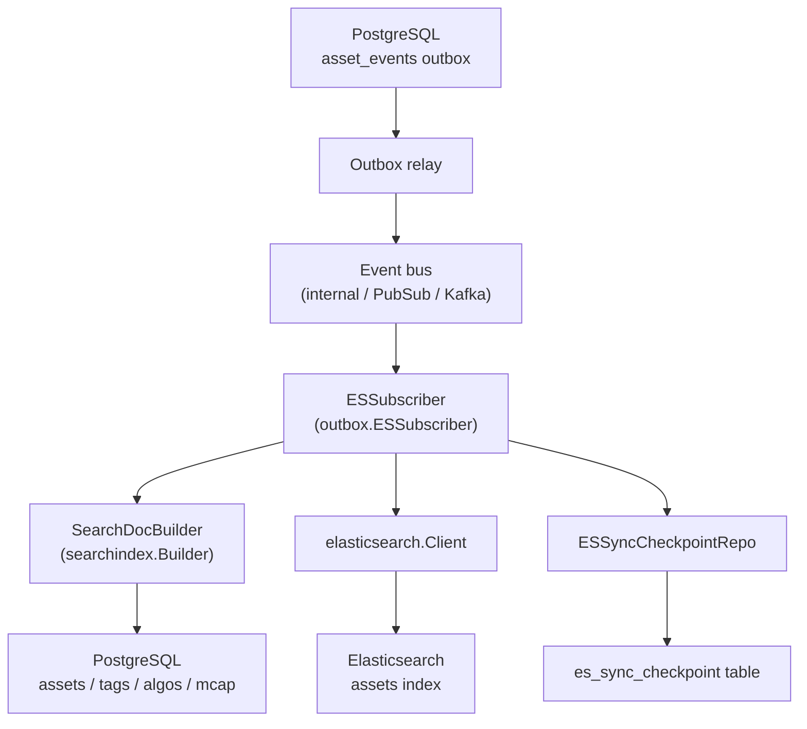
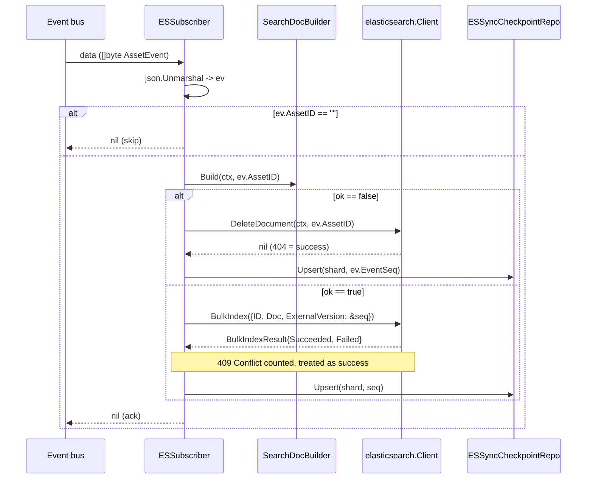
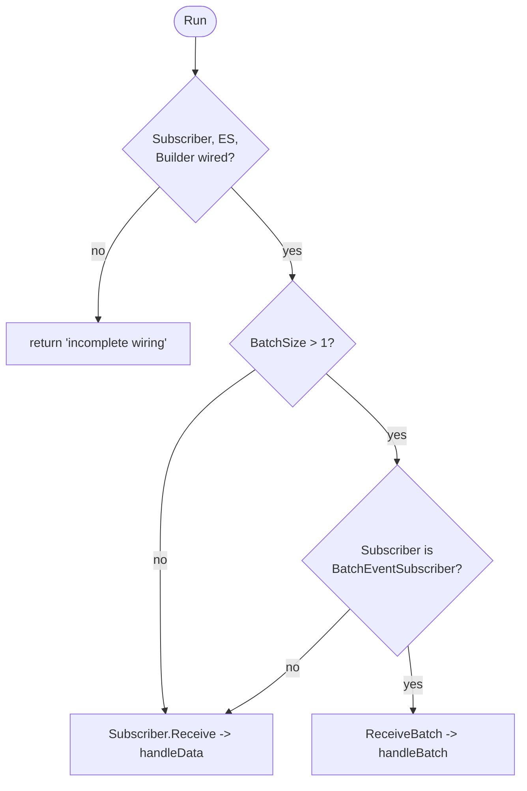
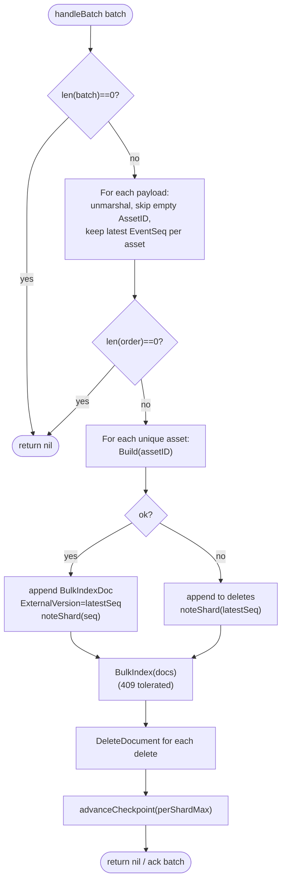
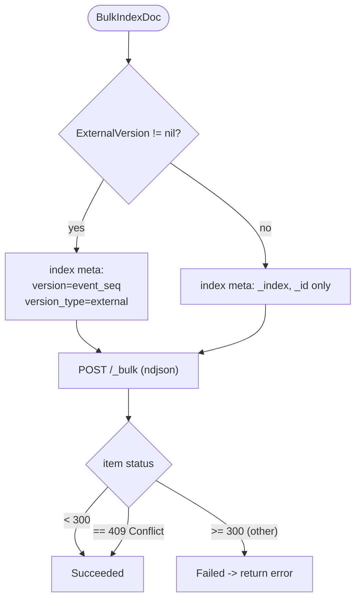
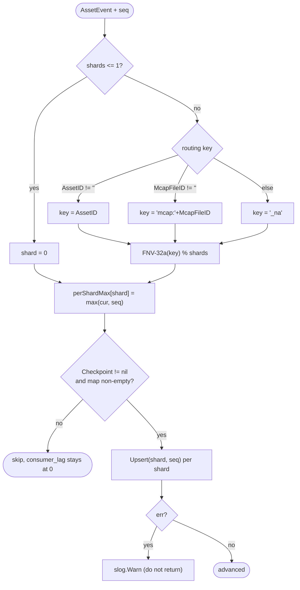
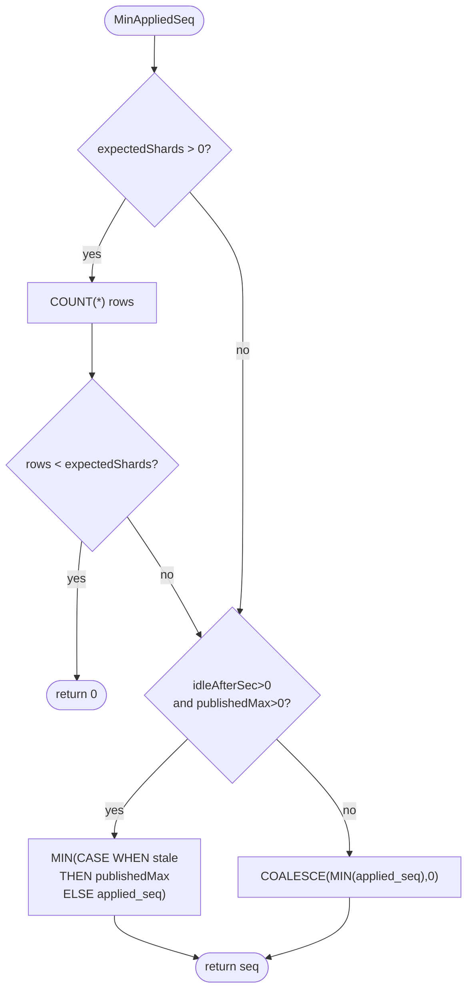
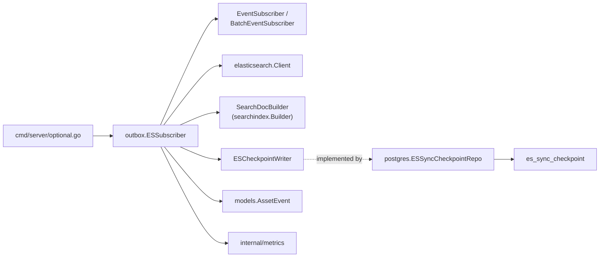

# Elasticsearch Subscriber

<cite>
**Referenced Files in This Document**

- [backend/internal/outbox/es_subscriber.go](file://backend/internal/outbox/es_subscriber.go)
- [backend/internal/postgres/es_sync_checkpoint.go](file://backend/internal/postgres/es_sync_checkpoint.go)
- [backend/internal/elasticsearch/client.go](file://backend/internal/elasticsearch/client.go)
- [backend/internal/elasticsearch/current_filter.go](file://backend/internal/elasticsearch/current_filter.go)
- [backend/internal/elasticsearch/query_ir.go](file://backend/internal/elasticsearch/query_ir.go)
- [backend/internal/outbox/bus.go](file://backend/internal/outbox/bus.go)
- [backend/internal/models/schema_evolution.go](file://backend/internal/models/schema_evolution.go)
- [backend/cmd/server/optional.go](file://backend/cmd/server/optional.go)
- [backend/migrations/archive/022_es_sync_checkpoint.sql](file://backend/migrations/archive/022_es_sync_checkpoint.sql)
</cite>

## Table of Contents
1. [Introduction](#introduction)
2. [Project Structure](#project-structure)
3. [Core Components](#core-components)
4. [Architecture Overview](#architecture-overview)
5. [Detailed Component Analysis](#detailed-component-analysis)
6. [Dependency Analysis](#dependency-analysis)
7. [Performance Considerations](#performance-considerations)
8. [Troubleshooting Guide](#troubleshooting-guide)
9. [Conclusion](#conclusion)
10. [Appendices](#appendices)

## Introduction

The Elasticsearch subscriber is the read-side consumer of the asset change-data-capture (CDC) pipeline. It sits at the end of the outbox flow: PostgreSQL writes domain changes to the `asset_events` outbox table, a relay publishes those rows onto an event bus, and `ESSubscriber` consumes them and projects each affected asset into the `assets` Elasticsearch index that backs search, faceting, and the query-IR API.

The subscriber is deliberately *event-driven but state-rebuilding*. It does not apply an incremental diff carried in the event payload; instead, for every event it re-reads the asset's full current state from PostgreSQL through a `SearchDocBuilder`, then upserts the rebuilt document into Elasticsearch. This makes the projection self-healing — replaying an old event simply re-derives the same document — and lets the subscriber collapse many events for the same asset into a single rebuild.

Two correctness mechanisms make the projection safe under at-least-once delivery and out-of-order retries:

- **Idempotent external versioning.** Each upsert carries the originating `event_seq` as the Elasticsearch document version with `version_type=external`. Elasticsearch rejects any write whose version is not strictly greater than the stored version, so a stale or replayed event can never overwrite a newer document. The resulting `409 Conflict` is treated as success.
- **A per-shard checkpoint watermark.** After each successful ES action the subscriber advances a row in the `es_sync_checkpoint` table with the maximum applied `event_seq` for that shard. The cross-shard `MIN(applied_seq)` is a conservative high-water mark exposed as `consumer_lag` in `GET /api/v1/search/sync-progress`, so operators can see how far ES trails PostgreSQL.

**Section sources**
- [backend/internal/outbox/es_subscriber.go](file://backend/internal/outbox/es_subscriber.go#L30-L63)
- [backend/migrations/archive/022_es_sync_checkpoint.sql](file://backend/migrations/archive/022_es_sync_checkpoint.sql#L1-L22)

## Project Structure

The subscriber spans three packages: the `outbox` package owns the consumer and checkpoint-advance logic, the `elasticsearch` package owns the HTTP client and `_bulk` document framing, and the `postgres` package owns the durable checkpoint repository. The document-building logic (`SearchDocBuilder`) is injected from the `searchindex` package at wiring time and is treated here as a dependency rather than part of the subscriber.

- `backend/internal/outbox/es_subscriber.go` — the `ESSubscriber` type, its `Run` loop, the single-event (`handleData`) and batched (`handleBatch`) paths, the FNV shard hash, and the best-effort `advanceCheckpoint` helper.
- `backend/internal/outbox/bus.go` — the `EventSubscriber` and `BatchEventSubscriber` transport interfaces the subscriber is wired against.
- `backend/internal/elasticsearch/client.go` — the HTTP `Client`, the `BulkIndexDoc` / `BulkIndexResult` types, and the `BulkIndex` and `DeleteDocument` methods that translate documents into `_bulk` actions and `_doc` deletes.
- `backend/internal/elasticsearch/query_ir.go` / `current_filter.go` — the read-side query compiler; they consume the same `assets` index the subscriber writes, and document the fields (e.g. `is_current`, `logical_asset_id`, `tags_flat.*`) the builder must populate.
- `backend/internal/postgres/es_sync_checkpoint.go` — `ESSyncCheckpointRepo` with the idempotent `Upsert` and the conservative `MinAppliedSeq`.
- `backend/migrations/archive/022_es_sync_checkpoint.sql` — the `es_sync_checkpoint` table definition.
- `backend/cmd/server/optional.go` — the composition root that constructs and starts the subscriber.



**Diagram sources**
- [backend/internal/outbox/es_subscriber.go](file://backend/internal/outbox/es_subscriber.go#L38-L63)
- [backend/cmd/server/optional.go](file://backend/cmd/server/optional.go#L208-L223)

**Section sources**
- [backend/internal/outbox/es_subscriber.go](file://backend/internal/outbox/es_subscriber.go#L1-L16)
- [backend/cmd/server/optional.go](file://backend/cmd/server/optional.go#L190-L223)

## Core Components

The subscriber is defined by a small set of types and interfaces.

The `ESSubscriber` struct wires together a transport `Subscriber`, an Elasticsearch `Client`, a `Builder`, an optional `Checkpoint` writer, and two tuning knobs (`BatchSize`, `BatchWaitMs`) plus `CheckpointShards`. The `Checkpoint` and `CheckpointShards` fields are explicitly best-effort observability; failures there never propagate into the data path.

`ESCheckpointWriter` is the minimal interface the subscriber depends on — just `Upsert(ctx, shardID, appliedSeq)` — and is satisfied by `*postgres.ESSyncCheckpointRepo`. Decoupling the subscriber from the concrete repo keeps it nil-safe: when no checkpoint is wired, checkpoint updates are skipped and `consumer_lag` stays at 0.

`SearchDocBuilder` is the second injected interface. Its `Build(ctx, assetID)` returns the rebuilt document plus an `ok` flag; `ok=false` signals that the asset no longer has a searchable projection (soft-deleted or missing), which the subscriber translates into a delete rather than an upsert.

`models.AssetEvent` is the decoded payload. The subscriber reads only `AssetID`, `McapFileID`, and `EventSeq` from it: `AssetID` selects the document and the rebuild key, `EventSeq` becomes the external version and the checkpoint value, and `McapFileID` participates in the shard hash for events that lack an asset id.

On the Elasticsearch side, `BulkIndexDoc` carries an `ID`, a `Doc`, and an optional `ExternalVersion *int64`; when non-nil, `BulkIndex` emits `version` and `version_type=external` in the action metadata.

**Section sources**
- [backend/internal/outbox/es_subscriber.go](file://backend/internal/outbox/es_subscriber.go#L18-L63)
- [backend/internal/models/schema_evolution.go](file://backend/internal/models/schema_evolution.go#L55-L74)
- [backend/internal/elasticsearch/client.go](file://backend/internal/elasticsearch/client.go#L962-L982)

## Architecture Overview

`Run` is the entry point and chooses one of two consumption strategies based on configuration and transport capability. If `BatchSize > 1` *and* the transport implements `BatchEventSubscriber`, it takes the short-window batched path (`ReceiveBatch` → `handleBatch`). Otherwise it falls back to the legacy one-event-per-call path (`Receive` → `handleData`), keeping PubSub and Kafka transports working unchanged since they only implement the single-message `Receive`.

Both paths share the same projection shape: decode event → rebuild document via the builder → upsert (or delete) in Elasticsearch with `event_seq` as the external version → advance the per-shard checkpoint. The batched path adds same-asset coalescing and a single `_bulk` round-trip per worker batch.



**Diagram sources**
- [backend/internal/outbox/es_subscriber.go](file://backend/internal/outbox/es_subscriber.go#L116-L163)
- [backend/internal/elasticsearch/client.go](file://backend/internal/elasticsearch/client.go#L988-L1120)

**Section sources**
- [backend/internal/outbox/es_subscriber.go](file://backend/internal/outbox/es_subscriber.go#L100-L114)
- [backend/internal/outbox/bus.go](file://backend/internal/outbox/bus.go#L20-L50)

## Detailed Component Analysis

### Run loop and transport selection

`Run` first validates that all required collaborators are wired (`Subscriber`, `ES`, `Builder`); incomplete wiring is a hard error. It then performs runtime feature detection: only when `BatchSize > 1` and the concrete subscriber type asserts to `BatchEventSubscriber` does it call `ReceiveBatch` with the configured batch size and a wait window derived from `BatchWaitMs`. Every other case routes through `Receive`, which delivers one payload at a time to `handleData`.

This design keeps the batched optimization opt-in and transport-aware. The internal in-process bus implements `BatchEventSubscriber`; PubSub and Kafka subscribers implement only the single-message interface, so they automatically take the legacy path even if `BatchSize` is set.



**Diagram sources**
- [backend/internal/outbox/es_subscriber.go](file://backend/internal/outbox/es_subscriber.go#L100-L114)

**Section sources**
- [backend/internal/outbox/es_subscriber.go](file://backend/internal/outbox/es_subscriber.go#L100-L114)
- [backend/internal/outbox/bus.go](file://backend/internal/outbox/bus.go#L42-L50)

### Single-event path: handleData

`handleData` observes a batch size of 1, decodes the payload into an `AssetEvent`, and short-circuits to a no-op (ack) when `AssetID` is empty. It then calls `Builder.Build`.

When `Build` returns `ok=false`, the asset has no searchable projection, so the handler deletes the document by id via `DeleteDocument`, records the `delete` handle-duration metric, and advances the checkpoint for the event's shard using `ev.EventSeq`. Note that the delete path does *not* use external versioning — `DeleteDocument` is an unconditional, idempotent `DELETE /_doc/{id}` where a `404` is treated as success.

When `Build` returns `ok=true`, the handler builds a single `BulkIndexDoc` carrying `ev.AssetID`, the rebuilt `Doc`, and `ExternalVersion = &seq` (a copy of `ev.EventSeq`), and submits it through `BulkIndex`. It inspects the result: each succeeded item with `http.StatusConflict` (409) increments the `conflict` error counter but is *not* an error — a 409 means a newer or equal version already won the version race, which is the intended idempotent outcome. Any genuinely failed item returns an error, failing the message so the relay can retry. On full success it advances the checkpoint with `seq`.

**Section sources**
- [backend/internal/outbox/es_subscriber.go](file://backend/internal/outbox/es_subscriber.go#L116-L163)
- [backend/internal/elasticsearch/client.go](file://backend/internal/elasticsearch/client.go#L1088-L1120)

### Batched path: handleBatch, coalescing, and the _bulk request

`handleBatch` is the throughput-oriented path. It receives a slice of raw payloads and first coalesces them by asset: it builds a map keyed by `AssetID`, keeping the entry with the highest `EventSeq` (latest wins) and preserving first-seen order in an `order` slice. Per-asset ordering is guaranteed upstream by the routing key (`FNV(asset_id) % workers`), so every event for one asset lands on the same worker in `event_seq` order; collapsing N events into one rebuild is semantically equivalent to applying them sequentially because `Build` re-reads full state from PostgreSQL.

For each unique asset (in order) it calls `Build` exactly once. `ok=true` assets contribute a `BulkIndexDoc` with `ExternalVersion` set to the asset's `latestSeq`; `ok=false` assets are appended to a `deletes` list. Throughout, a `perShardMax` map accumulates the maximum `event_seq` seen per checkpoint shard via the `noteShard` closure.

The handler then issues at most one `BulkIndex` call for all upserts, applies the same 409-tolerant result handling as the single path, and afterwards issues sequential `DeleteDocument` calls for the `deletes` list (the `_bulk` framing here does not emit delete actions, hence the hybrid). Only after *all* bulk and delete actions succeed does it call `advanceCheckpoint(perShardMax)` — so a mid-batch failure never advances a watermark past unapplied work. Any error fails the whole batch; the relay then retries each `event_seq` independently.



**Diagram sources**
- [backend/internal/outbox/es_subscriber.go](file://backend/internal/outbox/es_subscriber.go#L188-L288)

**Section sources**
- [backend/internal/outbox/es_subscriber.go](file://backend/internal/outbox/es_subscriber.go#L165-L288)

### Idempotent upsert with external versioning

Idempotency is enforced at the Elasticsearch write boundary. `BulkIndex` iterates the `docs`, and for each one with a non-nil `ExternalVersion` it sets `version` and `version_type=external` on the `index` action metadata. Under external versioning Elasticsearch only accepts the write when the incoming `version` is strictly greater than the stored `_version`; otherwise it returns a `409 Conflict` for that item.

Because the subscriber keys the version on `event_seq` — a monotonically increasing outbox sequence — replays and out-of-order retries are inherently safe: an older `event_seq` can never overwrite a document already written by a newer one. The subscriber classifies a 409 item as *succeeded* (it lands in `Succeeded`, not `Failed`) and only bumps a `conflict` metric, so retries are silently absorbed rather than failing the message.



**Diagram sources**
- [backend/internal/elasticsearch/client.go](file://backend/internal/elasticsearch/client.go#L1000-L1086)

**Section sources**
- [backend/internal/elasticsearch/client.go](file://backend/internal/elasticsearch/client.go#L962-L1086)
- [backend/internal/outbox/es_subscriber.go](file://backend/internal/outbox/es_subscriber.go#L152-L160)

### Shard hashing and checkpoint advance

`shardForEvent` derives a checkpoint shard from each event. When `CheckpointShards <= 1` it returns 0 (a single global row). Otherwise it builds a routing key — `AssetID`, else `"mcap:" + McapFileID`, else `"_na"` — hashes it with FNV-32a, and reduces modulo the shard count. This mirrors the relay's ordering-key hash, so all events for one asset always update the same shard row, keeping the watermark consistent.

`advanceCheckpoint` is the best-effort writer. It is a no-op when no `Checkpoint` is wired or the per-shard map is empty; otherwise it calls `Upsert` for each shard and logs (but never returns) failures. This guarantees that checkpoint write problems degrade only `consumer_lag` observability, never the projection.



**Diagram sources**
- [backend/internal/outbox/es_subscriber.go](file://backend/internal/outbox/es_subscriber.go#L65-L98)

**Section sources**
- [backend/internal/outbox/es_subscriber.go](file://backend/internal/outbox/es_subscriber.go#L65-L98)

### The checkpoint repository and watermark

`ESSyncCheckpointRepo` persists the per-shard high-water marks. `Upsert` is idempotent by construction: it is a no-op for non-positive `appliedSeq`, and the SQL is an `INSERT ... ON CONFLICT (shard_id) DO UPDATE SET applied_seq = GREATEST(es_sync_checkpoint.applied_seq, EXCLUDED.applied_seq)`. Because of the `GREATEST`, a stale retry can never regress a watermark — it only moves forward. A missing relation (`42P01`) is swallowed and returns nil, so the data path survives a not-yet-migrated table.

`MinAppliedSeq` computes the conservative cross-shard watermark consumed by the sync-progress endpoint. It supports three behaviors:

1. **Expected-shard gating.** When `expectedShards > 0`, it first counts rows; if fewer rows exist than `expectedShards` (some shards have never received an event), it returns 0 so `consumer_lag` never overstates ES progress.
2. **Idle-shard advance.** When `idleAfterSec > 0` and `publishedMax > 0`, any row whose `updated_at` is older than `idleAfterSec` is treated as `applied_seq = publishedMax` for the MIN, preventing a low-traffic shard from dragging the lag up forever.
3. **Plain MIN.** Otherwise it returns `COALESCE(MIN(applied_seq), 0)`.



**Diagram sources**
- [backend/internal/postgres/es_sync_checkpoint.go](file://backend/internal/postgres/es_sync_checkpoint.go#L70-L108)

**Section sources**
- [backend/internal/postgres/es_sync_checkpoint.go](file://backend/internal/postgres/es_sync_checkpoint.go#L11-L108)
- [backend/migrations/archive/022_es_sync_checkpoint.sql](file://backend/migrations/archive/022_es_sync_checkpoint.sql#L13-L22)

### The projected document and read-side contract

The subscriber does not define the document schema itself — it forwards whatever `Builder.Build` returns — but the read side constrains what those documents must contain. The query compiler in `query_ir.go` and the current-revision filter in `current_filter.go` reference specific fields the projection must populate to be searchable and filterable: `is_current` and `logical_asset_id` for current-revision visibility, `updated_at` as the default sort, and faceted fields such as `lifecycle_state`, `asset_type`, `owner`, `mcap.vendor_id`, `mcap.scene_id`, and the flattened `tags_flat.priority` / `tags_flat.quality`.

`wrapCurrentRevisionOnlyQuery` shows the visibility contract concretely: unless `include_history` is set, results are restricted to documents where `is_current` is true *or* where `logical_asset_id` does not exist (legacy pre-CYB-1013 rows). A document the subscriber writes without `is_current` set therefore disappears from default search results — a useful cross-check when debugging "indexed but not found" reports.

**Section sources**
- [backend/internal/elasticsearch/current_filter.go](file://backend/internal/elasticsearch/current_filter.go#L7-L29)
- [backend/internal/elasticsearch/query_ir.go](file://backend/internal/elasticsearch/query_ir.go#L10-L50)
- [backend/internal/elasticsearch/query_ir.go](file://backend/internal/elasticsearch/query_ir.go#L163-L186)

## Dependency Analysis

The subscriber depends on three injected abstractions and one concrete client, and is itself constructed by the server composition root.



At wiring time (`optional.go`), `optional.go` reads `OUTBOX_ES_CHECKPOINT_SHARDS` (clamped to `[1, 1024]`), the internal batch size and wait, constructs a `searchindex.Builder` from the relevant Postgres repos, and only attaches a non-nil `Checkpoint` (an `ESSyncCheckpointRepo`) when a Postgres client is available. The `metrics` package is a side dependency for `OutboxSubscriberBatchSize`, `OutboxSubscriberHandleDurationSeconds`, `OutboxSubscriberESErrorsTotal`, and the client-side `ElasticsearchRequestsTotal` / `ElasticsearchRequestDurationSeconds`.

On the consuming side, `ESSyncCheckpointRepo.MinAppliedSeq` is called from the sync-progress helper to populate `consumer_lag`, completing the observability loop.

**Diagram sources**
- [backend/cmd/server/optional.go](file://backend/cmd/server/optional.go#L198-L223)
- [backend/internal/outbox/es_subscriber.go](file://backend/internal/outbox/es_subscriber.go#L21-L28)

**Section sources**
- [backend/cmd/server/optional.go](file://backend/cmd/server/optional.go#L190-L223)
- [backend/internal/outbox/es_subscriber.go](file://backend/internal/outbox/es_subscriber.go#L1-L63)

## Performance Considerations

- **Batching and HTTP round-trips.** The throughput win in `handleBatch` comes from a single `_bulk` HTTP round-trip per worker batch rather than parallel rebuilds. `Build` is intentionally serial per unique asset in v1; a documented future optimization is to parallelize `Build` with a bounded `errgroup` if PostgreSQL read latency becomes the bottleneck.
- **Same-asset coalescing.** Collapsing many events for one asset into a single `Build` plus a single doc (with `max(event_seq)`) cuts both PostgreSQL reads and ES writes for hot assets, and avoids redundant version races.
- **Checkpoint write amplification.** Each successful bulk emits at most `shards-in-batch` UPSERTs against `es_sync_checkpoint`, so checkpoint write volume is bounded by the shard count (default 16), not by `asset_events` volume. The table has exactly `OUTBOX_ES_CHECKPOINT_SHARDS` rows keyed by `shard_id`.
- **Idle-shard advance avoids false lag.** Without idle-advance, a low-traffic shard's `applied_seq` would stay below the global published max and drag `consumer_lag` up indefinitely; the `idleAfterSec`/`publishedMax` mechanism treats stale-but-idle shards as caught up.
- **Conservative gating cost.** `MinAppliedSeq` runs an extra `COUNT(*)` when `expectedShards > 0`; on a 16-row table this is negligible.
- **Client timeout.** The Elasticsearch HTTP client uses a fixed 15s timeout; a slow ES cluster will surface as request errors rather than unbounded stalls.

**Section sources**
- [backend/internal/outbox/es_subscriber.go](file://backend/internal/outbox/es_subscriber.go#L165-L186)
- [backend/internal/elasticsearch/client.go](file://backend/internal/elasticsearch/client.go#L31-L44)
- [backend/migrations/archive/022_es_sync_checkpoint.sql](file://backend/migrations/archive/022_es_sync_checkpoint.sql#L9-L17)

## Troubleshooting Guide

- **`consumer_lag` stuck at 0.** Either no `Checkpoint` is wired (the `ESCheckpointWriter` is nil, so `advanceCheckpoint` is a no-op), or `MinAppliedSeq` is gating: when fewer `es_sync_checkpoint` rows exist than `expectedShards`, it returns 0 by design. Check that the table is migrated and that every shard has received at least one event.
- **`consumer_lag` never catches up on a quiet system.** A low-traffic shard whose `updated_at` is stale can hold the MIN down. Confirm idle-advance is enabled (`idleAfterSec > 0` and a positive `publishedMax`).
- **Frequent `conflict` metric increments.** 409s are expected when the relay retries or delivers out of order; they are counted on `OutboxSubscriberESErrorsTotal{reason="conflict"}` and treated as success. A *sustained* high rate suggests duplicate publishing or a misordered relay.
- **Documents indexed but not returned by search.** The projection likely omitted `is_current`, which `wrapCurrentRevisionOnlyQuery` requires for current-revision visibility (unless `logical_asset_id` is also absent, the legacy-row escape hatch).
- **`incomplete wiring` error at startup.** `Run` returns this when any of `Subscriber`, `ES`, or `Builder` is nil — verify the composition root constructed all three.
- **Stale events overwriting newer ones.** Should be impossible while `ExternalVersion` is set; if observed, confirm the upsert path (not a versionless write) is in use and that `event_seq` is monotonic.
- **Checkpoint table missing.** `Upsert` and `MinAppliedSeq` swallow the `42P01` missing-relation error and behave as no-ops returning 0, so the data path keeps running but `consumer_lag` will read 0 until the migration is applied.

**Section sources**
- [backend/internal/outbox/es_subscriber.go](file://backend/internal/outbox/es_subscriber.go#L88-L98)
- [backend/internal/outbox/es_subscriber.go](file://backend/internal/outbox/es_subscriber.go#L100-L104)
- [backend/internal/postgres/es_sync_checkpoint.go](file://backend/internal/postgres/es_sync_checkpoint.go#L34-L52)
- [backend/internal/elasticsearch/current_filter.go](file://backend/internal/elasticsearch/current_filter.go#L7-L29)

## Conclusion

The Elasticsearch subscriber is a state-rebuilding CDC projector. It consumes outbox `AssetEvent`s from a pluggable transport, rebuilds each affected asset's full document from PostgreSQL, and upserts it into the `assets` index. Correctness under at-least-once delivery rests on two pillars: Elasticsearch external versioning keyed on `event_seq` (so replays and reorderings degrade to tolerated 409 conflicts) and an idempotent, monotonic `es_sync_checkpoint` watermark whose cross-shard MIN powers the `consumer_lag` operators read from `/api/v1/search/sync-progress`. The batched path adds same-asset coalescing and single `_bulk` round-trips for throughput while preserving these guarantees, and the checkpoint path is strictly best-effort so observability problems never stall the data flow.

## Appendices

### ESSubscriber fields

| Field | Type | Purpose |
| --- | --- | --- |
| `Subscriber` | `EventSubscriber` | Transport consumed by `Run`; may also satisfy `BatchEventSubscriber`. |
| `ES` | `*elasticsearch.Client` | Target for `BulkIndex` / `DeleteDocument`. |
| `Builder` | `SearchDocBuilder` | Rebuilds the document for an asset from PostgreSQL. |
| `BatchSize` | `int` | Max events coalesced per `_bulk`; `<=1` disables batching. |
| `BatchWaitMs` | `int` | Worker wait window before flushing a partial batch; `0` = drain without waiting. |
| `Checkpoint` | `ESCheckpointWriter` | Optional best-effort watermark writer; nil keeps `consumer_lag` at 0. |
| `CheckpointShards` | `int` | Modulus for fanning `event_seq` across shard rows; `0` falls back to 1. |

**Section sources**
- [backend/internal/outbox/es_subscriber.go](file://backend/internal/outbox/es_subscriber.go#L38-L63)

### `es_sync_checkpoint` schema

| Column | Type | Notes |
| --- | --- | --- |
| `shard_id` | `INTEGER PRIMARY KEY` | `FNV(routing_key) % OUTBOX_ES_CHECKPOINT_SHARDS`; stable per deployment. |
| `applied_seq` | `BIGINT NOT NULL` | `GREATEST(applied_seq, batch_max_seq)`; advances only on successful ES bulk. |
| `updated_at` | `TIMESTAMPTZ NOT NULL DEFAULT now()` | Drives the idle-shard advance in `MinAppliedSeq`. |

**Section sources**
- [backend/migrations/archive/022_es_sync_checkpoint.sql](file://backend/migrations/archive/022_es_sync_checkpoint.sql#L13-L22)

### Relevant configuration keys

| Key | Default | Effect |
| --- | --- | --- |
| `OUTBOX_ES_CHECKPOINT_SHARDS` | `16` | Number of `es_sync_checkpoint` shard rows / MIN granularity (clamped to `[1, 1024]` at wiring). |
| Internal subscriber batch size | `>=1` | Maps to `BatchSize`; `>1` enables the batched path on the internal bus. |
| Internal subscriber batch wait (ms) | `>=0` | Maps to `BatchWaitMs`. |

**Section sources**
- [backend/cmd/server/optional.go](file://backend/cmd/server/optional.go#L190-L223)

### `_bulk` action metadata (external version)

When `ExternalVersion` is non-nil, each `index` action carries:

```json
{ "index": { "_index": "assets", "_id": "<asset_id>", "version": <event_seq>, "version_type": "external" } }
```

followed by the rebuilt document line, joined as `application/x-ndjson`.

**Section sources**
- [backend/internal/elasticsearch/client.go](file://backend/internal/elasticsearch/client.go#L1000-L1026)
