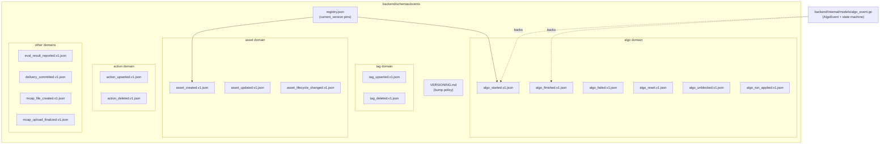
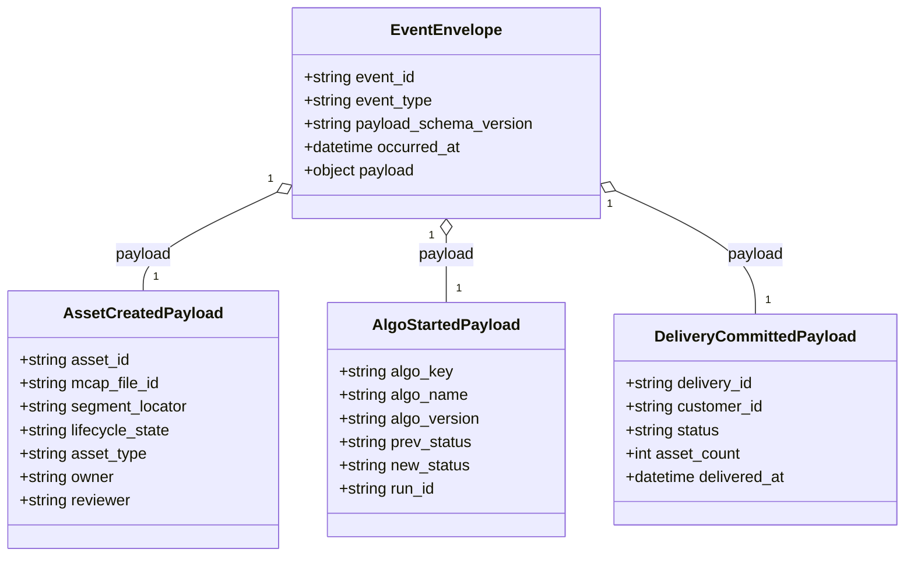
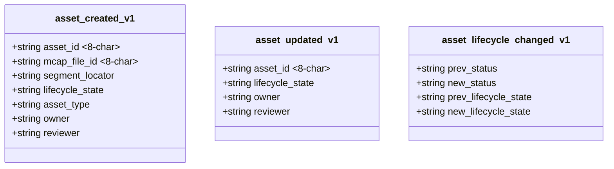
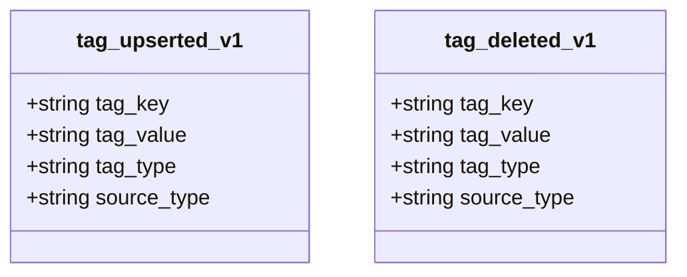
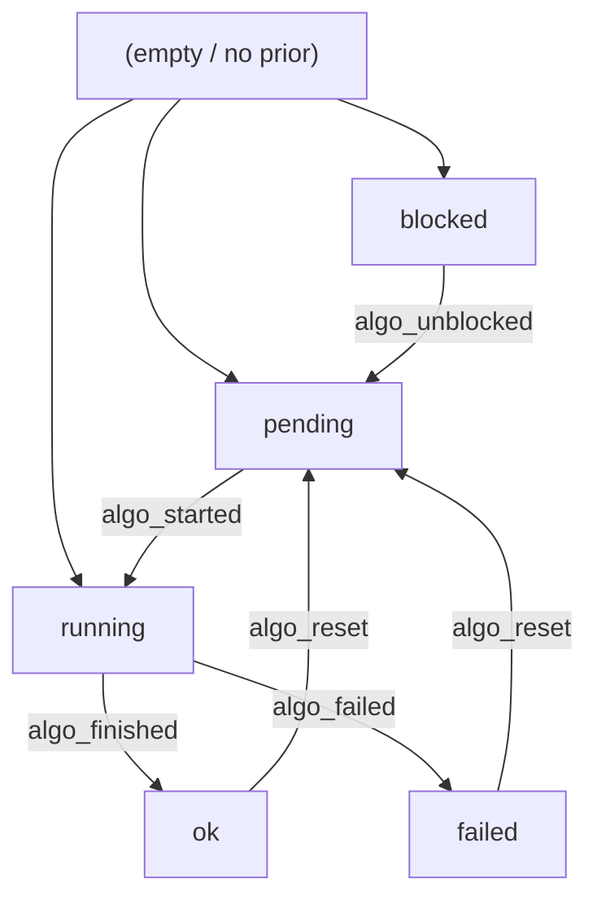
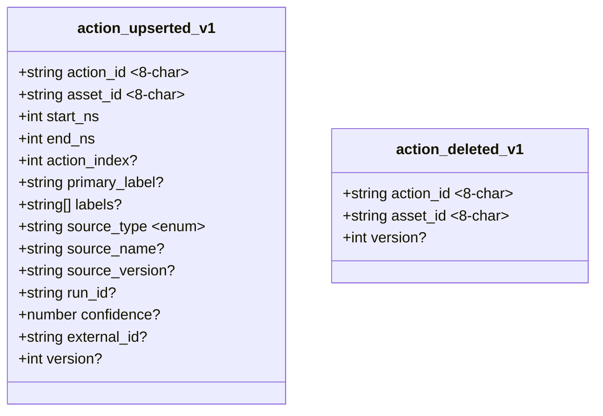
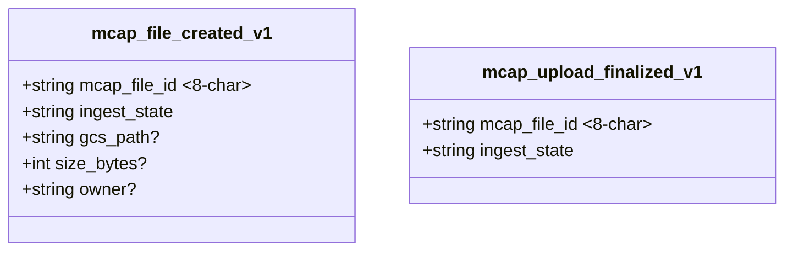
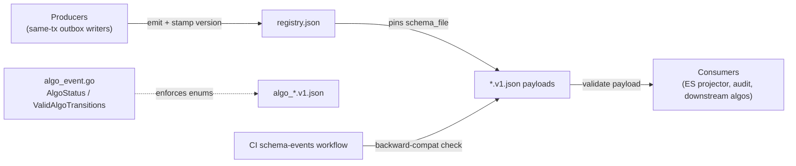

# Event Schemas

<cite>
**Referenced Files in This Document**

- [backend/schemas/events/VERSIONING.md](file://backend/schemas/events/VERSIONING.md)
- [backend/schemas/events/registry.json](file://backend/schemas/events/registry.json)
- [backend/schemas/events/asset_created.v1.json](file://backend/schemas/events/asset_created.v1.json)
- [backend/schemas/events/asset_updated.v1.json](file://backend/schemas/events/asset_updated.v1.json)
- [backend/schemas/events/asset_lifecycle_changed.v1.json](file://backend/schemas/events/asset_lifecycle_changed.v1.json)
- [backend/schemas/events/tag_upserted.v1.json](file://backend/schemas/events/tag_upserted.v1.json)
- [backend/schemas/events/tag_deleted.v1.json](file://backend/schemas/events/tag_deleted.v1.json)
- [backend/schemas/events/algo_started.v1.json](file://backend/schemas/events/algo_started.v1.json)
- [backend/schemas/events/algo_finished.v1.json](file://backend/schemas/events/algo_finished.v1.json)
- [backend/schemas/events/algo_failed.v1.json](file://backend/schemas/events/algo_failed.v1.json)
- [backend/schemas/events/algo_reset.v1.json](file://backend/schemas/events/algo_reset.v1.json)
- [backend/schemas/events/algo_unblocked.v1.json](file://backend/schemas/events/algo_unblocked.v1.json)
- [backend/schemas/events/algo_run_applied.v1.json](file://backend/schemas/events/algo_run_applied.v1.json)
- [backend/schemas/events/action_upserted.v1.json](file://backend/schemas/events/action_upserted.v1.json)
- [backend/schemas/events/action_deleted.v1.json](file://backend/schemas/events/action_deleted.v1.json)
- [backend/schemas/events/eval_result_reported.v1.json](file://backend/schemas/events/eval_result_reported.v1.json)
- [backend/schemas/events/delivery_committed.v1.json](file://backend/schemas/events/delivery_committed.v1.json)
- [backend/schemas/events/mcap_file_created.v1.json](file://backend/schemas/events/mcap_file_created.v1.json)
- [backend/schemas/events/mcap_upload_finalized.v1.json](file://backend/schemas/events/mcap_upload_finalized.v1.json)
- [backend/internal/models/algo_event.go](file://backend/internal/models/algo_event.go)
</cite>

## Table of Contents
1. [Introduction](#introduction)
2. [Project Structure](#project-structure)
3. [Core Components](#core-components)
4. [Architecture Overview](#architecture-overview)
5. [Detailed Component Analysis](#detailed-component-analysis)
6. [Dependency Analysis](#dependency-analysis)
7. [Performance Considerations](#performance-considerations)
8. [Troubleshooting Guide](#troubleshooting-guide)
9. [Conclusion](#conclusion)
10. [Appendices](#appendices)

## Introduction

The event schema catalog is the contract layer of the change-data-capture (CDC)
pipeline. Every meaningful state transition in the data platform — an asset being
created, an algorithm finishing, a delivery committing, an MCAP upload being
finalized — is emitted as a typed event whose payload is validated against a
JSON Schema (Draft-07) file under `backend/schemas/events/`. Producers write
these events in the **same transaction** as the underlying row mutation, so the
outbox row and the business-data write either both land or both roll back.
Consumers (the Elasticsearch projector, audit sinks, downstream algos) read the
events and rebuild their derived views deterministically.

Each event payload is described by a standalone schema file named
`<event_type>.v<N>.json`. A single source of truth, `registry.json`, pins the
**current version** that producers MUST emit for each event type, and
`VERSIONING.md` defines the minor/major bump policy that keeps the catalog
backward-compatible. This page enumerates every event type present in the
catalog, the fields and required-set of each payload, the common envelope shape
they share, and the versioning rules that govern their evolution.

**Section sources**
- [backend/schemas/events/registry.json](file://backend/schemas/events/registry.json#L1-L91)
- [backend/schemas/events/VERSIONING.md](file://backend/schemas/events/VERSIONING.md#L1-L9)

## Project Structure

All event contracts live in one flat directory. There is exactly one JSON Schema
file per event type and version, one registry, and one prose policy document.
The Go side contributes the typed model for the algorithm state machine that
backs the `algo_*` family of events.

**Diagram sources**
- [backend/schemas/events/registry.json](file://backend/schemas/events/registry.json#L4-L90)
- [backend/internal/models/algo_event.go](file://backend/internal/models/algo_event.go#L1-L54)

**Section sources**
- [backend/schemas/events/registry.json](file://backend/schemas/events/registry.json#L1-L91)
- [backend/internal/models/algo_event.go](file://backend/internal/models/algo_event.go#L1-L54)

## Core Components

The catalog has three structural pieces:

- **The schema files** — 17 Draft-07 JSON Schemas, each describing the *payload*
  of one event type. Every schema is an `object` with `additionalProperties:
  true` and a `required` array; the `$id` and `title` carry the versioned
  identity (for example `"title": "asset_created.v1"`). The `additionalProperties:
  true` setting is deliberate: it lets minor schema bumps add optional fields
  without breaking consumers that have not yet been updated.
- **The registry** — `registry.json` maps every `event_type` to its
  `current_version`, its `schema_file`, and a one-line semantic description of
  when the event fires. This is the authoritative list of which version a
  producer must stamp into the envelope's `payload_schema_version`.
- **The versioning policy** — `VERSIONING.md` codifies minor (in-place, optional
  fields only) versus major (new file, version increment) bumps and the CI
  checks that enforce backward compatibility.

The `algo_*` event family is additionally backed by Go types. `AlgoEvent`
mirrors a row in the `asset_algo_events` table, and the `AlgoStatus` constants
plus `ValidAlgoTransitions` encode the legal state machine that the
`prev_status`/`new_status` enums in the algo schemas reflect.

**Section sources**
- [backend/schemas/events/asset_created.v1.json](file://backend/schemas/events/asset_created.v1.json#L1-L47)
- [backend/schemas/events/registry.json](file://backend/schemas/events/registry.json#L1-L91)
- [backend/internal/models/algo_event.go](file://backend/internal/models/algo_event.go#L5-L53)

## Architecture Overview

Every schema file describes only the **payload** — the domain-specific body of
an event. At runtime a payload is wrapped in a common envelope that the CDC
pipeline owns (event id, type, the `payload_schema_version` that points back
into `registry.json`, occurrence time, and the payload object itself). The
envelope's `payload_schema_version` is exactly the `current_version` value the
registry pins for that `event_type`; consumers use the pair
`(event_type, payload_schema_version)` to select the correct schema file when
validating.

The envelope fields above (`event_id`, `event_type`, `payload_schema_version`,
`occurred_at`, `payload`) represent the wrapper supplied by the CDC producer;
the catalog files in this page describe only the `payload` slot. The three
payload classes shown are illustrative — every event type listed in the
[Appendices](#appendices) plugs into the same envelope.

**Diagram sources**
- [backend/schemas/events/asset_created.v1.json](file://backend/schemas/events/asset_created.v1.json#L8-L46)
- [backend/schemas/events/algo_started.v1.json](file://backend/schemas/events/algo_started.v1.json#L8-L38)
- [backend/schemas/events/delivery_committed.v1.json](file://backend/schemas/events/delivery_committed.v1.json#L8-L34)

## Detailed Component Analysis

The catalog groups naturally into six domains: asset, tag, algo, action, eval,
delivery, and mcap. Each subsection below enumerates the **exact** fields,
required-set, and notable constraints of the schemas present in the repository.

#### Asset domain

Three event types track the lifecycle of an asset row.

`asset_created.v1` fires in the same transaction as the assets insert. It
requires `asset_id`, `mcap_file_id`, `segment_locator`, `lifecycle_state`,
`asset_type`, `owner`, and `reviewer`. Both `asset_id` and `mcap_file_id` are
constrained to the 8-character alphanumeric pattern `^[0-9A-Za-z]{8}$`.

`asset_updated.v1` fires when mutable asset fields change, in the same
transaction as the assets update. Its required set is narrower:
`asset_id`, `lifecycle_state`, `owner`, `reviewer`. `asset_id` carries the same
8-char pattern.

`asset_lifecycle_changed.v1` is a pure transition event. Unusually for the asset
domain, it does **not** carry `asset_id` in its payload; it requires the
before/after pair `prev_status`, `new_status`, `prev_lifecycle_state`,
`new_lifecycle_state` (all plain strings).

**Diagram sources**
- [backend/schemas/events/asset_created.v1.json](file://backend/schemas/events/asset_created.v1.json#L8-L46)
- [backend/schemas/events/asset_updated.v1.json](file://backend/schemas/events/asset_updated.v1.json#L8-L30)
- [backend/schemas/events/asset_lifecycle_changed.v1.json](file://backend/schemas/events/asset_lifecycle_changed.v1.json#L8-L29)

**Section sources**
- [backend/schemas/events/asset_created.v1.json](file://backend/schemas/events/asset_created.v1.json#L1-L47)
- [backend/schemas/events/asset_updated.v1.json](file://backend/schemas/events/asset_updated.v1.json#L1-L31)
- [backend/schemas/events/asset_lifecycle_changed.v1.json](file://backend/schemas/events/asset_lifecycle_changed.v1.json#L1-L30)

#### Tag domain

Two symmetric event types record tag mutations on an asset. Both
`tag_upserted.v1` and `tag_deleted.v1` share the identical required set:
`tag_key`, `tag_value`, `tag_type`, `source_type` (all strings). The only
difference is semantic: `tag_upserted` is emitted on create-or-update, while
`tag_deleted` is emitted on deletion (its field descriptions read "Deleted tag
key", etc., and `source_type` is the source type "recorded at deletion time").

**Diagram sources**
- [backend/schemas/events/tag_upserted.v1.json](file://backend/schemas/events/tag_upserted.v1.json#L8-L31)
- [backend/schemas/events/tag_deleted.v1.json](file://backend/schemas/events/tag_deleted.v1.json#L8-L31)

**Section sources**
- [backend/schemas/events/tag_upserted.v1.json](file://backend/schemas/events/tag_upserted.v1.json#L1-L32)
- [backend/schemas/events/tag_deleted.v1.json](file://backend/schemas/events/tag_deleted.v1.json#L1-L32)

#### Algo domain

Six event types describe the algorithm state machine on an asset. Five of them
(`algo_started`, `algo_finished`, `algo_failed`, `algo_reset`, `algo_unblocked`)
share the same shape: required `algo_key`, `algo_name`, `algo_version`,
`prev_status`, and `new_status`, where `algo_key` is the versioned key
`<name>@<version>`. The `prev_status`/`new_status` fields are **enum-constrained**
to encode exactly the transition each event represents:

- `algo_started.v1` — `prev_status ∈ {"", "pending"}` → `new_status = "running"`;
  optional `run_id`.
- `algo_finished.v1` — `prev_status = "running"` → `new_status = "ok"`;
  optional `run_id`.
- `algo_failed.v1` — `prev_status = "running"` → `new_status = "failed"`; **also
  requires** `reason` (non-empty failure reason); optional `run_id` and
  `failure_mode` (classification: `timeout|algo_error|sensor_fault|env_mismatch|low_quality|annotation_drift|unknown`).
- `algo_reset.v1` — `prev_status ∈ {"ok", "failed"}` → `new_status = "pending"`.
- `algo_unblocked.v1` — `prev_status = "blocked"` → `new_status = "pending"`.

The sixth, `algo_run_applied.v1`, has a distinct shape: it requires `run_id`
(a 16-character alphanumeric run identifier), `algo_name`, `algo_version`, and
`new_status ∈ {"ok", "failed"}`. It is emitted when a registered algo run is
applied to an asset via finish; it carries no `prev_status` or `algo_key`.

These enums are the schema-level mirror of the Go state machine in
`algo_event.go`. `ValidAlgoTransitions` declares the legal moves —
empty/blocked/pending/running/ok/failed — and the per-event enums above are
exactly the subset of those moves that each event names.

**Diagram sources**
- [backend/internal/models/algo_event.go](file://backend/internal/models/algo_event.go#L23-L53)
- [backend/schemas/events/algo_started.v1.json](file://backend/schemas/events/algo_started.v1.json#L26-L33)
- [backend/schemas/events/algo_finished.v1.json](file://backend/schemas/events/algo_finished.v1.json#L26-L33)
- [backend/schemas/events/algo_failed.v1.json](file://backend/schemas/events/algo_failed.v1.json#L27-L34)

**Section sources**
- [backend/schemas/events/algo_started.v1.json](file://backend/schemas/events/algo_started.v1.json#L1-L39)
- [backend/schemas/events/algo_finished.v1.json](file://backend/schemas/events/algo_finished.v1.json#L1-L38)
- [backend/schemas/events/algo_failed.v1.json](file://backend/schemas/events/algo_failed.v1.json#L1-L47)
- [backend/schemas/events/algo_reset.v1.json](file://backend/schemas/events/algo_reset.v1.json#L1-L35)
- [backend/schemas/events/algo_unblocked.v1.json](file://backend/schemas/events/algo_unblocked.v1.json#L1-L35)
- [backend/schemas/events/algo_run_applied.v1.json](file://backend/schemas/events/algo_run_applied.v1.json#L1-L25)
- [backend/internal/models/algo_event.go](file://backend/internal/models/algo_event.go#L18-L53)

#### Action domain

Two event types keep the seg Elasticsearch document's nested `actions[]` field in
sync. Both are written same-transaction with the `actions` write so consumers can
rebuild the seg ES doc deterministically.

`action_upserted.v1` requires `action_id`, `asset_id`, `start_ns`, `end_ns`, and
`source_type`. `action_id` and `asset_id` follow the 8-char alphanumeric
pattern; `asset_id` MUST reference an `assets.asset_id` whose `asset_type =
'segment'`. `start_ns`/`end_ns` are a half-open nanosecond interval
(`end_ns >= start_ns`) on the same scale as `assets.start_timestamp_ns`.
`source_type` is enum-constrained to `{"human", "algo", "rule", "system"}`.
Optional fields include `action_index`, `primary_label`, `labels` (string array,
GIN-indexed in PG and mirrored to ES), `source_name`, `source_version`,
`run_id`, `confidence`, `external_id` (producer-side idempotency fingerprint),
and `version` (optimistic-lock version of the row after the write).

`action_deleted.v1` is emitted on soft-delete and requires only `action_id` and
`asset_id` (both 8-char patterned), plus an optional `version`.

**Diagram sources**
- [backend/schemas/events/action_upserted.v1.json](file://backend/schemas/events/action_upserted.v1.json#L8-L72)
- [backend/schemas/events/action_deleted.v1.json](file://backend/schemas/events/action_deleted.v1.json#L8-L23)

**Section sources**
- [backend/schemas/events/action_upserted.v1.json](file://backend/schemas/events/action_upserted.v1.json#L1-L73)
- [backend/schemas/events/action_deleted.v1.json](file://backend/schemas/events/action_deleted.v1.json#L1-L24)

#### Eval domain

`eval_result_reported.v1` is emitted after an eval result write succeeds and
carries metadata for downstream indexing and audit. It requires
`eval_result_id` (UUID, the primary key of `asset_eval_results`), `eval_name`,
`eval_version`, `status`, and `metric_keys` (array of strings — the queryable
metric keys projected from `result_payload`). Optional fields are
`parameter_version` and `run_id` (both nullable strings).

**Section sources**
- [backend/schemas/events/eval_result_reported.v1.json](file://backend/schemas/events/eval_result_reported.v1.json#L1-L44)

#### Delivery domain

`delivery_committed.v1` is emitted when delivery commit writes complete for one
or more assets. It requires `delivery_id` (UUID), `customer_id`, `status`,
`asset_count` (integer), and `delivered_at` (nullable RFC date-time string).

**Section sources**
- [backend/schemas/events/delivery_committed.v1.json](file://backend/schemas/events/delivery_committed.v1.json#L1-L35)

#### MCAP domain

Two event types track MCAP file ingestion. Both require `mcap_file_id` (8-char
alphanumeric) and `ingest_state`.

`mcap_file_created.v1` fires when an MCAP file metadata row is created. Beyond
the required pair it carries optional `gcs_path`, `size_bytes` (integer), and
`owner`.

`mcap_upload_finalized.v1` fires when an MCAP upload is finalized and ingest
state advances; its payload is just the required `mcap_file_id` and
`ingest_state` with no extra optional fields.

**Diagram sources**
- [backend/schemas/events/mcap_file_created.v1.json](file://backend/schemas/events/mcap_file_created.v1.json#L8-L31)
- [backend/schemas/events/mcap_upload_finalized.v1.json](file://backend/schemas/events/mcap_upload_finalized.v1.json#L8-L22)

**Section sources**
- [backend/schemas/events/mcap_file_created.v1.json](file://backend/schemas/events/mcap_file_created.v1.json#L1-L32)
- [backend/schemas/events/mcap_upload_finalized.v1.json](file://backend/schemas/events/mcap_upload_finalized.v1.json#L1-L23)

## Dependency Analysis

The schema catalog sits between producers and consumers and is referenced by
both through the registry.

Key relationships:

- **Producers depend on `registry.json`** to learn which `current_version` to
  stamp into `payload_schema_version`.
- **Consumers depend on the schema files** keyed by `(event_type, version)` to
  validate and parse payloads. `additionalProperties: true` means a consumer can
  safely ignore optional fields added by a later minor bump.
- **The algo schemas depend on the Go state machine** in `algo_event.go` for the
  meaning of their `prev_status`/`new_status` enums; the enums and
  `ValidAlgoTransitions` must stay aligned.
- **CI depends on both** the schema files and `registry.json` — the
  `schema-events` workflow validates syntax and enforces backward compatibility.

**Section sources**
- [backend/schemas/events/registry.json](file://backend/schemas/events/registry.json#L1-L91)
- [backend/schemas/events/VERSIONING.md](file://backend/schemas/events/VERSIONING.md#L95-L107)
- [backend/internal/models/algo_event.go](file://backend/internal/models/algo_event.go#L43-L53)

## Performance Considerations

The schema layer is a validation contract, not a hot data path, but a few design
choices matter for throughput and indexability:

- **Same-transaction emission.** Asset, action, and tag events are written in the
  same transaction as the row mutation. This guarantees exactly-once consistency
  between the business write and the outbox row, at the cost of a slightly larger
  transaction. Schema validation itself happens off the write path, at consume
  time.
- **`additionalProperties: true` everywhere.** Every catalog schema allows
  unknown fields. This lets minor version bumps add optional fields without a
  coordinated producer/consumer deploy, avoiding a costly lockstep migration.
- **Projection-friendly fields.** `eval_result_reported.metric_keys` and
  `action_upserted.labels` are deliberately denormalized into the event so the
  consumer can build queryable/GIN-indexed fields without re-reading the source
  row, reducing read amplification in the ES projector.
- **8-char identifiers.** Asset, action, MCAP, and file identifiers use a fixed
  8-character alphanumeric pattern, keeping keys compact and uniformly indexable.

**Section sources**
- [backend/schemas/events/action_upserted.v1.json](file://backend/schemas/events/action_upserted.v1.json#L42-L46)
- [backend/schemas/events/eval_result_reported.v1.json](file://backend/schemas/events/eval_result_reported.v1.json#L36-L42)
- [backend/schemas/events/asset_created.v1.json](file://backend/schemas/events/asset_created.v1.json#L18-L26)

## Troubleshooting Guide

Common failure modes specific to the event schema catalog and how to diagnose
them:

- **Payload fails validation against its schema.** Check that the producer
  stamped the `payload_schema_version` that `registry.json` pins for that
  `event_type`. A mismatch (for example emitting `v1` after a major bump to `v2`)
  selects the wrong schema file.
- **A new required field broke consumers.** Adding a `required` field is a
  **major** change per `VERSIONING.md` and must create a new `*.v2.json` file plus
  a `registry.json` update — it is never an in-place edit. The CI `schema-events`
  workflow fails the build if a new required field appears in an existing version.
- **Algo event rejected by enum.** The `prev_status`/`new_status` enums encode the
  exact legal transition. An `algo_finished` with `prev_status` other than
  `running`, or an `algo_failed` missing `reason`, is invalid. Cross-check against
  `ValidAlgoTransitions` in `algo_event.go`.
- **`action_upserted` rejected on `source_type`.** Only `human`, `algo`, `rule`,
  and `system` are accepted; any other value fails validation.
- **`asset_lifecycle_changed` missing `asset_id`.** This is expected — the schema
  does not require it. If a consumer needs the asset id, it must read it from the
  envelope, not the payload.
- **Registry/file drift.** If `registry.json` names a `schema_file` that does not
  exist (or vice versa), producers cannot resolve the current version. Keep the
  registry entry and the file in lockstep on every bump.

**Section sources**
- [backend/schemas/events/VERSIONING.md](file://backend/schemas/events/VERSIONING.md#L12-L107)
- [backend/schemas/events/algo_failed.v1.json](file://backend/schemas/events/algo_failed.v1.json#L8-L41)
- [backend/schemas/events/action_upserted.v1.json](file://backend/schemas/events/action_upserted.v1.json#L47-L50)

## Conclusion

The event schema catalog is a compact, strongly-typed contract surface: 17 event
types across the asset, tag, algo, action, eval, delivery, and mcap domains, each
a Draft-07 JSON Schema validating only its payload, all wrapped in a shared CDC
envelope. `registry.json` is the single source of truth for current versions, and
`VERSIONING.md` keeps the catalog backward-compatible by separating in-place
minor bumps (optional fields only) from new-file major bumps. The `algo_*` family
is uniquely tied to the Go state machine in `algo_event.go`, whose transitions are
mirrored by the per-event `prev_status`/`new_status` enums. Together these pieces
let producers emit and consumers rebuild derived state deterministically.

## Appendices

### Event type catalog

All event types currently registered, with their pinned version, schema file, and
required-field set. Versions are taken verbatim from `registry.json`.

| Domain | Event type | Version | Schema file | Required fields |
|---|---|---|---|---|
| asset | `asset_created` | v1 | `asset_created.v1.json` | asset_id, mcap_file_id, segment_locator, lifecycle_state, asset_type, owner, reviewer |
| asset | `asset_updated` | v1 | `asset_updated.v1.json` | asset_id, lifecycle_state, owner, reviewer |
| asset | `asset_lifecycle_changed` | v1 | `asset_lifecycle_changed.v1.json` | prev_status, new_status, prev_lifecycle_state, new_lifecycle_state |
| tag | `tag_upserted` | v1 | `tag_upserted.v1.json` | tag_key, tag_value, tag_type, source_type |
| tag | `tag_deleted` | v1 | `tag_deleted.v1.json` | tag_key, tag_value, tag_type, source_type |
| algo | `algo_started` | v1 | `algo_started.v1.json` | algo_key, algo_name, algo_version, prev_status, new_status |
| algo | `algo_finished` | v1 | `algo_finished.v1.json` | algo_key, algo_name, algo_version, prev_status, new_status |
| algo | `algo_failed` | v1 | `algo_failed.v1.json` | algo_key, algo_name, algo_version, prev_status, new_status, reason |
| algo | `algo_reset` | v1 | `algo_reset.v1.json` | algo_key, algo_name, algo_version, prev_status, new_status |
| algo | `algo_unblocked` | v1 | `algo_unblocked.v1.json` | algo_key, algo_name, algo_version, prev_status, new_status |
| algo | `algo_run_applied` | v1 | `algo_run_applied.v1.json` | run_id, algo_name, algo_version, new_status |
| action | `action_upserted` | v1 | `action_upserted.v1.json` | action_id, asset_id, start_ns, end_ns, source_type |
| action | `action_deleted` | v1 | `action_deleted.v1.json` | action_id, asset_id |
| eval | `eval_result_reported` | v1 | `eval_result_reported.v1.json` | eval_result_id, eval_name, eval_version, status, metric_keys |
| delivery | `delivery_committed` | v1 | `delivery_committed.v1.json` | delivery_id, customer_id, status, asset_count, delivered_at |
| mcap | `mcap_file_created` | v1 | `mcap_file_created.v1.json` | mcap_file_id, ingest_state |
| mcap | `mcap_upload_finalized` | v1 | `mcap_upload_finalized.v1.json` | mcap_file_id, ingest_state |

### Algo status enum and transitions

From `algo_event.go`:

| Constant | Value |
|---|---|
| `AlgoStatusBlocked` | `blocked` |
| `AlgoStatusPending` | `pending` |
| `AlgoStatusRunning` | `running` |
| `AlgoStatusOk` | `ok` |
| `AlgoStatusFailed` | `failed` |

| Current status | Allowed next |
|---|---|
| `""` (first time) | blocked, pending, running |
| blocked | pending |
| pending | running |
| running | ok, failed |
| failed | pending |
| ok | pending |

The `AlgoEvent` struct fields are `event_id`, `asset_id`, `algo_key`,
`prev_status` (nullable), `new_status`, `run_id` (nullable), `reason` (nullable),
`created_at`. Algo flat-key field suffixes are `status`, `started_at`,
`finished_at`, `method`, `run_id`, `output_uri`, `reason` (key pattern
`<algo>@<ver>:<field>`).

**Section sources**
- [backend/internal/models/algo_event.go](file://backend/internal/models/algo_event.go#L7-L53)

### Versioning policy summary

| Bump type | Trigger | Effect on file | Effect on registry |
|---|---|---|---|
| Minor (backward-compatible) | Add **optional** field; no type change; no removal; keep `additionalProperties: true` | Same `vN` file edited in place | No change |
| Major (breaking) | Add **required** field; change a field type; remove or rename a field | New `v(N+1)` file; old file kept for historical consumers | `current_version` + `schema_file` updated; producers emit new `payload_schema_version` |

**Section sources**
- [backend/schemas/events/VERSIONING.md](file://backend/schemas/events/VERSIONING.md#L12-L107)
- [backend/schemas/events/registry.json](file://backend/schemas/events/registry.json#L1-L91)
