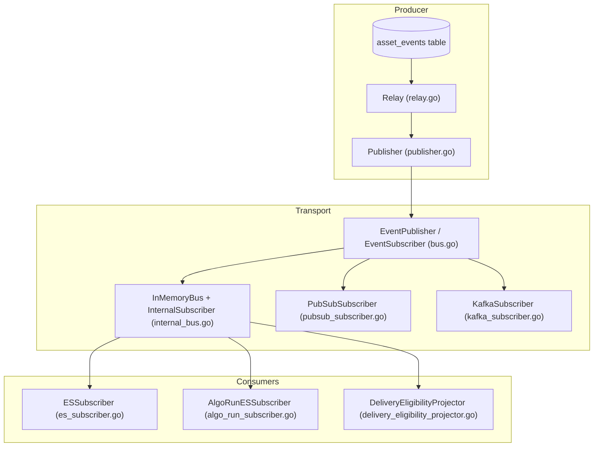
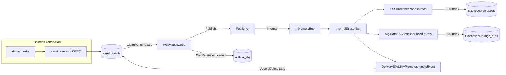
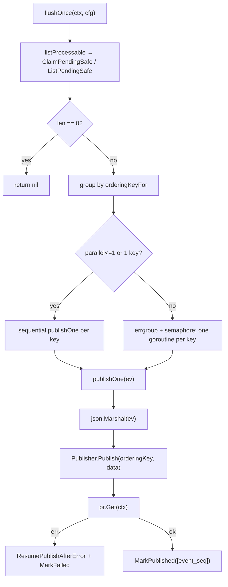
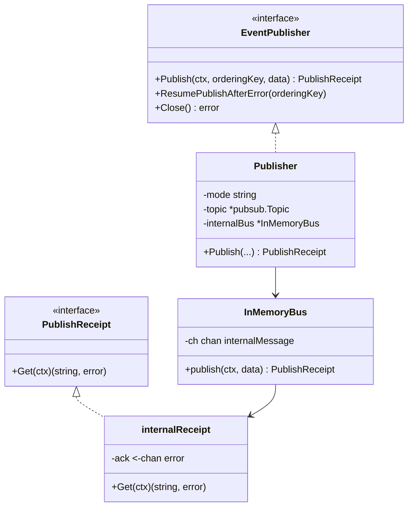
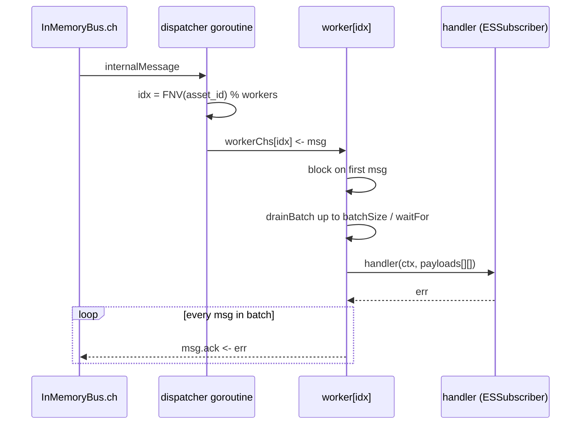
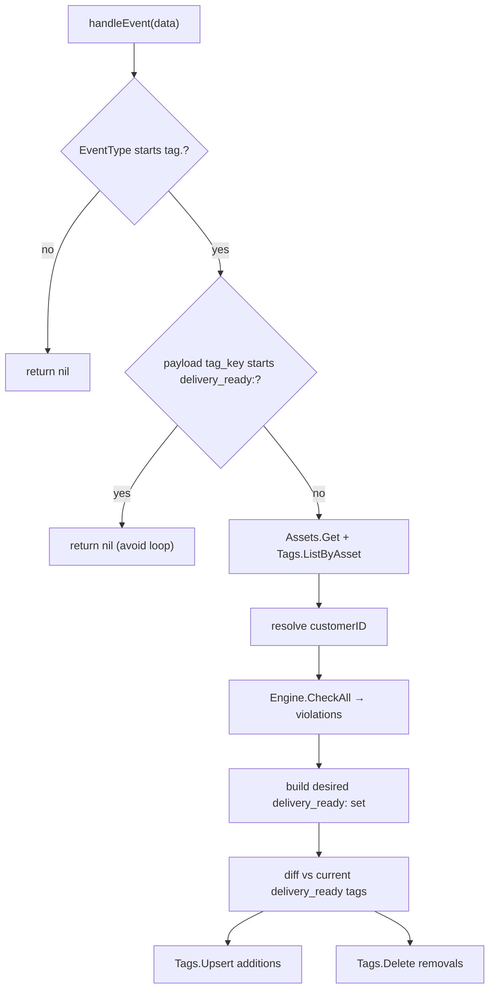
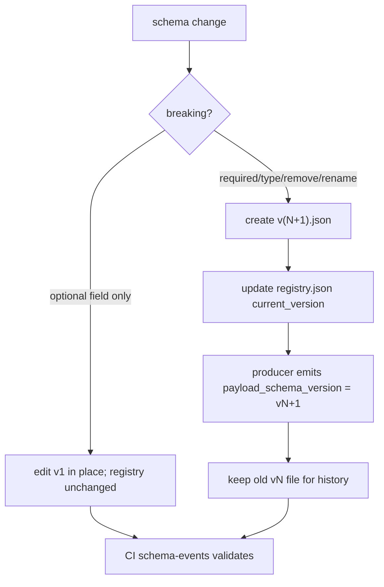
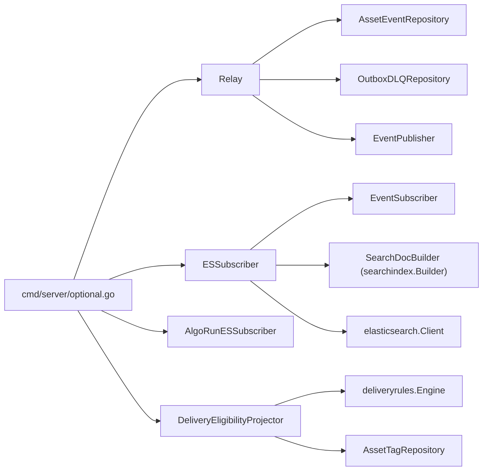

# Event Processing & CDC Module

<cite>
**Referenced Files in This Document**

- [backend/internal/outbox/algo_run_subscriber.go](file://backend/internal/outbox/algo_run_subscriber.go)
- [backend/internal/outbox/bus.go](file://backend/internal/outbox/bus.go)
- [backend/internal/outbox/delivery_eligibility_projector.go](file://backend/internal/outbox/delivery_eligibility_projector.go)
- [backend/internal/outbox/es_subscriber.go](file://backend/internal/outbox/es_subscriber.go)
- [backend/internal/outbox/internal_bus.go](file://backend/internal/outbox/internal_bus.go)
- [backend/internal/outbox/kafka_subscriber.go](file://backend/internal/outbox/kafka_subscriber.go)
- [backend/internal/outbox/publisher.go](file://backend/internal/outbox/publisher.go)
- [backend/internal/outbox/pubsub_subscriber.go](file://backend/internal/outbox/pubsub_subscriber.go)
- [backend/internal/outbox/relay.go](file://backend/internal/outbox/relay.go)
- [backend/internal/models/schema_evolution.go](file://backend/internal/models/schema_evolution.go)
- [backend/internal/repository/common.go](file://backend/internal/repository/common.go)
- [backend/cmd/server/optional.go](file://backend/cmd/server/optional.go)
- [backend/schemas/events/registry.json](file://backend/schemas/events/registry.json)
- [backend/schemas/events/VERSIONING.md](file://backend/schemas/events/VERSIONING.md)
</cite>

## Table of Contents
1. [Introduction](#introduction)
2. [Project Structure](#project-structure)
3. [Core Components](#core-components)
4. [Architecture Overview](#architecture-overview)
5. [Detailed Component Analysis](#detailed-component-analysis)
6. [Dependency Analysis](#dependency-analysis)
7. [Performance Considerations](#performance-considerations)
8. [Troubleshooting Guide](#troubleshooting-guide)
9. [Conclusion](#conclusion)
10. [Appendices](#appendices)

## Introduction

The Event Processing & CDC module is the change-data-capture spine of cyber-databrew. Every mutation to a domain aggregate — assets, tags, MCAP files, actions, and algorithm runs — is recorded as a row in the `asset_events` outbox table in the *same database transaction* as the business write. A background **relay** then reads those rows and publishes them to a configurable message **bus**; one or more **subscribers** consume from the bus and project the events into downstream read models (Elasticsearch search documents, delivery-readiness tags, and so on).

This is the classic *transactional outbox* pattern: the outbox row and the business state commit atomically, so an event can never be lost even if the process crashes immediately after the commit. Delivery to the bus is *at-least-once* and the consumers are *idempotent*, which together give effectively-once projection without distributed transactions.

The module is deliberately transport-agnostic. The same relay and subscriber code runs over an in-process Go channel (`internal` mode, the default for local and single-node deployments), Google Cloud Pub/Sub (`pubsub`), or Kafka (`kafka`). The transport is chosen at startup by the `OUTBOX_TRANSPORT` configuration value and the rest of the system is unaware of the choice.

The package lives under `backend/internal/outbox`. Event payload shapes are versioned JSON Schemas under `backend/schemas/events`, pinned by `registry.json` and governed by `VERSIONING.md`.

**Section sources**
- [backend/internal/outbox/relay.go](file://backend/internal/outbox/relay.go#L47-L115)
- [backend/internal/models/schema_evolution.go](file://backend/internal/models/schema_evolution.go#L55-L74)
- [backend/schemas/events/VERSIONING.md](file://backend/schemas/events/VERSIONING.md#L1-L42)

## Project Structure

The outbox package groups the producer-side relay, the transport abstraction, the concrete transports, and the consumer-side subscribers/projectors. Event schemas live in a sibling directory.

- `relay.go` — the polling relay that claims pending outbox rows and publishes them. Owns `RelayConfig`, batching, ordering-key grouping, retry/DLQ handling, and progress logging.
- `bus.go` — the transport-neutral interfaces: `EventPublisher`, `EventSubscriber`, the optional `BatchEventSubscriber`, and `PublishReceipt`.
- `publisher.go` — a single `Publisher` type that fronts Pub/Sub, Kafka, or the in-memory bus, selected by an internal `mode` field.
- `internal_bus.go` — `InMemoryBus` plus `InternalSubscriber`, the default in-process channel transport with per-routing-key worker sharding and batch draining.
- `pubsub_subscriber.go` — `PubSubSubscriber`, the Google Pub/Sub consumer.
- `kafka_subscriber.go` — `KafkaSubscriber`, a stub that is not compiled into this build.
- `es_subscriber.go` — `ESSubscriber`, the primary projector that rebuilds asset search documents into Elasticsearch.
- `algo_run_subscriber.go` — `AlgoRunESSubscriber`, projects `algo_run` events into the `algo_runs` ES index.
- `delivery_eligibility_projector.go` — `DeliveryEligibilityProjector`, projects tag changes into `delivery_ready:*` tags.
- `backend/schemas/events/*.json` — per-event-type JSON Schemas; `registry.json` pins the current version; `VERSIONING.md` is the change procedure.

**Diagram sources**
- [backend/internal/outbox/relay.go](file://backend/internal/outbox/relay.go#L47-L54)
- [backend/internal/outbox/bus.go](file://backend/internal/outbox/bus.go#L13-L50)
- [backend/internal/outbox/publisher.go](file://backend/internal/outbox/publisher.go#L12-L53)
- [backend/internal/outbox/internal_bus.go](file://backend/internal/outbox/internal_bus.go#L14-L82)

**Section sources**
- [backend/internal/outbox/bus.go](file://backend/internal/outbox/bus.go#L1-L64)
- [backend/cmd/server/optional.go](file://backend/cmd/server/optional.go#L55-L294)

## Core Components

### The outbox row: `models.AssetEvent`

Every event is a row in `asset_events`, modelled by `AssetEvent`. The key fields are the monotonically increasing `EventSeq` (the relay's ordering and watermark cursor), the `EventType` (e.g. `tag.added`, `asset_created`), the `AggregateType` (`asset`, `algo_run`, …), the `PayloadSchemaVersion` (the `v<N>` pinned in `registry.json`), the aggregate identity columns `AssetID` / `McapFileID`, the raw `EventPayload`, and the delivery bookkeeping fields `PublishState`, `RetryCount`, `LastError`, `OccurredAt`, `CreatedAt`, and `PublishedAt`.

### `RelayConfig` and `Relay`

`Relay` owns the producer-side loop. It depends on an `AssetEventRepository` (the outbox table), an optional `OutboxDLQRepository` (dead-letter archive), and an `EventPublisher`. `RelayConfig` controls batch size, poll interval, the safety lag horizon, processing lease, retry ceiling, periodic DLQ cadence, and per-key parallelism. `DefaultRelayConfig` supplies conservative values (batch 200, interval 500ms, safety lag 2s, lease 30s, max retries 20, DLQ every 20 batches, 8 parallel ordering keys).

### Transport interfaces (`bus.go`)

`EventPublisher` exposes `Publish`, `ResumePublishAfterError`, and `Close`. `EventSubscriber` exposes a single-message `Receive` loop and `Close`. `BatchEventSubscriber` is an optional extension that adds `ReceiveBatch` for short-window batching; only `InternalSubscriber` implements it, enforced by the compile-time assertion `var _ BatchEventSubscriber = (*InternalSubscriber)(nil)`.

### Publisher and transports

A single `Publisher` struct multiplexes three transports via its `mode` field: `pubsub` (real Google Pub/Sub topic), `kafka` (returns a not-compiled error), and `internal` (the in-process `InMemoryBus`). On the consumer side, `InternalSubscriber`, `PubSubSubscriber`, and `KafkaSubscriber` implement `EventSubscriber`.

### Subscribers / projectors

- `ESSubscriber` rebuilds the full asset search document from PostgreSQL and writes it to Elasticsearch with `ExternalVersion = event_seq`.
- `AlgoRunESSubscriber` filters `aggregate_type == "algo_run"` events and projects them into the `algo_runs` index.
- `DeliveryEligibilityProjector` reacts to `tag.*` events and reconciles `delivery_ready:*` tags against active delivery rules.

**Section sources**
- [backend/internal/models/schema_evolution.go](file://backend/internal/models/schema_evolution.go#L55-L74)
- [backend/internal/outbox/relay.go](file://backend/internal/outbox/relay.go#L19-L54)
- [backend/internal/outbox/bus.go](file://backend/internal/outbox/bus.go#L8-L63)
- [backend/internal/outbox/publisher.go](file://backend/internal/outbox/publisher.go#L12-L53)

## Architecture Overview

At startup, `backend/cmd/server/optional.go` reads `OUTBOX_TRANSPORT` (defaulting to `internal`) and conditionally wires the relay and subscribers based on `OUTBOX_RELAY_ENABLED`, `OUTBOX_ES_SUBSCRIBER_ENABLED`, and `DELIVERY_ELIGIBILITY_PROJECTOR_ENABLED`. For `internal` mode, a single `InMemoryBus` is lazily created via `getInMemoryBus()` and shared by the publisher and every subscriber, so all consumers fan out from one in-process channel.

The relay and each subscriber run as independent goroutines under a shared `outboxCtx`. The relay claims rows, marks them `processing`, publishes, and marks them `published` on success or increments `retry_count` on failure. Subscribers consume, project, and ack; on handler error they nack (Pub/Sub) or surface the error through the receipt (internal bus), and the relay retries that `event_seq`.

**Diagram sources**
- [backend/cmd/server/optional.go](file://backend/cmd/server/optional.go#L55-L294)
- [backend/internal/outbox/relay.go](file://backend/internal/outbox/relay.go#L117-L227)
- [backend/internal/outbox/internal_bus.go](file://backend/internal/outbox/internal_bus.go#L84-L136)
- [backend/internal/outbox/es_subscriber.go](file://backend/internal/outbox/es_subscriber.go#L100-L114)

**Section sources**
- [backend/cmd/server/optional.go](file://backend/cmd/server/optional.go#L55-L294)
- [backend/internal/outbox/relay.go](file://backend/internal/outbox/relay.go#L56-L115)

## Detailed Component Analysis

### The relay loop

`Relay.Run` normalizes `RelayConfig` (clamping non-positive values back to the conservative defaults), starts a poll `ticker` and an optional `progressTicker`, performs one immediate `flushOnce` so startup does not wait a full tick, then loops on `ctx.Done()`, the poll tick, and the progress tick. Every `DLQEveryNBatches` flush cycles it calls `DLQ.MoveToDLQ(ctx, MaxRetries)` to archive permanently failed rows.

`flushOnce` instruments its duration with `OutboxRelayFlushDurationSeconds`, lists processable events, groups them by ordering key, and publishes. Ordering keys come from `orderingKeyFor`: the `AssetID` if present, otherwise `mcap:<McapFileID>`, otherwise `_na`. Events sharing a key are always published serially in `event_seq` order; distinct keys may be processed concurrently up to `ParallelOrderingKeys`, bounded by a `semaphore.Weighted` inside an `errgroup`. When parallelism is 1 or there is a single key, a simple sequential loop runs.

`listProcessable` prefers a `ClaimPendingSafe` call when the repository implements the `pendingClaimer` interface (claim-and-lease semantics with a processing lease); otherwise it falls back to `ListPendingSafe`. The safety lag means only rows whose `occurred_at` is older than `now()-SafetyLag` are visible, which avoids racing in-flight transactions that have not yet committed their sequence.

`publishOne` is the per-event critical section: skip nil events; mark failed when no publisher is configured; skip rows already past `MaxRetries`; JSON-marshal the event; compute the ordering key; `Publish`; block on `pr.Get(ctx)` for the async ack. On any error it calls `ResumePublishAfterError(orderingKey)` (so a Pub/Sub ordered key is not permanently blocked) and `MarkFailed`. On success it calls `MarkPublished([]int64{event_seq})`, increments `OutboxRelayPublishedTotal`, and observes `OutboxEventLagSeconds` from `CreatedAt`.

**Diagram sources**
- [backend/internal/outbox/relay.go](file://backend/internal/outbox/relay.go#L117-L227)

**Section sources**
- [backend/internal/outbox/relay.go](file://backend/internal/outbox/relay.go#L56-L250)
- [backend/internal/repository/common.go](file://backend/internal/repository/common.go#L165-L208)

### Publisher and the in-memory bus

`NewPublisher` constructs a Pub/Sub-backed publisher and *intentionally disables* message ordering (`topic.EnableMessageOrdering = false`). The inline comment explains why: the ES subscriber is idempotent — it dedupes per `asset_id` within a batch, takes `max(event_seq)`, rebuilds the doc from PostgreSQL, and writes with `ExternalVersion = event_seq`, so any out-of-order retry is rejected by an ES version conflict. Enabling ordering would force serial publish per key and cap relay throughput at roughly 200 events/s. `NewKafkaPublisher` always returns a "not compiled in this build" error. `NewInternalPublisher` wraps an `InMemoryBus`.

`Publisher.Publish` switches on `mode`: for `pubsub` it returns `topic.Publish(...)` (whose returned result satisfies `PublishReceipt`); for `internal` it delegates to `InMemoryBus.publish`. `ResumePublishAfterError` is only meaningful for Pub/Sub ordered keys and is a no-op otherwise.

`InMemoryBus` is a buffered channel of `internalMessage` (payload plus a one-element `ack` channel). `publish` copies the payload, enqueues the message, and returns an `internalReceipt`; `internalReceipt.Get` blocks until the handler acks or the context is cancelled, returning the handler's error. `OutboxInternalBusDepth` tracks the channel depth.

**Diagram sources**
- [backend/internal/outbox/publisher.go](file://backend/internal/outbox/publisher.go#L12-L94)
- [backend/internal/outbox/bus.go](file://backend/internal/outbox/bus.go#L8-L18)
- [backend/internal/outbox/internal_bus.go](file://backend/internal/outbox/internal_bus.go#L14-L63)

**Section sources**
- [backend/internal/outbox/publisher.go](file://backend/internal/outbox/publisher.go#L1-L114)
- [backend/internal/outbox/internal_bus.go](file://backend/internal/outbox/internal_bus.go#L14-L63)

### InternalSubscriber: routing-key sharding and batch draining

`NewInternalSubscriber` takes the bus and a `workers` count (clamped to at least 1). `Receive` chooses one of two paths. With `workers <= 1` it runs `receiveSerial`: a single loop that calls the handler per message and acks. With more workers it creates one buffered channel per worker, spawns one goroutine per worker, plus a dispatcher goroutine that reads the shared bus and routes each message to `workerChs[routingWorkerIndex(data, w)]`. `routingWorkerIndex` hashes the routing key (FNV-1a of `asset_id`, `mcap:<id>`, or `_na`, decoded by `routingKeyFromPayload`) modulo the worker count, so every event for one asset always lands on the same worker and stays ordered.

`ReceiveBatch` mirrors that sharding but coalesces messages into short-window batches. With `batchSize <= 1` it transparently falls back to `Receive` wrapping each message in a one-element slice. The per-worker loop (`runBatchWorker`) blocks on the first message (never flushes an empty batch), then `drainBatch` fills up to `batchSize`: with `waitFor == 0` it drains whatever is buffered non-blockingly; with `waitFor > 0` a fresh timer bounds total drain time per batch. The handler is invoked once with the slice, and every message in the batch is acked with the same returned error — the documented at-least-once contract.

**Diagram sources**
- [backend/internal/outbox/internal_bus.go](file://backend/internal/outbox/internal_bus.go#L84-L284)

**Section sources**
- [backend/internal/outbox/internal_bus.go](file://backend/internal/outbox/internal_bus.go#L65-L355)
- [backend/internal/outbox/bus.go](file://backend/internal/outbox/bus.go#L26-L63)

### ESSubscriber: idempotent search projection

`ESSubscriber` carries an `EventSubscriber`, an Elasticsearch `Client`, a `SearchDocBuilder` (rebuilds the doc from PostgreSQL), batch tuning, and an optional `ESCheckpointWriter` with a `CheckpointShards` modulus. `Run` validates wiring, then — when `BatchSize > 1` *and* the subscriber implements `BatchEventSubscriber` — uses the batched `ReceiveBatch(handleBatch)` path; otherwise it falls back to single-message `Receive(handleData)`. This feature detection is exactly why PubSub/Kafka transports (which do not implement `BatchEventSubscriber`) keep working unchanged.

`handleData` (single message): unmarshal the event, skip when `AssetID == ""`, `Build` the doc. If `ok == false` the asset is gone — `DeleteDocument`. Otherwise `BulkIndex` one doc with `ExternalVersion = &event_seq`; a `409 Conflict` increments `OutboxSubscriberESErrorsTotal{conflict}` but is tolerated (an older seq lost to a newer one), while a true failure returns an error so the relay retries.

`handleBatch` (batched): dedupe events per `asset_id` keeping the latest `event_seq` (`assetEntry`), preserving first-seen order. For each unique asset it rebuilds once; `ok == false` assets go into a `deletes` list, the rest into a `BulkIndexDoc` slice with `ExternalVersion = max(event_seq)`. It issues one `BulkIndex` for all upserts, then sequential `DeleteDocument` calls (BulkIndex has no delete action). A `perShardMax` map accumulates `max(event_seq)` per checkpoint shard and is only applied via `advanceCheckpoint` *after* all bulk and delete actions succeed, so a mid-batch failure never advances a watermark past unapplied work. `shardForEvent` mirrors the relay's ordering-key hash so checkpoints shard consistently.

**Section sources**
- [backend/internal/outbox/es_subscriber.go](file://backend/internal/outbox/es_subscriber.go#L30-L288)

### AlgoRunESSubscriber and DeliveryEligibilityProjector

`AlgoRunESSubscriber` shares the same `EventSubscriber` (the in-memory bus) as the asset `ESSubscriber` but filters for `AggregateType == "algo_run"`; all other events are silently skipped. For algo-run events the `run_id` is carried in the `AssetID` column. It builds via `AlgoRunDocBuilder`, deletes when the run is gone, and otherwise `BulkIndex`es into the `algo_runs` index (no `ExternalVersion`; conflicts are logged and ignored).

`DeliveryEligibilityProjector` consumes `tag.*` events and reconciles `delivery_ready:*` tags. It guards against a feedback loop by skipping events whose payload `tag_key` already starts with `delivery_ready:`. For a real tag change it loads the asset and its tags, resolves the customer for rule scoping, runs `Engine.CheckAll` to find rule violations, maps each violating rule to its `rating_scope`, computes the desired `delivery_ready:<scope>` tag set, diffs it against current tags, and applies the additions (via `Tags.Upsert` with source `delivery_eligibility_projector`) and deletions (`Tags.Delete`). Per-tag failures are logged but do not abort the whole event.

**Diagram sources**
- [backend/internal/outbox/delivery_eligibility_projector.go](file://backend/internal/outbox/delivery_eligibility_projector.go#L56-L184)

**Section sources**
- [backend/internal/outbox/algo_run_subscriber.go](file://backend/internal/outbox/algo_run_subscriber.go#L21-L102)
- [backend/internal/outbox/delivery_eligibility_projector.go](file://backend/internal/outbox/delivery_eligibility_projector.go#L24-L192)

### Event schema versioning

Each event type has a schema file named `<event_type>.v<N>.json` under `backend/schemas/events`, and `registry.json` pins the `current_version` plus `schema_file` for every type, with a description of when each event is emitted. Producers must stamp `payload_schema_version` to match the registry.

`VERSIONING.md` defines two change classes. A **minor bump** adds only optional fields to the existing `v1` file in place: no version change, no type changes, no removals, and `additionalProperties: true` so consumers ignore unknown fields. A **major bump** is reserved for breaking changes (new required field, type change, field removal/rename): copy the schema to `v<N+1>`, edit it, update `registry.json` to the new `current_version`/`schema_file`, update producer code to emit the new `payload_schema_version`, and keep the old file so historical events still validate.

**Diagram sources**
- [backend/schemas/events/VERSIONING.md](file://backend/schemas/events/VERSIONING.md#L12-L108)
- [backend/schemas/events/registry.json](file://backend/schemas/events/registry.json#L1-L91)

**Section sources**
- [backend/schemas/events/VERSIONING.md](file://backend/schemas/events/VERSIONING.md#L1-L108)
- [backend/schemas/events/registry.json](file://backend/schemas/events/registry.json#L1-L91)

## Dependency Analysis

The relay depends on `repository.AssetEventRepository` (claim/list/mark/count of outbox rows), `repository.OutboxDLQRepository` (`MoveToDLQ`), and the `EventPublisher` interface — never on a concrete transport. Subscribers depend on the `EventSubscriber` interface, the Elasticsearch client, and PostgreSQL-backed builders/repositories. Composition happens once in `backend/cmd/server/optional.go`, which is the only place that knows about `OUTBOX_TRANSPORT` and the concrete `Publisher`/`InternalSubscriber`/`PubSubSubscriber`/`KafkaSubscriber` types.

**Diagram sources**
- [backend/cmd/server/optional.go](file://backend/cmd/server/optional.go#L81-L294)
- [backend/internal/outbox/relay.go](file://backend/internal/outbox/relay.go#L47-L54)
- [backend/internal/repository/common.go](file://backend/internal/repository/common.go#L165-L208)

**Section sources**
- [backend/cmd/server/optional.go](file://backend/cmd/server/optional.go#L81-L294)
- [backend/internal/outbox/es_subscriber.go](file://backend/internal/outbox/es_subscriber.go#L21-L63)
- [backend/internal/outbox/delivery_eligibility_projector.go](file://backend/internal/outbox/delivery_eligibility_projector.go#L24-L46)

## Performance Considerations

- **Per-key parallelism.** `ParallelOrderingKeys` (default 8) lets distinct assets publish concurrently while serializing within a key. `OutboxRelayParallelKeys` gauges the effective parallelism, clamped to the number of distinct keys in the batch.
- **Ordering disabled on Pub/Sub.** `EnableMessageOrdering = false` is deliberate; ordering would serialize per key and cap throughput near ~200 ev/s. Idempotent ES writes with `ExternalVersion = event_seq` make ordering unnecessary.
- **Batched ES projection.** When `BatchSize > 1`, `handleBatch` coalesces same-asset events to a single `Build` (latest seq wins) and one `_bulk` HTTP round-trip per worker batch — the throughput win is the single round-trip, not parallel rebuilds (`Build` is serial per unique asset for v1).
- **Safety lag.** The `SafetyLag` horizon (default 2s) trades a small publish latency for correctness, hiding rows from transactions that may not have committed their sequence yet.
- **Backpressure.** The in-memory bus is a buffered channel (`OUTBOX_INTERNAL_BUS_BUFFER`, default 1024); when full, `publish` blocks the relay until a consumer acks, providing natural backpressure. `OutboxInternalBusDepth` tracks fill.
- **Lag and progress.** `OutboxEventLagSeconds` records per-event lag from `CreatedAt`; `logProgress` periodically reports published count, rate/min, pending count, oldest-pending age, and an ETA.

**Section sources**
- [backend/internal/outbox/relay.go](file://backend/internal/outbox/relay.go#L117-L181)
- [backend/internal/outbox/relay.go](file://backend/internal/outbox/relay.go#L252-L298)
- [backend/internal/outbox/publisher.go](file://backend/internal/outbox/publisher.go#L31-L40)
- [backend/internal/outbox/es_subscriber.go](file://backend/internal/outbox/es_subscriber.go#L165-L255)

## Troubleshooting Guide

- **Events stuck pending / not projecting.** Confirm `OUTBOX_RELAY_ENABLED` and `OUTBOX_ES_SUBSCRIBER_ENABLED` are `"true"` and the transport matches between producer and consumer. Check the "outbox relay starting" / "outbox es subscriber starting" startup logs.
- **Growing `retry_count` / rows landing in `outbox_dlq`.** `publishOne` calls `MarkFailed` on publish or projection error; after `MaxRetries` (default 20) the periodic `MoveToDLQ` archives them. Inspect `last_error` on the row and the subscriber error logs.
- **ES `409 Conflict`.** Expected and tolerated — `OutboxSubscriberESErrorsTotal{conflict}` increments when a retried older `event_seq` loses to a newer doc version. Not an error condition.
- **`outbox publisher is not configured`.** The relay's `Publisher` is nil; `publishOne` marks the event failed. Check transport wiring in `optional.go`.
- **`outbox kafka publisher/subscriber is not compiled in this build`.** Kafka is a stub; use `internal` or `pubsub`.
- **`consumer_lag` stalls in sync-progress.** Checkpoint upserts are best-effort; `advanceCheckpoint` logs and swallows failures so the data path is never blocked. Verify `ESCheckpointWriter` wiring and `OUTBOX_ES_CHECKPOINT_SHARDS`.
- **Delivery-readiness tags not updating.** The projector only reacts to `tag.*` events and skips self-generated `delivery_ready:*` tags; confirm `DELIVERY_ELIGIBILITY_PROJECTOR_ENABLED` and that active delivery rules exist for the customer/global scope.

**Section sources**
- [backend/internal/outbox/relay.go](file://backend/internal/outbox/relay.go#L98-L227)
- [backend/internal/outbox/es_subscriber.go](file://backend/internal/outbox/es_subscriber.go#L88-L163)
- [backend/internal/outbox/kafka_subscriber.go](file://backend/internal/outbox/kafka_subscriber.go#L30-L39)
- [backend/internal/outbox/delivery_eligibility_projector.go](file://backend/internal/outbox/delivery_eligibility_projector.go#L56-L76)

## Conclusion

The Event Processing & CDC module implements a transactional-outbox CDC pipeline: domain writes and outbox rows commit atomically; a polling relay publishes rows to a pluggable bus with per-key ordering and a safety horizon; and idempotent subscribers project events into Elasticsearch search documents, the `algo_runs` index, and delivery-readiness tags. Transport choice (`internal` / `pubsub` / `kafka`) is isolated behind `EventPublisher`/`EventSubscriber`, wired once in `optional.go`. Event payloads are versioned JSON Schemas governed by a strict minor/major bump procedure, keeping producers and consumers compatible across schema evolution.

## Appendices

### Configuration keys (consumed in `optional.go`)

| Key | Purpose |
| --- | --- |
| `OUTBOX_TRANSPORT` | `internal` (default) / `pubsub` / `kafka` |
| `OUTBOX_RELAY_ENABLED` | Start the relay when `"true"` |
| `OUTBOX_ES_SUBSCRIBER_ENABLED` | Start the asset + algo_run ES subscribers |
| `DELIVERY_ELIGIBILITY_PROJECTOR_ENABLED` | Start the delivery-readiness projector |
| `OUTBOX_INTERNAL_BUS_BUFFER` | In-memory bus channel size (default 1024) |
| `OUTBOX_INTERNAL_SUBSCRIBER_WORKERS` | Worker shards for the internal subscriber |
| `OUTBOX_INTERNAL_SUBSCRIBER_BATCH_SIZE` / `..._BATCH_WAIT_MS` | ES batch coalescing window |
| `OUTBOX_RELAY_BATCH_SIZE` / `..._INTERVAL_MS` / `..._SAFETY_LAG_SEC` / `..._LEASE_SEC` / `..._MAX_RETRIES` / `..._PARALLEL_KEYS` | Relay tuning |
| `OUTBOX_ES_CHECKPOINT_SHARDS` | Checkpoint shard modulus (default 16; 1 = single global row) |
| `PUBSUB_PROJECT` / `TOPIC_ASSET_EVENTS` / `OUTBOX_ES_SUBSCRIPTION` | Pub/Sub identifiers |
| `OUTBOX_KAFKA_BROKERS` / `..._TOPIC` / `..._GROUP_ID` | Kafka identifiers (stub) |

**Section sources**
- [backend/cmd/server/optional.go](file://backend/cmd/server/optional.go#L55-L294)

### Event type registry

`registry.json` pins the current schema version for each event type, including `asset_created`, `asset_updated`, `asset_lifecycle_changed`, `tag_upserted`, `tag_deleted`, `action_upserted`, `action_deleted`, `algo_started`, `algo_finished`, `algo_failed`, `algo_reset`, `algo_unblocked`, `algo_run_applied`, `eval_result_reported`, `delivery_committed`, `mcap_file_created`, and `mcap_upload_finalized` — all currently `v1`.

**Section sources**
- [backend/schemas/events/registry.json](file://backend/schemas/events/registry.json#L4-L90)

### `RelayConfig` defaults

| Field | Default | Meaning |
| --- | --- | --- |
| `BatchSize` | 200 | Rows claimed per flush |
| `Interval` | 500ms | Poll cadence |
| `SafetyLag` | 2s | Hide rows newer than now−lag |
| `ProcessingLease` | 30s | Claim lease before re-visibility |
| `MaxRetries` | 20 | Retry ceiling before DLQ |
| `ProgressLogInterval` | 1m | Periodic progress log (0 disables) |
| `DLQEveryNBatches` | 20 | DLQ sweep cadence |
| `ParallelOrderingKeys` | 8 | Concurrent distinct keys per flush |

**Section sources**
- [backend/internal/outbox/relay.go](file://backend/internal/outbox/relay.go#L19-L45)
