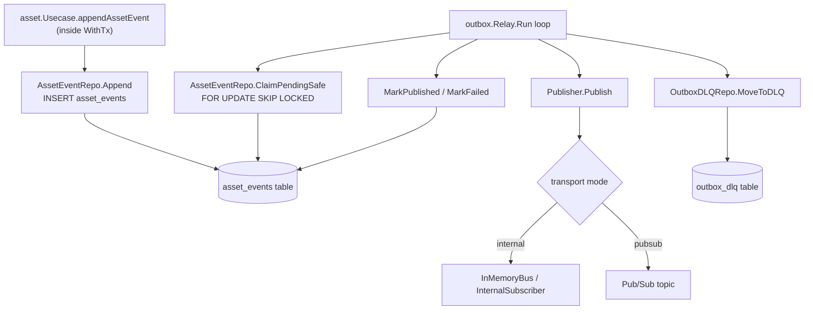
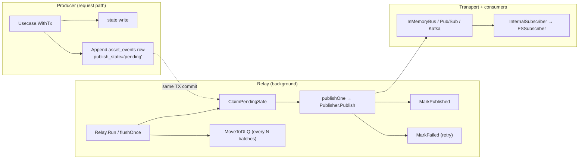
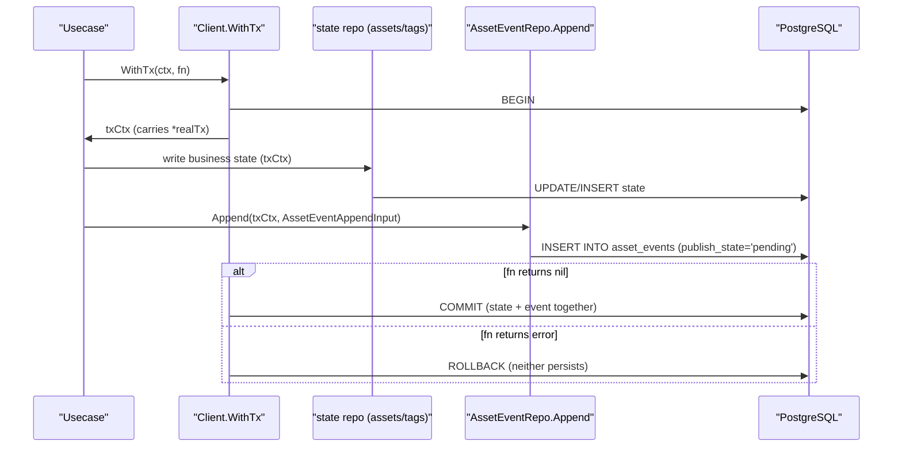
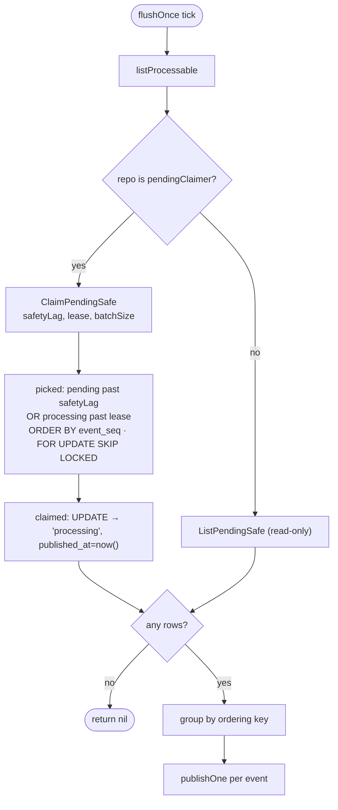
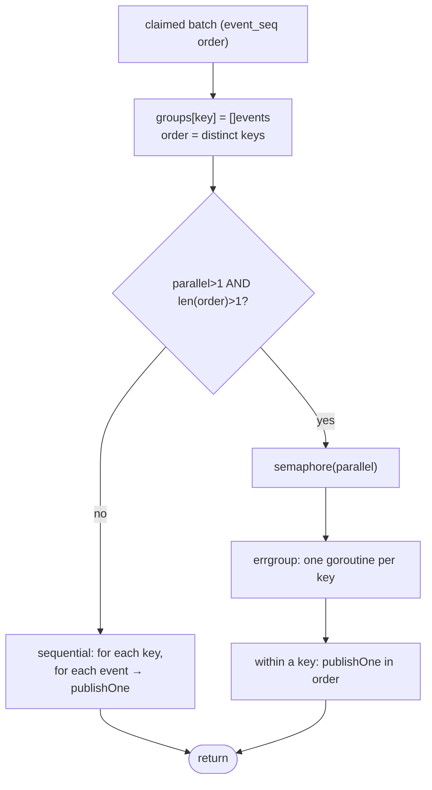
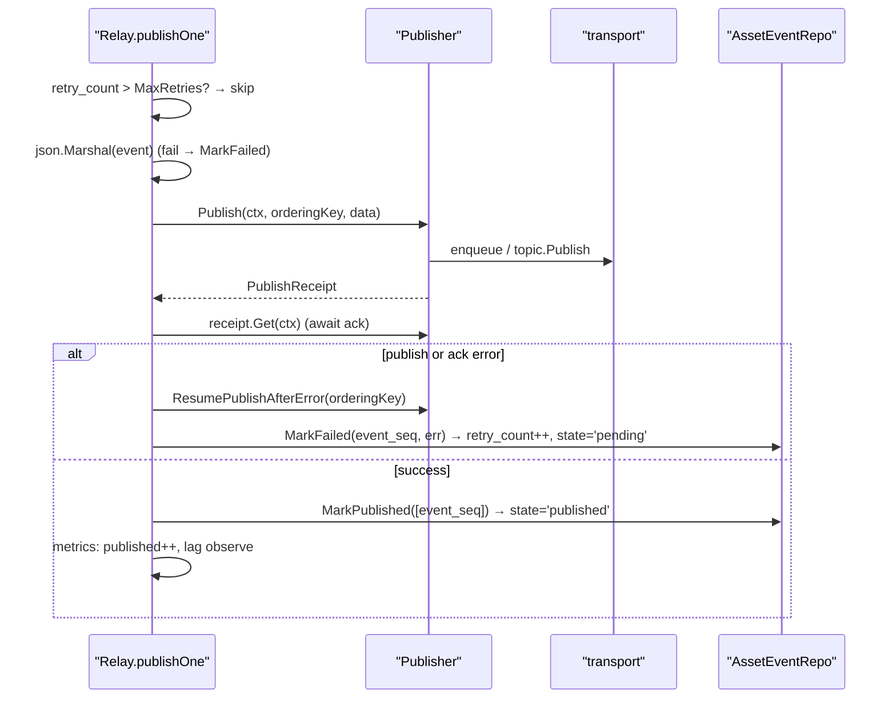
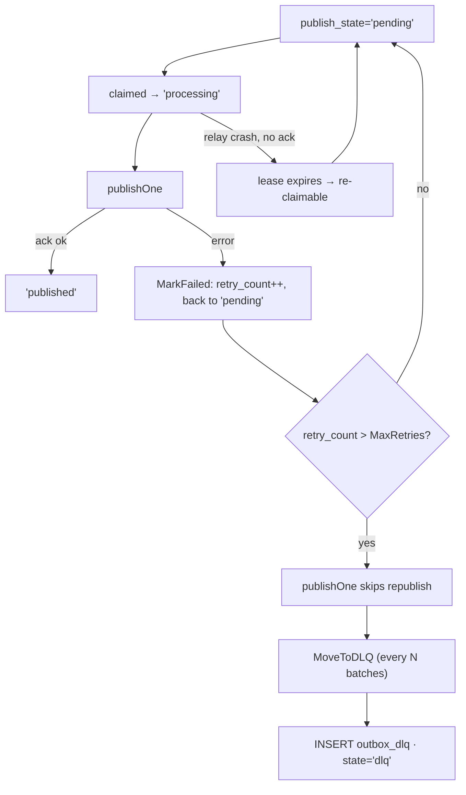
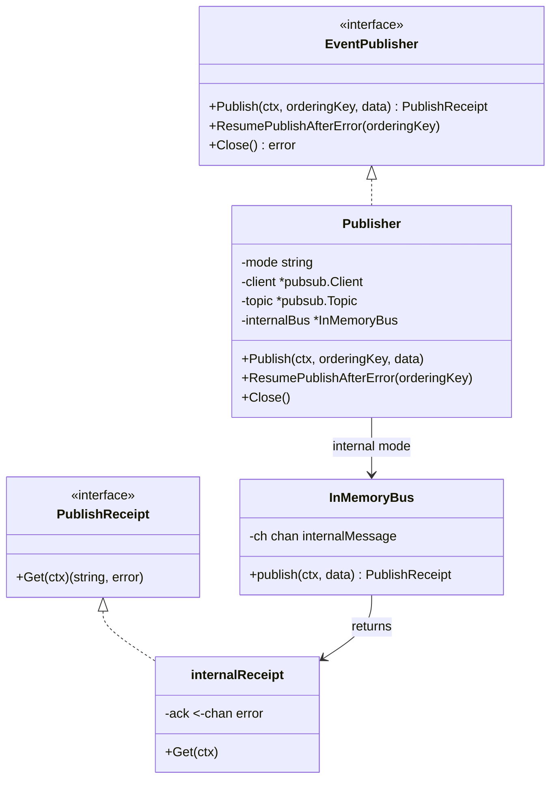
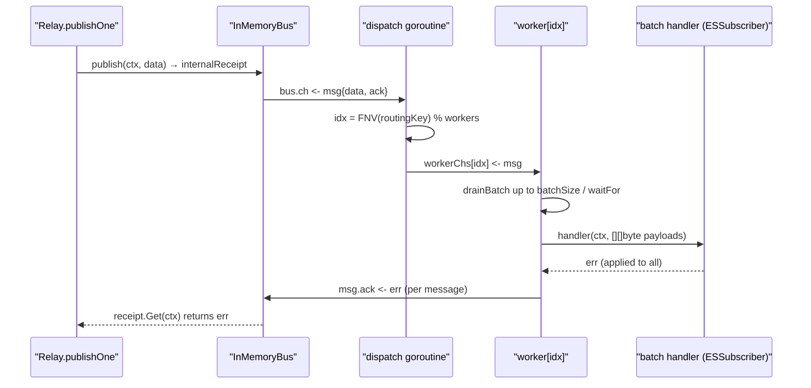
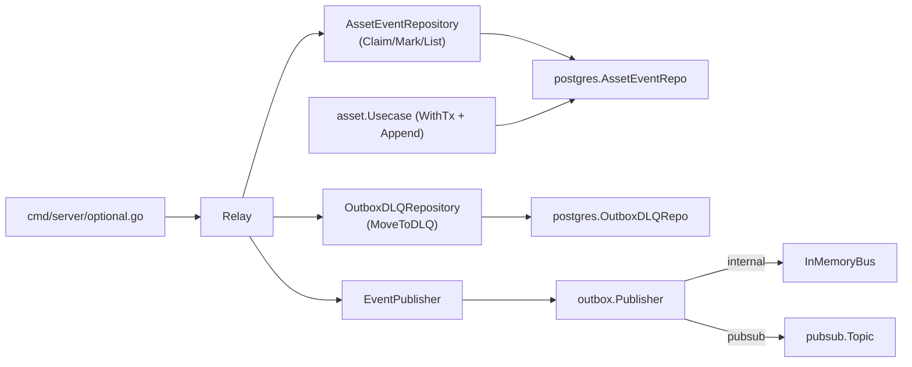

# Outbox Pattern

<cite>
**Referenced Files in This Document**

- [backend/internal/outbox/relay.go](file://backend/internal/outbox/relay.go)
- [backend/internal/outbox/publisher.go](file://backend/internal/outbox/publisher.go)
- [backend/internal/outbox/bus.go](file://backend/internal/outbox/bus.go)
- [backend/internal/outbox/internal_bus.go](file://backend/internal/outbox/internal_bus.go)
- [backend/internal/postgres/repos.go](file://backend/internal/postgres/repos.go)
- [backend/internal/repository/common.go](file://backend/internal/repository/common.go)
- [backend/internal/models/schema_evolution.go](file://backend/internal/models/schema_evolution.go)
- [backend/internal/postgres/client.go](file://backend/internal/postgres/client.go)
- [backend/internal/usecase/asset/usecase.go](file://backend/internal/usecase/asset/usecase.go)
- [backend/cmd/server/optional.go](file://backend/cmd/server/optional.go)
</cite>

## Table of Contents
1. [Introduction](#introduction)
2. [Project Structure](#project-structure)
3. [Core Components](#core-components)
4. [Architecture Overview](#architecture-overview)
5. [Detailed Component Analysis](#detailed-component-analysis)
6. [Dependency Analysis](#dependency-analysis)
7. [Performance Considerations](#performance-considerations)
8. [Troubleshooting Guide](#troubleshooting-guide)
9. [Conclusion](#conclusion)
10. [Appendices](#appendices)

## Introduction

The **transactional outbox** is the integration backbone that keeps the
authoritative relational state in PostgreSQL consistent with everything that
consumes it asynchronously — first and foremost the Elasticsearch search
projection, but also algorithm-run sinks, delivery-eligibility projectors and
lineage emitters. The problem it solves is the classic *dual-write* hazard: if a
producer first commits a business state change and then, in a separate step,
publishes a message, a crash between the two leaves the message lost; if it
publishes first and then commits, a rollback leaves a phantom message. The
outbox eliminates the gap by writing the **state change and the event row in the
same database transaction**. Either both land or neither does.

The pattern has two halves. The **producer** half lives in the use cases: every
business mutation that downstream systems care about calls
`AssetEventRepository.Append` *inside the same `WithTx` block* as the state
write, inserting one row into the `asset_events` table. The **relay** half is a
background loop (`outbox.Relay`) that polls `asset_events`, atomically *claims*
processable rows with `FOR UPDATE SKIP LOCKED` + a processing lease, publishes
each claimed row through an `EventPublisher` to the configured transport
(in-process bus, Pub/Sub, or Kafka), and then marks the row `published`. Failed
publishes increment a retry counter and stay pending; rows that exhaust their
retry budget are swept into a dead-letter table.

This page documents the relay, the publisher abstraction, and the in-process bus
(`InMemoryBus` / `InternalSubscriber`) that backs the default local transport,
together with the PostgreSQL repository methods that implement the transactional
write and the claim/lease semantics.

**Section sources**
- [backend/internal/repository/common.go](file://backend/internal/repository/common.go#L156-L208)
- [backend/internal/outbox/relay.go](file://backend/internal/outbox/relay.go#L47-L115)
- [backend/internal/postgres/repos.go](file://backend/internal/postgres/repos.go#L2055-L2118)

## Project Structure

The outbox code is split between the transport-agnostic `outbox` package and the
PostgreSQL repository that owns the SQL. The relevant files are:

- **`backend/internal/outbox/relay.go`** — the `Relay` poller. Owns
  `RelayConfig`, the polling `Run` loop, the per-flush claim/group/publish logic
  (`flushOnce`, `publishOne`), ordering-key derivation and progress logging.
- **`backend/internal/outbox/bus.go`** — the transport interfaces:
  `EventPublisher`, `EventSubscriber`, `BatchEventSubscriber`, and the
  `PublishReceipt` async-ack abstraction.
- **`backend/internal/outbox/publisher.go`** — the concrete `Publisher` that
  multiplexes over Pub/Sub, Kafka (stubbed) and the in-process bus.
- **`backend/internal/outbox/internal_bus.go`** — `InMemoryBus`,
  `InternalSubscriber` and the batch fan-out workers used by the default
  `internal` transport.
- **`backend/internal/postgres/repos.go`** — `AssetEventRepo` (the
  `asset_events` table: `Append`, `ClaimPendingSafe`, `MarkPublished`,
  `MarkFailed`, counters) and `OutboxDLQRepo` (`MoveToDLQ`).
- **`backend/internal/repository/common.go`** — the `AssetEventRepository` and
  `OutboxDLQRepository` interfaces plus the `AssetEventAppendInput` contract.
- **`backend/internal/models/schema_evolution.go`** — the `AssetEvent` row model.
- **`backend/cmd/server/optional.go`** — wiring: chooses the transport, builds
  `RelayConfig`, constructs the `Relay`, and launches `relay.Run` in a goroutine.

**Diagram sources**
- [backend/internal/outbox/relay.go](file://backend/internal/outbox/relay.go#L117-L227)
- [backend/internal/outbox/publisher.go](file://backend/internal/outbox/publisher.go#L55-L82)
- [backend/internal/postgres/repos.go](file://backend/internal/postgres/repos.go#L1989-L2053)
- [backend/internal/postgres/repos.go](file://backend/internal/postgres/repos.go#L2732-L2750)

**Section sources**
- [backend/cmd/server/optional.go](file://backend/cmd/server/optional.go#L120-L150)
- [backend/internal/outbox/relay.go](file://backend/internal/outbox/relay.go#L1-L54)

## Core Components

### The `asset_events` row (`AssetEvent`)

Each outbox entry is one `asset_events` row, modelled by `AssetEvent`. The
durable, relay-relevant fields are `EventSeq` (a monotonic `bigint` assigned by
the database — the ordering and dedup key for the whole pipeline), `EventType`,
`AggregateType`, the routing identifiers `AssetID` / `McapFileID`, `PublishState`
(`pending` → `processing` → `published` / `dlq`), `RetryCount`, `LastError`,
`OccurredAt`, `CreatedAt` and `PublishedAt`. `event_id`, `event_seq`,
`occurred_at`, `created_at` and `publish_state` are all assigned by the database
on insert — producers never set them.

**Section sources**
- [backend/internal/models/schema_evolution.go](file://backend/internal/models/schema_evolution.go#L55-L74)
- [backend/internal/repository/common.go](file://backend/internal/repository/common.go#L123-L141)

### `AssetEventRepo` (the table)

`AssetEventRepo` is the PostgreSQL implementation of `AssetEventRepository`. The
methods central to the outbox are:

- **`Append`** — `INSERT INTO asset_events (...)`. Tx-aware via context, so when
  invoked inside `Client.WithTx` it executes on the surrounding transaction. This
  is *the* correctness guarantee.
- **`ClaimPendingSafe`** — the claim/lease query (CTE with `FOR UPDATE SKIP
  LOCKED`) that flips processable rows to `processing` and returns them.
- **`MarkPublished`** — sets `publish_state='published'`, only for rows still in
  `pending`/`processing`.
- **`MarkFailed`** — increments `retry_count`, records `last_error`, and *resets*
  the row to `pending` so it becomes claimable again.

### `OutboxDLQRepo`

`OutboxDLQRepo.MoveToDLQ` archives rows whose `retry_count` has exceeded the
threshold into `outbox_dlq` and flips the source rows to `publish_state='dlq'`
so the relay stops retrying them.

### `Relay`

`Relay` holds the `Events` repository, an optional `DLQ` repository, the
`Publisher`, and `RelayConfig`. `Run` is the long-lived poll loop; `flushOnce`
does one claim-and-publish cycle; `publishOne` publishes a single event and
records its terminal state.

### Publisher and bus

`EventPublisher` (in `bus.go`) is the transport seam: `Publish` returns a
`PublishReceipt` whose `Get(ctx)` blocks for the async ack. `Publisher`
(`publisher.go`) implements it over Pub/Sub, Kafka (stub) or the in-process
`InMemoryBus`. `InternalSubscriber` (`internal_bus.go`) is the consumer side of
the default `internal` transport.

**Section sources**
- [backend/internal/postgres/repos.go](file://backend/internal/postgres/repos.go#L1884-L2152)
- [backend/internal/postgres/repos.go](file://backend/internal/postgres/repos.go#L2722-L2750)
- [backend/internal/outbox/bus.go](file://backend/internal/outbox/bus.go#L1-L63)

## Architecture Overview

The end-to-end flow is: a use case opens a transaction, writes business state and
appends one `asset_events` row, then commits. The relay, running independently,
claims pending rows in `event_seq` order, publishes them, and records success or
failure per row. Consumers (e.g. the ES subscriber) rebuild their projections
from current-state tables, using `event_seq` for idempotency.

**Diagram sources**
- [backend/internal/usecase/asset/usecase.go](file://backend/internal/usecase/asset/usecase.go#L153-L156)
- [backend/internal/outbox/relay.go](file://backend/internal/outbox/relay.go#L117-L227)
- [backend/cmd/server/optional.go](file://backend/cmd/server/optional.go#L137-L150)

**Section sources**
- [backend/internal/repository/common.go](file://backend/internal/repository/common.go#L156-L199)
- [backend/internal/outbox/relay.go](file://backend/internal/outbox/relay.go#L56-L115)

## Detailed Component Analysis

### Transactional write: state + event atomically

A producer never calls `Append` on its own. It opens a transaction with
`Client.WithTx`, performs the state mutation, and appends the event on the same
context. `WithTx` stores a `*realTx` in the context under `txKey{}`; every
repository method resolves the active handle through `dbFromCtx`, so both the
state write and the `Append` run on the *same* transaction and commit (or roll
back) together. The asset use case wraps this in a small helper —
`appendAssetEvent` calls `eventRepo.Append` with an `AssetEventAppendInput`
carrying the event type, the asset/mcap routing IDs, tenant/project scope and the
JSON payload — and `Append` itself fills defaults (`aggregate_type='asset'`,
`payload_schema_version='v1'`, `event_source='backend'`) and converts empty
strings to SQL `NULL`.

**Diagram sources**
- [backend/internal/postgres/client.go](file://backend/internal/postgres/client.go#L220-L239)
- [backend/internal/postgres/repos.go](file://backend/internal/postgres/repos.go#L2055-L2118)
- [backend/internal/usecase/asset/usecase.go](file://backend/internal/usecase/asset/usecase.go#L258-L273)

**Section sources**
- [backend/internal/postgres/client.go](file://backend/internal/postgres/client.go#L55-L60)
- [backend/internal/postgres/client.go](file://backend/internal/postgres/client.go#L220-L239)
- [backend/internal/postgres/repos.go](file://backend/internal/postgres/repos.go#L2055-L2118)

### The relay poll loop (`Run`)

`Run` normalises `RelayConfig`, applying `DefaultRelayConfig` values for any
zero/invalid field (batch size 200, interval 500 ms, safety lag 2 s, processing
lease 30 s, max retries 20, 8 parallel ordering keys, DLQ sweep every 20
batches). It performs one immediate `flushOnce` so startup does not wait a full
tick, then drives three timers in a `select`:

- the **flush ticker** (every `Interval`) runs `flushOnce`, increments a batch
  counter, and — every `DLQEveryNBatches` cycles, when a DLQ repo is configured —
  calls `MoveToDLQ(MaxRetries)`;
- the optional **progress ticker** logs throughput/backlog/ETA;
- **`ctx.Done()`** returns and ends the loop.

Flush and DLQ errors are logged and swallowed (except `context.Canceled`) so a
transient database error never kills the relay.

**Section sources**
- [backend/internal/outbox/relay.go](file://backend/internal/outbox/relay.go#L19-L45)
- [backend/internal/outbox/relay.go](file://backend/internal/outbox/relay.go#L56-L115)

### Claiming pending rows: `FOR UPDATE SKIP LOCKED` + lease

`flushOnce` first calls `listProcessable`, which prefers the `pendingClaimer`
interface: if the repository implements `ClaimPendingSafe`, it claims rows;
otherwise it falls back to the read-only `ListPendingSafe`. Claiming is the heart
of the at-least-once contract. `ClaimPendingSafe` runs a single CTE:

1. `picked` selects `event_seq` for rows that are *processable* — either
   `publish_state='pending'` **and** `occurred_at < now() - safetyLag`, **or**
   `publish_state='processing'` **and** the lease has expired
   (`COALESCE(published_at, occurred_at) < now() - processingLease`) — ordered by
   `event_seq ASC`, `LIMIT batchSize`, with **`FOR UPDATE SKIP LOCKED`**.
2. `claimed` `UPDATE`s those rows to `publish_state='processing'`,
   `published_at=now()`, and `RETURNING` the full row.
3. The outer `SELECT ... ORDER BY event_seq ASC` returns the claimed batch.

`SKIP LOCKED` lets multiple relay instances (or parallel workers) claim disjoint
batches without blocking each other; the `processing` state plus the lease turns
a crash mid-publish into a self-healing condition — once the lease ages past
`ProcessingLease`, the orphaned row becomes processable again and is re-claimed.
The `safetyLag` horizon keeps the relay from racing transactions that have
inserted but not yet committed their event row.

**Diagram sources**
- [backend/internal/outbox/relay.go](file://backend/internal/outbox/relay.go#L183-L192)
- [backend/internal/postgres/repos.go](file://backend/internal/postgres/repos.go#L2001-L2030)

**Section sources**
- [backend/internal/postgres/repos.go](file://backend/internal/postgres/repos.go#L1983-L2053)
- [backend/internal/outbox/relay.go](file://backend/internal/outbox/relay.go#L117-L181)

### Ordering keys and parallel flush

After a batch is claimed, `flushOnce` groups events by ordering key
(`orderingKeyFor`: the `asset_id` when present, else `mcap:<mcap_file_id>`, else
`_na`), preserving discovery order. Events that share a key are **always
serialized** to preserve per-aggregate order. When `ParallelOrderingKeys > 1` and
more than one key is present, the relay processes distinct keys concurrently with
an `errgroup` bounded by a weighted `semaphore`; otherwise it falls back to a
fully sequential walk. The `OutboxRelayParallelKeys` gauge records the effective
concurrency.

**Diagram sources**
- [backend/internal/outbox/relay.go](file://backend/internal/outbox/relay.go#L130-L181)
- [backend/internal/outbox/relay.go](file://backend/internal/outbox/relay.go#L242-L250)

**Section sources**
- [backend/internal/outbox/relay.go](file://backend/internal/outbox/relay.go#L229-L250)

### Publishing one event (`publishOne`)

`publishOne` is the per-event terminal-state machine:

- If no publisher is configured it marks the event failed.
- If `RetryCount > MaxRetries` it returns without action (the DLQ sweep will
  later move it).
- It JSON-marshals the `AssetEvent`; a marshal error marks the event failed.
- It calls `Publisher.Publish(ctx, orderingKey, data)` and then blocks on
  `pr.Get(ctx)` for the async ack. **Either** a publish error **or** an ack error
  triggers `ResumePublishAfterError(orderingKey)` (to unblock the ordering key on
  Pub/Sub) followed by `MarkFailed`, which increments `retry_count` and returns
  the row to `pending`.
- On success it calls `MarkPublished([event_seq])`, bumps the published counter,
  increments `OutboxRelayPublishedTotal{kind}` and observes `OutboxEventLagSeconds`
  from `CreatedAt`.

**Diagram sources**
- [backend/internal/outbox/relay.go](file://backend/internal/outbox/relay.go#L194-L227)
- [backend/internal/postgres/repos.go](file://backend/internal/postgres/repos.go#L2120-L2152)

**Section sources**
- [backend/internal/outbox/relay.go](file://backend/internal/outbox/relay.go#L194-L240)
- [backend/internal/postgres/repos.go](file://backend/internal/postgres/repos.go#L2120-L2152)

### Retries and the dead-letter queue

A failed publish never blocks the pipeline: `MarkFailed` resets the row to
`pending`, so the next `flushOnce` claims it again. The retry budget is
`MaxRetries` (default 20). Two things bound a poison message:

1. `publishOne` short-circuits once `RetryCount > MaxRetries` (it stops
   republishing).
2. Every `DLQEveryNBatches` flush cycles, `Run` calls `OutboxDLQRepo.MoveToDLQ`,
   which copies `pending` rows with `retry_count > threshold` into `outbox_dlq`
   and flips the source rows to `publish_state='dlq'` so they leave the
   claimable set permanently. Operators inspect/replay from `outbox_dlq`.

**Diagram sources**
- [backend/internal/outbox/relay.go](file://backend/internal/outbox/relay.go#L94-L110)
- [backend/internal/outbox/relay.go](file://backend/internal/outbox/relay.go#L201-L217)
- [backend/internal/postgres/repos.go](file://backend/internal/postgres/repos.go#L2732-L2750)

**Section sources**
- [backend/internal/postgres/repos.go](file://backend/internal/postgres/repos.go#L2136-L2152)
- [backend/internal/postgres/repos.go](file://backend/internal/postgres/repos.go#L2722-L2759)

### Publisher fan-out across transports

`Publisher` is one struct that switches on `mode`. `NewPublisher` builds a
Pub/Sub client and topic; notably it sets `topic.EnableMessageOrdering = false`
on purpose — the ES subscriber is idempotent (dedupes per `asset_id`, takes
`max(event_seq)`, rebuilds the doc from Postgres, writes with
`ExternalVersion=event_seq` so out-of-order retries lose the ES version
conflict), and enabling ordering would force serial per-key publish and cap relay
throughput. `NewInternalPublisher` wraps an `InMemoryBus`; `NewKafkaPublisher`
returns a "not compiled in this build" error. `Publish` defaults an empty
ordering key to `_na` and dispatches: Pub/Sub via `topic.Publish`, internal via
`bus.publish`. `ResumePublishAfterError` only matters for Pub/Sub (it calls
`topic.ResumePublish`); it is a no-op otherwise.

**Diagram sources**
- [backend/internal/outbox/bus.go](file://backend/internal/outbox/bus.go#L8-L18)
- [backend/internal/outbox/publisher.go](file://backend/internal/outbox/publisher.go#L12-L94)
- [backend/internal/outbox/internal_bus.go](file://backend/internal/outbox/internal_bus.go#L14-L63)

**Section sources**
- [backend/internal/outbox/publisher.go](file://backend/internal/outbox/publisher.go#L20-L113)

### The in-process bus and batch fan-out

For the default `internal` transport, `InMemoryBus` is a buffered channel of
`internalMessage{data, ack}`. `publish` copies the payload, enqueues it, and
returns an `internalReceipt` whose `Get` blocks on the per-message `ack` channel
— so `publishOne`'s `pr.Get(ctx)` only unblocks once a subscriber has handled the
message and pushed the handler error back. This makes the internal transport's
ack semantics identical to Pub/Sub's from the relay's point of view.

`InternalSubscriber` consumes the bus. With `workers <= 1` it runs a serial
loop. With more workers it dispatches each message to a worker by
`routingWorkerIndex` — `FNV-1a(routing key) % workers`, where the routing key is
extracted from the payload JSON (`asset_id`, else `mcap:<mcap_file_id>`, else
`_na`). Because the same key always hashes to the same worker, **per-asset
ordering survives parallelism**. The optional `BatchEventSubscriber` extension
(`ReceiveBatch`) lets consumers process short-window batches: each worker blocks
on its first message, drains up to `batchSize-1` more bounded by `waitFor`
(`drainBatch`), invokes the handler once per batch, and acks every message in the
batch with the handler's single error (at-least-once for the whole batch).

**Diagram sources**
- [backend/internal/outbox/internal_bus.go](file://backend/internal/outbox/internal_bus.go#L32-L63)
- [backend/internal/outbox/internal_bus.go](file://backend/internal/outbox/internal_bus.go#L216-L284)
- [backend/internal/outbox/internal_bus.go](file://backend/internal/outbox/internal_bus.go#L325-L350)

**Section sources**
- [backend/internal/outbox/internal_bus.go](file://backend/internal/outbox/internal_bus.go#L65-L154)
- [backend/internal/outbox/internal_bus.go](file://backend/internal/outbox/internal_bus.go#L156-L323)
- [backend/internal/outbox/bus.go](file://backend/internal/outbox/bus.go#L26-L63)

## Dependency Analysis

The relay depends on two repository interfaces and one transport interface, so it
is fully decoupled from both PostgreSQL and the message broker. `optional.go`
selects the transport at startup, builds `RelayConfig` from env, constructs the
`Relay` with `assetEventRepo`, a fresh `OutboxDLQRepo` and the chosen publisher,
and launches `relay.Run` in a goroutine governed by `outboxCtx`.

**Diagram sources**
- [backend/internal/outbox/relay.go](file://backend/internal/outbox/relay.go#L47-L54)
- [backend/cmd/server/optional.go](file://backend/cmd/server/optional.go#L127-L150)
- [backend/internal/postgres/repos.go](file://backend/internal/postgres/repos.go#L1887-L1897)

**Section sources**
- [backend/internal/repository/common.go](file://backend/internal/repository/common.go#L156-L208)
- [backend/cmd/server/optional.go](file://backend/cmd/server/optional.go#L63-L150)

## Performance Considerations

- **Claim ordering and index.** `ClaimPendingSafe` orders by `event_seq ASC` and
  filters on `publish_state` + `occurred_at`; an index supporting the pending /
  processing predicate keeps the `picked` CTE off a full table scan as
  `asset_events` grows.
- **`SKIP LOCKED` for concurrency.** `FOR UPDATE SKIP LOCKED` lets parallel
  workers and multiple relay instances claim disjoint batches without lock
  contention, trading strict FIFO across the whole table for high throughput;
  ordering is preserved only *within* an ordering key.
- **Parallel ordering keys.** `ParallelOrderingKeys` (default 8) processes
  distinct keys concurrently while serializing same-key events, balancing
  throughput against per-aggregate order.
- **Batch size & interval.** `BatchSize` (200) bounds each claim; `Interval`
  (500 ms) bounds polling latency. The startup immediate flush avoids a first-tick
  delay.
- **Ordering intentionally off on Pub/Sub.** `EnableMessageOrdering=false` avoids
  serial per-key publish that caps relay throughput at ~200 ev/s; correctness is
  recovered downstream by the idempotent ES write using `event_seq` as the
  external version.
- **Safety lag.** `SafetyLag` (2 s) hides very recent rows so the relay does not
  read events from transactions that have inserted but not yet committed.
- **Observability.** `OutboxRelayFlushDurationSeconds`, `OutboxRelayPublishedTotal`,
  `OutboxEventLagSeconds`, `OutboxRelayParallelKeys` and `OutboxInternalBusDepth`,
  plus periodic `logProgress` output (published, rate/min, pending, oldest age,
  ETA), surface backlog and throughput.

**Section sources**
- [backend/internal/outbox/relay.go](file://backend/internal/outbox/relay.go#L33-L45)
- [backend/internal/outbox/relay.go](file://backend/internal/outbox/relay.go#L117-L181)
- [backend/internal/outbox/relay.go](file://backend/internal/outbox/relay.go#L252-L298)
- [backend/internal/outbox/publisher.go](file://backend/internal/outbox/publisher.go#L32-L39)

## Troubleshooting Guide

- **Events never publish.** Confirm the relay started (`outbox relay starting`
  log in `optional.go`) and that the transport/credentials are configured. If
  `Publisher` is nil, `publishOne` immediately `MarkFailed`s with "outbox
  publisher is not configured".
- **Backlog grows / `pending` climbs.** Check `logProgress` (`pending`,
  `oldest_pending_sec`, `eta_min`) and `OutboxEventLagSeconds`. Increase
  `BatchSize` / `ParallelOrderingKeys`, or shorten `Interval`.
- **Rows stuck in `processing`.** A relay crashed mid-publish. They self-heal once
  the row ages past `ProcessingLease` and is re-claimed; `CountProcessing` shows
  how many are in flight.
- **A poison event repeats.** Inspect `last_error` and `retry_count`. Once
  `retry_count > MaxRetries`, the periodic `MoveToDLQ` moves it to `outbox_dlq`
  (state → `dlq`); query `OutboxDLQRepo.Count` and the `outbox_dlq` table to
  triage.
- **Duplicate deliveries downstream.** Expected — the relay is at-least-once.
  Consumers must dedupe on `event_seq`; the ES subscriber does this via
  `ExternalVersion=event_seq`.
- **Out-of-order processing for one asset.** Verify the routing key: same-key
  events must hash to the same worker (`routingWorkerIndex`) and are serialized in
  `flushOnce`. A blank `asset_id`/`mcap_file_id` collapses to `_na` and serializes
  unrelated events together.

**Section sources**
- [backend/internal/outbox/relay.go](file://backend/internal/outbox/relay.go#L194-L227)
- [backend/internal/outbox/relay.go](file://backend/internal/outbox/relay.go#L252-L294)
- [backend/internal/postgres/repos.go](file://backend/internal/postgres/repos.go#L2183-L2206)
- [backend/internal/outbox/internal_bus.go](file://backend/internal/outbox/internal_bus.go#L325-L350)

## Conclusion

The transactional outbox guarantees that every observable state change in
PostgreSQL produces exactly one durable `asset_events` row committed in the same
transaction, eliminating the dual-write gap. A decoupled relay then claims those
rows atomically (`FOR UPDATE SKIP LOCKED` + a processing lease), publishes them
through a transport-agnostic `EventPublisher`, and records per-row success
(`published`) or failure (retry → `pending`, eventually `dlq`). Ordering is
preserved per aggregate via ordering keys and consistent worker hashing, while
overall throughput comes from `SKIP LOCKED`, parallel keys, and an intentionally
unordered Pub/Sub topic backed by idempotent, `event_seq`-versioned consumers.

## Appendices

### Publish-state lifecycle

| State | Set by | Meaning |
| --- | --- | --- |
| `pending` | `Append` (insert default) / `MarkFailed` | Awaiting (re)claim by the relay |
| `processing` | `ClaimPendingSafe` | Claimed; lease held via `published_at` |
| `published` | `MarkPublished` | Successfully acked by the transport |
| `dlq` | `MoveToDLQ` | Exhausted retries; archived in `outbox_dlq` |

### `RelayConfig` defaults (`DefaultRelayConfig`)

| Field | Default | Purpose |
| --- | --- | --- |
| `BatchSize` | 200 | Max rows claimed per flush |
| `Interval` | 500 ms | Poll period |
| `SafetyLag` | 2 s | Hide very recent (uncommitted-risk) rows |
| `ProcessingLease` | 30 s | Re-claim window for crashed relays |
| `MaxRetries` | 20 | Retry budget before DLQ |
| `ProgressLogInterval` | 1 min | Periodic progress logging (0 = off) |
| `DLQEveryNBatches` | 20 | Run `MoveToDLQ` every N flushes (0 = off) |
| `ParallelOrderingKeys` | 8 | Concurrent distinct ordering keys |

### Ordering / routing key derivation

| Source | Producer (`orderingKeyFor`) | Consumer (`routingKeyFromPayload`) |
| --- | --- | --- |
| `asset_id` present | `asset_id` | `asset_id` |
| `mcap_file_id` present | `mcap:<id>` | `mcap:<id>` |
| neither | `_na` | `_na` |

**Section sources**
- [backend/internal/outbox/relay.go](file://backend/internal/outbox/relay.go#L33-L45)
- [backend/internal/outbox/relay.go](file://backend/internal/outbox/relay.go#L242-L250)
- [backend/internal/outbox/internal_bus.go](file://backend/internal/outbox/internal_bus.go#L335-L350)
- [backend/internal/postgres/repos.go](file://backend/internal/postgres/repos.go#L2120-L2152)
- [backend/internal/postgres/repos.go](file://backend/internal/postgres/repos.go#L2732-L2750)
