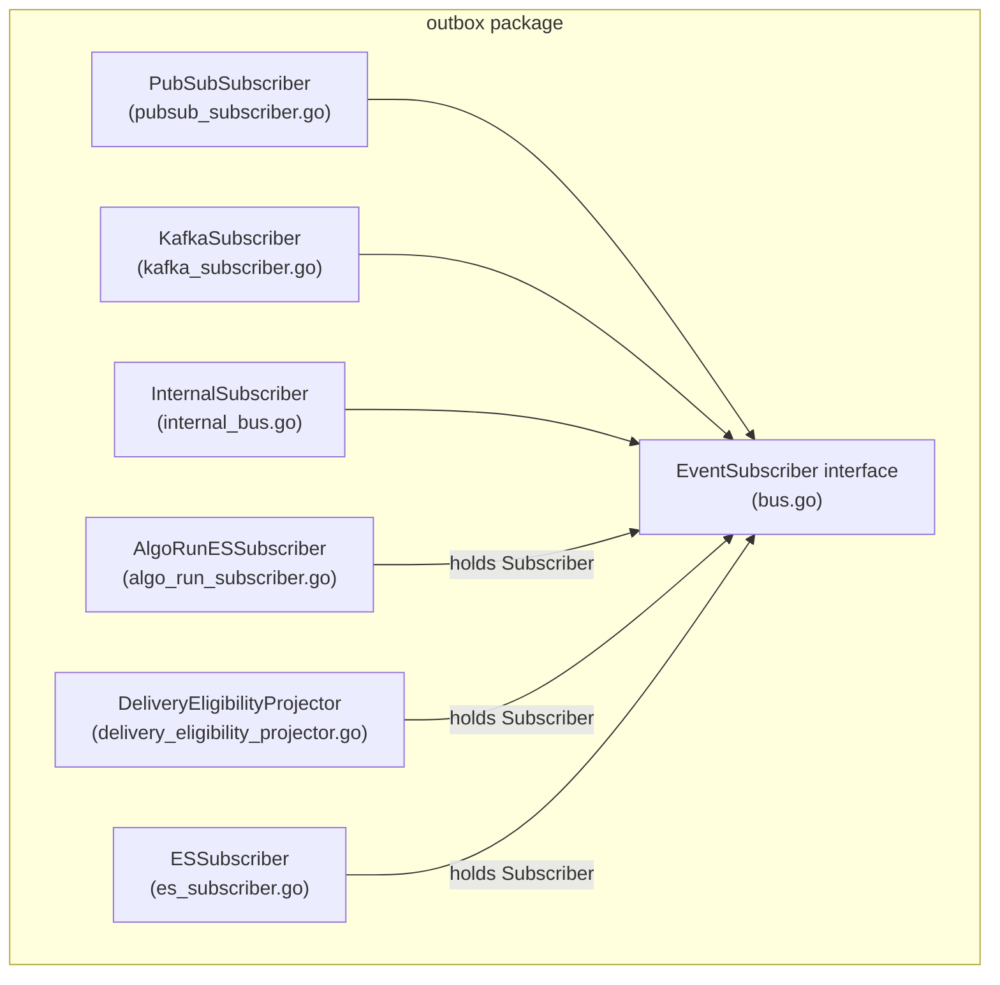
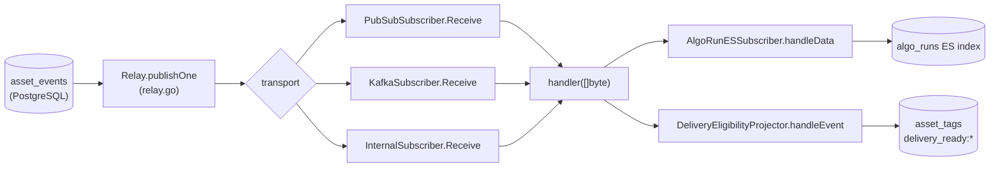
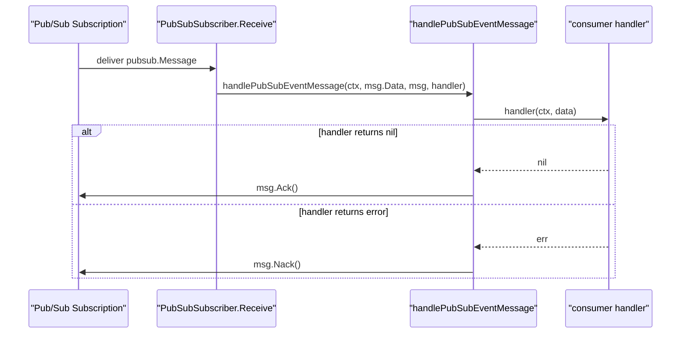
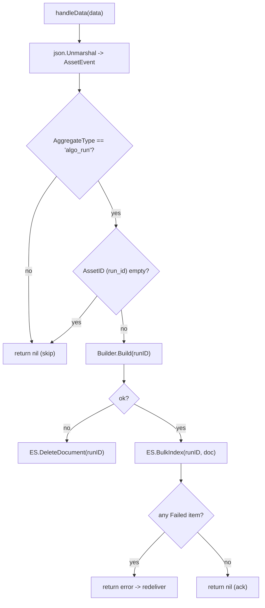
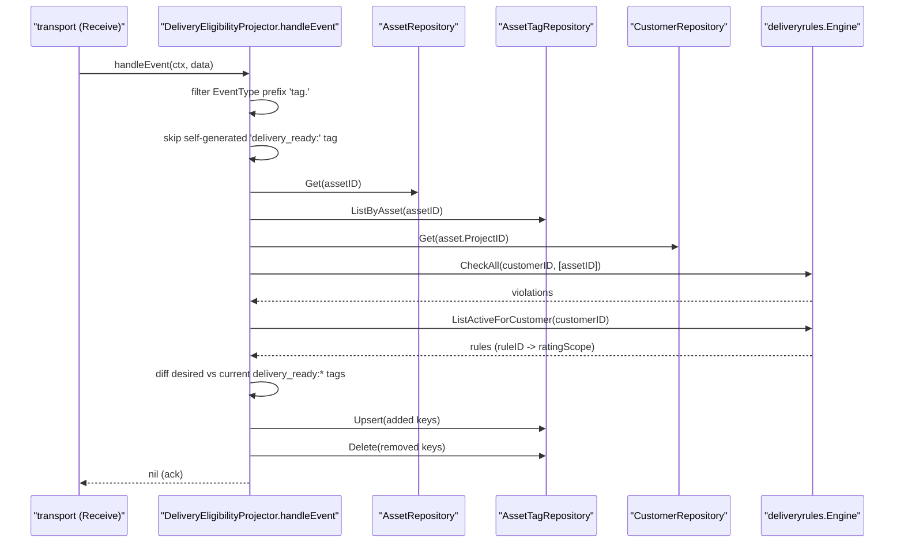
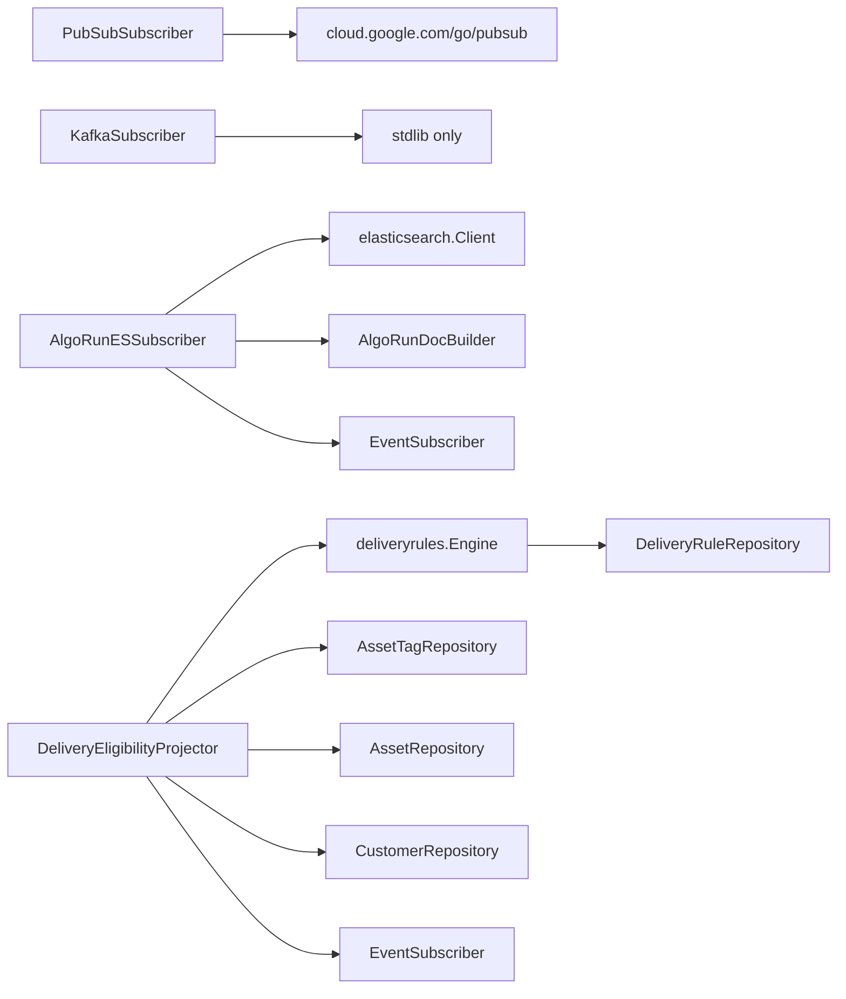

# Pub/Sub & Kafka Subscribers

<cite>
**Referenced Files in This Document**

- [backend/internal/outbox/pubsub_subscriber.go](file://backend/internal/outbox/pubsub_subscriber.go)
- [backend/internal/outbox/kafka_subscriber.go](file://backend/internal/outbox/kafka_subscriber.go)
- [backend/internal/outbox/algo_run_subscriber.go](file://backend/internal/outbox/algo_run_subscriber.go)
- [backend/internal/outbox/delivery_eligibility_projector.go](file://backend/internal/outbox/delivery_eligibility_projector.go)
- [backend/internal/outbox/bus.go](file://backend/internal/outbox/bus.go)
- [backend/internal/outbox/relay.go](file://backend/internal/outbox/relay.go)
- [backend/internal/outbox/es_subscriber.go](file://backend/internal/outbox/es_subscriber.go)
- [backend/internal/models/schema_evolution.go](file://backend/internal/models/schema_evolution.go)
- [backend/internal/deliveryrules/engine.go](file://backend/internal/deliveryrules/engine.go)
- [backend/cmd/server/optional.go](file://backend/cmd/server/optional.go)
</cite>

## Table of Contents
1. [Introduction](#introduction)
2. [Project Structure](#project-structure)
3. [Core Components](#core-components)
4. [Architecture Overview](#architecture-overview)
5. [Detailed Component Analysis](#detailed-component-analysis)
6. [Dependency Analysis](#dependency-analysis)
7. [Performance Considerations](#performance-considerations)
8. [Troubleshooting Guide](#troubleshooting-guide)
9. [Conclusion](#conclusion)
10. [Appendices](#appendices)

## Introduction

The outbox subsystem turns durable PostgreSQL change records (`asset_events`
rows) into derived side effects: a refreshed Elasticsearch index, computed
delivery-eligibility tags, and lineage emission. The bridge between the durable
event log and those side effects is a small family of **subscriber** types that
all satisfy the same `EventSubscriber` contract.

Two of those subscribers are pure **transport relays** — they connect the
consumer side of the pipeline to an external message bus rather than the
in-process bus:

- `PubSubSubscriber` pulls messages from a Google Cloud Pub/Sub subscription.
- `KafkaSubscriber` is a placeholder transport for Kafka deployments.

The other two are **domain projectors** — they sit on top of any transport
(`internal`, `pubsub`, or `kafka`) and translate raw events into concrete
domain mutations:

- `AlgoRunESSubscriber` rebuilds the `algo_runs` Elasticsearch index whenever an
  `algo_run` aggregate changes.
- `DeliveryEligibilityProjector` maintains `delivery_ready:*` tags on assets in
  response to tag-change events, by re-evaluating the active delivery rules.

This page documents what each subscriber consumes, what it produces, and how the
transport relays and projectors compose through a single byte-oriented handler
signature.

**Section sources**
- [backend/internal/outbox/bus.go](file://backend/internal/outbox/bus.go#L20-L50)
- [backend/internal/outbox/pubsub_subscriber.go](file://backend/internal/outbox/pubsub_subscriber.go#L1-L66)
- [backend/internal/outbox/algo_run_subscriber.go](file://backend/internal/outbox/algo_run_subscriber.go#L1-L40)
- [backend/internal/outbox/delivery_eligibility_projector.go](file://backend/internal/outbox/delivery_eligibility_projector.go#L1-L54)

## Project Structure

All subscribers live in the `backend/internal/outbox` package alongside the
relay (publisher side) and the bus contracts. The relevant files are:

- `bus.go` — the `EventSubscriber` and optional `BatchEventSubscriber`
  interfaces that every subscriber implements.
- `pubsub_subscriber.go` — Google Pub/Sub transport relay.
- `kafka_subscriber.go` — Kafka transport relay (not compiled in the default
  build).
- `algo_run_subscriber.go` — the algo-run Elasticsearch projector.
- `delivery_eligibility_projector.go` — the delivery-eligibility tag projector.
- `es_subscriber.go` — the asset Elasticsearch projector (the batch-aware sibling
  that shares the same transports).
- `relay.go` — the publisher loop that feeds events onto a transport.

Wiring is performed in `backend/cmd/server/optional.go`, which selects a
transport (`internal`, `pubsub`, or `kafka`) per consumer and constructs the
matching subscriber.

**Diagram sources**
- [backend/internal/outbox/bus.go](file://backend/internal/outbox/bus.go#L20-L50)
- [backend/internal/outbox/pubsub_subscriber.go](file://backend/internal/outbox/pubsub_subscriber.go#L11-L27)
- [backend/internal/outbox/kafka_subscriber.go](file://backend/internal/outbox/kafka_subscriber.go#L9-L28)
- [backend/internal/outbox/algo_run_subscriber.go](file://backend/internal/outbox/algo_run_subscriber.go#L26-L40)
- [backend/internal/outbox/delivery_eligibility_projector.go](file://backend/internal/outbox/delivery_eligibility_projector.go#L24-L54)

**Section sources**
- [backend/cmd/server/optional.go](file://backend/cmd/server/optional.go#L152-L199)
- [backend/internal/outbox/bus.go](file://backend/internal/outbox/bus.go#L1-L64)

## Core Components

The whole design hinges on a single byte-oriented contract. `EventSubscriber`
exposes `Receive(ctx, handler)` where the handler takes a raw `[]byte` payload
and returns an error; a returned error signals the transport to redeliver
(at-least-once), and a nil return acknowledges. `BatchEventSubscriber` is an
optional extension that lets a transport deliver short-window batches and ack
them as a unit; only the asset `ESSubscriber` opts into the batched path, while
the transports and projectors documented here use the single-message path.

| Type | Role | Consumes | Produces |
| --- | --- | --- | --- |
| `PubSubSubscriber` | transport relay | Pub/Sub subscription messages | invokes the consumer's handler with `msg.Data` |
| `KafkaSubscriber` | transport relay | Kafka topic (placeholder) | error — not compiled in default build |
| `AlgoRunESSubscriber` | domain projector | `algo_run` outbox events | `algo_runs` ES index docs (upsert/delete) |
| `DeliveryEligibilityProjector` | domain projector | `tag.*` outbox events | `delivery_ready:*` asset tags (upsert/delete) |

The relay on the publisher side marshals each `models.AssetEvent` row to JSON
and publishes it under an ordering key, so every payload reaching a subscriber
handler is a JSON-encoded `AssetEvent`.

**Section sources**
- [backend/internal/outbox/bus.go](file://backend/internal/outbox/bus.go#L20-L50)
- [backend/internal/outbox/relay.go](file://backend/internal/outbox/relay.go#L194-L227)
- [backend/internal/models/schema_evolution.go](file://backend/internal/models/schema_evolution.go#L56-L74)

## Architecture Overview

The publisher-side `Relay` polls `asset_events`, marshals each row, and pushes it
onto whichever transport was configured. On the consumer side, a transport relay
(`PubSubSubscriber`, `KafkaSubscriber`, or the in-process `InternalSubscriber`)
delivers each payload to a projector's handler. The projector decodes the
`AssetEvent`, filters for the event class it cares about, and applies a side
effect to PostgreSQL or Elasticsearch.

The transports are interchangeable: the same projector code runs unchanged
regardless of whether events arrive over Pub/Sub, Kafka, or the in-memory bus,
because each transport only differs in how it sources bytes and how it
ack/nacks them.

**Diagram sources**
- [backend/internal/outbox/relay.go](file://backend/internal/outbox/relay.go#L194-L227)
- [backend/internal/outbox/pubsub_subscriber.go](file://backend/internal/outbox/pubsub_subscriber.go#L41-L59)
- [backend/internal/outbox/algo_run_subscriber.go](file://backend/internal/outbox/algo_run_subscriber.go#L43-L94)
- [backend/internal/outbox/delivery_eligibility_projector.go](file://backend/internal/outbox/delivery_eligibility_projector.go#L56-L184)

**Section sources**
- [backend/internal/outbox/relay.go](file://backend/internal/outbox/relay.go#L47-L116)
- [backend/cmd/server/optional.go](file://backend/cmd/server/optional.go#L152-L199)

## Detailed Component Analysis

#### PubSubSubscriber — Google Cloud Pub/Sub relay

`PubSubSubscriber` wraps a `*pubsub.Client` and a subscription name. The
constructor `NewPubSubSubscriber` validates that both `PUBSUB_PROJECT` and the
subscription name are non-empty (`ValidatePubSubEventSourceConfig`) before
opening the client; a missing value yields a descriptive configuration error
rather than a nil-pointer panic later.

`Receive` opens the named subscription, sets receive tuning
(`MaxOutstandingMessages = 64`, `NumGoroutines = 4`), and registers a callback
that forwards `msg.Data` to the consumer handler through the small
`handlePubSubEventMessage` helper. That helper is the ack/nack policy: if the
handler returns an error the message is `Nack()`-ed for redelivery; otherwise it
is `Ack()`-ed. The helper is written against a narrow `pubSubAckNacker`
interface (just `Ack()` / `Nack()`), which keeps the ack logic unit-testable
without a live Pub/Sub message.

`Receive` guards against incomplete wiring (nil client or empty subscription
name) and returns an error instead of blocking. `Close` closes the underlying
client.

**Diagram sources**
- [backend/internal/outbox/pubsub_subscriber.go](file://backend/internal/outbox/pubsub_subscriber.go#L41-L59)

**Section sources**
- [backend/internal/outbox/pubsub_subscriber.go](file://backend/internal/outbox/pubsub_subscriber.go#L1-L66)

#### KafkaSubscriber — Kafka relay placeholder

`KafkaSubscriber` carries `brokers`, `topic`, and `groupID`. The constructor
`NewKafkaSubscriber` trims and filters the broker list and requires a non-empty
broker set, topic, and group ID, returning an error otherwise. This validation
runs at wiring time so a misconfigured Kafka deployment fails fast.

The `Receive` method, however, deliberately returns
`"outbox kafka subscriber is not compiled in this build"`: the Kafka transport
is a declared option whose consumer driver is not linked into the default
binary. `Close` is a no-op. In effect, selecting the Kafka transport validates
configuration but cannot consume until the build includes a real Kafka client.
Production deployments use the `internal` or `pubsub` transports.

**Section sources**
- [backend/internal/outbox/kafka_subscriber.go](file://backend/internal/outbox/kafka_subscriber.go#L1-L39)

#### AlgoRunESSubscriber — applying run results to Elasticsearch

`AlgoRunESSubscriber` is a projector that keeps the `algo_runs` Elasticsearch
index in sync with the canonical run state in PostgreSQL. It is composed of an
`EventSubscriber` (the chosen transport), an `*elasticsearch.Client`, and an
`AlgoRunDocBuilder`. The builder is the read model: given a `runID`, its
`Build` method rebuilds the full ES document from PostgreSQL and reports whether
the run still exists (`ok`).

`Run` validates wiring and then drives `Subscriber.Receive`, passing
`handleData` as the per-message handler. `handleData` performs the projection:

1. Unmarshal the payload into a `models.AssetEvent`.
2. **Filter** — skip anything whose `AggregateType` is not `"algo_run"`. The
   subscriber intentionally shares the same transport as the asset
   `ESSubscriber`, so asset events flow through it too and are silently ignored.
3. Read the run identity from `ev.AssetID` (the outbox table reuses the
   aggregate-identity column to carry the `run_id`); an empty value is skipped.
4. Call `Builder.Build(ctx, runID)`.
   - If `ok == false` the run was deleted, so the document is removed via
     `ES.DeleteDocument`.
   - Otherwise the rebuilt doc is written via `ES.BulkIndex` as a single-item
     bulk request keyed by `runID`.
5. Inspect the bulk result: HTTP `409 Conflict` items are treated as benign
   version conflicts (debug-logged, ignored), while any `Failed` item is
   surfaced as an error so the transport redelivers.

Producing a delete on `!ok` and an upsert otherwise makes the projection
idempotent and self-healing: replaying the same event reconstructs the same
document.

**Diagram sources**
- [backend/internal/outbox/algo_run_subscriber.go](file://backend/internal/outbox/algo_run_subscriber.go#L43-L94)

**Section sources**
- [backend/internal/outbox/algo_run_subscriber.go](file://backend/internal/outbox/algo_run_subscriber.go#L1-L102)

#### DeliveryEligibilityProjector — computing delivery readiness

`DeliveryEligibilityProjector` maintains a set of `delivery_ready:<scope>` tags
on each asset, reflecting which active delivery rules currently match the asset.
It depends on an `EventSubscriber`, a `*deliveryrules.Engine`, and the asset,
asset-tag, and customer repositories. `NewDeliveryEligibilityProjector`
assembles these, and `Run` validates wiring before driving
`Subscriber.Receive(ctx, p.handleEvent)`.

`handleEvent` is the projection logic:

1. Unmarshal to `models.AssetEvent`, then **filter** to events whose
   `EventType` begins with `"tag."` (`tag.added`, `tag.updated`,
   `tag.deleted`).
2. **Feedback-loop guard** — inspect the event payload's `tag_key`; if it begins
   with `delivery_ready:` the event was generated by this projector itself, so it
   is skipped to prevent an infinite re-evaluation loop.
3. Load the asset; if it was deleted there is nothing to do.
4. Load all of the asset's tags via `Tags.ListByAsset`.
5. Resolve the customer scope: if `asset.ProjectID` maps to a known customer via
   `Customers.Get`, use that `CustomerID`; otherwise fall back to the empty
   string, which selects global rules.
6. Evaluate the rules: `Engine.CheckAll(ctx, customerID, []string{assetID})`
   returns the violations (rules whose predicate matches the asset), and
   `Engine.ListActiveForCustomer` provides the `RuleID -> RatingScope` mapping.
7. Compute the **desired** tag set — one `delivery_ready:<scope>` key per matched
   rule's rating scope (falling back to `"unknown"` when a rule is missing from
   the scope map).
8. Compute the **current** `delivery_ready:*` tag set from the loaded tags, then
   diff: keys in desired-but-not-current are added; keys in current-but-not-
   desired are deleted.
9. Apply each addition via `Tags.Upsert` (tag value `"true"`, tag type
   `"system"`, source `delivery_eligibility_projector`) and each deletion via
   `Tags.Delete`. Individual upsert/delete failures are logged and the loop
   continues rather than failing the whole event.

This is a declarative reconciliation: the projector recomputes the full desired
set on each event and converges the asset's `delivery_ready:*` tags toward it.

**Diagram sources**
- [backend/internal/outbox/delivery_eligibility_projector.go](file://backend/internal/outbox/delivery_eligibility_projector.go#L56-L184)
- [backend/internal/deliveryrules/engine.go](file://backend/internal/deliveryrules/engine.go#L42-L59)

**Section sources**
- [backend/internal/outbox/delivery_eligibility_projector.go](file://backend/internal/outbox/delivery_eligibility_projector.go#L1-L192)
- [backend/internal/deliveryrules/engine.go](file://backend/internal/deliveryrules/engine.go#L16-L59)

## Dependency Analysis

The transport relays depend only on their client libraries and the
`EventSubscriber` contract. The projectors depend on the transport plus domain
collaborators.

Consumers are selected and constructed in `optional.go`. Each consumer (asset ES
subscriber, algo-run ES subscriber, delivery-eligibility projector, lineage
subscriber) independently picks `internal`, `pubsub`, or `kafka`. The asset and
algo-run subscribers share the `OUTBOX_ES_SUBSCRIPTION` Pub/Sub subscription,
which is precisely why `AlgoRunESSubscriber.handleData` must filter on
`AggregateType`. The publisher-side `Relay` is the single producer feeding all
of these.

**Diagram sources**
- [backend/internal/outbox/algo_run_subscriber.go](file://backend/internal/outbox/algo_run_subscriber.go#L17-L30)
- [backend/internal/outbox/delivery_eligibility_projector.go](file://backend/internal/outbox/delivery_eligibility_projector.go#L24-L46)
- [backend/internal/deliveryrules/engine.go](file://backend/internal/deliveryrules/engine.go#L25-L40)

**Section sources**
- [backend/cmd/server/optional.go](file://backend/cmd/server/optional.go#L152-L199)
- [backend/internal/outbox/relay.go](file://backend/internal/outbox/relay.go#L47-L55)

## Performance Considerations

- **Pub/Sub concurrency.** `PubSubSubscriber.Receive` caps in-flight messages at
  `MaxOutstandingMessages = 64` and uses `NumGoroutines = 4`. These bound memory
  and concurrency for unacknowledged work; the client library also handles flow
  control and lease extension internally.
- **Per-event vs. batched delivery.** The projectors documented here use the
  single-message `Receive` path, so each event is one handler invocation. Only
  the asset `ESSubscriber` opts into `BatchEventSubscriber.ReceiveBatch` to
  coalesce same-asset events into a single `_bulk` request; the transports and
  domain projectors here deliver one event at a time.
- **AlgoRun rebuild cost.** Each `algo_run` event triggers a full
  `Builder.Build` (a PostgreSQL read) plus a one-document `BulkIndex`. Bursts of
  run updates produce one Build + one bulk write per event; the timings are
  debug-logged with `duration_ms`.
- **DeliveryEligibility fan-out.** Each `tag.*` event causes an asset load, a
  tag list, an optional customer load, and a full `CheckAll` rule evaluation.
  Because the projector recomputes the desired set every time, frequent tag
  churn on a single asset re-runs the engine repeatedly; the feedback-loop guard
  prevents the projector's own writes from re-triggering it.
- **Ordering.** The relay assigns an ordering key per event
  (`AssetID`, or `mcap:<id>`, else `_na`) so same-asset events are serialized in
  publish order, which keeps projector convergence deterministic per asset.

**Section sources**
- [backend/internal/outbox/pubsub_subscriber.go](file://backend/internal/outbox/pubsub_subscriber.go#L45-L51)
- [backend/internal/outbox/es_subscriber.go](file://backend/internal/outbox/es_subscriber.go#L100-L114)
- [backend/internal/outbox/algo_run_subscriber.go](file://backend/internal/outbox/algo_run_subscriber.go#L61-L93)
- [backend/internal/outbox/relay.go](file://backend/internal/outbox/relay.go#L229-L250)

## Troubleshooting Guide

- **"outbox pubsub subscriber: incomplete wiring".** `Receive` was called on a
  subscriber with a nil client or empty subscription name. Check that
  `PUBSUB_PROJECT` and the subscription env var are set; the constructor's
  `ValidatePubSubEventSourceConfig` should normally catch this earlier.
- **"outbox kafka subscriber is not compiled in this build".** The Kafka
  transport is selected but the consumer driver is not linked. Switch the
  consumer to `internal` or `pubsub`, or use a build that includes a Kafka
  client.
- **Algo-run docs not updating.** Confirm the event's `AggregateType` is exactly
  `"algo_run"` — anything else is silently skipped — and that `AssetID` carries
  a non-empty `run_id`. A `409 Conflict` in the bulk result is intentionally
  ignored as a stale-version no-op; a `Failed` item returns an error and the
  message is redelivered.
- **`delivery_ready:*` tags not changing.** Verify the triggering event's
  `EventType` starts with `tag.` and that its payload `tag_key` is not itself a
  `delivery_ready:` key (those are skipped by the feedback guard). If the asset
  cannot be loaded the event is treated as a no-op. Check that
  `Engine.ListActiveForCustomer` returns rules with the expected `RatingScope`;
  an unmapped rule produces a `delivery_ready:unknown` tag.
- **Nack storms / redelivery loops.** Because errors nack for redelivery, a
  persistently failing `Build`, ES write, or rule evaluation will loop. Inspect
  the warn/error logs (keyed by `run_id` or `asset_id`) to find the failing
  dependency.

**Section sources**
- [backend/internal/outbox/pubsub_subscriber.go](file://backend/internal/outbox/pubsub_subscriber.go#L41-L59)
- [backend/internal/outbox/kafka_subscriber.go](file://backend/internal/outbox/kafka_subscriber.go#L30-L35)
- [backend/internal/outbox/algo_run_subscriber.go](file://backend/internal/outbox/algo_run_subscriber.go#L49-L90)
- [backend/internal/outbox/delivery_eligibility_projector.go](file://backend/internal/outbox/delivery_eligibility_projector.go#L62-L107)

## Conclusion

The Pub/Sub and Kafka subscribers and the algo-run / delivery-eligibility
projectors all share one minimal contract — `EventSubscriber.Receive` over raw
bytes. The transport relays handle delivery and acknowledgement (Pub/Sub
ack/nack; Kafka as a declared-but-unlinked placeholder), while the projectors
decode the JSON `AssetEvent`, filter for their event class, and apply idempotent
side effects: `AlgoRunESSubscriber` rebuilds or deletes `algo_runs` ES documents,
and `DeliveryEligibilityProjector` reconciles `delivery_ready:*` tags from active
delivery rules. This separation lets the same projection logic run unchanged
across in-memory, Pub/Sub, and Kafka transports.

## Appendices

### AssetEvent payload (consumed by every subscriber)

The relay marshals each `asset_events` row into this struct; subscribers
unmarshal it and read the highlighted fields.

| Field | JSON | Used by |
| --- | --- | --- |
| `EventType` | `event_type` | DeliveryEligibilityProjector (prefix `tag.`) |
| `AggregateType` | `aggregate_type` | AlgoRunESSubscriber (`== "algo_run"`) |
| `AssetID` | `asset_id` | both — asset id / run id; ordering key |
| `McapFileID` | `mcap_file_id` | relay ordering key fallback |
| `ProjectID` | `project_id` | DeliveryEligibilityProjector (customer lookup) |
| `EventPayload` | `event_payload` | DeliveryEligibilityProjector (`tag_key` guard) |
| `EventSeq` | `event_seq` | relay watermark / mark-published |

**Section sources**
- [backend/internal/models/schema_evolution.go](file://backend/internal/models/schema_evolution.go#L56-L74)

### Constants and identifiers

| Name | Value | File |
| --- | --- | --- |
| `eventTypePrefixTag` | `"tag."` | delivery_eligibility_projector.go |
| `deliveryReadyTagPrefix` | `"delivery_ready:"` | delivery_eligibility_projector.go |
| `MaxOutstandingMessages` | `64` | pubsub_subscriber.go |
| `NumGoroutines` | `4` | pubsub_subscriber.go |
| algo_run aggregate filter | `"algo_run"` | algo_run_subscriber.go |

**Section sources**
- [backend/internal/outbox/delivery_eligibility_projector.go](file://backend/internal/outbox/delivery_eligibility_projector.go#L15-L20)
- [backend/internal/outbox/pubsub_subscriber.go](file://backend/internal/outbox/pubsub_subscriber.go#L45-L47)
- [backend/internal/outbox/algo_run_subscriber.go](file://backend/internal/outbox/algo_run_subscriber.go#L50-L50)
