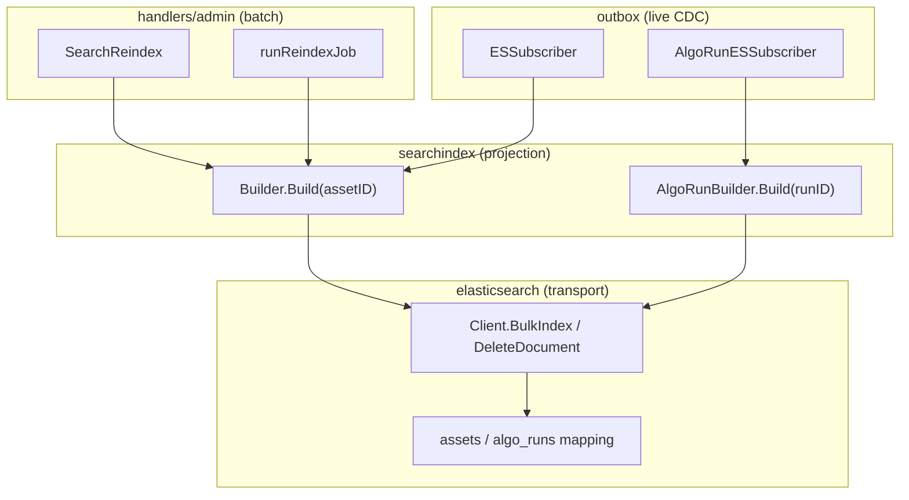
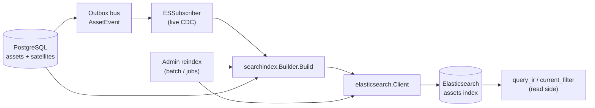
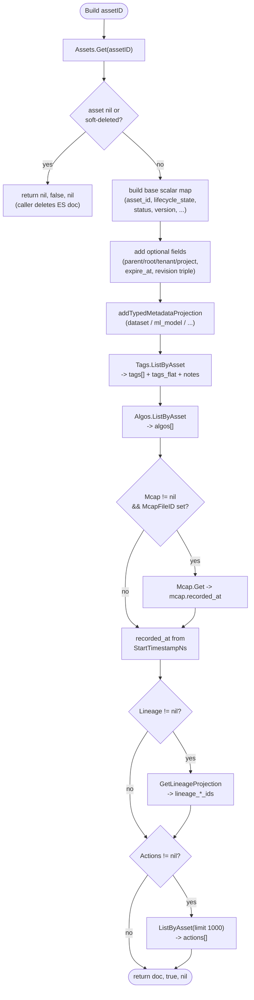
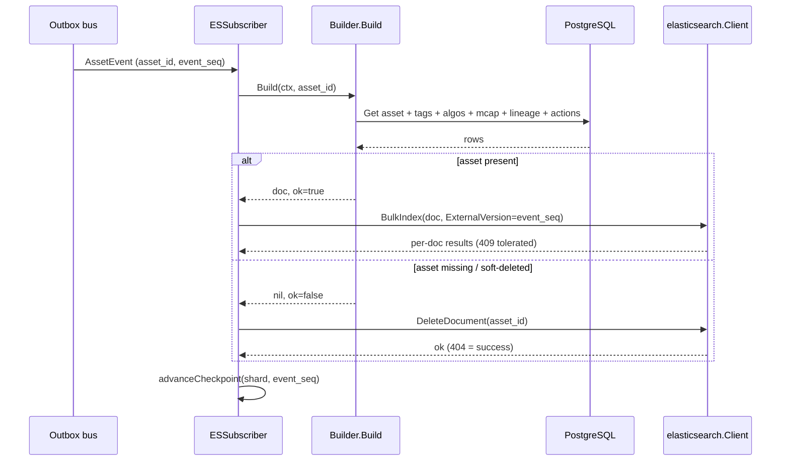
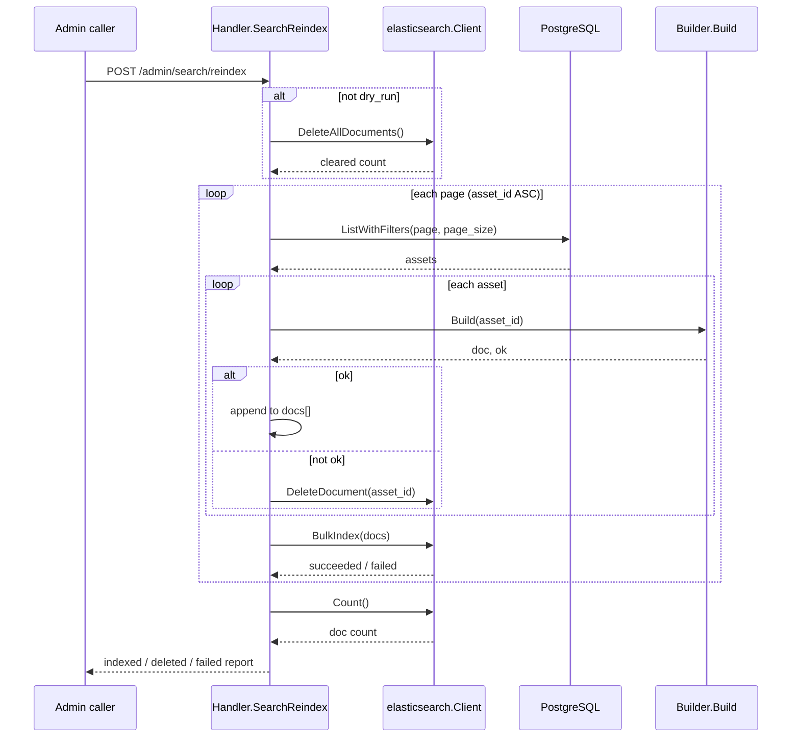
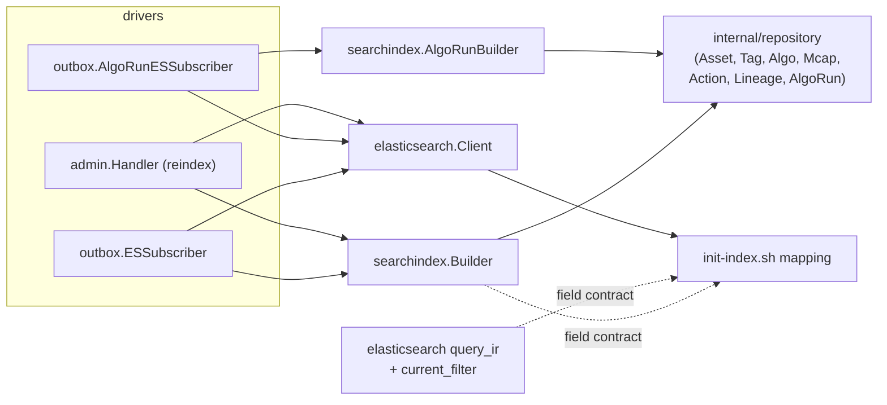

# Search Indexing

<cite>
**Referenced Files in This Document**

- [backend/internal/searchindex/builder.go](file://backend/internal/searchindex/builder.go)
- [backend/internal/searchindex/algo_run_builder.go](file://backend/internal/searchindex/algo_run_builder.go)
- [backend/internal/elasticsearch/client.go](file://backend/internal/elasticsearch/client.go)
- [backend/internal/elasticsearch/current_filter.go](file://backend/internal/elasticsearch/current_filter.go)
- [backend/internal/elasticsearch/query_ir.go](file://backend/internal/elasticsearch/query_ir.go)
- [backend/internal/outbox/es_subscriber.go](file://backend/internal/outbox/es_subscriber.go)
- [backend/internal/outbox/algo_run_subscriber.go](file://backend/internal/outbox/algo_run_subscriber.go)
- [backend/internal/handlers/admin/reindex.go](file://backend/internal/handlers/admin/reindex.go)
- [backend/internal/handlers/admin/reindex_jobs.go](file://backend/internal/handlers/admin/reindex_jobs.go)
- [deploy/local/elasticsearch/init-index.sh](file://deploy/local/elasticsearch/init-index.sh)
</cite>

## Table of Contents
1. [Introduction](#introduction)
2. [Project Structure](#project-structure)
3. [Core Components](#core-components)
4. [Architecture Overview](#architecture-overview)
5. [Detailed Component Analysis](#detailed-component-analysis)
6. [Dependency Analysis](#dependency-analysis)
7. [Performance Considerations](#performance-considerations)
8. [Troubleshooting Guide](#troubleshooting-guide)
9. [Conclusion](#conclusion)
10. [Appendices](#appendices)

## Introduction

Search Indexing is the **projection layer** that turns the canonical PostgreSQL
asset state into the denormalized Elasticsearch documents that power faceted
search, full-text lookup, and analytics. It is the read-model half of the
event/CDC pipeline: where the outbox emits *what changed*, the search index
decides *how that change is shaped* for query time.

The central abstraction is the `searchindex.Builder`. Given an `asset_id` it
loads the asset row plus its satellite projections (tags, latest algo results,
mcap file metadata, lineage edges, actions) and assembles a single ES `_source`
map. The shape of that map is the contract negotiated with the index mapping
defined in `deploy/local/elasticsearch/elasticsearch/init-index.sh`; field names
and types must agree on both sides or queries silently return empty buckets.

Crucially, the same `Builder.Build` method is the **single source of truth** for
the document shape. It is invoked from two very different drivers:

- the **live CDC subscriber** (`outbox.ESSubscriber`), which rebuilds one asset
  per event in near-real-time; and
- the **admin reindex jobs** (`handlers/admin`), which sweep the entire asset
  table to rebuild the index from scratch or reconcile drift.

Because both callers funnel through the same projection function, a live update
and a full reindex produce byte-identical documents — a property the system
relies on for idempotency and drift reconciliation.

**Section sources**
- [backend/internal/searchindex/builder.go](file://backend/internal/searchindex/builder.go#L1-L24)
- [backend/internal/outbox/es_subscriber.go](file://backend/internal/outbox/es_subscriber.go#L25-L41)
- [backend/internal/handlers/admin/reindex.go](file://backend/internal/handlers/admin/reindex.go#L36-L66)

## Project Structure

The indexing concern spans three Go packages plus a deployment script:

- `internal/searchindex/` — the projection logic. `builder.go` projects assets to
  the `assets` index; `algo_run_builder.go` projects algo-run rows to the
  `algo_runs` index. These packages hold **no ES transport** — they only build
  `map[string]any` documents.
- `internal/elasticsearch/` — the transport client and query compiler.
  `client.go` wraps the ES HTTP API (`_bulk`, `_doc`, `_search`, scroll,
  `_delete_by_query`). `query_ir.go` and `current_filter.go` compile read-side
  query IR into ES query bodies; they are the read counterpart that consumes the
  fields the Builder writes.
- `internal/outbox/` — the live subscribers. `es_subscriber.go` and
  `algo_run_subscriber.go` wire a `Builder` to the ES client and drive it from
  the event bus.
- `internal/handlers/admin/` — `reindex.go` (synchronous one-shot reindex) and
  `reindex_jobs.go` (resumable background jobs) drive the same `Builder` over
  full table scans.
- `deploy/local/elasticsearch/init-index.sh` — the authoritative index mapping
  that the projected documents must conform to.

**Diagram sources**
- [backend/internal/searchindex/builder.go](file://backend/internal/searchindex/builder.go#L13-L24)
- [backend/internal/searchindex/algo_run_builder.go](file://backend/internal/searchindex/algo_run_builder.go#L12-L18)
- [backend/internal/outbox/es_subscriber.go](file://backend/internal/outbox/es_subscriber.go#L38-L63)
- [backend/internal/handlers/admin/reindex.go](file://backend/internal/handlers/admin/reindex.go#L19-L34)

**Section sources**
- [backend/internal/searchindex/builder.go](file://backend/internal/searchindex/builder.go#L1-L24)
- [deploy/local/elasticsearch/init-index.sh](file://deploy/local/elasticsearch/init-index.sh#L1-L46)

## Core Components

### Builder

`searchindex.Builder` is a struct of repository handles, not a stateful object.
Each field is a narrow repository interface that supplies one slice of the
projected document:

- `Assets` — the base asset row (required).
- `Tags` — per-asset key/value tags, projected as both nested `tags[]` and flat
  `tags_flat`.
- `Algos` — the latest algo result per algo name, projected as nested `algos[]`.
- `Mcap` — the parent mcap-file metadata (optional; `nil` disables `mcap.*`).
- `Actions` — labeled time-range actions (optional; `nil` disables `actions[]`).
- `Lineage` — upstream/downstream lineage edges (optional; `nil` disables the
  `lineage_*` arrays).

The optional fields encode a deliberate **graceful-degradation** policy: a
caller that has not wired a repository simply omits that projection rather than
failing.

**Section sources**
- [backend/internal/searchindex/builder.go](file://backend/internal/searchindex/builder.go#L13-L20)

### AlgoRunBuilder

`searchindex.AlgoRunBuilder` is the parallel projection for the separate
`algo_runs` index. It holds a single `Runs` repository and maps an `algo_runs`
row into a document with run metadata, summary counters, resource usage, error
fields, and flattened input metadata.

**Section sources**
- [backend/internal/searchindex/algo_run_builder.go](file://backend/internal/searchindex/algo_run_builder.go#L12-L18)

### Elasticsearch Client

`elasticsearch.Client` is the only component that speaks HTTP to the cluster.
The indexing path uses three of its methods: `BulkIndex` (upsert N documents in
one `_bulk` round-trip, optionally with external versioning), `DeleteDocument`
(idempotent single delete, 404 treated as success), and `DeleteAllDocuments`
(clears the index via `_delete_by_query` while preserving the mapping). Reindex
reconciliation additionally uses `ListAllDocumentIDs` and `Count`.

**Section sources**
- [backend/internal/elasticsearch/client.go](file://backend/internal/elasticsearch/client.go#L19-L44)
- [backend/internal/elasticsearch/client.go](file://backend/internal/elasticsearch/client.go#L984-L1120)

### Live subscribers and reindex drivers

The drivers are thin orchestration around `Build`. `ESSubscriber` and
`AlgoRunESSubscriber` consume the event bus; `Handler.SearchReindex` and
`Handler.runReindexJob` page through PostgreSQL. All four follow the same
contract: call `Build`, index when `ok==true`, delete when `ok==false`.

**Section sources**
- [backend/internal/outbox/es_subscriber.go](file://backend/internal/outbox/es_subscriber.go#L116-L163)
- [backend/internal/handlers/admin/reindex.go](file://backend/internal/handlers/admin/reindex.go#L154-L212)

## Architecture Overview

The projection sits between the write model (PostgreSQL, fronted by the outbox)
and the read model (Elasticsearch, fronted by the query compiler). The Builder
is shared; only the *trigger* differs between live and batch flows.

The diagram shows the key invariant: `Build` always re-reads current state from
PostgreSQL. It never trusts the event payload's contents beyond the `asset_id`,
so an event is just a *hint to recompute* — which is what makes at-least-once
delivery and full reindexes interchangeable.

**Diagram sources**
- [backend/internal/searchindex/builder.go](file://backend/internal/searchindex/builder.go#L24-L31)
- [backend/internal/outbox/es_subscriber.go](file://backend/internal/outbox/es_subscriber.go#L116-L125)
- [backend/internal/handlers/admin/reindex.go](file://backend/internal/handlers/admin/reindex.go#L154-L167)

## Detailed Component Analysis

### Building the asset index document

`Build` is the heart of this page. It returns `(doc, ok, err)`. When the asset
is missing or soft-deleted, `ok` is `false` and the caller is expected to delete
the ES document instead of indexing it. Otherwise it assembles `doc` field by
field.

The base scalar block is written unconditionally, then optional fields are added
only when non-empty (`parent_asset_id`, `root_asset_id`, `tenant_id`,
`project_id`, lifecycle timestamps, and the revision triple
`logical_asset_id` / `revision` / `is_current`). After scalars, the satellite
projections are layered in: typed-metadata sub-objects, `tags`/`tags_flat`,
`algos[]`, `mcap`, lineage arrays, and `actions[]`.

Several details matter for query correctness:

- **`lifecycle_state` is the primary facet field**, falling back to the legacy
  `status` string when a row has not yet been backfilled. Both fields are written
  to the document during the dual-write window.
- **`tags_flat` is derived alongside `tags`** in the same loop, and a `notes`
  tag value overrides the `metadata.notes` fallback for the top-level `notes`
  text field.
- **`actions[]` is re-read in full on every projection** (limit 1000). The
  comment notes this is safe precisely because Build is idempotent and CDC is
  at-least-once.
- **Timestamps are formatted as RFC3339 nanos** (`UTC().Format(RFC3339Nano)`),
  and `recorded_at` is additionally derived from the nanosecond
  `start_timestamp_ns` so the `date`-typed field is queryable.

**Diagram sources**
- [backend/internal/searchindex/builder.go](file://backend/internal/searchindex/builder.go#L24-L241)

**Section sources**
- [backend/internal/searchindex/builder.go](file://backend/internal/searchindex/builder.go#L24-L241)

### Typed metadata projection

Beyond the common fields, Build promotes a handful of asset-type-specific
metadata keys into dedicated, strongly-typed sub-objects so they can be filtered
and aggregated rather than living in the opaque `flattened` `metadata` blob.
`addTypedMetadataProjection` switches on `asset_type` and copies known keys via
`copyIfPresent`, emitting the sub-object only if at least one key is present.

The four projected types and their promoted keys are:

| asset_type | doc sub-object | promoted keys |
| --- | --- | --- |
| `dataset` | `dataset` | format, record_count, size_bytes, annotation_status |
| `annotation_result` | `annotation_result` | tool, quality_score, coverage |
| `ml_model` | `ml_model` | framework, architecture, metrics, quantization, artifact_uri |
| `evaluation_report` | `evaluation_report` | model_id, dataset_id, metrics, tool |

Each of these sub-objects has a matching `properties` block in the index mapping
so the promoted keys get the correct ES type.

**Section sources**
- [backend/internal/searchindex/builder.go](file://backend/internal/searchindex/builder.go#L243-L288)
- [deploy/local/elasticsearch/init-index.sh](file://deploy/local/elasticsearch/init-index.sh#L67-L101)

### The index mapping

The mapping in `init-index.sh` is the schema the Builder targets. It is created
once (idempotently — the script deletes and recreates `assets` on re-run) with a
single shard / zero replicas for the local/dev cluster. The field types fall
into a few families that determine query behavior:

```mermaid
graph TB
  ROOT["assets mapping"]
  subgraph "keyword facets / exact filters"
    K1["asset_id, asset_type,\nlifecycle_state, status,\nowner, reviewer, retention_tier"]
  end
  subgraph "numeric / date"
    N1["version, *_timestamp_ns,\nduration_ms (long)"]
    D1["recorded_at, created_at,\nupdated_at, expire_at (date)"]
  end
  subgraph "text (full-text)"
    T1["notes (text),\nowner.text / reviewer.text"]
  end
  subgraph "flattened"
    F1["metadata, tags_flat,\nml_model.metrics"]
  end
  subgraph "object"
    O1["mcap.* (vendor/scene/...)"]
    O2["dataset / annotation_result /\nml_model / evaluation_report"]
  end
  subgraph "nested"
    NT["tags[] (key/value/value_num/...)"]
    NA["algos[] (name/status/result_score/...)"]
    NX["actions[] (labels/confidence/...)"]
  end
  ROOT --> K1
  ROOT --> N1
  ROOT --> D1
  ROOT --> T1
  ROOT --> F1
  ROOT --> O1
  ROOT --> O2
  ROOT --> NT
  ROOT --> NA
  ROOT --> NX
```

The design choices encoded in the mapping header comment are load-bearing:

- Nanosecond time fields are `long` (ES `date` is millisecond-bounded);
  `recorded_at` is a derived ms `date` for `date_histogram` aggregations.
- `tags` is `nested` to preserve the per-tag key/value/source/confidence
  association, with `tags_flat` (`flattened`) for the cheap common-case equality
  filter.
- `algos` is `nested` to support composite multi-algo queries like
  "hand_tracking score>0.8 AND face_blur=ok".
- `mcap.*` denormalizes high-cardinality device/scene fields so search can
  filter without joining PostgreSQL.
- `owner`/`reviewer` are `keyword` with a `.text` multi-field so they can be both
  faceted and full-text matched/highlighted.

**Diagram sources**
- [deploy/local/elasticsearch/init-index.sh](file://deploy/local/elasticsearch/init-index.sh#L48-L188)

**Section sources**
- [deploy/local/elasticsearch/init-index.sh](file://deploy/local/elasticsearch/init-index.sh#L6-L188)

### The live CDC subscriber

`ESSubscriber` binds a `SearchDocBuilder` (the `Build` method, abstracted behind
an interface) to the ES client and consumes the outbox bus. It has two paths:

- **Single-event (`handleData`)** — the legacy path used by PubSub/Kafka
  transports. It unmarshals one `AssetEvent`, calls `Build`, and either deletes
  (when `!ok`) or `BulkIndex`-es a single doc carrying
  `ExternalVersion = ev.EventSeq`.
- **Batched (`handleBatch`)** — enabled when `BatchSize > 1` and the underlying
  subscriber supports `ReceiveBatch`. It coalesces multiple events for the *same*
  asset into a single `Build` (latest `event_seq` wins), then composes one
  `_bulk` request for the upserts and sequential `DeleteDocument` calls for the
  `!ok` assets.

The `ExternalVersion = event_seq` is the idempotency mechanism: ES uses
`version_type=external` so an out-of-order or retried older event cannot
overwrite a newer document (the conflict is counted, not fatal). After each
successful action the subscriber advances a per-shard checkpoint
(`shardForEvent` hashes the asset id with FNV) that powers `consumer_lag`.

**Diagram sources**
- [backend/internal/outbox/es_subscriber.go](file://backend/internal/outbox/es_subscriber.go#L116-L163)
- [backend/internal/elasticsearch/client.go](file://backend/internal/elasticsearch/client.go#L988-L1019)

**Section sources**
- [backend/internal/outbox/es_subscriber.go](file://backend/internal/outbox/es_subscriber.go#L100-L288)

### The algo-run subscriber

`AlgoRunESSubscriber` mirrors the asset subscriber for the separate `algo_runs`
index. It shares the same `EventSubscriber` (the in-memory bus) as the asset
subscriber but filters for `algo_run` events and projects through
`AlgoRunBuilder.Build`. The same `(doc, ok)` delete-or-index contract applies.

**Section sources**
- [backend/internal/outbox/algo_run_subscriber.go](file://backend/internal/outbox/algo_run_subscriber.go#L15-L74)

### The reindex path (shared Builder, batch driver)

The admin handler constructs the very same `searchindex.Builder` in `New`,
wiring all repositories and conditionally attaching `Lineage` when the asset
repository also satisfies `AssetLineageRepository`. `SearchReindex` then drives
it over a full table scan:

1. Unless `dry_run`, clear the index with `DeleteAllDocuments` (preserves the
   mapping).
2. Page through `assets.ListWithFilters(... ORDER BY asset_id ASC ...)`.
3. For each asset, call `Build`; accumulate upserts into a `docs` slice and issue
   `DeleteDocument` for `!ok` assets.
4. Flush each page's `docs` via one `BulkIndex` call, tallying
   succeeded/failed/deleted counts.
5. Report `Count()` as the final ES doc count.

The resumable variant lives in `reindex_jobs.go`. It runs the same scan in a
background goroutine (`runReindexJob`), persisting progress to a
`SearchReindexJob` row so a stopped/crashed job can resume, and exposes
`reconcileReindexJobState` so a stale "running" row is recovered to a terminal
state when polled. It uses the identical `h.indexer.Build` + `BulkIndex` /
`DeleteDocument` calls.

**Diagram sources**
- [backend/internal/handlers/admin/reindex.go](file://backend/internal/handlers/admin/reindex.go#L128-L237)

**Section sources**
- [backend/internal/handlers/admin/reindex.go](file://backend/internal/handlers/admin/reindex.go#L36-L237)
- [backend/internal/handlers/admin/reindex_jobs.go](file://backend/internal/handlers/admin/reindex_jobs.go#L321-L538)

### The read side: where the projected fields are consumed

The fields the Builder writes are only useful because the query compiler reads
them by the same names. `query_ir.go` compiles a `QueryRequest` into an ES search
body: predicates become `term`/`range` clauses, nested paths (`tags.*`,
`algos.*`, `actions.*`) become `nested` queries, and facets map to `terms` aggs
through `facetFieldPath`. `current_filter.go` wraps the query in a
current-revision-only filter that keys off the `is_current` boolean and the
presence of `logical_asset_id` — both of which Build emits only for assets that
carry a `logical_asset_id`. This is the concrete reason the projection and the
mapping must stay in lockstep: a renamed or retyped field breaks the read side
silently.

**Section sources**
- [backend/internal/elasticsearch/query_ir.go](file://backend/internal/elasticsearch/query_ir.go#L10-L174)
- [backend/internal/elasticsearch/current_filter.go](file://backend/internal/elasticsearch/current_filter.go#L5-L29)

## Dependency Analysis

Key relationships:

- `searchindex.Builder` depends only on `internal/repository` interfaces — it has
  no dependency on the ES client, so it is trivially unit-testable with fake
  repositories.
- The drivers depend on both `searchindex` (to build) and `elasticsearch` (to
  transport).
- There is no compile-time link between the Builder and the mapping — the
  contract is *by convention* (field names/types), enforced only at runtime and
  by tests. The same convention binds the read-side query compiler.

**Diagram sources**
- [backend/internal/searchindex/builder.go](file://backend/internal/searchindex/builder.go#L4-L20)
- [backend/internal/handlers/admin/reindex.go](file://backend/internal/handlers/admin/reindex.go#L3-L17)

**Section sources**
- [backend/internal/searchindex/builder.go](file://backend/internal/searchindex/builder.go#L1-L20)
- [backend/internal/outbox/es_subscriber.go](file://backend/internal/outbox/es_subscriber.go#L1-L41)

## Performance Considerations

- **One `_bulk` round-trip per batch.** The batched subscriber's win is HTTP
  amortization, not parallel rebuilds — `Build` is intentionally serial per
  unique asset in v1, with a noted TODO to parallelize via an errgroup if PG read
  latency dominates.
- **Same-asset coalescing.** `handleBatch` dedupes a burst of events for one
  asset to a single `Build`, sending the doc with `ExternalVersion =
  max(event_seq)`. This collapses N rebuilds into one and is safe because Build
  re-reads full state.
- **N satellite reads per document.** Each `Build` issues separate repository
  calls for tags, algos, mcap, lineage, and actions. During a full reindex this
  is an N×(several) query fan-out; the batch driver pages assets (default 200,
  capped 500) to bound memory while letting PostgreSQL batch the scan.
- **`actions[]` re-read with limit 1000.** Assets with very large action sets are
  truncated at 1000 actions per projection.
- **External versioning avoids stale overwrites** without read-before-write,
  keeping the hot CDC path to a single ES write per event.
- **Reconcile via `Count` / `ListAllDocumentIDs`.** These scroll-based scans are
  explicitly intended for audit/reconcile on demo-sized indices, not hot paths.

**Section sources**
- [backend/internal/outbox/es_subscriber.go](file://backend/internal/outbox/es_subscriber.go#L165-L255)
- [backend/internal/searchindex/builder.go](file://backend/internal/searchindex/builder.go#L198-L238)
- [backend/internal/handlers/admin/reindex.go](file://backend/internal/handlers/admin/reindex.go#L114-L117)

## Troubleshooting Guide

- **Empty facet buckets.** Almost always a field-name/type mismatch between the
  document and the mapping. Facet fields are stored as plain `keyword` (no
  `.keyword` multi-field); `keywordAggField` keeps the agg path aligned with the
  live mapping. Confirm `Build` emits the field with the same name the mapping
  declares.
- **A deleted asset still appears in search.** Build returns `ok=false` for
  missing/soft-deleted assets and the driver issues `DeleteDocument`. If the doc
  lingers, check that the delete event reached the subscriber and that the asset
  is actually soft-deleted in PostgreSQL (Build keys off `Assets.Get` returning
  nil).
- **Stale document wins after a retry.** Verify the index was created with the
  mapping and that writes carry `ExternalVersion`. A 409 conflict is *expected*
  and tolerated — it means an older `event_seq` was correctly rejected; it is
  counted in `OutboxSubscriberESErrorsTotal{reason="conflict"}`, not an error.
- **Reindex reports `elasticsearch_doc_count = -1`.** `Count` failed after the
  scan; the reindex itself may still have succeeded. Re-run `Count` or check ES
  health.
- **Non-current revisions leaking into results.** That is the read side
  (`current_filter.go`), but it depends on Build emitting `is_current` /
  `logical_asset_id`; legacy rows without `logical_asset_id` are intentionally
  always visible.
- **Reindex job stuck "running".** Poll the job; `reconcileReindexJobState`
  recovers a stale running row to a terminal state on read.

**Section sources**
- [backend/internal/elasticsearch/client.go](file://backend/internal/elasticsearch/client.go#L394-L399)
- [backend/internal/outbox/es_subscriber.go](file://backend/internal/outbox/es_subscriber.go#L152-L160)
- [backend/internal/elasticsearch/current_filter.go](file://backend/internal/elasticsearch/current_filter.go#L5-L29)
- [backend/internal/handlers/admin/reindex_jobs.go](file://backend/internal/handlers/admin/reindex_jobs.go#L54-L130)

## Conclusion

Search indexing centralizes the asset → ES document mapping in a single
`searchindex.Builder.Build`, deliberately shared between the live CDC subscriber
and the batch reindex jobs. Because Build always recomputes from PostgreSQL and
the index document is keyed by `asset_id` with external versioning, a single
event, a coalesced batch, and a full reindex all converge to the same document —
the foundation for idempotent CDC and drift reconciliation. The document shape is
a by-convention contract with the `assets` mapping in `init-index.sh` and with
the read-side query compiler; keeping field names and types aligned across those
three places is the system's central correctness invariant.

## Appendices

### Index families (assets mapping)

| ES type | fields (selection) | purpose |
| --- | --- | --- |
| keyword | asset_id, asset_type, lifecycle_state, status, owner, reviewer, retention_tier, *_id | exact filters / facets |
| long | version, start/end_timestamp_ns, duration_ms | numeric range (ns time) |
| date | recorded_at, created_at, updated_at, expire_at, last_delivered_at | date histograms |
| text | notes, owner.text, reviewer.text | full-text + highlight |
| flattened | metadata, tags_flat, ml_model.metrics | cheap equality on arbitrary keys |
| object | mcap.*, dataset, annotation_result, ml_model, evaluation_report | typed sub-documents |
| nested | tags, algos, actions | per-item association queries |

### Builder repository fields

| field | repository | projected output | optional |
| --- | --- | --- | --- |
| Assets | AssetRepository | base scalars + revision triple | no |
| Tags | AssetTagRepository | tags[] + tags_flat + notes | no |
| Algos | AssetAlgoLatestRepository | algos[] | no |
| Mcap | McapFileRepository | mcap.recorded_at | yes (nil disables) |
| Actions | ActionRepository | actions[] | yes (nil disables) |
| Lineage | AssetLineageRepository | lineage_upstream/downstream/relation | yes (nil disables) |

### Build return contract

| return | meaning | driver action |
| --- | --- | --- |
| `doc, true, nil` | asset present | `BulkIndex` upsert |
| `nil, false, nil` | asset missing / soft-deleted | `DeleteDocument` |
| `nil, false, err` | projection error | propagate; relay retries (live) / tally failed (reindex) |

**Section sources**
- [deploy/local/elasticsearch/init-index.sh](file://deploy/local/elasticsearch/init-index.sh#L48-L188)
- [backend/internal/searchindex/builder.go](file://backend/internal/searchindex/builder.go#L13-L24)
